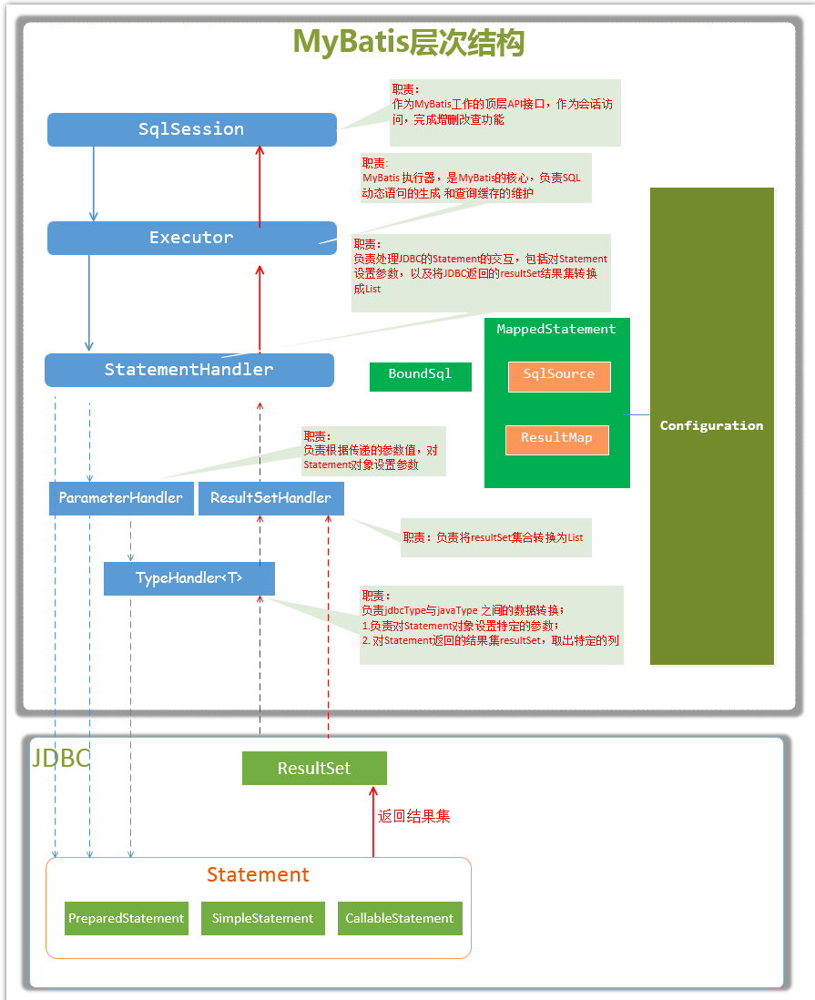

<!-- START doctoc generated TOC please keep comment here to allow auto update -->
<!-- DON'T EDIT THIS SECTION, INSTEAD RE-RUN doctoc TO UPDATE -->
**目录**

- [1、Mybatis原理分析](#1mybatis%E5%8E%9F%E7%90%86%E5%88%86%E6%9E%90)
  - [1.1、MyBatis的主要成员](#11mybatis%E7%9A%84%E4%B8%BB%E8%A6%81%E6%88%90%E5%91%98)
  - [1.2、MyBatis的初始化](#12mybatis%E7%9A%84%E5%88%9D%E5%A7%8B%E5%8C%96)
  - [1.3、SqlSession](#13sqlsession)
- [2、Mapper接口是怎么定位到Mapper.xml](#2mapper%E6%8E%A5%E5%8F%A3%E6%98%AF%E6%80%8E%E4%B9%88%E5%AE%9A%E4%BD%8D%E5%88%B0mapperxml)
- [参考资料](#%E5%8F%82%E8%80%83%E8%B5%84%E6%96%99)

<!-- END doctoc generated TOC please keep comment here to allow auto update -->


# 1、Mybatis原理分析

## 1.1、MyBatis的主要成员

- Configuration：MyBatis所有的配置信息都保存在Configuration对象之中，配置文件中的大部分配置都会存储到该类中
- SqlSession：作为MyBatis工作的主要顶层API，表示和数据库交互时的会话，完成必要数据库增删改查功能。如果多个请求同一个事务中，那么多个请求都在共用一个SqlSession，反之每个请求都会创建一个SqlSession
- Executor：MyBatis执行器，是MyBatis 调度的核心，负责SQL语句的生成和查询缓存的维护
- StatementHandler：封装了JDBC Statement操作，负责对JDBC statement 的操作，如设置参数等。
- ParameterHandler：负责对用户传递的参数转换成JDBC Statement 所对应的数据类型
- ResultSetHandler：负责将JDBC返回的ResultSet结果集对象转换成List类型的集合
- TypeHandler：负责java数据类型和jdbc数据类型(也可以说是数据表列类型)之间的映射和转换
- MappedStatement：MappedStatement维护一条`<select|update|delete|insert>`节点的封装
- SqlSource：负责根据用户传递的parameterObject，动态地生成SQL语句，将信息封装到BoundSql对象中，并返回
- BoundSql：表示动态生成的SQL语句以及相应的参数信息

以上主要成员在一次数据库操作中基本都会涉及，在SQL操作中重点需要关注的是SQL参数什么时候被设置和结果集怎么转换为JavaBean对象的，这两个过程正好对应`StatementHandler`和`ResultSetHandler`类中的处理逻辑



## 1.2、MyBatis的初始化

MyBatis的初始化的过程其实就是解析配置文件和初始化Configuration的过程，MyBatis的初始化过程可用以下几行代码来表述：

```java
String resource = "mybatis.xml";
// 加载mybatis的配置文件（它也加载关联的映射文件）
InputStream inputStream = null;
try {
    inputStream = Resources.getResourceAsStream(resource);
} catch (IOException e) {
    e.printStackTrace();
}
// 构建sqlSession的工厂
sessionFactory = new SqlSessionFactoryBuilder().build(inputStream);
```

## 1.3、SqlSession

SqlSession是Mybatis工作的最顶层API会话接口，所有的数据库操作都经由它来实现，由于它就是一个会话，即一个SqlSession应该仅存活于一个业务请求中，也可以说一个SqlSession对应这一次数据库会话，它不是永久存活的，每次访问数据库时都需要创建它；

因此，SqlSession并不是线程安全，每个线程都应该有它自己的 SqlSession 实例，千万不能将一个SqlSession搞成单例形式，或者静态域和实例变量的形式都会导致SqlSession出现事务问题，这也就是为什么多个请求同一个事务中会共用一个SqlSession会话的原因。我们从SqlSession的创建过程来说明这点：
- 从Configuration配置类中拿到Environment数据源；
- 从数据源中获取TransactionFactory和DataSource，并创建一个Transaction连接管理对象；
- 创建Executor对象（SqlSession只是所有操作的门面，真正要干活的是Executor，它封装了底层JDBC所有的操作细节）；
- 创建SqlSession会话。

每次创建一个SqlSession会话，都会伴随创建一个专属SqlSession的连接管理对象，如果SqlSession共享，就会出现事务问题。

从源码角度去分析：
- `org.mybatis.spring.SqlSessionTemplate`
  ```java
  public SqlSessionTemplate(SqlSessionFactory sqlSessionFactory, ExecutorType executorType, PersistenceExceptionTranslator exceptionTranslator) {
    ...
    this.sqlSessionFactory = sqlSessionFactory;
    this.executorType = executorType;
    this.exceptionTranslator = exceptionTranslator;
    this.sqlSessionProxy = (SqlSession) newProxyInstance(SqlSessionFactory.class.getClassLoader(),new Class[] { SqlSession.class }, new SqlSessionInterceptor());
  }
  ```
  这个是创建SqlSessionTemplate的最终构造方法，可以看出sqlSessionTemplate中用到了SqlSession，是SqlSessionInterceptor实现的一个动态代理类；

- `org.mybatis.spring.SqlSessionUtils#getSqlSession`：
  ```java
  public static SqlSession getSqlSession(SqlSessionFactory sessionFactory, ExecutorType executorType, PersistenceExceptionTranslator exceptionTranslator) {
    SqlSessionHolder holder = (SqlSessionHolder) TransactionSynchronizationManager.getResource(sessionFactory);
    SqlSession session = sessionHolder(executorType, holder);
    if (session != null) {
      return session;
    }
    if (LOGGER.isDebugEnabled()) {
      LOGGER.debug("Creating a new SqlSession");
    }
    session = sessionFactory.openSession(executorType);
    registerSessionHolder(sessionFactory, executorType, exceptionTranslator, session);
    return session;
  }
  ```
  在这个方法当中，首先是从TransactionSynchronizationManager（以下称当前线程事务管理器）获取当前线程threadLocal是否有SqlSessionHolder，如果有就从SqlSessionHolder取出当前SqlSession，如果当前线程threadLocal没有SqlSessionHolder，就从sessionFactory中创建一个SqlSession，具体的创建步骤上面已经说过了，接着注册会话到当前线程threadLocal中


# 2、Mapper接口是怎么定位到Mapper.xml

- 文件：mybatis-spring-1.2.xsd
```xml
<xsd:element name="scan">
    <xsd:annotation>
      <xsd:documentation>
        <![CDATA[
          Searches recursively starting from a base package for interfaces and registers them as MapperFactoryBeans.
          Note that only interfaces with at least one method will be registered; concrete classes will be ignored.
        ]]>
      </xsd:documentation>
    </xsd:annotation>
    <xsd:complexType>
      <xsd:attribute name="base-package" type="xsd:string" use="required">
        <xsd:annotation>
          <xsd:documentation>
            <![CDATA[
              The comma-separated list of packages to scan for annotated components.
            ]]>
          </xsd:documentation>
        </xsd:annotation>
      </xsd:attribute>
```
Spring 会扫描 basePackage 下的所有Mapper接口并注册为MapperFactoryBean，如下配置：`@MapperScan(basePackages = "com.best.rms.erp.*.dao")`

- MapperFactoryBean

    ```public class MapperFactoryBean<T> extends SqlSessionDaoSupport implements FactoryBean<T>```

    - MapperFactoryBean 实现了 Spring 的 FactoryBean 接口，可见MapperFactoryBean 是通过 FactoryBean 接口中定义的 getObject 方法来获取对应的Mapper对象的

    - MapperFactoryBean 还继承了SqlSessionDaoSupport，需要注入生产SqlSession 的 sqlSessionFactory对象

        MapperScannerConfigurer 配置中的sqlSessionFactoryBeanName属性 ，在做多数据源的时候，需要指定不同的SqlSessionFactoryBean，这样Spring 在注册 MapperFactoryBean 的时候会使用不同的 SqlSessionFactory 来生成 SqlSession；

- `@Autowired Mapper`

    ```java
    // MapperFactoryBean中getObject方法
    public T getObject() throws Exception {
      return this.getSqlSession().getMapper(this.mapperInterface);
    }
    ```

    MapperFactoryBean会从它的getObject方法中获取对应的Mapper接口，而getObject内部还是通过我们注入的属性调用SqlSession接口的getMapper(Mapper接口)方法来返回对应的Mapper接口的。这样就通过把SqlSessionFactory和相应的Mapper接口交给Spring管理实现了Mybatis跟Spring的整合


# 参考资料

- [MyBatis实现原理](https://www.cnblogs.com/luoxn28/p/6417892.html)
- [Mybatis-SqlSession原理分析](https://mp.weixin.qq.com/s/tTTLDOoqPfqHJLW12Zdo6A)

