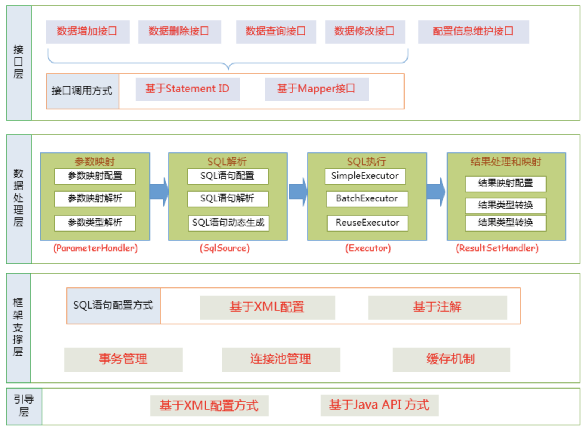
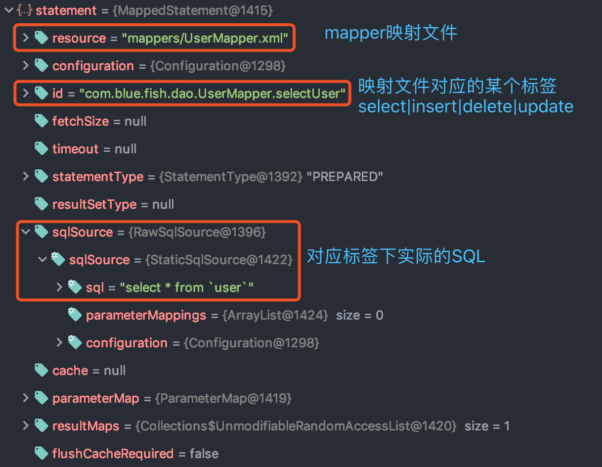
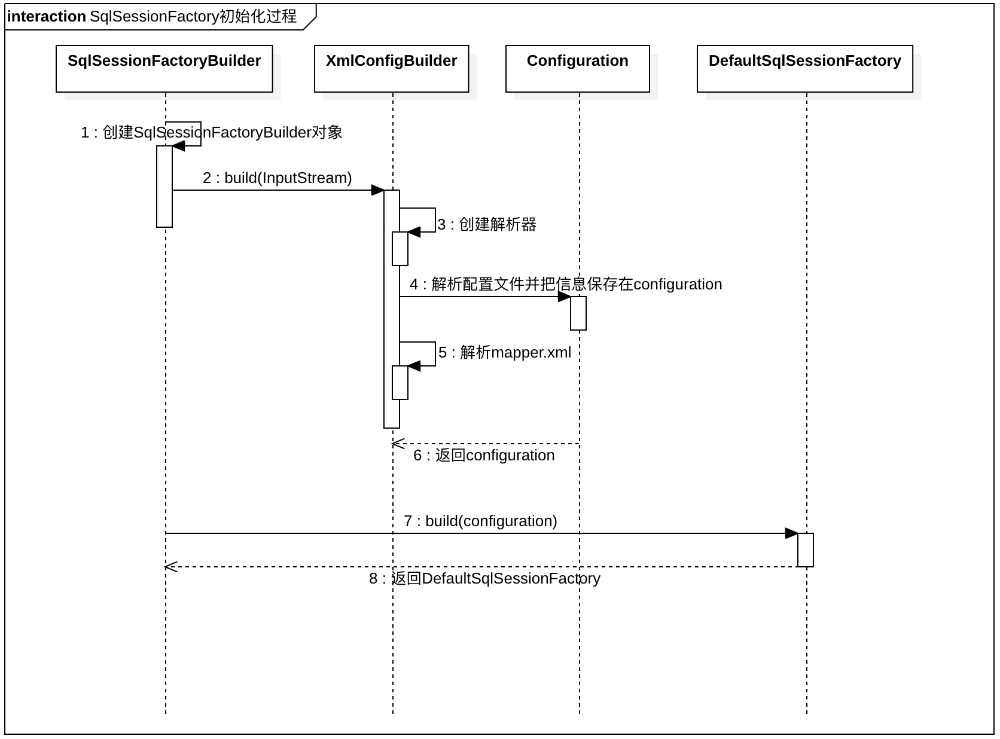
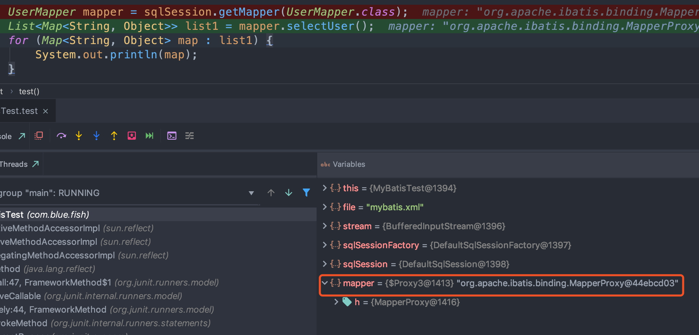
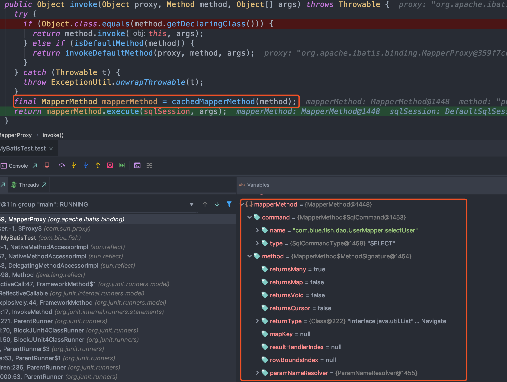

# 1、Mybatis源码概述

MyBatis的主要成员

- Configuration：MyBatis所有的配置信息都保存在Configuration对象之中，配置文件中的大部分配置都会存储到该类中
- SqlSession：作为MyBatis工作的主要顶层API，表示和数据库交互时的会话，完成必要数据库增删改查功能。如果多个请求同一个事务中，那么多个请求都在共用一个SqlSession，反之每个请求都会创建一个SqlSession
- Executor：MyBatis执行器，是MyBatis 调度的核心，负责SQL语句的生成和查询缓存的维护
- StatementHandler：封装了JDBC Statement操作，负责对JDBC statement 的操作，如设置参数等。处理SQL预编译
- ParameterHandler：负责对用户传递的参数转换成JDBC Statement 所对应的数据类型，设置预编译参数
- ResultSetHandler：负责将JDBC返回的ResultSet结果集对象转换成List类型的集合
- TypeHandler：负责java数据类型和jdbc数据类型(也可以说是数据表列类型)之间的映射和转换
- MappedStatement：MappedStatement维护一条`<select|update|delete|insert>`节点详细信息的封装，
- SqlSource：负责根据用户传递的parameterObject，动态地生成SQL语句，将信息封装到BoundSql对象中，并返回
- BoundSql：表示动态生成的SQL语句以及相应的参数信息

以上主要成员在一次数据库操作中基本都会涉及，在SQL操作中重点需要关注的是SQL参数什么时候被设置和结果集怎么转换为JavaBean对象的，这两个过程正好对应`StatementHandler`和`ResultSetHandler`类中的处理逻辑

整体架构：



# 2、SqlSessionFactory

## 2.1、初始化过程

`SqlSessionFactory`的初始化的过程其实就是解析配置文件和初始化Configuration的过程，MyBatis的初始化过程可用以下几行代码来表述：
```java
String resource = "mybatis.xml";
// 加载mybatis的配置文件（它也加载关联的映射文件）
InputStream inputStream = null;
try {
    inputStream = Resources.getResourceAsStream(resource);
} catch (IOException e) {
    e.printStackTrace();
}
// 构建sqlSession的工厂
sessionFactory = new SqlSessionFactoryBuilder().build(inputStream);
```
SqlSessionFactory，实际上使用的是 DefaultSqlSessionFactory，该类中有一个 configuration 成员变量
```java
public SqlSessionFactory build(InputStream inputStream, String environment, Properties properties) {
    try {
        // 构建xml配置构造类
        XMLConfigBuilder parser = new XMLConfigBuilder(inputStream, environment, properties);
        return build(parser.parse());
        ...
    }
}
public SqlSessionFactory build(Configuration config) {
    return new DefaultSqlSessionFactory(config);
}
```
XMLConfigBuilder
```java
public Configuration parse() {
    // 解析mybatis的配置文件
    parseConfiguration(parser.evalNode("/configuration"));
    return configuration;
}
private void parseConfiguration(XNode root) {
    try {
        propertiesElement(root.evalNode("properties"));
        Properties settings = settingsAsProperties(root.evalNode("settings"));
        loadCustomVfs(settings);
        typeAliasesElement(root.evalNode("typeAliases"));
        pluginElement(root.evalNode("plugins"));
        objectFactoryElement(root.evalNode("objectFactory"));
        objectWrapperFactoryElement(root.evalNode("objectWrapperFactory"));
        reflectorFactoryElement(root.evalNode("reflectorFactory"));
        settingsElement(settings);
        // 环境配置，数据库连接参数等
        environmentsElement(root.evalNode("environments"));
        databaseIdProviderElement(root.evalNode("databaseIdProvider"));
        typeHandlerElement(root.evalNode("typeHandlers"));
        // 配置Mapperxml文件，其会将所有的Mapper.xml配置文件解析为MappedStatement
        mapperElement(root.evalNode("mappers"));
    }
}
```
上面解析的所有配置都会设置到configuration成员变量中，该变量在BaseBuilder定义的，所有BaseBuilder的子类都可以使用 configuration 属性；

## 2.2、environment配置

mybatis的配置文件中对应的environment为：
```xml
<environments default="test">
    <environment id="development">
        <transactionManager type="JDBC"/>
        <dataSource type="POOLED">
            <property name="driver" value="${driver}"/>
            <property name="url" value="${url}"/>
            <property name="username" value="${username}"/>
            <property name="password" value="${password}"/>
        </dataSource>
    </environment>
    <environment id="test">
        <transactionManager type="JDBC"/>
        <dataSource type="POOLED">
            <property name="driver" value="${driver}"/>
            <property name="url" value="${url}"/>
            <property name="username" value="${username}"/>
            <property name="password" value="${password}"/>
        </dataSource>
    </environment>
</environments>
```
对这段配置的额解析过程：
```java
// 主要是数据源等信息配置解析
private void environmentsElement(XNode context) throws Exception {
    if (context != null) {
        if (environment == null) {
            environment = context.getStringAttribute("default");
        }
        for (XNode child : context.getChildren()) {
            String id = child.getStringAttribute("id");
            // 判断是否为environments节点上default属性指定的environment，如果是对其进行数据源设置
            if (isSpecifiedEnvironment(id)) {
                // transactionManager 节点
                TransactionFactory txFactory = transactionManagerElement(child.evalNode("transactionManager"));
                // dataSource节点，获取到数据源工厂，通过数据源工厂获取到数据源信息
                DataSourceFactory dsFactory = dataSourceElement(child.evalNode("dataSource"));
                DataSource dataSource = dsFactory.getDataSource();
                Environment.Builder environmentBuilder = new Environment.Builder(id).transactionFactory(txFactory).dataSource(dataSource);
                configuration.setEnvironment(environmentBuilder.build());
            }
        }
    }
}
```
数据源工作是通过配置的datasource节点上的 type属性来获取具体的实现类的，其有三类：
- JNDI：JndiDataSourceFactory
- POOLED：PooledDataSourceFactory
- UNPOOLED：UnpooledDataSourceFactory

其都是通过TypeAliasRegistry注册为别名：
```java
public Configuration() {
    // 事务
    typeAliasRegistry.registerAlias("JDBC", JdbcTransactionFactory.class);
    typeAliasRegistry.registerAlias("MANAGED", ManagedTransactionFactory.class);
    // 数据源工厂
    typeAliasRegistry.registerAlias("JNDI", JndiDataSourceFactory.class);
    typeAliasRegistry.registerAlias("POOLED", PooledDataSourceFactory.class);
    typeAliasRegistry.registerAlias("UNPOOLED", UnpooledDataSourceFactory.class);
    ...
}
```

## 2.3、MappedStatement

UserMapper.xml
```xml
<!DOCTYPE mapper PUBLIC "-//mybatis.org//DTD Mapper 3.0//EN" "http://mybatis.org/dtd/mybatis-3-mapper.dtd">
<!-- mapper:根标签，namespace：命名空间，随便写，一般保证命名空间唯一 -->
<mapper namespace="com.blue.fish.dao.UserMapper">
    <!-- statement，内容：sql语句。id：唯一标识，随便写，在同一个命名空间下保持唯一 resultType：sql语句查询结果集的封装类型,tb_user即为数据库中的表
     -->
    <select id="selectUser" resultType="java.util.Map">
      <![CDATA[select * from `user`]]>
   </select>
    <insert id="insert" parameterType="com.blue.fish.model.User" useGeneratedKeys="true">
      insert into user (username, password) values(#{username}, #{password})
   </insert>
    <sql id="where_sql">
        where username like '%aaa%'
    </sql>
</mapper>
```
上述配置的解析，会对xml文件里的 insert|select|update|delete 标签进行解析
```java
private void mapperElement(XNode parent) throws Exception {
    // 一般都是通过命名空间来查找的
    if (parent != null) {
        for (XNode child : parent.getChildren()) {
            if ("package".equals(child.getName())) {
                String mapperPackage = child.getStringAttribute("name");
                configuration.addMappers(mapperPackage);
            } else {
                String resource = child.getStringAttribute("resource");
                String url = child.getStringAttribute("url");
                String mapperClass = child.getStringAttribute("class");
                if (resource != null && url == null && mapperClass == null) {
                    ErrorContext.instance().resource(resource);
                    InputStream inputStream = Resources.getResourceAsStream(resource);
                    XMLMapperBuilder mapperParser = new XMLMapperBuilder(inputStream, configuration, resource, configuration.getSqlFragments());
                    mapperParser.parse();
                } else if (resource == null && url != null && mapperClass == null) {
                    ErrorContext.instance().resource(url);
                    InputStream inputStream = Resources.getUrlAsStream(url);
                    XMLMapperBuilder mapperParser = new XMLMapperBuilder(inputStream, configuration, url, configuration.getSqlFragments());
                    mapperParser.parse();
                } else if (resource == null && url == null && mapperClass != null) {
                    Class<?> mapperInterface = Resources.classForName(mapperClass);
                    configuration.addMapper(mapperInterface);
                } else {
                  throw new BuilderException("A mapper element may only specify a url, resource or class, but not more than one.");
                }
            }
        }
    }
}
```
MappedStatement包含的具体信息：

 

一句话：每个MappedStatement代表一个增删改查的详细信息

## 2.4、configuration默认属性设置

配置文件未配置的属性
```java
private void settingsElement(Properties props) throws Exception {
    configuration.setAutoMappingBehavior(AutoMappingBehavior.valueOf(props.getProperty("autoMappingBehavior", "PARTIAL")));
    configuration.setAutoMappingUnknownColumnBehavior(AutoMappingUnknownColumnBehavior.valueOf(props.getProperty("autoMappingUnknownColumnBehavior", "NONE")));
    // 没有配置缓存的话，默认是 开启缓存
    configuration.setCacheEnabled(booleanValueOf(props.getProperty("cacheEnabled"), true));
    configuration.setProxyFactory((ProxyFactory) createInstance(props.getProperty("proxyFactory")));
    configuration.setLazyLoadingEnabled(booleanValueOf(props.getProperty("lazyLoadingEnabled"), false));
    configuration.setAggressiveLazyLoading(booleanValueOf(props.getProperty("aggressiveLazyLoading"), false));
    configuration.setMultipleResultSetsEnabled(booleanValueOf(props.getProperty("multipleResultSetsEnabled"), true));
    configuration.setUseColumnLabel(booleanValueOf(props.getProperty("useColumnLabel"), true));
    configuration.setUseGeneratedKeys(booleanValueOf(props.getProperty("useGeneratedKeys"), false));
    // 执行器
    configuration.setDefaultExecutorType(ExecutorType.valueOf(props.getProperty("defaultExecutorType", "SIMPLE")));
    configuration.setDefaultStatementTimeout(integerValueOf(props.getProperty("defaultStatementTimeout"), null));
    configuration.setDefaultFetchSize(integerValueOf(props.getProperty("defaultFetchSize"), null));
    configuration.setMapUnderscoreToCamelCase(booleanValueOf(props.getProperty("mapUnderscoreToCamelCase"), false));
    configuration.setSafeRowBoundsEnabled(booleanValueOf(props.getProperty("safeRowBoundsEnabled"), false));
    configuration.setLocalCacheScope(LocalCacheScope.valueOf(props.getProperty("localCacheScope", "SESSION")));
    configuration.setJdbcTypeForNull(JdbcType.valueOf(props.getProperty("jdbcTypeForNull", "OTHER")));
    configuration.setLazyLoadTriggerMethods(stringSetValueOf(props.getProperty("lazyLoadTriggerMethods"), "equals,clone,hashCode,toString"));
    configuration.setSafeResultHandlerEnabled(booleanValueOf(props.getProperty("safeResultHandlerEnabled"), true));
    configuration.setDefaultScriptingLanguage(resolveClass(props.getProperty("defaultScriptingLanguage")));
    @SuppressWarnings("unchecked")
    Class<? extends TypeHandler> typeHandler = (Class<? extends TypeHandler>)resolveClass(props.getProperty("defaultEnumTypeHandler"));
    configuration.setDefaultEnumTypeHandler(typeHandler);
    configuration.setCallSettersOnNulls(booleanValueOf(props.getProperty("callSettersOnNulls"), false));
    configuration.setUseActualParamName(booleanValueOf(props.getProperty("useActualParamName"), true));
    configuration.setReturnInstanceForEmptyRow(booleanValueOf(props.getProperty("returnInstanceForEmptyRow"), false));
    configuration.setLogPrefix(props.getProperty("logPrefix"));
    @SuppressWarnings("unchecked")
    Class<? extends Log> logImpl = (Class<? extends Log>)resolveClass(props.getProperty("logImpl"));
    configuration.setLogImpl(logImpl);
    configuration.setConfigurationFactory(resolveClass(props.getProperty("configurationFactory")));
  }
```

## 2.5、流程图



总结：解析文件的每一个信息保存在Configuration中，返回包含Configuration的DefaultSqlSessionFactory

## 2.6、Spring中SqlSessionFactory初始化

# 3、SqlSession

SqlSession是Mybatis工作的最顶层API会话接口，所有的数据库操作都经由它来实现，由于它就是一个会话，即一个SqlSession应该仅存活于一个业务请求中，也可以说一个SqlSession对应这一次数据库会话，它不是永久存活的，每次访问数据库时都需要创建它；

## 3.1、获取SqlSession过程

SqlSession并不是线程安全，每个线程都应该有它自己的 SqlSession 实例，千万不能将一个SqlSession搞成单例形式，或者静态域和实例变量的形式都会导致SqlSession出现事务问题，这也就是为什么多个请求同一个事务中会共用一个SqlSession会话的原因。我们从SqlSession的创建过程来说明这点：
- 从Configuration配置类中拿到Environment数据源；
- 从数据源中获取TransactionFactory和DataSource，并创建一个Transaction连接管理对象；
- 创建Executor对象（SqlSession只是所有操作的门面，真正要干活的是Executor，它封装了底层JDBC所有的操作细节）；是否开启二级缓存、是否有拦截器都会对Executor进行一层包装；
- 创建SqlSession会话。

```java
// 获取SqlSession
SqlSession sqlSession = sqlSessionFactory.openSession();
// DefaultSqlSessionFactory.openSession()
public SqlSession openSession() {
    // 获取默认的执行器Executor，false表示不自动提交事务
    return openSessionFromDataSource(configuration.getDefaultExecutorType(), null, false);
}
private SqlSession openSessionFromDataSource(ExecutorType execType, TransactionIsolationLevel level, boolean autoCommit) {
    Transaction tx = null;
    try {
        // 获取环境信息
        final Environment environment = configuration.getEnvironment();
        // 从环境配置信息中获取事务工厂，在前面解析environments标签中，有个tx属性，其配置的就是事务工厂
        final TransactionFactory transactionFactory = getTransactionFactoryFromEnvironment(environment);
        // 通过事务工厂创建事务
        tx = transactionFactory.newTransaction(environment.getDataSource(), level, autoCommit);
        // 创建执行器
        final Executor executor = configuration.newExecutor(tx, execType);
        return new DefaultSqlSession(configuration, executor, autoCommit);
    } catch (Exception e) {
        closeTransaction(tx); // may have fetched a connection so lets call close()
        throw ExceptionFactory.wrapException("Error opening session.  Cause: " + e, e);
    } finally {
        ErrorContext.instance().reset();
    }
}

// Configuration
public Executor newExecutor(Transaction transaction, ExecutorType executorType) {
    // 获取具体的执行器，其有三种类型：SIMPLE、BATCH、REUSE
    executorType = executorType == null ? defaultExecutorType : executorType;
    executorType = executorType == null ? ExecutorType.SIMPLE : executorType;
    Executor executor;
    // 根据具体的执行器类型创建Executor
    if (ExecutorType.BATCH == executorType) {
        executor = new BatchExecutor(this, transaction);
    } else if (ExecutorType.REUSE == executorType) {
        executor = new ReuseExecutor(this, transaction);
    } else {
        executor = new SimpleExecutor(this, transaction);
    }
    // 如果开启了二级缓存，会将创建的Executor包装一下，由于 cacheEnabled 默认是true，所以实际使用的是 CachingExecutor
    if (cacheEnabled) {
        executor = new CachingExecutor(executor);
    }
    // 会将所有插件通过拦截器链包装Executor
    executor = (Executor) interceptorChain.pluginAll(executor);
    return executor;
}
```
每次创建一个SqlSession会话，都会伴随创建一个专属SqlSession的连接管理对象，如果SqlSession共享，就会出现事务问题。

## 3.2、Spring中SqlSession获取

从源码角度去分析：
- `org.mybatis.spring.SqlSessionTemplate`
    ```java
    public SqlSessionTemplate(SqlSessionFactory sqlSessionFactory, ExecutorType executorType, PersistenceExceptionTranslator exceptionTranslator) {
      ...
      this.sqlSessionFactory = sqlSessionFactory;
      this.executorType = executorType;
      this.exceptionTranslator = exceptionTranslator;
      this.sqlSessionProxy = (SqlSession) newProxyInstance(SqlSessionFactory.class.getClassLoader(),new Class[] { SqlSession.class }, new SqlSessionInterceptor());
    }
    ```
    这个是创建SqlSessionTemplate的最终构造方法，可以看出sqlSessionTemplate中用到了SqlSession，是SqlSessionInterceptor实现的一个动态代理类；

- `org.mybatis.spring.SqlSessionUtils#getSqlSession`：
    ```java
    public static SqlSession getSqlSession(SqlSessionFactory sessionFactory, ExecutorType executorType, PersistenceExceptionTranslator exceptionTranslator) {
      SqlSessionHolder holder = (SqlSessionHolder) TransactionSynchronizationManager.getResource(sessionFactory);
      SqlSession session = sessionHolder(executorType, holder);
      if (session != null) {
        return session;
      }
      if (LOGGER.isDebugEnabled()) {
        LOGGER.debug("Creating a new SqlSession");
      }
      session = sessionFactory.openSession(executorType);
      registerSessionHolder(sessionFactory, executorType, exceptionTranslator, session);
      return session;
    }
    ```
    在这个方法当中，首先是从TransactionSynchronizationManager（以下称当前线程事务管理器）获取当前线程threadLocal是否有SqlSessionHolder，如果有就从SqlSessionHolder取出当前SqlSession，如果当前线程threadLocal没有SqlSessionHolder，就从sessionFactory中创建一个SqlSession，具体的创建步骤上面已经说过了，接着注册会话到当前线程threadLocal中


# 4、Mapper接口运行原理

获取到SqlSession之后，需要获取到Mapper，调用sqlSession的getMapper方法，获取到Mapper，然后调用具体Mapper运行
```java
UserMapper mapper = sqlSession.getMapper(UserMapper.class);
List<Map<String, Object>> list1 = mapper.selectUser();
```

## 4.1、获取Mapper

- **sqlSession的实现是DefaultSqlSession，其getMapper方法**
    ```java
    // DefaultSqlSession
    public <T> T getMapper(Class<T> type) {
        return configuration.<T>getMapper(type, this);
    }
    // Configuration.getMapper
    protected final MapperRegistry mapperRegistry = new MapperRegistry(this);
    public <T> T getMapper(Class<T> type, SqlSession sqlSession) {
        return mapperRegistry.getMapper(type, sqlSession);
    }
    ```
- **MapperRegistry.getMapper**
    ```java
    public <T> T getMapper(Class<T> type, SqlSession sqlSession) {
        // 根据对应的class type获取Mapper代理工厂
        final MapperProxyFactory<T> mapperProxyFactory = (MapperProxyFactory<T>) knownMappers.get(type);
        if (mapperProxyFactory == null) {
          throw new BindingException("Type " + type + " is not known to the MapperRegistry.");
        }
        try {
          return mapperProxyFactory.newInstance(sqlSession);
        } catch (Exception e) {
          throw new BindingException("Error getting mapper instance. Cause: " + e, e);
        }
    }
    ```
- **MapperProxyFactory.newInstance**
    ```java
    protected T newInstance(MapperProxy<T> mapperProxy) {
        return (T) Proxy.newProxyInstance(mapperInterface.getClassLoader(), new Class[] { mapperInterface }, mapperProxy);
    }
    ```java
    public T newInstance(SqlSession sqlSession) {
        final MapperProxy<T> mapperProxy = new MapperProxy<T>(sqlSession, mapperInterface, methodCache);
        return newInstance(mapperProxy);
    }
    ```
- MapperProxy 对象实现了 InvocationHandler，表示mybatis是通过动态代理来实现的
    ```java
    public class MapperProxy<T> implements InvocationHandler, Serializable {
        private static final long serialVersionUID = -6424540398559729838L;
        private final SqlSession sqlSession;
        private final Class<T> mapperInterface;
        private final Map<Method, MapperMethod> methodCache;
        public MapperProxy(SqlSession sqlSession, Class<T> mapperInterface, Map<Method, MapperMethod> methodCache) {
          this.sqlSession = sqlSession;
          this.mapperInterface = mapperInterface;
          this.methodCache = methodCache;
        }
    }
    ```


## 4.2、运行Mapper的方法

由于获取到的Mapper对象是一个代理对象：`org.apache.ibatis.binding.MapperProxy@359f7cdf`，所以其执行时通过动态代理执行的，调用的是 MapperProxy的invoke方法：
```java
public Object invoke(Object proxy, Method method, Object[] args) throws Throwable {
    try {
      if (Object.class.equals(method.getDeclaringClass())) {
        return method.invoke(this, args);
      } else if (isDefaultMethod(method)) {
        return invokeDefaultMethod(proxy, method, args);
      }
    } catch (Throwable t) {
      throw ExceptionUtil.unwrapThrowable(t);
    }
    // 获取到MapperMethod，其包含信息如下图
    final MapperMethod mapperMethod = cachedMapperMethod(method);
    return mapperMethod.execute(sqlSession, args);
}
```


接下执行的是MapperMethod的excute方法：
```java
public Object execute(SqlSession sqlSession, Object[] args) {
    Object result;
    // 从上图中可以看到 对应的type，即对应Mapper中的四个标签 insert|update|delete|select
    switch (command.getType()) {
      case INSERT: // insert标签
      case UPDATE: // update
      case DELETE: // delete
      case SELECT: // select 查询标签
        // 会根据具体方法的返回值类型执行具体的方法，这里返回的是list
        if (method.returnsVoid() && method.hasResultHandler()) {
          // 没有返回值
          executeWithResultHandler(sqlSession, args);
          result = null;
        } else if (method.returnsMany()) {
          // 返回是 List
          result = executeForMany(sqlSession, args);
        } else if (method.returnsMap()) {
          // 返回的 maper
          result = executeForMap(sqlSession, args);
        } else if (method.returnsCursor()) {
          result = executeForCursor(sqlSession, args);
        } else {
          Object param = method.convertArgsToSqlCommandParam(args);
          result = sqlSession.selectOne(command.getName(), param);
        }
        break;
        ...
    }
    return result;
  }
```
查询集合记录：executeForMany：
```java
private <E> Object executeForMany(SqlSession sqlSession, Object[] args) {
    List<E> result;
    Object param = method.convertArgsToSqlCommandParam(args);
    // 判断是否有逻辑分页
    if (method.hasRowBounds()) {
      RowBounds rowBounds = method.extractRowBounds(args);
      result = sqlSession.<E>selectList(command.getName(), param, rowBounds);
    } else {
      // 实际调用的是sqlSession的selectList方法
      result = sqlSession.<E>selectList(command.getName(), param);
    }
    if (!method.getReturnType().isAssignableFrom(result.getClass())) {
      if (method.getReturnType().isArray()) {
        return convertToArray(result);
      } else {
        return convertToDeclaredCollection(sqlSession.getConfiguration(), result);
      }
    }
    return result;
}
```
sqlSession的selectList方法，最终会调用DefaultSqlSession的如下方法：
```java
public <E> List<E> selectList(String statement, Object parameter, RowBounds rowBounds) {
    try {
      // 从 configuration 中获取到之前解析并封装好的 MappedStatement
      MappedStatement ms = configuration.getMappedStatement(statement);
      // 真正执行 executor的query方法，wrapCollection是将参数重新包装，是否为list、array、map等
      return executor.query(ms, wrapCollection(parameter), rowBounds, Executor.NO_RESULT_HANDLER);
    } catch (Exception e) {
      throw ExceptionFactory.wrapException("Error querying database.  Cause: " + e, e);
    } finally {
      ErrorContext.instance().reset();
    }
}
```

## 4.3、query方法

（1）接下来是真正执行Executor的query方法，由于使用的是 CachingExecutor，所以执行的是 CachingExecutor.query方法：
```java
public <E> List<E> query(MappedStatement ms, Object parameterObject, RowBounds rowBounds, ResultHandler resultHandler) throws SQLException {
    // 获取具体绑定的SQL
    BoundSql boundSql = ms.getBoundSql(parameterObject);
    // 计算缓存的key
    CacheKey key = createCacheKey(ms, parameterObject, rowBounds, boundSql);
    return query(ms, parameterObject, rowBounds, resultHandler, key, boundSql);
}
public <E> List<E> query(MappedStatement ms, Object parameterObject, RowBounds rowBounds, ResultHandler resultHandler, CacheKey key, BoundSql boundSql)throws SQLException {
    Cache cache = ms.getCache();
    // 由于没有使用缓存，所以这里if分支逻辑不走
    if (cache != null) {
      flushCacheIfRequired(ms);
      if (ms.isUseCache() && resultHandler == null) {
        ensureNoOutParams(ms, boundSql);
        @SuppressWarnings("unchecked")
        List<E> list = (List<E>) tcm.getObject(cache, key);
        if (list == null) {
          list = delegate.<E> query(ms, parameterObject, rowBounds, resultHandler, key, boundSql);
          tcm.putObject(cache, key, list); // issue #578 and #116
        }
        return list;
      }
    }
    // delegate 实际上就是 SimpleExecutor，这里执行的query方法是 BaseExecutor 的query方法
    return delegate.<E> query(ms, parameterObject, rowBounds, resultHandler, key, boundSql);
}
```
（2）SimpleExecutor 继承自 BaseExecutor
```java
// BaseExecutor.query方法
@Override
public <E> List<E> query(MappedStatement ms, Object parameter, RowBounds rowBounds, ResultHandler resultHandler, CacheKey key, BoundSql boundSql) throws SQLException {
    ...
    List<E> list;
    try {
      queryStack++;
      list = resultHandler == null ? (List<E>) localCache.getObject(key) : null;
      if (list != null) {
        handleLocallyCachedOutputParameters(ms, key, parameter, boundSql);
      } else {
        // 由于没有使用缓存，调用 queryFromDatabase 方法获取数据
        list = queryFromDatabase(ms, parameter, rowBounds, resultHandler, key, boundSql);
      }
    } finally {
      queryStack--;
    }
    ...
    return list;
}
private <E> List<E> queryFromDatabase(MappedStatement ms, Object parameter, RowBounds rowBounds, ResultHandler resultHandler, CacheKey key, BoundSql boundSql) throws SQLException {
    List<E> list;
    localCache.putObject(key, EXECUTION_PLACEHOLDER);
    try {
      // 真正执行 query的方法，doQuery方法在BaseExecutor里面是一个抽象方法，需要子类去实现，而这里使用的是 SimpleExecutor
      list = doQuery(ms, parameter, rowBounds, resultHandler, boundSql);
    } finally {
      localCache.removeObject(key);
    }
    localCache.putObject(key, list);
    if (ms.getStatementType() == StatementType.CALLABLE) {
      localOutputParameterCache.putObject(key, parameter);
    }
    return list;
}
```
（3）SimpleExecutor.doQuery方法：
```java
public <E> List<E> doQuery(MappedStatement ms, Object parameter, RowBounds rowBounds, ResultHandler resultHandler, BoundSql boundSql) throws SQLException {
    Statement stmt = null;
    try {
      // 获取 Configuration
      Configuration configuration = ms.getConfiguration();
      // 创建 StatementHandler，使用具体实现类是：RoutingStatementHandler，会调用拦截器链：interceptorChain.pluginAll(statementHandler) 包装
      StatementHandler handler = configuration.newStatementHandler(wrapper, ms, parameter, rowBounds, resultHandler, boundSql);
      // 对SQL进行预编译操作，并进行参数赋值等操作，并产生 PreparedStatement 对象实例
      stmt = prepareStatement(handler, ms.getStatementLog());
      // 执行 StatementHandler 的 query 方法
      return handler.<E>query(stmt, resultHandler);
    } finally {
      closeStatement(stmt);
    }
}
```
（4）configuration.newStatementHandler
```java
public StatementHandler newStatementHandler(Executor executor, MappedStatement mappedStatement, Object parameterObject, RowBounds rowBounds, ResultHandler resultHandler, BoundSql boundSql) {
    StatementHandler statementHandler = new RoutingStatementHandler(executor, mappedStatement, parameterObject, rowBounds, resultHandler, boundSql);
    statementHandler = (StatementHandler) interceptorChain.pluginAll(statementHandler);
    return statementHandler;
}
// RoutingStatementHandler 构造方法，statementType 默认是PreparedStatement，即跟JDBC的预编译一样
// 也就是 RoutingStatementHandler 内部会装饰一个 StatementHandler，根据具体的 statementType 来决定
public RoutingStatementHandler(Executor executor, MappedStatement ms, Object parameter, RowBounds rowBounds, ResultHandler resultHandler, BoundSql boundSql) {
    switch (ms.getStatementType()) {
      case STATEMENT:
        delegate = new SimpleStatementHandler(executor, ms, parameter, rowBounds, resultHandler, boundSql);
        break;
      case PREPARED:
        delegate = new PreparedStatementHandler(executor, ms, parameter, rowBounds, resultHandler, boundSql);
        break;
      case CALLABLE:
        delegate = new CallableStatementHandler(executor, ms, parameter, rowBounds, resultHandler, boundSql);
        break;
      default:
        throw new ExecutorException("Unknown statement type: " + ms.getStatementType());
    }
}
// PreparedStatementHandler 的构造方法，其继承自 BaseStatmentHandler ，其构造函数调用的是 BaseStatmentHandler 的构造函数
public class PreparedStatementHandler extends BaseStatementHandler {
    public PreparedStatementHandler(Executor executor, MappedStatement mappedStatement, Object parameter, RowBounds rowBounds, ResultHandler resultHandler, BoundSql boundSql) {
      super(executor, mappedStatement, parameter, rowBounds, resultHandler, boundSql);
    }
}
// BaseStatmentHandler 的构造函数，主要设置一些参数
protected BaseStatementHandler(Executor executor, MappedStatement mappedStatement, Object parameterObject, RowBounds rowBounds, ResultHandler resultHandler, BoundSql boundSql) {
    this.configuration = mappedStatement.getConfiguration();
    this.executor = executor;
    this.mappedStatement = mappedStatement;
    this.rowBounds = rowBounds;
    this.typeHandlerRegistry = configuration.getTypeHandlerRegistry();
    this.objectFactory = configuration.getObjectFactory();
    if (boundSql == null) { // issue #435, get the key before calculating the statement
      generateKeys(parameterObject);
      boundSql = mappedStatement.getBoundSql(parameterObject);
    }
    this.boundSql = boundSql;
    // 创建 ParameterHandler ，默认实现是 DefaultParameterHandler
    this.parameterHandler = configuration.newParameterHandler(mappedStatement, parameterObject, boundSql);
    // 创建 ResultSetHandler ，默认实现是 DefaultResultSetHandler
    this.resultSetHandler = configuration.newResultSetHandler(executor, mappedStatement, rowBounds, parameterHandler, resultHandler, boundSql);
}
// Configuration
public ParameterHandler newParameterHandler(MappedStatement mappedStatement, Object parameterObject, BoundSql boundSql) {
    ParameterHandler parameterHandler = mappedStatement.getLang().createParameterHandler(mappedStatement, parameterObject, boundSql);
    //  通过拦截器链包装
    parameterHandler = (ParameterHandler) interceptorChain.pluginAll(parameterHandler);
    return parameterHandler;
}

public ResultSetHandler newResultSetHandler(Executor executor, MappedStatement mappedStatement, RowBounds rowBounds, ParameterHandler parameterHandler, ResultHandler resultHandler, BoundSql boundSql) {
    ResultSetHandler resultSetHandler = new DefaultResultSetHandler(executor, mappedStatement, parameterHandler, resultHandler, boundSql, rowBounds);
    //  通过拦截器链包装
    resultSetHandler = (ResultSetHandler) interceptorChain.pluginAll(resultSetHandler);
    return resultSetHandler;
}
```
（5）prepareStatement() 方法：
```java
// SimpleExecutor 的 prepareStatement 方法
private Statement prepareStatement(StatementHandler handler, Log statementLog) throws SQLException {
    Statement stmt;
    // 获取到连接
    Connection connection = getConnection(statementLog);
    // 构建 PrepareedStatement 对象
    stmt = handler.prepare(connection, transaction.getTimeout());
    handler.parameterize(stmt);
    return stmt;
}
// PreparedStatementHandler:设置参数
public void parameterize(Statement statement) throws SQLException {
    // 会调用参数处理器对参数进行处理
    parameterHandler.setParameters((PreparedStatement) statement);
}
// DefaultParameterHandler 默认的 ParameterHandler
public void setParameters(PreparedStatement ps) {
    ErrorContext.instance().activity("setting parameters").object(mappedStatement.getParameterMap().getId());
    List<ParameterMapping> parameterMappings = boundSql.getParameterMappings();
    if (parameterMappings != null) {
      for (int i = 0; i < parameterMappings.size(); i++) {
        ParameterMapping parameterMapping = parameterMappings.get(i);
        if (parameterMapping.getMode() != ParameterMode.OUT) {
          Object value;
          String propertyName = parameterMapping.getProperty();
          if (boundSql.hasAdditionalParameter(propertyName)) { // issue #448 ask first for additional params
            value = boundSql.getAdditionalParameter(propertyName);
          } else if (parameterObject == null) {
            value = null;
          } else if (typeHandlerRegistry.hasTypeHandler(parameterObject.getClass())) {
            value = parameterObject;
          } else {
            MetaObject metaObject = configuration.newMetaObject(parameterObject);
            value = metaObject.getValue(propertyName);
          }
          // 类型处理器
          TypeHandler typeHandler = parameterMapping.getTypeHandler();
          // 数据库的类型
          JdbcType jdbcType = parameterMapping.getJdbcType();
          if (value == null && jdbcType == null) {
            jdbcType = configuration.getJdbcTypeForNull();
          }
          try {
            // 最终会调用 TypeHandler 设置参数
            typeHandler.setParameter(ps, i + 1, value, jdbcType);
          } catch (TypeException e) {
            throw new TypeException("Could not set parameters for mapping: " + parameterMapping + ". Cause: " + e, e);
          } catch (SQLException e) {
            throw new TypeException("Could not set parameters for mapping: " + parameterMapping + ". Cause: " + e, e);
          }
        }
      }
    }
  }
```
（6）StatementHandler.query 操作
```java
// RoutingStatementHandler 的 query方法，通过上面其构造函数知道 delegate 对应的是 StatemetHandler的实现类，默认是 PreparedStatementHandler
public <E> List<E> query(Statement statement, ResultHandler resultHandler) throws SQLException {
    return delegate.<E>query(statement, resultHandler);
}
// delegate.<E>query 实际上调用的是 PreparedStatementHandler.query 方法
public <E> List<E> query(Statement statement, ResultHandler resultHandler) throws SQLException {
    PreparedStatement ps = (PreparedStatement) statement;
    // 执行查询
    ps.execute();
    // 通过 resultHandler处理结果集
    return resultSetHandler.<E> handleResultSets(ps);
}
```

## 4.4、处理结果集

结果集是通过 ResultSetHandler来处理 resultSet的，其默认实现是 DefaultResultSetHandler，最终会使用 TypeHandler 获取 value值

## 4.5、Spring中如何找到Mapper

- 文件：mybatis-spring-1.2.xsd
```xml
<xsd:element name="scan">
    <xsd:annotation>
      <xsd:documentation>
        <![CDATA[
          Searches recursively starting from a base package for interfaces and registers them as MapperFactoryBeans.
          Note that only interfaces with at least one method will be registered; concrete classes will be ignored.
        ]]>
      </xsd:documentation>
    </xsd:annotation>
    <xsd:complexType>
      <xsd:attribute name="base-package" type="xsd:string" use="required">
        <xsd:annotation>
          <xsd:documentation>
            <![CDATA[
              The comma-separated list of packages to scan for annotated components.
            ]]>
          </xsd:documentation>
        </xsd:annotation>
      </xsd:attribute>
```
Spring 会扫描 basePackage 下的所有Mapper接口并注册为MapperFactoryBean，如下配置：`@MapperScan(basePackages = "com.best.rms.erp.*.dao")`

- MapperFactoryBean

    ```public class MapperFactoryBean<T> extends SqlSessionDaoSupport implements FactoryBean<T>```

    - MapperFactoryBean 实现了 Spring 的 FactoryBean 接口，可见MapperFactoryBean 是通过 FactoryBean 接口中定义的 getObject 方法来获取对应的Mapper对象的

    - MapperFactoryBean 还继承了SqlSessionDaoSupport，需要注入生产SqlSession 的 sqlSessionFactory对象

        MapperScannerConfigurer 配置中的sqlSessionFactoryBeanName属性 ，在做多数据源的时候，需要指定不同的SqlSessionFactoryBean，这样Spring 在注册 MapperFactoryBean 的时候会使用不同的 SqlSessionFactory 来生成 SqlSession；

- `@Autowired Mapper`

    ```java
    // MapperFactoryBean中getObject方法
    public T getObject() throws Exception {
      return this.getSqlSession().getMapper(this.mapperInterface);
    }
    ```

    MapperFactoryBean会从它的getObject方法中获取对应的Mapper接口，而getObject内部还是通过我们注入的属性调用SqlSession接口的getMapper(Mapper接口)方法来返回对应的Mapper接口的。这样就通过把SqlSessionFactory和相应的Mapper接口交给Spring管理实现了Mybatis跟Spring的整合

## 4.6、总结


其中`ParameterHandler`、`ResultSetHandler`、`StatementHandler`、`Executor`这4个接口都可以自定义扩展实现，通过拦截器的模式嵌入到mybatis中；

# 参考资料

- [MyBatis实现原理](https://www.cnblogs.com/luoxn28/p/6417892.html)
- [Mybatis-SqlSession原理分析](https://mp.weixin.qq.com/s/tTTLDOoqPfqHJLW12Zdo6A)
- [Mybatis之Mapper接口如何执行SQL](https://github.com/ksfzhaohui/blog/blob/master/mybatis/Mybatis之Mapper接口如何执行SQL.md)


