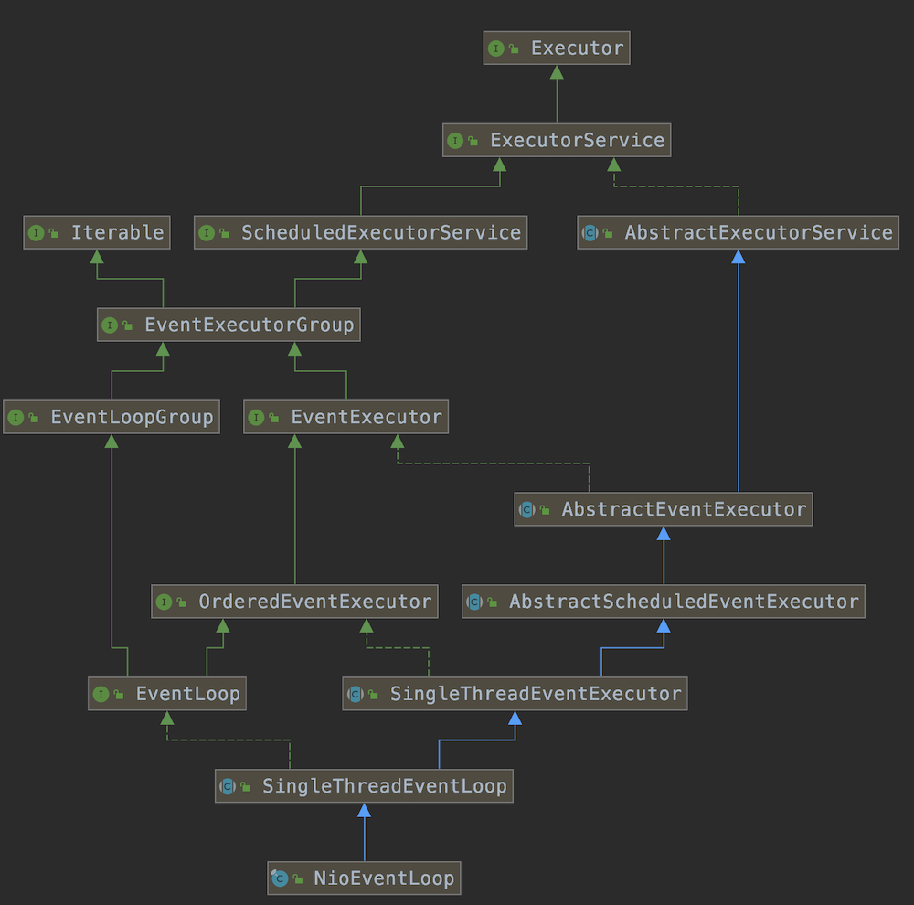
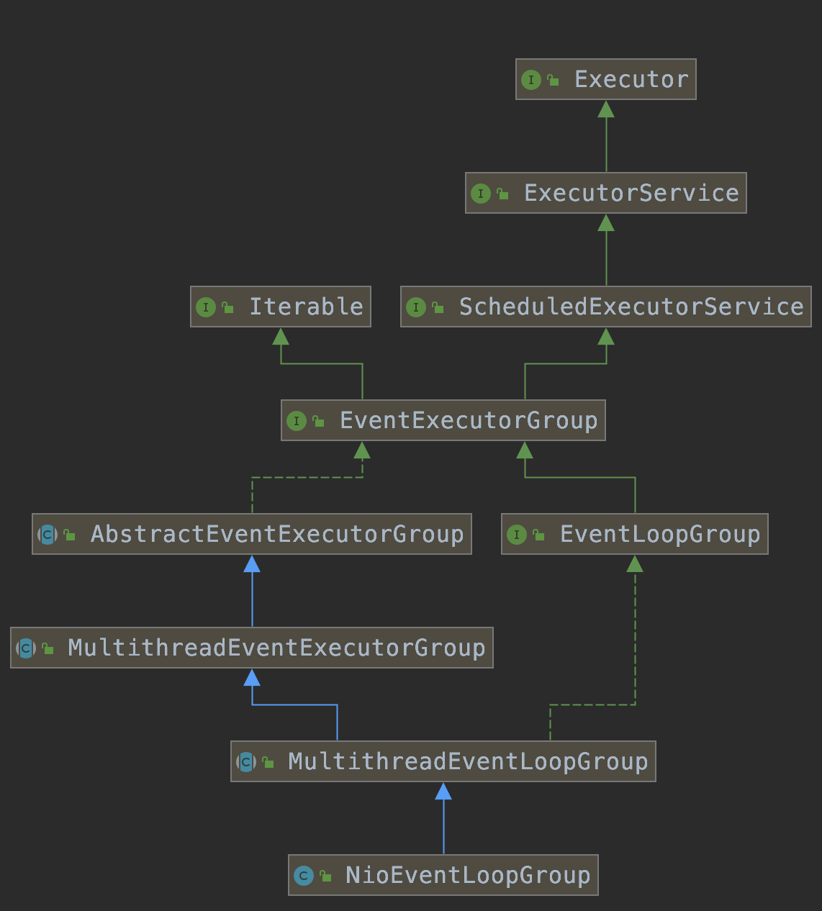

# 一、架构

## 1、Netty逻辑架构

Netty 采用了比较典型的三层网络架构进行设计，包含如下：

### 1.1、Reactor 通信调度层

它由一系列辅助类完成，包括 Reactor 线程 NioEventLoop 以及其父类、NioSocketChannel/NioServerSocketChannel 以及其父 类、ByteBuffer 以及由其衍生出来的各种 Buffer、Unsafe 以及其衍生出的各种内 部类等。该层的主要职责就是监听网络的读写和连接操作，负责将网络层的数据 读取到内存缓冲区中，然后触发各种网络事件，例如连接创建、连接激活、读事 件、写事件等等，将这些事件触发到 PipeLine 中，由 PipeLine 充当的职责链来 进行后续的处理。

### 1.2、职责链 PipeLine

它负责事件在职责链中的有序传播，同时负责动态的 编排职责链，职责链可以选择监听和处理自己关心的事件，它可以拦截处理和向 后/向前传播事件，不同的应用的 Handler 节点的功能也不同，通常情况下，往往 会开发编解码 Hanlder 用于消息的编解码，它可以将外部的协议消息转换成内部 的 POJO 对象，这样上层业务侧只需要关心处理业务逻辑即可，不需要感知底层的协议差异和线程模型差异，实现了架构层面的分层隔离。

### 1.3、业务逻辑处理层，可以分为两类：

- 纯粹的业务逻辑 处理，例如订单处理。
- 应用层协议管理，例如HTTP协议、FTP协议等

## 2、高性能

- 采用异步非阻塞IO类库，基于Reactor模式实现，解决了传统同步阻塞IO模式下一个服务端无法平滑的处理线性增长的客户端的问题；
- TCP接收和发送缓冲区使用直接内存代替堆内存，避免了内存复制，提升了IO读写性能；
- 支持通过内存池的方式循环利用ByteBuf，避免了频繁创建和销毁ByteBuf带来的性能损耗；由`AbstractByteBufAllocator`的子类来实现
- 零拷贝技术
- 可配置的IO线程数、TCP参数等，为不同的用户场景提供定制化的调优参数，满足不同的性能场景；
- 采用环形数组缓冲区实现无锁化并发编程，代替传统的线程安全容器或者锁

    NioEventLoop读取到消息之后，直接调用ChannelPipeline的 fireChannelRead(Object msg)，只要用户不主动切换线程，一直由NioEventLoop调用到用户Handler，期间不用进行线程处理

- 合理的使用线程安全容器、原子类等，提升系统的并发处理能力；
- 关键资源的处理使用单线程串行化的方式，避免多线程并发访问带来的锁竞争和额外的CPU资源消耗问题；
- 通过引用计数器及时的申请释放不再被引用的对象，细粒度的内存管理降低了GC的频率，减少了频繁GC带来的时延增大和CPU损耗
- 高性能的序列化框架；

## 3、可靠性

### 3.1、链路有效性检测

为了保证长连接的链路有效性，需要通过心跳机制周期性进行链路检测。有业务消息时，无需心跳检测，可以由业务消息进行链路可用性检测。心跳检测往往是在链路空闲时发送的

心跳检测机制分为三个层面：
- TCP层面的心跳检测，即TCP的Keep-Alive机制，它的作用域是整个TCP协议栈；
- 协议层的心跳检测，主要存在于长连接协议中。例如SMPP协议；
- 应用层的心跳检测，它主要由各业务产品通过约定方式定时给对方发送心跳消息实现

心跳检测的的协议：
- Ping-Pong型心跳：由通信一方定时发送ping消息，对方接收到ping消息之后，立即返回Pong应答消息给对象，属于请求-响应型心跳；
- Ping-Ping型心跳：不区分心跳请求和应答，由通信双方按照约定定时向对方发送心跳Ping消息。它属于双向心跳；

Netty的空闲检测机制
- 读空闲超时机制：当连续周期T没有消息可读时，触发超时Handler，用户可以基于读空闲超时发送心跳消息，进行链路检测。如果连续N个周期仍然没有读取到心跳消息，可以主动关闭链路；
- 写空闲超时机制：当连续周期T没有消息要发送时，触发超时Handler，用户可以基于写空闲超时发送心跳消息，进行链路检测。如果连续N个周期仍然没有接收到对方的心跳消息，可以主动关闭链路；
- 读写空闲：

主要实现相关类都在包 `io.netty.handler.timeout` 中；

### 3.2、内存保护机制

- 通过对象引用计数器对Netty的ByteBuf等内置对象进行细粒度的内存申请和释放，对非法的对象引用进行检测和保护；
- 通过内存池来重用Bytebuf，节省内存；
- 可设置的内存容量上限，包括ByteBuf、线程池线程数等；
- 规避NIO BUG，主要是epoll bug，导致Selector空轮询

### 3.3、优雅停机

Netty的优雅停机三步曲：
- 不再接收新消息
- 退出前的预处理操作
- 资源的释放操作

Java的优雅停机通常通过注册JDK的ShutdownHook来实现，当系统接收到退出指令后，首先标记系统处于退出状态，不再接收新的消息，然后将积压的消息处理完，最后调用资源回收接口将资源销毁，最后各线程退出执行。

Netty默认的shutdownGracefully()机制为：在2秒的静默时间内如果没有任务，则关闭；否则15秒截止时间到达时关闭。换句话说，在15秒时间段内，如果有超过2秒的时间段没有任务则关闭

通常优雅退出需要有超时控制机制，例如30S，如果到达超时时间仍然没有完成退出前的资源回收等操作，则由停机脚本直接调用`kill -9 pid`，强制退出

## 4、Netty并发编程时间

### 4.1、对共享的可变数据进行正确的同步

比如ServerBootstrap中的option方法：
```java
// LinkedHashMap非线程安全的
private final Map<ChannelOption<?>, Object> options = new LinkedHashMap<ChannelOption<?>, Object>();
public <T> B option(ChannelOption<T> option, T value) {
    if (option == null) {
        throw new NullPointerException("option");
    }
    if (value == null) {
        synchronized (options) {
            options.remove(option);
        }
    } else {
        synchronized (options) {
            options.put(option, value);
        }
    }
    return (B) this;
}
```

### 4.2、正确的使用锁

```java
// java.util.concurrent.ForkJoinTask#externalAwaitDone
do {
    if (U.compareAndSwapInt(this, STATUS, s, s | SIGNAL)) {
        synchronized (this) {
            if (status >= 0) {
                try {
                    wait(0L);
                } catch (InterruptedException ie) {
                    interrupted = true;
                }
            }
            else
                notifyAll();
        }
    }
} while ((s = status) >= 0);
```
- wait方法用来使线程等待某个条件，它必须在同步块内部被调用；
- 始终使用wait循环来调用wait方法，永远不要在循环之前调用wait方法；
- 唤醒线程，当不知道使用哪个方法时，保守做法是调用notifyAll

### 4.3、volatile的正确使用

private volatile int ioRatio = 50;

不要使用volatile来替代传统锁

### 4.4、CAS指令和原子类

### 4.5、线程安全类的使用

- 线程池以及定时任务相关的类库；
- 并发集合；
- 新的同步器，如读写锁

### 4.6、读写锁的应用

# 二、线程模型

## 1、Reactor线程模型

[Java基础知识-Reactor](../../Java基础/Java-IO.md#6.1Reactor)

## 2、Netty线程模型

Netty中最核心的概念是事件循环（EventLoop），即Ractor模式中的 Reactor，负责监听网络事件并调用事件处理器处理

Netty可以同时支持Reactor单线程模型、多线程模型和主从Reactor多线程模型。

服务端启动的时候，创建了两个NioEventLoopGroup，他们实际是两个独立的Reactor线程池。一个用于接收客户端的TCP连接，另一个用于处理IO相关的读写操作或者执行系统的Task、定时任务Task；

通过调整线程池的线程个数、是否共享线程池等方式，netty的Reactor线程模型可以在单线程、多线程和主从多线程间切换。

不管是boss线程还是worker线程，所做的事情均分为以下三个步骤：
- 轮询注册在selector上的IO事件
- 处理IO事件
- 执行异步task

对于boss线程来说，第一步轮询出来的基本都是 accept 事件，表示有新的连接，而worker线程轮询出来的基本都是read/write事件，表示网络的读写事件。

boss线程accept事件可以获取到selectionKey集合，通过selectionKey获取到SocketChannel，其可以包装为`NioSocketChannel`，而`NioSocketChannel`又会注册到worker线程中的Selector中。因为accept事件一般只发生一次

wokerGroup中包含多个EventLoop，具体使用哪个EventLoop处理则是通过轮询算法进行负载均衡

## 3、最佳实践

Netty的多线程编程最佳实践：
- 创建两个NioEventLoopGroup，用于逻辑隔离NIO Acceptor 和NIO I/O线程；
- 尽量不要在ChannelHandler中启动用户线程；
- 解码要放在NIO线程调用的解码Handler中进行，不要切换到用户线程中完成消息的解码；
- 如果业务逻辑操作非常简单，没有复杂的业务逻辑计算，没有可能会导致线程被阻塞的磁盘操作、数据库操作、网络操作等，可以直接在NIO线程上完成业务逻辑编排，不需要切换到用户线程；
- 如果业务逻辑处理复杂，不要在NIO线程上完成，建议将解码后的POJO消息封装成TASK。

推荐的线程数量计算公式：
- 公式一：线程数量 = (线程总时间 / 瓶颈资源时间) * 瓶颈资源的线程并行数；
- 公式二：QPS = 1000 / 线程总时间 * 线程数

## 4、NioEventLoop

### 4.1、设计原理

其并不是一个纯粹的IO线程，其除了负责IO的读写外，还需要兼顾处理以下任务：
- 系统Task：通过调用NioEventLoop的execute方法实现，Netty有很多系统Task，创建他们的主要原因是：当IO线程和用户线程同时操作网络资源时，为了防止并发操作导致的锁竞争，将用户线程的操作封装成Task放入消息队列中，由IO线程负责执行，实现了局部无锁化；

- 定时任务：通过调用NioEventLoop的schedule方法实现。

它实现了EventLoop接口、EventExecutorLooop接口和ScheduleExecutorService接口；

### 4.2、继承关系图



### 4.3、Selector的初始化

NioEventLoop需要处理网络IO读写事件，因此必须聚合一个多路复用器对象。Selector的定义如下：
```java
private Selector selector;
private Selector unwrappedSelector;
private SelectedSelectionKeySet selectedKeys;

private final SelectorProvider provider;
```
Selector的初始化直接调用的是Selector.open方法。Netty对Selector的selectedKeys进行了优化。用户可以通过`io.netty.noKeySetOptimization`开挂决定是否启用该优化项。默认是不打开selectedKeys的优化功能；
- 如果没有开启该开关。直接打开多路复用器后直接返回：
    ```java
    private static final boolean DISABLE_KEYSET_OPTIMIZATION = SystemPropertyUtil.getBoolean("io.netty.noKeySetOptimization", false);
    private SelectorTuple openSelector() {
        final Selector unwrappedSelector;
        try {
            unwrappedSelector = provider.openSelector();
        } catch (IOException e) {
            throw new ChannelException("failed to open a new selector", e);
        }
        if (DISABLE_KEYSET_OPTIMIZATION) {
            return new SelectorTuple(unwrappedSelector);
        }
        ....
    }
    ```
- 如果开启了优化开关，需要通过反射的方式从Selector实例中获取selectedKeys和publicSelectedKeys，将上述两个成员变量设置为可写，通过反射的方式使用Netty构造的selectedKeys包装类 selectedKeySet将原JDK的 selectedKeys替换掉；

### 4.4、Selector空轮询问题解决

**epoll空轮询原因：**

若Selector的轮询结果为空，也没有wakeup或新消息处理，则发生空轮询，CPU使用率100%

本质原因：在部分Linux的2.6的kernel中，poll和epoll对于突然中断的连接socket会对返回的eventSet事件集合置为POLLHUP，也可能是POLLERR，eventSet事件集合发生了变化，这就可能导致Selector会被唤醒

**Netty解决办法：**

- 对Selector的select操作周期进行统计，每完成一次空的select操作进行一次计数，
- 若在某个周期内连续发生N次空轮询，则触发了epoll死循环bug。
- 重建Selector，判断是否是其他线程发起的重建请求，若不是则将原SocketChannel从旧的Selector上去除注册，重新注册到新的Selector上，并将原来的Selector关闭

具体代码如下：
```java
public void rebuildSelector() {
    // inEventLoop()判断是否由其他线程发起的rebuildSelector，如果由其他线程发起，为了避免多线程并发操作Selector和其他资源，需要将rebuildSelector0封装成task放到NioEventLoop的消息队列中，由NioEventLoop线程负责调用，避免了多线程并发操作导致的线程安全问题；
    if (!inEventLoop()) {
        execute(new Runnable() {
            @Override
            public void run() {
                rebuildSelector0();
            }
        });
        return;
    }
    rebuildSelector0();
}
private void rebuildSelector0() {
    final Selector oldSelector = selector;
    final SelectorTuple newSelectorTuple;

    if (oldSelector == null) {
        return;
    }

    try {
        // 打开新的Selector，通过循环，将原Selector上注册的SocketChannel从旧的Selector上去除注册，重新注册到新的Selector，并将老的关闭
        newSelectorTuple = openSelector();
    } catch (Exception e) {
        logger.warn("Failed to create a new Selector.", e);
        return;
    }

    // Register all channels to the new Selector.
    int nChannels = 0;
    for (SelectionKey key: oldSelector.keys()) {
        Object a = key.attachment();
        try {
            if (!key.isValid() || key.channel().keyFor(newSelectorTuple.unwrappedSelector) != null) {
                continue;
            }

            int interestOps = key.interestOps();
            key.cancel();
            SelectionKey newKey = key.channel().register(newSelectorTuple.unwrappedSelector, interestOps, a);
            if (a instanceof AbstractNioChannel) {
                // Update SelectionKey
                ((AbstractNioChannel) a).selectionKey = newKey;
            }
            nChannels ++;
        } catch (Exception e) {
            logger.warn("Failed to re-register a Channel to the new Selector.", e);
            if (a instanceof AbstractNioChannel) {
                AbstractNioChannel ch = (AbstractNioChannel) a;
                ch.unsafe().close(ch.unsafe().voidPromise());
            } else {
                @SuppressWarnings("unchecked")
                NioTask<SelectableChannel> task = (NioTask<SelectableChannel>) a;
                invokeChannelUnregistered(task, key, e);
            }
        }
    }
    selector = newSelectorTuple.selector;
    unwrappedSelector = newSelectorTuple.unwrappedSelector;

    try {
        // time to close the old selector as everything else is registered to the new one
        oldSelector.close();
    } catch (Throwable t) {
        if (logger.isWarnEnabled()) {
            logger.warn("Failed to close the old Selector.", t);
        }
    }

    logger.info("Migrated " + nChannels + " channel(s) to the new Selector.");
}
```
通过销毁旧的、有问题的多路复用器，使用新建的Selector，可以解决空轮询Selector导致IO线程CPU占用100%问题；

## 5、NioEventLoopGroup



### 5.1、开启的线程数

默认情况下开启的线程数：`EventLoopGroup bossGroup = new NioEventLoopGroup();`，一般情况，通常会传入1，表示一个线程
```java
// 默认情况下不传，会调用另外一个构造函数，传入的是0
 public NioEventLoopGroup() {
    this(0);
}
// 最终会调用如何构造方法，此时nThreads这个参数的值为0
public NioEventLoopGroup(int nThreads, Executor executor, final SelectorProvider selectorProvider, final SelectStrategyFactory selectStrategyFactory) {
    super(nThreads, executor, selectorProvider, selectStrategyFactory, RejectedExecutionHandlers.reject());
}
// 会调用父类MultithreadEventLoopGroup的构造方法，其中会判断时nThreads是否为0，如果为0，则使用 DEFAULT_EVENT_LOOP_THREADS的值，该值时在静态代码块中初始化的
protected MultithreadEventLoopGroup(int nThreads, Executor executor, Object... args) {
    super(nThreads == 0 ? DEFAULT_EVENT_LOOP_THREADS : nThreads, executor, args);
}
// 如果没有配置变量：io.netty.eventLoopThreads，则默认电脑上默认的CPU核数*2，即取的是逻辑CPU的数量
private static final int DEFAULT_EVENT_LOOP_THREADS;
static {
    DEFAULT_EVENT_LOOP_THREADS = Math.max(1, SystemPropertyUtil.getInt("io.netty.eventLoopThreads", Runtime.getRuntime().availableProcessors() * 2));
    if (logger.isDebugEnabled()) {
        logger.debug("-Dio.netty.eventLoopThreads: {}", DEFAULT_EVENT_LOOP_THREADS);
    }
}
```
NioEventLoopGroup 其构造方法都是初始化一些参数

## 6、ServerBootstrap

Bootstrap sub-class which allows easy bootstrap of ServerChannel
