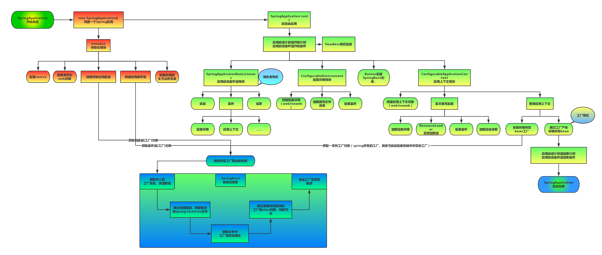
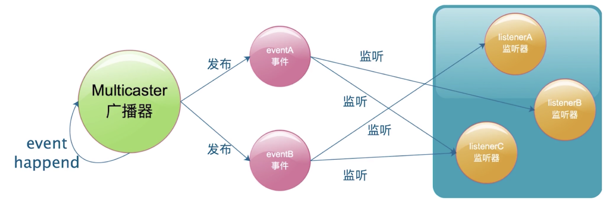
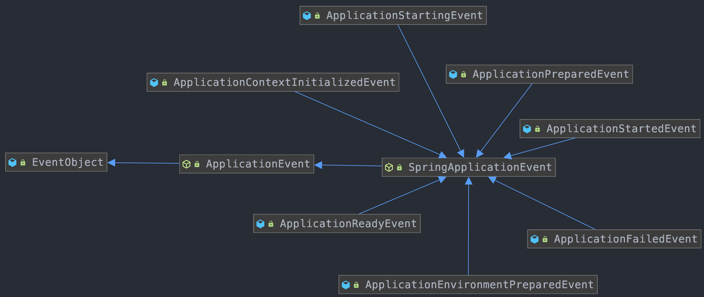
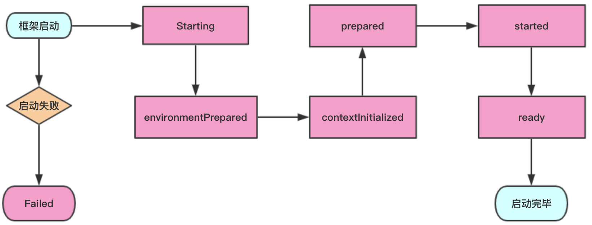
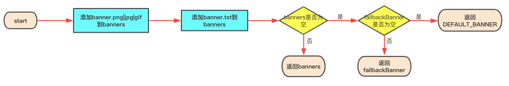
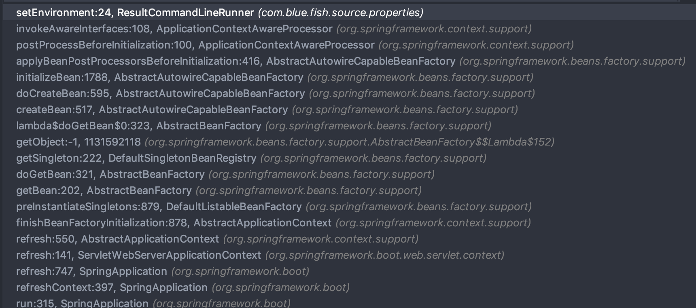
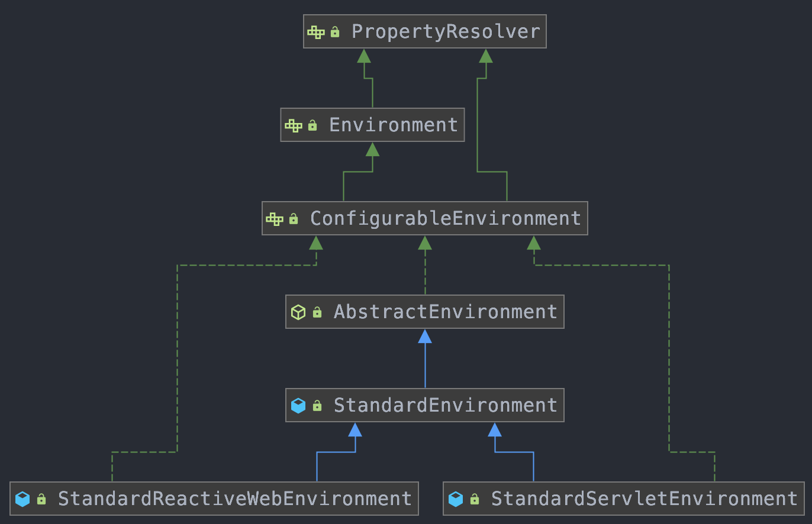
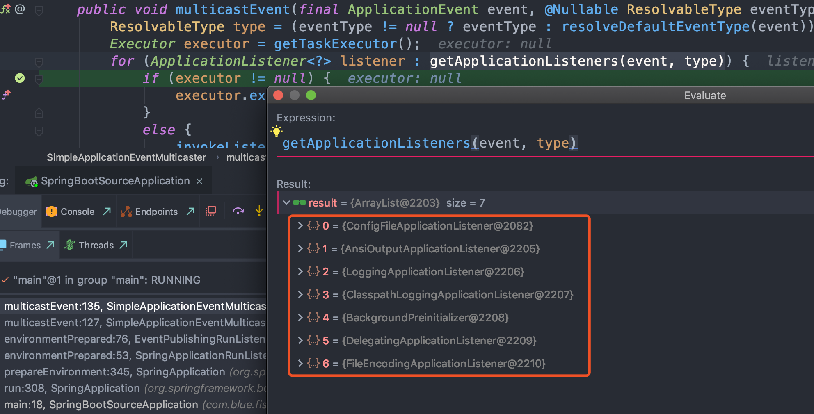
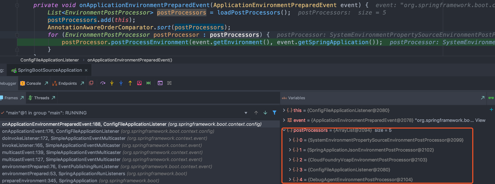
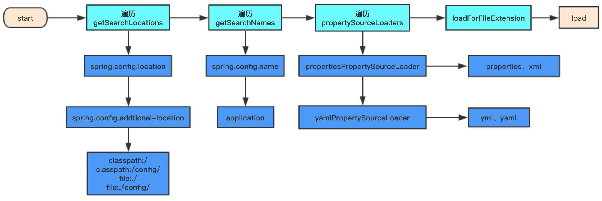

**注意：** 以下所有源码分析都是基于`2.2.2.RELEASE`版本的代码

# 1、注解

## 1.1、SpringBootApplication注解

```java
@Target(ElementType.TYPE)
@Retention(RetentionPolicy.RUNTIME)
@Documented
@Inherited
@SpringBootConfiguration
@EnableAutoConfiguration
@ComponentScan(excludeFilters = {
        @Filter(type = FilterType.CUSTOM, classes = TypeExcludeFilter.class),
        @Filter(type = FilterType.CUSTOM, classes = AutoConfigurationExcludeFilter.class) })
public @interface SpringBootApplication {
...
}
```
- `@SpringBootApplication` = `(默认属性)@Configuration + @EnableAutoConfiguration + @ComponentScan`。如果在启动类不配置`@SpringBootApplication`，也可以配置这三个注解，通用能够启动；
- `@Configuration`：JavaConfig形式的Spring Ioc容器的配置类；SpringBootApplication 作为Configuration 的派生注解，继承其注解特性，最明显的是CGLIB提升
- `@ComponentScan`：@ComponentScan的功能其实就是自动扫描并加载符合条件的组件（比如@Component和@Repository等）或者bean定义，最终将这些bean定义加载到IOC容器中
- `@EnableAutoConfiguration`：@EnableAutoConfiguration也是借助`@Import`的帮助，将所有符合自动配置条件的bean定义加载到IOC容器，仅此而已！

    `@EnableAutoConfiguration`会根据类路径中的jar依赖为项目进行自动配置，如：添加了spring-boot-starter-web依赖，会自动添加Tomcat和Spring MVC的依赖，Spring Boot会对Tomcat和Spring MVC进行自动配置

	借助于Spring框架原有的一个工具类：SpringFactoriesLoader的支持，SpringFactoriesLoader属于Spring框架私有的一种扩展方案，其主要功能就是从指定的配置文件`META-INF/spring.factories`加载配置

	从classpath中搜寻所有的`META-INF/spring.factories`配置文件，并将其中`org.springframework.boot.autoconfigure.EnableutoConfiguration`对应的配置项通过反射（Java Refletion）实例化为对应的标注了`@Configuration`的JavaConfig形式的IOC容器配置类，然后汇总为一个并加载到IOC容器。

	配置在`META-INF/spring.factories`：**ApplicationContextInitializer**、**SpringApplicationRunListener**
	
	只需要放在ioc容器中：**ApplicationRunner**、**CommandLineRunner**

## 1.2、EnableAutoConfiguration注解加载

```java
@Target(ElementType.TYPE)
@Retention(RetentionPolicy.RUNTIME)
@Documented
@Inherited
@AutoConfigurationPackage
// 要导入到容器中的组件： AutoConfigurationImportSelector，实现自接口 DeferredImportSelector，处理自动配置。如果需要@EnableAutoConfiguration的自定义变体，也可以创建该类的子类。
@Import(AutoConfigurationImportSelector.class)
public @interface EnableAutoConfiguration {
	String ENABLED_OVERRIDE_PROPERTY = "spring.boot.enableautoconfiguration";
	Class<?>[] exclude() default {};
	String[] excludeName() default {};
}

public class AutoConfigurationImportSelector implements DeferredImportSelector, BeanClassLoaderAware,ResourceLoaderAware, BeanFactoryAware, EnvironmentAware, Ordered {
    protected AutoConfigurationEntry getAutoConfigurationEntry(AutoConfigurationMetadata autoConfigurationMetadata,AnnotationMetadata annotationMetadata) {
        // 判断自动装配开关是否打开。默认spring.boot.enableautoconfiguration=true，可在 application.properties 或 application.yml 中设置
		if (!isEnabled(annotationMetadata)) {
			return EMPTY_ENTRY;
		}
        // 获取类路径下spring.factories下key为EnableAutoConfiguration全限定名对应值
		AnnotationAttributes attributes = getAttributes(annotationMetadata);
        // 获取需要自动装配的所有配置类，读取 META-INF/spring.factories
		List<String> configurations = getCandidateConfigurations(annotationMetadata, attributes);
        // 去除重复的 自动配置类
		configurations = removeDuplicates(configurations);
        // 获取排除 EnableAutoConfiguration 配置的 exclude 
		Set<String> exclusions = getExclusions(annotationMetadata, attributes);
		checkExcludedClasses(configurations, exclusions);
        // 将所有排除的都从集合中移除掉
		configurations.removeAll(exclusions);
        // 过滤，主要是通过 Conditional相关注解来实现的
		configurations = filter(configurations, autoConfigurationMetadata);
		fireAutoConfigurationImportEvents(configurations, exclusions);
		return new AutoConfigurationEntry(configurations, exclusions);
	}
}
```
主要是在 `AbstractApplicationContext`的`refresh`方法中执行方法：`invokeBeanFactoryPostProcessors(beanFactory)`


### 1.2.1、getCandidateConfigurations方法

```java
// 获取类路径下spring.factories下key为 EnableAutoConfiguration 全限定名对应值
protected List<String> getCandidateConfigurations(AnnotationMetadata metadata, AnnotationAttributes attributes) {
    List<String> configurations = SpringFactoriesLoader.loadFactoryNames(getSpringFactoriesLoaderFactoryClass(), getBeanClassLoader());
    Assert.notEmpty(configurations, "No auto configuration classes found in META-INF/spring.factories. If you "
            + "are using a custom packaging, make sure that file is correct.");
    return configurations;
}
// 获取 EnableAutoConfiguration 
protected Class<?> getSpringFactoriesLoaderFactoryClass() {
    return EnableAutoConfiguration.class;
}
```

### 1.2.2、filter方法

```java
// @ConditionalOnXXX 中的所有条件都满足，该类才会生效
private List<String> filter(List<String> configurations, AutoConfigurationMetadata autoConfigurationMetadata) {
    long startTime = System.nanoTime();
    String[] candidates = StringUtils.toStringArray(configurations);
    boolean[] skip = new boolean[candidates.length];
    boolean skipped = false;
    // 获取到所有 AutoConfigurationImportFilter 的实现类，配置在 spring.factories 文件中
    for (AutoConfigurationImportFilter filter : getAutoConfigurationImportFilters()) {
        invokeAwareMethods(filter);
        // 调用 FilteringSpringBootCondition 的 match 方法，根据对应注解，比如 ConditionalOnBean等来匹配
        boolean[] match = filter.match(candidates, autoConfigurationMetadata);
        for (int i = 0; i < match.length; i++) {
            if (!match[i]) {
                skip[i] = true;
                candidates[i] = null;
                skipped = true;
            }
        }
    }
    if (!skipped) {
        return configurations;
    }
    List<String> result = new ArrayList<>(candidates.length);
    for (int i = 0; i < candidates.length; i++) {
        if (!skip[i]) {
            result.add(candidates[i]);
        }
    }
    ...
    return new ArrayList<>(result);
}
/**
org.springframework.boot.autoconfigure.AutoConfigurationImportFilter=\
org.springframework.boot.autoconfigure.condition.OnBeanCondition,\
org.springframework.boot.autoconfigure.condition.OnClassCondition,\
org.springframework.boot.autoconfigure.condition.OnWebApplicationCondition
*/
protected List<AutoConfigurationImportFilter> getAutoConfigurationImportFilters() {
    return SpringFactoriesLoader.loadFactories(AutoConfigurationImportFilter.class, this.beanClassLoader);
}
```

总结：Spring Boot 通过@EnableAutoConfiguration开启自动装配，通过 SpringFactoriesLoader 最终加载META-INF/spring.factories中的自动配置类实现自动装配，自动配置类其实就是通过@Conditional按需加载的配置类，想要其生效必须引入spring-boot-starter-xxx包实现起步依赖

# 2、启动流程

## 2.1、启动流程分析



- （1）创建SpringApplication对象，

	SpringBoot1.5版本调用initialize(sources)方法
	```java
	private void initialize(Object[] sources) {
		//保存主配置类
		if (sources != null && sources.length > 0) {
			this.sources.addAll(Arrays.asList(sources));
		}
		//判断当前是否一个web应用
		this.webEnvironment = deduceWebEnvironment();
		//从类路径下找到META-INF/spring.factories配置的所有ApplicationContextInitializer；然后保存起来
		setInitializers((Collection) getSpringFactoriesInstances(ApplicationContextInitializer.class));
		//从类路径下找到ETA-INF/spring.factories配置的所有ApplicationListener
		setListeners((Collection) getSpringFactoriesInstances(ApplicationListener.class));
		//从多个配置类中找到有main方法的主配置类
		this.mainApplicationClass = deduceMainApplicationClass();
	}
	```
	SpringBoot2.x版本是直接在SpringApplication构造方法中：
	```java
	public SpringApplication(Class<?>... primarySources) {
		this(null, primarySources);
	}
	public SpringApplication(ResourceLoader resourceLoader, Class<?>... primarySources) {
		this.resourceLoader = resourceLoader;
		Assert.notNull(primarySources, "PrimarySources must not be null");
		this.primarySources = new LinkedHashSet<>(Arrays.asList(primarySources));
		this.webApplicationType = deduceWebApplicationType();
        //从类路径下找到META-INF/spring.factories配置的所有 ApplicationContextInitializer 然后保存起来
		setInitializers((Collection) getSpringFactoriesInstances(ApplicationContextInitializer.class));
        //从类路径下找到META-INF/spring.factories配置的所有 ApplicationListener
		setListeners((Collection) getSpringFactoriesInstances(ApplicationListener.class));
		this.mainApplicationClass = deduceMainApplicationClass();
	}
	```
- （2）运行run方法
	```java
	public ConfigurableApplicationContext run(String... args) {
		StopWatch stopWatch = new StopWatch();
		stopWatch.start();
		ConfigurableApplicationContext context = null;
		FailureAnalyzers analyzers = null;
		configureHeadlessProperty();
			
		//获取SpringApplicationRunListeners；从类路径下META-INF/spring.factories
		SpringApplicationRunListeners listeners = getRunListeners(args);
			//回调所有的获取SpringApplicationRunListener.starting()方法
		listeners.starting();
		try {
			//封装命令行参数
			ApplicationArguments applicationArguments = new DefaultApplicationArguments(args);
			//准备环境
			ConfigurableEnvironment environment = prepareEnvironment(listeners,applicationArguments);
			//创建环境完成后回调SpringApplicationRunListener.environmentPrepared()；表示环境准备完成
			Banner printedBanner = printBanner(environment);
			//创建ApplicationContext；决定创建web的ioc还是普通的ioc
			context = createApplicationContext();
			analyzers = new FailureAnalyzers(context);
			//准备上下文环境;将environment保存到ioc中；而且applyInitializers()；
			//applyInitializers()：回调之前保存的所有的ApplicationContextInitializer的initialize方法
			//回调所有的SpringApplicationRunListener的contextPrepared()；
			prepareContext(context, environment, listeners, applicationArguments,printedBanner);
			//prepareContext运行完成以后回调所有的SpringApplicationRunListener的contextLoaded（）；
			//刷新容器；ioc容器初始化（如果是web应用还会创建嵌入式的Tomcat）；Spring注解版
			//扫描，创建，加载所有组件的地方；（配置类，组件，自动配置）
			refreshContext(context);
			//从ioc容器中获取所有的ApplicationRunner和CommandLineRunner进行回调
			//ApplicationRunner先回调，CommandLineRunner再回调
			afterRefresh(context, applicationArguments);
			//所有的SpringApplicationRunListener回调finished方法
			listeners.finished(context, null);
			stopWatch.stop();
			if (this.logStartupInfo) {
				new StartupInfoLogger(this.mainApplicationClass)
					.logStarted(getApplicationLog(), stopWatch);
			}
			//整个SpringBoot应用启动完成以后返回启动的ioc容器；
			return context;
		}
		catch (Throwable ex) {
			handleRunFailure(context, listeners, analyzers, ex);
			throw new IllegalStateException(ex);
		}
	}
	```

**大体流程：**
- 1） 如果我们使用的是SpringApplication的静态run方法，那么，这个方法里面首先要创建一个SpringApplication对象实例，然后调用这个创建好的SpringApplication的实例方法。在SpringApplication实例初始化的时候，它会提前做几件事情：
	- 根据classpath里面是否存在某个特征类（org.springframework.web.context.ConfigurableWebApplicationContext）来决定是否应该创建一个为Web应用使用的ApplicationContext类型。
	- 使用SpringFactoriesLoader在应用的classpath中查找并加载所有可用的ApplicationContextInitializer。
	- 使用SpringFactoriesLoader在应用的classpath中查找并加载所有可用的ApplicationListener。
	- 推断并设置main方法的定义类。
- 2） SpringApplication实例初始化完成并且完成设置后，就开始执行run方法的逻辑了，方法执行开水，首先遍历执行所有通过SpringFactoriesLoader可以查找到并加载的SpringApplicationRunListener。调用它们的started()方法，告诉这些SpringApplicationRunListener，“嘿，SpringBoot应用要开始执行咯！”。
- 3） 创建并配置当前Spring Boot应用将要使用的Environment（包括配置要使用的PropertySource以及Profile）。
- 4） 遍历调用所有SpringApplicationRunListener的`environmentPrepared()`的方法，告诉他们：“当前SpringBoot应用使用的Environment准备好了咯！”。
- 5） 如果SpringApplication的showBanner属性被设置为true，则打印banner。
- 6） 根据用户是否明确设置了applicationContextClass类型以及初始化阶段的推断结果，决定该为当前SpringBoot应用创建什么类型的ApplicationContext并创建完成，然后根据条件决定是否添加ShutdownHook，决定是否使用自定义的BeanNameGenerator，决定是否使用自定义的ResourceLoader，当然，最重要的，将之前准备好的Environment设置给创建好的ApplicationContext使用。
- 7） ApplicationContext创建好之后，SpringApplication会再次借助SpringFactoriesLoader，查找并加载classpath中所有可用的ApplicationContext-Initializer，然后遍历调用这些ApplicationContextInitializer的initialize（applicationContext）方法来对已经创建好的ApplicationContext进行进一步的处理。
- 8） 遍历调用所有SpringApplicationRunListener的`contextPrepared()`方法。
- 9） 最核心的一步，将之前通过`@EnableAutoConfiguration`获取的所有配置以及其他形式的IOC容器配置加载到已经准备完毕的`ApplicationContext`。
- 10） 遍历调用所有`SpringApplicationRunListener`的`contextLoaded()`方法。
- 11） 调用`ApplicationContext`的`refresh()`方法，完成IOC容器可用的最后一道工序。
- 12） 查找当前ApplicationContext中是否注册有CommandLineRunner，如果有，则遍历执行它们。
- 13） 正常情况下，遍历执行SpringApplicationRunListener的finished()方法、（如果整个过程出现异常，则依然调用所有SpringApplicationRunListener的finished()方法，只不过这种情况下会将异常信息一并传入处理）

**总结：**

- SpringApplication.run(主程序类)
	- new SpringApplication(主程序类)
		- 判断是否web应用
		- 加载并保存所有ApplicationContextInitializer(`META-INF/spring.factories`)， • 加载并保存所有ApplicationListener
		- 获取到主程序类
	- run()
		- 回调所有的SpringApplicationRunListener(`META-INF/spring.factories`)的starting
		- 获取ApplicationArguments
		- 准备环境&回调所有监听器( SpringApplicationRunListener )的environmentPrepared • 打印banner信息
		- 创建ioc容器对象
	- AnnotationConfigEmbeddedWebApplicationContext(web环境容器) – AnnotationConfigApplicationContext(普通环境容器)

- 准备环境
- 执行`ApplicationContextInitializer.initialize()`
- 监听器SpringApplicationRunListener回调contextPrepared – 加载主配置类定义信息
- 监听器SpringApplicationRunListener回调contextLoaded
	- 刷新启动IOC容器;
- 扫描加载所有容器中的组件
- 包括从`META-INF/spring.factories`中获取的所有EnableAutoConfiguration组件
	- 回调容器中所有的ApplicationRunner、CommandLineRunner的run方法 • 监听器SpringApplicationRunListener回调finished

*Spring Boot 总是遵循一个标准：容器中有我们自己配置的组件就用我们配置的，没有就用自动配 置默认注册进来的组件;*

## 2.2、SpringFactoriesLoader

**介绍：**
- 框架内部使用通用的工厂加载机制；
- 从classpath下多个jar包特定的位置读取文件并初始化类；
- 文件内容必须是`key-value`形式，即properties形式；
- key是全限定名（抽象类|接口），value是实现类的全限定名，如果有多个，使用`,`分隔

**加载类流程**
```java
// SpringApplication类的方法
private <T> Collection<T> getSpringFactoriesInstances(Class<T> type, Class<?>[] parameterTypes, Object... args) {
    ClassLoader classLoader = getClassLoader();
    // Use names and ensure unique to protect against duplicates
    Set<String> names = new LinkedHashSet<>(SpringFactoriesLoader.loadFactoryNames(type, classLoader));
    List<T> instances = createSpringFactoriesInstances(type, parameterTypes, classLoader, args, names);
    AnnotationAwareOrderComparator.sort(instances);
    return instances;
}

// SpringFactoriesLoader的方法
public static List<String> loadFactoryNames(Class<?> factoryType, @Nullable ClassLoader classLoader) {
    String factoryTypeName = factoryType.getName();
    return loadSpringFactories(classLoader).getOrDefault(factoryTypeName, Collections.emptyList());
}
private static Map<String, List<String>> loadSpringFactories(@Nullable ClassLoader classLoader) {
    MultiValueMap<String, String> result = cache.get(classLoader);
    if (result != null) {
        return result;
    }
    try {
        Enumeration<URL> urls = (classLoader != null ?  classLoader.getResources(FACTORIES_RESOURCE_LOCATION) : ClassLoader.getSystemResources(FACTORIES_RESOURCE_LOCATION));
        // LinkedMultiValueMap 里面有个targetMap，是用LinkedHashMap来实现的，使用的是LinkedList来存储的value值
        result = new LinkedMultiValueMap<>();
        while (urls.hasMoreElements()) {
            URL url = urls.nextElement();
            UrlResource resource = new UrlResource(url);
            Properties properties = PropertiesLoaderUtils.loadProperties(resource);
            for (Map.Entry<?, ?> entry : properties.entrySet()) {
                String factoryTypeName = ((String) entry.getKey()).trim();
                for (String factoryImplementationName : StringUtils.commaDelimitedListToStringArray((String) entry.getValue())) {
                    result.add(factoryTypeName, factoryImplementationName.trim());
                }
            }
        }
        cache.put(classLoader, result);
        return result;
    } .....
}
```


# 3、系统初始化器

ApplicationContextInitializer
- 上下文即refresh方法前调用；
- 用来编码设置一些属性变量，通常用在web环境中；
- 可以通过`@Order`注解进行排序

## 3.1、自定义初始化器的三种方式

自定义初始化器的基本条件：实现接口`ApplicationContextInitializer`
```java
@Order(1)
public class FirstInitializer implements ApplicationContextInitializer<ConfigurableApplicationContext> {
    @Override
    public void initialize(ConfigurableApplicationContext applicationContext) {
        MutablePropertySources propertySources = applicationContext.getEnvironment().getPropertySources();
        Map<String, Object> map = new HashMap<>(1);
        map.put("first", "first");
        MapPropertySource source = new MapPropertySource("firstInitializer", map);
        propertySources.addLast(source);
        System.out.println("Run First Initializer...");
    }
}
```

### 3.1.1、factories方式

- **添加方法：**

    在`resources`目录下新建目录文件：`META-INF/spring.factories`，配置的key为`org.springframework.context.ApplicationContextInitializer`，value为自定义初始化器的全类名路径
    ```
    org.springframework.context.ApplicationContextInitializer=com.blue.fish.web.initializer.FirstInitializer
    ```

- **实现原理：**

    其实通过SpringFactoriesLoader来加载`META-INF/spring.factories`里面的配置的，并通过Order进行排序处理

### 3.1.2、在启动类中添加

- **添加方法：**

    在启动类中添加如下代码，替换`SpringApplication.run(SpringBootSourceApplication.class, args);`
    ```java
    @SpringBootApplication
    public class SpringBootSourceApplication {
        public static void main(String[] args) {
            SpringApplication application = new SpringApplication(SpringBootSourceApplication.class);
            application.addInitializers(new SecondFirstInitializer());
            application.run(args);
        }
    }
    ```

- **实现原理：** 

    调用`SpringApplication.addInitializers`方法，将其添加到初始化`SpringApplication`里面添加的`initializers`中，手动添加数据；

### 3.1.3、在application.properties中添加配置

- **添加方法：**

添加如下配置：
```
context.initializer.classes=com.blue.fish.source.initializer.ThirdInitializer
```

- **实现原理：** 

    在`application.properties`中添加配置会被定义成环境变量被`DelegatingApplicationContextInitializer`发现并注册
    ```java
    private static final String PROPERTY_NAME = "context.initializer.classes";
	private int order = 0;
	@Override
	public void initialize(ConfigurableApplicationContext context) {
		ConfigurableEnvironment environment = context.getEnvironment();
        // 从环境变量中获取是否有配置
		List<Class<?>> initializerClasses = getInitializerClasses(environment);
		if (!initializerClasses.isEmpty()) {
			applyInitializerClasses(context, initializerClasses);
		}
	}
	private List<Class<?>> getInitializerClasses(ConfigurableEnvironment env) {
		String classNames = env.getProperty(PROPERTY_NAME);
		List<Class<?>> classes = new ArrayList<>();
		if (StringUtils.hasLength(classNames)) {
			for (String className : StringUtils.tokenizeToStringArray(classNames, ",")) {
				classes.add(getInitializerClass(className));
			}
		}
		return classes;
	}
    private void applyInitializerClasses(ConfigurableApplicationContext context, List<Class<?>> initializerClasses) {
		Class<?> contextClass = context.getClass();
		List<ApplicationContextInitializer<?>> initializers = new ArrayList<>();
        // 实例化在环境变量中配置的initializer类
		for (Class<?> initializerClass : initializerClasses) {
			initializers.add(instantiateInitializer(contextClass, initializerClass));
		}
        // 执行该变量
		applyInitializers(context, initializers);
	}
    // 循环执行该数据
    private void applyInitializers(ConfigurableApplicationContext context,List<ApplicationContextInitializer<?>> initializers) {
        // 会先将application.properties中配置的initializer进行排序
		initializers.sort(new AnnotationAwareOrderComparator());
		for (ApplicationContextInitializer initializer : initializers) {
			initializer.initialize(context);
		}
	}
    ```
    因为`DelegatingApplicationContextInitializer`其的Order=0，`application.properties`其定义的initializer又是由该类触发，所以说`application.properties`中定义的优先于其他方式定义的initializer先执行

### 3.1.4、注意点

- 都要实现 `ApplicationContextInitializer`接口；
- `@Order`值越小越先执行；
- `application.properties`中定义的优先于其他方式；

## 3.2、initializer方法执行时机


调用链： SpringApplication.run ->  prepareContext（上下文准备） -> applyInitializers -> 遍历调用各个Initializer的initialize方法

# 4、监听器

- [@EventListener原理](https://www.huangchaoyu.com/2020/08/08/SpringBoot-%E6%B6%88%E6%81%AF%E6%9C%BA%E5%88%B6,EventListener%E6%B3%A8%E8%A7%A3%E5%8E%9F%E7%90%86/)

## 4.1、监听器设计模式

**监听器模式四要素：**
- 事件： ApplicationEvent 抽象类
- 监听器： ApplicationListener 接口
- 广播器： ApplicationEventPublisher 以及 ApplicationEventMulticaster， 默认实现 SimpleApplicationEventMulticaster
- 触发机制： 

**监听器原理**



## 4.2、Spring监听器实现

### 4.2.1、spring监听器具体实现



Spring中主要有7类事件
事件实现类 | 对应 SpringApplicationRunListener 方法 | 说明
---------|---------------------------------------|--------
ApplicationContextInitializedEvent| contextPrepared |ConfigurableApplicationContext准备完成，对应
ApplicationEnvironmentPreparedEvent|  environmentPrepared   |ConfigurableEnvironment准备完成
ApplicationPreparedEvent|  contextLoaded   |ConfigurableApplicationContext已装载，但是仍未启动
ApplicationReadyEvent|  running   |Spring应用正在运行
ApplicationStartingEvent|  starting   |Spring应用刚启动
ApplicationStartedEvent|  started   |ConfigurableApplicationContext 已启动，此时Spring Bean已经初始化完成
ApplicationFailedEvent|  failed   |Spring应用运行失败

### 4.2.2、框架事件发送顺序



### 4.2.3、SpringApplicationRunListeners

获取SpringApplicationRunListeners：
```java
private SpringApplicationRunListeners getRunListeners(String[] args) {
    Class<?>[] types = new Class<?>[] { SpringApplication.class, String[].class };
    return new SpringApplicationRunListeners(logger, getSpringFactoriesInstances(SpringApplicationRunListener.class, types, this, args));
}
```
SpringApplicationRunListeners 是基于组合模式实现的，内部关联了`SpringApplicationRunListener`集合
```java
class SpringApplicationRunListeners {
	private final List<SpringApplicationRunListener> listeners;
	SpringApplicationRunListeners(Log log, Collection<? extends SpringApplicationRunListener> listeners) {
		this.log = log;
		this.listeners = new ArrayList<>(listeners);
	}
    ...
}
```

### 4.2.4、SpringApplicationRunListener

Spring应用运行时监听器，其监听方法被 SpringApplicationRunListeners 遍历的执行，主要包含如下方法：
```
starting()
environmentPrepared(ConfigurableEnvironment environment)
contextPrepared(ConfigurableApplicationContext context)
contextLoaded(ConfigurableApplicationContext context)
started(ConfigurableApplicationContext context)
running(ConfigurableApplicationContext context)
failed(ConfigurableApplicationContext context, Throwable exception)
```
`SpringApplicationRunListener`的构造器参数必须依次为：`SpringApplication`和`String[]` 类型，其具体实现也是通过 SpringFactoriesLoader 加载的，其在 `META-INF/spring.factories` 具体的key值为：
```
 Run Listeners
org.springframework.boot.SpringApplicationRunListener=org.springframework.boot.context.event.EventPublishingRunListener
```
`EventPublishingRunListener`为SpringBoot唯一的内建实现，在其构造函数中，其会将根据`SpringApplication`已关联的`ApplicationListener`实例列表动态的添加到`SimpleApplicationEventMulticaster`对象中。`SimpleApplicationEventMulticaster`是实现自 `ApplicationEventMulticaster`接口，用于发布Spring应用事件（ApplicationEvent）。因此`EventPublishingRunListener`为SpringBoot的事件发布者角色；
```java
public EventPublishingRunListener(SpringApplication application, String[] args) {
    this.application = application;
    this.args = args;
    this.initialMulticaster = new SimpleApplicationEventMulticaster();
    for (ApplicationListener<?> listener : application.getListeners()) {
        this.initialMulticaster.addApplicationListener(listener);
    }
}
```

### 4.2.5、Spring事件/监听器设计

[Spring事件监听器](Spring源码.md#六Spring事件)

## 4.3、监听器事件触发机制

### 4.3.1、监听器注册

注册监听的方式同系统初始化方法类似的

### 4.3.2、获取感兴趣的监听器列表

SpringApplication 获取到 SpringApplicationRunListeners 后，以其执行starting为例，获取其感兴趣的监听器：
```java
// SpringApplication
public ConfigurableApplicationContext run(String... args) {
    ...
    //  获取到SpringApplicationRunListeners
    SpringApplicationRunListeners listeners = getRunListeners(args);
    listeners.starting();
    ...
}
// SpringApplicationRunListeners
void starting() {
    // SpringApplicationRunListener 具体实现类是：EventPublishingRunListener
    for (SpringApplicationRunListener listener : this.listeners) {
        listener.starting();
    }
}
// EventPublishingRunListener implement SpringApplicationRunListener
private final SimpleApplicationEventMulticaster initialMulticaster;
public void starting() {
    this.initialMulticaster.multicastEvent(new ApplicationStartingEvent(this.application, this.args));
}
// SimpleApplicationEventMulticaster
public void multicastEvent(ApplicationEvent event) {
    multicastEvent(event, resolveDefaultEventType(event));
}
public void multicastEvent(final ApplicationEvent event, @Nullable ResolvableType eventType) {
    ResolvableType type = (eventType != null ? eventType : resolveDefaultEventType(event));
    Executor executor = getTaskExecutor();
    // 根据事件类型获取到所有的当前事件上注册的监听器：getApplicationListeners
    for (ApplicationListener<?> listener : getApplicationListeners(event, type)) {
        if (executor != null) {
            executor.execute(() -> invokeListener(listener, event));
        }
        else {
            invokeListener(listener, event);
        }
    }
}
// AbstractApplicationEventMulticaster 是 SimpleApplicationEventMulticaster 父类
```

具体流程图：


上面流程图中supportsEventType具体实现：


### 4.3.3、事件触发条件

上面获取到监听器列表后，会触发事件：
```java
protected void invokeListener(ApplicationListener<?> listener, ApplicationEvent event) {
    ErrorHandler errorHandler = getErrorHandler();
    if (errorHandler != null) {
        try {
            doInvokeListener(listener, event);
        }
        ...
    }
    else {
        doInvokeListener(listener, event);
    }
}
private void doInvokeListener(ApplicationListener listener, ApplicationEvent event) {
    try {
        listener.onApplicationEvent(event);
    }
    ...
}
```

## 4.4、自定义监听器

基本条件：实现`ApplicationListener`

### 4.4.1、factories方式

- **添加方法：**

    在`resources`目录下新建目录文件：`META-INF/spring.factories`，配置的key为`org.springframework.context.ApplicationListener`，value为自定义初始化器的全类名路径
    ```
    org.springframework.context.ApplicationListener=com.blue.fish.source.listener.FirstListener
    ```

- **实现原理：**

    其实通过SpringFactoriesLoader来加载`META-INF/spring.factories`里面的配置的，并通过Order进行排序处理

### 4.4.2、在启动类中添加

- **添加方法：**

    在启动类中添加如下代码，替换`SpringApplication.run(SpringBootSourceApplication.class, args);`
    ```java
    @SpringBootApplication
    public class SpringBootSourceApplication {
        public static void main(String[] args) {
            SpringApplication application = new SpringApplication(SpringBootSourceApplication.class);
            application.addListeners(new SecondListener());
            application.run(args);
        }
    }
    ```

- **实现原理：** 

    调用`SpringApplication.addListeners`方法，将其添加到初始化`SpringApplication`里面添加的`listeners`中，手动添加数据；

### 4.4.3、在application.properties中添加配置

- **添加方法：**

添加如下配置：
```
context.listener.classes=com.blue.fish.source.listener.ThirdListener
```

- **实现原理：** 

    在`application.properties`中添加配置会被定义成环境变量被`DelegatingApplicationListener`发现并注册。

    因为`DelegatingApplicationListener`其的Order=0，`application.properties`其定义的listener又是由该类触发，所以说`application.properties`中定义的优先于其他方式定义的listener先执行

### 4.4.4、实现SmartApplicationListener接口

```java
public class FourthListener implements SmartApplicationListener {
    @Override
    public boolean supportsEventType(Class<? extends ApplicationEvent> eventType) {
        // 注册自己关注的事件
        return ApplicationStartedEvent.class.isAssignableFrom(eventType)
                || ApplicationPreparedEvent.class.isAssignableFrom(eventType);
    }
    @Override
    public void onApplicationEvent(ApplicationEvent event) {
        // 根据上述的supportsEventType关注的事件执行相应的代码；
        System.out.println("Fourth SmartApplicationListener");
    }
}
```
然后根据上述三种方式添加到框架中；

### 4.4.5、使用@EventListener注解

使用该种方式，无需实现`ApplicationListener`接口，使用`@EventListener`装饰具体方法
```java
public class MyEvent extends ApplicationEvent {
}
@Component
public class MyListener {
    @EventListener
    public void onApplicationEventBatch(MyEvent event) {
    }
}
```
使用的时候可以直接注入`ApplicationEventPublisher`
```java
@Resource
private ApplicationEventPublisher applicationEventPublisher;
// 调用 publishEvent 方法
applicationEventPublisher.publishEvent(new MyEvent());
```

### 4.4.6、事件发布顺序

事件默认是同步执行的；
- 如果两者是通过实现 ApplicationListener 来自定义实现的，则默认按照具体实现的自然顺序执行；
- 如果一个是通过 ApplicationListener 来实现，另一个是通过 @EventListener 来实现的，则默认是 @EventListener 先执行；
  
如果要改变顺序，则可以通过 实现 SmartApplicationListener 接口，并实现方法：`public int getOrder()` 

当然也可以通过注解形式：
```java
@Order(-5) // 值越小越先执行
@EventListener
public void onApplicationEvent(RechargeEvent rechargeEvent) {
    System.out.println("~~~~发邮件监听器: " + rechargeEvent.getName());
}
```

另外如果需要异步执行，只需要在上面新增一个注解`@Async`即可（注意：需要开启`@EnableAsync`）

### 4.4.7、事件与事务

如果希望事务执行成功后才提交事件，Spring 4.2 除了 EventListener 之外，额外提供了新的注解 TransactionalEventListener ，该注解允许事件绑定到事务一个阶段，主要可以绑定到下面几个阶段：
- `AFTER_COMMIT`：默认值，用于在事务成功完成后触发事件
- `AFTER_ROLLBACK`：事务回滚
- `AFTER_COMPLETION` – 如果事务完成，可以完成 AFTER_COMMIT 和 AFTER_ROLLBACK 两者
- `BEFORE_COMMIT`：在事务提交之前

如果使用了注解 TransactionalEventListener ，如果在非事务 context 下，也想执行事件，启用参数:`fallbackExecution=true`

```java
@Target({ElementType.METHOD, ElementType.ANNOTATION_TYPE})
@Retention(RetentionPolicy.RUNTIME)
@Documented
@EventListener
public @interface TransactionalEventListener {
	/**
	 * Phase to bind the handling of an event to.
	 * <p>The default phase is {@link TransactionPhase#AFTER_COMMIT}.
	 * <p>If no transaction is in progress, the event is not processed at
	 * all unless {@link #fallbackExecution} has been enabled explicitly.
	 */
	TransactionPhase phase() default TransactionPhase.AFTER_COMMIT;
	/**
	 * Whether the event should be handled if no transaction is running.
	 */
	boolean fallbackExecution() default false;

	@AliasFor(annotation = EventListener.class, attribute = "classes")
	Class<?>[] value() default {};

	@AliasFor(annotation = EventListener.class, attribute = "classes")
	Class<?>[] classes() default {};

	@AliasFor(annotation = EventListener.class, attribute = "condition")
	String condition() default "";

	@AliasFor(annotation = EventListener.class, attribute = "id")
	String id() default "";
}
```
> 使用 @TransactionalEventListener 来说实现注解发布需要特别注意异常处理，可能异常会被吞掉不处理；

需要注意的是如果使用：AFTER_COMMIT 和 AFTER_COMPLETION 时，在默认情况下监听者方法会被绑定到发布者所在的事务中，你不能在监听者方法中将任何数据保存到数据库中，因为事务已经被提交了，并且再也没有机会重新提交；要解决这个问题有三种方法：
- 在方法上声明一个新事务；
- 使用`@Async`让方法异步执行，新线程中会自动开启一个新事务；
- `@TransactionalEventListener`的phase参数设置为BEFORE_COMMIT，但是这种方法会导致之前所说的业务不能解耦的问题

### 4.4.8、总结

- 实现ApplicationListener接口只针对单一事件监听；
- 实现 SmartApplicationListener 接口可以针对多种事件监听；
- Order值越小越先执行；
- `application.properties`中定义的优先于其他方式；

# 5、refresh方法

[](Spring源码.md#6refresh方法源码)

# 6、banner配置

## 6.1、配置方式

- 输出文本：在resources目录下创建文件：banner.txt，里面填入需要输入的文字；
- 图片：可以再resources目录创建一个`banner.jpg(gif|png)`，也可以直接输出；
- 在application.properties中增加如下配置：
    - `spring.banner.location=favorite.txt`，在resources目录下有个文本文件：favorite.txt；
    - `spring.banner.image.location=favorite.jpg`，在resources目录有个图片文件：favorite.jpg；
- 如果需要关闭banner的打印，在application.properties增加配置：`spring.main.banner-mode=off`

## 6.2、banner获取原理

在SpringApplication的run方法中有如下代码:
```java
try {
    ApplicationArguments applicationArguments = new DefaultApplicationArguments(args);
    ConfigurableEnvironment environment = prepareEnvironment(listeners, applicationArguments);
    configureIgnoreBeanInfo(environment);
    // 打印banner
    Banner printedBanner = printBanner(environment);
    context = createApplicationContext();
    ...
}
// SpringApplication
private Banner printBanner(ConfigurableEnvironment environment) {
    if (this.bannerMode == Banner.Mode.OFF) {
        return null;
    }
    ResourceLoader resourceLoader = (this.resourceLoader != null) ? this.resourceLoader
            : new DefaultResourceLoader(getClassLoader());
    SpringApplicationBannerPrinter bannerPrinter = new SpringApplicationBannerPrinter(resourceLoader, this.banner);
    if (this.bannerMode == Mode.LOG) {
        return bannerPrinter.print(environment, this.mainApplicationClass, logger);
    }
    return bannerPrinter.print(environment, this.mainApplicationClass, System.out);
}
```



# 7、启动加载器

## 7.1、计时器

```java
StopWatch stopWatch = new StopWatch();
stopwatch.start();

stopwatch.stop();
```

使用例子：
```java
// 准备拷贝数据
ArrayList<Integer> list = new ArrayList<>();
for(int i=0;i<3000000;i++){
    list.add(i);
}

StopWatch stopWatch = new StopWatch();
stopWatch.start("单个 for 循环新增 300 w 个");
ArrayList<Integer> list2 = new ArrayList<>();
for(int i=0;i<list.size();i++){
    list2.add(list.get(i));
}
stopWatch.stop();

// 批量新增
stopWatch.start("批量新增 300 w 个");
ArrayList<Integer> list3 = new ArrayList<>();
list3.addAll(list);
stopWatch.stop();

System.out.println(stopWatch.prettyPrint());
```

## 7.2、启动加载器

Spring中有两种启动类加载器：`ApplicationRunner`、`CommandLineRunner`，可以通过实现这两个接口来在Springboot框架启动进行一些处理：

- `ApplicationRunner`：
    ```java
    @Component
    @Order(1)
    public class FirstApplicationRunner implements ApplicationRunner {
        @Override
        public void run(ApplicationArguments args) throws Exception {
            System.out.println("\u001B[32m >>> startup first application runner<<<");
        }
    }
    ```

- `CommandLineRunner`
    ```java
    @Component
    @Order(1)
    public class FirstCommandlineRunner implements CommandLineRunner {
        @Override
        public void run(String... args) throws Exception {
            System.out.println("\u001B[32m >>> startup first runner<<<");
        }
    }
    ```

两者比较：
- 执行的都是run方法，但是参数不一样
    - CommandLineRunner：使用的是SpringApplication里传入的args数组；
    - ApplicationRunner：使用的是 ApplicationArguments，里面包装了一层source，会对args数组进行解析处理成类似HashMap形式
        ```java
        ApplicationArguments applicationArguments = new DefaultApplicationArguments(args);
        public DefaultApplicationArguments(String... args) {
            Assert.notNull(args, "Args must not be null");
            this.source = new Source(args);
            this.args = args;
        }
        ```
    

- 执行顺序：根据`@Order`配置的值来进行排序，如果 CommandLineRunner 和 ApplicationRunner 两者的 Order 的value一样，那么先执行 ApplicationRunner，后执行 CommandlineRunner，因为其是先添加ApplicationRunner，后添加的CommandLineRunner，如果两者的 Order 的value一样，那么其顺序不变；

## 7.3、启动加载器原理分析

调用是从SpringApplication.run方法开始调用的：
```java
public ConfigurableApplicationContext run(String... args) {
    ...
    try {
        listeners.started(context);
        // 调用启动加载器
        callRunners(context, applicationArguments);
    }
    ...
}
private void callRunners(ApplicationContext context, ApplicationArguments args) {
    List<Object> runners = new ArrayList<>();
    // 查找到 ApplicationRunner
    runners.addAll(context.getBeansOfType(ApplicationRunner.class).values());
    // 查找到 CommandLineRunner
    runners.addAll(context.getBeansOfType(CommandLineRunner.class).values());
    // 对其进行排序
    AnnotationAwareOrderComparator.sort(runners);
    for (Object runner : new LinkedHashSet<>(runners)) {
        if (runner instanceof ApplicationRunner) {
            callRunner((ApplicationRunner) runner, args);
        }
        if (runner instanceof CommandLineRunner) {
            callRunner((CommandLineRunner) runner, args);
        }
    }
}
```

# 8、属性配置

## 8.1、属性配置顺序

[外部配置加载顺序](../../../Java框架/Spring/Spring.md#7外部配置加载顺序)

## 8.2、SpringAware

在Spring框架中，Bean是感知不到容器的存在的，但是在某些场景下，Bean需要使用Spring容器的功能资源，那么使用Aware可以设置一些属性；但是引入Aware会使得Bean和容器强耦合

### 8.2.1、常用的Aware

类名  | 作用 
-------|----------
BeanNameAware | 获得容器中bean名称
BeanClassLoaderAware | 获取的类加载器
BeanFactoryAware | 获取bean创建工厂
EnvironmentAware | 获得环境变量
EmbeddedValueResolverAware |  获得Spring容器加载的properties文件属性值
ResourceLoaderAware | 获取资源加载器
ApplicationEventPublisherAware | 获得应用事件发布器
MessageSourceAware | 获得文本信息
ApplicationContextAware |  获得当前应用上下文

### 8.2.2、aware实现原理

业务按需要实现特定的Aware接口，spring容器会主动找到该bean，然后调用特定的方法，将特定的参数传递给bean；

调用过程：`doCreateBean -> initializeBean -> invokeawareMethods -> applyBeanPostProcessorsBeforeInitialization -> ApplicationContextAwareProcessor`



### 8.2.3、自定义aware

- 定义一个接口，继承Aware接口，定义一个抽象方法：
    ```java
    public interface CustomAware extends Aware {
        void setCustomFlag(CustomFlag flag);
    }
    ```
- 编写一个BeanPostProcessor实现，并重写方法：postProcessBeforeInitialization
    ```java
    @Component
    public class CustomAwareProcessor implements BeanPostProcessor {
        private final ConfigurableApplicationContext configurableApplicationContext;
        public CustomAwareProcessor(ConfigurableApplicationContext configurableApplicationContext) {
            this.configurableApplicationContext = configurableApplicationContext;
        }
        @Override
        public Object postProcessBeforeInitialization(Object bean, String beanName) throws BeansException {
            if (bean instanceof Aware) {
                if (bean instanceof CustomAware) {
                    ((CustomAware)bean).setCustomFlag((CustomFlag) configurableApplicationContext.getBean("customFlag"));
                }
            }
            return bean;
        }
    }
    ```
- 使用，对于上述自定义的Aware接口，可以实现如下：
    ```java
    @Component
    public class ResultCommandLineRunner implements CommandLineRunner, CustomAware {
        private CustomFlag customFlag;
        @Override
        public void run(String... args) throws Exception {
            System.out.println(customFlag.getName());
        }
        @Override
        public void setCustomFlag(CustomFlag flag) {
            this.customFlag = flag;
        }
    }
    ```

## 8.3、属性加载

所有属性设置都是存储到Environment中的，其关系图如下：



```java
public ConfigurableApplicationContext run(String... args) {
    ...
    try {
        ApplicationArguments applicationArguments = new DefaultApplicationArguments(args);
        // 准备环境，
        ConfigurableEnvironment environment = prepareEnvironment(listeners, applicationArguments);
        configureIgnoreBeanInfo(environment);
    }
    ...
}
```
**prepareEnvironment：**
```java
private ConfigurableEnvironment prepareEnvironment(SpringApplicationRunListeners listeners, ApplicationArguments applicationArguments) {
    // 创建Environment对象
    ConfigurableEnvironment environment = getOrCreateEnvironment();
    // 配置
    configureEnvironment(environment, applicationArguments.getSourceArgs());
    // 将 ConfigurationProperties属性集
    ConfigurationPropertySources.attach(environment);
    listeners.environmentPrepared(environment);
    bindToSpringApplication(environment);
    if (!this.isCustomEnvironment) {
        environment = new EnvironmentConverter(getClassLoader()).convertEnvironmentIfNecessary(environment,
                deduceEnvironmentClass());
    }
    ConfigurationPropertySources.attach(environment);
    return environment;
}
```
**getOrCreateEnvironment**，根据webApplicationType创建不同的 Environment
```java
private ConfigurableEnvironment getOrCreateEnvironment() {
    if (this.environment != null) {
        return this.environment;
    }
    switch (this.webApplicationType) {
    case SERVLET:
        // web应用
        return new StandardServletEnvironment();
    case REACTIVE:
        return new StandardReactiveWebEnvironment();
    default:
        return new StandardEnvironment();
    }
}
```
如果是 StandardServletEnvironment，`new StandardServletEnvironment() `首先会调用父类 AbstractEnvironment 的构造函数
```java
// AbstractEnvironment
public AbstractEnvironment() {
    // 这里会调用子类的 customizePropertySources 方法，即 StandardServletEnvironment.customizePropertySources
    customizePropertySources(this.propertySources);
}

// StandardServletEnvironment：添加 servletContextInitParams、servletConfigInitParams、jndiProperties 三个的属性集
public static final String SERVLET_CONTEXT_PROPERTY_SOURCE_NAME = "servletContextInitParams";
public static final String SERVLET_CONFIG_PROPERTY_SOURCE_NAME = "servletConfigInitParams";
public static final String JNDI_PROPERTY_SOURCE_NAME = "jndiProperties";
@Override
protected void customizePropertySources(MutablePropertySources propertySources) {
    propertySources.addLast(new StubPropertySource(SERVLET_CONFIG_PROPERTY_SOURCE_NAME));
    propertySources.addLast(new StubPropertySource(SERVLET_CONTEXT_PROPERTY_SOURCE_NAME));
    if (JndiLocatorDelegate.isDefaultJndiEnvironmentAvailable()) {
        propertySources.addLast(new JndiPropertySource(JNDI_PROPERTY_SOURCE_NAME));
    }
    // 添加完上面 servletContextInitParams、servletConfigInitParams、jndiProperties 三个的属性集后，调用父类的 StandardEnvironment.customizePropertySources
    super.customizePropertySources(propertySources);
}

// StandardEnvironment：添加systemEnvironment、systemProperties 属性集
public static final String SYSTEM_ENVIRONMENT_PROPERTY_SOURCE_NAME = "systemEnvironment";
public static final String SYSTEM_PROPERTIES_PROPERTY_SOURCE_NAME = "systemProperties";
@Override
protected void customizePropertySources(MutablePropertySources propertySources) {
    propertySources.addLast( new PropertiesPropertySource(SYSTEM_PROPERTIES_PROPERTY_SOURCE_NAME, getSystemProperties()));
    propertySources.addLast( new SystemEnvironmentPropertySource(SYSTEM_ENVIRONMENT_PROPERTY_SOURCE_NAME, getSystemEnvironment()));
}

```

**configureEnvironment：**
```java
protected void configureEnvironment(ConfigurableEnvironment environment, String[] args) {
    if (this.addConversionService) {
        ConversionService conversionService = ApplicationConversionService.getSharedInstance();
        environment.setConversionService((ConfigurableConversionService) conversionService);
    }
    // 添加defaultProperties 和 commandLineArgs 属性集
    configurePropertySources(environment, args);
    // 配置 profiles，如果当前没有设置，就不存在，可以从environment中获取：environment.getActiveProfiles()
    configureProfiles(environment, args);
}
```

**listeners.environmentPrepared(environment)**

其调用的是事件：ApplicationEnvironmentPreparedEvent，调用逻辑同前面的事件监听器类似，主要有如下监听器关注了该事件：
- `ConfigFileApplicationListener`
- `AnsiOutputApplicationListener`
- `LoggingApplicationListener`
- `ClasspathLoggingApplicationListener`
- `BackgroundPreinitializer`
- `DelegatingApplicationListener`
- `FileEncodingApplicationListener`



主要是 ConfigFileApplicationListener 里的事件发布方法：

**ConfigFileApplicationListener.onApplicationEvent**
```java
@Override
public void onApplicationEvent(ApplicationEvent event) {
    if (event instanceof ApplicationEnvironmentPreparedEvent) {
        onApplicationEnvironmentPreparedEvent((ApplicationEnvironmentPreparedEvent) event);
    }
    ...
}
private void onApplicationEnvironmentPreparedEvent(ApplicationEnvironmentPreparedEvent event) {
    // 去spring.factories 中加载 org.springframework.boot.env.EnvironmentPostProcessor 对应的配置PostProcessor
    List<EnvironmentPostProcessor> postProcessors = loadPostProcessors();
    postProcessors.add(this);
    AnnotationAwareOrderComparator.sort(postProcessors);
    for (EnvironmentPostProcessor postProcessor : postProcessors) {
        postProcessor.postProcessEnvironment(event.getEnvironment(), event.getSpringApplication());
    }
}
```


postProcessors包含如下数据：
- `SystemEnvironmentPropertySourceEnvironmentPostProcessor`：将 `SystemEnvironmentPropertySource` 替换为 `OriginAwareSystemEnvironmentPropertySource`
- `SpringApplicationJsonEnvironmentPostProcessor`： 添加 `spring_application_json`属性集
- `CloudFoundryVcapEnvironmentPostProcessor`：添加vcap属性集
- `ConfigFileApplicationListener`：添加`random、application-profile.(properties}yml)`属性集
- `DebugAgentEnvironmentPostProcessor`

**bindToSpringApplication：**将`spring.main`开头的属性绑定到SpringApplication上
```java
protected void bindToSpringApplication(ConfigurableEnvironment environment) {
    try {
        Binder.get(environment).bind("spring.main", Bindable.ofInstance(this));
    }
    ...
}
```

## 8.4、Spring Profile

将不同的参数配置绑定在不同的环境中

### 8.4.1、集合profile

- 激活：`spring.profiles.active=xxx`

- `spring.profiles.active`与 default（application-default.properties） 互斥

- `spring.profils.include=online,prod`：激活多个profiles，如果两个profile中存在相同的配置，写在后面的profile的配置会覆盖写在前面profile的配置；

- 如果`application.properties`与`application-default.properties`两个配置文件同时存在，则SpringBoot默认使用的是`application-defaul`t里的配置

### 8.4.2、profile原理解析

入口是：`ConfigFileApplicationListener#onApplicationEvent`

上述属性加载的时候会去执行 EnvironmentPostProcessor.postProcessEnvironment 的方法，其中有一个 EnvironmentPostProcessor 的实现类是：ConfigFileApplicationListener，会执行如下代码：
```java
// Add config file property sources to the specified environment.
protected void addPropertySources(ConfigurableEnvironment environment, ResourceLoader resourceLoader) {
    RandomValuePropertySource.addToEnvironment(environment);
    // 加载配置
    new Loader(environment, resourceLoader).load();
}
```
其中`Loader`是 ConfigFileApplicationListener 的内部类，调用其load方法：
```java
void load() {
    // FilteredPropertySource 用于过滤特定的属性
    FilteredPropertySource.apply(this.environment, DEFAULT_PROPERTIES, LOAD_FILTERED_PROPERTY,
        (defaultProperties) -> {
            this.profiles = new LinkedList<>();
            this.processedProfiles = new LinkedList<>();
            this.activatedProfiles = false;
            this.loaded = new LinkedHashMap<>();
            initializeProfiles();
            while (!this.profiles.isEmpty()) {
                Profile profile = this.profiles.poll();
                if (isDefaultProfile(profile)) {
                    addProfileToEnvironment(profile.getName());
                }
                load(profile, this::getPositiveProfileFilter, addToLoaded(MutablePropertySources::addLast, false));
                this.processedProfiles.add(profile);
            }
            load(null, this::getNegativeProfileFilter, addToLoaded(MutablePropertySources::addFirst, true));
            addLoadedPropertySources();
            applyActiveProfiles(defaultProperties);
        });
}
```

**initializeProfiles();**
```java
private void initializeProfiles() {
    // 默认使用null作为linkedList的第一个元素，其是最低优先级的
    this.profiles.add(null);
    // 获取 spring.profiles.active 配置的profile
    Set<Profile> activatedViaProperty = getProfilesFromProperty(ACTIVE_PROFILES_PROPERTY);
    // 获取 spring.profiles.include 配置的多个 profile
    Set<Profile> includedViaProperty = getProfilesFromProperty(INCLUDE_PROFILES_PROPERTY);
    List<Profile> otherActiveProfiles = getOtherActiveProfiles(activatedViaProperty, includedViaProperty);
    this.profiles.addAll(otherActiveProfiles);
    // Any pre-existing active profiles set via property sources (e.g.
    // System properties) take precedence over those added in config files.
    this.profiles.addAll(includedViaProperty);
    addActiveProfiles(activatedViaProperty);
    // 如果只有一个元素，添加默认的 profile
    if (this.profiles.size() == 1) { // only has null profile
        // 从 environment 中获取 默认的profile，即 spring.profile.default
        for (String defaultProfileName : this.environment.getDefaultProfiles()) {
            Profile defaultProfile = new Profile(defaultProfileName, true);
            this.profiles.add(defaultProfile);
        }
    }
}
```

**处理profiles**

如果profiles集合为空，调用profile为null 的load方法：`load(null, this::getNegativeProfileFilter, addToLoaded(MutablePropertySources::addFirst, true));`，否则遍历profiles集合调用`load(profile, this::getPositiveProfileFilter, addToLoaded(MutablePropertySources::addLast, false));` 方法

**load方法处理逻辑**



主要处理逻辑：
- （1）读取application-profile.xx文件；
- （2）资源存在；
- （3）loadDocuments读取文件属性；
- （4）将文件内激活的profile添加到profiles集合中；
- （5）将文件内定义的属性放入loaded中

**addLoadedPropertySources()**

- （1）environment的propertySource集合对象destination；
- （2）遍历loaded集合；
- （3）依次将集合内属性集添加到destination中；

# 9、异常与异常报告器

## 9.1、异常报告器

SpringBootExceptionReporter
```java
public ConfigurableApplicationContext run(String... args) {
    ...
    Collection<SpringBootExceptionReporter> exceptionReporters = new ArrayList<>();
    ...
    try {
        // 构建 SpringBootExceptionReporter，从spring.factories中，
        exceptionReporters = getSpringFactoriesInstances(SpringBootExceptionReporter.class, new Class[] { ConfigurableApplicationContext.class }, context);
        ...
    }
}
```
从`META-INF/spring.factories`中加载 SpringBootExceptionReporter 的实现类：FailureAnalyzers，其构造器接收一个 ConfigurableApplicationContext
```java
FailureAnalyzers(ConfigurableApplicationContext context, ClassLoader classLoader) {
    Assert.notNull(context, "Context must not be null");
    this.classLoader = (classLoader != null) ? classLoader : context.getClassLoader();
    // 从`META-INF/spring.factories`加载 FailureAnalyzer 集合，FailureAnalyzer 用于分析故障并提供诊断，用于显示给用户具体的错误信息
    this.analyzers = loadFailureAnalyzers(this.classLoader);
    prepareFailureAnalyzers(this.analyzers, context);
}
```
FailureAnalyzer 接口就一个analyze方法，其返回 `FailureAnalysis`（失败信息的一个结果分析汇总），包含描述信息、触发错误的点、Throwable等；
- ConnectorStartFailureAnalyzer：启动失败
- NoSuchBeanDefinitionFailureAnalyzer 


**自定义exceptionReporter**
```java
public class MyExceptionReporter implements SpringBootExceptionReporter {
    private ConfigurableApplicationContext context;
    public MyExceptionReporter(ConfigurableApplicationContext context) {
        this.context = context;
    }
    @Override
    public boolean reportException(Throwable failure) {
        if (failure instanceof UnsatisfiedDependencyException) {
            UnsatisfiedDependencyException exception = (UnsatisfiedDependencyException) failure;
            System.out.println("no such bean " + exception.getInjectionPoint().getField().getName() );
        }
        return false;
    }
}
```
将上述定义的好exceptionReporter添加到`META-INF/spring.factories`中，
`org.springframework.boot.SpringBootExceptionReporter=com.blue.fish.source.exception.MyExceptionReporter`

注意事项：
- 定义的Reporter里面必须要有一个带参数构造器，且参数必须是 ConfigurableApplicationContext；
- reportException 的返回值如果是true的话，如果有多个 SpringBootExceptionReporter，那么后面的 SpringBootExceptionReporter 就不会执行；

## 9.2、异常处理流程

```java
public ConfigurableApplicationContext run(String... args) {
    catch (Throwable ex) {
        // 捕获异常后处理
        handleRunFailure(context, ex, exceptionReporters, listeners);
        throw new IllegalStateException(ex);
    }
    ....
    catch (Throwable ex) {
        // 捕获异常后处理
        handleRunFailure(context, ex, exceptionReporters, null);
        throw new IllegalStateException(ex);
    }
}
```
handleRunFailure 主要有如下几步处理：
- handleExitCode：处理退出码
- listeners.failed(context, exception)：注册失败监听器
- reportFailure(exceptionReporters, exception)：异常报告
- context.close()：关闭资源等
- ReflectionUtils.rethrowRuntimeException(exception)：重新抛出异常

### 9.2.1、handleExitCode：处理退出码

```java
private void handleExitCode(ConfigurableApplicationContext context, Throwable exception) {
    int exitCode = getExitCodeFromException(context, exception);
    if (exitCode != 0) {
        if (context != null) {
            context.publishEvent(new ExitCodeEvent(context, exitCode));
        }
        SpringBootExceptionHandler handler = getSpringBootExceptionHandler();
        if (handler != null) {
            handler.registerExitCode(exitCode);
        }
    }
}
private int getExitCodeFromMappedException(ConfigurableApplicationContext context, Throwable exception) {
    if (context == null || !context.isActive()) {
        return 0;
    }
    ExitCodeGenerators generators = new ExitCodeGenerators();
    Collection<ExitCodeExceptionMapper> beans = context.getBeansOfType(ExitCodeExceptionMapper.class).values();
    generators.addAll(exception, beans);
    return generators.getExitCode();
}
```
从异常中获取exitCode，主要是通过  ExitCodeExceptionMapper 接口获取，可以自定义 ExitCodeExceptionMapper，实现该接口即可，指定特定的异常返回的exitcode

比如：针对 ConnectorStartFailedException 返回exitCode 为 10即可；
```java
@Component
public class MyExitCodeExceptionMapper implements ExitCodeExceptionMapper {
    @Override
    public int getExitCode(Throwable exception) {
        if (exception instanceof ConnectorStartFailedException) {
            return 10;
        }
        return 0;
    }
}
```

### 9.2.2、reportFailure

```java
// FailureAnalyzers
@Override
public boolean reportException(Throwable failure) {
    // analyze方法是只要找到一个 FailureAnalysis 即可
    FailureAnalysis analysis = analyze(failure, this.analyzers);
    return report(analysis, this.classLoader);
}
// AbstractFailureAnalyzer
@Override
public FailureAnalysis analyze(Throwable failure) {
    // 找出具体的异常类型
    T cause = findCause(failure, getCauseType());
    if (cause != null) {
        // 根据具体的 FailureAnalyzer 调用其具体的实现方法：analyze
        return analyze(failure, cause);
    }
    return null;
}
```
以 ConnectorStartFailureAnalyzer 为例，查看其analyze实现：
```java
class ConnectorStartFailureAnalyzer extends AbstractFailureAnalyzer<ConnectorStartFailedException> {
	@Override
	protected FailureAnalysis analyze(Throwable rootFailure, ConnectorStartFailedException cause) {
		return new FailureAnalysis(
				"The Tomcat connector configured to listen on port " + cause.getPort()
						+ " failed to start. The port may already be in use or the connector may be misconfigured.",
				"Verify the connector's configuration, identify and stop any process that's listening on port "
						+ cause.getPort() + ", or configure this application to listen on another port.",
				cause);
	}
}
```
输出异常信息的接口为：FailureAnalysisReporter，其只有一个实现类：LoggingFailureAnalysisReporter，最终会调用report方法输出异常信息
```java
public final class LoggingFailureAnalysisReporter implements FailureAnalysisReporter {
	private static final Log logger = LogFactory.getLog(LoggingFailureAnalysisReporter.class);
	@Override
	public void report(FailureAnalysis failureAnalysis) {
		if (logger.isDebugEnabled()) {
			logger.debug("Application failed to start due to an exception", failureAnalysis.getCause());
		}
		if (logger.isErrorEnabled()) {
			logger.error(buildMessage(failureAnalysis));
		}
	}
	private String buildMessage(FailureAnalysis failureAnalysis) {
		StringBuilder builder = new StringBuilder();
		builder.append(String.format("%n%n"));
		builder.append(String.format("***************************%n"));
		builder.append(String.format("APPLICATION FAILED TO START%n"));
		builder.append(String.format("***************************%n%n"));
		builder.append(String.format("Description:%n%n"));
		builder.append(String.format("%s%n", failureAnalysis.getDescription()));
		if (StringUtils.hasText(failureAnalysis.getAction())) {
			builder.append(String.format("%nAction:%n%n"));
			builder.append(String.format("%s%n", failureAnalysis.getAction()));
		}
		return builder.toString();
	}
}
```
最后是将已经输出的异常信息记录注册：registerLoggedException，如果是在主线程运行，禁止额外的打印stacktrace

### 9.2.3、context.close()

```java
@Override
public void close() {
    synchronized (this.startupShutdownMonitor) {
        doClose();
        // 如果注册的JVM的钩子函数，需要移除对应的钩子函数
        if (this.shutdownHook != null) {
            try {
                Runtime.getRuntime().removeShutdownHook(this.shutdownHook);
            }
        }
    }
}
protected void doClose() {
    // Check whether an actual close attempt is necessary...
    if (this.active.get() && this.closed.compareAndSet(false, true)) {
        LiveBeansView.unregisterApplicationContext(this);
        try {
            // 发布关闭事件
            publishEvent(new ContextClosedEvent(this));
        }
        // Stop all Lifecycle beans, to avoid delays during individual destruction.
        if (this.lifecycleProcessor != null) {
            try {
                this.lifecycleProcessor.onClose();
            }
        }
        // 销毁所有已经缓存在BeanFactory的单例bean
        destroyBeans();
        // 关闭上下文状态
        closeBeanFactory();
        // 其子类做一些清理，比如 是web应用的话，关闭web容器
        onClose();
        this.active.set(false);
    }
}
```

# 10、配置类解析

- [ConfigurationClassPostProcessor类的作用](https://juejin.cn/post/6844903944146124808)

入口方法：`ConfigurationClassPostProcessor#postProcessBeanDefinitionRegistry`
- `ConfigurationClassPostProcessor`是一个BeanFactory的后置处理器，因此它的主要功能是参与BeanFactory的建造，在这个类中，会解析加了`@Configuration`的配置类，还会解析`@ComponentScan`、`@ComponentScans`注解扫描的包，以及解析`@Import`等注解；
- `ConfigurationClassPostProcessor` 实现了 `BeanDefinitionRegistryPostProcessor` 接口，而` BeanDefinitionRegistryPostProcessor` 接口继承了 `BeanFactoryPostProcessor` 接口，所以 `ConfigurationClassPostProcessor` 中需要重写 `postProcessBeanDefinitionRegistry()` 方法和 `postProcessBeanFactory()`方法。而`ConfigurationClassPostProcessor`类的作用就是通过这两个方法去实现的


ConfigurationClassParser#doProcessConfigurationClass

# 11、Servlet容器

## 11.1、嵌入式Servlet容器启动

- （1）获取当前应用的具体类型：
    ```java
    // SpringApplication 的构造函数
    public SpringApplication(ResourceLoader resourceLoader, Class<?>... primarySources) {
        ...
		this.webApplicationType = WebApplicationType.deduceFromClasspath();
		...
	}
    // WebApplicationType：主要是根据classpath中是否存在某些类来判断的
    static WebApplicationType deduceFromClasspath() {
		if (ClassUtils.isPresent(WEBFLUX_INDICATOR_CLASS, null) && !ClassUtils.isPresent(WEBMVC_INDICATOR_CLASS, null)
				&& !ClassUtils.isPresent(JERSEY_INDICATOR_CLASS, null)) {
			return WebApplicationType.REACTIVE;
		}
		for (String className : SERVLET_INDICATOR_CLASSES) {
			if (!ClassUtils.isPresent(className, null)) {
				return WebApplicationType.NONE;
			}
		}
		return WebApplicationType.SERVLET;
	}
    ```
- （2）创建 `ConfigurableApplicationContext`，根据在SpingApplication中获取的 webApplicationType 来生成对应的上下文
    ```java
    protected ConfigurableApplicationContext createApplicationContext() {
		Class<?> contextClass = this.applicationContextClass;
		if (contextClass == null) {
			try {
				switch (this.webApplicationType) {
				case SERVLET: contextClass = Class.forName(DEFAULT_SERVLET_WEB_CONTEXT_CLASS);
					break;
				case REACTIVE: contextClass = Class.forName(DEFAULT_REACTIVE_WEB_CONTEXT_CLASS);
					break;
				default: contextClass = Class.forName(DEFAULT_CONTEXT_CLASS);
				}
			}
		}
		return (ConfigurableApplicationContext) BeanUtils.instantiateClass(contextClass);
	}
    ```
- （3）调用 AbstractApplicationContext 的refresh方法，refresh方法有调用onRefresh方法，AbstractApplicationContext 其内的实现为空，有具体的子类去实现，web应用对应的context是：ServletWebServerApplicationContext，该类类图如下：
    
    

    ```java
    @Override
	protected void onRefresh() {
		super.onRefresh();
		try {
			createWebServer();
		}
	}
    ```
- （4）创建webServer：createWebServe
    ```java
    private void createWebServer() {
		WebServer webServer = this.webServer;
		ServletContext servletContext = getServletContext();
		if (webServer == null && servletContext == null) {
            // 首先获取 ServletWebServerFactory
			ServletWebServerFactory factory = getWebServerFactory();
			this.webServer = factory.getWebServer(getSelfInitializer());
		} else if (servletContext != null) {
			try {
				getSelfInitializer().onStartup(servletContext);
			}
			...
		}
		initPropertySources();
	}
    ```
    这里返回的Factory是 TomcatServletWebServerFactory，ServletWebServerFactory的一个实现类
- （5）调用 TomcatServletWebServerFactory 获取webServer
    ```java
    @Override
	public WebServer getWebServer(ServletContextInitializer... initializers) {
		if (this.disableMBeanRegistry) {
			Registry.disableRegistry();
		}
        // 创建tomcat
		Tomcat tomcat = new Tomcat();
		File baseDir = (this.baseDirectory != null) ? this.baseDirectory : createTempDir("tomcat");
		tomcat.setBaseDir(baseDir.getAbsolutePath());
        // tomcat 内部组件
		Connector connector = new Connector(this.protocol);
		connector.setThrowOnFailure(true);
		tomcat.getService().addConnector(connector);
		customizeConnector(connector);
		tomcat.setConnector(connector);
		tomcat.getHost().setAutoDeploy(false);
		configureEngine(tomcat.getEngine());
		for (Connector additionalConnector : this.additionalTomcatConnectors) {
			tomcat.getService().addConnector(additionalConnector);
		}
		prepareContext(tomcat.getHost(), initializers);
        // 获取tomcat server
		return getTomcatWebServer(tomcat);
	}
    protected TomcatWebServer getTomcatWebServer(Tomcat tomcat) {
		return new TomcatWebServer(tomcat, getPort() >= 0);
	}
    public TomcatWebServer(Tomcat tomcat, boolean autoStart) {
		Assert.notNull(tomcat, "Tomcat Server must not be null");
		this.tomcat = tomcat;
		this.autoStart = autoStart;
        // 初始化资源
		initialize();
	}
    ```
- （6）启动tomcat：finishRefresh
    ```java
    @Override
	protected void finishRefresh() {
		super.finishRefresh();
        // 启动tomcat服务器
		WebServer webServer = startWebServer();
		if (webServer != null) {
            // 发布事件 servlet容器已经初始化事件
			publishEvent(new ServletWebServerInitializedEvent(webServer, this));
		}
	}
    ```

## 11.2、ServletWebServerFactory加载

导入类的：AutoConfigurationImportSelector


# 12、starter配置原理

## 12.1、自定义starter

[starter原理](../../../Java框架/Spring/Spring.md#十三自定义Starter)


# 13、自定义扩展点

- [Spring/Boot 扩展点](https://mp.weixin.qq.com/s/oiVkngj5JYzK2CerB1JFqA)

可扩展的接口启动调用顺序图：


## 13.1、ApplicationContextInitializer

`org.springframework.context.ApplicationContextInitializer`

整个spring容器在刷新之前初始化ConfigurableApplicationContext的回调接口，简单来说，就是在容器刷新之前调用此类的initialize方法。这个点允许被用户自己扩展。用户可以在整个spring容器还没被初始化之前做一些事情

使用场景可能为：在最开始激活一些配置，或者利用这时候class还没被类加载器加载的时机，进行动态字节码注入等操作

扩展方式：
```java
public class TestApplicationContextInitializer implements ApplicationContextInitializer {
    @Override
    public void initialize(ConfigurableApplicationContext applicationContext) {
        System.out.println("[ApplicationContextInitializer]");
    }
}
```
因为这时候spring容器还没被初始化，所以想要自己的扩展的生效，有以下三种方式：
- 在启动类中用`springApplication.addInitializers(new TestApplicationContextInitializer())`语句加入
- 配置文件配置:`context.initializer.classes=com.example.demo.TestApplicationContextInitializer`
- Spring SPI扩展，在spring.factories中加入`org.springframework.context.ApplicationContextInitializer=com.example.TestApplicationContextInitializer`

## 13.2、BeanFactoryPostProcessor

`org.springframework.beans.factory.config.BeanFactoryPostProcessor`
主要作用：
- 在 BeanFactory 初始化之后调用，来定制和修改 BeanFactory 的内容
- 所有的 Bean 定义（BeanDefinition）已经保存加载到 beanFactory，但是 Bean 的实例还未创建
- 方法的入参是 ConfigurrableListableBeanFactory，意思是你可以调整 ConfigurrableListableBeanFactory 的配置

这个接口是beanFactory的扩展接口，调用时机在spring在读取beanDefinition信息之后，实例化bean之前。

在这个时机，用户可以通过实现这个扩展接口来自行处理一些东西，比如修改已经注册的beanDefinition的元信息
```java
public class TestBeanFactoryPostProcessor implements BeanFactoryPostProcessor {
    @Override
    public void postProcessBeanFactory(ConfigurableListableBeanFactory beanFactory) throws BeansException {
        System.out.println("[BeanFactoryPostProcessor]");
    }
}
```

## 13.3、BeanDefinitionRegistryPostProcessor

`org.springframework.beans.factory.support.BeanDefinitionRegistryPostProcessor`

主要作用：
- 是 BeanFactoryPostProcessor 的子接口
- 在所有 Bean 定义（BeanDefinition）信息将要被加载，Bean 实例还未创建的时候加载
- 优先于 BeanFactoryPostProcessor 执行，利用 BeanDefinitionRegistryPostProcessor 可以给 Spring 容器中自定义添加 Bean 
- 方法入参是 BeanDefinitionRegistry，意思是你可以调整 BeanDefinitionRegistry 的配置

还有一个类似的 BeanPostProcessor 它的作用：
- 在 Bean 实例化之后执行的
- 执行顺序在 BeanFactoryPostProcessor 之后
- 方法入参是 Object bean，意思是你可以调整 bean 的配置

这个接口在读取项目中的beanDefinition之后执行，提供一个补充的扩展点，使用场景：你可以在这里动态注册自己的beanDefinition，可以加载classpath之外的bean
```java
@Component
public class TestBeanDefinitionRegistryPostProcessor implements BeanDefinitionRegistryPostProcessor {
    @Override
    public void postProcessBeanDefinitionRegistry(BeanDefinitionRegistry registry) throws BeansException {
        System.out.println("---BeanDefinitionRegistryPostProcessor--自定义--postProcessBeanDefinitionRegistry");
    }
    @Override
    public void postProcessBeanFactory(ConfigurableListableBeanFactory beanFactory) throws BeansException {
        System.out.println("---BeanDefinitionRegistryPostProcessor--自定义--postProcessBeanFactory");
    }
}
```

## 13.4、InstantiationAwareBeanPostProcessor

`org.springframework.beans.factory.config.InstantiationAwareBeanPostProcessor` 该接口继承了BeanPostProcess接口，区别在于：BeanPostProcess接口只在bean的初始化阶段进行扩展（注入spring上下文前后），而InstantiationAwareBeanPostProcessor接口在此基础上增加了3个方法，把可扩展的范围增加了实例化阶段和属性注入阶段；

该类主要的扩展点有以下5个方法，主要在bean生命周期的两大阶段：实例化阶段和初始化阶段，下面一起进行说明，按调用顺序为：
- `postProcessBeforeInstantiation`：实例化bean之前，相当于new这个bean之前
- `postProcessAfterInstantiation`：实例化bean之后，相当于new这个bean之后
- `postProcessPropertyValues`：bean已经实例化完成，在属性注入时阶段触发，`@Autowired,@Resource`等注解原理基于此方法实现
- `postProcessBeforeInitialization`：初始化bean之前，相当于把bean注入spring上下文之前
- `postProcessAfterInitialization`：初始化bean之后，相当于把bean注入spring上下文之后

使用场景：这个扩展点非常有用 ，无论是写中间件和业务中，都能利用这个特性。比如对实现了某一类接口的bean在各个生命期间进行收集，或者对某个类型的bean进行统一的设值等等
```java
public class TestInstantiationAwareBeanPostProcessor implements InstantiationAwareBeanPostProcessor {
}
```

## 13.5、SmartInstantiationAwareBeanPostProcessor

`org.springframework.beans.factory.config.SmartInstantiationAwareBeanPostProcessor`

该扩展接口有3个触发点方法：
- `predictBeanType`：该触发点发生在postProcessBeforeInstantiation之前(在图上并没有标明，因为一般不太需要扩展这个点)，这个方法用于预测Bean的类型，返回第一个预测成功的Class类型，如果不能预测返回null；当你调用BeanFactory.getType(name)时当通过bean的名字无法得到bean类型信息时就调用该回调方法来决定类型信息。
- `determineCandidateConstructors`：该触发点发生在postProcessBeforeInstantiation之后，用于确定该bean的构造函数之用，返回的是该bean的所有构造函数列表。用户可以扩展这个点，来自定义选择相应的构造器来实例化这个bean。
- `getEarlyBeanReference`：该触发点发生在postProcessAfterInstantiation之后，当有循环依赖的场景，当bean实例化好之后，为了防止有循环依赖，会提前暴露回调方法，用于bean实例化的后置处理。这个方法就是在提前暴露的回调方法中触发。

扩展方式为：
```java
public class TestSmartInstantiationAwareBeanPostProcessor implements SmartInstantiationAwareBeanPostProcessor {
}
```

## 13.6、BeanFactoryAware

`org.springframework.beans.factory.BeanFactoryAware`

这个类只有一个触发点，发生在bean的实例化之后，注入属性之前，也就是Setter之前。这个类的扩展点方法为setBeanFactory，可以拿到BeanFactory这个属性。

使用场景为，你可以在bean实例化之后，但还未初始化之前，拿到 BeanFactory，在这个时候，可以对每个bean作特殊化的定制。也或者可以把BeanFactory拿到进行缓存，日后使用

```java
public class TestBeanFactoryAware implements BeanFactoryAware {
    @Override
    public void setBeanFactory(BeanFactory beanFactory) throws BeansException {
        System.out.println("[TestBeanFactoryAware] " + beanFactory.getBean(TestBeanFactoryAware.class).getClass().getSimpleName());
    }
}
```

## 13.7、ApplicationContextAwareProcessor

`org.springframework.context.support.ApplicationContextAwareProcessor`

该类本身并没有扩展点，但是该类内部却有6个扩展点可供实现 ，这些类触发的时机在bean实例化之后，初始化之前
```java
private void invokeAwareInterfaces(Object bean) {
    if (bean instanceof EnvironmentAware) {
        ((EnvironmentAware) bean).setEnvironment(this.applicationContext.getEnvironment());
    }
    if (bean instanceof EmbeddedValueResolverAware) {
        ((EmbeddedValueResolverAware) bean).setEmbeddedValueResolver(this.embeddedValueResolver);
    }
    if (bean instanceof ResourceLoaderAware) {
        ((ResourceLoaderAware) bean).setResourceLoader(this.applicationContext);
    }
    if (bean instanceof ApplicationEventPublisherAware) {
        ((ApplicationEventPublisherAware) bean).setApplicationEventPublisher(this.applicationContext);
    }
    if (bean instanceof MessageSourceAware) {
        ((MessageSourceAware) bean).setMessageSource(this.applicationContext);
    }
    if (bean instanceof ApplicationContextAware) {
        ((ApplicationContextAware) bean).setApplicationContext(this.applicationContext);
    }
}
```
可以看到，该类用于执行各种驱动接口，在bean实例化之后，属性填充之后，通过执行以上扩展接口，来获取对应容器的变量。所以这里应该来说是有6个扩展点:
- `EnvironmentAware`：用于获取EnviromentAware的一个扩展类，这个变量非常有用， 可以获得系统内的所有参数。当然个人认为这个Aware没必要去扩展，因为spring内部都可以通过注入的方式来直接获得。
- `EmbeddedValueResolverAware`：用于获取StringValueResolver的一个扩展类， StringValueResolver用于获取基于String类型的properties的变量，一般我们都用@Value的方式去获取，如果实现了这个Aware接口，把StringValueResolver缓存起来，通过这个类去获取String类型的变量，效果是一样的。
- `ResourceLoaderAware`：用于获取ResourceLoader的一个扩展类，ResourceLoader可以用于获取classpath内所有的资源对象，可以扩展此类来拿到ResourceLoader对象。
- `ApplicationEventPublisherAware`：用于获取ApplicationEventPublisher的一个扩展类，ApplicationEventPublisher可以用来发布事件，结合ApplicationListener来共同使用，下文在介绍ApplicationListener时会详细提到。这个对象也可以通过spring注入的方式来获得。
- `MessageSourceAware`：用于获取MessageSource的一个扩展类，MessageSource主要用来做国际化。
- `ApplicationContextAware`：用来获取ApplicationContext的一个扩展类，ApplicationContext应该是很多人非常熟悉的一个类了，就是spring上下文管理器，可以手动的获取任何在spring上下文注册的bean，我们经常扩展这个接口来缓存spring上下文，包装成静态方法。同时ApplicationContext也实现了BeanFactory，MessageSource，ApplicationEventPublisher等接口，也可以用来做相关接口的事情

## 13.8、BeanNameAware

`org.springframework.beans.factory.BeanNameAware`

Aware扩展的一种，触发点在bean的初始化之前，也就是postProcessBeforeInitialization之前，这个类的触发点方法只有一个：setBeanName

使用场景为：用户可以扩展这个点，在初始化bean之前拿到spring容器中注册的的beanName，来自行修改这个beanName的值。
```java
public class TestBeanNameAware implements BeanNameAware{
    public TestBeanNameAware() {
        System.out.println("TestBeanNameAware constructor");
    }
    @Override
    public void setBeanName(String name) {
        System.out.println("[TestBeanNameAware] " + name);
    }
}
```

## 13.9、@PostConstruct

`javax.annotation.PostConstruct` 作用是在bean的初始化阶段，如果对一个方法标注了@PostConstruct，会先调用这个方法。这里重点是要关注下这个标准的触发点，这个触发点是在postProcessBeforeInitialization之后，InitializingBean.afterPropertiesSet之前

使用场景：用户可以对某一方法进行标注，来进行初始化某一个属性
```java
public class TestBeanNameAware implements BeanNameAware{
    public TestBeanNameAware() {
        System.out.println("TestBeanNameAware constructor");
    }
    @PostConstruct
    public void init(String name) {
        System.out.println("[PostConstruct] " + name);
    }
}
```

## 13.10、InitializingBean

`org.springframework.beans.factory.InitializingBean` 用来初始化bean的。InitializingBean接口为bean提供了初始化方法的方式，它只包括afterPropertiesSet方法，凡是继承该接口的类，在初始化bean的时候都会执行该方法。这个扩展点的触发时机在postProcessAfterInitialization之前。

使用场景：用户实现此接口，来进行系统启动的时候一些业务指标的初始化工作
```java
public class TestInitializingBean implements InitializingBean {
    @Override
    public void afterPropertiesSet() throws Exception {
    }
}
```

## 13.12、FactoryBean

`org.springframework.beans.factory.FactoryBean`

一般情况下，Spring通过反射机制利用bean的class属性指定支线类去实例化bean，在某些情况下，实例化Bean过程比较复杂，如果按照传统的方式，则需要在bean中提供大量的配置信息。配置方式的灵活性是受限的，这时采用编码的方式可能会得到一个简单的方案。Spring为此提供了一个`org.springframework.bean.factory.FactoryBean`的工厂Bean接口，其本质上是一个Bean，用户可以通过实现该接口定制实例化Bean的逻辑。FactoryBean接口对于Spring框架来说占用重要的地位，Spring自身就提供了70多个FactoryBean的实现。它们隐藏了实例化一些复杂bean的细节，给上层应用带来了便利。从Spring3.0开始，FactoryBean开始支持泛型，即接口声明改为FactoryBean的形式；当往容器中注入class类型为FactoryBean的类型的时候，最终生成的Bean是用过FactoryBean的`getObject`获取的

使用场景：用户可以扩展这个类，来为要实例化的bean作一个代理，比如为该对象的所有的方法作一个拦截，在调用前后输出一行log，模仿ProxyFactoryBean的功能

```java
public class UserFactoryBean implements FactoryBean<User> {
    @Override
    public Class<?> getObjectType() {
        return User.class;
    }
    @Override
    public User getObject() throws Exception {
        User user = new User();
        System.out.println("调用 UserFactoryBean 的 getObject 方法生成 Bean:" + user);
        return user;
    }
}
```

FactoryBean在开源框架中的使用：在Mybatis中的使用

Mybatis在整合Spring的时候，就是通过FactoryBean来实现的，这也就是为什么在Spring的Bean中可以注入Mybatis的Mapper接口的动态代理对象的原因
```java
public class MapperFactoryBean<T> extends SqlSessionDaoSupport implements FactoryBean<T> {
    // mapper的接口类型
    private Class<T> mapperInterface;
    @Override
    public T getObject() throws Exception {
        // 通过SqlSession获取接口的动态搭理对象
        return getSqlSession().getMapper(this.mapperInterface);
    }
    @Override
    public Class<T> getObjectType() {
        return this.mapperInterface;
    }
}
```
getObject方法的实现就是返回通过SqlSession获取到的Mapper接口的动态代理对象，而@MapperScan注解的作用就是将每个接口对应的MapperFactoryBean注册到Spring容器的；

> 一般来说，FactoryBean 比较适合那种复杂Bean的构建，在其他框架整合Spring的时候用的比较多；

## 13.13、SmartInitializingSingleton

`org.springframework.beans.factory.SmartInitializingSingleton`

这个接口中只有一个方法afterSingletonsInstantiated，其作用是是 在spring容器管理的所有单例对象（非懒加载对象）初始化完成之后调用的回调接口。其触发时机为postProcessAfterInitialization之后。

使用场景：用户可以扩展此接口在对所有单例对象初始化完毕后，做一些后置的业务处理

## 13.14、CommandLineRunner

`org.springframework.boot.CommandLineRunner`

这个接口也只有一个方法：run(String… args)，触发时机为整个项目启动完毕后，自动执行。如果有多个CommandLineRunner，可以利用@Order来进行排序。

使用场景：用户扩展此接口，进行启动项目之后一些业务的预处理
```java
public class TestCommandLineRunner implements CommandLineRunner {
    @Override
    public void run(String... args) throws Exception {
        System.out.println("[TestCommandLineRunner]");
    }
}
```

## 13.15、DisposableBean

`org.springframework.beans.factory.DisposableBean`

这个扩展点也只有一个方法：destroy()，其触发时机为当此对象销毁时，会自动执行这个方法。比如说运行applicationContext.registerShutdownHook时，就会触发这个方法
```java
public class TestDisposableBean implements DisposableBean {
    @Override
    public void destroy() throws Exception {
    }
}
```

## 13.16、ApplicationListener

`org.springframework.context.ApplicationListener`

ApplicationListener可以监听某个事件的event，触发时机可以穿插在业务方法执行过程中，用户可以自定义某个业务事件。但是spring内部也有一些内置事件，这种事件，可以穿插在启动调用中。我们也可以利用这个特性，来自己做一些内置事件的监听器来达到和前面一些触发点大致相同的事情。

接下来罗列下spring主要的内置事件：

ContextRefreshedEvent

ApplicationContext 被初始化或刷新时，该事件被发布。这也可以在ConfigurableApplicationContext接口中使用 refresh()方法来发生。此处的初始化是指：所有的Bean被成功装载，后处理Bean被检测并激活，所有Singleton Bean 被预实例化，ApplicationContext容器已就绪可用。

ContextStartedEvent

当使用 ConfigurableApplicationContext （ApplicationContext子接口）接口中的 start() 方法启动 ApplicationContext时，该事件被发布。你可以调查你的数据库，或者你可以在接受到这个事件后重启任何停止的应用程序。

ContextStoppedEvent

当使用 ConfigurableApplicationContext接口中的 stop()停止ApplicationContext 时，发布这个事件。你可以在接受到这个事件后做必要的清理的工作

ContextClosedEvent

当使用 ConfigurableApplicationContext接口中的 close()方法关闭 ApplicationContext 时，该事件被发布。一个已关闭的上下文到达生命周期末端；它不能被刷新或重启

RequestHandledEvent

这是一个 web-specific 事件，告诉所有 bean HTTP 请求已经被服务。只能应用于使用DispatcherServlet的Web应用。在使用Spring作为前端的MVC控制器时，当Spring处理用户请求结束后，系统会自动触发该事件

## 13.17、其他扩展点

### 13.17.1、@Import注解

@Import的核心作用就是导入配置类，并且还可以根据配合（比如@EnableXXX）使用的注解的属性来决定应该往Spring中注入什么样的Bean，比如我们常见的：
```java
@Import({SchedulingConfiguration.class})
public @interface EnableScheduling {
}
@Import({AsyncConfigurationSelector.class})
public @interface EnableAsync {
}
```
@Import注解导入的配置类可以分为三种情况：

**（1）配置类实现了 ImportSelector 接口**
```java
public interface ImportSelector {
    // 方法返回的是对应的类的 全限定名，表示把这个类注册到容器中
	String[] selectImports(AnnotationMetadata importingClassMetadata);
	@Nullable
	default Predicate<String> getExclusionFilter() {
		return null;
	}
}
```
当配置类实现了 ImportSelector 接口的时候，就会调用 selectImports 方法的实现，获取一批类的全限定名，最终这些类就会被注册到Spring容器中

**（2）配置类实现了 ImportBeanDefinitionRegistrar 接口**
```java
public interface ImportBeanDefinitionRegistrar {
	default void registerBeanDefinitions(AnnotationMetadata importingClassMetadata, BeanDefinitionRegistry registry, BeanNameGenerator importBeanNameGenerator) {
		registerBeanDefinitions(importingClassMetadata, registry);
	}
	default void registerBeanDefinitions(AnnotationMetadata importingClassMetadata, BeanDefinitionRegistry registry) {
	}
}
```
当配置类实现了 `ImportBeanDefinitionRegistrar` 接口，你就可以自定义往容器中注册想注入的Bean。这个接口相比与 ImportSelector 接口的主要区别就是，ImportSelector接口是返回一个类，你不能对这个类进行任何操作，但是 `ImportBeanDefinitionRegistrar` 是可以自己注入 BeanDefinition，可以添加属性之类的；
```java
// 自定义 ImportBeanDefinitionRegistrar
public class UserImportBeanDefinitionRegistrar implements ImportBeanDefinitionRegistrar {
    @Override
    public void registerBeanDefinitions(AnnotationMetadata metadata, BeanDefinitionRegistry registry, BeanNameGenerator generator) {
        AbstractBeanDefinition beanDefinition = BeanDefinitionBuilder.rootBeanDefinition(User.class)
                .addPropertyValue("name", "张无忌")
                .getBeanDefinition();
        System.out.println("往Spring中注入User");
        registry.registerBeanDefinition("user", beanDefinition);
    }
}
// 运行示例
@Import(UserImportBeanDefinitionRegistrar.class)
public class TestUserImport {
    public static void main(String[] args) {
        AnnotationConfigApplicationContext context = new AnnotationConfigApplicationContext();
        context.register(TestUserImport.class);
        context.refresh();
        User user = context.getBean(User.class);
        System.out.println("获取到的Bean为" + user + "，获取到名字 name: " + user.getName());
    }
}
```

> 其实不论是什么样的配置类，主要的作用就是往Spring容器中注册Bean，只不过注入的方式不同罢了；

ImportSelector和ImportBeanDefinitionRegistrar的方法是有入参的，也就是注解的一些属性的封装，所以就可以根据注解的属性的配置，来决定应该返回样的配置类或者是应该往容器中注入什么样的类型的Bean，可以看一下 @EnableAsync 的实现，看看是如何根据@EnableAsync注解的属性来决定往容器中注入什么样的Bean

# 14、如何控制加载顺序

springboot遵从约定大于配置的原则，在此基础上，又提供了spi机制，用spring.factories可以完成一个小组件的自动装配功能；

## 14.1、为什么要控制加载顺序

当你在项目启动时需要提前做一个业务的初始化工作时，或者你正在开发某个中间件需要完成自动装配时。你会声明自己的Configuration类，但是可能你面对的是好几个有互相依赖的Bean。如果不加以控制，这时候可能会报找不到依赖的错误；

**关于加载顺序的误区：**
- 在标注了`@Configuration`的类中，写在前面的@Bean一定会被先注册：这个是不存在的，spring在以前xml的时代，也不存在写在前面一定会被先加载的逻辑。因为xml不是渐进的加载，而是全部parse好，再进行依赖分析和注册。到了springboot中，只是省去了xml被parse成spring内部对象的这一过程，但是加载方式并没有大的改变

- 利用`@Order`这个标注能进行加载顺序的控制：严格的说，不是所有的Bean都可以通过@Order这个标注进行顺序的控制。把@Order这个标注加在普通的方法上或者类上一点用都没有
    最开始`@Order`注解用于切面的优先级指定；在4.0之后对它的功能进行了增强，支持集合的注入时，指定集合中 bean 的顺序，并且特别指出了，它对于但实例的 bean 之间的顺序，没有任何影响。目前用的比较多的有以下3点：
    - 控制AOP的类的加载顺序，也就是被@Aspect标注的类；
    - 控制ApplicationListener实现类的加载顺序；
    - 控制CommandLineRunner实现类的加载顺序；

我们知道 Bean 创建大部分逻辑是在 AbstractApplicationContext，其里面有个 refresh 方法， Bean 创建的大部分逻辑都在 refresh 方法里面，在 refresh 末尾的 finishBeanFactoryInitialization(beanFactory) 方法调用中，会调用 beanFactory.preInstantiateSingletons()，在这里对所有的 beanDefinitionNames 一一遍历，进行 bean 实例化和组装；
```java
// AbstractApplicationContext#finishBeanFactoryInitialization
protected void finishBeanFactoryInitialization(ConfigurableListableBeanFactory beanFactory) {
	...
	// Instantiate all remaining (non-lazy-init) singletons.
	beanFactory.preInstantiateSingletons();
}
// org.springframework.beans.factory.support.DefaultListableBeanFactory#preInstantiateSingletons
public void preInstantiateSingletons() throws BeansException {
	// Iterate over a copy to allow for init methods which in turn register new bean definitions.
	// While this may not be part of the regular factory bootstrap, it does otherwise work fine.
	List<String> beanNames = new ArrayList<>(this.beanDefinitionNames);
	// Trigger initialization of all non-lazy singleton beans...
	for (String beanName : beanNames) {
		RootBeanDefinition bd = getMergedLocalBeanDefinition(beanName);
		if (!bd.isAbstract() && bd.isSingleton() && !bd.isLazyInit()) {
			if (isFactoryBean(beanName)) {
				Object bean = getBean(FACTORY_BEAN_PREFIX + beanName);
				if (bean instanceof FactoryBean) {
					FactoryBean<?> factory = (FactoryBean<?>) bean;
					boolean isEagerInit;
					if (System.getSecurityManager() != null && factory instanceof SmartFactoryBean) {
						isEagerInit = AccessController.doPrivileged(
								(PrivilegedAction<Boolean>) ((SmartFactoryBean<?>) factory)::isEagerInit,
								getAccessControlContext());
					}
					else {
						isEagerInit = (factory instanceof SmartFactoryBean &&
								((SmartFactoryBean<?>) factory).isEagerInit());
					}
					if (isEagerInit) {
						getBean(beanName);
					}
				}
			}
			else {
				getBean(beanName);
			}
		}
	}
	...
}
```
这个 beanDefinitionNames 列表的顺序就决定了 Bean 的创建顺序，那么这个 beanDefinitionNames 列表又是怎么来的？答案是 ConfigurationClassPostProcessor 通过扫描你的代码和注解生成的，将 Bean 扫描解析成 Bean 定义（BeanDefinition），同时将 Bean 定义（BeanDefinition）注册到 BeanDefinitionRegistry 中，才有了 beanDefinitionNames 列表。

**ConfigurationClassPostProcessor**：实现了 BeanDefinitionRegistryPostProcessor 接口。它是一个非常非常重要的类，甚至可以说它是 Spring boot 提供的扫描你的注解并解析成 BeanDefinition 最重要的组件。我们在使用 SpringBoot 过程中用到的 @Configuration、@ComponentScan、@Import、@Bean 这些注解的功能都是通过 ConfigurationClassPostProcessor 注解实现的

## 14.2、如何控制加载顺序

### 14.2.1、@DependsOn

`@DependsOn`注解可以用来控制bean的创建顺序，该注解用于声明当前bean依赖于另外一个bean。所依赖的bean会被容器确保在当前bean实例化之前被实例化
```java
@Configuration
public class DependsOnDemo {
    @Bean
    @DependsOn("beanB")
    public BeanA beanA() {
        System.out.println("bean A init");
        return new BeanA();
    }
    @Bean
    public BeanB beanB() {
        System.out.println("bean B init");
        return new BeanB();
    }
}
```
`@DependsOn`的使用：
- 直接或者间接标注在带有`@Component`注解的类上面;
- 直接或者间接标注在带有`@Bean`注解的方法上面;
- 使用`@DependsOn`注解到类层面仅仅在使用 component-scanning 方式时才有效，如果带有`@DependsOn`注解的类通过XML方式使用，该注解会被忽略，`<bean depends-on="..."/>`这种方式会生效

### 14.2.2、参数注入

在`@Bean`标注的方法上，如果你传入了参数，springboot会自动会为这个参数在spring上下文里寻找这个类型的引用。并先初始化这个类的实例。

利用此特性，我们也可以控制bean的加载顺序
```java
@Bean
public BeanA beanA(BeanB demoB){
  System.out.println("bean A init");
  return new BeanA();
}
@Bean
public BeanB beanB(){
  System.out.println("bean B init");
  return new BeanB();
}
```
需要注意的是，springboot会按类型去寻找。如果这个类型有多个实例被注册到spring上下文，那你就需要加上`@Qualifier("Bean的名称")`来指定

### 14.2.3、利用bean的生命周期中的扩展点

在spring体系中，从容器到Bean实例化&初始化都是有生命周期的，并且提供了很多的扩展点，允许你在这些步骤时进行逻辑的扩展。

这些可扩展点的加载顺序由spring自己控制，大多数是无法进行干预的。我们可以利用这一点，扩展spring的扩展点。在相应的扩展点加入自己的业务初始化代码。从来达到顺序的控制

### 14.2.4、@AutoConfigureOrder


### 14.2.5、在bean的创建过程中处理

- [如何让你的bean在其他bean之前完成加载](https://mp.weixin.qq.com/s/gwX9KuVRCvdoKrOIwHRZ-Q)

**第一步：通过 spring.factories 扩展来注册一个 ApplicationContextInitializer：**
```
org.springframework.context.ApplicationContextInitializer=aop.config.MyApplicationContextInitializer
```
实现接口： ApplicationContextInitializer
```java
public class MyApplicationContextInitializer implements ApplicationContextInitializer {
    @Override
    public void initialize(ConfigurableApplicationContext applicationContext) {
        applicationContext.addBeanFactoryPostProcessor(new MyBeanDefinitionRegistryPostProcessor());
    }
}
```
