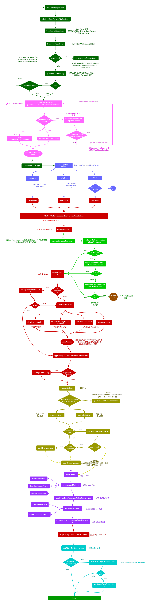

# 一、Spring结构

## 1、Spring的模块结构


### 1.1、Spring 核心容器

对应图上的Core Container，该层基本上是 Spring Framework 的核心。它包含以下模块：
- Spring Core
- Spring Bean：核心容器提供 Spring 框架的基本功能。核心容器的主要组件是 BeanFactory，它是工厂模式的实现。BeanFactory 使用控制反转 （IOC）模式将应用程序的配置和依赖性规范与实际的应用程序代码分开
- Spring Context：Spring 上下文是一个配置文件，向 Spring 框架提供上下文信息。Spring 上下文包括企业服务，例如 JNDI、EJB、电子邮件、国际化、事件机制、校验和调度功能
- SpEL (Spring Expression Language)：Spring 表达式语言全称为 “Spring Expression Language”，缩写为 “SpEL” ，类似于 Struts2 中使用的 OGNL 表达式语言，能在运行时构建复杂表达式、存取对象图属性、对象方法调用等等，并且能与 Spring 功能完美整合，如能用来配置 Bean 定义

或者说这块就是IOC

### 1.2、数据访问

对应图中，Data Access；该层提供与数据库交互的支持。它包含以下模块：
- JDBC (Java DataBase Connectivity)：Spring 对 JDBC 的封装模块，提供了对关系数据库的访问。
- ORM (Object Relational Mapping)：Spring ORM 模块，提供了对 hibernate5 和 JPA 的集成
- OXM (Object XML Mappers)：Spring 提供了一套类似 ORM 的映射机制，用来将 Java 对象和 XML 文件进行映射。这就是 Spring 的对象 XML 映射功能，有时候也成为 XML 的序列化和反序列化；
- Transaction：Spring 简单而强大的事务管理功能，包括声明式事务和编程式事务。

### 1.3、Web

该层提供了创建 Web 应用程序的支持。它包含以下模块：

- WebMVC：MVC 框架是一个全功能的构建 Web 应用程序的 MVC 实现。通过策略接口，MVC 框架变成为高度可配置的，MVC 容纳了大量视图技术，其中包括 JSP、Velocity、Tiles、iText 和 POI
- WebFlux：基于 Reactive 库的响应式的 Web 开发框架；
- WebSocket：Spring 4.0 的一个最大更新是增加了对 Websocket 的支持。Websocket 提供了一个在 Web 应用中实现高效、双向通讯，需考虑客户端(浏览器)和服务端之间高频和低延时消息交换的机制。一般的应用场景有：在线交易、网页聊天、游戏、协作、数据可视化等

### 1.4、AOP

该层支持面向切面编程。它包含以下模块：

- AOP：通过配置管理特性，Spring AOP 模块直接将面向方面的编程功能集成到了 Spring 框架中。所以，可以很容易地使 Spring 框架管理的任何对象支持 AOP。Spring AOP 模块为基于 Spring 的应用程序中的对象提供了事务管理服务。通过使用 Spring AOP，不用依赖 EJB 组件，就可以将声明性事务管理集成到应用程序中；
- Aspects：该模块为与 AspectJ 的集成提供支持；
- Instrumentation：该层为类检测和类加载器实现提供支持

### 1.5、其它

- JMS (Java Messaging Service)：提供了一个 JMS 集成框架，简化了 JMS API 的使用。
- Test：该模块为使用 JUnit 和 TestNG 进行测试提供支持；
- Messaging：该模块为 STOMP 提供支持。它还支持注解编程模型，该模型用于从 WebSocket 客户端路由和处理 STOMP 消息


# 二、IOC

## 1、IOC的生命周期

Spring的IOC容器功能非常强大，负责Spring的Bean的创建和管理等功能。`BeanFactory`和`ApplicationContext`是Spring两种很重要的容器，前者提供了最基本的依赖注入的支持，而后者在继承前者的基础进行了功能的拓展，例如增加了事件传播、资源访问和国际化的消息访问等功能；

## 2、IOC生命周期

### 2.1、BeanFactory Bean生命周期-面向Spring本身


`BeanFactory`生产 bean 的工厂，它负责生产和管理各个 bean 实例，在容器中，Bean的生命周期如上图所示，与`ApplicationContext`相比，有如下几点不同：
- `BeanFactory`容器中，不会调用`ApplicationContextAware`接口的`setApplicationContext()`方法
- `BeanPostProcessor`接口的`postProcessBeforeInitialization`方法和`postProcessAfterInitialization`方法不会自动调用，必须自己通过代码手动注册
- `BeanFactory`容器启动的时候，不会去实例化所有bean，包括所有scope为singleton且非延迟加载的bean也是一样，而是在调用的时候去实例化

### 2.2、ApplicationContext Bean生命周期-面向开发者


面向开发者的，几乎大部分应用场景都是直接使用`ApplicationContext` 而非底层的`BeanFactory`

- （1）Bean的实例化：
	* 首先容器启动后，会对`scope`为`singleton`且非懒加载的bean进行实例化；
	* 容器在内部实现的时候，采用`策略模式`来决定采用何种方式初始化bean实例。通常，可以通过反射或者CGLIB动态字节码生成来初始化相应的bean实例或者动态生成其子类默认情况下，容器内部采用 `CglibSubclassingInstantiationStrategy`。容器只要根据相应bean定义的`BeanDefinitio`n取得实例化信息，结合`CglibSubclassingInstantiationStrategy`以及不同的bean定义类型，就可以返回实例化完成的对象实例。但不是直接返回构造完成的对象实例，而是以BeanWrapper对构造完成的对象实例进行包裹，返回相应的`BeanWrapper`实例，这个`BeanWrapper`的实现类`BeanWrapperImpl`是对某个bean进行包裹，然后对包裹后的bean进行操作，比如设置或获取bean的相应属性值；

- （2）设置对象属性：

	`BeanWrapper`继承了`PropertyAccessor`接口，可以以同一的方式对对象属性进行访问，同时又继承了`PropertyEditorRegistry`和`TypeConverter`接口，然后`BeanWrapper`就可以很方便地对bean注入属性了；

- （3）如果`Bean`实现了`BeanNameAware`接口，会回调该接口的`setBeanName()`方法，传入该bean的id，此时该Bean就获得了自己在配置文件中的id；

- （4）如果`Bean`实现了`BeanFactoryAware`接口，会回调该接口的`setBeanFactory()`方法，传入该Bean的BeanFactory，这样该Bean就获得了自己所在的BeanFactory

- （5）如果`Bean`实现了`ApplicationContextAware`接口，会回调该接口的`setApplicationContext()`方法，传入该Bean的`ApplicationContext`，这样该Bean就获得了自己所在的`ApplicationContext`

- （6）如果有一个`Bean`实现了`BeanPostProcessor`接口，并将该接口配置到配置文件中，则会调用该接口的`postProcessBeforeInitialization()`方法

- （7）如果`Bean`实现了`InitializingBean`接口，则会回调该接口的`afterPropertiesSet()`方法

- （8）如果`Bean`配置了`init-method`方法，则会执行`init-method`配置的方法；

- （9）如果有一个`Bean`实现了`BeanPostProcessor`接口，并将该接口配置到配置文件中，则会调用该接口的`postProcessAfterInitialization`方法；

- （10）经过步骤9之后，就可以正式使用该Bean了，对于scope为singleton的Bean，Spring IoC容器会缓存一份该Bean的实例，而对于scope为prototype的Bean，每次被调用都回new一个对象，而且生命周期也交给调用方管理了，不再是Spring容器进行管理了；

- （11）容器关闭后，如果`Bean`实现了`DisposableBean`接口，则会调用该接口的`destroy()`方法；

- （12）如果Bean配置了`destroy-method`方法，则会执行`destroy-method`配置的方法.至此，整个Bean生命周期结束；

## 3、IOC源码体系

- Bean：本质是Java对象，该对象由容器来生成

- Resource 体系：`org.springframework.core.io.Resource`，对资源的抽象。它的每一个实现类都代表了一种资源的访问策略，如 ClassPathResource、RLResource、FileSystemResource 等；

- ResourceLoader 体系：有了资源，就应该有资源加载，Spring 利用 `org.springframework.core.io.ResourceLoader` 来进行统一资源加载

- BeanFactory 体系：`org.springframework.beans.factory.BeanFactory`，是一个非常纯粹的 bean 容器，它是 IoC 必备的数据结构，其中 BeanDefinition 是它的基本结构。BeanFactory 内部维护着一个BeanDefinition map ，并可根据 BeanDefinition 的描述进行 bean 的创建和管理；
    - BeanFactory 有三个直接子类 ListableBeanFactory、HierarchicalBeanFactory 和 AutowireCapableBeanFactory 。
    - DefaultListableBeanFactory 为最终默认实现，它实现了所有接口，因为其不仅实现了 ConfigurableListableBeanFactory，还实现了 AbstractAutowireCapableBeanFactory；ApplicationContext 接口能获取到 AutowireCapableBeanFactory，然后它向下转型就能得到 DefaultListableBeanFactory 了；

    

- BeanDefinition 体系：`org.springframework.beans.factory.config.BeanDefinition`，用来描述 Spring 中的 Bean 对象；比如这个 Bean 指向的是哪个类、是否是单例的（scope）、是否懒加载（lazy-init或@Lazy）、这个 Bean 依赖了哪些 Bean、首选 primary（@Primary）是true的表示bean该bean回事优先的实现类、factory-bean和factory-method；Spring 默认不同文件的Bean会出现Bean的覆盖；

- BeanDefinitionReader 体系：`org.springframework.beans.factory.support.BeanDefinitionReader` 的作用是读取 Spring 的配置文件的内容，并将其转换成 Ioc 容器内部的数据结构 ：BeanDefinition；并借助 BeanDefinitionRegistry注册到容器中

- ApplicationContext 体系：org.springframework.context.ApplicationContext ，Spring 容器，它叫做应用上下文。它继承 BeanFactory ，所以它是 BeanFactory 的扩展升级版，由于 ApplicationContext 的结构就决定了它与 BeanFactory 的不同，其主要区别有：
    - 继承 `org.springframework.context.MessageSource` 接口，提供国际化的标准访问策略。
    - 继承 `org.springframework.context.ApplicationEventPublisher` 接口，提供强大的事件机制。
    - 扩展 ResourceLoader ，可以用来加载多种 Resource ，可以灵活访问不同的资源。
    - 对 Web 应用的支持

## 4、IOC容器的启动过程

web环境下`Spring\SpringMVC`容器启动过程

- （1）对于一个web应用，其部署在web容器中，web容器提供一个全局的上下文环境，即`ServletContext`，其为后面的`SpringIOC`容器提宿主环境；

- （2）`web.xml`中配置`ContextLoaderListener`在web容器启动时，会触发容器初始化事件，`ContextLoaderListener`会监听到这个事件，其`contextInitialized()`方法被调用，在这个方法中，spring会初始化一个启动上下文，这个上下文被称为`根上下文`，即`WebApplicationContext`。其实际实现类是`XmlWebApplicationContext`。这个就是Spring的IOC容器。其对应的Bean定义的配置由web.xml中的context-param标签指定.在这个IoC容器初始化完毕后，spring容器以`WebApplicationContext.ROOTWEBAPPLICATIONCONTEXTATTRIBUTE`为属性Key，将其存储到`ServletContext`中，便于获取；

- （3）`ContextLoaderListener`监听器初始化完毕后，始初始化`web.xml`中配置的`Servlet`，可以有多个。以最常见的`DispatcherServlet`为例（Spring MVC，这个servlet实际上是一个标准的前端控制器，用以转发、匹配、处理每个servlet请求。`DispatcherServlet上下文`在初始化的时候会建立自己的IoC上下文容器，用以持有spring mvc相关的bean，这个servlet自己持有的上下文默认实现类也是`XmlWebApplicationContext`。在建立`DispatcherServlet`自己的IoC上下文时，会利用`WebApplicationContext.ROOTWEBAPPLICATIONCONTEXTATTRIBUTE`先从`ServletContext`中获取之前的根上下文（即`WebApplicationContext`）作为自己上下文的parent上下文）即第2步中初始化的`XmlWebApplicationContext`作为自己的父容器）.有了这个parent上下文之后，再初始化自己持有的上下文（这个`DispatcherServlet`初始化自己上下文的工作在其`initStrategies`方法中可以看到，大概的工作就是初始化处理器映射、视图解析等）。初始化完毕后，spring以与servlet的名字相关（此处不是简单的以servlet名为Key，而是通过一些转换）的属性为属性Key，也将其存到`ServletContext`中，以便后续使用.这样每个servlet就持有自己的上下文，即拥有自己独立的bean空间，同时各个servlet共享相同的bean，即根上下文定义的那些bean

## 5、Bean加载过程

Spring bean的生命周期主要方法：`org.springframework.beans.factory.support.AbstractAutowireCapableBeanFactory#doCreateBean`


- `ResourceLoader`从存储介质中加载Spring配置信息，并使用Resource表示这个配置文件的资源。

- `BeanDefinitionReader`读取`Resource`所指向的配置文件资源，然后解析配置文件。配置文件中每一个`<bean>`解析成一个`BeanDefinition`对象，并保存到`BeanDefinitionRegistry`中；

- 容器扫描`BeanDefinitionRegistry`中的`BeanDefinition`，使用Java的反射机制自动识别出Bean工厂后处理后器（实现`BeanFactoryPostProcessor`接口）的Bean，然后调用这些Bean工厂后处理器对`BeanDefinitionRegistry`中的`BeanDefinition`进行加工处理。主要完成以下两项工作：
	* 对使用到占位符的`<bean>`元素标签进行解析，得到最终的配置值，这意味对一些半成品式的`BeanDefinition`对象进行加工处理并得到成品的`BeanDefinition`对象;
	* 对`BeanDefinitionRegistry`中的`BeanDefinition`进行扫描，通过Java反射机制找出所有属性编辑器的Bean（实现`java.beans.PropertyEditor`接口的Bean），并自动将它们注册到Spring容器的属性编辑器注册表中（`PropertyEditorRegistry`）

- Spring容器从`BeanDefinitionRegistry`中取出加工后的`BeanDefinition`，并调用`InstantiationStrategy`着手进行Bean实例化的工作；

- 在实例化Bean时，Spring容器使用`BeanWrapper`对Bean进行封装，`BeanWrapper`提供了很多以Java反射机制操作Bean的方法，它将结合该Bean的`BeanDefinition`以及容器中属性编辑器，完成Bean属性的设置工作；

- 利用容器中注册的Bean后处理器(实现BeanPostProcessor接口的Bean)对已经完成属性设置工作的Bean进行后续加工，直接装配出一个准备就绪的Bean

## 6、refresh方法源码

`AbstractApplicationContext.refresh()`，其实一个同步方法
```java
// org.springframework.context.support.AbstractApplicationContext.refresh() 方法实现如下：
/**
* 加载或刷新一个持久化的配置，可能是XML文件、属性文件或关系数据库模式。
* 由于这是一种启动方法，如果失败，应该销毁已经创建的单例，以避免悬空资源。
* 换句话说，在调用该方法之后，要么全部实例化，要么完全不实例化。
* @throws 如果bean工厂无法初始化，则抛出 BeansException 异常
* @throws 如果已经初始化且不支持多次刷新，则会抛出 IllegalStateException 异常
*/
@Override
public void refresh() throws BeansException, IllegalStateException {
    // 给容器refresh加锁，避免容器处在refresh阶段时，容器进行了初始化或者销毁的操作
    synchronized (this.startupShutdownMonitor) {
        // 调用容器准备刷新的方法，获取容器的当时时间，同时给容器设置同步标识，具体方法
        prepareRefresh();

        //告诉子类启动refreshBeanFactory()方法，Bean定义资源文件的载入从
        //子类的refreshBeanFactory()方法启动，里面有抽象方法
        //针对xml配置，最终创建内部容器，该容器负责 Bean 的创建与管理，此步会进行BeanDefinition的注册
        ConfigurableListableBeanFactory beanFactory = obtainFreshBeanFactory();
        // 注册一些容器中需要的系统Bean.例如classloader，beanfactoryPostProcessor等
        prepareBeanFactory(beanFactory);

        try {
            //允许容器的子类去注册postProcessor  ，钩子方法
            postProcessBeanFactory(beanFactory);
            // 激活在容器中注册为bean的BeanFactoryPostProcessors
            //对于注解容器，org.springframework.context.annotation.ConfigurationClassPostProcessor#postProcessBeanDefinitionRegistry
            //方法扫描应用中所有BeanDefinition并注册到容器之中
            invokeBeanFactoryPostProcessors(beanFactory);
            // 注册拦截bean创建过程的BeanPostProcessor
            registerBeanPostProcessors(beanFactory);
            // 找到“messageSource”的Bean提供给ApplicationContext使用，
            // 使得ApplicationContext具有国际化能力。
            initMessageSource();
            // 初始化ApplicationEventMulticaster该类作为事件发布者，
            // 可以存储所有事件监听者信息，并根据不同的事件，通知不同的事件监听者。
            initApplicationEventMulticaster();
            // 预留给 AbstractApplicationContext 的子类用于初始化其他特殊的 bean，
            // 该方法需要在所有单例 bean 初始化之前调用
            // 比如Web容器就会去初始化一些和主题展示相关的Bean（ThemeSource）
            onRefresh();
            // 注册监听器（检查监听器的bean并注册它们）
            registerListeners();
            //设置自定义的类型转化器ConversionService，
            // 设置自定义AOP相关的类LoadTimeWeaverAware，
            // 清除临时的ClassLoader
            // ，实例化所有的类（懒加载的类除外）
            finishBeanFactoryInitialization(beanFactory);
            // 初始化容器的生命周期事件处理器，（默认使用DefaultLifecycleProcessor），调用扩展了SmartLifecycle接口的start方法
            // 当Spring容器加载所有bean并完成初始化之后，会接着回调实现该接口的类中对应的方法（start()方法）
            // 并发布容器刷新完毕事件ContextRefreshedEvent给对应的事件监听者
            finishRefresh();
        } catch (BeansException ex) {
            // Destroy already created singletons to avoid dangling resources.
            //销毁已创建的Bean
            destroyBeans();
            // Reset 'active' flag.
            //取消refresh操作，重置容器的同步标识
            cancelRefresh(ex);
            // Propagate exception to caller.
            throw ex;
        } finally {
            // 重置Spring内核中的共用的缓存，因为我们可能再也不需要单例bean的元数据了……
            resetCommonCaches();
        }
    }
}
```

### 6.1、prepareRefresh()：刷新前预处理

```java
protected void prepareRefresh() {
    this.startupDate = System.currentTimeMillis();
    this.closed.set(false);
    this.active.set(true);
    if (logger.isInfoEnabled()) {
        logger.info("Refreshing " + this);
    }
    // Initialize any placeholder property sources in the context environment
    initPropertySources();
    // Validate that all properties marked as required are resolvable
    // see ConfigurablePropertyResolver#setRequiredProperties
    getEnvironment().validateRequiredProperties();
    // Allow for the collection of early ApplicationEvents,
    // to be published once the multicaster is available...
    this.earlyApplicationEvents = new LinkedHashSet<ApplicationEvent>();
}
```
- `initPropertySources()`：初始化一些属性设置；子类自定义个性化的属性设置方法；这个方法是由子类来实现的
- `getEnvironment().validateRequiredProperties();`检验属性的合法等;
- `earlyApplicationEvents= new LinkedHashSet<ApplicationEvent>();`保存容器中的一些早期的事件；

### 6.2、obtainFreshBeanFactory()：获取BeanFactory

```java
protected ConfigurableListableBeanFactory obtainFreshBeanFactory() {
    // 关闭旧的 BeanFactory (如果有)，创建新的 BeanFactory，加载 Bean 定义、注册 Bean 等等
    refreshBeanFactory();
    ConfigurableListableBeanFactory beanFactory = getBeanFactory();
    if (logger.isDebugEnabled()) {
        logger.debug("Bean factory for " + getDisplayName() + ": " + beanFactory);
    }
    return beanFactory;
}
```
- `refreshBeanFactory();`刷新【创建】BeanFactory；创建了一个 `this.beanFactory = new DefaultListableBeanFactory();`设置id；

    ```java
    @Override
    protected final void refreshBeanFactory() throws BeansException {
        // 如果 ApplicationContext 中已经加载过 BeanFactory 了，销毁所有 Bean，关闭 BeanFactory
        // 注意，应用中 BeanFactory 本来就是可以多个的，这里可不是说应用全局是否有 BeanFactory，而是当前
        // ApplicationContext 是否有 BeanFactory
        if (hasBeanFactory()) {
            destroyBeans();
            closeBeanFactory();
        }
        try {
            // 初始化一个 DefaultListableBeanFactory，为什么用这个，我们马上说。
            DefaultListableBeanFactory beanFactory = createBeanFactory();
            // 用于 BeanFactory 的序列化，我想不部分人应该都用不到
            beanFactory.setSerializationId(getId());
            // 设置 BeanFactory 的两个配置属性：是否允许 Bean 覆盖、是否允许循环引用
            customizeBeanFactory(beanFactory);
            // 根据配置，加载各个 Bean 到 BeanFactory 中
            loadBeanDefinitions(beanFactory);
            synchronized (this.beanFactoryMonitor) {
                this.beanFactory = beanFactory;
            }
        }
        ...
    }
    ```
- `getBeanFactory();`返回刚才GenericApplicationContext创建的BeanFactory对象；
- 将创建的BeanFactory即`DefaultListableBeanFactory`返回；

### 6.3、prepareBeanFactory(beanFactory)

```java
/**
    * 为BeanFactory设置各种功能，
    * 例如容器的ClassLoader类加载器和post-processors后置处理器。
    * @param beanFactory 要配置的bean工厂
    */
protected void prepareBeanFactory(ConfigurableListableBeanFactory beanFactory) {
    // 告诉内部bean工厂使用容器的类加载器
    beanFactory.setBeanClassLoader(getClassLoader());
    // 设置beanFactory的表达式语言处理器,Spring3开始增加了对语言表达式的支持,默认可以使用#{bean.xxx}的形式来调用相关属性值
    beanFactory.setBeanExpressionResolver(new StandardBeanExpressionResolver(beanFactory.getBeanClassLoader()));
    // 为beanFactory增加一个默认的propertyEditor
    beanFactory.addPropertyEditorRegistrar(new ResourceEditorRegistrar(this, getEnvironment()));
    //添加该处理器的作用：当应用程序定义的Bean实现ApplicationContextAware接口时注入ApplicationContext对象
    beanFactory.addBeanPostProcessor(new ApplicationContextAwareProcessor(this));
    // 如果某个 bean 依赖于以下几个接口的实现类，在自动装配的时候忽略它们，
    // Spring 会通过其他方式来处理这些依赖。
    beanFactory.ignoreDependencyInterface(EnvironmentAware.class);
    beanFactory.ignoreDependencyInterface(EmbeddedValueResolverAware.class);
    beanFactory.ignoreDependencyInterface(ResourceLoaderAware.class);
    beanFactory.ignoreDependencyInterface(ApplicationEventPublisherAware.class);
    beanFactory.ignoreDependencyInterface(MessageSourceAware.class);
    beanFactory.ignoreDependencyInterface(ApplicationContextAware.class);
    // 修正依赖，这里是注册一些自动装配的特殊规则，比如是BeanFactory class接口的实现类，则在运行时修指定为当前BeanFactory
    beanFactory.registerResolvableDependency(BeanFactory.class, beanFactory);
    beanFactory.registerResolvableDependency(ResourceLoader.class, this);
    beanFactory.registerResolvableDependency(ApplicationEventPublisher.class, this);
    beanFactory.registerResolvableDependency(ApplicationContext.class, this);

    // 注册早期后置处理器，用于检测内部bean作为应用程序监听器
    //ApplicationListenerDetector的作用就是判断某个Bean是否是ApplicationListener，
    // 如果是，加入到事件监听者队列。
    beanFactory.addBeanPostProcessor(new ApplicationListenerDetector(this));

    // 如果找到一个LoadTimeWeaver，那么就准备将后置处理器“织入”bean工厂
    if (beanFactory.containsBean(LOAD_TIME_WEAVER_BEAN_NAME)) {
        beanFactory.addBeanPostProcessor(new LoadTimeWeaverAwareProcessor(beanFactory));
        // 为类型匹配设置临时类加载器.
        beanFactory.setTempClassLoader(new ContextTypeMatchClassLoader(beanFactory.getBeanClassLoader()));
    }

    // 注册默认environment环境bean
    if (!beanFactory.containsLocalBean(ENVIRONMENT_BEAN_NAME)) {
        beanFactory.registerSingleton(ENVIRONMENT_BEAN_NAME, getEnvironment());
    }
    if (!beanFactory.containsLocalBean(SYSTEM_PROPERTIES_BEAN_NAME)) {
        beanFactory.registerSingleton(SYSTEM_PROPERTIES_BEAN_NAME, getEnvironment().getSystemProperties());
    }
    if (!beanFactory.containsLocalBean(SYSTEM_ENVIRONMENT_BEAN_NAME)) {
        beanFactory.registerSingleton(SYSTEM_ENVIRONMENT_BEAN_NAME, getEnvironment().getSystemEnvironment());
    }
}
```

`BeanFactory`的预准备工作（BeanFactory进行一些设置）；
- 设置BeanFactory的类加载器、支持表达式解析器...
- 添加部分`BeanPostProcessor【ApplicationContextAwareProcessor】`
- 设置忽略的自动装配的接口`EnvironmentAware、EmbeddedValueResolverAware、xxx；`
- 注册可以解析的自动装配；我们能直接在任何组件中自动注入：`BeanFactory、ResourceLoader、ApplicationEventPublisher、ApplicationContext`
- 添加`BeanPostProcessor【ApplicationListenerDetector】`
- 添加编译时的AspectJ；
- 给BeanFactory中注册一些能用的组件；
    - environment【ConfigurableEnvironment】、
    - systemProperties【`Map<String, Object>`】、
    - systemEnvironment【`Map<String, Object>`】

### 6.4、postProcessBeanFactory(beanFactory);

BeanFactory准备工作完成后进行的后置处理工作；子类通过重写这个方法来在BeanFactory创建并预准备完成以后做进一步的设置

---
***=================以上是BeanFactory的创建及预准备工作=================***

### 6.5、invokeBeanFactoryPostProcessors(beanFactory);

```java
protected void invokeBeanFactoryPostProcessors(ConfigurableListableBeanFactory beanFactory) {
    PostProcessorRegistrationDelegate.invokeBeanFactoryPostProcessors(beanFactory, getBeanFactoryPostProcessors());
    // Detect a LoadTimeWeaver and prepare for weaving, if found in the meantime
    // (e.g. through an @Bean method registered by ConfigurationClassPostProcessor)
    if (beanFactory.getTempClassLoader() == null && beanFactory.containsBean(LOAD_TIME_WEAVER_BEAN_NAME)) {
        beanFactory.addBeanPostProcessor(new LoadTimeWeaverAwareProcessor(beanFactory));
        beanFactory.setTempClassLoader(new ContextTypeMatchClassLoader(beanFactory.getBeanClassLoader()));
    }
}
```
执行`BeanFactoryPostProcessor`的方法；`BeanFactoryPostProcessor：BeanFactory`的后置处理器。在BeanFactory标准初始化之后执行的；

两个接口：`BeanFactoryPostProcessor、BeanDefinitionRegistryPostProcessor`；执行BeanFactoryPostProcessor的方法，其具体调用的方法是：`PostProcessorRegistrationDelegate.invokeBeanFactoryPostProcessors(oConfigurableListableBeanFactory, List<BeanFactoryPostProcessor>)`

**先执行BeanDefinitionRegistryPostProcessor**

- 获取所有的BeanDefinitionRegistryPostProcessor；
- 先执行实现了`PriorityOrdered`优先级接口的`BeanDefinitionRegistryPostProcessor`，`postProcessor.postProcessBeanDefinitionRegistry(registry)`;
- 在执行实现了`Ordered`顺序接口的`BeanDefinitionRegistryPostProcessor`；`postProcessor.postProcessBeanDefinitionRegistry(registry)`；
- 最后执行没有实现任何优先级或者是顺序接口的`BeanDefinitionRegistryPostProcessors；postProcessor.postProcessBeanDefinitionRegistry(registry);`

**再执行BeanFactoryPostProcessor的方法**
- 获取所有的BeanFactoryPostProcessor；
- 先执行实现了PriorityOrdered优先级接口的`BeanFactoryPostProcessor、postProcessor.postProcessBeanFactory()`
- 在执行实现了Ordered顺序接口的`BeanFactoryPostProcessor；postProcessor.postProcessBeanFactory()`
- 最后执行没有实现任何优先级或者是顺序接口的`BeanFactoryPostProcessor；postProcessor.postProcessBeanFactory()；`

### 6.6、registerBeanPostProcessors(beanFactory);

```java
// Separate between BeanPostProcessors that implement PriorityOrdered,
// Ordered, and the rest.
List<BeanPostProcessor> priorityOrderedPostProcessors = new ArrayList<BeanPostProcessor>();
List<BeanPostProcessor> internalPostProcessors = new ArrayList<BeanPostProcessor>();
List<String> orderedPostProcessorNames = new ArrayList<String>();
List<String> nonOrderedPostProcessorNames = new ArrayList<String>();
```
注册BeanPostProcessor（Bean的后置处理器）【 intercept bean creation】，不同接口类型的BeanPostProcessor；在Bean创建前后的执行时机是不一样的，实际调用方法：`PostProcessorRegistrationDelegate.registerBeanPostProcessors(ConfigurableListableBeanFactory, AbstractApplicationContext)`

`BeanPostProcessor、DestructionAwareBeanPostProcessor、InstantiationAwareBeanPostProcessor、SmartInstantiationAwareBeanPostProcessor、MergedBeanDefinitionPostProcessor【internalPostProcessors】、`

- 获取所有的 BeanPostProcessor；后置处理器都默认可以通过PriorityOrdered、Ordered接口来执行优先级;
- 先注册PriorityOrdered优先级接口的BeanPostProcessor；把每一个BeanPostProcessor；添加到BeanFactory中,`beanFactory.addBeanPostProcessor(postProcessor);`
- 再注册Ordered接口的;
- 最后注册没有实现任何优先级接口的;
- 最终注册MergedBeanDefinitionPostProcessor；
- 注册一个ApplicationListenerDetector；来在Bean创建完成后检查是否是ApplicationListener，如果是`applicationContext.addApplicationListener((ApplicationListener<?>) bean);`

### 6.7、initMessageSource();

初始化MessageSource组件（做国际化功能；消息绑定，消息解析）；
- 获取BeanFactory；
- 看容器中是否有id为messageSource的，类型是MessageSource的组件，如果有赋值给messageSource；如果没有自己创建一个`DelegatingMessageSource；MessageSource`：取出国际化配置文件中的某个key的值；能按照区域信息获取；
- 把创建好的MessageSource注册在容器中，以后获取国际化配置文件的值的时候，可以自动注入MessageSource；
```java
beanFactory.registerSingleton(MESSAGE_SOURCE_BEAN_NAME, this.messageSource);	
MessageSource.getMessage(String code, Object[] args, String defaultMessage, Locale locale);
```

### 6.8、initApplicationEventMulticaster();

初始化事件派发器；主要是针对事件的处理
```java
protected void initApplicationEventMulticaster() {
    ConfigurableListableBeanFactory beanFactory = getBeanFactory();
    // 从BeanFactory中获取applicationEventMulticaster的ApplicationEventMulticaster；
    if (beanFactory.containsLocalBean(APPLICATION_EVENT_MULTICASTER_BEAN_NAME)) {
        this.applicationEventMulticaster =
                beanFactory.getBean(APPLICATION_EVENT_MULTICASTER_BEAN_NAME, ApplicationEventMulticaster.class);
    }
    else {
        // 如果上一步没有配置；创建一个SimpleApplicationEventMulticaster
        this.applicationEventMulticaster = new SimpleApplicationEventMulticaster(beanFactory);
        // 将创建的ApplicationEventMulticaster添加到BeanFactory中，以后其他组件直接自动注入
        beanFactory.registerSingleton(APPLICATION_EVENT_MULTICASTER_BEAN_NAME, this.applicationEventMulticaster);
    }
}
```

### 6.9、onRefresh()

子类重写这个方法，在容器刷新的时候可以自定义逻辑；在web应用中，主要是创建web容器
```java
protected void onRefresh() throws BeansException {
    // For subclasses: do nothing by default.
}
```

### 6.10、registerListeners();

给容器中将所有项目里面的ApplicationListener注册进来；派发早期事件
```java
protected void registerListeners() {
    // 从容器中拿到所有的ApplicationListener，并将每个监听器添加到事件派发器中；
    for (ApplicationListener<?> listener : getApplicationListeners()) {
        getApplicationEventMulticaster().addApplicationListener(listener);
    }
    // Do not initialize FactoryBeans here: We need to leave all regular beans
    // uninitialized to let post-processors apply to them!
    String[] listenerBeanNames = getBeanNamesForType(ApplicationListener.class, true, false);
    for (String listenerBeanName : listenerBeanNames) {
        getApplicationEventMulticaster().addApplicationListenerBean(listenerBeanName);
    }
    // 派发之前步骤产生的事件
    Set<ApplicationEvent> earlyEventsToProcess = this.earlyApplicationEvents;
    this.earlyApplicationEvents = null;
    if (earlyEventsToProcess != null) {
        for (ApplicationEvent earlyEvent : earlyEventsToProcess) {
            getApplicationEventMulticaster().multicastEvent(earlyEvent);
        }
    }
}
```

### 6.11、finishBeanFactoryInitialization(beanFactory)

初始化所有剩下的单实例bean；这一步骤是比较繁琐的
```java
protected void finishBeanFactoryInitialization(ConfigurableListableBeanFactory beanFactory) {
    // Initialize conversion service for this context.
    if (beanFactory.containsBean(CONVERSION_SERVICE_BEAN_NAME) &&  beanFactory.isTypeMatch(CONVERSION_SERVICE_BEAN_NAME, ConversionService.class)) {
        beanFactory.setConversionService(beanFactory.getBean(CONVERSION_SERVICE_BEAN_NAME, ConversionService.class));
    }
    // Register a default embedded value resolver if no bean post-processor
    // (such as a PropertyPlaceholderConfigurer bean) registered any before:
    // at this point, primarily for resolution in annotation attribute values.
    if (!beanFactory.hasEmbeddedValueResolver()) {
        beanFactory.addEmbeddedValueResolver(new StringValueResolver() {
            @Override
            public String resolveStringValue(String strVal) {
                return getEnvironment().resolvePlaceholders(strVal);
            }
        });
    }
    // Initialize LoadTimeWeaverAware beans early to allow for registering their transformers early.
    String[] weaverAwareNames = beanFactory.getBeanNamesForType(LoadTimeWeaverAware.class, false, false);
    for (String weaverAwareName : weaverAwareNames) {
        getBean(weaverAwareName);
    }
    // Stop using the temporary ClassLoader for type matching.
    beanFactory.setTempClassLoader(null);
    // Allow for caching all bean definition metadata, not expecting further changes.
    beanFactory.freezeConfiguration();
    // Instantiate all remaining (non-lazy-init) singletons.
    beanFactory.preInstantiateSingletons();
}
```
- `org.springframework.beans.factory.support.DefaultListableBeanFactory#preInstantiateSingletons`
- `org.springframework.beans.factory.support.AbstractBeanFactory#doGetBean`

- 获取容器中的所有Bean，依次进行初始化和创建对象;
- 获取Bean的定义信息：RootBeanDefinition;
- Bean不是抽象的，是单实例的，是懒加载；
    - 判断是否是FactoryBean；是否是实现FactoryBean接口的Bean；
    - 不是工厂Bean。利用getBean(beanName);创建对象
        - `getBean(beanName)； ioc.getBean();`
        - `doGetBean(name, null, null, false);`
        - 先获取缓存中保存的单实例Bean。如果能获取到说明这个Bean之前被创建过（所有创建过的单实例Bean都会被缓存起来）
            从`private final Map<String, Object> singletonObjects = new ConcurrentHashMap<String, Object>(256);`获取的；
        - 缓存中获取不到，开始Bean的创建对象流程；
        - 标记当前bean已经被创建；
        - 获取Bean的定义信息；
        - 【获取当前Bean依赖的其他Bean;如果有按照getBean()把依赖的Bean先创建出来；】
        - 启动单实例Bean的创建流程：
            - createBean(beanName, mbd, args);
            - `Object bean = resolveBeforeInstantiation(beanName, mbdToUse);`让BeanPostProcessor先拦截返回代理对象；
				- 【InstantiationAwareBeanPostProcessor】：提前执行；先触发：postProcessBeforeInstantiation()；如果有返回值：触发postProcessAfterInitialization()；；
            - 如果前面的InstantiationAwareBeanPostProcessor没有返回代理对象；调用下面步骤
            - `Object beanInstance = doCreateBean(beanName, mbdToUse, args);`创建Bean
                - 【创建Bean实例】；createBeanInstance(beanName, mbd, args);利用工厂方法或者对象的构造器创建出Bean实例；
                - `applyMergedBeanDefinitionPostProcessors(mbd, beanType, beanName); `调用`MergedBeanDefinitionPostProcessor的postProcessMergedBeanDefinition(mbd, beanType, beanName);`;
                - 【Bean属性赋值】populateBean(beanName, mbd, instanceWrapper);
                    
                    赋值之前
                    - 拿到InstantiationAwareBeanPostProcessor后置处理器；postProcessAfterInstantiation()；
                    - 拿到InstantiationAwareBeanPostProcessor后置处理器；postProcessPropertyValues()；
                    - 应用Bean属性的值；为属性利用setter方法等进行赋值；applyPropertyValues(beanName, mbd, bw, pvs);
                - 【Bean初始化】initializeBean(beanName, exposedObject, mbd);
                    - 【执行Aware接口方法】invokeAwareMethods(beanName, bean);执行xxxAware接口的方法：`BeanNameAware\BeanClassLoaderAware\BeanFactoryAware`
                    - 【执行后置处理器初始化之前】`applyBeanPostProcessorsBeforeInitialization(wrappedBean, beanName);``BeanPostProcessor.postProcessBeforeInitialization（）;`
                    - 【执行初始化方法】invokeInitMethods(beanName, wrappedBean, mbd);
                        - 是否是InitializingBean接口的实现；执行接口规定的初始化；
                        - 是否自定义初始化方法；
                    - 【执行后置处理器初始化之后】applyBeanPostProcessorsAfterInitialization；BeanPostProcessor.postProcessAfterInitialization()；
                - 注册Bean的销毁方法；
            - 将创建的Bean添加到缓存中singletonObjects；

        ioc容器就是这些Map；很多的Map里面保存了单实例Bean，环境信息。。。。
    
    所有Bean都利用getBean创建完成以后；检查所有的Bean是否是SmartInitializingSingleton接口的；如果是；就执行afterSingletonsInstantiated()；

getBean的全流程：



### 6.12、finishRefresh();

完成BeanFactory的初始化创建工作；IOC容器就创建完成；
```java
protected void finishRefresh() {
    // Initialize lifecycle processor for this context.
    initLifecycleProcessor();

    // Propagate refresh to lifecycle processor first.
    getLifecycleProcessor().onRefresh();

    // Publish the final event.
    publishEvent(new ContextRefreshedEvent(this));

    // Participate in LiveBeansView MBean, if active.
    LiveBeansView.registerApplicationContext(this);
}
```
- `initLifecycleProcessor();`初始化和生命周期有关的后置处理器；LifecycleProcessor；默认从容器中找是否有lifecycleProcessor的组件【LifecycleProcessor】；如果没有new DefaultLifecycleProcessor();加入到容器；

- `getLifecycleProcessor().onRefresh();`拿到前面定义的生命周期处理器（BeanFactory）；回调onRefresh()；
- `publishEvent(new ContextRefreshedEvent(this));`发布容器刷新完成事件；
- `liveBeansView.registerApplicationContext(this);`

### 6.13、总结

refresh方法主要做的事情：
- （1）prepareRefresh()：容器刷新前的准备，设置上下文状态，获取属性，验证必要的属性等；
- （2）obtainFreshBeanFactory()：获取新的beanFactory，销毁原有beanFactory、为每个bean生成BeanDefinition等
- （3）prepareBeanFactory(beanFactory)：配置标准的beanFactory，设置ClassLoader，设置SpEL表达式解析器，添加忽略注入的接口，添加bean，添加bean后置处理器等；
- （4）postProcessBeanFactory(beanFactory)：模板方法，此时，所有的beanDefinition已经加载，但是还没有实例化。
允许在子类中对beanFactory进行扩展处理。比如添加ware相关接口自动装配设置，添加后置处理器等，是子类扩展prepareBeanFactory(beanFactory)的方法
- （5）invokeBeanFactoryPostProcessors(beanFactory)：实例化并调用所有注册的beanFactory后置处理器（实现接口BeanFactoryPostProcessor的bean，在beanFactory标准初始化之后执行）；
- （6）registerBeanPostProcessors(beanFactory)：实例化和注册beanFactory中扩展了BeanPostProcessor的bean，比如：
    - AutowiredAnnotationBeanPostProcessor(处理被@Autowired注解修饰的bean并注入)；
    - RequiredAnnotationBeanPostProcessor(处理被@Required注解修饰的方法)；
    - CommonAnnotationBeanPostProcessor(处理@PreDestroy、@PostConstruct、@Resource等多个注解的作用)等；
- （7）initMessageSource()：初始化国际化工具类MessageSource；
- （8）initApplicationEventMulticaster()：初始化事件广播器
- （9）onRefresh()：模板方法，在容器刷新的时候可以自定义逻辑，不同的Spring容器做不同的事情；
- （10）registerListeners()：注册监听器，广播early application events；
- （11）finishBeanFactoryInitialization(beanFactory)：实例化所有剩余的（非懒加载）单例，比如invokeBeanFactoryPostProcessors方法中根据各种注解解析出来的类，在这个时候都会被初始化；实例化的过程各种BeanPostProcessor开始起作用；
- （12）finishRefresh()：refresh做完之后需要做的其他事情。清除上下文资源缓存（如扫描中的ASM元数据）初始化上下文的生命周期处理器，并刷新（找出Spring容器中实现了Lifecycle接口的bean并执行start()方法）。发布ContextRefreshedEvent事件告知对应的ApplicationListener进行响应的操作

## 7、注册钩子函数

上面refresh函数式在refreshContext调用的，先注册钩子函数`SpringApplicationShutdownHook`，然后再调用 refresh
```java
private void refreshContext(ConfigurableApplicationContext context) {
    if (this.registerShutdownHook) {
        shutdownHook.registerApplicationContext(context);
    }
    refresh(context);
}
// SpringApplicationShutdownHook
void registerApplicationContext(ConfigurableApplicationContext context) {
    addRuntimeShutdownHookIfNecessary();
    synchronized (SpringApplicationShutdownHook.class) {
        assertNotInProgress();
        context.addApplicationListener(this.contextCloseListener);
        this.contexts.add(context);
    }
}
private void addRuntimeShutdownHookIfNecessary() {
    if (this.shutdownHookAdded.compareAndSet(false, true)) {
        addRuntimeShutdownHook();
    }
}
void addRuntimeShutdownHook() {
    try {
        Runtime.getRuntime().addShutdownHook(new Thread(this, "SpringApplicationShutdownHook"));
    } catch (AccessControlException ex) {
        // Not allowed in some environments
    }
}
```

# 三、AOP

[SpringAOP实现原理](https://mp.weixin.qq.com/s/1sC2KNSWyHRuPZr6NrDRnQ)

核心是采用动态代理的技术，通过字节码增强对方法进行拦截增强，以便于增加需要的额外处理逻辑

## 1、Spring Aop实现方式

AOP的实现：jdkProxy和Cglib
- 有AopProxyFactory根据AdvisedSupport对象的配置来决定；
- 默认策略如果目标类是接口，则用JDKProxy来实现，否则用后者；
- JDKProxy的核心：invocationHandler接口和Proxy类；使用Java的反射机制来实现的
- CGlib：以继承的方式动态生成目标类的代理；借助ASM实现

## 2、CGLib实现原理

CGLib代理主要通过对字节码的操作，为对象引入间接级别，以控制对象的访问。Java中有一个动态代理，那为什么不直接使用Java动态代理，而要使用CGLIB呢？答案是CGLib相比于JDK动态代理更加强大，JDK动态代理虽然简单易用，但是其有一个致命缺陷是：只能对接口进行代理。如果要代理的类为一个普通类、没有接口，那么Java动态代理就没法使用了

- CGLib 原理：动态生成一个要代理类的子类，子类重写要代理的类的所有不是final的方法。在子类中采用方法拦截的技术拦截所有父类方法的调用，顺势织入横切逻辑。它比使用java反射的JDK动态代理要快。

- CGLib 底层：使用字节码处理框架ASM，来转换字节码并生成新的类。不鼓励直接使用ASM，因为它要求你必须对JVM内部结构包括class文件的格式和指令集都很熟悉。

- CGLib 缺点：对于final方法，无法进行代理

# 四、Spring事务

## 1、Spring事务管理方式

- 编程式事务：使用TransactionTemplate，粒度控制在代码块，手动提交
- 声明式事务：xml，注解，粒度只能控制在public方法中

## 2、Spring的事务特性

### 2.1、Spring的事务管理策略

都是基于 org.springframework.transaction.PlatformTransactionManager一般使用的都是 DataSourceTransactionManager，也就是基于数据源的事务管理。DataSourceTransactionManager 实现了两个接口：PlatformTransactionManager和InitializingBean

* 实现了PlatformTransactionManager说明这个类主要功能是进行事务管理;
* 实现了InitializingBean接口，DataSourceTransactionManager进行事务管理的前提是DataSource已经成功注入.

TransactionDefinition接口里面定义了事务的隔离级别和事务的传播行为

### 2.2、Spring的事务隔离级别

在Spring的事务管理中一样，TransactionDefinition定义了5种隔离级别

```java
//底层数据库默认的隔离级别，这个与具体数据库有关系
int ISOLATION_DEFAULT = -1;
// 未提交读
int ISOLATION_READ_UNCOMMITTED = Connection.TRANSACTION_READ_UNCOMMITTED;
// 提交读：只能读取别人commit了的数据
int ISOLATION_READ_COMMITTED = Connection.TRANSACTION_READ_COMMITTED;
// 可重复读：存在幻读，不过MySQL通过MVCC解决这个问题
int ISOLATION_REPEATABLE_READ = Connection.TRANSACTION_REPEATABLE_READ;
// 串行化
int ISOLATION_SERIALIZABLE = Connection.TRANSACTION_SERIALIZABLE;
```

### 2.3、Spring事务传播行为

事务管理的传播机制，是使用 ThreadLocal 实现的。因为 ThreadLocal 是线程私有的，所以 Spring 的事务传播机制是不能够跨线程的。在问到 Spring 事务管理是否包含子线程时，要能够想到面试官的真实意图；

事务传播行为是指如果在开始当前事务之前，一个事务上下文已经存在了，此时有若干选项可以指定一个事务性方法的执行行为。在TransactionDefinition中同样定义了如下几种事务传播行为

```java
// 如果当前存在事务，则加入该事务；如果当前没有事务，则创建一个新的事务。这是默认值。
int PROPAGATION_REQUIRED = 0;
// 如果当前存在事务，则加入该事务；如果当前没有事务，则以非事务的方式继续运行。
int PROPAGATION_SUPPORTS = 1;
// 如果当前存在事务，则加入该事务；如果当前没有事务，则抛出异常。
int PROPAGATION_MANDATORY = 2;
// 创建一个新的事务，如果当前存在事务，则把当前事务挂起。
int PROPAGATION_REQUIRES_NEW = 3;
// 以非事务方式运行，如果当前存在事务，则把当前事务挂起。
int PROPAGATION_NOT_SUPPORTED = 4;
// 以非事务方式运行，如果当前存在事务，则抛出异常。
int PROPAGATION_NEVER = 5;
// 如果当前存在事务，则创建一个事务作为当前事务的嵌套事务来运行；
// 如果当前没有事务，则该取值等价于TransactionDefinition.PROPAGATION_REQUIRED。
int PROPAGATION_NESTED = 6;
```	
### 2.4、事务超时时间

一个事务允许执行的最长时间，如果超过这个限制但是事务还没有完成，则自动回滚事务。在TransactionDefinition 以int值表示超时时间，其单位是秒。默认设置为底层事务系统的超时值，如果底层数据库事务系统没有设置超时值，那么就是none，没有超时限制；

### 2.5、事务回滚规则

Spring事务管理器会捕捉任何未处理的异常，然后依据规则决定是否回滚抛出异常的事务。默认配置：spring只有在抛出的异常为运行时unchecked异常时才回滚该事务，也就是抛出的异常为RuntimeException的子类(Errors也会导致事务回滚)，而抛出checked异常则不会导致事务回滚

## 3、Spring事务实现原理

https://zhuanlan.zhihu.com/p/54067384

Spring使用AOP（面向切面编程）来实现声明式事务，统一一致的事务抽象是Spring框架的一大优势，无论是全局事务还是本地事务，JTA、JDBC、Hibernate还是JPA，Spring都使用统一的编程模型，使得应用程序可以很容易地在全局事务与本地事务，或者不同的事务框架之间进行切换

核心代码：
- org.springframework.aop.framework.ReflectiveMethodInvocation#proceed
- 上述方法代码中的 interceptorOrInterceptionAdvice 就是 TransactionInterceptor 的实例，入参是 this 对象，this 是 ReflectiveMethodInvocation 对象；
- org.springframework.transaction.interceptor.TransactionInterceptor#invoke
- org.springframework.transaction.interceptor.TransactionAspectSupport#invokeWithinTransaction
```java
protected Object invokeWithinTransaction(Method method, @Nullable Class<?> targetClass,
			final InvocationCallback invocation) throws Throwable {

    // If the transaction attribute is null, the method is non-transactional.
    TransactionAttributeSource tas = getTransactionAttributeSource();
    // 判断是否开启事务
    final TransactionAttribute txAttr = (tas != null ? tas.getTransactionAttribute(method, targetClass) : null);
    final TransactionManager tm = determineTransactionManager(txAttr);

    if (this.reactiveAdapterRegistry != null && tm instanceof ReactiveTransactionManager) {
        ReactiveTransactionSupport txSupport = this.transactionSupportCache.computeIfAbsent(method, key -> {
            if (KotlinDetector.isKotlinType(method.getDeclaringClass()) && KotlinDelegate.isSuspend(method)) {
                throw new TransactionUsageException(
                        "Unsupported annotated transaction on suspending function detected: " + method +
                        ". Use TransactionalOperator.transactional extensions instead.");
            }
            ReactiveAdapter adapter = this.reactiveAdapterRegistry.getAdapter(method.getReturnType());
            if (adapter == null) {
                throw new IllegalStateException("Cannot apply reactive transaction to non-reactive return type: " +
                        method.getReturnType());
            }
            return new ReactiveTransactionSupport(adapter);
        });
        return txSupport.invokeWithinTransaction(
                method, targetClass, invocation, txAttr, (ReactiveTransactionManager) tm);
    }

    PlatformTransactionManager ptm = asPlatformTransactionManager(tm);
    final String joinpointIdentification = methodIdentification(method, targetClass, txAttr);

    if (txAttr == null || !(ptm instanceof CallbackPreferringPlatformTransactionManager)) {
        // Standard transaction demarcation with getTransaction and commit/rollback calls.
        TransactionInfo txInfo = createTransactionIfNecessary(ptm, txAttr, joinpointIdentification);

        Object retVal;
        try {
            // This is an around advice: Invoke the next interceptor in the chain.
            // This will normally result in a target object being invoked.
            // 调用目标类执行方法
            retVal = invocation.proceedWithInvocation();
        }
        catch (Throwable ex) {
            // target invocation exception
            // 事务回滚
            completeTransactionAfterThrowing(txInfo, ex);
            throw ex;
        }
        finally {
            // 事务提交
            cleanupTransactionInfo(txInfo);
        }

        if (vavrPresent && VavrDelegate.isVavrTry(retVal)) {
            // Set rollback-only in case of Vavr failure matching our rollback rules...
            TransactionStatus status = txInfo.getTransactionStatus();
            if (status != null && txAttr != null) {
                retVal = VavrDelegate.evaluateTryFailure(retVal, txAttr, status);
            }
        }

        commitTransactionAfterReturning(txInfo);
        return retVal;
    }

    else {
        // 编程式事务处理
        final ThrowableHolder throwableHolder = new ThrowableHolder();

        // It's a CallbackPreferringPlatformTransactionManager: pass a TransactionCallback in.
        try {
            Object result = ((CallbackPreferringPlatformTransactionManager) ptm).execute(txAttr, status -> {
                TransactionInfo txInfo = prepareTransactionInfo(ptm, txAttr, joinpointIdentification, status);
                try {
                    Object retVal = invocation.proceedWithInvocation();
                    if (vavrPresent && VavrDelegate.isVavrTry(retVal)) {
                        // Set rollback-only in case of Vavr failure matching our rollback rules...
                        retVal = VavrDelegate.evaluateTryFailure(retVal, txAttr, status);
                    }
                    return retVal;
                }
                catch (Throwable ex) {
                    if (txAttr.rollbackOn(ex)) {
                        // A RuntimeException: will lead to a rollback.
                        if (ex instanceof RuntimeException) {
                            throw (RuntimeException) ex;
                        }
                        else {
                            throw new ThrowableHolderException(ex);
                        }
                    }
                    else {
                        // A normal return value: will lead to a commit.
                        throwableHolder.throwable = ex;
                        return null;
                    }
                }
                finally {
                    cleanupTransactionInfo(txInfo);
                }
            });

            // Check result state: It might indicate a Throwable to rethrow.
            if (throwableHolder.throwable != null) {
                throw throwableHolder.throwable;
            }
            return result;
        }
        catch (ThrowableHolderException ex) {
            throw ex.getCause();
        }
        catch (TransactionSystemException ex2) {
            if (throwableHolder.throwable != null) {
                logger.error("Application exception overridden by commit exception", throwableHolder.throwable);
                ex2.initApplicationException(throwableHolder.throwable);
            }
            throw ex2;
        }
        catch (Throwable ex2) {
            if (throwableHolder.throwable != null) {
                logger.error("Application exception overridden by commit exception", throwableHolder.throwable);
            }
            throw ex2;
        }
    }
}
```

# 五、SpringFactoriesLoader

[SpringFactoriesLoader](Springboot源码.md#2.2SpringFactoriesLoader)

# 六、Spring事件

## 1、理解Spring事件、监听机制

Spring事件监听机制属于事件/监听模式，可以视为观察者模式的扩展。

在Java中，事件监听器模式发布的内容有类型限制，它必须是EventObject对象。所以Spring的事件抽象类 ApplicationEvent 必然扩展 EventObject
```java
public abstract class ApplicationEvent extends EventObject {
	public ApplicationEvent(Object source) {
		super(source);
		this.timestamp = System.currentTimeMillis();
	}
	public final long getTimestamp() {
		return this.timestamp;
	}
}
```

EventObject不提供默认构造器，需要外部传入一个名为 source 的构造器参数，用于记录并跟踪事件的来源，同时Java事件的监听者必须是 EventListener的扩展，不过 EventListener只是一个标签接口，没有提供任何实现方法；
```
public interface ApplicationListener<E extends ApplicationEvent> extends EventListener {
	void onApplicationEvent(E event);
}
```
早期 ApplicationListener不支持泛型监听，在SPring3.0之后，支持泛型监听，无需借助instanceof方式来过滤事件。但是由于泛型化的 ApplicationListener 无法监听不同类型的 ApplicationEvent，因此又引入了 SmartApplicationListener接口：
```java
public interface SmartApplicationListener extends ApplicationListener<ApplicationEvent>, Ordered {
	boolean supportsEventType(Class<? extends ApplicationEvent> eventType);
	default boolean supportsSourceType(@Nullable Class<?> sourceType) {
		return true;
	}
	@Override
	default int getOrder() {
		return LOWEST_PRECEDENCE;
	}
}
```
该接口通过supports*方法过滤需要监听的 ApplicationEvent类型和事件源类型，从而达到监听不同类型的 ApplicationEvent

## 2、Spring事件发布

ApplicationEventMulticaster 接口负责关联 ApplicationListener和广播 ApplicationEvent：
```java
public interface ApplicationEventMulticaster {
	void addApplicationListener(ApplicationListener<?> listener);
	void addApplicationListenerBean(String listenerBeanName);
	void removeApplicationListener(ApplicationListener<?> listener);
	void removeApplicationListenerBean(String listenerBeanName);
	void removeAllListeners();
	void multicastEvent(ApplicationEvent event);
	void multicastEvent(ApplicationEvent event, @Nullable ResolvableType eventType);
}
```

### 2.1、ApplicationEventMulticaster注册 ApplicationListener

该接口前半部分与 ApplicationListener有关，添加和移除ApplicationListener。该类有个抽象实现类：AbstractApplicationEventMulticaster，有一个具体子类：SimpleApplicationEventMulticaster。

AbstractApplicationEventMulticaster 其并未直接关联 ApplicationListener，而是通过两个属性：defaultRetriever 和 retrieverCache 关联，映射数量分别是：`0..1` 和 `0..N`
```
private final ListenerRetriever defaultRetriever = new ListenerRetriever(false);
final Map<ListenerCacheKey, ListenerRetriever> retrieverCache = new ConcurrentHashMap<>(64);
```
其中 ListenerRetriever、ListenerCacheKey 为 AbstractApplicationEventMulticaster 内部类；

按照 AbstractApplicationEventMulticaster 定义的两个属性， AbstractApplicationEventMulticaster与 ApplicationListener应该是一堆多的关系。AbstractApplicationEventMulticaster 对 ApplicationListener 做了分类，集合 retrieverCache 的定义，它是一个 ListenerCacheKey 为key、ListenerRetriever为value的缓存，同时 ListenerCacheKey 关联了事件类型和数据源类型
```java
private static final class ListenerCacheKey implements Comparable<ListenerCacheKey> {
    private final ResolvableType eventType;
    @Nullable
    private final Class<?> sourceType;
    public ListenerCacheKey(ResolvableType eventType, @Nullable Class<?> sourceType) {
        Assert.notNull(eventType, "Event type must not be null");
        this.eventType = eventType;
        this.sourceType = sourceType;
    }
}
```
 
# 参考资料

* [Spring AOP原理](https://mp.weixin.qq.com/s/f-Nnov2knru68KT6gWtvBQ)
* [源码解读Spring IOC原理](https://www.cnblogs.com/ITtangtang/p/3978349.html)
* [tiny](https://github.com/code4craft/tiny-spring)
* [源代码](https://github.com/spring-projects/spring-framework)
* [IoC容器及Bean的生命周期](https://www.cnblogs.com/IvySue/p/6484599.html)
* [IOC容器源码分析](https://javadoop.com/post/spring-ioc)
* [SpringIOC原理](https://zhuanlan.zhihu.com/p/29344811)
* [Spring加载应用程序Bean类分析](https://blog.csdn.net/u013095337/article/details/53609398)
* [Spring中Bean的this调用导致AOP失效的原因](https://my.oschina.net/guangshan/blog/1807721)
* [死磕Spring源码系列](http://cmsblogs.com/?p=4047)
* [Spring的Bean生命周期](https://mp.weixin.qq.com/s/UBVgYuFA5PUP52MxTTXk2w)
* [Spring源码解析系列汇总](http://www.spring4all.com/article/16302)
