<!-- START doctoc generated TOC please keep comment here to allow auto update -->
<!-- DON'T EDIT THIS SECTION, INSTEAD RE-RUN doctoc TO UPDATE -->
目录

- [1、注解](#1%E6%B3%A8%E8%A7%A3)
- [2、启动流程](#2%E5%90%AF%E5%8A%A8%E6%B5%81%E7%A8%8B)
  - [2.1、启动流程分析](#21%E5%90%AF%E5%8A%A8%E6%B5%81%E7%A8%8B%E5%88%86%E6%9E%90)
  - [2.2、SpringFactoriesLoader](#22springfactoriesloader)
- [3、系统初始化器](#3%E7%B3%BB%E7%BB%9F%E5%88%9D%E5%A7%8B%E5%8C%96%E5%99%A8)
  - [3.1、自定义初始化器的三种方式](#31%E8%87%AA%E5%AE%9A%E4%B9%89%E5%88%9D%E5%A7%8B%E5%8C%96%E5%99%A8%E7%9A%84%E4%B8%89%E7%A7%8D%E6%96%B9%E5%BC%8F)
    - [3.1.1、factories方式](#311factories%E6%96%B9%E5%BC%8F)
    - [3.1.2、在启动类中添加](#312%E5%9C%A8%E5%90%AF%E5%8A%A8%E7%B1%BB%E4%B8%AD%E6%B7%BB%E5%8A%A0)
    - [3.1.3、在application.properties中添加配置](#313%E5%9C%A8applicationproperties%E4%B8%AD%E6%B7%BB%E5%8A%A0%E9%85%8D%E7%BD%AE)
    - [3.1.4、注意点](#314%E6%B3%A8%E6%84%8F%E7%82%B9)
  - [3.2、initializer方法执行时机](#32initializer%E6%96%B9%E6%B3%95%E6%89%A7%E8%A1%8C%E6%97%B6%E6%9C%BA)
- [4、监听器](#4%E7%9B%91%E5%90%AC%E5%99%A8)
  - [4.1、监听器设计模式](#41%E7%9B%91%E5%90%AC%E5%99%A8%E8%AE%BE%E8%AE%A1%E6%A8%A1%E5%BC%8F)
  - [4.2、Spring监听器实现](#42spring%E7%9B%91%E5%90%AC%E5%99%A8%E5%AE%9E%E7%8E%B0)
    - [4.2.1、spring监听器具体实现](#421spring%E7%9B%91%E5%90%AC%E5%99%A8%E5%85%B7%E4%BD%93%E5%AE%9E%E7%8E%B0)
    - [4.2.2、框架事件发送顺序](#422%E6%A1%86%E6%9E%B6%E4%BA%8B%E4%BB%B6%E5%8F%91%E9%80%81%E9%A1%BA%E5%BA%8F)
    - [4.2.3、SpringApplicationRunListeners](#423springapplicationrunlisteners)
    - [4.2.4、SpringApplicationRunListener](#424springapplicationrunlistener)
    - [4.2.5、Spring事件/监听器设计](#425spring%E4%BA%8B%E4%BB%B6%E7%9B%91%E5%90%AC%E5%99%A8%E8%AE%BE%E8%AE%A1)
  - [4.3、监听器事件触发机制](#43%E7%9B%91%E5%90%AC%E5%99%A8%E4%BA%8B%E4%BB%B6%E8%A7%A6%E5%8F%91%E6%9C%BA%E5%88%B6)
    - [4.3.1、监听器注册](#431%E7%9B%91%E5%90%AC%E5%99%A8%E6%B3%A8%E5%86%8C)
    - [4.3.2、获取感兴趣的监听器列表](#432%E8%8E%B7%E5%8F%96%E6%84%9F%E5%85%B4%E8%B6%A3%E7%9A%84%E7%9B%91%E5%90%AC%E5%99%A8%E5%88%97%E8%A1%A8)
    - [4.3.3、事件触发条件](#433%E4%BA%8B%E4%BB%B6%E8%A7%A6%E5%8F%91%E6%9D%A1%E4%BB%B6)
  - [4.4、自定义监听器](#44%E8%87%AA%E5%AE%9A%E4%B9%89%E7%9B%91%E5%90%AC%E5%99%A8)
    - [4.4.1、factories方式](#441factories%E6%96%B9%E5%BC%8F)
    - [4.4.2、在启动类中添加](#442%E5%9C%A8%E5%90%AF%E5%8A%A8%E7%B1%BB%E4%B8%AD%E6%B7%BB%E5%8A%A0)
    - [4.4.3、在application.properties中添加配置](#443%E5%9C%A8applicationproperties%E4%B8%AD%E6%B7%BB%E5%8A%A0%E9%85%8D%E7%BD%AE)
    - [4.4.4、实现SmartApplicationListener接口](#444%E5%AE%9E%E7%8E%B0smartapplicationlistener%E6%8E%A5%E5%8F%A3)
    - [4.4.5、总结](#445%E6%80%BB%E7%BB%93)
- [5、refresh方法](#5refresh%E6%96%B9%E6%B3%95)
- [6、banner配置](#6banner%E9%85%8D%E7%BD%AE)
  - [6.1、配置方式](#61%E9%85%8D%E7%BD%AE%E6%96%B9%E5%BC%8F)
  - [6.2、banner获取原理](#62banner%E8%8E%B7%E5%8F%96%E5%8E%9F%E7%90%86)
- [7、启动加载器](#7%E5%90%AF%E5%8A%A8%E5%8A%A0%E8%BD%BD%E5%99%A8)
  - [7.1、计时器](#71%E8%AE%A1%E6%97%B6%E5%99%A8)
  - [7.2、启动加载器](#72%E5%90%AF%E5%8A%A8%E5%8A%A0%E8%BD%BD%E5%99%A8)
  - [7.3、启动加载器原理分析](#73%E5%90%AF%E5%8A%A8%E5%8A%A0%E8%BD%BD%E5%99%A8%E5%8E%9F%E7%90%86%E5%88%86%E6%9E%90)
- [8、属性配置](#8%E5%B1%9E%E6%80%A7%E9%85%8D%E7%BD%AE)
  - [8.1、属性配置顺序](#81%E5%B1%9E%E6%80%A7%E9%85%8D%E7%BD%AE%E9%A1%BA%E5%BA%8F)
  - [8.2、SpringAware](#82springaware)
    - [8.2.1、常用的Aware](#821%E5%B8%B8%E7%94%A8%E7%9A%84aware)
    - [8.2.2、aware实现原理](#822aware%E5%AE%9E%E7%8E%B0%E5%8E%9F%E7%90%86)
    - [8.2.3、自定义aware](#823%E8%87%AA%E5%AE%9A%E4%B9%89aware)
  - [8.3、属性加载](#83%E5%B1%9E%E6%80%A7%E5%8A%A0%E8%BD%BD)
  - [8.4、Spring Profile](#84spring-profile)
    - [8.4.1、集合profile](#841%E9%9B%86%E5%90%88profile)
    - [8.4.2、profile原理解析](#842profile%E5%8E%9F%E7%90%86%E8%A7%A3%E6%9E%90)
- [9、异常与异常报告器](#9%E5%BC%82%E5%B8%B8%E4%B8%8E%E5%BC%82%E5%B8%B8%E6%8A%A5%E5%91%8A%E5%99%A8)
  - [9.1、异常报告器](#91%E5%BC%82%E5%B8%B8%E6%8A%A5%E5%91%8A%E5%99%A8)
  - [9.2、异常处理流程](#92%E5%BC%82%E5%B8%B8%E5%A4%84%E7%90%86%E6%B5%81%E7%A8%8B)
    - [9.2.1、handleExitCode：处理退出码](#921handleexitcode%E5%A4%84%E7%90%86%E9%80%80%E5%87%BA%E7%A0%81)
    - [9.2.2、reportFailure](#922reportfailure)
    - [9.2.3、context.close()](#923contextclose)
- [10、配置类解析](#10%E9%85%8D%E7%BD%AE%E7%B1%BB%E8%A7%A3%E6%9E%90)
- [11、Servlet容器](#11servlet%E5%AE%B9%E5%99%A8)
  - [11.1、嵌入式Servlet容器启动](#111%E5%B5%8C%E5%85%A5%E5%BC%8Fservlet%E5%AE%B9%E5%99%A8%E5%90%AF%E5%8A%A8)
  - [11.2、ServletWebServerFactory加载](#112servletwebserverfactory%E5%8A%A0%E8%BD%BD)
- [12、starter配置原理](#12starter%E9%85%8D%E7%BD%AE%E5%8E%9F%E7%90%86)
  - [12.1、自定义starter](#121%E8%87%AA%E5%AE%9A%E4%B9%89starter)

<!-- END doctoc generated TOC please keep comment here to allow auto update -->


**注意：**以下所有源码分析都是基于`2.2.2.RELEASE`版本的代码

# 1、注解

```java
@Target(ElementType.TYPE)
@Retention(RetentionPolicy.RUNTIME)
@Documented
@Inherited
@SpringBootConfiguration
@EnableAutoConfiguration
@ComponentScan(excludeFilters = {
        @Filter(type = FilterType.CUSTOM, classes = TypeExcludeFilter.class),
        @Filter(type = FilterType.CUSTOM, classes = AutoConfigurationExcludeFilter.class) })
public @interface SpringBootApplication {
...
}
```
- `@SpringBootApplication` = `(默认属性)@Configuration + @EnableAutoConfiguration + @ComponentScan`。如果在启动类不配置`@SpringBootApplication`，也可以配置这三个注解，通用能够启动；
- `@Configuration`：JavaConfig形式的Spring Ioc容器的配置类；
- `@ComponentScan`：@ComponentScan的功能其实就是自动扫描并加载符合条件的组件（比如@Component和@Repository等）或者bean定义，最终将这些bean定义加载到IOC容器中
- `@EnableAutoConfiguration`：@EnableAutoConfiguration也是借助@Import的帮助，将所有符合自动配置条件的bean定义加载到IOC容器，仅此而已！

    @EnableAutoConfiguration会根据类路径中的jar依赖为项目进行自动配置，如：添加了spring-boot-starter-web依赖，会自动添加Tomcat和Spring MVC的依赖，Spring Boot会对Tomcat和Spring MVC进行自动配置

	借助于Spring框架原有的一个工具类：SpringFactoriesLoader的支持，SpringFactoriesLoader属于Spring框架私有的一种扩展方案，其主要功能就是从指定的配置文件META-INF/spring.factories加载配置

	从classpath中搜寻所有的`META-INF/spring.factories`配置文件，并将其中`org.springframework.boot.autoconfigure.EnableutoConfiguration`对应的配置项通过反射（Java Refletion）实例化为对应的标注了@Configuration的JavaConfig形式的IOC容器配置类，然后汇总为一个并加载到IOC容器。

	配置在`META-INF/spring.factories`：**ApplicationContextInitializer**、**SpringApplicationRunListener**
	
	只需要放在ioc容器中：**ApplicationRunner**、**CommandLineRunner**

# 2、启动流程

## 2.1、启动流程分析


- （1）创建SpringApplication对象，

	SpringBoot1.5版本调用initialize(sources)方法
	```java
	private void initialize(Object[] sources) {
		//保存主配置类
		if (sources != null && sources.length > 0) {
			this.sources.addAll(Arrays.asList(sources));
		}
		//判断当前是否一个web应用
		this.webEnvironment = deduceWebEnvironment();
		//从类路径下找到META-INF/spring.factories配置的所有ApplicationContextInitializer；然后保存起来
		setInitializers((Collection) getSpringFactoriesInstances(ApplicationContextInitializer.class));
		//从类路径下找到ETA-INF/spring.factories配置的所有ApplicationListener
		setListeners((Collection) getSpringFactoriesInstances(ApplicationListener.class));
		//从多个配置类中找到有main方法的主配置类
		this.mainApplicationClass = deduceMainApplicationClass();
	}
	```
	SpringBoot2.x版本是直接在SpringApplication构造方法中：
	```java
	public SpringApplication(Class<?>... primarySources) {
		this(null, primarySources);
	}

	public SpringApplication(ResourceLoader resourceLoader, Class<?>... primarySources) {
		this.resourceLoader = resourceLoader;
		Assert.notNull(primarySources, "PrimarySources must not be null");
		this.primarySources = new LinkedHashSet<>(Arrays.asList(primarySources));
		this.webApplicationType = deduceWebApplicationType();
        //从类路径下找到META-INF/spring.factories配置的所有 ApplicationContextInitializer 然后保存起来
		setInitializers((Collection) getSpringFactoriesInstances(ApplicationContextInitializer.class));
        //从类路径下找到META-INF/spring.factories配置的所有 ApplicationListener
		setListeners((Collection) getSpringFactoriesInstances(ApplicationListener.class));
		this.mainApplicationClass = deduceMainApplicationClass();
	}
	```
- （2）运行run方法
	```java
	public ConfigurableApplicationContext run(String... args) {
		StopWatch stopWatch = new StopWatch();
		stopWatch.start();
		ConfigurableApplicationContext context = null;
		FailureAnalyzers analyzers = null;
		configureHeadlessProperty();
			
		//获取SpringApplicationRunListeners；从类路径下META-INF/spring.factories
		SpringApplicationRunListeners listeners = getRunListeners(args);
			//回调所有的获取SpringApplicationRunListener.starting()方法
		listeners.starting();
		try {
			//封装命令行参数
			ApplicationArguments applicationArguments = new DefaultApplicationArguments(args);
			//准备环境
			ConfigurableEnvironment environment = prepareEnvironment(listeners,applicationArguments);
			//创建环境完成后回调SpringApplicationRunListener.environmentPrepared()；表示环境准备完成
			Banner printedBanner = printBanner(environment);
			//创建ApplicationContext；决定创建web的ioc还是普通的ioc
			context = createApplicationContext();
			analyzers = new FailureAnalyzers(context);
			//准备上下文环境;将environment保存到ioc中；而且applyInitializers()；
			//applyInitializers()：回调之前保存的所有的ApplicationContextInitializer的initialize方法
			//回调所有的SpringApplicationRunListener的contextPrepared()；
			prepareContext(context, environment, listeners, applicationArguments,printedBanner);
			//prepareContext运行完成以后回调所有的SpringApplicationRunListener的contextLoaded（）；
			
			//刷新容器；ioc容器初始化（如果是web应用还会创建嵌入式的Tomcat）；Spring注解版
			//扫描，创建，加载所有组件的地方；（配置类，组件，自动配置）
			refreshContext(context);
			//从ioc容器中获取所有的ApplicationRunner和CommandLineRunner进行回调
			//ApplicationRunner先回调，CommandLineRunner再回调
			afterRefresh(context, applicationArguments);
			//所有的SpringApplicationRunListener回调finished方法
			listeners.finished(context, null);
			stopWatch.stop();
			if (this.logStartupInfo) {
				new StartupInfoLogger(this.mainApplicationClass)
					.logStarted(getApplicationLog(), stopWatch);
			}
			//整个SpringBoot应用启动完成以后返回启动的ioc容器；
			return context;
		}
		catch (Throwable ex) {
			handleRunFailure(context, listeners, analyzers, ex);
			throw new IllegalStateException(ex);
		}
	}
	```

**大体流程：**
- 1） 如果我们使用的是SpringApplication的静态run方法，那么，这个方法里面首先要创建一个SpringApplication对象实例，然后调用这个创建好的SpringApplication的实例方法。在SpringApplication实例初始化的时候，它会提前做几件事情：
	- 根据classpath里面是否存在某个特征类（org.springframework.web.context.ConfigurableWebApplicationContext）来决定是否应该创建一个为Web应用使用的ApplicationContext类型。
	- 使用SpringFactoriesLoader在应用的classpath中查找并加载所有可用的ApplicationContextInitializer。
	- 使用SpringFactoriesLoader在应用的classpath中查找并加载所有可用的ApplicationListener。
	- 推断并设置main方法的定义类。
- 2） SpringApplication实例初始化完成并且完成设置后，就开始执行run方法的逻辑了，方法执行伊始，首先遍历执行所有通过SpringFactoriesLoader可以查找到并加载的SpringApplicationRunListener。调用它们的started()方法，告诉这些SpringApplicationRunListener，“嘿，SpringBoot应用要开始执行咯！”。
- 3） 创建并配置当前Spring Boot应用将要使用的Environment（包括配置要使用的PropertySource以及Profile）。
- 4） 遍历调用所有SpringApplicationRunListener的environmentPrepared()的方法，告诉他们：“当前SpringBoot应用使用的Environment准备好了咯！”。
- 5） 如果SpringApplication的showBanner属性被设置为true，则打印banner。
- 6） 根据用户是否明确设置了applicationContextClass类型以及初始化阶段的推断结果，决定该为当前SpringBoot应用创建什么类型的ApplicationContext并创建完成，然后根据条件决定是否添加ShutdownHook，决定是否使用自定义的BeanNameGenerator，决定是否使用自定义的ResourceLoader，当然，最重要的，将之前准备好的Environment设置给创建好的ApplicationContext使用。
- 7） ApplicationContext创建好之后，SpringApplication会再次借助Spring-FactoriesLoader，查找并加载classpath中所有可用的ApplicationContext-Initializer，然后遍历调用这些ApplicationContextInitializer的initialize（applicationContext）方法来对已经创建好的ApplicationContext进行进一步的处理。
- 8） 遍历调用所有SpringApplicationRunListener的contextPrepared()方法。
- 9） 最核心的一步，将之前通过@EnableAutoConfiguration获取的所有配置以及其他形式的IOC容器配置加载到已经准备完毕的ApplicationContext。
- 10） 遍历调用所有SpringApplicationRunListener的contextLoaded()方法。
- 11） 调用ApplicationContext的refresh()方法，完成IOC容器可用的最后一道工序。
- 12） 查找当前ApplicationContext中是否注册有CommandLineRunner，如果有，则遍历执行它们。
- 13） 正常情况下，遍历执行SpringApplicationRunListener的finished()方法、（如果整个过程出现异常，则依然调用所有SpringApplicationRunListener的finished()方法，只不过这种情况下会将异常信息一并传入处理）

**总结：**

- SpringApplication.run(主程序类)
	- new SpringApplication(主程序类)
		- 判断是否web应用
		- 加载并保存所有ApplicationContextInitializer(`META-INF/spring.factories`)， • 加载并保存所有ApplicationListener
		- 获取到主程序类
	- run()
		- 回调所有的SpringApplicationRunListener(`META-INF/spring.factories`)的starting
		- 获取ApplicationArguments
		- 准备环境&回调所有监听器( SpringApplicationRunListener )的environmentPrepared • 打印banner信息
		- 创建ioc容器对象
	- AnnotationConfigEmbeddedWebApplicationContext(web环境容器) – AnnotationConfigApplicationContext(普通环境容器)

- 准备环境
- 执行ApplicationContextInitializer. initialize()
- 监听器SpringApplicationRunListener回调contextPrepared – 加载主配置类定义信息
- 监听器SpringApplicationRunListener回调contextLoaded
	- 刷新启动IOC容器;
- 扫描加载所有容器中的组件
- 包括从`META-INF/spring.factories`中获取的所有EnableAutoConfiguration组件
	- 回调容器中所有的ApplicationRunner、CommandLineRunner的run方法 • 监听器SpringApplicationRunListener回调finished

*Spring Boot 总是遵循一个标准：容器中有我们自己配置的组件就用我们配置的，没有就用自动配 置默认注册进来的组件;*

## 2.2、SpringFactoriesLoader

**介绍：**
- 框架内部使用通用的工厂加载机制；
- 从classpath下多个jar包特定的位置读取文件并初始化类；
- 文件内容必须是kv形式，即properties形式；
- key是全限定名（抽象类|接口），value是实现类的全限定名，如果有多个，使用`,`分隔

**加载类流程**
```java
// SpringApplication类的方法
private <T> Collection<T> getSpringFactoriesInstances(Class<T> type, Class<?>[] parameterTypes, Object... args) {
    ClassLoader classLoader = getClassLoader();
    // Use names and ensure unique to protect against duplicates
    Set<String> names = new LinkedHashSet<>(SpringFactoriesLoader.loadFactoryNames(type, classLoader));
    List<T> instances = createSpringFactoriesInstances(type, parameterTypes, classLoader, args, names);
    AnnotationAwareOrderComparator.sort(instances);
    return instances;
}

// SpringFactoriesLoader的方法
public static List<String> loadFactoryNames(Class<?> factoryType, @Nullable ClassLoader classLoader) {
    String factoryTypeName = factoryType.getName();
    return loadSpringFactories(classLoader).getOrDefault(factoryTypeName, Collections.emptyList());
}
private static Map<String, List<String>> loadSpringFactories(@Nullable ClassLoader classLoader) {
    MultiValueMap<String, String> result = cache.get(classLoader);
    if (result != null) {
        return result;
    }
    try {
        Enumeration<URL> urls = (classLoader != null ?  classLoader.getResources(FACTORIES_RESOURCE_LOCATION) : ClassLoader.getSystemResources(FACTORIES_RESOURCE_LOCATION));
        // LinkedMultiValueMap 里面有个targetMap，是用LinkedHashMap来实现的，使用的是LinkedList来存储的value值
        result = new LinkedMultiValueMap<>();
        while (urls.hasMoreElements()) {
            URL url = urls.nextElement();
            UrlResource resource = new UrlResource(url);
            Properties properties = PropertiesLoaderUtils.loadProperties(resource);
            for (Map.Entry<?, ?> entry : properties.entrySet()) {
                String factoryTypeName = ((String) entry.getKey()).trim();
                for (String factoryImplementationName : StringUtils.commaDelimitedListToStringArray((String) entry.getValue())) {
                    result.add(factoryTypeName, factoryImplementationName.trim());
                }
            }
        }
        cache.put(classLoader, result);
        return result;
    } .....
}
```

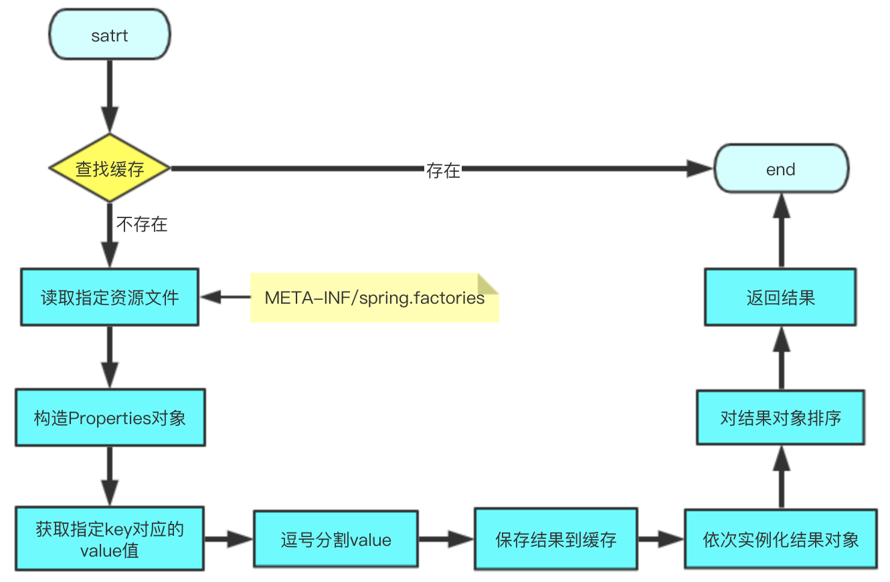

# 3、系统初始化器

ApplicationContextInitializer
- 上下文沙墟即refresh方法前调用；
- 用来编码设置一些属性变量，通常用在web环境中；
- 可以通过`@Order`注解进行排序

## 3.1、自定义初始化器的三种方式

自定义初始化器的基本条件：实现接口`ApplicationContextInitializer`
```java
@Order(1)
public class FirstInitializer implements ApplicationContextInitializer<ConfigurableApplicationContext> {
    @Override
    public void initialize(ConfigurableApplicationContext applicationContext) {
        MutablePropertySources propertySources = applicationContext.getEnvironment().getPropertySources();
        Map<String, Object> map = new HashMap<>(1);
        map.put("first", "first");
        MapPropertySource source = new MapPropertySource("firstInitializer", map);
        propertySources.addLast(source);
        System.out.println("Run First Initializer...");
    }
}
```

### 3.1.1、factories方式

- **添加方法：**

    在`resources`目录下新建目录文件：`META-INF/spring.factories`，配置的key为`org.springframework.context.ApplicationContextInitializer`，value为自定义初始化器的全类名路径
    ```
    org.springframework.context.ApplicationContextInitializer=com.blue.fish.web.initializer.FirstInitializer
    ```

- **实现原理：**

    其实通过SpringFactoriesLoader来加载`META-INF/spring.factories`里面的配置的，并通过Order进行排序处理

### 3.1.2、在启动类中添加

- **添加方法：**

    在启动类中添加如下代码，替换`SpringApplication.run(SpringBootSourceApplication.class, args);`
    ```java
    @SpringBootApplication
    public class SpringBootSourceApplication {
        public static void main(String[] args) {
            SpringApplication application = new SpringApplication(SpringBootSourceApplication.class);
            application.addInitializers(new SecondFirstInitializer());
            application.run(args);
        }
    }
    ```

- **实现原理：** 

    调用`SpringApplication.addInitializers`方法，将其添加到初始化`SpringApplicatio`里面添加的`initializers`中，手动添加数据；

### 3.1.3、在application.properties中添加配置

- **添加方法：**

添加如下配置：
```
context.initializer.classes=com.blue.fish.source.initializer.ThirdInitializer
```

- **实现原理：** 

    在`application.properties`中添加配置会被定义成环境变量被`DelegatingApplicationContextInitializer`发现并注册
    ```java
    private static final String PROPERTY_NAME = "context.initializer.classes";
	private int order = 0;
	@Override
	public void initialize(ConfigurableApplicationContext context) {
		ConfigurableEnvironment environment = context.getEnvironment();
        // 从环境变量中获取是否有配置
		List<Class<?>> initializerClasses = getInitializerClasses(environment);
		if (!initializerClasses.isEmpty()) {
			applyInitializerClasses(context, initializerClasses);
		}
	}
	private List<Class<?>> getInitializerClasses(ConfigurableEnvironment env) {
		String classNames = env.getProperty(PROPERTY_NAME);
		List<Class<?>> classes = new ArrayList<>();
		if (StringUtils.hasLength(classNames)) {
			for (String className : StringUtils.tokenizeToStringArray(classNames, ",")) {
				classes.add(getInitializerClass(className));
			}
		}
		return classes;
	}
    private void applyInitializerClasses(ConfigurableApplicationContext context, List<Class<?>> initializerClasses) {
		Class<?> contextClass = context.getClass();
		List<ApplicationContextInitializer<?>> initializers = new ArrayList<>();
        // 实例化在环境变量中配置的initializer类
		for (Class<?> initializerClass : initializerClasses) {
			initializers.add(instantiateInitializer(contextClass, initializerClass));
		}
        // 执行该变量
		applyInitializers(context, initializers);
	}
    // 循环执行该数据
    private void applyInitializers(ConfigurableApplicationContext context,List<ApplicationContextInitializer<?>> initializers) {
        // 会先将application.properties中配置的initializer进行排序
		initializers.sort(new AnnotationAwareOrderComparator());
		for (ApplicationContextInitializer initializer : initializers) {
			initializer.initialize(context);
		}
	}
    ```
    因为`DelegatingApplicationContextInitializer`其的Order=0，`application.properties`其定义的initializer又是由该类触发，所以说`application.properties`中定义的优先于其他方式定义的initializer先执行

### 3.1.4、注意点

- 都要实现 `ApplicationContextInitializer`接口；
- `@Order`值越小越先执行；
- `application.properties`中定义的优先于其他方式；

## 3.2、initializer方法执行时机

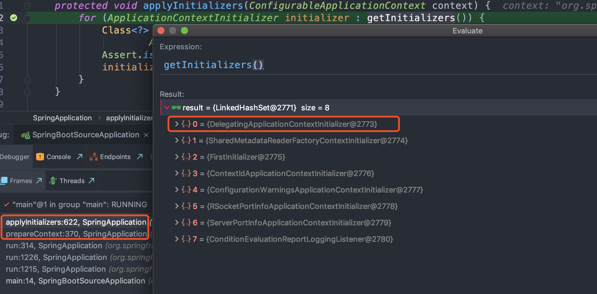

调用链： SpringApplication.run ->  prepareContext（上下文准备） -> applyInitializers -> 遍历调用各个Initializer的initialize方法

# 4、监听器

## 4.1、监听器设计模式

**监听器模式四要素：**
- 事件
- 监听器
- 广播器
- 触发机制

**监听器原理**

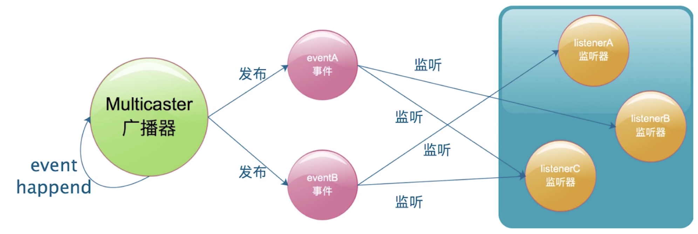

## 4.2、Spring监听器实现

### 4.2.1、spring监听器具体实现


Spring中主要有7类事件
事件实现类 | 对应 SpringApplicationRunListener 方法 | 说明
---------|---------------------------------------|--------
ApplicationContextInitializedEvent| contextPrepared |ConfigurableApplicationContext准备完成，对应
ApplicationEnvironmentPreparedEvent|  environmentPrepared   |ConfigurableEnvironment准备完成
ApplicationPreparedEvent|  contextLoaded   |ConfigurableApplicationContext已装载，但是仍未启动
ApplicationReadyEvent|  running   |Spring应用正在运行
ApplicationStartingEvent|  starting   |Spring应用刚启动
ApplicationStartedEvent|  started   |ConfigurableApplicationContext 已启动，此时Spring Bean已经初始化完成
ApplicationFailedEvent|  failed   |Spring应用运行失败

### 4.2.2、框架事件发送顺序

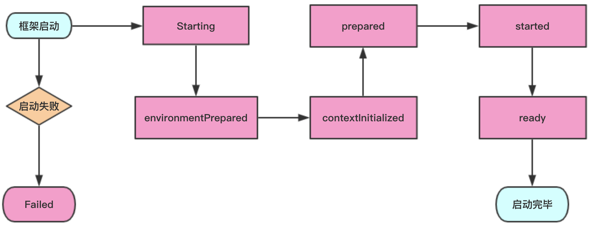

### 4.2.3、SpringApplicationRunListeners

获取SpringApplicationRunListeners：
```java
private SpringApplicationRunListeners getRunListeners(String[] args) {
    Class<?>[] types = new Class<?>[] { SpringApplication.class, String[].class };
    return new SpringApplicationRunListeners(logger, getSpringFactoriesInstances(SpringApplicationRunListener.class, types, this, args));
}
```
SpringApplicationRunListeners 是基于组合模式实现的，内部关联了`SpringApplicationRunListener`集合
```java
class SpringApplicationRunListeners {
	private final List<SpringApplicationRunListener> listeners;
	SpringApplicationRunListeners(Log log, Collection<? extends SpringApplicationRunListener> listeners) {
		this.log = log;
		this.listeners = new ArrayList<>(listeners);
	}
    ...
}
```

### 4.2.4、SpringApplicationRunListener

Spring应用运行时监听器，其监听方法被 SpringApplicationRunListeners 遍历的执行，主要包含如下方法：
```
starting()
environmentPrepared(ConfigurableEnvironment environment)
contextPrepared(ConfigurableApplicationContext context)
contextLoaded(ConfigurableApplicationContext context)
started(ConfigurableApplicationContext context)
running(ConfigurableApplicationContext context)
failed(ConfigurableApplicationContext context, Throwable exception)
```
`SpringApplicationRunListener`的构造器参数必须依次为：`SpringApplication`和`String[]` 类型，其具体实现也是通过 SpringFactoriesLoader 加载的，其在 `META-INF/spring.factories` 具体的key值为：
```
 Run Listeners
org.springframework.boot.SpringApplicationRunListener=org.springframework.boot.context.event.EventPublishingRunListener
```
`EventPublishingRunListener`为SpringBoot唯一的内建实现，在其构造函数中，其会将根据`SpringApplication`已关联的`ApplicationListener`实例列表动态的添加到`SimpleApplicationEventMulticaster`对象中。`SimpleApplicationEventMulticaster`是实现自 `ApplicationEventMulticaster`接口，用于发布Spring应用事件（ApplicationEvent）。因此`EventPublishingRunListener`为SpringBoot的事件发布者角色；
```java
public EventPublishingRunListener(SpringApplication application, String[] args) {
    this.application = application;
    this.args = args;
    this.initialMulticaster = new SimpleApplicationEventMulticaster();
    for (ApplicationListener<?> listener : application.getListeners()) {
        this.initialMulticaster.addApplicationListener(listener);
    }
}
```

### 4.2.5、Spring事件/监听器设计

[Spring事件监听器](Spring源码.md#五Spring事件)

## 4.3、监听器事件触发机制

### 4.3.1、监听器注册

注册监听的方式同系统初始化方法类似的

### 4.3.2、获取感兴趣的监听器列表

SpringApplication获取到 SpringApplicationRunListeners 后，以其执行starting为例，获取其感兴趣的监听器：
```java
// SpringApplication
public ConfigurableApplicationContext run(String... args) {
    ...
    //  获取到SpringApplicationRunListeners
    SpringApplicationRunListeners listeners = getRunListeners(args);
    listeners.starting();
    ...
}
// SpringApplicationRunListeners
void starting() {
    // SpringApplicationRunListener 具体实现类是：EventPublishingRunListener
    for (SpringApplicationRunListener listener : this.listeners) {
        listener.starting();
    }
}
// EventPublishingRunListener implement SpringApplicationRunListener
private final SimpleApplicationEventMulticaster initialMulticaster;
public void starting() {
    this.initialMulticaster.multicastEvent(new ApplicationStartingEvent(this.application, this.args));
}
// SimpleApplicationEventMulticaster
public void multicastEvent(ApplicationEvent event) {
    multicastEvent(event, resolveDefaultEventType(event));
}
public void multicastEvent(final ApplicationEvent event, @Nullable ResolvableType eventType) {
    ResolvableType type = (eventType != null ? eventType : resolveDefaultEventType(event));
    Executor executor = getTaskExecutor();
    // 根据事件类型获取到所有的当前事件上注册的监听器：getApplicationListeners
    for (ApplicationListener<?> listener : getApplicationListeners(event, type)) {
        if (executor != null) {
            executor.execute(() -> invokeListener(listener, event));
        }
        else {
            invokeListener(listener, event);
        }
    }
}
// AbstractApplicationEventMulticaster 是 SimpleApplicationEventMulticaster 父类
```

具体流程图：

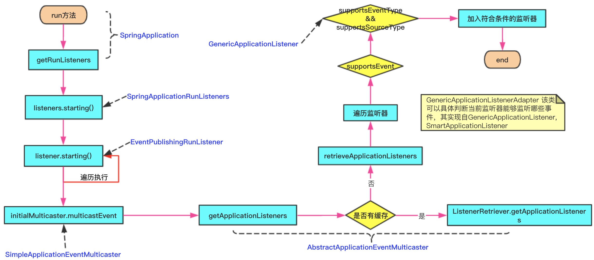

上面流程图中supportsEventType具体实现：

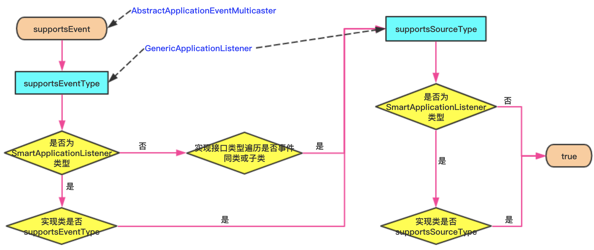

### 4.3.3、事件触发条件

上面获取到监听器列表后，会触发事件：
```java
protected void invokeListener(ApplicationListener<?> listener, ApplicationEvent event) {
    ErrorHandler errorHandler = getErrorHandler();
    if (errorHandler != null) {
        try {
            doInvokeListener(listener, event);
        }
        ...
    }
    else {
        doInvokeListener(listener, event);
    }
}
private void doInvokeListener(ApplicationListener listener, ApplicationEvent event) {
    try {
        listener.onApplicationEvent(event);
    }
    ...
}
```

## 4.4、自定义监听器

基本条件：实现`ApplicationListener`

### 4.4.1、factories方式


- **添加方法：**

    在`resources`目录下新建目录文件：`META-INF/spring.factories`，配置的key为`org.springframework.context.ApplicationListener`，value为自定义初始化器的全类名路径
    ```
    org.springframework.context.ApplicationListener=com.blue.fish.source.listener.FirstListener
    ```

- **实现原理：**

    其实通过SpringFactoriesLoader来加载`META-INF/spring.factories`里面的配置的，并通过Order进行排序处理

### 4.4.2、在启动类中添加

- **添加方法：**

    在启动类中添加如下代码，替换`SpringApplication.run(SpringBootSourceApplication.class, args);`
    ```java
    @SpringBootApplication
    public class SpringBootSourceApplication {
        public static void main(String[] args) {
            SpringApplication application = new SpringApplication(SpringBootSourceApplication.class);
            application.addListeners(new SecondListener());
            application.run(args);
        }
    }
    ```

- **实现原理：** 

    调用`SpringApplication.addListeners`方法，将其添加到初始化`SpringApplication`里面添加的`listeners`中，手动添加数据；

### 4.4.3、在application.properties中添加配置

- **添加方法：**

添加如下配置：
```
context.listener.classes=com.blue.fish.source.listener.ThirdListener
```

- **实现原理：** 

    在`application.properties`中添加配置会被定义成环境变量被`DelegatingApplicationListener`发现并注册。

    因为`DelegatingApplicationListener`其的Order=0，`application.properties`其定义的listener又是由该类触发，所以说`application.properties`中定义的优先于其他方式定义的listener先执行

### 4.4.4、实现SmartApplicationListener接口

```java
public class FourthListener implements SmartApplicationListener {
    @Override
    public boolean supportsEventType(Class<? extends ApplicationEvent> eventType) {
        // 注册自己关注的事件
        return ApplicationStartedEvent.class.isAssignableFrom(eventType)
                || ApplicationPreparedEvent.class.isAssignableFrom(eventType);
    }
    @Override
    public void onApplicationEvent(ApplicationEvent event) {
        // 根据上述的supportsEventType关注的事件执行相应的代码；
        System.out.println("Fourth SmartApplicationListener");
    }
}
```
然后根据上述三种方式添加到框架中；

### 4.4.5、总结

- 实现ApplicationListener接口只针对单一事件监听；
- 实现 SmartApplicationListener 接口可以针对多种事件监听；
- Order值越小越先执行；
- `application.properties`中定义的优先于其他方式；

# 5、refresh方法

[](Spring源码.md#6refresh方法源码)

# 6、banner配置

## 6.1、配置方式

- 输出文本：在resources目录下创建文件：banner.txt，里面填入需要输入的文字；
- 图片：可以再resources目录创建一个`banner.jpg(gif|png)`，也可以直接输出；
- 在application.properties中增加如下配置：
    - `spring.banner.location=favorite.txt`，在resources目录下有个文本文件：favorite.txt；
    - `spring.banner.image.location=favorite.jpg`，在resources目录有个图片文件：favorite.jpg；
- 如果需要关闭banner的打印，在application.properties增加配置：`spring.main.banner-mode=off`

## 6.2、banner获取原理

在SpringApplication的run方法中有如下代码:
```java
try {
    ApplicationArguments applicationArguments = new DefaultApplicationArguments(args);
    ConfigurableEnvironment environment = prepareEnvironment(listeners, applicationArguments);
    configureIgnoreBeanInfo(environment);
    // 打印banner
    Banner printedBanner = printBanner(environment);
    context = createApplicationContext();
    ...
}
// SpringApplication
private Banner printBanner(ConfigurableEnvironment environment) {
    if (this.bannerMode == Banner.Mode.OFF) {
        return null;
    }
    ResourceLoader resourceLoader = (this.resourceLoader != null) ? this.resourceLoader
            : new DefaultResourceLoader(getClassLoader());
    SpringApplicationBannerPrinter bannerPrinter = new SpringApplicationBannerPrinter(resourceLoader, this.banner);
    if (this.bannerMode == Mode.LOG) {
        return bannerPrinter.print(environment, this.mainApplicationClass, logger);
    }
    return bannerPrinter.print(environment, this.mainApplicationClass, System.out);
}
```

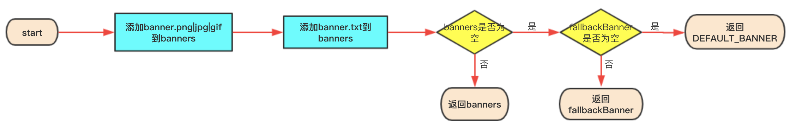

# 7、启动加载器

## 7.1、计时器

```java
StopWatch stopWatch = new StopWatch();
stopwatch.start();

stopwatch.stop();
```

使用例子：
```java
// 准备拷贝数据
ArrayList<Integer> list = new ArrayList<>();
for(int i=0;i<3000000;i++){
    list.add(i);
}

StopWatch stopWatch = new StopWatch();
stopWatch.start("单个 for 循环新增 300 w 个");
ArrayList<Integer> list2 = new ArrayList<>();
for(int i=0;i<list.size();i++){
    list2.add(list.get(i));
}
stopWatch.stop();

// 批量新增
stopWatch.start("批量新增 300 w 个");
ArrayList<Integer> list3 = new ArrayList<>();
list3.addAll(list);
stopWatch.stop();

System.out.println(stopWatch.prettyPrint());
```

## 7.2、启动加载器

Spring中有两种启动类加载器：`ApplicationRunner`、`CommandLineRunner`，可以通过实现这两个接口来在Springboot框架启动进行一些处理：

- `ApplicationRunner`：
    ```java
    @Component
    @Order(1)
    public class FirstApplicationRunner implements ApplicationRunner {
        @Override
        public void run(ApplicationArguments args) throws Exception {
            System.out.println("\u001B[32m >>> startup first application runner<<<");
        }
    }
    ```

- `CommandLineRunner`
    ```java
    @Component
    @Order(1)
    public class FirstCommandlineRunner implements CommandLineRunner {
        @Override
        public void run(String... args) throws Exception {
            System.out.println("\u001B[32m >>> startup first runner<<<");
        }
    }
    ```

两者比较：
- 执行的都是run方法，但是参数不一样
    - CommandLineRunner：使用的是SpringApplication里传入的args数组；
    - ApplicationRunner：使用的是 ApplicationArguments，里面包装了一层source，会对args数组进行解析处理成类似HashMap形式
        ```java
        ApplicationArguments applicationArguments = new DefaultApplicationArguments(args);
        public DefaultApplicationArguments(String... args) {
            Assert.notNull(args, "Args must not be null");
            this.source = new Source(args);
            this.args = args;
        }
        ```
    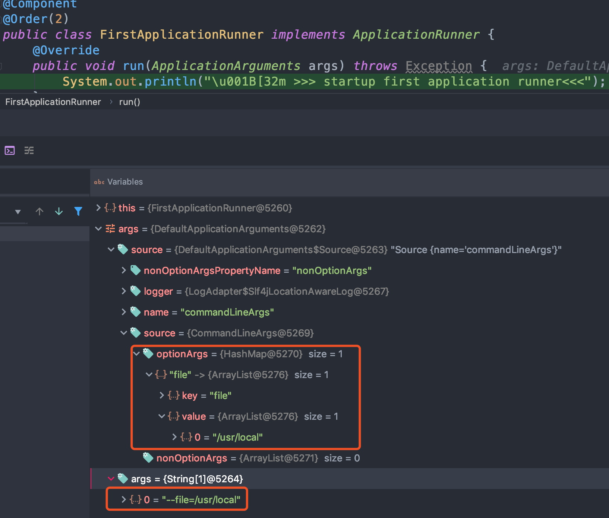

- 执行顺序：根据`@Order`配置的值来进行排序，如果 CommandLineRunner 和 ApplicationRunner 两者的 Order 的value一样，那么先执行 ApplicationRunner，后执行 CommandlineRunner，因为其是先添加ApplicationRunner，后添加的CommandLineRunner，如果两者的 Order 的value一样，那么其顺序不变；

## 7.3、启动加载器原理分析

调用是从SpringApplication.run方法开始调用的：
```java
public ConfigurableApplicationContext run(String... args) {
    ...
    try {
        listeners.started(context);
        // 调用启动加载器
        callRunners(context, applicationArguments);
    }
    ...
}
private void callRunners(ApplicationContext context, ApplicationArguments args) {
    List<Object> runners = new ArrayList<>();
    // 查找到 ApplicationRunner
    runners.addAll(context.getBeansOfType(ApplicationRunner.class).values());
    // 查找到 CommandLineRunner
    runners.addAll(context.getBeansOfType(CommandLineRunner.class).values());
    // 对其进行排序
    AnnotationAwareOrderComparator.sort(runners);
    for (Object runner : new LinkedHashSet<>(runners)) {
        if (runner instanceof ApplicationRunner) {
            callRunner((ApplicationRunner) runner, args);
        }
        if (runner instanceof CommandLineRunner) {
            callRunner((CommandLineRunner) runner, args);
        }
    }
}
```

# 8、属性配置

## 8.1、属性配置顺序

[外部配置加载顺序](../../../Java框架/Spring/Spring.md#7外部配置加载顺序)

## 8.2、SpringAware

在Spring框架中，Bean是感知不到容器的存在的，但是在某些场景下，Bean需要使用Spring容器的功能资源，那么使用Aware可以设置一些属性；但是引入Aware会使得Bean和容器强耦合

### 8.2.1、常用的Aware

类名  | 作用 
-------|----------
BeanNameAware | 获得容器中bean名称
BeanClassLoaderAware | 获取的类加载器
BeanFactoryAware | 获取bean创建工厂
EnvironmentAware | 获得环境变量
EmbeddedValueResolverAware |  获得Spring容器加载的properties文件属性值
ResourceLoaderAware | 获取资源加载器
ApplicationEventPublisherAware | 获得应用事件发布器
MessageSourceAware | 获得文本信息
ApplicationContextAware |  获得当前应用上下文

### 8.2.2、aware实现原理

业务按需要实现特定的Aware接口，spring容器会主动找到该bean，然后调用特定的方法，将特定的参数传递给bean；

调用过程：`doCreateBean -> initializeBean -> invokeawareMethods -> applyBeanPostProcessorsBeforeInitialization -> ApplicationContextAwareProcessor`

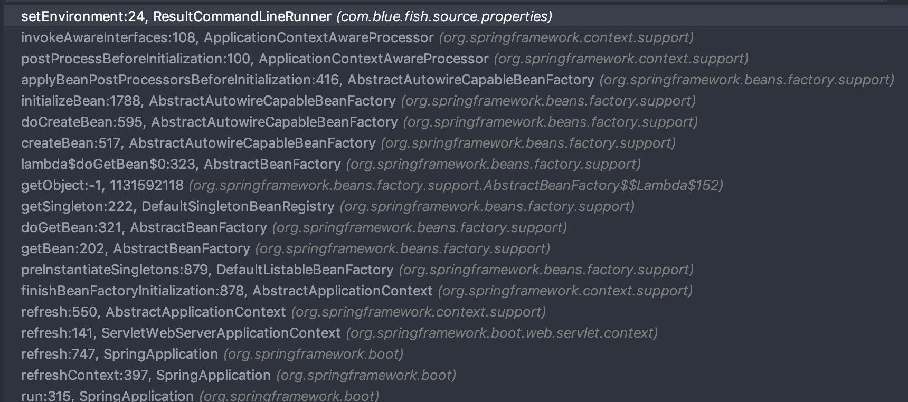

### 8.2.3、自定义aware

- 定义一个接口，继承Aware接口，定义一个抽象方法：
    ```java
    public interface CustomAware extends Aware {
        void setCustomFlag(CustomFlag flag);
    }
    ```
- 编写一个BeanPostProcessor实现，并重写方法：postProcessBeforeInitialization
    ```java
    @Component
    public class CustomAwareProcessor implements BeanPostProcessor {
        private final ConfigurableApplicationContext configurableApplicationContext;
        public CustomAwareProcessor(ConfigurableApplicationContext configurableApplicationContext) {
            this.configurableApplicationContext = configurableApplicationContext;
        }
        @Override
        public Object postProcessBeforeInitialization(Object bean, String beanName) throws BeansException {
            if (bean instanceof Aware) {
                if (bean instanceof CustomAware) {
                    ((CustomAware)bean).setCustomFlag((CustomFlag) configurableApplicationContext.getBean("customFlag"));
                }
            }
            return bean;
        }
    }
    ```
- 使用，对于上述自定义的Aware接口，可以实现如下：
    ```java
    @Component
    public class ResultCommandLineRunner implements CommandLineRunner, CustomAware {
        private CustomFlag customFlag;
        @Override
        public void run(String... args) throws Exception {
            System.out.println(customFlag.getName());
        }
        @Override
        public void setCustomFlag(CustomFlag flag) {
            this.customFlag = flag;
        }
    }
    ```

## 8.3、属性加载

所有属性设置都是存储到Environment中的，其关系图如下：

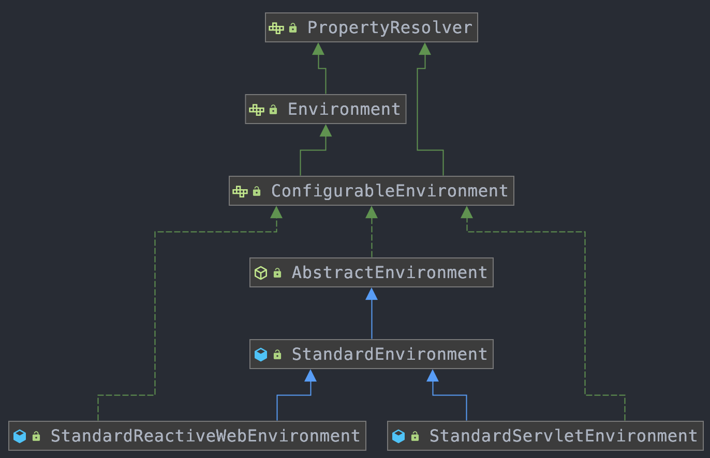

```java
public ConfigurableApplicationContext run(String... args) {
    ...
    try {
        ApplicationArguments applicationArguments = new DefaultApplicationArguments(args);
        // 准备环境，
        ConfigurableEnvironment environment = prepareEnvironment(listeners, applicationArguments);
        configureIgnoreBeanInfo(environment);
    }
    ...
}
```
**prepareEnvironment：**
```java
private ConfigurableEnvironment prepareEnvironment(SpringApplicationRunListeners listeners, ApplicationArguments applicationArguments) {
    // 创建Environment对象
    ConfigurableEnvironment environment = getOrCreateEnvironment();
    // 配置
    configureEnvironment(environment, applicationArguments.getSourceArgs());
    // 将 ConfigurationProperties属性集
    ConfigurationPropertySources.attach(environment);
    listeners.environmentPrepared(environment);
    bindToSpringApplication(environment);
    if (!this.isCustomEnvironment) {
        environment = new EnvironmentConverter(getClassLoader()).convertEnvironmentIfNecessary(environment,
                deduceEnvironmentClass());
    }
    ConfigurationPropertySources.attach(environment);
    return environment;
}
```
**getOrCreateEnvironment**，根据webApplicationType创建不同的 Environment
```java
private ConfigurableEnvironment getOrCreateEnvironment() {
    if (this.environment != null) {
        return this.environment;
    }
    switch (this.webApplicationType) {
    case SERVLET:
        // web应用
        return new StandardServletEnvironment();
    case REACTIVE:
        return new StandardReactiveWebEnvironment();
    default:
        return new StandardEnvironment();
    }
}
```
如果是 StandardServletEnvironment，`new StandardServletEnvironment() `首先会调用父类 AbstractEnvironment 的构造函数
```java
// AbstractEnvironment
public AbstractEnvironment() {
    // 这里会调用子类的 customizePropertySources 方法，即 StandardServletEnvironment.customizePropertySources
    customizePropertySources(this.propertySources);
}

// StandardServletEnvironment：添加 servletContextInitParams、servletConfigInitParams、jndiProperties 三个的属性集
public static final String SERVLET_CONTEXT_PROPERTY_SOURCE_NAME = "servletContextInitParams";
public static final String SERVLET_CONFIG_PROPERTY_SOURCE_NAME = "servletConfigInitParams";
public static final String JNDI_PROPERTY_SOURCE_NAME = "jndiProperties";
@Override
protected void customizePropertySources(MutablePropertySources propertySources) {
    propertySources.addLast(new StubPropertySource(SERVLET_CONFIG_PROPERTY_SOURCE_NAME));
    propertySources.addLast(new StubPropertySource(SERVLET_CONTEXT_PROPERTY_SOURCE_NAME));
    if (JndiLocatorDelegate.isDefaultJndiEnvironmentAvailable()) {
        propertySources.addLast(new JndiPropertySource(JNDI_PROPERTY_SOURCE_NAME));
    }
    // 添加完上面 servletContextInitParams、servletConfigInitParams、jndiProperties 三个的属性集后，调用父类的 StandardEnvironment.customizePropertySources
    super.customizePropertySources(propertySources);
}

// StandardEnvironment：添加systemEnvironment、systemProperties 属性集
public static final String SYSTEM_ENVIRONMENT_PROPERTY_SOURCE_NAME = "systemEnvironment";
public static final String SYSTEM_PROPERTIES_PROPERTY_SOURCE_NAME = "systemProperties";
@Override
protected void customizePropertySources(MutablePropertySources propertySources) {
    propertySources.addLast( new PropertiesPropertySource(SYSTEM_PROPERTIES_PROPERTY_SOURCE_NAME, getSystemProperties()));
    propertySources.addLast( new SystemEnvironmentPropertySource(SYSTEM_ENVIRONMENT_PROPERTY_SOURCE_NAME, getSystemEnvironment()));
}

```

**configureEnvironment：**
```java
protected void configureEnvironment(ConfigurableEnvironment environment, String[] args) {
    if (this.addConversionService) {
        ConversionService conversionService = ApplicationConversionService.getSharedInstance();
        environment.setConversionService((ConfigurableConversionService) conversionService);
    }
    // 添加defaultProperties 和 commandLineArgs 属性集
    configurePropertySources(environment, args);
    // 配置 profiles，如果当前没有设置，就不存在，可以从environment中获取：environment.getActiveProfiles()
    configureProfiles(environment, args);
}
```

**listeners.environmentPrepared(environment)**

其调用的是事件：ApplicationEnvironmentPreparedEvent，调用逻辑同前面的事件监听器类似，主要有如下监听器关注了该事件：
- `ConfigFileApplicationListener`
- `AnsiOutputApplicationListener`
- `LoggingApplicationListener`
- `ClasspathLoggingApplicationListener`
- `BackgroundPreinitializer`
- `DelegatingApplicationListener`
- `FileEncodingApplicationListener`

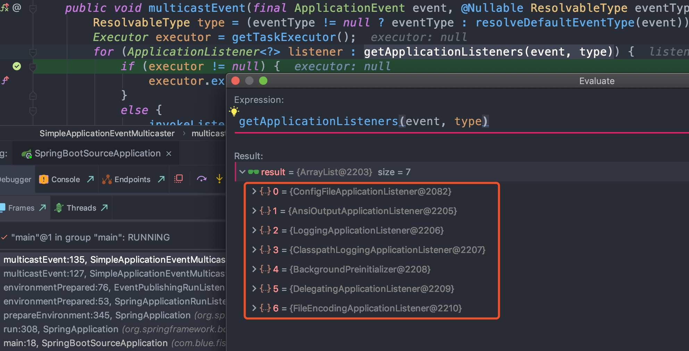

主要是 ConfigFileApplicationListener 里的事件发布方法：

**ConfigFileApplicationListener.onApplicationEvent**
```java
@Override
public void onApplicationEvent(ApplicationEvent event) {
    if (event instanceof ApplicationEnvironmentPreparedEvent) {
        onApplicationEnvironmentPreparedEvent((ApplicationEnvironmentPreparedEvent) event);
    }
    ...
}
private void onApplicationEnvironmentPreparedEvent(ApplicationEnvironmentPreparedEvent event) {
    // 去spring.factories 中加载 org.springframework.boot.env.EnvironmentPostProcessor 对应的配置PostProcessor
    List<EnvironmentPostProcessor> postProcessors = loadPostProcessors();
    postProcessors.add(this);
    AnnotationAwareOrderComparator.sort(postProcessors);
    for (EnvironmentPostProcessor postProcessor : postProcessors) {
        postProcessor.postProcessEnvironment(event.getEnvironment(), event.getSpringApplication());
    }
}
```
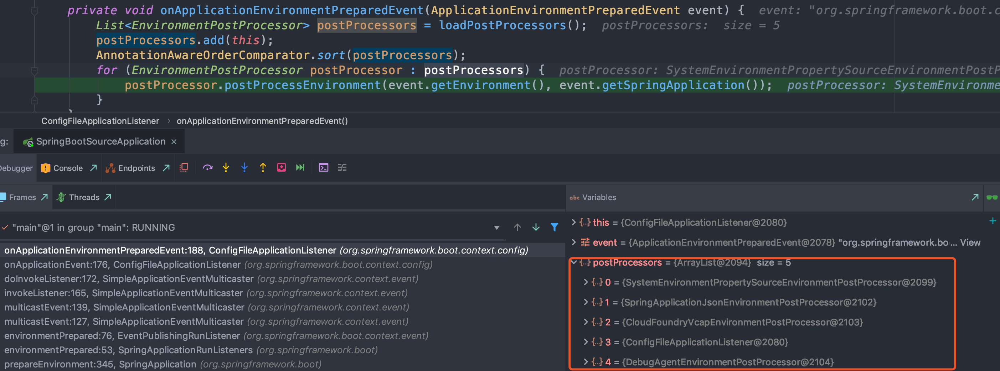

postProcessors包含如下数据：
- `SystemEnvironmentPropertySourceEnvironmentPostProcessor`：将 `SystemEnvironmentPropertySource` 替换为 `OriginAwareSystemEnvironmentPropertySource`
- `SpringApplicationJsonEnvironmentPostProcessor`： 添加 `spring_application_json`属性集
- `CloudFoundryVcapEnvironmentPostProcessor`：添加vcap属性集
- `ConfigFileApplicationListener`：添加`random、application-profile.(properties}yml)`属性集
- `DebugAgentEnvironmentPostProcessor`

**bindToSpringApplication：**将`spring.main`开头的属性绑定到SpringApplication上
```java
protected void bindToSpringApplication(ConfigurableEnvironment environment) {
    try {
        Binder.get(environment).bind("spring.main", Bindable.ofInstance(this));
    }
    ...
}
```

## 8.4、Spring Profile

将不同的参数配置绑定在不同的环境中

### 8.4.1、集合profile

- 激活：`spring.profiles.active=xxx`

- `spring.profiles.active`与 default（application-default.properties） 互斥

- `spring.profils.include=online,prod`：激活多个profiles，如果两个profile中存在相同的配置，写在后面的profile的配置会覆盖写在前面profile的配置；

- 如果`application.properties`与`application-default.properties`两个配置文件同时存在，则SpringBoot默认使用的是`application-defaul`t里的配置

### 8.4.2、profile原理解析

入口是：`ConfigFileApplicationListener#onApplicationEvent`

上述属性加载的时候会去执行 EnvironmentPostProcessor.postProcessEnvironment 的方法，其中有一个 EnvironmentPostProcessor 的实现类是：ConfigFileApplicationListener，会执行如下代码：
```java
// Add config file property sources to the specified environment.
protected void addPropertySources(ConfigurableEnvironment environment, ResourceLoader resourceLoader) {
    RandomValuePropertySource.addToEnvironment(environment);
    // 加载配置
    new Loader(environment, resourceLoader).load();
}
```
其中`Loader`是 ConfigFileApplicationListener 的内部类，调用其load方法：
```java
void load() {
    // FilteredPropertySource 用于过滤特定的属性
    FilteredPropertySource.apply(this.environment, DEFAULT_PROPERTIES, LOAD_FILTERED_PROPERTY,
        (defaultProperties) -> {
            this.profiles = new LinkedList<>();
            this.processedProfiles = new LinkedList<>();
            this.activatedProfiles = false;
            this.loaded = new LinkedHashMap<>();
            initializeProfiles();
            while (!this.profiles.isEmpty()) {
                Profile profile = this.profiles.poll();
                if (isDefaultProfile(profile)) {
                    addProfileToEnvironment(profile.getName());
                }
                load(profile, this::getPositiveProfileFilter, addToLoaded(MutablePropertySources::addLast, false));
                this.processedProfiles.add(profile);
            }
            load(null, this::getNegativeProfileFilter, addToLoaded(MutablePropertySources::addFirst, true));
            addLoadedPropertySources();
            applyActiveProfiles(defaultProperties);
        });
}
```

**initializeProfiles();**
```java
private void initializeProfiles() {
    // 默认使用null作为linkedList的第一个元素，其是最低优先级的
    this.profiles.add(null);
    // 获取 spring.profiles.active 配置的profile
    Set<Profile> activatedViaProperty = getProfilesFromProperty(ACTIVE_PROFILES_PROPERTY);
    // 获取 spring.profiles.include 配置的多个 profile
    Set<Profile> includedViaProperty = getProfilesFromProperty(INCLUDE_PROFILES_PROPERTY);
    List<Profile> otherActiveProfiles = getOtherActiveProfiles(activatedViaProperty, includedViaProperty);
    this.profiles.addAll(otherActiveProfiles);
    // Any pre-existing active profiles set via property sources (e.g.
    // System properties) take precedence over those added in config files.
    this.profiles.addAll(includedViaProperty);
    addActiveProfiles(activatedViaProperty);
    // 如果只有一个元素，添加默认的 profile
    if (this.profiles.size() == 1) { // only has null profile
        // 从 environment 中获取 默认的profile，即 spring.profile.default
        for (String defaultProfileName : this.environment.getDefaultProfiles()) {
            Profile defaultProfile = new Profile(defaultProfileName, true);
            this.profiles.add(defaultProfile);
        }
    }
}
```

**处理profiles**

如果profiles集合为空，调用profile为null 的load方法：`load(null, this::getNegativeProfileFilter, addToLoaded(MutablePropertySources::addFirst, true));`，否则遍历profiles集合调用`load(profile, this::getPositiveProfileFilter, addToLoaded(MutablePropertySources::addLast, false));` 方法

**load方法处理逻辑**

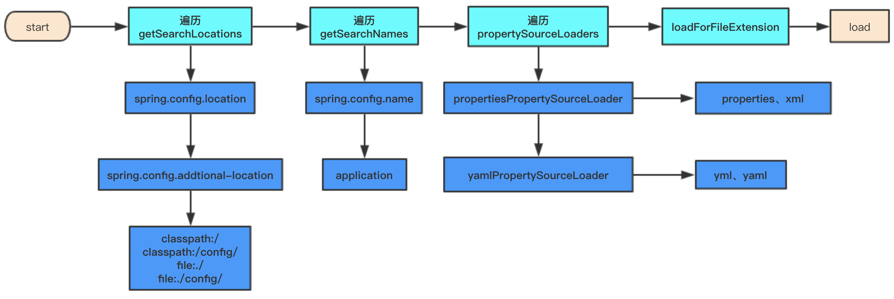

主要处理逻辑：
- （1）读取application-profile.xx文件；
- （2）资源存在；
- （3）loadDocuments读取文件属性；
- （4）将文件内激活的profile添加到profiles集合中；
- （5）将文件内定义的属性放入loaded中

**addLoadedPropertySources()**

- （1）environment的propertySource集合对象destination；
- （2）遍历loaded集合；
- （3）依次将集合内属性集添加到destination中；

# 9、异常与异常报告器

## 9.1、异常报告器

SpringBootExceptionReporter
```java
public ConfigurableApplicationContext run(String... args) {
    ...
    Collection<SpringBootExceptionReporter> exceptionReporters = new ArrayList<>();
    ...
    try {
        // 构建 SpringBootExceptionReporter，从spring.factories中，
        exceptionReporters = getSpringFactoriesInstances(SpringBootExceptionReporter.class, new Class[] { ConfigurableApplicationContext.class }, context);
        ...
    }
}
```
从`META-INF/spring.factories`中加载 SpringBootExceptionReporter 的实现类：FailureAnalyzers，其构造器接收一个 ConfigurableApplicationContext
```java
FailureAnalyzers(ConfigurableApplicationContext context, ClassLoader classLoader) {
    Assert.notNull(context, "Context must not be null");
    this.classLoader = (classLoader != null) ? classLoader : context.getClassLoader();
    // 从`META-INF/spring.factories`加载 FailureAnalyzer 集合，FailureAnalyzer 用于分析故障并提供诊断，用于显示给用户具体的错误信息
    this.analyzers = loadFailureAnalyzers(this.classLoader);
    prepareFailureAnalyzers(this.analyzers, context);
}
```
FailureAnalyzer 接口就一个analyze方法，其返回 `FailureAnalysis`（失败信息的一个结果分析汇总），包含描述信息、触发错误的点、Throwable等；
- ConnectorStartFailureAnalyzer：启动失败
- NoSuchBeanDefinitionFailureAnalyzer 

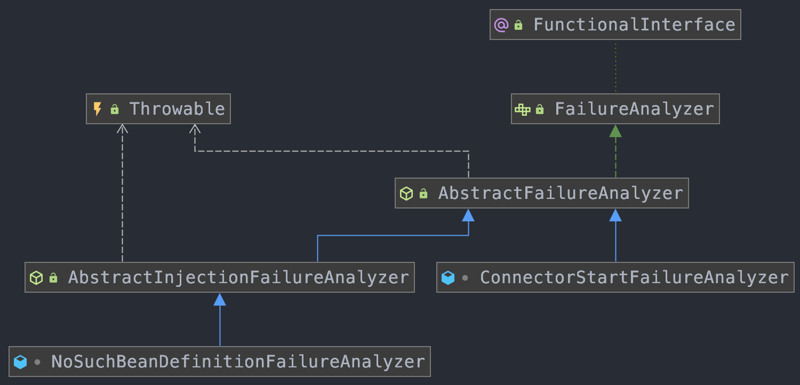

**自定义exceptionReporter**
```java
public class MyExceptionReporter implements SpringBootExceptionReporter {
    private ConfigurableApplicationContext context;
    public MyExceptionReporter(ConfigurableApplicationContext context) {
        this.context = context;
    }
    @Override
    public boolean reportException(Throwable failure) {
        if (failure instanceof UnsatisfiedDependencyException) {
            UnsatisfiedDependencyException exception = (UnsatisfiedDependencyException) failure;
            System.out.println("no such bean " + exception.getInjectionPoint().getField().getName() );
        }
        return false;
    }
}
```
将上述定义的好exceptionReporter添加到`META-INF/spring.factories`中，
`org.springframework.boot.SpringBootExceptionReporter=com.blue.fish.source.exception.MyExceptionReporter`

注意事项：
- 定义的Reporter里面必须要有一个带参数构造器，且参数必须是 ConfigurableApplicationContext；
- reportException 的返回值如果是true的话，如果有多个 SpringBootExceptionReporter，那么后面的 SpringBootExceptionReporter 就不会执行；

## 9.2、异常处理流程

```java
public ConfigurableApplicationContext run(String... args) {
    catch (Throwable ex) {
        // 捕获异常后处理
        handleRunFailure(context, ex, exceptionReporters, listeners);
        throw new IllegalStateException(ex);
    }
    ....
    catch (Throwable ex) {
        // 捕获异常后处理
        handleRunFailure(context, ex, exceptionReporters, null);
        throw new IllegalStateException(ex);
    }
}
```
handleRunFailure 主要有如下几步处理：
- handleExitCode：处理退出码
- listeners.failed(context, exception)：注册失败监听器
- reportFailure(exceptionReporters, exception)：异常报告
- context.close()：关闭资源等
- ReflectionUtils.rethrowRuntimeException(exception)：重新抛出异常

### 9.2.1、handleExitCode：处理退出码

```java
private void handleExitCode(ConfigurableApplicationContext context, Throwable exception) {
    int exitCode = getExitCodeFromException(context, exception);
    if (exitCode != 0) {
        if (context != null) {
            context.publishEvent(new ExitCodeEvent(context, exitCode));
        }
        SpringBootExceptionHandler handler = getSpringBootExceptionHandler();
        if (handler != null) {
            handler.registerExitCode(exitCode);
        }
    }
}
private int getExitCodeFromMappedException(ConfigurableApplicationContext context, Throwable exception) {
    if (context == null || !context.isActive()) {
        return 0;
    }
    ExitCodeGenerators generators = new ExitCodeGenerators();
    Collection<ExitCodeExceptionMapper> beans = context.getBeansOfType(ExitCodeExceptionMapper.class).values();
    generators.addAll(exception, beans);
    return generators.getExitCode();
}
```
从异常中获取exitCode，主要是通过  ExitCodeExceptionMapper 接口获取，可以自定义 ExitCodeExceptionMapper，实现该接口即可，指定特定的异常返回的exitcode

比如：针对 ConnectorStartFailedException 返回exitCode 为 10即可；
```java
@Component
public class MyExitCodeExceptionMapper implements ExitCodeExceptionMapper {
    @Override
    public int getExitCode(Throwable exception) {
        if (exception instanceof ConnectorStartFailedException) {
            return 10;
        }
        return 0;
    }
}
```

### 9.2.2、reportFailure

```java
// FailureAnalyzers
@Override
public boolean reportException(Throwable failure) {
    // analyze方法是只要找到一个 FailureAnalysis 即可
    FailureAnalysis analysis = analyze(failure, this.analyzers);
    return report(analysis, this.classLoader);
}
// AbstractFailureAnalyzer
@Override
public FailureAnalysis analyze(Throwable failure) {
    // 找出具体的异常类型
    T cause = findCause(failure, getCauseType());
    if (cause != null) {
        // 根据具体的 FailureAnalyzer 调用其具体的实现方法：analyze
        return analyze(failure, cause);
    }
    return null;
}
```
以 ConnectorStartFailureAnalyzer 为例，查看其analyze实现：
```java
class ConnectorStartFailureAnalyzer extends AbstractFailureAnalyzer<ConnectorStartFailedException> {
	@Override
	protected FailureAnalysis analyze(Throwable rootFailure, ConnectorStartFailedException cause) {
		return new FailureAnalysis(
				"The Tomcat connector configured to listen on port " + cause.getPort()
						+ " failed to start. The port may already be in use or the connector may be misconfigured.",
				"Verify the connector's configuration, identify and stop any process that's listening on port "
						+ cause.getPort() + ", or configure this application to listen on another port.",
				cause);
	}
}
```
输出异常信息的接口为：FailureAnalysisReporter，其只有一个实现类：LoggingFailureAnalysisReporter，最终会调用report方法输出异常信息
```java
public final class LoggingFailureAnalysisReporter implements FailureAnalysisReporter {
	private static final Log logger = LogFactory.getLog(LoggingFailureAnalysisReporter.class);
	@Override
	public void report(FailureAnalysis failureAnalysis) {
		if (logger.isDebugEnabled()) {
			logger.debug("Application failed to start due to an exception", failureAnalysis.getCause());
		}
		if (logger.isErrorEnabled()) {
			logger.error(buildMessage(failureAnalysis));
		}
	}
	private String buildMessage(FailureAnalysis failureAnalysis) {
		StringBuilder builder = new StringBuilder();
		builder.append(String.format("%n%n"));
		builder.append(String.format("***************************%n"));
		builder.append(String.format("APPLICATION FAILED TO START%n"));
		builder.append(String.format("***************************%n%n"));
		builder.append(String.format("Description:%n%n"));
		builder.append(String.format("%s%n", failureAnalysis.getDescription()));
		if (StringUtils.hasText(failureAnalysis.getAction())) {
			builder.append(String.format("%nAction:%n%n"));
			builder.append(String.format("%s%n", failureAnalysis.getAction()));
		}
		return builder.toString();
	}
}
```
最后是将已经输出的异常信息记录注册：registerLoggedException，如果是在主线程运行，禁止额外的打印stacktrace

### 9.2.3、context.close()

```java
@Override
public void close() {
    synchronized (this.startupShutdownMonitor) {
        doClose();
        // 如果注册的JVM的钩子函数，需要移除对应的钩子函数
        if (this.shutdownHook != null) {
            try {
                Runtime.getRuntime().removeShutdownHook(this.shutdownHook);
            }
        }
    }
}
protected void doClose() {
    // Check whether an actual close attempt is necessary...
    if (this.active.get() && this.closed.compareAndSet(false, true)) {
        LiveBeansView.unregisterApplicationContext(this);
        try {
            // 发布关闭事件
            publishEvent(new ContextClosedEvent(this));
        }
        // Stop all Lifecycle beans, to avoid delays during individual destruction.
        if (this.lifecycleProcessor != null) {
            try {
                this.lifecycleProcessor.onClose();
            }
        }
        // 销毁所有已经缓存在BeanFactory的单例bean
        destroyBeans();
        // 关闭上下文状态
        closeBeanFactory();
        // 其子类做一些清理，比如 是web应用的话，关闭web容器
        onClose();
        this.active.set(false);
    }
}
```

# 10、配置类解析

入库方法：`ConfigurationClassPostProcessor#postProcessBeanDefinitionRegistry`

ConfigurationClassParser#doProcessConfigurationClass

# 11、Servlet容器

## 11.1、嵌入式Servlet容器启动

- （1）获取当前应用的具体类型：
    ```java
    // SpringApplication 的构造函数
    public SpringApplication(ResourceLoader resourceLoader, Class<?>... primarySources) {
        ...
		this.webApplicationType = WebApplicationType.deduceFromClasspath();
		...
	}
    // WebApplicationType：主要是根据classpath中是否存在某些类来判断的
    static WebApplicationType deduceFromClasspath() {
		if (ClassUtils.isPresent(WEBFLUX_INDICATOR_CLASS, null) && !ClassUtils.isPresent(WEBMVC_INDICATOR_CLASS, null)
				&& !ClassUtils.isPresent(JERSEY_INDICATOR_CLASS, null)) {
			return WebApplicationType.REACTIVE;
		}
		for (String className : SERVLET_INDICATOR_CLASSES) {
			if (!ClassUtils.isPresent(className, null)) {
				return WebApplicationType.NONE;
			}
		}
		return WebApplicationType.SERVLET;
	}
    ```
- （2）创建 `ConfigurableApplicationContext`，根据在SpingApplication中获取的 webApplicationType 来生成对应的上下文
    ```java
    protected ConfigurableApplicationContext createApplicationContext() {
		Class<?> contextClass = this.applicationContextClass;
		if (contextClass == null) {
			try {
				switch (this.webApplicationType) {
				case SERVLET: contextClass = Class.forName(DEFAULT_SERVLET_WEB_CONTEXT_CLASS);
					break;
				case REACTIVE: contextClass = Class.forName(DEFAULT_REACTIVE_WEB_CONTEXT_CLASS);
					break;
				default: contextClass = Class.forName(DEFAULT_CONTEXT_CLASS);
				}
			}
		}
		return (ConfigurableApplicationContext) BeanUtils.instantiateClass(contextClass);
	}
    ```
- （3）调用 AbstractApplicationContext 的refresh方法，refresh方法有调用onRefresh方法，AbstractApplicationContext 其内的实现为空，有具体的子类去实现，web应用对应的context是：ServletWebServerApplicationContext，该类类图如下：
    
    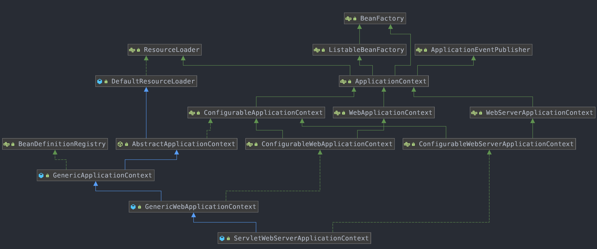

    ```java
    @Override
	protected void onRefresh() {
		super.onRefresh();
		try {
			createWebServer();
		}
	}
    ```
- （4）创建webServer：createWebServe
    ```java
    private void createWebServer() {
		WebServer webServer = this.webServer;
		ServletContext servletContext = getServletContext();
		if (webServer == null && servletContext == null) {
            // 首先获取 ServletWebServerFactory
			ServletWebServerFactory factory = getWebServerFactory();
			this.webServer = factory.getWebServer(getSelfInitializer());
		} else if (servletContext != null) {
			try {
				getSelfInitializer().onStartup(servletContext);
			}
			...
		}
		initPropertySources();
	}
    ```
    这里返回的Factory是 TomcatServletWebServerFactory，ServletWebServerFactory的一个实现类
- （5）调用 TomcatServletWebServerFactory 获取webServer
    ```java
    @Override
	public WebServer getWebServer(ServletContextInitializer... initializers) {
		if (this.disableMBeanRegistry) {
			Registry.disableRegistry();
		}
        // 创建tomcat
		Tomcat tomcat = new Tomcat();
		File baseDir = (this.baseDirectory != null) ? this.baseDirectory : createTempDir("tomcat");
		tomcat.setBaseDir(baseDir.getAbsolutePath());
        // tomcat 内部组件
		Connector connector = new Connector(this.protocol);
		connector.setThrowOnFailure(true);
		tomcat.getService().addConnector(connector);
		customizeConnector(connector);
		tomcat.setConnector(connector);
		tomcat.getHost().setAutoDeploy(false);
		configureEngine(tomcat.getEngine());
		for (Connector additionalConnector : this.additionalTomcatConnectors) {
			tomcat.getService().addConnector(additionalConnector);
		}
		prepareContext(tomcat.getHost(), initializers);
        // 获取tomcat server
		return getTomcatWebServer(tomcat);
	}
    protected TomcatWebServer getTomcatWebServer(Tomcat tomcat) {
		return new TomcatWebServer(tomcat, getPort() >= 0);
	}
    public TomcatWebServer(Tomcat tomcat, boolean autoStart) {
		Assert.notNull(tomcat, "Tomcat Server must not be null");
		this.tomcat = tomcat;
		this.autoStart = autoStart;
        // 初始化资源
		initialize();
	}
    ```
- （6）启动tomcat：finishRefresh
    ```java
    @Override
	protected void finishRefresh() {
		super.finishRefresh();
        // 启动tomcat服务器
		WebServer webServer = startWebServer();
		if (webServer != null) {
            // 发布事件 servlet容器已经初始化事件
			publishEvent(new ServletWebServerInitializedEvent(webServer, this));
		}
	}
    ```

## 11.2、ServletWebServerFactory加载

导入类的：AutoConfigurationImportSelector


# 12、starter配置原理

## 12.1、自定义starter

[starter原理](../../../Java框架/Spring/Spring.md#十三自定义Starter)


