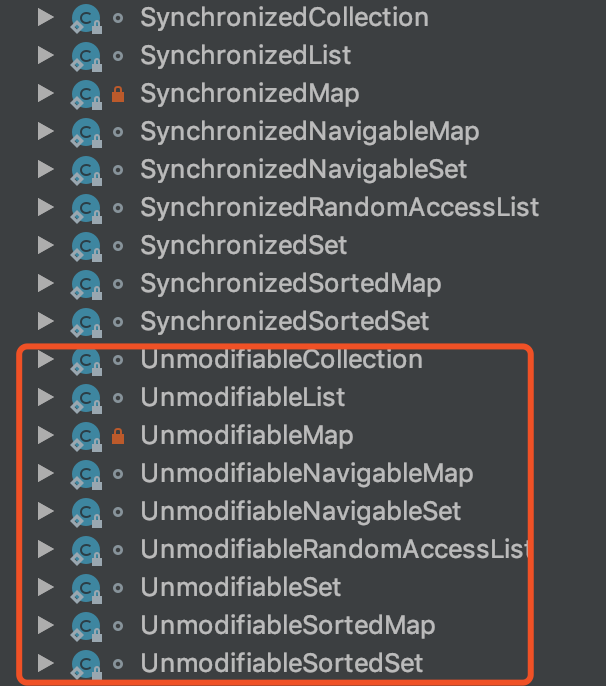

<!-- START doctoc generated TOC please keep comment here to allow auto update -->
<!-- DON'T EDIT THIS SECTION, INSTEAD RE-RUN doctoc TO UPDATE -->
**目录**

- [一、sort()方法实现](#%E4%B8%80sort%E6%96%B9%E6%B3%95%E5%AE%9E%E7%8E%B0)
  - [1、JDK1.6](#1jdk16)
    - [1.1、源码](#11%E6%BA%90%E7%A0%81)
  - [2、JDK1.7](#2jdk17)
    - [2.1、源码](#21%E6%BA%90%E7%A0%81)
  - [3、JDK1.8](#3jdk18)
- [二、常见内部类](#%E4%BA%8C%E5%B8%B8%E8%A7%81%E5%86%85%E9%83%A8%E7%B1%BB)
  - [1、SynchronizedList](#1synchronizedlist)
  - [2、SynchronizedMap](#2synchronizedmap)
  - [3、SynchronizedSet](#3synchronizedset)
  - [4、SynchronizedSortedMap](#4synchronizedsortedmap)
  - [5、SynchronizedSortedSet](#5synchronizedsortedset)
  - [6、一系列的不可变集合](#6%E4%B8%80%E7%B3%BB%E5%88%97%E7%9A%84%E4%B8%8D%E5%8F%AF%E5%8F%98%E9%9B%86%E5%90%88)

<!-- END doctoc generated TOC please keep comment here to allow auto update -->

# 一、sort()方法实现
```java
public static <T extends Comparable<? super T>> void sort(List<T> list)
```

## 1、JDK1.6
### 1.1、源码
```java
// 基本方法
public static <T extends Comparable<? super T>> void sort(List<T> list) {
    Object[] a = list.toArray();
    Arrays.sort(a);
    ListIterator<T> i = list.listIterator();
    for (int j=0; j<a.length; j++) {
        i.next();
        i.set((T)a[j]);
    }
}
/**********************下面方法未自Arrays***********************/
// 调用 Arrays.sort(Object[] a) 排序方法，This algorithm offers guaranteed n*log(n) performance.
public static void sort(Object[] a) {
    Object[] aux = (Object[])a.clone();
    mergeSort(aux, a, 0, a.length, 0);
}
/**
 * Tuning parameter: list size at or below which insertion sort will be
 * used in preference to mergesort or quicksort.
 */
private static final int INSERTIONSORT_THRESHOLD = 7;
/**
 * Src is the source array that starts at index 0
 * Dest is the (possibly larger) array destination with a possible offset
 * low is the index in dest to start sorting
 * high is the end index in dest to end sorting
 * off is the offset to generate corresponding low, high in src
 */
private static void mergeSort(Object[] src,
                              Object[] dest,
                              int low,
                              int high,
                              int off) {
    int length = high - low;

    // Insertion sort on smallest arrays
    if (length < INSERTIONSORT_THRESHOLD) {
        for (int i = low; i < high; i++)
            for (int j = i; j > low &&
                    ((Comparable) dest[j - 1]).compareTo(dest[j]) > 0; j--)
                swap(dest, j, j - 1);
        return;
    }

    // Recursively sort halves of dest into src
    int destLow = low;
    int destHigh = high;
    low += off;
    high += off;
    int mid = (low + high) >>> 1;
    mergeSort(dest, src, low, mid, -off);
    mergeSort(dest, src, mid, high, -off);

    // If list is already sorted, just copy from src to dest.  This is an
    // optimization that results in faster sorts for nearly ordered lists.
    if (((Comparable) src[mid - 1]).compareTo(src[mid]) <= 0) {
        System.arraycopy(src, low, dest, destLow, length);
        return;
    }

    // Merge sorted halves (now in src) into dest
    for (int i = destLow, p = low, q = mid; i < destHigh; i++) {
        if (q >= high || p < mid && ((Comparable) src[p]).compareTo(src[q]) <= 0)
            dest[i] = src[p++];
        else
            dest[i] = src[q++];
    }
}

private static void swap(Object[] x, int a, int b) {
    Object t = x[a];
    x[a] = x[b];
    x[b] = t;
}
```
	
## 2、JDK1.7
### 2.1、源码
```java
public static <T extends Comparable<? super T>> void sort(List<T> list) {
    Object[] a = list.toArray();
    Arrays.sort(a);
    ListIterator<T> i = list.listIterator();
    for (int j=0; j<a.length; j++) {
        i.next();
        i.set((T)a[j]);
    }
}

//Arrays.sort方法
public static void sort(Object[] a) {
    if (LegacyMergeSort.userRequested)
        legacyMergeSort(a);
    else
        ComparableTimSort.sort(a);
}
static final class LegacyMergeSort {
    private static final boolean userRequested =
        java.security.AccessController.doPrivileged(
            new sun.security.action.GetBooleanAction(
                "java.util.Arrays.useLegacyMergeSort")).booleanValue();
}
/** To be removed in a future release. */
private static void legacyMergeSort(Object[] a) {
    Object[] aux = a.clone();
    mergeSort(aux, a, 0, a.length, 0);
}
private static void mergeSort(Object[] src,
                              Object[] dest,
                              int low,
                              int high,
                              int off) {
    int length = high - low;

    // Insertion sort on smallest arrays
    if (length < INSERTIONSORT_THRESHOLD) {
        for (int i=low; i<high; i++)
            for (int j=i; j>low &&
                     ((Comparable) dest[j-1]).compareTo(dest[j])>0; j--)
                swap(dest, j, j-1);
        return;
    }

    // Recursively sort halves of dest into src
    int destLow  = low;
    int destHigh = high;
    low  += off;
    high += off;
    int mid = (low + high) >>> 1;
    mergeSort(dest, src, low, mid, -off);
    mergeSort(dest, src, mid, high, -off);

    // If list is already sorted, just copy from src to dest.  This is an
    // optimization that results in faster sorts for nearly ordered lists.
    if (((Comparable)src[mid-1]).compareTo(src[mid]) <= 0) {
        System.arraycopy(src, low, dest, destLow, length);
        return;
    }

    // Merge sorted halves (now in src) into dest
    for(int i = destLow, p = low, q = mid; i < destHigh; i++) {
        if (q >= high || p < mid && ((Comparable)src[p]).compareTo(src[q])<=0)
            dest[i] = src[p++];
        else
            dest[i] = src[q++];
    }
}

/**
 * Swaps x[a] with x[b].
 */
private static void swap(Object[] x, int a, int b) {
    Object t = x[a];
    x[a] = x[b];
    x[b] = t;
}

// ComparableTimSort

```

## 3、JDK1.8

# 二、常见内部类



## 1、SynchronizedList

## 2、SynchronizedMap

## 3、SynchronizedSet


## 4、SynchronizedSortedMap

## 5、SynchronizedSortedSet


## 6、一系列的不可变集合

- UnmodifiableCollection：为只读集合