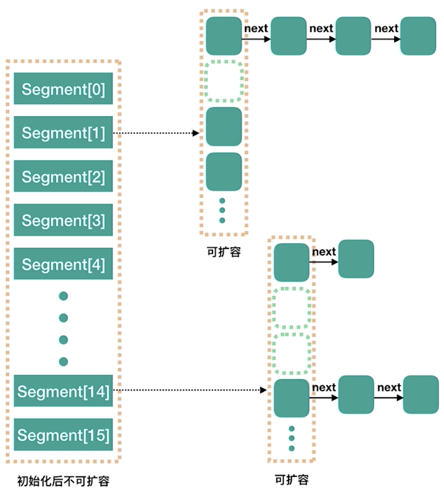
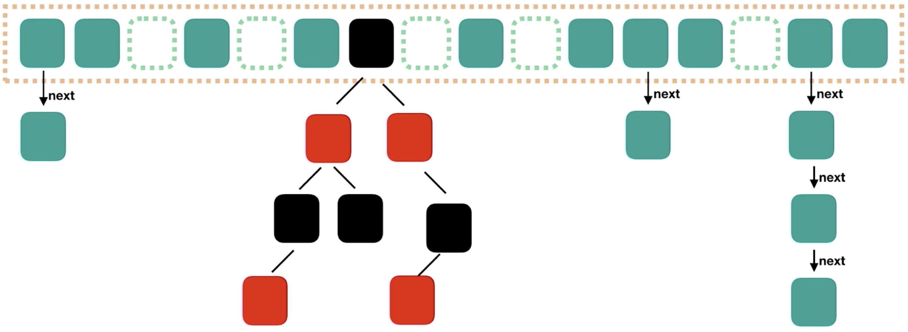

基于如下来分析
- ConcurrentHashMap 的锁分段技术；
- ConcurrentHashMap 的读是否要加锁，为什么？
- ConcurrentHashMap 的迭代器是强一致性的迭代器还是弱一致性的迭代器；

# 一、ConcurrentHashMap概述

## 1、为什么会出现ConcurrentHashMap

HashMap是用得非常频繁的一个集合，但是由于它是非线程安全的，在多线程环境下，put操作是有可能产生死循环的，导致CPU利用率接近100%。

为了解决该问题，提供了`Hashtable`和`Collections.synchronizedMap(hashMap)`两种解决方案，但是这两种方案都是对读写加锁，独占式，一个线程在读时其他线程必须等待，吞吐量较低，性能较为低下；Hashtable之所以效率低下主要是因为其实现使用了synchronized关键字对put等操作进行加锁，而synchronized关键字加锁是对整个对象进行加锁，也就是说在进行put等修改Hash表的操作时，锁住了整个Hash表，从而使得其表现的效率低下

## 2、ConcurrentHashMap-JDK6

**ConcurrentHashMap 的锁分段技术：** 首先将数据分成一段一段的存储，然后给每一段数据配一把锁，当一个线程占用锁访问其中一个段数据的时候，其他段的数据也能被其他线程访问。采用分段锁的机制，实现并发的更新操作，底层采用`数组+链表`的存储结构，其包含两个核心静态内部类 Segment 和 HashEntry.

**ConcurrentHashMap组成：**
ConcurrentHashMap 是由 Segment 数组结构和 HashEntry 数组结构组成，其中Segment 是一种可重入锁 ReentrantLock，在 ConcurrentHashMap 里扮演锁的角色，HashEntry 则用于存储键值对数据：
- 一个 ConcurrentHashMap 里包含一个 Segment 数组，Segment 的结构和 HashMap 类似，是一种数组和链表结构；
- 一个 Segment 里包含一个 HashEntry 数组，每个 HashEntry 是一个链表结构的元素,每个 Segment 守护着一个 HashEntry 数组里的元素,当对 HashEntry 数组的数据进行修改时，必须首先获得它对应的 Segment 锁
- HashEntry：用来封装散列映射表中的键值对.在 HashEntry 类中,key、hash和next 域都被声明为 final 型,value 域被声明为 volatile 型;
- Segment：继承于 ReentrantLock 类
    - table 是一个由 HashEntry 对象组成的数组。table 数组的每一个数组成员就是散列映射表的一个桶
    - count 变量是一个计数器，它表示每个 Segment 对象管理的 table 数组(若干个 HashEntry 组成的链表)包含的 HashEntry 对象的个数;

**默认并发级别：**ConcurrentHashMap 类的默认并发级别会创建包含 16 个 Segment 对象的数组，每个 Segment 的成员对象 table 包含若干个散列表的桶。每个桶是由 HashEntry 链接起来的一个链表；如果键能均匀散列，每个 Segment 大约守护整个散列表中桶总数的 1/16

**ConcurrentHashMap 的初始化：**

ConcurrentHashMap 初始化方法是通过 initialCapacity，loadFactor, concurrencyLevel几个参数来初始化segments数组，段偏移量segmentShift，段掩码segmentMask和每个segment里的HashEntry数组；

**ConcurrentHashMap 实现高并发：**
- ConcurrentHashMap 基于散列表的特性(除了少数插入操作和删除操作外,绝大多数都是读取操作,而且读操作在大多数时候都是成功的)针对读操作做了大量的优化;通过 HashEntry 对象的不变性和用 volatile 型变量协调线程间的内存可见性，使得大多数时候,读操作不需要加锁就可以正确获得值；ConcurrentHashMap 是一个并发散列映射表的实现，它允许完全并发的读取,并且支持给定数量的并发更新
- 用分离锁实现多个线程间的更深层次的共享访问,用 HashEntery 对象的不变性来降低执行读操作的线程在遍历链表期间对加锁的需求通过对同一个 Volatile 变量的写 / 读访问，协调不同线程间读 / 写操作的内存可见性
- ConcurrentHashMap的并发度跟 segment 的大小有关；

## 3、ConcurrentHashMap-JDK7

在Jdk1.7中是采用`Segment + HashEntry + ReentrantLock`

ConcurrentHashMap 由一个个 Segment 组成，ConcurrentHashMap 是一个 Segment 数组，Segment 通过继承 ReentrantLock 来进行加锁，所以每次需要加锁的操作锁住的是一个 segment，这样只要保证每个 Segment 是线程安全的，也就实现了全局的线程安全；

ConcurrentHashMap初始化时，计算出Segment数组的大小size和每个Segment中HashEntry数组的大小cap，并初始化Segment数组的第一个元素；其中size大小为2的幂次方，默认为16，cap大小也是2的幂次方，最小值为2，最终结果根据根据初始化容量initialCapacity进行计算，计算过程如下



`concurrencyLevel`：并行级别、并发数、Segment数。默认是 16，也就是说 ConcurrentHashMap 有 16 个 Segments，所以理论上，这个时候，最多可以同时支持 16 个线程并发写，只要它们的操作分别分布在不同的 Segment 上；这个值可以在初始化的时候设置为其他值，但是一旦初始化以后，它是不可以扩容的；

再具体到每个 Segment 内部，其实每个 Segment 很像之前介绍的 HashMap，不过它要保证线程安全，所以处理起来要麻烦些；

segment 数组不能扩容，扩容是 segment 数组某个位置内部的数组 `HashEntry<K,V>[]` 进行扩容，扩容后，容量为原来的 2 倍

## 4、ConcurrentHashMap-JDK8

JDK7中，最大并发度受Segment的个数限制，所以1.8中放弃了Segment臃肿的设计，取而代之的是采用`Node + CAS + Synchronized`来保证并发安全进行实现；只有在执行第一次put方法时才会调用initTable()初始化Node数组；

底层依然采用"数组+链表+红黑树"的存储结构
- JDK1.8的实现降低锁的粒度，JDK1.7版本锁的粒度是基于Segment的，包含多个HashEntry，而JDK1.8锁的粒度就是HashEntry（首节点）；
- JDK1.8版本的数据结构变得更加简单，使得操作也更加清晰流畅，因为已经使用synchronized来进行同步，所以不需要分段锁的概念，也就不需要Segment这种数据结构了，由于粒度的降低，实现的复杂度也增加了
- JDK1.8使用红黑树来优化链表，基于长度很长的链表的遍历是一个很漫长的过程，而红黑树的遍历效率是很快的，代替一定阈值的链表，这样形成一个最佳拍档



##  5、分段锁形式如何保证size的一致性

LongAdder 是一种JVM利用空间换取更高的效率

# 二、JDK8的实现

```java
public class ConcurrentHashMap<K,V> extends AbstractMap<K,V> implements ConcurrentMap<K,V>, Serializable {}
```

## 1、基本变量

**常量**
```java
// 链表转红黑树阀值,> 8 链表转换为红黑树
static final int TREEIFY_THRESHOLD = 8;
//树转链表阀值，小于等于6（tranfer时，lc、hc=0两个计数器分别++记录原bin、新binTreeNode数量，<=UNTREEIFY_THRESHOLD 则untreeify(lo)）
static final int UNTREEIFY_THRESHOLD = 6;
// 2^15-1，help resize的最大线程数
private static final int MAX_RESIZERS = (1 << (32 - RESIZE_STAMP_BITS)) - 1;
// 32-16=16，sizeCtl中记录size大小的偏移量
private static final int RESIZE_STAMP_SHIFT = 32 - RESIZE_STAMP_BITS;
// 树根节点的hash值
static final int TREEBIN   = -2;
// ReservationNode的hash值
static final int RESERVED  = -3;
// 可用处理器数量
static final int NCPU = Runtime.getRuntime().availableProcessors();
```
**几个重要的变量**
```java
transient volatile Node<K,V>[] table;
private transient volatile Node<K,V>[] nextTable;
private transient volatile long baseCount;
private transient volatile int sizeCtl;
```
- table：用来存放Node节点的数据，默认为null，默认大小为16的数组，每次扩容时大小总是2的幂次方；是volatile修饰的，为了使得Node数组在扩容的时候对其他线程具有可见性而加的volatile
- nextTable：扩容时新生成的数据，数组为table的两倍；
- Node：节点，保存key-value的数据结构；
- ForwardingNode：一个特殊的Node节点，hash值为-1，其中存储nextTable的引用。只有当table发生扩容时，ForwardingNode才会发挥作用，作为一个占位符放在table中表示节点为null或者已经被移动；
- sizeCtl：控制标识符，用来控制table初始化和扩容操作：
    - 负数代表正在初始化或者扩容操作；
    - `-1`代表正在初始化；
    - `-N` 标识有`N-1`个线程正在进行扩容操作；
    - 正数或0标识hash表还没有被初始化，这个值表示初始化或者下一次进行扩容的大小

## 2、内部类

### 2.1、Node

```java
static class Node<K,V> implements Map.Entry<K,V> {
    final int hash;
    final K key;
    volatile V val;
    volatile Node<K,V> next;
}
```

### 2.2、TreeNode

```java
static final class TreeNode<K,V> extends Node<K,V> {
    TreeNode<K,V> parent;  // red-black tree links
    TreeNode<K,V> left;
    TreeNode<K,V> right;
    TreeNode<K,V> prev;    // needed to unlink next upon deletion
}
```

### 2.3、TreeBin

```java
static final class TreeBin<K,V> extends Node<K,V> {
    TreeNode<K,V> root;
    volatile TreeNode<K,V> first;
    volatile Thread waiter;
    volatile int lockState;
    // values for lockState
    static final int WRITER = 1; // set while holding write lock
    static final int WAITER = 2; // set when waiting for write lock
    static final int READER = 4; // increment value for setting read lock
}
```

## 3、put方法

当执行put方法插入数据时，根据key的hash值，在Node数组中找到相应的位置，实现如下：
```java
final V putVal(K key, V value, boolean onlyIfAbsent) {
    if (key == null || value == null) throw new NullPointerException();
    // 得到 hash 值
    int hash = spread(key.hashCode());
    // 用于记录相应链表的长度
    int binCount = 0;
    for (Node<K,V>[] tab = table;;) {
        Node<K,V> f; int n, i, fh;
        // 如果数组"空"，进行数组初始化
        if (tab == null || (n = tab.length) == 0)
            // 初始化数组，后面会详细介绍
            tab = initTable();
        // 找该 hash 值对应的数组下标，得到第一个节点 f
        else if ((f = tabAt(tab, i = (n - 1) & hash)) == null) {
            // 如果数组该位置为空，
            // 用一次 CAS 操作将这个新值放入其中即可，这个 put 操作差不多就结束了，可以拉到最后面了
            // 如果 CAS 失败，那就是有并发操作，进到下一个循环就好了
            if (casTabAt(tab, i, null, new Node<K,V>(hash, key, value, null)))
                break;                   // no lock when adding to empty bin
        }
        // hash 居然可以等于 MOVED，这个需要到后面才能看明白，不过从名字上也能猜到，肯定是因为在扩容
        else if ((fh = f.hash) == MOVED)
            // 帮助数据迁移，这个等到看完数据迁移部分的介绍后，再理解这个就很简单了
            tab = helpTransfer(tab, f);
        else { // 到这里就是说，f 是该位置的头结点，而且不为空
            V oldVal = null;
            // 获取数组该位置的头结点的监视器锁
            synchronized (f) {
                if (tabAt(tab, i) == f) {
                    if (fh >= 0) { // 头结点的 hash 值大于 0，说明是链表
                        // 用于累加，记录链表的长度
                        binCount = 1;
                        // 遍历链表
                        for (Node<K,V> e = f;; ++binCount) {
                            K ek;
                            // 如果发现了"相等"的 key，判断是否要进行值覆盖，然后也就可以 break 了
                            if (e.hash == hash && ((ek = e.key) == key || (ek != null && key.equals(ek)))) {
                                oldVal = e.val;
                                if (!onlyIfAbsent)
                                    e.val = value;
                                break;
                            }
                            // 到了链表的最末端，将这个新值放到链表的最后面
                            Node<K,V> pred = e;
                            if ((e = e.next) == null) {
                                pred.next = new Node<K,V>(hash, key, value, null);
                                break;
                            }
                        }
                    }
                    else if (f instanceof TreeBin) { // 红黑树
                        Node<K,V> p;
                        binCount = 2;
                        // 调用红黑树的插值方法插入新节点
                        if ((p = ((TreeBin<K,V>)f).putTreeVal(hash, key,value)) != null) {
                            oldVal = p.val;
                            if (!onlyIfAbsent)
                                p.val = value;
                        }
                    }
                }
            }
            if (binCount != 0) {
                // 判断是否要将链表转换为红黑树，临界值和 HashMap 一样，也是 8
                if (binCount >= TREEIFY_THRESHOLD)
                    // 这个方法和 HashMap 中稍微有一点点不同，那就是它不是一定会进行红黑树转换，
                    // 如果当前数组的长度小于 64，那么会选择进行数组扩容，而不是转换为红黑树
                    // 具体源码我们就不看了，扩容部分后面说
                    treeifyBin(tab, i);
                if (oldVal != null)
                    return oldVal;
                break;
            }
        }
    }
    // 
    addCount(1L, binCount);
    return null;
}
```
- 判断是否有过初始化Node数组，如果没有，则初始化数组：
```java
private final Node<K,V>[] initTable() {
    Node<K,V>[] tab; int sc;
    while ((tab = table) == null || tab.length == 0) {
        // 初始化方法中的并发问题是通过对 sizeCtl 进行一个 CAS 操作来控制的
        if ((sc = sizeCtl) < 0)
            Thread.yield(); // lost initialization race; just spin
        else if (U.compareAndSwapInt(this, SIZECTL, sc, -1)) {
            // 通过对 sizeCtl 进行一个 CAS 操作来控制的，将 sizeCtl 设置为 -1，代表抢到了锁
            try {
                if ((tab = table) == null || tab.length == 0) {
                    int n = (sc > 0) ? sc : DEFAULT_CAPACITY;
                    // 初始化数组，长度为 16 或初始化时提供的长度
                    Node<K,V>[] nt = (Node<K,V>[])new Node<?,?>[n];
                    table = tab = nt;
                    // 其实就是 0.75 * n
                    sc = n - (n >>> 2);
                }
            } finally {
                sizeCtl = sc;
            }
            break;
        }
    }
    return tab;
}
```
- 如果相应位置的Node还未初始化，则通过CAS插入相应的数据
```java
else if ((f = tabAt(tab, i = (n - 1) & hash)) == null) {
        if (casTabAt(tab, i, null, new Node<K,V>(hash, key, value, null)))
            break;                   // no lock when adding to empty bin
}
```
- 如果相应位置的Node不为空，且当前该节点不处于移动状态，则对该节点加synchronized锁，如果该节点的hash不小于0，则遍历链表更新节点或插入新节点；
```java
synchronized (f) {
    if (tabAt(tab, i) == f) {
        if (fh >= 0) {
            binCount = 1;
            for (Node<K,V> e = f;; ++binCount) {
                K ek;
                if (e.hash == hash &&
                    ((ek = e.key) == key ||
                        (ek != null && key.equals(ek)))) {
                    oldVal = e.val;
                    if (!onlyIfAbsent)
                        e.val = value;
                    break;
                }
                Node<K,V> pred = e;
                if ((e = e.next) == null) {
                    pred.next = new Node<K,V>(hash, key,
                                                value, null);
                    break;
                }
            }
        }
        else if (f instanceof TreeBin) {
            Node<K,V> p;
            binCount = 2;
            if ((p = ((TreeBin<K,V>)f).putTreeVal(hash, key,
                                            value)) != null) {
                oldVal = p.val;
                if (!onlyIfAbsent)
                    p.val = value;
            }
        }
    }
}
```
- 如果该节点是TreeBin类型的节点，说明是红黑树结构，则通过putTreeVal方法往红黑树中插入节点；
- 如果binCount不为0，说明put操作对数据产生了影响，如果当前链表的个数达到8个，则通过treeifyBin方法转化为红黑树，如果oldVal不为空，说明是一次更新操作，没有对元素个数产生影响，则直接返回旧值；
```java
private final void treeifyBin(Node<K,V>[] tab, int index) {
    Node<K,V> b; int n, sc;
    if (tab != null) {
        // MIN_TREEIFY_CAPACITY 为 64
        // 所以，如果数组长度小于 64 的时候，其实也就是 32 或者 16 或者更小的时候，会进行数组扩容
        if ((n = tab.length) < MIN_TREEIFY_CAPACITY)
            tryPresize(n << 1);
        // b 是头结点
        else if ((b = tabAt(tab, index)) != null && b.hash >= 0) {
            // 加锁
            synchronized (b) {

                if (tabAt(tab, index) == b) {
                    // 下面就是遍历链表，建立一颗红黑树
                    TreeNode<K,V> hd = null, tl = null;
                    for (Node<K,V> e = b; e != null; e = e.next) {
                        TreeNode<K,V> p =
                            new TreeNode<K,V>(e.hash, e.key, e.val,
                                              null, null);
                        if ((p.prev = tl) == null)
                            hd = p;
                        else
                            tl.next = p;
                        tl = p;
                    }
                    // 将红黑树设置到数组相应位置中
                    setTabAt(tab, index, new TreeBin<K,V>(hd));
                }
            }
        }
    }
}
```
- 如果插入的是一个新节点，则执行addCount()方法尝试更新元素个数baseCount；

## 4、get方法

- 首先计算hash值，定位到该table索引位置，如果是首节点符合就返回
- 如果遇到扩容的时候，会调用标志正在扩容节点ForwardingNode的find方法，查找该节点，匹配就返回
- 以上都不符合的话，就往下遍历节点，匹配就返回，否则最后就返回null
```java
//会发现源码中没有一处加了锁
public V get(Object key) {
    Node<K,V>[] tab; Node<K,V> e, p; int n, eh; K ek;
    int h = spread(key.hashCode()); //计算hash
    if ((tab = table) != null && (n = tab.length) > 0 &&
        (e = tabAt(tab, (n - 1) & h)) != null) {//读取首节点的Node元素
        if ((eh = e.hash) == h) { //如果该节点就是首节点就返回
            if ((ek = e.key) == key || (ek != null && key.equals(ek)))
                return e.val;
        }
        //hash值为负值表示正在扩容，这个时候查的是ForwardingNode的find方法来定位到nextTable来
        //eh=-1，说明该节点是一个ForwardingNode，正在迁移，此时调用ForwardingNode的find方法去nextTable里找。
        //eh=-2，说明该节点是一个TreeBin，此时调用TreeBin的find方法遍历红黑树，由于红黑树有可能正在旋转变色，所以find里会有读写锁。
        //eh>=0，说明该节点下挂的是一个链表，直接遍历该链表即可。
        else if (eh < 0)
            return (p = e.find(h, key)) != null ? p.val : null;
        while ((e = e.next) != null) {//既不是首节点也不是ForwardingNode，那就往下遍历
            if (e.hash == h &&
                ((ek = e.key) == key || (ek != null && key.equals(ek))))
                return e.val;
        }
    }
    return null;
}
```
**get没有加锁的话，ConcurrentHashMap是如何保证读到的数据不是脏数据的呢？**

get操作可以无锁是由于Node的元素val和指针next是用volatile修饰的，在多线程环境下线程A修改结点的val或者新增节点的时候是对线程B可见的。

既然volatile修饰数组对get操作没有效果那加在数组上的volatile的目的是：为了使得Node数组在扩容的时候对其他线程具有可见性而加的volatile

## 5、扩容

### 5.1、触发扩容

- 如果新增节点之后，所在链表的元素个数达到了阈值 8，则会调用 `treeifyBin()`方法把链表转换成红黑树，不过在结构转换之前，会对数组长度进行判断。如果数组长度n小于阈值 `MIN_TREEIFY_CAPACITY`，默认是64，则会调用 `tryPresize`方法把数组长度扩大到原来的两倍，并触发 `transfer`数据迁移方法，重新调整节点的位置；
- 新增节点之后，会调用 addCount方法记录元素个数，并检查是否需要进行扩容，当数组元素个数达到阈值时，会触发 transfer方法，重新调整节点的位置；

扩容步骤：
<li>首先需要把老数组的值全部拷贝到扩容之后的新数组上，先从数组的队尾开始拷贝；</li>
<li>拷贝数组的槽点时，先把原数组槽点锁住，保证原数组槽点不能操作，成功拷贝到新数组时，把原数组槽点赋值为转移节点；</li>
<li>这时如果有新数据正好需要 put 到此槽点时，发现槽点为转移节点，就会一直等待，所以在扩容完成之前，该槽点对应的数据是不会发生变化的；</li>
<li>从数组的尾部拷贝到头部，每拷贝成功一次，就把原数组中的节点设置成转移节点；</li>
<li>直到所有数组数据都拷贝到新数组时，直接把新数组整个赋值给数组容器，拷贝完成。</li>

### 5.2、扩容实现

tryPresize();
```java
// 需要说明的是：方法参数 size 传进来的时候就已经翻了倍了，扩容后数组容量为原来的 2 倍。
private final void tryPresize(int size) {
    // c: size 的 1.5 倍，再加 1，再往上取最近的 2 的 n 次方。
    int c = (size >= (MAXIMUM_CAPACITY >>> 1)) ? MAXIMUM_CAPACITY : tableSizeFor(size + (size >>> 1) + 1);
    int sc;
    while ((sc = sizeCtl) >= 0) {
        Node<K,V>[] tab = table; int n;

        // 这个 if 分支和之前说的初始化数组的代码基本上是一样的，在这里，我们可以不用管这块代码
        if (tab == null || (n = tab.length) == 0) {
            n = (sc > c) ? sc : c;
            if (U.compareAndSwapInt(this, SIZECTL, sc, -1)) {
                try {
                    if (table == tab) {
                        @SuppressWarnings("unchecked")
                        Node<K,V>[] nt = (Node<K,V>[])new Node<?,?>[n];
                        table = nt;
                        sc = n - (n >>> 2); // 0.75 * n
                    }
                } finally {
                    sizeCtl = sc;
                }
            }
        }
        else if (c <= sc || n >= MAXIMUM_CAPACITY)
            break;
        else if (tab == table) {
            // 我没看懂 rs 的真正含义是什么，不过也关系不大
            int rs = resizeStamp(n);

            if (sc < 0) {
                Node<K,V>[] nt;
                if ((sc >>> RESIZE_STAMP_SHIFT) != rs || sc == rs + 1 ||
                    sc == rs + MAX_RESIZERS || (nt = nextTable) == null ||
                    transferIndex <= 0)
                    break;
                // 2. 用 CAS 将 sizeCtl 加 1，然后执行 transfer 方法
                //    此时 nextTab 不为 null
                if (U.compareAndSwapInt(this, SIZECTL, sc, sc + 1))
                    transfer(tab, nt);
            }
            // 1. 将 sizeCtl 设置为 (rs << RESIZE_STAMP_SHIFT) + 2)
            //     我是没看懂这个值真正的意义是什么? 不过可以计算出来的是，结果是一个比较大的负数
            //  调用 transfer 方法，此时 nextTab 参数为 null
            else if (U.compareAndSwapInt(this, SIZECTL, sc, (rs << RESIZE_STAMP_SHIFT) + 2))
                transfer(tab, null);
        }
    }
}
```
这个方法的核心在于 sizeCtl 值的操作，首先将其设置为一个负数，然后执行 transfer(tab, null)，再下一个循环将 sizeCtl 加 1，并执行 transfer(tab, nt)，之后可能是继续 sizeCtl 加 1，并执行 transfer(tab, nt)

扩容的实现的关键点是如何保证线程安全：
- 拷贝槽点时，会把原数组的槽点锁住；
- 拷贝成功之后，会把原数组的槽点设置成转移节点，这样如果有数据需要 put 到该节点时，发现该槽点是转移节点，会一直等待，直到扩容成功之后，才能继续 put，可以参考 put 方法中的 helpTransfer 方法；
- 从尾到头进行拷贝，拷贝成功就把原数组的槽点设置成转移节点。
- 等扩容拷贝都完成之后，直接把新数组的值赋值给数组容器，之前等待 put 的数据才能继续 put。

### 5.3、数据迁移：transfer

将原来的 tab 数组的元素迁移到新的 nextTab 数组中

并发操作的机制：原数组长度为 n，所以我们有 n 个迁移任务，让每个线程每次负责一个小任务是最简单的，每做完一个任务再检测是否有其他没做完的任务，帮助迁移就可以了，而 Doug Lea 使用了一个 stride，简单理解就是步长，每个线程每次负责迁移其中的一部分，如每次迁移 16 个小任务。所以，我们就需要一个全局的调度者来安排哪个线程执行哪几个任务，这个就是属性 transferIndex 的作用；

第一个发起数据迁移的线程会将 transferIndex 指向原数组最后的位置，然后从后往前的 stride 个任务属于第一个线程，然后将 transferIndex 指向新的位置，再往前的 stride 个任务属于第二个线程，依此类推。当然，这里说的第二个线程不是真的一定指代了第二个线程，也可以是同一个线程。其实就是将一个大的迁移任务分为了一个个任务包；

## 6、size与mappingCount方法

1.8中使用一个volatile类型的变量baseCount记录元素的个数，当插入新数据或则删除数据时，会通过addCount()方法更新baseCount，实现如下。
```java
public int size() {
    long n = sumCount();
    return ((n < 0L) ? 0 :
            (n > (long)Integer.MAX_VALUE) ? Integer.MAX_VALUE :
            (int)n);
}
public long mappingCount() {
    long n = sumCount();
    return (n < 0L) ? 0L : n; // ignore transient negative values
}
/**
 * 当没有争用时，使用这个变量计数。会有一个addCount方法对该变量通过CAS进行操作
 */
private transient volatile long baseCount;
final long sumCount() {
    CounterCell[] as = counterCells; CounterCell a;
    long sum = baseCount;
    if (as != null) {
        for (int i = 0; i < as.length; ++i) {
            if ((a = as[i]) != null)
                sum += a.value;
        }
    }
    return sum;
}
// 一种用于分配计数的填充单元。改编自LongAdder和Striped64。请查看他们的内部文档进行解释。使用了 @sun.misc.Contended 标记的类，这个注解标识着这个类防止需要防止 "伪共享"
@sun.misc.Contended 
static final class CounterCell {
    volatile long value;
    CounterCell(long x) { value = x; }
}
```
两者之间比较：上述两个方法都是调用sumCount方法来计算的，只不过size方法返回的是int类型，所以需要限制最大值必须是 Integer.MAX_VALUE；而mappingCount方法返回的是long类型的；

先看baseCount，它一个 volatile 的变量，在 addCount 方法中会使用它，而 addCount 方法在 put 结束后会调用。在 addCount 方法中，会对这个变量做 CAS 加法。
```java
if ((as = counterCells) != null ||
    !U.compareAndSwapLong(this, BASECOUNT, b = baseCount, s = b + x)) {
    CounterCell a; long v; int m;
    boolean uncontended = true;
    if (as == null || (m = as.length - 1) < 0 ||
        (a = as[ThreadLocalRandom.getProbe() & m]) == null ||
        !(uncontended =
            U.compareAndSwapLong(a, CELLVALUE, v = a.value, v + x))) {
        fullAddCount(x, uncontended);
        return;
    }
    if (check <= 1)
        return;
    s = sumCount();
}
```
但是如果并发导致 CAS 失败了，怎么办呢？使用 counterCells

## 7、hash冲突解决

在Java 8 之前，HashMap和其他基于map的类都是通过链地址法解决冲突，它们使用单向链表来存储相同索引值的元素。在最坏的情况下，这种方式会将HashMap的get方法的性能从O(1)降低到O(n)。为了解决在频繁冲突时hashmap性能降低的问题，Java 8中使用平衡树来替代链表存储冲突的元素。这意味着我们可以将最坏情况下的性能从O(n)提高到$O(\log(N))$


# 参考资料

* [ConcurrentHashMap高并发性的实现机制](http://www.importnew.com/16147.html)
* [ConcurrentHashMap面试必问](https://mp.weixin.qq.com/s/HUvHUBRqp4I4ShyUJr5xDw)
* [ConcurrentHashMap进阶之红黑树实现](https://mp.weixin.qq.com/s/8XLqCwWQimAIr__S_BfrHA)
* [ConcurrentHashMap进阶之扩容实现](https://mp.weixin.qq.com/s/8MCq-i0AMqaJRQIecJl2WA)
* [Jdk7与JDK8的区别](https://www.jianshu.com/p/e694f1e868ec)