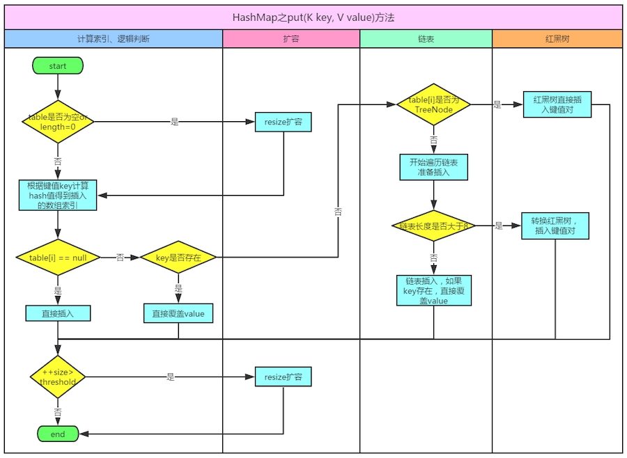
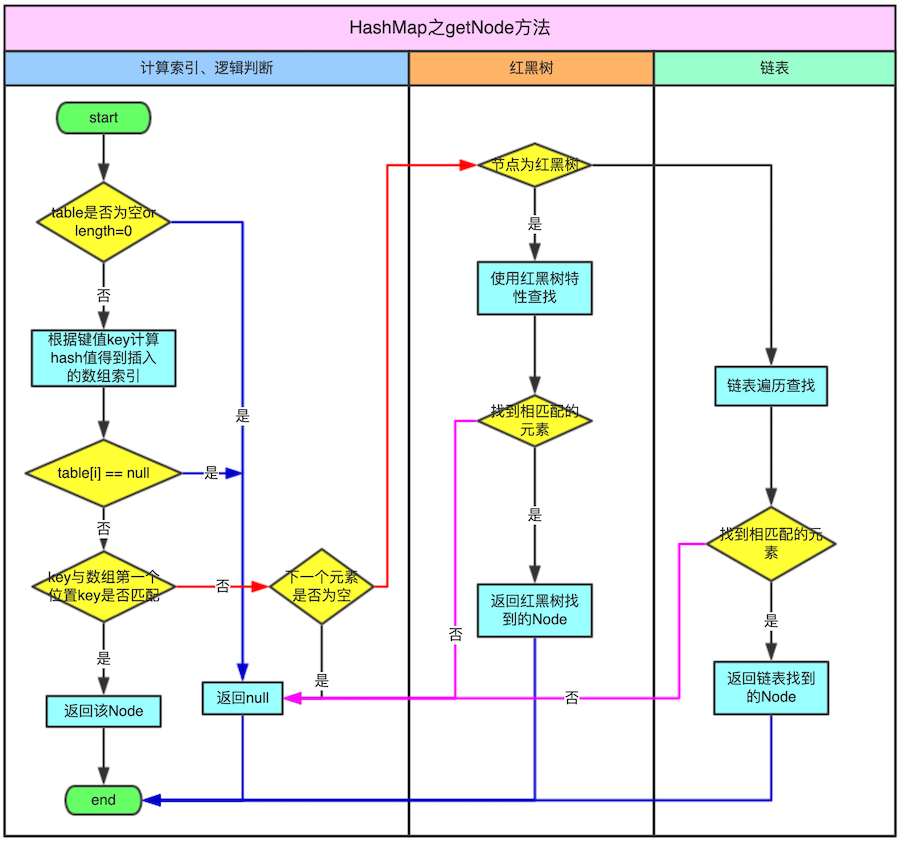

# 一、HashMap 概述

HashMap 是基于一个数组和多个链表来实现的，HashMap继承`AbstractMap`, 实现了 `Map、Cloneable、Serializable`

## 1、HashMap的特点

### 1.1、HashMap 基本结构

在JDK8之前使用了一个内部类 `Entry<K, V>`来存储数据，这个内部类是一个简单的键值对，HashMap将数据存储到多个单向Entry链表中，所有的列表都被注册到一个Entry数组中(`Entry<K, V>[]`数组)，这个内部数组的默认长度是 16；

在JDK8之后，内部采用的是`Node<K,V>`节点来存储数据的；

### 1.2、HashMap的特点

- 线程非安全，并且允许key与value都为 null 值，Hashtable 与之相反，为线程安全，key与value都不允许 null 值；
- 不保证其内部元素的顺序，而且随着时间的推移，同一元素的位置也可能改变（resize的情况）
- put、get操作的时间复杂度为O(1)。
- 遍历其集合视角的时间复杂度与其容量（capacity，槽的个数）和现有元素的大小（entry的个数）成正比，所以如果遍历的性能要求很高，不要把`capactiy`设置的过高或把平衡因子（load factor，当entry数大于`capacity*loadFactor`时，会进行resize，reside会导致key进行rehash）设置的过低
- 由于HashMap是线程非安全的，这也就是意味着如果多个线程同时对一hashmap的集合试图做迭代时有结构的上改变（添加、删除entry，只改变entry的value的值不算结构改变），那么会报`ConcurrentModificationException`专业术语叫fail-fast
- `Map m = Collections.synchronizedMap(new HashMap());` 通过这种方式可以得到一个线程安全的map；

### 1.3、不可变对象与 HashMap 的key

- 如果 key 的哈希值在存储键值对后发生改变，Map 可能再也查找不到这个 Entry 了。如果Key对象是可变的，那么Key的哈希值就可能改变。在HashMap中可变对象作为Key会造成数据丢失
- 在 HashMap 中使用不可变对象。在 HashMap 中，使用 String、Integer 等不可变类型用作Key是非常明智的定义属于自己的不可变类时，在改变对象状态的时候，不要改变它的哈希值了

## 2、HashMap和Hashtable的区别

- Hashtable的方法是同步的，在方法的前面都有synchronized来同步，HashMap未经同步，所以在多线程场合要手动同步；
- Hashtable不允许null值(key和value都不可以) ，HashMap允许null值(key和value都可以)。
- Hashtable有一个contains(Object value)功能和containsValue(Object value)功能一样。
- Hashtable是基于Dictionary类继承的；HashMap继承抽象类AbstractMap实现了Map接口；
- Hashtable使用Enumeration进行遍历，HashMap使用Iterator进行遍历。
- Hashtable中hash数组默认大小是11，增加的方式是 2n+1。HashMap中hash数组的默认大小是16，之后每次扩充是都是2的倍数。在取模计算时，如果模数是2的幂，那么我们可以直接使用位运算来得到结果，效率要大大高于做除法
- 哈希值的使用不同，Hashtable 直接使用对象的 hashCode，代码是这样的：
	```java
	int hash = key.hashCode();
	int index = (hash & 0x7FFFFFFF) % tab.length;
	```
	而 HashMap重新计算hash值，而且用 & 代替 % 求模
	```java
	int hash = hash(k);
	int i = indexFor(hash, table.length);
	static int hash(Object x) {
	h ^= (h >>> 20) ^ (h >>> 12);
			return h ^ (h >>> 7) ^ (h >>> 4);
	}
	static int indexFor(int h, int length) {
		return h & (length-1);
	}
	```
- HashMap为了提高效率使用位运算代替哈希，这又引入了哈希分布不均匀的问题，所以HashMap为解决这问题，又对hash算法做了一些改进，进行了扰动计算

## 3、HashMap与HashSet的关系

- HashSet底层是采用HashMap实现的
	```java
	public HashSet() {
		map = new HashMap<E,Object>();
	}
	```
- 调用HashSet的add方法时，实际上是向HashMap中增加了一行(key-value对)，该行的key就是向HashSet增加的那个对象，该行的value就是一个Object类型的常量
	```java
	private static final Object PRESENT = new Object(); public boolean add(E e) { 
		return map.put(e, PRESENT)==null; 
	} 
	public boolean remove(Object o) { 
		return map.remove(o)==PRESENT; 
	}
	```

## 4、Hashtable和ConcurrentHashMap 的关系

- ConcurrentHashMap 也是一种线程安全的集合类，他和 Hashtable 也是有区别的，主要区别：就是加锁的粒度以及如何加锁；ConcurrentHashMap 的加锁粒度要比 Hashtable 更细一点。将数据分成一段一段的存储，然后给每一段数据配一把锁，当一个线程占用锁访问其中一个段数据的时候，其他段的数据也能被其他线程访问
- ConcurrentHashMap 如何实现写分段锁，如何实现弱一致性和读不加锁，不加锁情况能否保证每次获取的元素都是最新的？ConcurrentHashMap Segment
- 为什么需要ConcurrentHashMap和CopyOnWriteArrayList
	- 同步的集合类(Hashtable和Vector)同步的封装类(使用Collections.synchronizedMap()方法和 Collections.synchronizedList()方法返回的对象)可以创建出线程安全的Map和List。但是有些因素使得它们不适合高并发的系统。它们仅有单个锁，对整个集合加锁，以及为了防止ConcurrentModificationException异常经常要在迭代的时候要将集合锁定一段时间，这些特性对可扩展性来说都是障碍；
	- ConcurrentHashMap和CopyOnWriteArrayList保留了线程安全的同时，也提供了更高的并发性。ConcurrentHashMap和 CopyOnWriteArrayList 并不是处处都需要用；大部分时候你只需要用到HashMap和ArrayList，它们用于应对一些普通的情况

## 5、键的不变性

- 为什么将字符串和整数作为HashMap的键是一种很好的实现？

	主要是因为它们是不可变的！如果你选择自己创建一个类作为键，但不能保证这个类是不可变的，那么你可能会在HashMap内部丢失数据

## 6、Java8 中 HashMap 的改进

在 JDK 1.7 中 HashMap 是以数组加链表的形式组成的，JDK 1.8 之后新增了红黑树的组成结构，当链表大于 8 并且容量大于 64 时，链表结构会转换成红黑树结构

### 6.1、底层数据结构变化

- 在Java 8中，使用数组，但它会被保存在Node中，Node 中包含了和之前 Entry 对象一样的信息，并且也会使用链表
- 和JDK7相比，最大区别在于 Node可以被扩展成TreeNode。TreeNode是一个红黑树的数据结构，它可以存储更多的信息这样我们可以在O(log(n))的复杂度下添加、删除或者获取一个元素；
	```java
	// 它继承自 LinkedHashMap.Entry,而 LinkedHashMap.Entry 继承自 HashMap.Node
	static final class TreeNode<K,V> extends LinkedHashMap.Entry<K,V> {
		TreeNode<K,V> parent;  // red-black tree links
		TreeNode<K,V> left;
		TreeNode<K,V> right;
		TreeNode<K,V> prev;    // needed to unlink next upon deletion
		boolean red;
	}
	static class Entry<K,V> extends HashMap.Node<K,V> {
		Entry<K,V> before, after;
		Entry(int hash, K key, V value, Node<K,V> next) {
						super(hash, key, value, next);
		}
	}
	```
- 红黑树是自平衡的二叉搜索树，不管是添加还是删除节点，它的内部机制可以保证它的长度总是`log(n)`。使用这种类型的树，最主要的好处是针对内部表中许多数据都具有相同索引（桶）的情况，这时对树进行搜索的复杂度是`O(log(n))`，而对于链表来说，执行相同的操作，复杂度是`O(n)`；

- JDK8中HashMap有三个关于红黑树的关键参数：
	* `TREEIFY_THRESHOLD = 8`：

		一个桶的树化阈值，当桶中元素超过这个值时，使用红黑树节点替换链表节点值为8，应该跟加载因子类似；

		理想情况下使用随机的哈希码，容器中节点分布在hash桶中的频率遵循泊松分布，按照泊松分布的计算公式计算出了桶中元素个数和概率的对照表，可以看到链表中元素个数为8时的概率已经非常小，再多的就更少了，所以原作者在选择链表元素个数时选择了8，是根据概率统计而选择的：
		```
		0: 0.60653066
		1: 0.30326533
		2: 0.07581633
		3: 0.01263606
		4: 0.00157952
		5: 0.00015795
		6: 0.00001316
		7: 0.00000094
		8: 0.00000006
		```
		红黑树的平均查找长度是`log(n)`，长度为8，查找长度为`log(8)=3`，链表的平均查找长度为`n/2`，当长度为8时，平均查找长度为`8/2=4`，这才有转换成树的必要；链表长度如果是小于等于6，`6/2=3`，虽然速度也很快的，但是转化为树结构和生成树的时间并不会太短；

	* `UNTREEIFY_THRESHOLD = 6`：

		一个树的链表还原阈值，当扩容时，桶中元素个数小于这个值，会把树形的桶元素还原为链表结构，这个值是6，应该比 `TREEIFY_THRESHOLD` 小

		为什么是6和8？中间有个差值7可以防止链表和树之间频繁的转换。假设一下，如果设计成链表个数超过8则链表转换成树结构，链表个数小于8则树结构转换成链表，如果一个HashMap不停的插入、删除元素，链表个数在8左右徘徊，就会频繁的发生树转链表、链表转树，效率会很低。

	* `MIN_TREEIFY_CAPACITY = 64`：
	
		哈希表（数组）的最小树形化容量，当哈希表（数组）中的容量大于这个值时，表中的桶才能进行树形化，否则桶内元素太多时会扩容，而不是树形化。为了避免进行扩容、树形化选择的冲突，这个值不能小于 4*TREEIFY_THRESHOLD

- 为什么使用红黑树而不使用二叉树？

	之所以选择红黑树是为了解决二叉查找树的缺陷：二叉查找树在特殊情况下会变成一条线性结构（这就跟原来使用链表结构一样了，造成层次很深的问题），遍历查找会非常慢。而红黑树在插入新数据后可能需要通过左旋、右旋、变色这些操作来保持平衡。引入红黑树就是为了查找数据快，解决链表查询深度的问题；

	红黑树的查询性能略微逊色于AVL树，因为他比avl树会稍微不平衡最多一层，也就是说红黑树的查询性能只比相同内容的avl树最多多一次比较，但是，红黑树在插入和删除上完爆avl树，avl树每次插入删除会进行大量的平衡度计算，而红黑树为了维持红黑性质所做的红黑变换和旋转的开销，相较于avl树为了维持平衡的开销要小得多；

	**但是为什么会有链表与红黑树的相互转化？**
	- 红黑树属于平衡二叉树，为了保持“平衡”是需要付出代价的，但是该代价所损耗的资源要比遍历线性链表要少。所以当长度大于8的时候，会使用红黑树；如果链表长度很短的话，根本不需要引入红黑树，引入反而会慢；
	- 添加红黑树是因为一旦链表过长，会严重影响 HashMap 的性能，而红黑树具有快速增删改查的特点，这样就可以有效的解决链表过长时操作比较慢的问题；

### 6.2、扩容时插入顺序的改进

### 6.3、新增函数方法

## 7、延迟加载机制

从Java 7开始，HashMap 采用了延迟加载的机制：这意味着即使你为HashMap指定了大小，在我们第一次使用put()方法之前，记录使用的内部数组（耗费4*CAPACITY字节）也不会在内存中分配空间

## 8、初始化HashMap指定容量

### 8.1、为什么需要指定容量

如果你需要存储大量数据，你应该在创建HashMap时指定一个初始的容量，这个容量应该接近你期望的大小。通过初始化时指定Map期望的大小，你可以避免调整大小操作带来的消耗。如果你不这样做，Map会使用默认的大小即16，factorLoad的值是0.75。前11次调用put()方法会非常快，但是第12次（16*0.75）调用时会创建一个新的长度为32的内部数组（以及对应的链表/树），第13次到第22次调用put()方法会很快；

### 8.2、指定容量的数值多大合适

构造方法传递的 initialCapacity，最终会被 `tableSizeFor()` 方法动态通过利用无符号右移和按位或运算等方式计算出第一个大于该数的2的幂，以方便在扩容的时候，计算数据在 newTable 中的位置。
```java
static final int MAXIMUM_CAPACITY = 1 << 30;
static final int tableSizeFor(int cap) {
	int n = cap - 1;
	// 是对一个二进制数依次向右移位，然后与原值取或。其目的对于一个数字的二进制，从第一个不为0的位开始，把后面的所有位都设置成1
	n |= n >>> 1;
	n |= n >>> 2;
	n |= n >>> 4;
	n |= n >>> 8;
	n |= n >>> 16;
	return (n < 0) ? 1 : (n >= MAXIMUM_CAPACITY) ? MAXIMUM_CAPACITY : n + 1;
}
```

如果设置了 table 的初始容量，会在初始化 table 时，将扩容阈值 threshold 重新调整为 `table.size * loadFactor`。而 HashMap 是否扩容，由 threshold 决定，而 threshold 又由初始容量和 loadFactor 决定。如果我们预先知道 HashMap 数据量范围，可以预设 HashMap 的容量值来提升效率，但是需要注意要考虑装载因子的影响，才能保证不会触发预期之外的动态扩容；通常在初始化 HashMap 时，初始容量都是根据业务来的，而不会是一个固定值，为此我们需要有一个特殊处理的方式，就是将预期的初始容量，再除以 HashMap 的装载因子，默认时就是除以 0.75；

例如：想要用 HashMap 存放 1k 条数据，应该设置 `1000 / 0.75`，实际传递进去的值是 1333，然后会被 tableSizeFor() 方法调整到 2048，足够存储数据而不会触发扩容；

当我们明确知道 HashMap 中元素的个数的时候，把默认容量设置成 `expectedSize / 0.75F + 1.0F` 是一个在性能上相对好的选择，但 是，同时也会牺牲些内存；当然我们可以使用guava来创建HashMap：`Maps.newHashMapWithExpectedSize(7);`，其会按照 `expectedSize / 0.75F + 1.0F` 计算公式来计算：
```java
public static <K, V> HashMap<K, V> newHashMapWithExpectedSize(int expectedSize) {
	return new HashMap<K, V>(capacity(expectedSize));
}
static int capacity(int expectedSize) {
	if (expectedSize < 3) {
		checkNonnegative(expectedSize, "expectedSize");
		return expectedSize + 1;
	}
	if (expectedSize < Ints.MAX_POWER_OF_TWO) {
		// This is the calculation used in JDK8 to resize when a putAll happens; it seems to be the most conservative calculation we
		// can make.  0.75 is the default load factor.
		return (int) ((float) expectedSize / 0.75F + 1.0F);
	}
	return Integer.MAX_VALUE; // any large value
}
```

在JDK 1.7和JDK 1.8中，HashMap初始化这个容量的时机不同。JDK 1.8中，在调用HashMap的构造函数定义HashMap的时候，就会进行容量的设定。而在JDK 1.7中，要等到第一次put操作时才进行这一操作

### 8.3、扩容触发条件

JDK7触发扩容需要满足两个条件：
- 存放新值的时候当前已有元素的个数必须大于等于阈值（由初始化hash桶数量16和阈值0.75为例，当map中的数据达到16*0.75=12时，此时map中的数据已经达到了hashmap扩容机制的阈值，当再次插入第13个数据时hashmp将自动扩容）；
- 存放新值的时候当前存放数据发生hash碰撞（当前key计算的hash值换算出来的数组下标位置已经存在值）

JDK8则只需要满足一个条件：当前存放新值（注意不是替换已有元素位置时）的时候已有元素的个数大于等于阈值（即已有元素等于阈值，下一个存放后必然触发扩容机制）

# 二、签名

```java
public class HashMap<K,V> extends AbstractMap<K,V>implements Map<K,V>, Cloneable, Serializable
```

- 实现标记接口 Cloneable，用于表明 HashMap 对象会重写 `java.lang.Object#clone()`方法，HashMap 实现的是浅拷贝(shallow copy)；
- 实现标记接口 Serializable，用于表明 HashMap 对象可以被序列化；
- HashMap 继承 AbstractMap 抽象类的同时又实现了 Map 接口：在语法层面继承接口Map是多余的，这么做仅仅是为了让阅读代码的人明确知道 HashMap 是属于 Map 体系的，起到了文档的作用AbstractMap 相当于个辅助类，Map 的一些操作这里面已经提供了默认实现，后面具体的子类如果没有特殊行为，可直接使用AbstractMap提供的实现；

- AbstractMap 抽象类：对 Map 中的方法提供了一个基本实现，减少了实现Map接口的工作量
	- 如果要实现个`不可变(unmodifiable)的map`，那么只需继承 AbstractMap，然后实现其entrySet方法，这个方法返回的set不支持add与remove，同时这个set的迭代器(iterator)不支持remove操作即可。
	- 如果要实现个可变(modifiable)的map，首先继承 AbstractMa，然后重写 AbstractMap 的put方法，同时实现entrySet所返回set的迭代器的remove方法即可

***为什么继承了 AbstractMap 还需要实现 Map 接口？*** HashMap的作者说这是一个写法错误；并没有其他意思；也有可能是为了语义和代码上更清晰吧；

# 三、设计理念

## 1、HashMap 的数据结构

数据结构中有数组和链表来实现对数据的存储，但这两者基本上是两个极端；
- 数组：数组必须事先定义固定的长度（元素个数），不能适应数据动态地增减的情况。当数据增加时，可能超出原先定义的元素个数；
	- 当数据减少时，造成内存浪费
	- 数组是静态分配内存，并且在内存中连续。
	- 数组利用下标定位，时间复杂度为O(1)
	- 数组插入或删除元素的时间复杂度O(n)
	- 数组的特点是：寻址容易，插入和删除困难；
- 链表：链表存储区间离散，占用内存比较宽松
	- 链表是动态分配内存，并不连续。
	- 链表定位元素时间复杂度O(n)
	- 链表插入或删除元素的时间复杂度O(1)
	- 链表的特点是：寻址困难，插入和删除容易
- 红黑树：当链表达到一定长度后，其查询效率比较低，而后会转成红黑树结构，红黑树的查询都是在O(logN)

## 2、哈希表(hash table)

HashMap是一种基于哈希表（hash table）实现的map，既满足了数据的查找方便，同时不占用太多的内容空间，
- 哈希表(也叫关联数组)一种通用的数据结构：key经过hash函数作用后得到一个槽(buckets或slots)的索引(index)，槽中保存着我们想要获取的值；
- 一些不同的key经过同一hash函数后可能产生相同的索引，利用哈希表这种数据结构实现具体类时：设计个好的hash函数，使冲突尽可能的减少，其次是需要解决发生冲突后如何处理。

## 3、HashMap是一个线性的数组实现

可以理解为其存储数据的容器就是一个线性数组，HashMap里面实现一个静态内部类 Entry，其重要的属性有 key、value、next，从属性key、value我们就能很明显的看出来 Entry 就是 HashMap 键值对实现的一个基础bean，我们上面说到HashMap的基础就是一个线性数组，这个数组就是 Entry[],Map 里面的内容都保存在 Entry[]里面

***在 JDK8中，HashMap中内容保存在 Node[] 数组中的***

## 4、HashMap 的工作原理

- 通过hash的方法，通过put和get存储和获取对象；
- 存储对象时，我们将K/V传给put方法时，它调用hashCode计算hash从而得到bucket位置进一步存储，HashMap会根据当前bucket的占用情况自动调整容量（超过Load Facotr则resize为原来的2倍）；
- 取对象时，我们将K传给get，它调用hashCode计算hash从而得到bucket位置，并进一步调用equals()方法确定键值对；
- 如果发生碰撞的时候，Hashmap通过链表将产生碰撞冲突的元素组织起来，在Java 8中，如果一个bucket中碰撞冲突的元素超过某个限制(默认是8)，则使用红黑树来替换链表，从而提高速度；

## 5、HashMap的哈希函数的设计原理

- HashMap 的初始长度是 16，并且每次自动扩展或是手动初始化时长度必须是2的幂。
- 之所以 HashMap 的初始长度是 16，是为了服务于 key映射到 index 的hash算法。
- 如何实现一个尽量均匀分布的 hash 函数呢?可以通过 key 的hashcode值来做某种运算。
	```java
	index =  HashCode(Key) &  (Length - 1) 
	```
	其中 length是 HashMap 的长度hash算法的最终得到的index结果，完全取决。使用位运算的效果等同于取模，但是却大大提升了性能。
- 为什么是 16？ 可以试试，如果是10会产生什么结果？当 HashMap 长度等于10 的时候，有些 index 结果出现的几率会更大，而有些index的结果永远不会出现。这显然不符合Hash算法均匀分布的原则。而16或者其他2的幂，Length - 1的值是所有二进制位全为1，这种情况下，index的结果等于 hashCode 后几位的值。只要输入hashcode本身是均匀分布的，hash算法等于均匀的

# 四、构造方法与成员变量

## 1、无参构造方法与其他构造方法

HashMap 提供了一个参数为空的构造函数与有一个参数且参数类型为 Map 的构造函数，除此之外,还提供了两个构造函数，用于设置 HashMap 的容量（capacity）与平衡因子（loadFactor）
```java
public HashMap(int initialCapacity, float loadFactor) {
	if (initialCapacity < 0)
		throw new IllegalArgumentException("Illegal initial capacity: " + initialCapacity);
	if (initialCapacity > MAXIMUM_CAPACITY)
		initialCapacity = MAXIMUM_CAPACITY;
	if (loadFactor <= 0 || Float.isNaN(loadFactor))
		throw new IllegalArgumentException("Illegal load factor: " + loadFactor);
	this.loadFactor = loadFactor;
	threshold = initialCapacity;
	init();
}
public HashMap(int initialCapacity) {
	this(initialCapacity, DEFAULT_LOAD_FACTOR);
}
public HashMap() {
	this(DEFAULT_INITIAL_CAPACITY, DEFAULT_LOAD_FACTOR);
}
```

## 2、容量(Capacity)与平衡因子(LoadFactor)

都有个默认值，并且容量有个最大值
- 默认的平衡因子为0.75，这是权衡了时间复杂度与空间复杂度之后的最好取值（JDK说是最好的），过高的因子会降低存储空间但是查找（lookup，包括HashMap中的put与get方法）的时间就会增加：
	```java
	static final float DEFAULT_LOAD_FACTOR = 0.75f;
	```
- 容量必须为2的指数倍，定义如下：
	```java
	static final int DEFAULT_INITIAL_CAPACITY = 1 << 4;
	```
	为什么容量必须是2的倍数：
	索引计算公式为i = (n - 1) & hash，如果n为2次幂，那么n-1的低位就全是1，哈希值进行与操作时可以保证低位的值不变，从而保证分布均匀，效果等同于hash%n，但是位运算比取余运算要高效的多

- Capacity就是bucket的大小，Load factor就是bucket填满程度的最大比例。如果对迭代性能要求很高的话不要把capacity设置过大，也不要把load factor设置过小。当bucket中的entries的数目大于capacity*load factor时就需要调整bucket的大小为当前的2倍

- 最大容量： `static final int MAXIMUM_CAPACITY = 1 << 30;`
	
- 扩容阈值： `int threshold;`
  
## 3、modcount

```java
// 这个用来实现“fast-fail”机制
transient int modCount
```
所谓快速失败就是在并发集合中，其进行迭代操作时，若有其他线程对其结构性的修改，这是迭代器会立马感知到，并且立刻抛出ConcurrentModificationException异常，而不是等待迭代完成之后才告诉你已经出错

# 五、方法实现

## 1、put方法

- JDK6

```java
public V put(K key, V value) {
	if (key == null)
		return putForNullKey(value);
	int hash = hash(key.hashCode());
	int i = indexFor(hash, table.length);
	for (Entry<K,V> e = table[i]; e != null; e = e.next) {
		Object k;
		if (e.hash == hash && ((k = e.key) == key || key.equals(k))) {
			V oldValue = e.value;
			e.value = value;
			e.recordAccess(this);
			return oldValue;
		}
	}

	modCount++;
	addEntry(hash, key, value, i);
	return null;
}
```

- JDK7 在上述JDK6的基础上增加了一个判断

```java
if (table == EMPTY_TABLE) {
	inflateTable(threshold);
}
```

- JDK8

```java
public V put(K key, V value) {
	return putVal(hash(key), key, value, false, true);
}
final V putVal(int hash, K key, V value, boolean onlyIfAbsent, boolean evict)
```
### 1.1、JDK6和JDK7

- （1）JDK7比JDK6增加了一个判断：
	先判断table（存放bullet的数组，初始类定义：`transient Entry<K,V>[] table = (Entry<K,V>[]) EMPTY_TABLE;`）是否为空，如果为空则扩充table，其中包括确保table的大小为2的整数倍
	```java
	if (table == EMPTY_TABLE) {
		inflateTable(threshold);
	}
	```
- （2）如果key值为 null,则特殊处理，调用putForNullKey(V value)，hash值为0，存入table中，最终会将这个 entry 放到 table[0] 中
- （3）如果key值不为null,则计算key的hash值；
- （4）然后计算key在table中的索引index；
- （5）遍历table[index]的链表，如果发现链表中有bullet中的键的hash值与key相等，并且调用equals()方法也返回true，则替换旧值（oldValue），保证key的唯一性；
- （6）addEntry()方法:
	- ①.JDK6：新节点一直插入在最前端,新节点始终是单向列表的头节点
		```java
		void addEntry(int hash, K key, V value, int bucketIndex) {
			// 下面两行行代码的逻辑是,创建一个新节点放到单向链表的头部,旧节点向后移
			// 取出索引bucketIndex位置处的链表节点,如果节点不存在那就是null,也就是说当数组该位
			// 置处还不曾存放过节点的时候,这个地方就是null;
			Entry<K,V> e = table[bucketIndex];
			// 创建一个节点,并放置在数组的bucketIndex索引位置处,并让新的节点的next指向原来的节点
			table[bucketIndex] = new Entry<K,V>(hash, key, value, e);
			// 如果当前HashMap中的元素已经到达了临界值,则将容量扩大2倍,并将size计数+1
			if (size++ >= threshold)
				resize(2 * table.length);
		}
		```
	- ②.JDK7:
		```java
		void addEntry(int hash, K key, V value, int bucketIndex) {
			if ((size >= threshold) && (null != table[bucketIndex])) {
				resize(2 * table.length);
				hash = (null != key) ? hash(key) : 0;
				bucketIndex = indexFor(hash, table.length);
			}
			createEntry(hash, key, value, bucketIndex);
		}
		void createEntry(int hash, K key, V value, int bucketIndex) {
			Entry<K,V> e = table[bucketIndex];
			table[bucketIndex] = new Entry<>(hash, key, value, e);
			size++;
		}
		```
		如果没有，在插入之前先判断table中阈值的大小，如果table中的bullet个数size超过阈值(threshold)则扩容(resize)两倍；注意扩容的顺序，扩容之前old1->old2->old3，扩容之后old3->old2->old1，扩展之前和扩容之后的table的index不一定相同，但是对于原bullet中的链表中的数据在扩容之后肯定还在一个链表中，因为hash值是一样的

### 1.2、JDK8 的实现

put的时候根据 `h & (length – 1)` 定位到那个桶（数组的位置）然后看是红黑树还是链表再putVal



```java
public V put(K key, V value) {
	return putVal(hash(key), key, value, false, true);
}
// 入参 hash：通过 hash 算法计算出来的值。
// 入参 onlyIfAbsent：false 表示即使 key 已经存在了，仍然会用新值覆盖原来的值，默认为 false
final V putVal(int hash, K key, V value, boolean onlyIfAbsent, boolean evict) {
    // n 表示数组的长度，i 为数组索引下标，p 为 i 下标位置的 Node 值
    Node<K,V>[] tab; Node<K,V> p; int n, i;
    //如果数组为空，使用 resize 方法初始化
    if ((tab = table) == null || (n = tab.length) == 0)
        n = (tab = resize()).length;
    // 如果当前索引位置是空的，直接生成新的节点在当前索引位置上
    if ((p = tab[i = (n - 1) & hash]) == null)
        tab[i] = newNode(hash, key, value, null);
    // 如果当前索引位置有值的处理方法，即我们常说的如何解决 hash 冲突
    else {
        // e 当前节点的临时变量
        Node<K,V> e; K k;
        // 如果 key 的 hash 和值都相等，直接把当前下标位置的 Node 值赋值给临时变量
        if (p.hash == hash &&
            ((k = p.key) == key || (key != null && key.equals(k))))
            e = p;
        // 如果是红黑树，使用红黑树的方式新增
        else if (p instanceof TreeNode)
            e = ((TreeNode<K,V>)p).putTreeVal(this, tab, hash, key, value);
        // 是个链表，把新节点放到链表的尾端
        else {
            // 自旋
            for (int binCount = 0; ; ++binCount) {
                // e = p.next 表示从头开始，遍历链表
                // p.next == null 表明 p 是链表的尾节点
                if ((e = p.next) == null) {
                    // 把新节点放到链表的尾部 
                    p.next = newNode(hash, key, value, null);
                    // 当链表的长度大于等于 8 时，链表转红黑树
                    if (binCount >= TREEIFY_THRESHOLD - 1)
                        treeifyBin(tab, hash);
                    break;
                }
                // 链表遍历过程中，发现有元素和新增的元素相等，结束循环
                if (e.hash == hash &&
                    ((k = e.key) == key || (key != null && key.equals(k))))
                    break;
                //更改循环的当前元素，使 p 在遍历过程中，一直往后移动。
                p = e;
            }
        }
        // 说明新节点的新增位置已经找到了
        if (e != null) {
            V oldValue = e.value;
            // 当 onlyIfAbsent 为 false 时，才会覆盖值 
            if (!onlyIfAbsent || oldValue == null)
                e.value = value;
            afterNodeAccess(e);
            // 返回老值
            return oldValue;
        }
    }
    // 记录 HashMap 的数据结构发生了变化
    ++modCount;
    //如果 HashMap 的实际大小大于扩容的门槛，开始扩容
    if (++size > threshold)
        resize();
    afterNodeInsertion(evict);
    return null;
}
```
- （1）对key的hashCode()做hash，然后再计算index；
- （2）如果没碰撞直接放到bucket里；
- （3）如果碰撞了，以链表的形式存在buckets后；
- （4）如果碰撞导致链表过长（大于等于TREEIFY_THRESHOLD），就把链表转换成红黑树；
- （5）如果节点已经存在就替换old value- （保证key的唯一性)
- （6）如果bucket满了（超过load factor*current capacity)，就要resize

往红黑树中添加节点
```java
//入参 h：key 的hash值
final TreeNode<K,V> putTreeVal(HashMap<K,V> map, Node<K,V>[] tab, int h, K k, V v) {
    Class<?> kc = null;
    boolean searched = false;
    //找到根节点
    TreeNode<K,V> root = (parent != null) ? root() : this;
    //自旋
    for (TreeNode<K,V> p = root;;) {
        int dir, ph; K pk;
        // p hash 值大于 h，说明 p 在 h 的右边
        if ((ph = p.hash) > h)
            dir = -1;
        // p hash 值小于 h，说明 p 在 h 的左边
        else if (ph < h)
            dir = 1;
        //要放进去key在当前树中已经存在了(equals来判断)
        else if ((pk = p.key) == k || (k != null && k.equals(pk)))
            return p;
        //自己实现的Comparable的话，不能用hashcode比较了，需要用compareTo
        else if ((kc == null &&
                  //得到key的Class类型，如果key没有实现Comparable就是null
                  (kc = comparableClassFor(k)) == null) ||
                  //当前节点pk和入参k不等
                 (dir = compareComparables(kc, k, pk)) == 0) {
            if (!searched) {
                TreeNode<K,V> q, ch;
                searched = true;
                if (((ch = p.left) != null &&
                     (q = ch.find(h, k, kc)) != null) ||
                    ((ch = p.right) != null &&
                     (q = ch.find(h, k, kc)) != null))
                    return q;
            }
            dir = tieBreakOrder(k, pk);
        }

        TreeNode<K,V> xp = p;
        //找到和当前hashcode值相近的节点(当前节点的左右子节点其中一个为空即可)
        if ((p = (dir <= 0) ? p.left : p.right) == null) {
            Node<K,V> xpn = xp.next;
            //生成新的节点
            TreeNode<K,V> x = map.newTreeNode(h, k, v, xpn);
            //把新节点放在当前子节点为空的位置上
            if (dir <= 0)
                xp.left = x;
            else
                xp.right = x;
            //当前节点和新节点建立父子，前后关系
            xp.next = x;
            x.parent = x.prev = xp;
            if (xpn != null)
                ((TreeNode<K,V>)xpn).prev = x;
            //balanceInsertion 对红黑树进行着色或旋转，以达到更多的查找效率，着色或旋转的几种场景如下
            //着色：新节点总是为红色；如果新节点的父亲是黑色，则不需要重新着色；如果父亲是红色，那么必须通过重新着色或者旋转的方法，再次达到红黑树的5个约束条件
            //旋转： 父亲是红色，叔叔是黑色时，进行旋转
            //如果当前节点是父亲的右节点，则进行左旋
            //如果当前节点是父亲的左节点，则进行右旋
          
            //moveRootToFront 方法是把算出来的root放到根节点上
            moveRootToFront(tab, balanceInsertion(root, x));
            return null;
        }
    }
}
```

## 2、get方法

public V get(Object key)
- JDK6
```java
public V get(Object key) {
	if (key == null)
		return getForNullKey();
	int hash = hash(key.hashCode());
	for (Entry<K,V> e = table[indexFor(hash, table.length)];e != null;e = e.next) {
		Object k;
		if (e.hash == hash && ((k = e.key) == key || key.equals(k)))
			return e.value;
	}
	return null;
}
```
- JDK7
```java
public V get(Object key) {
	if (key == null)
		return getForNullKey();
	Entry<K,V> entry = getEntry(key);
	return null == entry ? null : entry.getValue();
}
```
- JDK8
```java
public V get(Object key) {
	Node<K,V> e;
	return (e = getNode(hash(key), key)) == null ? null : e.value;
}
```

### 2.1、JDK6的实现

- （1）判断key值是否为null,如果是则特殊处理（在table[0]的链表中寻找）
- （2）否则计算hash值,进而获得table中的index值
- （3）在table[index]的链表中寻找,根据hash值和equals()方法获得相应的value。
```java
public V get(Object key) {
	// 如果key等于null,则调通getForNullKey方法
	if (key == null)
		return getForNullKey();
	// 计算key对应的hash值
	int hash = hash(key.hashCode());
	// 通过hash值找到key对应数组的索引位置,遍历该数组位置的链表
	for (Entry<K,V> e = table [indexFor (hash, table .length)];
			e != null;
			e = e. next) {
		Object k;
		// 如果hash值和key都相等,则认为相等
		if (e.hash == hash && ((k = e.key) == key || key.equals(k)))
			// 返回value
			return e.value ;
	}
	return null;
}
private V getForNullKey() {
	// 遍历数组第一个位置处的链表
	for (Entry<K,V> e = table [0]; e != null; e = e. next) {
		if (e.key == null)
			return e.value ;
	}
	return null;
}
```
### 2.2、JDK8的实现



主要是getNode()方法
- bucket里的第一个节点，直接命中；
- 如果有冲突，则通过`key.equals(k)`去查找对应的entry；若为树，则在树中通过`key.equals(k)`查找,O(logn)；若为链表，则在链表中通过`key.equals(k)`查找，O(n)。

## 3、hash 函数的实现

哈希函数每次在相同或相等的对象上应用哈希函数时，应每次返回相同的哈希码。换句话说，两个相等的对象必须一致地生成相同的哈希码；在get和put的过程中，计算下标时，先对hashCode进行hash操作，然后再通过hash值进一步计算下标

### 3.1、JDK6的实现
```java
	static int hash(int h) {
		h ^= (h >>> 20) ^ (h >>> 12);
		return h ^ (h >>> 7) ^ (h >>> 4);
	}
```
为了了更有效的工作,内部数组的大小必须是2的幂值

### 3.2、JDK7的实现
```java
final int hash(Object k) {
	int h = hashSeed;
	// 如果是字符串作为key，其不使用string自带的hashcode函数，而是使用JDK另外定义的一套hashcode函数，防止生成链表的安全隐患，避免DOS
	if (0 != h && k instanceof String) {
		return sun.misc.Hashing.stringHash32((String) k);
	}
	h ^= k.hashCode();
	// 是为了对key的hashCode进行扰动计算，防止不同hashCode的高位不同但低位相同导致的hash冲突
	// 把高位的特征和低位的特征组合起来，降低哈希冲突的概率
	h ^= (h >>> 20) ^ (h >>> 12);
	return h ^ (h >>> 7) ^ (h >>> 4);
}
// 将hash生成的整型转换成链表数组中的下标
static int indexFor(int h, int length) {
	// assert Integer.bitCount(length) == 1 : "length must be a non-zero power of 2";
	return h & (length-1);
}
```

- 位运算(&)效率要比代替取模运算(%)高很多，主要原因是位运算直接对内存数据进行操作，不需要转成十进制，因此处理速度非常快，还可以很好的解决负数的问题

### 3.3、JDK8的实现

采用"扰乱函数"的解决方案，将key的哈希值，进行高16位和低16位异或操作，增加低16位的随机性，降低哈希冲突的可能性
```java
static final int hash(Object key) {
	int h;
	return (key == null) ? 0 : (h = key.hashCode()) ^ (h >>> 16);
}
```
在JDK1.8的实现中，优化了高位运算的算法，通过hashCode()的高16位异或低16位实现的：`(h = k.hashCode()) ^ (h >>> 16)`，主要是从速度、功效、质量来考虑的。以上方法得到的int的hash值，然后再通过`h & (table.length -1)`来得到该对象在数据中保存的位置

在Java 8之前的实现中是用链表解决冲突的，在产生碰撞的情况下，进行get时，两步的时间复杂度是`O(1)+O(n)`。因此，当碰撞很厉害的时候n很大，O(n)的速度显然是影响速度的。因此在Java 8中，利用红黑树替换链表，这样复杂度就变成了`O(1)+O(logn)`了，这样在n很大的时候，能够比较理想的解决这个问题；

### 3.4、关于性能

HashMap的数据是存储在链表数组里面的，在对HashMap进行插入/删除等操作时，都需要根据K-V对的键值定位到他应该保存在数组的哪个下标中.而这个通过键值求取下标的操作就叫做哈希。HashMap的数组是有长度的，Java中规定这个长度只能是2的倍数，初始值为16.简单的做法是先求取出键值的hashcode，然后在将hashcode得到的int值对数组长度进行取模.为了考虑性能，Java总采用按位与操作实现取模操作。

### 3.5、对比Hashtable的hash方法

- JDK7：
	```java
	private int hash(Object k) {
        // hashSeed will be zero if alternative hashing is disabled.
        return hashSeed ^ k.hashCode();
    }
	// 计算索引：
	index = (hash & 0x7FFFFFFF) % tab.length;
	```

	为啥要把hash值和`0x7FFFFFFF`做一次按位与操作呢，主要是为了保证得到的index的的二进制的第一位为0（一个32位的有符号数和0x7FFFFFFF做按位与操作，其实就是在取绝对值。），也就是为了得到一个正数。因为有符号数第一位0代表正数，1代表负数；

	**为什么Hashtable不使用 & 代替 % 进行取模运算？**
	- Hashtable的构造函数和扩容函数
	- Hashtable默认的初始大小为11，之后每次扩充为原来的2n+1。也就是说，Hashtable的链表数组的默认大小是一个素数、奇数。之后的每次扩充结果也都是奇数。由于Hashtable会尽量使用素数、奇数作为容量的大小。当哈希表的大小为素数时，简单的取模哈希的结果会更加均匀

## 4、resize 的实现

### 4.1、JDK6的实现

```java
void resize(int newCapacity) {
	Entry[] oldTable = table;
	int oldCapacity = oldTable.length;
	if (oldCapacity == MAXIMUM_CAPACITY) {
		threshold = Integer.MAX_VALUE;
		return;
	}
	Entry[] newTable = new Entry[newCapacity];
	transfer(newTable);
	table = newTable;
	threshold = (int)(newCapacity * loadFactor);
}
```
- 获取当前数组的容量，如果容量已经是默认最大容量`MAXIMUM_CAPACITY`，则将临界值改为 `Integer.MAX_VALUE`
	```java
	if (oldCapacity == MAXIMUM_CAPACITY) {
		threshold = Integer.MAX_VALUE;
		return;
	}
	```
- 如果不是默认最大容量
	```java
	// 使用新的容量创建一个新的链表数组
	Entry[] newTable = new Entry[newCapacity];
	// 将当前数组中的元素都移动到新数组中
	transfer(newTable);
	// 将当前数组指向新创建的数组
	table = newTable;
	// 重新计算临界值
	threshold = (int)(newCapacity * loadFactor);
	```

### 4.2、JDK7实现

```java
void resize(int newCapacity) {
	Entry[] oldTable = table;
	int oldCapacity = oldTable.length;
	if (oldCapacity == MAXIMUM_CAPACITY) {
		threshold = Integer.MAX_VALUE;
		return;
	}

	Entry[] newTable = new Entry[newCapacity];
	transfer(newTable, initHashSeedAsNeeded(newCapacity));
	table = newTable;
	threshold = (int)Math.min(newCapacity * loadFactor, MAXIMUM_CAPACITY + 1);
}
```
与JDK6实现基本类似，只不过扩容时增加了对hash掩码的初始化，并且计算阈值时有对新容量与int最大值进行比较去较小的值

### 4.3、JDK8 的实现

```java
final Node<K,V>[] resize()
```

- 当put时，如果发现目前的bucket占用程度已经超过了Load Factor所希望的比例，那么就会发生resize。在resize的过程，简单的说就是把bucket扩充为2倍，之后重新计算index，把节点再放到新的bucket中
- 扩充HashMap的时候，不需要重新计算hash，只需要看看原来的hash值新增的那个bit是1还是0就好了，是0的话索引没变，是1的话索引变成`原索引+oldCap`

JDK 1.8 在扩容时并没有像 JDK 1.7 那样，重新计算每个元素的哈希值，而是通过高位运算（e.hash & oldCap）来确定元素是否需要移动

# 六、HashSet

HashSet 使用HashMap作为成员变量
```java
// 把 HashMap 组合进来，key 是 Hashset 的 key，value 是下面的 PRESENT
private transient HashMap<E,Object> map;
// HashMap 中的 value
private static final Object PRESENT = new Object();
```
初始化，当有原始集合数据进行初始化的情况下，会对HashMap的容量进行计算
```java
public HashSet(Collection<? extends E> c) {
	map = new HashMap<>(Math.max((int) (c.size()/.75f) + 1, 16));
	addAll(c);
}
```
在直接打印HashSet时，会去调用其迭代方法，最后会调用到HashMap中的keySet方法：
```java
public Set<K> keySet() {
	Set<K> ks = keySet;
	if (ks == null) {
		// KeySet 为HashMap的内部类，实现自 AbstractSet
		ks = new KeySet();
		keySet = ks;
	}
	return ks;
}
```

# 参考资料

* [Java8 HashMap实现原理](http://www.codeceo.com/article/java8-hashmap-learn.html)
* [JDK8重新认识HashMap](https://tech.meituan.com/java-hashmap.html)
* [HashMap完全解读](http://www.hollischuang.com/archives/82)
* [Java HashMap工作原理](http://www.importnew.com/16599.html)
* [Java HashMap工作原理及实现:(JDK8)](http://yikun.github.io/2015/04/01/Java-HashMap%E5%B7%A5%E4%BD%9C%E5%8E%9F%E7%90%86%E5%8F%8A%E5%AE%9E%E7%8E%B0/)
* [hash()分析](http://www.hollischuang.com/archives/2091)
* [HashMap 和 ConcurrentHashMap 全解析](https://javadoop.com/post/hashmap)
* [加载因子是默认为0.75](https://blog.csdn.net/hcmony/article/details/56494527)
* [高并发下的HashMap](https://www.jianshu.com/p/c15f7c180375)
* [彻底理解HashMap](https://mp.weixin.qq.com/s/DfAoqmjh2tt5nZaUc8Dxwg)
* [HashMap与Hashtable](https://mp.weixin.qq.com/s/h3Cg1O0pjfqp5E8ckDz_Jg)
* [深入理解HashMap](https://xie.infoq.cn/article/b9e870e6083ef36abe230b8dd)


