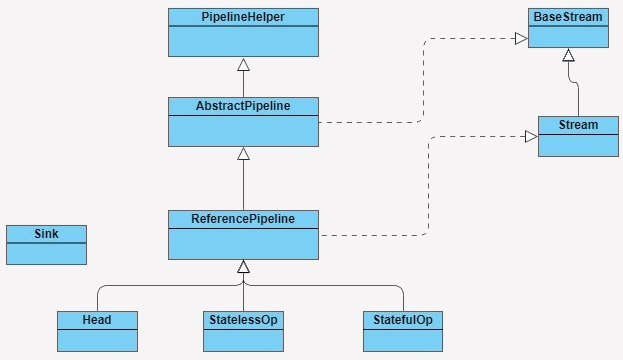

# 1、Stream类

类的签名如下：
```java
public interface Stream<T> extends BaseStream<T, Stream<T>> {
}
```
Stream包的组成：



- BaseStream 和 Stream 为最顶端的接口类。
    - BaseStream 主要定义了流的基本接口方法，例如，spliterator、isParallel 等；
    - Stream 则定义了一些流的常用操作方法，例如，map、filter 等。
- ReferencePipeline 是一个结构类，通过定义内部类组装了各种操作流。定义了 Head、StatelessOp、StatefulOp 三个内部类，实现了 BaseStream 与 Stream 的接口方法；
- Sink 接口是定义每个 Stream 操作之间关系的协议，包含 begin()、end()、cancellationRequested()、accpt() 四个方法。ReferencePipeline 最终会将整个 Stream 流操作组装成一个调用链，而这条调用链上的各个 Stream 操作的上下关系就是通过 Sink 接口协议来定义实现的

# 2、Stream 操作叠加

## 2.1、如何叠加

一个 Stream 的各个操作是由处理管道组装，并统一完成数据处理的。在 JDK 中每次的中断操作会以使用阶段（Stage）命名；

管道结构通常是由 ReferencePipeline 类实现的，ReferencePipeline 包含了 Head、StatelessOp、StatefulOp 三种内部类
- Head 类主要用来定义数据源操作，在初次调用 names.stream() 方法时，会初次加载 Head 对象，此时为加载数据源操作；
- 接着加载的是中间操作，分别为无状态中间操作 StatelessOp 对象和有状态操作 StatefulOp 对象，此时的 Stage 并没有执行，而是通过 AbstractPipeline 生成了一个中间操作 Stage 链表；当调用终结操作时，会生成一个最终的 Stage，通过这个 Stage 触发之前的中间操作，从最后一个 Stage 开始，递归产生一个 Sink 链

sink1 -> sink2 -> sink3 -> ReducingSink

## 2.2、操作过程

如下代码是实现：需求是查找出一个长度最长，并且以张为姓氏的名字
```bash
List<String> names = Arrays.asList(" 张三 ", " 李四 ", " 王老五 ", " 李三 ", " 刘老四 ", " 王小二 ", " 张四 ", " 张五六七 ");
String maxLenStartWithZ = names.stream()
    	            .filter(name -> name.startsWith(" 张 "))
    	            .mapToInt(String::length)
    	            .max()
    	            .toString();
```
从代码角度来看，可能会认为是这样的操作流程：首先遍历一次集合，得到以“张”开头的所有名字；然后遍历一次 filter 得到的集合，将名字转换成数字长度；最后再从长度集合中找到最长的那个名字并且返回。

但是实际过程并非如此，接下来看其实如何操作的：

（1）首先 ，因为 names 是 ArrayList 集合，所以 names.stream() 方法将会调用集合类基础接口 Collection 的 Stream 方法：
```java
default Stream<E> stream() {
    return StreamSupport.stream(spliterator(), false);
}
```
（2）然后，Stream 方法就会调用 StreamSupport 类的 Stream 方法，方法中初始化了一个 ReferencePipeline 的 Head 内部类对象：
```java
public static <T> Stream<T> stream(Spliterator<T> spliterator, boolean parallel) {
    Objects.requireNonNull(spliterator);
    return new ReferencePipeline.Head<>(spliterator, StreamOpFlag.fromCharacteristics(spliterator), parallel);
}
```
（3）再调用 filter 和 map 方法，这两个方法都是无状态的中间操作，所以执行 filter 和 map 操作时，并没有进行任何的操作，而是分别创建了一个 Stage 来标识用户的每一次操作

通常情况下 Stream 的操作又需要一个回调函数，所以一个完整的 Stage 是由数据来源、操作、回调函数组成的三元组来表示。分别是 ReferencePipeline 的 filter 方法和 map 方法：
```java
@Override
public final Stream<P_OUT> filter(Predicate<? super P_OUT> predicate) {
    Objects.requireNonNull(predicate);
    return new StatelessOp<P_OUT, P_OUT>(this, StreamShape.REFERENCE, StreamOpFlag.NOT_SIZED) {
        @Override
        Sink<P_OUT> opWrapSink(int flags, Sink<P_OUT> sink) {
            return new Sink.ChainedReference<P_OUT, P_OUT>(sink) {
                @Override
                public void begin(long size) {
                    downstream.begin(-1);
                }
                @Override
                public void accept(P_OUT u) {
                    if (predicate.test(u))
                        downstream.accept(u);
                }
            };
        }
    };
}
@Override
@SuppressWarnings("unchecked")
public final <R> Stream<R> map(Function<? super P_OUT, ? extends R> mapper) {
    Objects.requireNonNull(mapper);
    return new StatelessOp<P_OUT, R>(this, StreamShape.REFERENCE, StreamOpFlag.NOT_SORTED | StreamOpFlag.NOT_DISTINCT) {
        @Override
        Sink<P_OUT> opWrapSink(int flags, Sink<R> sink) {
            return new Sink.ChainedReference<P_OUT, R>(sink) {
                @Override
                public void accept(P_OUT u) {
                    downstream.accept(mapper.apply(u));
                }
            };
        }
    };
}
```
new StatelessOp 将会调用父类 AbstractPipeline 的构造函数，这个构造函数将前后的 Stage 联系起来，生成一个 Stage 链表：
```java
AbstractPipeline(AbstractPipeline<?, E_IN, ?> previousStage, int opFlags) {
    if (previousStage.linkedOrConsumed)
        throw new IllegalStateException(MSG_STREAM_LINKED);
    previousStage.linkedOrConsumed = true;
    previousStage.nextStage = this;// 将当前的 stage 的 next 指针指向之前的 stage
    this.previousStage = previousStage;// 赋值当前 stage 当全局变量 previousStage 
    this.sourceOrOpFlags = opFlags & StreamOpFlag.OP_MASK;
    this.combinedFlags = StreamOpFlag.combineOpFlags(opFlags, previousStage.combinedFlags);
    this.sourceStage = previousStage.sourceStage;
    if (opIsStateful())
        sourceStage.sourceAnyStateful = true;
    this.depth = previousStage.depth + 1;
}
```
因为在创建每一个 Stage 时，都会包含一个 opWrapSink() 方法，该方法会把一个操作的具体实现封装在 Sink 类中，Sink 采用（处理 -> 转发）的模式来叠加操作

当执行 max 方法时，会调用 ReferencePipeline 的 max 方法，此时由于 max 方法是终结操作，所以会创建一个 TerminalOp 操作，同时创建一个 ReducingSink，并且将操作封装在 Sink 类中。
```java
@Override
public final Optional<P_OUT> max(Comparator<? super P_OUT> comparator) {
    return reduce(BinaryOperator.maxBy(comparator));
}
```
（4）最后，调用 AbstractPipeline 的 wrapSink 方法，该方法会调用 opWrapSink 生成一个 Sink 链表，Sink 链表中的每一个 Sink 都封装了一个操作的具体实现
```java
@Override
@SuppressWarnings("unchecked")
final <P_IN> Sink<P_IN> wrapSink(Sink<E_OUT> sink) {
    Objects.requireNonNull(sink);
    for ( @SuppressWarnings("rawtypes") AbstractPipeline p=AbstractPipeline.this; p.depth > 0; p=p.previousStage) {
        sink = p.opWrapSink(p.previousStage.combinedFlags, sink);
    }
    return (Sink<P_IN>) sink;
}
```
当 Sink 链表生成完成后，Stream 开始执行，通过 spliterator 迭代集合，执行 Sink 链表中的具体操作
```java
@Override
final <P_IN> void copyInto(Sink<P_IN> wrappedSink, Spliterator<P_IN> spliterator) {
    Objects.requireNonNull(wrappedSink);
    if (!StreamOpFlag.SHORT_CIRCUIT.isKnown(getStreamAndOpFlags())) {
        wrappedSink.begin(spliterator.getExactSizeIfKnown());
        spliterator.forEachRemaining(wrappedSink);
        wrappedSink.end();
    }
    else {
        copyIntoWithCancel(wrappedSink, spliterator);
    }
}
```

# 参考资料

- [Stream原理与执行流程探析](https://mp.weixin.qq.com/s/UGWoRO5-pFB0p01mc73wLA)