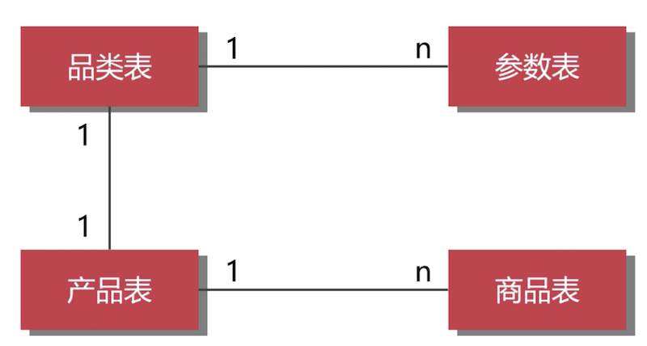

# 1、设计数据库连接池

- [数据库连接池比较](http://blog.didispace.com/java-datasource-pool-compare/)

## 1.1、基本思想

数据库连接池的基本思想是：为数据库连接建立一个“缓冲池”，预先在池中放入一定数量的数据库连接管道，需要时，从池子中取出管道进行使用，操作完毕后，在将管道放入池子中，从而避免了频繁的向数据库申请资源，释放资源带来的性能损耗

## 1.2、数据库连接池需要考虑的问题

- 限制连接池中最多、可以容纳的连接数目，避免过度消耗系统资源。
- 当客户请求连接，而连接池中所有连接都已被占用时，该如何处理呢？一种方式是让客户一直等待一直等待，直到有空闲连接，另一种方式是为客户分配一个新的临时连接。
- 当客户不在使用连接，需要把连接重新放回连接池。
- 连接池中允许处于空闲状态的连接的最大项目。假定允许的最长空闲时间为十分钟，并且允许空闲状态的连接最大数目为5
- 程序退出时，断开所有连接，并释放资源

## 1.3、设计模式

# 2、新零售系统数据库设计

## 2.1、SPU、SKU

SPU：标准产品单位，SPU描述一个产品的特性

- SKU：stock Keeping Unit，是库存进出计量单位，SKU是物理上不可分割的最小存货单元；

## 2.2、表设计

### 2.2.1、商品设计

- SKU与权重：新零售平台主要是B2C的，所以修改SU对权重的影响不大。但是B2B的平台，修改SKU对商品权重影响很大。

- SKU与参数对应：

    

    
### 2.2.2、设计品类与参数表

- 品类数据结构
    
    ```sql
    create table t_spec_group(
        id int UNSIGNED PRIMARY key auto_increment comment '主键',
        spg_id int UNSIGNED not null comment '品类编号',
        `name` varchar(200) not null comment '品类名称',
        UNIQUE index unq_spg_id(spg_id),
        UNIQUE index unq_name(`name`),
        index idx_spg_id(spg_id)
    ) COMMENT='品类表';
    ```
- 品类参数数据结构

### 2.2.3、设计品牌与分类关系

- 品牌表

- 分类表

- 品牌与分类关系表

### 2.2.4、设计产品表和商品表

- 产品表


- 商品表

### 2.2.5、设计商品的库存

如果新零售系统没有分店，可以直接把库存定义到商品表中

零售店与仓库的对应关系、零售店与仓库、商品的关系

- 省份与城市

- 仓库与库存

- 零售店与库存

### 2.2.6、客户表

- 会员等级表

- 客户表

- 客户收货地址

### 2.2.7、设计购物券

- 购物券表

- 客户与购物券关联

### 2.2.8、设计订单表

- 订单表

- 订单详情

### 2.2.8、设计员工与用户表

新零售系统具有进销存属性，需要员工表、用户表、角色表

- 部分、职位、员工

- 用户

- 角色

### 2.2.9、设计快递表、退货表

- 快递表

- 退货表

### 2.2.10、设计评价表

- 评价表

### 2.2.11、供应商数据表

- 供货商信息
- 供货商对应的商品


### 2.2.12、设计采购和入库数据表

- 采购表

- 入库表

- 采购与入库的关联关系


