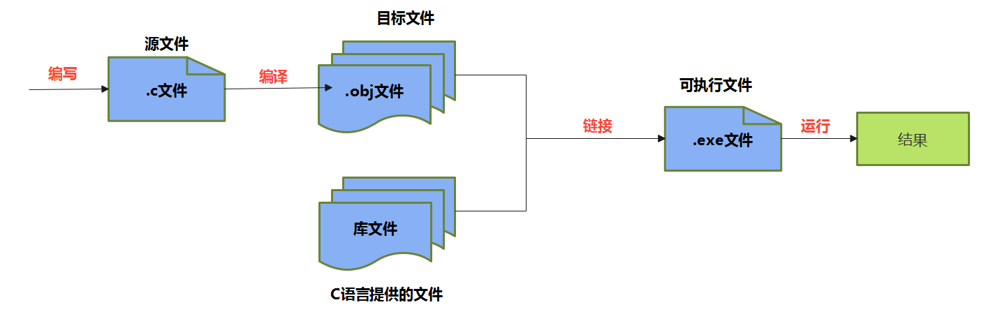
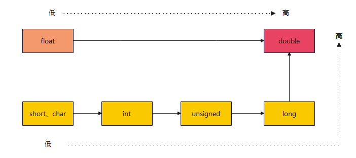
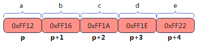
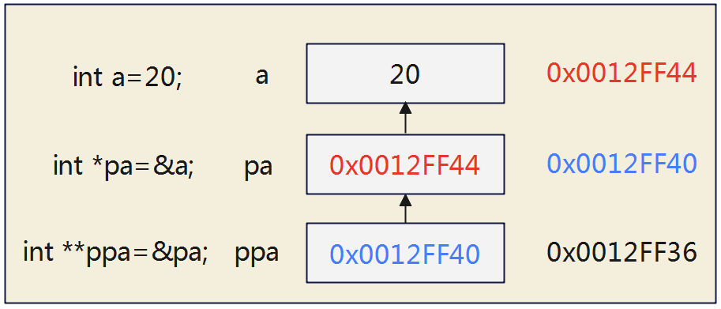
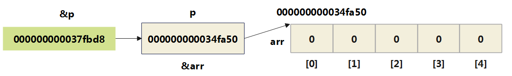
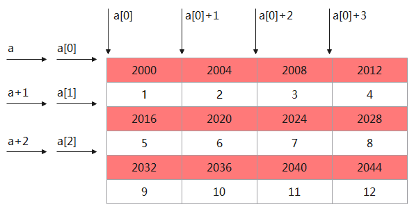

# 一、概述

## 1、概述

C 语言能够直接对硬件进行操作、管理内存、跟操作系统对话，这使得它是一种非常接近底层的语言，非常适合写需要跟硬件交互、有极高性能要求的程序

## 2、C语言的版本选择

随着微型计算机的日益普及，出现了许多C语言版本。

**版本1：K＆R C**

K&R C 指的是 C 语言的原始版本。1978年，C 语言的发明者布莱恩·柯林（Brian Kernighan）和丹尼斯·里奇（Dennis Ritchie）合写了一本著名的教材《C 编程语言》（The C programming language）。

由于 C 语言还没有成文的语法标准，这本书就成了公认标准，以两位作者的姓氏首字母作为版本简称“K&R C”。

**版本2：ANSI C（又称 C89 或 C90）**

C 语言的原始版本非常简单，对很多情况的描述非常模糊，加上 C 语法依然在快速发展，要求将 C 语言标准化的呼声越来越高。

1989年，美国国家标准协会（ANSI）制定了一套 C 语言标准，并于次年被国际标准化组织（ISO）通过。它被称为“ANSI C”，也可以按照发布年份，称为“C89 或 C90”。

**版本3：C99**

C 语言标准的第一次`大型修订`，发生在1999年，增加了许多语言特性，比如双斜杠（ // ）的注释语法，可变长度数组、灵活的数组成员、复数、内联函数和指定的初始值设定项。这个版本称为 C99，`是目前最流行的 C 版本`。

**版本4：C11**

2011年，标准化组织再一次对C 语言进行修订，增加了_Generic、static_assert 和原子类型限定符。这个版本称为C11。

> 需要强调的是，修订标准的原因不是因为原标准不能用，而是需要跟进新的技术。

**版本5：C17**

C11 标准在2017年进行了修补，但发布是在2018年。新版本只是解决了 C11 的一些缺陷，没有引入任何新功能。这个版本称为 C17。

**版本6：C23**

2023年预计发布，计划进一步增强安全性，消除实现定义的行为，引入模块化语言概念等新特性，使C语言在安全和可靠性方面有重大提高。

## 3、C语言编译器

C 语言是一种`编译型语言`，源码都是`文本文件`，本身无法执行。必须通过编译器，生成二进制的可执行文件，才能执行。

目前，最常见的 C 语言编译器是自由软件基金会推出的 `GCC 编译器`，可以免费使用。Linux 和 Mac 系统可以直接安装 GCC，Windows 系统可以安装 `MinGW`。

> 补充知识：MinGW和GCC的区别：
>
> GCC是一个跨平台的编译器集合，可用于多种操作系统和处理器架构，包括Windows；而MinGW是GCC在Windows平台上的移植版本，主要用于在Windows上本地编译C和C++代码。

GCC编译：
- **GCC 的 -o 参数（output 的缩写）可以指定编译产物的文件名。**
  ```
  > gcc -o Hello Hello.c
  ```
- **GCC 的 `-std= 参数`（standard 的缩写）还可以指定按照哪个 C 语言的标准进行编译。**
  ```
  > gcc -std=c99 Hello.c
  ```
  上面命令指定按照 C99 标准进行编译。

## 4、在线开发

- [CodingGround](https://tutorialspoint.com/compile_c_online.php)
- [OnlineGDB](https://onlinegdb.com/online_c_compiler)
- [Lightly](https://cde2f3ce.lightly.teamcode.com/)

## 5、C语言运行机制



## 6、输出

printf()标准格式

```c
printf(格式控制字符串,输出列表);
```
其中，
- `"格式控制字符串"`是用双引号括起来的一个字符串。包括：
  - 普通字符：普通字符即需要在输出时原样输出的字符。
  - 占位符：由“%”和格式字符组成。这个位置可以用其它值代入。
- `"输出列表"`是程序需要输出的一些数据，可以是常量、变量或表达式。用于替换占位符的位置。

> 注意：printf() 参数与占位符是一一对应关系。如果参数个数少于对应的占位符， printf() 可能会输出内存中的任意值。

**占位符**
占位符的第一个字符是 `%` ，第二个字符表示占位符的类型。

printf() 的占位符有许多种类，与 C 语言的数据类型相对应。

下面按照字母顺序，列出占位符如下，方便查阅(红色为常用的)：
```
> %a ：浮点数(仅C99有效)
> %A ：浮点数(仅C99有效)
> **%c ：char型数据**
> **%d ：十进制整数(int)**
> %e ：使用科学计数法的浮点数，指数部分的 e 为小写
> %E ：使用科学计数法的浮点数，指数部分的 E 为大写
> %i ：整数，基本等同于 %d 
> **%f ：浮点数(float)**
> %g ：6个有效数字的浮点数。整数部分一旦超过6位，就会自动转为科学计数法，指数部分的 e 为小写
> %G ：等同于 %g ，唯一的区别是指数部分的 E 为大写
> %hd ：十进制 short int 类型
> %ho ：八进制 short int 类型
> %hx ：十六进制 short int 类型
> %hu ：unsigned short int 类型
> **%ld ：十进制整数(long)**
> %lo ：八进制 long int 类型
> %lx ：十六进制 long int 类型
> %lu ：unsigned long int 类型
> %lld ：十进制 long long int 类型
> %llo ：八进制 long long int 类型
> %llx ：十六进制 long long int 类型
> %llu ：unsigned long long int 类型
> %le ：科学计数法表示的 long double 类型浮点数
> **%lf ：十进制浮点数(double)**
> %n ：已输出的字符串数量。该占位符本身不输出，只将值存储在指定变量之中
> %o ：八进制整数
> **%p ：指针**
> **%s ：字符串**
> **%u ：十进制无符号整数（unsigned int）**
> %x ：十六进制整数
> %zd ： size_t 类型
> %% ：输出一个百分号
- `%d` ：十进制整数。
- `%o` ：八进制整数。
- `%x` ：十六进制整数。
- `%#o` ：显示前缀 0 的八进制整数。
- `%#x` ：显示前缀 0x 的十六进制整数。
- `%#X` ：显示前缀 0X 的十六进制整数。
```

# 二、关键字、数据类型、变量、进制

## 1、关键字(keyword)

传统的C语言（ANSI C）有32个关键字。如下：

| 类型                    | 具体关键字                                                   |
| ----------------------- | ------------------------------------------------------------ |
| 控制语句关键字（12 个） | break, case, continue, default, do, else, for, goto, if, return, switch, while |
| 数据类型关键字（12 个） | char, enum, double, long, float, int, short, signed, struct, unsigned, union, void |
| 存储类型关键字（4 个）  | auto, extern, register, static                               |
| 其他关键字（4 个）      | const, sizeof, typedef, volatile                             |

后续，1999年，C99标准增加了5个关键字：`inline`、`restrict`、`_Bool`、`_Complex`和`_Imaginary`。

2011年，C11标准又增加了7个关键字：`_Alignas`、`_Alignof`、`_Atomic`、`_Static_assert`、`_Noreturn`、`_Thread_local`和`_Generic`。

> 说明：
> 1、ANSI C、C99和C11，它们之间差别并不大，在大多数情况下，它们都是和谐共处的。

## 2、标识符(Identifier)

**标识符的命名规则**
- 只能由26个英文字母大小写，0-9 或 _ 组成
- 数字不可以开头
- 不可以是关键字，但可以包含关键字
- C99和C11允许使用更长的标识符名，但是编译器只识别前63个字符。(会忽略超出的字符)
- 不允许有空格。
- 严格区分大小写字母。比如：Hello、hello是不同的标识符。

**标识符的命名建议**（建议遵守的`软性要求`）
- 在起名字时，为了提高阅读性，要尽量有意义，“见名知意”。如：sum，name，max，year，total 等。
- 不要出现仅靠大小写区分不同的标识符。如：name、Name 容易混淆
- 尽量避免名字中出现数字编号，如value1、value2等，除非逻辑上需要编号。
- 习惯上，所有宏定义、枚举常数、常量(只读变量)全用大写字母命名，用下划线分隔单词。

  比如： `const double TAX_RATE = 0.08; //TAX_RATE 只读变量`

- 系统内部使用了一些下划线开头的标识符（比如两个下划线开头的变量名、一个下划线 + 大写英文字母开头的变量名）。比如，C99 标准添加的类型 `_Bool`。为防止冲突，建议用户尽量避免使用下划线开头的标识符。
- 下划线通常用于连接一个比较长的变量名。如：max_classes_per_student。
- 变量名、函数名：多单词组成时，第一个单词首字母小写，第二个单词开始每个单词首字母大写：xxxYyyZzz (驼峰法，小驼峰)。比如：`short stuAge = 20; `，`tankShotGame`。 

## 3、变量

### 3.1、概述

使用变量注意：
- C语言中每个变量必须先声明，后使用。
- 不同的数据类型，占用的空间大小不一样。
- 一旦声明，变量的类型就不能在运行时修改。

```c
数据类型  变量名;  //声明变量的语句必须以分号结尾
```
变量声明时，就为它分配内存空间，但是不会清除内存里面原来的值。这导致声明变量以后，变量会是一个随机的值。所以，变量一定要赋值以后才能使用。

> 注意：声明变量以后，不用忘记初始化赋值！定义变量时编译器并不一定清空了这块内存，它的值可能是无效的数据，运行程序，会异常退出。

### 3.2、变量的作用域(scope)

- 变量的作用域：其定义所在的一对{ }内。
- 变量只有在其`作用域`内才有效。出了作用域，变量不可以再被调用。
- 同一个作用域内，不能定义重名的变量。

- C 语言的变量作用域主要有两种：文件作用域（file scope）和块作用域（block scope）。


`文件作用域（file scope）`指的是，在源码文件顶层声明的变量，从声明的位置到文件结束都有效。

```c
int x = 1;
int main() {
	printf("%d\n", x);
    return 0;
}
```

`块作用域（block scope）`指的是由大括号（ {} ）组成的代码块，它形成一个单独的作用域。凡是在块作用域里面声明的变量，只在当前代码块有效，代码块外部不可见。

```c
int main() {
    int m = 10;
    if (m == 10) {
        int n = 20;
        printf("%d %d\n", m, n);  // 10 20
    }
    printf("%d\n", m);  // 10
    printf("%d\n", n);  // 超出作用域，报错
    
    return 0;
}
```

最常见的块作用域就是函数，函数内部声明的变量，对于函数外部是不可见的。 for 循环也是一个块作用域，循环变量只对循环体内部可见，外部是不可见的。

```c
for (int i = 0; i < 10; i++){
	printf("%d\n", i);
}
printf("%d\n", i); // 超出作用域，报错
```

### 3.3、变量类型


C 语言中的变量按照数据类型分为：


> 注意1：这里列举的是C语言的常用类型，后续C语言版本还有新增的类型。
>
> 注意2：空类型：void 表示空类型（无类型）。通常应用于函数的返回值类型、函数的参数、指针类型。
>
> 注意3：在C语言中，没有`字符串类型`，使用字符数组表示字符串。

### 3.4、变量内存占用

创建变量需要开辟内存空间，C语言可以通过sizeof查看变量的大小，跟变量的数据类型有关：
```c
#include <stdio.h>
int main() {
  int value = 3;
  printf("size of value: %llu\n", sizeof(value));
  return 0;
}
```
查看变量地址：


内存中被高亮的部分就是 value 的值，也就是 value 对应的内存中存放的值：`03 00 00 00`；

内存存放变量的字节排序如果是倒着的，这叫小端序，little endian，就是内存中低地址的部分在前的意思。所以 `03 00 00 00` 其实从我们人类阅读的顺序来讲是 `00 00 00 03`，符合人类阅读顺序的字节序叫做大端序，big endian。

## 4、基本数据类型

### 4.1、整数类型

#### 4.1.1、类型概述

C语言规定了如下的几类整型：短整型(short)、整型(int)、长整型(long)、更长的整型(long long)

每种类型都可以被 signed 和unsigned 修饰。其中，
- 使用 `signed 修饰`，表示该类型的变量是带符号位的，有正负号，可以表示负值。`默认是signed`。
- 使用 `unsigned 修饰`，表示该类型的变量是不带符号位的，没有有正负号，只能表示零和正整数。

大小：
- bit(位)：计算机中的最小存储单位。
- byte(字节)：计算机中基本存储单元。

1byte = 8bit
| 类型        | 修饰符   | 占用空间       | 取值范围                                                   |
| ----------- | -------- | -------------- | ---------------------------------------------------------- |
| short [int] | signed   | 2个字节(=16位) | -32768 ~ 32767 (-$2^{15}$ ~ $2^{15}$-1)                    |
| short [int] | unsigned | 2个字节(=16位) | 0 ~ 65535  (0 ~ $2^{16}$-1)                                |
| int         | signed   | 通常4个字节    | -2147483648 ~ 2147483647 (-$2^{31}$ ~ $2^{31}$-1)          |
| int         | unsigned | 通常4个字节    | 0 ~ 4294967295  (0 ~ $2^{32}$-1)                           |
| long [int]  | signed   | 4个或8个字节   | 4字节时：-2147483648 ~ 2147483647 (-$2^{31}$ ~ $2^{31}$-1) |
| long [int]  | unsigned | 4个或8个字节   | 4字节时：-0 ~ 4294967295  (0 ~ $2^{32}$-1)                 |

long long int是`C99新增`的：

| 类型            | 修饰符   | 占用空间       | 取值范围                                                     |
| --------------- | -------- | -------------- | ------------------------------------------------------------ |
| long long [int] | signed   | 8个字节(=64位) | -9223372036854775808~ 9223372036854775807(-$2^{63}$ ~ $2^{63}$-1) |
| long long [int] | unsigned | 8个字节(=64位) | 0 ~ 18446744073709551615(0 ~ $2^{64}$-1)                     |

**说明1：** 不同计算机的 int 类型的大小是不一样的。比较常见的是使用4个字节（32位）存储一个 int 类型的值，具体情况如下：

| 类型          | 16位编译器 | 32位编译器 | 64位编译器 |
| ------------- | ---------- | ---------- | ---------- |
| short int     | 2字节      | 2字节      | 2字节      |
| int           | 2字节      | 4字节      | 4字节      |
| unsigned int  | 2字节      | 4字节      | 4字节      |
| long          | 4字节      | 4字节      | 8字节      |
| unsigned long | 4字节      | 4字节      | 8字节      |
| long long     | 8字节      | 8字节      | 8字节      |

**说明2**： C标准虽然没有具体规定各种类型数据所占用存储单元的长度，但几条铁定的原则（ANSI/ISO制订的）：
- ① sizeof(short int) ≤ sizeof(int) ≤ sizeof(long int) ≤ sizeof(long long)，具体由各编译系统自行决定的。其中，sizeof是测量类型或变量长度的运算符。
- ② short int至少应为2字节，long int至少应为4字节。

这样约定的好处就是使得C语言可以长久使用。`现在的主流CPU是64位`，可以预测不久的将来会推出128位甚至256位的CPU，但是在C语言刚刚出现的时候，CPU还是以8位和16位为主。

**说明3：**
- 最常用的整型类型为：int类型。
- 整数型常量，默认为int类型。

int 类型使用4个字节表示一个整数，对于小整数，这样做很浪费空间。另一方面，某些场合需要更大的整数，8个字节还不够。此时，可以使用short int （简写为 short ）、long int （简写为 long ）、long long int （简写为 long long ）
```c
signed short int a; 
signed long int b;
signed long long int c;
```

#### 4.1.2、Long类型

编译器将一个整数字面量指定为 int 类型，但是如果希望将其指定为 long 类型，需要在该字面量末尾加上后缀 `l` 或 `L` ，编译器会把这个字面量的类型指定为 long 。
```c
long x = 123L; //或者写成 123l
```
如果希望字面量指定为long long类型，则后缀以`ll`或`LL`结尾。
```c
long long y = 123LL;
```
如果希望指定为无符号整数 unsigned int ，可以使用后缀 `u` 或 `U` 。
```c
unsigned int x = 123U;
```
L 和 U 可以结合使用，表示 unsigned long 类型。 L 和 U 的大小写和组合顺序无所谓。

u 还可以与其他整数后缀结合，放在前面或后面都可以，比如 10UL 、 10ULL 和 10LLU 都是合法的。
```c
unsigned long int      x = 1234UL;
unsigned long long int x = 1234ULL;
```

#### 4.1.3、精确宽度类型

C 语言的整数类型（short、int、long）在不同计算机上，占用的字节宽度可能是不一样的，无法提前知道它们到底占用多少个字节。程序员有时控制准确的字节宽度，这样的话，代码可以有更好的可移植性，头文件 stdint.h 创造了一些新的类型别名。

**精确宽度类型(exact-width integer type)**：保证某个整数类型的宽度是确定的。
- int8_t ：8位有符号整数
- int16_t ：16位有符号整数
- int32_t ：32位有符号整数
- int64_t ：64位有符号整数
- uint8_t ：8位无符号整数
- uint16_t ：16位无符号整数
- uint32_t ：32位无符号整数
- uint64_t ：64位无符号整数

上面这些都是类型别名，编译器会指定它们指向的底层类型。比如，某个系统中，如果 int 类型为32位， int32_t 就会指向 int ；如果 long 类型为32位， int32_t 则会指向 long 。
```c
#include <stdio.h>
#include <stdint.h>
int main() {
	int32_t x32 = 45933945;  //变量 x32 声明为 int32_t 类型，可以保证是32位的宽度。
	printf("x32 = %d\n", x32);
	return 0;
}
```

#### 4.1.4、整型的极限值

有时候需要查看，当前系统不同整数类型的最大值和最小值，C 语言的头文件 `limits.h` 提供了相应的常量。比如：INT_MIN 代表 signed int 类型的最小值 -2147483648， INT_MAX 代表 signed int 类型的最大值 2147483647。

```c
#include <limits.h>

int main() {
    printf("%d\n", INT_MIN  );  // -2147483648
    printf("%d\n", INT_MAX  );  // 2147483647
    return 0;
}
```
为了代码的可移植性，需要知道某种整数类型的极限值时，应该尽量使用这些常量。
- SCHAR_MIN ， SCHAR_MAX ：signed char 的最小值和最大值。
- SHRT_MIN ， SHRT_MAX ：short 的最小值和最大值。
- INT_MIN ， INT_MAX ：int 的最小值和最大值。
- LONG_MIN ， LONG_MAX ：long 的最小值和最大值。
- LLONG_MIN ， LLONG_MAX ：long long 的最小值和最大值。
- UCHAR_MAX ：unsigned char 的最大值。
- USHRT_MAX ：unsigned short 的最大值。
- UINT_MAX ：unsigned int 的最大值。
- ULONG_MAX ：unsigned long 的最大值。
- ULLONG_MAX ：unsigned long long 的最大值。

### 4.2、浮点数

#### 4.2.1、类型概述

在C语言中，浮点型变量分为三种：单精度浮点型(float)、双精度浮点型(double)、长双精度浮点型(long double)。
| 类型        | 占用空间        | 取值范围                                                     |
| ----------- | --------------- | ------------------------------------------------------------ |
| float       | 4个字节 (=32位) | $-1.4*10^{-45}$ ~ $-3.4*10^{+38}$，$1.4*10^{-45}$ ~ $3.4*10^{+38}$ |
| double      | 8个字节 (=64位) | $-4.9*10^{-324}$ ~ $-1.7*10^{+308}$，$4.9*10^{-324}$ ~ $1.7*10^{+308}$ |
| long double | 12个字节(=96位) | 太大了...                                                    |

其中，
| 类型   | 16位编译器 | 32位编译器 | 64位编译器 |
| ------ | ---------- | ---------- | ---------- |
| float  | 4字节      | 4字节      | 4字节      |
| double | 8字节      | 8字节      | 8字节      |

C 语言标准规定 float 至少能表示 6 位有效数字，表示的数值范围至少在 ${10}^{-37} - {10}^{37}$

C语言的第3种浮点类型是long double，以满足比double类型更高的精度要求。不过，C只保证long double类型至少与double类型的精度相同。

浮点型变量不能使用signed或unsigned修饰符。

最常用的浮点类型为：double 类型，因为精度比float高。

浮点型常量，默认为 double 类型。

**关于后缀：**

对于浮点数，编译器默认指定为 double 类型，如果希望指定为float类型，需要在小数后面添加后缀 `f`或`F`；如果希望指定为long double类型，需要在小数后面添加后缀 `l`或`L`。
```c
float x       = 3.14f;
double x      = 3.14;
long double x = 3.14L;
```
C 语言允许使用科学计数法表示浮点数，使用字母 e 来分隔小数部分和指数部分。注意，e 的前后，不能存在空格。
```c
double x = 123.456e+3; // 123.456 x 10^3
// 等同于
double x = 123.456e3;
```
另外，科学计数法的小数部分如果是 0.x 或 x.0 的形式，那么 0 可以省略。

```c
0.3E6 // 等同于  .3E6
3.0E6 // 等同于  3.E6
```

#### 4.2.2、存储规则

任何有小数点的数值，都会被编译器解释为浮点数。所谓“浮点数”就是使用 m * b^e 的形式，存储一个数值， m 是小数部分， b 是基数， e 是指数部分。

**从十进制的角度：**


**从二进制的角度：**

根据国际标准IEEE（电气和电子工程协会） 754，任意一个二进制浮点数V可以表示成下面的形式：$(-1)^S * M * 2^E$ , 其中：
- $(-1)^s$ 表示符号位，当s=0，V为正数；当s=1，V为负数。
- M表示有效数字，大于等于1，小于2。
- $2^E$ 表示指数位。

举例来说：
- 十进制的5.0，写成二进制是 101.0 ，相当于 1.01×2^2 。即，按照上面V的格式，可以得出s=0，M=1.01，E=2。
- 十进制的-5.0，写成二进制是 -101.0 ，相当于 -1.01×2^2 。即，s=1，M=1.01，E=2。

`IEEE 754规定：`
- 对于32位的浮点数，最高的1位是符号位s，接着的8位是指数E，剩下的23位为有效数字M。


- 对于64位的浮点数，最高的1位是符号位S，接着的11位是指数E，剩下的52位为有效数字M。


浮点数的存储方式，决定了浮点数精度控制在一定范围内。有效数字部分可能丢失，造成精度损失。

#### 4.2.3、关于精度

```c
#include <stdio.h>
int main(int argc, char ** argv) {
    printf("%f\n", 116.398087f - 116.3980f);// 0.000084
    printf("%f\n", 39.908156f - 39.9081f);// 0.000057
    return 0;
}
```
`116.398087f - 116.3980f` 明明应该是 0.000087，怎么成了 0.000084 了呢？因为精度丢失。同理，`39.908156f - 39.9081f` 应该是 0.000056，却成了 0.000057，不过可以看到前者的差值更大，因为显然 116.398087 的第六个小数位是从高位数的第九个有效数字位，而 39.908156 的第六个小数位是第八个有效数字位；

如果需要更大的精度，可以使用双精度浮点型，即 double 类型，还有 long double 类型，标准规定 long double 的表示范围不能小于 double，double 也不能小于 float。double 类型通常占用 64 位，表示的数据范围自然也更大，有效数字位数可以达到 15 ~ 16 位

### 4.3、字符类型

C语言中，使用 char 关键字来表示字符型，用于存储一个`单一字符`。字符型变量赋值时，需要用一对英文半角格式的单引号（`''`）把字符括起来。

每个字符变量，在16位、32位或64位编译器中都是`占用 1 个字节(=8位)`。

**表示方式1：最常见**
```c
char c = 'A';　//为一个char类型的变量赋值字符'A'
```
每个字符对应一个整数（由 ASCII 码确定），比如 A 对应整数 65 。只要在字符类型的范围之内，整数与字符是可以互换的，都可以赋值给字符类型的变量。

**表示方式2：ASCII 码值**
```c
char c = 66;
// 等同于
char c = 'B';
```
两个字符类型的变量可以进行数学运算。
```c
char a = 'B'; // 等同于 char a = 66;
char b = 'C'; // 等同于 char b = 67;
printf("%d\n", a + b); // 输出133
```
输出：
```c
char c='?'; // 定义c为字符型变量并使初值为字符'?'。'?'的ASCII代码是63，系统把整数63赋给变量c。
printf("%d %c\n",c,c); // 用"%d"格式输出十进制整数63， 用"%c"格式输出字符'?'
```
**signed 和 unsigned 修饰：**

根据C90标准，C语言允许在关键字char前面使用signed或unsigned。
```c
signed char c; // 范围为 -128 到 127
unsigned char c; // 范围为 0 到 255
```
注意，C 语言规定 char 类型默认是否带有正负号，由当前系统决定，这一点与 int 不同， int 等同于 signed int 。这就是说， char 不等同于signed char ，它有可能是 signed char（范围-128 到 127） ，也有可能是 unsigned char （范围0 到255）。不管是哪种，范围都正好都能覆盖 0 到 127 的 ASCII 字符范围。

**表示方式3：使用转义字符**

单引号本身也是一个字符，如果要表示这个字符常量，必须使用反斜杠转义。
```c
char t = '\'';
```
char还可以用来表示转义字符。比如：
| 字符形式 | 含义                                               |
| -------- | -------------------------------------------------- |
| `\n`     | 换行符（光标移动到下行行首）                       |
| `\t`     | 水平制表符，光标移到下一个Tab位置                  |
| `\'`     | 单引号字符 '                                       |
| `\"`     | 双引号字符 "                                       |
| `\\`     | 反斜杠字符 ’\’                                     |
| `\r`     | 回车符，光标移到本行开头                           |
| `\0`     | null 字符，代表没有内容。注意，这个值不等于数字0。 |
| `\b`     | 退格键，光标回退一个字符，但不删除字符             |

**中文处理：**

ASCII 字符集仅仅包含了英语字母以及一些符号，中文无法处理，因此，涵盖了几乎所有文字符号以及符号表情的字符集 Unicode 就应运而生了。Unicode 总共包含 111万个字符，显然 char 是无法存下这么多字符的，因此 C 语言当中提供了 `wchar_t` 这个类型，规定大小不得小于 1B。宽字符在涉及到非英文字符的文本处理时非常有用，目前来看，Windows 上占用 2B，Linux 和 macOS 上占用 4B。

wchar_t 与 char 不同，char 当中直接存储的就是字节的原始内容，因此字符串又经常被称为 byte string（二进制字符串），而 wchar_t 当中存储的字符一般来说都是字符的 Unicode 码点，例如：
```c
L'中'
```
那么这个中字在内存当中以宽字符存在时，就是对应的 Unicode 码点：4e2d，也可以写作 \u4e2d，下面的写法与上面的等价：
```c
L'\u4e2d'
```
其中 `\u` 表示这是一个 Unicode 字符的码点；在宽字符的单引号前加了一个 `L` 表示这个字符比一般的字符要 Large。如果用普通的字符，需要使用字符串来容纳中这个字

### 4.4、布尔类型

C语言标准（C89）没有为布尔值单独设置一个类型，所以在判断真假时，使用整数 0 表示假，所有非0表示真。比如：
```c
int main(){
  int handsome = 1;
  if (handsome) {
      printf("我好帅!\n");
  }
	return 0;
}
```
上述做法不直观，可以借助于C语言的宏定义处理。比如：
```c
// 定义布尔类型的宏
#define BOOL int   //可以使用 typedef int BOOL; 替换
#define TRUE 1
#define FALSE 0
int main(){
    BOOL handsome = TRUE;
    if(handsome){
        printf("好帅~");
    }
    return 0;
}
```
此外，C99 标准添加了类型 `_Bool`，表示布尔值，即逻辑值true和false。但是，这个类型的值其实只是整数类型的别名，还是使用 0 表示false， 1 表示true，其它非0的值都会被存储为1。所以`_Bool`类型实际上也是一种整数类型。
```c
#include <stdio.h>
int main() {
    _Bool isFlag = 1;
    if (isFlag)
      printf("你好毒~~\n");
    return 0;
}
```
与此同时，C99还提供了一个头文件 `stdbool.h`，文件中定义了`bool`代表`_Bool`，并且定义了 true 代表 1 、 false 代表 0 。只要加载这个头文件，就可以使用 bool 定义布尔值类型，以及 false 和 true 表示真假。
```c
#include <stdio.h>
#include <stdbool.h>
int main() {
  bool isFlag = true;
  if (isFlag)
    printf("你好毒~~\n");
  return 0;
}
```

## 5、运算规则

在C语言编程中，经常需要对不同类型的数据进行运算，运算前需要先转换为同一类型，再运算。为了解决数据类型不一致的问题，需要对数据的类型进行转换。

### 5.1、隐式类型转换

**情况1：窄类型自动转为宽类型**

即，系统自动将`字节宽度较小`的类型转换为`字节宽度较大`的数据类型，它是由系统自动转换完成的。



基本数据类型的转换规则如图所示：


> 注意：最好避免无符号整数与有符号整数的混合运算。因为这时 C 语言会自动将 signed int 转为unsigned int ，可能不会得到预期的结果。

举例1：
- 不同的整数类型混合运算时，宽度较小的类型会提升为宽度较大的类型。比如 short 转为 int ，int 转为 long 等。
- 不同的浮点数类型混合运算时，宽度较小的类型转为宽度较大的类型，比如 float 转为double ， double 转为 long double 。
```c
float y = 12 * 2; //整数赋值给浮点数变量时，会自动转为浮点数。结果24.0
//char类型 与 int类型运算，会自动提升为 int 。
char c = 10;
int i = 10;
int j = c + i;  //ok

short s1 = 10;
int num1 = s1;    //ok
double num2 = s1; //ok

int i = 10;
double d1 = 12.3;
double d2 = i + d1; //系统自动将i的类型由int转换为double类型，故i+d1结果为double类型

double d;
d = 2 + 'A' + 1.5F;
```
举例2：两个相同类型的整数运算时，或者单个整数的运算，一般来说，运算结果也属于同一类型。但是有例外，宽度小于 int 的类型，运算结果会自动提升为 int 。
```c
char c1 = 10;
short s1 = 10;
int i1 = c1 + s1;  //char类型和short类型的变量运算的结果默认为int类型

unsigned char a = 1;
unsigned char b = 255;
unsigned char c = 255;
if ((a - 5) < 0) 
    do_something();
if ((b + c) > 300) 
    do_something();
```
说明：表达式 a - 5 和 b + c 都会自动转为 int 类型，所以函数 do_something() 会执行两次。

**情况2：宽类型赋值给窄类型**

`字节宽度较大`的类型，赋值给`字节宽度较小`的变量时，会发生类型降级，自动转为后者的类型。这时可能会发生截值（truncation），系统会自动截去多余的数据位，导致精度损失。

举例1：
```c
double pi = 3.14159;
int i = pi; // i 的值为 3
```
C编译器把浮点数转换成整数时，会直接丢弃（截断）小数部分，而不进行四舍五入。

举例2：
```c
int x = 3.14; //浮点数赋予整数变量时，C 语言直接丢弃小数部分。结果 3
int cost = 12.99;         	 // double类型的值转为int类型,结果为：12
float pi = 3.1415926536;     // double类型的值转为float类型,结果为：3.141593
```
举例3：
```c
int i = 322;
char ch = i; // ch 的值是 66
```
举例4：
```c
float f1 = 1.1f; //ok
double d2 = 4.58667435;
f1 = d2; // 出现精度损失 (double -> float )
printf("f1=%.8f", f1); // 期望： 4.58667435
```
由于存在精度限制，浮点数只是一个近似值，它的计算是不精确的。

举例5：
```c
float a = 3.14159; //3.14159为双精度浮点常量，分配8个字节；a为float变量，分配4个字节
```
编译时系统会发出警告(warning: truncation from ′const double′ to′float′)，提醒用户注意这种转换可能损失精度。

### 5.2、强制类型转换

隐式类型转换中的宽类型赋值给窄类型，编译器是会产生警告的，提示程序存在潜在的隐患。如果非常明确地希望转换数据类型，就需要用到`强制(或显式)类型转换`。
- 形式： **(类型名称)(变量、常量或表达式)**
- 功能：将“变量、常量或表达式”的运算结果强制转换为“类型名称”所表示的数据类型。
- 注意：强制类型转换会导致精度损失。

举例：
```c
double x = 12.3;
int y = 10;
int z = (int)x + y; //将变量x的值转换成int后,再与y相加
```
将浮点数转换为整数时，将舍弃浮点数的小数部分，只保留整数部分。
```c
float f1,f2;
f1 = (int)1.2 + 3.4;
f2 = (int)(1.2 + 3.4);
printf("f1=%f,f2=%f",f1,f2);
```
输出结果：f1=4.4，f2=4.0。

举例2：
```c
int i = 40000;
short s = (short)i;
printf("%d\n",s); //-25536
```
举例3：
```c
long y = (long) 10 + 12; // (long) 将 10 显式转为 long 类型。这里的显示转换其实是不必要的,因为可以自动转换
```

### 5.3、运算的溢出问题

每一种数据类型都有数值范围，如果存放的数值超出了这个范围（小于最小值或大于最大值），需要更多的二进制位存储，就会发生溢出。大于最大值，叫做`向上溢出（overflow）`；小于最小值，叫做`向下溢出（underflow）`。

一般来说，编译器不会对溢出报错，会正常执行代码，但是会忽略多出来的二进制位，只保留剩下的位，这样往往会得到意想不到的结果。所以，应该避免溢出。

举例1：
```c
unsigned char x = 255;
x = x + 1;
printf("%d\n", x); // 0
```
x 是 unsign char 类型，最大值是255 （二进制 11111111 ），加 1 后就发生了溢出， 256 （二进制 100000000 ）的最高位 1 被丢弃，剩下的值就是 0 。

举例2：
```c
unsigned int ui = UINT_MAX;  // 4,294,967,295
ui++;
printf("ui = %u\n", ui); // 0
ui--;
printf("ui = %u\n", ui); // 4,294,967,295
```
常量 UINT_MAX 是 unsigned int 类型的最大值。如果加 1 ，对于该类型就会溢出，从而得到 0 ；而 0 是该类型的最小值，再减 1 ，又会得到 UINT_MAX 。

> 溢出很容易被忽视，编译器又不会报错，所以必须非常小心。

## 6、常量

C语言中的常量分为以下以下几种：
- 字面常量
- `#define` 定义的标识符常量
- const 修饰的常变量
- 枚举常量

### 6.1、使用#define定义常量

这种方式是在文件开头用 `#define` 来定义常量，也叫作`宏定义`。所谓`宏定义`，**就是用一个标识符来表示一个常量值**，如果在后面的代码中出现了该标识符，那么编译时就全部替换成指定的常量值。即用宏体替换所有宏名，简称`宏替换`。

定义格式：`#define 符号常量名 常量值`，后面不要跟分号
- `符号常量名`，称为`宏体`，属于标识符，一般定义时用大写字母表示。
- `常量值`，称为`宏名`，可以是数值常量，也可以是字符常量。

习惯上，**宏名用大写字母表示**，以便于与变量区别。但也允许用小写字母。

举例1：
```c
#include <stdio.h>
#define ZERO 0   //#define的标识符常量
int main() {
	printf("zero = %d\n", ZERO);
    return 0;
}
```
> 跟#include一样，“#”开头的语句都是“预处理语句”，在编译之前，预处理器会查找程序中所有的“ZERO”，并把它替换成0，这个过程称为预编译处理。
> 然后将预处理的结果和源程序一起再进行通常的编译处理，以得到目标代码 (OBJ文件)。

宏的作用范围就是从它开始定义的那一刻起，到取消对它的定义结束，当然也有可能程序当中根本不会取消对它的定义，因此它就会一直存在。

取消宏的定义使用 `#undef`，例如：
```c
#undef RED
```
宏是在编译之前就被替换掉的，因此它并不会像变量那样在内存中开辟空间用以读写，自然也就不存在地址的概念了

### 6.2、使用const限定符

C99中新的声明方式，这种方式跟定义一个变量是一样的，只需要在变量的数据类型前再加上一个const关键字，这被称为“限定符”。格式：
```c
const 数据类型 常量名 = 常量值;
```
举例：
```c
#include <stdio.h>
int main(){
	//const 修饰的常变量
	const float PI = 3.14f;
	//PI = 5.14;//是不能直接修改的！
	return 0;
}
```
const修饰的对象一旦创建就不能改变，所以必须初始化。跟使用`#define`定义宏常量相比，const定义的常量有详细的数据类型，而且会在编译阶段进行安全检查，在运行时才完成替换，所以会更加安全和方便。

const对象可以通过指针的方式来改变：
```c
#include <stdio.h>
int main() {
  const int kRed = 0xFF0000;
  int* p = &kRed;
  *p = 0;
  printf("value of kRed is: %d\n", kRed);
  return 0;
}
```

### 6.3、定义枚举常量

```c
#include <stdio.h>
//使用enum定义枚举类
enum Sex{
    //括号中的MALE,FEMALE,SECRET是枚举常量
	MALE,
	FEMALE,
	SECRET
};
int main(){
	//枚举常量
	printf("%d\n", MALE);
	printf("%d\n", FEMALE);
	printf("%d\n", SECRET);
	//注：枚举常量默认是从0开始，依次向下递增1的
	return 0;
}
```

## 7、输入/输出函数

所谓输入输出是以计算机主机为主体而言的。
- 输出：从计算机向外部输出设备(显示器、打印机)输出数据。
- 输入：从输入设备(键盘、鼠标、扫描仪)向计算机输入数据。

c语言本身没有提供专门的输入输出语句，所有的输入输出都是由调用标准库函数中的输入输出函数来实现的。

**输入函数：scanf() 、 getchar()、gets()：** 
- `scanf()`，是格式输入函数，可接收`任意类型`的数据。 
- `getchar()`，是`字符`输入函数， 只能接收`单个字符`。
- `gets()`，是`字符串`输入函数。

**输出函数：printf() 、 putchar()、puts()：**
- `printf()`，是格式输出函数，可按指定的格式显示任意类型的数据。
- `putchar()`，`字符`显示函数，只能显示`单个字符`。
- `puts()`，是`字符串`输出函数。

### 7.1 、scanf()的使用

scanf()函数的作用：把从键盘上输入的数据根据找到的地址存入内存中，即给变量赋值。

格式： `scanf("格式控制字符串",参数地址列表); `
- “格式控制字符串”：约定输入数据的类型和格式，参数的个数必须与变量地址的个数一致。
- “参数地址列表”：以逗号 “, ”分隔的、`输入数据变量地址`序列。
```c
scanf("%d%d%d",&a,&b,&c)
```
其中，`&a`,`&b`,`&c`中的`&`是寻址操作符，`&a`表示对象a在内存中的地址。注意：
- 如果scanf中%d是连着写的，如“`%d%d%d`”，在输入数据时，数据之间不可以用逗号分隔，只能用空白字符（空格或tab键或者回车键）分隔。即“`2(空格)3(tab)4`” 或 “`2(tab)3(回车)4`”等。
- 如果是“`%d,%d,%d`”，则在输入数据时需要加“,”，如“`2,3,4`”。

举例1：计算圆的面积，其半径由用户指定
```c
#include <stdio.h>
int main() {
    float radius, area;
    printf("请输入半径值：  ");
    scanf("%f", &radius);      //输入半径
    area = 3.14 * radius * radius;
    printf("area=%f\n", area); //输出圆的面积
    return 0;
}
```
> 注意：变量名之前要加上&运算符，表示取变量的地址，如“&a，&b”。否则将会出现错误。

举例2：输入一个整数，求其绝对值。
```c
#include <stdio.h>
int main() {
    int num;
    printf("输入一个整数:");
    scanf("%d", &num);
    int absNum = num;
    if(absNum < 0)
        absNum = -absNum;
    printf("\n 整数:%d--->绝对值为:%d\n", num, absNum);
    return 0;
}
```

### 7.2、getchar()与putchar()的使用

- getchar()：输入字符数据
  - 格式：getchar()
  - 功能：从键盘缓冲区读入一个字符
- putchar()：输出字符
  - 格式： putchar(ch)，其中ch是一个字符变量
  - 功能：从标准输出设备输出一个字符
```c
#include <stdio.h>

int main() {
  char c = 0;
	putchar('A'); //输出单个字符A
	putchar(c);   //输出变量c的ASCII对应字符
	putchar('\n'); //执行换行效果，屏幕不显示
  char ch;
  ch = getchar();
  putchar(ch);
  return 0;
}
```

### 7.3、gets()与puts()的使用

**puts()：**

在C语言中，puts() 是一个用于输出字符串的标准库函数，其原型定义在 `<stdio.h>` 头文件中。`puts()` 函数的作用是将一个以 null 字符（`\0`）结尾的字符串打印到标准输出（通常是控制台）上，并自动添加一个换行符。
```c
int main() {
    char str1[]={"China\nBeijing"};
    char str2[] = "helloworld";
    puts(str1);
    puts(str2);
    return 0;
}
```
注意，puts()函数只能用于输出字符串，而不能输出其他类型的数据。如果需要输出其他类型的数据，应使用 `printf()` 函数。

**gets()：**

读取标准输入设备输入的字符串，直到遇到【Enter】键才结束。
```c
char str[20];   //定义一个数组
gets(str);      //获取输入的字符串,存放到字符数组中
char str[15];
printf("enter your name:");
gets(str);        //输入字符串至数组变量str
printf("your name is ");
puts(str);        //输出字符串
```

## 8、进制

- 二进制：满二进一，以`0b`或`0B`开头
- 八进制：满八进一，以数字`0`开头表示
- 十六进制：满十六进一，以`0x`或`0X`开头表示。此处的 a-f 不区分大小写

printf() 的进制相关占位符如下：
- `%d` ：十进制整数。
- `%o` ：八进制整数。
- `%x` ：十六进制整数。
- `%#o` ：显示前缀 0 的八进制整数。
- `%#x` ：显示前缀 0x 的十六进制整数。
- `%#X` ：显示前缀 0X 的十六进制整数。
```c
int x = 100;
printf("dec = %d\n", x); // 100
printf("octal = %o\n", x); // 144
printf("hex = %x\n", x); // 64
printf("octal = %#o\n", x); // 0144
printf("hex = %#x\n", x); // 0x64
printf("hex = %#X\n", x); // 0X64
```

# 三、运算符

## 1. 运算符（Operator）

运算符是一种特殊的符号，用以表示数据的运算、赋值和比较等。运算符的分类：
- 按照`功能`分为：算术运算符、赋值运算符、比较(或关系)运算符、逻辑运算符、位运算符、条件运算符、sizeof运算符

  |        分类        |           运算符            |
  | :----------------: | :-------------------------: |
  |     算术运算符     | +、-、+、-、*、/、%、++、-- |
  |     赋值运算符     |   =、+=、-=、*=、/=、%=等   |
  | 比较(或关系)运算符 |    >、>=、<、<=、==、!=     |
  |     逻辑运算符     |         &&、\|\|、!         |
  |      位运算符      |     &、\|、^、~、<<、>>     |
  |     条件运算符     |  (条件表达式)?结果1:结果2   |
  |    sizeof运算符    |          sizeof()           |
- 按照`操作数个数`分为：一元运算符（单目运算符）、二元运算符（双目运算符）、三元运算符 （三目运算符）

  |           分类            |                  运算符                  |
  | :-----------------------: | :--------------------------------------: |
  | 一元运算符（单目运算符）  |    正号（+）、负号（-）、++、--、!、~    |
  | 二元运算符（双目运算符）  | 除了一元和三元运算符剩下的都是二元运算符 |
  | 三元运算符 （三目运算符） |         (条件表达式)?结果1:结果2         |

### 1.1 算术运算符

- `%`：运算结果的符号与被模数相同

### 1.2、赋值运算符

扩展赋值运算符： +=、 -=、*=、 /=、%=

| 运算符 | 名称       | 实例 | 展开形式 |
| ------ | ---------- | ---- | -------- |
| +=     | 复合加赋值 | a+=b | a=a+b    |
| -=     | 复合减赋值 | a-=b | a=a-b    |
| *=     | 复合乘赋值 | a*=b | a=a*b    |
| /=     | 复合除赋值 | a/=b | a=a/b    |
| %=     | 复合模赋值 | a%=b | a=a%b    |

### 1.3、比较运算符

常用的比较运算符：

| 关系运算符 | 含义     | 举例      |
| ---------- | -------- | --------- |
| >          | 大于     | num > 10  |
| >=         | 大于等于 | num >= 10 |
| <          | 小于     | num < 10  |
| <=         | 小于等于 | num <= 10 |
| `==`       | 等于     | num == 10 |
| !=         | 不等于   | num != 10 |

比较运算的结果只有两个取值，要么是真(非0 表示，默认使用1)，要么是假(0 表示)。

因此多个关系运算符不宜连用。
```c
i < j < k   //期望判断j是否大于i，且小于k
```
这是合法表达式，不会报错，但是通常达不到想要的结果，即不是保证变量 j 的值在 i 和 k 之间。因为关系运算符是从左到右计算，所以实际执行的是：
```c
(i < j) < k; // i < j 返回 0 或 1 ，所以最终是 0 或 1 与变量 k 进行比较
// 使用如下写法：
i < j && j < k
```

### 1.4、逻辑运算符

主要有下面三个运算符：

| 逻辑运算符 | 描述     | 功能                 | 举例                              |
| ---------- | -------- | -------------------- | --------------------------------- |
| &&         | 与运算符 | 两个条件都要满足     | num1 >= 10 && num2 >= 20          |
| \|\|       | 或运算符 | 两个条件只需满足其一 | num1 >= 10 \|\| num2 >= 20        |
| !          | 非运算符 | 否定条件             | !(num1 >= 10)（等价于 num1 < 10） |

逻辑运算符提供逻辑判断功能，用于构建更复杂的表达式。

举例：

| a       | b       | a && b  | a \|\| b | !a      |
| ------- | ------- | ------- | -------- | ------- |
| 1（真） | 1（真） | 1（真） | 1（真）  | 0（假） |
| 1（真） | 0（假） | 0（假） | 1（真）  | 0（假） |
| 0（假） | 1（真） | 0（假） | 1（真）  | 1（真） |
| 0（假） | 0（假） | 0（假） | 0（假）  | 1（真） |

> 对于逻辑运算符来说，任何非零值都表示真，零值表示伪。比如， 5 || 0 会返回 1 ， 5 && 0 会返回0 。

**短路现象**
- `&&`：`a && b`
  - 当 a 为假(或0)时，因为`a && b` 结果必定为 0，所以不再执行表达式 b
  - 当 a 为真(非0)时，因为`a && b` 结果不确定，所以会继续求解表达式b
- `||` ：`a || b`
  - 当 a 为真(非0)时，因为`a || b` 结果必定为 1，所以不再执行表达式 b
  - 当 a 为假(或0)时，因为`a || b` 结果不确定，所以会继续求解表达式b

### 1.5、位运算符

- C 语言提供一些位运算符，用来操作二进制位（bit）。
- 位运算符的运算过程都是基于二进制的补码运算。

| 运算符 | 描述       | 运算规则                                                     |
| ------ | ---------- | ------------------------------------------------------------ |
| <<     | 二进制左移 | 将一个数的各二进制位全部左移指定的位数，左边的二进制位丢弃，右边补0。 |
| >>     | 二进制右移 | 将一个数的各二进制位全部右移指定的位数，正数左补0，负数左补1，右边丢弃。 |
| &      | 按位与     | 两个二进制位都为 1，结果为1，否则为0。                       |
| \|     | 按位或     | 两个二进制位只要有一个为1（包含两个都为 1 的情况），结果为1，否则为0。 |
| ^      | 按位异或   | 两个二进制位一个为0，一个为1，结果为1，否则为0。             |
| ~      | 按位取反   | 将每一个二进制位变成相反值，即 0 变成 1 ， 1 变成 0 。       |

- 结合赋值运算符的经验，这里有：<<= 、 >>= 、 &= 、 ^= 等

`（1）左移：<<`

> 运算规则：在一定范围内，数据每向左移动一位，相当于原数据*2。（正数、负数都适用）

【注意】当左移的位数n超过该数据类型的总位数时，相当于左移（n-总位数）位

`（2）右移：>>`

> 运算规则：在一定范围内，数据每向右移动一位，相当于原数据/2。（正数、负数都适用）

【注意】
- 1、如果不能整除，`向下取整`。
- 2、右移运算符最好只用于无符号整数，不要用于负数。因为不同系统对于右移后如何处理负数的符号位，有不同的做法，可能会得到不一样的结果。

`（3）按位与：&`

运算规则：对应位都是1才为1，否则为0。
- 1 & 1 结果为1
- 1 & 0 结果为0
- 0 & 1 结果为0
- 0 & 0 结果为0

`（4）按位或：|`

运算规则：对应位只要有1即为1，否则为0。
- 1 | 1 结果为1
- 1 | 0 结果为1
- 0 | 1 结果为1
- 0 & 0 结果为0

`（5）按位异或：^`

运算规则：对应位一个为1一个为0，才为1，否则为0。
- 1 ^ 1 结果为0
- 1 ^ 0 结果为1
- 0 ^ 1 结果为1
- 0 ^ 0 结果为0

`（5）按位取反：~`

运算规则：对应位为1，则结果为0；对应位为0，则结果为1。
- `~0`就是1  
- `~1`就是0

### 1.6、sizeof 运算符

sizeof 运算符：sizeof(参数)
- 参数可以是`数据类型`的关键字，也可以是`变量名`或某个`具体的值`。
- 返回某种数据类型或某个值占用的字节数量。

**sizeof返回值的类型说明**

sizeof 运算符的返回值，C 语言只规定是无符号整数，并没有规定具体的类型，留给系统自己去决定sizeof 到底返回什么类型。不同的系统中，返回值的类型有可能是 unsigned int ，也有可能是unsigned long ，甚至是 unsigned long long ，对应的 printf() 占位符分别是 %u 、 %lu和 %llu 。这样不利于程序的可移植性。

C 语言提供了一个解决方法，创造了一个类型别名 `size_t` ，用来统一表示 sizeof 的返回值类型。该别名定义在 `stddef.h` 头文件里面，对应当前系统的 sizeof 的返回值类型，可能是 unsigned int ，也可能是 unsigned long 。

printf() 有专门的占位符 `%zd` 或 `%zu` ，用来处理 size_t 类型的值。
```c
printf("%zd\n", sizeof(int));
```
上面代码中，不管 sizeof 返回值的类型是什么， %zd 占位符（或 %zu ）都可以正确输出。如果当前系统不支持 %zd 或 %zu ，可使用 %u （unsigned int）或 %lu （unsigned long int）代替。

### 1.7、运算符的优先级

运算符有不同的优先级，所谓优先级就是在表达式运算中的运算符顺序。

上一行中的运算符总是优先于下一行的。


开发建议：
- 不要过多的依赖运算的优先级来控制表达式的执行顺序，这样可读性太差，尽量`使用()来控制`表达式的执行顺序。
- 不要把一个表达式写得过于复杂，如果一个表达式过于复杂，则把它`分成几步`来完成。例如：`(num1 + num2) * 2 > num3 && num2 > num3 ? num3 : num1 + num2;`

# 四、流程控制

- 流程控制结构是用来控制程序中各`语句执行顺序`的语句，可以把语句组合成能`完成一定功能`的小逻辑模块。
- 程序设计中规定的`三种`流程结构，即：
  - **顺序结构**
    - 程序从上到下逐行地执行，中间没有任何判断和跳转。
  - **分支结构**
    - 根据条件，选择性地执行某段代码。
    - 有`if…else`和`switch-case`两种分支语句。
  - **循环结构**
    - 根据循环条件，重复性的执行某段代码。
    - 有`for`、`while`、`do-while`三种循环语句。

## 1、if...else

```c
// 形式1
if(条件表达式)｛
  	语句块;
｝
// 形式2
if(条件表达式) { 
  	语句块1;
}else {
  	语句块2;
}
// 形式3
if (条件表达式1) {
  	语句块1;
} else if (条件表达式2) {
  	语句块2;
}
...
}else if (条件表达式n) {
 	语句块n;
} else {
  	语句块n+1;
}
```

## 2、switch-case

```c
switch(表达式){
	case 常量值1: 
        语句块1;
        //break;
	case 常量值2: 
        语句块2;
        //break;
	┇ ┇
	case 常量值n: 
        语句块n; 
        //break;
	[default: 
        语句块n+1;
    ]
}
```
**使用注意点：**
- case子句中的值必须是常量，不能是变量名或不确定的表达式值或范围。
- 同一个switch语句，所有case子句中的常量值互不相同。
- 如果没有break，程序会顺序执行到switch结尾；从使用频率说，一般switch-case结构中，都需要编写break。
- default子句是可选的。同时，位置也是灵活的。当没有匹配的case时，执行default语句。

**if-else与switch-case比较**
- 结论：凡是使用switch-case的结构都可以转换为if-else结构。反之，不成立。
- 开发经验：如果既可以使用switch-case，又可以使用if-else，建议使用switch-case。因为效率稍高。
- 细节对比：
  - if-else语句优势
    - if语句的条件可以用于范围的判断，也可以用于等值的判断，`使用范围更广`。
    - switch语句的条件是一个常量值，只能判断某个变量或表达式的结果是否等于某个常量值，`使用场景较狭窄`。
  - switch语句优势
    - 当条件是判断某个变量或表达式是否等于某个固定的常量值时，使用if和switch都可以，习惯上使用switch更多。因为`效率稍高`。当条件是区间范围的判断时，只能使用if语句。
    - 使用switch可以利用`穿透性`，同时执行多个分支，而if...else没有穿透性。

## 3、for循环

```c
for (①初始化部分; ②循环条件部分; ④迭代部分)｛
         	③循环体部分;
｝
```
**执行过程：** `① -> ② -> ③ -> ④ -> ② -> ③ -> ④ -> ② -> ③ -> ④ -> ..... -> ②`

## 4、while循环

```c
①初始化部分
while(②循环条件部分)｛
    ③循环体部分;
    ④迭代部分;
}
```
**执行过程：** `① -> ② -> ③ -> ④ -> ② -> ③ -> ④ -> ② -> ③ -> ④ -> ..... -> ②`

**说明：**
- while(循环条件部分)中循环条件为非零值，表示true、真；为零值，表示false、伪。
- 注意不要忘记声明④迭代部分。否则，循环将不能结束，变成死循环。
- for循环和while循环`可以相互转换`。二者没有性能上的差别。实际开发中，根据具体结构的情况，选择哪个格式更合适、美观。
- for循环与while循环的区别：`初始化条件部分的作用域不同`。

## 5、do-while循环

do-while 结构是 while 的变体，它会先执行一次循环体，然后再判断是否满足条件。如果满足的话，就继续执行循环体，否则跳出循环。
```c
①初始化部分;
do{
	③循环体部分
	④迭代部分
}while(②循环条件部分); 
```
**执行过程：** `① -> ③ -> ④ -> ② -> ③ -> ④ -> ② -> ③ -> ④ -> ..... -> ②`

**说明：**
- do{}while();最后有一个分号
- do-while结构的循环体语句是至少会执行一次，这个和for和while是不一样的
- 循环的三个结构for、while、do-while三者是可以相互转换的。

## 6、三种循环结构

- **三种循环结构都具有四个要素：**
  - 循环变量的初始化条件
  - 循环条件
  - 循环体语句块
  - 循环变量的修改的迭代表达式
* **从循环次数角度分析**
  * do-while循环至少执行一次循环体语句。
  * for和while循环先判断循环条件语句是否成立，然后决定是否执行循环体。
* **如何选择**
  * 遍历有明显的循环次数（范围）的需求，选择for循环
  * 遍历没有明显的循环次数（范围）的需求，选择while循环
  * 如果循环体语句块至少执行一次，可以考虑使用do-while循环
  * 本质上：三种循环之间完全可以互相转换，都能实现循环的功能

## 7、break和continue关键字

| 关键字   | 适用范围    | 循环结构中的作用                     | 相同点                       |
| -------- | ----------- | ------------------------------------ | ---------------------------- |
| break    | switch-case | -                                    | -                            |
| break    | 循环结构    | 一旦执行，就结束(或跳出)当前循环结构 | 此关键字的后面，不能声明语句 |
| continue | 循环结构    | 一旦执行，就结束(或跳出)当次循环结构 | 此关键字的后面，不能声明语句 |

## 8、goto关键字

使用goto，可以实现无条件的语句的转移。

**一般格式：** 
```c
goto 标号;
```
> 其中，标号，属于标识符，以“:”为标记，位于某语句前面。

执行 goto 语句后，程序将跳转到指定标号处执行。这样可以随意将控制转移到程序中的任意一条语句上，然后执行它。

示例：
```c
int main() {
    loop_label:printf("Hello, world!\n");
    goto loop_label;
    return 0;
}
```
loop_label是一个标签名，可以放在正常语句的前面。程序执行到 goto 语句，就会跳转到它指定的标签名位置继续执行。因此，上面的代码会产生无限循环。

实际使用中，goto语句通常与条件语句配合。可用来实现条件转移，跳出循环体等功能。

$\color{red}{注意：goto 只能在同一个函数之中跳转，并不能跳转到其他函数。}$

**goto 的一个主要用法是跳出多层循环**
```c
for(...) {
  for (...) {
    while (...) {
      do {
        if (some_error_condition)
          goto bail;    
     } while(...);
   }
 }
}
    
bail:
// ... ...
```
**goto 的另一个用途是提早结束多重判断**
```c
if (do_something() == ERR)
  goto error;
if (do_something2() == ERR)
  goto error;
if (do_something3() == ERR)
  goto error;
if (do_something4() == ERR)
  goto error;
```

$\color{red}{注意：从理论上 goto语句是没有必要的，实践中没有goto语句也可以很容易的写出代码。使用goto反而容易造成程序流程的混乱，致使程序容易出错。故建议不要轻易使用。}$

# 五、 数组

**数组的特点：**
- 数组中的元素在内存中是依次紧密排列的，有序的。
- 创建数组对象会在内存中开辟一整块`连续的空间`。占据的空间的大小，取决于数组的长度和数组中元素的类型。
- 我们可以直接通过下标(或索引)的方式调用指定位置的元素，速度很快。
- 数组，一旦初始化完成，其长度就是确定的。数组的`长度一旦确定，就不能修改`。
- 数组名中引用的是这块连续空间的首地址。

C语言不会判断数组是否越界

## 1、一维数组

注意：声明数组时，必须给出数组的大小。数组元素的调用
- 格式：`数组名[下标]`
- 数组的`下标从0开始`，用“int arr[10];”定义数组，则`最大下标值为9`，不存在数组元素arr[10]。
```c
arr[0] = 13;       //对该位置数组元素进行赋值
int score = arr[0]; //调用此位置的元素值
```
**数组角标越界：** 假设数组有n个元素，如果使用的数组的下标小于0，或者大于n-1，就是数组越界访问了，超出了数组合法空间的访问。C语言不做数组下标越界的检查，编译器也不一定报错，但是编译器不报错，并不意味着程序就是正确！如果访问越界的值或者给越界的数组元素赋值，可能会改变其他变量的值；

**数组的字节长度：** sizeof 运算符会返回整个数组的字节长度。
```c
int arr[10];
printf("数组的字节长度为：%zd\n",sizeof(arr)); //40
```

**数组的长度：** 在定义数组时，需要指定数组中元素的个数，方括号中的常量表达式用来表示元素的个数，即数组长度。

由于数组成员都是同一个类型，每个成员的字节长度都是一样的，所以数组整体的字节长度除以某个数组元素的字节长度，就可以得到数组的成员数量。
```c
//数组中元素的个数：
int arrLen = sizeof(arr) / sizeof(arr[0]);
int a[10];
printf("数组的字节长度为：%zu\n", sizeof(a));   // 40
printf("数组每个元素的字节长度为：%zu\n", sizeof(int)); // 4
printf("数组的长度为：%zu\n", sizeof(a) / sizeof(int)); // 10
```
> 复习： sizeof 返回值的数据类型是 `size_t` ，所以 sizeof(a) / sizeof(a[0]) 的数据类型也是size_t 。在 printf() 里面的占位符，要用 %zd 或 %zu 。

注意：数组一旦声明/定义了，其 **长度就固定了，不能动态变化**。

数组作为参数传递到函数中，同时需要传递数组的长度，数组作为参数仅仅传递是首地址；
```c
int array[] = {0, 1, 2, 3, 4};
int *p = array;
printf(*(p + 3));// recommend
printf(*(array + 3));
printf(*(3 + array));
printf(3[array]); // not recommend
printf(array[3]); //recommend
printf(p[3]);
```

## 2、数组遍历

将数组中的每个元素分别获取出来，就是`遍历`。for循环与数组的遍历是绝配。
```c
int main() {
    int arr[10];
    //给数组中的每个元素赋值
    for (int i = 0; i < sizeof(arr)/sizeof(int); i++) { //对数组元素arr[0]~arr[9]赋值
        arr[i] = i;
    }
    //遍历数组中的元素
    printf("遍历数组中的元素：\n");
    for (int i = 0; i < sizeof(arr)/sizeof(int); i++) { //输出arr[0]~arr[9]共10个数组元素
        printf("%d ", arr[i]);
    }
    printf("\n");
    return 0;
}
```

## 3、数组定义方式

**（1）数组可以在声明时，使用大括号，同时对每一个成员赋值。**
```c
int arr[5] = {22, 37, 90, 48, 95};
```
C 语言允许省略方括号里面的数组成员数量，这时根据大括号里面的值的数量，自动确定数组的长度。
```c
int arr[3] = {10,20,30};
// 等同于
int arr[] = {10,20,30};  //数组 arr 的长度，将根据大括号里面的值的数量，确定为 3
```
对数组部分元素赋初值：如果大括号里面的值，少于数组的成员数量，那么未赋值的成员自动初始化为 0 。
```c
int arr[5] = {10, 20, 30};
// 等同于
int arr[5] = {10,20,30, 0, 0};
```
将整个数组的每一个成员都设置为零，最简单的方式如下
```c
int a[100] = {0};
```
**注意：**
使用大括号赋值时，大括号里面的值不能多于数组的长度，否则编译时会报错。
```c
int arr[3] = {1,2,3,4};  // 报错
```

**（2）数组初始化时，可以指定为哪些位置的成员赋值。**
```c
int arr[15] = {[2] = 10, [5] = 20, [14] = 30};  //非角标2、5、14的位置自动赋值为0
//等同于
int arr[15] = {[5] = 20, [14] = 30, [2] = 10}; //指定位置的赋值可以不按角标从小到大的顺序
```
指定位置的赋值与顺序赋值，可以结合使用。
```c
int arr[15] = {1, [5] = 10, 11, [10] = 20, 21}; //角标0、5、6、10、11的位置被赋值
```
省略成员数量时，如果同时采用指定位置的赋值，那么数组长度将是最大的指定位置再加1。
```c
int arr[] = {[2] = 6, [9] = 12};  //此时数组的长度是10
```

## 4、一维数组内存分析

针对于如下代码：
```c
int a[5] = {1,2,3,4,5};
```
对应内存结构如下：


说明：
- 数组名，记录该数组的首地址 ，即 a[0]的地址。
- 数组的各个元素是连续分布的， 假如 a[0] 地址是0x1122，则`a[1]地址= a[0]的地址+int字节数(4)` = 0x1122 + 4 = 0x1126，后面 `a[2] 地址 = a[1]地址 + int 字节数(4)` = 0x1126 + 4 = 0x112A，依次类推...

**C 语言规定，数组变量一旦声明，数组名指向的地址就不可更改。** 因为声明数组时，编译器会自动为数组分配内存地址，这个地址与数组名是绑定的，不可更改。因此，当数组定义后，再用大括号重新赋值，是不允许的。下面的代码会报错。
```c
int nums[5];
nums = {22, 37, 3490, 18, 95}; // 使用大括号赋值时，必须在数组声明时赋值，否则编译时会报错。
int nums[5] = {1, 2, 3, 4, 5};
nums = {6, 7, 8, 9, 10}; // 报错
int ints[100];
ints = NULL; //报错
```

这也导致不能将一个数组名赋值给另外一个数组名。下面两种写法都会更改数组 b 的地址，导致报错。
```c
int a[5] = {1, 2, 3, 4, 5};
// 写法一
int b[5] = a; // 报错
// 写法二
int b[5];
b = a; // 报错
```

**可变长度数组**

数组声明的时候，数组长度除了使用常量，也可以使用变量或表达式来指定数组的大小。这叫做`变长数组`（variable-length array，简称 VLA）
```c
int n = 10;
int arr[n];
```
变长数组的根本特征是数组长度只有`运行时才能确定`。它的好处是程序员不必在开发时，随意为数组指定一个估计的长度，程序可以在运行时为数组分配精确的长度。任何长度需要运行时才能确定的数组，都是变长数组。比如，
```c
int i = 10;
int a1[i];
int a2[i + 5];
int a3[i + k];
```
> 注意：变长数组在C99标准中被引入，在C11标准中被标记为可选特性。某些编译器可能不支持变长数组，或者可能有特定的限制和行为。

如果你的编译器版本不支持变长数组，还可以考虑使用动态内存分配（使用`malloc()函数` ）来创建动态大小的数组。
```c
// 分配：
int length = 5;
int *arr = (int *)malloc(length * sizeof(int));
// 释放：
free(arr);
```

## 5、数组操作

### 5.1、数组的复制

由于数组名是指针，所以复制数组不能简单地复制数组名。
```c
int a[3] = {10,20,30};
int* b;
b = a;
```
上面的写法，结果不是将数组 a 复制给数组 b ，而是让 a 和 b 指向同一个数组。

（1）使用循环复制数组：这是复制数组最简单的方法，将数组元素逐个进行复制。比如，将数组 a 的成员逐个复制给数组 b。

（2）使用 memcpy() 函数：memcpy() 函数定义在头文件 string.h 中，直接把数组所在的那一段内存，再复制一份。3个参数依次为：`目标数组`、`源数组`以及`要复制的字节数`
```c
#include <stdio.h>
#include <string.h>
#define LENGTH 3
int main() {
    int a[LENGTH] = {10, 20, 30};
    int b[LENGTH];
    // 使用 memcpy 函数复制数组 a 到数组 b
    memcpy(b, a, LENGTH * sizeof(int));
    // 打印数组 b 的内容
    printf("复制后的数组 b：");
    for (int i = 0; i < LENGTH; i++) {
        printf("%d ", b[i]);
    }
    printf("\n");
    return 0;
}
```
使用标准库提供的函数，可以实现`快速且高效`的内存复制。适用于`大型数组或复杂数据`结构的复制。可以直接复制字节数，不需要遍历数组

### 5.2、char型数组与字符串

字符型数组，顾名思义，数组元素的数据类型为字符型的数组

一方面，可以看做普通的数组，初始化、常用操作如前所述。比如：
```c
char arr[] = {'a','b','c','d'};
```
另一方面，字符型数组可以用于存储字符串。

**字符串**
```c
"helloworld"
"abc"
"a"
"123"
```
这种由双引号引起来的一串字符称为字符串字面值(String Literal)，简称字符串(String)。通常把`""`称为`空串`，即一个不包含任意字符的字符串；而`" "`则称为`空格串`，是包含一个空格字符的字符串。二者不能等同。

C语言没有专门用于存储字符串的变量类型，字符串都被存储在char类型的数组中。在字符串结尾，C 语言会自动添加一个`'\0' `的转义字符作为字符串结束的标志，所以字符数组也必须以 '\0'字符结束。
```c
//显式以'\0'为最后一个字符元素结束
char str[] = {'h','e','l','l','o',' ','w','o','r','l','d','\0'};
```
如果一个字符数组声明如下，由于必须留一个位置给 `\0` ，所以最多只能容纳9个字符的字符串。
```c
char str1[10];
```
字符串写成数组的形式，是非常麻烦的，C 语言提供了一种简化写法。双引号之中的字符，会被自动视为字符数组。
```c
//自动在末尾添加'\0'字符
char str1[12] = {"hello world"};  //注意使用双引号，非单引号
//或者
char str2[12] = "hello world";   //可以省略一对{}来初始化数组元素
```
双引号里面的字符串，不用自己添加结尾字符 \0 ，C 语言会自动添加。所以，代码中数组 str1或str2的元素依次为 'h', 'e', 'l', 'l', 'o', ' ', 'w', 'o', 'r', 'l', 'd', '\0'。

**字符串对应数组的长度**


数组由连续的存储单元组成，字符串中的字符被存储在相邻的存储单元中，每个单元存储一个字符。所以，上述两个数组的长度不是11，而是12

**字符串的长度**

```c
char nation[10]={"China"};
```
数组nation的前5个元素为: ′C′,′h′,′i′,′n′,′a′，第6个元素为′\0′，后4个元素也自动设定为空字符。

> 注意：在计算字符串长度的时候，'\0' 是结束标志，不算作字符串内容。
```c
#include <stdio.h>
#include <string.h>    //需要加载此头文件
int main() {
    char nation[10] = "China";
    printf("%d\n", strlen(nation));     //5
}
```
**区分：'\0'、0、'0'**

字符 '\0' 不同于字符 '0' ，前者的ASCII 码是0（二进制形式 00000000 ），后者的 ASCII 码是48（二进制形式 00110000 ）。

比如：比较"x"和'x'的不同
- 字符串常量用双引号，字符常量用单引号。
- 存储空间不同：在内存中，字符常量只占用一个字节的存储空间，而字符串存储时自动加一个结束标记'\0'，所以'x'占用1个字节，而"x"占用2个字节。
- 二者的操作也不相同。例如，可对字符常量进行加减运算，字符串常量则不能

## 6、多维数组

### 6.1、多维数组定义

二维数组定义：
```c
int a[3][4]; //二维数组
```
二维数组a可看成由三个一维数组构成，它们的数组名分别为 a[0]、a[1]、a[2]。这三个一维数组各有 4 个元素，如，一维数组 a[0] 的元素为 `a[0][0]`、`a[0][1]`、`a[0][2]`、`a[0][3]`。二维数组a共有12个成员（3 x 4 = 12）。

二维数组，常称为`矩阵(matrix)`。把二维数组写成`行(row)`和`列(column)`的排列形式，可以形象化地理解二维数组的逻辑结构。

### 6.2、二维数组的内存分析

`矩阵形式`（如3行4列形式）表示二维数组，是`逻辑`上的概念，能形象地表示出行列关系。而在`内存`中，各元素是连续存放的，不是二维的，是`线性`的。

C语言中，二维数组中元素排列的顺序是`按行存放`的。即：先顺序存放第一行的元素，再存放第二行的元素。（最右边的下标变化最快，第一维的下标变化最慢）。


举例，整型数组`b[3][3]`在内存中的存放：


举例：关于长度
```c
int b[3][3];
printf("%d\n",sizeof(b)); //36
printf("%d\n",sizeof(b)/sizeof(int)); //9
```

查看数组元素的地址
```c
int main() {
    int arr2[3][4];
    for (int i = 0; i < 3; i++) {
        for (int j = 0; j < 4; j++) {
            printf("&arr2[%d][%d] = %p\n", i, j, &arr2[i][j]);
        }
    }
    return 0;
}
```

### 6.3、其他定义方式

多维数组也可以使用大括号，在声明的同时，一次性对所有成员赋值。
```c
int a[3][4] = {{1,2,3,4},
               {5,6,7,8},
               {9,10,11,12}};
```
部分元素赋值：
```c
//指定了 [0][0] 和 [1][1] 位置的值，其他位置就自动设为 0 。
int a[2][2] = {[0][0] = 1, [1][1] = 2};  
```

使用单层大括号赋值：多维数组也可以使用单层大括号赋值。不管数组有多少维度，在内存里面都是线性存储。对于`a[2][2]`来说， `a[0][0]` 的后面是 `a[0][1]` ，再后面是`a[1][0]` ，以此类推。
```c
int a[2][2] = {1, 0, 0, 2};  //会自动匹配到各行各列
```
在上面的基础上，如果对全部元素赋值，那么第一维的长度可以不给出。
```c
//int a[2][3] = {1, 2, 3, 4, 5, 6}; 
//可以写为：
int a[][3] = {1, 2, 3, 4, 5, 6}; 
//也可以写为：
int a[][3] = {{1, 2, 3},{4, 5, 6}}; //行数自然判定为2
```

# 六、指针

指针是 C 语言`最重要`的概念之一，也是最`难理解`的概念之一。

## 1、指针的理解与定义

### 1.1、理解指针

计算机中程序的运行都是在内存中进行的，变量也是在内存中分配的空间，且不同类型的变量占用不同大小的空间。那如何访问内存中变量存储的数据呢？有两种方式：`直接访问`和`间接访问`。直接访问，直接使用变量名进行的访问，以前的程序中都是采用这种方式。

**内存地址与指针：**

为了能够有效的访问到内存的每个单元(即一个字节)，就给内存单元进行了编号，这些编号被称为该**内存单元的地址**。因为每个内存单元都有地址，所以变量存储的数据也是有地址的。
```c
int num = 5;
```


通过地址能找到所需的变量单元，可以说，**地址指向该变量单元**，将**地址形象化地称为“指针”**。即：
- `变量`：命名的内存空间，用于存放各种类型的数据。
- `变量名`：变量名是给内存空间取的一个容易记忆的名字。
- `变量值`：在变量单元中存放的数据值。
- `变量的地址`：变量所使用的内存空间的地址，即`指针`。


- `指针变量`：一个变量专门用来存放另一变量在内存中数据的地址 (即指针)，则它称为“指针变量”。我们可以通过访问指针变量达到访问内存中另一个变量数据的目的。(有时为了阐述方便，将指针变量直接说成指针。)

> 指针就是内存地址，使用指针访问变量，就是直接对内存地址中的数据进行操作；

### 1.2、指针变量的定义

**一般格式：**
```c
数据类型 *指针变量名 [=初始地址值];
```
- 数据类型是指针变量所指向变量数据类型。可以是 int、char、float 等基本类型，也可以是数组等构造类型。
- 字符 `*` 用于告知系统这里定义的是一个指针变量，通常跟在类型关键字的后面。比如， char * 表示一个指向字符的指针， float * 表示一个指向 float 类型的值的指针。此外，还有指向数组的指针、指向结构体的指针。
```c
int *p;  //读作：指向int的指针”或简称“int指针”
```
这是一个指针变量，用于存储int型的整数在内存空间中数据的地址。
- 指针变量的名字是 p，不是*p。
- 指针变量中只能存放地址，不要将一个整数（或任何其它非地址类型的数据）赋给一个指针变量。
```c
// 正确
int * a, * b;
// 错误
int* a, b;   //此时a是整数指针变量，而b是整数变量
// 一个指针指向的可能还是指针，这时就要用两个星号 ** 表示
int **foo;
```

### 1.3、指针的应用场景

- 使用指针访问变量或数组的元素。

## 2、指针的运算

指针作为一种特殊的数据类型可以参与运算，但与其他数据类型不同的是，指针的运算都是针对内存中的地址来实现的。

### 2.1、取址运算符：&

取址运算符，使用“`&`”符号来表示。作用：`取出指定变量在内存中的地址`，其语法格式如下：
```c
&变量
```
示例：
```c
int num = 10; 
printf("num = %d\n", num); // 输出变量的值。 num = 10
printf("&num = %p\n", &num); // 输出变量的内存地址。&num = 00000050593ffbbc
```
- 在输出取址运算获得的地址时，需要使用“%p”作为格式输出符。
- 这里num的4个字节，每个字节都有地址，取出的是第一个字节的地址（较小的地址）。

将变量的地址赋值给指针变量：
```c
int num = 10;
int *p; // p为一个整型指针变量
p = &num; 

int d = 10;
int *e, *f;
e = &d;
f = e;
```

**指针变量的赋值**
- 指针变量中只能存放地址（指针），不要将一个整数（或任何其它非地址类型的数据）赋给一个指针变量。
- C语言中的地址包括位置信息(内存编号，或称纯地址)和它所指向的数据的类型信息，即它是“`带类型的地址`”。所以，一个指针变量只能指向同一个类型的变量，不能抛开类型随意赋值。
  - char* 类型的指针是为了存放 char 类型变量的地址。
  - short* 类型的指针是为了存放 short 类型变量的地址。
  - int* 类型的指针是为了存放 int 类型变量的地址。
- 在没有对指针变量赋值时，指针变量的值是不确定的，可能系统会分配一个未知的地址，此时使用此指针变量可能会导致不可预料的后果甚至是系统崩溃。为了避免这个问题，通常给指针变量赋初始值为0(或NULL)，并把值为0的指针变量称为`空指针变量`。

通过指针变量修改指向的内存中的数据：
```c
int main() {
    int num = 10, *ptr;
    ptr = &num;
    printf("%d\n",num);
    scanf("%d", ptr); //等价于scanf("%d", &num);
    printf("%d\n",num);
    return 0;
}
```

### 2.2、取值运算符：`*`

在C语言中针对指针运算还提供了一个取值运算符，使用“`*`”符号表示。其`作用与&相反`，根据一个给定的内存地址取出该地址对应变量的值。也称为`解引用符号`。其格式如下：
```c
*指针表达式
```
其中，“`*`”不同于定义指针变量的符号，这里是运算符。“指针表达式”用于得到一个内存地址，与“*”结合以获得该内存地址对应变量的值。
```c
int main() {
    int a = 2024;
    int *p;
    p = &a;
    printf("%p\n",&a); //0000005cc43ff6d4
    printf("%p\n",p);  //0000005cc43ff6d4
    printf("%d\n", *p); //2024
    return 0;
}
```
```c
int main() {
    int num = 10; //这里定义一个整型变量num
    printf("num = %d\n", num); //输出变量num的值。输出：num = 10
    printf("&num = %p\n", &num); //输出变量num的地址。输出：&num = 000000e6a11ffa1c
    int *p = &num;
    printf("%p\n",p); //000000e6a11ffa1c
    printf("%d\n",*p);//10
    
    printf("*&num = %d\n", *&num);//通过num地址读取num中的数据。输出：*&num = 10
    return 0;
}
```
**`&` 运算符与 `*` 运算符互为逆运算，下面的表达式总是成立：**
```c
int i = 5;
if (i == *(&i)) // 正确
```

通过指针变量修改指向内存地址位置上的值
```c
int main() {
    int num = 10;
    int *p = &num;
    *p = 20;
    printf("num = %d\n",num);  //num = 20

    char ch = 'w';
    char* pc = &ch;
    *pc = 's';
    printf("ch = %c\n", ch); //ch = 's'
    return 0;
}
```
**问题1：** `&*p`的含义是什么?
- `“&”`和`“*”`两个运算符的优先级别相同，但按**自右而左**方向运算。因此，`&*p`与`&a`相同，即变量a的地址。
- 如果有`p1 = &*p; `它的作用是将`&a` (a的地址)赋给`p1` ，如果`p1`原来指向 b，经过重新赋值后它已不再指向b了，而指向了a。

**问题2：** `*&a`的含义是什么?
- 先进行`&a`运算，得a的地址，再进行`*`运算。`*&a`和`*p`的作用是一样的，它们都等价于变量a。即`*&a`与 a 等价。

### 2.3、指针的常用运算

#### 2.3.1、指针与整数运算

格式：`指针±整数`，指针与整数值的加减运算，表示指针所指向的内存地址的移动（加，向后移动；减，向前移动）。指针移动的单位，与指针指向的数据类型有关。**数据类型占据多少个字节，每单位就移动多少个字节。**

通过此操作，可以快速定位你要的地址： 
```c
short *s;
s = (short *) 0x1234;
printf("%hx\n", s + 1); // 0x1236   复习：%hx ：十六进制 short int 类型
printf("%hx\n", s - 1); // 0x1232

int *i;
i = (int *) 0x1234;
printf("%x\n", i + 1); // 0x1238    复习：%x ：十六进制整数
```
说明：s + 1 表示指针向内存地址的高位移动一个单位，而一个单位的 short 类型占据两个字节的宽度，所以相当于向高位移动两个字节。

再比如：变量a、b、c、d和e都是整型数据int类型，它们在内存中占据一块连续的存储区域。指针变量p指向变量a，也就是p的值是0xFF12，则：



说明：指针p+1并不是地址+1，而是指针p指向数组中的下一个数据。比如，int *p，p+1表示当前地址+4，指向下一个整型数据。

```c
int main() {
    int arr[5] = {1, 2, 3, 4, 5};
    int *p = &arr[1];
    printf("p的地址为：%p,对应的值为%d\n", p, *p); //p的地址为：0x7ffee4978b84,对应的值为2
    printf("p+1=的地址为：%p,对应的值为%d\n", p + 1, *(p + 1)); //p+1=的地址为：0x7ffee4978b88, 对应的值为3
    printf("p-1=的地址为：%p,对应的值为%d\n", p - 1, *(p - 1)); //p-1=的地址为：0x7ffee4978b80, 对应的值为1
    return 0;
}
```
> 注意：只有指向连续的同类型数据区域，指针加、减整数才有实际意义。

对于长度是 N 的一维数组 a，当使用指针 p 指向其首元素后，即可通过指针 p 访问数组的各个元素。


其中：
- `a[0]`用 `*p` 表示
- `a[1]`用`*(p+1)`表示
- `a[i]`用`*(p+i)`表示

遍历数组操作如下：
```c
#include <stdio.h>
#define LENGTH 5
int main() {
    int arr[LENGTH] = {10,20,30,40,50};
    //方式1：传统直接访问的方式
    for(int i = 0;i < LENGTH;i++){
        printf("%d ",arr[i]);
    }
    printf("\n");
    //方式2：使用指针访问
    int *p = &arr[0];
    for(int i = 0;i < LENGTH;i++){
        printf("%d ",*(p+i));
    }
    return 0;
}
```

#### 2.3.2、指针自运算

指针类型变量也可以进行自增或自减运算，如下：

```c
p++ 、 p-- 、 ++p 、--p
```
针对于数组来说，由于数组在内存中是连续分布的。
- 当对指针进行++时，指针会按照它指向的数据类型字节数大小增加，比如 int * 指针，每 ++ 一次， 就增加4个字节。
- 当对指针进行--时，指针会按照它指向的数据类型字节数大小减少，比如 int \* 指针，每 -- 一次， 就减少4个字节。

初始情况：

```c
int a[5] = {10,20,30,40,50};
```

情况1：

```c
int *p = a;  //p开始时指向数组a的首元素    等同于 int *p = &a[0];

p++; //使p指向下一元素a[1]
printf("%d\n",*p); //得到下一个元素a[1]的值，即20
```
情况2：
```c
int *p = a;  //p开始时指向数组a的首元素
printf("%d\n",*p++); //10   分析：由于++和*同优先级，结合方向自右而左，因此它等价于*(p++)
printf("%d\n",*p);   //20
```
拓展：
```c
*(p++); //先取*p值，然后使p自增1
*(++p); //先使p自增1，再取*p
```
拓展：如果 p 当前指向 a 数组中第 i 个元素a[i]，则：
```c
*(p--) //相当于a[i--]，先对p进行“*”运算，再使p自减
*(++p) //相当于a[++i]，先使p自加，再进行“*”运算
*(--p) //相当于a[--i]，先使p自减，再进行“*”运算
```
情况3：
```c
int *p = &a[2];  //p开始时指向数组a的第3个元素
printf("%d\n",*(p--)); //30
p = &a[2];
printf("%d\n",*(++p)); //40

p = &a[2];
printf("%d\n",*(--p)); //20
```
情况4：
```c
int *p = a;            //p开始时指向数组a的首元素
printf("%d\n",++(*p)); //11
/*
分析：表示p所指向的元素值加1，如果p=a, 则相当于++a[0]，若a[0]的值为10，则a[0]的值为11。
注意: 是元素a[0]的值加1，而不是指针p的值加1
*/
```

#### 2.3.3、同类指针相减运算

格式：`指针 - 指针`

相同类型的指针允许进行减法运算，返回它们之间的距离，即`相隔多少个数据单位（注意：非字节数）`。高位地址减去低位地址，返回的是正值；低位地址减去高位地址，返回的是负值。

返回的值属于 `ptrdiff_t` 类型，这是一个带符号的整数类型别名，具体类型根据系统不同而不同。这个类型的原型定义在头文件 `stddef.h` 里面。
```c
int main() {
    int arr[5] = {1, 2, 3, 4, 5};
    int *p1 = &arr[0];
    int *p2 = &arr[3];
    printf("p1的地址为：%d\n", p1); //497022544
    printf("p2的地址为：%d\n", p2); //497022556
    printf("p2-p1=%d\n", p2 - p1); //3 等同于 (497022556 - 497022544)/4 ==> 3
    return 0;
}
```
> 两个指针相减，通常两个指针都是指向同一数组中的元素才有意义。结果是两个地址之差除以数组元素的长度。不相干的两个变量的地址，通常没有做减法的必要。

**非法：同类指针相加运算** ，两个指针进行加法是`非法的`，所得结果是没有意义的。
```c
int i = 10,j = 20;
int *p1 = &i;
int *p2 = &j;
int *p3 = p1 + p2; //非法
```

#### 2.3.4、指针间的比较运算

指针之间的比较运算，比如 ==、!= 、<、 <= 、 >、 >=。比较的是各自的内存地址的大小，返回值是整数 1 （true）或 0 （false）
```c
int arr[5] = {1, 2, 3, 4, 5};
int *p1 = &arr[0];
int *p2 = &arr[3];

printf("%d\n", p1 > p2);  //0
printf("%d\n", p1 < p2);  //1
printf("%d\n", p1 == p2); //0
printf("%d\n", p1 != p2); //1
```
```c
int main() {
    int arr[] = {10, 20, 30};
    int *ptr;
    ptr = arr;  //ptr指向arr首地址(第一个元素)
    if (ptr == arr[0]) { //错误,类型不一样
        printf("ok1\n");
    }
    if (ptr == &arr[0]) { // 可以
        printf("ok2\n"); //输出
    }
    if (ptr == arr) { //可以
        printf("ok3\n"); //输出
    }
    if (ptr >= &arr[1]) { //可以比较,但是返回false
        printf("ok4\n");//不会输出
    }

    if (ptr < &arr[1]) { //可以比较,返回true
        printf("ok5\n");//输出
    }
    return 0;
}
```

## 3、野指针

### 3.1、什么是野指针

野指针：就是指针指向的位置是不可知（`随机性`，`不正确`，`没有明确限制的`）。

### 3.2、野指针的成因

**① 指针使用前未初始化**

指针变量在定义时如果未初始化，`其值是随机的`，此时操作指针就是去访问一个不确定的地址，所以结果是不可知的。此时p就为野指针：
```c
int main() {
    int *p;
    printf("%d\n",*p);
    return 0;
}
```
在没有给指针变量显式初始化的情况下，一系列的操作(包括修改指向内存的数据的值)也是错误的。
```c
#include<stdio.h>
int main(){
	int* p;                       
	*p = 10;  
	return 0;
}
```

**② 指针越界访问**

```c
#include <stdio.h>
int main() {
    int arr[10] = {0};
    int *p = arr;
    for (int i = 0; i <= 10; i++,p++) {
        *p = i;                   //i=10时越界
    }
    return 0;
}
```


当i=10时，此时`*p`访问的内存空间不在数组有效范围内，此时`*p`就属于非法访问内存空间，p为野指针。

**③ 指针指向已释放的空间**

```c
#include <stdio.h>
int *test() {
    int a = 10;
    return &a;          //&a=0x0012ff40
}
int main() {
    int *p = test();
    printf("%d", *p);
    return 0;
}
```
调用test函数将返回值赋给p，test函数的返回值是局部变量a的地址。由于a只在test函数内有效，出了test函数其内存空间就被释放，也就意味着`a的地址编号不存在`，若将其赋值给p，导致p获取到的地址是`无效`的。

如果短时间内再次利用这块地址，它的值还未被改变也就是0x0012ff40还存在，p的值为0x0012ff40，*p时还是10，可以打印出。

但如果在打印之前有其他函数调用了这块地址，这块地址的名称就会发生变化，不再是0x0012ff40，打印*p时不再为10。

总之，此时p为野指针。

### 3.3、野指针的避免

**1、指针初始化**

定义指针的时候，如果没有确切的地址赋值，为指针变量赋一个 NULL 值是好的编程习惯。即
```c
int *p = NULL;
```
> 赋为 NULL 值的指针被称为`空指针`，NULL 指针是一个定义在标准库 `<stdio.h>`中的值为零的常量 **#define NULL 0**

后面如果用到指针的话再让指针指向具有实际意义的地址，然后通过指针的取值符号(*)改变其指向的内容。

**2、小心指针越界**

**3、避免返回局部变量的地址**

**4、指针指向空间释放，及时置NULL**
```c
int a = 10;			
int* pa = &a;
printf("%d\n", *pa);
pa = NULL;				//把pa指针置成NULL
printf("%d\n",pa);
```

**5、指针使用之前检查有效性**
```c
if (pa != NULL){
	//进行使用
}
if (pa == NULL){
	//不进行使用
}
```

## 4、二级指针(多重指针)

一个指针p1记录一个变量的地址。由于指针p1也是变量，自然也有地址，那么p1变量的地址可以用另一个指针p2来记录。则p2就称为`二级指针`。

简单来说，二级指针即一个指针变量的值是另外一个指针变量的地址。通俗来说，二级指针就是指向指针的指针。

**格式：**
```
数据类型 **指针名;
```
示例：
```c
int a = 10;
int *pa = &a;  //pa是一级指针
int **ppa = &pa; //ppa是二级指针，类型为int **
```


> 进而推理，会有int ***pppa = &ppa; 等情况，但这些情况一般不会遇到。

在上述代码基础上，
```c
int b = 20;
ppa = &b; //报错
```
将 ppa（类型为 `int **`，即二级指针）赋值为 &b，但 &b是一个 `int *` 类型的指针，而不是 `int **` 类型。这会导致类型不匹配的错误。

如果您想要将 ppa 指向 b，可以找一个额外的一级指针作为中介。如下操作：
```c
int b = 20;
int *pb = &b;     // 使用一级指针来指向b
ppa = &pb;        // 将ppa指向pb的地址，ppa是二级指针
```
使用malloc()函数创建二维数组：malloc()函数用于动态分配堆内存，free()函数用于释放堆内存。这两个函数通常都是配合一起使用的。
```c
#include <stdio.h>
#include <stdlib.h>
int main() {
    int rows, cols;// 定义二维数组的行和列
    printf("第一维为：");
    scanf("%d", &rows);
    printf("第二维为：");
    scanf("%d", &cols);
    int **array = (int **) malloc(sizeof(int *) * rows);//先创建第一维
    for (int i = 0; i < rows; i++) {
        //在内层循环中动态创建第二维
        array[i] = (int *) malloc(sizeof(int) * cols);
        for (int j = 0; j < cols; j++) {
            array[i][j] = 1;
            printf("%d　", array[i][j]);
        }
        printf("\n");
    }
    free(array);
    return 0;
}
```

## 5、指针与数组

### 5.1、一维数组与指针

所谓`数组元素的指针就是数组元素的地址`。可以用一个指针变量指向一个数组元素。
```c
int a[10]={2,4,6,8,10,12,14,16,18,20}; 
int *p; //定义p为指向整型变量的指针变量
p = &a[0]; //把a[0]元素的地址赋给指针变量p
```
如下几个写法是等价的：
```c
int *p;
p = &a[0];  //千万不要写成*p = &a[0];，那就错了
```
```c
int *p = &a[0];
```
```c
int *p = a; //a不代表整个数组，所以这里不是将数组a赋给p。而代表数组元素a[0]的首地址。
```
注意：因为数组名a保存的是`数组首元素a[0]的地址`，所以在scanf函数中的输入项如果是数组名，`不要再加地址符&`。
```c
int main() {
  char arr[10];
  scanf("%s", arr);  //arr前不应加 &
  puts(arr);
  return 0;
}
```

**使用指针访问数组的元素**

如果指针变量p的初值为`&a[0]`，则：
- `p+i`和`a+i`就是数组元素`a[i]`的地址。或者说，它们指向a数组序号为i的元素。
- `*(p+i)`或`*(a+i)`是`p+i`或`a+i`所指向的数组元素的值，即`a[i]`的值。


数组的遍历方式：[array_pointer_iterator.c](source/c/array_pointer_iterator.c)
- 第(1)和第(2)种方法执行效率是相同的。C编译系统是将a[i]转换为*(a+i)处理的，即先计算元素地址。因此用第(1)和第(2)种方法找数组元素`费时较多`。
- 第(3)种方法比第(1)、第(2)种方法快，用指针变量直接指向元素，不必每次都重新计算地址，像p++这样的自加操作是比较快的。这种有规律地改变地址值(p++)能大大`提高执行效率`。

> 问题：可以通过改变指针变量p的值指向不同的元素。如果不用p变化的方法而用数组名a变化的方法（例如，用a++）行不行呢？ （不行）
```c
for(p = a;a < (p + N);a++)
	printf("%d",*a);
```
因为数组名a代表数组的首地址（或数组首元素的地址），它是一个指针型`常量`，它的值在程序运行期间是固定不变的。所以a++是无法实现的。必须将 a 的地址赋值给指针变量 p ，然后对 p 进行自增。

**指针带下标的使用**

指向数组元素的指针变量也可以带下标，如`p[i]`。`p[i]`被处理成`*(p+i)`，如果p是指向一个整型数组元素`a[0]`，则`p[i]`代表`a[i]`。但是必须弄清楚p的当前值是什么？**如果当前p指向a[3]，则p[2]并不代表a[2]，而是a[3+2]，即a[5]。**
```c
int main() {
    int a[5] = {10, 20, 30, 40, 50};
    int *p = a;
    //遍历数组元素
    for(int i = 0;i < 5;i++){
        printf("%d ", p[i]);
    }
    printf("\n");
    //注意：
    p++;
    printf("%d ", p[0]); //20
    return 0;
}
```

**`&`数组名**
```c
//复习
int main() {
    int arr[5] = {0};
    int *p = arr;
    printf("%p\n", p);  // 0x7ffee52b6b80
	  printf("%p\n", &p); // 0x7ffee52b6b70
    return 0;
}
```

```c
printf("%p\n", arr);  // 0x7ffee52b6b80
printf("%p\n", &arr); // 0x7ffee52b6b80
```
发现，`数组名` 和 `&数组名` 打印的地址是一样的。
```c
int arr[5] = {0};
printf("arr = %p\n", arr);        // 0x7ffee5e5ab80
printf("&arr= %p\n", &arr);       // 0x7ffee5e5ab80
printf("arr+1 = %p\n", arr + 1);  // 0x7ffee5e5ab84
printf("&arr+1= %p\n", &arr + 1); // 0x7ffee5e5ab94
```
`&arr` 理解为`数组的地址`，而不要理解为数组首元素`a[0]`的地址。

本例中 `&arr` 的类型是：`int(*)[5]` ，是一种数组指针类型。数组的地址+1，跳过整个数组的大小，所以` &arr+1` 相对于 `&arr` 的差值是20。

### 5.2、二维数组与指针

**使用数组名：**

设有一个二维数组 a 定义为：
```c
int a[3][4] = {{1, 2,  3,  4},
               {5, 6,  7,  8},
               {9, 10, 11, 12}};
```
二维数组 a，可视为三个一维数组：`a[0]`、`a[1]`、`a[2]`；而每个一维数组又是一维数组，分别由 4 个元素组成。首先，理解如下的操作：
```c
printf("%d\n",a[0][0]);  //二维数组中元素a[0][0]的值
printf("%p\n",&a[0][0]); //二维数组中元素a[0][0]的值对应的地址
printf("%p\n",a[0]);     //二维数组中a[0][0]的地址
printf("%p\n",a);        //二维数组中a[0]的地址
printf("%p\n",&a);       //二维数组a的地址
```


| 表示形式                         | 含义                                            | 地址        |
| -------------------------------- | ----------------------------------------------- | ----------- |
| `a`                              | 二维数组名，指向一维数组a[0]，<br>即0行起始地址 | 2000        |
| `&a[0][0],a[0],*a `              | 0行0列元素地址                                  | 2000        |
| `a[0][0],*(a[0]),**a`            | 0行0列元素`a[0][0]`的值                         | 1           |
| `&a[1],a+1`                      | 指向索引为1行的起始地址                         | 2016        |
| `&a[1][0],a[1],*(a+1)`           | 1行0列元素`a[1][0]`的地址                       | 2016        |
| `a[1][0],*(a[1]),*(*(a+1))`      | 1行0列元素`a[1][0]`的值                         | 5           |
| `&a[1][2],a[1]+2,*(a+1)+2`       | 1行2列元素`a[1][2]`的地址                       | 2024        |
| `a[1][2],*(a[1]+2),*(*(a+1)+2) ` | 1行2列元素`a[1][2]`的值                         | 是元素值，7 |

总结：
- `&a`:二维数组a的地址
- `a`: 二维数组中`a[0]`的地址
- `a[0]`:二维数组中`a[0][0]`的地址

`a[0][0]`相关的
- `a[0][0]`的地址：`&a[0][0]`, `a[0]`, `*a`；
- `a[0][0]`的值： `a[0][0]`, `*(a[0])`, `**a`；

`a[1]`相关的：`a[1]`的地址：`&a[1]`,`a + 1`

`a[1][0]`相关的：
- `a[1][0]`的地址：`&a[1][0]`,`a[1]`,`*(a+1)`
- `a[1][0]`的值：`a[1][0]`,`*a[1]`,`*(*(a+1))`

`a[1][2]`相关的
- `a[1][2]`的地址：`&a[1][2]`,`a[1]+2`,`*(a+1)+2`
- `a[1][2`]的值：`a[1][2]`,`*(a[1]+2)`,`*(*(a+1)+2)`

注意：如果 a 是二维数组，则 `a[i]`代表一个数组名， `a[i]`并不占内存单元，也不能存放a 数组元素值。它只是一个地址。所以：a、a+i、a[i]、\*(a+i)、\*(a+i)+j、a[i]+j 都是地址。

获取数组元素值的三种表示形式：
- `a[i][j]` 下标法
- `*(a[i]+j)` 用一维数组名
- `*(*(a+i)+j)` 用二维数组名

**使用指针变量：**

设 p 是指针变量，若p 指向数组首元素，即`p = a[0];`，那`a[i][j]`的指针如何表示？
```c
int main() {
    int a[3][2] = {{10, 20}, {30, 40}, {50, 60}};
    int *p;
    p = &a[0][0];
    printf("%p\n", p);     //000000f2f49ff7b0
    printf("%p\n", p + 1); //000000f2f49ff7b4
    printf("%p\n", p + 2); //000000f2f49ff7b8

    int *q;
    q = a[0];
    printf("%p\n", q);      //000000f2f49ff7b0
    printf("%p\n", q + 1);  //000000f2f49ff7b4
    printf("%p\n", q + 2);  //000000f2f49ff7b8

    int *r;
    r = a;  //代码片段1
    printf("%p\n", r);      //000000f2f49ff7b0
    printf("%p\n", r + 1);  //000000f2f49ff7b4
    printf("%p\n", r + 2);  //000000f2f49ff7b8

    return 0;
}
```
- p+j 将指向 a[0] 数组中的元素 `a[0][j]`。
- 对于二维数组`a[M][N]`来讲，由于 a[0]、a[1]、... 、a[M-1]等各行数组在内存中是依次连续存储，则对于 a 数组中的任一元素 `a[i][j]`：
  - 地址表示：`p+i*N+j`
  - 值表示：`*(p+i*N+j)`、`p[i*N+j]`
```c
int b[4][3] = {{10, 20, 30},
               {40, 50, 60},
               {70, 80, 90},
               {100, 110, 120}};
int *p = b[0];
// 元素 `b[1][2]`对应的地址/指针、元素值为：
printf("b[1][2]对应的地址/指针为：%p\n",p+1*3+2);
printf("b[1][2]对应的值为：%d\n",*(p+1*3+2));
printf("b[1][2]对应的值为：%d\n",p[1*3+2]);
```

### 5.3、指针数组

**数组指针 vs 指针数组**
- **数组指针**：当指针变量里存放一个数组的首地址时，此指针变量称为指向数组的指针变量，简称`数组指针`。<br/>
  数组指针是指针？还是数组？答案是：指针。
  - 整型指针： int * pint; 能够指向整型数据的指针。
  - 浮点型指针： float * pf; 能够指向浮点型数据的指针。
  - 数组指针：能够指向数组的指针。
- **指针数组**：数组是用来存放一系列相同类型的数据，当然数组也可以用来存放指针，这种用来`存放指针的数组`被称为指针数组，它要求存放在数组中指针的`数据类型必须一致`。指针数组是指针还是数组？答案：是数组。是存放指针的数组。

**使用指针数组：**

定义格式：`数据类型 *指针数组名[大小];`
```c
int *arr[5];
```
arr是一个数组，有5个元素，每个元素是一个整型指针，需要使用下标来区分。

```c
int main() {
    int line1[] = {1, 2, 3, 4};         //声明数组，矩阵的第一行
    int line2[] = {5, 6, 7, 8};         //声明数组，矩阵的第二行
    int line3[] = {9, 10, 11, 12};         //声明数组，矩阵的第三行
    int *p_line[3];              //声明整型指针数组
    p_line[0] = line1;           //初始化指针数组元素
    p_line[1] = line2;
    p_line[2] = line3;
    printf("矩阵:\n");
    for (int i = 0; i < 3; i++) {      //对指针数组元素循环
        for (int j = 0; j < 4; j++) {    //对矩阵每一列循环
            printf("%d\t", p_line[i][j]); //或改为printf("%d\t", *(p_line[i] + j));
        }
        printf("\n");
    }
    return 0;
}
```

### 5.4、字符数组 vs 字符指针变量

一个字符串，可以使用`一维字符数组`表示，也可以使用`字符指针`来表示。
- 字符数组由若干个元素组成，每个元素放一个字符
- 字符指针变量中存放的是地址（字符串/字符数组的首地址），绝不是将字符串放到字符指针变量中。
```c
char str[] = "hello tom";  //使用字符数组
char * pStr = "hello tom";  //使用字符指针
```
**两种方式的对比：**
- 对已声明好的字符数组，只能一一对各个元素赋值，不能用以下错误方法对字符数组赋值
```c
char str[14];
str[0] = 'i'; //正确
str = "hello Tom"; //错误
```
对字符指针变量，采用如下方式赋值是可以的。
```c
char * pStr = "hel";
pStr = "hello tom"; //正确
```
一个字符数组，因为它有确定的内存地址，所以**字符数组名**是一个`常量`。而定义一个字符指针变量时，它在指向某个确定的字符串数据的情况下，也可以多次`重新赋值`。
```c
int main() {
    char arr[] = "hello";
    arr[1] = "m";    	//运行时错误 
    printf("%s\n",arr);
    return 0;
}
```
因为字符串字面量存储在只读内存区域，是不可变的，不能修改其值。
```c
int main() {
    char *pStr = "hello";
    pStr = "hello tom"; //正确
    pStr[1] = 'm';      //运行时错误
    printf("%s\n",pStr);
    return 0;
}
```

### 5.5、字符串数组的表示

字符串可以使用一维字符数组或字符指针变量等两种方式表示，那么字符串数组如何表示呢？

如果一个数组的每个成员都是一个字符串，则构成了字符串数组。字符串数组有两种表示方式：`① 二维字符数组` ；`②字符指针数组`。

使用二维字符数组
```c
char fruit[][7]={"Apple","Orange","Grape","Pear","Peach"};
```
使用字符指针数组

```c
char* weekdays[7] = {  //7也可以省略
  "Monday",
  "Tuesday",
  "Wednesday",
  "Thursday",
  "Friday",
  "Saturday",
  "Sunday"
};
```

# 二、基本语法

预编译：`gcc -E constant.c -o output.c`

clion可以写多个可执行c文件：
```
cmake_minimum_required(VERSION 3.10.2)

get_filename_component(ProjectId ${CMAKE_CURRENT_SOURCE_DIR} NAME)
string(REPLACE " " "_" ProjectId ${ProjectId})
project(${ProjectId} C)

set(CMAKE_C_STANDARD 11)

file(GLOB files "${CMAKE_CURRENT_SOURCE_DIR}/*.c")
foreach(file ${files})
    get_filename_component(name ${file} NAME)
    add_executable(${name} ${file})
endforeach()
```

## 函数

### 函数定义

C语言的函数如果不需要任何参数，定义函数时参数列表写个void即可，否则表示不确定有几个参数，且函数声明必须在调用之前
```c
void func(){
} 
void func1(void){
} 
int main(){
    func();
    func(1);// 这样调用也能成功
    func1();
    func1(1); // 这样会报错
    return 0;
}
```

### 函数变长参数

```c
int printf(const char * const _Format, ...); // ... 表示变长参数
```
如何获取变长参数的值呢？
```c
#include <stdio.h>
#include <stdarg.h>

void HandleVarargs(int arg_count, ...) {
  va_list args; // ① 处定义 va_list 类型的变量 args，用于获取变长参数。
  int i;
  va_start(args, arg_count); // ② 处实际上是初始化 args 的值，这里同时需要变长参数前面的最后一个参数 arg_count
  for (i = 0; i < arg_count; ++i) {
    int arg = va_arg(args, int); // ③ 处则是在知道了变长参数的位置之后按照类型一个一个取出参数
    printf("%d: %d\n", i, arg);
  }
  va_end(args); // ④ 清理变长参数的读取工作
}
int main(int argc, char **argv) {
  HandleVarargs(3, 100, 200, 300);
  return 0;
}
```
使用 va_start, va_arg, va_end 这些宏需要导入 stdarg.h 这个头文件；va_list 就像叫号器一样，变长参数从 va_start 之后开始叫号，va_arg 就是叫号过程

## 作用域

static 变量具备文件作用域
```c
void LocalStaticVar(void) {
  // 静态变量
  // 1. 作用域全局，内存不会因函数退出而销毁
  // 2. int 初值默认为 0
  static int static_var;
  // 自动变量
  // 1. 函数、块作用域，随着函数和块退出而销毁
  // 2. 没有默认初值
  int non_static_var;

  printf("static var: %d\n", static_var++);
  printf("non static var: %d\n", non_static_var++);
}
```

## 文件包含

- `#include "xxx.h"`：首先查找当前源文件所在路径；找不到，再次查找工程的头文件搜索路径；
- `#include <..h>`：查找工程的头文件搜索路径；

如果想自己定义的目录也加到工程目录下，可以在CMakeLists.txt文件中加入如下代码：
```
....
include_directories("include")
....
```
这样在使用的时候就可以直接使用：`#include <xxx.h>`；引用用户头文件，只能使用 `#include ""`。

## 自定义头文件

比如自定义一个阶乘函数

（1）首先新建两个文件夹：include、src

（2）在include目录下新建head文件：factorial.h，有如下内容：
```h
#ifndef C_LEARNING_1_INCLUDE_FACTORIAL_H_
#define C_LEARNING_1_INCLUDE_FACTORIAL_H_

unsigned int Factorial(unsigned int n);

unsigned int FactorialByIteration(unsigned int n);

#endif //C_LEARNING_1_INCLUDE_FACTORIAL_H_
```
（3）在src新建文件factorial.c，就是阶乘的实现
```c
#include "../include/factorial.h"
unsigned int Factorial(unsigned int n) {
  if (n == 0) {
    return 1; // f(0) = 1
  } else {
    return n * Factorial(n - 1); // f(n) = nf(n - 1)
  }
}
unsigned int FactorialByIteration(unsigned int n) {
  unsigned int result = 1;
  for (unsigned int i = n; i > 0; --i) {
    result *= i;
  }
  return result;
}
```
（4）如果需要使用该函数，可以按照如下方式引入：
```c
#include "include/factorial.h"
```

## 宏函数

### 基本介绍

“宏函数”，仍然在预处理过程中实现对源文件的替换，但不同之处在于它可以接受参数，因此看起来更像函数
```c
#define MAX(a, b) a > b ? a : b
```
使用的时候就直接像调用函数那样就可以了：
```c
int max = MAX(1, 3); 
```
编译之后替换为：
```c
int max = 1 > 3 ? 1 : 3;
```
需要注意的几个问题：
  - **参数的问题**：与函数不同，宏函数的参数是直接把原始的表达式替换到宏定义当中的，而函数则是先把表达式的值求出来，再把值传入函数，因此对于下面看上去没有什么问题的语句：
  ```c
  int max = MAX(1, MAX(3, 10));
  // 其编译替换的结果如下，下面这个表达式是无法正常工作的
  int max = 1 > 3 > 10 ? 3 : 10 ? 1 : 3 > 10 ? 3 : 10;
  ```
  建议尽量不要用复杂的表达式作为宏函数的参数，不过有些时候这是不能避免的，因此我们为了避免宏函数的参数在替换之后被拆散，要给宏函数的参数加括号：
  ```c
  #define MAX(a, b) (a) > (b) ? (a) : (b)
  // 上述
  int max = MAX(1, MAX(3, 10));
  // 其编译替换的结果如下，下面这个表达式是无法正常工作的
  int max = 1 > (3 > 10 ? 3 : 10;) ? (1 : 3 > 10 ? 3 : 10;);
  ```
  分号导致整个语句被切割成了几条语句，这自然是不符合预期的，因此定义宏时通常不加分号。如果要加分号，也要控制好使用场景

- **宏函数的参数的参数可能会多次求值，这与函数的参数的行为不同**
  ```c
  int a = 0;
  int b = 3;
  int max = MAX(a, b++);
  // 宏替换后得到代码
  int a = 0;
  int b = 3;
  int max = a > b++ ? a : b++;
  ```
  因此，不要将有副作用的表达式作为宏函数的参数。

宏函数是不能换行的，如果确实需要换行，可以按照如下写法：
```c
#define  IS_HEX_CHARACTER(ch) \
  (((ch) >= '0' && (ch) <= '9') || \
  ((ch) >= 'A' && (ch) <= 'F') || \
  ((ch) >= 'a' && (ch) <= 'f') )
```

### 宏函数与函数对比

| 属性         | 宏                                                           | 函数                                                         |
| :----------- | :----------------------------------------------------------- | :----------------------------------------------------------- |
| 代码长度     | 每次使用时，宏代码都被插入到程序中。除了非常小的宏之外，程序的长度将大幅度增长 | 函数代码只出现于一个地方；每次使用这个函数时，调用用那个地方的用一份代码 |
| 操作符优先级 | 宏参数的求值在所有周围表达式的上下文环境里，除非加上括号，否则邻近的操作符优先级可能会产生不可预料的结果 | 函数参数只在函数调用时求值一次，它的结果值传递给函数。表达式的求值结果更容易预测 |
| 参数求值     | 参数每次用于宏定义时，它们 都将重新求值。由于多次求值，具有负作用域的参数可能产生不可预料的结果 | 参数在函数被调用前只求值一次。在函数中多次使用并不会导致多次求值的问题，参数的副作用不会造成任何特殊的问题 |
| 参数类型     | 宏与类型无关。只要对参数的操作是合法的，它可以适用于任何参数 | 函数的参数是与类型有关的。如果参数的类型不同，就需要使用不同的函数，即使它们执行的任务是相同的 |

### 常见其他宏函数

- `__FILE__` ：预处理时替换为源文件的路径。
- `__LINE__` ：预处理时替换为源代码所在源文件的行号。
- `__FUNCTION__` ：编译后替换为源代码所在的函数名，或者指向函数名的字符串变量，取决于具体的编译器实现。不同于前面的两个宏，由于代码所在函数只要在编译过程中才能解析得到，因此这个宏不会在预处理过程中完成替换
- `__VA_ARGS__`：替代变长参数，`##__VA_ARGS__`，其实 ## 的作用是用于变长参数没有对应的参数传入的情况下，去除前面的逗号的，如果不加 ##，可能在某些编译器下会报错；
- `#value`，比如定义一个变量宏，那么这个`#value`获得变量的名作为运行时的字符串内容

### 练习

自定义一个带换行符的打印函数
```c
#include <stdio.h>
#include <stdarg.h>
// 这是使用函数的方式，通过编程函数来处理
void Printlnf(const char *format, ...) {
  va_list args;
      va_start(args, format);
  vprintf(format, args);
  printf("\n");
      va_end(args);
}
// 这里使用宏来操作
#define PRINTLNF(format, ...) printf("("__FILE__":%d) %s : "format"\n",__LINE__, __FUNCTION__, ##__VA_ARGS__)
// 定义打印变量名的宏
#define PRINT_INT(value) PRINTLNF(#value": %d", value)
int main() {
  int value = 2;
  Printlnf("Hello World! %d", value);
  PRINTLNF("Hello World! %d", value);
  PRINTLNF("Hello World!");
  PRINT_INT(value); // value: 2
  int x = 3;
  PRINT_INT(x);
  PRINT_INT(3 + 4);
  return 0;
}
```

## 条件编译

### 条件宏

比如前面定义的头文件factorial.h，包含如下代码：
```h
#ifndef C_LEARNING_1_INCLUDE_FACTORIAL_H_
#define C_LEARNING_1_INCLUDE_FACTORIAL_H_

#endif //C_LEARNING_1_INCLUDE_FACTORIAL_H_
```
上面这些都是宏，其中：
- `#ifndef`：表示判断如果没有定义某个宏，在这里就是说如果没有定义 C_LEARNING_1_INCLUDE_FACTORIAL_H_ 这个宏，那么就执行下面的代码。
- `#endif`：很明显与 `#ifndef` 是配对的，表示这个条件判断的有效范围。

上面这三句话的目的是：避免头文件重复被包含，除了 *.c 文件可以包含头文件以外，头文件本身也是可以包含其他头文件的，因为头文件与 *.c 本身没有什么不同，只是我们在代码设计的时候为了方便模块之间的引用而专门用头文件来编写声明，用源文件来编写实现。既然头文件可以互相包含，那难免会导致对某些头文件的重复包含

条件编译有如下三种写法：
```
#ifdef 如果定义了
#ifndef 如果没定义
#if 如果 ...
```

### 使用场景

条件宏有一个很好的使用场景，那就是判断当前程序是否运行在 DEBUG 模式下来决定是否执行某些用于调试的代码
```c
#include <stdio.h>

int main() {
#if DEBUG
  printf("[DEBUG]main start.\n");
#endif
  printf("main run ---> \n");

#if DEBUG
  printf("[DEBUG]main end.\n");
#endif
  return 0;
}
```
如果我们不希望输出调试的日志，就把 DEBUG 这个宏的值改为 0 就好了，DEBUG 这个宏的定义也可以在代码编译的时候通过编译器参数来指定，在我们的 CLion 工程中的 CMakeList.txt 当中添加下面的代码即可编译出 DEBUG 版本的程序：
```
...
target_compile_definitions(BasicC PUBLIC DEBUG=1) # 加这一句 
...
```

条件编译还有一个比较有用的地方，就是判断当前 C 语言编译环境，最常用的莫过于判断当前是 C 编译器还是 C++ 编译器了：
```c
#ifdef __cplusplus
extern "C" {
#endif
... // 定义 C 接口函数和变量
#ifdef __cplusplus
}
#endif
```
条件编译还支持 else if 类似的分支，例如判断当前 C 语言的编译器版本，这里会用到一些内置的宏定义：
```c
#include <stdio.h>
int main() {
  #if __STDC_VERSION__ >=  201710L
    printf("We are using C18!\n");
  #elif __STDC_VERSION__ >= 201112L
    printf("We are using C11!\n");
  #elif __STDC_VERSION__ >= 199901L
    printf("We are using C99!\n");
  #elif defined(__STDC__)
    printf("We are using C89/C90!\n");
  #else
    printf("We are using non-std C!\n");
  #endif
  return 0;
}
```


## 字符串

c的字符串是已NULL结尾的


# C语言与汇编和机器码

将C的源代码打印出汇编代码和机器码，只需要执行如下两个命令：
```
$ gcc -g -c test.c
$ objdump -d -M intel -S test.o // test.c 通过 gcc 生成的文件
```

# 参考资料

- [C在线编译](https://godbolt.org/)
- [Learn C language](https://www.learn-c.org/)
- [C program](https://www.programiz.com/c-programming/c-variables-constants)
