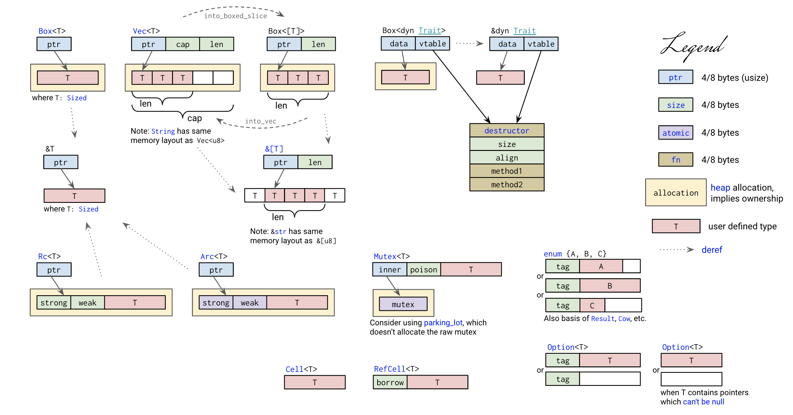

# 1、编程基本概念

- 数据（值和类型、指针和引用）；
- 代码（函数、方法、闭包、接口和虚表）；
- 运行方式（并发并行、同步异步和 Promise / async / await ）
- 编程范式（泛型编程）

# 2、vscode搭建rust开发环境

- rust-analyzer：它会实时编译和分析你的 Rust 代码，提示代码中的错误，并对类型进行标注。你也可以使用官方的 Rust 插件取代。
- rust syntax：为代码提供语法高亮。
- crates：帮助你分析当前项目的依赖是否是最新的版本。
- better toml：Rust 使用 toml 做项目的配置管理。
- better toml 可以帮你语法高亮，并展示 toml 文件中的错误。
- rust test lens：可以帮你快速运行某个 Rust 测试。
- Tabnine：基于 AI 的自动补全，可以帮助你更快地撰写代码；



# [rustup](https://github.com/rust-lang/rustup)

rustup 是 Rust 工具链安装程序

通过 rustup 安装的 Rust 或者升级：
```bash
# 更新所有工具链（包括 cargo）
rustup update
# 或者只更新稳定版
rustup update stable
```

更新自身：
```bash
# 更新 rustup 工具
rustup self update
```

查看工具链：
```bash
$ rustup show
Default host: aarch64-apple-darwin
rustup home:  /Users/user/.rustup

installed toolchains
--------------------
stable-aarch64-apple-darwin
stable-x86_64-apple-darwin (active, default)

active toolchain
----------------
name: stable-x86_64-apple-darwin
active because: it's the default toolchain
installed targets:
  x86_64-apple-darwin
```
设置稳定版为默认工具链：
```bash
rustup default stable
```
# GUI

- [GPUI Component 是一个基于 Rust 语言的 GUI 组件库](https://github.com/longbridge/gpui-component)

# 参考资料

- [The Rust Programming Language](https://doc.rust-lang.org/book/)
- [Rust Language Cheat Sheet](https://cheats.rs/)
- [The Rust Programming Language-中文版](https://kaisery.github.io/trpl-zh-cn/title-page.html)
- [Rust](https://docs.rs/)
- [Rust国内镜像](https://rsproxy.cn/)
- [Rust Course](https://github.com/sunface/rust-course)
- [Learn Rust](https://gist.github.com/chenlanqing/e86a450cde47227820f7579d0b0a285d)
- [Rust Learning Resources](https://serokell.io/blog/learn-rust)
- [Rust practice](https://github.com/sunface/rust-by-practice)
- [Rusty Book(锈书)](https://rusty.course.rs/)
- [A curated list of Rust code and resources.](https://github.com/rust-unofficial/awesome-rust)
