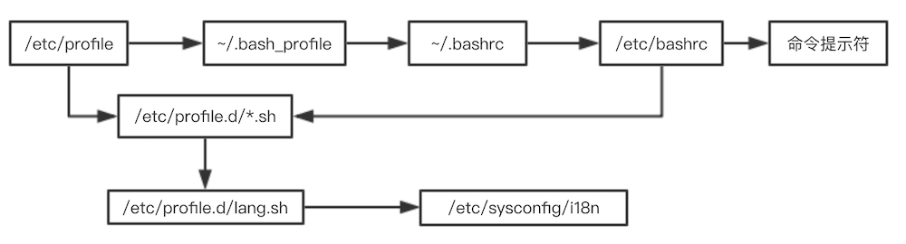

<!-- START doctoc generated TOC please keep comment here to allow auto update -->
<!-- DON'T EDIT THIS SECTION, INSTEAD RE-RUN doctoc TO UPDATE -->
**目录**

- [一、Linux装机](#%E4%B8%80linux%E8%A3%85%E6%9C%BA)
  - [1、vmware虚拟机](#1vmware%E8%99%9A%E6%8B%9F%E6%9C%BA)
  - [2、服务器注意事项](#2%E6%9C%8D%E5%8A%A1%E5%99%A8%E6%B3%A8%E6%84%8F%E4%BA%8B%E9%A1%B9)
- [二、Linux命令](#%E4%BA%8Clinux%E5%91%BD%E4%BB%A4)
  - [1、文件处理命令](#1%E6%96%87%E4%BB%B6%E5%A4%84%E7%90%86%E5%91%BD%E4%BB%A4)
  - [2、网络命令](#2%E7%BD%91%E7%BB%9C%E5%91%BD%E4%BB%A4)
  - [3、关机重启](#3%E5%85%B3%E6%9C%BA%E9%87%8D%E5%90%AF)
  - [4、文本编辑器 vim](#4%E6%96%87%E6%9C%AC%E7%BC%96%E8%BE%91%E5%99%A8-vim)
- [三、软件管理](#%E4%B8%89%E8%BD%AF%E4%BB%B6%E7%AE%A1%E7%90%86)
  - [1、软件包管理简介](#1%E8%BD%AF%E4%BB%B6%E5%8C%85%E7%AE%A1%E7%90%86%E7%AE%80%E4%BB%8B)
  - [2、RPM包管理-rpm命令管理](#2rpm%E5%8C%85%E7%AE%A1%E7%90%86-rpm%E5%91%BD%E4%BB%A4%E7%AE%A1%E7%90%86)
  - [3、RPM包管理-yum在线管理](#3rpm%E5%8C%85%E7%AE%A1%E7%90%86-yum%E5%9C%A8%E7%BA%BF%E7%AE%A1%E7%90%86)
  - [4、源码包管理](#4%E6%BA%90%E7%A0%81%E5%8C%85%E7%AE%A1%E7%90%86)
  - [5、脚本安装包与软件包选择](#5%E8%84%9A%E6%9C%AC%E5%AE%89%E8%A3%85%E5%8C%85%E4%B8%8E%E8%BD%AF%E4%BB%B6%E5%8C%85%E9%80%89%E6%8B%A9)
- [四、系统管理](#%E5%9B%9B%E7%B3%BB%E7%BB%9F%E7%AE%A1%E7%90%86)
  - [1、用户与用户组管理](#1%E7%94%A8%E6%88%B7%E4%B8%8E%E7%94%A8%E6%88%B7%E7%BB%84%E7%AE%A1%E7%90%86)
  - [2、权限管理](#2%E6%9D%83%E9%99%90%E7%AE%A1%E7%90%86)
  - [3、文件系统](#3%E6%96%87%E4%BB%B6%E7%B3%BB%E7%BB%9F)
  - [4、服务管理](#4%E6%9C%8D%E5%8A%A1%E7%AE%A1%E7%90%86)
  - [5、进程管理](#5%E8%BF%9B%E7%A8%8B%E7%AE%A1%E7%90%86)
  - [6、日志管理](#6%E6%97%A5%E5%BF%97%E7%AE%A1%E7%90%86)
  - [7、启动管理](#7%E5%90%AF%E5%8A%A8%E7%AE%A1%E7%90%86)
  - [8、备份与恢复](#8%E5%A4%87%E4%BB%BD%E4%B8%8E%E6%81%A2%E5%A4%8D)
- [五、Shell](#%E4%BA%94shell)
  - [1、Bash基本功能](#1bash%E5%9F%BA%E6%9C%AC%E5%8A%9F%E8%83%BD)
  - [2、bash变量](#2bash%E5%8F%98%E9%87%8F)
  - [3、bash运算](#3bash%E8%BF%90%E7%AE%97)
  - [4、环境变量配置文件](#4%E7%8E%AF%E5%A2%83%E5%8F%98%E9%87%8F%E9%85%8D%E7%BD%AE%E6%96%87%E4%BB%B6)
  - [5、正则表达式](#5%E6%AD%A3%E5%88%99%E8%A1%A8%E8%BE%BE%E5%BC%8F)
  - [6、字符截取命令](#6%E5%AD%97%E7%AC%A6%E6%88%AA%E5%8F%96%E5%91%BD%E4%BB%A4)
  - [7、条件判断](#7%E6%9D%A1%E4%BB%B6%E5%88%A4%E6%96%AD)
  - [8、流程控制](#8%E6%B5%81%E7%A8%8B%E6%8E%A7%E5%88%B6)

<!-- END doctoc generated TOC please keep comment here to allow auto update -->

# 一、Linux装机
## 1、vmware虚拟机

- 系统分区

	对于CentOS来说，分区：挂载点：
	- /boot： 文件格式：ext4，大小：200M；
	- /swap： 文件格式：swap，大小：不超过2G，为内存2倍；
	- /home： 文件格式：ext4，大小：根据实际情况分配；
	- /	：  文件格式：ext4，大小：其余剩下空间
	
- 配置网络：
	- A：host-only： ifconfig eth0 ip地址(ip地址为window下VMvet1下的ip地址)；
	- B：桥接：

## 2、服务器注意事项

远程服务器不允许关机，只能重启；重启时应关闭相应的服务；

# 二、Linux命令

- 命令格式： 命令 [-选项] [参数]
- 简化选项： -a 或 -all

## 1、文件处理命令

### 1.1、目录处理命令

- ls -> list ls [-aldh] -> -a：显示所有文件，-l：显示详细信息，-d显示目录属性，-h：human，i
	```
	-a 显示所有档案及目录 (ls内定将档案名或目录名称开头为"."的视为隐藏档，不会列出) 
	-l 除档案名称外，亦将档案型态、权限、拥有者、档案大小等资讯详细列出 
	-r 将档案以相反次序显示(原定依英文字母次序) 
	-t 将档案依建立时间之先后次序列出 
	-A 同 -a ，但不列出 "." (目前目录) 及 ".." (父目录) 
	-F 在列出的档案名称后加一符号；例如可执行档则加 "*"， 目录则加 "/" 
	-R 若目录下有档案，则以下之档案亦皆依序列出
	-s：在每个文件旁边显示该文件的大小，单位为千字节
	-d：像一般文件那样处理目录，而不是列出它们的内容
	-i：显示文件索引号
	-h： 以容易理解的格式列出文件大小
	```
	```
	drwxrwxr-x.  9 hadoop hadoop     4096 Apr 10 15：27 apache-nutch-2.1
	-rw-r--r--.  1 hadoop hadoop  2699959 Oct 22 17：43 apache-nutch-2.1-src.tar.gz
	drwxrwxr-x.  2 hadoop hadoop     4096 Apr 10 16：50 demo
	drwxr-xr-x. 17 hadoop hadoop     4096 Apr  3 11：47 hadoop-1.0.4
	-rw-r--r--.  1 hadoop hadoop 62793050 Oct 22 11：09 hadoop-1.0.4.tar.gz
	drwxr-xr-x.  9 hadoop hadoop     4096 Oct 28 19：04 hbase-0.90.6
	-rw-rw-r--.  1 hadoop hadoop 31645468 Mar 16  2012 hbase-0.90.6.tar.gz
	-rw-rw-r--.  1 hadoop hadoop      100 Sep 18  2013 jstatd.all.policy
	drwxrwxr-x.  5 hadoop hadoop     4096 Nov 27 17：02 LoadTester
	drwxrwxr-x.  2 hadoop hadoop     4096 Apr  4 11：24 nutch
	-rw-rw-r--.  1 hadoop hadoop        0 Oct 16 16：21 rpm
	drwxrwxr-x.  2 hadoop hadoop     4096 Apr  8 14：07 sbin
	-rw-rw-r--.  1 hadoop hadoop      272 Dec 12 16：59 seed.txt
	drwxrwxr-x.  2 hadoop hadoop     4096 Oct 22 11：12 softwares
	drwxrwxr-x.  2 hadoop hadoop     4096 Apr  4 11：02 temp
	drwxr-xr-x.  7 hadoop hadoop     4096 Jul 26  2013 visualvm_136
	-rw-rw-r--.  1 hadoop hadoop   430723 Mar 31 15：15 wget-log
	-rw-rw-r--.  1 hadoop hadoop       17 Apr 10 11：54 xaa
	```
	```
	d rwx rwx r-x
	- rw- rw- r--
	ls -l 命令的结果为(按自左至右顺序)：
	$ ls -l
	total 1
	-rw-r-----   1 zhang    users           0 7月  8 14：11 某一_文件
	drwxr-xr--   2 li_si    users        1024 7月  8 14：11 某一_目录/
	```

	- 前十个字符表示该文件的类型及其权限。其中第一个字符表示该文件的类型：短横(-)表示是普通文件，字符 d 表示是目录。还有其他文件类型将在下文讨论。接下来的九个字符表示该文件的权限。实际上，这九个字符分成三组，每组又分为三种权限：第一组代表了该文件的所有者对它的权限，第二组是该文件所有组中其他成员的权限，而第三组表示了其他人的权限。短横(-)表示没有某一权限。

	- 接下来的数字表示到该文件的链接。稍后，我们将会发现某个文件的唯一标识符不是它的名字而是一个数字(称为inode 号)。而且磁盘上的一个文件可以同时拥有好几个名字。对于目录，该链接数具有特殊的含义，我们在下文中也会提及。(第二列)再接下来的是该文件所有者的名字(第三列：zhang)和所有组的名字(第四列：users)。最后是该文件的大小(以字节为单位)、最后修改日期和该文件或目录的名字。

	- 让我们更进一步观察这些文件的权限。
		- 首先，我们必须去掉代表文件类型的第一个字符。这样，对于文件某一_文件，我们就得到了：rw-r-----。下面对其逐项解释。
		- 前三个字符(rw-)代表所有者(在该例中是 zhang)的权限。因此，zhang 有权阅读该文件(r)，修改其内容(w)，但却不能执行它(-)。
		- 接下来的三个字符(r--)代表了 users 组中除了 zhang 的其他用户的权限。他们能够阅读该文件(r)，但是既不能写也不能执行(--)。
		- 最后三个字符(---)代表除zhang 及 users 组成员外的其他用户对该文件的权限。那些用户对这个文件没有任何权限。

	- 对某一目录这个目录，其权限为 rwxr-xr--，因此：

		目录所有者li_si可以列出其中的文件(r)，在其中添加或删除文件(w)，以及对其遍历(x)。users 组中除li_si的其他成员能够列出其中的文件(r)，但是不能够在其中添加或删除文件(-)，但却能对其遍历(x)。剩下的用户只能列出该目录包含的文件(r)。由于他们没有 wx 权限，他们就不能够写入文件或进入该目录。

	- 表示文件类型有”d”， “-“ ，其实除了这两种外还有”l”， “b”， “c”，”s”等。
		```
		d 表示该文件为目录；
		- 表示该文件为普通文件；
		l 表示该文件为连接文件（linux file），上边提到的软连接即为该类型；
		b 表示该文件为块设备文件，比如磁盘分区
		c 表示该文件为串行端口设备，例如键盘、鼠标。
		s 表示该文件为套接字文件（socket），用于进程间通信。
		```
	- linux的文件系统格式为Ext2，或者Ext3
		- Ext2文件系统是非日志文件系统
		- Ext3文件系统是直接从Ext2文件系统发展而来，Ext3文件系统带有日志功能，可以跟踪记录文件系统的变化，并将变化内容写入日志，写操作首先是对日志记录文件进行操作，若整个写操作由于某种原因 (如系统掉电) 而中断，系统重启时，会根据日志记录来恢复中断前的写操作，而且这个过程费时极短
		- Linux文件系统在windows中是不能识别的，但是在linux系统中你可以挂载的windows的文件系统，linux目前支持MS-DOS，VFAT，FAT，BSD等格式
	
- mkdir：创建目录，可以同时创建多个目录，选项：			
	- -m， --mode=模式，设定权限<模式> (类似 chmod)，而不是 rwxrwxrwx 减 umask
	- -p， --parents，加上此选项后，系统将自动建立不存在的目录，即一次可以建立多个目录； 
	- -v， --verbose  每次创建新目录都显示信息

	例子：一个命令创建项目的目录结构：mkdir -vp scf/{lib/，bin/，doc/{info，product}，logs/{info，product}，service/deploy/{info，product}}
	
- rmdir：删除空目录
- cp 复制
- mv 重命名，剪切
- rm -rf [删除文件/目录]
- pwd -P 显示文件实际路径，而非使用链接的路径
	
### 1.2、文件处理命令

- touch -> 创建的文件不具有可执行权限
- cat/tac：-A 显示所有
- more ： 分页显示文件内容
	```
	more [文件名]
		f：翻页
		回车：换行
		q或Q退出
	```
- less ：可向上翻页
- head -n [行号] ：查看前几行
- tail：显示文件后面几行

### 1.3、链接命令

ln -s [源文件] [目标文件] ：生成软链接，类似windows快捷方式

ln [源文件] [目标文件] ：同步更新；生成硬链接，不能跨分区，不能针对不能使用，通过i节点识别[硬链接节点与原文件节点一致]
		
### 1.4、文件权限管理

- 权限管理命令：chmod
	```
	chmod [{ugoa}{+-=}{rwx}][文件或/目录] -R
	chmod [mode=421][文件/目录] -R
		ugoa ： u => 文件所属用户，g => 用户所属组，o => 其他用户，a => all 
		-R ： 递归修改文件权限
	数字表示权限：
		r => 4，对文件可以查看文件内容，可以列出目录内容
		w => 2，对文件可以修改文件内容，可以在目录中创建、删除文件
		x => 1，对文件可以执行文件，可以进入目录
	◆★注意：理解写权限对文件和目录的操作；
	```
- 其他权限管理命令：
	- chown [用户名][文件/目录]：改变文件/目录所有者，只有管理员root可以操作
	- chgrp [用户组][文件/目录]：改变文件/目录的所属组
	- umask [-S]：查看新创建文件/目录的预设权限；修改预设权限：umask [xxx]，三个数字

	查看umask值只要输入umask然后回车。 umask预设是0022，其代表什么含义？先看一下下面的规则

	- 若用户建立为普通文件，则预设“没有可执行权限”，只有rw两个权限。最大为666(-rw-rw-rw-)
	- 若用户建立为目录，则预设所有权限均开放，即777(drwxrwxrwx)：umask数值代表的含义为，上边两条规则中的默认值（文件为666，目录为777）需要减掉的权限。
		- 所以目录的权限为(rwxrwxrwx) – (----w--w-) = (rwxr-xr-x) => 777-022=755
		- 普通文件的权限为(rw-rw-rw-) – (----w--w-) = (rw-r--r--) => 666-022=644
		- umask的值是可以自定义的，比如设定umask 为 002，你再创建目录或者文件时，
		- 默认权限分别为(rwxrwxrwx) – (-------w-) = (rwxrwxr-x)和(rw-rw-rw-) – (-------w-) = (rw-rw-r--)。
	- umask 可以在/etc/bashrc里面更改，预设情况下，root的umask为022，而一般使用者则为002，因为可写的权限非常重要，因此预设会去掉写权限。
		
### 1.5、文件搜索命令

- find 命令：find [搜索范围] [匹配条件]	，避免在根目录下全局查找文件，避免在服务器高峰期使用 find 命令
	- 根据文件名查找文件：
		```
		find /ect -name init  ==> 查找文件 init，完全匹配
		find /etc -name *init* ==> 查找包含 init 的文件
		find /etc -name init??? ==> 查找以init开头，且后面包含三个字符的文件
		find /etc -iname init ==> 不区分大小写
		```
	- 根据文件大小查找： +n 大于， -n 小于， n 等于

		find / -size +2048000 ==> 在根目录下查找大于100M的文件，文件大小使用数据块，1 个数据块 = 512 字节 = 0.5K

	- 根据所有者查找文件：

		- find /home -user root ==> 在根目录下查找所有者为 root 的文件
		- find /home -group root ==> 根据所有组

	- 根据时间属性查找文件：
		```
		find /etc -cmin -5 ==>在 etc 下查找5分钟内被修改过的属性的文件和目录
		-cmin ： 文件属性 change
		-amin ： 访问时间 access ，如权限等
		-mmin ： 文件内容 modify，修改的是文件内容
		```
	- 组合查询： -a ==> 连个条件同时满足， -o ==> 两个条件满足任意一个即可

		find /etc -size +163840 -a -size -204800 ==> 在etc下查找打下在80M~100M之间的文件

	- 其他条件：

		find /etc -name  init -exec ls -l {} \

		-exec/-ok 命令 {}\； 对搜索结果进行操作， -exec 直接执行命令， -ok 询问是否执行命令<br/>
		-type：根据文件类型查找  f：文件， d：目录， l：软链接文件<br/>
		-inum：根据 i 节点查找，每个文件都存在 i 节点，在一个文件带有特殊字符情况下，可以使用该命令<br/>

- 其他搜索命令

	- locate：在文件资料库中查找文件；locate 文件名，在文件资料库中查找，/tmp 目录下的文件不再资料库中；`updatedb` 更新资料库
		locate -i 文件名：不区分大小写

	- which：搜索命令所在的目录及别名信息
		```
		[root@localhost test]# which ls
		alias ls='ls --color=auto'
			/usr/bin/ls
		```
	- whereis [命令]：搜索命令所在目录及帮助文档路径
		```
		[root@localhost test]# whereis ls
		ls： /usr/bin/ls /usr/share/man/man1/ls.1.gz /usr/share/man/man1p/ls.1p.gz
		```
	- grep -iv [指定字符串] [文件]：在文件中搜寻字符串匹配的行并输出：-i 不区分大小写；-v  排除指定字符串	

### 1.6、帮助命令

- man [命令或配置文件]：获得帮助信息，查看配置文件时，只需要写上配置文件的名称，不要写绝对路径

	whatis [命令名称] 

	apropos [配置文件]

- help：获取shell内置命令的帮助性信息

### 1.7、用户管理命令

- useradd 用户名：添加新用户，只有管理员root可以操作
- passwd 用户名：设置用户密码，普通用户只能改自己的密码
- who：查看登录用户信息
- w ： 查看登录用户的详细信息

### 1.8、压缩命令

- gzip [文件]：压缩文件，文件格式 .gz，只能压缩目录且不保留源文件；gunzip [压缩文件]：解压缩.gz文件

- tar -zcvf 压缩后的文件名 目录： 打包目录， .tar.gz
	```
	-c ： 打包
	-x ： 解包
	-v ： 显示详细信息
	-f ： 指定的文件名/解压缩文件名
	-z ： 打包同时压缩
	-j ： 打包程.tar.bz2文件
	```
- zip [-r] 压缩后的文件名 [文件或目录]：压缩命令，windows和linux都支持的压缩格式；-r ： 压缩目录
- unzip 压缩文件：解压缩.zip文件
- bzip2 -k [文件]：　只能压缩文件， .bz2
	```
	-k ：产生压缩文件后保留源文件
	tar -cjf node-v4.2.1.tar.bz2 node-v4.2.1 ==> 压缩程 .tar.bz2 
	bunzip2 -k [文件] 解压缩文件
	-k ： 保留压缩文件
	tar -xjf node-v4.2.1.tar.bz2
	```

## 2、网络命令

- write 用户名：给在线用户发信息，以 ctrl + D 保存结束
- wall 信息：发广播信息，给所有用户发送信息；		
- ping [-c] ip地址：测试网络连通性；-c：指定发送次数
- ifconfig 网卡名称 ip地址：查看和设置网卡信息		
- mail 用户名：发送的电子邮件，mail：查看邮件
- last：列出目前与过去登录系统的用户信息；lastlog -u [用户的uid]：查看所有或某个特定用户上次登录的时间	
- traceroute：显示数据包到主机间的路径		
- netstat [选项]：显示网络相关信息；
	```		
	-t ： TCP协议
	-u ： UDP协议
	-l ： 监听
	-r ： 路由
	-n ： 显示IP地址和端口号 	
	netstat -tlun ： 查看本机监听的端口
	netstat -an ： 查看本机所有的网络连接
	netstat -rn ： 查看本机路由表	
	```
- setup：配置网络，永久生效[不是所有的Linux都有]		
- mount [-t 文件系统] 设备文件名 挂载点：mount -t iso9960 /dev/sr0 /mnt/cdrom：挂载光盘到 cdrom挂载点	
- umount 挂载点或者设备名：卸载
			
## 3、关机重启
- shutdown [选项] 时间
	```
	-c ： 取消前一个关机命令
	-h ： 关机
	-r ： 重启
	```
- 系统运行级别：
	```
	0 ： 关机
	1 ： 单用户
	2 ： 不完全用户，不含NFS服务
	3 ： 完全多用户
	4 ： 未分配
	5 ： 图形界面
	6 ： 重启
	```

## 4、文本编辑器 vim

### 4.1、vim 常用操作

- 插入命令
	```
	a 		在光标所在字符后插入
	A 		在光标所在行尾插入
	i 		在光标所在字符前插入
	I 		在光标所在行行首插入
	o 		在光标下插入新行
	O 		在光标上插入新行
	```
- 定位命令
	```
	：set nu 	设置显示行号
	：set nonu	取消行号
	gg			到第一行
	G 			到最后一行
	nG			到第 n 行
	：n 			到第 n 行
	$			移至行尾
	0			移至行首
	```
- 删除命令
	```
	x 		删除光标所在处字符
	nx 		删除光标所在处后 n 个字符
	dd 		删除光标所在行，ndd 删除 n行；
	dG		删除光标所在行到文件末尾的内容
	D 		删除光标所在处到行尾的内容；
	：n1，n2d 删除n1行到n2行的内容.即指定范围的内容
	```
- 复制和剪切命令
	```
	yy		复制当前行；
	nyy		复制当前行以下的 n 行
	dd 		剪切当前行
	ndd		剪切当前行以下n行
	p 		粘贴在当前光标所在行的下面
	P      	粘贴到当前光标所在行的上面
	```
- 替换和取消命令
	```
	r  		替换光标所在出字符
	R 		从光标所在处开始替换字符，按ESC结束
	u 		取消上一步操作
	```
- 搜索和替换命令
	```
	/string			搜索指定的字符串
	：set ic 		搜索时忽略大小写， ：set noic 不忽略大小写
	n 				搜索时指定字符串的下一个出现的位置
	：%s/要替换的字符串/替换新的字符串/g 	全文替换指定的字符串， /g 不询问直接替换， /c 询问是否替换
	：n1，n2s/要替换的字符串/替换新的字符串/g 	在n1行到n2行之间替换指定的字符串
	```
- 保存和退出命令
	```
	：w 			保存修改
	：w filename	另存为指定文件
	：wq 		保存修改并退出
	ZZ 			快捷键，保存修改并退出
	：q!			不保存修改直接退出
	：wq!		保存修改并退出(文件所有着及root可使用)
	```

### 4.2、文本编辑器技巧

- 导入命令：
	```
	：r filename 	导入指定文件到当前编辑器编辑的文件
	!命令 			可以查看命令
	：r !命令 		导入命令的执行结果到当前文件
	```
- 定义快捷键：  ：map 快捷键 触发命令
	```
	# 注意： ^p 是由ctrl + v + p 来实现输入的
	：map ^P I#<ESC>  表示按 ctrl + p 快捷键，可以在每行行首加入注释，并保持在命令模式
	：map ^b 0x		 表示定义的快捷键 ctrl + b 删除行首的字符
	```
- 连续行注释：
	```
	# ^ 表示行首
	：n1，n2s/^/#/g 		 将n1行与n2行之间的行首替换为 "#"字符串
	：n1，n2s/^#//g 		 将n1行与n2行之间的行首 "#"替换掉
	：n1，n2s/^/\/\//g 	 将n1行与n2行之间的行首替换为 //
	```
- 替换：ab myemail chenlanq@qq.com：在文本编辑时输入 myemail， 回车或空格会自动替换为邮箱
- 如果要使上述定义的=命令永久有效，则需要在用户的根目录下创建文件：.vimrc 里面可以存放编辑模式下的命令

# 三、软件管理

## 1、软件包管理简介

- 1.1、软件包分类：

	- 源码包：大部分都是 c和c++语言来实现的脚本安装包
		- 开源，如果有足够的能力，可以修改源代码；
		- 可以自由选择所需的功能；
		- 软件是编译安装，所以更加适合自己的系统，更加稳定也效率更高；
		- 卸载方便；
		- 安装过程步骤较多，尤其安装较大的软件集合时(如LAMP环境搭建)，容易出现 拼写错误；
		- 编译过程时间较长，安装比二进制安装时间长；
		- 因为是编译安装，安装过程中一旦报错新手很难解决
	- 二进制包：rpm包，系统默认包，源代码经过编译之后
		- 包管理系统简单，只通过几个命令就可以 实现包的安装、升级、查询和卸载；
		- 安装速度比源码包安装快的多；
		- 经过编译，不再可以看到源代码；
		- 功能选择不如源码包灵活；
		- 依赖性

## 2、RPM包管理-rpm命令管理

### 2.1、RPM包命令规则

```
httpd-2.2.15-15.el6.centos.1.i686.rpm  软件包全名
httpd 		软件包名
2.2.15		软件版本
15			软件发布的次数
el6.centos 	适合的Linux平台
i686		适合的硬件平台
rpm 		rpm包扩展名
```

### 2.2、rpm 包依赖性

```
树形依赖： a --> b --> c
环形依赖： a --> b --> c --> a
模块依赖： 模块依赖查询网站：www.rpmfind.net
```
- 包全名与报名
	- 包全名：操作的包是没有安装的软件包时，使用包全名，而且要注意路径，在安装和升级使用
	- 包名：操作已经安装的软件包时，使用包名，是搜索`/var/lib/rpm/`中的数据库

### 2.3、rpm安装

```
rpm -ivh 包全名
	-i 	安装 
	-v 	显示详细信息
	-h 	显示进度
	--nodeps	不检测依赖性
	-U 	升级
rpm -e 包名：卸载
```


- `[root@localhost ~]# rpm -q 包名`：查询包是否安装
- `[root@localhost ~]# rpm –qa`：查询所有已经安装的RPM包
- `rpm–qi 包名`：查询软件包的详细信息
- `rpm–ql 包名`：查询包文件安装位置
- `rpm–qf 系统文件名`：查询系统文件属于哪个软件包
- `rpm –qR 包名`：查询软件包的依赖性
- `rpm –V 已安装的包名`：RPM包校验

## 3、RPM包管理-yum在线管理

### 3.1、网络yum源

`[root@localhost yum.repos.d]# vi /etc/yum.repos.d/CentOS-Base.repo`
- `[base]`：容器名称，一定要放在[]中
- name：容器说明，可以自己随便写
- mirrorlist：镜像站点，这个可以注释掉
- baseurl：我们的yum源服务器的地址。默认是CentOS官方的yum源服务 器，是可以使用的，如果你觉得慢可以改成你喜欢的yum源地 址
- enabled：此容器是否生效，如果不写或写成enable=1都是生效，写成 enable=0就是不生效
- gpgcheck：如果是1是指RPM的数字证书生效，如果是0则不生效
- gpgkey：数字证书的公钥文件保存位置。不用修改

### 3.2、yum命令

- `yum list`：查询所有可以用的软件包列表
- `yum search 关键字`：搜索服务器上所有和关键字相关的包
- `yum –y install 包名`：`-y`表示自动回答yes，安装软件
- `yum -y update 包名`：软件升级
- `yum -y remove 包名`：软件卸载
- `yum grouplist`：列出所有可用的软件组列表
- `yum groupinstall 软件组名`：安装指定软件组，组名可以由grouplist查询出来
- `yum groupremove 软件组名`：卸载指定软件组

### 3.3、搭建光盘源

光盘yum源搭建步骤
- 挂载光盘：`mount /dev/cdrom /mnt/cdrom/`
- 让网络yum源文件失效：
	```bash
	[root@localhost ~]# cd /etc/yum.repos.d/
	[root@localhost yum.repos.d]# mv CentOS-Base.repo CentOS-Base.repo.bak
	[root@localhost yum.repos.d]# mv CentOS-Debuginfo.repo CentOS-Debuginfo.repo.bak
	[root@localhost yum.repos.d]# mv CentOS-Vault.repo CentOS-V ault.repo.bak
	```
- 修改光盘yum源文件
	```bash
	[root@localhost yum.repos.d]# vim CentOS-Media.repo [c6-media]
	name=CentOS-$releasever - Media baseurl=file:///mnt/cdrom #地址为你自己的光盘挂载地址
	# file:///media/cdrom/
	# file:///media/cdrecorder/
	#注释这两个不存在的地址
	gpgcheck=1
	enabled=1 #把enabled=0改为enabled=1，让这个yum源配置文件生效 gpgkey=file:///etc/pki/rpm-gpg/RPM-GPG-KEY-CentOS-6
	```

## 4、源码包管理

### 4.1、源码包和RPM包的区别

- RPM包安装位置，其是安装在默认位置的
	- `/etc/`：配置文件安装目录
	- `/usr/bin/`：可执行的命令安装目录
	- `/usr/lib/`：程序所使用的函数库保存位置
	- `/usr/share/doc/`：基本的软件使用手册保存位置
	- `/usr/share/man/`：帮助文件保存位置
- 源码包安装位置：安装在指定位置当中，一般是`/usr/local/软件名/`


## 5、脚本安装包与软件包选择

# 四、系统管理

## 1、用户与用户组管理

### 1.1、用户信息文件

用户信息存放在文件：`/etc/passwd`，内容如下：

```
root:x:0:0:root:/root:/bin/bash
...
```
其是使用`:` 进行分割的，各个字段含义：

- 第1个字段：用户名称
- 第2个字段：密码标志，密码是存储在：`/etc/shadow`
- 第3个字段：UID（用户ID）
	- 0：超级用户
	- 1-499：系统用户（伪用户）
	- 500-65535：普通用户
- 第4个字段：GID（用户初始组ID） `初始组`就是用户一登录就就立刻拥有这个用户组的相关权限，每个用户的初始组只能有一个，一般就是和这个用户的用户名相同的组名作为这个用户的初始组；`附加组`指用户可以加入多个其他的用户组，并拥有这些组的权限，附加组可以有多个；
- 第5个字段：用户说明
- 第6个字段：家目录
	- 普通用户：/home/用户名/
	- 超级用户：/root/
- 第7个字段：登录之后的shell，即Linux的命令解释器，除了标准的`/bin/bash`之外，还可以写成：`/sbin/nologin, /usr/bin/passwd`等

### 1.2、影子文件

该文件位置：`/etc/shadow`
```
root:$1$RQF6Hgs/$8zbWgDRZfty9DGNWuhWSY.:17277:0:99999:7:::
```
其是使用`:` 进行分割的，各个字段含义：
- 第1字段：用户名
- 第2字段：加密密码
	- 加密算法升级为SHA512散列加密算法
	- 如果密码位是`!!`或`*`代表没有密码，不能登录；
- 第3字段：密码最后一次修改日期，使用1970年1月1日作为标准时间，每过一天时间戳加1
- 第4字段：两次密码的修改间隔时间（和第3字段相比）
- 第5字段：密码有效期（和第3字段相比）
- 第6字段：密码修改到期前的警告天数（和第5字段相比）
- 第7字段：密码过期后的宽限天数（和第5字段相比）
	- 0：代表密码过期后立即失效
	- -1：则代表密码永远不会失效
- 第8字段：账号失效时间，要用时间戳表示
- 第9字段：保留字段

**时间戳换算**
- 把时间戳换算为日期：`date -d "1970-01-01 17277 days"`
- 把日期换算为时间戳：`echo $(($(date --date="2018/11/16" +%s)/86400+1))`

### 1.3、组信息文件

**组信息文件`/etc/group`，`root:x:0:`**

- 第一字段：组名
- 第二字段：组密码标志
- 第三字段：GID
- 第四字段：组中附加用户

**组密码文件`/etc/gshadow`，`root:::`**

- 第一字段：组名
- 第二字段：组密码
- 第三字段：组管理员用户名
- 第四字段：组中附加用户

### 1.4、用户管理相关文件

- 用户的家目录：
	- 普通用户：`/home/用户名/`，所有者和所属组都是此用户，权限是700；
	- 超级用户：`/root/`，所有者和所属组都是 root用户，权限是550；
- 用户的邮箱：`/var/spool/mail/用户名/`；
- 用户模板目录：`/etc/skel/`，创建一个用户后，默认家目录下有如下文件：` .bash_logout  .bash_profile  .bashr`；

### 1.5、用户管理命令

#### 1.5.1、添加用户：useradd命令

`[root@localhost ~]#useradd [选项] 用户名`

- `-u` UID：手工指定用户的UID号
- `-d` 家目录：手工指定用户的家目录
- `-c` 用户说明： 手工指定用户的说明
- `-g` 组名：手工指定用户的初始组
- `-G` 组名：指定用户的附加组
- `-s` shell：手工指定用户的登录shell。默认是/bin/bash

添加的默认用户，实际上是在往下列文件中写内容
```
[root@localhost ~]# useradd user1
[root@localhost ~]# grep "user1" /etc/passwd
[root@localhost ~]# grep "user1" /etc/shadow
[root@localhost ~]# grep "user1" /etc/group
[root@localhost ~]# grep "user1" /etc/gshadow
[root@localhost ~]# ll -d /home/user1/
[root@localhost ~]# ll /var/spool/mail/user1
```

指定选项添加用户：
```
groupadd user2
useradd -u 550 -g user1 -G root -d /home/user2 -c "test user" -s /bin/bash user1
```

用户默认值文件
- `/etc/default/useradd`
	```
	GROUP=100	#用户默认组    
	HOME=/home	#用户家目录
	INACTIVE=-1	#密码过期宽限天数，为/etc/shadowd第7字段
	EXPIRE=		#密码失效时间，为/etc/shadowd第8字段
	SHELL=/bin/bash	#默认shell
	SKEL=/etc/skel	#模板目录
	CREATE_MAIL_SPOOL=yes	#是否建立邮箱
	```
- `/etc/login.defs`
	```
	PASS_MAX_DAYS 99999	#密码有效期，为/etc/shadowd第5字段
	PASS_MIN_DAYS 0	#密码修改间隔，为/etc/shadowd第4字段
	PASS_MIN_LEN 5	#密码最小5位(PAM)
	PASS_WARN_AGE 7	#密码到期警告，为`/etc/shadowd` 第6字段
	UID_MIN 500 	#最小和最大UID范围
	GID_MAX 60000	
	ENCRYPT_METHOD	SHA512 #加密模式
	```

#### 1.5.2、修改密码：passwd命令

`[root@localhost ~]#passwd [选项] 用户名`，如果不写用户名，则是为当前登录用户给密码
- `-S`：查询用户密码的密码状态。仅root用户 可用。
- `-l`：暂时锁定用户，仅root用户可用
- `-u`： 解锁用户，仅root用户可用
- `--stdin`：可以通过管道符输出的数据作为用户的密码。

查看密码状态：
```bash
[root@localhost ~]# passwd -S user1
user1 PS 2018-11-18 0 99999 7 -1 (Password set, MD5 crypt.)
#用户名密码设定时间(2018-11-18) 密码修改间隔时间(0) #密码有效期(99999) 警告时间(7) 密码不失效(-1)
```

锁定用户和解锁用户：`passwd -l user1`，`passwd -u user1`

使用字符串作为用户的密码：`echo "123" | passwd --stdin user2`

#### 1.5.3、修改用户信息：usermod

`[root@localhost ~]#usermod [选项] 用户名 选项`
- `-u UID`：修改用户的UID
- `-c` 用户说明：修改用户的说明信息
- `-G` 组名：修改用户的附加组
- `-L`：临时锁定用户
- `-U`

```bash
[root@localhost ~]# usermod -c "test user" lamp #修改用户的说明
[root@localhost ~]# usermod -G root lamp #把lamp用户加入root组
[root@localhost ~]# usermod -L lamp #锁定用户
[root@localhost ~]# usermod -U lamp #解锁用户
```

#### 1.5.4、修改用户密码状态：chage

`[root@localhost ~]#chage [选项] 用户名`
- `-l`: 列出用户的详细密码状态
- `-d` 日期：修改密码最后一次更改日期(shadow3字段)
- `-m` 天数：两次密码修改间隔(4字段) 
- `-M` 天数：密码有效期(5字段)
- `-W` 天数：密码过期前警告天数(6字段) 
- `-I` 天数：密码过后宽限天数(7字段) 
- `-E` 日期：账号失效时间(8字段)

```bash
[root@localhost ~]# chage -d 0 user1
#这个命令其实是把密码修改日期归0了(shadow第3字段) #这样用户一登陆就要修改密码
```

#### 1.5.5、删除用户：userdel

`[root@localhost ~]# userdel [-r] 用户名`，`-r`:删除用户的同时删除用户家目录

手工删除用户：
```bash
[root@localhost ~]# vi /etc/passwd
[root@localhost ~]# vi /etc/shadow
[root@localhost ~]# vi /etc/group
[root@localhost ~]# vi /etc/gshadow
[root@localhost ~]# rm -rf /var/spool/mail/user1
[root@localhost ~]# rm -rf /home/user1/
```

查看用户ID：`id 用户名`

#### 1.5.6、切换用户身份：su

`[root@localhost ~]# su [选项] 用户名`
- `-`：选项只使用`-`代表连带用户的环境 变量一起切换
- `-c` 命令：仅执行一次命令，而不切换用户身份

`su - root -c "useradd user3"`：不切换成root，但是执行useradd命令添加user1用户


## 2、权限管理

## 3、文件系统

## 4、服务管理

## 5、进程管理

## 6、日志管理

## 7、启动管理

## 8、备份与恢复


# 五、Shell

## 1、Bash基本功能

### 1.1、历史命令

- history [选项] [历史命令保存文件]，选项：
	- -c：清空历史命令
	- -w：把缓存的历史命令写入历史命令保存文件中：~/.bash_history

历史命令默认会保存1000条,可以在环境 变量配置文件/etc/profile中进行修改

历史命令调用：
- 使用上、下箭头调用以前的历史命令 
- 使用“!n”重复执行第n条历史命令
- 使用“!!”重复执行上一条命令
- 使用“!字串”重复执行最后一条以该字 串开头的命令

### 1.2、命令别名

- 设定别名：alias 别名='原命令'
- 查询命令别名：alias
- 删除别名：unalias 别名

命令的执行时的顺序：
- 第一顺位执行用绝对路径或相对路径执行的命令；
- 第二顺位执行别名；
- 第三顺位执行Bash的内部命令；
- 第四顺位执行按照$PATH环境变量定义的目录查找顺序找到的第一个命令；

让别名永久生效：vi /root/.bashrc

### 1.3、bash常用快捷键

- ctrl+A：把光标移动到命令行开头。如果我们输入的命令过长，想要把光标移 动到命令行开头时使用。
- ctrl+E：把光标移动到命令行结尾。
- ctrl+C：强制终止当前的命令。
- ctrl+L：清屏，相当于clear命令。
- ctrl+U：删除或剪切光标之前的命令。我输入了一行很长的命令，不用使用退 格键一个一个字符的删除，使用这个快捷键会更加方便
- ctrl+K：删除或剪切光标之后的内容。
- ctrl+Y：粘贴ctrl+U或ctrl+K剪切的内容。
- ctrl+R：在历史命令中搜索，按下ctrl+R之后，就会出现搜索界面，只要输入 搜索内容，就会从历史命令中搜索。
- ctrl+D：退出当前终端。
- ctrl+Z：暂停，并放入后台。这个快捷键牵扯工作管理的内容，我们在系统管 理章节详细介绍。
- ctrl+S：暂停屏幕输出。
- ctrl+Q：恢复屏幕输出

### 1.4、输入输出重定向

#### 1.4.1、标准输入输出

设备|设备文件名|文件描述符|类型
---|---------|--------|----
键盘|/dev/stdin|0|标准输入
显示器|/dev/sdtout|1|标准输出
显示器|/dev/sdterr|2|标准错误输出

#### 1.4.2、输出重定向

- 标准输出重定向：
	- `命令 > 文件`：以覆盖的方式，把命令的 正确输出输出到指定的文 件或设备当中
	- `命令 >> 文件`：以追加的方式，把命令的 正确输出输出到指定的文 件或设备当中

- 标准错误输出重定向：
	- `错误命令 2> 文件`：以覆盖的方式，把命令的 错误输出输出到指定的文 件或设备当中
	- `错误命令 2>> 文件`：以追加的方式，把命令的 错误输出输出到指定的文 件或设备当中

- 正确输出和错误输 出同时保存
	- `命令 > 文件 2>&1`：以覆盖的方式，把正确输 出和错误输出都保存到同 一个文件当中。
	- `命令 >> 文件 2>&1`：以追加的方式，把正确输 出和错误输出都保存到同 一个文件当中。
	- `命令 &>文件`：以覆盖的方式，把正确输 出和错误输出都保存到同 一个文件当中。
	- `命令 &>>文件`：以追加的方式，把正确输 出和错误输出都保存到同 一个文件当中。
	- `命令>>文件1 2>>文件2`：把正确的输出追加到文件 1中，把错误的输出追加 到文件2中。

#### 1.4.3、输入重定向

wc [选项] [文件名]，选项：
- -c 统计字节数
- -w 统计单词数
- -l 统计行数

`命令<文件`：把文件作为命令的输入

### 1.5、多命令顺序执行

多命令执行|格式|作用
---|-----|----
;  | 命令1;命令2 |多个命令顺序执行，命令之间没有任何逻辑联系
&& | 命令1&&命令2 |逻辑与：当命令1正确执行，则命令2会执行；否则命令2不会执行；
\|\| | 命令1\|\|命令2 |逻辑或：当命令1执行不正确，则命令2才执行；否则命令2不会执行；

比如：
- ls ; date ; cd /user ; pwd
- dd if=输入文件 of=输出文件 bs=字节数 count=个数
	- if=输入文件：指定源文件或源设备
	- of=输出文件：指定目标文件或目标设备
	- bs=字节数：指定一次输入/输出多少字节，即把这些字节看做 一个数据块
	- count=个数 ：指定输入/输出多少个数据块

	`date ; dd if=/dev/zero of=/root/testfile bs=1k count=100000 ; date`

### 1.6、管道符

格式：`命令1 | 命令2`，表示命令1的正确输出作为命令2的操作对象

- grep [选项] "搜索内容" 文件名
	- -i: 忽略大小写
	- -n: 输出行号
	- -v: 反向查找
	- --color=auto 搜索出的关键字用颜色显示

### 1.7、通配符

通配符 | 作用
------| -----
？    | 匹配一个任意字符
*    | 匹配0个或任意多个任意字符，也就是可以匹配任何内容
[]   | 匹配中括号中任意一个字符。例如:[abc]代表一定匹配 一个字符，或者是a，或者是b，或者是c
[-]   | 匹配中括号中任意一个字符，-代表一个范围。例如:[a-z] 代表匹配一个小写字母
[^]  | 逻辑非，表示匹配不是中括号内的一个字符。例如:[^0- 9]代表匹配一个不是数字的字符

```bash
 [root@localhost ~]# cd /tmp/ 
 [root@localhost tmp]# rm -rf * 
 [root@localhost tmp]# touch abc 
 [root@localhost tmp]# touch abcd 
 [root@localhost tmp]# touch 012 
 [root@localhost tmp]# touch 0abc 
 [root@localhost tmp]# ls ?abc 
 [root@localhost tmp]# ls [0-9]* 
 [root@localhost tmp]# ls [^0-9]*
```

### 1.8、其他特殊符号

符号    |  作用
-------|------
'' | 单引号。在单引号中所有的特殊符号，如“$”和“`”(反引号)都 没有特殊含义。
"" | 双引号。在双引号中特殊符号都没有特殊含义，但是“$”、“`” 和“\”是例外，拥有“调用变量的值”、“引用命令”和“转义 符”的特殊含义
`` | 反引号。反引号括起来的内容是系统命令，在Bash中会先执行它。 和$()作用一样，不过推荐使用$()，因为反引号非常容易看错
$() | 和反引号作用一样，用来引用系统命令
\# | 在Shell脚本中，#开头的行代表注释
$ | 用于调用变量的值，如需要调用变量name的值时，需要用$name 的方式得到变量的值
\ | 转义符，跟在\之后的特殊符号将失去特殊含义，变为普通字符。 如\$将输出“$”符号，而不当做是变量引用

```bash
[root@localhost ~]# echo `ls`
[root@localhost ~]# echo $(date)
[root@localhost ~]# name=sc 
[root@localhost ~]# echo '$name' 
[root@localhost ~]# echo "$name" 
[root@localhost ~]# echo ‘$(date)' 
[root@localhost ~]# echo “$(date)"
```

## 2、bash变量

### 2.1、规范

- 变量名称可以由字母、数字和下划线组成 ，但是不能以数字开头。如果变量名是 “2name”则是错误的；
- 在Bash中，变量的默认类型都是字符串型 ，如果要进行数值运算，则必修指定变量类型为数值型；
- 变量用等号连接值，等号左右两侧不能有空格，如果有空格，需要使用单引号或双引号包括；
- 在变量的值中，可以使用“\”转义符；
- 如果需要增加变量的值，那么可以进行变量值的叠加。不过变量需要用双引号包含“$变量名”或用${变量名}包含；
- 如果是把命令的结果作为变量值赋予变量，则需要使用反引号或$()包含命令；
- 环境变量名建议大写，便于区分

### 2.2、变量分类

- 用户自定义变量
- 环境变量：这种变量中主要保存的是和系统操 作环境相关的数据。
- 位置参数变量：这种变量主要是用来向脚本当 中传递参数或数据的，变量名不能自定义，变 量作用是固定的。
- 预定义变量：是Bash中已经定义好的变量，变 量名不能自定义，变量作用也是固定的

### 2.3、本地变量
- 变量定义
	```
	[root@localhost ~]# name="shen chao"
	```
- 变量叠加
	```
	[root@localhost ~]# aa=123 
	[root@localhost ~]# aa="$aa"456 
	[root@localhost ~]# aa=${aa}789
	```
- 变量调用
	```
	][root@localhost ~]# echo $name
	```
- 变量查看
	```
	[root@localhost ~]# set
	```
- 变量删除
	```
	[root@localhost ~]# unset name
	```

### 2.4、环境变量

用户自定义变量只在当前的Shell中生效， 而环境变量会在当前Shell和这个Shell的所 有子Shell当中生效。如果把环境变量写入 相应的配置文件，那么这个环境变量就会 在所有的Shell中生效；

**设置环境变量：**

- 申明变量：export 变量名=变量值
- 查询变量：env
- 删除变量：unset 变量名

**系统常见环境变量**
- PATH:系统查找命令的路径
- PATH变量叠加：PATH="$PATH":/root/sh
- PS1:定义系统提示符的变量
	```
	\d:显示日期，格式为“星期 月 日” 
	\h:显示简写主机名。如默认主机名“localhost” 
	\t:显示24小时制时间，格式为“HH:MM:SS” 
	\T:显示12小时制时间，格式为“HH:MM:SS” 
	\A:显示24小时制时间，格式为“HH:MM” 
	\u:显示当前用户名 
	\w:显示当前所在目录的完整名称 
	\W:显示当前所在目录的最后一个目录 
	\#:执行的第几个命令
	\$:提示符。如果是root用户会显示提示符为“#”，如果是普通用户 会显示提示符为“$”
	```

### 2.5、位置参数变量

位置参数变量  |  作用
------------|------
$n  | n为数字，$0代表命令本身，$1-$9代表第一 到第九个参数，十以上的参数需要用大括号 包含，如${10}
$*	| 这个变量代表命令行中所有的参数，$*把所 有的参数看成一个整体
$@	|这个变量也代表命令行中所有的参数，不过 $@把每个参数区分对待
$#	| 这个变量代表命令行中所有参数的个数

- 例子1：
	```bash
	#!/bin/bash
	num1=$1
	num2=$2
	sum=$(( $num1 + $num2)) #变量sum的和是num1加num2 
	echo $sum #打印变量sum的值
	```
- `$*`与`$@`的区别
	```bash
	#!/bin/bash
	for i in "$*";
	do
		#$*中的所有参数看成是一个整体，所以这个for循环只会循环一次 do
		echo "The parameters is: $i"
	done
	x=1
	for y in "$@";
	do
		#$@中的每个参数都看成是独立的，所以“$@”中有几个参数，就会循环几次 do
		echo "The parameter$x is: $y"
		x=$(( $x +1 ))
	done
	```
### 2.6、预定义变量
- `$?`：最后一次执行的命令的返回状态。如果这个变量的值为0，证明上一个命令正确执行；如果 这个变量的值为非0（具体是哪个数，由命令自己来决定），则证明上一个命令执行不正确了。
- `$$`：当前进程的进程号(PID)
- `$!`：后台运行的最后一个进程的进程号(PID)

### 2.7、接受用户输入
read [选项] [变量名]，选项：
- -p “提示信息”：在等待read输入时，输出提示信息
- -t 秒数：read命令会一直等待用户输入，使用 此选项可以指定等待时间
- -n 字符数：read命令只接受指定的字符数，就会 执行
- -s：隐藏输入的数据，适用于机密信息的输入

```bash
 #!/bin/bash
# Author: shenchao (E-mail: shenchao@lampbrother.net)
read -t 30 -p "Please input your name: " name #提示“请输入姓名”并等待30秒，把用户的输入保存入变量name中 
echo "Name is $name "

read -s -t 30 -p "Please enter your age: " age
#年龄是隐私，所以我们用“-s”选项隐藏输入 
echo -e "\n"
echo "Age is $age "

read -n 1 -t 30 -p "Please select your gender[M/F]: " gender
#使用“-n 1”选项只接收一个输入字符就会执行(都不用输入回车) 
echo -e "\n"
echo "Sex is $gender"
```

## 3、bash运算

### 3.1、declare声明变量类型

declare [+/-][选项] 变量名，选项：
- -：给变量设定类型属性
- +：取消变量的类型属性
- -i：将变量声明为整数型(integer) -x: 将变量声明为环境变量
- -p：显示指定变量的被声明的类型

### 3.2、数值运算

- 方式1：
	```sh
	[root@localhost ~]# aa=11 
	[root@localhost ~]# bb=22 
	#给变量aa和bb赋值
	[root@localhost ~]# declare -i cc=$aa+$bb
	```

- 方式2：expr或let数值运算工具
	```sh
	[root@localhost ~]# aa=11
	[root@localhost ~]# bb=22 
	#给变量aa和变量bb赋值 
	[root@localhost ~]# dd=$(expr $aa + $bb)
	#dd的值是aa和bb的和。注意“+”号左右两 侧必须有空格
	```
- 方式3：`$((运算式))` 或 `$[运算式]`
	```sh
	[root@localhost ~]# aa=11 
	[root@localhost ~]# bb=22 
	[root@localhost ~]# ff=$(( $aa+$bb )) 
	[root@localhost ~]# gg=$[ $aa+$bb ]
	```
运算符的优先级同正常的运算符优先级

### 3.3、变量替换

变量置换方式 | 变量y没有设置 | 变量y为空值 | 变量y设置值
-----------|-------------|-----------|-----------
x=${y-新值} | x=新值	| x为空	     |x=$y
x=${y:-新值} | x=新值	| x=新值	|x=$y
x=${y+新值} |x为空 	|	x=新值		| x=新值
x=${y:+新值}|x为空	| 	x为空		|x=新值
x=${y=新值}	|x=新值 y=新值 |x为空 y值不变|x=$y y值不变
x=${y:=新值} | x=新值 y=新值 | x=新值 y=新值 | x=$y y值不变
x=${y?新值} |新值输出到标准，错误输出(就是屏幕) | x为空| x=$y
x=${y:?新值}|新值输出到标准 错误输出 |新值输出到标准 错误输出 | x=$y

```sh
[root@localhost ~]# unset y
#删除变量y
[root@localhost ~]# x=${y-new} #进行测试
[root@localhost ~]# echo $x
new 
#因为变量y不存在，所以x=new
```

## 4、环境变量配置文件

### 4.1、source命令
```sh
[root@localhost ~]# source 配置文件 或
[root@localhost ~]# . 配置文件
```

### 4.2、环境配置文件

环境变量配置文件中主要是定义对系统的操作环境生效的系统默认环境变量，比如 PATH、HISTSIZE、PS1、HOSTNAME等默认环境变量
- /etc/profile
- /etc/profile.d/*.sh
- ~/.bash_profile
- ~/.bashrc
- /etc/bashrc

#### 4.2.1、/etc/profile

- USER变量
- LOGNAME变量
- MAIL变量
- PATH变量
- HOSTNAME变量
- HISTSIZE变量
- umask
- 调用/etc/profile.d/*.sh文件

#### 4.2.2、`~/.bash_profile`

- 调用了~/.bashrc文件。
- 在PATH变量后面加入了“:$HOME/bin” 这个目录

#### 4.2.3、`~/.bashrc的作用`
- 定义默认别名
- 调用/etc/bashrc

#### 4.2.4、/etc/bashrc的作用
- PS1变量
- umask
- PATH变量
- 调用/etc/profile.d/*.sh文件

***注意：***该配置文件在未登录的情况下使用的

#### 4.2.5、上述配置文件的执行顺序



## 5、正则表达式

### 5.1、正则表达式与通配符

- 正则表达式用来在文件中匹配符合条件的字符串，正则是包含匹配。grep、awk、sed等命令可以支持正则表达式；
- 通配符用来匹配符合条件的文件名，通配符是完全匹配。ls、find、cp这些命令不支持正则表达式，所以只能使用shell自己的通配符来进行匹配了；

### 5.2、基础正则表达式

元字符 | 作用
------| ------
`*`	| 前一个字符匹配0次或任意多次
`.`	|匹配除了换行符外任意一个字符
`^` | 匹配行首。例如:^hello会匹配以hello开头的行
`$`	|匹配行尾。例如:hello&会匹配以hello结尾的行
`[]`|匹配中括号中指定的任意一个字符，只匹配一个字符。 例如:[aoeiu] 匹配任意一个元音字母，[0-9] 匹配任意一位 数字， [a-z][0-9]匹配小写字和一位数字构成的两位字符
`[^]`|匹配除中括号的字符以外的任意一个字符。例如:[^0-9] 匹配 任意一位非数字字符，[^a-z] 表示任意一位非小写字母
`\` |转义符。用于取消讲特殊符号的含义取消
`\{n\}`|表示其前面的字符恰好出现n次。例如:[0-9]\{4\} 匹配4位数 字，[1][3-8][0-9]\{9\} 匹配手机号码
`\{n,\}`|表示其前面的字符出现不小于n次。例如: [0-9]\{2,\} 表示两 位及以上的数字
`\{n,m\}`|表示其前面的字符至少出现n次，最多出现m次。例如: [a- z]\{6,8\} 匹配6到8位的小写字母

## 6、字符截取命令

操作文件：student.txt
```
ID      Name    PHP     Linux   MySQL   Avg
1       Coco    80      78      88      88
2       Holiday 90      96      93      93
3       Jayden  95      95      100     97.5
```

### 6.1、cut命令

格式：`cut [选项] 文件名`，选项：
- `-f` 列号：提取第几列
- `-d` 分隔符：按照指定分隔符分割列

```bash
[root@bluefish shell]# cut -f 2 student.txt 
# 提取文件student.txt第2列
[root@bluefish shell]# cut -f 2,3 student.txt 
# 提取文件student.txt第2，3列
[root@bluefish shell]# cut -d ":" -f 1,3 /etc/passwd
# passwd文件按“:” 分割，提取第1，3列
```

cut命令的局限：只能按照制表位或者其他分割符处理，无法按照空格进行分割，如：
```bash
[root@localhost ~]# df -h | cut -d " " -f 1,3
# 无法对df的结果进行分割处理
```

### 6.2、 printf命令

printf '输出类型输出格式' 输出内容；

- （1）输出类型：
	- `%ns`：输出字符串。n是数字指代输出几个字符；
	- `%ni`：输出整数。n是数字指代输出几个数字；
	- `%m.nf`：输出浮点数。m和n是数字，指代输出的整数 位数和小数位数。如%8.2f代表共输出8位数，其中2位是小数，6位是整数；

- （2）输出格式：
	- `\a`：输出警告声音
	- `\b`：输出退格键，也就是Backspace键
	- `\f`：清除屏幕
	- `\n`：换行
	- `\r`：回车，也就是Enter键
	- `\t`：水平输出退格键，也就是Tab键 \v: 垂直输出退格键，也就是Tab键

	```bash
	[root@localhost ~]# printf %s 1 2 3 4 5 6 
	[root@localhost ~]# printf %s %s %s 1 2 3 4 5 6
	[root@localhost ~]# printf '%s %s %s' 1 2 3 4 5 6 
	[root@localhost ~]# printf '%s %s %s\n' 1 2 3 4 5 6
	```

	```bash
	[root@bluefish shell]# printf '%s' $(cat student.txt)
	IDNamePHPLinuxMySQLAvg1Coco807888882Holiday909693933Jayden959510097.5

	[root@bluefish shell]# printf '%s\t %s\t %s\t %s\t %s\t %s\t \n' $(cat student.txt)
	ID       Name    PHP     Linux   MySQL   Avg     
	1        Coco    80      78      88      88      
	2        Hol     90      96      93      93      
	3        Jayden  95      95      100     97.5 
	```
 
 在`awk`命令的输出中支持`print`和`printf`命令：
 - `print`：print会在每个输出之后自动加入一换行符（Linux默认没有print命令）；
 - `printf`：printf是标准格式输出命令，并不会自动加入换行符，如果需要换行，需要手工加入换行符

### 6.3、awk命令

`awk ‘条件1{动作1} 条件2{动作2}...’ 文件名`

- 条件：一般使用关系表达式作为条件
- 动作：格式化输出，流程控制语句

	```bash
	[root@bluefish shell]# awk '{printf $2 "\t" $6 "\n"}' student.txt
	Name    Avg
	Coco    88
	Hol     93
	Jayden  97.5
	[root@bluefish shell]# df -h | awk '{print $1 "\t" $3}'
	Filesystem      Used
	/dev/mapper/VolGroup00-LogVol00 2.9G
	devtmpfs        0
	tmpfs   0
	tmpfs   17M
	tmpfs   0
	/dev/sda2       89M
	tmpfs   0
	```

- BEGIN：在输出结果一行输出数据，BEGIN后面的动作只执行一次，必须大写；相应的有END，在输出结果最后输出END后跟的动作

	```bash
	[root@bluefish shell]# awk 'BEGIN{printf "This is a transcript \n" } {printf $2 "\t" $6 "\n"}' student.txt
	This is a transcript 
	Name    Avg
	Coco    88
	Hol     93
	Jayden  97.5
	```

- FS内置变量

	```bash
	[root@bluefish shell]# cat /etc/passwd | grep "/bin/bash" | \
	> awk 'BEGIN {FS=":"} {printf $1 "\t" $3 "\n"}'
	root    0
	vagrant 1000
	tomcat  1001
	rabbitmq        996
	```

- 关系运算符

	```bash
	[root@bluefish shell]# cat student.txt | grep -v Name | awk '$6 >= 93 {printf $2 "\n" }'
	Hol
	Jayden
	```

### 6.4、sed命令

sed 是一种几乎包括在所有 UNIX 平台（包括 Linux的轻量级流编辑器。sed主要是用来将数据进行选取、替换、删除、新增的命令

`sed [选项] ‘[动作]’ 文件名`

- 选项：
	- `-n`：一般sed命令会把所有数据都输出到屏幕，如果加入此选择，则只会把经过sed命令处理的行输出到屏幕。
	- `-e`：允许对输入数据应用多条sed命令编辑
	- `-i`：用sed的修改结果直接修改读取数据的文件， 而不是由屏幕输出

- 动作：
	- `a \`：追加，在当前行后添加一行或多行。添加多行时，除最后一行外，每行末尾需要用“\”代表数据未完结。
	- `c \`：行替换，用c后面的字符串替换原数据行，替换多行时，除最后一行外，每行末尾需用“\”代表数据未完结。
	- `i \`：插入，在当期行前插入一行或多行。插入多行时，除最后一行外，每行末尾需要用“\”代表数据未完结。
	- `d`：删除，删除指定的行
	- `p`：打印，输出指定的行
	- `s`：字串替换，用一个字符串替换另外一个字符串。格式为“行范围s/旧字串/新字串/g”(和vim中的替换格式类似)

**行数据操作**

- `sed '2p' student.txt`： 查看文件的第二行
- `sed -n '2p' student.txt`
- `sed '2,4d' student.txt`：删除第二行到第四行的数据，但不修改文 件本身
- `sed '2a hello' student.txt`：在第二行后追加hello
- `sed '2i hello \ world' student.txt`：在第二行前插入两行数据
- `sed '2c No such person‘ student.txt`：数据替换

**字符串替换：`sed ‘s/旧字串/新字串/g’ 文件名`**

- `sed '3s/74/99/g' student.txt`：在第三行中，把74换成99
- `sed -i '3s/74/99/g' student.txt`：sed操作的数据直接写入文件
- `sed -e 's/Coco//g ; s/Jayden//g' student.txt`：同时把“Coco”和“Jayden”替换为空

### 6.5、sort命令

排序命令，`sort [选项] 文件名`，选项如下：
- -f：忽略大小写
- -n：以数值型进行排序，默认使用字符串型排序
- -r：反向排序
- -t：指定分隔符，默认是分隔符是制表符
- -k n[,m]：按照指定的字段范围排序。从第n字段开始， m字段结束（默认到行尾）

	```bash
	[root@localhost ~]# sort /etc/passwd
	#排序用户信息文件
	[root@localhost ~]# sort -r /etc/passwd
	#反向排序
	[root@localhost ~]# sort -t ":" -k 3,3 /etc/passwd
	#指定分隔符是“:”，用第三字段开头，第三字段结尾排序，就是只用第三字段排序，这里是按照字符顺序排序的
	[root@localhost ~]# sort -n -t ":" -k 3,3 /etc/passwd
	# 以数字进行排序
	```
	
## 7、条件判断

两种判断格式：

- test -e /root/install.log
- [ -e /root/install.log ]，括号两端必须有空格

### 7.1、按照文件类型判断

测试选项 | 作用
--------| -------
-b 文件 | 判断该文件是否存在，并且是否为块设备文件（是否块设备文件为真）
-c 文件 | 判断该文件是否存在，并且是否为字符设备文件(是字符设备 文件为真)
`-d 文件` | 判断该文件是否存在，并且是否为目录文件(是目录为真)
`-e 文件` | 判断该文件是否存在(存在为真)
`-f 文件` | 判断该文件是否存在，并且是否为普通文件(是普通文件为真）
-L 文件 | 判断该文件是否存在，并且是否为符号链接文件(是符号链接 文件为真)
-p 文件 | 判断该文件是否存在，并且是否为管道文件(是管道文件为真)
-s 文件 | 判断该文件是否存在，并且是否为非空(非空为真)
-S 文件 | 判断该文件是否存在，并且是否为套接字文件(是套接字文件为真)

```bash
[ -d /root ] && echo "yes" || echo "no"
# 第一个判断命令如果正确执行，则打印“yes”，否则打 印“no”
```

### 7.2、按照文件权限进行判断

测试选项 | 作用
--------| -------
`-r 文件` | 判断该文件是否存在，并且是否该文件拥有读权限(有读 权限为真)
`-w 文件` | 判断该文件是否存在，并且是否该文件拥有写权限(有写 权限为真)
`-x 文件` | 判断该文件是否存在，并且是否该文件拥有执行权限(有 执行权限为真)
-u 文件  | 判断该文件是否存在，并且是否该文件拥有SUID权限(有 SUID权限为真)
-g 文件 | 判断该文件是否存在，并且是否该文件拥有SGID权限(有 SGID权限为真)
-k 文件 | 判断该文件是否存在，并且是否该文件拥有SBit权限(有 SBit权限为真)

```bash
[root@bluefish shell]# [ -w /root/dev/shell/student.txt ] && echo yes || echo no
# 判断文件是否有写权限
```

### 7.3、两个文件直接进行比较

测试选项 | 作用
--------| -------
`文件1 -nt 文件2` | 判断文件1的修改时间是否比文件2的新(如果新则为真)
`文件1 -ot 文件2` | 判断文件1的修改时间是否比文件2的旧(如果旧则为真)
`文件1 -ef 文件2` | 判断文件1是否和文件2的Inode号一致，可以理解为两个文件是否为同一个文件。这个判断用于判断硬链接是很 好的方法

```bash
ln /root/student.txt /tmp/stu.txt
# 创建个硬链接吧
[ /root/student.txt -ef /tmp/stu.txt ] && echo "yes" || echo "no" yes
# 用test测试下
```

### 7.4、两个整数之间的比较

测试选项 | 作用
--------| -------
整数1 -eq 整数 2 | 判断整数1是否和整数2相等(相等为真)
整数1 -ne 整数 2 | 判断整数1是否和整数2不相等(不相等位置)
整数1 -gt 整数 2 | 判断整数1是否大于整数2(大于为真)
整数1 -lt 整数 2 | 判断整数1是否小于整数2(小于位置)
整数1 -ge 整数 2 | 判断整数1是否大于等于整数2(大于等于为真)
整数1 -le 整数 2 | 判断整数1是否小于等于整数2(小于等于为真)

```bash
[ 23 -ge 22 ] && echo "yes" || echo "no" yes
#判断23是否大于等于22，当然是了
[ 23 -le 22 ] && echo "yes" || echo "no" no #判断23是否小于等于22，当然不是了
```

### 7.5、字符串的判断

测试选项 | 作用
--------| -------
-z 字符串 | 判断字符串是否为空(为空返回真)
-n 字符串 | 判断字符串是否为非空(非空返回真)
字串1 ==字串2 | 判断字符串1是否和字符串2相等(相等返回真)
字串1 != 字串2 | 判断字符串1是否和字符串2不相等(不相等返回真)

```bash
name=bluefish
#给name变量赋值
[ -z "$name" ] && echo "yes" || echo "no" no
#判断name变量是否为空，因为不为空，所 以返回no
```

### 7.6、多重条件判断

测试选项 | 作用
--------| -------
`判断1 -a 判断2` | 逻辑与，判断1和判断2都成立，最终的结果才为真
`判断1 -o 判断2` | 逻辑或，判断1和判断2有一个成立，最终的结果就为 真
`! 判断` | 逻辑非，使原始的判断式取反

```bash
aa=11
[ -n "$aa" -a "$aa" -gt 23 ] && echo "yes" || echo "no"
no 
# 判断变量aa是否有值，同时判断变量aa的是否大于23
# 因为变量aa的值不大于23，所以虽然第一个判断值为真， 返回的结果也是假

aa=24
[ -n "$aa" -a "$aa" -gt 23 ] && echo "yes" || echo "no" yes
```


## 8、流程控制

### 8.1、if语句

#### 8.1.1、单分支if条件语句

- `if`语句使用fi结尾，和一般语言使用大括号结尾不同；
- `[ 条件判断式 ]`就是使用test命令判断，所 以中括号和条件判断式之间必须有空格；
- `then`后面跟符合条件之后执行的程序，可以放在`[]`之后，用 `;` 分割。也可以换行写入，就不需要 `;` 了

```bash
if [ 条件判断 ]; then
	程序
fi

# 或者
if [ 条件判断 ]
	then 
		程序
fi
```

例子:判断分区使用率

```bash
#!/bin/bash
# 统计根分区使用率

rate=$(df -h  | grep "/dev/sda2" | awk '{print $5}' | cut -d "%" -f1)
if [ $rate -ge 80 ]
	then
		echo "Warning /dev/sda2 is full"
fi
```

#### 8.1.2、双分支if条件语句

```bash
if [ 条件判断 ]
	then
		条件成立时，执行的程序
	else
		条件不成立时，执行的另衣蛾程序
fi
```

**例子1：备份mysql数据库**

```bash
#!/bin/bash
ntpdate asia.pool.ntp.org &>/dev/null
#同步系统时间
date=$(date +%y%m%d) #把当前系统时间按照“年月日”格式赋予变量date
size=$(du -sh /var/lib/mysql/mysql/help_topic.ibd) #统计mysql数据库的大小，并把大小赋予size变量

if [ -d /tmp/dbbak ]
	then
		echo "Date: $date" > /tmp/dbbak/dbinfo.txt
		echo "Data size: $size" >> /tmp/dbbak/dbinfo.txt
		cd /tmp/dbbak
		tar -zcf mysq-lib-$date.tar.gz /var/lib/mysql/mysql/help_topic.ibd &> /dev/null
		rm -rf /tmp/dbbak/dbinfo.txt
	else
		mkdir /tmp/dbbak
		echo "Date: $date" > /tmp/dbbak/dbinfo.txt
		echo "Data size: $size" >> /tmp/dbbak/dbinfo.txt
		cd /tmp/dbbak
		tar -zcf mysq-lib-$date.tar.gz /var/lib/mysql/mysql/help_topic.ibd &> /dev/null
		rm -rf /tmp/dbbak/dbinfo.txt
fi
```

 **例子2:判断apache是否启动**

```bash
port=$(nmap -sT 192.168.1.156 | grep tcp | grep http | awk '{print $2}')
#使用nmap命令扫描服务器，并截取apache服务的状态，赋予变量port 

if [ "$port" == "open" ]
	then
		echo “$(date) httpd is ok!” >> /tmp/autostart-acc.log
	else
		/etc/rc.d/init.d/httpd start &>/dev/null
		echo "$(date) restart httpd !!" >> /tmp/autostart-err.log 
fi
```

#### 8.1.3、多分支if条件语句
```
if [ 条件判断式1 ] 
	then
		当条件判断式1成立时，执行程序1 
elif [ 条件判断式2 ]
	then 当条件判断式2成立时，执行程序2
	# 省略更多条件...
else
	当所有条件都不成立时，最后执行此程序 
fi
```

例子
```bash
#!/bin/bash

read -p "please input a filename: " file

if [ -z "$file" ]
#判断file变量是否为空
	then
		echo "ERROR, please input a fileName!!"
		exit 1
elif [ ! -e "$file" ]
#判断file的值是否存在
	then
		echo "your input is not a file"
		exit 2
elif [ -f "$file" ]
#判断file的值是否为普通文件
	then
		echo "$file is a regulare file!"
elif [ -d "$file" ]
#判断file的值是否为目录文件
	then
		echo "$file is a directory"
else
        echo "$file is illeaga file"    

fi
```

### 8.2、case语句

`case`语句和`if...elif...else`语句一样都是多分支条件语句，不过和`if`多分支条件语句不同的是，`case`语句只能判断一种条件关 系，而`if`语句可以判断多种条件关系;
```bash
case $变量名 in 
	"值1")
		如果变量的值等于值1，则执行程序1
		;; 
	"值2")
		如果变量的值等于值2，则执行程序2
		;;
	...省略其他分支... 
	*)
   		如果变量的值都不是以上的值，则执行此程序
		;; 
esac
```

例子：

```bash
#!/bin/bash
echo 'Airline to Shanghai, please input "1"'
echo 'Airline to Guangzhou, please input "2"'
echo 'Airline to Beijing, please input "3"'
read -p "please input your choice: " -t 30 de

echo "Your input $de \n"

case $de in
	1)
		echo "Welcome to Shanghai!"
		;;
	2)
		echo "Welcome to Guangzhou"
		;;
	3)
		echo "Welcome to Beijing"
		;;
	*)
		echo "illegal input"
		;;
esac
```

### 8.3、for循环

- 语法1：

	```bash
	for 变量 in 值1值2值3... 
		do
			程序 
		done
	```

	例子：批量解压缩脚本

	```bash
	#!/bin/bash

	cd /lamp
	ls *.tar.gz > ls.log
	for i in $(cat ls.log)
		do
			tar -zxf $i &> /dev/null
		done
	```

- 语法2：
	```bash
	for (( 初始值; 循环控制条件; 变量变化))
		do
			程序
		done
	```
	例子
	```bash
	#!/bin/bash
	s=0
	for (( i=0; i<=100; i=i+1))
		do
			s=$(($s+$i))
		done
	echo "The sum of  1+2+3+...+100 is: $s"
	```

### 8.4、while循环

`while`循环是不定循环，也称作条件循环 。只要条件判断式成立，循环就会一直继 续，直到条件判断式不成立，循环才会停止。这就和`for`的固定循环不太一样了。

```bash
while [ 条件判断式 ]
	do
		程序
	done
```

```bash
#!/bin/bash
i=1
s=0

while [ i -le 100 ]
	do
		s=$(($s + $i))
		i=$(($i + 1))
	done
```

### 8.5、util循环

`until`循环，和`while`循环相反，`until`循环时 只要条件判断式不成立则进行循环，并执`行循环程序。一旦循环条件成立，则终止循环

```bash
until [ 条件判断式 ]
	do
		程序
	done
```

```bash
#!/bin/bash
i=1
s=0

until [ i -gt 100 ]
# 循环直到变量i的值大于100，就停止循环
	do
		s=$(($s + $i))
		i=$(($i + 1))
	done
```

