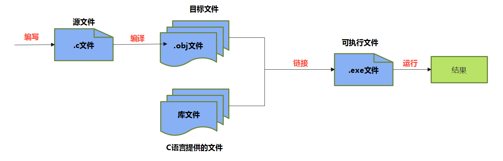
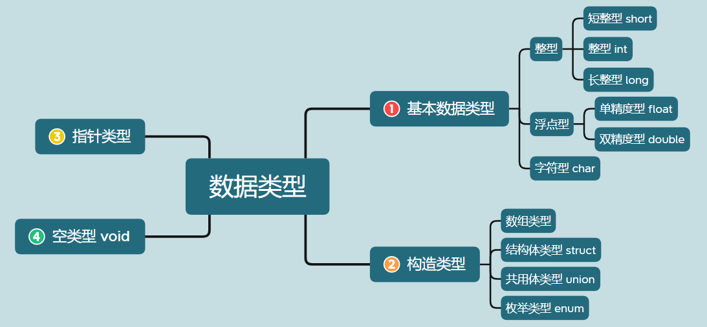

# 一、概述

## 1、概述

C 语言能够直接对硬件进行操作、管理内存、跟操作系统对话，这使得它是一种非常接近底层的语言，非常适合写需要跟硬件交互、有极高性能要求的程序

## 2、C语言的版本选择

随着微型计算机的日益普及，出现了许多C语言版本。

**版本1：K＆R C**

K&R C 指的是 C 语言的原始版本。1978年，C 语言的发明者布莱恩·柯林（Brian Kernighan）和丹尼斯·里奇（Dennis Ritchie）合写了一本著名的教材《C 编程语言》（The C programming language）。

由于 C 语言还没有成文的语法标准，这本书就成了公认标准，以两位作者的姓氏首字母作为版本简称“K&R C”。

**版本2：ANSI C（又称 C89 或 C90）**

C 语言的原始版本非常简单，对很多情况的描述非常模糊，加上 C 语法依然在快速发展，要求将 C 语言标准化的呼声越来越高。

1989年，美国国家标准协会（ANSI）制定了一套 C 语言标准，并于次年被国际标准化组织（ISO）通过。它被称为“ANSI C”，也可以按照发布年份，称为“C89 或 C90”。

**版本3：C99**

C 语言标准的第一次`大型修订`，发生在1999年，增加了许多语言特性，比如双斜杠（ // ）的注释语法，可变长度数组、灵活的数组成员、复数、内联函数和指定的初始值设定项。这个版本称为 C99，`是目前最流行的 C 版本`。

**版本4：C11**

2011年，标准化组织再一次对C 语言进行修订，增加了_Generic、static_assert 和原子类型限定符。这个版本称为C11。

> 需要强调的是，修订标准的原因不是因为原标准不能用，而是需要跟进新的技术。

**版本5：C17**

C11 标准在2017年进行了修补，但发布是在2018年。新版本只是解决了 C11 的一些缺陷，没有引入任何新功能。这个版本称为 C17。

**版本6：C23**

2023年预计发布，计划进一步增强安全性，消除实现定义的行为，引入模块化语言概念等新特性，使C语言在安全和可靠性方面有重大提高。

## 3、C语言编译器

C 语言是一种`编译型语言`，源码都是`文本文件`，本身无法执行。必须通过编译器，生成二进制的可执行文件，才能执行。

目前，最常见的 C 语言编译器是自由软件基金会推出的 `GCC 编译器`，可以免费使用。Linux 和 Mac 系统可以直接安装 GCC，Windows 系统可以安装 `MinGW`。

> 补充知识：MinGW和GCC的区别：
>
> GCC是一个跨平台的编译器集合，可用于多种操作系统和处理器架构，包括Windows；而MinGW是GCC在Windows平台上的移植版本，主要用于在Windows上本地编译C和C++代码。

GCC编译：
- **GCC 的 -o 参数（output 的缩写）可以指定编译产物的文件名。**
  ```
  > gcc -o Hello Hello.c
  ```
- **GCC 的 `-std= 参数`（standard 的缩写）还可以指定按照哪个 C 语言的标准进行编译。**
  ```
  > gcc -std=c99 Hello.c
  ```
  上面命令指定按照 C99 标准进行编译。

## 4、在线开发

- [CodingGround](https://tutorialspoint.com/compile_c_online.php)
- [OnlineGDB](https://onlinegdb.com/online_c_compiler)
- [Lightly](https://cde2f3ce.lightly.teamcode.com/)

## 5、C语言运行机制



## 6、输出

printf()标准格式

```c
printf(格式控制字符串,输出列表);
```
其中，
- `"格式控制字符串"`是用双引号括起来的一个字符串。包括：
  - 普通字符：普通字符即需要在输出时原样输出的字符。
  - 占位符：由“%”和格式字符组成。这个位置可以用其它值代入。
- `"输出列表"`是程序需要输出的一些数据，可以是常量、变量或表达式。用于替换占位符的位置。

> 注意：printf() 参数与占位符是一一对应关系。如果参数个数少于对应的占位符， printf() 可能会输出内存中的任意值。

**占位符**
占位符的第一个字符是 `%` ，第二个字符表示占位符的类型。

printf() 的占位符有许多种类，与 C 语言的数据类型相对应。

下面按照字母顺序，列出占位符如下，方便查阅(红色为常用的)：
> %a ：浮点数(仅C99有效)
> %A ：浮点数(仅C99有效)
> **%c ：char型数据**
> **%d ：十进制整数(int)**
> %e ：使用科学计数法的浮点数，指数部分的 e 为小写
> %E ：使用科学计数法的浮点数，指数部分的 E 为大写
> %i ：整数，基本等同于 %d 
> **%f ：浮点数(float)**
> %g ：6个有效数字的浮点数。整数部分一旦超过6位，就会自动转为科学计数法，指数部分的 e 为小写
> %G ：等同于 %g ，唯一的区别是指数部分的 E 为大写
> %hd ：十进制 short int 类型
> %ho ：八进制 short int 类型
> %hx ：十六进制 short int 类型
> %hu ：unsigned short int 类型
> **%ld ：十进制整数(long)**
> %lo ：八进制 long int 类型
> %lx ：十六进制 long int 类型
> %lu ：unsigned long int 类型
> %lld ：十进制 long long int 类型
> %llo ：八进制 long long int 类型
> %llx ：十六进制 long long int 类型
> %llu ：unsigned long long int 类型
> %le ：科学计数法表示的 long double 类型浮点数
> **%lf ：十进制浮点数(double)**
> %n ：已输出的字符串数量。该占位符本身不输出，只将值存储在指定变量之中
> %o ：八进制整数
> **%p ：指针**
> **%s ：字符串**
> **%u ：十进制无符号整数（unsigned int）**
> %x ：十六进制整数
> %zd ： size_t 类型
> %% ：输出一个百分号

# 二、变量与进制

## 1、关键字(keyword)

传统的C语言（ANSI C）有32个关键字。如下：

| 类型                    | 具体关键字                                                   |
| ----------------------- | ------------------------------------------------------------ |
| 控制语句关键字（12 个） | break, case, continue, default, do, else, for, goto, if, return, switch, while |
| 数据类型关键字（12 个） | char, enum, double, long, float, int, short, signed, struct, unsigned, union, void |
| 存储类型关键字（4 个）  | auto, extern, register, static                               |
| 其他关键字（4 个）      | const, sizeof, typedef, volatile                             |

后续，1999年，C99标准增加了5个关键字：`inline`、`restrict`、`_Bool`、`_Complex`和`_Imaginary`。

2011年，C11标准又增加了7个关键字：`_Alignas`、`_Alignof`、`_Atomic`、`_Static_assert`、`_Noreturn`、`_Thread_local`和`_Generic`。

> 说明：
> 1、ANSI C、C99和C11，它们之间差别并不大，在大多数情况下，它们都是和谐共处的。

## 2、标识符(Identifier)

**标识符的命名规则**
- 只能由26个英文字母大小写，0-9 或 _ 组成
- 数字不可以开头
- 不可以是关键字，但可以包含关键字
- C99和C11允许使用更长的标识符名，但是编译器只识别前63个字符。(会忽略超出的字符)
- 不允许有空格。
- 严格区分大小写字母。比如：Hello、hello是不同的标识符。

**标识符的命名建议**（建议遵守的`软性要求`）
- 在起名字时，为了提高阅读性，要尽量有意义，“见名知意”。如：sum，name，max，year，total 等。
- 不要出现仅靠大小写区分不同的标识符。如：name、Name 容易混淆
- 尽量避免名字中出现数字编号，如value1、value2等，除非逻辑上需要编号。
- 习惯上，所有宏定义、枚举常数、常量(只读变量)全用大写字母命名，用下划线分隔单词。

  比如： `const double TAX_RATE = 0.08; //TAX_RATE 只读变量`

- 系统内部使用了一些下划线开头的标识符（比如两个下划线开头的变量名、一个下划线 + 大写英文字母开头的变量名）。比如，C99 标准添加的类型 `_Bool`。为防止冲突，建议用户尽量避免使用下划线开头的标识符。
- 下划线通常用于连接一个比较长的变量名。如：max_classes_per_student。
- 变量名、函数名：多单词组成时，第一个单词首字母小写，第二个单词开始每个单词首字母大写：xxxYyyZzz (驼峰法，小驼峰)。比如：`short stuAge = 20; `，`tankShotGame`。 

## 3、变量

### 3.1、概述

使用变量注意：
- C语言中每个变量必须先声明，后使用。
- 不同的数据类型，占用的空间大小不一样。
- 一旦声明，变量的类型就不能在运行时修改。

```c
数据类型  变量名;  //声明变量的语句必须以分号结尾
```
变量声明时，就为它分配内存空间，但是不会清除内存里面原来的值。这导致声明变量以后，变量会是一个随机的值。所以，变量一定要赋值以后才能使用。

> 注意：声明变量以后，不用忘记初始化赋值！定义变量时编译器并不一定清空了这块内存，它的值可能是无效的数据，运行程序，会异常退出。

### 3.2、变量的作用域(scope)

- 变量的作用域：其定义所在的一对{ }内。
- 变量只有在其`作用域`内才有效。出了作用域，变量不可以再被调用。
- 同一个作用域内，不能定义重名的变量。

- C 语言的变量作用域主要有两种：文件作用域（file scope）和块作用域（block scope）。


`文件作用域（file scope）`指的是，在源码文件顶层声明的变量，从声明的位置到文件结束都有效。

```c
int x = 1;
int main() {
	printf("%d\n", x);
    return 0;
}
```

`块作用域（block scope）`指的是由大括号（ {} ）组成的代码块，它形成一个单独的作用域。凡是在块作用域里面声明的变量，只在当前代码块有效，代码块外部不可见。

```c
int main() {
    int m = 10;
    if (m == 10) {
        int n = 20;
        printf("%d %d\n", m, n);  // 10 20
    }
    printf("%d\n", m);  // 10
    printf("%d\n", n);  // 超出作用域，报错
    
    return 0;
}
```

最常见的块作用域就是函数，函数内部声明的变量，对于函数外部是不可见的。 for 循环也是一个块作用域，循环变量只对循环体内部可见，外部是不可见的。

```c
for (int i = 0; i < 10; i++){
	printf("%d\n", i);
}
printf("%d\n", i); // 超出作用域，报错
```

### 3.3、变量类型


C 语言中的变量按照数据类型分为：



> 注意1：这里列举的是C语言的常用类型，后续C语言版本还有新增的类型。
>
> 注意2：空类型：void 表示空类型（无类型）。通常应用于函数的返回值类型、函数的参数、指针类型。
>
> 注意3：在C语言中，没有`字符串类型`，使用字符数组表示字符串。

## 4、基本数据类型

### 4.1、整数类型

#### 4.1.1、类型概述

C语言规定了如下的几类整型：短整型(short)、整型(int)、长整型(long)、更长的整型(long long)

每种类型都可以被 signed 和unsigned 修饰。其中，
- 使用 `signed 修饰`，表示该类型的变量是带符号位的，有正负号，可以表示负值。`默认是signed`。
- 使用 `unsigned 修饰`，表示该类型的变量是不带符号位的，没有有正负号，只能表示零和正整数。

大小：
- bit(位)：计算机中的最小存储单位。
- byte(字节)：计算机中基本存储单元。

1byte = 8bit
| 类型        | 修饰符   | 占用空间       | 取值范围                                                   |
| ----------- | -------- | -------------- | ---------------------------------------------------------- |
| short [int] | signed   | 2个字节(=16位) | -32768 ~ 32767 (-$2^{15}$ ~ $2^{15}$-1)                    |
| short [int] | unsigned | 2个字节(=16位) | 0 ~ 65535  (0 ~ $2^{16}$-1)                                |
| int         | signed   | 通常4个字节    | -2147483648 ~ 2147483647 (-$2^{31}$ ~ $2^{31}$-1)          |
| int         | unsigned | 通常4个字节    | 0 ~ 4294967295  (0 ~ $2^{32}$-1)                           |
| long [int]  | signed   | 4个或8个字节   | 4字节时：-2147483648 ~ 2147483647 (-$2^{31}$ ~ $2^{31}$-1) |
| long [int]  | unsigned | 4个或8个字节   | 4字节时：-0 ~ 4294967295  (0 ~ $2^{32}$-1)                 |

long long int是`C99新增`的：

| 类型            | 修饰符   | 占用空间       | 取值范围                                                     |
| --------------- | -------- | -------------- | ------------------------------------------------------------ |
| long long [int] | signed   | 8个字节(=64位) | -9223372036854775808~ 9223372036854775807(-$2^{63}$ ~ $2^{63}$-1) |
| long long [int] | unsigned | 8个字节(=64位) | 0 ~ 18446744073709551615(0 ~ $2^{64}$-1)                     |

**说明1：** 不同计算机的 int 类型的大小是不一样的。比较常见的是使用4个字节（32位）存储一个 int 类型的值，具体情况如下：

| 类型          | 16位编译器 | 32位编译器 | 64位编译器 |
| ------------- | ---------- | ---------- | ---------- |
| short int     | 2字节      | 2字节      | 2字节      |
| int           | 2字节      | 4字节      | 4字节      |
| unsigned int  | 2字节      | 4字节      | 4字节      |
| long          | 4字节      | 4字节      | 8字节      |
| unsigned long | 4字节      | 4字节      | 8字节      |
| long long     | 8字节      | 8字节      | 8字节      |

**说明2**： C标准虽然没有具体规定各种类型数据所占用存储单元的长度，但几条铁定的原则（ANSI/ISO制订的）：
- ① sizeof(short int) ≤ sizeof(int) ≤ sizeof(long int) ≤ sizeof(long long)，具体由各编译系统自行决定的。其中，sizeof是测量类型或变量长度的运算符。
- ② short int至少应为2字节，long int至少应为4字节。

这样约定的好处就是使得C语言可以长久使用。`现在的主流CPU是64位`，可以预测不久的将来会推出128位甚至256位的CPU，但是在C语言刚刚出现的时候，CPU还是以8位和16位为主。

**说明3：**
- 最常用的整型类型为：int类型。
- 整数型常量，默认为int类型。

#### 4.1.2、Long类型

编译器将一个整数字面量指定为 int 类型，但是如果希望将其指定为 long 类型，需要在该字面量末尾加上后缀 `l` 或 `L` ，编译器会把这个字面量的类型指定为 long 。
```c
long x = 123L; //或者写成 123l
```
如果希望字面量指定为long long类型，则后缀以`ll`或`LL`结尾。
```c
long long y = 123LL;
```
如果希望指定为无符号整数 unsigned int ，可以使用后缀 `u` 或 `U` 。
```c
unsigned int x = 123U;
```
L 和 U 可以结合使用，表示 unsigned long 类型。 L 和 U 的大小写和组合顺序无所谓。

u 还可以与其他整数后缀结合，放在前面或后面都可以，比如 10UL 、 10ULL 和 10LLU 都是合法的。
```c
unsigned long int      x = 1234UL;
unsigned long long int x = 1234ULL;
```

#### 4.1.3、精确宽度类型

C 语言的整数类型（short、int、long）在不同计算机上，占用的字节宽度可能是不一样的，无法提前知道它们到底占用多少个字节。程序员有时控制准确的字节宽度，这样的话，代码可以有更好的可移植性，头文件 stdint.h 创造了一些新的类型别名。

**精确宽度类型(exact-width integer type)**：保证某个整数类型的宽度是确定的。
- int8_t ：8位有符号整数
- int16_t ：16位有符号整数
- int32_t ：32位有符号整数
- int64_t ：64位有符号整数
- uint8_t ：8位无符号整数
- uint16_t ：16位无符号整数
- uint32_t ：32位无符号整数
- uint64_t ：64位无符号整数

上面这些都是类型别名，编译器会指定它们指向的底层类型。比如，某个系统中，如果 int 类型为32位， int32_t 就会指向 int ；如果 long 类型为32位， int32_t 则会指向 long 。
```c
#include <stdio.h>
#include <stdint.h>
int main() {
	int32_t x32 = 45933945;  //变量 x32 声明为 int32_t 类型，可以保证是32位的宽度。
	printf("x32 = %d\n", x32);
	return 0;
}
```

#### 4.1.4、整型的极限值

有时候需要查看，当前系统不同整数类型的最大值和最小值，C 语言的头文件 `limits.h` 提供了相应的常量。比如：INT_MIN 代表 signed int 类型的最小值 -2147483648， INT_MAX 代表 signed int 类型的最大值 2147483647。

```c
#include <limits.h>

int main() {
    printf("%d\n", INT_MIN  );  // -2147483648
    printf("%d\n", INT_MAX  );  // 2147483647
    return 0;
}
```
为了代码的可移植性，需要知道某种整数类型的极限值时，应该尽量使用这些常量。
- SCHAR_MIN ， SCHAR_MAX ：signed char 的最小值和最大值。
- SHRT_MIN ， SHRT_MAX ：short 的最小值和最大值。
- INT_MIN ， INT_MAX ：int 的最小值和最大值。
- LONG_MIN ， LONG_MAX ：long 的最小值和最大值。
- LLONG_MIN ， LLONG_MAX ：long long 的最小值和最大值。
- UCHAR_MAX ：unsigned char 的最大值。
- USHRT_MAX ：unsigned short 的最大值。
- UINT_MAX ：unsigned int 的最大值。
- ULONG_MAX ：unsigned long 的最大值。
- ULLONG_MAX ：unsigned long long 的最大值。

### 4.2、浮点数


# 二、基本语法

预编译：`gcc -E constant.c -o output.c`

clion可以写多个可执行c文件：
```
cmake_minimum_required(VERSION 3.10.2)

get_filename_component(ProjectId ${CMAKE_CURRENT_SOURCE_DIR} NAME)
string(REPLACE " " "_" ProjectId ${ProjectId})
project(${ProjectId} C)

set(CMAKE_C_STANDARD 11)

file(GLOB files "${CMAKE_CURRENT_SOURCE_DIR}/*.c")
foreach(file ${files})
    get_filename_component(name ${file} NAME)
    add_executable(${name} ${file})
endforeach()
```

## 函数

### 函数定义

C语言的函数如果不需要任何参数，定义函数时参数列表写个void即可，否则表示不确定有几个参数，且函数声明必须在调用之前
```c
void func(){
} 
void func1(void){
} 
int main(){
    func();
    func(1);// 这样调用也能成功
    func1();
    func1(1); // 这样会报错
    return 0;
}
```

### 函数变长参数

```c
int printf(const char * const _Format, ...); // ... 表示变长参数
```
如何获取变长参数的值呢？
```c
#include <stdio.h>
#include <stdarg.h>

void HandleVarargs(int arg_count, ...) {
  va_list args; // ① 处定义 va_list 类型的变量 args，用于获取变长参数。
  int i;
  va_start(args, arg_count); // ② 处实际上是初始化 args 的值，这里同时需要变长参数前面的最后一个参数 arg_count
  for (i = 0; i < arg_count; ++i) {
    int arg = va_arg(args, int); // ③ 处则是在知道了变长参数的位置之后按照类型一个一个取出参数
    printf("%d: %d\n", i, arg);
  }
  va_end(args); // ④ 清理变长参数的读取工作
}
int main(int argc, char **argv) {
  HandleVarargs(3, 100, 200, 300);
  return 0;
}
```
使用 va_start, va_arg, va_end 这些宏需要导入 stdarg.h 这个头文件；va_list 就像叫号器一样，变长参数从 va_start 之后开始叫号，va_arg 就是叫号过程

## 作用域

static 变量具备文件作用域
```c
void LocalStaticVar(void) {
  // 静态变量
  // 1. 作用域全局，内存不会因函数退出而销毁
  // 2. int 初值默认为 0
  static int static_var;
  // 自动变量
  // 1. 函数、块作用域，随着函数和块退出而销毁
  // 2. 没有默认初值
  int non_static_var;

  printf("static var: %d\n", static_var++);
  printf("non static var: %d\n", non_static_var++);
}
```

## 文件包含

- `#include "xxx.h"`：首先查找当前源文件所在路径；找不到，再次查找工程的头文件搜索路径；
- `#include <..h>`：查找工程的头文件搜索路径；

如果想自己定义的目录也加到工程目录下，可以在CMakeLists.txt文件中加入如下代码：
```
....
include_directories("include")
....
```
这样在使用的时候就可以直接使用：`#include <xxx.h>`；引用用户头文件，只能使用 `#include ""`。

## 自定义头文件

比如自定义一个阶乘函数

（1）首先新建两个文件夹：include、src

（2）在include目录下新建head文件：factorial.h，有如下内容：
```h
#ifndef C_LEARNING_1_INCLUDE_FACTORIAL_H_
#define C_LEARNING_1_INCLUDE_FACTORIAL_H_

unsigned int Factorial(unsigned int n);

unsigned int FactorialByIteration(unsigned int n);

#endif //C_LEARNING_1_INCLUDE_FACTORIAL_H_
```
（3）在src新建文件factorial.c，就是阶乘的实现
```c
#include "../include/factorial.h"
unsigned int Factorial(unsigned int n) {
  if (n == 0) {
    return 1; // f(0) = 1
  } else {
    return n * Factorial(n - 1); // f(n) = nf(n - 1)
  }
}
unsigned int FactorialByIteration(unsigned int n) {
  unsigned int result = 1;
  for (unsigned int i = n; i > 0; --i) {
    result *= i;
  }
  return result;
}
```
（4）如果需要使用该函数，可以按照如下方式引入：
```c
#include "include/factorial.h"
```

## 宏函数

### 基本介绍

“宏函数”，仍然在预处理过程中实现对源文件的替换，但不同之处在于它可以接受参数，因此看起来更像函数
```c
#define MAX(a, b) a > b ? a : b
```
使用的时候就直接像调用函数那样就可以了：
```c
int max = MAX(1, 3); 
```
编译之后替换为：
```c
int max = 1 > 3 ? 1 : 3;
```
需要注意的几个问题：
  - **参数的问题**：与函数不同，宏函数的参数是直接把原始的表达式替换到宏定义当中的，而函数则是先把表达式的值求出来，再把值传入函数，因此对于下面看上去没有什么问题的语句：
  ```c
  int max = MAX(1, MAX(3, 10));
  // 其编译替换的结果如下，下面这个表达式是无法正常工作的
  int max = 1 > 3 > 10 ? 3 : 10 ? 1 : 3 > 10 ? 3 : 10;
  ```
  建议尽量不要用复杂的表达式作为宏函数的参数，不过有些时候这是不能避免的，因此我们为了避免宏函数的参数在替换之后被拆散，要给宏函数的参数加括号：
  ```c
  #define MAX(a, b) (a) > (b) ? (a) : (b)
  // 上述
  int max = MAX(1, MAX(3, 10));
  // 其编译替换的结果如下，下面这个表达式是无法正常工作的
  int max = 1 > (3 > 10 ? 3 : 10;) ? (1 : 3 > 10 ? 3 : 10;);
  ```
  分号导致整个语句被切割成了几条语句，这自然是不符合预期的，因此定义宏时通常不加分号。如果要加分号，也要控制好使用场景

- **宏函数的参数的参数可能会多次求值，这与函数的参数的行为不同**
  ```c
  int a = 0;
  int b = 3;
  int max = MAX(a, b++);
  // 宏替换后得到代码
  int a = 0;
  int b = 3;
  int max = a > b++ ? a : b++;
  ```
  因此，不要将有副作用的表达式作为宏函数的参数。

宏函数是不能换行的，如果确实需要换行，可以按照如下写法：
```c
#define  IS_HEX_CHARACTER(ch) \
  (((ch) >= '0' && (ch) <= '9') || \
  ((ch) >= 'A' && (ch) <= 'F') || \
  ((ch) >= 'a' && (ch) <= 'f') )
```

### 宏函数与函数对比

| 属性         | 宏                                                           | 函数                                                         |
| :----------- | :----------------------------------------------------------- | :----------------------------------------------------------- |
| 代码长度     | 每次使用时，宏代码都被插入到程序中。除了非常小的宏之外，程序的长度将大幅度增长 | 函数代码只出现于一个地方；每次使用这个函数时，调用用那个地方的用一份代码 |
| 操作符优先级 | 宏参数的求值在所有周围表达式的上下文环境里，除非加上括号，否则邻近的操作符优先级可能会产生不可预料的结果 | 函数参数只在函数调用时求值一次，它的结果值传递给函数。表达式的求值结果更容易预测 |
| 参数求值     | 参数每次用于宏定义时，它们 都将重新求值。由于多次求值，具有负作用域的参数可能产生不可预料的结果 | 参数在函数被调用前只求值一次。在函数中多次使用并不会导致多次求值的问题，参数的副作用不会造成任何特殊的问题 |
| 参数类型     | 宏与类型无关。只要对参数的操作是合法的，它可以适用于任何参数 | 函数的参数是与类型有关的。如果参数的类型不同，就需要使用不同的函数，即使它们执行的任务是相同的 |

### 常见其他宏函数

- `__FILE__` ：预处理时替换为源文件的路径。
- `__LINE__` ：预处理时替换为源代码所在源文件的行号。
- `__FUNCTION__` ：编译后替换为源代码所在的函数名，或者指向函数名的字符串变量，取决于具体的编译器实现。不同于前面的两个宏，由于代码所在函数只要在编译过程中才能解析得到，因此这个宏不会在预处理过程中完成替换
- `__VA_ARGS__`：替代变长参数，`##__VA_ARGS__`，其实 ## 的作用是用于变长参数没有对应的参数传入的情况下，去除前面的逗号的，如果不加 ##，可能在某些编译器下会报错；
- `#value`，比如定义一个变量宏，那么这个`#value`获得变量的名作为运行时的字符串内容

### 练习

自定义一个带换行符的打印函数
```c
#include <stdio.h>
#include <stdarg.h>
// 这是使用函数的方式，通过编程函数来处理
void Printlnf(const char *format, ...) {
  va_list args;
      va_start(args, format);
  vprintf(format, args);
  printf("\n");
      va_end(args);
}
// 这里使用宏来操作
#define PRINTLNF(format, ...) printf("("__FILE__":%d) %s : "format"\n",__LINE__, __FUNCTION__, ##__VA_ARGS__)
// 定义打印变量名的宏
#define PRINT_INT(value) PRINTLNF(#value": %d", value)
int main() {
  int value = 2;
  Printlnf("Hello World! %d", value);
  PRINTLNF("Hello World! %d", value);
  PRINTLNF("Hello World!");
  PRINT_INT(value); // value: 2
  int x = 3;
  PRINT_INT(x);
  PRINT_INT(3 + 4);
  return 0;
}
```

## 条件编译

### 条件宏

比如前面定义的头文件factorial.h，包含如下代码：
```h
#ifndef C_LEARNING_1_INCLUDE_FACTORIAL_H_
#define C_LEARNING_1_INCLUDE_FACTORIAL_H_

#endif //C_LEARNING_1_INCLUDE_FACTORIAL_H_
```
上面这些都是宏，其中：
- `#ifndef`：表示判断如果没有定义某个宏，在这里就是说如果没有定义 C_LEARNING_1_INCLUDE_FACTORIAL_H_ 这个宏，那么就执行下面的代码。
- `#endif`：很明显与 `#ifndef` 是配对的，表示这个条件判断的有效范围。

上面这三句话的目的是：避免头文件重复被包含，除了 *.c 文件可以包含头文件以外，头文件本身也是可以包含其他头文件的，因为头文件与 *.c 本身没有什么不同，只是我们在代码设计的时候为了方便模块之间的引用而专门用头文件来编写声明，用源文件来编写实现。既然头文件可以互相包含，那难免会导致对某些头文件的重复包含

条件编译有如下三种写法：
```
#ifdef 如果定义了
#ifndef 如果没定义
#if 如果 ...
```

### 使用场景

条件宏有一个很好的使用场景，那就是判断当前程序是否运行在 DEBUG 模式下来决定是否执行某些用于调试的代码
```c
#include <stdio.h>

int main() {
#if DEBUG
  printf("[DEBUG]main start.\n");
#endif
  printf("main run ---> \n");

#if DEBUG
  printf("[DEBUG]main end.\n");
#endif
  return 0;
}
```
如果我们不希望输出调试的日志，就把 DEBUG 这个宏的值改为 0 就好了，DEBUG 这个宏的定义也可以在代码编译的时候通过编译器参数来指定，在我们的 CLion 工程中的 CMakeList.txt 当中添加下面的代码即可编译出 DEBUG 版本的程序：
```
...
target_compile_definitions(BasicC PUBLIC DEBUG=1) # 加这一句 
...
```

条件编译还有一个比较有用的地方，就是判断当前 C 语言编译环境，最常用的莫过于判断当前是 C 编译器还是 C++ 编译器了：
```c
#ifdef __cplusplus
extern "C" {
#endif
... // 定义 C 接口函数和变量
#ifdef __cplusplus
}
#endif
```
条件编译还支持 else if 类似的分支，例如判断当前 C 语言的编译器版本，这里会用到一些内置的宏定义：
```c
#include <stdio.h>
int main() {
  #if __STDC_VERSION__ >=  201710L
    printf("We are using C18!\n");
  #elif __STDC_VERSION__ >= 201112L
    printf("We are using C11!\n");
  #elif __STDC_VERSION__ >= 199901L
    printf("We are using C99!\n");
  #elif defined(__STDC__)
    printf("We are using C89/C90!\n");
  #else
    printf("We are using non-std C!\n");
  #endif
  return 0;
}
```

## 数组

C语言不会判断数组是否越界

数组作为参数传递到函数中，同时需要传递数组的长度，数组作为参数仅仅传递是首地址；

```c
int array[] = {0, 1, 2, 3, 4};
int *p = array;
PRINT_INT(*(p + 3));// recommend
PRINT_INT(*(array + 3));
PRINT_INT(*(3 + array));
PRINT_INT(3[array]); // not recommend
PRINT_INT(array[3]); //recommend
PRINT_INT(p[3]);
```

## 字符串

c的字符串是已NULL结尾的

# 二、指针

## 特殊指针

- 不要将硬编码复制给指针，比如：`int *p = (int *)3`
- 空指针 NULL 的用法，比如：`int *p = NULL;`，后面 `*p = 3;`会报错；
- 注意避免产生野指针
  ```c
  int *p;
  void dp(){
    int a = 2;
    p = &a;
  }
  ```
  上面指针p在函数dp执行完之后指向的内存已经被销毁了；

## 指针运算

```c
int array[] = {0, 1, 2, 3, 4};
int *p = array;
PRINT_INT(*(p + 3));// recommend
PRINT_INT(*(array + 3));
PRINT_INT(*(3 + array));
PRINT_INT(3[array]); // not recommend
PRINT_INT(array[3]); //recommend
PRINT_INT(p[3]);
```

# C语言与汇编和机器码

将C的源代码打印出汇编代码和机器码，只需要执行如下两个命令：
```
$ gcc -g -c test.c
$ objdump -d -M intel -S test.o // test.c 通过 gcc 生成的文件
```

# 参考资料

- [C在线编译](https://godbolt.org/)
- [Learn C language](https://www.learn-c.org/)
- [C program](https://www.programiz.com/c-programming/c-variables-constants)
