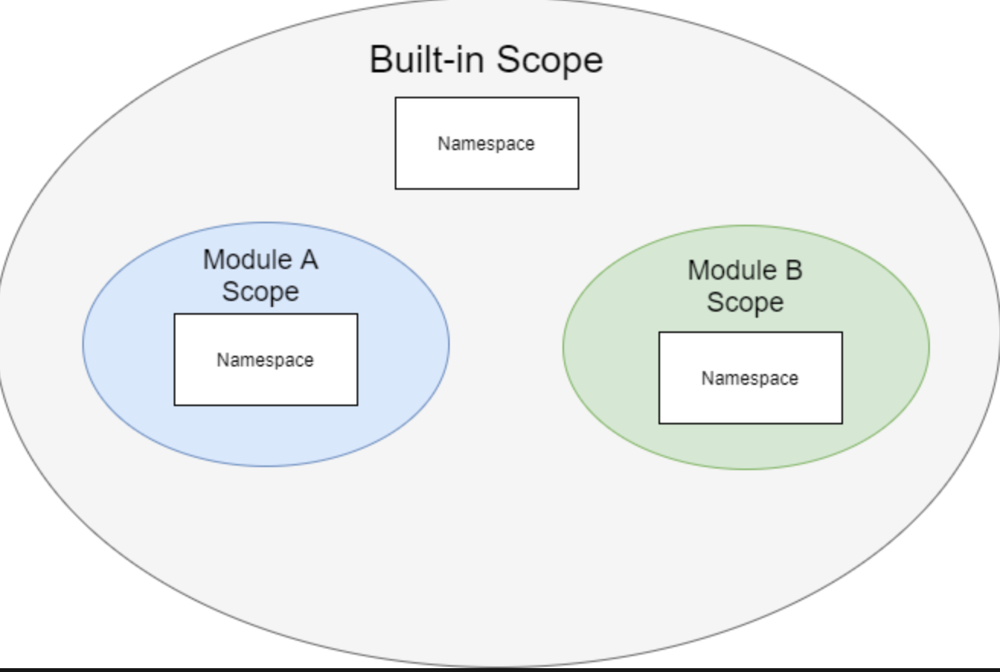
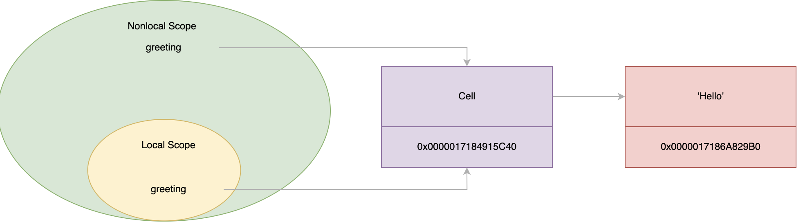

# 一、变量与内存管理

## 1、引用

变量引用一个保存值的对象。换句话说，变量是引用；变量是指向内存中对象的引用：
```py
counter = 100
```
要查找变量引用对象的内存地址，可将变量传递给内置 id() 函数：
```py
counter = 100
print(id(counter)) # 140717671523072
```
id() 是按照十进制返回的，要将内存地址转换为十六进制字符串，可以使用函数 hex()：
```py
print(hex(id(counter))) # 0x7ffb62d32300
```

内存地址中的对象可以有一个或多个引用，一旦对象没有任何引用，Python 内存管理器将销毁该对象并回收内存；（一旦对象的引用计数为零，内存管理器就会销毁该对象并收回内存。）

要获取对象的引用次数，可以使用 ctypes 模块的 from_address()方法。：
```py
ctypes.c_long.from_address(address).value
```
要使用此方法，需要传递要计算引用次数的对象的内存地址。此外，地址必须是整数：
```py
import ctypes
def ref_count(address):
    return ctypes.c_long.from_address(address).value
```
示例：
```py
import ctypes
def ref_count(address):
    return ctypes.c_long.from_address(address).value
numbers = [1, 2, 3]
numbers_id = id(numbers)

print(ref_count(numbers_id))  # 1

ranks = numbers
print(ref_count(numbers_id))  # 2

ranks = None
print(ref_count(numbers_id))  # 1

numbers = None
print(ref_count(numbers_id))  # 0
```

## 2、GC

不过，引用计数并非在所有时候都能正常工作。例如，当一个对象引用自身或两个对象相互引用时。这就会产生循环引用；

Python 允许您通过内置的 gc 模块与垃圾回收器交互，主要通过 gc 模块解决循环引用问题

看如下示例：
```py
import gc
import ctypes
def ref_count(address):
    return ctypes.c_long.from_address(address).value
def object_exists(object_id):
    for object in gc.get_objects():
        if id(object) == object_id:
            return True
    return False
class A:
    def __init__(self):
        self.b = B(self)
        print(f'A: {hex(id(self))}, B: {hex(id(self.b))}')
class B:
    def __init__(self, a):
        self.a = a
        print(f'B: {hex(id(self))}, A: {hex(id(self.a))}')
# disable the garbage collector
gc.disable()

a = A()

a_id = id(a)
b_id = id(a.b)

print(ref_count(a_id))  # 2
print(ref_count(b_id))  # 1

print(object_exists(a_id))  # True
print(object_exists(b_id))  # True

a = None
print(ref_count(a_id))  # 1
print(ref_count(b_id))  # 1

print(object_exists(a_id))  # True
print(object_exists(b_id))  # True

# run the garbage collector
gc.collect()

# check if object exists
print(object_exists(a_id))  # False
print(object_exists(b_id))  # False

# reference count
print(ref_count(a_id))  # 0
print(ref_count(b_id))  # 0
```

## 3、动态类型

Python是一种动态类型语言。在Python中声明变量时，不需要为它指定类型；
```py
message = 100
```
在 Python 中，message变量只是对字符串对象的引用。message 变量没有相关的类型。要确定变量当前引用的对象类型，可以使用 type() 函数：
```py
message = 'Hello'
print(type(message))
```

## 4、可变与不可变

在 Python 中，一切都是对象。对象有自己的内部状态。有些对象允许您改变其内部状态，有些则不允许。内部状态可变的对象称为可变对象，内部状态不可变的对象称为不可变对象；

以下都是不可变对象：
- Numbers (int, float, bool,…)
- Strings
- Tuples
- Frozen sets

以下是可变对象：
- Lists
- Sets
- Dictionaries

## 5、is运算符

is 运算符比较两个变量，如果它们引用的是同一个对象，则返回 True。如果两个变量引用了不同的对象，则 is 运算符返回 False。换句话说，is 运算符比较两个变量的同一性，如果它们引用的是同一个对象，则返回 True。
```py
a = 100
b = 100

result = a is b
print(result) # True，但是不一定，这个示例的结果可能会有所不同，这取决于 Python 内存管理器是如何实现的
```

**`is` vs `==`**：相等运算符 `(==)` 比较两个变量是否相等，如果相等则返回 True。否则返回 False
```py
a = 100
b = a

is_identical = a is b
is_equal = a == b

print(is_identical) # True
print(is_equal) # True
```
list中如果元素一样，那么 == 比较返回True
```py
ranks = [1, 2, 3]
rates = [1, 2, 3]

is_identical = ranks is rates
is_equal = ranks == rates

print(is_identical) # False
print(is_equal) # True
```

**`is not`运算符**

要否定 `is` 操作符，可以使用 `not` 操作符。如果两个变量引用同一个对象，`is not` 运算符返回 False。否则，返回 True：
```py
ranks = [1, 2, 3]
rates = [1, 2, 3]

result = ranks is not rates
print(result)  # True
```

## 6、None

在 Python 中，None 是 NoneType 类的一个特殊对象。要使用 None 值，可以按如下方式指定 None：
```py
None
print(type(None)) # <class 'NoneType'>
```
None 是 NoneType 类的单例对象。这意味着 Python 在运行时会创建一个且仅有一个 None 对象，因此，如果使用相等 (==) 或 is 运算符来比较 None 和 None，结果将是 True；所以在实践中使用 is 或 is not 操作符将一个值与 None 进行比较是一种好的做法；

还需要注意的是，None 对象具有以下功能：
- None 不等于零（0、0.0、......）。
- None 不等于 False。
- None 不等于空字符串（''）。
- 将 None 与任何值比较都会返回 False，除了 None 本身。

主要用途：
- 使用 None 作为变量的初始值；
- 使用 None 对象修复可变默认参数问题：
    ```py
    def append(color, colors=None):
        if colors is None:
            colors = []

        colors.append(color)
        return colors
    hsl = append('hue')
    print(hsl)
    rgb = append('red')
    print(rgb)
    ```
- 使用 None 对象作为函数的返回值；当函数没有返回值时，默认返回 None

# 二、数字类型

## 1、整数

整数是整数，包括负数、零和正数，如 -3、-2、-1、0、1、2、3。Python 使用类 int 来表示所有整数。所有整数都是对象；

Python 并不使用固定位数来存储整数。相反，Python 使用可变的位数来存储整数。例如，8 位、16 位、32 位、64 位、128 位，等等，Python 能表示的最大整数取决于可用内存。

另外，整数是对象。Python 需要为每个整数额外增加固定数量的字节作为开销。

值得注意的是，整数越大，"+"、"-"......等运算的速度就越慢。

```py
counter = 10
print(type(counter)) # <class 'int'>
```
要获取整数的大小，可以使用 sys 模块的 `getsizeof()` 函数：
```py
from sys import getsizeof
counter = 0
size = getsizeof(counter)
print(size)  # 24 bytes
```
因此，您可以认为 Python 使用 24 字节作为存储整数对象的开销。

整数的 `+` 、`-` 、`*` 、`**` 结果返回的都是整数，但是 除法（/） 返回的是 float

## 2、向下取整除

Python 使用两个运算符 `//` 和 `%` 来返回除法的结果：
```py
101 // 4 = 25 # 整除
101 % 4 = 1 # 取余数
```
`//` 被称 floor division 或 div。而 % 被称为模运算符或 mod
```py
101 = 4 * (101 // 4) + (101 % 4)
101 = 4 * 25         + 1
```
一般来说，如果 N 是分子，D 是分母，那么除法底层运算符和mod运算符总是满足以下等式：
```py
N = D * ( N // D) + (N % D)
```

实数的底数是小于或等于该数的最大整数：
```py
floor(3.4) = 4
floor(3.9) = 3
floor(3) = 3
```
对正数是上面的逻辑，但是对于负数来说：例如，根据下限定义，-3.4 的下限返回 -4，而不是 -3。同样，-3.9 的下限也返回 -4。

向下取整可以定义为：
```py
n // d = floor(n/d)
```

下表说明了两个整数 a 和 b 的 向下取整除法：
a	| b	| a // b
----|----|----
10	|3	|3
-10	|-3	|3
10	|-3	|-4
-10	|3	|-3

**`math.floor()`函数**

math模块的 floor() 函数返回两个整数的向下取整除法结果：
```py
from math import floor
a = 10
b = 3
print(a//b)  # 3
print(floor(a/b))  # 3
```
从输出中可以清楚地看到，floor() 函数返回的结果与 floor 除法运算符 (`//`) 返回的结果相同。负数也是如此

## 3、模运算

Python 使用百分号 (%) 作为模运算符。%运算符总是满足以下等式：
```py
N = D * ( N // D) + (N % D)
```
其中 N是分子，D 是分母

用途：
- 判断整数是否奇偶
- 使用模运算符转换单位，比如日期转换等：
```py
from math import floor
def get_time(total_seconds):
    return {
        'days': floor(total_seconds / 60 / 60 / 24),
        'hours': floor(total_seconds / 60 / 60) % 24,
        'minutes': floor(total_seconds / 60) % 60,
        'seconds': total_seconds % 60,
    }
print(get_time(93750))
```

## 4、bool类

bool类是int类的子类。这意味着bool类继承int类的所有属性和方法。此外，bool类具有与布尔操作相关的特定行为：
```py
is_child_class = issubclass(bool, int)
print(is_child_class) # True
```
事实上，True 和 False 都是 bool 类的单例对象：
```py
isinstance(True, bool) # True
isinstance(False, bool) # True
```
由于 True 和 False 也是 int 对象，因此可以将它们转换为整数：
```py
true_value = int(True)
print(true_value) # 1
false_value = int(False)
print(false_value) # 0
```
请注意，"True"和 "1"不是同一个对象。同样，"False"和 "0 "也不是同一个对象。

因为 True 和 False 是单例对象，在整个程序中始终引用内存中的相同对象;

当您向 bool() 构造函数传递一个对象时，Python 返回该对象的 `__bool__()` 方法的值。
```py
bool(200) 
# 实际执行的是：
200.__bool__()
```

如果对象的类没有 `__bool__()` 方法，Python 将返回 `__len__()` 方法的结果，如果 `__len__()`方法的结果为零，bool() 返回 False。否则，返回 True，这就是为什么空列表总是 False，而至少有一个元素的列表是 True 的原因；

最后，如果一个类没有 `__bool__()` 和 `__len__()` 方法，则该类的实例总是求值为 True

## 5、and操作符

Python 和运算符是一种逻辑运算符。通常，使用 and 运算符对布尔值进行运算并返回布尔值。

and是短路运算符，如果 and 前面返回 False，不管后面是 True 还是 False 都返回 False

## 6、or操作符

或运算符是一种逻辑运算符。通常，使用 or 运算符可以组合两个布尔表达式，并返回一个布尔值

`x or y`：如果 x 是真实的，那么 or 运算符就不需要对 y 进行求值，而是立即返回 x。这就是为什么这种求值方式被称为 "懒求值 "或 "短路求值"。在 Python 中，每个对象都与布尔值相关联。x 和 y 可以是任何对象。

or 操作符允许给一个变量赋默认值：
```py
var_name = value or default
```
如果 value是false，var_name 会给到 var_name 默认值

## 7、float

### 7.1、float类

Python 使用 float 类表示实数，Python float 使用 8 个字节（或 64 位）来表示实数。与整数类型不同，float 类型使用固定的字节数

Python 使用 64 位的情况如下：
- 1 位表示符号（正或负）
- 11 位表示指数 1.5e-5 1.5 x $10^5$（指数为-5），范围为 [-1022, 1023]。
- 52 位有效数字

例如，0.25 有两位有效数字，0.125 有三位有效数字，12.25 有四位有效数字:

$(1.25)_{10} = (1×2^0 + 0×2^{-1} + 1×2^-2)_{10} = (1.01)_2$

有些数字有有限的二进制表示法，但有些没有，例如 0.1。在二进制中是 01.0001100110011...。因此，Python 只能对这些数字使用近似的浮点表示法

如果将一个对象 (obj) 传递给 float(obj)，它将委托给 `obj.__float__()`。如果没有定义 `__float__()` ，它将返回到 `__index__()`；如果不给 float() 传递任何参数，它将返回 0.0

当您使用print()函数时，您将看到数字0.1被精确地表示为0.1。在内部，Python只能近似地表示0.1。要查看Python如何在内部表示0.1，可以使用`format()`函数：
```py
>>> format(0.1, '.20f')
'0.10000000000000000555'
```

float数字比较：
```py
x = 0.1 + 0.1 + 0.1
y = 0.3
print(x == y) # False
print(format(x, '.20f')) # 0.30000000000000004441
print(format(y, '.20f')) # 0.29999999999999998890
```
解决这个问题的一种方法是将等式的两边四舍五入到一个有效数字位数：
```py
x = 0.1 + 0.1 + 0.1
y = 0.3
print(round(x, 3) == round(y, 3)) # True
```
这种变通方法并非在所有情况下都有效； [PEP485](https://www.python.org/dev/peps/pep-0485/)提供的解决方案通过使用相对和绝对公差解决了这一问题，它提供了数学模块中的 `isclose()` 函数，如果两个数字相对接近，则返回 True：
```py
isclose(a, b, rel_tol=1e-9, abs_tol=0.0)
```
示例：
```py
from math import isclose
x = 0.1 + 0.1 + 0.1
y = 0.3
print(isclose(x,y))
```

### 7.2、float 转 int

将浮点数转换为整数时，会出现数据丢失。例如，20.3 可能变成 20 或 21，Python 在数学模块中提供了一些将浮点数转换为 int 的函数，包括：
- Truncation：函数 `trunc(x)` 返回数字 x 的整数部分。
    ```py
    from math import trunc
    print(trunc(12.2)) # 12
    print(trunc(12.5)) # 12
    print(trunc(12.7)) # 12
    ```
    同样，int() 构造函数接受浮点数，并使用截断法将浮点数转换为 int
- Floor：函数 `floor(x)` 返回小于或等于 x 的最大整数
    ```py
    from math import floor
    print(floor(12.2)) # 12
    print(floor(12.5)) # 12
    print(floor(12.7)) # 12
    ```
    对于正数，floor(x) 和 trunc(x) 返回相同的结果；但是对于负数是不同的：
    ```py
    from math import floor, trunc
    print(floor(-12.7)) # 13
    print(trunc(-12.7)) # 12
    ```
- ceiling：函数 ceil(x) 返回大于或等于 x 的最小整数
```py
# 正数
from math import ceil
print(ceil(12.7)) # 13
# 负数：
from math import ceil
print(ceil(-12.7)) # 12
```

### 7.3、四舍五入

四舍五入是指简化一个数字，但使其值接近原值。例如，89 四舍五入到最接近的十就是 90，因为 89 比 80 更接近 90。

在 Python 中，要对一个数字进行四舍五入，需要使用内置的 round() 函数：
```py
round(number [, ndigits])
```
函数 round() 将数字取整为最接近 10 位数的倍数，换句话说，round() 函数返回小数点后四舍五入到 ndigits 位精度的数字，如果省略 ndigits 或为无，round( ) 将返回最接近的整数：
```py
round(1.25) # 1
round(1.25, 0) # 1.0
```
如果 ndigits 是负数：
```py
round(15.5, -1)
```
由于 15.5 位于 10 和 20 之间（10 的倍数），因此更接近 20。因此，round() 函数返回 20。

当您对位于两个数字中间的数字进行四舍五入时，Python 无法找到最接近的数字。:
```py
round(1.25, 1)
```
在这种情况下，Python 使用 IEEE 754 标准进行四舍五入，即银行家四舍五入。在银行四舍五入法中，一个数字四舍五入到最接近的数值，并列时四舍五入到最小有效数字为偶数的数值。
> 一般来说，一个数字中最小的有效数字是最右边的数字。

银行家四舍五入法的原理是，从统计角度看，50% 的样本数四舍，50% 的样本数五入：
```py
round(1.25, 1) # 1.2
```

**如何从零开始四舍五入**

Python 并没有提供从 0 开始四舍五入的直接方法。

将一个数字从零四舍五入的常用方法是使用下面的表达式

函数 copysign() 返回 x 的绝对值，但不返回 y 的符号：
```py
from math import copysign
def round_up(x):
    return int(x + copysign(0.5, x))
```


## 8、Decimal

### 8.1、基本使用

许多十进制数在二进制浮点数中没有精确的表示，如 0.1。在算术运算中使用这些数时，会得到意想不到的结果：
```py
x = 0.1
y = 0.1
z = 0.1
s = x + y + z
print(s) # 0.30000000000000004
```
要解决这个问题，可以使用 `decimal` 模块中的 Decimal 类，如下所示：
```py
import decimal
from decimal import Decimal
x = Decimal('0.1')
y = Decimal('0.1')
z = Decimal('0.1')
s = x + y + z
print(s) # 0.3
```
Decimal 总是与控制以下方面的 [context](https://www.pythontutorial.net/advanced-python/python-context-managers/) 相关联:
- 算术运算中的精度
- 四舍五入算法

默认情况下，context 为全局上下文。全局上下文是默认上下文。此外，您还可以设置临时上下文，它将在本地生效，而不会影响全局上下文。要获取默认上下文，可调用 Decimal 模块中的 getcontext() 函数：
```py
decimal.getcontext()
```
`getcontext()` 函数返回默认上下文，可以是全局或本地上下文

要创建从另一个上下文复制过来的新上下文，可以使用 localcontext() 函数：
```py
decimal.localcontext(ctx=None)
```
localcontext() 返回从指定的上下文 ctx 复制的新上下文；

获取上下文对象后，可以分别通过 prec 和 rounding 属性访问精度和舍入值：
- `ctx.pre`：获取或设置精度。ctx.pre是一个整数，默认为28
- `ctx.rounding`：获取或设置四舍五入机制。dounding 是一个字符串。默认为 `ROUND_HALF_EVEN`。注意浮点数也使用这种舍入机制

Python 提供了以下 rounding 机制

Rounding | 说明
--------|------
ROUND_UP | 从零开始四舍五入
ROUND_DOWN | 向零舍入
ROUND_CEILING | 向天花板取整（向正无穷大取整）
ROUND_FLOOR | 向地板取整（向负无穷大取整）
ROUND_HALF_UP | 舍入到最近的零点，与零点平齐
ROUND_HALF_DOWN | 舍入到最近的整数，与零相等
ROUND_HALF_EVEN | 四舍五入到最近，与偶数（最小有效数字）相等

示例：
```py
import decimal
ctx = decimal.getcontext()
print(ctx.prec) # 28
print(ctx.rounding) # ROUND_HALF_EVEN
```
使用 rounding：
```py
import decimal
from decimal import Decimal

x = Decimal('2.25')
y = Decimal('3.35')
with decimal.localcontext() as ctx:
    print('Local context:')
    ctx.rounding = decimal.ROUND_HALF_UP
    print(round(x, 1))
    print(round(y, 1))

print('Global context:') # 不会受到上面的影响
print(round(x, 1))
print(round(y, 1))
```

### 8.2、Decimal构造函数

Deciaml 构造函数允许您根据一个值创建一个新的 Decimal 对象：
```py
Decimal(value='0', context=None)
```
值参数可以是整数、字符串、元组、浮点数或其他 Decimal 对象。如果不提供值参数，默认值为 "0"。

如果value是一个 tuple，则应包含三个部分：符号（0 表示正数，1 表示负数）、数字元组和整数指数：`(sign, (digit1,digit2, digit3,...), exponent)`

比如：`3.14 = 314 x 10^-2`，tuple有以下三个元素：
- 符号为 0
- 数位为 (3,1,4)
- 指数为 -2

因此，您需要将以下 tuple 传递给 Decimal 构造函数：
```py
import decimal
from decimal import Decimal
x = Decimal((0, (3, 1, 4), -2))
print(x) # 3.14
```
请注意，Decimal context 精度只影响算术运算，而不影响 Decimal 构造函数：
```py
import decimal
from decimal import Decimal
decimal.getcontext().prec = 2
pi = Decimal('3.14159')
radius = 1
print(pi)
area = pi * radius * radius
print(area)
```
当您使用的浮点数没有精确的二进制浮点表示时，Decimal构造函数无法创建精确的十进制表示：
```py
import decimal
from decimal import Decimal
x = Decimal(0.1)
print(x) # 0.1000000000000000055511151231257827021181583404541015625
```

### 8.3、数学运算

有些算术运算符的作用与浮点数或整数不同，如 div (`//`) 和 mod (%)。对于 Decimal，`//` 运算符执行截断除法：`x // y = trunc( x / y)`；

Decimal类提供了一些数学运算，如 sqrt 和 log。但是，它并不具备数学模块中定义的所有函数；当使用数学模块中的函数处理Decimal时，Python 会在进行算术运算之前将Decimal对象转换为浮点数。这会导致Decimal对象中内置的精度丢失；


# 三、变量作用域

变量名及其绑定（名称和对象）只存在于代码的特定部分中，定义名称/绑定的代码部分称为变量的词法作用域；Python 将这些绑定存储在称为命名空间。每个作用域都有自己的命名空间。

## 1、全局作用域

全局作用域基本上就是模块作用域。全局作用域只跨越一个 Python 源代码文件；除了内置的作用域之外，Python 没有真正的全局作用域，它跨越所有模块；

内置作用域是一种特殊的作用域，提供全局可用的对象，如 print、len、None、True 和 False。

基本上，内置变量和全局变量存在于模块的任何地方。

在内部，全局作用域嵌套在内置作用域中



如果从一个作用域访问一个变量，而 Python 在该作用域的命名空间中找不到它，它就会在外层作用域的命名空间中搜索。

## 2、Local Scope

本地作用域

## 3、变量查询

在 Python 中，作用域是嵌套的。例如，本地作用域嵌套在模块作用域中。模块作用域嵌套在内置作用域中

访问绑定到变量的对象时，Python 会尝试查找对象：
- 首先在当前本地作用域中找到对象。
- 如果 Python 在当前作用域中找不到对象，就会向上传递外层作用域链。

当您从函数内部获取全局变量的值时，Python 会自动搜索本地作用域的命名空间，并向上搜索所有外层作用域的命名空间链。

但是，如果在函数内部给全局变量赋值，Python 将把该变量放到本地命名空间中：
```py
counter = 10
def reset():
    counter = 0
    print(counter) # 0
reset()
print(counter) # 10
```
当 reset() 函数运行时，Python 会在本地作用域中找到counter。reset() 函数内部的 print(counter) 语句显示了counter的值，即 0;

本地变量 counter 变量掩盖了全局 counter 变量。

如果要从函数内部访问全局变量，可以使用 global 关键字：
```py
counter = 10
def reset():
    global counter
    counter = 0
    print(counter) # 0
reset()
print(counter) # 0
```
> 请注意，在函数内部访问全局变量不是一种好的做法。

## 4、非局部作用域

```py
def outer():
    print('outer function')
    def inner():
        print('inner function')
    inner()
outer()
```
通常，我们说内部函数嵌套在外部函数中。实际上，如果不想让这些函数成为全局函数，就会定义嵌套函数。Outer和Inner都可以访问全局作用域、内置作用域和本地作用域；

```py
def outer():
    message = 'outer function'
    print(message) # outer function
    def inner():
        print(message) # outer function
    inner()
outer()
```

**nonlocal keyword**

要在本地作用域中修改非本地作用域的变量，需要使用 nonlocal
```py
def outer():
    message = 'outer scope'
    print(message) # outer scope
    def inner():
        nonlocal message
        message = 'inner scope'
        print(message) # inner scope
    inner()
    print(message) # inner scope    
outer()
```
当您对一个变量使用非局部关键字时，Python 将在外层局部作用域链中查找该变量，直到它第一次遇到该变量名为止。

更重要的是，Python 不会在全局作用域中查找变量:
```py
message = 'outer scope'
def outer():
    print(message)
    def inner():
        nonlocal message
        message = 'inner scope'
        print(message)
    inner()
    print(message)
outer()
```
输出结果：`SyntaxError: no binding for nonlocal 'message' found`

在Inner函数中，为 message 变量使用了非本地关键字。因此，Python 会在outer函数的作用域中搜索 message 变量。

由于Outer函数的作用域中没有 message 变量，Python 也不会在全局作用域中进一步查找，因此会出错；

# 四、闭包

在 Python 中，您可以从另一个函数的内部定义一个函数。这个函数被称为嵌套函数：
```py
def say():
    greeting = 'Hello'
    def display():
        print(greeting)
    display()
```
因此，display 函数和 greeting 变量的组合称为闭包；顾名思义，闭包是一个嵌套函数，它引用其外层作用域中的一个或多个变量

## 1、返回内部函数

在 Python 中，一个函数可以返回另一个函数的值：
```py
def say():
    greeting = 'Hello'
    def display():
        print(greeting)
    return display    
```
在本例中，say 函数返回display函数，而不是执行 display 函数。

此外，当 say 函数返回display 函数时，它实际上返回了一个闭包；下面的代码将 say 函数的返回值赋值给变量 fn。 由于 fn 是一个函数，因此可以执行它：
```py
fn = say()
fn()
```
换句话说，在执行 fn 函数时，say 函数的作用域已经消失了；由于 greeting 变量属于 say 函数的作用域，因此它也应随函数的作用域一起被销毁，但是，您仍然可以看到 fn 显示 message 变量的值

## 2、Python 单元和多作用域变量

有两个作用域共享greeting 变量的值：
- say 函数
- 闭包

标签 greeting 位于两个不同的作用域中。但是，它们始终引用同一个字符串对象，其值为 "Hello"。为此，Python 创建了一个称为 cell 的中间对象



要查找cell对象的内存地址，可以使用 `__closure__` 属性，如下所示：
```py
print(fn.__closure__)
# (<cell at 0x0000017184915C40: str object at 0x0000017186A829B0>,)
```
`__closure__` 返回一个cell 元组，在本例中，cell的内存地址是 0x0000017184915C40。它引用的字符串对象地址为 0x0000017186A829B0:
```py
def say():
    greeting = 'Hello'
    print(hex(id(greeting))) # 0x17186a829b0
    def display():
        print(hex(id(greeting))) # 0x17186a829b0
        print(greeting)
    return display
fn = say()
fn()
```
访问 greeting 变量的值时，Python 会通过技术上的 "double-hop"来获取字符串值，这就解释了为什么当 say() 函数超出作用域时，仍然可以访问由greeting变量引用的字符串对象；

基于这种机制，可以将闭包视为一个函数和一个包含自由变量的扩展作用域。

要查找闭包包含的自由变量，可以使用 `__code__.co_freevars`，例如：
```py
def say():
    greeting = 'Hello'
    def display():
        print(greeting)
    return display
fn = say()
print(fn.__code__.co_freevars) # ('greeting',)
```

## 3、什么时候创建闭包

当函数执行时，Python 会创建一个新的作用域。如果该函数创建了一个闭包，Python 也会创建一个新的闭包。请看下面的例子：
```py
def multiplier(x):
    def multiply(y):
        return x * y
    return multiply
```
multiplier 函数返回两个参数的乘法运算结果。不过，它使用的是闭包
```py
m1 = multiplier(1)
m2 = multiplier(2)
m3 = multiplier(3)

print(m1(10)) # 10
print(m2(10)) # 20
print(m3(10)) # 30
```
m1、m2 和 m3 有不同的闭合实例

## 4、闭包和 for 循环

假设你有如下代码：
```py
multipliers = []
for x in range(1, 4):
    multipliers.append(lambda y: x * y)

m1, m2, m3 = multipliers

print(m1(10))
print(m2(10))
print(m3(10))
```
上面是如何工作的：
- 首先，声明一个用于存储闭包的列表；
- 其次，使用 lambda 表达式创建闭包，并在每次迭代时将闭包附加到列表中
- 第三，将闭包从列表中解压缩到 m1、m2 和 m3 变量中
- 最后，将数值 10、20 和 30 传递给每个闭包并执行。

但是实际上并不是这样的，在循环过程中，x 从 1 开始到 3。循环结束后，其值为 3。列表中的每个元素都是以下闭包，Python 在调用 m1(10)、m2(10) 和 m3(10) 时会对 x 进行求值。在闭包执行时，x 是 3。这就是为什么当你调用 m1(10)、m2(10) 和 m3(10) 时会看到相同的结果。

为了解决上面的问题，您需要 Python 在循环中对 x 进行求值：
```py
def multiplier(x):
    def multiply(y):
        return x * y
    return multiply

multipliers = []
for x in range(1, 4):
    multipliers.append(multiplier(x))

m1, m2, m3 = multipliers
print(m1(10))
print(m2(10))
print(m3(10))
```
闭包的特点：返回的函数还引用了外层函数的局部变量，所以：要正确使用闭包，就要确保引用的局部变量在函数返回后不能变；返回闭包时牢记的一点就是：返回函数不要引用任何循环变量，或者后续会发生变化的变量

# 五、decorator(装饰器)

在代码运行期间动态增加功能的方式，称之为装饰器如:
```python
def now():
	print('2015-05-04')
# 函数对象有一个__name__属性，可以拿到函数的名字：
```
- 如果要增强now()函数的功能，比如，在函数调用前后自动打印日志，但又不希望修改now()函数的定义，这种在代码运行期间动态增加功能的方式，称之为“装饰器”（Decorator）	
- 本质上，decorator就是一个返回函数的高阶函数:
	```python
	# 所以，我们要定义一个能打印日志的decorator，可以定义如下：
	def log(func):
		def wrapper(*args， **kw):
			print('call %s():' % func.__name__)
			return func(*args， **kw)
		return wrapper
	# 观察上面的log，因为它是一个decorator，所以接受一个函数作为参数，并返回一个函数。
	# 我们要借助Python的@语法，把decorator置于函数的定义处：	
		@log
		def now():
			print '2013-12-25'
	# 调用now()函数，不仅会运行now()函数本身，还会在运行now()函数前打印一行日志：
	# 把@log放到now()函数的定义处，相当于执行了语句：
		now = log(now)
	```
- 如果decorator本身需要传入参数，那就需要编写一个返回decorator的高阶函数，写出来会更复杂:
	```python
	def log(text):
		def decorator(func):
			def wrapper(*args， **kw):
				print('%s %s():' % (text， func.__name__))
				return func(*args， **kw)
			return wrapper
		return decorator
	# 调用:
	@log('execute')
	def now():
		print('2013-12-25')
	#和两层嵌套的decorator相比，3层嵌套的效果是这样的：
		>>> now = log('execute')(now)
	```
- 调用之后调用 `now.__name__ ===> wrapper`；需要把原始函数的`__name__`等属性复制到`wrapper()`函数中，否则，有些依赖函数签名的代码执行就会出错。
	```python
	import functools
	def log(func):
		@functools.wraps(func)
		def wrapper(*args， **kw):
			print('call %s():' % func.__name__)
			return func(*args， **kw)
		return wrapper
	# 或者针对带参数的decorator：
	import functools
	def log(text):
		def decorator(func):
			@functools.wraps(func)
			def wrapper(*args， **kw):
				print('%s %s():' % (text， func.__name__))
				return func(*args， **kw)
			return wrapper
		return decorator
	```

- 请编写一个decorator，能在函数调用的前后打印出'begin call'和'end call'的日志
	```python
	# 大致思路是A装饰B，B装饰C，B是指定函数，A是执行前打印日志，B是执行后打印日志
	def forwardcall(func):
		def wrapper(*args， **kw):
			print('begin call')；
			return func(*args， **kw)；
		return wrapper
	@forwardcall
	def now(func):
		print('业务逻辑处理')
		def wrapper(*args， **kw):
			return func(*args， **kw)
	@now
	def endcall():
		print('end call')
	```
