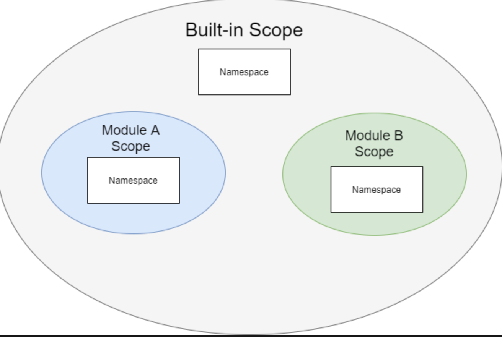

# 一、变量与内存管理

## 1、引用

变量引用一个保存值的对象。换句话说，变量是引用；变量是指向内存中对象的引用：
```py
counter = 100
```
要查找变量引用对象的内存地址，可将变量传递给内置 id() 函数：
```py
counter = 100
print(id(counter)) # 140717671523072
```
id() 是按照十进制返回的，要将内存地址转换为十六进制字符串，可以使用函数 hex()：
```py
print(hex(id(counter))) # 0x7ffb62d32300
```

内存地址中的对象可以有一个或多个引用，一旦对象没有任何引用，Python 内存管理器将销毁该对象并回收内存；（一旦对象的引用计数为零，内存管理器就会销毁该对象并收回内存。）

要获取对象的引用次数，可以使用 ctypes 模块的 from_address()方法。：
```py
ctypes.c_long.from_address(address).value
```
要使用此方法，需要传递要计算引用次数的对象的内存地址。此外，地址必须是整数：
```py
import ctypes
def ref_count(address):
    return ctypes.c_long.from_address(address).value
```
示例：
```py
import ctypes
def ref_count(address):
    return ctypes.c_long.from_address(address).value
numbers = [1, 2, 3]
numbers_id = id(numbers)

print(ref_count(numbers_id))  # 1

ranks = numbers
print(ref_count(numbers_id))  # 2

ranks = None
print(ref_count(numbers_id))  # 1

numbers = None
print(ref_count(numbers_id))  # 0
```

## 2、GC

不过，引用计数并非在所有时候都能正常工作。例如，当一个对象引用自身或两个对象相互引用时。这就会产生循环引用；

Python 允许您通过内置的 gc 模块与垃圾回收器交互，主要通过 gc 模块解决循环引用问题

看如下示例：
```py
import gc
import ctypes
def ref_count(address):
    return ctypes.c_long.from_address(address).value
def object_exists(object_id):
    for object in gc.get_objects():
        if id(object) == object_id:
            return True
    return False
class A:
    def __init__(self):
        self.b = B(self)
        print(f'A: {hex(id(self))}, B: {hex(id(self.b))}')
class B:
    def __init__(self, a):
        self.a = a
        print(f'B: {hex(id(self))}, A: {hex(id(self.a))}')
# disable the garbage collector
gc.disable()

a = A()

a_id = id(a)
b_id = id(a.b)

print(ref_count(a_id))  # 2
print(ref_count(b_id))  # 1

print(object_exists(a_id))  # True
print(object_exists(b_id))  # True

a = None
print(ref_count(a_id))  # 1
print(ref_count(b_id))  # 1

print(object_exists(a_id))  # True
print(object_exists(b_id))  # True

# run the garbage collector
gc.collect()

# check if object exists
print(object_exists(a_id))  # False
print(object_exists(b_id))  # False

# reference count
print(ref_count(a_id))  # 0
print(ref_count(b_id))  # 0
```

## 3、动态类型

Python是一种动态类型语言。在Python中声明变量时，不需要为它指定类型；
```py
message = 100
```
在 Python 中，message变量只是对字符串对象的引用。message 变量没有相关的类型。要确定变量当前引用的对象类型，可以使用 type() 函数：
```py
message = 'Hello'
print(type(message))
```

## 4、可变与不可变

在 Python 中，一切都是对象。对象有自己的内部状态。有些对象允许您改变其内部状态，有些则不允许。内部状态可变的对象称为可变对象，内部状态不可变的对象称为不可变对象；

以下都是不可变对象：
- Numbers (int, float, bool,…)
- Strings
- Tuples
- Frozen sets

以下是可变对象：
- Lists
- Sets
- Dictionaries

## 5、is运算符

is 运算符比较两个变量，如果它们引用的是同一个对象，则返回 True。如果两个变量引用了不同的对象，则 is 运算符返回 False。换句话说，is 运算符比较两个变量的同一性，如果它们引用的是同一个对象，则返回 True。
```py
a = 100
b = 100

result = a is b
print(result) # True，但是不一定，这个示例的结果可能会有所不同，这取决于 Python 内存管理器是如何实现的
```

**`is` vs `==`**：相等运算符 `(==)` 比较两个变量是否相等，如果相等则返回 True。否则返回 False
```py
a = 100
b = a

is_identical = a is b
is_equal = a == b

print(is_identical) # True
print(is_equal) # True
```
list中如果元素一样，那么 == 比较返回True
```py
ranks = [1, 2, 3]
rates = [1, 2, 3]

is_identical = ranks is rates
is_equal = ranks == rates

print(is_identical) # False
print(is_equal) # True
```

**`is not`运算符**

要否定 `is` 操作符，可以使用 `not` 操作符。如果两个变量引用同一个对象，`is not` 运算符返回 False。否则，返回 True：
```py
ranks = [1, 2, 3]
rates = [1, 2, 3]

result = ranks is not rates
print(result)  # True
```

## 6、None

在 Python 中，None 是 NoneType 类的一个特殊对象。要使用 None 值，可以按如下方式指定 None：
```py
None
print(type(None)) # <class 'NoneType'>
```
None 是 NoneType 类的单例对象。这意味着 Python 在运行时会创建一个且仅有一个 None 对象，因此，如果使用相等 (==) 或 is 运算符来比较 None 和 None，结果将是 True；所以在实践中使用 is 或 is not 操作符将一个值与 None 进行比较是一种好的做法；

还需要注意的是，None 对象具有以下功能：
- None 不等于零（0、0.0、......）。
- None 不等于 False。
- None 不等于空字符串（''）。
- 将 None 与任何值比较都会返回 False，除了 None 本身。

主要用途：
- 使用 None 作为变量的初始值；
- 使用 None 对象修复可变默认参数问题：
    ```py
    def append(color, colors=None):
        if colors is None:
            colors = []

        colors.append(color)
        return colors
    hsl = append('hue')
    print(hsl)
    rgb = append('red')
    print(rgb)
    ```
- 使用 None 对象作为函数的返回值；当函数没有返回值时，默认返回 None

# 二、数字类型

## 1、整数

整数是整数，包括负数、零和正数，如 -3、-2、-1、0、1、2、3。Python 使用类 int 来表示所有整数。所有整数都是对象；

Python 并不使用固定位数来存储整数。相反，Python 使用可变的位数来存储整数。例如，8 位、16 位、32 位、64 位、128 位，等等，Python 能表示的最大整数取决于可用内存。

另外，整数是对象。Python 需要为每个整数额外增加固定数量的字节作为开销。

值得注意的是，整数越大，"+"、"-"......等运算的速度就越慢。

```py
counter = 10
print(type(counter)) # <class 'int'>
```
要获取整数的大小，可以使用 sys 模块的 `getsizeof()` 函数：
```py
from sys import getsizeof
counter = 0
size = getsizeof(counter)
print(size)  # 24 bytes
```
因此，您可以认为 Python 使用 24 字节作为存储整数对象的开销。

整数的 `+` 、`-` 、`*` 、`**` 结果返回的都是整数，但是 除法（/） 返回的是 float

## 2、向下取整除

Python 使用两个运算符 `//` 和 `%` 来返回除法的结果：
```py
101 // 4 = 25 # 整除
101 % 4 = 1 # 取余数
```
`//` 被称 floor division 或 div。而 % 被称为模运算符或 mod
```py
101 = 4 * (101 // 4) + (101 % 4)
101 = 4 * 25         + 1
```
一般来说，如果 N 是分子，D 是分母，那么除法底层运算符和mod运算符总是满足以下等式：
```py
N = D * ( N // D) + (N % D)
```

实数的底数是小于或等于该数的最大整数：
```py
floor(3.4) = 4
floor(3.9) = 3
floor(3) = 3
```
对正数是上面的逻辑，但是对于负数来说：例如，根据下限定义，-3.4 的下限返回 -4，而不是 -3。同样，-3.9 的下限也返回 -4。

向下取整可以定义为：
```py
n // d = floor(n/d)
```

下表说明了两个整数 a 和 b 的 向下取整除法：
a	| b	| a // b
----|----|----
10	|3	|3
-10	|-3	|3
10	|-3	|-4
-10	|3	|-3

**`math.floor()`函数**

math模块的 floor() 函数返回两个整数的向下取整除法结果：
```py
from math import floor
a = 10
b = 3
print(a//b)  # 3
print(floor(a/b))  # 3
```
从输出中可以清楚地看到，floor() 函数返回的结果与 floor 除法运算符 (`//`) 返回的结果相同。负数也是如此

## 3、模运算

Python 使用百分号 (%) 作为模运算符。%运算符总是满足以下等式：
```py
N = D * ( N // D) + (N % D)
```
其中 N是分子，D 是分母

用途：
- 判断整数是否奇偶
- 使用模运算符转换单位，比如日期转换等：
```py
from math import floor
def get_time(total_seconds):
    return {
        'days': floor(total_seconds / 60 / 60 / 24),
        'hours': floor(total_seconds / 60 / 60) % 24,
        'minutes': floor(total_seconds / 60) % 60,
        'seconds': total_seconds % 60,
    }
print(get_time(93750))
```

## 4、bool类

bool类是int类的子类。这意味着bool类继承int类的所有属性和方法。此外，bool类具有与布尔操作相关的特定行为：
```py
is_child_class = issubclass(bool, int)
print(is_child_class) # True
```
事实上，True 和 False 都是 bool 类的单例对象：
```py
isinstance(True, bool) # True
isinstance(False, bool) # True
```
由于 True 和 False 也是 int 对象，因此可以将它们转换为整数：
```py
true_value = int(True)
print(true_value) # 1
false_value = int(False)
print(false_value) # 0
```
请注意，"True"和 "1"不是同一个对象。同样，"False"和 "0 "也不是同一个对象。

因为 True 和 False 是单例对象，在整个程序中始终引用内存中的相同对象;

当您向 bool() 构造函数传递一个对象时，Python 返回该对象的 `__bool__()` 方法的值。
```py
bool(200) 
# 实际执行的是：
200.__bool__()
```

如果对象的类没有 `__bool__()` 方法，Python 将返回 `__len__()` 方法的结果，如果 `__len__()`方法的结果为零，bool() 返回 False。否则，返回 True，这就是为什么空列表总是 False，而至少有一个元素的列表是 True 的原因；

最后，如果一个类没有 `__bool__()` 和 `__len__()` 方法，则该类的实例总是求值为 True

## 5、and操作符

Python 和运算符是一种逻辑运算符。通常，使用 and 运算符对布尔值进行运算并返回布尔值。

and是短路运算符，如果 and 前面返回 False，不管后面是 True 还是 False 都返回 False

## 6、or操作符

或运算符是一种逻辑运算符。通常，使用 or 运算符可以组合两个布尔表达式，并返回一个布尔值

`x or y`：如果 x 是真实的，那么 or 运算符就不需要对 y 进行求值，而是立即返回 x。这就是为什么这种求值方式被称为 "懒求值 "或 "短路求值"。在 Python 中，每个对象都与布尔值相关联。x 和 y 可以是任何对象。

or 操作符允许给一个变量赋默认值：
```py
var_name = value or default
```
如果 value是false，var_name 会给到 var_name 默认值

## 7、float

### 7.1、float类

Python 使用 float 类表示实数，Python float 使用 8 个字节（或 64 位）来表示实数。与整数类型不同，float 类型使用固定的字节数

Python 使用 64 位的情况如下：
- 1 位表示符号（正或负）
- 11 位表示指数 1.5e-5 1.5 x $10^5$（指数为-5），范围为 [-1022, 1023]。
- 52 位有效数字

例如，0.25 有两位有效数字，0.125 有三位有效数字，12.25 有四位有效数字:

$(1.25)_{10} = (1×2^0 + 0×2^{-1} + 1×2^-2)_{10} = (1.01)_2$

有些数字有有限的二进制表示法，但有些没有，例如 0.1。在二进制中是 01.0001100110011...。因此，Python 只能对这些数字使用近似的浮点表示法

如果将一个对象 (obj) 传递给 float(obj)，它将委托给 `obj.__float__()`。如果没有定义 `__float__()` ，它将返回到 `__index__()`；如果不给 float() 传递任何参数，它将返回 0.0

当您使用print()函数时，您将看到数字0.1被精确地表示为0.1。在内部，Python只能近似地表示0.1。要查看Python如何在内部表示0.1，可以使用`format()`函数：
```py
>>> format(0.1, '.20f')
'0.10000000000000000555'
```

float数字比较：
```py
x = 0.1 + 0.1 + 0.1
y = 0.3
print(x == y) # False
print(format(x, '.20f')) # 0.30000000000000004441
print(format(y, '.20f')) # 0.29999999999999998890
```
解决这个问题的一种方法是将等式的两边四舍五入到一个有效数字位数：
```py
x = 0.1 + 0.1 + 0.1
y = 0.3
print(round(x, 3) == round(y, 3)) # True
```
这种变通方法并非在所有情况下都有效； [PEP485](https://www.python.org/dev/peps/pep-0485/)提供的解决方案通过使用相对和绝对公差解决了这一问题，它提供了数学模块中的 `isclose()` 函数，如果两个数字相对接近，则返回 True：
```py
isclose(a, b, rel_tol=1e-9, abs_tol=0.0)
```
示例：
```py
from math import isclose
x = 0.1 + 0.1 + 0.1
y = 0.3
print(isclose(x,y))
```

### 7.2、float 转 int

将浮点数转换为整数时，会出现数据丢失。例如，20.3 可能变成 20 或 21，Python 在数学模块中提供了一些将浮点数转换为 int 的函数，包括：
- Truncation：函数 `trunc(x)` 返回数字 x 的整数部分。
    ```py
    from math import trunc
    print(trunc(12.2)) # 12
    print(trunc(12.5)) # 12
    print(trunc(12.7)) # 12
    ```
    同样，int() 构造函数接受浮点数，并使用截断法将浮点数转换为 int
- Floor：函数 `floor(x)` 返回小于或等于 x 的最大整数
    ```py
    from math import floor
    print(floor(12.2)) # 12
    print(floor(12.5)) # 12
    print(floor(12.7)) # 12
    ```
    对于正数，floor(x) 和 trunc(x) 返回相同的结果；但是对于负数是不同的：
    ```py
    from math import floor, trunc
    print(floor(-12.7)) # 13
    print(trunc(-12.7)) # 12
    ```
- ceiling：函数 ceil(x) 返回大于或等于 x 的最小整数
```py
# 正数
from math import ceil
print(ceil(12.7)) # 13
# 负数：
from math import ceil
print(ceil(-12.7)) # 12
```

### 7.3、四舍五入

四舍五入是指简化一个数字，但使其值接近原值。例如，89 四舍五入到最接近的十就是 90，因为 89 比 80 更接近 90。

在 Python 中，要对一个数字进行四舍五入，需要使用内置的 round() 函数：
```py
round(number [, ndigits])
```
函数 round() 将数字取整为最接近 10 位数的倍数，换句话说，round() 函数返回小数点后四舍五入到 ndigits 位精度的数字，如果省略 ndigits 或为无，round( ) 将返回最接近的整数：
```py
round(1.25) # 1
round(1.25, 0) # 1.0
```
如果 ndigits 是负数：
```py
round(15.5, -1)
```
由于 15.5 位于 10 和 20 之间（10 的倍数），因此更接近 20。因此，round() 函数返回 20。

当您对位于两个数字中间的数字进行四舍五入时，Python 无法找到最接近的数字。:
```py
round(1.25, 1)
```
在这种情况下，Python 使用 IEEE 754 标准进行四舍五入，即银行家四舍五入。在银行四舍五入法中，一个数字四舍五入到最接近的数值，并列时四舍五入到最小有效数字为偶数的数值。
> 一般来说，一个数字中最小的有效数字是最右边的数字。

银行家四舍五入法的原理是，从统计角度看，50% 的样本数四舍，50% 的样本数五入：
```py
round(1.25, 1) # 1.2
```

**如何从零开始四舍五入**

Python 并没有提供从 0 开始四舍五入的直接方法。

将一个数字从零四舍五入的常用方法是使用下面的表达式

函数 copysign() 返回 x 的绝对值，但不返回 y 的符号：
```py
from math import copysign
def round_up(x):
    return int(x + copysign(0.5, x))
```


## 8、Decimal

### 8.1、基本使用

许多十进制数在二进制浮点数中没有精确的表示，如 0.1。在算术运算中使用这些数时，会得到意想不到的结果：
```py
x = 0.1
y = 0.1
z = 0.1
s = x + y + z
print(s) # 0.30000000000000004
```
要解决这个问题，可以使用 `decimal` 模块中的 Decimal 类，如下所示：
```py
import decimal
from decimal import Decimal
x = Decimal('0.1')
y = Decimal('0.1')
z = Decimal('0.1')
s = x + y + z
print(s) # 0.3
```
Decimal 总是与控制以下方面的 [context](https://www.pythontutorial.net/advanced-python/python-context-managers/) 相关联:
- 算术运算中的精度
- 四舍五入算法

默认情况下，context 为全局上下文。全局上下文是默认上下文。此外，您还可以设置临时上下文，它将在本地生效，而不会影响全局上下文。要获取默认上下文，可调用 Decimal 模块中的 getcontext() 函数：
```py
decimal.getcontext()
```
`getcontext()` 函数返回默认上下文，可以是全局或本地上下文

要创建从另一个上下文复制过来的新上下文，可以使用 localcontext() 函数：
```py
decimal.localcontext(ctx=None)
```
localcontext() 返回从指定的上下文 ctx 复制的新上下文；

获取上下文对象后，可以分别通过 prec 和 rounding 属性访问精度和舍入值：
- `ctx.pre`：获取或设置精度。ctx.pre是一个整数，默认为28
- `ctx.rounding`：获取或设置四舍五入机制。dounding 是一个字符串。默认为 `ROUND_HALF_EVEN`。注意浮点数也使用这种舍入机制

Python 提供了以下 rounding 机制

Rounding | 说明
--------|------
ROUND_UP | 从零开始四舍五入
ROUND_DOWN | 向零舍入
ROUND_CEILING | 向天花板取整（向正无穷大取整）
ROUND_FLOOR | 向地板取整（向负无穷大取整）
ROUND_HALF_UP | 舍入到最近的零点，与零点平齐
ROUND_HALF_DOWN | 舍入到最近的整数，与零相等
ROUND_HALF_EVEN | 四舍五入到最近，与偶数（最小有效数字）相等

示例：
```py
import decimal
ctx = decimal.getcontext()
print(ctx.prec) # 28
print(ctx.rounding) # ROUND_HALF_EVEN
```
使用 rounding：
```py
import decimal
from decimal import Decimal

x = Decimal('2.25')
y = Decimal('3.35')
with decimal.localcontext() as ctx:
    print('Local context:')
    ctx.rounding = decimal.ROUND_HALF_UP
    print(round(x, 1))
    print(round(y, 1))

print('Global context:') # 不会受到上面的影响
print(round(x, 1))
print(round(y, 1))
```

### 8.2、Decimal构造函数

Deciaml 构造函数允许您根据一个值创建一个新的 Decimal 对象：
```py
Decimal(value='0', context=None)
```
值参数可以是整数、字符串、元组、浮点数或其他 Decimal 对象。如果不提供值参数，默认值为 "0"。

如果value是一个 tuple，则应包含三个部分：符号（0 表示正数，1 表示负数）、数字元组和整数指数：`(sign, (digit1,digit2, digit3,...), exponent)`

比如：`3.14 = 314 x 10^-2`，tuple有以下三个元素：
- 符号为 0
- 数位为 (3,1,4)
- 指数为 -2

因此，您需要将以下 tuple 传递给 Decimal 构造函数：
```py
import decimal
from decimal import Decimal
x = Decimal((0, (3, 1, 4), -2))
print(x) # 3.14
```
请注意，Decimal context 精度只影响算术运算，而不影响 Decimal 构造函数：
```py
import decimal
from decimal import Decimal
decimal.getcontext().prec = 2
pi = Decimal('3.14159')
radius = 1
print(pi)
area = pi * radius * radius
print(area)
```
当您使用的浮点数没有精确的二进制浮点表示时，Decimal构造函数无法创建精确的十进制表示：
```py
import decimal
from decimal import Decimal
x = Decimal(0.1)
print(x) # 0.1000000000000000055511151231257827021181583404541015625
```

### 8.3、数学运算

有些算术运算符的作用与浮点数或整数不同，如 div (`//`) 和 mod (%)。对于 Decimal，`//` 运算符执行截断除法：`x // y = trunc( x / y)`；

Decimal类提供了一些数学运算，如 sqrt 和 log。但是，它并不具备数学模块中定义的所有函数；当使用数学模块中的函数处理Decimal时，Python 会在进行算术运算之前将Decimal对象转换为浮点数。这会导致Decimal对象中内置的精度丢失；


# 三、变量作用域

变量名及其绑定（名称和对象）只存在于代码的特定部分中，定义名称/绑定的代码部分称为变量的词法作用域；Python 将这些绑定存储在称为命名空间。每个作用域都有自己的命名空间。

## 1、全局作用域

全局作用域基本上就是模块作用域。全局作用域只跨越一个 Python 源代码文件；除了内置的作用域之外，Python 没有真正的全局作用域，它跨越所有模块；

内置作用域是一种特殊的作用域，提供全局可用的对象，如 print、len、None、True 和 False。

基本上，内置变量和全局变量存在于模块的任何地方。

在内部，全局作用域嵌套在内置作用域中



如果从一个作用域访问一个变量，而 Python 在该作用域的命名空间中找不到它，它就会在外层作用域的命名空间中搜索。

## 2、Local Scope

本地作用域

## 3、变量查询

在 Python 中，作用域是嵌套的。例如，本地作用域嵌套在模块作用域中。模块作用域嵌套在内置作用域中

访问绑定到变量的对象时，Python 会尝试查找对象：
- 首先在当前本地作用域中找到对象。
- 如果 Python 在当前作用域中找不到对象，就会向上传递外层作用域链。

当您从函数内部获取全局变量的值时，Python 会自动搜索本地作用域的命名空间，并向上搜索所有外层作用域的命名空间链。

但是，如果在函数内部给全局变量赋值，Python 将把该变量放到本地命名空间中：
```py
counter = 10
def reset():
    counter = 0
    print(counter) # 0
reset()
print(counter) # 10
```
当 reset() 函数运行时，Python 会在本地作用域中找到counter。reset() 函数内部的 print(counter) 语句显示了counter的值，即 0;

本地变量 counter 变量掩盖了全局 counter 变量。

如果要从函数内部访问全局变量，可以使用 global 关键字：
```py
counter = 10
def reset():
    global counter
    counter = 0
    print(counter) # 0
reset()
print(counter) # 0
```
> 请注意，在函数内部访问全局变量不是一种好的做法。

## 4、非局部作用域

```py
def outer():
    print('outer function')
    def inner():
        print('inner function')
    inner()
outer()
```
通常，我们说内部函数嵌套在外部函数中。实际上，如果不想让这些函数成为全局函数，就会定义嵌套函数。Outer和Inner都可以访问全局作用域、内置作用域和本地作用域；

```py
def outer():
    message = 'outer function'
    print(message) # outer function
    def inner():
        print(message) # outer function
    inner()
outer()
```

**nonlocal keyword**

要在本地作用域中修改非本地作用域的变量，需要使用 nonlocal
```py
def outer():
    message = 'outer scope'
    print(message) # outer scope
    def inner():
        nonlocal message
        message = 'inner scope'
        print(message) # inner scope
    inner()
    print(message) # inner scope    
outer()
```
当您对一个变量使用非局部关键字时，Python 将在外层局部作用域链中查找该变量，直到它第一次遇到该变量名为止。

更重要的是，Python 不会在全局作用域中查找变量:
```py
message = 'outer scope'
def outer():
    print(message)
    def inner():
        nonlocal message
        message = 'inner scope'
        print(message)
    inner()
    print(message)
outer()
```
输出结果：`SyntaxError: no binding for nonlocal 'message' found`

在Inner函数中，为 message 变量使用了非本地关键字。因此，Python 会在outer函数的作用域中搜索 message 变量。

由于Outer函数的作用域中没有 message 变量，Python 也不会在全局作用域中进一步查找，因此会出错；

# 四、闭包

在 Python 中，您可以从另一个函数的内部定义一个函数。这个函数被称为嵌套函数：
```py
def say():
    greeting = 'Hello'
    def display():
        print(greeting)
    display()
```
因此，display 函数和 greeting 变量的组合称为闭包；顾名思义，闭包是一个嵌套函数，它引用其外层作用域中的一个或多个变量

## 1、返回内部函数

在 Python 中，一个函数可以返回另一个函数的值：
```py
def say():
    greeting = 'Hello'
    def display():
        print(greeting)
    return display    
```
在本例中，say 函数返回display函数，而不是执行 display 函数。

此外，当 say 函数返回display 函数时，它实际上返回了一个闭包；下面的代码将 say 函数的返回值赋值给变量 fn。 由于 fn 是一个函数，因此可以执行它：
```py
fn = say() # <function say.<locals>.display at 0x10b762200>
fn()
```
换句话说，在执行 fn 函数时，say 函数的作用域已经消失了；由于 greeting 变量属于 say 函数的作用域，因此它也应随函数的作用域一起被销毁，但是，您仍然可以看到 fn 显示 message 变量的值

## 2、Python 单元和多作用域变量

有两个作用域共享greeting 变量的值：
- say 函数
- 闭包

标签 greeting 位于两个不同的作用域中。但是，它们始终引用同一个字符串对象，其值为 "Hello"。为此，Python 创建了一个称为 cell 的中间对象


要查找cell对象的内存地址，可以使用 `__closure__` 属性，如下所示：
```py
print(fn.__closure__)
# (<cell at 0x0000017184915C40: str object at 0x0000017186A829B0>,)
```
`__closure__` 返回一个cell 元组，在本例中，cell的内存地址是 0x0000017184915C40。它引用的字符串对象地址为 0x0000017186A829B0:
```py
def say():
    greeting = 'Hello'
    print(hex(id(greeting))) # 0x17186a829b0
    def display():
        print(hex(id(greeting))) # 0x17186a829b0
        print(greeting)
    return display
fn = say()
fn()
```
访问 greeting 变量的值时，Python 会通过技术上的 "double-hop"来获取字符串值，这就解释了为什么当 say() 函数超出作用域时，仍然可以访问由greeting变量引用的字符串对象；

基于这种机制，可以将闭包视为一个函数和一个包含自由变量的扩展作用域。

要查找闭包包含的自由变量，可以使用 `__code__.co_freevars`，例如：
```py
def say():
    greeting = 'Hello'
    def display():
        print(greeting)
    return display
fn = say()
print(fn.__code__.co_freevars) # ('greeting',)
```

## 3、什么时候创建闭包

当函数执行时，Python 会创建一个新的作用域。如果该函数创建了一个闭包，Python 也会创建一个新的闭包。请看下面的例子：
```py
def multiplier(x):
    def multiply(y):
        return x * y
    return multiply
```
multiplier 函数返回两个参数的乘法运算结果。不过，它使用的是闭包
```py
m1 = multiplier(1)
m2 = multiplier(2)
m3 = multiplier(3)

print(m1(10)) # 10
print(m2(10)) # 20
print(m3(10)) # 30
```
m1、m2 和 m3 有不同的闭合实例

## 4、闭包和 for 循环

假设你有如下代码：
```py
multipliers = []
for x in range(1, 4):
    multipliers.append(lambda y: x * y)

m1, m2, m3 = multipliers

print(m1(10))
print(m2(10))
print(m3(10))
```
上面是如何工作的：
- 首先，声明一个用于存储闭包的列表；
- 其次，使用 lambda 表达式创建闭包，并在每次迭代时将闭包附加到列表中
- 第三，将闭包从列表中解压缩到 m1、m2 和 m3 变量中
- 最后，将数值 10、20 和 30 传递给每个闭包并执行。

但是实际上并不是这样的，在循环过程中，x 从 1 开始到 3。循环结束后，其值为 3。列表中的每个元素都是以下闭包，Python 在调用 m1(10)、m2(10) 和 m3(10) 时会对 x 进行求值。在闭包执行时，x 是 3。这就是为什么当你调用 m1(10)、m2(10) 和 m3(10) 时会看到相同的结果。

为了解决上面的问题，您需要 Python 在循环中对 x 进行求值：
```py
def multiplier(x):
    def multiply(y):
        return x * y
    return multiply

multipliers = []
for x in range(1, 4):
    multipliers.append(multiplier(x))

m1, m2, m3 = multipliers
print(m1(10))
print(m2(10))
print(m3(10))
```
闭包的特点：返回的函数还引用了外层函数的局部变量，所以：要正确使用闭包，就要确保引用的局部变量在函数返回后不能变；返回闭包时牢记的一点就是：返回函数不要引用任何循环变量，或者后续会发生变化的变量

# 五、decorator(装饰器)

## 1、基本使用

装饰器是一种函数，它将另一个函数作为参数，在不明确更改原始函数的情况下扩展其行为；

如下是一个 net_price 函数：
```py
def net_price(price, tax):
    """ calculate the net price from price and tax
    Arguments:
        price: the selling price
        tax: value added tax or sale tax
    Return
        the net price
    """
    return price * (1 + tax)
```
假设您需要使用美元货币来格式化净价。例如，100 美元变为 `$100` 美元。为此，您可以使用装饰器:
```py
def currency(fn):
    def wrapper(*args, **kwargs):
        fn(*args, **kwargs)
    return wrapper
```
currency函数返回 wrapper函数。wrapper函数有 `*args` 和 `**kwargs` 参数。通过这些参数，可以使用`*args` 和 `**kwargs`的任意组合调用任何 fn 函数。
在wrapper函数中，您可以调用 fn 函数，获取其结果，并将结果格式化为货币字符串：
```py
def currency(fn):
    def wrapper(*args, **kwargs):
        result = fn(*args, **kwargs)
        return f'${result}'
    return wrapper
```
currency函数是一个装饰器，它接受任何返回数字并将该数字格式化为货币字符串的函数
```py
# 使用方式如下：
net_price = currency(net_price)
print(net_price(100, 0.05))
```

## 2、装饰器定义

一般来说，装饰器是：
- 将另一个函数（原始函数）作为参数并返回另一个函数（或闭包）的函数
- 闭包通常接受 `*args` 和 `**kwargs` 参数的任意组合。
- 闭包函数使用传递给闭包的参数调用原始函数，并返回函数的结果。

内部函数是一个闭包，因为它引用了其外层作用域或装饰器函数中的 fn 参数。

一般来说，如果 decorate 是一个装饰器函数，而您想装饰另一个函数 fn，可以使用这种语法：`fn = decorate(fn)`；为了更方便，Python 提供了这样一种更简短的方法：
```py
@decorate
def fn():
    pass
```
上面的示例：
```py
def currency(fn):
    def wrapper(*args, **kwargs):
        result = fn(*args, **kwargs)
        return f'${result}'
    return wrapper
@currency
def net_price(price, tax):
    return price * (1 + tax)
print(net_price(100, 0.05))
```

## 3、自省装饰函数

当装饰一个函数时，其等于：
```py
@decorate
def fn(*args,**kwargs):
    pass
# 等价
fn = decorate(fn)
```
如果使用内置 help 功能显示新函数的文档，则不会看到原始函数的文档。例如:
```py
help(net_price)
# wrapper(*args, **kwargs)
# None
```
另外，如果检查新函数的名称，Python 将返回装饰器返回的内部函数的名称:
```py
print(net_price.__name__) # wrapper
```
因此，当装饰一个函数时，就会丢失原来的函数签名和文档；

要解决这个问题，可以使用 functools 标准模块中的 wraps 函数。事实上，wraps 函数也是一个装饰器
```py
from functools import wraps
def currency(fn):
    @wraps(fn)
    def wrapper(*args, **kwargs):
        result = fn(*args, **kwargs)
        return f'${result}'
    return wrapper
@currency
def net_price(price, tax):
    return price * (1 + tax)

help(net_price)
print(net_price.__name__)
```

## 4、带参数的装饰器

比如，有如下带参数的函数：
```py
def say(message):
    print(message)
```
如果，那么如果需要装饰的话，如下写法：
```py
from functools import wraps
def repeat(fn):
    @wraps(fn)
    def wrapper(*args, **kwargs):
        for _ in range(5):
            result = fn(*args, **kwargs)
        return result
    return wrapper
@repeat
def say(message):
    print(message)
say('Hello')
```
如果要重复执行 say() 函数十次，该怎么办？在这种情况下，您需要更改 repeat 装饰器中的硬编码值 5。但是，这种解决方案并不灵活。例如，您想使用 repeat 装饰器执行一个函数 5 次，另一个执行 10 次。重复装饰器将无法满足要求。

要解决这个问题，需要更改 repeat 装饰器，使其接受一个参数，指定函数的执行次数，如下所示：
```py
@repeat(5)
def say(message):
    ...
def repeat(times):
    # return the original "repeat" decorator
```
new repeat 函数返回一个装饰器。它通常被称为装饰器工厂。
```py
def repeat(times):
    def decorate(fn):
        @wraps(fn)
        def wrapper(*args, **kwargs):
            for _ in range(times):
                result = fn(*args, **kwargs)
            return result
        return wrapper
    return decorate
```
在这段代码中，decorate 函数是一个装饰器。它相当于原来的 repeat 装饰器。
> 请注意，新的重复函数并不是一个装饰器。它是一个返回装饰器的装饰器工厂。

## 5、类装饰器

当类实例实现了 `__call__` 方法时，它就可以成为可调用类。因此，可以把 `__call__` 方法作为一个装饰器，比如：
```py
class Star:
    def __init__(self, n):
        self.n = n
    def __call__(self, fn):
        def wrapper(*args, **kwargs):
            print(self.n*'*')
            result = fn(*args, **kwargs)
            print(result)
            print(self.n*'*')
            return result
        return wrapper
```
可以使用 Star 作为装饰器：
```py
@Star(5)
def add(a, b):
    return a + b
```
`@Star(5)` 返回 Star 类的一个实例。该实例是可调用的，因此您可以执行以下操作：
```py
add = Star(5)(add)
```
- 通过实现 `__call__` 方法，将可调用类用作装饰器。
- 将装饰器参数传递给 `__init__` 方法

## 6、monkey patching

Monkey patching 是一种技术，允许您在运行时修改或扩展现有模块、类或函数的行为，而无需更改原始源代码。

应用Monkey patching技术的步骤如下：
- 首先，确定要修补的目标，可以是模块、类、方法或函数。
- 其次，编写代码来添加、修改或替换现有逻辑，从而创建补丁。
- 第三，使用赋值将补丁应用于目标。补丁将覆盖或扩展现有行为。

虽然 "Monkey patching"是一种强大的工具，但应谨慎使用，以避免意外行为的发生

示例：
```py
class Robot:
    def __init__(self, name):
        self.name = name
```
要在运行时扩展机器人类的行为而不改变机器人类，可以使用Monkey patching技术；假如：需要扩展一个行为，让机器人的实例能够说话。下面是具体步骤：
- 定义一个名为 add_speech 的函数，该函数接受一个类作为参数：
    ```py
    def add_speech(cls):
        cls.speak = lambda self, message: print(message)
        return cls
    ```
- 其次，通过将 Robot 类传递给 add_speech()方法来修补Robot类
    ```py
    Robot = add_speech(Robot)
    ```
    请注意，可以使用 add_speech() 函数修补任何类，而不仅仅是Robot类
- 第三，创建一个新的Robot类实例，并调用 speak() 方法：
    ```py
    robot = Robot('Optimus Prime')
    robot.speak('Hi')
    ```

`Robot = add_speech(Robot)`由于这行代码是一个装饰器，可以使用如下方式：
```py
@add_speech
class Robot:
    def __init__(self, name):
        self.name = name
```

**何时使用 Monkey patching**

实际上，只有在必要时才应使用 "Monkey patching"，因为它会使代码更难理解和调试。

例如，如果您使用的是第三方库，而它有一个紧急错误，您无法等待官方发布。在这种情况下，您可以使用 "Monkey patching"来进行快速修复，同时等待适当的解决方案。

另一种情况是，想为自己无法控制的类添加功能，但又无法使用继承或组合等其他技术，这时就可以使用打补丁。

在实践中，会在模拟库（如标准 unittest.mock 模块）中发现Monkey patching。unittest.mock 模块有 patch() 方法，可以用一个 mock 对象临时替换目标。

## 7、常见装饰器

### 7.1、lru_cache

```py
from functools import lru_cache
@lru_cache
def fib(n):
    print(f'Calculate the Fibonacci of {n}')
    if n < 2:
        return 1
    return fib(n-2) + fib(n-1)
fib(6)
```

# 六、序列

## 1、命名元组

命名元组允许你创建元组，并为元组元素的位置指定有意义的名称。从技术上讲，命名元组是tuple的子类。此外，它还为位置元素添加了属性名称。

要创建命名元组类，需要使用collection标准库中的 namedtuple 函数；namedtuple 是一个返回新命名元组类的函数。换句话说，namedtuple() 是一个类工厂：
```py
from collections import namedtuple
```
命名元组函数接受以下参数来生成一个类:
- 类名，指定命名元组类的名称。
- 与元组元素相对应的字段名序列。字段名必须是有效的变量名，但不能以下划线 (_) 开头。

比如：
```py
Point2D = namedtuple('Point2D',['x','y'])
```
命名元组还可以接受字段名称为：
- tuple of string：`Point2D = namedtuple('Point2D',('x','y'))`
- 字段名用逗号分隔的单字符串：`Point2D = namedtuple('Point2D',('x, y'))`
- 一个字段名用空格分隔的字符串：`Point2D = namedtuple('Point2D','x y')`

**初始化命名元组**

Point2D 是一个类，是元组的子类。您可以像创建普通类一样创建 Point2D 类的新实例。例如：
```py
point = Point2D(100, 200)
# or
point = Point2D(x=100, y=200)
```
point对象是 Point2D 类的一个实例。因此，它也是元组类的一个实例

**访问元组**

命名元组是一个常规元组。因此，可以对已命名元组进行所有元组操作。要访问已命名元组中的数据，可以使用：
- 切片
- 拆包
- 索引
- 迭代

```py
# unpacking
x, y = point
print(f'({x}, {y})')  # (100, 200)
# indexing
x = point[0]
y = point[1]
print(f'({x}, {y})')  # (100, 200)
# iterating
for coordinate in point:
    print(coordinate)
```

**命名元组函数的重命名参数**

namedtuple 函数接受只包含关键字的参数 rename，该参数允许重命名无效字段名称:

由于字段名 `_radius` 以下划线 (`_`) 开头，因此会出现以下错误
```py
from collections import namedtuple
Circle = namedtuple(
    'Circle',
    'center_x, center_y, _radius'
)
```
但是，当使用重命名参数时，namedtuple 函数会自动将 _radius 重命名为有效的字段名。例如：
```py
from collections import namedtuple
Circle = namedtuple(
    'Circle',
    'center_x, center_y, _radius',
    rename=True
)
```
要查找已命名元组的字段名，可以使用 `_fields` 类属性。例如：
```py
print(Circle._fields)
# ('center_x', 'center_y', '_2')
```
在本例中，namedtuple 函数自动将 `_radius` 字段更改为 `_2`

**命名元组其他函数**

命名元组提供了一些有用的功能。例如，您以使用相等运算符 (==) 来比较两个命名元组实例：
```py
a = Point2D(100, 200)
b = Point2D(100, 200)
print(a == b)  # True
```
由于命名的元组就是一个元组，因此可以将任何与普通元组相关的函数应用到命名的元组上:
```py
print(max(a))  # 200
print(min(a))  # 100
```

## 2、序列

序列是按位置排序的项目集合。您可以使用索引号（如 s[0] 和 s[1]）来引用序列中的任何项目。

Python 有以下内置序列类型：lists, bytearrays, strings, tuples, range, bytes。Python 将序列类型分为可变和不可变两种；其中可变序列类型是lists 和 bytearrays，不可变序列类型是strings, tuples, range, 和 bytes；

序列可以是同质的，也可以是异质的。在同质序列中，所有元素都具有相同的类型。例如，字符串是同质序列，其中每个元素的类型都相同；而list是一种异构序列，可以存储不同类型的元素，包括整数、字符串、对象等。

### 2.1、序列类型与可迭代类型

- 可迭代对象是一个对象集合，可以逐个获取每个元素。因此，任何序列都是可迭代的。例如，列表是可迭代的；
- 但是，可迭代类型可能不是序列类型。例如，集合是可迭代的，但它不是序列

### 2.2、序列方法

- len-序列中元素个数：`len(seq)`
- element in seq: 元素是否存在于序列中，返回 True 或 False
- seq.index(e): 元素在序列中索引位置，如果序列中不存在该元素，则会报错：`ValueError: 10 is not in list`；
    - 要查找在特定索引处或之后首次出现的项目的索引，可以使用以下形式的索引方法：`seq.index(e, i)`
    - 通过索引方法的以下形式，可以查找索引 i 之后、索引 j 之前首次出现的项目索引：`seq.index(e, i, j)`
- 序列切片：要获取从索引 i 到（但不包括）j 的片段，请使用以下语法：`seq[i:j]`；
    ```py
    numbers = [1, 4, 5, 3, 5, 7, 8, 5]
    print(numbers[2:6]) # [5, 3, 5, 7]
    ```
    通过扩展切片，可以以 k 为单位获得从 i 到（但不包括 j）的切片。`seq[i:j:k]`
    ```py
    print(numbers[2:6:2]) # [5, 5]
    ```
- 序列中的最大值（`max()`）和最小值（`min()`）；
- 连接两个序列，可以使用 + 操作符：`s3 = s1 + s2`；连接不可变序列非常安全；不过，您应该注意可变序列的连接。下面的示例展示了如何将列表连接到列表本身：
    ```py
    city = [['San Francisco', 900_000]]
    cities = city + city
    print(cities)
    print(id(cities[0]) == id(cities[1]))  # True
    ```
    由于列表是可变的，因此城市列表中第一个和第二个元素的内存地址是相同的；此外，当您更改原始列表中的值时，合并列表也会随之更改；
- 重复 Python 序列：要多次重复一个序列，可以使用乘法运算符 (*)：
    ```py
    s = 'ha'
    print(s*3)
    ```

## 3、tuple和list

**tuple是不可变的，list是可变的**

**tuple的存储效率高于list**

- 列表是可变的。这意味着您可以向其中添加更多元素。因此，Python 需要为 list 分配多于需要的内存。这就是所谓的超量分配。当列表展开时，超量分配可以提高性能；
- 同时，元组是不可变的，因此它的元素数是固定的。因此，Python 只需分配足够的内存来存储初始元素；

要获取对象的大小，可以使用 sys 模块中的 `getsizeof` 函数。

**复制tuple比复制list更快**
- 当复制一个 list时，会创建一个新的list；
- 当复制一个 tuple时，会复用存在的 tuple
```py
from timeit import timeit
times = 1_000_000
t1 = timeit("list(['apple', 'orange', 'banana'])", number=times)
print(f'Time to copy a list {times} times: {t1}')
t2 = timeit("tuple(('apple', 'orange', 'banana'))", number=times)
print(f'Time to copy a tuple {times} times: {t2}')
diff = "{:.0%}".format((t2 - t1)/t1)
print(f'difference: {diff}')
```

## 4、深度切片

对于list等可变序列类型，可以使用切片来提取和分配数据：
```py
colors = ['red', 'green', 'blue', 'orange']
# extract data
print(colors[1:3])
# assign data
colors[1:3] = ['pink', 'black']
print(colors)
```
切片 `seq[start:stop] `会返回从索引 `start` 开始到索引 `stop - 1` 的元素。因此，在对序列进行切片时，更容易直观地看到索引在元素之间：

### 4.1、切片类型

Python 中的一切都是对象，包括切片。切片实际上是一个切片类型的对象。当使用切片符号`seq[start:stop]`，`start:stop` 是一个 slice 对象：`slice(start, stop)`
```py
s = slice(1, 3)
print(type(s)) # <class 'slice'>
print(s.start, s.stop) # 1 3
```
可以尝试下下面的用法：
```py
colors = ['red', 'green', 'blue', 'orange']
s = slice(1, 3)
print(colors[s]) # ['green', 'blue']
```

### 4.2、start和stop边界

切片 `seq[start:stop]` 选择从索引起始点到索引终止点为止的元素（不包括索引终止点的元素）。换句话说，它会返回索引 n 处序列的所有元素，其中 n 满足以下表达式：`start <= n < stop`；

`start` 和 `stop` 都是可选项。如果不指定，`start` 默认为 0，`stop` 默认为 `len(seq)`。如果 start 和 stop 超过边界，默认使用`len(seq)`：
```py
colors = ['red', 'green', 'blue', 'orange']
print(colors[0:100]) # ['red', 'green', 'blue', 'orange']
print(colors[10:]) # []，因为10超过了
``` 
**start 和 stop 为负数**

切分对象还接受 start 和 stop 为负数：
```py
colors = ['red', 'green', 'blue', 'orange']
print(colors[-4:-2]) # ['red', 'green']
```

### 4.3、步长

切片支持第三个参数，即步长值。如果不指定，步长值默认为 1：
```py
seq[star:stop:step]
# 等价于
s = slice(start, stop, step) 
seq[s]
```

### 4.4、索引方法

切片对象本质上定义了一个索引序列，用于选择序列中的元素；为方便起见，slice 类型提供了索引方法，可返回序列中任意片段的等效范围（start,stop,step），并具有指定的长度
```py
slice(start, stop, step).indices(length) # (i, j, k)
```
示例：
```py
colors = ['red', 'green', 'blue', 'orange']
s = slice(0, 4, 2)
t = s.indices(len(colors))
for index in range(*t):
    print(colors[index])
```

## 5、自定义序列类型

如何实现一个自定义不可变序列类型，基本上，不可变序列类型应支持两个主要功能：
- 返回序列中元素的数量。从技术上讲，这一要求并非必要。
- 返回给定索引处的元素，如果索引超出范围，则引发 IndexError。

如果一个对象可以满足上述要求，那么你就可以使用它：
- 使用方括号 `[]` 语法按索引检索元素。
- 使用 for 循环、理解等方法遍历序列中的元素。

一般自定义序列类型需要实现以下方法：
- `__getitem__` ：返回给定索引处的元素。
- `__len__` ：返回序列的长度

**`__getitem__`方法**
- `__getitem__` 方法的索引参数是一个整数。`__getitem__`应根据指定的索引从序列中返回一个元素。
- 如果索引超出范围，`__getitem__` 方法将引发 IndexError 异常。
- 此外，`__getitem__` 方法还可以接受一个切片对象，以支持切片处理

# 七、Iterator

## 1、iterator

迭代器是实现了如下方法的：
- `__iter__`：返回对象本身的 方法。
- `__next__` 方法返回下一个项目。如果所有项目都已返回，该方法将引发 StopIteration 异常

请注意，这两种方法也被称为迭代器协议。

Python 允许在 for 循环、解包和其他内置函数（包括 map、filter、reduce 和 zip）中使用迭代器。

下面的示例定义了返回平方数的平方迭代器类
```py
class Square:
    def __init__(self, length):
        self.length = length
        self.current = 0
    def __iter__(self):
        return self
    def __next__(self):
        if self.current >= self.length:
            raise StopIteration
        self.current += 1
        return self.current ** 2
```
如何使用：
```py
square = Square(5)
for sq in square:
    print(sq)
```
如果尝试使用已经迭代完的迭代器，就会出现 StopIteration 异常。

迭代器不能重启，因为它只有返回集合中下一个项目的 `__next__` 方法

## 2、迭代器与可迭代器

迭代器是实现迭代器协议的对象。换句话说，迭代器是一个实现以下方法的对象
- `__iter__` 返回迭代器对象本身
- `__next__` 返回下一个元素

可迭代对象是可以迭代的对象：当一个对象实现了 `__iter__` 方法时，它就是可迭代的。它的 `__iter__` 方法会返回一个新的迭代器。
```py
numbers = [1, 2, 3]
number_iterator = numbers.__iter__()
print(type(number_iterator)) # <class 'list_iterator'>

numbers = [1, 2, 3]
number_iterator = iter(numbers)
next(number_iterator)
next(number_iterator)
next(number_iterator)
```
列表与其迭代器的分离。列表只创建一次，而迭代器则在每次需要遍历列表时创建。

像前面的 Square 既是迭代器，又是可迭代对象：
- Square类是一个迭代器，因为它实现了 `__iter__` 和 `__next__` 方法。`__iter__` 方法返回对象本身。而 `__next__` 方法返回列表中的下一项；
- Square类也是一个可迭代器，因为它实现了返回对象本身的 `__iter__` 方法，而对象本身就是一个迭代器

分离迭代器和可迭代对象：
```py
class Colors:
    def __init__(self):
        self.rgb = ['red', 'green', 'blue']
    def __len__(self):
        return len(self.rgb)
class ColorIterator:
    def __init__(self, colors):
        self.__colors = colors
        self.__index = 0
    def __iter__(self):
        return self
    def __next__(self):
        if self.__index >= len(self.__colors):
            raise StopIteration
        # return the next color
        color = self.__colors.rgb[self.__index]
        self.__index += 1
        return color

colors = Colors()
color_iterator = ColorIterator(colors)
for color in color_iterator:
    print(color)
```

## 3、iter()方法

`iter()` 函数返回给定对象的迭代器：`iter(object)`，`iter()` 函数需要一个参数，该参数可以是一个可迭代对象，也可以是一个序列。一般来说，对象参数可以是任何支持迭代或序列协议的对象；

当你在一个对象上调用 `iter()` 函数时，该函数首先会查找该对象的 `__iter__`() 方法

如果存在 `__iter__`() 方法，则 `iter()` 函数会调用它来获取一个迭代器。否则，`iter()` 函数将查找 `__getitem__`() 方法。

如果 `__getitem__`() 可用，`iter()` 函数将创建一个迭代器对象并返回该对象。否则，它会引发 TypeError 异常


**iter()的另一种形式：**
`iter(callable, sentinel)`：将在调用 next() 方法时调用一个call callable。如果结果等于哨兵值，它将返回callable程序返回的值或引发 StopIteration 异常。

示例：
```py
def counter():
    count = 0
    def increase():
        nonlocal count
        count += 1
        return count
    return increase
class CounterIterator:
    def __init__(self, fn, sentinel):
        self.fn = fn
        self.sentinel = sentinel
    def __iter__(self):
        return self
    def __next__(self):
        current = self.fn()
        if current == self.sentinel:
            raise StopIteration
        return current

cnt = counter()
iterator = CounterIterator(cnt, 4)
for count in iterator:
    print(count)
```

**使用iter()判断一个对象是否可迭代**
```py
def is_iterable(object):
    try:
        iter(object)
    except TypeError:
        return False
    else:
        return True
print(is_iterable([1, 2, 3])) # True
print(is_iterable('Python iter')) # True
print(is_iterable(100)) # False
```

# 八、Generator

要中途暂停函数并从暂停的位置继续运行，需要使用 yield 语句。

当一个函数至少包含一条 yield 语句时，它就是一个Generator函数；根据定义，Generator是一个至少包含一个 yield 语句的函数，调用Generator函数时，它会返回一个新的Generator对象。但是，它不会启动函数；

Generator 对象（或Generator）实现了迭代器协议。事实上，Generator是一种懒惰的迭代器。因此，要执行一个Generator函数，需要调用它的 next() 内置函数；

示例：
```py
def greeting():
    print('Hi!')
    yield 1
    print('How are you?')
    yield 2
    print('Are you there?')
    yield 3
```
当 Python 遇到 yield 语句时，它会返回 yield 中指定的值。此外，它会暂停执行函数；如果再次 "call"同一个函数，Python 将从上次遇到 yield 语句的地方继续前进；：
```py
messenger = greeting() # messenger 是个迭代器
result = next(messenger)
print(result) # Hi
result = next(messenger)
print(result) # How are you
```
如果一个函数定义中包含`yield`关键字，那么这个函数就不再是一个普通函数，而是一个generator：最难理解的就是generator和函数的执行流程不一样：
- 函数是顺序执行，遇到return语句或者最后一行函数语句就返回。
- 变成generator的函数，在每次调用`next()`的时候执行，遇到`yield`语句返回，再次执行时从上次返回的`yield`语句处继续执行；

但是用for循环调用generator时，发现拿不到 generator 的 return 语句的返回值。如果想要拿到返回值，必须捕获StopIteration错误，返回值包含在 StopIteration 的value中
```python
    while True:
...     try:
...         x = next(g)
...         print('g:'， x)
...     except StopIteration as e:
...         print('Generator return value:'， e.value)
...         break
```

创建一个生成器(Generator)，只要把一个列表生成式的[]改成()，就创建了一个generator
```python
>>> L = [x * x for x in range(10)]
>>> L
[0， 1， 4， 9， 16， 25， 36， 49， 64， 81]
>>> g = (x * x for x in range(10))
>>> g
<generator object <genexpr> at 0x104feab40>
# 创建L和g的区别仅在于最外层的[]和()，L是一个list，而g是一个generator。
# 笨方法:如果要一个一个打印出来，可以通过generator的next()方法：
```
正确的方法是使用for循环，因为 generator 也是可迭代对象

如果推算的算法比较复杂，用类似列表生成式的 for 循环无法实现的时候，还可以用函数来实现

如:名的斐波拉契数列（Fibonacci）定义函数如下:
```python
def fib(max):
    n， a， b = 0， 0， 1
    while n < max:
        print b
        a， b = b， a + b # 先计算右边，然后将 b 的值赋给 a， 再将 a+b 的值赋给 b
        n = n + 1
```
如何将上述函数转变为生成器：只需要把print b改为yield b就可以了
```python
def fib(max):
    n， a， b = 0， 0， 1
    while n < max:
        yield b
        # a， b = b， a + b 等价于：
        temp = a
        a = b
        b = temp + b
        #a， b = b， a + b
        n = n + 1
```

# 九、Context Managers

Context Managers 是一个对象，它定义了在 with 语句中执行的运行时上下文
```py
with open('data.txt') as f:
    data = f.readlines()
    print(int(data[0])    
```

## 1、with语句

以下是 with 语句的典型语法：
```py
with context as ctx:
    # use the the object 

# context is cleaned up
```
如何使用
- Python 遇到 with 语句时，会创建一个新的上下文。上下文可以选择返回一个对象。
- 在 with 代码块之后，Python 会自动清理上下文。
- ctx 的作用域与 with 语句的作用域相同。这意味着您可以在 with 语句内部或之后访问 ctx。
```py
with open('data.txt') as f:
    data = f.readlines()
    print(int(data[0]))
print(f.closed)  # True
```

## 2、context manager protocol

Python 上下文管理器基于上下文管理器协议工作。

上下文管理器协议有以下方法：
- `__enter__`()：设置上下文，并可选择返回某个对象
- `__exit__`()：清理对象。

如果想让一个类支持上下文管理器协议，就需要实现这两个方法：
```py
with ContextManager() as ctx:
    # do something
# done with the context
```
当用 with 语句使用 ContextManager 类时，Python 会隐式地创建 ContextManager 类的实例 (instance)，并自动在该实例上调用 `__enter__`() 方法。

`__enter__`() 方法可以选择返回一个对象。如果是这样，Python 将返回的对象赋值给 ctx。

请注意，ctx 引用的是 `__enter__`() 方法返回的对象。它并不引用 ContextManager 类的实例。

如果在 with 代码块内或 with 代码块后出现异常，Python 将调用实例对象上的 `__exit__`() 方法

在功能上，with 语句等同于以下 try...finally 语句：
```py
instance = ContextManager()
ctx = instance.__enter__()
try:
    # do something with the txt
finally:
    # done with the context
    instance.__exit__()
```
- 在 `__enter__`() 方法中，可以执行必要的步骤来设置上下文；
- 总是执行 `__exit__`() 方法，即使在 with 代码块中出现了异常；

`__exit__`() 方法接受三个参数：异常类型、异常值和回溯对象。如果没有异常发生，所有这些参数都将是 None，`__exit__`() 方法返回一个布尔值，即 True 或 False
```py
def __exit__(self, ex_type, ex_value, ex_traceback):
    ...
```
如果返回值为 True，Python 将使任何异常静默。否则，它不会使异常静默；

## 3、context manager应用

- 如果要自动打开和关闭资源，可以使用上下文管理器，比如Socket；
- 上下文管理器可以帮助你更有效地管理对象的锁。它们允许你获取锁定并自动释放。
- context管理器还能帮助您处理需要启动和停止阶段的场景；
- 需要改变或重置资源的时候；

## 4、如何实现上下文管理器协议


```py
class File:
    def __init__(self, filename, mode):
        self.filename = filename
        self.mode = mode
    def __enter__(self):
        print(f'Opening the file {self.filename}.')
        self.__file = open(self.filename, self.mode)
        return self.__file
    def __exit__(self, exc_type, exc_value, exc_traceback):
        print(f'Closing the file {self.filename}.')
        if not self.__file.closed:
            self.__file.close()
        return False
with File('data.txt', 'r') as f:
    print(int(next(f)))
```

# 十、Python 与字节码

## 1、查看 Python 解释器字节码

```bash
python -m dis hello.py
```