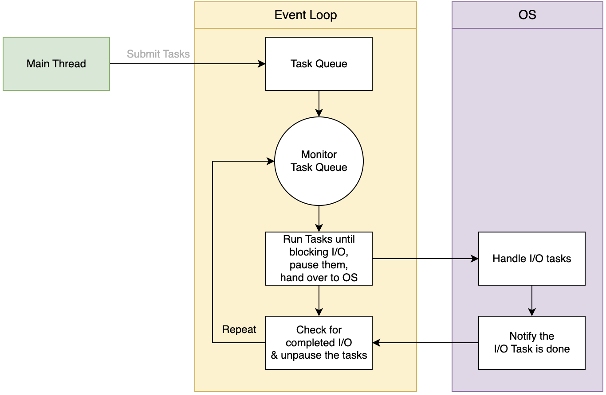
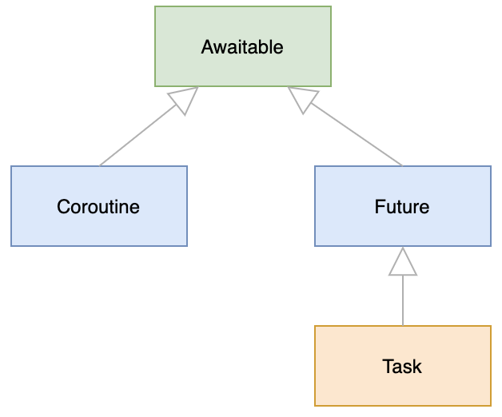

# 一、多线程

## 1、线程模块

### 1.1、单线程程序

```py
from time import sleep, perf_counter
def task():
    print('Starting a task...')
    sleep(1)
    print('done')
start_time = perf_counter()
task()
task()
end_time = perf_counter()
print(f'It took {end_time- start_time: 0.2f} second(s) to complete.')
```
该程序只有一个进程，只有一个线程，即主线程。因为程序只有一个线程，所以称为单线程程序

### 1.2、多线程程序

要创建多线程程序，需要使用 Python threading模块，使用方式：
```py
from threading import Thread
# 创建线程
new_thread = Thread(target=fn,args=args_tuple)
```
Thread 接收多个参数，主要参数：
- `target`：指定要在新线程中运行的函数（`fn`）。
- `args`：指定函数 (`fn`) 的参数。args 参数是一个元组

启动线程：`new_thread.start()`，如果想在主线程中等待线程完成，可以调用 join() 方法：`new_thread.join()`，通过调用 `join()` 方法，主线程将等待子线程完成后才终止；

示例：
```py
from time import sleep, perf_counter
from threading import Thread
def task():
    print('Starting a task...')
    sleep(1)
    print('done')
start_time = perf_counter()
# create two new threads
t1 = Thread(target=task)
t2 = Thread(target=task)
# start the threads
t1.start()
t2.start()
# wait for the threads to complete
t1.join()
t2.join()
end_time = perf_counter()
print(f'It took {end_time- start_time: 0.2f} second(s) to complete.')
```
线程带参数：
```py
threads = []
for n in range(1, 11):
    t = Thread(target=task, args=(n,))
    threads.append(t)
    t.start()
```
请注意，如果在循环内调用 `join()` 方法，程序会等待第一个线程完成后再启动下一个线程；

### 1.3、适用场景

- I/O 绑定任务 - 用于 I/O 的时间明显多于用于计算的时间。
- CPU 绑定任务 - 用于计算的时间明显多于等待 I/O 的时间。

Python 线程针对 I/O 绑定任务进行了优化。例如，请求远程资源、连接数据库服务器或读写文件

## 2、扩展Thread类

Python 程序启动时，会有一个称为主线程的线程。有时，想把 I/O 绑定的任务卸载到一个新线程中，让它们并发执行。为此，可以使用内置的线程模块；

在新线程中执行代码的一种方法是扩展threading模块的 Thread 类。具体步骤如下：
- 首先，定义 `threading.Thread` 类的子类。
- 其次，在子类的 `__init__()` 方法中重载 `__init__(self, [,args])` 方法，以添加自定义参数。
- 第三，重载子类中的 `run(self, [,args])` 方法，以便在创建新线程时自定义新线程类的行为。

示例：
```py
from threading import Thread
import urllib.request
class HttpRequestThread(Thread):
    def __init__(self, url: str) -> None:
        super().__init__()
        self.url = url
    def run(self) -> None:
        print(f'Checking {self.url} ...')
        try:
            response = urllib.request.urlopen(self.url)
            print(response.code)
        except urllib.error.HTTPError as e:
            print(e.code)
        except urllib.error.URLError as e:
            print(e.reason)
```
要使用 HttpRequestThread 类，需要创建 HttpRequestThread 类实例并调用 start() 方法。此外，你还可以调用 join() 方法来等待所有线程完成;

## 3、获取线程返回值

要从线程中返回值，可以扩展线程类，并将该值存储在该类的实例中，比如：
```py
from threading import Thread
import urllib.request
class HttpRequestThread(Thread):
    def __init__(self, url: str) -> None:
        super().__init__()
        self.url = url
        self.http_status_code = None
        self.reason = None
    def run(self) -> None:
        try:
            response = urllib.request.urlopen(self.url)
            self.http_status_code = response.code
        except urllib.error.HTTPError as e:
            self.http_status_code = e.code
        except urllib.error.URLError as e:
            self.reason = e.reason
def main() -> None:
    urls = [
        'https://httpstat.us/200',
        'https://httpstat.us/400'
    ]
    # create new threads
    threads = [HttpRequestThread(url) for url in urls]
    # start the threads
    [t.start() for t in threads]
    # wait for the threads to complete
    [t.join() for t in threads]
    # display the URLs with HTTP status codes
    [print(f'{t.url}: {t.http_status_code}') for t in threads]

if __name__ == '__main__':
    main()
```
总结：扩展线程类并在子类中设置实例变量，以便将子线程的值返回给主线程

## 4、守护线程

有时候想在后台执行一项任务。为此，需要使用一种特殊的线程，称为守护线程；根据定义，守护进程线程是后台线程。换句话说，守护进程线程在后台执行任务

以下场景适合使用：
- 在后台将信息记录到文件。
- 在后台抓取网站内容。
- 在后台将数据自动保存到数据库。

创建守护线程：
```py
t = Thread(target=f, deamon=True)
# 或者，也可以在创建线程实例后将守护进程属性设置为 True
t = Thread(target=f)
t.deamon = True
```
此外，当程序退出时，守护进程线程会被自动杀死。因为它不需要等待守护进程线程完成；

## 5、ThreadPoolExecutor

手动管理线程并不高效，因为频繁创建和销毁许多线程的计算成本非常高昂。如果希望在程序中运行许多临时任务，可以重复使用线程，而不是这样重复创建、销毁。线程池可以实现这一目的

线程池是一种在程序中实现并发执行的模式。通过线程池，可以自动高效地管理线程池，线程池中的每个线程都称为工作线程或工作者。线程池允许您在任务完成后重复使用工作线程。它还能防止意外故障，如异常；

通常，线程池允许配置工作线程的数量，并为每个工作线程提供特定的命名约定。要创建线程池，可使用 `concurrent.futures` 模块中的 `ThreadPoolExecutor` 类，ThreadPoolExecutor 类扩展了 Executor 类，并返回一个 Future 对象

### 5.1、Executor

Executor 类有三个控制线程池的方法：
- `submit()` ：调度一个要执行的函数，并返回一个 Future 对象。submit() 方法接收一个函数并异步执行。
- `map()` ：针对可迭代元素中的每个元素异步执行一个函数。
- `shutdown()` ：关闭执行器。

创建 ThreadPoolExecutor 类的新实例时，Python 会启动 Executor；完成执行器的工作后，必须明确调用 shutdown() 方法来释放执行器持有的资源。为避免显式调用 shutdown() 方法，可以使用上下文管理器

### 5.2、Future

Future 是一个表示异步操作最终结果的对象。Future 类有两个有用的方法
- result() - 返回异步操作的结果。
- exception() - 返回异步操作的异常，以防出现异常

### 5.3、线程示例

```py
from time import sleep, perf_counter
from concurrent.futures import ThreadPoolExecutor

def task(id):
    print(f'Starting the task {id}...')
    sleep(1)
    return f'Done with task {id}'

start = perf_counter()

with ThreadPoolExecutor() as executor:
    f1 = executor.submit(task, 1)
    f2 = executor.submit(task, 2)

    print(f1.result())
    print(f2.result())    

finish = perf_counter()

print(f"It took {finish-start} second(s) to finish.")
```
submit() 方法返回一个 Future 对象。在本例中，我们有两个 Future 对象 f1 和 f2。为了从 Future 对象中获取结果，我们调用了它的 result() 方法

使用`map()`方法：
```py
from time import sleep, perf_counter
from concurrent.futures import ThreadPoolExecutor
def task(id):
    print(f'Starting the task {id}...')
    sleep(1)
    return f'Done with task {id}'

start = perf_counter()
with ThreadPoolExecutor() as executor:
    results = executor.map(task, [1,2])
    for result in results:
        print(result)
finish = perf_counter()
print(f"It took {finish-start} second(s) to finish.")
```

# 二、线程同步

## 1、Lock

竞争条件：多个线程同时操作同一个共享变量时发生的竞争

为防止出现竞争条件，可以使用线程锁。线程锁是一种同步原语，在多线程应用程序中提供对共享资源的独占访问。线程锁也称为互斥锁（mutex），是互斥的简称。

通常，线程锁有两种状态：锁定和解锁。当线程获得锁时，锁就会进入锁定状态。线程可以独占访问共享资源。其他线程如果试图在锁定状态下获取锁，则会被阻塞，并等待锁被释放；

在 Python 中，可以使用 threading 模块中的 Lock 类创建锁对象：
```py
# （1）创建锁实例；默认情况下，在线程获取锁之前，锁是解锁的
lock = Lock()
# （2）通过调用 acquire() 方法获取锁
lock.acquire()
# （3）线程完成更改共享变量后释放锁
lock.release()
```
示例：
```py
from threading import Thread, Lock
from time import sleep
counter = 0
def increase(by, lock):
    global counter
    lock.acquire()
    local_counter = counter
    local_counter += by
    sleep(0.1)
    counter = local_counter
    print(f'counter={counter}')
    lock.release()
lock = Lock()
# create threads
t1 = Thread(target=increase, args=(10, lock))
t2 = Thread(target=increase, args=(20, lock))
# start the threads
t1.start()
t2.start()
# wait for the threads to complete
t1.join()
t2.join()
print(f'The final counter is {counter}')
```

**在 with 语句来使用线程锁**
```py
import threading
# Create a lock object
lock = threading.Lock()
# Perform some operations within a critical section
with lock:
    # Lock was acquired within the with block
    # Perform operations on the shared resource
    # ...
# the lock is released outside the with block
```
比如上面的increase中加锁的方法：
```py
def increase(by, lock):
    global counter

    with lock:
        local_counter = counter
        local_counter += by
        sleep(0.1)
        counter = local_counter
        print(f'counter={counter}')
```

定义一个线程安全的 Counter
```py
from threading import Thread, Lock
from time import sleep
class Counter:
    def __init__(self):
        self.value = 0
        self.lock = Lock()
    def increase(self, by):
        with self.lock:
            current_value = self.value
            current_value += by
            sleep(0.1)
            self.value = current_value
            print(f'counter={self.value}')
def main():
    counter = Counter()
    # create threads
    t1 = Thread(target=counter.increase, args=(10, ))
    t2 = Thread(target=counter.increase, args=(20, ))
    # start the threads
    t1.start()
    t2.start()
    # wait for the threads to complete
    t1.join()
    t2.join()
    print(f'The final counter is {counter.value}')
if __name__ == '__main__':
    main()
```

## 2、线程事件

有时候，需要在线程之间进行通信。为此可以使用锁（mutex）和布尔变量；Python 为提供了线程间通信的更好方法，使用threading模块中的Event类；

Event类为线程之间的协调提供了一种简单而有效的方法：一个线程发出信号，其他线程等待事件发生，Event对象封装了一个布尔标志，可以设置（True）或清除（False）。多个线程可以等待事件被设置后再继续处理，也可以将事件重置回清除状态
```py
from threading import Event
event = Event() # 默认情况下，事件未被设置（清除）。Event对象的 is_set() 方法将返回 False
if event.is_set():
   # ...
event.set() # 一旦设置了事件，所有等待该事件的线程都会自动收到通知
event.clear() # 清除
event.wait() # 线程可以通过 wait() 方法等待事件被设置
```
wait() 方法会阻止一个线程的执行，直到事件被设置。换句话说，wait() 方法会阻止当前线程的执行，直到另一个线程调用 set() 方法设置事件；如果设置了事件，函数 wait() 会立即返回；

要指定线程等待的时间，可以使用超时参数：
```py
event.wait(timeout=5) # wait for 5 seconds
```

示例：
```py
from threading import Thread, Event
from time import sleep
def task(event: Event, id: int) -> None:
    print(f'Thread {id} started. Waiting for the signal....')
    event.wait()
    print(f'Received signal. The thread {id} was completed.')

def main() -> None:
    event = Event()
    t1 = Thread(target=task, args=(event,1))
    t2 = Thread(target=task, args=(event,2))
    t1.start()
    t2.start()
    print('Blocking the main thread for 3 seconds...')
    sleep(3) 
    event.set()
if __name__ == '__main__':
    main()
```

使用Event来实现如下：
- 线程1下载文件，文件下载完成后，通知线程2统计下载文件中单词的数量；
- 线程2统计下载文件中单词的数量；
```py
from threading import Thread, Event
from urllib import request
def download_file(url, event):
    # Download the file form URL
    print(f"Downloading file from {url}...")
    filename, _ = request.urlretrieve(url, "rfc793.txt")
    # File download completed, set the event
    event.set()

def process_file(event):
    print("Waiting for the file to be downloaded...")
    event.wait()  # Wait for the event to be set
    # File has been downloaded, start processing it
    print("File download completed. Starting file processing...")
    # Count the number of words in the file
    word_count = 0
    with open("rfc793.txt", "r") as file:
        for line in file:
            words = line.split()
            word_count += len(words)
    # Print the word count
    print(f"Number of words in the file: {word_count}")

def main():
    # Create an Event object
    event = Event()
    # Create and start the file download thread
    download_thread = Thread(target=download_file, args=("https://www.ietf.org/rfc/rfc793.txt",  event))
    download_thread.start()
    # Create and start the file processing thread
    process_thread = Thread(target=process_file, args=(event,))
    process_thread.start()
    # Wait for both threads to complete
    download_thread.join()
    process_thread.join()
    print("Main thread finished.")

if __name__ == '__main__'    :
    main()
```

## 3、停止线程

要停止线程，可以使用threading模块的Event类。Event类有一个内部线程安全布尔标志，可设置为 True 或 False。默认情况下，内部标志为 False；

在Event类中，set() 方法将内部标志设置为 True，而 clear() 方法则将标志重置为 False。此外，如果内部标志被设置为 True，则 is_set() 方法返回 True；

要从主线程停止子线程，可使用Event对象，步骤如下：
- 首先，创建一个新的Event对象并将其传递给子线程。
- 其次，通过调用 is_set()方法定期检查子线程是否设置了Event对象的内部标志，如果设置了内部标志，则停止子线程。
- 第三，在某个时间点调用主线程中的 set() 方法来停止子线程。

示例：
```py
from threading import Thread, Event
from time import sleep

def task(event: Event) -> None:
    for i in range(6):
        print(f'Running #{i+1}')
        sleep(1)
        if event.is_set():
            print('The thread was stopped prematurely.')
            break
    else:
        print('The thread was stopped maturely.')

def main() -> None:
    event = Event()
    thread = Thread(target=task, args=(event,))
    
    # start the thread
    thread.start()

    # suspend  the thread after 3 seconds
    sleep(3)

    # stop the child thread
    event.set()    
   
if __name__ == '__main__':
    main()
```

**使用线程类的子类停止线程**

下面的示例展示了如何使用Thread类的派生类创建子线程，并使用Event对象停止子线程与主线程的需求：
```py
from threading import Thread, Event
from time import sleep

class Worker(Thread):
    def __init__(self, event, *args, **kwargs):
        super().__init__(*args, **kwargs)
        self.event = event

    def run(self) -> None:
        for i in range(6):
            print(f'Running #{i+1}')
            sleep(1)
            if self.event.is_set():
                print('The thread was stopped prematurely.')
                break
        else:
            print('The thread was stopped maturely.')
def main() -> None:
    # create a new Event object
    event = Event()
    # create a new Worker thread
    thread = Worker(event)
    # start the thread
    thread.start()
    # suspend  the thread after 3 seconds
    sleep(3)
    # stop the child thread
    event.set()    
if __name__ == '__main__':
    main()
```

## 4、信号量

Python semaphore 是一种同步原语，它允许控制对共享资源的访问。基本上，一个信号是一个与锁相关联的计数器，它限制了可以同时访问共享资源的线程数；在这种情况下，多个线程会尝试同时访问资源，从而干扰彼此的操作。

一个semaphore会保存一个计数。当一个线程要访问共享资源时，semaphore 会检查计数；如果计数大于零，就会减少计数并允许线程访问资源。如果计数为零，则信号屏蔽会阻塞线程，直到计数大于零。

信号量有两个主要操作：
- Acquire：获取操作会检查计数，如果大于零，就会递减计数。如果计数为零，则该 semaphore 将阻塞线程，直到其他线程释放该 semaphore。
- Release：释放操作会递增计数，允许其他线程获取它。

如何使用：
```py
import threading
semaphore = threading.Semaphore(3) # 创建 Semaphore 对象，并指定可同时获取该对象的线程数
semaphore.acquire() # 调用 acquire() 方法从线程中获取一个semaphore 
semaphore.release() # 在运行关键代码段后，调用 release() 方法释放一个semaphore 
```
为了确保即使在运行代码的关键部分时出现异常，也能正确获取和释放信号，可以使用 with 语句：
```py
with semaphore:
    # Code within this block has acquired the semaphore

    # Perform operations on the shared resource
    # ...
# The semaphore is released outside the with block
```

案例：
```py
import threading
import urllib.request

MAX_CONCURRENT_DOWNLOADS = 3
semaphore = threading.Semaphore(MAX_CONCURRENT_DOWNLOADS)

def download(url):
    with semaphore:
        print(f"Downloading {url}...")
        response = urllib.request.urlopen(url)
        data = response.read()
        print(f"Finished downloading {url}")
        return data

def main():
    # URLs to download
    urls = [
        'https://www.ietf.org/rfc/rfc791.txt',
        'https://www.ietf.org/rfc/rfc792.txt',
        'https://www.ietf.org/rfc/rfc793.txt',
        'https://www.ietf.org/rfc/rfc794.txt',
        'https://www.ietf.org/rfc/rfc795.txt',
    ]
    # Create threads for each download
    threads = []
    for url in urls:
        thread = threading.Thread(target=download, args=(url,))
        threads.append(thread)
        thread.start()

    # Wait for all threads to complete
    for thread in threads:
        thread.join()
if __name__ == '__main__':
    main()
```

# 三、线程安全队列

通过内置的queue模块，可以在多个线程之间安全地交换数据。Queue模块中的queue类实现了所有必需的锁定语义

**创建队列：**
```py
from queue import Queue
queue = Queue()
```
要创建有大小限制的队列，可以使用 maxsize 参数。例如，下面创建的队列最多可存储 10 个项目：
```py
queue = Queue(maxsize=10)
```

**添加元素到队列**
```py
queue.put(item)
```
一旦队列已满，就无法再向其中添加项目。此外，调用 put() 方法将阻塞，直到队列有可用空间为止；如果不想在队列已满时阻塞 put() 方法，可以将block 参数设置为 "False"。
```py
queue.put(item, block=False)
```
在这种情况下，如果队列已满，put() 方法将引发 queue.Full 异常。
```py
try:
   queue.put(item, block=False)
except queue.Full as e:
   # handle exceptoin
```
要将一个项目添加到有大小限制的队列中并使用超时阻塞，可以使用timeout参数，如下所示：
```py
try:
   queue.put(item, timeout=3)
except queue.Full as e:
   # handle exceptoin
```

**从队列中获取元素**
```py
item = queue.get()
```
get() 方法将阻塞，直到有项目可从队列中检索为止；要在不阻塞的情况下从队列中获取项目，可以将block 参数设置为False：
```py
try:
   queue.get(block=False)
except queue.Empty:
   # handle exception
```
要从队列中获取一个项目并在一定时间内阻塞它，可以使用带有超时的 get() 方法：
```py
try:
   item = queue.get(timeout=10)
except queue.Empty:
   # ...
```

**获取队列长度**
```py
size = queue.size()
```
此外，如果队列为空，empty() 方法返回 True，否则返回 False。另一方面，如果队列已满，full() 方法返回 True，否则返回 False。

**将任务标记为已完成**

添加到队列中的项目代表一个工作单位或一项任务，当线程调用 get() 方法从队列中获取项目时，可能需要在任务被认为完成之前对其进行处理，完成后，线程可调用队列的 task_done() 方法，以表示已完全处理了任务：
```py
item = queue.get()

# process the item
# ...

# mark the item as completed
queue.task_done()
```
等待队列中的所有任务完成：`queue.join()`

**使用python实现生产者/消费者**
```py
import time
from queue import Empty, Queue
from threading import Thread

def producer(queue):
    for i in range(1, 6):
        print(f'Inserting item {i} into the queue')
        time.sleep(1)
        queue.put(i)

def consumer(queue):
    while True:
        try:
            item = queue.get()
        except Empty:
            continue
        else:
            print(f'Processing item {item}')
            time.sleep(2)
            queue.task_done()

def main():
    queue = Queue()

    # create a producer thread and start it
    producer_thread = Thread(
        target=producer,
        args=(queue,)
    )
    producer_thread.start()

    # create a consumer thread and start it
    consumer_thread = Thread(
        target=consumer,
        args=(queue,),
        daemon=True
    )
    consumer_thread.start()

    # wait for all tasks to be added to the queue
    producer_thread.join()

    # wait for all tasks on the queue to be completed
    queue.join()

if __name__ == '__main__':
    main()
```

# 四、多进程处理

## 1、multiprocessing 模块

可以使用 multiprocessing 来处理多线程任务：
```py
import time
import multiprocessing

def task() -> int:
    result = 0
    for _ in range(10**8):
        result += 1
    return result

if __name__ == '__main__':
    start = time.perf_counter()

    p1 = multiprocessing.Process(target=task)
    p2 = multiprocessing.Process(target=task)

    p1.start()
    p2.start()

    p1.join()
    p2.join()

    finish = time.perf_counter()
    print(f'It took {finish-start:.2f} second(s) to finish')
```
多线程处理图片
```py
import time
import os
from PIL import Image, ImageFilter

import multiprocessing

filenames = [
    'images/1.jpg',
    'images/2.jpg',
    'images/3.jpg',
    'images/4.jpg',
    'images/5.jpg',
]

def create_thumbnail(filename, size=(50,50), thumb_dir ='thumbs'):
    # open the image
    img = Image.open(filename)
    
    # apply the gaussian blur filter
    img = img.filter(ImageFilter.GaussianBlur())

    # create a thumbnail
    img.thumbnail(size)
    
    # save the image
    img.save(f'{thumb_dir}/{os.path.basename(filename)}')

    # display a message
    print(f'{filename} was processed...')

def main():
    start = time.perf_counter()

    # create processes
    processes = [multiprocessing.Process(target=create_thumbnail, args=[filename]) 
                for filename in filenames]

    # start the processes
    for process in processes:
        process.start()

    # wait for completion
    for process in processes:
        process.join()

    finish = time.perf_counter()

    print(f'It took {finish-start:.2f} second(s) to finish')

if __name__ == '__main__':
    main()
```

## 2、ProcessPoolExecutor

在前面的例子中，使用 multiprocessing 来创建 Process，这种方式创建不是很高效；为了更有效地管理进程，可以使用process pool。与线程池一样，process pool也是一种自动管理进程的模式。

通过 `concurrent.futures` 模块中的 `ProcessPoolExecutor` 类，您可以创建和管理进程池；ProcessPoolExecutor 类使用 CPU 内核数量来创建优化的进程数量；

ProcessPoolExecutor 扩展了 Executor 类，该类有三个方法：
- `submit()`：调度一个要由进程执行的函数，并返回一个 Future 对象。
- `map()` ：向元素迭代调用函数。
- `shutdown()` ：关闭执行器；

要释放执行程序持有的资源，需要明确调用 shutdown() 方法。要自动关闭执行程序，可以使用上下文管理器。

Future 对象表示异步操作的事件结果。它有两种获取结果的主要方法：
- `result()` ：返回异步操作的结果。
- `exception()` ：返回运行异步操作时发生的异常。

示例：
```py
import time
import os
from PIL import Image, ImageFilter

from concurrent.futures import ProcessPoolExecutor

filenames = [
    'images/1.jpg',
    'images/2.jpg',
    'images/3.jpg',
    'images/4.jpg',
    'images/5.jpg',
]

def create_thumbnail(filename, size=(50,50), thumb_dir ='thumbs'):
    # open the image
    img = Image.open(filename)
    
    # apply the gaussian blur filter
    img = img.filter(ImageFilter.GaussianBlur())

    # create a thumbnail
    img.thumbnail(size)
    
    # save the image
    img.save(f'{thumb_dir}/{os.path.basename(filename)}')

    # display a message
    print(f'{filename} was processed...')

def main():
    start = time.perf_counter()

    with ProcessPoolExecutor() as executor:
        executor.map(create_thumbnail, filenames)
   
    finish = time.perf_counter()

    print(f'It took {finish-start: .2f} second(s) to finish')

if __name__ == '__main__':
    main()
```
请注意，要运行该程序，您需要安装 Pillow，这是一个用于图像处理的流行库，只需运行 pip 命令 pip install Pillow 即可。

# 五、异步

## 1、Event Loop

`asyncio` 内置软件包可让您使用单线程并发运行任务；

为了实现单线程并发模型，asyncio 软件包使用了一种称为`事件循环`的结构；

在单线程并发模型中，在任何时候都只有一个线程在执行 Python 代码。当遇到 I/O 任务时，将其交给操作系统的事件通知系统，然后运行其他代码；当 I/O 任务完成后，可以恢复等待结果的任务，并执行 I/O 任务后面的代码；

为了跟踪正在等待结果的 I/O 任务，asyncio 软件包使用了事件循环。下图说明了事件循环的工作原理



工作流程：
- 首先，主线程向任务队列提交任务。
- 其次，事件循环持续监控任务队列并运行任务，直到计数 I/O 任务。在这种情况下，事件循环会暂停任务并将其移交给操作系统。
- 第三，检查已完成的 IO 任务。如果任务已完成，操作系统将通知程序。然后，事件循环运行未暂停的任务。

在 Python 3.7 之前，需要创建一个事件循环并手动运行任务。在 Python 3.7 之后，asyncio 软件包提供了一些函数，可以自动管理事件循环，从而无需处理底层 API；

## 2、async/await

协程是一种常规函数，当遇到可能需要一段时间才能完成的操作时，它可以暂停执行；当长时间运行的操作完成后，可以恢复暂停的协程，并执行该协程中的剩余代码，当 coroutine 等待长时间运行的操作时，可以运行其他代码。这样就可以异步运行程序，从而提高性能。

要创建和暂停一个 coroutine，需要使用 Python 的 async 和 await 关键字：
- async 关键字创建一个 coroutine。
- await 关键字暂停一个 coroutine。

### 2.1、async 定义 coroutine

```py
def square(number: int) -> int:
    return number*number
```
上面是一个普通函数，但是如果增加 async 就是一个 coroutine
```py
async def square(number: int) -> int:
    return number*number
```
调用的 coroutine 会返回一个稍后运行的 coroutine 对象。例如：
```py
async def square(number: int) -> int:
    return number*number
result = square(10)
print(result)
# output
<coroutine object square at 0x00000185C31E7D80>
sys:1: RuntimeWarning: coroutine 'square' was never awaited
```
调用一个 coroutine 时，Python 不会立即执行 coroutine 中的代码。相反，它会返回一个 coroutine 对象；

要运行一个 coroutine，需要在一个事件循环中执行它。在 Python 3.7 之前，必须手动创建一个事件循环来执行 coroutine 并关闭事件循环；自 3.7 版起，asyncio 库添加了一些简化事件循环管理的函数。

可以使用 asyncio.run() 函数自动创建事件循环、运行一个 coroutine 并关闭它：
```py
import asyncio
async def square(number: int) -> int:
    return number*number
result = asyncio.run(square(10))
print(result)
```
值得注意的是，`asyncio.run()` 被设计为 asyncio 程序的主要入口点；此外，asyncio.run() 函数只执行一个协程，该协程可调用程序中的其他协程和函数；

### 2.2、await 暂停 coroutine

await 关键字会暂停一个 coroutine 的执行。在 await 关键字之后，会出现类似下面这样的 coroutine 调用：
```py
result = await my_coroutine()
```
关键字 await 使 `my_coroutine()`执行，等待代码完成，并返回结果

请注意：await 关键字只在 coroutine 内部有效。换句话说，必须在 coroutine 中使用 await 关键字；

示例：
```py
import asyncio
async def square(number: int) -> int:
    return number*number

async def main() -> None:
    x = await square(10)
    print(f'x={x}')
    y = await square(5)
    print(f'y={y}')
    print(f'total={x+y}')
if __name__ == '__main__':
    asyncio.run(main())
```
但是上面的程序像是个异步程序，但是实际上还是没有体现出异步编程的能力；

## 3、asyncio.create_task()

要模拟长时间运行的操作，可以使用 asyncio 软件包中的 sleep() 例程。sleep() 函数会延迟指定的秒数：
```py
await asyncio.sleep(seconds)
```
由于 sleep() 是一个协程，因此需要使用 await 关键字。例如，下面的代码使用 sleep() 协程来模拟 API 调用：
```py
import asyncio
async def call_api(message, result=1000, delay=3):
    print(message)
    await asyncio.sleep(delay)
    return result
```

换句话说，使用 async 和 await 来编写异步代码，但无法并发运行。要并发运行多个操作，需要使用称为task的东西

**python task**

任务是一个协程的包装，它安排协程尽快在事件循环中运行，调度和执行以非阻塞方式进行。换句话说，可以创建一个任务，并在任务运行时立即执行其他代码。

请注意，task 与 await 关键字不同，后者会阻塞整个 coroutine，直到操作完成并产生结果。

重要的是，可以创建多个任务，并安排它们同时在事件循环中即时运行。

要创建任务，需要将一个 coroutine 传递给 asyncio 软件包的 create_task()函数。create_task() 函数返回一个任务对象：
```py
import asyncio
import time
async def call_api(message, result=1000, delay=3):
    print(message)
    await asyncio.sleep(delay)
    return result

async def main():
    start = time.perf_counter()

    task_1 = asyncio.create_task(
        call_api('Get stock price of GOOG...', 300)
    )

    task_2 = asyncio.create_task(
        call_api('Get stock price of APPL...', 300)
    )
    price = await task_1
    print(price)

    price = await task_2
    print(price)

    end = time.perf_counter()
    print(f'It took {round(end-start,0)} second(s) to complete.')

asyncio.run(main())
```
使用 await 关键字在程序中的某个点等待任务是很重要的；如果不使用 await 关键字，Python 就会安排任务运行，但当 asyncio.run() 关闭事件循环时，任务就会停止。

**等待时运行其他任务**

```py
import asyncio
import time

async def call_api(message, result=1000, delay=3):
    print(message)
    await asyncio.sleep(delay)
    return result

async def show_message():
    for _ in range(3):
        await asyncio.sleep(1)
        print('API call is in progress...')


async def main():
    start = time.perf_counter()

    message_task = asyncio.create_task(
        show_message()
    )

    task_1 = asyncio.create_task(
        call_api('Get stock price of GOOG...', 300)
    )

    task_2 = asyncio.create_task(
        call_api('Get stock price of APPL...', 300)
    )

    price = await task_1
    print(price)

    price = await task_2
    print(price)

    await message_task

    end = time.perf_counter()
    print(f'It took {round(end-start,0)} second(s) to complete.')


asyncio.run(main())
```

## 4、取消任务

下面的代码是在等待一个协程任务完成：
```py
task = asyncio.create_task(coroutine())
result = await task
```
但是，如果 coroutine() 要花费很长时间，就会一直等待 await 语句结束，却得不到任何结果。此外，如果想停止，也没有办法。

要解决这个问题，可以使用任务对象的 cancel() 方法取消任务。如果取消了任务，那么在等待它时将引发 CancelledError 异常

```py
import asyncio
from asyncio import CancelledError

async def call_api(message, result=1000, delay=3):
    print(message)
    await asyncio.sleep(delay)
    return result

async def main():
    task = asyncio.create_task(
        call_api('Calling API...', result=2000, delay=5)
    )

    if not task.done():
        print('Cancelling the task...')
        task.cancel()

    try:
        await task
    except CancelledError:
        print('Task has been cancelled.')

asyncio.run(main())
```
如果想每秒检查一次任务是否完成，并在超过一定时间后取消任务，可以使用 while 循环：
```py
import asyncio
from asyncio import CancelledError
async def call_api(message, result=1000, delay=3):
    print(message)
    await asyncio.sleep(delay)
    return result

async def main():
    task = asyncio.create_task(
        call_api('Calling API...', result=2000, delay=5)
    )

    time_elapsed = 0
    while not task.done():
        time_elapsed += 1
        await asyncio.sleep(1)
        print('Task has not completed, checking again in a second')
        if time_elapsed == 3:
            print('Cancelling the task...')
            task.cancel()
            break

    try:
        await task
    except CancelledError:
        print('Task has been cancelled.')

asyncio.run(main())
```

## 5、asyncio.wait_for()

要等待超时的任务完成，可以使用 asyncio.wait_for() 函数。asyncio.wait_for() 函数等待单个任务超时完成。

当超时发生时，asyncio.wait_for() 函数会取消任务并引发 TimeoutError 异常。否则，它会返回任务结果：
```py
import asyncio
from asyncio.exceptions import TimeoutError

async def call_api(message, result=1000, delay=3):
    print(message)
    await asyncio.sleep(delay)
    return result

async def main():
    task = asyncio.create_task(
        call_api('Calling API...', result=2000, delay=5)
    )

    MAX_TIMEOUT = 3
    try:
        await asyncio.wait_for(task, timeout=MAX_TIMEOUT)
    except TimeoutError:
        print('The task was cancelled due to a timeout')

asyncio.run(main())
```

## 6、防止取消任务

有时可能想在一定时间后通知用户任务耗时超过预期，但又不想在超时后取消任务。

为此，可以使用 asyncio.shield() 函数对任务进行封装。asyncio.shield() 可以防止取消任务
```py
import asyncio
from asyncio.exceptions import TimeoutError

async def call_api(message, result=1000, delay=3):
    print(message)
    await asyncio.sleep(delay)
    return result

async def main():
    task = asyncio.create_task(
        call_api('Calling API...', result=2000, delay=5)
    )

    MAX_TIMEOUT = 3
    try:
        await asyncio.wait_for(asyncio.shield(task), timeout=MAX_TIMEOUT)
    except TimeoutError:
        print('The task took more than expected and will complete soon.')
        result = await task
        print(result)

asyncio.run(main())
```
在本例中，任务需要 5 秒钟才能完成。一旦超时 3 秒，就会引发 TimeoutError 异常。但是，由于使用了 asyncio.shield() 函数，任务没有被取消。

在异常处理部分，等待任务完成并打印出结果。

## 7、asyncio.wait()

asyncio.wait() 函数运行一个可迭代的 awaitables 对象，并阻塞直到达到指定条件。

以下是 asyncio.wait() 函数的语法：
```py
asyncio.wait(aws, *, timeout=None, return_when=ALL_COMPLETED)
```
asyncio.wait() 函数有以下参数：
- `aws` 是希望并发运行的可等待对象的可迭代次数。
- `timeout`（int 或 float）指定返回结果前等待的最长秒数。
- `return_when` 表示函数何时返回。return_when 接受下表中的一个常量:
    - `FIRST_COMPLETED`：等待第一个完成。
    - `FIRST_EXCEPTION`：第一个任务出现异常。
    - `ALL_COMPLETED`：当所有都完成；

asyncio.wait(aws) 返回两组数据：
```py
done, pending = await asyncio.wait(aws)
```
- done：是已完成的 awaitables 的集合。
- pending：是一组待处理的 awaitables。

```py
import asyncio
from asyncio import create_task


class APIError(Exception):
    pass

async def call_api(message, result=100, delay=3, raise_exception=False):
    print(message)
    await asyncio.sleep(delay)
    if raise_exception:
        raise APIError
    else:
        return result

async def main():
    task_1 = create_task(call_api('calling API 1...', result=1, delay=1))
    task_2 = create_task(call_api('calling API 2...', result=2, delay=2))
    task_3 = create_task(call_api('calling API 3...', result=3, delay=3))

    pending = (task_1, task_2, task_3)

    while pending:
        done, pending = await asyncio.wait(
            pending,
            return_when=asyncio.FIRST_COMPLETED
        )
        result = done.pop().result()
        print(result)

asyncio.run(main())
```

## 8、asyncio Future

Future对象是一个在将来返回值的对象，而不是现在返回值的对象。通常，future 对象是异步操作的结果。

例如，可能会从远程服务器调用 API，并希望稍后收到结果。API 调用可能会返回一个 future 对象，这样就可以等待它；

要创建Future对象，需要使用 asyncio 软件包中的 Future 类。请看下面的示例：
```py
import asyncio
from asyncio import Future

async def main():
    my_future = Future() # 新创建的Future没有任何价值，因为它还不存在。在这种状态下，Future被认为是不完整、未解决或未完成的。
    print(my_future.done())  # False
    my_future.set_result('Bright') # 一旦设置了值，future 就完成了。在此阶段调用 future 对象的 done() 方法会返回 True：
    print(my_future.done())  # True
    print(my_future.result())
asyncio.run(main())
```

**结合使用asyncio future 和 await**

在 future 中使用 await 关键字时，future 会暂停，直到返回一个值。下面的示例展示了如何使用 future 和 await 关键字：
```py
from asyncio import Future
import asyncio

async def plan(my_future):
    print('Planning my future...')
    await asyncio.sleep(1)
    my_future.set_result('Bright')

def create() -> Future:
    my_future = Future()
    asyncio.create_task(plan(my_future))
    return my_future

async def main():
    my_future = create()
    result = await my_future
    print(result)

asyncio.run(main())
```

**Futures、Tasks、Coroutines**

下面的类层次结构显示了 Coroutine、Future 和 Task 之间的关系：



在这个类层次结构中，Courtine、Future 和 Task 都是 Awaitable 抽象类的子类。

Awaitable 类有一个抽象方法 `__await__()` 。任何具有 `__await__()` 方法实现的类都可以使用 await 关键字。可以使用 await 关键字的类的对象称为 `awaitables`。

## 9、asyncio.gather()

有时，可能希望运行多个异步操作，并在操作完成后获取结果。为此，可以使用 asyncio.gather() 函数：
```py
gather(*aws, return_exceptions=False) -> Future[tuple[()]]
```
asyncio.gather() 函数有两个参数：
- `aws`：是一个可等待对象序列。如果 aws 中的任何对象是一个 coroutine，asyncio.gather() 函数会自动将其调度为一个任务。
- `return_exceptions` 默认为False。如果等待对象中出现异常，它会立即传播给等待 asyncio.gather() 的任务。其他可等待对象将继续运行，不会被取消。

asyncio.gather()会以元组形式返回可等待对象的结果，其顺序与将可等待对象传递给函数的顺序相同。

如果 return_exceptions 为 True。asyncio.gather()会将异常（如果有）添加到结果中，而不会将异常传播给调用者。

示例1：基础使用
```py
import asyncio

async def call_api(message, result, delay=3):
    print(message)
    await asyncio.sleep(delay)
    return result

async def main():
    a, b = await asyncio.gather(
        call_api('Calling API 1 ...', 1),
        call_api('Calling API 2 ...', 2)
    )
    print(a, b)

asyncio.run(main())
```

示例2：包含异常信息的
```py
import asyncio
class APIError(Exception):
    def __init__(self, message):
        self._message = message

    def __str__(self):
        return self._message

async def call_api_failed():
    await asyncio.sleep(3)
    raise APIError('API failed')

async def call_api(message, result, delay=3):
    print(message)
    await asyncio.sleep(delay)
    return result

async def main():
    a, b, c = await asyncio.gather(
        call_api('Calling API 1 ...', 100, 1),
        call_api('Calling API 2 ...', 200, 2),
        call_api_failed()
    )
    print(a, b, c)

asyncio.run(main())
```
