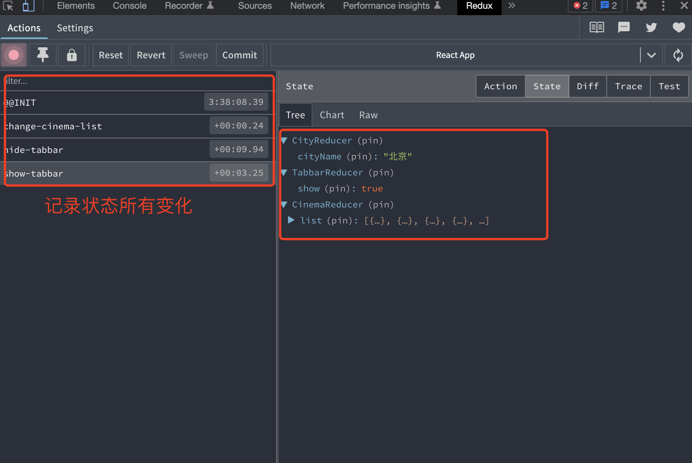

React是一个UI框架，

# 1、脚手架

前提需要安装 node
```
# js版本
npx create-react-app <your-app-name>
# ts版本
npx create-react-app <your-app-name> --template typescript
```
npm包的仓库管理软件
```
npm i -g nrm
```
快速切换源`nrm use <registry name>`

# 2、JSX语法与组件

## 2.1、Jsx语法

`jsx = javascript + xml`；所谓的 JSX 其实就是 JavaScript 对象，所以使用 React 和 JSX 的时候一定要经过编译的过程；

`JSX —使用react构造组件，bable进行编译` —> `JavaScript对象` —> `ReactDOM.render()` —> `DOM元素` —> `插入页面`

```js
import React from 'react';
import ReactDOM from 'react-dom';
ReactDOM.render(
    React.createElement("div", {
        id: "aaa",
        class: "bbb"
    }, "Welcome"),
    document.getElementById("root")
)
```
React18按照如下写法：
```jsx
const container = document.getElementById('root'); // 获取到dom根节点
const root = ReactDOM.createRoot(container); // 将根节点传入到 ReactDOM中创建一个根，并接手管理它里面的DOM
root.render(
    // <React.StrictMode>
        <App />
    // </React.StrictMode>
);
// React.StrictMode 标记是严格模式
```

## 2.2、class组件

react创建组件的方式就是使用的类的继承，ES6 class 是目前官方推荐的使用方式，它使用了ES6标准语法来构建
```js
import React from 'react'
import ReactDOM from 'react-dom'

class App extends React.Component { 
    render () { 
        return ( <h1>欢迎进入React的世界</h1> ) 
    } 
}
ReactDOM.render( <App />, document.getElementById('root') )
```
如果通过定义文件的形式来定义class组件，注意class组件的导入导出；
```js
// class组件文件：app_comp.js
import React from 'react';
class App extends React.Component {
    render() {
        return (
            <div className='app' id='appRoot'>
                <h1 className='title'>欢迎进入React的世界</h1>
                <p>React.js 是一个构建页面 UI 的库 </p>
            </div>)
    }
}
export default App // 注意需要导出

// 另一个文件：index.js
import React from 'react';
import ReactDOM from 'react-dom';
import App from 'app_comp'; // 需要导入App
ReactDOM.render(
    <App />,
    document.getElementById("root")
)
```

**注意：**
- 导入组件默认字母是大写的，如果是小写的会报错：`The tag <app> is unrecognized in this browser. If you meant to render a React component, start its name with an uppercase letters.`
- 定义组件时不能有多个并列的标签，比如下面的，不能存在两个并列的div标签
    ```js
    return (
        <div className='app' id='appRoot'>
            <h1 className='title'>欢迎进入React的世界</h1>
            <p>React.js 是一个构建页面 UI 的库 </p>
        </div>
        <div></div>
        )
    ```

## 2.3、函数式组件

组件名必须大写
```js
// func_comp.js
function App() {
    return (
        <div>
            函数式组件
            <h1>1111111111</h1>
            <h1>2222222222</h1>
        </div>
    )
}
export default App;
// index.js
import React from 'react';
import ReactDOM from 'react-dom';
import App from 'func_comp'; // 需要导入App
ReactDOM.render(
    <App />,
    document.getElementById("root")
)
```

函数式组件与class组件区别：
- 类（class）是数据和逻辑的封装。 也就是说，组件的状态和操作方法是封装在一起的。如果选择了类的写法，就应该把相关的数据和操作，都写在同一个 class 里面；
- 函数一般来说，只应该做一件事，就是返回一个值。 如果你有多个操作，每个操作应该写成一个单独的函数。而且，数据的状态应该与操作方法分离。根据这种理念，React 的函数组件只应该做一件事情：返回组件的 HTML 代码，而没有其他的功能；

纯函数：
- 只进行单纯的数据计算（换算）的函数，在函数式编程里面称为 "纯函数"（pure function）
- 在 React 中，纯函数是指一个函数的返回值只依赖于其输入参数，并且在执行过程中不会产生副作用的函数。React 建议尽量使用纯函数来编写组件，因为这样可以提高代码的可读性、可维护性和可重用性。
- React 组件应该像数学函数一样，根据输入参数（props 和 state）返回一个确定的输出结果（渲染出的 DOM），而不是修改外部状态或产生副作用。这样做的好处是可以避免组件之间的相互影响，提高代码的可预测性和可测试性

## 2.4、组件嵌套

组件之间是可以嵌套的，比如有一个根组件，这个组件中有多个子组件，比如如下代码
```js
import React, { Component } from 'react'
class Navbar extends Component {
    render() {
        return (<div>Navbar</div>)
    }
}
function Swiper() {
    return (<div>Swiper</div>)
}
const Tabbar = () => <div>Tabbar</div>
// Navbar、Swiper、Tabbar 是组件App内部的三个子组件
export default class App extends Component {
    render() {
        return (
            <div>
                <Navbar></Navbar> 
                <Swiper></Swiper>
                <Tabbar></Tabbar>
            </div>
        )
    }
}
```

## 2.5、组件样式

React推荐我们使用行内样式，因为React觉得每一个组件都是一个独立的整体
```js
// index.css
.active{
    background-color: red;
}
// app.js
import "index.css" /*需要导入css文件*/
export default class App extends Component {
    render() {
        var myname = "kerwin"
        var obj = {
            backgroundColor:"yellow",
            fontSize:"30px"
        }
        return (
            <div>
                {10+20}-{myname}
                {10>20?'aaa':'bbb'}
                <div style={obj}>11111111111</div>
                <div style={ {background:"red"} }>2222222222</div>
                {/*如果样式是class，需要通过 className来指定格式*/}
                <div className="active">3333333333333333333333</div> 
            </div>
        )
    }
}
```
**行内样式：**

想给虚拟dom添加行内样式，需要使用表达式传入样式对象的方式来实现：
```js
// 注意这里的两个括号，第一个表示我们在要JSX里插入JS了，第二个是对象的括号
<p style={{color:'red', fontSize:'14px'}}>Hello world</p>
```
如果这么写`<p style='color: red'>1111</p>`，会报错：`The "style" prop expects a mapping from style properties to values, not a string. For example, style={{marginRight: spacing + 'em'}} when using JSX.`；行内样式需要写入一个样式对象，而这个样式对象的位置可以放在很多地方，例如 render 函数里、组件原型上、外链js文件中

**使用class**

React推荐我们使用行内样式，因为React觉得每一个组件都是一个独立的整体；需要注意的是，在React中class 需要写成className （因为毕竟是在写类js代码，会受到js规则的限制，而 class 是关键字）

> class ==> className , for ==> htmlFor(label)

另外对于类似 background-color、font-size 等属性，如果定义在样式对象中，需要按照驼峰命名的方式书写：
```
{
    backgroundColor:"yellow",
    fontSize:"30px"
}
```

## 2.6、事件处理

### 2.6.1、React事件处理

- [React-合成事件](https://tsejx.github.io/react-guidebook/foundation/advanced-guides/synthetic-event)

采用on+事件名的方式来绑定一个事件，注意，这里和原生的事件是有区别的，原生的事件全是小写onclick , React里的事件是驼峰 onClick

React并不会真正的绑定事件到每一个具体的元素上，而是采用事件代理的模式

事件handler写法有四种：
- 直接写行内的箭头函数(不推荐)
- 在组件内使用箭头函数定义一个方法(推荐)
- 直接在组件内定义一个非箭头函数的方法，然后在render里直接使用 `onClick= {this.handleClick.bind(this)} (不推荐)`
- 直接在组件内定义一个非箭头函数的方法，然后在constructor里bind(this)(推荐)

注意，onClick={handleClick} 的结尾没有小括号！不要 调用 事件处理函数：你只需 传递给事件 即可。当用户点击按钮时，React 会调用你的事件处理函数
```js
export default class App extends Component {
    constructor(props) {
        super(props);
        this.handlerClick = this.handlerClick.bind(this, "参数"); // 构造器
    }
    handlerClick(e, arg) {
        console.log(e, arg);
    }
    a = 100;
    render() {
        return (
            <div>
                <input />
                <button onClick={() => {console.log("click1", "处理逻辑过多时不推荐", this.a);}}>add1</button>
                {/* 下面这种方法不推荐，因为其会涉及到 this 作用域问题，函数不需要后面加括号，加了就是加载之后立马执行了，在 handlerClick2 无法使用 this关键字*/}
                <button onClick={this.handlerClick2}>add2</button> 
                {/* 如果要在handlerClick2使用this关键字访问a，需要按照如下方式实现 */}
                <button onClick={this.handlerClick2.bind(this, "绑定事件")}>add2</button> 
                <button onClick={this.handlerClick.bind(this, "构造器")}>构造器绑定</button> 
                {/* 如果不传参可以使用该方式来处理 */}
                <button onClick={this.handlerClick3}>add3</button>
                <button onClick={() => {
                    this.handlerClick4();// 推荐使用，可以传参数
                }}>add4</button>
            </div>
        )
    }
    handlerClick2() {
        // 这里的this作用域是调用者本身，而调用者在这里的是 App里的 render 方法
        console.log("handlerClick2", this.a);
    }
    handlerClick3 = (evt) => {
        console.log("handlerClick3", this.a, evt.target);
    }
    handlerClick4 = () => {
        console.log("handlerClick4", this.a);
    }
}
```
和普通浏览器一样，事件handler会被自动传入一个 event 对象，这个对象和普通的浏览器 event 对象所包含的方法和属性都基本一致。不同的是 React中的 event 对象并不是浏览器提供的，而是它自己内部所构建的。它同样具有 event.stopPropagation 、 event.preventDefault 这种常用的方法
```js
handlerClick3 = (evt) => {
    console.log("handlerClick3", this.a, evt.target);
}
```

### 2.6.2、React事件与DOM原生事件

**绑定原生事件**：通过生命周期函数 componentDidMount 可在组件装载成功并在浏览器拥有真实 DOM 后调用，以此来完成原生事件的绑定
```jsx
import React from 'react';
class NativeEventDemo extends React.Component {
    constructor(props) {
        super(props);
        this.buttonRef = React.createRef();
    }
    componentDidMount() {
        this.buttonRef.addEventListener('click', (e) => {
            this.handleClick(e);
        });
    }
    componentWillUnmount() {
        this.buttonRef.removeEventListener('click');
    }
    handleClick(e) {
        console.log(e);
    }
    render() {
        return <button ref={this.buttonRef}>Test</button>;
    }
}
```
需要注意的是：在 React 中使用 DOM 原生事件时，一定要在组件卸载时手动移除，否则很可能出现内存泄漏的问题。而使用合成事件系统时则不需要，因为 React 内部已经帮你妥善地处理了

**[合成事件与原生事件混用](https://tsejx.github.io/react-guidebook/foundation/advanced-guides/synthetic-event/#%E5%90%88%E6%88%90%E4%BA%8B%E4%BB%B6%E4%B8%8E%E5%8E%9F%E7%94%9F%E4%BA%8B%E4%BB%B6%E6%B7%B7%E7%94%A8)** 

## 2.7、Ref应用

Ref 允许我们访问 DOM 节点或在 render 方法中创建的 React 元素

一般写法：在input上定义一个 ref属性，然后在事件处理中调用:`this.refs,myName` 可以获取到当前节点；
```js
import React, { Component } from 'react'
export default class App extends Component {
    render() {
        return (
            <div>
                <input ref="myName"/>
                <button onClick={() => {
                    console.log("click", this.refs.myName.value);
                }}>add1</button>
            </div>
        )
    }
}
```
但是上述在严格模式下，在控制台会报错，但是还是可以用的
```js
root.render(
    <React.StrictMode>
        <App />
    </React.StrictMode>
);
```
另外一种写法就是定义一个变量，然后在里面引用：
```js
myRef = React.createRef()
<input ref={this.myRef}/>
<button onClick={() => {
    console.log("click", this.myRef.current.value);
}}>add1</button>
```
要获得ref配置的节点的固定写法：`this.<ref-variable-name>.current`，比如这里的 this.myRef.current ；

# 3、组件数据挂载

## 3.1、状态（state）

状态就是组件描述某种显示情况的数据，由组件自己设置和更改，也就是说由组件自己维护，使用状态的目的就是为了在不同的状态下使组件的显示不同(自己管理)

### 3.1.1、定义状态

- 方式1：
    ```js
    export default class App extends Component {
        state = {
            condition: true
        }
        render() {
            return (
                <div>
                    <h1>欢迎来到React开发</h1>
                    <button onClick={() => {
                        this.setState({
                            condition: !this.state.condition
                        })
                    }}>{this.state.condition ? '收藏' : '取消收藏'}</button>
                </div>
            )
        }
    }
    ```
- 方式2：
    ```js
    export default class App extends Component {
        constructor() {
            super() // 注意这里因为App继承了Component，这里需要调用super()
            this.state = {
                text: "收藏",
                condition: true
            }
        }
        render() {
            return (
                <div>
                    <h1>欢迎来到React开发</h1>
                    <button onClick={() => {
                        this.setState({
                            condition: !this.state.condition
                        })
                    }}>{this.state.condition ? '收藏' : '取消收藏'}</button>
                </div>
            )
        }
    }
    ```

### 3.1.2、设置状态：setState

对于状态的更改必须要调用 setState 方式来实现：
```js
this.setState({
    ...
})
```
setState有两个参数：第一个参数可以是对象，也可以是方法return一个对象，我们把这个参数叫做 updater
- 参数是对象：
    ```js
    this.setState({
        condition: !this.state.condition
    })
    ```
- 参数是方法：
    ```js
    this.setState((prevState, props) => {
        return {
            // 注意的是这个方法接收两个参数，第一个是上一次的state, 第二个是props
            condition: !prevState.condition
        }
    })
    ```

**setState 如果是在同步逻辑中是异步的更新的，所以想要获取到最新的state，没有办法获取，就有了第二个参数，这是一个可选的回调函数**
```js
this.setState((prevState, props) => {
    return {
        // 注意的是这个方法接收两个参数，第一个是上一次的state, 第二个是props
        condition: !prevState.condition
    }
}, () => {
    console.log('回调里的',this.state.condition)
})
console.log('setState外部的',this.state.condition)
```
$\color{blue}{但是如果 setState 在异步的逻辑中执行，同步更新状态，比如 setTimeout，看如下代码}$
```js
handleAdd2 = () => {
    setTimeout(() => {
        this.setState({ count: this.state.count + 1 })
        console.log(this.state.count)
        this.setState({ count: this.state.count + 1 })
        console.log(this.state.count)
        this.setState({ count: this.state.count + 1 })
        console.log(this.state.count)
    }, 0);
}
```
$\color{red}{注意：有一点需要注意：在最新的React18中，不管是出在同步还是异步的逻辑中， setState 都是同步的；要获取最新的值只能通过 setState函数的第二个的回调参数}$

## 3.3、数据渲染

列表渲染，一般可以使用数组的map函数，比如说数据是
```js
export default class App extends Component {
    state = {
        list: ["1111", "2222", "3333"]
    }
    render() {
        // 也可以定义变量的方式
        // var newList = this.state.list.map(item => <li>{item}</li>)
        return (
            <div>
                <ul>
                    {/* {
                        newList
                    } */}
                    {
                        this.state.list.map(
                            (item, index) => <li key={index}>{item}</li>
                        )
                    }
                </ul>
            </div>
        )
    }
}
```
React的高效依赖于所谓的 Virtual-DOM，尽量不碰 DOM。对于列表元素来说会有一个问题：元素可能会在一个列表中改变位置。要实现这个操作，只需要交换一下 DOM 位置就行了，但是React并不知道其实我们只是改变了元素的位置，所以它会重新渲染后面两个元素（再执行 Virtual-DOM ），这样会大大增加 DOM 操作。但如果给每个元素加上唯一的标识，React 就可以知道这两个元素只是交换了位置，这个标识就是 key ，这个 key 必须是每个元素唯一的标识

## 3.4、dangerousHtml

如果需要展示富文本数据，或者展示后端返回的html数据，可以使用： dangerousSetInnerHTML 来实现：
```js
<span dangerouslySetInnerHTML={
    {
        __html: item.name
    }
}></span>
```
上面的 `__html` 是固定写法，即显示具体的包含html标签的文本

> 注意这里处理的文本必须是足够信任的数据，否则容易被人攻击；

## 3.5、条件渲染

条件渲染，可以通过三目运算符来渲染：
- `{ {this.state.list.length === 0 ? <div>暂无内容</div> : null} }`
- `{this.state.list.length === 0 && <div>暂无内容</div>}`

可以通过样式来控制条件渲染，这种就是本身节点已经存在了，前面两种呢不显示就是节点不存在的
`{<div className={this.state.list.length === 0 ? '' : 'hidden'}>暂无内容</div> }`

## 3.6、属性

props 是正常是外部传入的，组件内部也可以通过一些方式来初始化的设置，属性不能被组件自己更改，但是可以通过父组件主动重新渲染的方式来传入新的 props；

属性是描述性质、特点的，组件自己不能随意更改。

### 3.6.1、基本使用

总的来说，在使用一个组件的时候，可以把参数放在标签的属性当中，所有的属性都会作为组件 props 对象的键值。通过箭头函数创建的组件，需要通过函数的参数来接收 props

比如有一个Navbar组件
```jsx
// Navbar.js
export default class Navbar extends Component {
    render() {
        // 展开赋值，对象解构，title 对应属性名称
        let { title, leftShow } = this.props
        return (
            <div>
                {leftShow && <button>返回</button> }
                Navbar-{title}
                <button>Home</button>
            </div>
        )
    }
}
// App.js
export default class App extends Component {
    render() {
        return (
            <div>
                <div>
                    <h2>首页</h2>
                    <Navbar title="首页" leftShow={false}/>
                </div>
                    <h2>列表</h2>
                    <Navbar title="列表" leftShow={true} />
                </div>
            </div>
        )
    }
}
```
- 在组件上通过`key=value`写属性,通过`this.props`获取属性,这样组件的可复用性提高了；
- 注意，在传参数时，对于布尔类型，不能写成：`leftShow="false"`，可以写成如下：`leftShow={false}`；
- 属性赋值，可以通过如下方式：`let { title, leftShow } = this.props`

类组件一般是通过上面写法：`this.props` 来实现的

但是，对于函数式组件，就不能按照上面的写法，因为函数没有 this，需要通过形参传入的方式：
```jsx
import React from 'react'

export default function Sidebar(props) {
    console.log(props) // 这里接收的就是传入的属性
    var {title} = props
    return (
        <div>
            <ul>
                <li>1111111</li>
                <li>1111111</li>
            </ul>
        </div>
    )
}
```

### 3.6.2、属性验证

前面讲到，对于布尔类型的赋值，如果写成：`leftShow="false"`，那么在使用的时候直接作为判断条件是无法生效的，因为其是一个字符串；

为了对属性的类型作验证，可以使用如下方式：
```jsx
// 类组件和函数式组件都可以按照如下方式写
import propTypes from 'prop-types'
Navbar.propTypes = {
    title: propTypes.string,
    leftShow: propTypes.bool // 定义该属性为 bool，如果传字符串，控制台会报错；
}
```
或者直接使用类属性的定义方式：（只支持类属性的写法）
```jsx
import propTypes from 'prop-types'
export default class Navbar extends Component {
    static propTypes = {
        title: propTypes.string,
        leftShow: propTypes.bool
    }
    render() {
        ...
    }
}
```

### 3.6.3、默认属性值

```jsx
// 类组件和函数式组件都支持该写法：defaultProps 是固定写法
Navbar.defaultProps = {
    leftShow: true
}
// 或者写成如下写法：
static defaultProps = {
    leftShow: true
}
```

### 3.6.4、注意点

如果定义的对象内部的属性跟引用组件用到的属性是一致的，那么可以直接用简写的写法：`{...obj}`，即对象解构
```jsx
export default class App extends Component {
    render() {
        var obj = {
            title: "测试",
            leftShow : false,
        }
        return (
            <div>
                <div>
                    <h2>首页</h2>
                    <Navbar title="首页" leftShow={false} />
                </div>
                <div>
                    <h2>测试属性相同</h2>
                    {/* 属性相同 */}
                    <Navbar {...obj}/>
                </div>
            </div>
        )
    }
}
```

### 3.6.5、属性与状态

- 相似点：都是纯js对象，都会触发render更新，都具有确定性（状态/属性相同，结果相同）
- 不同点：
    - 属性能从父组件获取，状态不能
    - 属性可以由父组件修改，状态不能
    - 属性能在内部设置默认值，状态也可以，设置方式不一样
    - 属性不在组件内部修改，状态要在组件内部修改
    - 属性能设置子组件初始值，状态不可以
    - 属性可以修改子组件的值，状态不可以

`state` 的主要作用是用于组件保存、控制、修改自己的可变状态。 state 在组件内部初始化，可以被组件自身修改，而外部不能访问也不能修改。你可以认为 `state` 是一个局部的、只能被组件自身控制的数据源。 state 中状态可以通过 `this.setState` 方法进行更新， setState 会导致组件的重新渲
染。

`props` 的主要作用是让使用该组件的父组件可以传入参数来配置该组件。它是外部传进来的配置参数，组件内部无法控制也无法修改。除非外部组件主动传入新的 props ，否则组件的 props 永远保持不变。

没有 state 的组件叫无状态组件（stateless component），设置了 state 的叫做有状态组件（stateful component）。因为状态会带来管理的复杂性，我们尽量多地写无状态组件，尽量少地写有状态的组件。这样会降低代码维护的难度，也会在一定程度上增强组件的可复用性

### 3.6.6、特殊属性

什么是插槽，其实是一个特殊的props（children）来将这些无法提前预知内容的子组件传递到渲染到结果中；jsx中的所有内容都会通过children prop传递到父组件中，使用react组合的方式可以实现类似于Vue插槽的功能；

基本使用：
```jsx
export default class App extends Component {
    render() {
        return (
            <div>
                <Child>
                    <div>111111111</div>
                    <div>222222222</div>
                    <div>333333333</div>
                </Child>
            </div>
        )
    }
}
class Child extends Component {
    render() {
        return (
            <div>
                App
                {this.props.children[0]}
                {this.props.children[2]}
                {this.props.children[1]}
            </div>
        )
    }
}
```
`this.prop.children` 如果有多个可以是数字，读取的是 Child 组件的子标签

插槽用处：
- 为了复用，比如你实现了一个轮播组件，就可以使用插槽的方式实现，因为你不确定使用方想用标签来操作
- 一定程度上减少父子通信

# 4、表单中的受控组件与非受控

## 4.1、非受控组件

React要编写一个非受控组件，可以 使用 ref 来从 DOM 节点中获取表单数据，就是非受控组件；因为非受控组件将真实数据储存在 DOM 节点中，所以在使用非受控组件时，有时候反而更容易同时集成 React 和非 React 代码。如果你不介意代码美观性，并且希望快速编写代码，使用非受控组件往往可以减少你的代码量。否则，你应该使用受控组件
```jsx
import React, { Component } from 'react'
export default class App extends Component {
    textRef = React.createRef();
    render() {
        return (
            <div>
                <h1>登录页</h1>
                <input ref={this.textRef} value="Jayden"/>
                <button onClick={() => {
                    console.log(this.textRef.current.value);
                }}>登录</button>
                <button onClick={() => {
                    this.textRef.current.value = ""
                }}>重置</button>
            </div>
        )
    }
}
```
**默认值：**
在 React 渲染生命周期时，表单元素上的 value 将会覆盖 DOM 节点中的值，在非受控组件中，你经常希望 React 能赋予组件一个初始值，但是不去控制后续的更新。 在这种情况下, 你可以指定一个 `defaultValue` 属性，而不是 value
```jsx
<input ref={this.textRef} defaultValue="Jayden"/>
```
同样，`<input type="checkbox">` 和 `<input type="radio">` 支持 defaultChecked ， `<select>` 和 `<textarea>` 支持 defaultValue

## 4.2、受控组件

由于在表单元素上设置了 value 属性，因此显示的值将始终为 this.state.value ，这使得 React 的 state 成为唯一数据源。由于 handlechange 在每次按键时都会执行并更新 React 的 state，因此显示的值将随着用户输入而更新。
```jsx
import React, { Component } from 'react'
export default class App extends Component {
    state = {
        username: "Jayden"
    }
    render() {
        return (
            <div>
                {/* 如果使用value属性赋值， 必须要有一个 onChange 事件处理 */}
                <input value={this.state.username} onChange={(evt) => {
                    this.setState({ username: evt.target.value })
                }} />
                <button onClick={() => {
                    console.log(this.state.username);
                }}>登录</button>
                <button onClick={() => {
                    this.setState({
                        username : ""
                    })
                }}>重置</button>
            </div>
        )
    }
}
```
对于受控组件来说，输入的值始终由 React 的 state 驱动。你也可以将 value 传递给其他 UI 元素，或者通过其他事件处理函数重置，但这意味着你需要编写更多的代码；也就是说会重新调用render函数

> React组件的数据渲染是否被调用者传递的 props 完全控制，控制则为受控组件，否则非受控组件

# 5、组件通信方式

## 5.1、父子组件通信方式

**受控组件中父子组件通信**：父传子：属性方式；子传父：回调函数
```jsx
class Navbar extends Component {
    render() {
        return (
            <div style={{ background: "red", width: "200px" }}>
                <button onClick={() => {
                    // 调用父类传递的属性，其实这个属性是一个回调函数，可以直接执行
                    this.props.callback()
                }}>click</button>
                <span>Navbar</span>
            </div>
        )
    }
}
class Sidebar extends Component {
    render() {
        return (
            <div style={{ background: "yellow" }}>
                <ul>
                    <li>1111111</li>
                </ul>
            </div>
        )
    }
}
// App 组件包含两个子组件，现在需要通过Navbar组件控制Sidebar组件的显示与否
export default class App extends Component {
    state = {
        isSidebarShow: true,
    }
    render() {
        return (
            <div>
                <Navbar callback={this.handlerChildEvent} />
                {this.state.isSidebarShow && <Sidebar />}
            </div>
        )
    }
    // 该函数被子类通知调用
    handlerChildEvent = () => {
        this.setState({
            isSidebarShow : !this.state.isSidebarShow
        })
    }
}
```

**表单域组件中父子通信方式：**ref标记 (父组件拿到子组件的引用，从而调用子组件的方法)；在父组件中清除子组件的input输入框的value值。`this.refs.form.reset()`
```jsx
class Field extends Component {
    state = {
        value: ""
    }
    clear(){
        this.setState({ value: "" })
    }
    render() {
        return (
            <div style={{ background: "yellow" }}>
                <label>{this.props.label}</label>
                <input type={this.props.type} onChange={(evt) => {
                    this.setState({
                        value: evt.target.value
                    })
                }} value={this.state.value}/>
            </div>
        )
    }
}
export default class App extends Component {
    username = React.createRef();
    password = React.createRef();
    render() {
        return (
            <div>
                <h2>登录页面</h2>
                <Field label="用户名:" type="text" ref={this.username} />
                <Field label="密码:" type="password" ref={this.password} />
                <button onClick={() => {
                    console.log("username:", this.username.current.state.value)
                    console.log("password:", this.password.current.state.value)
                }}>登录</button>
                <button onClick={() => {
                    this.username.current.clear();
                    this.password.current.clear();
                }}>取消</button>
            </div>
        )
    }
}
```

## 5.2、非父子组件通信方式

### 5.2.1、状态提升

状态提升（中间人模式）：React的状态提升，就是将多个组件需要共享的状态提升到它们最近的父组件上。在父组件上改变这个状态然后通过props分发给子组件；大致思路：先在父组件A上定义一个状态，然后在A1组件上调用A传递过来的属性回调函数，通过回调函数设置到状态值，再通过属性分发到A2组件上；

详细代码参考：[state_enhance](https://gitee.com/chenlanqing/react-basic/blob/master/src/02-advanced/05_state_enhance.js)

### 5.2.2、发布订阅模式

发布订阅模式实现

详细代码参考：[pub_sub](https://gitee.com/chenlanqing/react-basic/blob/master/src/02-advanced/06_pub_sub.js)

### 5.2.3、context状态树

[Context](https://react.dev/reference/react/createContext)状态树参考：Context 提供了一个无需为每层组件手动添加 props，就能在组件树间进行数据传递的方法
  
主要步骤：
- 先定义全局对象：`const GlobalContext = React.createContext();`
- 并使用`GlobalContext.Provider（生产者）`
    ```jsx
    render() {
        return (
            <GlobalContext.Provider value={{
                info: this.state.info,
                changeInfo: (value) => {
                    this.setState({
                        info: value
                    })
                }
            }}>
                <div>
                    {
                        this.state.filmList.map(item =>
                            <FilmItem key={item.filmId} {...item}></FilmItem>
                        )
                    }
                    <FilmDetail></FilmDetail>
                </div>
            </GlobalContext.Provider>
        )
    }
    ```
- 任意组件引入GlobalContext并调用context，使用GlobalContext.Consumer（消费者）
    ```jsx
    render() {
        return (
            <GlobalContext.Consumer>
                {
                    (value) => {
                        return (
                            <div className="filmDetail">
                                {value.info}
                            </div>
                        )
                    }
                }
            </GlobalContext.Consumer>
        )
    }
    ```
注意：`GlobalContext.Consumer`内必须是回调函数，通过context方法改变根组件状态

详细代码参考：[context](https://gitee.com/chenlanqing/react-basic/blob/master/src/02-advanced/07_context.js)

# 6、生命周期

- [React Guidebook-生命周期](https://tsejx.github.io/react-guidebook/foundation/main-concepts/lifecycle)

指的是类的生命周期，生命周期指 React 组件从装载至卸载的全过程，这个过程内置多个函数供开发者在组件的不同阶段执行需要的逻辑

详细生命周期，参考：[main-concepts/lifecycle.md](https://github.com/chenlanqing/react-guidebook/blob/master/docs/foundation/main-concepts/lifecycle.md)

## 6.1、装载阶段

组件的渲染并且构造 DOM 元素插入到页面的过程称为组件的初始化，

装载阶段执行的函数会在组件实例被创建和插入 DOM 中时被触发，这个过程主要实现组件状态的初始化

### constructor

构造函数，语法：`constructor(props, context, updater)`
- `props`：继承 React.Component 的属性方法，它是不可变的 read-only
- `context`：全局上下文。
- `updater`：包含一些更新方法的对象
    - `this.setState` 最终调用的是 `this.updater.enqueueSetState`
    - `this.forceUpdate` 最终调用的是 `this.updater.enqueueForceUpdate` 方法，所以这些 API 更多是 React 调用使用，暴露出来以备开发者不时之需；

**触发时机**：在组件初始化的时候触发一次；

**使用建议**：
- 设置初始化状态：因为组件的生命周期中任何函数都可能要访问 State，那么整个周期中第一个被调用的构造函数便是初始化 state 最理想的地方；
- 绑定成员函数上下文引用：建议定义函数方法时直接使用箭头函数，就无须在构造函数中进行函数的 bind 操作。

在 ES6 中，在构造函数中通过 this.state 赋值完成状态初始化；通过给类属性（注意是类属性，而不是类实例对象的属性）defaultProps 赋值指定的 props 初始值。
```jsx
class Sample extends React.Component {
  constructor(props, context, updater) {
    super(props);
    this.state = {
      foo: 'InitailValue',
    };
  }
}
Sample.defaultProps = {
  bar: 'InitialValue',
};
```

### static getDerivedStateFromProps

**语法**：`static getDerivedStateFromProps(nextProps, prevState)`

**触发时机**：该函数会在组件化实例化后和重新渲染前调用（生成 VirtualDOM 之后，实际 DOM 挂载之前），意味着无论是父组件的更新、props 的变化或通过 setState 更新组件内部的 State，它都会被调用；

**返回值**：该生命周期函数必须有返回值，它需要返回一个对象来更新 State，或者返回 null 来表明新 props 不需要更新任何 state；

**新特性**：当组件实例化时，该方法替代了 componentWillMount，而当接收新的 props 时，该方法替代了 componentWillReceiveProps 和 componentWillUpdate

**注意事项：**
- 在组件装载和更新阶段都会触发。
- 如果父组件导致了组件的重新渲染，即使属性没有更新，这一方法也会被触发；
- 如果你只想处理 props 的前后变化，你需要将上一个 props 值存到 state 里作为镜像；
- 该生命周期函数是一个静态函数，所以函数体内无法访问指向当前组件实例的指针 this；
- 当需要更新 state 时，需要返回一个对象，否则，返回一个 null

**适用场景**：表单获取默认值

> 为什么该生命周期函数要设计成静态方法呢？

该生命周期函数被设计成静态方法的目的是为了**保持该方法的纯粹**。通过更具父组件输入的 `props` 按需更新 `state`，这种 `state` 叫做衍生 `state`，返回的对象就是要增量更新的 `state`，除此之外不应该在里面执行任何操作。

通过设计成静态方法，能够起到限制开发者无法访问 `this` 也就是实例的作用，这样就不能在里面调用实例方法或者 `setState` 以破坏该生命周期函数的功能。

这个生命周期函数也经历了一些波折，原本它是被设计成 `初始化`、`父组件更新` 和 `接收到 Props` 才会触发，现在只要渲染就会触发，也就是 `初始化` 和 `更新阶段` 都会触发。

**示例：**
```jsx
static getDerivedStateFromProps(nextProps, prevState) {
  if (nextProps.translateX !== prevState.translateX) {
    return {
      translateX: nextProps.translateX
    }
  }
  if (nextProps.data !== prevState.data){
      return {
          data: nextProps.data
      }
  }
  return null;
}
```

### componentWillMount

> 使用该函数会告警：aRct-dom.development.js:86 Warning: componentWillMount has been renamed, and is not recommended for use. See https://reactjs.org/link/unsafe-component-lifecycles for details.

* Move code with side effects to componentDidMount, and set initial state in the constructor.
* Rename componentWillMount to UNSAFE_componentWillMount to suppress this warning in non-strict mode. In React 18.x, only the UNSAFE_ name will work. To rename all deprecated lifecycles to their new names, you can run `npx react-codemod rename-unsafe-lifecycles` in your project source folder.

> 此生命周期函数将在 React v17 正式废弃。

**预装载函数**。

**触发时机**：在构造函数和装载组件（将 DOM 树渲染到浏览器中）之间触发。装载组件后将执行 `render` 渲染函数。因此在此生命周期函数里使用 `setState` 同步设置组件内部状态 `state` 将不会触发重新渲染。

**注意事项**：避免在该方法中引入任何的副作用（Effects）或订阅（Subscription）。对于这些使用场景，建议提前到构造函数中。

### render

渲染函数，保持 render() 纯粹，可以使服务器端渲染更加切实可行，也使组件更容易被理解

### componentDidMount

装载成功函数，组件完全挂载到网页上后触发。

适用场景：发送网络请求；任何依赖于 DOM 的初始化操作；添加事件监听；如果使用了 Redux 之类的数据管理工具，也能触发 action 处理数据变化逻辑

## 6.2、更新阶段

属性（Props）或状态（State）的改变会触发一次更新阶段，但是组件未必会重新渲染，这取决于 shouldComponentUpdate

- `UNSAFE_componentWillReceiveProps(nextProps)`：当父组件的渲染函数被调用，在渲染函数中被渲染的子组件就会经历更新阶段，不管父组件传给子组件的 props 有没有改变，都会触发该生命周期函数。当组件内部调用 setState 更新内部状态 state 时触发更新阶段不会触发该函数；适合用于父子组件之间的联动，适合父组件根据某个状态控制子组件的渲染或者销毁。通过对比 this.props 和 nextProps 来对本组件内的 state 进行变更，或执行某些方法来进行组件的重新渲染
- `static getDerivedStateFromProps`
- `shouldComponentUpdate` : 返回false 会阻止组件渲染，请勿在此函数中使用 setState 方法，会导致循环调用；如果性能是个瓶颈，尤其是有几十个甚至上百个组件的时候，使用 shouldComponentUpdate 可以优化渲染效率，提升应用的性能；
- `UNSAFE_componentWillUpdate`
- `render`
- `getSnapshotBeforeUpdate`：该生命周期函数会在组件即将挂载时触发，它的触发在 render 渲染函数之后。由此可见，render 函数并没有完成挂载操作，而是进行构建抽象 UI（也就是 Virtual DOM）的工作。该生命周期函数执行完毕后就会立即触发 componentDidUpdate 生命周期钩子；作用：比如网页滚动位置，不需要它持久化，只需要在组件更新以后能够恢复原来的位置即可。
- `componentDidUpdate`

相比装载阶段的生命周期函数，更新阶段的生命周期函数使用的相对来说要少一些。常用的是 getDerivedStateFromProps、shouldComponentUpdate，前者经常用于根据新 props 的数据去设置组件的 State，而后者则是常用于优化，避免不必要的渲染

## 6.3、卸载阶段

- componentWillUnmount：在组件卸载和销毁之前触发。可以利用这个生命周期方法去执行任何清理任务。用于注销事件监听器；取消网络请求；取消定时器；解绑 DOM 事件。

## 6.4、捕捉错误

- static getDerivedStateFromError
- componentDidCatch

## 6.5、性能优化方案：

- shouldComponentUpdate : 控制组件自身或者子组件是否需要更新，尤其在子组件非常多的情况下， 需要进行优化；
- PureComponent：PureComponent会帮你 比较新props 跟 旧的props， 新的state和老的state（值相等,或者对象含有相同的属性、且属性值相等 ），决定 shouldComponentUpdate 返回true 或者false， 从而决定要不要呼叫 render function。

    注意：如果你的 state 或 props 『永远都会变』，那 PureComponent 并不会比较快，因为shallowEqual 也需要花时间。

# 7、React Hooks

- [ReactHooks最佳实践](https://github.com/ascoders/weekly/blob/master/%E5%89%8D%E6%B2%BF%E6%8A%80%E6%9C%AF/120.%E7%B2%BE%E8%AF%BB%E3%80%8AReact%20Hooks%20%E6%9C%80%E4%BD%B3%E5%AE%9E%E8%B7%B5%E3%80%8B.md)
- [react-hooks-principles-and-best-practices](https://learnku.com/docs/antd-pro/5/react-hooks-principles-and-best-practices/11083)

React Hooks 是 React 16.8 引入的新特性，允许我们在不使用 Class 的前提下使用 state 和其他特性。React Hooks 要解决的问题是状态共享，是继 render-props 和 higher-order components 之后的第三种状态逻辑复用方案，不会产生 JSX 嵌套地狱问题

## 7.1、使用hooks理由

- 高阶组件为了复用，导致代码层级复杂；
- 生命周期的复杂；
- 写成  function组件，无状态组件，因为需要状态，又改成了class，成本偏高；

## 7.2、useState(保存组件状态)

在函数式组件中使用组件状态
```js
const [state, setState] = useState(initialState)
// state --- 变量
// initialState --- 变量的初始值
// setState 是一个方法，表示修改该值的方法
```
案例：
```jsx
import React, { useState } from 'react'
export default function App() {
    const [name, setName] = useState("张无忌")
    return (
        <div>
            <button onClick={() => {
                setName("周芷若")
            }}>修改</button>
            function-{name}
        </div>
    )
}
```

## 7.3、useEffect和useLayoutEffect

- [useEffect使用API](https://tsejx.github.io/react-guidebook/api-reference/hooks/use-effect)


函数式组件是不存在生命周期的，所以不要把 类组件 的生命周期概念搬过来试图对号入座
```js
useEffect(() => { 
    //effect 
    return () => { 
        //cleanup 
    }; 
}, [依赖的状态;空数组,表示不依赖])
```
举例来说，我们希望组件加载以后，网页标题（document.title）会随之改变。那么，改变网页标题这个操作，就是组件的副效应，必须通过`useEffect()` 来实现；`useEffect()`的作用就是指定一个副效应函数，组件每渲染一次，该函数就自动执行一次。组件首次在网页 DOM 加载后，副效应函数也会执行

其有两个参数：
- 第一个参数：是一个函数，它就是所要完成的副效应（改变网页标题）。组件加载以后，React 就会执行这个函数
- 第二个参数：有时候，我们不希望useEffect()每次渲染都执行，这时可以使用它的第二个参数，使用一个数组指定副效应函数的依赖项，只有依赖项发生变化，才会重新渲染；如果第二个参数是一个空数组，就表明副效应参数没有任何依赖项。因此，副效应函数这时只会在组件加载进入 DOM 后执行一次，后面组件重新渲染，就不会再次执行

比如想在函数式组件实现请求数据，可以使用useEffect示例：
```js
import React, { useEffect, useState } from 'react'
export default function App() {
    const [list, setList] = useState([])
    useEffect(() => {
        axios.get("/test.json").then(res => {
            console.log(res.data)
            setList(res.data.data.films)
        })
    }, []) // 传空数组
    return (
        <div>
            <ul>
                {
                    list.map(item => 
                        <li key={item.filmId}>{item.name}</li>    
                    )
                }
            </ul>
        </div>
    )
}
```
默认情况下，effect 将在每轮渲染结束后执行，这样的话，一旦 effect 的依赖发生变化，它就会被重新创建；要实现这一点，可以给 useEffect 传递第二个参数，它是 effect 所依赖的值数组。更新后的示例如下：
```js
import React, { useEffect, useState } from 'react'
export default function App() {
    const [name, setName] = useState("sam")
    useEffect(
        () => {
            setName(name.substring(0, 1).toUpperCase() + name.substring(1))
        },
        [name] // 第一次执行一次，之后 name（依赖）更新之后也会执行，如果这里是个空数组，那么上面的 setName函数不会执行
    )
    return (
        <div>
            App-{name} <br/>
            <input type="text" onChange={(evt) => {
                setName(evt.target.value);
            }}/>
        </div>
    )
}
```
**useEffect() 的返回值**：副效应是随着组件加载而发生的，那么组件卸载时，可能需要清理这些副效应，useEffect()允许返回一个函数，在组件卸载时，执行该函数，清理副效应。如果不需要清理副效应，useEffect()就不用返回任何值。实际使用中，由于副效应函数默认是每次渲染都会执行，所以清理函数不仅会在组件卸载时执行一次，每次副效应函数重新执行之前，也会执行一次，用来清理上一次渲染的副效应
```js
function Child() {
    useEffect(() => {
        window.onresize = () => {
            console.log("resize")
        }
        var timer = setInterval(() => {
            console.log("111")
        }, 1000)
        // 返回一个清除函数，比如这里清除定时器等等
        return () => {
            console.log("组件销毁")
            window.onresize = null
            clearInterval(timer)
        }
    }, [])
    return <div>
        child
    </div>
}
```
**useEffect() 的用途**
- 获取数据（data fetching）
- 事件监听或订阅（setting up a subscription）
- 改变 DOM（changing the DOM）
- 输出日志（logging）

> 使用useEffect()时，有一点需要注意。如果有多个副效应，应该调用多个useEffect()，而不应该合并写在一起
> 与 componentDidMount、componentDidUpdate 不同的是，在浏览器完成布局与绘制之后，传给 useEffect 的函数会 延迟调用。这使得它适用于许多常见的副作用场景，比如设置订阅和事件处理等情况，因此 不应在函数中执行阻塞浏览器更新屏幕 的操作

## 7.4、useLayoutEffect

useLayoutEffect 相比 useEffect，通过同步执行状态更新可解决一些特性场景下的页面闪烁问题；

useLayoutEffect与useEffect区别：简单来说就是调用时机不同， useLayoutEffect 和原来 componentDidMount & componentDidUpdate 一致，在react完成DOM更新后马上同步调用的代码，会阻塞页面渲染。而 useEffect 是会在整个页面渲染完才会调用的
代码；

官方建议优先使用 useEffect；

在实际使用时如果想避免页面抖动（在 useEffect 里修改DOM很有可能出现）的话，可以把需要操作DOM的代码放在 useLayoutEffect 里。在这里做点dom操作，这些dom修改会和 react 做出的更改一起被一次性渲染到屏幕上，只有一次回流、重绘的代价

```js
export default function App() {
    const [count1, setCount1] = useState(0);
    const [count2, setCount2] = useState(0);

    const random = () => {
        return 10 + Math.random() * 200
    }
    useEffect(() => {
        if (count1 === 0) {
            setCount1(random());
        }
    }, [count1]);
    useLayoutEffect(() => {
        if (count2 === 0) {
            setCount2(random());
        }
    }, [count2]);
    return (
        <div className="useLayoutEffect">
             {/* 点击useEffect上面的数字会有闪烁 */}
            <div onClick={() => setCount1(0)}>useEffect：{count1}</div>
            <div onClick={() => setCount2(0)}>useLayoutEffect：{count2}</div>
        </div>
    );
}
```

## 7.5、useCallback

记忆函数，防止因为组件重新渲染，导致方法被重新创建，起到缓存作用；只有第二个参数 变化了，才重新声明一次
```jsx
var handlerChange = useCallback(
    (evt) => {
        console.log(evt.target.value)
    }, []
)
var handlerClick = useCallback(() => {
        console.log(name)
    },
    [name]
)
```
上面示例中：
- handlerClick 只有name改变后，这个函数才会重新声明一次；如果传入空数组，那么就是第一次创建后就被缓存， 如果name后期改变了,拿到的还是老的name；如果传第二个参数，且不是空数组，每次都会重新声明一次，拿到的就是最新的name.
- handlerChange 因为第二个参数是空数组，那么创建后就会被缓存，因为其不依赖任何变量；

## 7.6、useMemo

记忆组件，示例：
```jsx
const memoizedResult = useMemo(() => {
  return expensiveFunction(propA, propB);
}, [propA, propB]);
```
把 `创建 函数`和`依赖项数组`作为参数传入 useMemo，它仅会在某个依赖项改变时才重新计算 memoized 值。这种优化有助于避免在每次渲染时都进行高开销的计算；

记住，传入 useMemo 的函数会在渲染期间执行。请不要在这个函数内部执行与渲染无关的操作，诸如副作用这类的操作属于 useEffect 的适用范畴，而不是 useMemo

useCallback 的功能完全可以由 useMemo 所取代，如果你想通过使用 useMemo 返回一个记忆函数也是完全可以的
```jsx
useCallback(fn, inputs) <===> useMemo(() => fn, inputs)
```
唯一的区别是：useCallback 不会执行第一个参数函数，而是将它返回给你，而 useMemo 会执行第一个函数并且将函数执行结果返回给你。所以在前面的例子中，可以返回 handleClick 来达到存储函数的目的。

所以 useCallback 常用记忆事件函数，生成记忆后的事件函数并传递给子组件使用。而 useMemo 更适合经过函数计算得到一个确定的值，比如记忆组件

## 7.7、useRef

保存引用值，useRef 返回一个可变的 ref 对象，其 `<ref>.current` 属性被初始化为传入的参数（initialValue）。返回的 ref 对象在组件的整个生命周期内保持不变；

本质上，useRef 就像是可以在其 `.current` 属性中保存一个可变值的“盒子”；

如果你将 ref 对象以 `<div ref={myRef} />` 形式传入组件，则无论该节点如何改变，React 都会将 ref 对象的 `.current` 属性设置为相应的 DOM 节点
```jsx
const refContainer = useRef(initialValue);
```
示例：
```jsx
import React, { useRef, useState } from 'react'
export default function App() {
    const [count, setCount] = useState(0)
    const countRef = useRef(0) // 保存value，括号内 0 为初始值；
    return (
        <div>
            <button onClick={() => {
                setCount(count + 1)
                countRef.current ++
            }}>增加</button>
            {count} - {countRef.current}
        </div>
    )
}
```

## 7.8、useContext

`const value = useContext(MyContext);` 主要是减少组件层级，为跨级通信提供便利
- 接收一个 context 对象（React.createContext 的返回值）并返回该 context 的当前值。
- 当前的 context 值由上层组件中距离当前组件最近的 `<ContextInstance.Provider>` 的 value 决定。
- 当组件上层最近的 `<ContextInstance.Provider>` 更新时，该 Hook 会触发重渲染，并使用最新传递给 `ContextInstance.<Provider> `的 value 值。即使祖先使用 React.memo 或 shouldComponentUpdate，也会在组件本身使用 useContext 时重新渲染

**别忘记 useContext 的参数必须是 context 对象本身：**
```jsx
const ContextInstance = React.createContext(/* values */);
// 正确
useContext(ContextInstance);
// 错误
useContext(ContextInstance.Consumer);
useContext(ContextInstance.Provider);
```
调用了 useContext 的组件总会在 context 值变化时重新渲染。如果重渲染组件的开销较大，你可以通过使用 memoization 来优化；

useContext(ContextInstance) 相当于 Class 组件中的 `static contextType = ContextInstance` 或者 [<ContextInstance.Consumer>](#523context状态树) ，具体写法如下参考：[useContext Demo](https://gitee.com/chenlanqing/react-basic/blob/master/src/03-hooks/12_useContext.js)

## 7.9、useReducer

- [useReducer高级用法](https://github.com/puxiao/react-hook-tutorial/blob/master/09%20useReducer高级用法.md)
- [Recoil-状态管理库](https://github.com/facebookexperimental/Recoil)

语法：
```jsx
const [state, dispatch] = useReducer(reducer, initialArg, init);
```
useReducer参数分析：
- 第一个参数为处理 state 改变规则的函数 reducer，该参数的含义：
    - 第一个参数为要处理的 state；
    - 第二个参数为 dispatch 绑定的 action（即 dispatch 函数的入参）  
    - 返回更新后的 state  
- 第二个参数是初始 state
- 第三个参数是可选的处理初始 state 的函数 init

以下是使用 useReducer 实现的一个简单计数器：
```jsx
import React, { useReducer } from 'react'
import { Button } from 'antd';
// 处理 state 更新规则的函数，并返回新的 state
const reducer = (prevState, action) => {
    let newState = {...prevState}
    switch (action.type) {
        case "add":
            newState.count++
            return newState;
        case "minus":
            newState.count--
            return newState;
        default:
            return prevState;
    }
}
// 初始化
const initialState = {
    count: 0
}
export default function App() {
    const [state, dispatch] = useReducer(reducer, initialState)
    return (
        <div>
            <Button type="primary" onClick={() => {
                dispatch({
                    type: "add"
                })
            }}>+</Button>
            <div>
                {state.count}
            </div>
            <Button type="primary" onClick={() => {
                dispatch({
                    type: "minus"
                })
            }}>-</Button>
        </div>
    )
}
```

**与useContext配合实现跨级通信**

具体代码查看：[useReducer+useContext实现跨级通信](https://gitee.com/chenlanqing/react-basic/blob/master/src/03-hooks/15_useReducer_film.js)


## 7.10、自定义hook

当想在两个函数之间共享逻辑时，会把它提取到第三个函数中。而组件和 Hook 都是函数，所以也同样适用这种方式；

自定义 Hook 是一个函数，其名称以 “use” 开头，函数内部可以调用其他的 Hook；与 React 组件不同的是，自定义 Hook 不需要具有特殊的标识。可以自由的决定它的参数是什么，以及它应该返回什么（如果需要的话）。换句话说，它就像一个正常的函数。但是它的名字应该始终以 use 开头，这样可以一眼看出其符合 [Hook 的规则](https://legacy.reactjs.org/docs/hooks-rules.html)

**在两个组件中使用相同的 Hook 会共享 state 吗？**不会。自定义 Hook 是一种重用状态逻辑的机制(例如设置为订阅并存储当前值)，所以每次使用自定义 Hook 时，其中的所有 state 和副作用都是完全隔离的

**自定义 Hook 如何获取独立的 state？**每次调用 Hook，它都会获取独立的 state

可以在多个hook之间传递信息

# 8、React路由

- [React-Router](https://reactrouter.com/en/main)
- [React路由](https://tsejx.github.io/react-guidebook/ecosystem/routing/react-router)

路由是根据不同的 url 地址展示不同的内容或页面，

## 8.1、路由安装

React Router 是一个构建在 React 之上的强大的路由库，它有助于向应用程序添加新的 Screen 和 Stream。这使 URL 与网页显示的数据保持同步。它负责维护标准化的结构和行为，并用于开发单页 Web 应用

路由安装：（指定版本安装，不指定就是安装最新版本）
```
npm install react-router-dom@5
```

## 8.2、V5-基本使用

以下是基于react-router-5.0的使用

### 1、导入路由

```js
import React from "react"; 
import { BrowserRouter as Router, Switch, Route, Link } from "react-router-dom";
```

### 2、定义路由以及重定向

```js
<HashRouter>
    <Switch>
        <Route path="/films" component={Films} />
        <Route path="/cinemas" component={Cinemas} />
        <Route path="/center" component={Center} />
        {/* exact 精确匹配 (Redirect 即使使用了exact, 外面还要嵌套Switch 来用)：路由重定向*/}
        <Redirect from="/" to="/films" exact/> 
        <Route path="*" component={NotFound} />
    </Switch>
</HashRouter>
```

### 3、嵌套路由

在上面2的基础上实现嵌套路由：
```js
// 在films组件内部有如下路由：
<Switch>
    <Route path="/films/nowPlaying" component={NowPlaying} />
    <Route path="/films/comingSoon" component={ComingSoon} />
    <Redirect from="/films" to="/films/nowPlaying" />
</Switch>
```

### 4、导航

**声明式导航**

即使用a标签的形式，但是在react-router中使用：
```jsx
{/*其中，to是要跳转的链接，activeClassName表示链接激活的样式*/}
<NavLink to="/films" activeClassName="active">films</NavLink>
<NavLink to="/cinemas" activeClassName="active">cinemas</NavLink>
<NavLink to="/center" activeClassName="active">center</NavLink>
```
上述代码会被翻译成如下：
```html
<a aria-current="page" class="customActive" href="#/center">我的</a>
```
$\color{red}{注意：这里的NavLink必须要放到 Router 节点内部}$

**编程式导航**

即使使用 windows.location.href 来实现跳转的，在React-Router中实现是:
```js
// 方式1：props
props.history.push(url); // this.props.history.push(url)
// 方式2：如果是用函数组件，可以使用 hooks 方式：
import { useHistory } from 'react-router-dom'
const history = useHistory();
history.push(url)
```

### 5、路由传参

主要有三种方式：
- 动态路由：
    - 配置路由：`<Route path="/detail/:filmId" component={Detail} />`，后面的 `:filmId` 表示需要传的参数，注意 `:` 不可缺；
    - 获取参数：`props.match.params.<filmId>`，这里的filmId 就是在动态路由里指定的参数名称；
    - 缺点：只能传字符串，传值过多url会变得很长；参数必须在路由上配置
- query参数的形式
    - 配置路由：`<Route path="/detail" component={Detail} />`
    - 路由跳转时需要做的动作：`history.push({ pathname: '/detail', query: { filmId: id } })`;
    - 获取参数：`props.location.query.filmId`； （ $\color{red}{页面刷新之后，query就没有了，所以刷新时这里会报错}$ ）
- state参数形式
    - 配置路由：`<Route path="/detail" component={Detail} />`
    - 路由跳转时需要做的动作：`history.push({ pathname: '/detail', state: { filmId: id } })`;
    - 获取参数：`props.location.state.filmId`； （ $\color{red}{页面刷新之后，state就没有了，所以刷新时这里会报错}$ ）

注意：上面 query 和 state 的形式 $\color{red}{这种方式刷新之后参数就没有了}$ 

### 6、路由守卫

路由守卫，即路由拦截，当某个页面需要一些权限才能访问时，可以按照如下方式处理：
```jsx
<Route path="/center" render={() => {
    return isAuth() ? <Center /> : <Redirect to="/login" />
}} />
```
上面的意思是要访问center页面，需要判断是否有授权，没有授权，直接重定向到login页面；

注意，这种方式在 Center 组件中是无法获取到 props 的，需要通过如下方式传递：
```jsx
<Route path="/center" render={(props) => {
    return isAuth() ? <Center {...props}/> : <Redirect to="/login" />
}} />
```

### 7、路由模式

HashRouter、BrowserRouter（没有#的路径）朝后端发请求的页面

### 8、withRouter

官方描述：You can get access to the history object’s properties and the closest <Route>'s match via the withRouter higher-order component. withRouter will pass updated match, location, and history props to the wrapped component whenever it renders

主要作用是将一个组件包裹进Route里面, 然后react-router的三个对象history, location, match就会被放进这个组件的props属性中

示例：
```jsx
export default function NowPlaying(props) {
    ...
    return (
        <div style={{ width: '400px', background: 'gray' }}>
            NowPlaying
            <ul>
                {
                    list.map(item =>
                        <WithFilmItem key={item.filmId} {...item}/>
                    )
                }
            </ul>
        </div>
    )
}
function FilmItem(props) {
    let { name, filmId } = props
    return <li onClick={() => {
        props.history.push(`/detail/${filmId}`)
    }}>
        {filmId} - {name}
    </li>

// 使用 withRouter 包装一下，那么在 FilmItem 组件中就可以直接使用props的 history, location, match 属性；
const WithFilmItem = withRouter(FilmItem)
```
主要是解决父子通信的问题，当然这里可以直接使用 useHistory 来实现；

## 8.3、V6-基本使用

以下是基于react-router-6.0的使用

# 9、项目注意

## 9.1、反向代理

开发时，存在跨域问题了，为了解决该问题，可以使用反向代理来解决，反向代理依赖：`https://create-react-app.dev/docs/proxying-api-requests-in-development/`
```bash
# 安装依赖
npm install http-proxy-middleware --save
```
使用：在src目录下新建：`setupProxy.js`，注意文件名和位置都不能错
```js
const { createProxyMiddleware } = require('http-proxy-middleware');
module.exports = function (app) {
    app.use(
        '/api', // 以api开头的接口匹配到了，会使用下面的地址访问服务器
        createProxyMiddleware({
            target: 'http://localhost:8080',
            changeOrigin: true,
        })
    );
};
```

## 9.2、CSS Module

- [Adding a CSS Modules Stylesheet](https://create-react-app.dev/docs/adding-a-css-modules-stylesheet/)

- 创建一个名为 index.module.css 的样式文件
- 在 index.module.css 样式文件中编写 CSS 选择器和普通的 CSS 文件一样（CSS Modules 只是在编译的时候会自动转化为唯一的类名）;
- 在组件中导入样式文件：`import styles from './index.module.css'`
- 通过 styles 对象访问对象中的样式名来设置样式
- 如果想要改变全局样式，也就是使用原始的类名，则需要通过 `:global()` 来进行设置
    ```css
    // index.module.css
    :global(.类名) {
    }
    ```

# 10、Flux与Redux

## 10.1、Flux

- [Flux-Comparison](https://github.com/voronianski/flux-comparison)

Flux 是一种架构思想，专门解决软件的结构问题。它跟MVC架构是同一类东西，但是更加简单和清晰。Flux存在多种实现(至少15种)

Flux将一个应用分成四个部分：
- View： 视图层
- Action（动作）：视图层发出的消息（比如mouseClick）
- Dispatcher（派发器）：用来接收Actions、执行回调函数
- Store（数据层）：用来存放应用的状态，一旦发生变动，就提醒Views要更新页面


Flux 的最大特点，就是数据的"单向流动"：
- 用户访问 View
- View 发出用户的 Action
- Dispatcher 收到 Action，要求 Store 进行相应的更新
- Store 更新后，发出一个"change"事件
- View 收到"change"事件后，更新页面

上面过程中，数据总是"单向流动"，任何相邻的部分都不会发生数据的"双向流动"。这保证了流程的清晰

## 10.2、什么是Redux

Redux最主要是用作应用状态的管理。简言之，Redux用一个单独的常量状态树（state对象）保存这一整个应用的状态，这个对象不能直接被改变。当一些数据变化了，一个新的对象就会被创建（使用actions和reducers），这样就可以进行数据追踪，实现时光旅行；

 redux介绍及设计和使用的三大原则：
 - state以单一对象存储在 store 对象中；
 - state 只读，每次返回一个新对象；
 - 使用纯函数 reducer 执行 state 更新

## 10.3、Redux工作流

https://redux.js.org/tutorials/fundamentals/part-2-concepts-data-flow

## 10.4、Redux基本使用

创建store
```js
import { createStore } from 'redux'
const reducer = (prevState = { show: true }, action) => {
    let newState = { ...prevState }
    switch (action.type) {
        case 'hide-tabbar':
            newState.show = false;
            return newState;
        case 'show-tabbar':
            newState.show = true;
            return newState;
        default:
            return prevState
    }
}
const store = createStore(reducer);
export default store;
```
subscribe订阅事件
```js
export default function App(){
    useEffect(() => {
        var unsubscribe = store.subscribe(
            () => {
                console.log("app", store.getState())
                this.setState({ isShow: store.getState().show })
            }
        )
        return () => {
            // 直接执行 subscribe 返回值，就是取消订阅
            unsubscribe()
        }
        // 注意这里如果订阅了，在组件销毁的时候不要忘了取消订阅，直接执行 store.subscribe 返回值
    ...
    }, [])
}
```
dispatch发布事件：
```js
export default function Detail(props) {
    useEffect(() => {
        store.dispatch({
            type: 'hide-tabbar'
        })
        return () => {
            store.dispatch({
                type: 'show-tabbar'
            })
        }
    }, [])
    ...
}
```

## 10.5、Redux原理

store 是通过 createStore创建出来的， 所以他的结构
```jsx
export const createStore = function(reducer, initialState) { 
    ... return { 
        dispatch, 用于action的分发， 改变store里面的state（currentState = reducer(currentState,action)），并在内部遍历subcribe注册的监听器 
        subscribe, 注册listener， store里面state发生改变后，执行该 listener 
        getState, 取store里面的 state ... 
    } 
}
```
简易实现：
```jsx
function createStore(reducer){ 
    var list = []; 
    var state = reducer(); 
    function subscribe(callback){ 
        list.push(callback); 
    }
    function dispatch(data){ 
        state = reducer(state,data); 
        for(var i in list){ list[i](); 
        } 
    }
    function getState(){ 
        return state; 
    }
    return { subscribe, dispatch, getState } 
}
```

## 10.6、Reducer合并

如果不同的action所处理的属性之间没有联系，可以把 Reducer 函数拆分，不同的函数负责处理不同属性，最终把它们合并成一个大的 Reducer 即可。避免在一个reducer中维护过多的状态，造成代码臃肿；

```js
// 定义CityReducer
const CityReducer = (prevState = {
    cityName: '北京'
}, action) => {
    let newState = { ...prevState }
    switch (action.type) {
        case 'change-city':
            newState.cityName = action.cityName;
            return newState;
        default:
            return prevState
    }
}
// 定义TabbarReducer
const TabbarReducer = (prevState = {
    show: true
}, action) => {
    let newState = { ...prevState }
    switch (action.type) {
        case 'hide-tabbar':
            newState.show = false;
            return newState;
        case 'show-tabbar':
            newState.show = true;
            return newState;
        default:
            return prevState
    }
}
// 合并Reducer
const reducer = combineReducers({
    CityReducer,
    TabbarReducer
})
// 那么访问属性的时候需要按照如下访问：
let cityName = store.getState().CityReducer.cityName
let show = store.getState().CityReducer.show
```

## 10.7、Redux中间件

在redux里，action仅仅是携带了数据的普通js对象。action creator返回的值是这个action类型的对象。然后通过store.dispatch()进行分发。同步的情况下一切都很完美，但是reducer无法处理异步的情况；

那么我们就需要在action和reducer中间架起一座桥梁来处理异步。这就是middleware

**中间件的由来与原理、机制：**
```js
export default function thunkMiddleware({ dispatch, getState }) { 
    return next => action => 
        typeof action === 'function' ? action(dispatch, getState) : next(action); 
}
```
这段代码的意思是，中间件这个桥梁接受到的参数action，如果不是function则和过去一样直接执行next方法(下一步处理)，相当于中间件没有做任何事。如果action是function，则先执行action，action的处理结束之后，再在action的内部调用dispatch。

**常用异步中间件：** 详细代码参考:[Action.js](https://gitee.com/chenlanqing/react-basic/blob/master/src/05-redux/redux/action/getCinemaListAction.js)
- **redux-thunk** (store.dispatch参数可以是一个function)
```js
// store.js 引入 redux-thunk
import { applyMiddleware} from 'redux'
import reduxThunk from 'redux-thunk'
const reducer = combineReducers({
    CinemaReducer
})
const store = createStore(reducer, applyMiddleware(reduxThunk));
export default store;

// action.js
import axios from 'axios'
function getCinemaListAction() {
    return (dispatch) => {
            dispatch({
                type: "change-cinema-list",
                list: res.data.data.cinemas
            })
        })
    }
}
export default getCinemaListAction
```

- **redux-promise** (store.dispatch参数可以是一个promise对象)
```js
// store.js 引入 redux-promise
import { applyMiddleware, createStore } from 'redux'
import CinemaReducer from './reducer/CinemaReducer';
import reduxPromise from 'redux-promise'
const reducer = combineReducers({
    CinemaReducer
})
const store = createStore(reducer, applyMiddleware(reduxPromise));
export default store;

// action.js
function getCinemaListAction() {
    return axios({}).then(res => {
        return {
            type: "change",
            list: res.data
        }
    })
}
export default getCinemaListAction
```

## 10.8、Redux开发组件

为了观察状态，Chrome有个插件：[redux-devtools-extension](https://github.com/zalmoxisus/redux-devtools-extension)
```js
import { createStore, compose} from 'redux'
import reducer from './reducer'
const composeEnhancers = window.__REDUX_DEVTOOLS_EXTENSION_COMPOSE__ || compose; 
const store = createStore(reducer, /* preloadedState, */ composeEnhancers()) 
export default store
```
注意：上述引入redux-devtools-extension在发布生产前需要处理下

在Chrome浏览器上显示如下：



# 11、react-redux

- [react-redux代码](https://github.com/reduxjs/react-redux)

## 11.1、概述

React Redux 是 Redux 的官方 React UI 绑定库。它使得你的 React 组件能够从 Redux store 中读取到数据，并且你可以通过dispatch actions去更新 store 中的 state；

旨在与 React 的组件模型一起使用。你来定义如何从 Redux 中提取组件所需的数据，然后组件即可根据需要自动更新；

提供开箱即用的 API 实现组件与 Redux Store 交互，避免手动编写代码实现逻辑

## 11.2、使用

index.js：根组件引入Provider
```jsx
import ReactDOM from 'react-dom/client';
import { Provider } from 'react-redux'
import store from './06-react-redux/redux/store';
const container = document.getElementById('root');
const root = ReactDOM.createRoot(container);
root.render(
    <Provider store={store}>
        <App />
    </Provider>
);
```
[App.js](https://gitee.com/chenlanqing/react-basic/blob/master/src/06-react-redux/App.js)中使用：
```jsx
import React, { Component } from 'react'
import IndexRouter from './router/IndexRouter'
import Tabbar from './components/Tabbar'
import { connect } from 'react-redux'
class App extends Component {
    render() {
        return (
            <div>
                <IndexRouter>
                    {this.props.isShow && <Tabbar />}
                </IndexRouter>
            </div>
        )
    }
}
const mapStateToProps = (state) => (
    {
        isShow: state.TabbarReducer.show
    }
)
export default connect(mapStateToProps)(App)
```
React-Redux 提供[connect](https://cn.react-redux.js.org/api/connect)方法，用于从 UI 组件生成容器组件。connect的意思，就是将这两种组件连起来

connect是HOC（High order Component）

## 11.3、redux持久化

[redux-persist](https://github.com/rt2zz/redux-persist) 会将redux的store中的数据缓存到浏览器的localStorage中

## 11.4、redux-saga

[redux-saga](https://redux-saga.js.org/) 是一个用于管理应用程序 Side Effect（副作用，例如异步获取数据，访问浏览器缓存等）的 library，它的目标是让副作用管理更容易，执行更高效，测试更简单，在处理故障时更容易

# 12、React其他

## 12.1、Portal

- [React-Portal](https://legacy.reactjs.org/docs/portals.html)

Portal 提供了一种将子节点渲染到存在于父组件以外 DOM 节点的方案；在 React 中，Portal 直接改变了组件的挂载方式，不再是挂载到上层父节点上，而是可以让用户指定一个挂载节点
```js
ReactDOM.createPortal(child,container);
```
比如弹窗：
```js
import React from 'react'
import { createPortal } from 'react-dom'
export default function PortalDialog(props) {
    return createPortal(
        (
            <div style={{
                width: '100%', height: '100%', position: 'fixed', left: 0,
                top: 0, background: 'rgba(0,0,0,0.7)', zIndex: "9999999"
            }}>
                数据正在加载中<br/>
                <button onClick={props.close}>close</button>
            </div>
        ), document.body
    )
}
```
一个典型的用法就是当父组件的dom元素有 overflow:hidden 或者 z-index 样式，而你又需要显示的子元素超出父元素的盒子。举例来说，如对话框，悬浮框，和小提示；

在portal中的事件冒泡：虽然通过portal渲染的元素在父组件的盒子之外，但是渲染的dom节点仍在React的元素树上，在那个dom元素上的点击事件仍然能在dom树中监听到。

## 12.2、懒加载

React懒加载，即 Lazy 和 Suspense，React.lazy 函数能让你像渲染常规组件一样处理动态引入（的组件）。

当你的程序越来越大，代码量越来越多。一个页面上堆积了很多功能，也许有些功能很可能都用不到，但是一样下载加载到页面上，所以这里面肯定有优化空间。就如图片懒加载的理论；

**实现原理：**当 Webpack 解析到该语法时，它会自动地开始进行代码分割(Code Splitting)，分割成一个文件，当使用到这个文件的时候会这段代码才会被异步加载

**解决方案：**在 React.lazy 和常用的三方包 react-loadable ，都是使用了这个原理，然后配合webpack进行代码打包拆分达到异步加载，这样首屏渲染的速度将大大的提高；由于 `React.lazy` 不支持服务端渲染，所以这时候 `react-loadable` 就是不错的选择

**如何使用：**
```js
// App.js
import React, { useState } from 'react'
const Nowplaying = React.lazy(() => import('./components/Nowplaying'))
const Commingsoon = React.lazy(() => import('./components/Commingsoon'))
export default function App() {
    const [type, setType] = useState(1)
    return (
        <div>
            <button onClick={() => setType(1)}>正在热映</button>
            <button onClick={() => setType(2)}>即将上映</button>
            {
                type === 1 ?
                    <Nowplaying></Nowplaying>
                    :
                    <Commingsoon></Commingsoon>
            }
        </div>
    )
}
// Nowplaying.js
export default function Nowplaying() {
    return <div>Nowplaying</div>
}

// Commingsoon.js
export default function Commingsoon() {
    return <div>Commingsoon</div>
}
```
这是最简单的 React.lazy ，但是这样页面会报错。这个报错提示我们，在React使用了 lazy 之后，会存在一个加载中的空档期，React不知道在这个空档期中该显示什么内容，所以需要我们指定。接下来就要使用到Suspense；

**Suspense**

如果在 App 渲染完成后，包含 Nowplaying  和 Commingsoon的模块还没有被加载完成，我们可以使用加载指示器为此组件做优雅降级。这里我们使用 Suspense 组件来解决:
```js
<Suspense fallback={<div>正在加载中......</div>}>
    {
        type === 1 ?
            <Nowplaying></Nowplaying>
            :
            <Commingsoon></Commingsoon>
    }
</Suspense>
```
> 注意：Suspense 使用的时候，fallback 一定是存在且有内容的， 否则会报错

## 12.3、forwardRef

引用传递（Ref forward）是一种通过组件向子组件自动传递 引用ref 的技术。对于应用者的大多数组件来说没什么作用。但是对于有些重复使用的组件，可能有用。例如某些input组件，需要控制其focus，本来是可以使用ref来 控制，但是因为该input已被包裹在组件中，这时就需要使用Ref forward来透过组件获得该input的引用。可以透传多层

*没有使用forwardRef*
```js
// 子组件
class Child extends Component{ 
    componentDidMount() { 
        this.props.callback(this.refs.myinput) 
    }
    render(){ 
        return <div> <input type="text" ref="myinput"/> </div> 
    } 
}
//父组件 
class App extends Component { 
    render() { 
        return ( 
            <div><Child callback={(el)=>{ el.focus() }}/> </div> 
        ) 
    } 
}
```
*使用forwardRef*
```js
import React, { forwardRef, useRef } from 'react'

export default function App() {
    const text = useRef(1111)
    return (
        <div>
            <button onClick={() => { 
                text.current.value = ""
                text.current.focus()
            }}>失去焦点</button>
            <Child ref={text} />
        </div>
    )
}
const Child = forwardRef((props, ref) => {
    return <div style={{background: 'red'}}>
        <input type="text" ref={ref} defaultValue={ref.current}/>
    </div>
})
```

## 12.4、函数式组件缓存

在计算机领域，记忆化是一种主要用来提升计算机程序速度的优化技术方案。它将开销较大的函数调用的返回结果 存储起来，当同样的输入再次发生时，则返回缓存好的数据，以此提升运算效率。

组件仅在它的 props 发生改变的时候进行重新渲染。通常来说，在组件树中 React 组件，只要有变化就会走一遍渲 染流程。但是React.memo()，我们可以仅仅让某些组件进行渲染；

PureComponent 只能用于class 组件，memo 用于functional 组件

基本用法：
```js
import {memo} from 'react' 
const Child = memo(()=>{ 
    return <div> <input type="text" /> </div> }
    )
// 或者
const Child = ()=>{ 
    return <div> <input type="text" /> </div> 
})
const MemoChild = memo(Child)
```

# 开源组件

- [移动端-平滑滚动组件](https://github.com/ustbhuangyi/better-scroll)
- [swiper-轮播图](https://swiper.com.cn/)

# 参考资料

- [React英文文档](https://reactjs.org/)
- [React中文文档](https://zh-hans.reactjs.org/)
- [React学习路线](https://github.com/adam-golab/react-developer-roadmap)
- [React-HOC（高阶组件）](https://zh-hans.legacy.reactjs.org/docs/higher-order-components.html)
- [高阶组件（HOC）开发](https://juejin.cn/post/6940422320427106335)
- [一本自顶向下的React源码分析书](https://github.com/BetaSu/just-react)

