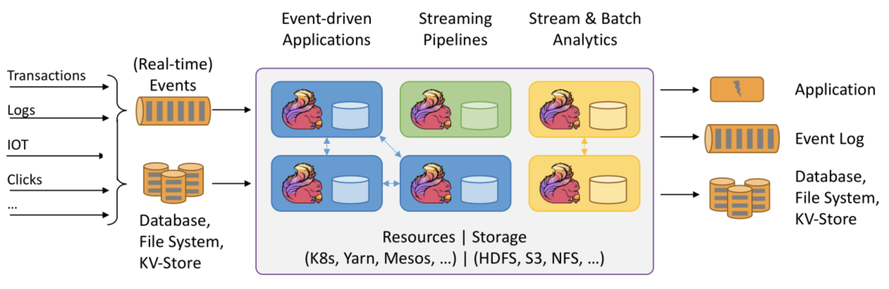
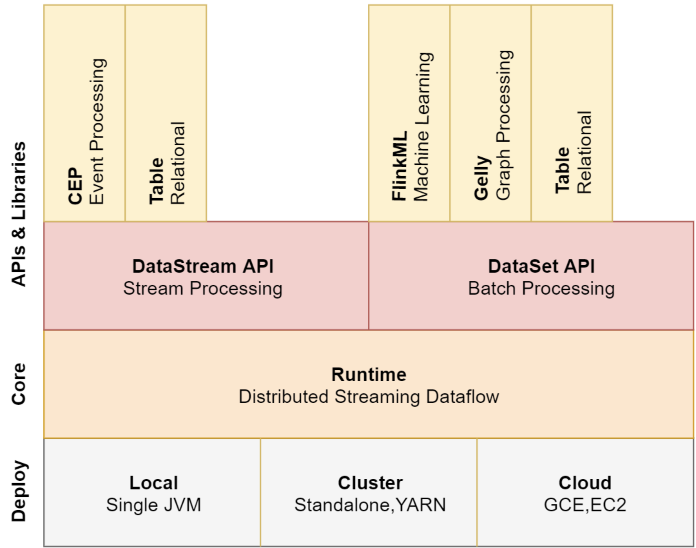
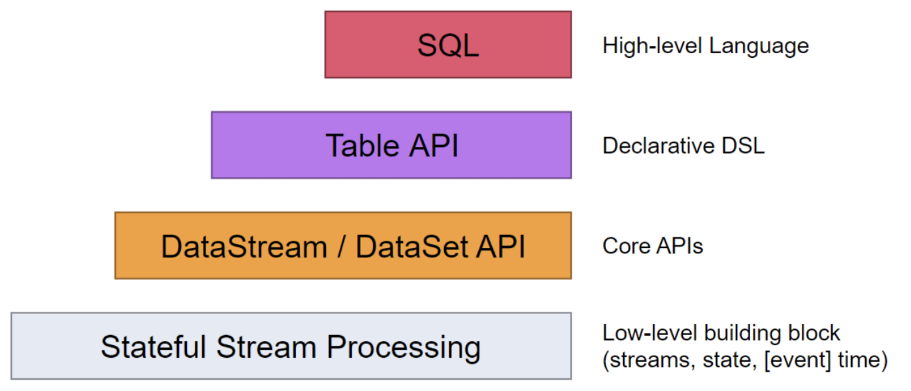
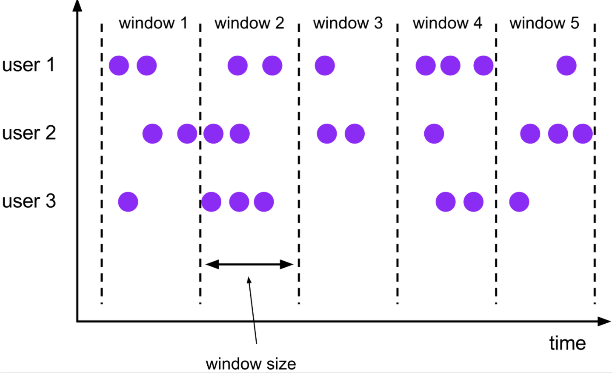
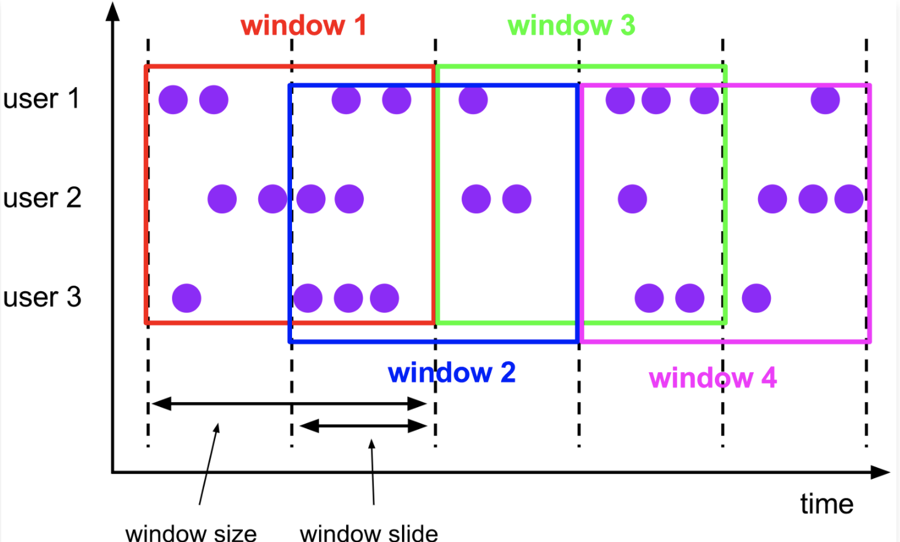
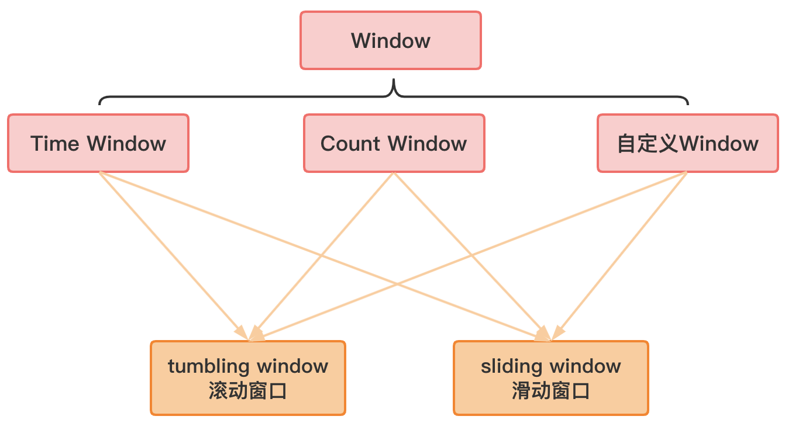
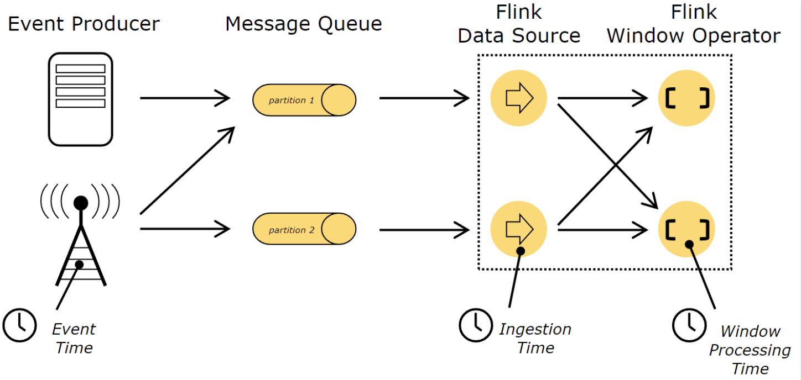
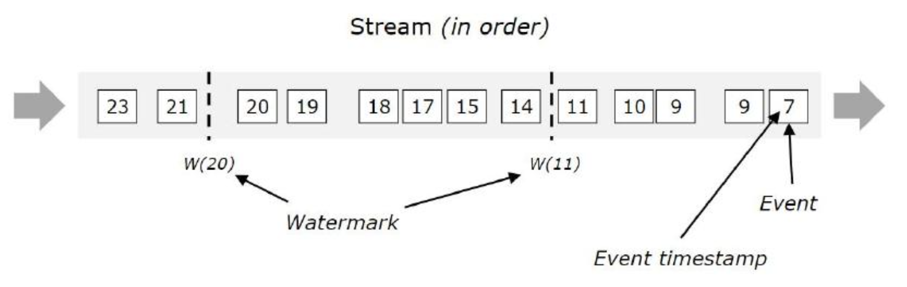
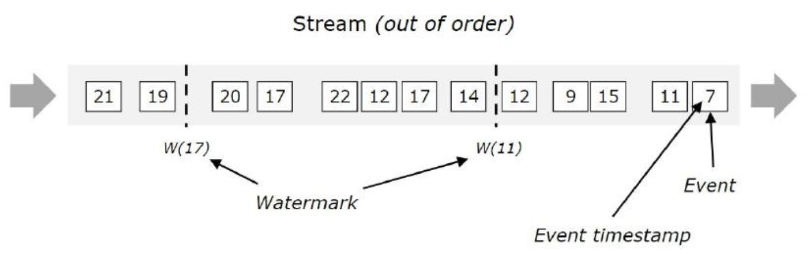
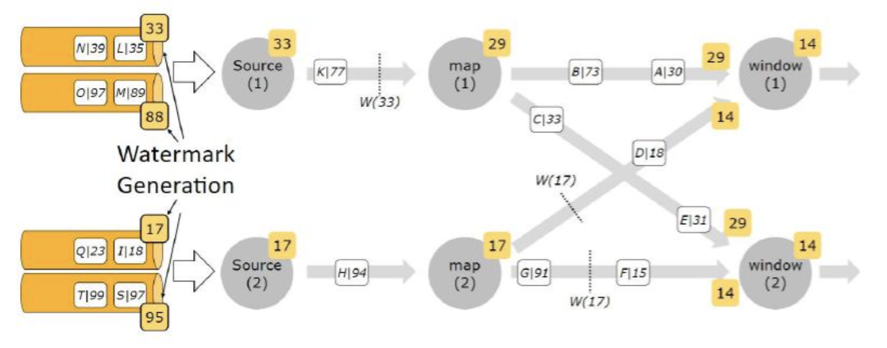

# 1、简介

## 1.1、什么是Flink

Apache Flink 是一个开源的分布式、高性能、高可用、准确的流处理框架，用于在无边界和有边界数据流上进行有状态的计算；

Flink也支持批处理，Flink的处理流程：



- 左边：数据源，这些数据是实时产生的日志或者是数据库、文件系统、KV存储系统中的数据；
- 中间：是Flink，负责对数据进行处理；
- 右边：输出，Flink可以将计算好的数据输出到其他应用中，或者存储系统中；

## 1.2、Flink架构图



- 图片最下方是Flink的一些部署模式，支持local、集群（standalone，yarn）、云上部署
- 往上一层是Flink的核心，分布式的流处理引擎；
- 再往上是Flink 的API和类库，主要有两大块API：DataStream API和DataSet API，分别是流处理和批处理；
    - DataStream API：支持复杂事件处理（CEP）和table操作，其实也支持SQL的操作；
    - DataSet API：支持 Flink ML机器学习、Gelly图计算、table操作，这块也是支持sql操作的；

## 1.3、Flink三大核心组件

Flink包含三大组件：
- DataSource：数据源，负责接收数据；
- Transformations：算子，负责对数据进行处理；
- Data Sink：输出组件，负责把计算好的数据输出到其他存储介质中

## 1.4、Flink流处理与批处理

在大数据处理领域中，批处理和流处理一般被认为是两种不同的任务，一个大数据框架一般被设计为只能处理一种任务；比如storm支持流处理任务，而MapReduce和Spark只支持批处理任务。SparkStreaming是Spark之上支持流处理任务的子系统，看似是一个特例，其实并不是：SparkStreaming采用了一个Micro-batch的架构，就是把输入的数据流切分为细粒度的batch，并为每个batch提交一个批处理的Spark任务，所以SparkStreaming本质上执行的还是批处理任务，和Storm这种流式的数据处理方式完全不同的；

Flink通过灵活的执行引擎，能够同时支持批处理和流处理；

在执行引擎层，流处理系统与批处理系统最大的不同在于节点之间的数据传输方式；
- 对于一个流处理系统，其节点间数据传输的标准模型是：当一条数据被处理完成时，序列化到缓存中，然后通过网络传输到下一个节点，由下一个节点继续处理；这是典型的一条一条处理；
- 而对于一个批处理系统，其节点之间数据传输的标准模型是：当一条数据被处理完成后，序列化到缓存中，并不会立刻通过网络传输到下一个节点，当缓存写满时，就持久化到本地磁盘上，当所有数据被处理完成时，才开始将处理的数据通过网络传输到下一个节点中；

上面两种传输模式是两个极端，对应的是流处理系统对低延迟的要求和批处理系统对高吞吐量的要求；Flink的执行引擎采用了一种十分灵活的方式，同时支持了这两种传输模型；

Flink以固定的缓存块为单位进行网络数据传输，用过可以通过缓存块的超时值指定缓存块的传输时机：
- 如果缓存块的超时值为0，则Flink的数据传输方式类似前面所说的流处理系统的标准模型，此时系统可以获得低延迟；
- 如果缓冲块的超时值为无限大，则Flink的数据传输方式类似前面所说的批处理系统的标准模型，此时系统可以获得高吞吐量；其实底层还是流式计算型，批处理只是一个极限特例而已；

## 1.5、实时计算框架比较

对比Storm、SparkStreaming、Flink三种实时计算引擎

| 产品     | Storm         | SparkStreaming | Flink        |
| -------- | ------------- | -------------- | ------------ |
| 模型     | Native        | Micro-Batching，RDD | Native       |
| API      | 组合式        | 声明式         | 声明式       |
| 语义     | At-least-once | Exactly-Once   | Exactly-Once |
| 容错机制 | ACK           | Checkpoint     | Checkpoint   |
| 状态管理 | 无            | 基于DStream    | 基于操作     |
| 延时     | Low           | Medium         | Low          |
| 吞吐量   | Low           | High           | High         |

- Native：表示来一条处理一条数据；
- Micro-batch：表示划分小批，一小批一小批的处理数据；

**实时计算框架如何选择：**
- 需要关注的数据流是否需要进行状态管理；
- 消息语义是否有特殊要求：At-least-once 或者 Exactly-Once
- 小型独立的项目，需要低延迟的场景，建议使用strom；
- 如果项目中使用了Spark，并且秒级别的实时处理可以满足需求，建议使用SparkStreaming；
- 要写消息语义为 Exactly-once，数据量加大，要求高吞吐低延迟，需要进行状态管理，建议选择Flink；

## 1.6、Flink核心概念

- 窗口
- 时间：
    - 事件时间
    - 摄入时间
    - 处理时间
- 并行度，并行度不能大于slot个数
    - 算子级别
    - 运行环境级别
    - 客户端级别
    - 系统级别

# 2、Flink快速入门

## 2.1、Job开发步骤

Flink程序一般开发步骤：
- 获得一个执行环境；
- 加载/创建初始化数据；
- 指定操作数据的 transformation算子；
- 指定数据目的地；
- 调用execute触发执行程序

> 注意：Flink程序是延迟执行的，只有在最后调用execute方法才会真正触发执行程序，和Spark类型，Spark中是必须要有transformation算子才会真正执行；

## 2.2、案例1：Stream方式wordCount

需求：通过socket实时产生一些单词，使用flink实时接收数据，并对指定时间窗口内的数据进行聚合统计，并且把时间窗口内计算的结果打印
```scala
object SocketWindowWordCountScala {
  /**
   * 注意：在执行代码之前，需要先在机器上开启socket，端口为9001
   * @param args
   */
  def main(args: Array[String]): Unit = {
    //获取运行环境
    val env = StreamExecutionEnvironment.getExecutionEnvironment
    //连接socket获取输入数据
    val text = env.socketTextStream("localhost", 9001)
    //处理数据
    //注意：必须要添加这一行隐式转换的代码，否则下面的flatMap方法会报错
    import org.apache.flink.api.scala._
    val wordCount = text.flatMap(_.split(" "))//将每一行数据根据空格切分单词
      .map((_,1))//每一个单词转换为tuple2的形式(单词,1)
      //.keyBy(0)//根据tuple2中的第一列进行分组
      .keyBy(tup=>tup._1)//官方推荐使用keyselector选择器选择数据
      .timeWindow(Time.seconds(2))//时间窗口为2秒，表示每隔2秒钟计算一次接收到的数据
      .sum(1)// 使用sum或者reduce都可以
      //.reduce((t1,t2)=>(t1._1,t1._2+t2._2))
    //使用一个线程执行打印操作
    wordCount.print().setParallelism(1)
    //执行程序
    env.execute("SocketWindowWordCountScala")
  }
}
```

## 2.3、案例2：批处理方式wordCount

需求：统计指定文件中单词出现的次数
```scala
object BatchWordCountScala {
  def main(args: Array[String]): Unit = {
    //获取执行环境
    val env = ExecutionEnvironment.getExecutionEnvironment
    val inputPath = "hdfs://bluefish:9000/hello.txt"
    val outPath = "hdfs://bluefish:9000/out"
    //读取文件中的数据
    val text = env.readTextFile(inputPath)
    //处理数据
    import org.apache.flink.api.scala._
    val wordCount = text.flatMap(_.split(" "))
      .map((_, 1))
      .groupBy(0)
      .sum(1)
      .setParallelism(1)
    //将结果数据保存到文件中
    wordCount.writeAsCsv(outPath,"\n"," ")
    //执行程序
    env.execute("BatchWordCountScala")
  }
}
```

> 对比流处理和批处理：使用的执行环节不一样
> - 流处理：执行环境是 StreamExecutionEnvironment，数据类型是DataStream
> - 批处理：执行环境是 ExecutionEnvironment，数据类型是DataSet

# 3、Flink安装部署

Flink支持多种部署方式：
- Standalone
- On YARN
- Mesos、Kubernets、AWS等

如果是一个独立环境的话，可以能用到standalone集群模式；在生产环境一般还是用 on yarn 这种模式比较多，这样可以综合利用集群资源。这样，在hadoo集群上既可以运行mapReduce任务、Spark任务，还可以运行Flink任务

## 3.1、Standalone集群部署


standalone集群核心参数：

| 参数                            | 释义                                                |
| ------------------------------- | --------------------------------------------------- |
| jobmanager.memory.process.size  | 主节点可用内存大小                                  |
| taskmanager.memory.process.size | 从节点可用内存大小                                  |
| taskmanager.numberOfTaskSlots   | 从节点可用启动的进程数量，建议设置为从节点的CPU数量 |
| parallelism.default             | Flink任务的默认并行度                               |

slot vs parallelism：
- slot是静态的概念，是指taskManger具有的并发执行能力；
- parallelism 是动态的概念，是指程序运行时实际使用的并发能力；
- 设置合适的 parallelism 能提高程序计算的效率；

## 3.2、Flink On YARN

Flink On YARN模式是使用客户端模式，直接向hadoop集群提交任务即可，不需要单独启动Flink进程，需要注意的是：
- Flink On Yarn 模式依赖hadoop2.4.1及以上版本；
- Flink On YARN hick两种方式:
  - 在yarn中初始化一个Flink集群，以后提交任务都提交到这个Flink集群中，这个Flink集群会常驻在yarn集群上，除非手动停止；适合运行规模小、短时间运行的作业
  - 每次提交任务都会创建一个新的Flink集群，任务之间相互独立，互不影响，方便管理，任务执行完成之后创建的集群也会消失；适合长时间运行的作业

### 3.2.1、方式1：初始化常驻Flink集群

启动过程：
- （1）在集群中初始化一个长时间运行的Flink集群：使用 yarn-session.sh 脚本
- （2）使用Flink run命令向Flink集群中提交任务

> 使用Flink on yarn需要确保 hadoop 集群已经启动成功

在服务器上安装一个Flink客户端，将Flink解压即可

在执行 yarn-session.sh 脚本之前需要先设置 HADOOP_CLASSPATH 这个环境变量，否则执行yarn-session.sh是会报错的，提示找不到hadoop一些依赖：
```
[root@bigdata04 flink-1.11.1]# bin/yarn-session.sh 
Error: A JNI error has occurred, please check your installation and try again
Exception in thread "main" java.lang.NoClassDefFoundError: org/apache/hadoop/yarn/exceptions/YarnException
        at java.lang.Class.getDeclaredMethods0(Native Method)
        at java.lang.Class.privateGetDeclaredMethods(Class.java:2701)
        at java.lang.Class.privateGetMethodRecursive(Class.java:3048)
        at java.lang.Class.getMethod0(Class.java:3018)
        at java.lang.Class.getMethod(Class.java:1784)
        at sun.launcher.LauncherHelper.validateMainClass(LauncherHelper.java:544)
        at sun.launcher.LauncherHelper.checkAndLoadMain(LauncherHelper.java:526)
Caused by: java.lang.ClassNotFoundException: org.apache.hadoop.yarn.exceptions.YarnException
        at java.net.URLClassLoader.findClass(URLClassLoader.java:382)
        at java.lang.ClassLoader.loadClass(ClassLoader.java:424)
        at sun.misc.Launcher$AppClassLoader.loadClass(Launcher.java:349)
        at java.lang.ClassLoader.loadClass(ClassLoader.java:357)
        ... 7 more
```

在 etc/profile 中配置 HADOOP_CLASSPATH
```
[root@bigdata04 flink-1.11.1]# vi /etc/profile
export HADOOP_CLASSPATH=`${HADOOP_HOME}/bin/hadoop classpath`
export PATH=.:$JAVA_HOME/bin:$HADOOP_HOME/bin:$HIVE_HOME/bin:$SPARK_HOME/bin:$SQOOP_HOME/bin:$PATH
```
使用 yarn-session.sh 在 yarn 中创建一个长时间运行的Flink集群：
```
[root@bigdata04 flink-1.11.1]# bin/yarn-session.sh -jm 1024m -tm 1024m -d
```
这个表示创建一个Flink集群，`-jm` 是指定主节点的内存，`-tm` 是指从节点内存， `-d`是表示把这个进程放到后台执行；

启动成功后，即可向这个Flink集群中提交任务，使用Flink中内置案例
```
[root@bigdata04 flink-1.11.1]# bin/flink run ./examples/batch/WordCount.jar
```
> 这个时候使用Flink run 的时候，它会默认找对应的文件，根据这个文件找到创建的永久的Flink集群，这个文件里面保存的就是刚才启动Flink集群在yarn对应的applicationId

```
2026-01-20 22:56:41,239 INFO  org.apache.flink.yarn.cli.FlinkYarnSessionCli[] - Found Yarn properties file under /tmp/.yarn-properties-root
2026-01-20 22:56:41,239 INFO  org.apache.flink.yarn.cli.FlinkYarnSessionCli[] - Found Yarn properties file under /tmp/.yarn-properties-root

[root@bigdata04 flink-1.11.1]# more /tmp/.yarn-properties-root
#Generated YARN properties file
#Tue Jan 20 22:50:06 CST 2026
dynamicPropertiesString=
applicationID=application_1768906309581_0005
```
任务提交上去执行完成之后，再来Flink的web界面，可以发现有一个已经执行结束的任务；这个任务在执行的时候，会动态申请一些资源执行任务，任务执行完毕之后，对应的资源会自动释放掉；

如果需要停掉已经启动的Flink集群，使用 yarn的kill命令：
```
[root@bigdata04 flink-1.11.1]# yarn application -kill application_1768906309581_0005
2026-01-20 23:25:22,548 INFO client.RMProxy: Connecting to ResourceManager at bigdata01/192.168.182.100:8032
Killing application application_1768906309581_0005
2026-01-20 23:25:23,239 INFO impl.YarnClientImpl: Killed application_1768906309581_0005
```
yarn-session的场景参数：
```
-D <arg>                        动态属性
-d, --detached                  放到后台，独立运行
-j,--jar <arg>                  指定Flink任务的jar包
-jm,--jobManagerMemory <arg>    jobManager的内存
-nm,--name                      在Yarn上为一个自定义的应用设置一个名字
-q,--query                      显示yarn中可用的资源（内存、cpu核数）
-qu,--queue <arg>               指定yarn队列
-s,--slots <arg>                每个taskManager使用的slots数量
-tm,--taskManagerMemory <arg>   每个taskManager的内存
```

### 3.2.2、方式2：每提交一个创建一个Flink集群

`flink run -m yarn-cluster` 创建Flink集群 + 提交任务

使用Flink run直接创建一个临时的Flink集群，并且提交任务
```
[root@bigdata04 flink-1.11.1]# bin/flink run -m yarn-cluster  -yjm 1024 -ytm 1024 ./examples/batch/WordCount.jar
```
提交上去之后，会先创建一个Flink集群，然后在这个Flink集群中执行任务，针对Flink命令的一些用法汇总：
```
-c,-class <clsssname> 动态指定jar包入口类
-m,--jobmanager <host:port>   动态指定jobmanager地址
-p,--parallelism <parallelism>  动态指定程序的并行度，可以覆盖配置文件中的默认值

默认查找本机 /tmp/.yarn-properties-root 中的节点信息
```

**停止任务**
- 停止yarn中的任务：`[root@bigdata04 flink-1.11.1]# yarn application -kill application_1768962956138_0001`
- 在Flink界面上点击 cancle job 或者在命令行中执行 Flink cancel停止都可以：`[root@bigdata04 flink-1.11.1]# bin/flink cancel -yid application_1768962956138_0001 7b99bfb261a92f84a89d87bcca3a3e23`，`7b99bfb261a92f84a89d87bcca3a3e23`表示的是Flink任务的id；这个Flink任务停止后，对应的yarn-session也就性质

**历史任务**

如果Flink任务停止后，就无法再查看Flink 的web界面，如果想查看历史任务的执行信息时，可以通过启动Flink 的historyServer进程，在启动historyServer进程之前，需要修改Flink的配置文件：
```
[root@bigdata04 flink-1.11.1]# vi conf/flink-conf.yaml 
......
jobmanager.archive.fs.dir: hdfs://bigdata01:9000/completed-jobs/
historyserver.web.address: 192.168.182.103
historyserver.web.port: 8082
historyserver.archive.fs.dir: hdfs://bigdata01:9000/completed-jobs/
historyserver.archive.fs.refresh-interval: 10000
......
```
启动Flink的 historyserver进程：
```
[root@bigdata04 flink-1.11.1]# bin/historyserver.sh start
[root@bigdata04 flink-1.11.1]# jps
5894 HistoryServer
```
> 注意：hadoop的historyserver进程也需要启动

# 4、Flink核心API



Flink提供了4种层次不同的API，每种API在适用不同的场景，常用的是上面三层
- 低级API（stateful stream processing）：提供了对时间和状态的细粒度控制，简洁性和易用性差，主要应用在一些复杂事件处理逻辑上；
- 核心API（DataStream/DataSet API）：主要提供针对流数据和批数据的处理，是对低级API进行了一些封装，提供了filter、sum、max、ming等高级函数；
- Table API：一般与DataSet或者DataStream紧密关联，可以通过一个DataSet或DataStream创建出一个Table，然后使用类似filter、join或者select操作；还可以将一个Table对象装好DataSet或DataStream
- SQL：Flink的SQL底层是基于Apache Calcite，其实现了标准的SQL

# 5、Flink核心API之DataStream

DataStream API 主要分为三块：DataSource、Transformatio、DataSink


# 6、Flink核心API之DataSet


# 7、Flink核心API之Table API与SQL


# 8、窗口window

## 8.1、概述

Flink认为批处理是流处理的一个特例，所以Flink底层引擎是一个流式引擎，其在上面实现了流处理和批处理，而Window是从流处理到批处理的一个桥梁。

通常来讲，window是一张可以把无界无数据切割为有界数据块的手段；Window 是无限数据流处理的核心，Window 将一个无限的 stream 拆分成有限大 小的”buckets”桶；

比如：对流中所有元素进行计数是不可能的，因为通常流是无限的（无界的），所以，流上的聚合需要由window来划定范围，比如`计算过去5分钟`或者`最后100个元素的和`

window可以是时间驱动的（time window）或者数据驱动（count window）。DataStream API提供了基于Time和Count的window，同时，由于某些特殊的需要，DataStream API也提供定制化的window操作，提供了用户自定义window

## 8.2、window的类型

window根据类型可以分为两种：
- Tumbling Windows：滚动窗口，表示窗口内的数据没有重叠；
  
  

- Sliding Windows：滑动窗口，表示窗口内的数据有重叠

  
  



## 8.3、TimeWindow

TimeWindow是根据时间对数据切分的窗口，TimeWindow可以支持滚动窗口和滑动窗口
- `timewindow(Time.seconds(10))`：表示滚动窗口的窗口大小为10秒，对每10秒内的数据进行聚合计算；
- `timewindow(Time.seconds(10), Time.seconds(5))`：表示滑动窗口的窗口大小是10秒，滑动间隔为5秒，就是每个5秒计算前10秒内的数据

示例：
```scala
import org.apache.flink.streaming.api.scala.StreamExecutionEnvironment
import org.apache.flink.streaming.api.windowing.time.Time
/**
 * TimeWindow的使用
 * 1：滚动窗口
 * 2：滑动窗口
 */
object TimeWindowOpScala {
  def main(args: Array[String]): Unit = {
    val env = StreamExecutionEnvironment.getExecutionEnvironment
    val text = env.socketTextStream("bigdata04", 9001)
    import org.apache.flink.api.scala._
    //TimeWindow之滚动窗口：每隔10秒计算一次前10秒时间窗口内的数据
    text.flatMap(_.split(" "))
      .map((_,1))
      .keyBy(0)
      //窗口大小
      .timeWindow(Time.seconds(10))
      .sum(1).print()

    //TimeWindow之滑动窗口：每隔5秒计算一次前10秒时间窗口内的数据
    text.flatMap(_.split(" "))
      .map((_,1))
      .keyBy(0)
      //第一个参数：窗口大小，第二个参数：滑动间隔
      .timeWindow(Time.seconds(10),Time.seconds(5))
      .sum(1).print()
    env.execute("TimeWindowOpScala")
  }
}
```
在bigdata04上开启socket，输入数据
```
[root@bigdata04 soft]# nc -l 9001
hello you
```
如果执行的是TimeWindow的滚动窗口的话：
```
5> (you,1)
3> (hello,1)
```
如果执行的是TimeWindow的滑动窗口的话：
```
5> (you,1)
3> (hello,1)
3> (hello,1)
5> (you,1)
```

## 8.4、CoundWindow

CountWindow是根据元素个数对数据流切分窗口，CountDown也可以支持滚动窗口和滑动窗口：
- 其中countWindow(5) 表示滚动窗口的窗口大小是5个元素，也就是当窗口填满5个元素时会对窗口进行计算了；
- countWindow(5, 1) 表示互动窗口的窗口大小是5个元素，滑动的间隔为1个元素，也就是每增加一个元素就会对前面的5个元素计算一次

示例：
```scala
import org.apache.flink.streaming.api.scala.StreamExecutionEnvironment
import org.apache.flink.streaming.api.windowing.time.Time
/**
 * CountWindow的使用
 * 1：滚动窗口
 * 2：滑动窗口
 */
object CountWindowOpScala {
  def main(args: Array[String]): Unit = {
    val env = StreamExecutionEnvironment.getExecutionEnvironment
    val text = env.socketTextStream("bigdata04", 9001)
    import org.apache.flink.api.scala._
    /**
     * 注意：由于我们在这里使用了keyBy，会先对数据分组
     * 如果某个分组对应的数据窗口内达到了5个元素，这个窗口才会被触发执行
     */
    //CountWindow之滚动窗口：每隔5个元素计算一次前5个元素
    text.flatMap(_.split(" "))
      .map((_,1))
      .keyBy(0)
      //指定窗口大小
      .countWindow(5)
      .sum(1).print()
    //CountWindow之滑动窗口：每隔1个元素计算一次前5个元素
    text.flatMap(_.split(" "))
      .map((_,1))
      .keyBy(0)
      //第一个参数：窗口大小，第二个参数：滑动间隔
      .countWindow(5,1)
      .sum(1).print()
    env.execute("CountWindowOpScala")
  }
}
```
通过socket输入数据：
```
[root@bigdata04 soft]# nc -l 9001
hello you
hello me
hello hello hello
you you you you
hello
you
```
执行CoundWindow之滚动窗口的代码，输出结果如下：
```
3> (hello,5)
5> (you,5)
```
执行CountWindow之滑动窗口的代码，输出结果如下：
```
5> (you,1)
3> (hello,1)
4> (me,1)
3> (hello,2)
3> (hello,3)
3> (hello,4)
3> (hello,5)
5> (you,2)
5> (you,3)
5> (you,4)
5> (you,5)
3> (hello,5)
5> (you,5)
```

## 8.5、自定义window

window其实还可以细分为：
- 基于key的window；
- 不基于key的window；

前面的都是基于key 的window，就是在使用window之前，先执行了keyBy的分组操作，如果需求中不需要根据key进行分组的话，可以不使用keyBy，这样在使用window的时候需要使用timeWindowAll() 或者 countWindowAll()
- 针对基于key的window需要使用window函数；
- 针对不基于key的window需要使用windowAll函数

TimeWindow和TimeWindowAll底层使用的是window和WindowAll函数：
```scala
// timeWindow() 函数
public WindowedStream<T, KEY, TimeWindow> timeWindow(Time size, Time slide) {
		if (environment.getStreamTimeCharacteristic() == TimeCharacteristic.ProcessingTime) {
			return window(SlidingProcessingTimeWindows.of(size, slide));
		} else {
			return window(SlidingEventTimeWindows.of(size, slide));
		}
}
// timeWindowAll() 函数
public AllWindowedStream<T, TimeWindow> timeWindowAll(Time size) {
		if (environment.getStreamTimeCharacteristic() == TimeCharacteristic.ProcessingTime) {
			return windowAll(TumblingProcessingTimeWindows.of(size));
		} else {
			return windowAll(TumblingEventTimeWindows.of(size));
		}
}
```

自定义window示例：
```
import org.apache.flink.streaming.api.scala.StreamExecutionEnvironment
import org.apache.flink.streaming.api.windowing.assigners.TumblingProcessingTimeWindows
import org.apache.flink.streaming.api.windowing.time.Time
/**
 * 需求：自定义MyTimeWindow
 */
object MyTimeWindowScala {
  def main(args: Array[String]): Unit = {
    val env = StreamExecutionEnvironment.getExecutionEnvironment
    val text = env.socketTextStream("bigdata04", 9001)
    import org.apache.flink.api.scala._
    //自定义MyTimeWindow滚动窗口：每隔10秒计算一次前10秒时间窗口内的数据
    text.flatMap(_.split(" "))
      .map((_,1))
      .keyBy(0)
      //窗口大小
      .window(TumblingProcessingTimeWindows.of(Time.seconds(10)))
      .sum(1).print()
    env.execute("MyTimeWindowScala")
  }
}
```

## 8.6、window聚合

在进行widow聚合操作可以分为两种：
- 增量聚合
- 全量聚合

### 8.6.1、增量聚合

增量聚合：窗口每进入一条数据，就进行一次计算；场景的一些增量聚合函数如下：reduce、aggregate、sum、min、max

增量聚合例子：累加求和，对8、12、7、10 这四条数据进行累加求和
- 第一次进来一条数据8，则立即进行累加求和，结果为8；
- 第二次进来一条数据12，则立即进行累加求和，结果为20；
- 第三次进来一条数据7，则立即进行累加求和，结果为27；
- 第四次进来一条数据10，则立刻进行累加求和，结果为37

### 8.6.2、全量聚合

全量聚合：等数据窗口的数据到齐，才开始进行聚合计算【可以实现对窗口内的数据进行排序等需求】，场景的一些全量聚合函数为：apply(windowFunction) 和 process(processWindowFunction)

> processWindowFunction 比 windowFunction 提供了更多context的信息

# 9、Time

针对流数据中的Time（时间），可以分为以下三种：
- Event Time：事件产生的时间，它通常由事件中的时间戳描述；
- Ingestion Time：事件进入Flink的时间；
- Processing Time：事件被处理时当前系统的时间；

这几种时间的对应关系：



## 9.1、Time案例分析

比如，有日志数据如下
```
原始日志是这样的：2021-01-01 10:00:01  INFO executor.Executor: Finished task in state 0.0
```
- `2021-01-01 10:00:01` 是日志数据产生的时间
- 日志进入Flink的时间是：`2021-01-01 20:00:01`
- 日志数据到达window处理的时间是：`2021-01-01 20:00:02`

>  如果需要统计每分钟内接口调用失败的错误日志数，使用哪个时间更有意义呢？

因为数据有可能出现延迟，如果使用数据进入Flink的时间或者window处理时间，其实没有意义的，这个时候需要使用原始日志的时间才有意义，这个才是数据产生的时间

## 9.2、Time类型设置

在Flink中，默认情况下Flink流处理中使用的时间是：Processing Time，可以通过类StreamExecutionEnvironment看到：
```scala
private TimeCharacteristic timeCharacteristic = DEFAULT_TIME_CHARACTERISTIC;
private static final TimeCharacteristic DEFAULT_TIME_CHARACTERISTIC = TimeCharacteristic.ProcessingTime;
```
如果要修改话可以调用：setTimeCharacteristic
```scala
// TimeCharacteristic 是个枚举类，其定义了三种时间
env.setStreamTimeCharacteristic(TimeCharacteristic.EventTime)
```

# 10、Watermark

## 10.1、概述

当使用EventTime处理流数据的时候会遇到数据乱序的问题，流数据从数据产生，到流经source，再到具体的算子，中间是有一个过程和世界的；虽然在大部分情况下，传输到算子的数据都是按照数据产生的时间顺序来的，但是也不排除由于网络延迟等原因导致数据乱序的产生，特别是在使用kafka的时候，多个分区直接的数据无法保证有序

所以在进行window计算的时候，又不能无限期等待，必须要有一个机制来保证特点的时间后，必须触发window去进行计算，这个特别的机制就是watermark，使用watermark + EventTime 处理乱序数据

### 10.1.1、有序数据流的watermark



`in order`：有序的数据量，从左往右

方块表示具体的数据，方块里面的数字代表的是数据产生的世界：
- `w(11)`：表示watermark的值为11，此时表示11之前的数据都到了，可以进行计算了；
- `w(20)`：表示watermark的值为20，此时表示20之前的数据都到了，可以进行计算了

### 10.1.2、无序数据流的watermark



`out of order`：无序数据流
- `w(11)`：表示11之前的数据都到了，可以对11之前的数据进行计算了，大于11的数据暂时不计算；
- `w(17)`：表示17之前的数据都到了，可以对17之前的数据进行计算了，大于17的数据暂时不计算

### 10.1.3、多并行度数据流的watermark



在多并行度的情况下，watermark会有一个对齐机制，这个对齐机制会取所有channel中最小的watermark，图中的14和29这两个watermark，最终取值时14，这样才不会漏掉数据；

## 10.2、watermark的生成方式

通常情况下，在接收到source的数据之后，应该立刻生成watermark，但是也可以再使用Map或者Filter操作之后，再生成watermark

watermark的生成方式有两种：
- with periodic watermars：周期性触发watermark的生成和发送，每隔N秒自动向流里面注入一个watermark，时间间隔由 ExecutionConfig.setAutoWaterMarkInterval 决定，现在新版本的Flink默认是200号码，之前默认是100毫秒，可以定义一个最大允许乱序的世界；这种生成watermark的方式比较常用；
- with punctuated watermarks：基于某些事件触发watermark的生成和发送，基于事件向流里面注入一个watermark，每一个元素都有机会判断是否生成一个watermark


# 参考资料

- [官方代码](https://github.com/apache/flink)
- [Flink实现推荐系统](https://github.com/CheckChe0803/flink-recommandSystem-demo)
- [Flink中文视频课程](https://github.com/flink-china/flink-training-course)
- [Flink系列](http://wuchong.me/categories/Flink/)
- [Flink入门示例](https://github.com/zhisheng17/flink-learning)
- [Flink-CEP复杂事件](https://cloud.tencent.com/developer/article/1448608)
- [Flink知识图谱](https://yq.aliyun.com/articles/744741?spm=a2c4e.11153940.0.0.69bc12ecS2IswO)
- [Apache Flink 精选PDF下载](https://yq.aliyun.com/articles/81743?spm=a2c4e.11153940.0.0.69bc12ecS2IswO)
- [Apache Flink CEP 实战](https://yq.aliyun.com/articles/738451?utm_content=g_1000094637)
- [Flink基础理论](https://blog.csdn.net/oTengYue/article/details/102689538)
- [基于flink和drools的实时日志处理](https://www.cnblogs.com/luxiaoxun/p/13197981.html)
- [Flink 精进学习](https://www.yuque.com/docs/share/a4b45fed-7417-4789-8df3-071abb9b3cac)

