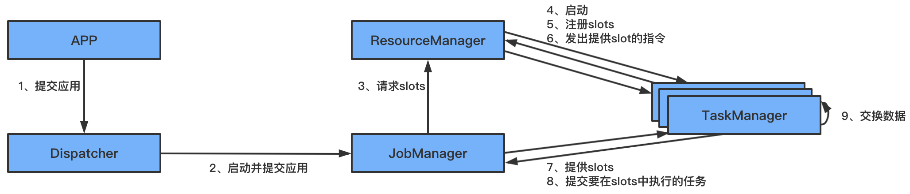
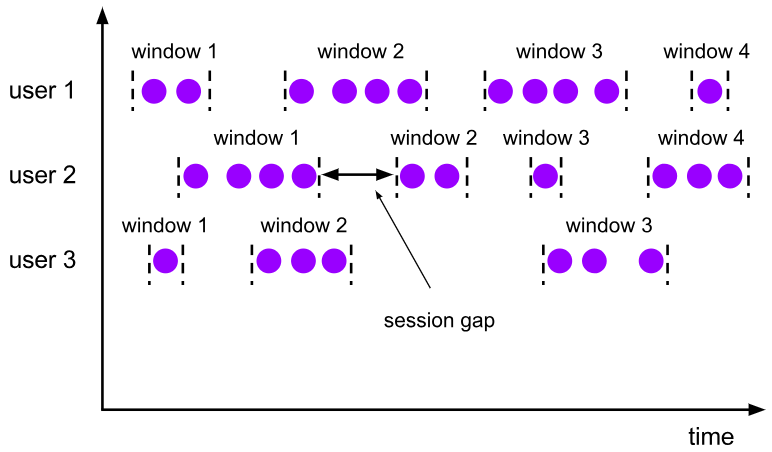
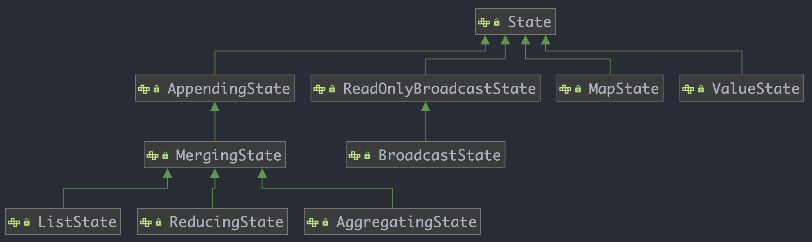

# 1、简介

## 1.1、什么是Flink

Apache Flink 是一个开源的分布式、高性能、高可用、准确的流处理框架，用于在无边界和有边界数据流上进行有状态的计算；

Flink也支持批处理，Flink的处理流程：


- 左边：数据源，这些数据是实时产生的日志或者是数据库、文件系统、KV存储系统中的数据；
- 中间：是Flink，负责对数据进行处理；
- 右边：输出，Flink可以将计算好的数据输出到其他应用中，或者存储系统中；

在 Flink 的世界观中，一切都是由流组成的，离线数据是有界的 流;实时数据是一个没有界限的流:这就是所谓的有界流和无界 流

## 1.2、Flink架构图


- 图片最下方是Flink的一些部署模式，支持local、集群（standalone，yarn）、云上部署
- 往上一层是Flink的核心，分布式的流处理引擎；
- 再往上是Flink 的API和类库，主要有两大块API：DataStream API和DataSet API，分别是流处理和批处理；
    - DataStream API：支持复杂事件处理（CEP）和table操作，其实也支持SQL的操作；
    - DataSet API：支持 Flink ML机器学习、Gelly图计算、table操作，这块也是支持sql操作的；

## 1.3、Flink三大核心组件

Flink包含三大组件：
- DataSource：数据源，负责接收数据；
- Transformations：算子，负责对数据进行处理；
- Data Sink：输出组件，负责把计算好的数据输出到其他存储介质中

## 1.4、Flink流处理与批处理

在大数据处理领域中，批处理和流处理一般被认为是两种不同的任务，一个大数据框架一般被设计为只能处理一种任务；比如storm支持流处理任务，而MapReduce和Spark只支持批处理任务。SparkStreaming是Spark之上支持流处理任务的子系统，看似是一个特例，其实并不是：SparkStreaming采用了一个Micro-batch的架构，就是把输入的数据流切分为细粒度的batch，并为每个batch提交一个批处理的Spark任务，所以SparkStreaming本质上执行的还是批处理任务，和Storm这种流式的数据处理方式完全不同的；

Flink通过灵活的执行引擎，能够同时支持批处理和流处理；

在执行引擎层，流处理系统与批处理系统最大的不同在于节点之间的数据传输方式；
- 对于一个流处理系统，其节点间数据传输的标准模型是：当一条数据被处理完成时，序列化到缓存中，然后通过网络传输到下一个节点，由下一个节点继续处理；这是典型的一条一条处理；
- 而对于一个批处理系统，其节点之间数据传输的标准模型是：当一条数据被处理完成后，序列化到缓存中，并不会立刻通过网络传输到下一个节点，当缓存写满时，就持久化到本地磁盘上，当所有数据被处理完成时，才开始将处理的数据通过网络传输到下一个节点中；

上面两种传输模式是两个极端，对应的是流处理系统对低延迟的要求和批处理系统对高吞吐量的要求；Flink的执行引擎采用了一种十分灵活的方式，同时支持了这两种传输模型；

Flink以固定的缓存块为单位进行网络数据传输，用过可以通过缓存块的超时值指定缓存块的传输时机：
- 如果缓存块的超时值为0，则Flink的数据传输方式类似前面所说的流处理系统的标准模型，此时系统可以获得低延迟；
- 如果缓冲块的超时值为无限大，则Flink的数据传输方式类似前面所说的批处理系统的标准模型，此时系统可以获得高吞吐量；其实底层还是流式计算型，批处理只是一个极限特例而已；

## 1.5、实时计算框架比较

对比Storm、SparkStreaming、Flink三种实时计算引擎

| 产品     | Storm         | SparkStreaming | Flink        |
| -------- | ------------- | -------------- | ------------ |
| 模型     | Native        | Micro-Batching，RDD | Native       |
| API      | 组合式        | 声明式         | 声明式       |
| 语义     | At-least-once | Exactly-Once   | Exactly-Once |
| 容错机制 | ACK           | Checkpoint     | Checkpoint   |
| 状态管理 | 无            | 基于DStream    | 基于操作     |
| 延时     | Low           | Medium         | Low          |
| 吞吐量   | Low           | High           | High         |

- Native：表示来一条处理一条数据；
- Micro-batch：表示划分小批，一小批一小批的处理数据；

SparkStreaming、Flink区别：
- 数据模型：spark 采用 RDD 模型，spark streaming 的 DStream 实际上也就是一组组小批数据 RDD 的集合；flink 基本数据模型是数据流，以及事件(Event)序列；
- 运行时架构：spark 是批计算，将 DAG 划分为不同的 stage，一个完成后才可以计算下一个；flink 是标准的流执行模式，一个事件在一个节点处理完后可以直接发往下一个节点进行处理

**实时计算框架如何选择：**
- 需要关注的数据流是否需要进行状态管理；
- 消息语义是否有特殊要求：At-least-once 或者 Exactly-Once
- 小型独立的项目，需要低延迟的场景，建议使用strom；
- 如果项目中使用了Spark，并且秒级别的实时处理可以满足需求，建议使用SparkStreaming；
- 要写消息语义为 Exactly-once，数据量加大，要求高吞吐低延迟，需要进行状态管理，建议选择Flink；

## 1.6、Flink核心概念

- 窗口
- 时间：
    - 事件时间（Event-time）
    - 摄入时间
    - 处理时间（Processing-time）
- 并行度，并行度不能大于slot个数
    - 算子级别
    - 运行环境级别
    - 客户端级别
    - 系统级别

# 2、Flink快速入门

## 2.1、Job开发步骤

Flink程序一般开发步骤：
- 获得一个执行环境；
- 加载/创建初始化数据；
- 指定操作数据的 transformation算子；
- 指定数据目的地；
- 调用execute触发执行程序

> 注意：Flink程序是延迟执行的，只有在最后调用execute方法才会真正触发执行程序，和Spark类型，Spark中是必须要有transformation算子才会真正执行；

## 2.2、案例1：Stream方式wordCount

需求：通过socket实时产生一些单词，使用flink实时接收数据，并对指定时间窗口内的数据进行聚合统计，并且把时间窗口内计算的结果打印
```scala
object SocketWindowWordCountScala {
  /**
   * 注意：在执行代码之前，需要先在机器上开启socket，端口为9001
   * @param args
   */
  def main(args: Array[String]): Unit = {
    //获取运行环境
    val env = StreamExecutionEnvironment.getExecutionEnvironment
    //连接socket获取输入数据
    val text = env.socketTextStream("localhost", 9001)
    //处理数据
    //注意：必须要添加这一行隐式转换的代码，否则下面的flatMap方法会报错
    import org.apache.flink.api.scala._
    val wordCount = text.flatMap(_.split(" "))//将每一行数据根据空格切分单词
      .map((_,1))//每一个单词转换为tuple2的形式(单词,1)
      //.keyBy(0)//根据tuple2中的第一列进行分组
      .keyBy(tup=>tup._1)//官方推荐使用keyselector选择器选择数据
      .timeWindow(Time.seconds(2))//时间窗口为2秒，表示每隔2秒钟计算一次接收到的数据
      .sum(1)// 使用sum或者reduce都可以
      //.reduce((t1,t2)=>(t1._1,t1._2+t2._2))
    //使用一个线程执行打印操作
    wordCount.print().setParallelism(1)
    //执行程序
    env.execute("SocketWindowWordCountScala")
  }
}
```

## 2.3、案例2：批处理方式wordCount

需求：统计指定文件中单词出现的次数
```scala
object BatchWordCountScala {
  def main(args: Array[String]): Unit = {
    //获取执行环境
    val env = ExecutionEnvironment.getExecutionEnvironment
    val inputPath = "hdfs://bluefish:9000/hello.txt"
    val outPath = "hdfs://bluefish:9000/out"
    //读取文件中的数据
    val text = env.readTextFile(inputPath)
    //处理数据
    import org.apache.flink.api.scala._
    val wordCount = text.flatMap(_.split(" "))
      .map((_, 1))
      .groupBy(0)
      .sum(1)
      .setParallelism(1)
    //将结果数据保存到文件中
    wordCount.writeAsCsv(outPath,"\n"," ")
    //执行程序
    env.execute("BatchWordCountScala")
  }
}
```

> 对比流处理和批处理：使用的执行环节不一样
> - 流处理：执行环境是 StreamExecutionEnvironment，数据类型是DataStream
> - 批处理：执行环境是 ExecutionEnvironment，数据类型是DataSet

**注意**

如果本地运行Flink，需要连接远程HDFS，比如在阿里云上，可以再resources目录下添加：`hdfs-site.xml`文件，内容如下：
```xml
<?xml version="1.0" encoding="UTF-8"?>
<?xml-stylesheet type="text/xsl" href="configuration.xsl"?>
<configuration>
    <property>
        <name>dfs.replication</name>
        <value>2</value>
    </property>
    <property>
        <name>dfs.namenode.secondary.http-address</name>
        <value>bluefish:50090</value>
    </property>
    <property>
        <name>dfs.permissions.enabled</name>
        <value>false</value>
    </property>
    <property>
        <name>dfs.namenode.rpc-bind-host</name>
        <value>0.0.0.0</value>
    </property>
    <property>
        <name>dfs.client.use.datanode.hostname</name>
        <value>true</value>
    </property>
</configuration>
```

# 3、Flink安装部署

Flink支持多种部署方式：
- Standalone
- On YARN
- Mesos、Kubernets、AWS等

如果是一个独立环境的话，可以能用到standalone集群模式；在生产环境一般还是用 on yarn 这种模式比较多，这样可以综合利用集群资源。这样，在hadoo集群上既可以运行mapReduce任务、Spark任务，还可以运行Flink任务

## 3.1、Standalone集群部署


standalone集群核心参数：

| 参数                            | 释义                                                |
| ------------------------------- | --------------------------------------------------- |
| jobmanager.memory.process.size  | 主节点可用内存大小                                  |
| taskmanager.memory.process.size | 从节点可用内存大小                                  |
| taskmanager.numberOfTaskSlots   | 从节点可用启动的进程数量，建议设置为从节点的CPU数量 |
| parallelism.default             | Flink任务的默认并行度                               |

slot vs parallelism：
- slot是静态的概念，是指taskManger具有的并发执行能力；
- parallelism 是动态的概念，是指程序运行时实际使用的并发能力；
- 设置合适的 parallelism 能提高程序计算的效率；

## 3.2、Flink On YARN

Flink On YARN模式是使用客户端模式，直接向hadoop集群提交任务即可，不需要单独启动Flink进程，需要注意的是：
- Flink On Yarn 模式依赖hadoop2.4.1及以上版本；
- Flink On YARN hick两种方式:
  - 在yarn中初始化一个Flink集群，以后提交任务都提交到这个Flink集群中，这个Flink集群会常驻在yarn集群上，除非手动停止；适合运行规模小、短时间运行的作业
  - 每次提交任务都会创建一个新的Flink集群，任务之间相互独立，互不影响，方便管理，任务执行完成之后创建的集群也会消失；适合长时间运行的作业

### 3.2.1、方式1：初始化常驻Flink集群

启动过程：
- （1）在集群中初始化一个长时间运行的Flink集群：使用 yarn-session.sh 脚本
- （2）使用Flink run命令向Flink集群中提交任务

> 使用Flink on yarn需要确保 hadoop 集群已经启动成功

在服务器上安装一个Flink客户端，将Flink解压即可

在执行 yarn-session.sh 脚本之前需要先设置 HADOOP_CLASSPATH 这个环境变量，否则执行yarn-session.sh是会报错的，提示找不到hadoop一些依赖：
```
[root@bigdata04 flink-1.11.1]# bin/yarn-session.sh 
Error: A JNI error has occurred, please check your installation and try again
Exception in thread "main" java.lang.NoClassDefFoundError: org/apache/hadoop/yarn/exceptions/YarnException
        at java.lang.Class.getDeclaredMethods0(Native Method)
        at java.lang.Class.privateGetDeclaredMethods(Class.java:2701)
        at java.lang.Class.privateGetMethodRecursive(Class.java:3048)
        at java.lang.Class.getMethod0(Class.java:3018)
        at java.lang.Class.getMethod(Class.java:1784)
        at sun.launcher.LauncherHelper.validateMainClass(LauncherHelper.java:544)
        at sun.launcher.LauncherHelper.checkAndLoadMain(LauncherHelper.java:526)
Caused by: java.lang.ClassNotFoundException: org.apache.hadoop.yarn.exceptions.YarnException
        at java.net.URLClassLoader.findClass(URLClassLoader.java:382)
        at java.lang.ClassLoader.loadClass(ClassLoader.java:424)
        at sun.misc.Launcher$AppClassLoader.loadClass(Launcher.java:349)
        at java.lang.ClassLoader.loadClass(ClassLoader.java:357)
        ... 7 more
```

在 etc/profile 中配置 HADOOP_CLASSPATH
```
[root@bigdata04 flink-1.11.1]# vi /etc/profile
export HADOOP_CLASSPATH=`${HADOOP_HOME}/bin/hadoop classpath`
export PATH=.:$JAVA_HOME/bin:$HADOOP_HOME/bin:$HIVE_HOME/bin:$SPARK_HOME/bin:$SQOOP_HOME/bin:$PATH
```
使用 yarn-session.sh 在 yarn 中创建一个长时间运行的Flink集群：
```
[root@bigdata04 flink-1.11.1]# bin/yarn-session.sh -jm 1024m -tm 1024m -d
```
这个表示创建一个Flink集群，`-jm` 是指定主节点的内存，`-tm` 是指从节点内存， `-d`是表示把这个进程放到后台执行；

启动成功后，即可向这个Flink集群中提交任务，使用Flink中内置案例
```
[root@bigdata04 flink-1.11.1]# bin/flink run ./examples/batch/WordCount.jar
```
> 这个时候使用Flink run 的时候，它会默认找对应的文件，根据这个文件找到创建的永久的Flink集群，这个文件里面保存的就是刚才启动Flink集群在yarn对应的applicationId

```
2026-01-20 22:56:41,239 INFO  org.apache.flink.yarn.cli.FlinkYarnSessionCli[] - Found Yarn properties file under /tmp/.yarn-properties-root
2026-01-20 22:56:41,239 INFO  org.apache.flink.yarn.cli.FlinkYarnSessionCli[] - Found Yarn properties file under /tmp/.yarn-properties-root

[root@bigdata04 flink-1.11.1]# more /tmp/.yarn-properties-root
#Generated YARN properties file
#Tue Jan 20 22:50:06 CST 2026
dynamicPropertiesString=
applicationID=application_1768906309581_0005
```
任务提交上去执行完成之后，再来Flink的web界面，可以发现有一个已经执行结束的任务；这个任务在执行的时候，会动态申请一些资源执行任务，任务执行完毕之后，对应的资源会自动释放掉；

如果需要停掉已经启动的Flink集群，使用 yarn的kill命令：
```
[root@bigdata04 flink-1.11.1]# yarn application -kill application_1768906309581_0005
2026-01-20 23:25:22,548 INFO client.RMProxy: Connecting to ResourceManager at bigdata01/192.168.182.100:8032
Killing application application_1768906309581_0005
2026-01-20 23:25:23,239 INFO impl.YarnClientImpl: Killed application_1768906309581_0005
```
yarn-session的场景参数：
```
-D <arg>                        动态属性
-d, --detached                  放到后台，独立运行
-j,--jar <arg>                  指定Flink任务的jar包
-jm,--jobManagerMemory <arg>    jobManager的内存
-nm,--name                      在Yarn上为一个自定义的应用设置一个名字
-q,--query                      显示yarn中可用的资源（内存、cpu核数）
-qu,--queue <arg>               指定yarn队列
-s,--slots <arg>                每个taskManager使用的slots数量
-tm,--taskManagerMemory <arg>   每个taskManager的内存
```

### 3.2.2、方式2：每提交一个创建一个Flink集群

`flink run -m yarn-cluster` 创建Flink集群 + 提交任务

使用Flink run直接创建一个临时的Flink集群，并且提交任务
```
[root@bigdata04 flink-1.11.1]# bin/flink run -m yarn-cluster  -yjm 1024 -ytm 1024 ./examples/batch/WordCount.jar
```
提交上去之后，会先创建一个Flink集群，然后在这个Flink集群中执行任务，针对Flink命令的一些用法汇总：
```
-c,-class <clsssname> 动态指定jar包入口类
-m,--jobmanager <host:port>   动态指定jobmanager地址
-p,--parallelism <parallelism>  动态指定程序的并行度，可以覆盖配置文件中的默认值

默认查找本机 /tmp/.yarn-properties-root 中的节点信息
```

**停止任务**
- 停止yarn中的任务：`[root@bigdata04 flink-1.11.1]# yarn application -kill application_1768962956138_0001`
- 在Flink界面上点击 cancle job 或者在命令行中执行 Flink cancel停止都可以：`[root@bigdata04 flink-1.11.1]# bin/flink cancel -yid application_1768962956138_0001 7b99bfb261a92f84a89d87bcca3a3e23`，`7b99bfb261a92f84a89d87bcca3a3e23`表示的是Flink任务的id；这个Flink任务停止后，对应的yarn-session也就性质

**历史任务**

如果Flink任务停止后，就无法再查看Flink 的web界面，如果想查看历史任务的执行信息时，可以通过启动Flink 的historyServer进程，在启动historyServer进程之前，需要修改Flink的配置文件：
```
[root@bigdata04 flink-1.11.1]# vi conf/flink-conf.yaml 
......
jobmanager.archive.fs.dir: hdfs://bigdata01:9000/completed-jobs/
historyserver.web.address: 192.168.182.103
historyserver.web.port: 8082
historyserver.archive.fs.dir: hdfs://bigdata01:9000/completed-jobs/
historyserver.archive.fs.refresh-interval: 10000
......
```
启动Flink的 historyserver进程：
```
[root@bigdata04 flink-1.11.1]# bin/historyserver.sh start
[root@bigdata04 flink-1.11.1]# jps
5894 HistoryServer
```
> 注意：hadoop的historyserver进程也需要启动

# 4、Flink运行时架构

## 4.1、运行时组件

Flink运行时主要包括四个不同的组件，会在运行流处理应用程序时协同工作：作业管理器你（JobManager）、资源管理器（ResourceManager）、任务管理（TaskManager）以及分发器（Dispacther），所有组件都会运行在Java虚拟机上；

### 4.1.1、作业管理器（JobManager）

控制一个经验程序执行的主进程，也就是说，每个应用程序都会被一个不同的JobManager所控制执行；

JobManager会接收到要执行的应用程序，这个应用程序会包括：作业图（JobGraph）、逻辑数据流图（Logical dataflow graph）和打包了所有的类、库和其他资源的jar包。

JobManager会把JobGraph转换成一个物理层面的数据流图，这个图被叫做执行图（ExecutionGraph），包含了所有路由并发执行的任务。JobManager 会向资源管理器（ResourceManager）请求执行任务必要的资源，也就是任务管理器（TaskManager）上的槽（Slot）。一旦获取到了足够的资源，就会将执行图分发到真正运行它们的TaskManager上。而在运行过程中，JobManager会负责所有需要中央协调的操作，比如说检查点（CheckPoints）的协调

### 4.1.2、资源管理器（ResourceManager）

主要负责管理任务管理器（TaskManager）的插槽（Slot），TaskManager插槽是Flink定义的处理资源单元。Flink为不同的环境和资源管理工具提供了不同的资源管理器，比如YARN、Mesos、K8S，以及standalone部署。当 JobManager 申请 slot资源时， ResourceManager 会将由空闲 slot 的 TaskManager 分配给 JobManager。

如果ResourceManager 没有足够的 slot 来满足 JobManager的请求，它还可以向资源提供平台发起会话，以提高启动 TaskManager 进程的容器。另外 ResourceManager 还负责终止空闲的 TaskManager，释放计算资源；

### 4.1.3、任务管理器（TaskManager）

Flink中的工作进程，通常在Flink中会有多个 TaskManager运行，每一个 TaskManager 都包含了一定数量的 slots。 slots的数量限制了TaskManager能够执行的任务数量，启动之后，TaskManager 会向资源管理器注册它的 slots；收到资源管理器的指令后， TaskManager就会将一个或者多个 slots提供给 JobManager调用。JobManager就可以向 slots 分配任务（tasks）来执行了。在执行过程中，一个 TaskManager可以跟其它运行同一应用程序的 TaskManager交换数据；

### 4.1.4、分发器（Dispatcher）

可以跨作业运行，它为应用提交提供了REST接口。当一个应用被提交执行时，分发器就会启动并将应用移交给一个JobManager，由于是Rest接口，所以Dispatcher可以作为集群的一个HTTP接入点，这样能不受防火墙的阻挡。Dispatcher 也会启动一个web ui，用来方便的展示和监控作业的执行信息。Dispatcher在架构中不是必需的。取决于应用提交运行的方式；

## 4.2、任务提交流程

当应用提交时，Flink各个组件是如何交互协作的：



比如将Flink集群部署到YARN上，那么就会有如下的提交流程：


Flink任务提交后，会向HDFS上传FLink的jar包和配置，之后向 YARN ResourceManager 提交任务，ResourceManager 分配Container资源并通知对应的NodeManager启动ApplicationMaster，ApplicationMaster启动后加载Flink的jar包和配置构建环境，然后启动JobManager，之后ApplicationMaster向ResourceManager申请资源启动 TaskManager，ResourceManager 分配 container 资源后，由 ApplicationMaster 通知资源所在节点的 NodeManager 启动 TaskManager，NodeManager 加载 Flink 的jar包和配置构建环境并启动 TaskManager， TaskManager 启动后向JobManager发送心跳包，并等待 JobManager 向其他分配任务；

# 5、Flink核心API之DataStream


Flink提供了4种层次不同的API，每种API在适用不同的场景，常用的是上面三层
- 低级API（stateful stream processing）：提供了对时间和状态的细粒度控制，简洁性和易用性差，主要应用在一些复杂事件处理逻辑上；
- 核心API（DataStream/DataSet API）：主要提供针对流数据和批数据的处理，是对低级API进行了一些封装，提供了filter、sum、max、ming等高级函数；
- Table API：一般与DataSet或者DataStream紧密关联，可以通过一个DataSet或DataStream创建出一个Table，然后使用类似filter、join或者select操作；还可以将一个Table对象装好DataSet或DataStream
- SQL：Flink的SQL底层是基于Apache Calcite，其实现了标准的SQL

DataStream API 主要分为三块：DataSource、Transformation、DataSink
- DataSource是程序的输入数据源；
- transformation是具体的操作，它对一个或多个输入数据源进行计算处理，例如map、flatMap等；
- DataSink是程序的输出，它可以把transformation处理之后的数据输出到指定的存储介质中；

## 5.1、source api

DataSource是程序的输入源，Flink内置了很多DataSource，也支持自定义DataSource。Flink内置的输入数据源包括：基于socket、基于collection以及一批Connectors，可以实现读取第三方数据源；

| Flink内置       | Apache Bahir |
| --------------- | ------------ |
| Kafka           | ActiveMQ     |
| Kinesis Streams | Metty        |
| RabbitMQ        |              |
| Nifi            |              |

- Flink内置：表示Flink默认自带的；
- Apache Bahir：表示需要添加这个依赖包后才能使用

针对source的这些connector，实际工作中使用最多的是Kafka；

当程序出现错误的时候，Flink 的容错机制能恢复并继续运行程序，这种错误包括机器故障、网络故障、程序故障灯；针对Flink常用的数据源接口，如果程序开启了checkpoint快照机制，Flink可以提供这些容错保障

| DataSource | 容错保障     | 备注                     |
| ---------- | ------------ | ------------------------ |
| Socket     | at most once |                          |
| Collection | exactly once |                          |
| Kafka      | exactly once | 需要使用0.10及以上的版本 |

```java
import org.apache.flink.streaming.api.datastream.DataStreamSource;
import org.apache.flink.streaming.api.environment.StreamExecutionEnvironment;
import java.util.Arrays;
public class StreamCollectionSourceJava {
    public static void main(String[] args) throws Exception{
        StreamExecutionEnvironment env = StreamExecutionEnvironment.getExecutionEnvironment();
        //使用collection集合生成DataStream
        DataStreamSource<Integer> text = env.fromCollection(Arrays.asList(1, 2, 3, 4, 5));
        text.print().setParallelism(1);
        env.execute("StreamCollectionSourceJava");
    }
}
```

## 5.2、transformation api

transformation是Flink程序的计算算子，负责对数据进行处理，Flink提供了大量的算子，其中大部分算子使用和spark中算子的使用是一样的

| 算子         | 解释                                       |
| ------------ | ------------------------------------------ |
| map          | 输入一个元素进行处理，返回一个元素         |
| flatMap      | 输入一个元素进行处理，可以返回多个元素     |
| filter       | 对数据进行过滤，符合条件的数据会被留下     |
| keyBy        | 根据key分组，相同key的数据会进入同一个分区 |
| reduce       | 对当前元素和上一次的结果进行聚合操作       |
| aggregations | sum()、min()、max()等                      |

上面的算子用法和spark中是一致的；再看一些其他算子

| 算子            | 解释                                     |
| --------------- | ---------------------------------------- |
| union           | 合并多个流，多个流的类型必须一致         |
| connect         | 只能连接两个流，两个流的数据类型可以不同 |
| split           | 根据规则把一个流切分为多个流             |
| shuffle         | 随机分区                                 |
| rebalance       | 对数据进行再平衡、重分区，消除数据倾斜   |
| rescale         | 重分区                                   |
| partitionCustom | 自定义分区                               |

**注意：**

在使用Java的lambda表达式的时，可能会报如下错误：
```
Caused by: org.apache.flink.api.common.functions.InvalidTypesException: The generic type parameters of 'Collector' are missing
Exception in thread "main" org.apache.flink.api.common.functions.InvalidTypesException: The return type of function
```
解决办法：需要加上返回值泛型
```java
// flatMap算子，返回string，使用lambda表达式：
DataStream<String> flatMap = inputStream.flatMap((FlatMapFunction<String, String>) (value, out) -> {
            String[] fields = value.split(",");
            for (String field : fields)
                out.collect(field);
        }).returns(Types.STRING);
// 如果返回tuple：
DataStream<Tuple2<String, String>> flatMap = inputStream.flatMap((FlatMapFunction<String, Tuple2<String, String>>) (value, out) -> {
            String[] fields = value.split(",");
            out.collect(new Tuple2<>(fields[0], fields[1]));
        }).returns(Types.TUPLE(Types.STRING, Types.STRING));
```

**flatMap与map算子**
- flatMap：输入一个，输出有多个（0个、1个、2个...）
- map：输入一个，输出一个，类似jdk中stream的map

### 5.2.1、union算子

表示合并多个流，但是多个流的数据类型必须一致；多个流join之后，变成了一个流

应用场景：多种数据源的数据类型一致，数据处理规则也一直

示例代码：
```java
/**
 * 合并多个流，多个流的数据类型必须一致
 * 应用场景：多种数据源的数据类型一致，数据处理规则也一致
 */
public class StreamUnionJava {
    public static void main(String[] args) throws Exception{
        StreamExecutionEnvironment env = StreamExecutionEnvironment.getExecutionEnvironment();
        //第1份数据流
        DataStreamSource<Integer> text1 = env.fromCollection(Arrays.asList(1, 2, 3, 4, 5));
        //第2份数据流
        DataStreamSource<Integer> text2 = env.fromCollection(Arrays.asList(6, 7, 8, 9, 10));
        //合并流
        DataStream<Integer> unionStream = text1.union(text2);
        //打印流中的数据
        unionStream.print().setParallelism(1);
        env.execute("StreamUnionJava");
    }
}
```

### 5.2.2、connect算子

只能连接两个流，两个流的数据类型可以不同；两个流被connect之后，只是被放到了同一个流冲，内部依然保持各自的数据和形式不发生变化，两个流相互独立；

connect方法返回connectedStream，在connectedStream中需要使用 CoMap、CoFlatMap这种函数，类似于map和flatMap
```java
/**
 * 只能连接两个流，两个流的数据类型可以不同
 */
public class StreamConnectJava {
    public static void main(String[] args) throws Exception{
        StreamExecutionEnvironment env = StreamExecutionEnvironment.getExecutionEnvironment();
        //第1份数据流
        DataStreamSource<String> text1 = env.fromElements("user:tom,age:18");
        //第2份数据流
        DataStreamSource<String> text2 = env.fromElements("user:jack_age:20");
        //连接两个流
        ConnectedStreams<String, String> connectStream = text1.connect(text2);
        connectStream.map(new CoMapFunction<String, String, String>() {
            //处理第1份数据流中的数据
            @Override
            public String map1(String value) throws Exception {
                return value.replace(",","-");
            }
            //处理第2份数据流中的数据
            @Override
            public String map2(String value) throws Exception {
                return value.replace("_","-");
            }
        }).print().setParallelism(1);
        env.execute("StreamConnectJava");
    }
}
```

### 5.2.3、split算子

根据规则把一个数据流切分为多个流

> 注意：split只能分一次流，切分出来你的流不能继续分流

split需要跟select配合使用，选择切分后的流；

应用场景：将一份数据流切分为多份，便于针对每一份数据使用不同的处理逻辑；
```java
/**
 * 根据规则把一个数据流切分为多个流
 * 注意：split只能分一次流，切分出来的流不能继续分流； split需要和select配合使用，选择切分后的流
 * 应用场景：将一份数据流切分为多份，便于针对每一份数据使用不同的处理逻辑
 */
public class StreamSplitJava {
    public static void main(String[] args) throws Exception{
        StreamExecutionEnvironment env = StreamExecutionEnvironment.getExecutionEnvironment();
        DataStreamSource<Integer> text = env.fromCollection(Arrays.asList(1, 2, 3, 4, 5, 6, 7, 8, 9, 10));
        //按照数据的奇偶性对数据进行分流
        SplitStream<Integer> splitStream = text.split(new OutputSelector<Integer>() {
            @Override
            public Iterable<String> select(Integer value) {
                ArrayList<String> list = new ArrayList<>();
                if (value % 2 == 0) {
                    list.add("even");//偶数
                } else {
                    list.add("odd");//奇数
                }
                return list;
            }
        });
        //选择流
        DataStream<Integer> evenStream = splitStream.select("even");
        evenStream.print().setParallelism(1);
        env.execute("StreamSplitJava");
    }
}
```
split切分的流无法进行二次切分，并且split已经标记为过时了；
```java
@Deprecated
public SplitStream<T> split(OutputSelector<T> outputSelector) {
    return new SplitStream<>(this, clean(outputSelector));
}
```
官方不推荐使用，现在官方推荐使用 side output方式实现，使用 ProcessFunction 底层API来实现的
```java
/**
 * 使用sideoutput切分流
 */
public class StreamSideoutputJava {
    public static void main(String[] args) throws Exception{
        StreamExecutionEnvironment env = StreamExecutionEnvironment.getExecutionEnvironment();
        DataStreamSource<Integer> text = env.fromCollection(Arrays.asList(1, 2, 3, 4, 5, 6, 7, 8, 9, 10));
        //按照数据的奇偶性对数据进行分流
        //首先定义两个sideoutput来准备保存切分出来的数据
        OutputTag<Integer> outputTag1 = new OutputTag<Integer>("even") {};
        OutputTag<Integer> outputTag2 = new OutputTag<Integer>("odd") {};

        SingleOutputStreamOperator<Integer> outputStream = text.process(new ProcessFunction<Integer, Integer>() {
            @Override
            public void processElement(Integer value, Context ctx, Collector<Integer> out)
                    throws Exception {
                if (value % 2 == 0) {
                    ctx.output(outputTag1, value);
                } else {
                    ctx.output(outputTag2, value);
                }
            }
        });
        //获取偶数数据流
        DataStream<Integer> evenStream = outputStream.getSideOutput(outputTag1);
        //获取奇数数据流
        DataStream<Integer> oddStream = outputStream.getSideOutput(outputTag2);
        //对evenStream流进行二次切分
        OutputTag<Integer> outputTag11 = new OutputTag<Integer>("low") {};
        OutputTag<Integer> outputTag12 = new OutputTag<Integer>("high") {};
        SingleOutputStreamOperator<Integer> subOutputStream = evenStream.process(new ProcessFunction<Integer, Integer>() {
            @Override
            public void processElement(Integer value, Context ctx, Collector<Integer> out)
                    throws Exception {
                if (value <= 5) {
                    ctx.output(outputTag11, value);
                } else {
                    ctx.output(outputTag12, value);
                }
            }
        });
        //获取小于等于5的数据流
        DataStream<Integer> lowStream = subOutputStream.getSideOutput(outputTag11);
        //获取大于5的数据流
        DataStream<Integer> highStream = subOutputStream.getSideOutput(outputTag12);

        lowStream.print().setParallelism(1);

        env.execute("StreamSideoutputJava");
    }
}
```

### 5.2.4、分区相关算子

- random：随机分区
- rebalance：对数据集中进行再平衡、重分区，消除数据倾斜；
- rescale：重分区
- broadcast：广播分区
- custom partition：自定义分区

**random：随机**

表示将上游数据随机你分发到下游算子是来的每个分区中，在代码层皮调用shuffle()函数。shuffle底层对应的是 ShufflePartitioner类，其有一个 selectChannel 函数，这个函数会计算数据将会被发送给哪个分区，里面使用的是 random.nextInt。

```java
@Override
public int selectChannel(SerializationDelegate<StreamRecord<T>> record) {
  return random.nextInt(numberOfChannels);
}
```

**rebalance：重新平衡分区**

重新平衡分区（循环分区）表示对数据进行再平衡，消除数据倾斜，为每个分区创建相同的负载，其实就是通过循环的方式给下游算子实例的每个分区分配数据，在代码体现调用 rebalance() 函数。其实现类是 RebalancePartitioner，该类中 setup 函数会根据分区初始化一个随机值 nextChannelToSendTo，然后 selectChannel 函数会使用 nextChannelToSendTo 加1和分区数取模，把计算的值再赋给 nextChannelToSendTo，后面以此类推，

```java
@Override
public void setup(int numberOfChannels) {
  super.setup(numberOfChannels);
  nextChannelToSendTo = ThreadLocalRandom.current().nextInt(numberOfChannels);
}

@Override
public int selectChannel(SerializationDelegate<StreamRecord<T>> record) {
  nextChannelToSendTo = (nextChannelToSendTo + 1) % numberOfChannels;
  return nextChannelToSendTo;
}
```

**rescale：重分区**

rescale底层对应的是：RescalePartitioner，有一个 selectChannel 函数，里面的 numberOfChannels 是分区数量，其实也有认为是我们所说的算子的并行度，因为一个分区是由一个线程负责处理的，它们两个是一一对应的；
```java
@Override
public int selectChannel(SerializationDelegate<StreamRecord<T>> record) {
  if (++nextChannelToSendTo >= numberOfChannels) {
    nextChannelToSendTo = 0;
  }
  return nextChannelToSendTo;
}
```
如果上游操作有2个并发，而下游操作有4个并发，那么上游的1个并发结果循环分配给下游的2个并发操作，上游的另外1个并发结果循环分配给下游的另外2个并发操作。另一种情况，如果上游有4个并发而下游有2个并发操作，那么上游的其中2个并发操作的结果会分配给下游的1个并发操作，而上游的另外2个并发操作的结果会分配给下游的另外1个并发操作；

> 注意 rescale 与 Rebalance 的区别：Rebalance 会产生全量的重分区，而 rescale不会；

**broadcast：广播分区**

将上游算子实例中的数据输出到下游算子实例的每个分区中，适用于大数据集 join 小数据集的场景，可以提高性能

broadcast 底层对应的是 BroadcastPartitioner，其selectChannel 方法提示广播分区不支持选择 Channel，因为会输出数据到下游的每个Channel中，就是发送到下游算子实例的每个分区中；
```java
@Override
public int selectChannel(SerializationDelegate<StreamRecord<T>> record) {
  throw new UnsupportedOperationException("Broadcast partitioner does not support select channels.");
}
```

**custom partition：自定义分区**

可以按照自愿规则实现，自定义分区需要实现 Partitioner 接口

完整代码示例：
```java
package com.imooc.java.stream.transformation;

import org.apache.flink.api.common.functions.MapFunction;
import org.apache.flink.api.java.functions.KeySelector;
import org.apache.flink.streaming.api.datastream.DataStreamSource;
import org.apache.flink.streaming.api.environment.StreamExecutionEnvironment;

import java.util.Arrays;

/**
 * 分区规则的使用
 * Created by xuwei
 */
public class StreamPartitionOpJava {
    public static void main(String[] args) throws Exception{
        StreamExecutionEnvironment env = StreamExecutionEnvironment.getExecutionEnvironment();
        DataStreamSource<Integer> text = env.fromCollection(Arrays.asList(1, 2, 3, 4, 5, 6, 7, 8, 9, 10));
        //使用shuffle分区规则
        //shuffleOp(text);

        //使用rebalance分区规则
        //rebalanceOp(text);

        //使用rescale分区规则
        //rescaleOp(text);

        //使用broadcast分区规则
        //broadcastOp(text);

        //自定义分区规则
        //custormPartitionOp(text);

        env.execute("StreamPartitionOpJava");
    }
    private static void custormPartitionOp(DataStreamSource<Integer> text) {
        text.map(new MapFunction<Integer, Integer>() {
            @Override
            public Integer map(Integer integer) throws Exception {
                return integer;
            }
        }).setParallelism(2)
                .partitionCustom(new MyPartitionerJava(), new KeySelector<Integer, Integer>() {
                    @Override
                    public Integer getKey(Integer integer) throws Exception {
                        return integer;
                    }
                })
                .print()
                .setParallelism(4);
    }
    private static void broadcastOp(DataStreamSource<Integer> text) {
        text.map(new MapFunction<Integer, Integer>() {
            @Override
            public Integer map(Integer integer) throws Exception {
                return integer;
            }
        }).setParallelism(2)
                .broadcast()
                .print()
                .setParallelism(4);
    }
    private static void rescaleOp(DataStreamSource<Integer> text) {
        text.map(new MapFunction<Integer, Integer>() {
            @Override
            public Integer map(Integer integer) throws Exception {
                return integer;
            }
        }).setParallelism(2)
                .rescale()
                .print()
                .setParallelism(4);
    }
    private static void rebalanceOp(DataStreamSource<Integer> text) {
        text.map(new MapFunction<Integer, Integer>() {
            @Override
            public Integer map(Integer integer) throws Exception {
                return integer;
            }
        }).setParallelism(2)
                .rebalance()
                .print()
                .setParallelism(4);
    }
    private static void shuffleOp(DataStreamSource<Integer> text) {
        text.map(new MapFunction<Integer, Integer>() {
            @Override
            public Integer map(Integer integer) throws Exception {
                return integer;
            }
        }).setParallelism(2)
                .shuffle()
                .print()
                .setParallelism(4);
    }
}
```

### 5.2.5、富函数：RichFunction

"富函数"是DataStream API 提供的一个函数类的接口，所有Flink 函数类都会有其Rich版本，其跟常规函数的不同之处在于可以获取运行环境的上下文，并拥有一些生命周期方法，可以实现更复杂的功能：RichMapFunction、RichFlatMapFunction等

RichFunction 有一个生命周期的概念，典型的生命周期方法有：
- open：是rich function的初始化方法，当一个算子例如map或者filter被调用之前open会被调用；
- close：方法是生命周期的最后一个调用的方法，做一些清理工作；
- getRuntimeContext 提供了函数的 RuntimeContext 的一些信息，例如函数执行的并行度，任务的明智以及state状态；

## 5.3、sink api

DataSink是输出组件，负责把计算好的数据输出到其他存储介质中；Flink支持把流的数据输出到文件中，不过在实际工作中，一般是先存储到一些消息队列中或者数据库里面；

Flink提供了谊品Connectors，可以实现输出到第三方目的地

| Flink内置         | Apache Bahir |
| ----------------- | ------------ |
| Kafka             | ActiveMQ     |
| Cassandra         | Flume        |
| Elasticsearch     | Redis        |
| Hadoop FileSystem | Akka         |
| RabbitMQ          |              |
| JDBC              |              |

在实际工作中最常用的Kafka、Redis，针对Flink提供的常用sink组件，可以提供以下容错性保证
- Redis：at least once
- Kafka：at least once / exactly once。kafka0.9和0.10 提供at least once，kafka0.11及以上提供 exactly once

### 5.3.1、kafka sink

需要添加对应的依赖：
```xml
<dependency>
    <groupId>org.apache.flink</groupId>
    <artifactId>flink-connector-kafka-0.11_2.12</artifactId>
    <version>1.10.1</version>
</dependency>
```
代码实例
```java
public class SinkToKafka {
    public static void main(String[] args) throws Exception {
        StreamExecutionEnvironment env = StreamExecutionEnvironment.getExecutionEnvironment();
        env.setParallelism(1);

        Properties properties = new Properties();
        properties.setProperty("bootstrap.servers", "localhost:9092");
        properties.setProperty("group.id", "consumer-group");
        properties.setProperty("key.deserializer", "org.apache.kafka.common.serialization.StringDeserializer");
        properties.setProperty("value.deserializer", "org.apache.kafka.common.serialization.StringDeserializer");
        properties.setProperty("auto.offset.reset", "latest");
        // 从kafka topic sensor中读取数据
        DataStream<String> inputStream = env.addSource( new FlinkKafkaConsumer011<String>("sensor", new SimpleStringSchema(), properties));
        // 数据处理
        DataStream<String> dataStream = inputStream.map((MapFunction<String, String>) value -> {
            String[] fields = value.split(",");
            return new SensorReading(fields[0], new Long(fields[1]), new Double(fields[2])).toString();
        });
        dataStream.addSink(new FlinkKafkaProducer011<>("localhost:9092", "sinktest", new SimpleStringSchema()));
        env.execute();
    }
}
```

### 5.3.2、Redis Sink

添加的依赖
```xml
<dependency>
    <groupId>org.apache.bahir</groupId>
    <artifactId>flink-connector-redis_2.11</artifactId>
    <version>1.0</version>
</dependency>
```
代码实例：
```java
public class SinkToRedis {
    public static void main(String[] args) throws Exception {
        StreamExecutionEnvironment env = StreamExecutionEnvironment.getExecutionEnvironment();
        env.setParallelism(1);
        DataStream<String> inputStream = env.readTextFile("data/sensor.txt");
        // 数据处理
        DataStream<SensorReading> dataStream = inputStream.map((MapFunction<String, SensorReading>) value -> {
            String[] fields = value.split(",");
            return new SensorReading(fields[0], new Long(fields[1]), new Double(fields[2]));
        });
        FlinkJedisConfigBase config = new FlinkJedisPoolConfig.Builder()
                .setHost("localhost")
                .setPort(6379)
                .build();
        dataStream.addSink(new RedisSink<>(config, new JavaRedisMapper()));
        env.execute();
    }
    private static class JavaRedisMapper implements RedisMapper<SensorReading> {
        // 设置操作命令
        @Override
        public RedisCommandDescription getCommandDescription() {
            return new RedisCommandDescription(RedisCommand.HSET, "sensor_type");
        }
        @Override
        public String getKeyFromData(SensorReading data) {
            return data.getId();
        }
        @Override
        public String getValueFromData(SensorReading data) {
            return String.valueOf(data.getTemperature());
        }
    }
}
```

### 5.3.3、elasticsearch sink

依赖：
```xml
<dependency>
    <groupId>org.apache.flink</groupId>
    <artifactId>flink-connector-elasticsearch6_2.12</artifactId>
    <version>1.10.1</version>
</dependency>
```

实例：
```java
public class SinkToEs {
    public static void main(String[] args) throws Exception {
        StreamExecutionEnvironment env = StreamExecutionEnvironment.getExecutionEnvironment();
        env.setParallelism(1);
        DataStream<String> inputStream = env.readTextFile("data/sensor.txt");
        // 数据处理
        DataStream<SensorReading> dataStream = inputStream.map((MapFunction<String, SensorReading>) value -> {
            String[] fields = value.split(",");
            return new SensorReading(fields[0], new Long(fields[1]), new Double(fields[2]));
        });
        List<HttpHost> posts = Collections.singletonList(new HttpHost("localhost", 9200));
        dataStream.addSink(new ElasticsearchSink.Builder<>(posts, new MyEsSink()).build());
        env.execute();
    }
    private static class MyEsSink implements ElasticsearchSinkFunction<SensorReading> {
        @Override
        public void process(SensorReading element, RuntimeContext ctx, RequestIndexer indexer) {
            // 定义写入的数据source
            HashMap<String, String> dataSource = new HashMap<>();
            dataSource.put("id", element.getId());
            dataSource.put("temp", element.getTemperature().toString());
            dataSource.put("ts", element.getTimestamp().toString());
            IndexRequest request = Requests.indexRequest()
                    .index("sensor")
                    .type("readingdata")
                    .source(dataSource);
            indexer.add(request);
        }
    }
}
```

### 5.3.4、jdbc sink

```java
public class SinkToJdbc {
    public static void main(String[] args) throws Exception {
        StreamExecutionEnvironment env = StreamExecutionEnvironment.getExecutionEnvironment();
        env.setParallelism(1);
        env.addSource(new CustomSourceDemo.MySensorSource()).addSink(new MyJdbcSink());
        env.execute();
    }
    private static class MyJdbcSink extends RichSinkFunction<SensorReading> {
        private Connection connection;
        private PreparedStatement insertStmt;
        private PreparedStatement updateStmt;
        @Override
        public void open(Configuration parameters) throws Exception {
            connection = DriverManager.getConnection("jdbc:mysql://localhost:3306/test", "root", "root");
            insertStmt = connection.prepareStatement("insert into sensor_temp (id, temp) values (?, ?)");
            updateStmt = connection.prepareStatement("update sensor_temp set temp = ? where id = ?");
        }
        @Override
        public void close() throws Exception {
            if (insertStmt != null) {
                insertStmt.close();
            }
            if (updateStmt != null) {
                updateStmt.close();
            }
            if (connection != null) {
                connection.close();
            }
        }
        @Override
        public void invoke(SensorReading value, Context context) throws Exception {
            // 直接执行更新语句，如果没有更新那么就插入
            updateStmt.setDouble(1, value.getTemperature());
            updateStmt.setString(2, value.getId());
            updateStmt.execute();
            if (updateStmt.getUpdateCount() == 0) {
                insertStmt.setString(1, value.getId());
                insertStmt.setDouble(2, value.getTemperature());
                insertStmt.execute();
            }
        }
    }
}
```

# 6、Flink核心API之DataSet


# 7、Flink核心API之Table API与SQL


# 8、窗口window

## 8.1、概述

Flink认为批处理是流处理的一个特例，所以Flink底层引擎是一个流式引擎，其在上面实现了流处理和批处理，而Window是从流处理到批处理的一个桥梁。

通常来讲，window是一张可以把无界无数据切割为有界数据块的手段；Window 是无限数据流处理的核心，Window 将一个无限的 stream 拆分成有限大小的”buckets”桶；

比如：对流中所有元素进行计数是不可能的，因为通常流是无限的（无界的），所以，流上的聚合需要由window来划定范围，比如`计算过去5分钟`或者`最后100个元素的和`

window可以是时间驱动的（time window）或者数据驱动（count window）。DataStream API提供了基于Time和Count的window，同时，由于某些特殊的需要，DataStream API也提供定制化的window操作，提供了用户自定义window

## 8.2、window的类型

window根据类型可以分为两种：
- Tumbling Windows：滚动窗口，表示窗口内的数据没有重叠；
  
- Sliding Windows：滑动窗口，表示窗口内的数据有重叠;

- Session Windows：会话窗口

- Global Windows：全局窗口

## 8.3、滚动窗口（Tumbling Windows）

概述：将数据依据固定的窗口长度对数据进行切片。只有一个工作参数，就是窗口大小；

特点：时间对齐，窗口长度对齐，没有重叠

滚动窗口分配器将每个元素分配到一个指定窗口大小的窗口中，滚动窗口有一个固定的大小，并且不会出现重叠（前后时间点是连接着的）。

比如指定了一个5分钟大小的滚动窗口，窗口创建入如下图所示


适合场景：适合做BI统计（做每个时间段的聚合计算）

## 8.4、滑动窗口（Sliding Windows）

概述：滑动窗口是固定窗口的更广义的一种形式，滑动窗口工作参数由固定的窗口长度和滑动间隔组成。

特点：时间对齐，窗口长度固定，有重叠。
​
滑动窗口分配器将元素分配到固定长度的窗口中，与滚动窗口类似，窗口的大小由窗口大小参数来配置，另一个窗口滑动参数控制滑动窗口开始的频率。因此，滑动窗口如果滑动参数小于窗口大小的话，窗口是可以重叠的，在这种情况下元素会被分配到多个窗口中。

例如，你有10分钟的窗口和5分钟的滑动，那么每个窗口中5分钟的窗口里包含着上个10分钟产生的数据，如下图所示：


适用场景：对最近一个时间段内的统计（求某接口最近5min的失败率来决定是否要报警）

## 8.5、会话窗口（Session Windows）

概述：由一系列事件组合一个指定时间长度的timeout间隙组成，类似于web应用的session，也就是一段时间没有接收到新数据就会生成新的窗口。

特点：时间无对齐。窗口无固定长度

session窗口分配器通过session活动来对元素进行分组，session窗口跟滚动窗口和滑动窗口相比，不会有重叠和固定的开始时间和结束时间的情况，相反，当它在一个固定的时间周期内不再收到元素，即非活动间隔产生，那个这个窗口就会关闭。一个session窗口通过一个session间隔来配置，这个session间隔定义了非活跃周期的长度，当这个非活跃周期产生，那么当前的session将关闭并且后续的元素将被分配到新的session窗口中去；



## 8.6、窗口API

### 8.6.1、窗口API分类

window数据源分为两种，一种是典型的KV类型（KeyedStream），另一种是非KV类型（Non-KeyedStream），主要区别是：
- KeyedStream：需要在窗口操作之前调用 keyBy 对KV按照 key 进行分组，然后才可以调用window的操作API，比如 countWindow、timeWindow 等；
- Non-KeyedStream：如果使用窗口操作前，没有使用 keyBy 算子，那么就认为是 Non-KeyedStream，调用window api就是 xxxWindowAll，比如 countWindowAll等，因为是非KV，所以无法分区，也就是只有一个分区，那么这个窗口的并行度只能是 1；

### 8.6.2、countWindow

CountWindow根据窗口中相同key元素的数量来触发执行，执行时只计算元素到达窗口大小的key对应的结果；
- countWindow(5)：只指定大小，表示滚动窗口的窗口大小是5个元素，也就是当窗口填满5个元素时会对窗口进行计算了；
- countWindow(5, 1) 表示互动窗口的窗口大小是5个元素，滑动的间隔为1个元素，也就是每增加一个元素就会对前面的5个元素计算一次

> 注意：countWindow 的 window_size 指的是相同 key 的元素的个数，并不是输入的所有元素的总数；

**1、滚动窗口**

默认的countWindow 是一个滚动窗口，只需要指定窗口大小即可，当元素数量达到窗口大小时，就会触发窗口的执行
```java
/**
* 注意：由于我们在这里使用了keyBy，会先对数据分组
* 如果某个分组对应的数据窗口内达到了5个元素，这个窗口才会被触发执行
*/
//CountWindow之滚动窗口：每隔5个元素计算一次前5个元素
dataStream.flatMap(new FlatMapFunction<String, String>() {
    @Override
    public void flatMap(String value, Collector<String> out) throws Exception {
        String[] split = value.split(" ");
        for (String s : split) {
            out.collect(s);
        }
    }
}).map(new MapFunction<String, Tuple2<String, Integer>>() {
    @Override
    public Tuple2<String, Integer> map(String value) throws Exception {
        return new Tuple2<>(value, 1);
    }
}).keyBy(0)
        .countWindow(5)
        .sum(1).print();
```

**2、滑动窗口**

滑动窗口和滚动窗口的函数名是完全一致的，只是在传参数时需要传入两个参数，一个是window_size，一个是sliding_size。

下面代码中的sliding_size设置为了2，也就是说，每收到两个相同key的数据就计算一次，每一次计算的window范围是5个元素
```java
dataStream.flatMap(new FlatMapFunction<String, String>() {
    @Override
    public void flatMap(String value, Collector<String> out) throws Exception {
        String[] split = value.split(" ");
        for (String s : split) {
            out.collect(s);
        }
    }
}).map(new MapFunction<String, Tuple2<String, Integer>>() {
    @Override
    public Tuple2<String, Integer> map(String value) throws Exception {
        return new Tuple2<>(value, 1);
    }
}).keyBy(0)
    // 第一个参数：窗口大小，第二个参数：滑动间隔
    .countWindow(5, 2)
    .sum(1).print();
```

### 8.6.3、timeWindow

timeWindow 是将指定时间范围内的所有数据组成一个 window，一次对一个 window 里面所有的数据进行计算；同样支持类似上面的滚动窗口和滑动窗口模式。有两个工作参数 window_size 和 slide，只指定 window_size 时是滚动窗口；
- `timewindow(Time.seconds(10))`：表示滚动窗口的窗口大小为10秒，对每10秒内的数据进行聚合计算；
- `timewindow(Time.seconds(10), Time.seconds(5))`：表示滑动窗口的窗口大小是10秒，滑动间隔为5秒，就是每个5秒计算前10秒内的数据

**1、滚动窗口**

Flink默认的时间窗口根据Processing Time 进行窗口的划分，将Flink获取到的数据根据进入Flink的时间划分到不同的窗口中。

```java
// Flink 1.12 版本 滚动时间窗口：每隔10秒计算一次前10秒时间窗口内的数据
dataStream.flatMap(new FlatMapFunction<String, String>() {
    @Override
    public void flatMap(String value, Collector<String> out) throws Exception {
        String[] split = value.split(" ");
        for (String s : split) {
            out.collect(s);
        }
    }
}).map(new MapFunction<String, Tuple2<String, Integer>>() {
    @Override
    public Tuple2<String, Integer> map(String value) throws Exception {
        return new Tuple2<>(value, 1);
    }
}).keyBy(0)
    .window(TumblingProcessingTimeWindows.of(Time.seconds(10)))
    .sum(1).print();
```

**2、滑动窗口**

和上面类似，就是参数里面增加了slide参数，也就是滑动时间间隔。时间间隔可以通过Time.milliseconds(x)，Time.seconds(x)，Time.minutes(x)等其中的一个来指定。
```java
dataStream.flatMap(new FlatMapFunction<String, String>() {
    @Override
    public void flatMap(String value, Collector<String> out) throws Exception {
        String[] split = value.split(" ");
        for (String s : split) {
            out.collect(s);
        }
    }
}).map(new MapFunction<String, Tuple2<String, Integer>>() {
    @Override
    public Tuple2<String, Integer> map(String value) throws Exception {
        return new Tuple2<>(value, 1);
    }
}).keyBy(0)
    // 第一个参数：窗口大小，二个参数：滑动间隔
    .window(SlidingProcessingTimeWindows.of(Time.seconds(5), Time.seconds(2)))
    .sum(1).print();
```

### 8.6.4、其他算子

- window reduce：也就是在窗口算子之后执行reduce算子，用法和普通的reduce一样，只不过reduce的单位是一个窗口。即每一个窗口返回一次reduce结果。程序在上面，不重复了。

- window fold：也就是在窗口算子之后执行fold算子，用法和普通的fold一样，只不过fold的单位是一个窗口。即每一个窗口返回一次reduce结果。程序在上面，不重复了。

- window聚合操作：指的是max、min等这些聚合算子，只不过是在window算子之后使用，以窗口为单位，每一个窗口返回一次聚合结果，而不是像普通那样，每一次聚合结果都返回

## 8.7、window聚合

在进行widow聚合操作可以分为两种：
- 增量聚合：增量聚合函数(incremental aggregation functions) 每条数据到来就进行计算，保持一个简单的状态。典型的增量聚合函数有 ReduceFunction, AggregateFunction。
- 全量聚合：全窗口函数(full window functions) 先把窗口所有数据收集起来，等到计算的时候会遍历所有数据。 ProcessWindowFunction 就是一个全窗口函数

### 8.7.1、增量聚合

增量聚合：窗口每进入一条数据，就进行一次计算；场景的一些增量聚合函数如下：reduce、aggregate、sum、min、max

增量聚合例子：累加求和，对8、12、7、10 这四条数据进行累加求和
- 第一次进来一条数据8，则立即进行累加求和，结果为8；
- 第二次进来一条数据12，则立即进行累加求和，结果为20；
- 第三次进来一条数据7，则立即进行累加求和，结果为27；
- 第四次进来一条数据10，则立刻进行累加求和，结果为37

```java
public static void main(String[] args) throws Exception {
    StreamExecutionEnvironment env = StreamExecutionEnvironment.getExecutionEnvironment();
    env.setParallelism(1);
    DataStream<String> inputStream = env.socketTextStream("localhost", 7777);
    // 数据处理
    DataStream<SensorReading> dataStream = inputStream.map((MapFunction<String, SensorReading>) value -> {
        String[] fields = value.split(",");
        return new SensorReading(fields[0], new Long(fields[1]), new Double(fields[2]));
    });
    // 增量聚合数据
    DataStream<Integer> resultStream = dataStream.keyBy("id")
            .timeWindow(Time.seconds(15))
            .aggregate(new AggregateFunction<SensorReading, Integer, Integer>() {
                @Override
                public Integer createAccumulator() {
                    return 0;
                }
                @Override
                public Integer add(SensorReading value, Integer accumulator) {
                    return accumulator + 1;
                }
                @Override
                public Integer getResult(Integer accumulator) {
                    return accumulator;
                }
                @Override
                public Integer merge(Integer a, Integer b) {
                    return a + b;
                }
            });
    resultStream.print();
    env.execute();
}
```
测试数据：
```
sensor_1,1547718199,35.8
sensor_6,1547718201,15.4
sensor_7,1547718202,6.7
sensor_10,1547718205,38.1
sensor_1,1547718207,36.3
sensor_1,1547718209,32.8
sensor_1,1547718212,37.1
```

### 8.7.2、全量聚合

全量聚合：等数据窗口的数据到齐，才开始进行聚合计算【可以实现对窗口内的数据进行排序等需求】，场景的一些全量聚合函数为：apply(windowFunction) 和 process(processWindowFunction)

> processWindowFunction 比 windowFunction 提供了更多context的信息

```java
dataStream.keyBy("id")
  .timeWindow(Time.seconds(15))
  .apply(new WindowFunction<SensorReading, Tuple3<String, Long, Integer>, Tuple, TimeWindow>() {
      @Override
      public void apply(Tuple tuple, TimeWindow window, Iterable<SensorReading> input, Collector<Tuple3<String, Long, Integer>> out) throws Exception {
          String id = tuple.getField(0);
          Long windowEnd = window.getEnd();
          Integer count = IteratorUtils.toList(input.iterator()).size();
          out.collect(new Tuple3<>(id, windowEnd, count));
      }
  });
```

## 8.8、其他API

- trigger：触发器，定义 window 什么时候关闭，触发计算并输出结果；
- evitor：移除器，定义移除某些数据的逻辑；
- allowedLateness：允许处理迟到的数据；注意，其只在事件事件窗口有效（Setting an allowed lateness is only valid for event-time windows）
- sideOutputLateData：将迟到的数据放入侧输出流；
- getSideOutput：获取侧输出流

```java
// 基于事件时间的开窗聚合，统计15秒内温度的最小值
SingleOutputStreamOperator<SensorReading> minTempStream = dataStream.keyBy("id")
        .timeWindow(Time.seconds(15))
        .allowedLateness(Time.minutes(1))
        .sideOutputLateData(outputTag)
        .minBy("temperature");
```

## 8.9、窗口起始点和偏移量

以事件时间滚动时间窗口为例：
```java
public WindowedStream<T, KEY, TimeWindow> timeWindow(Time size) {
    if (environment.getStreamTimeCharacteristic() == TimeCharacteristic.ProcessingTime) {
        return window(TumblingProcessingTimeWindows.of(size));
    } else {
        return window(TumblingEventTimeWindows.of(size));
    }
}
// 默认偏移量为0
public static TumblingEventTimeWindows of(Time size) {
    return new TumblingEventTimeWindows(size.toMilliseconds(), 0);
}
// TumblingEventTimeWindows 分配窗口时会去计算窗口的起始时间戳
public Collection<TimeWindow> assignWindows(Object element, long timestamp, WindowAssignerContext context) {
  if (timestamp > Long.MIN_VALUE) {
    // Long.MIN_VALUE is currently assigned when no timestamp is present
    long start = TimeWindow.getWindowStartWithOffset(timestamp, offset, size);
    return Collections.singletonList(new TimeWindow(start, start + size));
  }
}
public static long getWindowStartWithOffset(long timestamp, long offset, long windowSize) {
  return timestamp - (timestamp - offset + windowSize) % windowSize;
}
```

## 8.10、总结

Window API总览

KeydWindow：基于keyBy之后的KeyStream
```
stream
       .keyBy(...)               <-  keyed versus non-keyed windows
       .window(...)              <-  required: "assigner"
      [.trigger(...)]            <-  optional: "trigger" (else default trigger)
      [.evictor(...)]            <-  optional: "evictor" (else no evictor)
      [.allowedLateness(...)]    <-  optional: "lateness" (else zero)
      [.sideOutputLateData(...)] <-  optional: "output tag" (else no side output for late data)
       .reduce/aggregate/apply()      <-  required: "function"
      [.getSideOutput(...)]      <-  optional: "output tag"
```
Non-KeydWindow：
```
stream
       .windowAll(...)           <-  required: "assigner"
      [.trigger(...)]            <-  optional: "trigger" (else default trigger)
      [.evictor(...)]            <-  optional: "evictor" (else no evictor)
      [.allowedLateness(...)]    <-  optional: "lateness" (else zero)
      [.sideOutputLateData(...)] <-  optional: "output tag" (else no side output for late data)
       .reduce/aggregate/apply() <-  required: "function"
      [.getSideOutput(...)]      <-  optional: "output tag"
```

# 9、Time

针对流数据中的Time（时间），可以分为以下三种：
- Event Time：事件产生的时间，它通常由事件中的时间戳描述；是事件创建的时间。它通常由事件中的时间戳描述，例如采集的日志数据中，每一条日志都会记录自己的生成时间，Flink通过时间戳分配器访问事件时间戳
- Ingestion Time：事件进入Flink的时间；
- Processing Time：是每一个执行基于时间操作的算子的本地系统时间，与机器相关，默认的时间属性就是Processing Time。也就是数据被处理时的当前时间

这几种时间的对应关系：


在Flink的流式处理中，绝大部分的业务都会使用eventTime，一般只在eventTime无法使用时，才会被迫使用ProcessingTime或者IngestionTime。默认使用的是ProcessingTime。

> 1.12版本开始默认是以 Event Time进行窗口划分的

## 9.1、Time案例分析

比如，有日志数据如下
```
原始日志是这样的：2021-01-01 10:00:01  INFO executor.Executor: Finished task in state 0.0
```
- `2021-01-01 10:00:01` 是日志数据产生的时间
- 日志进入Flink的时间是：`2021-01-01 20:00:01`
- 日志数据到达window处理的时间是：`2021-01-01 20:00:02`

>  如果需要统计每分钟内接口调用失败的错误日志数，使用哪个时间更有意义呢？

因为数据有可能出现延迟，如果使用数据进入Flink的时间或者window处理时间，其实没有意义的，这个时候需要使用原始日志的时间才有意义，这个才是数据产生的时间

## 9.2、Time类型设置

在Flink中，默认情况下Flink流处理中使用的时间是：Processing Time，可以通过类StreamExecutionEnvironment看到：

```java
// 1.10版本
private TimeCharacteristic timeCharacteristic = DEFAULT_TIME_CHARACTERISTIC;
private static final TimeCharacteristic DEFAULT_TIME_CHARACTERISTIC = TimeCharacteristic.ProcessingTime;
// 高版本，默认时间已经变成了 EventTime，所以如果使用窗口的话必须要带上时间，否则需要显示指定为 ProcessingTime
private static final TimeCharacteristic DEFAULT_TIME_CHARACTERISTIC = TimeCharacteristic.EventTime;
```
如果要修改话可以调用：setTimeCharacteristic
```java
// TimeCharacteristic 是个枚举类，其定义了三种时间，老版本的设置，新版本一般使用 对应的窗口上带上具体的时间
StreamExecutionEnvironment env = StreamExecutionEnvironment.getExecutionEnvironment();
env.setStreamTimeCharacteristic(时间类型);
// 三种类型的time对应如下：
TimeCharacteristic.EventTime；  eventtime
TimeCharacteristic.IngestionTime;  到达flink的时间
TimeCharacteristic.ProcessingTime;  处理数据的时间
stream.window(TumblingEventTimeWindows.of(Time.seconds(5)))

.window这个api就是所有窗口总的api，其他窗口api都是通过这个api封装出来的。可以通过这个总api，参数直接窗口的类型，比如上面的就是指定eventtime 的timewindow，这样并不会影响整个env的时间类型。

同样的，其他时间类型窗口，比如：
SlidingEventTimeWindows  滑动eventtime窗口

基本上看名字就知道是什么时间类型（三大时间类型）、以及什么类型（滑动、滚动、会话窗口）的窗口了。注意：eventtime没有session窗口，processingTime和
```

# 10、Watermark

## 10.1、概述

当使用 EventTime 处理流数据的时候会遇到数据乱序的问题，流数据从数据产生，到流经source，再到具体的算子，中间是有一个过程和时间的；虽然在大部分情况下，传输到算子的数据都是按照数据产生的时间顺序来的，但是也不排除由于网络延迟等原因导致数据乱序的产生，特别是在使用kafka的时候，多个分区直接的数据无法保证有序

所以在进行window计算的时候，又不能无限期等待，必须要有一个机制来保证特点的时间后，必须触发window去进行计算，这个特别的机制就是watermark，使用`watermark + EventTime` 处理乱序数据；

可以通过遇到一个时间戳达到了窗口关闭事件，不应该立即触发窗口计算，而是等待一段时间，等迟到的数据来了再关闭你窗口；

数据流中的 Watermark 用于表示 timestamp 小于 Watermark 的数据，都已经到达了，因此，window 的执行也是由 Watermark 触发的； Watermark可以理解成一个延迟触发机制，我们可以设置Watermark的延时时长t，每次系统会校验已经到达的数据中最大的`maxEventTime`，然后认定eventTime小于`maxEventTime - t`的所有数据都已经到达，如果有窗口的停止时间等于`maxEventTime – t`，那么这个窗口被watermark触发执行；

watermark是一种概率性的机制。假设`event1~5`，如果event5已经到达了，那么其实按照event产生的先后顺序，正常情况下，前面的`event1~4`应该也到达了。而为了保证前面的`event1~4`的到达（其实是更多的到达，但是不一定全部都到达），在`event5`到达了之后，提供一定的延迟时间`t`。当`event5`到达，且经过 `t` 时间之后，正常情况下，前面的`event1~4` 大概率会到达了，如果没有到达，属于少数情况，那么就认为event5之前的event都到达了，无论是否真的全部到达了。如果在延迟时间之后到达了，这个旧数据直接会被丢弃。所以其实watermark就是一种保障更多event乱序到达的机制，提供了一定的延时机制，而因为只会延迟一定的时间，所以也不会导致flink无限期地等待下去；

Window会不断产生，属于这个Window范围的数据会被不断加入到Window中，所有未被触发的Window都会等待触发，只要Window还没触发，属于这个Window范围的数据就会一直被加入到Window中，直到Window被触发才会停止数据的追加，而当Window触发之后才接受到的属于被触发Window的数据会被丢弃。如果产生的窗口中没有新到的数据，也就不会有watermark，那么窗口就不会被触发计算

**watermark的特点：**
- watermark是一条特殊的数据记录；
- watermark必须单调递增，以确保任务的事件时间在向前推进；
- watermark与数据的时间戳相关；
- 本质是个时间戳；

> 总结：watermark触发窗口的计算，窗口计算的数据是处于窗口时间范围内的数据，左开右闭区间

### 10.1.1、有序数据流的watermark


`in order`：有序的数据量，从左往右，方块表示具体的数据，方块里面的数字代表的是数据产生的世界：

- `w(11)`：表示watermark的值为11，此时表示11之前的数据都到了，可以进行计算了；
- `w(20)`：表示watermark的值为20，此时表示20之前的数据都到了，可以进行计算了

### 10.1.2、无序数据流的watermark


`out of order`：无序数据流
- `w(11)`：表示11之前的数据都到了，可以对11之前的数据进行计算了，大于11的数据暂时不计算；
- `w(17)`：表示17之前的数据都到了，可以对17之前的数据进行计算了，大于17的数据暂时不计算

### 10.1.3、多并行度数据流的watermark


在多并行度的情况下，watermark会有一个对齐机制，这个对齐机制会取所有channel中最小的watermark，图中的14和29这两个watermark，最终取值时14，这样才不会漏掉数据；

## 10.2、watermark生成

### 10.2.1、watermark的触发计算的条件

窗口计算的触发条件：
- 窗口中有数据；
- watermark >= 窗口的结束时间（其中watermark = 当前窗口的最大事件事件 - 最大允许的延迟时间或乱序时间；）

也就是说只要不断有数据来，就可以保证watermark是会一直上升/变大的，不会下降/减小的，所以最终一定会触发窗口计算的；

**注意：**
上面触发公式进行如下变形：
- watermark >= 窗口的结束时间；
- watermark = 当前窗口的最大事件时间 - 最大允许的延迟时间或乱序时间；
- 当前窗口的最大事件时间 - 最大允许的延迟时间或乱序时间 >= 窗口的结束时间；
- 当前窗口的最大事件时间 >= 窗口的结束时间 + 最大允许的延迟时间或乱序时间；

### 10.2.2、watermark的生成

通常情况下，在接收到source的数据之后，应该立刻生成watermark，但是也可以再使用Map或者Filter操作之后，再生成watermark

watermark的生成方式有两种：周期性产生和不间断产生
- `with periodic watermars`：周期性触发watermark的生成和发送，每隔N秒自动向流里面注入一个watermark，时间间隔由 `ExecutionConfig.setAutoWaterMarkInterval` 决定，现在新版本的Flink默认是200毫秒，之前默认是100毫秒，可以定义一个最大允许乱序的世界；这种生成watermark的方式比较常用；

  产生watermark的逻辑：每隔5秒钟，Flink会调用 AssignerWithPeriodicWatermarks 的 getCurrentWatermark() 方法。如果方法时间戳大于之前水位的时间戳，新的watermark会被插入流中。这个检查保证了水位线是单调递增的。如果方法返回的时间戳小于等于之前水位的时间戳，则不会产生新的 watermark

  有一种特殊情况，如果事先得知数据流的时间戳是单调递增的，也就是没有乱序，可以使用 AscendingTimestampExtractor，这个类会直接用数据的时间戳生成watermark；

  对于乱序数据：
  ```java
  inputStream.assignTimestampsAndWatermarks(new BoundedOutOfOrdernessTimestampExtractor<SensorReading>(Time.seconds(2)) {
        @Override
        public long extractTimestamp(SensorReading element) {
            return element.getTimestamp() * 1000L;
        }
    });
  ```
  EventTime 的使用一定要指定数据源的时间戳。否则程序无法知道事件的EventTime 是什么；

  BoundedOutOfOrdernessTimestampExtractor 该类实现起始是分配时间戳的接口。Flink提供了一个 TimestampAssigner 接口供我们实现，可以自定义如何从事件数据中抽取时间戳；

  在实际的生产中Periodic的方式必须结合时间和积累条数两个维度继续周期性产生Watermark，否则在极端情况下会有很大的延时

- `with punctuated watermarks`：基于某些事件触发watermark的生成和发送，基于事件向流里面注入一个watermark，每一个元素都有机会判断是否生成一个watermark；可以根据需要对每条数据进行筛选和处理；在实际的生产中Punctuated方式在TPS很高的场景下会产生大量的Watermark在一定程度上对下游算子造成压力，所以只有在实时性要求非常高的场景才会选择Punctuated的方式进行Watermark的生成

https://blog.51cto.com/kinglab/2457255

### 10.2.3、watermark引入

```java
StreamExecutionEnvironment env = StreamExecutionEnvironment.getExecutionEnvironment();
DataStreamSource<String> source = env.socketStream("localhost", 7777);
//引入的watermark的实现类
source.assignTimestampsAndWatermarks(xx)
```
watermark的实现有两大类，对应上面的两种watermark的产生方式，有两个接口：
- AssignerWithPeriodicWatermarks;   周期性产生watermark，即Period
- AssignerWithPunctuatedWatermarks;  Punctuated：不间断产生

## 10.3、案例：乱序数据处理

### 10.3.1、需求分析

通过socket模拟产生数据，数据格式为： 0001,1790820682000，其中 1790820682000 是数据产生的的时间，也就是 EventTime

使用map函数对数据进行处理，把数据转换为tuple2的形式，接着再调用 assignTimestampsAndWatermarks 方法抽取 timestamp 并生成watermark。接着再调用 window打印信息来验证window被触发的时机，最后验证乱序数据的处理方式

### 10.3.2、基本代码

```java
public class WatermarkOutOfOrderDemo {
    public static void main(String[] args) throws Exception {
        StreamExecutionEnvironment env = StreamExecutionEnvironment.getExecutionEnvironment();
        // 设置使用数据产生的时间：EventTime 过期的
//        env.setStreamTimeCharacteristic(TimeCharacteristic.EventTime);
        // 设置全局并行度为1;
        env.setParallelism(1);
        // 设置自动周期性的产生watermark，默认值为200毫秒
        env.getConfig().setAutoWatermarkInterval(200);

        DataStream<Tuple2<String, Long>> tupStream = env.socketTextStream("localhost", 7777)
                .map(line -> {
                    //将数据转换为tuple2的形式
                    //第一列表示具体的数据，第二列表示是数据产生的时间戳
                    String[] arr = line.split(",");
                    return Tuple2.of(arr[0], Long.parseLong(arr[1]));
                }).returns(Types.TUPLE(Types.STRING, Types.LONG));

        //分配(提取)时间戳和watermark
        DataStream<Tuple2<String, Long>> watermarkStream = tupStream.assignTimestampsAndWatermarks(
                WatermarkStrategy.<Tuple2<String, Long>>forBoundedOutOfOrderness(Duration.ofSeconds(10))
                        .withTimestampAssigner(new SerializableTimestampAssigner<Tuple2<String, Long>>() {
                            SimpleDateFormat sdf = new SimpleDateFormat("yyyy-MM-dd HH:mm:ss");
                            long currentMaxTimestamp = 0L;

                            @Override
                            public long extractTimestamp(Tuple2<String, Long> element, long recordTimestamp) {
                                long timestamp = element.f1;
                                currentMaxTimestamp = Math.max(timestamp, currentMaxTimestamp);
                                long currentWatermark = currentMaxTimestamp - 10000L;

                                System.out.println("key:" + element.f0 + "," + "eventTime:[" + element.f1 + "|" + sdf.format(element.f1) + "" +
                                        "],currentMaxTimestamp:[" + currentWatermark + "|" + sdf.format(currentMaxTimestamp) + "" +
                                        "],watermark:[" + currentWatermark + "|" + sdf.format(currentWatermark) + "]");

                                return element.f1;
                            }
                        })
        );

        watermarkStream.keyBy(value -> value.f0)
                //按照消息的 EventTime 分配窗口，和调用TimeWindow效果一样
                .window(TumblingEventTimeWindows.of(Time.seconds(3)))
                //使用全量聚合的方式处理window中的数据
                .apply(new WindowFunction<Tuple2<String, Long>, String, String, TimeWindow>() {
                    @Override
                    public void apply(String keyStr, TimeWindow window, Iterable<Tuple2<String, Long>> input, Collector<String> out) throws Exception {
                        ArrayList<Long> arrayList = new ArrayList<>();
                        input.forEach(i -> arrayList.add(i.f1));
                        Long[] arr = new Long[arrayList.size()];
                        arr = arrayList.toArray(arr);

                        Arrays.sort(arr);
                        SimpleDateFormat sdf = new SimpleDateFormat("yyyy-MM-dd HH:mm:ss");

                        String result = keyStr + "," + arr.length + "," + sdf.format(arr[0]) + "," + sdf.format(arr[arr.length - 1]) + "," + sdf.format(window.getStart()) + "," + sdf.format(window.getEnd());
                        out.collect(result);
                    }
                }).print();

        env.execute("WatermarkOpScala");
    }
}
```

### 10.3.3、watermark处理时间递增数据

通过输入如下数据观察输出结果：
```
0001,1790820682000
0001,1790820686000
0001,1790820692000
0001,1790820693000
0001,1790820694000
```
控制台输出结果如下：
```
key:0001,eventTime:[1790820682000|2026-10-01 10:11:22],currentMaxTimestamp:[1790820672000|2026-10-01 10:11:22],watermark:[1790820672000|2026-10-01 10:11:12]
key:0001,eventTime:[1790820686000|2026-10-01 10:11:26],currentMaxTimestamp:[1790820676000|2026-10-01 10:11:26],watermark:[1790820676000|2026-10-01 10:11:16]
key:0001,eventTime:[1790820692000|2026-10-01 10:11:32],currentMaxTimestamp:[1790820682000|2026-10-01 10:11:32],watermark:[1790820682000|2026-10-01 10:11:22]
key:0001,eventTime:[1790820693000|2026-10-01 10:11:33],currentMaxTimestamp:[1790820683000|2026-10-01 10:11:33],watermark:[1790820683000|2026-10-01 10:11:23]
key:0001,eventTime:[1790820694000|2026-10-01 10:11:34],currentMaxTimestamp:[1790820684000|2026-10-01 10:11:34],watermark:[1790820684000|2026-10-01 10:11:24]
(0001),1,2026-10-01 10:11:22,2026-10-01 10:11:22,2026-10-01 10:11:21,2026-10-01 10:11:24
```
表格汇总情况如下：

| Key  | EventTime                 | CurrentMaxTimestamp | Watermark                 | window_start_time | window_end_time |
| ---- | ------------------------- | ------------------- | ------------------------- | ----------------- | --------------- |
| 0001 | 1790820682000             | 1790820672000       | 1790820672000             |                   |                 |
|      | ***2026-10-01 10:11:22*** | 2026-10-01 10:11:22 | 2026-10-01 10:11:12       |                   |                 |
| 001  | 1790820686000             | 1790820676000       | 1790820676000             |                   |                 |
|      | 2026-10-01 10:11:26       | 2026-10-01 10:11:26 | 2026-10-01 10:11:16       |                   |                 |
| 001  | 1790820692000             | 1790820682000       | 1790820682000             |                   |                 |
|      | 2026-10-01 10:11:32       | 2026-10-01 10:11:32 | 2026-10-01 10:11:22       |                   |                 |
| 001  | 1790820693000             | 1790820683000       | 1790820683000             |                   |                 |
|      | 2026-10-01 10:11:33       | 2026-10-01 10:11:33 | 2026-10-01 10:11:23       |                   |                 |
| 001  | 1790820694000             | 1790820684000       | 1790820684000             |                   |                 |
|      | 2026-10-01 10:11:34       | 2026-10-01 10:11:34 | ***2026-10-01 10:11:24*** | [10:11:21         | 10:11:24)       |

> 说明：<br/>
Window的触发机制，是先按照自然时间将window划分，这里window的大小是3s，那么1分钟内会把window划分为如下形式（左闭右开的区间）
```
[00:00:00, 00:00:03)
[00:00:03, 00:00:06)
[00:00:06, 00:00:09)
[00:00:09, 00:00:12)
[00:00:12, 00:00:15)
[00:00:15, 00:00:18)
[00:00:18, 00:00:21)
....
```
> window的设定无关数据本身，而是系统定义好了的

输入的数据根据自身的EventTime，将数据划分到不同的window，如果window中有数据，则当 `watermark时间 >= EventTime`时，就符合了window 触发的条件，最终决定window触发还有数据本身的EventaTime所属window中的 window_end_time

上面的测试中，最后一条数据到达后，其watermark已经上升至 10:11:24，正好是最早一条记录（2026-10-01 10:11:22，其所在window为`[10:11:21, 10:11:24)`）所在window 的 window_end_time，所以window就被触发了；

为了验证window的触发机制，继续输入数据：
```
0001,1790820696000

key:0001,eventTime:[1790820696000|2026-10-01 10:11:36],currentMaxTimestamp:[1790820686000|2026-10-01 10:11:36],watermark:[1790820686000|2026-10-01 10:11:26]
```
可以看到数据0001此时的 watermark时间虽然已经等于上面第二条数据的时间（0001,1790820686000），但是由于其没有达到第二条数据所在的window的结束时间，所以window并没有触发，第二条数据所在的window时间区间为：`[10:11:24, 10:11:27)`，也就是说在这里必须要输入一个37秒（10:11:37）的数据，第二条数据所在的window才会被触发
```
0001,1790820697000

key:0001,eventTime:[1790820697000|2026-10-01 10:11:37],currentMaxTimestamp:[1790820687000|2026-10-01 10:11:37],watermark:[1790820687000|2026-10-01 10:11:27]
(0001),1,2026-10-01 10:11:26,2026-10-01 10:11:26,2026-10-01 10:11:24,2026-10-01 10:11:27
```

总结：window触发的几个条件：
- watermark 时间 >= window_end_time
- 在`[window_start_time, wind_end_time)`区间有数据存在（左开右闭）

同时满足以上两个条件，window才会被触发

### 10.3.4、watermark+eventtime处理乱序数据

上面测试数据都是按照时间顺序递增的，现在输入一些乱序数据，测试watermark结合eventTime机制，是如何处理乱序数据的

在上面的基础上输入如下数据：
```
0001,1790820699000
0001,1790820691000
```
输出内容如下：
```
key:0001,eventTime:[1790820699000|2026-10-01 10:11:39],currentMaxTimestamp:[1790820689000|2026-10-01 10:11:39],watermark:[1790820689000|2026-10-01 10:11:29]
key:0001,eventTime:[1790820691000|2026-10-01 10:11:31],currentMaxTimestamp:[1790820689000|2026-10-01 10:11:39],watermark:[1790820689000|2026-10-01 10:11:29]
```
可以看到，虽然输入了一个 10:11:31 的数据，但是 currentMaxTimestamp 和 watermark 都没有变，此时，按照上面提到的触发条件：
- watermark时间 >= window_end_time
- 在`[window_start_time, wind_end_time)`区间有数据存在

watermark时间为（2026-10-01 10:11:29）< wind_end_time（10:11:33）,因此不能触发window；如果再次输入一条 10:11:43 的数据，此时watermark时间会上升到 10:11:33，此时window会被触发
```
0001,1790820703000

key:0001,eventTime:[1790820703000|2026-10-01 10:11:43],currentMaxTimestamp:[1790820693000|2026-10-01 10:11:43],watermark:[1790820693000|2026-10-01 10:11:33]
(0001),2,2026-10-01 10:11:31,2026-10-01 10:11:32,2026-10-01 10:11:30,2026-10-01 10:11:33
```
汇总前面所有的数据可以看到：

| Key  | EventTime               | CurrentMaxTimestamp   | Watermark                 | window_start_time | window_end_time |
| ---- | ----------------------- | --------------------- | ------------------------- | ----------------- | --------------- |
| 0001 | 1790820682000           | 1790820672000         | 1790820672000             |                   |                 |
|      | 2026-10-01 10:11:22     | 2026-10-01 10:11:22   | 2026-10-01 10:11:12       |                   |                 |
| 001  | 1790820686000           | 1790820676000         | 1790820676000             |                   |                 |
|      | 2026-10-01 10:11:26     | 2026-10-01 10:11:26   | 2026-10-01 10:11:16       |                   |                 |
| 001  | 1790820692000           | 1790820682000         | 1790820682000             |                   |                 |
|      | **2026-10-01 10:11:32** | 2026-10-01 10:11:32   | 2026-10-01 10:11:22       |                   |                 |
| 001  | 1790820693000           | 1790820683000         | 1790820683000             |                   |                 |
|      | 2026-10-01 10:11:33     | 2026-10-01 10:11:33   | 2026-10-01 10:11:23       |                   |                 |
| 001  | 1790820694000           | 1790820684000         | 1790820684000             |                   |                 |
|      | 2026-10-01 10:11:34     | 2026-10-01 10:11:34   | ***2026-10-01 10:11:24*** | [10:11:21         | 10:11:24)       |
| 001  | 1790820696000           | 1790820696000         | 1790820686000             |                   |                 |
|      | 2026-10-01 10:11:36     | 2026-10-01 10:11:36   | 2026-10-01 10:11:26       |                   |                 |
| 001  | 1790820697000           | 1790820697000         | 1790820687000             |                   |                 |
|      | 2026-10-01 10:11:37     | 2026-10-01 10:11:37   | 2026-10-01 10:11:27       | [10:11:24         | 10:11:27)       |
| 001  | 1790820699000           | 1790820699000         | 1790820689000             |                   |                 |
|      | 2026-10-01 10:11:39     | 2026-10-01 10:11:39   | 2026-10-01 10:11:29       |                   |                 |
| 001  | 1790820691000           | 1790820691000         | 1790820681000             |                   |                 |
|      | **2026-10-01 10:11:31** | *2026-10-01 10:11:39* | *2026-10-01 10:11:29*     |                   |                 |
| 001  | 1790820703000           | 1790820703000         | 1790820693000             |                   |                 |
|      | 2026-10-01 10:11:43     | 2026-10-01 10:11:43   | 2026-10-01 10:11:43       | **[10:11:30**     | **10:11:33)**   |

可以看到，在`[10:11:30, 10:11:33)`窗口内有两个数据， 10:11:31 和 10:11:32，但是没有 10:11:33 的数据。

从上面结果可以看到，对于迟到的数据，Flink可以通过watermark来实现处理一定范围内的乱序数据，但是如果对于迟到太久的数据，Flink还有其他处理方式

## 10.4、延迟数据的处理方式

针对延迟太久的数据有三种处理方案

### 10.4.1、丢弃

针对上面的代码，测试乱序的数据（EventTime <  watermark）

输入如下两行内容：
```
0001,1790820690000
0001,1790820703000
```
输出结果如下：
```
key:0001,eventTime:[1790820690000|2026-10-01 10:11:30],currentMaxTimestamp:[1790820680000|2026-10-01 10:11:30],watermark:[1790820680000|2026-10-01 10:11:20]
key:0001,eventTime:[1790820703000|2026-10-01 10:11:43],currentMaxTimestamp:[1790820693000|2026-10-01 10:11:43],watermark:[1790820693000|2026-10-01 10:11:33]
(0001),1,2026-10-01 10:11:30,2026-10-01 10:11:30,2026-10-01 10:11:30,2026-10-01 10:11:33
```
注意：此时watermark是 2026-10-01 10:11:33，再输入几个EventTime小于watermark的时间
```
0001,1790820690000
0001,1790820691000
0001,1790820692000
```
输出结果如下：
```
key:0001,eventTime:[1790820690000|2026-10-01 10:11:30],currentMaxTimestamp:[1790820693000|2026-10-01 10:11:43],watermark:[1790820693000|2026-10-01 10:11:33]
key:0001,eventTime:[1790820691000|2026-10-01 10:11:31],currentMaxTimestamp:[1790820693000|2026-10-01 10:11:43],watermark:[1790820693000|2026-10-01 10:11:33]
key:0001,eventTime:[1790820692000|2026-10-01 10:11:32],currentMaxTimestamp:[1790820693000|2026-10-01 10:11:43],watermark:[1790820693000|2026-10-01 10:11:33]
```
注意：此时并没有触发window，因为输入的数据所在的窗口已经执行过了，此时的window时间窗口是`10:11:30, 10:11:33)`，Flink默认对这些迟到的数据处理方案是丢弃；

### 10.4.2、指定允许数据延迟的时间：allowedLateness

在某些情况下，我们希望对迟到的数据再提供一个宽容的时间，Flink提供了 allowedLateness方法可以实现对延迟的数据设置一个延迟时间，在指定延迟时间内到达的数据还是可以触发window的执行

代码如下：
```scala
watermarkStream.keyBy(0)
    //按照消息的EventTime分配窗口，和调用TimeWindow效果一样
    .window(TumblingEventTimeWindows.of(Time.seconds(3)))
    // 允许数据延迟2秒
    .allowedLateness(Time.seconds(2))
    //使用全量聚合的方式处理window中的数据
    .apply(new WindowFunction[(String, Long), String, Tuple, TimeWindow] {}
```
输入内容如下：
```
0001,1790820690000
0001,1790820703000
```
输出内容如下；
```
key:0001,eventTime:[1790820690000|2026-10-01 10:11:30],currentMaxTimestamp:[1790820680000|2026-10-01 10:11:30],watermark:[1790820680000|2026-10-01 10:11:20]
key:0001,eventTime:[1790820703000|2026-10-01 10:11:43],currentMaxTimestamp:[1790820693000|2026-10-01 10:11:43],watermark:[1790820693000|2026-10-01 10:11:33]
(0001),1,2026-10-01 10:11:30,2026-10-01 10:11:30,2026-10-01 10:11:30,2026-10-01 10:11:33
```
从上面可以看到，正常触发了window，此时watermark是 2026-10-01 10:11:33，下面输入几条EventTime < watermark 的数据：
```
0001,1790820690000
0001,1790820691000
0001,1790820692000
```
输入内容如下：
```
key:0001,eventTime:[1790820690000|2026-10-01 10:11:30],currentMaxTimestamp:[1790820693000|2026-10-01 10:11:43],watermark:[1790820693000|2026-10-01 10:11:33]
(0001),2,2026-10-01 10:11:30,2026-10-01 10:11:30,2026-10-01 10:11:30,2026-10-01 10:11:33
key:0001,eventTime:[1790820691000|2026-10-01 10:11:31],currentMaxTimestamp:[1790820693000|2026-10-01 10:11:43],watermark:[1790820693000|2026-10-01 10:11:33]
(0001),3,2026-10-01 10:11:30,2026-10-01 10:11:31,2026-10-01 10:11:30,2026-10-01 10:11:33
key:0001,eventTime:[1790820692000|2026-10-01 10:11:32],currentMaxTimestamp:[1790820693000|2026-10-01 10:11:43],watermark:[1790820693000|2026-10-01 10:11:33]
(0001),4,2026-10-01 10:11:30,2026-10-01 10:11:32,2026-10-01 10:11:30,2026-10-01 10:11:33
```
可以看到每条数据都触发了window执行，此时watermark还是是 2026-10-01 10:11:33，window时间为：`[10:11:30, 10:11:33)`

再输入一条数据，将watermark变为 2026-10-01 10:11:34
```
0001,1790820704000
key:0001,eventTime:[1790820704000|2026-10-01 10:11:44],currentMaxTimestamp:[1790820694000|2026-10-01 10:11:44],watermark:[1790820694000|2026-10-01 10:11:34]
```

此时watermark上升到了 2026-10-01 10:11:34，再输入几条 EventTime < watermark 的数据验证
```
0001,1790820690000
0001,1790820691000
0001,1790820692000
```
输出结果如下：
```
key:0001,eventTime:[1790820690000|2026-10-01 10:11:30],currentMaxTimestamp:[1790820694000|2026-10-01 10:11:44],watermark:[1790820694000|2026-10-01 10:11:34]
(0001),5,2026-10-01 10:11:30,2026-10-01 10:11:32,2026-10-01 10:11:30,2026-10-01 10:11:33
key:0001,eventTime:[1790820691000|2026-10-01 10:11:31],currentMaxTimestamp:[1790820694000|2026-10-01 10:11:44],watermark:[1790820694000|2026-10-01 10:11:34]
(0001),6,2026-10-01 10:11:30,2026-10-01 10:11:32,2026-10-01 10:11:30,2026-10-01 10:11:33
key:0001,eventTime:[1790820692000|2026-10-01 10:11:32],currentMaxTimestamp:[1790820694000|2026-10-01 10:11:44],watermark:[1790820694000|2026-10-01 10:11:34]
(0001),7,2026-10-01 10:11:30,2026-10-01 10:11:32,2026-10-01 10:11:30,2026-10-01 10:11:33
```
上面输入的3行数据都触发了window的执行

在输入一行数据，将watermark调整为 2026-10-01 10:11:35
```
0001,1790820705000
key:0001,eventTime:[1790820705000|2026-10-01 10:11:45],currentMaxTimestamp:[1790820695000|2026-10-01 10:11:45],watermark:[1790820695000|2026-10-01 10:11:35]
```
此时watermark上升到了 2026-10-01 10:11:35，再输入几条 EventTime < watermark 的数据验证
```
0001,1790820690000
0001,1790820691000
0001,1790820692000
```
输出结果如下
```
key:0001,eventTime:[1790820691000|2026-10-01 10:11:31],currentMaxTimestamp:[1790820695000|2026-10-01 10:11:45],watermark:[1790820695000|2026-10-01 10:11:35]
key:0001,eventTime:[1790820692000|2026-10-01 10:11:32],currentMaxTimestamp:[1790820695000|2026-10-01 10:11:45],watermark:[1790820695000|2026-10-01 10:11:35]
key:0001,eventTime:[1790820704000|2026-10-01 10:11:44],currentMaxTimestamp:[1790820695000|2026-10-01 10:11:45],watermark:[1790820695000|2026-10-01 10:11:35]
```
此时发现这几条数据并没有触发window。

**过程分析：**
- 当watermark等于 2026-10-01  时，此时正好是 window_end_time，所以会触发 `[10:11:30, 10:11:30)`的window执行；当窗口执行过后，在输入 `[10:11:30, 10:11:30)` 这个window内的数据发现window是可以被触发的；
- 当watermark等于 2026-10-01 10:11:34时，我们输入`[10:11:30, 10:11:30)`这个window内的数据会发现window也是可以被触发的；
- 当watermark等于 2026-10-01 10:11:34时，我们输入`[10:11:30, 10:11:30)`这个window内的数据会发现window不会被触发的；

由于在前面设置了`allowedLateness(Time.seconds(2))`，因此运行延迟在2s内的数据继续触发window的执行，所以当watermark是 10:11:34的时候可以触发window，但是 10:11:35的时候就不行了

**总结：**

- 对于此窗口而言，允许2s的迟到数据即第一次触发是在 `watermark >= window_end_time` 时；
- 第二次（或多次）触发的条件是 `watermark < window_end_time + allowedLateness`时间内，这个窗口有late数据到达时；

当watermark 等于 10:11:34 时，输入EventTime 为 10:11:30、10:11:31、10:11:32 的数据的时候，是可以触发的，因为这些数据的 window_end_time 都是 10:11:33，也就是 `10:11:34 < 10:11:33 + 2` 为true；

但是当 watermark 等于 10:11:35的时候，输入EventTime 为 10:11:30、10:11:31、10:11:32 的数据的时候，因为这些数据的 window_end_time 都是 10:11:33，`10:11:35 < 10:11:33 + 2` 为false了，最终这些数据迟到时间太久了。不会触发window的执行操作了；

### 10.4.3、收集迟到的数据：sideOutputLateData

通过 sideOutputLateData 函数可以把迟到的数据统一收集，统一存储，方便后期排查问题
```scala
...
// 保存被丢弃的代码
val output = new OutputTag[(String, Long)]("late-data")
val resStream = watermarkStream.keyBy(0)
  //按照消息的EventTime分配窗口，和调用TimeWindow效果一样
  .window(TumblingEventTimeWindows.of(Time.seconds(3)))
  // 指定被丢弃的数据保存的位置
  .sideOutputLateData(output)
  //使用全量聚合的方式处理window中的数据
  .apply(new WindowFunction[(String, Long), String, Tuple, TimeWindow] {}

// 获取到被丢弃的数据并打印数据
val sideOutput = resStream.getSideOutput(output)
sideOutput.print()
resStream.print()
...
```
输入如下数据
```
0001,1790820690000
0001,1790820703000
0001,1790820690000
0001,1790820691000
0001,1790820692000
```
输出结果如下：
```
key:0001,eventTime:[1790820690000|2026-10-01 10:11:30],currentMaxTimestamp:[1790820680000|2026-10-01 10:11:30],watermark:[1790820680000|2026-10-01 10:11:20]
key:0001,eventTime:[1790820703000|2026-10-01 10:11:43],currentMaxTimestamp:[1790820693000|2026-10-01 10:11:43],watermark:[1790820693000|2026-10-01 10:11:33]
(0001),1,2026-10-01 10:11:30,2026-10-01 10:11:30,2026-10-01 10:11:30,2026-10-01 10:11:33
key:0001,eventTime:[1790820690000|2026-10-01 10:11:30],currentMaxTimestamp:[1790820693000|2026-10-01 10:11:43],watermark:[1790820693000|2026-10-01 10:11:33]
(0001,1790820690000)
key:0001,eventTime:[1790820691000|2026-10-01 10:11:31],currentMaxTimestamp:[1790820693000|2026-10-01 10:11:43],watermark:[1790820693000|2026-10-01 10:11:33]
(0001,1790820691000)
key:0001,eventTime:[1790820692000|2026-10-01 10:11:32],currentMaxTimestamp:[1790820693000|2026-10-01 10:11:43],watermark:[1790820693000|2026-10-01 10:11:33]
(0001,1790820692000)
```
针对后面迟到的3条数据，都通过 sideOutputLateData 保存到了 output中

## 10.5、在多并行度下的watermark的应用

在前面的例子中，设置了并行度为1：`env.setParallelism(1)`，如果这里不设置的话，在本地运行时默认读取本机CPU数量来设置并行度，如果把并行度代码注释掉，在输出的信息中增加线程id信息

输入如下信息：
```
0001,1790820682000
0001,1790820686000
0001,1790820692000
0001,1790820693000
0001,1790820694000
0001,1790820695000
0001,1790820697000
```
输出结果如下：
```
threadId:72,key:0001,eventTime:[1790820694000|2026-10-01 10:11:34],currentMaxTimestamp:[1790820684000|2026-10-01 10:11:34],watermark:[1790820684000|2026-10-01 10:11:24]
threadId:70,key:0001,eventTime:[1790820692000|2026-10-01 10:11:32],currentMaxTimestamp:[1790820682000|2026-10-01 10:11:32],watermark:[1790820682000|2026-10-01 10:11:22]
threadId:83,key:0001,eventTime:[1790820682000|2026-10-01 10:11:22],currentMaxTimestamp:[1790820672000|2026-10-01 10:11:22],watermark:[1790820672000|2026-10-01 10:11:12]
threadId:71,key:0001,eventTime:[1790820693000|2026-10-01 10:11:33],currentMaxTimestamp:[1790820683000|2026-10-01 10:11:33],watermark:[1790820683000|2026-10-01 10:11:23]
threadId:69,key:0001,eventTime:[1790820686000|2026-10-01 10:11:26],currentMaxTimestamp:[1790820676000|2026-10-01 10:11:26],watermark:[1790820676000|2026-10-01 10:11:16]
threadId:73,key:0001,eventTime:[1790820695000|2026-10-01 10:11:35],currentMaxTimestamp:[1790820685000|2026-10-01 10:11:35],watermark:[1790820685000|2026-10-01 10:11:25]
threadId:74,key:0001,eventTime:[1790820697000|2026-10-01 10:11:37],currentMaxTimestamp:[1790820687000|2026-10-01 10:11:37],watermark:[1790820687000|2026-10-01 10:11:27]
```
可以发现没有window被触发，因为此时，这7条数据是被不同的线程处理的，每个线程都有一个watermark；

因为在多并行度的情况下，watermark的对齐机制会取所有channel最小的watermark，但是现在默认有8个并行度，这7条数据都被不同的线程处理，到现在还没有获得最小的watermark，所以window无法被触发执行

将并行度调整为2

## 10.6、总结

### 10.6.1、Flink最大乱序时间

如何设置最大乱序时间
- 结合业务以及数据情况去设置，如果 outOfOrderness 设置的太小，而自身数据发送时由于网络等原因导致乱序或者迟到太多，那么最终的结果就是会有很多数据被丢弃，对数据的正确性影响很大；
- 对于严重乱序的数据，需要严格统计数据最大延迟时间，才能最大成簇保证计算数据的准确度，延迟时间设置太小会影响数据准确性，延迟时间设置太大不仅影响数据的实时性，更会增加Flink作业负担，不是对EventTime邀请特别严格的数据，尽量不要采用EventTime方式来处理；


# 11、状态管理

- [Flink状态管理](https://blog.51cto.com/kinglab/2457257)

## 11.1、Flink的状态

什么是Flink中的状态？为什么需要状态管理？

Flink运行计算任务的过程中，会有很多中间处理过程。在整个任务运行的过程中，中间存在着多个临时状态，比如说某些数据正在执行一个operator，但是只处理了一半数据，另外一般还没来得及处理，这也是一个状态。
​假设运行过程中，由于某些原因，任务挂掉了，或者Flink中的多个task中的一个task挂掉了，那么它在内存中的状态都会丢失，如果这时候我们没有存储中间计算的状态，那么就意味着重启这个计算任务时，需要从头开始将原来处理过的数据重新计算一遍。如果存储了中间状态，就可以恢复到中间状态，并从该状态开始继续执行任务。这就是状态管理的意义。所以需要一种机制去保存记录执行过程中的中间状态，这种机制就是状态管理机制;

无状态计算与有状态计算：
- 无状态计算，不需要考虑历史值；
- 有状态计算，需要考虑历史值；

需要有状态计算的场景：
- 去重
- 窗口计算

## 11.2、状态分类

从Flink是否接管角度：可以分为
- ManagedState(托管状态)；
- RawState(原始状态)

从状态管理方式来看，ManagedState 与 RawState 状态的区别：
- 从状态管理方式的方式来说，Managed State 由 Flink Runtime 管理，自动存储，自动恢复，在内存管理上有优化；而 Raw State 需要用户自己管理，需要自己序列化，Flink 不知道 State 中存入的数据是什么结构，只有用户自己知道，需要最终序列化为可存储的数据结构；
- 从状态数据结构来说，Managed State 支持已知的数据结构，如 Value、List、Map 等。而 Raw State只支持字节数组 ，所有状态都要转换为二进制字节数组才可以；
- 从推荐使用场景来说，Managed State 大多数情况下均可使用，而 Raw State 是当 Managed State 不够用时，比如需要自定义 Operator 时，才会使用 Raw State；

Flink中 Managed State 分为两种基础状态：keyed state（keyed状态）和 operator state（operator状态）
- keyed状态：总是与key一起，且只能用在keyedStream中。这个状态是跟特定的key绑定的，对KeyedStream流上的每一个key，可能都对应一个state。唯一组合成（operator–key，state）的形式；支持的数据结构：ValueState、ListState、ReducingState、AggregationState、MapState

- operator状态：与Keyed State不同，Operator State跟一个特定operator的一个并发实例绑定，整个operator只对应一个state。相比较而言，在一个operator上，可能会有很多个key，从而对应多个keyed state。而且operator state可以应用于非keyed stream中；ListState

## 11.3、State的数据结构与API

Flink为了方便不同分类的State的存储和管理,提供了如下的API/数据结构来存储State：



**Keyed State** 通过 RuntimeContext 访问，这需要 Operator 是一个RichFunction。保存Keyed state的数据结构：
- `ValueState<T>`：这保留了一个可以更新和检索的值。即类型为T的单值状态。这个状态与对应的key绑定，是最简单的状态了。它可以通过update方法更新状态值，通过value()方法获取状态值。
- `ListState<T>`：这保存了一个元素列表，即key上的状态值为一个列表。可以追加元素并检索Iterable所有当前存储的元素。可以通过add方法往列表中附加值；也可以通过get()方法返回一个Iterable<T>来遍历状态值。
- `ReducingState<T>`：这保留了一个值，该值表示添加到状态的所有值的聚合。接口类似于ListState，但是添加的元素使用add(T)。每次调用add方法添加值的时候，会调用reduceFunction，最后合并到一个单一的状态值。
- `AggregatingState<IN, OUT>`：这保留了一个值，该值表示添加到状态的所有值的聚合。和ReducingState不同的是，聚合类型可能与添加到状态的元素类型不同
- `FoldingState<T, ACC>`：这保留了一个值，该值表示添加到状态的所有值的聚合。违背ReducingState，聚合类型可能与添加到状态的元素类型不同。接口类似于ListState但是添加的元素使用add(T)使用指定的FoldFunction.这个基本弃用，请用AggregatingState代替
- `MapState<UK, UV>`：它保存了一个映射列表。可以将键值对放入状态并检索Iterable所有当前存储的映射。映射使用put(UK, UV)或`putAll(Map<UK, UV>)`添加元素。使用get(UK)获取元素。映射、键和值的可迭代视图可以分别使用entries(), keys()和values()

需要注意的是，以上所述的State对象，仅仅用于与状态进行交互(更新、删除、清空等)，而真正的状态值，有可能是存在内存、磁盘、或者其他分布式存储系统中。相当于我们只是持有了这个状态的句柄；
Flink通过StateDescriptor来定义一个状态。这是一个抽象类，内部定义了状态名称、类型、序列化器等基础信息：
```
ValueStateDescriptor
ListStateDescriptor
ReducingStateDescriptor
FoldingStateDescriptor
AggregatingStateDescriptor
MapStateDescriptor
```

**Operator State** 需要自己实现 CheckpointedFunction 或 ListCheckpointed 接口。保存Operator state的数据结构：
- ListState<T>
- BroadcastState<K,V>

举例来说，Flink中的FlinkKafkaConsumer，就使用了operator state。它会在每个connector实例中，保存该实例中消费topic的所有(partition, offset)映射

## 11.4、代码示例

使用状态管理基本流程，以keyed state为例：
- 首先，普通Function接口是不支持状态管理的，也就是一般故障的情况下，状态并没有保存下来，后面需要将所有数据进行重新计算。如果需要支持状态管理，那么我们需要继承实现 RichFunction类。基本常用的function，flink都再封装了对应的RichFunction接口给我们使用，比如普通function中的MapFunction，对应的RichFunction抽象类为RichMapFunction。命名方式对应关系很简单，基本就是 xxxFunciotn -->RichxxxFunction；
- 接着，需要在覆盖实现RichFunction中的对应的算子方法（如map、flatMap等），里面需要实现算子业务逻辑，并将对keyed state进行更新、管理。然后还要重写open方式，用于获取状态句柄；

例如：
```java
class ValueStateMapFunction extends RichMapFunction<Tuple2<String, Long>, Tuple3<String, Long, Long>> {
    private transient ValueState<Long> maxValue;
    @Override
    public Tuple3<String, Long, Long> map(Tuple2<String, Long> value) throws Exception {
        Long current = value.f1;
        Long history = maxValue.value();
        if (history == null || current > history) {
            history = current;
            maxValue.update(history);
            return Tuple3.of(value.f0, current, history);
        }
        return Tuple3.of(value.f0, current, history);
    }
    @Override
    public void open(Configuration parameters) throws Exception {
        ValueStateDescriptor<Long> valueStateDescriptor = new ValueStateDescriptor<Long>("maxValueState", Long.class);
        maxValue = getRuntimeContext().getState(valueStateDescriptor);
    }
}
```

### 11.4.1、Keyed State

使用ValueState计算最大值
```java
public class KeyedStateValueState {
    public static void main(String[] args) throws Exception {
        // 1、create execution environment
        StreamExecutionEnvironment env = StreamExecutionEnvironment.getExecutionEnvironment();
        env.setRuntimeMode(RuntimeExecutionMode.AUTOMATIC);
        env.setParallelism(1);
        // 2、source
        DataStream<Tuple2<String, Long>> tupleDS = env.fromElements(
                Tuple2.of("北京", 1L), Tuple2.of("上海", 2L), Tuple2.of("北京", 6L), Tuple2.of("上海", 8L), Tuple2.of("北京", 3L), Tuple2.of("上海", 4L)
        );
        // 3、transformation operation
        SingleOutputStreamOperator<Tuple3<String, Long, Long>> result2 = tupleDS.keyBy(t -> t.f0)
                .map(new RichMapFunction<Tuple2<String, Long>, Tuple3<String, Long, Long>>() {
                    private transient ValueState<Long> maxValue;
                    @Override
                    public Tuple3<String, Long, Long> map(Tuple2<String, Long> value) throws Exception {
                        Long current = value.f1;
                        Long history = maxValue.value();
                        if (history == null || current > history) {
                            history = current;
                            maxValue.update(history);
                            return Tuple3.of(value.f0, current, history);
                        }
                        return Tuple3.of(value.f0, current, history);
                    }
                    @Override
                    public void open(Configuration parameters) throws Exception {
                        ValueStateDescriptor<Long> valueStateDescriptor = new ValueStateDescriptor<Long>("maxValueState", Long.class);
                        maxValue = getRuntimeContext().getState(valueStateDescriptor);
                    }
                });

        // 4、sink
        result2.printToErr();

        // 5、execute
        env.execute();
    }
}
```

### 11.4.2、Operator State

```java
public class OperateStateListState {
    public static void main(String[] args) throws Exception {
        // 1、create execution environment
        StreamExecutionEnvironment env = StreamExecutionEnvironment.getExecutionEnvironment();
        env.setParallelism(1);
        env.setRuntimeMode(RuntimeExecutionMode.AUTOMATIC);
        env.setParallelism(1);//并行度设置为1方便观察
        // 下面的Checkpoint和重启策略配置先直接使用,
        env.enableCheckpointing(1000);//每隔1s执行一次Checkpoint
        env.setStateBackend(new FsStateBackend("file:///Users/bluefish/Documents/temp/flink/checkpoint"));
        env.getCheckpointConfig().enableExternalizedCheckpoints(CheckpointConfig.ExternalizedCheckpointCleanup.RETAIN_ON_CANCELLATION);
        env.getCheckpointConfig().setCheckpointingMode(CheckpointingMode.EXACTLY_ONCE);
        //固定延迟重启策略: 程序出现异常的时候，重启2次，每次延迟3秒钟重启，超过2次，程序退出
        env.setRestartStrategy(RestartStrategies.fixedDelayRestart(2, 3000));

        // 2、source
        env.addSource(new MyKafkaSource()).setParallelism(1).print();
        env.execute();
    }
    //使用OperatorState中的ListState模拟KafkaSource进行offset维护
    public static class MyKafkaSource extends RichParallelSourceFunction<String> implements CheckpointedFunction {
        private boolean flag = true;
        //-1.声明ListState
        private ListState<Long> offsetState = null; //用来存放offset
        private Long offset = 0L;//用来存放offset的值
        //-2.初始化/创建ListState
        @Override
        public void initializeState(FunctionInitializationContext context) throws Exception {
            ListStateDescriptor<Long> stateDescriptor = new ListStateDescriptor<>("offsetState", Long.class);
            offsetState = context.getOperatorStateStore().getListState(stateDescriptor);
        }
        //-3.使用state
        @Override
        public void run(SourceContext<String> ctx) throws Exception {
            while (flag) {
                Iterator<Long> iterator = offsetState.get().iterator();
                if (iterator.hasNext()) {
                    offset = iterator.next();
                }
                offset += 1;
                int subTaskId = getRuntimeContext().getIndexOfThisSubtask();
                ctx.collect("subTaskId:" + subTaskId + ",当前的offset值为:" + offset);
                Thread.sleep(1000);

                //模拟异常
                if (offset % 5 == 0) {
                    System.err.println(">>>> 出现bug了: " + offset);
                    throw new Exception("bug出现了.....");
                }
            }
        }
        //-4.state持久化
        //该方法会定时执行将state状态从内存存入Checkpoint磁盘目录中
        @Override
        public void snapshotState(FunctionSnapshotContext context) throws Exception {
            offsetState.clear();//清理内容数据并存入Checkpoint磁盘目录中
            offsetState.add(offset);
        }
        @Override
        public void cancel() {
            flag = false;
        }
    }
}
```

# 12、容错机制-checkpoint

## 12.1、概述

在使用了flink的状态管理之后，因为此时所有的state的读写都只是在task本地的内存中进行，也就是state数据此时只存储在内存中。假设当任务出现故障之后，这些在内存中的state数据也会丢失，就无法恢复了。所以需要一种机制来保障这些state数据的不丢失，这也就是容错机制。flink通过checkpoint来实现。flink开启了checkpoint之后，会定时将状态数据的快照持久存储到指定的 statebackend；

## 12.2、checkpoint基本原理

- flink定期对整个job任务进行快照，将快照产生的备份数据保存到指定的statebacked中。
- 当出现故障时，将job 的状态恢复到最近的一个快照点。
- Flink 的容错机制的核心部分是生成分布式数据流和operator状态一致的快照。这些快照充当checkpoint（检查点）, 系统可以早发生故障时将其回滚。
- 分布式快照是由 Chandy-Lamport 算法实现的。
- 每个checkpoint由checkpoint ID和timestamp来唯一标识，其中checkpoint ID可以是standalone（基于内存，保存在jobmanager内存中）的，也可能是基于ZK的；

使用checkpoint的先决条件
- 持续的数据源，比如消息队列或者文件系统上的文件等；
- 状态数据的持久化存储，比如采用分布式文件系统存储状态数据；

## 12.3、checkpoint执行流程

### 12.3.1、简单流程


- Flink的JobManager创建CheckpointCoordinator
- Coordinator向所有的SourceOperator发送Barrier栅栏(理解为执行Checkpoint的信号)
- SourceOperator接收到Barrier之后,暂停当前的操作(暂停的时间很短,因为后续的写快照是异步的),并制作State快照, 然后将自己的快照保存到指定的介质中(如HDFS), 一切 ok之后向Coordinator汇报并将Barrier发送给下游的其他Operator
- 其他的如TransformationOperator接收到Barrier,重复第2步,最后将Barrier发送给Sink
- Sink接收到Barrier之后重复第2步
- Coordinator接收到所有的Operator的执行ok的汇报结果,认为本次快照执行成功

**注意**
- 在往介质(如HDFS)中写入快照数据的时候是异步的(为了提高效率)
- 分布式快照执行时的数据一致性由Chandy-Lamport algorithm分布式快照算法保证! 

Flink中的Checkpoint底层使用了Chandy-Lamport algorithm分布式快照算法可以保证数据的在分布式环境下的一致性! https://zhuanlan.zhihu.com/p/53482103

Chandy-Lamport algorithm算法的作者也是ZK中Paxos 一致性算法的作者：https://www.cnblogs.com/shenguanpu/p/4048660.html

Flink中使用Chandy-Lamport algorithm分布式快照算法取得了成功,后续Spark的StructuredStreaming也借鉴了该算法

### 12.3.2、复杂流程

（1）Checkpoint Coordinator 向所有 source 节点 trigger Checkpoint

（2）source 节点向下游广播 barrier，这个 barrier 就是实现 Chandy-Lamport 分布式快照算法的核心，下游的 task 只有收到所有 input 的 barrier 才会执行相应的 Checkpoint；

（3）当 task 完成 state 备份后，会将备份数据的地址（state handle）通知给 Checkpoint coordinator

（4）下游的 sink 节点收集齐上游两个 input 的 barrier 之后，会执行本地快照，(栅栏对齐)

（5）同样的，sink 节点在完成自己的 Checkpoint 之后，会将 state handle 返回通知 Coordinator

（6）最后，当 Checkpoint coordinator 收集齐所有 task 的 state handle，就认为这一次的 Checkpoint 全局完成了，向持久化存储中再备份一个 Checkpoint meta 文件；

## 12.4、checkpoint与state

**state：**
- 维护/存储的是某一个Operator的运行的状态/历史值,是维护在内存中!
- 一般指一个具体的Operator的状态(operator的状态表示一些算子在运行的过程中会产生的一些历史结果,如前面的maxBy底层会维护当前的最大值,也就是会维护一个keyedOperator,这个State里面存放就是maxBy这个Operator中的最大值)
- State数据默认保存在Java的堆内存中/TaskManage节点的内存中；
- State可以被记录，在失败的情况下数据还可以恢复；

**checkpoint：**
- 某一时刻，Flink中所有的Operator的当前State的全局快照，一般存在磁盘上；
- 表示了一个Flink Job在一个特定时刻的一份全局状态快照，即包含了所有Operator的状态；
- 可以理解为Checkpoint是把State数据定时持久化存储了：比如KafkaConsumer算子中维护的Offset状态,当任务重新恢复的时候可以从Checkpoint中获取；

## 12.5、StateBackend

Checkpoint其实就是Flink中某一时刻,所有的Operator的全局快照，那么快照应该要有一个地方进行存储，而这个存储的地方叫做StateBackend

Flink中的State Backend 有很多种：
- MemoryStateBackend(内存状态)
- FsStateBackend(文件状态)
- RocksDBStateBackend(RocksDB状态)

### 12.5.1、MemoryStateBackend

**概念：**
- MemoryStateBackend将State作为Java对象保存（在堆内存），存储着key/value状态、window运算符、触发器等的哈希表。
- 在Checkpoint时，State Backend将对State进行快照，并将其作为checkpoint 发送到 JobManager 机器上，JobManager 将这个 State 数据存储在Java堆内存。
- MemoryStateBackend 默认使用异步快照，来避免阻塞管道。如果需要修改，可以在 MemoryStateBackend 的构造函数将布尔值改为false（仅用于调试）；
- state 的存储在 TaskManager上；checkpoint 存储在 JobManager上；

**注意点：**
- 异步快照方式：operator操作符在做快照的同时也会处理新流入的数据，默认异步方式；
- 同步快照方式：operator操作符在做快照的时候，不会处理新流入的数据，同步快照会增加数据处理的延迟度；

**局限性：**
- 单次状态大小最大（maxState）默认被限制为5MB，这个值可以通过构造函数来更改；
- 无论单次状态大小最大（maxState）被限制为多少，都不可用大过akka的frame大小；akka的framesize默认是10M
- 聚合的状态都会写入 jobmanager 的内存，总大小不超过 JobManager 的内存；

**适用场景：**
- 本地开发和调试
- 状态比较少的作业

> 注意：不推荐在生产场景使用

### 12.5.2、FsStateBackend

生产环境最常用

**概念：**
- FsStateBackend将正在运行的数据（state）保存在TaskManager的内存中。
- 在checkpoint时，它将State的快照写入文件系统对应的目录下的文件中。
- 最小元数据存储在JobManager的内存中（如果是高可用模式下，元数据存储在checkpoint中）。
- FsStateBackend默认使用异步快照，来避免阻塞处理的管道。如果需要禁用，在FsStateBackend构造方法中将布尔值设为false

**适用场景：**
- 状态比较大, 窗口比较长, 大的 KV 状态
- 需要做 HA 的场景

**使用文件系统保存时：**
- 如果使用HDFS，则初始化FsStateBackend时，需要传入以 `hdfs://`开头的路径(即: `new FsStateBackend("hdfs:///hacluster/checkpoint")`)， 
- 如果使用本地文件，则需要传入以`file://`开头的路径(即:`new FsStateBackend("file:///Data"`))。

### 12.5.3、RocksDBStateBackend

**概念：**
- 此种方式kv state需要由rockdb数据库来管理，这是和内存或file backend最大的不同，即状态数据是直接写入到rockdb的，不像前面两种，只有在checkpoint的时候才会将数据保存到指定的backend。
- RocksDBStateBackend使用RocksDB数据库保存数据，这个数据库保存在TaskManager的数据目录中。注意的是：RocksDB，它是一个高性能的Key-Value数据库。数据会放到先内存当中，在一定条件下触发写到磁盘文件上。
- 在 checkpoint时, 整个 RocksDB数据库的数据会快照一份, 然后存到配置的文件系统中(一般是 hdfs)。同时, Apache Flink将一些最小的元数据存储在 JobManager 的内存或者 Zookeeper 中(对于高可用性情况)。RocksD始终配置为执行异步快照

**容量限制：**
- 单TaskManager上的state总量不超过它的内存 + 磁盘；
- 单 key 大于 2G；
- 总大小不超过配置的文件系统容量；

**适用场景：**
- RocksDBStateBackend适用于非常大的状态，长窗口、大键值状态的高可用作业；
- RocksDBStateBackend是目前唯一可用于支持有状态流处理应用程序的增量检查点；

## 12.6、配置checkpoint

### 12.6.1、全局配置

在`conf/flink-conf.yaml`中可以配置的参数

| 参数                           | 默认值 | 作用                                                         |
| ------------------------------ | ------ | ------------------------------------------------------------ |
| state.backend                  | (无)   | 用于存储状态的检查点数据的后端。有三种backend，如：jobmanager(MemoryStateBackend，默认是这个)，filesystem(FsStateBackend)，rocksdb(RocksDBStateBackend)。 |
| state.backend.async            | true   | 是否异步快照                                                 |
| state.checkpoints.dir          | 无     | checkpoint的目录，例如：hdfs://192.168.1.1/checkpoint        |
| state.backend.incremental      | false  | 是否选择增量检查点。即每次快照都只存储上一个检查点的差异数据，而不是完整的数据。可能某些后端不支持这种方式 |
| state.checkpoints.num-retained | 1      | 要保留的已完成检查点的最大数量。                             |
| state.savepoints.dir           | 无     | 保存点默认目录                                               |

### 12.6.2、代码配置

```java
//TODO ===========Checkpoint参数设置====
//===========类型1:必须参数=============
//设置Checkpoint的时间间隔为1000ms做一次Checkpoint/其实就是每隔1000ms发一次Barrier!
env.enableCheckpointing(1000);
//设置State状态存储介质/状态后端
//Memory:State存内存,Checkpoint存内存--开发不用!
//Fs:State存内存,Checkpoint存FS(本地/HDFS)--一般情况下使用
//RocksDB:State存RocksDB(内存+磁盘),Checkpoint存FS(本地/HDFS)--超大状态使用,但是对于状态的读写效率要低一点
/*if(args.length > 0){
    env.setStateBackend(new FsStateBackend(args[0]));
}else {
    env.setStateBackend(new FsStateBackend("file:///D:\\data\\ckp"));
}*/
if (SystemUtils.IS_OS_WINDOWS) {
    env.setStateBackend(new FsStateBackend("file:///D:/ckp"));
} else {
    env.setStateBackend(new FsStateBackend("hdfs://node1:8020/flink-checkpoint/checkpoint"));
}
//===========类型2:建议参数===========
//设置两个Checkpoint 之间最少等待时间,如设置Checkpoint之间最少是要等 500ms(为了避免每隔1000ms做一次Checkpoint的时候,前一次太慢和后一次重叠到一起去了)
//如:高速公路上,每隔1s关口放行一辆车,但是规定了两车之前的最小车距为500m
env.getCheckpointConfig().setMinPauseBetweenCheckpoints(500);//默认是0
//设置如果在做Checkpoint过程中出现错误，是否让整体任务失败：true是  false不是
//env.getCheckpointConfig().setFailOnCheckpointingErrors(false);//默认是true
env.getCheckpointConfig().setTolerableCheckpointFailureNumber(10);//默认值为0，表示不容忍任何检查点失败
//设置是否清理检查点,表示 Cancel 时是否需要保留当前的 Checkpoint，默认 Checkpoint会在作业被Cancel时被删除
//ExternalizedCheckpointCleanup.DELETE_ON_CANCELLATION：true,当作业被取消时，删除外部的checkpoint(默认值)
//ExternalizedCheckpointCleanup.RETAIN_ON_CANCELLATION：false,当作业被取消时，保留外部的checkpoint
env.getCheckpointConfig().enableExternalizedCheckpoints(CheckpointConfig.ExternalizedCheckpointCleanup.RETAIN_ON_CANCELLATION);

//===========类型3:直接使用默认的即可===============
//设置checkpoint的执行模式为EXACTLY_ONCE(默认)
env.getCheckpointConfig().setCheckpointingMode(CheckpointingMode.EXACTLY_ONCE);
//设置checkpoint的超时时间,如果 Checkpoint在 60s内尚未完成说明该次Checkpoint失败,则丢弃。
env.getCheckpointConfig().setCheckpointTimeout(60000);//默认10分钟
//设置同一时间有多少个checkpoint可以同时执行
//env.getCheckpointConfig().setMaxConcurrentCheckpoints(1);//默认为1
```

> 注意：RocksDBStateBackend还需要引入依赖
```xml
<dependency>
    <groupId>org.apache.flink</groupId>
    <artifactId>flink-statebackend-rocksdb_2.11</artifactId>
    <version>1.7.2</version>
</dependency>
```

## 12.7、状态恢复与重启

重启策略分类
- 默认重启策略
- 无重启策略
- 固定延迟重启策略--开发中使用
- 失败率重启策略--开发偶尔使用

### 12.7.1、设置重启策略

**配置文件：**

在`flink-conf.yml`中可以进行配置,示例如下:
```yml
restart-strategy: fixed-delay
restart-strategy.fixed-delay.attempts: 3
restart-strategy.fixed-delay.delay: 10 s
```

**代码设置：**

在代码中配置的只是针对单个任务的配置：
```java
env.setRestartStrategy(RestartStrategies.fixedDelayRestart(
    3, // 重启次数
    Time.of(10, TimeUnit.SECONDS) // 延迟时间间隔
));
```

### 12.7.2、重启策略分类

**1、默认重启策略**

如果配置了Checkpoint，而没有配置重启策略，那么代码中出现了非致命错误时，程序会无限重启；

**2、无重启策略**

job直接失败，不会尝试进行重启
- 配置设置：`restart-strategy: none`
- 代码设置：`env.setRestartStrategy(RestartStrategies.noRestart())`

**3、固定重启策略-开发中使用**

比如需要设置：如果job失败，重启3次，每次间隔10，可以按照如下方式设置
- 配置中设置：重启策略可以配置flink-conf.yaml的下面配置参数来启用，作为默认的重启策略
    ```yml
    restart-strategy: fixed-delay 
    restart-strategy.fixed-delay.attempts: 3 
    restart-strategy.fixed-delay.delay: 10 s
    ```
- 代码中设置:
    ```java
    env.setRestartStrategy(RestartStrategies.fixedDelayRestart(3, // 最多重启3次数   
        Time.of(10, TimeUnit.SECONDS) // 重启时间间隔 
    ));
    ```

**失败率重启策略-开发偶尔使用**

比如需要设置：如果5分钟内job失败不超过三次，自动重启，每次间隔10s (如果5分钟内程序失败超过3次，则程序退出)
- 配置中设置：重启策略可以配置flink-conf.yaml的下面配置参数来启用，作为默认的重启策略
    ```yml
    restart-strategy:failure-rate 
    restart-strategy.failure-rate.max-failures-per-interval: 3 
    restart-strategy.failure-rate.failure-rate-interval: 5 min 
    restart-strategy.failure-rate.delay: 10 s
    ```
- 代码中设置
    ```java
    env.setRestartStrategy(RestartStrategies.failureRateRestart(3, // 每个测量时间间隔最大失败次数   
        Time.of(5, TimeUnit.MINUTES), //失败率测量的时间间隔   
        Time.of(10, TimeUnit.SECONDS) // 两次连续重启的时间间隔 
    ));
    ```

## 12.8、savepoint

### 12.8.1、概念

在实际开发中，可能会遇到这样的情况：如要对集群进行停机维护/扩容...

那么这时候需要执行一次Savepoint，也就是执行一次手动的Checkpoint/也就是手动的发一个barrier栅栏，那么这样的话，程序的所有状态都会被执行快照并保存，当维护/扩容完毕之后，可以从上一次Savepoint的目录中进行恢复；

类似与玩游戏的时候，遇到难关了/遇到boss了，赶紧手动存个档，然后接着玩，如果失败了，赶紧从上次的存档中恢复，然后接着玩；

### 12.8.2、savepoint 与 checkpoint

|              | checkpoint                                   | savepoint                                                    |
| ------------ | -------------------------------------------- | ------------------------------------------------------------ |
| 触发管理方式 | 由Flink自动触发管理                          | 由用手动触发并管理                                           |
| 主要用途     | 在Task发送异常时快速恢复，比如网络抖动等     | 有计划的进行备份，是作业能停止后恢复，比如修改代码、调整并发等 |
| 特点         | 轻量、自动从故障中恢复、在作业停止后默认清除 | 持久、以标准格式存储，允许代码或配置发生改变、手动触发从savepoint的恢复 |

- 目标：从概念上讲，savepoint 和 checkpoint的不同之处类似于传统数据库的数据库中备份和恢复日志的不同，checkpoint 的作用是确保程序有潜在失败的可能，可以正常恢复；相反，savepoint的作用是让用户手动触发备份后，通过重启来恢复程序；

- 实现：checkpoint 和 savepoint 在实现上有所不同。checkpoint轻量并且快速，可以利用底层状态存储的各种特性来实现快速备份和恢复；savepoint 更注重数据的可移植性，并且支持对任务的修改，同时也让savepoint的备份和恢复成本相对较高；

- 生命周期：checkpoint本身是定时自动触发的，它们的维护、创建和删除都是由Flink自身操作的，不需要任何用户的干预；savepoint的触发、删除和管理都是用户手动触发；

## 12.9、演示代码

### 12.9.1、checkpoint的配置例子

### 12.9.2、状态恢复例子

### 12.9.3、savepoint例子

### 12.9.4、UI界面操作


# 13、Flink CEP


# 11、Flink与Kafka

## 11.1、Kafka-Connector

Flink提供了很多Connector组件，其中应用较广泛的是Kafka这个Connector；

针对Flink的流处理，最常用的组件是kafka，原始日志数据产生后会被日志采集工具采集到Kafak中，让Flink去处理，处理之后的数据可能也会继续写入到Kafka中，Kafka可以被作为Flink的DataSource和DataSink来使用，并且Kafka中Partition 机制和Flink的并行度机制可以深度结合，提高数据的读取效率和写入效率

Kafka-connector依赖：
```xml
<dependency>
    <groupId>org.apache.flink</groupId>
    <artifactId>flink-connector-kafka_2.12</artifactId>
    <version>1.11.1</version>
</dependency>
```

## 11.2、Kafka-Consumer

### 11.2.1、基本使用

Flink如何消费Kafka的数据，此时需要用到Kafka Consumer
```scala
object StreamKafkaSourceScala {
  def main(args: Array[String]): Unit = {
    val env = StreamExecutionEnvironment.getExecutionEnvironment
    // 指定topic，kafka连接地址等
    val topic = "t1"
    val prop = new Properties()
    prop.setProperty("bootstrap.servers", "localhost:9092")
    prop.setProperty("group.id", "con1")

    val kafkaConsumer = new FlinkKafkaConsumer[String](topic, new SimpleStringSchema(), prop)
    // 指定kafka为source
    import org.apache.flink.api.scala._
    val text = env.addSource(kafkaConsumer)
    text.print()
    env.execute("StreamKafkaSourceScala")
  }
}
```

### 11.2.2、Kafka-consumer消费策略设置

针对kafka consumer消费数据的时候会有一些策略：
- setStartFromGroupOffsets()：默认消费策略
- setStartFromEarliest 或者 setStartFromLatest
- setStartFromTimestamp

```java
//kafka consumer的消费策略设置
//默认策略，读取group.id对应保存的offset开始消费数据，读取不到则根据kafka中`auto.offset.reset`参数的值开始消费数据
kafkaConsumer.setStartFromGroupOffsets()
//从最早的记录开始消费数据，忽略已提交的offset信息
kafkaConsumer.setStartFromEarliest()
//从最新的记录开始消费数据，忽略已提交的offset信息
kafkaConsumer.setStartFromLatest()
//从指定的时间戳开始消费数据，对于每个分区，其时间戳大于或等于指定时间戳的记录将被作为起始位置
kafkaConsumer.setStartFromTimestamp(1769498624)
```

### 11.2.3、Kafka-Consumer容错

Checkpoint是FLink实现容错机制的核心功能，它能够根据配置周期性地基于流中的各个算子任务的state来生成快照，从而将这些state数据定期持久化存储下来，当Flink程序一旦意外崩溃时，重新运行程序时可以有选择的从这些快照进行恢复，从而修正因为故障带来的程序数据异常

当checkpoint机制开启时，consumer会定期把kafka的offset信息还有其他算子任务的state信息一块保存起来

**如何开启checkpoint**
```scala
// 每隔5000ms执行一次  checkpoint（设置checkpoint的周期）
env.enableCheckpointing(5000)
```
针对checkpoint还有一些相关的配置：
```scala
//设置模式为.EXACTLY_ONCE (这是默认值) ,还可以设置为 AT_LEAST_ONCE
env.getCheckpointConfig.setCheckpointingMode(CheckpointingMode.EXACTLY_ONCE)

//确保两次Checkpoint之间有至少多少 ms的间隔(checkpoint最小间隔)
env.getCheckpointConfig.setMinPauseBetweenCheckpoints(500)

//Checkpoint必须在一分钟内完成，或者被丢弃(checkpoint的超时时间)
env.getCheckpointConfig.setCheckpointTimeout(60000)

//同一时间只允许执行一个Checkpoint
env.getCheckpointConfig.setMaxConcurrentCheckpoints(1)

//表示一旦Flink处理程序被cancel后，会保留Checkpoint数据，以便根据实际需要恢复到指定的Checkpoint
env.getCheckpointConfig.enableExternalizedCheckpoints(CheckpointConfig.ExternalizedCheckpointCleanup.RETAIN_ON_CANCELLATION)
```

最后还有一个配置，设置state数据存储的位置，默认情况下，state数据会保存在TaskManager的内存中，checkpoint执行时，会将state数据存储在JobManager的内存中。

具体的存储位置取决于state backend的配置，Flink一共提供了3中存储方式
- MemoryStateBackend：state数据保存在Java堆内存中，执行checkpoint的时候，会把state快照数据保存到JobManager的内存中，基于内存的state backend在生成环境下不建议使用；
- FsStateBackend：state数据保存在TaskManager的内存中，执行checkpoint的时候会把state的快照数据保存到配置的文件系统中，可以使用HDFS等分布式文件系统；
- RocksDBStateBackend：RocksDB跟上面的都略有不同，它会在本地文件系统中维护state，state会直接写入本地RocksDB中，同时它需要配置一个远端的文件系统（一般是HDFS），在做checkpoint的时候，会把本地的数据直接复制到远端的文件系统中。故障切换的时候直接从远端文件系统中恢复数据到本地。RocksDB克服了state受内存限制的特点，同时又能够持久化到远端文件系统中，推荐使用在生产环境

针对RocksDBStateBackend，需要引入依赖：
```xml
<dependency>
    <groupId>org.apache.flink</groupId>
    <artifactId>flink-statebackend-rocksdb_2.12</artifactId>
    <version>1.11.1</version>
</dependency>
```

### 11.2.4、Kafka-Consumer offset自动提交

Kafka consumers offset自动提交机制需要根据job是否开启checkpoint来区分
- checkpoint关闭时：通过参数`enable.auto.commit`和`auto.commit.intervals.ms`控制
- checkpoint开启时：执行checkpoint的时候才会提交offset，此时Kafka中的自动提交机制就会被忽略；

## 11.3、Kafka-Producer

### 11.3.1、基本使用

Flink除了可以消费kafka的数据外，还可以向kafka中写数据
```java
/**
 * Flink向Kafka中生产数据
 * Created by xuwei
 */
object StreamKafkaSinkScala{
  def main(args: Array[String]): Unit = {
    val env = StreamExecutionEnvironment.getExecutionEnvironment
    val text = env.socketTextStream("localhost", 9001)
    //指定FlinkKafkaProuducer相关配置
    val topic = "t2"
    val prop = new Properties()
    prop.setProperty("bootstrap.servers","localhost:9092")
    //指定kafka作为sink
    /*
    KafkaSerializationSchemaWrapper的几个参数
    1：topic，指定需要写入的topic名称即可
    2：partitioner，通过自定义分区器实现将数据写入到指定topic的具体分区中，
    默认会使用FlinkFixedPartitioner，它表示会将所有的数据都写入指定topic的一个分区里面
    如果不想自定义分区器，也不想使用默认的，可以直接使用null即可
    3：writeTimeStamp，向topic中写入数据的时候，是否写入时间戳，
    如果写入了，那么在watermark的案例中，使用extractTimestamp()提取时间戳的时候，
    就可以直接使用previousElementTimestamp即可，它表示的就是我们在这里写入的数据对应的timestamp
     */
    val kafkaProducer = new FlinkKafkaProducer[String](topic, new KafkaSerializationSchemaWrapper[String](
      topic, new FlinkFixedPartitioner[String](),false, new SimpleStringSchema()),
    prop, FlinkKafkaProducer.Semantic.EXACTLY_ONCE)
    text.addSink(kafkaProducer)
    env.execute("StreamKafkaSinkScala")
  }
}
```
如果不需要自定义分区器的时候，直接传递null即可：`new KafkaSerializationSchemaWrapper[String](topic, null, false, new SimpleStringSchema())`，不使用 FlinkFixedPartitioner，它会将数据写入到topic的一个分区中；

### 11.3.2、Kafka-producer的容错

如果Flink开启了checkpoint，针对kafkaFlinkProducer可以提供 exactly_once 的语义保证，可以通过 semantic 参数来选择三种不同的语义：
`Semantic.ONCE、Semantic.AT_LEAST_ONCE、Semantic.EXACTLY_ONCE`

```scala
// 开启checkpoint
env.enableCheckpointing(5000)
```
如果此时直接运行代码，会发现报如下错：
```
org.apache.kafka.common.KafkaException: Unexpected error in InitProducerIdResponse; The transaction timeout is larger than the maximum value allowed by the broker (as configured by transaction.max.timeout.ms).
	at org.apache.kafka.clients.producer.internals.TransactionManager$InitProducerIdHandler.handleResponse(TransactionManager.java:1151)
	at org.apache.kafka.clients.producer.internals.TransactionManager$TxnRequestHandler.onComplete(TransactionManager.java:1074)
	at org.apache.kafka.clients.ClientResponse.onComplete(ClientResponse.java:109)
	at org.apache.kafka.clients.NetworkClient.completeResponses(NetworkClient.java:569)
	at org.apache.kafka.clients.NetworkClient.poll(NetworkClient.java:561)
	at org.apache.kafka.clients.producer.internals.Sender.maybeSendAndPollTransactionalRequest(Sender.java:425)
	at org.apache.kafka.clients.producer.internals.Sender.runOnce(Sender.java:311)
	at org.apache.kafka.clients.producer.internals.Sender.run(Sender.java:244)
	at java.lang.Thread.run(Thread.java:748)
```
提示生产者中设置的事务超时时间大于broker中设置的事务超时时间，因为kafka服务中默认事务的超时时间是15min，但是 FlinkKafkaProducer 里面设置的事务超时时间默认是1h，EXACTLY_ONCE 模式依赖于事务，如果从Flink应用程序崩溃到完全重启的时间超过了Kafka的事务超时时间，那么将会有数据丢失，所以我们需要合理的配置事务超时时间，因此在使用 EXACTLY_ONCE 模式之前，建议增加 kafka broker 中 `transaction.max.timeout.ms` 的值
```properties
// 1h转换成毫秒
transaction.max.timeout.ms=3600000
```
重启kafka后，再次执行，代码正常执行了


# 参考资料

- [官方代码](https://github.com/apache/flink)
- [Flink实现推荐系统](https://github.com/CheckChe0803/flink-recommandSystem-demo)
- [Flink中文视频课程](https://github.com/flink-china/flink-training-course)
- [Flink系列](http://wuchong.me/categories/Flink/)
- [Flink入门示例](https://github.com/zhisheng17/flink-learning)
- [Flink-CEP复杂事件](https://cloud.tencent.com/developer/article/1448608)
- [Flink知识图谱](https://yq.aliyun.com/articles/744741?spm=a2c4e.11153940.0.0.69bc12ecS2IswO)
- [Apache Flink 精选PDF下载](https://yq.aliyun.com/articles/81743?spm=a2c4e.11153940.0.0.69bc12ecS2IswO)
- [Apache Flink CEP 实战](https://yq.aliyun.com/articles/738451?utm_content=g_1000094637)
- [Flink基础理论](https://blog.csdn.net/oTengYue/article/details/102689538)
- [基于flink和drools的实时日志处理](https://www.cnblogs.com/luxiaoxun/p/13197981.html)
- [Flink 精进学习](https://www.yuque.com/docs/share/a4b45fed-7417-4789-8df3-071abb9b3cac)
- [Flink CEP学习](https://juejin.cn/post/6844903970964520974)
- [Flink动态欺诈检测系统](https://mp.weixin.qq.com/s/SGFQqY7LoAp0BWvmP9BfAw)

