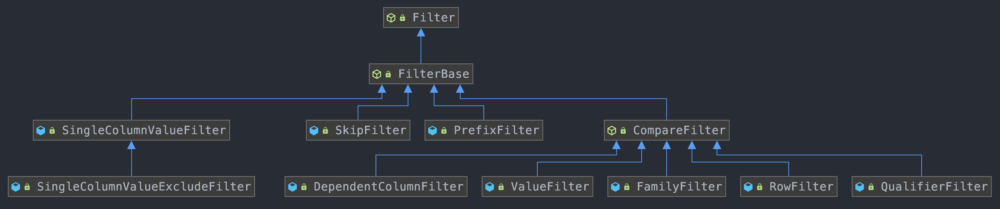
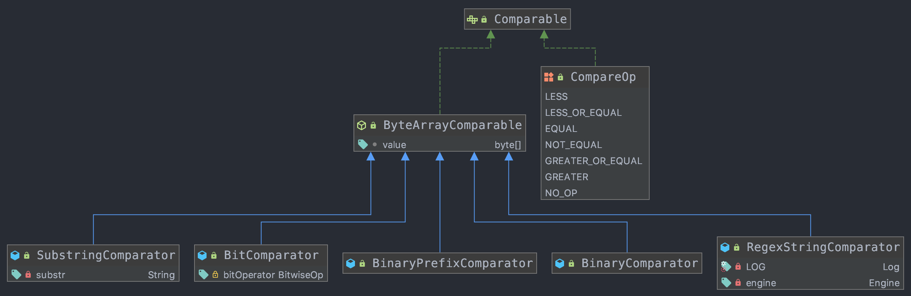

# 1、Hbase概述

## 1.1、概念

特点：
- HBase单表可以有百亿行、百万列，数据矩阵横向和纵向两个维度所支持的数据量级都非常具有弹性；
- HBase是面向列的存储和权限控制，并支持独立检索；列式存储，其数据在表中是按照某列式存储的，在查询时只需要少数几个字段的时候；
- 多版本：HBase每一个列的数据存储有多个version；
- 稀疏性：为空的列并不占用存储空间，表可以设计的非常稀疏；
- 扩展性：底层依赖于HDFS
- 高可靠性：WAL机制保障了数据写入时不会因集群异常而导致写入数据丢失：Replication 机制保证了在集群出现严重的问题时，数据不会丢失或损坏；
- 高性能：底层的LSM数据结构和RowKey有序排序等架构上的独特设计，使得HBase具有非常高的写入性能。region切分、主键索引和缓存机制使得HBase在海量数据下具备一定的随机读取性能，该性能针对RowKey的查询能够达到毫秒级；

## 1.2、应用场景

主要特点：
- 海量数据存储
- 准实时查询

实际业务使用场景：
- 交通，比如gps信息
- 金融数据
- 电商数据
- 移动数据
- 瞬间写入量很大；

## 1.3、优缺点

**优点：**
- 强一致性：当 write 返回时，所有的 reader 都会读到同样的值
- 自动扩展性：
    - 数据变大时 region 会分裂。
    - 使用 HDFS 存储备份数据
- 内置恢复功能：使用 Write Ahead Log （类似于文件系统中的日志）
- 与 Hadoop 结合：使用 MapReduce 处理 HBase 数据会非常直观。

**缺点：**
- 业务持续可靠性：
    - WAL 回放很慢。
    - 故障恢复很慢。
    - Major Compaction 时候 I/O 会飙升。

# 2、HBase安装

[HBase环境安装](../工具/环境配置/大数据环境.md#2HBase环境搭建)

其web页面的默认端口是： 60010

# 3、HBase Shell操作

## 3.1、基本操作

进入HBase客户端：
```
$ bin/hbase shell
hbase(main):001:0>
```

查看帮助命令：`help`

查看当前数据库中的表：`list`

## 3.2、表的操作

**创建表：**
```
hbase(main):002:0> create 'student','info'
```

**插入数据：**
```
hbase(main):003:0> put 'student','1001','info:sex','male'
hbase(main):004:0> put 'student','1001','info:age','18'
hbase(main):005:0> put 'student','1002','info:name','Janna'
hbase(main):006:0> put 'student','1002','info:sex','female'
hbase(main):007:0> put 'student','1002','info:age','20'
```

**扫描表的数据：**
```
hbase(main):008:0> scan 'student'
hbase(main):009:0> scan 'student',{STARTROW => '1001', STOPROW  => '1001'}
hbase(main):010:0> scan 'student',{STARTROW => '1001'}
hbase(main):010:0> scan 'student',{COLUMN => 'info'}
```

**查看表结构：**
```
hbase(main):011:0> describe 'student'
```

**更新指定字段的数据：**
```
hbase(main):012:0> put 'student','1001','info:name','Nick'
hbase(main):013:0> put 'student','1001','info:age','100'
```

**查看“指定行”或“指定列族:列”的数据：**
```
hbase(main):014:0> get 'student','1001'
hbase(main):015:0> get 'student','1001','info:name'
```

**统计表数据行数：**
```
hbase(main):021:0> count 'student'
```

**删除数据：**
- 删除某rowkey的全部数据：
    ```
    hbase(main):016:0> deleteall 'student','1001'
    ```
- 删除某rowkey的某一列数据：
    ```
    hbase(main):017:0> delete 'student','1002','info:sex'
    ```

**清空表数据：清空表的操作顺序为先disable，然后再truncate**
```
hbase(main):018:0> truncate 'student'
```

**删除表：**
- 首先需要先让该表为disable状态：
    ```
    hbase(main):019:0> disable 'student'
    ```
- 然后才能drop这个表：
    ```
    hbase(main):020:0> drop 'student'
    ```
*提示：如果直接drop表，会报错：ERROR: Table student is enabled. Disable it first.*

**变更表信息：**
```
将info列族中的数据存放3个版本：
hbase(main):022:0> alter 'student',{NAME=>'info',VERSIONS=>3}
hbase(main):022:0> get 'student','1001',{COLUMN=>'info:name',VERSIONS=>3}
添加列族：alter 'student','info'
删除列族：alter 'student',{NAME=>'info', METHOD=>'delete'}
```

# 4、HBase数据结构

## 4.1、RowKey

RowKey是用来检索记录的主键。访问HBASE table中的行，只有三种方式：
- 通过单个RowKey访问
- 通过RowKey的range（正则）
- 全表扫描

RowKey行键可以是任意字符串（最大长度是64KB，实际应用中长度一般为 10-100bytes），在HBASE内部，RowKey保存为`字节数组`。存储时，数据按照RowKey的`字典序(byte order)`排序存储。设计RowKey时，要充分排序存储这个特性，将经常一起读取的行存储放到一起；

## 4.2、Column

Column Family + Column Qualifier 组成了 Column

- Column Family：列族：HBASE表中的每个列，都归属于某个列族。列族是表的schema的一部 分(而列不是)，必须在使用表之前定义。

- Column Qualifier：列名都以列族作为前缀。例如 `courses:history`，`courses:math`都属于courses 这个列族

## 4.3、Cell

由`{rowkey, column Family:columu, version}` 唯一确定的单元。cell中的数据是没有类型的，全部是字节码形式存贮。

关键字：`无类型、字节码`

## 4.4、Time Stamp

- HBASE 中通过rowkey和columns确定的为一个存贮单元称为cell。
- 每个 cell都保存 着同一份数据的多个版本。版本通过时间戳来索引。
- 时间戳的类型是 64位整型。时间戳可以由HBASE(在数据写入时自动 )赋值，此时时间戳是精确到毫秒 的当前系统时间。
- 时间戳也可以由客户显式赋值。如果应用程序要避免数据版 本冲突，就必须自己生成具有唯一性的时间戳。
- 每个 cell中，不同版本的数据按照时间倒序排序，即最新的数据排在最前面。
- 为了避免数据存在过多版本造成的的管理 (包括存贮和索引)负担，HBASE提供 了两种数据版本回收方式。一是保存数据的最后n个版本，二是保存最近一段 时间内的版本（比如最近七天）。用户可以针对每个列族进行设置

## 4.5、Namespace

命名空间的结构：
```
                  HBase namespaces
                         |
   ------------------------------------------------
   |             |                  |             |
Tables    RegionServer group    Permission      Quota
```

- Table：表，所有的表都是命名空间的成员，即表必属于某个命名空间，如果没有指定，则在default默认的命名空间中。
- RegionServer group：一个命名空间包含了默认的RegionServer Group。
- Permission：权限，命名空间能够让我们来定义访问控制列表ACL（Access Control List）。例如，创建表，读取表，删除，更新等等操作。
- Quota：限额，可以强制一个命名空间可包含的region的数量

# 5、API操作

相关依赖：
```xml
<dependency>
    <groupId>org.apache.hbase</groupId>
    <artifactId>hbase-server</artifactId>
    <version>1.2.4</version>
</dependency>

<dependency>
    <groupId>org.apache.hbase</groupId>
    <artifactId>hbase-client</artifactId>
    <version>1.2.4</version>
</dependency>
```

常见操作
```java
public class HBaseUtil {

    /**
     * 创建HBase表.
     *
     * @param tableName 表名
     * @param cfs       列族的数组
     * @return 是否创建成功
     */
    public static boolean createTable(String tableName, String[] cfs) {
        try (HBaseAdmin admin = (HBaseAdmin) HBaseConn.getHBaseConn().getAdmin()) {
            if (admin.tableExists(tableName)) {
                return false;
            }
            HTableDescriptor tableDescriptor = new HTableDescriptor(TableName.valueOf(tableName));
            Arrays.stream(cfs).forEach(cf -> {
                HColumnDescriptor columnDescriptor = new HColumnDescriptor(cf);
                columnDescriptor.setMaxVersions(1);
                tableDescriptor.addFamily(columnDescriptor);
            });
            admin.createTable(tableDescriptor);
        } catch (Exception e) {
            e.printStackTrace();
        }
        return true;
    }

    /**
     * 删除hbase表.
     *
     * @param tableName 表名
     * @return 是否删除成功
     */
    public static boolean deleteTable(String tableName) {
        try (HBaseAdmin admin = (HBaseAdmin) HBaseConn.getHBaseConn().getAdmin()) {
            admin.disableTable(tableName);
            admin.deleteTable(tableName);
        } catch (Exception e) {
            e.printStackTrace();
        }
        return true;
    }

    /**
     * hbase插入一条数据.
     *
     * @param tableName 表名
     * @param rowKey    唯一标识
     * @param cfName    列族名
     * @param qualifier 列标识
     * @param data      数据
     * @return 是否插入成功
     */
    public static boolean putRow(String tableName, String rowKey, String cfName, String qualifier,
                                 String data) {
        try (Table table = HBaseConn.getTable(tableName)) {
            Put put = new Put(Bytes.toBytes(rowKey));
            put.addColumn(Bytes.toBytes(cfName), Bytes.toBytes(qualifier), Bytes.toBytes(data));
            table.put(put);
        } catch (IOException ioe) {
            ioe.printStackTrace();
        }
        return true;
    }

    public static boolean putRows(String tableName, List<Put> puts) {
        try (Table table = HBaseConn.getTable(tableName)) {
            table.put(puts);
        } catch (IOException ioe) {
            ioe.printStackTrace();
        }
        return true;
    }

    /**
     * 获取单条数据.
     *
     * @param tableName 表名
     * @param rowKey    唯一标识
     * @return 查询结果
     */
    public static Result getRow(String tableName, String rowKey) {
        try (Table table = HBaseConn.getTable(tableName)) {
            Get get = new Get(Bytes.toBytes(rowKey));
            return table.get(get);
        } catch (IOException ioe) {
            ioe.printStackTrace();
        }
        return null;
    }

    public static Result getRow(String tableName, String rowKey, FilterList filterList) {
        try (Table table = HBaseConn.getTable(tableName)) {
            Get get = new Get(Bytes.toBytes(rowKey));
            get.setFilter(filterList);
            return table.get(get);
        } catch (IOException ioe) {
            ioe.printStackTrace();
        }
        return null;
    }

    public static ResultScanner getScanner(String tableName) {
        try (Table table = HBaseConn.getTable(tableName)) {
            Scan scan = new Scan();
            scan.setCaching(1000);
            return table.getScanner(scan);
        } catch (IOException ioe) {
            ioe.printStackTrace();
        }
        return null;
    }

    /**
     * 批量检索数据.
     *
     * @param tableName   表名
     * @param startRowKey 起始RowKey
     * @param endRowKey   终止RowKey
     * @return ResultScanner实例
     */
    public static ResultScanner getScanner(String tableName, String startRowKey, String endRowKey) {
        try (Table table = HBaseConn.getTable(tableName)) {
            Scan scan = new Scan();
            scan.setStartRow(Bytes.toBytes(startRowKey));
            scan.setStopRow(Bytes.toBytes(endRowKey));
            scan.setCaching(1000);
            return table.getScanner(scan);
        } catch (IOException ioe) {
            ioe.printStackTrace();
        }
        return null;
    }

    public static ResultScanner getScanner(String tableName, String startRowKey, String endRowKey,
                                           FilterList filterList) {
        try (Table table = HBaseConn.getTable(tableName)) {
            Scan scan = new Scan();
            scan.setStartRow(Bytes.toBytes(startRowKey));
            scan.setStopRow(Bytes.toBytes(endRowKey));
            scan.setFilter(filterList);
            scan.setCaching(1000);
            return table.getScanner(scan);
        } catch (IOException ioe) {
            ioe.printStackTrace();
        }
        return null;
    }

    /**
     * HBase删除一行记录.
     *
     * @param tableName 表名
     * @param rowKey    唯一标识
     * @return 是否删除成功
     */
    public static boolean deleteRow(String tableName, String rowKey) {
        try (Table table = HBaseConn.getTable(tableName)) {
            Delete delete = new Delete(Bytes.toBytes(rowKey));
            table.delete(delete);
        }
        return true;
    }
    public static boolean deleteColumnFamily(String tableName, String cfName) {
        try (HBaseAdmin admin = (HBaseAdmin) HBaseConn.getHBaseConn().getAdmin()) {
            admin.deleteColumn(tableName, cfName);

        }
        return true;
    }
    public static boolean deleteQualifier(String tableName, String rowKey, String cfName,
                                          String qualifier) {
        try (Table table = HBaseConn.getTable(tableName)) {
            Delete delete = new Delete(Bytes.toBytes(rowKey));
            delete.addColumn(Bytes.toBytes(cfName), Bytes.toBytes(qualifier));
            table.delete(delete);
        } catch (IOException ioe) {
            ioe.printStackTrace();
        }
        return true;
    }
}
```


# 6、HBase过滤器

过滤器提供了强大的特性帮助用户查询数据的效率；不仅可以使用预定义好的过滤器，也可以自定义过滤器；查询可以根据 Rowkey 进行 Get 或根据 Rowkey 的范围进行 Scan 扫描，提供过滤器可以再HBase服务端进行结果过滤。

过滤器主要分为两类：比较器过滤器和专用过滤器

## 6.1、过滤器层次结构

过滤器的最底层是 Filter接口 和 FilterBase抽象类，其实现了过滤器的空壳和骨架，避免重复代码。

大部分过滤器都是直接继承 FilterBase 或者间接继承 FilterBase



## 6.2、比较运算符和比较器

比较过滤器需要两个参数：比较运算符和比较器

基本层次结构如下：



**比较运算符：** 在比较过滤器中需要用到比较运算符，HBase 内置以下7种比较运算符
```java
public enum CompareOp {       
    LESS,               // 检查是否小于比较器里的值       
    LESS_OR_EQUAL,      // 检查是否小于或等于比较器里的值       
    EQUAL,              // 检查是否等于比较器里的值       
    NOT_EQUAL,          // 检查是否不等于比较器里的值   
    GREATER_OR_EQUAL,   // 检查是否大于或等于比较器里的值   
    GREATER,            // 检查是否大于比较器里的值       
    NO_OP,              // 默认返回false，因此过滤掉所有的数据     
}  
```
**比较器：** 通过比较器可以实现多样化目标匹配效果，比较器有以下子类可以使用：
```java
BinaryComparator          // 匹配完整字节数组  
BinaryPrefixComparator    // 匹配字节数组前缀 
BitComparator             // 按位执行与、或、异或比较 
NullComparator            // 判断当前值是不是 NULL 
RegexStringComparator     // 正则表达式匹配字符串 
SubstringComparator       // 子串匹配，相当于 contains()
```

## 6.3、比较过滤器

### 6.3.1、行键过滤器：RowFilter

```java
Scan scan = new Scan(); 
Filter filter = new RowFilter(CompareOp.LESS_OR_EQUAL, new BinaryComparator(Bytes.toBytes("uid-100"))); 
scan.setFilter(filter);
```
筛选出匹配的所有的行，基于行键（Rowkey）过滤数据，可以执行精确匹配，子字符串匹配或正则表达式匹配，过滤掉不匹配的数据。

一般来说，对 Rowkey 进行范围过滤，可以执行 Scan 的 startKey 和 endKey，RowFilter 可以更精确的过滤。

### 6.3.2、列族过滤器：FamilyFilter

```java
Scan scan = new Scan(); 
Filter filter = new FamilyFilter(CompareFilter.CompareOp.LESS, new BinaryComparator(Bytes.toBytes("cf-d"))); 
scan.setFilter(filter);
```
与 RowFilter 类似，区别是比较列族，而不是比较行键。当 HBase 表有多个列族时，可以用来筛选不同列族中的列

### 6.3.3、列名过滤器：QualifierFilter

```java
Scan scan = new Scan(); 
Filter filter = new QualifierFilter(CompareFilter.CompareOp.EQUAL, new BinaryComparator(Bytes.toBytes("col-1"))); 
scan.setFilter(filter1);
```
根据列名进行筛选

### 6.3.4、值过滤器：ValueFilter

```java
Scan scan = new Scan(); 
Filter filter = new ValueFilter(CompareFilter.CompareOp.NOT_EQUAL, new SubstringComparator("abc")); 
scan.setFilter(filter);
```
筛选特定值的单元格，可以与 RegexStringComparator 搭配使用，完成复杂的筛选。

不同的比较器，只能与部分比较运算符搭配，例如 SubstringComparator、RegexStringComparator 只能使用 `EQUAL` 或 `NOT_EQUAL`

### 6.3.5、参考列过滤器：DependentColumnFilter

```java
Scan scan = new Scan(); 
Filter filter = new DependentColumnFilter(Bytes.toBytes("cf-d"), 
    Bytes.toBytes("col-1"), "false", CompareOp.EQUAL, new BinaryComparator(Bytes.toBytes("val-1")))) 
scan.setFilter(filter);
```
一种更复杂的过滤器，不止简单的通过用户指定的信息筛选数据。允许指定一个参考列或引用列，使用参考列控制其他列的过滤。该过滤器会使用参考列的时间戳，并在过滤时包括所有与引用时间戳相同的列。

参考列过滤器相当于一个 ValueFilter 和一个时间戳过滤器的组合

## 6.4、专用过滤器

### 6.4.1、单列值过滤器：SingleColumnValueFilter

使用某一列的值，决定一行数据是否被过滤
```java
Scan scan = new Scan(); 
SingleColumnValueFilter filter = new SingleColumnValueFilter(Bytes.toBytes("cf-d"), Bytes.toBytes("col-5"), 
    CompareFilter.CompareOp.NOT_EQUAL, new SubstringComparator("val-1")); 
filter.setFilterIfMissing(true); // 如果不设置为 true，那些不包含指定列的行也会返回 
scan.setFilter(filter);
```
对于不包含指定列的行数据，通过 setFilterIfMissing() 决定是否返回

### 6.4.2、单列值排除器：SingleColumnValueExcludeFilter

继承自 SingleColumnValueFilter，实现的与单列值过滤器相反的语义

### 6.4.3、行前缀过滤器：PrefixFilter

```java
Scan scan = new Scan(); 
Filter filter = new PrefixFilter(Bytes.toBytes("row1")); 
scan.setFilter(filter);
```
基于行键（Rowkey）的前缀过滤行数据。Scan 操作以字典序查找，当行键大于前缀时，Scan 结束

### 6.4.4、列前缀过滤器：ColumnPrefixFilter

```java
Scan scan = new Scan(); 
Filter filter = new ColumnPrefixFilter(Bytes.toBytes("col-")); 
scan.setFilter(filter);
```
通过对列名称的前缀匹配过滤，返回的结果只包含满足过滤器的列

### 6.4.5、分页过滤器：PageFilter

```java
byte[] lastRow = null; 
Filter filter = new PageFilter(10); 

while(true) { 
    int rowCount = 0; 
    Scan scan = new Scan(); 
    scan.setFilter(filter); 
    scan.setStartRow(lastRow); 
    ResultScanner resultScanner = table.getScanner(scan); 
    Iterator<Result> resultIterator = resultScanner.iterator(); 
    while (resultIterator.hasNext()) { 
        Result result = resultIterator.next(); 
        // ... 
        lastRow = result.getRow(); // 记录最后一行的rowkey 
        rowCount++; // 记录本页行数 
    } 
    if(rowCount <= 10) { 
        break; 
    } 
}
```
使用该过滤器，对结果进行按行分野，需要指定 pageSize 参数，控制每页返回的行数，并设置 startRow 多次调用 getScanner()，感觉功能只适用于一些特殊场景，性能也并不高

### 6.4.6、行键过滤器：KeyOnlyFilter

这个 Filter 只会返回每行的`行键+列簇+列`，而不返回值（value），对不需要值的应用场景来说，非常实用，减少了值的传递。构造方法可以设置 lenAsValue 参数（默认 false），表示返回时，value 设为原列值的长度

### 6.4.7、首次行键过滤器：FirstKeyOnlyFilter

```java
FirstKeyOnlyFilter filter = new FirstKeyOnlyFilter();
```
这个 Filter 仅仅返回每一行中的第一个 cell 的值，可以用于高效的执行行数统计操作，在扫描到第一个 cell 时，立即跳到下一行数据，性能相比全表扫描得到提升。

### 6.4.8、包含结束的过滤器：InclusiveStopFilter

```java
Filter filter = new InclusiveStopFilter(Bytes.toBytes("uid-10"));
```
一般的扫描结果中，设置一个开始行键和一个终止行键，是前闭后开区间，不包含结束行，使用这个过滤器时将结束行加入到结果中。

### 6.4.9、时间戳过滤器：TimestampsFilter

```java
Filter filter = new TimestampsFilter(Arrays.asList(5L, 10L, 15L)); 
Scan scan1 = new Scan(); 
scan1.setMaxVersions(3) 
scan1.setFilter(filter); 

Scan scan2 = new Scan(); 
scan2.setMaxVersions(3) 
scan2.setFilter(filter); 
scan2.setTimeRange(8, 12);
```

当需要在扫描结果中对版本进行细粒度控制时，可以使用这个 Filter 传入一个时间戳集合，对时间进行限制，只会返回与指定时间戳相同的版本数据，并且与设置时间戳范围共同使用。

### 6.4.10、列计数过滤器 ColumnCountGetFilter

```java
Filter filter = new ColumnCountGetFilter(10);
```
使用这个过滤器，限制每行最多返回多少列。注意当一行的列数达到设定的最大值，过滤器会停止 Scan 操作，所以不适合全表扫描，适合在 Get 方法中使用。

### 6.4.11、列分页过滤器 ColumnPaginationFilter

```java
Filter filter = new ColumnPaginationFilter(10,5);
```
与 PageFilter 类似，可以对一行的所有列进行分也，需要传入偏移量 offset 和返回数量 limit。

### 6.4.12、随机行过滤器 RandomRowFilter

```java
Filter filter = new RandomRowFilter(0.5F);
```
这个 Filter 可以使结果中包含随机行，参数 chance 取值在 0.0 到 1.0 之间，表示随机取行数的比例，每一行会调用 Random.nextFloat() 与 chance 比较来确定是否被过滤

## 6.5、附加过滤器

普通过滤器可以提供对返回结果的筛选限制，一些额外的控制可以附加在过滤器上

### 6.5.1、跳转过滤器：SkipFilter

```java
Scan scan = new Scan(); 
Filter filter1 = new ValueFilter(CompareFilter.CompareOp.NOT_EQUAL, new BinaryComparator(Bytes.toBytes("val-0"))); 
Filter filter2 = new SkipFilter(filter1);
```
包装了用户的一个过滤器，当过滤器发现某一行的一列需要过滤时，整行数据都被过滤掉。上面的例子是，使用 SkipFilter 和 ValueFilter 组合，获取不等于指定列值的行，同时过滤掉其他不符合条件的行（即只要有一行中一列的值等于“val-0”，就会被过滤）

### 6.5.2、全匹配过滤：WhileMatchFilter

```java
Scan scan = new Scan(); 
Filter filter1 = new ValueFilter(CompareFilter.CompareOp.NOT_EQUAL, new BinaryComparator(Bytes.toBytes("val-0"))); 
Filter filter2 = new WhileMatchFilter(filter1);
```

## 6.6、多种过滤器结合使用

通过 FilterList 实例可以提供多个过滤器共同使用的功能。并且可以指定对多个过滤器的过滤结果如何组合

FilterList 构造函数和方法：
```java
FilterList(List<Filter> rowFilters) 
FilterList(Operator operator) 
FilterList(Operator operator, List<Filter> rowFilters) 
void addFilter(Filter filter)
```
FilterList.Operator 决定了过滤器集合 List<Filter> rowFilters 的组合结果，可选值：
```java
MUST_PASS_ALL // 当所有过滤器都允许包含这个值时，才会加入到结果中
MUST_PASS_ONE // 只需要有一个过滤器允许包含这个值时，就会加入到结果中
```
```java
Filter filter1 = new ...; 
Filter filter2 = new ...; 
Filter filter3 = new ...; 
FilterList filterList = new FilterList(Arrays.asList(filter1, filter2, filter3)); 
Scan scan = new Scan(); 
scan.setFilter(filterList);
```

# 7、HBase计数器与协处理器

## 7.1、计数器


## 7.2、协处理器


# 8、HBase调优

## 8.1、什么导致HBase性能下降

- JVM内存分配和GC回收策略
- 与HBase运行机制相关的部分配置不合理
- 表结构设计与用户使用方式不合理

## 8.2、服务端优化


## 8.3、常见优化策略

- 预先分区

- Rowkey优化

- Column 优化

- schema优化


## 7.4、读写优化

# 9、HBase监控

## 9.1、如何监控

# 10、Phoenix

# 11、架构体系与设计模型

## 11.1、架构组件

物理上，Hbase 是由三种类型的 server 组成的的主从式（master-slave）架构：
- Region Server：负责处理数据的读写请求，客户端请求数据时直接和 Region Server 交互。
- HBase Master：负责 Region 的分配，DDL（创建，删除 table）等操作。
- Zookeeper：作为 HDFS 的一部分，负责维护集群状态

当然底层的存储都是基于 Hadoop HDFS 的：
- Hadoop DataNode 负责存储 Region Server 所管理的数据。所有的 HBase 数据都存储在 HDFS 文件中。Region Server 和 HDFS DataNode 往往是分布在一起的，这样 Region Server 就能够实现数据本地化（data locality，即将数据放在离需要者尽可能近的地方）。HBase 的数据在写的时候是本地的，但是当 region 被迁移的时候，数据就可能不再满足本地性了，直到完成 compaction，才能又恢复到本地。
- Hadoop NameNode 维护了所有 HDFS 物理 data block 的元信息

### 11.1.1、Regions

- HBase 表（Table）根据 rowkey 的范围被水平拆分成若干个 region。
- 每个 region 都包含了这个region 的 `start key` 和 `end key` 之间的所有行（row）。
- 每个 region 的默认大小为 1GB
- Regions 被分配给集群中的某些节点来管理，即 Region Server，由它们来负责处理数据的读写请求。
- 每个 Region Server 大约可以管理 1000 个 regions；

**Region 分裂**

一开始每个 table 默认只有一个 region。当一个 region 逐渐变得很大时，它会分裂（split）成两个子 region，每个子 region 都包含了原来 region 一半的数据，这两个子 region 并行地在原来这个 region server 上创建，这个分裂动作会被报告给 HMaster。处于负载均衡的目的，HMaster 可能会将新的 region 迁移给其它 region server

**Read 负载均衡**
Splitting 一开始是发生在同一台 region server 上的，但是出于负载均衡的原因，HMaster 可能会将新的 regions 迁移给其它 region server，这会导致那些 region server 需要访问离它比较远的 HDFS 数据，直到 major compaction 的到来，它会将那些远方的数据重新移回到离 region server 节点附近的地方

### 11.1.2、HBase Master

也叫HMaster，负责 Region 的分配，DDL（创建，删除表）等操作：
- 统筹协调所有 region server：
    - 启动时分配 regions，在故障恢复和负载均衡时重分配 regions
    - 监控集群中所有 Region Server 实例（从 Zookeeper 获取通知信息）

- 管理员功能：提供创建，删除和更新 HBase Table 的接口

### 11.1.3、Zookeeper

HBase 使用 Zookeeper 做分布式管理服务，来维护集群中所有服务的状态。

Zookeeper 维护了哪些 servers 是健康可用的，并且在 server 故障时做出通知。

Zookeeper 使用一致性协议来保证分布式状态的一致性。注意这需要三台或者五台机器来做一致性协议

## 11.2、组件如何工作

Zookeeper 用来协调分布式系统中集群状态信息的共享。Region Servers 和 active HMaster 与 Zookeeper 保持会话（session）。Zookeeper 通过心跳检测来维护所有临时节点（ephemeral nodes）；

每个 Region Server 都会创建一个 ephemeral 节点。HMaster 会监控这些节点来发现可用的 Region Servers，同样它也会监控这些节点是否出现故障；

HMaster 们会竞争创建 ephemeral 节点，而 Zookeeper 决定谁是第一个作为在线 HMaster，保证线上只有一个 HMaster。在线 HMaster（active HMaster） 会给 Zookeeper 发送心跳，不在线的待机 HMaster （inactive HMaster） 会监听 active HMaster 可能出现的故障并随时准备上位；

如果有一个 Region Server 或者 HMaster 出现故障或各种原因导致发送心跳失败，它们与 Zookeeper 的 session 就会过期，这个 ephemeral 节点就会被删除下线，监听者们就会收到这个消息。Active HMaster 监听的是 region servers 下线的消息，然后会恢复故障的 region server 以及它所负责的 region 数据。而 Inactive HMaster 关心的则是 active HMaster 下线的消息，然后竞争上线变成 active HMaster；

## 11.3、第一次读和写操作

有一个特殊的 HBase Catalog 表叫`Meta table`（它其实是一张特殊的 HBase 表），包含了集群中所有 regions 的位置信息。Zookeeper 保存了这个 Meta table 的位置。

当 HBase 第一次读或者写操作到来时：
- 客户端从 Zookeeper 那里获取是哪一台 Region Server 负责管理 Meta table。
- 客户端会查询那台管理 Meta table 的 Region Server，进而获知是哪一台 Region Server 负责管理本次数据请求所需要的 rowkey。客户端会缓存这个信息，以及 Meta table 的位置信息本身。
- 然后客户端回去访问那台 Region Server，获取数据；

对于以后的的读请求，客户端从可以缓存中直接获取 Meta table 的位置信息（在哪一台 Region Server 上），以及之前访问过的 rowkey 的位置信息（哪一台 Region Server 上），除非因为 Region 被迁移了导致缓存失效。这时客户端会重复上面的步骤，重新获取相关位置信息并更新缓存

## 11.4、HBase Meta Table

Meta table 是一个特殊的 HBase table，它保存了系统中所有的 region 列表。这张 table 类似一个 b-tree，结构大致如下：

- Key：table, region start key, region id
- Value：region serve

## 11.5、Region Server组成

Region Server 运行在 HDFS DataNode 上，由以下组件组成：
- `WAL`：Write Ahead Log 是分布式文件系统上的一个文件，用于存储新的还未被持久化存储的数据，它被用来做故障恢复。
- `BlockCache`：这是读缓存，在内存中存储了最常访问的数据，是 LRU（Least Recently Used）缓存。
- `MemStore`：这是写缓存，在内存中存储了新的还未被持久化到硬盘的数据。当被写入硬盘时，数据会首先被排序。注意每个 Region 的每个 Column Family 都会有一个 MemStore。
- `HFile`：在硬盘上（HDFS）存储 HBase 数据，以有序 KeyValue 的形式

## 11.6、HBase写数据步骤

当客户端发起一个写数据请求（Put 操作），第一步首先是将数据写入到 WAL 中：
- 新数据会被追加到 WAL 文件尾部。
- WAL 用来在故障恢复时恢复还未被持久化的数据

数据被写入 WAL 后，会被加入到 MemStore 即写缓存。然后服务端就可以向客户端返回 ack 表示写数据完成

**注意：** 数据写入时 WAL 和 MemStore 更新的顺序，不能调换，必须先 WAL 再 MemStore。如果反过来，先更新完 MemStore，此时 Region Server 发生 crash，内存中的更新就丢失了，而此时数据还未被持久化到 WAL，就无法恢复了。理论上 WAL 就是 MemStore 中数据的一个镜像，应该保持一致，除非发生系统 crash。另外注意更新 WAL 是在文件尾部追加的方式

**MemStore：**

MemStore 在内存中缓存 HBase 的数据更新，以有序 KeyValues 的形式，这和 HFile 中的存储形式一样。每个 Column Family 都有一个 MemStore，所有的更新都以 Column Family 为单位进行排序

**HBase Region Flush：**

MemStore 中累积了足够多的的数据后，整个有序数据集就会被写入一个新的 HFile 文件到 HDFS 上。HBase 为每个 Column Family 都创建一个 HFile，里面存储了具体的 Cell，也即 KeyValue 数据。随着时间推移，HFile 会不断产生，因为 KeyValue 会不断地从 MemStore 中被刷写到硬盘上

**注意这也是为什么 HBase 要限制 Column Family 数量的一个原因**。每个 Column Family 都有一个 MemStore；如果一个 MemStore 满了，所有的 MemStore 都会被刷写到硬盘。同时它也会记录最后写入的数据的最大序列号（sequence number），这样系统就能知道目前为止哪些数据已经被持久化了。

最大序列号是一个 meta 信息，被存储在每个 HFile 中，来表示持久化进行到哪条数据了，应该从哪里继续。当 region 启动时，这些序列号会被读取，取其中最大的一个，作为基础序列号，后面的新的数据更新就会在该值的基础上递增产生新的序列号

## 11.7、HBase HFile

数据存储在 HFile 中，以 Key/Value 形式。当 MemStore 累积了足够多的数据后，整个有序数据集就会被写入一个新的 HFile 文件到 HDFS 上。整个过程是一个顺序写的操作，速度非常快，因为它不需要移动磁盘头。（注意 HDFS 不支持随机修改文件操作，但支持 append 操作。）

### 11.7.1、HBase HFile 文件结构

HFile 使用多层索引来查询数据而不必读取整个文件，这种多层索引类似于一个 B+ tree：
- KeyValues 有序存储。
- rowkey 指向 index，而 index 则指向了具体的 data block，以 64 KB 为单位。
- 每个 block 都有它的叶索引。
- 每个 block 的最后一个 key 都被存储在中间层索引。
- 索引根节点指向中间层索引。

trailer 指向原信息数据块，它是在数据持久化为 HFile 时被写在 HFile 文件尾部。trailer 还包含例如布隆过滤器和时间范围等信息。布隆过滤器用来跳过那些不包含指定 rowkey 的文件，时间范围信息则是根据时间来过滤，跳过那些不在请求的时间范围之内的文件

### 11.7.2、HFile 索引

在 HFile 被打开时会被载入内存，这样数据查询只要一次硬盘查询

## 11.8、HBase Read 合并

每行（row）的 KeyValue cells 可能位于不同的地方，这些 cell 可能被写入了 HFile，可能是最近刚更新的，还在 MemStore 中，也可能最近刚读过，缓存在 Block Cache 中。所以，当你读一行 row 时，系统怎么将对应的 cells 返回呢？一次 read 操作会将 Block Cache，MemStore 和 HFile 中的 cell 进行合并：
- 首先 scanner 从 Block Cache 读取 cells。最近读取的 KeyValue 都被缓存在这里，这是 一个 LRU 缓存。
- 然后 scanner 读取 MemStore，即写缓存，包含了最近更新的数据。
- 如果 scanner 没有在 BlockCache 和 MemStore 都没找到对应的 cells，则 HBase 会使用 Block Cache 中的索引和布隆过滤器来加载对应的 HFile 到内存，查找到请求的 row cells

每个 MemStore 可能会有多个 HFile，所以一次 read 请求可能需要多读个文件，这可能会影响性能，这被称为读放大（read amplification）

**HBase Minor Compaction**

HBase 会自动合并一些小的 HFile，重写成少量更大的 HFiles。这个过程被称为 minor compaction。它使用归并排序算法，将小文件合并成大文件，有效减少 HFile 的数量

**HBase Major Compaction**

Major Compaction 合并重写每个 Column Family 下的所有的 HFiles，成为一个单独的大 HFile，在这个过程中，被删除的和过期的 cell 会被真正从物理上删除，这能提高读的性能。但是因为 major compaction 会重写所有的 HFile，会产生大量的硬盘 I/O 和网络开销。这被称为写放大（Write Amplification）

Major compaction 可以被设定为自动调度。因为存在 write amplification 的问题，major compaction 一般都安排在周末和半夜。MapR 数据库对此做出了改进，并不需要做 compaction。Major compaction 还能将因为服务器 crash 或者负载均衡导致的数据迁移重新移回到离 Region Server 的地方，这样就能恢复 data locality

## 11.9、数据备份与故障恢复

### 11.9.1、数据备份

所有的读写都发生在 HDFS 的主 DataNode 节点上。 HDFS 会自动备份 WAL 和 HFile 的文件 blocks。HBase 依赖于 HDFS 来保证数据完整安全。当数据被写入 HDFS 时，一份会写入本地节点，另外两个备份会被写入其它节点。

WAL 和 HFiles 都会持久化到硬盘并备份。那么 HBase 是怎么恢复 MemStore 中还未被持久化到 HFile 的数据呢？

### 11.9.2、故障恢复

当某个 Region Server 发生 crash 时，它所管理的 region 就无法被访问了，直到 crash 被检测到，然后故障恢复完成，这些 region 才能恢复访问。Zookeeper 依靠心跳检测发现节点故障，然后 HMaster 会收到 region server 故障的通知。

当 HMaster 发现某个 region server 故障，HMaster 会将这个 region server 所管理的 regions 分配给其它健康的 region servers。为了恢复故障的 region server 的 MemStore 中还未被持久化到 HFile 的数据，HMaster 会将 WAL 分割成几个文件，将它们保存在新的 region server 上。每个 region server 然后回放各自拿到的 WAL 碎片中的数据，来为它所分配到的新 region 建立 MemStore

WAL 包含了一系列的修改操作，每个修改都表示一个 put 或者 delete 操作。这些修改按照时间顺序依次写入，持久化时它们被依次写入 WAL 文件的尾部。

当数据仍然在 MemStore 还未被持久化到 HFile 怎么办呢？WAL 文件会被回放。操作的方法是读取 WAL 文件，排序并添加所有的修改记录到 MemStore，最后 MemStore 会被刷写到 HFile

## 11.10、HBase写流程

- Client会先访问zookeeper，得到对应的RegionServer地址；
- Client对RegionServer发起写请求，RegionServer接受数据写入内存；
- 当MemStore的大小达到一定的值后（默认是128M），flush到StoreFile并存储到HDFS
- 随着StoreFile文件的不断增多，当其数量增长到一定阈值后，触发Compact合并操作，将多个StoreFile合并成一个StoreFile，同时进行版本合并和数据删除。
- StoreFiles通过不断的Compact合并操作，逐步形成越来越大的StoreFile。
- 单个StoreFile大小超过一定阈值后，触发Split操作，把当前Region Split成2个新的Region。父Region会下线，新Split出的2个子Region会被HMaster分配到相应的RegionServer上，使得原先1个Region的压力得以分流到2个Region上

## 11.11、HBase读流程

- Client访问Zookeeper，查找-ROOT-表，获取`.META.`表信息。
- 从`.META.`表查找，获取存放目标数据的Region信息，从而找到对应的RegionServer。
- 通过RegionServer获取需要查找的数据。
- Regionserver的内存分为MemStore和BlockCache两部分，MemStore主要用于写数据，BlockCache主要用于读数据。读请求先到MemStore中查数据，查不到就到BlockCache中查，再查不到就会到StoreFile上读，并把读的结果放入BlockCache。

寻址过程：`client–>Zookeeper–>-ROOT-表–>META表–>RegionServer–>Region–>client`


## 11.12、HBase模块协作

HBase启动时发生了什么


当RegionServer失效后会发生什么


当HMaster失效后会发生什么


# 参考资料

- [HBase官网](http://hbase.apache.org/)
- [弄懂HBase](https://blog.csdn.net/oTengYue/article/details/86751260)
- [HBase架构](https://segmentfault.com/a/1190000019959411)
- [HBase架构-英文版](https://mapr.com/blog/in-depth-look-hbase-architecture/)

