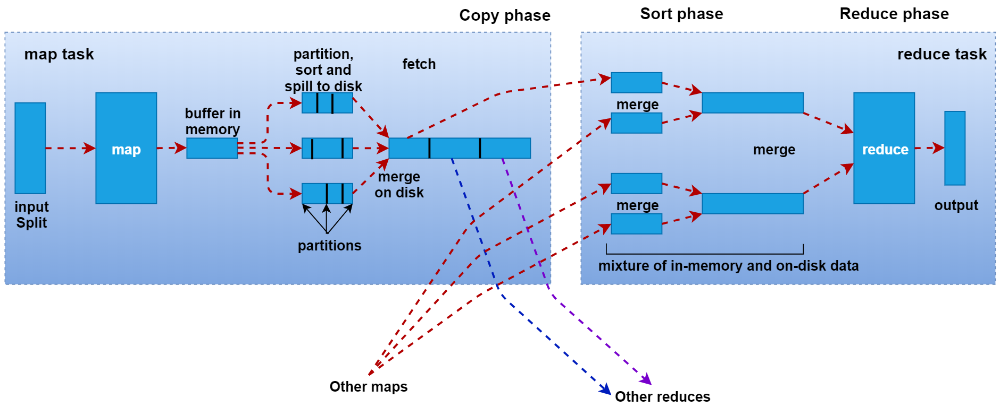
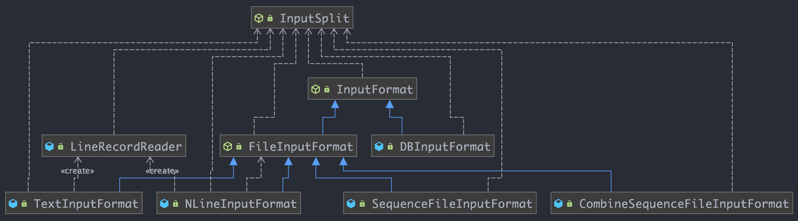
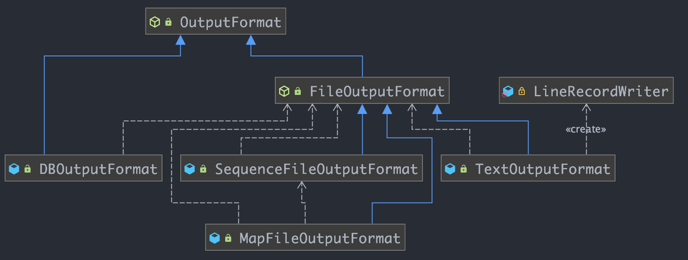
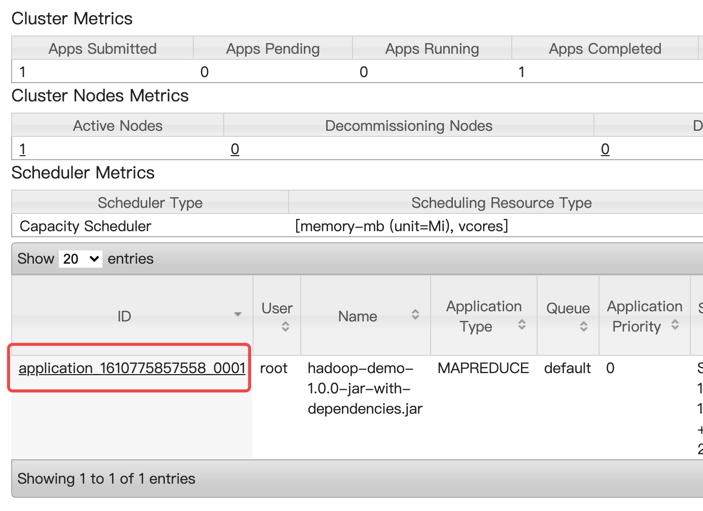

# 1、Hadoop

## 1.1、概述

开源的分布式存储和分布式计算平台，包含三大核心：
- HDFS：存储大数据技术的基础
- Mapreduce：分布式计算的大数据平台解决方案；
- Yarn：资源管理调度，管理资源

优势：
- 高扩展
- 低成本
- 成熟的生态圈

生态圈，除了自带的HDFS、Mapreduce
- Hive
- Hbase
- zookeeper

## 1.2、基础原理与架构

# 2、Hadoop安装

[Hadoop环境安装](../辅助资料/环境配置/大数据环境.md#1Hadoop环境搭建)

# 3、HDFS

- [HDFS实现原理](https://mp.weixin.qq.com/s/rY6diHTjXHSLzuS0uPTRcQ)

是 Hadoop 下的分布式文件系统，具有高容错、高吞吐量等特性，可以部署在低成本的硬件上，主要负责海量数据的分布式存储，支持主从结构，主节点支持多个NameNode，从节点支持多个DataNode

## 3.1、概念

- 数据块： 抽象块而非整个存储，一般大小是64M；
- Namenode： 管理文件系统的命名空间，存储文件元数据；维护着文件系统的所有文件和目录，文件与数据块的映射；记录每个文件中各个块所在的数据节点的信息；负责接收用户请求
- DataNode： 存储并检索数据块、存储数据

主要特点：
- 高容错：由于 HDFS 采用数据的多副本方案，所以部分硬件的损坏不会导致全部数据的丢失。
- 高吞吐量：HDFS 设计的重点是支持高吞吐量的数据访问，而不是低延迟的数据访问。
- 大文件支持：HDFS 适合于大文件的存储，文档的大小应该是是 GB 到 TB 级别的。
- 简单一致性模型：HDFS 更适合于一次写入多次读取 (write-once-read-many) 的访问模型。支持将内容追加到文件末尾，但不支持数据的随机访问，不能从文件任意位置新增数据。
- 跨平台移植性：HDFS 具有良好的跨平台移植性，这使得其他大数据计算框架都将其作为数据持久化存储的首选方案。

## 3.2、HDFS Shell

使用格式： `bin/hdfs dfs -xxx schema://authority/path`

HDFS的schema是hdfs，authority是NameNode的节点ip和对应的端口号(默认是9000)，path 是我们要操作的路径信息

常见操作：
- `-ls`：查询指定路径信息
- `-put`：从本地上传文件
- `-cat`：查看HDFS文件内容
- `-get`：下载文件到本地
- `-mkdri[-p]`：创建文件夹
- `-rm[-r]`：删除文件/文件夹
```
[root@data hadoop-3.2.0]# hdfs dfs
Usage: hadoop fs [generic options]
        [-appendToFile <localsrc> ... <dst>]
        [-cat [-ignoreCrc] <src> ...]
        [-checksum <src> ...]
        [-chgrp [-R] GROUP PATH...]
        [-chmod [-R] <MODE[,MODE]... | OCTALMODE> PATH...]
        [-chown [-R] [OWNER][:[GROUP]] PATH...]
        [-copyFromLocal [-f] [-p] [-l] [-d] [-t <thread count>] <localsrc> ... <dst>]
        [-copyToLocal [-f] [-p] [-ignoreCrc] [-crc] <src> ... <localdst>]
        [-count [-q] [-h] [-v] [-t [<storage type>]] [-u] [-x] [-e] <path> ...]
        [-cp [-f] [-p | -p[topax]] [-d] <src> ... <dst>]
        [-createSnapshot <snapshotDir> [<snapshotName>]]
        [-deleteSnapshot <snapshotDir> <snapshotName>]
        [-df [-h] [<path> ...]]
        [-du [-s] [-h] [-v] [-x] <path> ...]
        [-expunge]
        [-find <path> ... <expression> ...]
        [-get [-f] [-p] [-ignoreCrc] [-crc] <src> ... <localdst>]
        [-getfacl [-R] <path>]
        [-getfattr [-R] {-n name | -d} [-e en] <path>]
        [-getmerge [-nl] [-skip-empty-file] <src> <localdst>]
        [-head <file>]
        [-help [cmd ...]]
        [-ls [-C] [-d] [-h] [-q] [-R] [-t] [-S] [-r] [-u] [-e] [<path> ...]]
        [-mkdir [-p] <path> ...]
        [-moveFromLocal <localsrc> ... <dst>]
        [-moveToLocal <src> <localdst>]
        [-mv <src> ... <dst>]
        [-put [-f] [-p] [-l] [-d] <localsrc> ... <dst>]
        [-renameSnapshot <snapshotDir> <oldName> <newName>]
        [-rm [-f] [-r|-R] [-skipTrash] [-safely] <src> ...]
        [-rmdir [--ignore-fail-on-non-empty] <dir> ...]
        [-setfacl [-R] [{-b|-k} {-m|-x <acl_spec>} <path>]|[--set <acl_spec> <path>]]
        [-setfattr {-n name [-v value] | -x name} <path>]
        [-setrep [-R] [-w] <rep> <path> ...]
        [-stat [format] <path> ...]
        [-tail [-f] <file>]
        [-test -[defsz] <path>]
        [-text [-ignoreCrc] <src> ...]
        [-touch [-a] [-m] [-t TIMESTAMP ] [-c] <path> ...]
        [-touchz <path> ...]
        [-truncate [-w] <length> <path> ...]
        [-usage [cmd ...]]

Generic options supported are:
-conf <configuration file>        specify an application configuration file
-D <property=value>               define a value for a given property
-fs <file:///|hdfs://namenode:port> specify default filesystem URL to use, overrides 'fs.defaultFS' property from configurations.
-jt <local|resourcemanager:port>  specify a ResourceManager
-files <file1,...>                specify a comma-separated list of files to be copied to the map reduce cluster
-libjars <jar1,...>               specify a comma-separated list of jar files to be included in the classpath
-archives <archive1,...>          specify a comma-separated list of archives to be unarchived on the compute machines
```

## 3.3、HDFS体系架构

HDFS包含：NameNode、SecondaryNameNode、DataNode，前面两个是在主节点中启动的，DataNode是在从节点上启动的；

### 3.3.1、NameNode

NameNode 是整个文件系统的管理节点，它主要维护者文件系统的文件目录树，文件/目录的元信息，每个文件对应的数据块列表，并且还负责接收用户的操作请求；HDFS 的 ` 文件系统命名空间 ` 的层次结构与大多数文件系统类似 (如 Linux)， 支持目录和文件的创建、移动、删除和重命名等操作，支持配置用户和访问权限，但不支持硬链接和软连接。`NameNode` 负责维护文件系统名称空间，记录对名称空间或其属性的任何更改
- 目录树：表示目录直接的层级关系，通过 hdfs 执行命令 ls 可以看到的目录结构信息；
- 文件/目录的信息：表示文件/目录的一些基本信息，所有者、所属组、修改时间和文件大小等信息；
- 每个文件的对应数据块列表：如果一个文件太大，在集群中存储的时候会对文件进行切割，会将一个文件分成一块一块的，存储到不同的机器上面。HDFS需要记录一个文件被分成了多少块，每一块存储的地方；

接收用户请求：在命令行使用hdfs操作的时候，需要先同namenode进行通信才能开始操作数据
- NamNode主要包含以下文件： fsimage、edits、seed_txid、VERSION，存储在配置文件`core-site.xml`的`hadoop.tmp.dir`配置的目录下，比如目录：`/data/hadoop_repo/dfs/name/current`
- 以上文件保存的路径是由 `hdfs-default.xml` 文件中的 `dfs.namenode.name.dir` 属性控制的；`hdfs-default.xml`文件在 `hadoop-3.2.0/share/hadoop/hdfs/hadoop-hdfs-3.2.0.jar`中，这个文件包含了HDFS相关的所有默认参数，在配置集群修改的`hdfs-site.xml`属于对`hdfs-default.xml`的一个扩展，可以覆盖掉`hdfs-default.xml`同名参数

```bash
[root@bluefish name]# pwd
/data/hadoop_repo/dfs/name      # 配置的dfs.namenode.name.dir目录
[root@bluefish name]# ll
total 8
drwxr-xr-x 2 root root 4096 Jan 16 14:45 current
-rw-r--r-- 1 root root   15 Jan 16 13:44 in_use.lock # in_use.lock 表示锁，停止的时候会去掉该锁，启动的时候会判断该目录下有没有这把锁，没有的话会其他成功，并增加一把锁
```
进入 current目录库看到如下内容：
```
[root@bluefish current]# ll
total 3284
-rw-r--r-- 1 root root 1048576 Jan 16 13:00 edits_0000000000000000083-0000000000000000083
-rw-r--r-- 1 root root     672 Jan 16 13:32 edits_0000000000000000084-0000000000000000092
-rw-r--r-- 1 root root 1048576 Jan 16 13:37 edits_0000000000000000093-0000000000000000208
-rw-r--r-- 1 root root      42 Jan 16 13:45 edits_0000000000000000209-0000000000000000210
-rw-r--r-- 1 root root   12477 Jan 16 14:45 edits_0000000000000000211-0000000000000000303
-rw-r--r-- 1 root root    2430 Jan 16 13:45  
-rw-r--r-- 1 root root      62 Jan 16 13:45 fsimage_0000000000000000210.md5
-rw-r--r-- 1 root root    3099 Jan 16 14:45 fsimage_0000000000000000303
-rw-r--r-- 1 root root      62 Jan 16 14:45 fsimage_0000000000000000303.md5
-rw-r--r-- 1 root root       4 Jan 16 14:45 seen_txid
-rw-r--r-- 1 root root     214 Jan 14 20:55 VERSION
```
可以看到有 edits文件和 fsimage文件
- fsimage文件有两个文件名相同的，其中一个有后缀是`.md5`，狐妖是做md5校验，确保文件传输的过程不出现问题；其表示文件系统镜像，可以通过特殊的命令查看文件内容：
    比如查看上面 fsimage_0000000000000000210 内容：
    ```
    hdfs oiv -p XML -i fsimage_0000000000000000210 -o fsimage210.xml
    ```
    xml内容其实表示整个文件系统的目录树，详细文件：[fsimage.xml](hdfs-files/fsimage210.xml)
    ```xml
    <!--      主要关注inode标签信息  -->
    <inode>
        <!--     唯一编号       -->
        <id>16394</id>
        <!--      文件类型      -->
        <type>FILE</type>
        <!--       文件名称     -->
        <name>hello.txt</name>
        <!--     文件的副本数量       -->
        <replication>1</replication>
        <!--    修改时间        -->
        <mtime>1610775246463</mtime>
        <!--    访问时间        -->
        <atime>1610775245790</atime>
        <!--    推荐每一个数据块的大小，默认是128M        -->
        <preferredBlockSize>134217728</preferredBlockSize>
        <!--    权限信息       -->
        <permission>root:supergroup:0644</permission>
        <!--    包含多少数据块        -->
        <blocks>
            <block>
                <!--         具体每个数据块的id  ， genstamp唯一编号， numBytes当前数据块的实际大小         -->
                <id>1073741825</id>
                <genstamp>1001</genstamp>
                <numBytes>27</numBytes>
            </block>
        </blocks>
        <!--    表示数据的存储策略        -->
        <storagePolicyId>0</storagePolicyId>
    </inode>
    ```
- edits文件：称之为事务文件，当上传大文件时，比如上传一个10G文件，大文件会分为多个block，edits文件会记录这些block的上传状态，只有当全部block都上传成功之后，此时edits才会记录这个文件上传成功，此时才能通过`hdfs dfs -ls`查看到对应的文件。当然也可以通过特殊命令查看该文件：
    ```
    hdfs oev -i edits_0000000000000000211-0000000000000000303 -o edits.xml
    ```
    详细文件：[edits.xml](hdfs-files/edits.xml)
- seen_txid：是存放 transactionId的文件，format之后是0，它代表的是namenode里面的 edits_* 文件的尾数，namenode重启的时候，会按照 seen_txid 数字，顺序从头跑`edits_0000001~`到 seen_txid 的数字，如果根据对应的 seen_txid 无法加载到对应的文件，namenode进程将不会完成启动以保证数据的一致性
- VERSION：保存了集群的版本信息；当对hdfs重新格式化，里面的信息会发生变化；

**fsimage与edits文件：**
- edits文件会定期合并到fsimage中，SecondaryNameNode进程负责定期将edits的内容合并到fsimage中

### 3.3.2、SecondaryNameNode

- 主要负责定期的把edits文件的内容合并到fsimage中
- 这个合作操作成为checkpoint，在合并的时候会对edits中内容进行转换，生成新的内容保存到fsimage文件中；**注意：**在NameNode的HA架构中没有 SecondaryNameNode 进程的，文件合并操作会由 standbyNameNode复制实现；

### 3.3.3、DataNode

提供真实文件数据的存储服务；针对DataNode主要有两个概念：block 与 replication

**block：**
- HDFS会按照固定的带下，顺序对文件进行划分并编号，划分好的每一个块成为一个Block，HDFS默认Block大小是128 M；
- block块是HDFS读写数据的基本单位，无论文件原始类型是什么，在hdfs内都是字节；
- HDFS中，如果一个文件小于一个数据块的大小，那么并不会占用整个数据块的存储空间；
- block是hdfs产生的，如果直接把文件扔到block文件所在的目录，此时hdfs并不能识别到该文件；
```bash
[root@bluefish subdir0]# cd subdir0/
[root@bluefish subdir0]# pwd
/data/hadoop_repo/dfs/data/current/BP-1806354369-127.0.0.1-1610628919827/current/finalized/subdir0/subdir0
[root@bluefish subdir0]# ll
total 784
-rw-r--r-- 1 root root     27 Jan 16 13:34 blk_1073741825
-rw-r--r-- 1 root root     11 Jan 16 13:34 blk_1073741825_1001.meta   # 用作校验
-rw-r--r-- 1 root root     25 Jan 16 13:35 blk_1073741832
-rw-r--r-- 1 root root     11 Jan 16 13:35 blk_1073741832_1008.meta
-rw-r--r-- 1 root root  22613 Jan 16 13:35 blk_1073741834
-rw-r--r-- 1 root root    187 Jan 16 13:35 blk_1073741834_1010.meta
-rw-r--r-- 1 root root 218696 Jan 16 13:35 blk_1073741835
-rw-r--r-- 1 root root   1719 Jan 16 13:35 blk_1073741835_1011.meta
-rw-r--r-- 1 root root 129840 Jan 16 13:35 blk_1073741836
-rw-r--r-- 1 root root   1023 Jan 16 13:35 blk_1073741836_1012.meta
-rw-r--r-- 1 root root     25 Jan 16 13:48 blk_1073741843
-rw-r--r-- 1 root root     11 Jan 16 13:48 blk_1073741843_1019.meta
-rw-r--r-- 1 root root  22617 Jan 16 13:48 blk_1073741845
-rw-r--r-- 1 root root    187 Jan 16 13:48 blk_1073741845_1021.meta
-rw-r--r-- 1 root root 218700 Jan 16 13:48 blk_1073741846
-rw-r--r-- 1 root root   1719 Jan 16 13:48 blk_1073741846_1022.meta
-rw-r--r-- 1 root root 130330 Jan 16 13:48 blk_1073741847
-rw-r--r-- 1 root root   1027 Jan 16 13:48 blk_1073741847_1023.meta
```

**replication：**
- 副本表示数据的备份数量，如果集群有两个从节点，最多只有两个2个备份，在 hdfs-site.xml 中通过  dfs.replication 配置；默认该参数配置是3，表示会有3个副本；
- 副本的作用：保证数据安全；

### 3.3.4、总结

NameNode维护了两份关系：
- 第一份关系：File与Block list的关系，对应的关系信息存储在fsimage 和 edits 文件中（当NameNode启动的时候会把文件中的内容加载到内存中）；
- 第二份关系：DataNode 和 Block的关系，当DataNode启动的时候，会把当前节点上的Block信息和节点信息上报给NameNode

NameNode启动的时候会把文件夹的元数据信息加载到内存中，每个文件的元数据信息会占用150个字节的内存空间，是恒定的，和文件大小没有关系。

HDFS不适合存储小文件的原因：不管是大文件还是小文件，一个文件的元数据信息在NameNode中都会占用150字节，NameNode节点的内存是有限的，所以其存储能力也是有限的，如果存储了大量的小文件，就会占用NameNode的大量内存；

## 3.4、HDFS的回收站

HDFS会为每个用户创建一个回收站目录：`/user/用户名/.Trash/`，每个被用户在shell命令行删除的文件/目录都会进入到对应的回收站目录中，在回收站的数据都有一个生命周期，也就是当回收站的文件/目录在一段时间内没有被用户恢复的话，HDFS会自动彻底删除；

默认情况下hdfs的回收站没有开启，需要通过配置来开启：`core-site.xml`，添加如下配置：
```xml
<property>
    <name>fs.trash.interval</name>
    <!-- value的单位是分钟 -->
    <value>1440</value>
</property>
```
启动集群，然后执行删除操作，回收站的文件也是下载到本地的
```
[root@bluefish text]# hdfs dfs -rm /SogouQ.sample.txt
2021-01-16 16:53:21,961 INFO fs.TrashPolicyDefault: Moved: 'hdfs://bluefish:9000/SogouQ.sample.txt' to trash at: hdfs://bluefish:9000/user/root/.Trash/Current/SogouQ.sample.txt
[root@bluefish text]# hdfs dfs -ls /user/root/.Trash/Current/
Found 1 items
-rw-r--r--   1 root supergroup     948307 2021-01-16 16:52 /user/root/.Trash/Current/SogouQ.sample.txt
```
**注意：**如果删除的文件过大，超过回收的大小的话会提示删除失败，需要指定参数`-skipTrash`，指定这个参数表示删除的文件不会进回收站
```
[root@bluefish hadoop-3.2.0]# hdfs dfs -rm -r -skipTrash /user.txt
Deleted /user.txt
```

## 3.5、HDFS读、写数据过程

### 3.5.1、HDFS读数据过程


### 3.5.2、HDFS写数据过程

## 3.6、HDFS安全模式

hadoop集群每次在启动的时候，HDFS都会检查集群中文件信息是否完整，比如副本是否缺失之类的，在这个时间段内是不允许对集群有修改操作的，如果遇到该种情况，可以稍等，等HDFS自检完毕，就会自动退出安全模式：
```
[root@bigdata01 hadoop-3.2.0]# hdfs dfs -rm -r /hadoop-3.2.0.tar.gz
2020-04-09 12:00:36,646 WARN fs.TrashPolicyDefault: Can't create trash directory: hdfs://bigdata01:9000/user/root/.Trash/Current
org.apache.hadoop.hdfs.server.namenode.SafeModeException: Cannot create directory /user/root/.Trash/Current. Name node is in safe mode.
```
在HDFS的UI界面上也可以看到，on表示处于安全模式，off表示安全模式已结束
```
Security is off.
Safemode is off.
```
通过hdfs命令可以查看当前的状态：
```
[root@bluefish ~]# hdfs dfsadmin -safemode get
Safe mode is OFF
```
如果需要快速离开安全模式，可以通过命令强制离开，正常情况下建议等HDFS自检完毕自动退出
```
[root@bluefish hadoop-3.2.0]# hdfs dfsadmin -safemode leave
Safe mode is OFF
```

## 3.7、HDFS高可用与高扩展

# 4、Mapreduce

## 4.1、概述

MapReduce是一个分布式计算编程模型，主要负责海量数据离线计算，主要由两个阶段Map和Reduce阶段；核心思想：分而治之

MapReduce 作业通过将输入的数据集拆分为独立的块，这些块由 `map` 以并行的方式处理，框架对 `map` 的输出进行排序，然后输入到 `reduce` 中。MapReduce 框架专门用于 `<key，value>` 键值对处理，它将作业的输入视为一组 `<key，value>` 对，并生成一组 `<key，value>` 对作为输出。输出和输出的 `key` 和 `value` 都必须实现[Writable](http://hadoop.apache.org/docs/stable/api/org/apache/hadoop/io/Writable.html) 接口。

```
(input) <k1, v1> -> map -> <k2, v2> -> combine -> <k2, v2> -> reduce -> <k3, v3> (output)
```

**核心概念：**
- Split：

- InputFormat

- OutputFormat

- Combiner

    使用场景：适用于求和、次数

- Partitioner


## 4.2、执行过程



### 4.2.1、Hadoop序列化机制

在开发MapReduce程序时使用了 LongWritable 和 Text 这些类型，其对应的是Java的Long和String类型，不直接使用Java的数据类型的根本原因是Java序列化的问题。

在Map阶段读取数据需要从hdfs中读取，需要经过磁盘IO和网络IO，正常情况下，map任务会执行本地计算，也就是说map任务会被分发到数据所在的阶段进行计算，基本不存在网络IO，只剩下磁盘IO；map阶段执行完成之后，数据会被写入到本地磁盘文件，此时需要经过磁盘IO，在后面的shuffle拷贝数据也需要经过磁盘IO把数据从本地磁盘中读取然后通过网络发送到reduce节点，再写入reduce节点的本地磁盘，然后在reduce阶段时通过磁盘io读取本地数据，计算完成后，需要经过磁盘IO和网络IO将数据写入到hdfs中；

从上面过程中可以看到，磁盘IO在MapReduce整个过程中占比影响很大，如果需要提高执行效率，可以从优化磁盘IO入手；

从磁盘中读取数据或者写入数据到磁盘中，都会对数据进行序列化与反序列化；默认Java的序列化会把对象及其父类、超类的整个继续信息保存下来，这样存储的信息量太大，就会导致写入文件的信息过大，会导致额外性能消耗；反序列化同样的，reduce端把数据从文件加载到内存中，文件很大的，在加载的时候也会消耗很多的性能；

Hadoop官方实现了自己的序列化与反序列化，其单独设计了一些 writable的实现，Hadoop提供的常用的基本数据类型的序列化类：

|Java基本类型 |			Writable	|	序列化大小(字节) |
|------------|----------------| :---------------: |
|布尔型（boolean）|		BooleanWritable	|		1|
|字节型（byte）		|	ByteWritable	|		1|
|整型（int）	|			IntWritable	|			4|
|				|		VIntWritable	|		1~5|
|浮点型（float）|			FloatWritable	|		4|
|长整型（long）	|		LongWritable		|	8|
|				|		VLongWritable		|	1~9|
|双精度浮点型（double）|	DoubleWritable	|		8|

**注意：**Text等价于String的Writable，针对UTF-8序列，NullWritable是单例，获取实例使用 NullWritable.get 获取

Hddoop自身实现的序列化特点：
- 紧凑：高效使用存储空间；
- 快速：读写数据的额外开销小；
- 可扩展：可透明的读取老格式的数据；
- 互操作：支持多语言的交互

如何基于hadoop实现自己的序列化与反序列化操作：
```java
public class StudentWriable implements Writable{
    @Override
    public void write(DataOutput out) throws IOException {
    }
    @Override
    public void readFields(DataInput in) throws IOException {
    }
}
StudentWriable studentWriable = new StudentWriable();
FileOutputStream out = new FileOutputStream("");
ObjectOutputStream oos = new ObjectOutputStream(out);
studentWriable.write(oos);
```


### 4.2.2、MapReduce之 map 阶段执行过程

- 框架会把输入文件划分为很多 InputSplit，默认情况下每个HDFS把Block对应一个 InputSplit 通过 RecordReader类，把每个InputSplit解析成一个个`<k1,v1>`，默认情况下，每一行会被解析成一`<k1,v1>`；
- 框架调用Mapper类的map函数，map函数的形参是 `<k1,v1>`，输出是 `<k2,v2>`，一个 InputSplit 对应一个map task；
- 框架对map函数输出的`<k2,v2>` 进行分区，不同分区中 `<k2,v2>` 由不同的 reduce task处理，默认只有一个分区；
- 框架对每个分区中的数据，按照 k2 进行排序、分组；  分组指的是相同的 k2 的 v2 分成一个组；
- 在map节点上，框架可以执行 reduce 归约，为可选项；
- 框架会把map task 输出的 `<k2,v2>` 写入到 Linux 的磁盘文件中；

### 4.2.3、MapReduce之 reduce 阶段执行过程

- 框架对多个map任务的输出，按照不同的分区，通过网络 copy 到不同的 reduce 节点，这个过程称作 shuffle
- 框架对reduce端接收到的相同分区的`<k2,v2>`数据进行合并、排序、分组；
- 框架调用 Reducer类的reduce方法，输入是`<k2,{v2...}>`，输出是`<k3,v3>`；一个 `<k2,{v2...}>` 调用一次 reduce 函数；
- 框架把reduce的输出结果保存到HDFS中；

### 4.2.4、MapReduce之 shuffle 过程

shuffle其实是一个网络拷贝的过程，指通过网络把数据从map端拷贝到reduce端的过程；详细过程参考上图：

首先Map阶段，最左边是一个 InputSplit，最终会产生一个 map 任务，map任务在执行的时候会把 `<k1,v1>` 转换成 `<k2,v2>`，这些数据会先临时存储到一个内存缓冲区，这个内存缓冲区的大小默认是 100M（io.sort.mb 属性），当达到内存缓冲区大小的 80%（io.sort.spill.percent）也就是80M的时候，会把内存中的数据溢出写到本地磁盘中（maperd.local.dir），一直到map把所有数据都计算完，最后会把内存缓冲区的数据一次性全部刷新到本地磁盘文件中，map过程中会产生临时文件，每个临时文件都会有对应的分区，是由于map极端对数据做了分区，所以数据在存储的时候，在每个临时文件中也划分为了3块，最后需要对这些临时文件进行合并，合并为一个大文件；

### 4.2.5、InputFormat

InputFormat是一个抽象类，是MapReduce输入数据的顶层基类，只有两个方法：
```java
public abstract class InputFormat<K, V> {
    // 把输入文件的集合切分为 InputSplit 的结合
    public abstract List<InputSplit> getSplits(JobContext context) ;
    // 针对每个 InputSplit 创建一个 RecordReader，在被 split 使用前，框架会先调用 RecordReader 的 initialize 初始化方法
    public abstract RecordReader<K,V> createRecordReader(InputSplit split,TaskAttemptContext context);
}
```



主要有三个子继承类：
- DBInputFormat：操作数据库的；
- FileInputFormat：操作文件类型数据的，常用的 InputFormat；
- DelegatingInputFormat：用于处理多个输入时使用；

**FileInputFormat：**是所有以文件作为数据源的基类，其保存job输入的所有文件，并实现了对输入文件计算 splits的方法，至于获取文件中的数据由子类来实现，主要子类有：
- CombineFileInputFormat：处理小文件问题；
- TextInputFormat：默认的处理类，处理普通文本文件，会把文件中的每一行作为一个记录，将每一行的其实偏移量作为key，每一行的内容作为 value；默认是以换行符或回车键作为一行记录；
- NLineInputFormat：可以动态指定一次读取多少行数据

**getSplits在 FileInputFormat 具体实现**
```java
public List<InputSplit> getSplits(JobContext job) throws IOException {
    //获取InputSplit的size的最小值minSize和最大值maxSize
    /*
    getFormatMinSplitSize()=1      getMinSplitSize(job)=0    所以最终minSize=1
    */
    long minSize = Math.max(getFormatMinSplitSize(), getMinSplitSize(job));
    /*
    getMaxSplitSize(job)=Long.MAX_VALUE     所以maxSize等于Long的最大值
     */
    long maxSize = getMaxSplitSize(job);
    // 创建List，准备保存生成的InputSplit
    List<InputSplit> splits = new ArrayList<InputSplit>();
    //获取输入文件列表
    List<FileStatus> files = listStatus(job);
    /*
    !getInputDirRecursive(job) = !false = true
    job.getConfiguration().getBoolean(INPUT_DIR_NONRECURSIVE_IGNORE_SUBDIRS, false) = false
    所以ignoreDirs=false
     */
    boolean ignoreDirs = !getInputDirRecursive(job)
      && job.getConfiguration().getBoolean(INPUT_DIR_NONRECURSIVE_IGNORE_SUBDIRS, false);
    //迭代输入文件列表
    for (FileStatus file: files) {
      //是否忽略子目录，默认不忽略
      if (ignoreDirs && file.isDirectory()) {
        continue;
      }
      //获取 文件/目录 路径
      Path path = file.getPath();
      //获取 文件/目录 长度
      long length = file.getLen();
      if (length != 0) {
        //保存文件的Block块所在的位置
        BlockLocation[] blkLocations;
        if (file instanceof LocatedFileStatus) {
          blkLocations = ((LocatedFileStatus) file).getBlockLocations();
        } else {
          FileSystem fs = path.getFileSystem(job.getConfiguration());
          blkLocations = fs.getFileBlockLocations(file, 0, length);
        }
        //判断文件是否支持切割，默认为true
        if (isSplitable(job, path)) {
          //获取文件的Block大小，默认128M
          long blockSize = file.getBlockSize();
          //计算split的大小
          /*
          内部使用的公式是：Math.max(minSize, Math.min(maxSize, blockSize))
          splitSize = Math.max(1, Math.min(Long.MAX_VALUE, 128))=128M=134217728字节
          所以我们说默认情况下split逻辑切片的大小和Block size相等
           */
          long splitSize = computeSplitSize(blockSize, minSize, maxSize);
          //还需要处理的文件剩余字节大小，其实就是这个文件的原始大小
          long bytesRemaining = length;
          //
          /*
          SPLIT_SLOP = 1.1
          文件剩余字节大小/1134217728【128M】 > 1.1
          意思就是当文件剩余大小bytesRemaining与splitSize的比值还大于1.1的时候，就继续切分，
          否则，剩下的直接作为一个InputSplit
          重点：只要 bytesRemaining/splitSize<=1.1 就会停止划分，将剩下的作为一个InputSplit
           */
          while (((double) bytesRemaining)/splitSize > SPLIT_SLOP) {
            int blkIndex = getBlockIndex(blkLocations, length-bytesRemaining);
            //组装InputSplit
            /*
            生成InputSplit
            path：路径
            length-bytesRemaining：起始位置
            splitSize：大小
            blkLocations[blkIndex].getHosts()和blkLocations[blkIndex].getCachedHosts()：所在的 host（节点） 列表
            makeSplit(path, length-bytesRemaining, splitSize,
                        blkLocations[blkIndex].getHosts(),
                        blkLocations[blkIndex].getCachedHosts())
             */
            splits.add(makeSplit(path, length-bytesRemaining, splitSize,
                        blkLocations[blkIndex].getHosts(),
                        blkLocations[blkIndex].getCachedHosts()));
            bytesRemaining -= splitSize;
          }
          //最后会把bytesRemaining/splitSize<=1.1的那一部分内容作为一个InputSplit
          if (bytesRemaining != 0) {
            int blkIndex = getBlockIndex(blkLocations, length-bytesRemaining);
            splits.add(makeSplit(path, length-bytesRemaining, bytesRemaining,
                       blkLocations[blkIndex].getHosts(),
                       blkLocations[blkIndex].getCachedHosts()));
          }
        } else { // not splitable
          //如果文件不支持切割，执行这里
          if (LOG.isDebugEnabled()) {
            // Log only if the file is big enough to be splitted
            if (length > Math.min(file.getBlockSize(), minSize)) {
              LOG.debug("File is not splittable so no parallelization "
                  + "is possible: " + file.getPath());
            }
          }
          //把不支持切割的文件整个作为一个InputSplit
          splits.add(makeSplit(path, 0, length, blkLocations[0].getHosts(),
                      blkLocations[0].getCachedHosts()));
        }
      } else { 
        //Create empty hosts array for zero length files
        splits.add(makeSplit(path, 0, length, new String[0]));
      }
    }
    // Save the number of input files for metrics/loadgen
    job.getConfiguration().setLong(NUM_INPUT_FILES, files.size());
    sw.stop();
    if (LOG.isDebugEnabled()) {
      LOG.debug("Total # of splits generated by getSplits: " + splits.size()
          + ", TimeTaken: " + sw.now(TimeUnit.MILLISECONDS));
    }
    return splits;
}
```

**createRecordReader方法**

该方法在 FileInputFormat中没有实现，具体的实现在其子类中，比如 TextInputFormat 中
```java
public class TextInputFormat extends FileInputFormat<LongWritable, Text> {
  //针对每一个InputSplit都会创建一个RecordReader
  @Override
  public RecordReader<LongWritable, Text> createRecordReader(InputSplit split, TaskAttemptContext context) {
    //获取换行符，默认是没有配置的
    String delimiter = context.getConfiguration().get("textinputformat.record.delimiter");
    byte[] recordDelimiterBytes = null;
    if (null != delimiter)
      recordDelimiterBytes = delimiter.getBytes(Charsets.UTF_8);
    // 创建一个行阅读器，会调用其 初始化方法
    return new LineRecordReader(recordDelimiterBytes);
  }
}
```
LineRecordReader#initialize
```java
//初始化方法
public void initialize(InputSplit genericSplit, TaskAttemptContext context) throws IOException {
  //获取传过来的InputSplit，将InputSplit转换成子类FileSplit
  FileSplit split = (FileSplit) genericSplit;
  Configuration job = context.getConfiguration();
  //MAX_LINE_LENGTH对应的参数默认没有设置，所以会取Integer.MAX_VALUE
  this.maxLineLength = job.getInt(MAX_LINE_LENGTH, Integer.MAX_VALUE);
  //获取InputSplit的起始位置
  start = split.getStart();
  //获取InputSplit的结束位置
  end = start + split.getLength();
  //获取InputSplit的路径
  final Path file = split.getPath();
  // 打开文件，并且跳到InputSplit的起始位置
  final FileSystem fs = file.getFileSystem(job);
  fileIn = fs.open(file);
  // 获取文件的压缩信息
  CompressionCodec codec = new CompressionCodecFactory(job).getCodec(file);
  
  if (null !=codec ) {
    //如果文件是压缩文件，则执行if中的语句
    isCompressedInput = true;
    decompressor = CodecPool.getDecompressor(codec);
    if (codec instanceof SplittableCompressionCodec) {
      final SplitCompressionInputStream cIn = ((SplittableCompressionCodec)codec).createInputStream(fileIn, decompressor, start, end,
          SplittableCompressionCodec.READ_MODE.BYBLOCK);
      in = new CompressedSplitLineReader(cIn, job, this.recordDelimiterBytes);
      start = cIn.getAdjustedStart();
      end = cIn.getAdjustedEnd();
      filePosition = cIn;
    } else {
      if (start != 0) {
        throw new IOException("Cannot seek in " + codec.getClass().getSimpleName() + " compressed stream");
      }
      in = new SplitLineReader(codec.createInputStream(fileIn, decompressor), job, this.recordDelimiterBytes);
      filePosition = fileIn;
    }
  } else {
    //如果文件是未压缩文件(普通文件)，则执行else中的语句
    //跳转到文件中的指定位置
    fileIn.seek(start);
    //针对未压缩文件，创建一个阅读器读取一行一行的数据
    in = new UncompressedSplitLineReader(fileIn, job, this.recordDelimiterBytes, split.getLength());
    filePosition = fileIn;
  }
  // If this is not the first split, we always throw away first record  because we always (except the last split) read one extra line in
  // next() method.
  /*
  注意：如果这个InputSplit不是第一个InputSplit，我们将会丢掉读取出来的第一行，因为我们总是通过next()方法多读取一行(会多读取下一个InputSplit的第一行)
  这就解释了这个问题：如果一行数据被拆分到了两个InputSplit中，会不会有问题？
  */
  // 如果start不等于0，表示不是第一个InputSplit，所以就把start的值重置为第二行的起始位置
  if (start != 0) {
    start += in.readLine(new Text(), 0, maxBytesToConsume(start));
  }
  this.pos = start;
}

// 分析完初始化方法，接下来看一下这个阅读器中最重要的方法nextKeyValue()
/*
这个方法是核心的方法，会被框架调用，每调用一次，就会读取一行数据，最终获取到我们之前说的<k1,v1>
 */
public boolean nextKeyValue() throws IOException {
  if (key == null) {
    key = new LongWritable();
  }
  // k1 就是每一行的起始位置
  key.set(pos);
  if (value == null) {
    value = new Text();
  }
  int newSize = 0;
  // We always read one extra line, which lies outside the upper
  // split limit i.e. (end - 1)
  while (getFilePosition() <= end || in.needAdditionalRecordAfterSplit()) {
    if (pos == 0) {
      newSize = skipUtfByteOrderMark();
    } else {
      //读取一行数据，赋值给value，也就是v1
      newSize = in.readLine(value, maxLineLength, maxBytesToConsume(pos));
      pos += newSize;
    }
    if ((newSize == 0) || (newSize < maxLineLength)) {
      break;
    }
    // line too long. try again
    LOG.info("Skipped line of size " + newSize + " at pos " +  (pos - newSize));
  }
  if (newSize == 0) {
    key = null;
    value = null;
    return false;
  } else {
    return true;
  }
}
```

### 4.2.6、OutputFormat

主要控制MapReduce的输出， OutputFormat 是输出数据处理的顶层基类；
- FileOutputFormat：文件数据处理基类
- TextOutputFormat：默认文本文件处理类



OutputFormat主要有三个方法：
```java
public abstract class OutputFormat<K, V> {
  public abstract RecordWriter<K, V> getRecordWriter(TaskAttemptContext context) throws IOException, InterruptedException;
  public abstract void checkOutputSpecs(JobContext context) throws IOException, InterruptedException;
  public abstract OutputCommitter getOutputCommitter(TaskAttemptContext context) throws IOException, InterruptedException;
}
```

**TextOutputFormat 具体实现之： getRecordWriter**
```java
// 指定输出 k,v之间的分隔符
public static String SEPARATOR = "mapreduce.output.textoutputformat.separator";
public RecordWriter<K, V> getRecordWriter(TaskAttemptContext job) throws IOException, InterruptedException {
    Configuration conf = job.getConfiguration();
    //任务的输出数据是否需要压缩，默认为false，也就是不压缩
    boolean isCompressed = getCompressOutput(job);
    //获取输出的key(k3)和value(v3)之间的分隔符,默认为\t
    String keyValueSeparator = conf.get(SEPARATOR, "\t");
    CompressionCodec codec = null;
    String extension = "";
    if (isCompressed) {
        Class<? extends CompressionCodec> codecClass = getOutputCompressorClass(job, GzipCodec.class);
        codec = ReflectionUtils.newInstance(codecClass, conf);
        extension = codec.getDefaultExtension();
    }
    //获取输出文件路径信息
    Path file = getDefaultWorkFile(job, extension);
    FileSystem fs = file.getFileSystem(conf);
    //获取文件输出流
    FSDataOutputStream fileOut = fs.create(file, false);
    if (isCompressed) {
        return new LineRecordWriter<>(new DataOutputStream(codec.createOutputStream(fileOut)), keyValueSeparator);
    } else {
        //创建行书写器
        return new LineRecordWriter<>(fileOut, keyValueSeparator);
    }
}
// LineRecordWriter
//核心方法，输出数据
public synchronized void write(K key, V value) throws IOException {
    boolean nullKey = key == null || key instanceof NullWritable;
    boolean nullValue = value == null || value instanceof NullWritable;
    //如果key和value都是null 则直接返回
    if (nullKey && nullValue) {
        return;
    }
    //如果key不为null，则写入key
    if (!nullKey) {
        writeObject(key);
    }
    //key和value都不为null，这里面的条件才会成立，会写入key和value的分隔符
    if (!(nullKey || nullValue)) {
        out.write(keyValueSeparator);
    }
    //如果value不为null，则写入value
    if (!nullValue) {
        writeObject(value);
    }
    //写入换行符
    out.write(NEWLINE);
}
```

**FileOutputFormat 具体实现之： checkOutputSpecs**
```java
// 检查输出目录是否存在，如果存在，则抛异常
public void checkOutputSpecs(JobContext job) throws FileAlreadyExistsException, IOException{
    // Ensure that the output directory is set and not already there
    // 根据输出目录创建path
    Path outDir = getOutputPath(job);
    //如果获取不到，则说明任务没有设置输出目录，直接报错即可
    if (outDir == null) {
        throw new InvalidJobConfException("Output directory not set.");
    }
    // get delegation token for outDir's file system
    TokenCache.obtainTokensForNamenodes(job.getCredentials(),new Path[] { outDir }, job.getConfiguration());
    //判断输出目录是否已存在，如果存在则抛异常
    if (outDir.getFileSystem(job.getConfiguration()).exists(outDir)) {
        throw new FileAlreadyExistsException("Output directory " + outDir + " already exists");
    }
}
```

**FileOutputFormat 具体实现之： checkOutputSpecs**
```java
//获取输出数据提交器，负责将数据写入到输出目录中
public synchronized OutputCommitter getOutputCommitter(TaskAttemptContext context)throws IOException {
    if (committer == null) {
        Path output = getOutputPath(context);
        committer = 
        PathOutputCommitterFactory.getCommitterFactory(output, context.getConfiguration()).createOutputCommitter(output, context);
    }
    return committer;
}
```

## 4.3、架构

### 4.3.1、MapReduce1.x架构

- Job & JobTask
- JobTracker：作业调度、分配任务、监控任务执行进度；监控TaskTracker的状态
- TaskTracker：执行任务，汇报任务状态
- MapTask：自己开发的map任务交由给Task处理
- ReduceTask：将Map Task 输出的数据进行读取；

### 4.3.2、MapReduce2.x架构

Hadoop 在 2.0 将资源管理从 MapReduce 中独立出来变成通用框架后，就从 1.0 的三层结构演变为了现在的四层架构：
- 底层——存储层，文件系统 HDFS
- 中间层——资源及数据管理层，YARN 以及 Sentry 等
- 上层——MapReduce、Impala、Spark 等计算引擎
- 顶层——基于 MapReduce、Spark 等计算引擎的高级封装及工具，如 Hive、Pig、Mahout 等等


## 4.4、WordCount示例

### 4.4.1、编写代码

需要的依赖：
```xml
<dependencies>
    <!-- hadoop-client依赖 -->
    <dependency>
        <groupId>org.apache.hadoop</groupId>
        <artifactId>hadoop-client</artifactId>
        <version>3.2.0</version>
        <scope>provided</scope>
    </dependency>
</dependencies>
```

```java
public class WordCount {
    public static class MyMapper extends Mapper<LongWritable, Text, Text, LongWritable> {
        @Override
        protected void map(LongWritable k1, Text v1, Context context) throws IOException, InterruptedException {
            // k1代表的是每一行的行首偏移量，v1代表的是每一行内容
            String[] words = v1.toString().split(" ");
            for (String word : words) {
                // 把迭代出来的单次封装<k2,v2>的形式
                Text k2 = new Text(word);
                LongWritable v2 = new LongWritable(1L);
                System.out.println("k2:" + k2.toString() + " --->" + v2.get());
                // 把 <k2,v2> 写出去
                context.write(k2, v2);
            }
        }
    }
    public static class MyReduce extends Reducer<Text, LongWritable, Text, LongWritable> {
        /**
         * @param v2s     已经对k1进行分组的数据
         */
        @Override
        protected void reduce(Text k2, Iterable<LongWritable> v2s, Context context)
                throws IOException, InterruptedException {
            long sum = 0L;
            for (LongWritable v2 : v2s) {
                sum += v2.get();
            }
            Text k3 = k2;
            LongWritable v3 = new LongWritable(sum);
            System.out.println("k3:" + k3.toString() + " --->" + v3.get());
            context.write(k3, v3);
        }
    }
    public static void main(String[] args) throws Exception {
        if (args.length != 2) {
            System.exit(100);
        }
        Configuration conf = new Configuration();
        // 创建job = map + reduce
        Job job = Job.getInstance(conf);
        // 设置jar的执行class，否则集群找打不到对应的class
        job.setJarByClass(WordCount.class);
        // 设置输入路径
        FileInputFormat.setInputPaths(job, new Path(args[0]));
        // 设置输出文件的路径，都是HDFS上的路径
        FileOutputFormat.setOutputPath(job, new Path(args[1]));

        // 设置map方法的class
        job.setMapperClass(MyMapper.class);
        // 设置map输出参数key的类型
        job.setMapOutputKeyClass(Text.class);
        // 设置map输出数据的value的类型
        job.setMapOutputValueClass(LongWritable.class);

        // 指定 reduce的代码
        job.setReducerClass(MyReduce.class);
        // 指定 k3 类型
        job.setOutputKeyClass(Text.class);
        // 指定 v3 类型
        job.setOutputValueClass(LongWritable.class);

        job.waitForCompletion(true);
    }
}
```

### 4.4.2、编译

将代码编译成jar包

### 4.4.3、提交任务

将编译好的jar上传到hadoop集群的主节点上，执行如下命令：

`hadoop jar hadoop.jar WordCount hdfs://hadoop001:9000/hello.txt hdfs://hadoop001:9000/out`

### 4.4.4、停止任务

可以通过`yarn application -list`查看正在运行的任务，然后通过yarn的kill命令：`yarn application -kill application_id`

## 4.5、查看MapReduce任务日志

### 4.5.1、聚合日志

- 开启yarn的日志聚合功能，把散落在 nodemanager 节点上的日志统一收集管理，方便查看日志；
- 需要修改 `yarn-site.xml` 中的 `yarn.log-aggregation-enable` 和 `yarn.log.server.url`，三台机器都需要修改
    ```xml
    <property> 
        <name>yarn.log-aggregation-enable</name>  
        <value>true</value>
    </property>
    <property>
        <name>yarn.log.server.url</name>
        <value>http://bluefish:19888/jobhistory/logs/</value>
    </property>
    ```
- 启动 historyserver： `sbin/mr-jobhistory-daemon.sh start historyserver`  或者  `bin/mapred --daemon start historyserver`

### 4.5.2、命令行查看

可以通过 yarn 命令查询日志：`yarn logs -applicationId <applicationId>`

applicationId 可以通过 yarn的界面获取的：`localhost:8088`



## 4.6、MapReduce扩展

MapReduce任务时由Map阶段和reduce阶段组成的，reduce极端不是必须的，也就是说 MapReduce程序可以只包含 map 阶段；比如在只需要对数据进行普通的过滤、解析等操作，不需要进行聚合的操作，这时就不需要reduce阶段了；

在代码层面设置不需要reduce阶段，设置reduce task 为0 即可
```java
// 设置reduce task 为0，表示不需要 Reducer 步骤
job.setNumReduceTasks(0);
```

## 4.7、关于Map与Reduce面试

**1、一个1G的文件，会产生多少个map任务**

block块默认是128M，所以1G的文件会产生8个block块，默认情况下 InputSplit 的大小和Block块的大小是一致的，每个 InputSplit 会产生一个map任务，所以 1024 / 128 = 8个map任务

**2、1000个文件，每个文件100KB，会产生多少个map任务**

一个文件，不管再小，都会占用一个 block，所以这个1000个小文件会产生1000个block，那最终会产生1000个 InputSplit，也就对应着会产生1000个map任务

**3、一个140M的文件，会产生多少个map任务**

根据正常分析，140M的文件会产生2个block，那对应的就会产生2个 InputSplit？但是需要注意的是，有点特殊， `140M / 128M = 1.09375 < 1.1`，所以一个文件只会产生一个 InputSplit，也最终只会产生一个map任务，文件如果稍微大点就会产生2个map任务：
```java
/*
SPLIT_SLOP = 1.1
文件剩余字节大小/1134217728【128M】 > 1.1
意思就是当文件剩余大小bytesRemaining与splitSize的比值还大于1.1的时候，就继续切分，
否则，剩下的直接作为一个InputSplit
敲黑板，划重点：只要bytesRemaining/splitSize<=1.1就会停止划分，将剩下的作为一个InputSplit
*/
while (((double) bytesRemaining)/splitSize > SPLIT_SLOP) {
}
```
只要 `bytesRemaining / splitSize<=1.1` 就会停止划分，将剩下的作为一个InputSplit

**4、如果一行数据被拆分到了两个InputSplit中，会不会有问题**

不会，因为在创建 LineRecordReader 时，如果这个InputSplit不是第一个InputSplit，我们将会丢掉读取出来的第一行，因为我们总是通过next()方法多读取一行(会多读取下一个InputSplit的第一行)

## 4.8、MapReduce性能优化

在实际开发中写MapReduce场景已经很少了，后面有Hive可以支持SQL，其将SQL转换为MapReduce程序执行。但是MapReduce的性能优化场景有不少，典型的优化场景：
- 小文件问题
- 数据倾斜问题

# 5、Yarn

## 5.1、Yarn 产生的背景

在Hadoop1.X时，MapReduce的

## 5.2、Yarn概述

主要负责集群资源的管理和调度，Yarn目前支持三种调度器：
- FIFO Scheduler：先进先出（first in， first out）调度策略；
- Capacoty Scheduler：可以看做是 FIFO Scheduler 多队列
- Fair Scheduler：多队列，多用户共享资源

## 5.3、Yarn架构

## 5.4、Yarn执行流程

## 5.5、Yarn环境搭建


# 7、Hadoop调优

NameNode有一个工作线程池，用来处理不同DataNode的并发心跳以及客户端并发的元数据操作。
对于大集群或者有大量客户端的集群来说，通常需要增大参数dfs.namenode.handler.count的默认值10。
```xml
<property>
    <name>dfs.namenode.handler.count</name>
    <value>10</value>
</property>
```
dfs.namenode.handler.count=，比如集群规模（DataNode台数）为8台时，此参数设置为41。可通过简单的python代码计算该值，代码如下
```
>>> import math
>>> print int(20*math.log(8))
41
>>> quit()
```

Yarn调优

（1）情景描述：总共7台机器，每天几亿条数据，数据源->Flume->Kafka->HDFS->Hive
面临问题：数据统计主要用HiveSQL，没有数据倾斜，小文件已经做了合并处理，开启的JVM重用，而且IO没有阻塞，内存用了不到50%。但是还是跑的非常慢，而且数据量洪峰过来时，整个集群都会宕掉。基于这种情况有没有优化方案。
（2）解决办法：
内存利用率不够。这个一般是Yarn的2个配置造成的，单个任务可以申请的最大内存大小，和Hadoop单个节点可用内存大小。调节这两个参数能提高系统内存的利用率。
（a）yarn.nodemanager.resource.memory-mb
表示该节点上YARN可使用的物理内存总量，默认是8192（MB），注意，如果你的节点内存资源不够8GB，则需要调减小这个值，而YARN不会智能的探测节点的物理内存总量。
（b）yarn.scheduler.maximum-allocation-mb
单个任务可申请的最多物理内存量，默认是8192（MB）

# 参考资料

- [Hadoop官方](http://hadoop.apache.org/)
- [Hadoop发展](https://www.infoq.cn/article/hadoop-ten-years-interpretation-and-development-forecast)
- [Hadoop CDH 版本下载](http://archive.cloudera.com/cdh5/cdh/5/)
- [HDFS读写数据原理](https://www.cnblogs.com/jonty666/p/9905352.html)
- [Hadoop-Shuffle过程](https://matt33.com/2016/03/02/hadoop-shuffle/)
