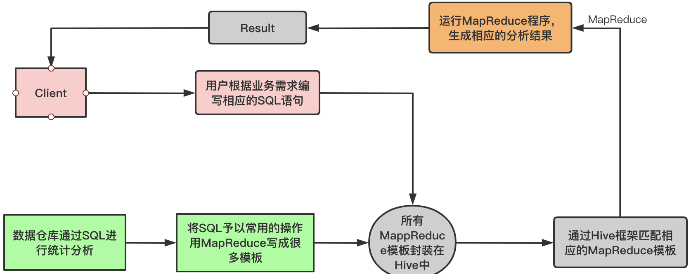
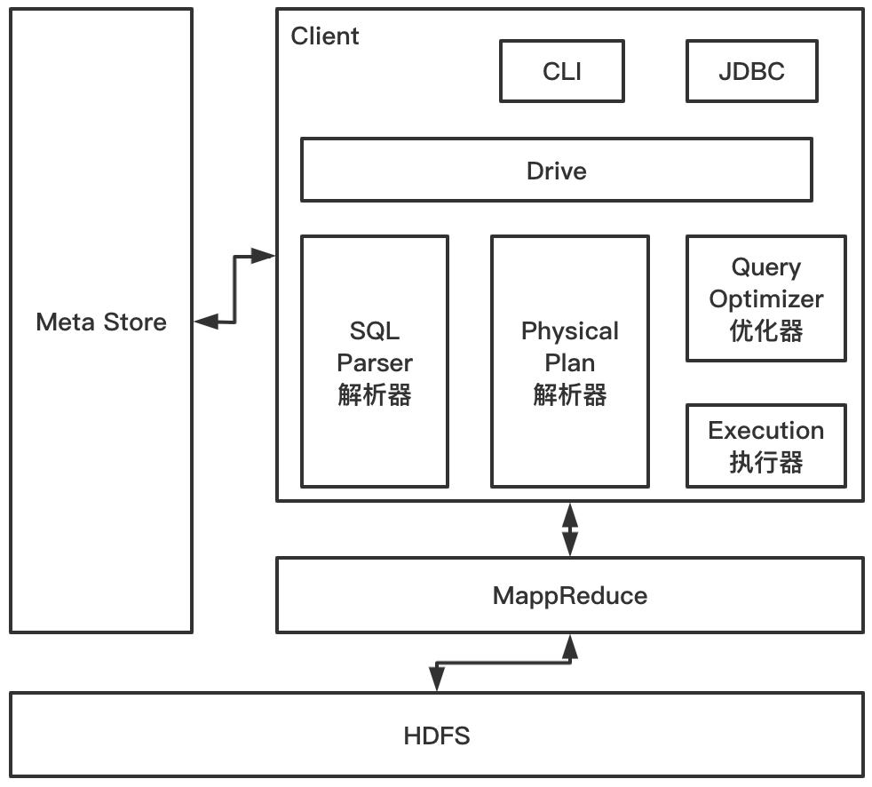
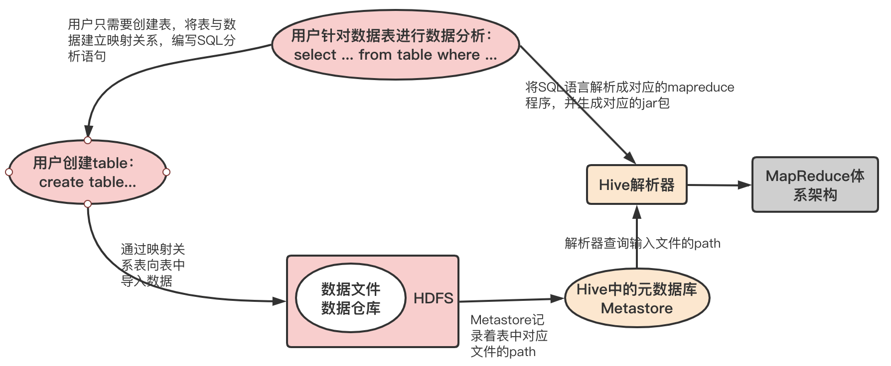

# 1、基本介绍

## 1.1、Hive

- Hive：由 Facebook 开源用于解决海量结构化日志的数据统计工具。
- Hive 是基于 Hadoop 的一个数据仓库工具，可以将结构化的数据文件映射为一张表，并提供类 SQL 查询功能

**Hive的本质：**将 HQL 转化成 MapReduce 程序



- Hive处理的数据存储在HDFS上；
- Hive分析数据底层的实现是MapReduce
- 执行程序是在Yarn上；
- 默认可以直接加载文本文件（TextFile），还斥资SequenceFile、RCFile等文件格式；

## 1.2、Hive优缺点

**优点：**
- 操作接口采用类sql语法，提供快速开发的能力；
- 避免了编写MapReduce，减少开发人员学习成本；
- Hive执行延迟比较高，常用于数据分析、对实时性要求不高的场景；
- Hive优势是处理大数据；
- Hive支持自定义函数，可以根据自己的需求来实现自己的函数；
- 统一的元数据管理，可与 presto／impala／sparksql 等共享数据；

**缺点：**
- Hive的HQL表达能力有限，迭代式算法无法表达，数据挖掘方面不擅长，由于MapReduce数据处理流程的限制，效率更高的算法无法实现；
- Hive效率比较低，Hive自动生成的MapReduce作业。通常情况下不够智能化；Hive调优比较困难，粒度较粗；

## 1.3、Hive架构原理



- **Client**：CLI（Command-Line interface）、JDBC（JDBC访问Hive）、WEBUI（浏览器你）；
- **Mata Store（元数据）**：在 Hive 中，表名、表结构、字段名、字段类型、表的分隔符等统一被称为元数据。所有的元数据默认存储在 Hive 内置的 derby 数据库中，但由于 derby 只能有一个实例，也就是说不能有多个命令行客户端同时访问，所以在实际生产环境中，通常使用 MySQL 代替 derby；

    derby数据库的缺点：在同一个目录下一次只能打开一个会话；使用derby存储方式时，Hive会在当前目录生成一个derby.log文件和一个metastore_db目录，metastore_db里面会存储具体的元数据信息，如果下次切换到一个新目录访问Hive，则会重写生成derby.log和metastore_db目录，这样就无法使用之前的元数据信息了；
    
    Hive 进行的是统一的元数据管理，就是说你在 Hive 上创建了一张表，然后在 presto／impala／sparksql 中都是可以直接使用的，它们会从 Metastore 中获取统一的元数据信息，同样的你在 presto／impala／sparksql 中创建一张表，在 Hive 中也可以直接使用
- **Hadoop**：使用HDFS进行存，使用MapReduce进行计算；
- **Driver**：驱动器
    - 解析器：将SQL字符转成抽象语法树AST，一般使用第三方工具库完成，对AST进行语法分析，比如表是否存在、字段是否存在、SQL语义是否有误；
    - 编译器：将AST编译生成逻辑执行计划；
    - 优化器：对逻辑执行计划进行优化；
    - 执行器：把逻辑执行疾患转换成可以运行的物理计划，对Hive来说，就是MR/Spark

Hive的运行机制：



Hive 通过给用户提供的一系列交互接口，接收到用户的指令(SQL)，使用自己的 Driver，结合元数据(MetaStore)，将这些指令翻译成 MapReduce，提交到 Hadoop 中执行，最后，将 执行返回的结果输出到用户交互接口；

可以用 command-line shell 和 thrift／jdbc 两种方式来操作数据：
- **command-line shell**：通过 hive 命令行的的方式来操作数据；
- **thrift／jdbc**：通过 thrift 协议按照标准的 JDBC 的方式操作数据。

Hive详细运行参考美团技术文章：[Hive SQL 的编译过程](https://tech.meituan.com/2014/02/12/hive-sql-to-mapreduce.html)

## 1.4、Hive与数据库比较

由于 Hive 采用了类似 SQL 的查询语言 HQL(Hive Query Language)，因此很容易将 Hive 理解为数据库。其实从结构上来看，Hive 和数据库除了拥有类似的查询语言，再无类似之处。数据库可以用在 Online 的应用中，但是 Hive 是为数据仓库而设计的；
- 查询语言：熟悉SQL的开发者能够快速上手Hive的开发；
- 数据更新：由于Hive是针对数据仓库应用设计的，而数据仓库的内容是读多写少的。因此，Hive 中不建议对数据的改写，所有的数据都是在加载的时候确定好的。而数据库中的数据通常是需要经常进行修改的，因此可以使用 `INSERT INTO ... VALUES` 添加数据，使用`UPDATE ... SET` 修改数据；
- 执行延迟：Hive在查询数据的时候，由于没有索引，需要扫描整个表，因此延迟较高。另外一个导 致 Hive 执行延迟高的因素是 MapReduce 框架，由于 MapReduce 本身具有较高的延迟，因此在利用 MapReduce 执行 Hive 查询时，也会有较高的延迟。相对的，数据规模较小时数据库的执行延迟较低，当数据规模大到超过数据库的处理能力的时候，Hive的并行计算显然能体现出优势；
- 数据规模：Hive能够支持海量数据的查询，而数据库相对的数据量没那么大；

# 2、安装

[](../辅助资料/环境配置/大数据环境.md#3Hive环境配置)

# 3、Hive的使用方式

## 3.1、命令行方式

针对命令行，还有两种使用方式：
- bin目录下的hive命令
- bin目录下的beeline命令

### 3.1.1、hive命令

```
[root@bluefish hive-3.1.2]# bin/hive
which: no hbase in (/usr/local/jdk1.8.0_271/bin:/usr/local/sbin:/usr/local/bin:/usr/sbin:/usr/bin:/root/bin:/usr/local/apache-maven-3.6.3/bin:/data/soft/hadoop-3.2.0/bin:/data/soft/hadoop-3.2.0/sbin:/data/soft/hive-3.1.2/bin:/root/kafka/zookeeper-3.6.1/bin:/root/kafka/kafka_2.13-2.6.0/bin)
Hive Session ID = b631b227-0e36-49de-9cb4-51aeb2bd0247
Logging initialized using configuration in jar:file:/data/soft/hive-3.1.2/lib/hive-common-3.1.2.jar!/hive-log4j2.properties Async: true
Hive Session ID = ef7637eb-73d2-4bcf-a519-2398aa331863
Hive-on-MR is deprecated in Hive 2 and may not be available in the future versions. Consider using a different execution engine (i.e. spark, tez) or using Hive 1.X releases.
hive> show databases;
OK
default
Time taken: 1.035 seconds, Fetched: 1 row(s)
```
上面有一行信息：Hive-on-MR is deprecated in Hive 2 and may not be available in the future versions. Consider using a different execution engine (i.e. spark, tez) or using Hive 1.X releases，意思是从hive2开始hive-on-mr就过时了，并且在以后的版本可能不维护了，建议使用其他的计算引擎，如spark、tez等

一般简单的全表扫描比如：select * from table_name 是不会产生mapreduce任务的，因为其不需要经过mapreduce任务即可得到结果，直接读取表对应的数据文件即可；

hive后面可以使用 `-e`，这样这条hive命令就可以放到脚本中定时调度执行了，因为每次hive都会开启一个新的会话，执行完毕之后再关闭这个会话；
```bash
[root@bluefish hive-3.1.2]# bin/hive -e "select * from t1"
Hive Session ID = 4a44af75-c6de-449c-8c2f-7644e5ddc19b

Logging initialized using configuration in jar:file:/data/soft/hive-3.1.2/lib/hive-common-3.1.2.jar!/hive-log4j2.properties Async: true
Hive Session ID = 93dcc559-9fd8-41e2-8168-fa3741a55b87
OK
1       zs
Time taken: 3.196 seconds, Fetched: 1 row(s)
```

### 3.1.2、beeline

这种方式需要先启动一个hiveserver2服务，因为beeline客户端需要通过这个服务连接到hive

启动hiveserver2
```
[root@bluefish hive-3.1.2]# bin/hiveserver2 
which: no hbase in (/usr/local/jdk1.8.0_271/bin:/usr/local/sbin:/usr/local/bin:/usr/sbin:/usr/bin:/root/bin:/usr/local/apache-maven-3.6.3/bin:/data/soft/hadoop-3.2.0/bin:/data/soft/hadoop-3.2.0/sbin:/data/soft/hive-3.1.2/bin:/root/kafka/zookeeper-3.6.1/bin:/root/kafka/kafka_2.13-2.6.0/bin)
2021-01-24 12:26:53: Starting HiveServer2
Hive Session ID = 17312772-99ae-4053-8faa-5e4fc856a1fb
Hive Session ID = ee81da88-ba21-4e03-8ef2-93a42e95fff5
Hive Session ID = f5fc0364-1645-4a35-8371-f60953a4ecb0
Hive Session ID = dec8a7e6-408b-43a6-adc4-9163fe8f1308
```
`正常情况下，hiveserver2服务启动之后，后面连续输出四行包含 Hive Session ID的信息，即启动成功；`

hiveserver2默认会监听本机的10000端口，所以命令是这样的：`bin/beeline -u jdbc:hive2://bluefish:10000`
```
[root@bluefish hive-3.1.2]# bin/beeline -u jdbc:hive2://bluefish:10000
Connecting to jdbc:hive2://bluefish:10000
Connected to: Apache Hive (version 3.1.2)
Driver: Hive JDBC (version 3.1.2)
Transaction isolation: TRANSACTION_REPEATABLE_READ
Beeline version 3.1.2 by Apache Hive
0: jdbc:hive2://bluefish:10000> 
```
在上面的命令交互界面创建表，并插入数据：
```bash
0: jdbc:hive2://bluefish:10000> create table t1(id int, name string);
No rows affected (1.012 seconds)
0: jdbc:hive2://bluefish:10000> show tables;
+-----------+
| tab_name  |
+-----------+
| t1        |
+-----------+
1 row selected (0.423 seconds)
# 插入数据
0: jdbc:hive2://bluefish:10000> insert into t1(id,name) values(1, "zs");
Job Submission failed with exception 'org.apache.hadoop.security.AccessControlException(Permission denied: user=anonymous, access=EXECUTE, inode="/tmp":root:supergroup:drwx------
```
添加数据时发现报错，提示匿名用户对 `/tmp` 目录没有写权限，针对该问题解决办法：
- 给hdfs的 `/tmp` 设置 777 权限，然后匿名用户具备权限：`hdfs dfs -chmod -R 777 /tmp`
- 在启动的beeline的时候指定一个对这个目录有操作权限的用户：`bin/beeline -u jdbc:hive2://bluefish:10000 -n root`

beeline后面也可以跟一个 -e 的参数：
```
[root@bluefish hive-3.1.2]# bin/beeline -u jdbc:hive2://bluefish:10000 -n root -e "select * from t1"
Connecting to jdbc:hive2://bluefish:10000
Connected to: Apache Hive (version 3.1.2)
Driver: Hive JDBC (version 3.1.2)
Transaction isolation: TRANSACTION_REPEATABLE_READ
INFO  : Compiling command(queryId=root_20210124124506_fddb86a6-046d-44b1-9d52-a6557971fad7): select * from t1
INFO  : Concurrency mode is disabled, not creating a lock manager
INFO  : Semantic Analysis Completed (retrial = false)
INFO  : Returning Hive schema: Schema(fieldSchemas:[FieldSchema(name:t1.id, type:int, comment:null), FieldSchema(name:t1.name, type:string, comment:null)], properties:null)
INFO  : Completed compiling command(queryId=root_20210124124506_fddb86a6-046d-44b1-9d52-a6557971fad7); Time taken: 3.024 seconds
INFO  : Concurrency mode is disabled, not creating a lock manager
INFO  : Executing command(queryId=root_20210124124506_fddb86a6-046d-44b1-9d52-a6557971fad7): select * from t1
INFO  : Completed executing command(queryId=root_20210124124506_fddb86a6-046d-44b1-9d52-a6557971fad7); Time taken: 0.004 seconds
INFO  : OK
INFO  : Concurrency mode is disabled, not creating a lock manager
+--------+----------+
| t1.id  | t1.name  |
+--------+----------+
| 1      | zs       |
+--------+----------+
1 row selected (3.638 seconds)
Beeline version 3.1.2 by Apache Hive
Closing: 0: jdbc:hive2://bluefish:10000
```

## 3.2、JDBC方式

JDBC的方式也需要连接hiveserver2服务，使用同mysql的操作类似；

# 4、常见属性配置

## 4.1、参数配置

在hive中，可以使用set命令临时设置一些参数的值，其实就是临时修改 hive-site.xml 中参数的值；不过通过set命令设置的参数只在当前会话有效，退出重新打开就无效。当然如果需要对当前机器上的当前用户有效可以将命令设置在`~/.hiverc` 文件中；

hive中关于参数配置的：
- `hive-default.xml`：默认配置，
- `hive-site.xml`：用户自定义的配置，用户自定义的配置会覆盖默认配置
- `~/.hiverc`：当前机器中当前用户有效；
- `set 命令`：当前会话有效；

上述配置的优先级： `hive-default.xml` > `hive-site.xml` > `~/.hiverc` > `set 命令`

查看当前所有的配置信息：
```
hive> set;
```

打印表头：hive.cli.print.header

### 4.1.1、配置文件配置

- `hive-default.xml`：默认配置，
- `hive-site.xml`：用户自定义的配置，用户自定义的配置会覆盖默认配置

用户自定义配置会覆盖默认配置，另外hive也会读入hadoop的配置，因为hive是作为hadoop的客户端启动的，hive的配置会覆盖hadoop的配置，配置文件的配置对本机启动的所有hive进程有效；

### 4.1.2、命令行参数

启动hive时，可以通过在命令行添加`-hiveconf param=value` 类设定参数，比如需要显示当前数据库名称，可以按照如下启动
```
[root@bluefish hive-3.1.2]# bin/hive -hiveconf hive.cli.print.current.db=true
Hive Session ID = b7f15f45-3d08-4c6e-af12-9aad55337b0a

Logging initialized using configuration in jar:file:/data/soft/hive-3.1.2/lib/hive-common-3.1.2.jar!/hive-log4j2.properties Async: true
Hive Session ID = d51a62cb-35b1-4cc1-bd79-7a5281223cff
Hive-on-MR is deprecated in Hive 2 and may not be available in the future versions. Consider using a different execution engine (i.e. spark, tez) or using Hive 1.X releases.
hive (default)> 
```
**注意：**仅对本次hive启动有效

### 4.1.3、set命令启动

在启动的hive交互界面中，通过set参数设置，只针对本次hive会话有效

## 4.2、运行日志信息配置

hive的日志分为启动日志和分析日志，可以修改conf目录下的两个配置文件：`hive-log4j2.properties.template `和 h`ive-exec-log4j2.properties.template`，可以修改其日志级以及即日志目录等

# 5、DDL操作

## 5.1、数据库操作

**查看数据库列表：**
```
hive (default)> show databases;
OK
default
Time taken: 1.057 seconds, Fetched: 1 row(s)
```

**选择数据库：**
```
Time taken: 1.057 seconds, Fetched: 1 row(s)
hive (default)> use default;
OK
Time taken: 0.044 seconds
```
default是hive中的默认数据库，default数据库在HDFS中存储的目录跟 `hive-site.xml` 参数 `hive.metastore.warehouse.dir` 有关，其默认值如下：
```xml
<property>
    <name>hive.metastore.warehouse.dir</name>
    <value>/user/hive/warehouse</value>
    <description>location of default database for the warehouse</description>
</property>
```
这个在元数据中也有记录：
```sql
mysql> select * from DBS;
+-------+-----------------------+------------------------------------------+---------+------------+------------+-----------+
| DB_ID | DESC                  | DB_LOCATION_URI                          | NAME    | OWNER_NAME | OWNER_TYPE | CTLG_NAME |
+-------+-----------------------+------------------------------------------+---------+------------+------------+-----------+
|     1 | Default Hive database | hdfs://bluefish:9000/user/hive/warehouse | default | public     | ROLE       | hive      |
+-------+-----------------------+------------------------------------------+---------+------------+------------+-----------+
1 row in set (0.00 sec)
```

**创建数据库：**
```
hive (default)> create database mydb;
OK
Time taken: 0.189 seconds
hive (default)> show databases;
OK
default
mydb
Time taken: 0.028 seconds, Fetched: 2 row(s)
```
在元数据中
```sql
mysql> mysql> select * from DBS;
+-------+-----------------------+--------------------------------------------------+---------+------------+------------+-----------+
| DB_ID | DESC                  | DB_LOCATION_URI                                  | NAME    | OWNER_NAME | OWNER_TYPE | CTLG_NAME |
+-------+-----------------------+--------------------------------------------------+---------+------------+------------+-----------+
|     1 | Default Hive database | hdfs://bluefish:9000/user/hive/warehouse         | default | public     | ROLE       | hive      |
|     6 | NULL                  | hdfs://bluefish:9000/user/hive/warehouse/mydb.db | mydb    | root       | USER       | hive      |
+-------+-----------------------+--------------------------------------------------+---------+------------+------------+-----------+
2 rows in set (0.00 sec)
```

可以再创建数据库的时候指定对应的目录：通过location 指定对应的目录
```sql
hive (default)> create database mydb2 location '/usse/hive/mydb2';
OK
Time taken: 0.055 seconds
```
元数据信息：
```sql
mysql> select * from DBS;
+-------+-----------------------+--------------------------------------------------+---------+------------+------------+-----------+
| DB_ID | DESC                  | DB_LOCATION_URI                                  | NAME    | OWNER_NAME | OWNER_TYPE | CTLG_NAME |
+-------+-----------------------+--------------------------------------------------+---------+------------+------------+-----------+
|     1 | Default Hive database | hdfs://bluefish:9000/user/hive/warehouse         | default | public     | ROLE       | hive      |
|     6 | NULL                  | hdfs://bluefish:9000/user/hive/warehouse/mydb.db | mydb    | root       | USER       | hive      |
|     7 | NULL                  | hdfs://bluefish:9000/usse/hive/mydb2             | mydb2   | root       | USER       | hive      |
+-------+-----------------------+--------------------------------------------------+---------+------------+------------+-----------+
3 rows in set (0.00 sec)
```

**显示数据库详情**
```sql
-- 显示数据库信息
hive (default)> desc database mydb;
OK
db_name comment location        owner_name      owner_type      parameters
mydb            hdfs://bluefish:9000/user/hive/warehouse/mydb.db        root    USER
Time taken: 0.03 seconds, Fetched: 1 row(s)

-- 显示数据库详细信息
hive (default)> desc database extended mydb;
OK
db_name comment location        owner_name      owner_type      parameters
mydb            hdfs://bluefish:9000/user/hive/warehouse/mydb.db        root    USER
Time taken: 0.026 seconds, Fetched: 1 row(s)
```

**删除数据库**
```
hive (default)> drop database mydb2;
OK
Time taken: 0.06 seconds
```

## 5.2、表操作

> 注意：在hive建表语句中，缩进不要使用tab制表位，拷贝到hive命令行中执行会提示语句错误；

**创建表**
```sql
-- 基本语法：
CREATE [EXTERNAL] TABLE [IF NOT EXISTS] table_name
[(col_name data_type [COMMENT col_comment], ...)]
[COMMENT table_comment]
[PARTITIONED BY (col_name data_type [COMMENT col_comment], ...)]
[CLUSTERED BY (col_name, col_name, ...)
[SORTED BY (col_name [ASC|DESC], ...)] INTO num_buckets BUCKETS]
[ROW FORMAT row_format]
[STORED AS file_format]
[LOCATION hdfs_path]
[TBLPROPERTIES (property_name=property_value, ...)]
[AS select_statement]
```
- create table：创建一个指定名字的表，如果相同名字的表已经存在。则抛出异常；可以使用  IF NOT EXISTS 选项来忽略这个异常；
- external：表示创建的是一个外部表，在建表的同时可以指定一个指向实际路径的location，在删除表的时候，内部表的元数据和数据会被一起删除，而外部表只删除元数据，不删除数据；
- `ROW FORMAT DELIMITED [FIELDS TERMINATED BY char] [COLLECTION ITEMS TERMINATED BY char] [MAP KEYS TERMINATED BY char] [LINES TERMINATED BY char] | SERDE serde_name [WITH SERDEPROPERTIES (property_name=property_value, property_name=property_value, ...)]`；用户在建表的时候可以自定义 SerDe 或者使用自带的 SerDe。如果没有指定 ROW FORMAT 或者 ROW FORMAT DELIMITED，将会使用自带的 SerDe。在建表的时候，用户还需 要为表指定列，用户在指定表的列的同时也会指定自定义的 SerDe，Hive 通过 SerDe 确定表 的具体的列的数据；
- stored as 指定存储文件类型，常用的存储文件；诶下：sequenceFile（二进制序列文件）、textfile（文本）、rcfile（列式存储格式文件）；如果是纯文本，可以使用stored as textfile。如果数据需要压缩，使用 stored as sequencefile

**查看当前数据库中表信息**
```sql
hive (default)> show tables;
OK
tab_name
t2
Time taken: 0.033 seconds, Fetched: 3 row(s)
```

**查看表结构信息**
```sql
hive (default)> desc t2;
OK
col_name        data_type       comment
id                      int                                         
Time taken: 0.064 seconds, Fetched: 1 row(s)
```

**查看表的创建信息**
```sql
hive (default)> show create table t2;
OK
createtab_stmt
CREATE TABLE `t2`(
  `id` int)
ROW FORMAT SERDE 'org.apache.hadoop.hive.serde2.lazy.LazySimpleSerDe' 
STORED AS INPUTFORMAT 'org.apache.hadoop.mapred.TextInputFormat' 
OUTPUTFORMAT 'org.apache.hadoop.hive.ql.io.HiveIgnoreKeyTextOutputFormat'
LOCATION 'hdfs://bluefish:9000/user/hive/warehouse/t2'  -- 表示表在hdfs上的位置
TBLPROPERTIES (
  'bucketing_version'='2', 
  'transient_lastDdlTime'='1611466575')
Time taken: 0.108 seconds, Fetched: 13 row(s)
```
> 注意：表中的数据是存储在HDFS中，但是表的名称、字段信息时存储在metastore中，这里是mysql

在metastore里面 tbls 表，存储的时候hive中创建的表，在cloumns_v2 中存储的hive表中的字段信息（包括字段注释、字段名称、字段可惜、字段顺序等）
```sql
-- DB_ID=1 表示是default 数据库的id
mysql> select TBL_ID, DB_ID,TBL_NAME, TBL_TYPE from TBLS;
+--------+-------+----------+---------------+
| TBL_ID | DB_ID | TBL_NAME | TBL_TYPE      |
+--------+-------+----------+---------------+
|      1 |     1 | t1       | MANAGED_TABLE |
|      6 |     1 | stu      | MANAGED_TABLE |
|      7 |     1 | t2       | MANAGED_TABLE |
+--------+-------+----------+---------------+
-- CD_ID 表示表id，同 TBLS表中的 TBL_ID
mysql> SELECT * FROM COLUMNS_V2;
+-------+---------+-------------+---------------+-------------+
| CD_ID | COMMENT | COLUMN_NAME | TYPE_NAME     | INTEGER_IDX |
+-------+---------+-------------+---------------+-------------+
|     1 | NULL    | id          | int           |           0 |
|     1 | NULL    | name        | string        |           1 |
|     6 | NULL    | favors      | array<string> |           2 |
|     6 | NULL    | id          | int           |           0 |
|     6 | NULL    | name        | string        |           1 |
|     7 | NULL    | id          | int           |           0 |
+-------+---------+-------------+---------------+-------------+
```

**修改表名**，对表名进行重命名，同步的hdfs中目录的名称也发生了变化
```sql
hive (default)> alter table t2 rename to t2_bak;
OK
Time taken: 0.161 seconds
```

**加载数据**

一般很少使用insert命令往hive的表中添加数据，向表中加载数据通常是有load命令。以上面表 t2_bak为例，假设在服务器 `/data/hivedata`目录下有个 t2.data 文件，需要将其加载到 `t2_bak` 中
```sql
[root@bluefish hivedata]# more t2.data 
1
2
3
4
5
hive (default)> load data local inpath '/data/hivedata/t2.data' into table t2_bak;
Loading data to table default.t2_bak
OK
Time taken: 0.244 seconds
hive (default)> select * from t2_bak;
OK
t2_bak.id
1
2
3
4
5
Time taken: 0.172 seconds, Fetched: 5 row(s)
```
在hdfs上就可以看到该目录下有个文件
```
[root@bluefish hivedata]# hdfs dfs -ls /user/hive/warehouse/t2_bak
Found 1 items
-rw-r--r--   2 root supergroup         10 2021-01-24 13:49 /user/hive/warehouse/t2_bak/t2.data
```
如果通过hdfs的put命令将数据上传到对应的表的hdfs目录下，对应的数据也可以直接在hive中显示的；

**表增加字段及注释**
```sql
-- 添加字段
hive (default)> alter table t2_bak add columns(name string);
OK
Time taken: 0.125 seconds
hive (default)> desc t2_bak;
OK
col_name        data_type       comment
id                      int                                         
name                    string                                      
Time taken: 0.058 seconds, Fetched: 2 row(s)

-- 添加中文注释
hive (default)> desc t2;
OK
col_name        data_type       comment
name                    string                  ??                  
Time taken: 0.052 seconds, Fetched: 1 row(s)
```
中文注释是乱码的，主要是因为元数据表的数据库表都是 latin1的编码，中文是会乱码，如果要正确显示，可以考虑把存储字段注释和表注释相关的表编码该为UTF-8
```sql
-- 修改源数据库的编码
mysql> alter table COLUMNS_V2 modify column COMMENT varchar(256) character set utf8;
mysql> alter table TABLE_PARAMS modify column PARAM_VALUE varchar(4000) character set utf8;
-- 如果你的表创建的分区需要再执行如下命令：
alter table PARTITION_PARAMS modify column PARAM_VALUE varchar(4000) character set utf8;
alter table PARTITION_KEYS modify column PKEY_COMMENT varchar(4000) character set utf8;
```

**删除表**
```sql
hive (default)> drop table t2;
OK
Time taken: 0.26 seconds
```

**指定列和行分隔符**

比如下面的表需要记载的数据
```sql
create table t3(
    id int comment 'ID',
    stu_name string comment 'name',
    stu_birthday date comment 'birthday',
    online boolean comment 'is online'
);
-- 在/data/hivedata目录下有文件：t3.data，数据如下
[root@bluefish hivedata]# more t3.data
1       张三    2020-01-01      true
2       李四    2020-02-01      false
3       王五    2020-03-01      0
-- 上面的数据使用制表位分割，如果直接记载数据会有什么问题呢；
hive (default)> load data local inpath '/data/hivedata/t3.data' into table t3;
Loading data to table default.t3
OK
Time taken: 0.25 seconds
hive (default)> select * from t3;
OK
t3.id   t3.stu_name     t3.stu_birthday t3.online
NULL    NULL    NULL    NULL
NULL    NULL    NULL    NULL
NULL    NULL    NULL    NULL
Time taken: 0.151 seconds, Fetched: 3 row(s)
```
上面数据加载后，都是NULL，数据没有被识别；

> 注意：在hive创建表的时候，需要指定相应的行分隔符、列分隔符；

上面在创建t3时没有指定分隔符，导致使用制表位分割的数据无法被解析。实际上hive有默认的分隔符，默认的行分隔符是`\n`，默认的列分隔符是`\001`；所以 Hive 默认使用了几个平时很少出现的字符，这些字符一般不会作为内容出现在文件中。Hive 默认的行和列分隔符如下表所示。

| 分隔符          | 描述                                                         |
| --------------- | ------------------------------------------------------------ |
| **\n**          | 对于文本文件来说，每行是一条记录，所以可以使用换行符来分割记录 |
| **^A (Ctrl+A)** | 分割字段 (列)，在 CREATE TABLE 语句中也可以使用八进制编码 `\001` 来表示 |
| **^B**          | 用于分割 ARRAY 或者 STRUCT 中的元素，或者用于 MAP 中键值对之间的分割，<br/>在 CREATE TABLE 语句中也可以使用八进制编码 `\002` 表示 |
| **^C**          | 用于 MAP 中键和值之间的分割，在 CREATE TABLE 语句中也可以使用八进制编码 `\003` 表示 |

```sql
-- 创建表时指定行、列分隔符
create table t3_new(
    id int comment 'ID',
    stu_name string comment 'name',
    stu_birthday date comment 'birthday',
    online boolean comment 'is online'
)row format delimited fields terminated by '\t' lines terminated by '\n';
```
> 注意：`lines terminated by` 行分隔符可以忽略不写，如果要写，只能写到最后面
```sql
hive (default)> load data local inpath '/data/hivedata/t3.data' into table t3_new;
Loading data to table default.t3_new
OK
Time taken: 0.251 seconds
hive (default)> select * from t3_new;
OK
t3_new.id       t3_new.stu_name t3_new.stu_birthday     t3_new.online
1       张三    2020-01-01      true
2       李四    2020-02-01      false
3       王五    2020-03-01      NULL
```
> 针对无法识别的数据显示NULL；hive不会提前检查数据，只有在使用的时候才会检查数据，如果数据有问题就显示NULL，也不报错；

## 5.3、数据类型

Hive主要包含两大数据类型：
- 基本数据类型：常见的有 int、string、boolean、double等
- 符复合据类型：常见的有 array、map、struct

### 5.3.1、基本数据类型

Hive 表中的列支持以下基本数据类型：

| 大类                                    | 类型                                                         |
| --------------------------------------- | ------------------------------------------------------------ |
| **INT/Integers（整型）**                    | TINYINT—1 字节的有符号整数 <br/>SMALLINT—2 字节的有符号整数<br/> INT—4 字节的有符号整数<br/> BIGINT—8 字节的有符号整数 |
| **Boolean（布尔型）**                   | BOOLEAN—TRUE/FALSE                                           |
| **Floating point numbers（浮点型）**    | FLOAT— 单精度浮点型 <br/>DOUBLE—双精度浮点型                 |
| **Fixed point numbers（定点数）**       | DECIMAL—用户自定义精度定点数，比如 DECIMAL(7,2)               |
| **String types（字符串）**              | STRING—指定字符集的字符序列<br/> VARCHAR—具有最大长度限制的字符序列 <br/>CHAR—固定长度的字符序列 |
| **Date and time types（日期时间类型）** | TIMESTAMP —  时间戳 <br/>TIMESTAMP WITH LOCAL TIME ZONE — 时间戳，纳秒精度<br/> DATE—日期类型 |
| **Binary types（二进制类型）**          | BINARY—字节序列                                              |

> TIMESTAMP 和 TIMESTAMP WITH LOCAL TIME ZONE 的区别如下：
>
> - **TIMESTAMP WITH LOCAL TIME ZONE**：用户提交时间给数据库时，会被转换成数据库所在的时区来保存。查询时则按照查询客户端的不同，转换为查询客户端所在时区的时间。
> - **TIMESTAMP** ：提交什么时间就保存什么时间，查询时也不做任何转换。

> string类型相当于mysql的varchar数据类型，该类型是一个可变字符串，不过不能声明其中最多能够存储多少个字符，理论上可以存储2GB的字符数；

**关于隐式转换**

Hive的基本数据类型是可以隐式转换的，类似于Java的类型转换，如果某表达式使用 int 类型，tinyint会自动转换为 int 类型，但是hive不会进行反向转换，即 int不会自动转换为 tinyint，会报错，除非使用cast操作；

隐式转换类型规则如下：
- 任何整型类型都可以隐式的转换为一个范围更广的类型，如果 tinyint转换成 int， int转换成bigint；
- 所有整型类型、float类型 和 string类型都可以隐式的转换成 double；
- tinyint、smallint、int 都可以转换成 float；
- boolean 类型不可以转换为任何其他的类型

可以使用cast操作显示的进行数据类型转换：`cast('1' as int)` 将字符串1转成整数1；如果强制类型转换失败，则返回NULL；

### 5.3.2、复合数据类型

| 类型       | 描述                                                         | 示例                                   |
| ---------- | ------------------------------------------------------------ | -------------------------------------- |
| **STRUCT** | 类似于对象，是字段的集合，字段的类型可以不同，可以使用 ` 名称.字段名 ` 方式进行访问 | STRUCT ('xiaoming', 12 , '2018-12-12') |
| **MAP**    | 键值对的集合，可以使用 ` 名称[key]` 的方式访问对应的值          | map('a', 1, 'b', 2)                    |
| **ARRAY**  | 数组是一组具有相同类型和名称的变量的集合，可以使用 ` 名称[index]` 访问对应的值 | ARRAY('a', 'b', 'c', 'd')              |

#### 5.3.2.1、Array

表示一个数组结构，主要使用场景是针对数据个数不固定的场景；比如学生的爱好，每个学生的爱海是不固定的，有多有少的
```sql
-- 有基础数据数据
[root@bluefish hivedata]# more stu.data 
1       zhangsan        swing,sing,coding
2       lisi    music,football

-- 创建如下表
create table stu(
    id int,
    name string,
    favors array<string>
)row format delimited fields terminated by '\t' collection items terminated by ',' lines terminated by '\n';
-- 导入数据
hive (default)> load data local inpath '/data/hivedata/stu.data' into table stu;
-- 查询数据
hive (default)> select * from stu;
OK
stu.id  stu.name        stu.favors
1       zhangsan        ["swing","sing","coding"]
2       lisi    ["music","football"]
-- 查询数组中某一个元素，使用 arrayName[index]，下标从0开始，如果获取了不存在的下标，则返回null；
hive (default)> select id, name, favors[2] from stu;
OK
id      name    _c2
1       zhangsan        coding
2       lisi    NULL
```

#### 5.3.2.2、Map

map都是键值对，比如有如下数据：
```
1   zhangsan    chinese:80,math:90,english:100
2   lisiwang    chinese:89,english:70,math:88
```
需要将学生的成绩存储到一个字段中，方便管理和使用，这里都是key-value的类型，非常适合map类型，建表语句可以指定score字段类型为 map 格式，通过`collection items terminated by ','` 指定map中元素直接的分隔符，通过 `map keys terminated by ':'` 指定了key和value之间的分隔符
```sql
-- 建表语句
create table stu2(
    id int,
    name string,
    scores map<string, int>
) row format delimited
fields terminated by '\t'
collection items terminated by ','
map keys terminated by ':'
lines terminated by '\n';
-- 加载数据
hive (default)> load data local inpath '/data/hivedata/stu2.data' into table stu2;
Loading data to table default.stu2
OK
Time taken: 0.632 seconds
hive (default)> select * from stu2;
stu2.id stu2.name       stu2.scores
1       zhangsan        {"chinese":80,"math":90,"english":100}
2       lisi    {"chinese":89,"english":70,"math":88}
-- 获取其中一项或者多项成绩，通过field['key']来获取，和map结构中元素的位置没有关系
hive (default)> select id, name, scores['chinese'] as ch_score, scores['math'] as math_score from stu2;
OK
id      name    ch_score        math_score
1       zhangsan        80      90
2       lisi    89      88
Time taken: 0.173 seconds, Fetched: 2 row(s)
```

#### 5.3.2.3、Struct

Struct有点像Java中的对象，比如下面的数据，每个学生既有家庭地址，又有实习地址，如下数据：
```
[root@bluefish hivedata]# more stu3.data
1       zhangsan        bj,sh
2       lisi    gz,sz
```
针对上面的信息，不能直接使用字符串，不然在后期获取数据的时候比较麻烦，可以考虑使用struct
```sql
-- 建表语句
create table stu3(
    id int,
    name string,
    address struct<home_addr:string, office_addr:string>
)row format delimited
fields terminated by '\t'
collection items terminated by ',';
-- 加载数据
hive (default)> load data local inpath '/data/hivedata/stu3.data' into table stu3;
Loading data to table default.stu3
OK
-- 查询数据
hive (default)> select * from stu3;
OK
stu3.id stu3.name       stu3.address
1       zhangsan        {"home_addr":"bj","office_addr":"sh"}
2       lisi    {"home_addr":"gz","office_addr":"sz"}
-- 查询具体的某个地址数据
hive (default)> select id,name,address.home_addr, address.office_addr from stu3;
OK
id      name    home_addr       office_addr
1       zhangsan        bj      sh
2       lisi    gz      sz
Time taken: 0.145 seconds, Fetched: 2 row(s)
```

**struct 和 map 的区别：**
- map可以随意增加 k-v对的个数；struct中 k-v的个数是固定的；
- map在建表语句需要指定 k-v 的类型；struct 在建表语句中需要指定好所有的属性名称和类型；
- map通过`[]`取值；struct通过`.`取值，类似java中对象属性的引用；
- map的源数据中需要带有k-v；struct中源数据只需要v即可；

> 总而言之：map比较灵活，但是会额外占用磁盘空间，因为其比struct多存储了key。struct只需要存储value，比较节省空间，但是灵活性有限，后期无法动态增加k-v

### 5.3.3、数据迁移

问题：在mysql中有三张表：stu(id,name)、address(stu_id, home, school)、contact(stu_id,mine, parents, others)，如果需要把这三张表迁移到hive中，如何迁移

思路：
- 可以一对一迁移：优点是迁移成本非常低，包括DDL和业务逻辑，几乎不需要修改，可以直接使用；缺点是会产生大量的表连接，造成查询慢；
- 可以一对多迁移：mysql中的多张关联表可以创建为hive中的一张表；优点是减少表连接操作；缺点是迁移成本高，需要修改原有的业务逻辑；

一般迁移分两个阶段：
- 第一阶段：快捷迁移，即一对一迁移，先让业务无缝连接；
- 第二阶段：在第一阶段的基础上，再做一张大表，尽量包含上述所有字段；

## 5.4、表的类型

Hive中有多种表的类型：内部表、外部表、分区表、桶表

### 5.4.1、内部表

内部表也成为受控表，是hive中的默认表类型，表数据默认存储在`/data/user/hive/warehouse`中，在加载数据的过程中，实际数据会被移动到warehouse的目录中；

当删除内部表时，表中的数据和元数据将会被同时删除，对应的在metastore中数据会被删除；

### 5.4.2、外部表

建表语句中包含external的表叫做外部表，外部表在加载数据时，实际数据并不会移动到warehouse的目录中，只是与外部数据建立一个链接；

表的定义和数据的生命周期互相不约束，数据只是表对hdfs上的某一个目录的引用而已，当删除表的定义时，数据依然存在，仅仅删除了表和数据之间的引用关系，相对安全，就算误删除了表，数据仍然存在；

外表的建表语句：
```sql
CREATE EXTERNAL TABLE page_view(viewTime INT, userid BIGINT,
     page_url STRING, referrer_url STRING,
     ip STRING COMMENT 'IP Address of the User',
     country STRING COMMENT 'country of origination')
 COMMENT 'This is the staging page view table'
 ROW FORMAT DELIMITED FIELDS TERMINATED BY '\054'
 STORED AS TEXTFILE
 LOCATION '<hdfs_location>';  -- 可以指定外部表数据在hdfs上的存储路径，如果指定的目录不存在，会自动创建目录
```

示例：
```sql
hive> create external table external_table (
    > key string
    > ) location '/data/external';
OK
Time taken: 1.311 seconds
```
在mysql中hive的元数据表 TBLS中可以看到该表的表类型：EXTERNAL_TABLE
```sql
mysql> select TBL_ID,DB_ID,TBL_NAME,TBL_TYPE from TBLS;
+--------+-------+----------------+----------------+
| TBL_ID | DB_ID | TBL_NAME       | TBL_TYPE       |
+--------+-------+----------------+----------------+
|     11 |     1 | stu2           | MANAGED_TABLE  |
|     12 |     1 | stu3           | MANAGED_TABLE  |
|     16 |     1 | external_table | EXTERNAL_TABLE |
+--------+-------+----------------+----------------+
```

> 注意：实际上内外部表是可以相互转化的，只需要简单设置即可
> 内部表转外部表：`alter table tb_name set tblproperties('external'='true');`
> 外部表转内部表：`alter table tb_name set tblproperties('external'='false');`

实际工作中，在hive中大部分都是外部表：先通过flume采集数据，把数据上传到hdfs中，然后在hive中创建外部表和hdfs上的数据绑定关系，然后可以使用sql查询数据了

### 5.4.3、分区表

分区可以理解为分裂，通过分区把不同的类型的数据放到不同的目录中

分区的标准就是指定分区的字段，分区字段可以是一个或者多个；分区表的意义在于优化查询，查询时尽量利用分区字段，如果不使用分区字段，就会全表扫描，最典型的一个场景是把天作为分区字段，查询的时候指定天；

创建分区表时，使用 partitioned by 指定分区字段，分区字段的名称通常为 dt，类型为string
```sql
create table partition_1 (
    id int,
    name string 
) partitioned by (dt string)
row format delimited
fields terminated by '\t';
```
查看表的信息，可以看到分区信息：
```sql
hive> desc partition_1;
OK
id                      int                                         
name                    string                                      
dt                      string                                      
# Partition Information          
# col_name              data_type               comment             
dt                      string                                      
Time taken: 0.542 seconds, Fetched: 7 row(s)
-- 有如下数据
1       zhangsan
2       lisi
-- 向分区表中加载数据
hive> load data local inpath '/data/hivedata/partition_1.data' into table  partition_1 partition(dt='2021-01-24');
Loading data to table default.partition_1 partition (dt=2021-01-24)
OK
Time taken: 0.876 seconds
```
> 注意：加载数据到分区表时，需要指定分区信息，如果加载数据时没有指定partition，则其会有个默认的partition：`__HIVE_DEFAULT_PARTITION__`

除了加载数据时指定分区，也可以手动创建分区，手动创建的分区会在hdfs对应的表的目录下新增一个分区目录，不过这个分区目录是没有数据的
```sql
alter table partition_1 add partition(dt='2021-01-23');
```
如果向这个分区中添加数据，可以使用load命令或者hdfs的put命令都可以
```
load data local inpath '/data/hivedata/partition_1.data' into table partition_1 partition(dt='2021-01-23');
```
查看表中有哪些分区：
```sql
hive> show partitions partition_1;
OK
dt=2021-01-23
dt=2021-01-24
dt=__HIVE_DEFAULT_PARTITION__   -- 加载数据时未指定分区的数据
Time taken: 0.122 seconds, Fetched: 3 row(s)
```
删除分区：
```sql
hive> alter table partition_1 drop partition(dt='__HIVE_DEFAULT_PARTITION__');
Dropped the partition dt=__HIVE_DEFAULT_PARTITION__
OK
Time taken: 0.274 seconds
```
> 注意：此时分区删除之后，分区中对应的数据也没有了，因为是内部表，所以分区的数据也被删除了；

创建多个分区：
```sql
-- 创建多个分区
create table partition_2(
    id int,
    name string
)partitioned by(year int, school string)
row format delimited fields terminated by '\t';
-- 查看分区：
hive> desc partition_2;
OK
id                      int                                         
name                    string                                      
year                    int                                         
school                  string                                      
# Partition Information          
# col_name              data_type               comment             
year                    int                                         
school                  string                                      
Time taken: 0.075 seconds, Fetched: 9 row(s)
-- 加载如下数据到partition_2表中
1       zhangsan
2       lisi
3       wangwu
-- 上述文件中只有id和name两个字段，具体的year和school两个分区字段在加载分区的时候指定
-- 加载数据命令
load data local inpath '/data/hivedata/partition_2.data' into table partition_2 partition(year=2020,school='xk');
-- 查看分区信息：
hive> show partitions partition_2;
OK
year=2020/school=english
year=2020/school=xk
year=2021/school=english
year=2021/school=xk

-- 查看hdfs中的目录
[root@bluefish hivedata]# hdfs dfs -ls -R /user/hive/warehouse/partition_2
drwxr-xr-x   - root supergroup          0 2021-01-24 19:32 /user/hive/warehouse/partition_2/year=2020
drwxr-xr-x   - root supergroup          0 2021-01-24 19:32 /user/hive/warehouse/partition_2/year=2020/school=english
drwxr-xr-x   - root supergroup          0 2021-01-24 19:32 /user/hive/warehouse/partition_2/year=2020/school=xk
drwxr-xr-x   - root supergroup          0 2021-01-24 19:32 /user/hive/warehouse/partition_2/year=2021
drwxr-xr-x   - root supergroup          0 2021-01-24 19:32 /user/hive/warehouse/partition_2/year=2021/school=english
drwxr-xr-x   - root supergroup          0 2021-01-24 19:32 /user/hive/warehouse/partition_2/year=2021/school=xk
```

查询分区的数据时，可以再where条件中增加分区的条件
- `select * from partition_2;` 全表扫描，没有用到分区
- `select * from partition_2 where year=2020;` 用到了一个分区字段进行过滤
- `select * from partition_2 where year=2020 and school='xk';` 用到了两个分区字段进行过滤

**动态分区**

关系型数据库中，对分区表insert数据的时候，数据库自动会根据分区字段的值，将数据插入到相应的分区中，hive也提供了类似的机制，即动态分区，如果在hive中要使用动态分区，需要做相应的配置：
- 开启动态分区参数设置：`hive.exec.dynamic.partition=true`，默认是true，开启的；
- 设置为非严格模式（动态分区的模式，默认是 strict，表示必须知道至少一个分区为静态分区， nonstrict 模式表示允许所有的分区字段都可以使用动态分区）：
`hive.exec.dynamic.mode=nonstrict`;
- 在所有执行MR的节点上，最大一共可以创建多少个动态分区，默认是 1000，`hive.exec.max.dynamic.partitions=1000`；
- 在每个执行MR的节点上，默认最大可以创建多少个动态分区，该参数需要根据实际的数据来设置。比如：源数据中包含了一年的数据，即day字段有365个值，那么该参数就需要设置成大于365，如果使用默认100，则会报错：`hive.exec.max.dynamic.partitions.pernode=100`；
- 整个MR job中，最大可以创建多少个HDFS文件，默认是 100000：`hive.exec.max.created.files=100000`；
- 当有空分区生成时，是否抛出异常，一般不需要设置，默认是false：`hive.error.on.empty.partition=false`

### 5.4.4、外部分区表

即在外部表中增加分区信息
```sql
-- 创建外部分区表
create external table ex_par(
    id int,
    name string
)partitioned by (dt string) row format delimited fields terminated by '\t' location '/data/ex_par';
-- 添加分区数据
load data local inpath '/data/hivedata/ex_par.data' into table ex_par partition(dt='2021-01-24');
-- 查看分区信息
hive> show partitions ex_par;
OK
dt=2021-01-24

-- 删除分区
alter table ex_par drop partition(dt='2021-01-24');
-- 删除分区之后，表中就没有分区了，但是HDFS上的目录并没有被删除
hive> show partitions ex_par;
OK
-- 查看hdfs上的目录信息
[root@bluefish hivedata]# hdfs dfs -ls /data/ex_par
Found 1 items
drwxr-xr-x   - root supergroup          0 2021-01-24 19:42 /data/ex_par/dt=2021-01-24
```
> 注意：此时分区目录的数据还是在的，因为该表是外部表，所以删除分区只是删除分区的定义，分区中的数据还是在的；

需要注意的一点是：针对分区表，通过hdfs的put命令把数据上传到hdfs上了，但是却查不到数据，是因为没有在表中添加分区信息

通过alter add partition，注意需要通过location指定分区目录：
```sql
alter table ex_par add partition(dt='2021-01-24') location '/data/ex_par/dt=2021-01-24';
```

> `load data...partition` 命令做了三件事：上传数据、添加分区、绑定数据和分区之间的关系
> - `hdfs dfs -mkdir /data/ex_par/dt=2021-01-24`;
> - `hdfs dfs -put /data/hivedata/ex_par.data /data/ex_par/dt=2021-01-24`;
> - `alter table ex_par add partition(dt='2021-01-24') location '/data/ex_par/dt=2021-01-24'`;

### 5.4.5、桶表

桶表是对数据进行哈希取值，然后放到不同的文件中存储，物理上，每个桶就是表（或分区）里的一个文件。

桶表的使用场景：比如在使用分区表的时候，如果数据集中在某几个分区，其他分区的数据不会很多，在计算的时候可能会出现数据倾斜的情况，从源头上解决，可以采用分桶的概念，即使用桶表

创建一张桶表：
```sql
-- 按照id进行分桶，分成4个桶
create table bucket_tb(
    id int
)clustered by(id) into 4 buckets;
```
此时如果往桶里面加载数据，就不能使用 load data 了，而是需要使用其他表中的数据，类似：`insert into table .... select ... from` 的写法

> 注意：在插入数据之前需要设置开启桶操作，不然数据就无法分到不同的桶里面；其实这里的分桶就是设置reduce任务的数量，因为你分了多少个桶，最终结果就会产生多少个文件，最终结果中文件的饿数量和reduce任务的数量是挂钩的

设置分桶：`set hive.enforce.bucketing=true` 可以自动控制reduce的数量从而适配bucket的个数;
```sql
-- 有如下数据
1
2
3
4
5
6
7
8
9
10
11
12
-- 创建表
create table b_source(id int);
-- 加载上面的数据到表中
load data local inpath '/data/hivedata/b_source.data' into table b_source;

-- 向桶表中加载数据
hive (default)> insert into table bucket_tb select id from b_source where id is not null;
2021-01-25 20:55:06,034 Stage-1 map = 0%,  reduce = 0%
2021-01-25 20:55:12,263 Stage-1 map = 100%,  reduce = 0%, Cumulative CPU 3.59 sec
2021-01-25 20:55:21,088 Stage-1 map = 100%,  reduce = 25%, Cumulative CPU 7.02 sec
2021-01-25 20:55:22,150 Stage-1 map = 100%,  reduce = 50%, Cumulative CPU 10.17 sec
2021-01-25 20:55:23,186 Stage-1 map = 100%,  reduce = 100%, Cumulative CPU 16.98 sec
```
按照我们设置的桶的数量为4，那么在hdfs中会存在4个对应的文件，每个文件的大小是相似的
```sh
[root@bluefish ~]# hdfs dfs -ls /user/hive/warehouse/bucket_tb
Found 4 items
-rw-r--r--   2 root supergroup          7 2021-01-25 20:55 /user/hive/warehouse/bucket_tb/000000_0
-rw-r--r--   2 root supergroup          6 2021-01-25 20:55 /user/hive/warehouse/bucket_tb/000001_0
-rw-r--r--   2 root supergroup          7 2021-01-25 20:55 /user/hive/warehouse/bucket_tb/000002_0
-rw-r--r--   2 root supergroup          7 2021-01-25 20:55 /user/hive/warehouse/bucket_tb/000003_0
```

**桶表的主要作用：**
- 数据抽样：如果是大规模的数据集，我们只想抽取部分数据查看，使用bucket表可以变得更家高效
    ```
    select * from bucket_tb tablesample(bucket 1 out of 4 on id);
    ```
    tablesample 是抽样语句；语法解析 `tablesample(bucket x out of y on id);`
    - y 尽可能是桶表的bucket数的倍数或者因子，而且y必须大于等于x；
    - y 表示是把桶表的数据随机分为多少桶；
    - x表示取出第几桶数据；
    
    例如：
    - `bucket 1 out of 4 on id`：根据id对桶表中的数据重新分桶，分成4桶，取出第1桶数据；
    - `bucket 2 out of 4 on id`：根据id对桶表中的数据重新分桶，分成4桶，取出第2桶数据；
    - `bucket 3 out of 4 on id`：根据id对桶表中的数据重新分桶，分成4桶，取出第3桶数据；
    - `bucket 4 out of 4 on id`：根据id对桶表中的数据重新分桶，分成4桶，取出第4桶数据；
- 提高某些查询效率：比如join查询，可以避免产生笛卡尔积的操作

    `select a.id, a.name, b.addr from a join b on a.id = b.id;` 如果a表和b表已经是分桶表，而且分桶的字段都是id字段，那么这个操作就不需要进行全表笛卡尔积了，因为分桶之后相同规则的id已经在相同的文件里面了；

### 5.4.6、视图

Hive中也有视图的概念，视图实际上一张虚拟的表，是对数据的逻辑表示，主要作用是为了降低查询的复杂度；

Hive中创建视图：`create view`
```sql
-- 创建视图
create view v1 as select t3_new.id,t3_new.stu_name from t3_new;

-- 通过show tables可以查看到视图信息
hive (default)> show tables;
OK
tab_name
t3_new
v1
Time taken: 0.032 seconds, Fetched: 14 row(s)
-- 查看视图结构
hive (default)> desc v1;
OK
col_name        data_type       comment
id                      int                                         
stu_name                string                                      
Time taken: 0.06 seconds, Fetched: 2 row(s)

-- 通过视图查询数据
hive (default)> select * from v1;
OK
v1.id   v1.stu_name
1       张三
2       李四
3       王五
```
> 注意：视图在`/user/hive/warehouse` 中是不存在的，因为其只是一个虚拟的表；

在mysql中元数据的显示：
```sql
mysql> select TBL_ID,DB_ID,OWNER,SD_ID,TBL_NAME,TBL_TYPE,VIEW_EXPANDED_TEXT FROM TBLS;
+--------+-------+--------+-------+-----------+----------------+------------------------------------------------------------------+
| TBL_ID | DB_ID | OWNER  | SD_ID | TBL_NAME  | TBL_TYPE       | VIEW_EXPANDED_TEXT                                               |
+--------+-------+--------+-------+-----------+----------------+------------------------------------------------------------------+
|     28 |     1 | root   |    38 | v1        | VIRTUAL_VIEW   | select `t3_new`.`id`,`t3_new`.`stu_name` from `default`.`t3_new` |
+--------+-------+--------+-------+-----------+----------------+------------------------------------------------------------------+
```

### 5.4.7、操作案例

需求：Flume按天把日志数据采集到HDFS中对应的目录红，使用sql按天统计数据的相关指标

# 6、DML操作

## 6.1、数据导入

### 6.1.1、向表中加载数据


# 7、Hive函数

## 7.1、系统内置函数

查看系统自带的函数
```
hive (default)> show functions;
abs
avg
year
```

显示自带函数的用法：
```
hive (default)> desc function year;
OK
tab_name
year(param) - Returns the year component of the date/timestamp/interval
Time taken: 0.021 seconds, Fetched: 1 row(s)
```

详细显示自带函数的用法：
```
hive (default)> desc function extended year;
OK
tab_name
year(param) - Returns the year component of the date/timestamp/interval
param can be one of:
1. A string in the format of 'yyyy-MM-dd HH:mm:ss' or 'yyyy-MM-dd'.
2. A date value
3. A timestamp value
4. A year-month interval valueExample:
   > SELECT year('2009-07-30') FROM src LIMIT 1;
  2009
Function class:org.apache.hadoop.hive.ql.udf.UDFYear
Function type:BUILTIN
Time taken: 0.021 seconds, Fetched: 10 row(s)
```

## 7.2、常用内置函数

### 7.2.1、NVL函数

NVL：给值为NULL的数据赋值，其格式是：`NVL(value, default_Value)`，含义是如果value为MULL，则 NVL 函数返回 default_value，否则返回value的值，如果两个参数都为 NULL，则返回 NULL

示例：
```sql
-- 表中有如下数据，其中第二条数据的 favors[2]为NULL
hive (default)> select * from stu;
OK
stu.id  stu.name        stu.favors
1       zhangsan        ["swing","sing","coding"]
2       lisi    ["music","football"]
-- 不使用 NVL 函数
hive (default)> select id,name,favors[2] from stu;
OK
id      name    _c2
1       zhangsan        coding
2       lisi    NULL
-- 使用NVL函数，将 NULL 用 - 替换
hive (default)> select id,name,NVL(favors[2], '-') from stu;
OK
id      name    _c2
1       zhangsan        coding
2       lisi    -
```

### 7.2.2、CASE...WHEN

`CASE WHEN THEN ELSE END`

```sql
-- 有如下数据
hive (default)> select * from emp_sex;
OK
emp_sex.name    emp_sex.dept_id emp_sex.sex
悟空    A       男
大海    A       男
宋宋    B       男
凤姐    A       女
婷姐    A       女
婷婷    B       女
-- 需要统计每个男的数量和女的数量
select 
    dept_id, 
    sum(case sex when '男' then 1 else 0 end) male_count,
    sum(case sex when '女' then 1 else 0 end) female_count
from emp_sex group by dept_id;

-- 执行结果
dept_id male_count      female_count
A       2       2
B       1       1
```

### 7.2.3、行转列

行转列就是把多行数据转为一列数据，针对行转列，主要用到的函数：`concat_ws()、collect_set()、collect_list()`

**concat_ws() 函数**
```sql
hive (default)> desc function concat_ws;
OK
tab_name
concat_ws(separator, [string | array(string)]+) - returns the concatenation of the strings separated by the separator.

```
函数可以实现根据指定的分隔符拼接多个字段的值，最终转换为一个带有分隔符的字符串，可以接受多个参数，第一个参数是分隔符，后面的参数可以是字符串或者字符串数组，最终使用分隔符把后面的所有字符串拼接到一块；

**collect_list() 函数**
```sql
hive (default)> desc function collect_list;
OK
tab_name
collect_list(x) - Returns a list of objects with duplicates
Time taken: 0.021 seconds, Fetched: 1 row(s)
```
函数可以返回一个list集合，集合中的元素会重复，一般和group by结合使用

**collect_set() 函数**
```sql
hive (default)> desc function collect_set;
OK
tab_name
collect_set(x) - Returns a set of objects with duplicate elements eliminated
```
函数可以返回一个set集合，集合中的元素不会重复，一般和group by结合使用

有如下数据：
```
zs      swing
zs      footbal
zs      sing
zs      codeing
zs      swing
-- 希望将上面的数据输出如下结果：
zs      swing,footbal,sing,codeing,swing
```
其实就是对数据进行了分组，分组之后把相同人的爱好保存到一个数组中，再把数组中的数据转换使用逗号分割的字符串；
```sql
-- 开始建表
create external table student_favors(
    name string,
    favor string
)row format delimited fields terminated by '\t' location '/data/student_favors';
-- 加载数据
load data local inpath '/data/hivedata/student_favors.data' into table student_favors;
-- 查看数据
hive (default)> select * from student_favors;
OK
student_favors.name     student_favors.favor
zs      swing
zs      footbal
zs      sing
zs      codeing
zs      swing
-- 需要输出上面的结果：先把favor转成一个数组
hive (default)> select name,collect_list(favor) from student_favors group by name;
OK
name    _c1
zs      ["swing","footbal","sing","codeing","swing"]
-- 然后在使用 concat_ws 函数把数组中的元素按照指定分隔符转成字符串
hive (default)> select name,concat_ws(",",collect_list(favor)) from student_favors group by name;
OK
name    _c1
zs      swing,footbal,sing,codeing,swing
```
上面就完成行转列，查看上面结果，发现结果中有重复的，可以使用 collect_set 去重
```sql
hive (default)> select name,concat_ws(",",collect_set(favor)) from student_favors group by name;
OK
name    _c1
zs      swing,footbal,sing,codeing
```

### 7.2.4、列转行

列转行是跟行转列相反的，列转行可以把一列数据转成多行，主要使用的函数：`split()、explode()、lateral view`

**split() 函数**
```sql
hive (default)> desc function split;
OK
tab_name
split(str, regex) - Splits str around occurances that match regex
```
该函数接收一个字符串和切割规则，类似于java的split函数，使用切割规则对字符粗中的数据进行切割，最终返回一个array数组

**explode() 函数**
```sql
hive (default)> desc function explode;
OK
tab_name
explode(a) - separates the elements of array a into multiple rows, or the elements of a map into multiple rows and columns 
```
该函数可以接收array 或 map 作为参数，
- explode(array)：把数组中的每个元素转成一行；
- explode(map)：把map中每个key-value对转成一行，key为一列，value为一列

**lateral view**

lateral view通常和split、explode等函数一起使用，split可以对表中某一列进行切割，返回一个数组类型的字段，explode可以对这几个数组中国的每一个元素转为一行，lateral view 可以对这份数据产生一个支持别名的虚拟表；

用法：`lateral view udtf(expression) tableAlias as columnAlias`，主要是用于跟 UDTF 一起使用；

**案例**
```sql
-- 有人如下数据
zs      swing,footbal,sing
ls      codeing,swing
-- 希望结果是这样的
zs	swing
zs	footbal
zs	sing
ls	codeing
ls	swing
```
准备如下数据：表、加载数据
```sql
-- 创建表
create external table student_favors_2(
    name string,
    favorlist string
)row format delimited fields terminated by '\t' location '/data/student_favors_2';
-- 加载数据
load data local inpath '/data/hivedata/student_favors_2.data' into table student_favors_2;
-- 查看数据
hive (default)> select * from student_favors_2;
OK
student_favors_2.name   student_favors_2.favorlist
zs      swing,footbal,sing
ls      codeing,swing
```
生成上面结果的操作流程：
```sql
-- 1、使用split对favorlist字段进行切割
hive (default)> select split(favorlist, ',') from student_favors_2;
OK
_c0
["swing","footbal","sing"]
["codeing","swing"]

-- 2、使用explode对数据进行操作
hive (default)> select explode(split(favorlist, ',')) from student_favors_2;
OK
col
swing
footbal
sing
codeing
swing

-- 3、将name拼接上，这里需要使用的 lateral view，否则这届查询会报错
hive (default)> select name,favor_new from student_favors_2 lateral view explode(split(favorlist, ',')) table1 as favor_new ;
OK
name    favor_new
zs      swing
zs      footbal
zs      sing
ls      codeing
ls      swing
```
lateral view 相当于把explode返回的数据作为一个虚拟表来使用了，起名字为table1，然后给这个表里的那一列数据命名为 favor_new，如果有多个字段，可以在后面指定多个。这样在select 后面就可以使用这个名字了，类似于join操作

### 7.2.5、窗口函数

- [窗口分析函数](https://cwiki.apache.org/confluence/display/Hive/LanguageManual+WindowingAndAnalytics)

OVER()：指定分析函数工作的数据窗口大小，这个数据窗口大小可能会随着行的变化而变化
- current row：当前行
- n preceding：往前n行数据
- n following：往后n行数据
- unbounded：起点
    - unbounded preceding：表示从前面的起点；
    - unbounded following：表示到后面的重点
- lag(col, n default_val)：往前第n行数据
- lead(col, n, default_val)：往后第n行数据
- ntile(n)：把有序窗口的行分发到指定数据的组中，各组有编号，编号从1开始，对于每一行，ntile返回此行所属组的编号；n必须为int类型

有如下数据：
```
jack,2017-01-01,10
tony,2017-01-02,15
jack,2017-02-03,23
tony,2017-01-04,29
jack,2017-01-05,46
jack,2017-04-06,42
tony,2017-01-07,50
jack,2017-01-08,55
mart,2017-04-08,62
mart,2017-04-09,68
neil,2017-05-10,12
mart,2017-04-11,75
neil,2017-06-12,80
mart,2017-04-13,94
```
针对上述数据，有如下需求：
- 查询在2017年4月份购买过的顾客及总人数；
- 查询顾客的购买明细及月购买总额；
- 上述场景中，将每个顾客的cost按照日期进行累加；
- 查询每个顾客上次的购买时间；
- 查询前20%时间的订单信息

根据上面的数据及需求，在hive中创建表，并导入数据
```sql
-- 创建表
create table business(
    name string,
    orderdata string,
    cost int
)row format delimited fields terminated by ',';
-- 加载数据
load data local inpath '/data/hivedata/window_func.data' into table business;
-- （1）查询在2017年4月份购买过的顾客及总人数：最终统计的 count_window_0 是总的
hive (default)> select name, count(*) over() from business where substring(orderdata,1,7)='2017-04' group by name;
name    count_window_0
mart    2
jack    2

-- （2）查询顾客的购买明细及月购买总额：这个是不区分，只按月份来统计的
hive (default)> select name, orderdata, cost,
              > sum(cost) over(partition by month(orderdata)) from business;
name    orderdata       cost    sum_window_0
jack    2017-01-01      10      205
jack    2017-01-08      55      205
tony    2017-01-07      50      205
jack    2017-01-05      46      205
tony    2017-01-04      29      205
tony    2017-01-02      15      205
jack    2017-02-03      23      23
mart    2017-04-13      94      341
jack    2017-04-06      42      341
mart    2017-04-11      75      341
mart    2017-04-09      68      341
mart    2017-04-08      62      341
neil    2017-05-10      12      12
neil    2017-06-12      80      80

-- （3）上述场景中，将每个顾客的cost按照日期进行累加：首先按照
select name, orderdata, cost, sum(cost) over(partition by name order by orderdata) from business;
name    orderdata       cost    sum_window_0
jack    2017-01-01      10      10
jack    2017-01-05      46      56
jack    2017-01-08      55      111
jack    2017-02-03      23      134
jack    2017-04-06      42      176
mart    2017-04-08      62      62
mart    2017-04-09      68      130
mart    2017-04-11      75      205
mart    2017-04-13      94      299
neil    2017-05-10      12      12
neil    2017-06-12      80      92
tony    2017-01-02      15      15
tony    2017-01-04      29      44
tony    2017-01-07      50      94
-- 上述案例扩展
select name, orderdata, cost,
sum(cost) over() as sample1, -- 所有行相加
sum(cost) over(partition by name) as sample2, -- 按 name分组，组内数据相加
sum(cost) over(partition by name order by orderdata) as sample3,-- 按 name 分组，组内数据累加
sum(cost) over(partition by name order by orderdata rows between unbounded preceding and current row) as sample4, -- 和sample3一样，由起点到当前行的聚合
sum(cost) over(partition by name order by orderdata rows between 1 preceding and current row) as sample5,-- 当前行和前面一行做聚合
sum(cost) over(partition by name order by orderdata rows between 1 preceding and 1 following) as sample6,-- 当前行和前边一行和后面一行
sum(cost) over(partition by name order by orderdata rows between current row and unbounded following) as sample7 -- 当前行及后面所有行
from business;

name    orderdata       cost    sample1 sample2 sample3 sample4 sample5 sample6 sample7
jack    2017-01-01      10      661     176     10      10      10      56      176
jack    2017-01-05      46      661     176     56      56      56      111     166
jack    2017-01-08      55      661     176     111     111     101     124     120
jack    2017-02-03      23      661     176     134     134     78      120     65
jack    2017-04-06      42      661     176     176     176     65      65      42
mart    2017-04-08      62      661     299     62      62      62      130     299
mart    2017-04-09      68      661     299     130     130     130     205     237
mart    2017-04-11      75      661     299     205     205     143     237     169
mart    2017-04-13      94      661     299     299     299     169     169     94
neil    2017-05-10      12      661     92      12      12      12      92      92
neil    2017-06-12      80      661     92      92      92      92      92      80
tony    2017-01-02      15      661     94      15      15      15      44      94
tony    2017-01-04      29      661     94      44      44      44      94      79
tony    2017-01-07      50      661     94      94      94      79      79      50
```
> 注意：rows 必须跟在 order by 子句后面，对排序的结果进行限制，使用固定的行数来限制分区中的数据行数量

```sql
-- 查看顾客上次的购买时间
select name,orderdata,cost,
lag(orderdata, 1, '1900-01-01') over(partition by name order by orderdata) as time1,
lag(orderdata, 2) over(partition by name order by orderdata) as time2 
from business;
name    orderdata       cost    time1   time2
jack    2017-01-01      10      1900-01-01      NULL
jack    2017-01-05      46      2017-01-01      NULL
jack    2017-01-08      55      2017-01-05      2017-01-01
jack    2017-02-03      23      2017-01-08      2017-01-05
jack    2017-04-06      42      2017-02-03      2017-01-08
mart    2017-04-08      62      1900-01-01      NULL
mart    2017-04-09      68      2017-04-08      NULL
mart    2017-04-11      75      2017-04-09      2017-04-08
mart    2017-04-13      94      2017-04-11      2017-04-09
neil    2017-05-10      12      1900-01-01      NULL
neil    2017-06-12      80      2017-05-10      NULL
tony    2017-01-02      15      1900-01-01      NULL
tony    2017-01-04      29      2017-01-02      NULL
tony    2017-01-07      50      2017-01-04      2017-01-02
-- 查询前20%时间的订单信息
select * from(
    select name,orderdata,cost,ntile(5) over(order by orderdata) sorted from business
) t where sorted = 1;
t.name  t.orderdata     t.cost  t.sorted
jack    2017-01-01      10      1
tony    2017-01-02      15      1
tony    2017-01-04      29      1
```

> 注意：相同值排序问题：如果有相同的行，其窗口值是一样的

### 7.2.6、TopN函数

- Rank()：排序相同时会重复，总数不会变
- Dense_rank()：排序相同时会重复，总数会减少，连续排序，有两个第一时仍然跟着第二名；
- row_number()：会根据顺序计算，有两个第一名时接下来是第三名；

上面几个函数都需要配合到 over 窗口函数来使用；来看示例，有如下数据：
```
孙悟空,语文,87
孙悟空,数学,95
孙悟空,英语,68
大海,语文,94
大海,数学,56
大海,英语,84
宋宋,语文,64
宋宋,数学,86
宋宋,英语,84
婷婷,语文,65
婷婷,数学,85
婷婷,英语,78
```
根据上面的数据，有如下需求：计算每门学科的成绩排名
```sql
-- 创建表
create table score(
    name string,
    subject string,
    score int
)row format delimited fields terminated by ',';
-- 加载数据
load data local inpath '/data/hivedata/score.data' into table score;

-- 按照需求查询数据
select name, subject, score, 
rank() over(partition by subject order by score desc) rp,
dense_rank() over(partition by subject order by score desc) drp,
row_number() over(partition by subject order by score desc) rmp
from score;
name  subject score   rp      drp     rmp
孙悟空  数学    95      1       1       1
宋宋    数学    86      2       2       2
婷婷    数学    85      3       3       3
大海    数学    56      4       4       4

宋宋    英语    84      1       1       1
大海    英语    84      1       1       2
婷婷    英语    78      3       2       3
孙悟空  英语    68      4       3       4

大海    语文    94      1       1       1
孙悟空  语文    87      2       2       2
婷婷    语文    65      3       3       3
宋宋    语文    64      4       4       4
```
需求：取每门学科前三名的学生
```sql
select * from (
    select name,subject,score, row_number() over(partition by subject order by score desc) row_num from score
    ) t 
where t.row_num <= 3;
name  subject score   row_num
孙悟空  数学    95      1
宋宋    数学    86      2
婷婷    数学    85      3
宋宋    英语    84      1
大海    英语    84      2
婷婷    英语    78      3
大海    语文    94      1
孙悟空  语文    87      2
婷婷    语文    65      3
```

### 7.2.7、排序相关函数

**Order By**

Hive中的Order by跟传统的sql语言中的order by作用是一样的，会对查询结果做一次全局排序，使用这个语句的时候，生成的reduce任务只有一个；

**Sort By**

Hive中指定了sort by，如果有多个reduce，那么在每个reduce端都会做排序，也就是说保证了局部有序（每个reduce出来的数据是有序的，但是不能保证所有的数据全局有序，除非只有一个 reduce）
```sql
-- 有如下数据
hive (default)> select * from t2_bak;
t2_bak.id       t2_bak.name
1       NULL
2       NULL
3       NULL
4       NULL
5       NULL
1       NULL
2       NULL
3       NULL
4       NULL
5       NULL
-- 执行sort by排序，因为其只有一个reduce任务，所以是全局有序的
hive (default)> select * from t2_bak sort by id;
t2_bak.id       t2_bak.name
1       NULL
1       NULL
2       NULL
2       NULL
3       NULL
3       NULL
4       NULL
4       NULL
5       NULL
5       NULL
-- 动态设置 reduce 任务数量为2，然后再执行排序sql，可以发现下面排序就没有全局排序了
hive (default)> set mapreduce.job.reduces=2;
hive (default)> select * from t2_bak sort by id;
t2_bak.id       t2_bak.name
1       NULL
3       NULL
3       NULL
4       NULL
5       NULL
5       NULL
1       NULL
2       NULL
2       NULL
4       NULL
```
> 对于Order by 来说，动态设置再多的 reduce 数量都没有用，最后还是只产生一个reduce

**distribute by**

distribute by 是控制map的输出到reduce是如何划分的，其只会根据指定的 key 对数据进行分区，但是不会排序；

一般情况下可以和 sort by 结合使用，先对数据分区，再进行排序，两者结合使用的时候 distribute 必须要写在 sort by 前面
```sql
-- distribute by 单独使用
hive (default)> set mapreduce.job.reduces=2;
hive (default)> select id from t2_bak distribute by id;
OK
id
4
2
4
2
5
3
1
5
3
1
```
可以结合 sort by 实现分区内的排序，默认是升序，可以通过 desc 来设置倒序
```sql
hive (default)> set mapreduce.job.reduces=2;
hive (default)> select id from t2_bak distribute by id sort by id;
OK
id
2
2
4
4
1
1
3
3
5
5
```

**cluster by**

cluster by 的功能就是 distribute by 和sort by 的简写形式，也就是说 `cluster by id` 等同于 `distribute by id sort by id`

> 注意：cluster by 指定的列只能是升序，不能指定 asc 和desc；

```sql
hive (default)> set mapreduce.job.reduces=2;
hive (default)> select id from t2_bak cluster by id;
```

### 7.2.8、分组与去重函数

- group by： 对数据按照指定的字段进行分组；
- distinct：对数据中指定字段的重复值进行去重

```sql
-- 使用distinct 将所有的name都shuffle到一个reduce里面，性能较低；
select count(distinct name) from order;
-- 先对name分组，因为分组的同时其实就是去重，此时是可以并行计算的，然后再计算count即可，有较高的性能；
select count(tmp.name) from(select name from order group by name) tmp;
```

## 7.3、其他内置函数

```
常用日期函数
unix_timestamp:返回当前或指定时间的时间戳	
select unix_timestamp();
select unix_timestamp("2020-10-28",'yyyy-MM-dd');

from_unixtime：将时间戳转为日期格式
select from_unixtime(1603843200);

current_date：当前日期
select current_date;

current_timestamp：当前的日期加时间
select current_timestamp;

to_date：抽取日期部分
select to_date('2020-10-28 12:12:12');

year：获取年
select year('2020-10-28 12:12:12');

month：获取月
select month('2020-10-28 12:12:12');

day：获取日
select day('2020-10-28 12:12:12');

hour：获取时
select hour('2020-10-28 12:12:12');

minute：获取分
select minute('2020-10-28 12:12:12');

second：获取秒
select second('2020-10-28 12:12:12');

weekofyear：当前时间是一年中的第几周
select weekofyear('2020-10-28 12:12:12');

dayofmonth：当前时间是一个月中的第几天
select dayofmonth('2020-10-28 12:12:12');

months_between： 两个日期间的月份
select months_between('2020-04-01','2020-10-28');

add_months：日期加减月
select add_months('2020-10-28',-3);

datediff：两个日期相差的天数
select datediff('2020-11-04','2020-10-28');

date_add：日期加天数
select date_add('2020-10-28',4);

date_sub：日期减天数
select date_sub('2020-10-28',-4);

last_day：日期的当月的最后一天
select last_day('2020-02-30');

date_format(): 格式化日期
select date_format('2020-10-28 12:12:12','yyyy/MM/dd HH:mm:ss');

常用取整函数
round： 四舍五入
select round(3.14);
select round(3.54);

ceil：  向上取整
select ceil(3.14);
select ceil(3.54);

floor： 向下取整
select floor(3.14);
select floor(3.54);

常用字符串操作函数
upper： 转大写
select upper('low');

lower： 转小写
select lower('low');

length： 长度
select length("atguigu");

trim：  前后去空格
select trim(" atguigu ");

lpad： 向左补齐，到指定长度
select lpad('atguigu',9,'g');

rpad：  向右补齐，到指定长度
select rpad('atguigu',9,'g');

regexp_replace：使用正则表达式匹配目标字符串，匹配成功后替换！
SELECT regexp_replace('2020/10/25', '/', '-');

集合操作
size： 集合中元素的个数
select size(friends) from test3;

map_keys： 返回map中的key
select map_keys(children) from test3;

map_values: 返回map中的value
select map_values(children) from test3;

array_contains: 判断array中是否包含某个元素
select array_contains(friends,'bingbing') from test3;

sort_array： 将array中的元素排序
select sort_array(friends) from test3;

grouping_set:多维分析
```

## 7.4、自定义函数

- [HivePlugins](https://cwiki.apache.org/confluence/display/Hive/HivePlugins)

当hive提供的内置函数无法满足业务处理需求时，可以考虑使用用户自定义函数：UDF（user-defined function）;

根据用户自定义函数类别，分为以下三种：
- UDF：一输入、一输出；
- UDAF（user defined aggregation function）：聚集函数，多条输入、一条输出，类似于 count、max、min 等；
- UDTF（user defined table-generating functions）：一输入、多输出，如果lateral view explode()；

### 7.4.1、开发流程

- 继承hive提供的类：`org.apache.hadoop.hive.ql.udf.generic.GenericUDF`、`org.apache.hadoop.hive.ql.udf.generic.GenericUDTF`；
- 实现类中的抽象方法；
- 在hive的命令窗口操作：
    - 添加jar包： `add jar jar_path`；
    - 创建function：`create [temporary] function [dbname.]function_name as class_name`；class_name 是自定义函数的全路径，temporary表示当前session有效；
- 在hive命令行窗口删除函数：`drop [temporary] function [if exists] [dbname.]function_name;`

### 7.4.2、自定义UDF函数

需求：自定义一个udf实现计算给定字符串的长度

- （1）定义一个java类，继承`org.apache.hadoop.hive.ql.udf.generic.GenericUDF`
```java
public class MyUDF extends GenericUDF {
    /**
     * @param objectInspectors 输入参数类型的鉴别器对象
     * @return 返回类型的鉴别器对象
     */
    @Override
    public ObjectInspector initialize(ObjectInspector[] objectInspectors) throws UDFArgumentException {
        // 判断输入参数的个数
        if (objectInspectors.length != 1) {
            throw new UDFArgumentException("one argument required, but found " + objectInspectors.length + " arguments");
        }
        ObjectInspector inspector = objectInspectors[0];
        if(!ObjectInspector.Category.PRIMITIVE.equals(inspector.getCategory())) {
            throw new UDFArgumentException("argument type not match");
        }
        // 函数需要返回int类型，那么需要返回int类型对应的鉴别器对象
        return PrimitiveObjectInspectorFactory.javaIntObjectInspector;
    }
    /**
     * 函数的处理逻辑
     * @param deferredObjects 输入的参数
     * @return 返回值
     */
    @Override
    public Object evaluate(DeferredObject[] deferredObjects) throws HiveException {
        DeferredObject deferredObject = deferredObjects[0];
        if (deferredObject == null || deferredObject.get() == null) {
            return 0;
        }
        return deferredObject.get().toString().length();
    }
    @Override
    public String getDisplayString(String[] strings) {
        return "";
    }
}
```
- （2）添加jars：`add jar /data/soft/hive-3.1.2/lib/hive-demo-1.0.0.jar`
- （3）创建临时函数与开发的java类关联：`create temporary function my_len as "com.blue.fish.hive.MyUDF";`
- （4）即可使用该函数

### 7.4.3、自定义UDTF函数

需求：自定义一个UDTF实现将一个任意分割符的字符串分割成独立的词，类似split 功能

- （1）定义一个类，继承自`org.apache.hadoop.hive.ql.udf.generic.GenericUDTF`
```java
public class MyUDTF extends GenericUDTF {
    //输出数据的集合
    private ArrayList<String> outPutList = new ArrayList<>();
    @Override
    public StructObjectInspector initialize(StructObjectInspector argOIs) throws UDFArgumentException {
        // 定义输出输出的列名和类型
        List<String> fieldNames = new ArrayList<>();
        List<ObjectInspector> fieldOIs = new ArrayList<>();
        // 添加输出数据的列名和类型
        fieldNames.add("lineToWord");
        fieldOIs.add(PrimitiveObjectInspectorFactory.javaStringObjectInspector);
        return ObjectInspectorFactory.getStandardStructObjectInspector(fieldNames, fieldOIs);
    }
    @Override
    public void process(Object[] args) throws HiveException {
        // 原始数据
        String arg = args[0].toString();
        // 获取分隔符
        String splitKey = args[1].toString();
        String[] fields = arg.split(splitKey);
        for (String field : fields) {
            outPutList.clear();
            outPutList.add(field);
            // 将集合内容写出
            forward(outPutList);
        }
    }
    @Override
    public void close() throws HiveException {}
}
```
其余步骤同上面一致，自定义函数 myudtf 输出结果：
```sql
hive (default)> select myudtf("hello,world,hadoop,hive",",");
OK
linetoword
hello
world
hadoop
hive
```

# Tez

Hive基础 Tez


# 参考资料

- [Hive官方文档](https://cwiki.apache.org/confluence/display/Hive/GettingStarted)
- [Hive查询](https://cwiki.apache.org/confluence/display/Hive/LanguageManual+Select)