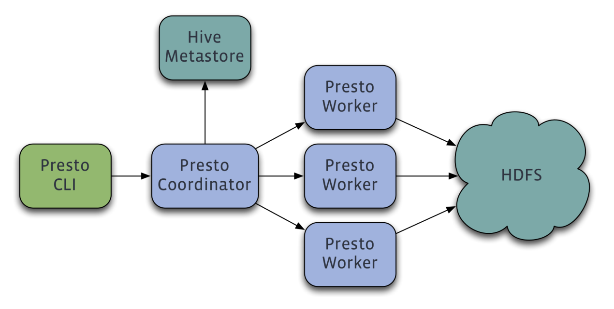

# 一、Presto

- [Presto原理&调优&面试](https://mp.weixin.qq.com/s/8CWXY864_QSmwNZ6Xh5B3w)
- [Presto实现原理和美团的使用实践](https://tech.meituan.com/2014/06/16/presto.html)
- [Presto使用指南](https://www.imangodoc.com/46466.html)
- [Presto官方文档](https://trino.io/docs/current/overview.html)
- [Presto在腾讯的实践](https://mp.weixin.qq.com/s/d56Qco7LUM3NroFq9PcVXA)
- [Presto实践](https://mp.weixin.qq.com/s/mnElO5Sau1VXLnhICKNdyA)

## 1、简介

### 1.1、架构

Presto查询引擎是一个Master-Slave的架构，由一个Coordinator节点，一个Discovery Server节点，多个Worker节点组成，Discovery Server通常内嵌于Coordinator节点中。Coordinator负责解析SQL语句，生成执行计划，分发执行任务给Worker节点执行。Worker节点负责实际执行查询任务。Worker节点启动后向Discovery Server服务注册，Coordinator从Discovery Server获得可以正常工作的Worker节点。如果配置了Hive Connector，需要配置一个Hive MetaStore服务为Presto提供Hive元信息，Worker节点与HDFS交互读取数据；

### 1.2、Presto执行查询过程简介

- 完全基于内存的并行计算
- 流水线
- 本地化计算
- 动态编译执行计划
- 小心使用内存和数据结构
- 类BlinkDB的近似查询
- GC控制

### 1.3、对比hive

- 本质区别：Hive是把一个查询转化成多个MapReduce任务，然后一个接一个执行。执行的中间结果通过对磁盘的读写来同步。然而，Presto没有使用MapReduce，它是通过一个定制的查询和执行引擎来完成的。它的所有的查询处理是在内存中，这也是它的性能很高的一个主要原因；

- presto由于是基于内存的，而hive是在磁盘上读写的，因此presto比hive快很多，但是由于是基于内存的当多张大表关联操作时易引起内存溢出错误；

## 2、环境搭建

启动presto：  ./launcher start

启动hive以便 thrift连接

hive --service hiveserver2 &
hive --service metastore &

./presto --server localhost:7670 --catalog hive --schema default

通过presto查询表的分区数据：schema和catalog要放在引号外面
`select * from hive.dws."daojia_user_pickup_daily$partitions"`

# 二、ClickHouse

- [ClickHouse实现原理](https://mp.weixin.qq.com/s/aJ7vdaG8LpBpBB5fCN0ncQ)
- [ClickHouse对比Elasticsearch](https://segmentfault.com/a/1190000039919389)
