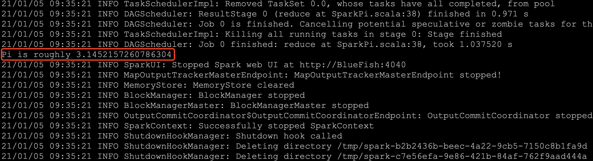
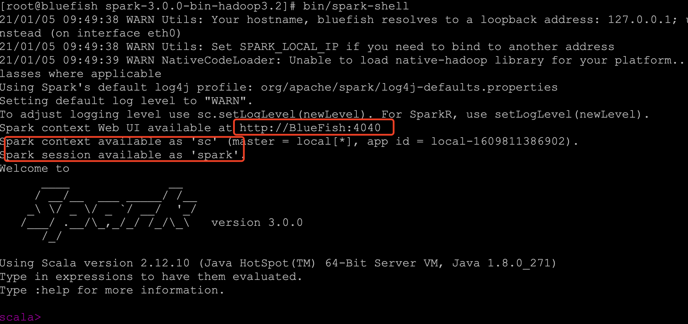

# 1、Spark概述

## 1.1、什么是Spark

Spark 是一种基于内存的快速、通用、可扩展的大数据分析计算引擎

## 1.2、Spark发展

MapReduce的局限性：
- 代码繁琐；
- 只能够支持map和reduce方法；
- 执行效率低下；
- 不适合迭代多次、交互式、流式的处理；

Spark是一种由Scala语言开发的快速、通用、可扩展的大数据分析引擎
- SparkCore中提供了Spark最基础与最核心的功能
- Spark SQL是Spark用来操作结构化数据的组件。通过Spark SQL，用户可以使用SQL 或者 Apache Hive 版本的 SQL 方言(HQL)来查询数据。
- Spark Streaming 是 Spark 平台上针对实时数据进行流式计算的组件，提供了丰富的处理数据流的 API；
- 丰富的类库支持：包括 SQL，MLlib，GraphX 和 Spark Streaming 等库，并且可以将它们无缝地进行组合；  
- 丰富的部署模式：支持本地模式和自带的集群模式，也支持在 Hadoop，Mesos，Kubernetes 上运行；

**Spark 和 Hadoop 的根本差异是多个作业之间的数据通信问题**: Spark 多个作业之间数据 通信是基于内存，而 Hadoop 是基于磁盘

## 1.3、Spark核心组件

Spark 基于 Spark Core 扩展了四个核心组件，分别用于满足不同领域的计算需求。


### 1.3.1、Spark Core

Spark Core 中提供了 Spark 最基础与最核心的功能，Spark 其他的功能如：Spark SQL、Spark Streaming、GraphX,、MLlib 都是在 Spark Core 的基础上进行扩展的；

### 1.3.2、Spark SQL

Spark SQL 主要用于结构化数据的处理。其具有以下特点：

- 能够将 SQL 查询与 Spark 程序无缝混合，允许您使用 SQL 或 DataFrame API 对结构化数据进行查询；
- 支持多种数据源，包括 Hive，Avro，Parquet，ORC，JSON 和 JDBC；
- 支持 HiveQL 语法以及用户自定义函数 (UDF)，允许你访问现有的 Hive 仓库；
- 支持标准的 JDBC 和 ODBC 连接；
- 支持优化器，列式存储和代码生成等特性，以提高查询效率。

### 1.3.2、Spark Streaming

Spark Stream主要用于快速构建可扩展，高吞吐量，高容错的流处理程序。支持从 HDFS，Flume，Kafka，Twitter 和 ZeroMQ 读取数据，并进行处理；


 Spark Streaming 的本质是微批处理，它将数据流进行极小粒度的拆分，拆分为多个批处理，从而达到接近于流处理的效果。


### 1.3.3、MLlib

MLlib 是 Spark 的机器学习库。其设计目标是使得机器学习变得简单且可扩展。它提供了以下工具：

- **常见的机器学习算法**：如分类，回归，聚类和协同过滤；
- **特征化**：特征提取，转换，降维和选择；
- **管道**：用于构建，评估和调整 ML 管道的工具；
- **持久性**：保存和加载算法，模型，管道数据；
- **实用工具**：线性代数，统计，数据处理等。

### 1.3.4、Graphx

GraphX 是 Spark 中用于图形计算和图形并行计算的新组件。在高层次上，GraphX 通过引入一个新的图形抽象来扩展 RDD(一种具有附加到每个顶点和边缘的属性的定向多重图形)。为了支持图计算，GraphX 提供了一组基本运算符（如： subgraph，joinVertices 和 aggregateMessages）以及优化后的 Pregel API。此外，GraphX 还包括越来越多的图形算法和构建器，以简化图形分析任务

# 2、Spark安装与入门使用

## 2.1、编译安装

[Spark编译安装](../辅助资料/环境配置/大数据环境.md#4Spark编译安装)

# 3、Spark运行环境

## 3.1、spark-submit

Spark 所有模式均使用 `spark-submit` 命令提交作业，其格式如下：

```shell
./bin/spark-submit \
  --class <main-class> \        # 应用程序主入口类
  --master <master-url> \       # 集群的 Master Url
  --deploy-mode <deploy-mode> \ # 部署模式
  --conf <key>=<value> \        # 可选配置       
  ... # other options    
  <application-jar> \           # Jar 包路径 
  [application-arguments]       #传递给主入口类的参数  
```

需要注意的是：在集群环境下，`application-jar` 必须能被集群中所有节点都能访问，可以是 HDFS 上的路径；也可以是本地文件系统路径，如果是本地文件系统路径，则要求集群中每一个机器节点上的相同路径都存在该 Jar 包。

### 3.1.1、deploy-mode

deploy-mode 有 `cluster` 和 `client` 两个可选参数，默认为 `client`。这里以 Spark On Yarn 模式对两者进行说明 ：
- 在 cluster 模式下，Spark Drvier 在应用程序的 Master 进程内运行，该进程由群集上的 YARN 管理，提交作业的客户端可以在启动应用程序后关闭；
- 在 client 模式下，Spark Drvier 在提交作业的客户端进程中运行，Master 进程仅用于从 YARN 请求资源；

### 3.1.2、master-url

master-url 的所有可选参数如下表所示：

| Master URL                        | Meaning                                                      |
| --------------------------------- | ------------------------------------------------------------ |
| `local`                           | 使用一个线程本地运行 Spark                                    |
| `local[K]`                        | 使用 K 个 worker 线程本地运行 Spark                          |
| `local[K,F]`                      | 使用 K 个 worker 线程本地运行 , 第二个参数为 Task 的失败重试次数 |
| `local[*]`                        | 使用与 CPU 核心数一样的线程数在本地运行 Spark                   |
| `local[*,F]`                      | 使用与 CPU 核心数一样的线程数在本地运行 Spark<br/>第二个参数为 Task 的失败重试次数 |
| `spark://HOST:PORT`               | 连接至指定的 standalone 集群的 master 节点。端口号默认是 7077。 |
| `spark://HOST1:PORT1,HOST2:PORT2` | 如果 standalone 集群采用 Zookeeper 实现高可用，则必须包含由 zookeeper 设置的所有 master 主机地址。 |
| `mesos://HOST:PORT`               | 连接至给定的 Mesos 集群。端口默认是 5050。对于使用了 ZooKeeper 的 Mesos cluster 来说，使用 `mesos://zk://...` 来指定地址，使用 `--deploy-mode cluster` 模式来提交。 |
| `yarn`                            | 连接至一个 YARN 集群，集群由配置的 `HADOOP_CONF_DIR` 或者 `YARN_CONF_DIR` 来决定。使用 `--deploy-mode` 参数来配置 `client` 或 `cluster` 模式。 |

## 3.2、Local模式

Local 模式，就是不需 要其他任何节点资源就可以在本地执行 Spark 代码的环境，一般用于教学、调试、演示
```shell
# 本地模式提交应用
spark-submit \
--class org.apache.spark.examples.SparkPi \
--master local[2] \
examples/jars/spark-examples_2.11-2.4.0.jar \
100   # 传给 SparkPi 的参数
```

`spark-examples_2.11-2.4.0.jar` 是 Spark 提供的测试用例包，`SparkPi` 用于计算 Pi 值，执行结果如下：



进入交互界面：
```
bin/spark
```


## 3.3、Standlone模式

Standlone模式的架构和Hadoop HDFS/YARN很类似的，Standalone 是 Spark 提供的一种内置的集群模式，采用内置的资源管理器进行管理。下面按照如图所示演示 1 个 Mater 和 2 个 Worker 节点的集群配置，这里使用两台主机进行演示：


### 3.3.1、环境配置

首先需要保证 Spark 已经解压在两台主机的相同路径上。然后进入 hadoop001 的 `${SPARK_HOME}/conf/` 目录下，将`spark-env.sh.template`重命名为`spark-env.sh`，需要在配置文件`spark-env.sh`配置如下
```
JAVA_HOME=/usr/java/jdk1.8.0_201
```
完成后将该配置使用 scp 命令分发到 hadoop002 上

### 3.3.2、集群配置

在 `${SPARK_HOME}/conf/` 目录下，拷贝集群配置样本并进行相关配置：`slaves.template`重命名为`slaves`，在slaves中指定所有 Worker 节点的主机名：
```shell
# A Spark Worker will be started on each of the machines listed below.
hadoop001
hadoop002
```
这里需要注意以下三点：
- 主机名与 IP 地址的映射必须在 `/etc/hosts` 文件中已经配置，否则就直接使用 IP 地址；
- 每个主机名必须独占一行；
- Spark 的 Master 主机是通过 SSH 访问所有的 Worker 节点，所以需要预先配置免密登录；

### 3.3.3、启动standlone模式

```
start-all.sh   会在 hadoop1机器上启动master进程，在slaves文件配置的所有hostname的机器上启动worker进程
```
访问 8080 端口，查看 Spark 的 Web-UI 界面,，此时应该显示有两个有效的工作节点：

### 3.3.4、提交作业

```shell
# 以client模式提交到standalone集群 
spark-submit \
--class org.apache.spark.examples.SparkPi \
--master spark://hadoop001:7077 \
--executor-memory 2G \
--total-executor-cores 10 \
/usr/app/spark-2.4.0-bin-hadoop2.6/examples/jars/spark-examples_2.11-2.4.0.jar \
100

# 以cluster模式提交到standalone集群 
spark-submit \
--class org.apache.spark.examples.SparkPi \
--master spark://207.184.161.138:7077 \
--deploy-mode cluster \
--supervise \  # 配置此参数代表开启监督，如果主应用程序异常退出，则自动重启 Driver
--executor-memory 2G \
--total-executor-cores 10 \
/usr/app/spark-2.4.0-bin-hadoop2.6/examples/jars/spark-examples_2.11-2.4.0.jar \
100
```

### 3.3.5、进入交互界面

```
spark-shell  --master spark://bluefish:7077
```

### 3.3.6、资源问题

在虚拟机上提交作业时经常出现一个的问题是作业无法申请到足够的资源：

```properties
Initial job has not accepted any resources; 
check your cluster UI to ensure that workers are registered and have sufficient resources
```

可以查看 Web UI，内存空间不足：提交命令中要求作业的 `executor-memory` 是 2G，但是实际的工作节点的 `Memory` 只有 1G，这时候你可以修改 `--executor-memory`，也可以修改 Woker 的 `Memory`，其默认值为主机所有可用内存值减去 1G

关于 Master 和 Woker 节点的所有可选配置如下，可以在 `spark-env.sh` 中进行对应的配置：    

| Environment Variable（环境变量） | Meaning（含义）                                              |
| -------------------------------- | ------------------------------------------------------------ |
| `SPARK_MASTER_HOST`              | master 节点地址                                              |
| `SPARK_MASTER_PORT`              | master 节点地址端口（默认：7077）                            |
| `SPARK_MASTER_WEBUI_PORT`        | master 的 web UI 的端口（默认：8080）                        |
| `SPARK_MASTER_OPTS`              | 仅用于 master 的配置属性，格式是 "-Dx=y"（默认：none）,所有属性可以参考官方文档：[spark-standalone-mode](https://spark.apache.org/docs/latest/spark-standalone.html#spark-standalone-mode) |
| `SPARK_LOCAL_DIRS`               | spark 的临时存储的目录，用于暂存 map 的输出和持久化存储 RDDs。多个目录用逗号分隔 |
| `SPARK_WORKER_CORES`             | spark worker 节点可以使用 CPU Cores 的数量。（默认：全部可用）  |
| `SPARK_WORKER_MEMORY`            | spark worker 节点可以使用的内存数量（默认：全部的内存减去 1GB）； |
| `SPARK_WORKER_PORT`              | spark worker 节点的端口（默认： random（随机））              |
| `SPARK_WORKER_WEBUI_PORT`        | worker 的 web UI 的 Port（端口）（默认：8081）               |
| `SPARK_WORKER_DIR`               | worker 运行应用程序的目录，这个目录中包含日志和暂存空间（default：SPARK_HOME/work） |
| `SPARK_WORKER_OPTS`              | 仅用于 worker 的配置属性，格式是 "-Dx=y"（默认：none）。所有属性可以参考官方文档：[spark-standalone-mode](https://spark.apache.org/docs/latest/spark-standalone.html#spark-standalone-mode) |
| `SPARK_DAEMON_MEMORY`            | 分配给 spark master 和 worker 守护进程的内存。（默认： 1G）  |
| `SPARK_DAEMON_JAVA_OPTS`         | spark master 和 worker 守护进程的 JVM 选项，格式是 "-Dx=y"（默认：none） |
| `SPARK_PUBLIC_DNS`               | spark master 和 worker 的公开 DNS 名称。（默认：none）       |


## 3.4、YARN

Spark 支持将作业提交到 Yarn 上运行，此时不需要启动 Master 节点，也不需要启动 Worker 节点；建议在生产上使用该模式，统一使用YARN进行整个集群作业(MR、Spark)的资源调度

### 3.4.1、
配置

在 `spark-env.sh` 中配置 hadoop 的配置目录的位置，可以使用 `YARN_CONF_DIR` 或 `HADOOP_CONF_DIR` 进行指定：

```properties
YARN_CONF_DIR=/usr/app/hadoop-2.6.0-cdh5.15.2/etc/hadoop
# JDK安装位置
JAVA_HOME=/usr/java/jdk1.8.0_201
```

### 3.2 启动

必须要保证 Hadoop 已经启动，这里包括 YARN 和 HDFS 都需要启动，因为在计算过程中 Spark 会使用 HDFS 存储临时文件，如果 HDFS 没有启动，则会抛出异常。

```shell
# start-yarn.sh
# start-dfs.sh
```

### 3.3 提交应用

```shell
#  以client模式提交到yarn集群 
spark-submit \
--class org.apache.spark.examples.SparkPi \
--master yarn \
--deploy-mode client \
--executor-memory 2G \
--num-executors 10 \
/usr/app/spark-2.4.0-bin-hadoop2.6/examples/jars/spark-examples_2.11-2.4.0.jar \
100

#  以cluster模式提交到yarn集群 
spark-submit \
--class org.apache.spark.examples.SparkPi \
--master yarn \
--deploy-mode cluster \
--executor-memory 2G \
--num-executors 10 \
/usr/app/spark-2.4.0-bin-hadoop2.6/examples/jars/spark-examples_2.11-2.4.0.jar \
100
```

## 3.4、Mesos


# 4、SparkSQL

## 4.1、SqlContext

```java
public static void main(String[] args) {
    String path = "file:///workspace/scala/spark-sql-demo/people.json";
    //1)创建相应的Context
    SparkConf conf = new SparkConf();
    //在测试或者生产中，AppName和Master我们是通过脚本进行指定
    conf.setAppName("SQLContextApp").setMaster("local[2]");
    SparkContext sc = new SparkContext(conf);
    SQLContext sqlContext = new SQLContext(sc);
    Dataset<Row> json = sqlContext.read().json(path);
    json.printSchema();
    json.show();
    sc.stop();
}
```
如果打包到服务器上运行：
```
spark-submit \
--name SQLContextApp \
--class com.blue.fish.spark.SQLContextApp \
--master local[2] \
/root/lib/spark-sql.jar \
/root/software/spark-2.4.7/examples/src/main/resources/people.json
```

## 4.2、HiveContext

```java
public static void main(String[] args) {
    //1)创建相应的Context
    SparkConf conf = new SparkConf();
    SparkContext sc = new SparkContext(conf);
    // hiveContext 是过期API
    HiveContext hc = new HiveContext(sc);
    hc.table("emp").show();
    sc.stop();
}
```
这个需要部署打包到服务器上运行：
```
spark-submit \
--name HiveContextApp \
--class com.blue.fish.spark.HiveContextApp \
--master local[2] \
--jars /root/spark-log/mysql-connector-java-5.1.28.jar \
/root/lib/spark-sql.jar
```
- `--class`：指定运行的类
- `--master`：指定spark的启动模式
- `--jars`：指定外部依赖的类，这里需要依赖mysql驱动，因为hive的元数据信息存储在mysql里的

## 4.3、SparkSession

在Spark2.0之后，主要使用SparkSession来处理了
```java
public static void main(String[] args) {
    String path = "file:///workspace/scala/spark-sql-demo/people.json";
    SparkSession session = SparkSession.builder().appName("JavaSparkSessionContext")
            .master("local[2]").getOrCreate();
    Dataset<Row> dataset = session.read().json(path);
    dataset.printSchema();
    dataset.show();
    session.stop();
}
```

## 4.4、spark-shell方式使用

spark-shell 要访问hive里面的表需要将hive-site.xml 拷贝到spark的conf目录下

进入spark-shell控制台访问hive的表
```
[root@bluefish lib]# spark-shell --master local[2] --jars /root/spark-log/mysql-connector-java-5.1.28.jar 
Spark context available as 'sc' (master = local[2], app id = local-1606538300252).
Spark session available as 'spark'.
Welcome to
      ____              __
     / __/__  ___ _____/ /__
    _\ \/ _ \/ _ `/ __/  '_/
   /___/ .__/\_,_/_/ /_/\_\   version 2.4.6
      /_/
Using Scala version 2.11.12 (Java HotSpot(TM) 64-Bit Server VM, Java 1.8.0_271)
Type in expressions to have them evaluated.
Type :help for more information.

scala> 
```
因为hive的元数据信息存储在mysql中，需要知道mysql的驱动包地址

比如查询表，执行查询等：
```
scala> spark.sql("show tables").show
20/11/28 12:39:28 WARN ObjectStore: Failed to get database global_temp, returning NoSuchObjectException
+--------+--------------+-----------+
|database|     tableName|isTemporary|
+--------+--------------+-----------+
| default|          dept|      false|
| default|           emp|      false|
| default|hive_wordcount|      false|
+--------+--------------+-----------+
scala> spark.sql("select * from dept").show
+---+------+----------+--------+
| id|deptno|     dname|     loc|
+---+------+----------+--------+
|  1|    11|KOMvRWiYwm|TGBPuCDj|
|  2|    12|nKNLpqLGXT|AWjcLvYD|
|  3|    13|WXZfDzOvMx|ZIrLDIFd|
+---+------+----------+--------+
only showing top 20 rows
```

还可以通过spark—sql命令进入交互界面：

## 4.5、thriftserver

thriftserver/beeline的使用
- 启动thriftserver: 默认端口是10000 ，可以修改：
    ```
    ./start-thriftserver.sh  \
    --master local[2] \
    --jars /root/spark-log/mysql-connector-java-5.1.28.jar  \
    ```
- 启动beeline：`beeline -u jdbc:hive2://localhost:10000 -n root`

修改thriftserver启动占用的默认端口号：
```
./start-thriftserver.sh  \
--master local[2] \
--jars /root/spark-log/mysql-connector-java-5.1.28.jar  \
--hiveconf hive.server2.thrift.port=14000
```
那么使用beeline访问时：`beeline -u jdbc:hive2://localhost:14000 -n root`

**thriftserver和普通的spark-shell/spark-sql有什么区别？**
- spark-shell、spark-sql都是一个spark  application；
- thriftserver， 不管你启动多少个客户端(beeline/code)，永远都是一个spark application；解决了一个数据共享的问题，多个客户端可以共享数据；

## 4.6、使用jdbc连接thriftserver

```java
public static void main(String[] args) throws Exception{
    Class.forName("org.apache.hive.jdbc.HiveDriver");
    Connection conn = DriverManager.getConnection("jdbc:hive2://localhost:10000", "root", "");
    PreparedStatement statement = conn.prepareStatement("select empno, ename, sal from emp limit 10");
    ResultSet rs = statement.executeQuery();
    while (rs.next()) {
        System.out.println("empno:" + rs.getInt("empno") +
                " , ename:" + rs.getString("ename") +
                " , sal:" + rs.getDouble("sal"));
    }
    rs.close();
    statement.close();
    conn.close();
}
```
**注意事项**：在使用jdbc开发时，一定要先启动thriftserver
```
Exception in thread "main" java.sql.SQLException:
Could not open client transport with JDBC Uri: jdbc:hive2://bluefish:14000:
java.net.ConnectException: Connection refused
```

## 4.7、SparkSQL使用场景


## 4.8、处理json的复杂场景：

### 4.8.1、数组

```json
{"name":"zhangsan", "nums":[1,2,3,4,5,6]}
{"name":"lisi", "nums":[6,7,8,9]}
```
可以输出如下：
```
scala> spark.sql("select name,nums[1] from json_table").show
+--------+-------+
|    name|nums[1]|
+--------+-------+
|zhangsan|      2|
|    lisi|      7|
+--------+-------+
scala> spark.sql("select name, explode(nums) from json_table").show
+--------+---+
|    name|col|
+--------+---+
|zhangsan|  1|
|zhangsan|  2|
|zhangsan|  3|
|zhangsan|  4|
|zhangsan|  5|
|zhangsan|  6|
|    lisi|  6|
|    lisi|  7|
|    lisi|  8|
|    lisi|  9|
+--------+---+
```

### 4.8.2、对象

```json
{"name":"Yin", "address":{"city":"Columbus","state":"Ohio"}}
{"name":"Michael", "address":{"city":null, "state":"California"}}
```
输出如下结果：
```
scala> spark.sql("select * from json_tables").show
+----------------+-------+
|         address|   name|
+----------------+-------+
|[Columbus, Ohio]|    Yin|
|  [, California]|Michael|
+----------------+-------+
scala> spark.sql("select name, address.city,address.state from json_tables").show
+-------+--------+----------+
|   name|    city|     state|
+-------+--------+----------+
|    Yin|Columbus|      Ohio|
|Michael|    null|California|
+-------+--------+----------+
```


# 5、DataFrame

## 5.1、概述

- DataSet：分布式的数据集；
- DataFrame：以列（列名、列的类型、列值）的形式构成的分布式数据集，按照列赋予不同的名称

以往RDD的方式：
- java/scala  ==> jvm
- python ==> python runtime

这样往往对耗时比较高，而DataFrame是：java/scala/python ==> Logic Plan

将所有提交的逻辑执行计划里面去，而不是在JVM或者Python的环境中执行

## 5.2、DataFrame 与 RDD

### 5.2.1、DataFrame使用

```java
public static void main(String[] args) {
    SparkSession session = SparkSession.builder().appName("JavaSparkSessionContext")
            .master("local[2]").getOrCreate();
    Dataset<Row> df = session.read().json("file:///workspace/scala/spark-sql-demo/people.json");
    df.printSchema();
    df.show();
    df.select("name").show();
    df.select(df.col("name"), df.col("age")).show();
    df.select(df.col("name"), df.col("age").plus(10).as("age2")).show();
    // select * from table where age > 35
    df.filter(df.col("age").gt(35)).show();
    df.groupBy(df.col("age")).count().show();
    session.stop();
}
```

- [DataFrame与RDD交互](http://spark.apache.org/docs/2.4.7/sql-getting-started.html#interoperating-with-rdds)

DataFrame和RDD互操作的两种方式：
- 反射：case class   前提：事先需要知道你的字段、字段类型    
- 编程：Row          如果第一种情况不能满足你的要求（事先不知道列）

**选型**：优先考虑第一种

### 5.2.2、反射操作方式：

```java
public static void infer(SparkSession session) {
    JavaRDD<Info> map = session.read()
            .textFile("file:///Users/bluefish/Documents/workspace/scala/spark-sql-demo/infos.txt")
            .toJavaRDD()
            .map(line -> {
                String[] lines = line.split(",");
                return new Info(Integer.parseInt(lines[0]), lines[1], Integer.parseInt(lines[2]));
            });
    Dataset<Row> df = session.createDataFrame(map, Info.class);
    df.printSchema();
    df.show();
    df.createOrReplaceTempView("infos");
    session.sql("select * from infos where age > 35").show();
    session.stop();
}
public static class Info {
    public int id;
    public String name;
    public int age;
    public Info(int id, String name, int age) {
        this.id = id;
        this.name = name;
        this.age = age;
    }
}
```

### 5.2.3、编程

```java
public static void program(SparkSession session) {
    JavaRDD<String> rdd = session.read()
            .textFile("file:///Users/bluefish/Documents/workspace/scala/spark-sql-demo/infos.txt")
            .toJavaRDD();
    // 定义schema
    String schema = "id name age";

    List<StructField> fields = new ArrayList<>();
    for (String fieldName : schema.split(" ")) {
        StructField field = DataTypes.createStructField(fieldName, DataTypes.StringType, true);
        fields.add(field);
    }
    StructType structType = DataTypes.createStructType(fields);
    JavaRDD<Row> javaRDD = rdd.map((Function<String, Row>) record -> {
        String[] lines = record.split(",");
        return RowFactory.create(lines[0], lines[1], lines[2]);
    });

    Dataset<Row> df = session.createDataFrame(javaRDD, structType);
    df.printSchema();
    df.show();
    df.createOrReplaceTempView("infos");
    session.sql("select * from infos where age > 35").show();
    session.stop();
}
```

## 5.3、DataFrame与Spark SQL

- DataFrame = RDD + Schema
- DataFrame 实际上是一个Row
- DataFrame over RDD

# 6、外部数据源

[数据源](http://spark.apache.org/docs/2.4.7/sql-data-sources.html)

默认处理的格式：parquet

```java
val DEFAULT_DATA_SOURCE_NAME = SQLConfigBuilder("spark.sql.sources.default")
    .doc("The default data source to use in input/output.")
    .stringConf
    .createWithDefault("parquet")
```

输出默认的模式是 ErrorIfExists，除了其还有 append、overwrite、ignore

## 6.1、parquet


## 6.2、Hive

往hive里面输出数据：
```
scala> spark.sql("select deptno, count(1) as cnt from emp group by deptno").write.saveAsTable("emp_statistics")
```
可能存在的问题：`org.apache.spark.sql.AnalysisException: Attribute name "count(1)" contains invalid character(s) among " ,;{}()\n\t=". Please use alias to rename it.;`

```
spark.sqlContext.setConf("spark.sql.shuffle.partitions","10")
```
在生产环境中一定要注意设置spark.sql.shuffle.partitions，默认是200

## 6.3、MySQL

```
scala> val jdbcDF2 = spark.read.format("jdbc") \
.option("url", "jdbc:mysql://localhost:3306/sparksql") \
.option("dbtable", "sparksql.TBLS") \
.option("user", "root") \
.option("password", "root") \
.option("driver", "com.mysql.jdbc.Driver").load()
```
或者是：
```
import java.util.Properties
val connectionProperties = new Properties()
connectionProperties.put("user", "root")
connectionProperties.put("password", "root")
connectionProperties.put("driver", "com.mysql.jdbc.Driver")

val jdbcDF2 = spark.read.jdbc("jdbc:mysql://localhost:3306", "hive.TBLS", connectionProperties)
```

# 7、性能优化

- 存储格式

- 压缩格式：压缩速度、压缩文件的可分割性

    设置压缩格式：`config("spark.sql.parquet.compression.codec","gzip")`

- 代码：选用高性能算子

- 代码：复用已有的数据

- 参数：并行度选择`spark.sql.shuffle.partitions`

- 参数：分区字段类型推测`spark.sql.sources.paritionsColumnTypeInference.enabled`，默认是开启的


# 参考资料

- [深入Spark设计与原理分析](https://github.com/JerryLead/SparkInternals)
- [官方文档](http://spark.apache.org/docs/latest/index.html)