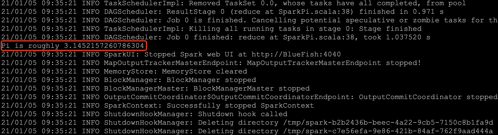
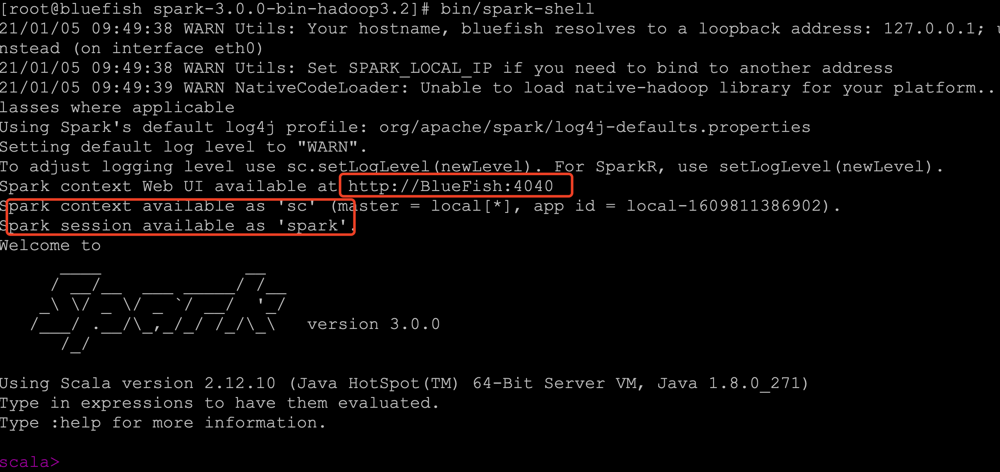
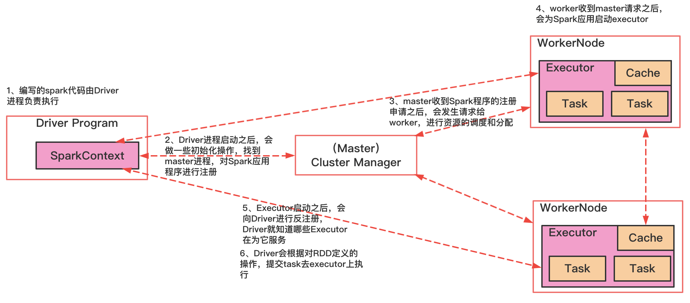
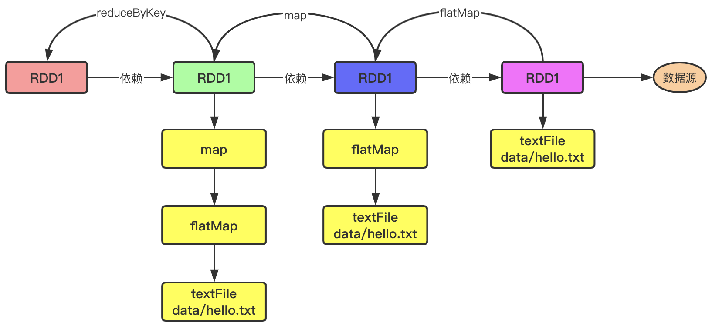
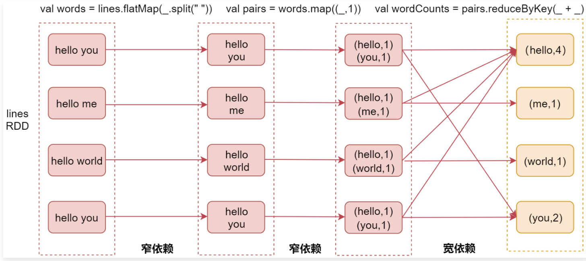
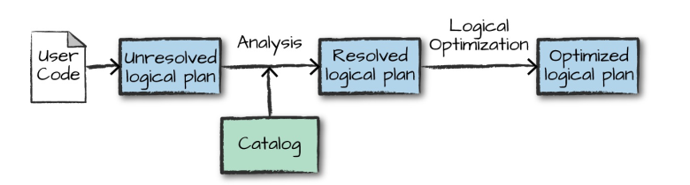
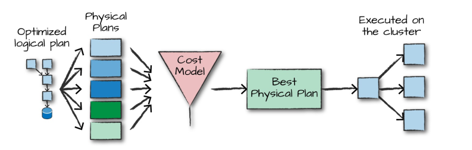

# 1、Spark概述

## 1.1、什么是Spark

Spark 是一种基于内存的快速、通用、可扩展的大数据分析计算引擎

## 1.2、Spark发展

MapReduce的局限性：
- 代码繁琐；
- 只能够支持map和reduce方法；
- 执行效率低下；
- 不适合迭代多次、交互式、流式的处理；

Spark是一种由Scala语言开发的快速、通用、可扩展的大数据分析引擎
- SparkCore中提供了Spark最基础与最核心的功能
- Spark SQL是Spark用来操作结构化数据的组件。通过Spark SQL，用户可以使用SQL 或者 Apache Hive 版本的 SQL 方言(HQL)来查询数据。
- Spark Streaming 是 Spark 平台上针对实时数据进行流式计算的组件，提供了丰富的处理数据流的 API；
- 丰富的类库支持：包括 SQL，MLlib，GraphX 和 Spark Streaming 等库，并且可以将它们无缝地进行组合；  
- 丰富的部署模式：支持本地模式和自带的集群模式，也支持在 Hadoop，Mesos，Kubernetes 上运行；

**Spark 和 Hadoop 的根本差异是多个作业之间的数据通信问题**: Spark 多个作业之间数据 通信是基于内存，而 Hadoop 是基于磁盘

## 1.3、Spark模块

Spark 基于 Spark Core 扩展了四个核心组件，分别用于满足不同领域的计算需求。


### 1.3.1、Spark Core

Spark Core 中提供了 Spark 最基础与最核心的功能，Spark 其他的功能如：Spark SQL、Spark Streaming、GraphX,、MLlib 都是在 Spark Core 的基础上进行扩展的；

### 1.3.2、Spark SQL

Spark SQL 主要用于结构化数据的处理。其具有以下特点：

- 能够将 SQL 查询与 Spark 程序无缝混合，允许您使用 SQL 或 DataFrame API 对结构化数据进行查询；
- 支持多种数据源，包括 Hive，Avro，Parquet，ORC，JSON 和 JDBC；
- 支持 HiveQL 语法以及用户自定义函数 (UDF)，允许你访问现有的 Hive 仓库；
- 支持标准的 JDBC 和 ODBC 连接；
- 支持优化器，列式存储和代码生成等特性，以提高查询效率。

### 1.3.2、Spark Streaming

Spark Stream主要用于快速构建可扩展，高吞吐量，高容错的流处理程序。支持从 HDFS，Flume，Kafka，Twitter 和 ZeroMQ 读取数据，并进行处理；


 Spark Streaming 的本质是微批处理，它将数据流进行极小粒度的拆分，拆分为多个批处理，从而达到接近于流处理的效果。


### 1.3.3、MLlib

MLlib 是 Spark 的机器学习库。其设计目标是使得机器学习变得简单且可扩展。它提供了以下工具：

- **常见的机器学习算法**：如分类，回归，聚类和协同过滤；
- **特征化**：特征提取，转换，降维和选择；
- **管道**：用于构建，评估和调整 ML 管道的工具；
- **持久性**：保存和加载算法，模型，管道数据；
- **实用工具**：线性代数，统计，数据处理等。

### 1.3.4、Graphx

GraphX 是 Spark 中用于图形计算和图形并行计算的新组件。在高层次上，GraphX 通过引入一个新的图形抽象来扩展 RDD(一种具有附加到每个顶点和边缘的属性的定向多重图形)。为了支持图计算，GraphX 提供了一组基本运算符（如： subgraph，joinVertices 和 aggregateMessages）以及优化后的 Pregel API。此外，GraphX 还包括越来越多的图形算法和构建器，以简化图形分析任务

# 2、Spark安装与运行环境

[Spark编译安装](../辅助资料/环境配置/大数据环境.md#4Spark编译安装)

## 2.1、spark-submit

Spark 所有模式均使用 `spark-submit` 命令提交作业，其格式如下：

```shell
./bin/spark-submit \
  --class <main-class> \        # 应用程序主入口类
  --master <master-url> \       # 集群的 Master Url
  --deploy-mode <deploy-mode> \ # 部署模式
  --conf <key>=<value> \        # 可选配置       
  ... # other options    
  <application-jar> \           # Jar 包路径 
  [application-arguments]       #传递给主入口类的参数  
```

需要注意的是：在集群环境下，`application-jar` 必须能被集群中所有节点都能访问，可以是 HDFS 上的路径；也可以是本地文件系统路径，如果是本地文件系统路径，则要求集群中每一个机器节点上的相同路径都存在该 Jar 包。

### 2.1.1、deploy-mode

deploy-mode 有 `cluster` 和 `client` 两个可选参数，默认为 `client`。这里以 Spark On Yarn 模式对两者进行说明 ：
- 在 cluster 模式下，Spark Drvier 在应用程序的 Master 进程内运行，该进程由群集上的 YARN 管理，提交作业的客户端可以在启动应用程序后关闭；
- 在 client 模式下，Spark Drvier 在提交作业的客户端进程中运行，Master 进程仅用于从 YARN 请求资源；

### 2.1.2、master-url

master-url 的所有可选参数如下表所示：

| Master URL                        | Meaning                                                      |
| --------------------------------- | ------------------------------------------------------------ |
| `local`                           | 使用一个线程本地运行 Spark                                    |
| `local[K]`                        | 使用 K 个 worker 线程本地运行 Spark                          |
| `local[K,F]`                      | 使用 K 个 worker 线程本地运行 , 第二个参数为 Task 的失败重试次数 |
| `local[*]`                        | 使用与 CPU 核心数一样的线程数在本地运行 Spark                   |
| `local[*,F]`                      | 使用与 CPU 核心数一样的线程数在本地运行 Spark<br/>第二个参数为 Task 的失败重试次数 |
| `spark://HOST:PORT`               | 连接至指定的 standalone 集群的 master 节点。端口号默认是 7077。 |
| `spark://HOST1:PORT1,HOST2:PORT2` | 如果 standalone 集群采用 Zookeeper 实现高可用，则必须包含由 zookeeper 设置的所有 master 主机地址。 |
| `mesos://HOST:PORT`               | 连接至给定的 Mesos 集群。端口默认是 5050。对于使用了 ZooKeeper 的 Mesos cluster 来说，使用 `mesos://zk://...` 来指定地址，使用 `--deploy-mode cluster` 模式来提交。 |
| `yarn`                            | 连接至一个 YARN 集群，集群由配置的 `HADOOP_CONF_DIR` 或者 `YARN_CONF_DIR` 来决定。使用 `--deploy-mode` 参数来配置 `client` 或 `cluster` 模式。 |

## 2.2、Local模式

Local 模式，就是不需 要其他任何节点资源就可以在本地执行 Spark 代码的环境，一般用于教学、调试、演示
```shell
# 本地模式提交应用
spark-submit \
--class org.apache.spark.examples.SparkPi \
--master local[2] \
examples/jars/spark-examples_2.11-2.4.0.jar \
100   # 传给 SparkPi 的参数
```

`spark-examples_2.11-2.4.0.jar` 是 Spark 提供的测试用例包，`SparkPi` 用于计算 Pi 值，执行结果如下：



进入交互界面：
```
bin/spark
```


## 2.3、Standlone模式

Standlone模式的架构和Hadoop HDFS/YARN很类似的，Standalone 是 Spark 提供的一种内置的集群模式，采用内置的资源管理器进行管理。下面按照如图所示演示 1 个 Mater 和 2 个 Worker 节点的集群配置，这里使用两台主机进行演示：


### 2.3.1、环境配置

首先需要保证 Spark 已经解压在两台主机的相同路径上。然后进入 hadoop001 的 `${SPARK_HOME}/conf/` 目录下，将`spark-env.sh.template`重命名为`spark-env.sh`，需要在配置文件`spark-env.sh`配置如下
```
JAVA_HOME=/usr/java/jdk1.8.0_201
```
完成后将该配置使用 scp 命令分发到 hadoop002 上

### 2.3.2、集群配置

在 `${SPARK_HOME}/conf/` 目录下，拷贝集群配置样本并进行相关配置：`slaves.template`重命名为`slaves`，在slaves中指定所有 Worker 节点的主机名：
```shell
# A Spark Worker will be started on each of the machines listed below.
hadoop001
hadoop002
```
这里需要注意以下三点：
- 主机名与 IP 地址的映射必须在 `/etc/hosts` 文件中已经配置，否则就直接使用 IP 地址；
- 每个主机名必须独占一行；
- Spark 的 Master 主机是通过 SSH 访问所有的 Worker 节点，所以需要预先配置免密登录；

### 2.3.3、启动standlone模式

```
start-all.sh   会在 hadoop1机器上启动master进程，在slaves文件配置的所有hostname的机器上启动worker进程
```
访问 8080 端口，查看 Spark 的 Web-UI 界面,，此时应该显示有两个有效的工作节点：

### 2.3.4、提交作业

```shell
# 以client模式提交到standalone集群 
spark-submit \
--class org.apache.spark.examples.SparkPi \
--master spark://hadoop001:7077 \
--executor-memory 2G \
--total-executor-cores 10 \
/usr/app/spark-2.4.0-bin-hadoop2.6/examples/jars/spark-examples_2.11-2.4.0.jar \
100

# 以cluster模式提交到standalone集群 
spark-submit \
--class org.apache.spark.examples.SparkPi \
--master spark://207.184.161.138:7077 \
--deploy-mode cluster \
--supervise \  # 配置此参数代表开启监督，如果主应用程序异常退出，则自动重启 Driver
--executor-memory 2G \
--total-executor-cores 10 \
/usr/app/spark-2.4.0-bin-hadoop2.6/examples/jars/spark-examples_2.11-2.4.0.jar \
100
```

### 2.3.5、进入交互界面

```
spark-shell  --master spark://bluefish:7077
```

### 2.3.6、资源问题

在虚拟机上提交作业时经常出现一个的问题是作业无法申请到足够的资源：

```properties
Initial job has not accepted any resources; 
check your cluster UI to ensure that workers are registered and have sufficient resources
```

可以查看 Web UI，内存空间不足：提交命令中要求作业的 `executor-memory` 是 2G，但是实际的工作节点的 `Memory` 只有 1G，这时候你可以修改 `--executor-memory`，也可以修改 Woker 的 `Memory`，其默认值为主机所有可用内存值减去 1G

关于 Master 和 Woker 节点的所有可选配置如下，可以在 `spark-env.sh` 中进行对应的配置：    

| Environment Variable（环境变量） | Meaning（含义）                                              |
| -------------------------------- | ------------------------------------------------------------ |
| `SPARK_MASTER_HOST`              | master 节点地址                                              |
| `SPARK_MASTER_PORT`              | master 节点地址端口（默认：7077）                            |
| `SPARK_MASTER_WEBUI_PORT`        | master 的 web UI 的端口（默认：8080）                        |
| `SPARK_MASTER_OPTS`              | 仅用于 master 的配置属性，格式是 "-Dx=y"（默认：none）,所有属性可以参考官方文档：[spark-standalone-mode](https://spark.apache.org/docs/latest/spark-standalone.html#spark-standalone-mode) |
| `SPARK_LOCAL_DIRS`               | spark 的临时存储的目录，用于暂存 map 的输出和持久化存储 RDDs。多个目录用逗号分隔 |
| `SPARK_WORKER_CORES`             | spark worker 节点可以使用 CPU Cores 的数量。（默认：全部可用）  |
| `SPARK_WORKER_MEMORY`            | spark worker 节点可以使用的内存数量（默认：全部的内存减去 1GB）； |
| `SPARK_WORKER_PORT`              | spark worker 节点的端口（默认： random（随机））              |
| `SPARK_WORKER_WEBUI_PORT`        | worker 的 web UI 的 Port（端口）（默认：8081）               |
| `SPARK_WORKER_DIR`               | worker 运行应用程序的目录，这个目录中包含日志和暂存空间（default：SPARK_HOME/work） |
| `SPARK_WORKER_OPTS`              | 仅用于 worker 的配置属性，格式是 "-Dx=y"（默认：none）。所有属性可以参考官方文档：[spark-standalone-mode](https://spark.apache.org/docs/latest/spark-standalone.html#spark-standalone-mode) |
| `SPARK_DAEMON_MEMORY`            | 分配给 spark master 和 worker 守护进程的内存。（默认： 1G）  |
| `SPARK_DAEMON_JAVA_OPTS`         | spark master 和 worker 守护进程的 JVM 选项，格式是 "-Dx=y"（默认：none） |
| `SPARK_PUBLIC_DNS`               | spark master 和 worker 的公开 DNS 名称。（默认：none）       |


## 2.4、YARN

Spark 支持将作业提交到 Yarn 上运行，此时不需要启动 Master 节点，也不需要启动 Worker 节点；建议在生产上使用该模式，统一使用YARN进行整个集群作业(MR、Spark)的资源调度

### 2.4.1、配置

在 `spark-env.sh` 中配置 hadoop 的配置目录的位置，可以使用 `YARN_CONF_DIR` 或 `HADOOP_CONF_DIR` 进行指定：

```properties
YARN_CONF_DIR=/usr/app/hadoop-2.6.0-cdh5.15.2/etc/hadoop
# JDK安装位置
JAVA_HOME=/usr/java/jdk1.8.0_201
```

### 2.4.2、启动

必须要保证 Hadoop 已经启动，这里包括 YARN 和 HDFS 都需要启动，因为在计算过程中 Spark 会使用 HDFS 存储临时文件，如果 HDFS 没有启动，则会抛出异常。
```shell
# start-yarn.sh
# start-dfs.sh
```

### 2.4.3、提交应用

```shell
#  以client模式提交到yarn集群 
spark-submit \
--class org.apache.spark.examples.SparkPi \
--master yarn \
--deploy-mode client \
--executor-memory 2G \
--num-executors 10 \
/usr/app/spark-2.4.0-bin-hadoop2.6/examples/jars/spark-examples_2.11-2.4.0.jar \
100

#  以cluster模式提交到yarn集群 
spark-submit \
--class org.apache.spark.examples.SparkPi \
--master yarn \
--deploy-mode cluster \
--executor-memory 2G \
--num-executors 10 \
/usr/app/spark-2.4.0-bin-hadoop2.6/examples/jars/spark-examples_2.11-2.4.0.jar \
100
```

## 2.4、Mesos

# 3、Spark运行架构

## 3.1、运行架构

Spark框架的核心是一个计算引擎，整体来说，它采用了标准的 master-slave的结构；如下图所示，其展示了一个Spark执行的基本结构



## 3.2、核心组件

### 3.2.1、Driver

Spark驱动器节点，用于执行spark任务中的main方法，复制实际代码的执行工作，Driver在Spark作业执行时主要负责：
- 将用户程序转化为作业（job）
- 在executor直接调度任务（task）
- 跟踪executor的执行情况
- 通过ui展示查询运行情况

### 3.2.2、Executor

Spark Executor 是集群中工作节点（Worker）中的一个JVM进程，负责在Spark作业中运行具体任务Task，任务彼此相互独立，Spark应用启动时，Executor节点被同时启动，伴随着整个Spark应用的生命周期而存在，如果有executor节点发生 了故障或崩溃，Spark应用可以继续执行，会将出错节点上的任务调度到其他executor节点上继续运行；

Executor主要有两个核心功能：
- 负责运行组成Spark应用的任务，并将结果返回给驱动器进程；
- 通过自身的块管理器（Block Manager）为用户程序中要求换成的RDD提供内存式存储；

### 3.2.3、Master & Worker

Spark集群的独立部署环境中，不需要依赖其他的资源调度框架，自身实现了资源调度的功能，所以环境中还有其他两个核心组件：Master 和 Worker，这里Master 是一个进程，主要负责资源的调度和分配，并进行集群的监控等职责；Worker也是一个进程，一个worker运行在集群中的一台服务器上，由Master分配资源对数据进行并行的处理和计算；

### 3.2.4、Application Master

Hadoop 用户向yarn集群提交应用程序时，提交的程序中应该包含 ApplicationMaster，用于向资源调度器申请执行任务的资源容器 container，运行用户自己的程序任务job，监控整个任务的执行，跟踪整个任务的状态，任务处理失败等情况，简而言之 RM 和 Driver 直接的解耦合靠的就是 ApplicationMaster

## 3.3、核心概念

### 3.3.1、Executor 与 Core

Spark Executor 是集群中运行在工作节点中的一个JVM进程，是整个集群中的专门用于计算的节点，在提交应用中，可以提供参数指定计算节点的个数，以及对应的资源。这里的资源一般指的是工作节点 Executor 的内存大小 和使用的虚拟CPU和（Core）数量；相关启动参数如下：

|名称|说明|
|---|---|
|--num-executors|配置Executor的数量|
|--executor-memory|配置每个Executor的内存大小|
|--executor-cores|配置每个Executor的虚拟CPU Core的数量|

### 3.3.2、DAG

DAG，有向无环图

## 3.4、提交流程

### 3.4.1、Yarn Client模式

Client模式将用于监控和调度的Driver模块在客户端执行，而不是在Yarn中，所以一般用于测试：
- Driver 在任务提交的本地机器上运行；
- Driver 启动后会和 ResourceManager 通讯申请启动 ApplicationMaster
- ResourceManager 分配 Container，在合适的 NodeManager上启动 ApplicationMaster，负责向 ResourceManager 申请Executor内存；
- ResourceManager 接到 ApplicationMaster 的资源申请后会分配 container，然后 ApplicationMaster 在资源分配指定的 NodeManager 上启动 Executor 进程；
- Executor进程启动会向Driver反向注册，Executor 全部注册完成后 Driver开始执行Main 函数
- 之后执行到 Action 算子时，触发一个 job，并根据宽依赖开始划分 stage，每个 stage生成对应的 TaskSet，之后将 task分发到各个Executor上执行；

### 3.4.2、Yarn Cluster 模式

Cluster 模式将用于监控和调度的Driver模块启动在Yarn集群资源中执行，一般用于生产环境；
- 在 Yarn Cluster 模式下，任务提交后会和 ResourceManager 通讯申请启动 ApplicationMaster;
- 随后 ResourceManager 分配 container，在合适的 NodeManager上启动了 ApplicationMaster，此时的 ApplicationMaster 就是 Driver；
- Driver 启动后向 ResourceManager 申请Executor内存，ResourceManager 接到 ApplicationMaster 的资源申请后会分配 container，然后在合适的 NodeManager上启动 Executor 进程；
- Executor进程启动后会向 Driver反向注册，Executor 全部注册完成后Driver开始执行 main 函数；
- 之后执行到Action 算子时，触发一个job，并根据宽依赖开始划分stage，每个stage生成对应的 taskset，之后框task分发到各个Executor上

# 4、SparkCore

Spark计算框架封装了三大数据结构，用于处理不同的应用场景：
- RDD（Resilient Distributed Dataset）：弹性分布式数据集
- 累加器：分布式共享只写变量
- 广播变量：分布式工作只读变量

## 4.1、RDD

### 4.1.1、什么是RDD

RDD（Resilient Distributed Dataset），称作弹性分布式数据集，是Spark中最基本的数据处理模型，代码中是一个抽象类，它代表一个弹性的、不可变的、可分区的、元素可并行计算的集合
- 弹性：
    - 存储的弹性：内存与磁盘的自动切换；
    - 容错的弹性：数据丢失可以自动恢复；
    - 计算的弹性：计算出错重试机制
    - 分片的弹性：可根据需要重新分片；
- 分布式：数据存储在大数据集群的不同节点上；
- 数据集：RDD封装了计算逻辑，并不保存数据；
- 数据抽象：RDD是一个抽象类，需要子类具体实现；
- 不可变：RDD封装了计算逻辑，是不可改变，如果向要改变，只能产生新的RDD
- 可分区、并行计算

### 4.1.2、核心属性

- 分区列表：RDD数据结构中存在分区列表，用于执行任务时并行计算，是实现分布式计算的重要属性
    ```scala
    protected def getPartitions: Array[Partition]
    ```
- 分区计算函数：Spark在计算时，是使用分区函数对每一个分区进行计算
    ```scala
    @DeveloperApi
    def compute(split: Partition, context: TaskContext): Iterator[T]
    ```
- RDD之间的依赖关系：RDD是计算模型的封装，当需求中需要将多个计算模型进行组合时，就需要将多个RDD建立依赖关系
- 分区器（可选）：当数据为KV类型数据时，可以通过设定分区器自定义数据的分区
- 首选位置（可选）：计算数据时，可以根据计算节点的状态选择不同的节点位置进行计算

Spark对RDD的操作整体可以分为两类：Transformation 和 Action
- Transformation 可以理解为转换，表示针对RDD中数据的转换操作，主要会针对已有的RDD创建一个新的RDD；
- Action 可以理解为执行，表示触发任务执行的操作，主要对RDD进行最后的操作，比如遍历、reduce、保存文件等，并且还可以把结果返回给Driver程序
- Transformation 算子有一个特性：lazy，指的是如果一个spark任务只定义了 transformation，那么即时执行中国任务，任务中的算子也不会执行，也就是说，transformation不会触发spark任务的执行，只是记录了对RDD所做的操作，不会执行；
- 只有当transformation之后，接着执行了一个action操作，那么所有的transformation才会执行，避免产生过多中间结果；

### 4.1.3、执行原理

数据处理过程需要计算资源和计算模型逻辑，执行时，需要将计算资源和计算模型逻辑进行协调和整合。

Spark框架在执行时，先申请资源，然后将应用程序的数据处理逻辑分解成一个一个的计算任务，然后将任务发到已经分配资源的计算节点上，按照指定的计算模型进行数据计算，最后得到结果；

在Yarn环境中 RDD的工作原理：RDD主要是用于将逻辑进行封装，并生成Task发送给Executor节点执行计算；

**RDD并行度与分区**

默认情况下，Spark可以将一个作业切分多个任务后，发送给Executor节点进行计算，而能够并行计算的任务数量称之为并行度，这个数量在构建RDD时指定；**注意：这里的并行执行的任务数量并不是指的切分任务的数量**

读取内存数据时，数据可以按照并行度的设定进行数据的分区操作，数据分区规则spark核心源码：
```
def positions(length: Long, numSlices: Int): Iterator[(Int, Int)] = {
    (0 until numSlices).iterator.map { i =>
    val start = ((i * length) / numSlices).toInt
    val end = (((i + 1) * length) / numSlices).toInt
    (start, end)
    }
}
```
读取文件数据时，数据是按照 hadoop文件读取的规则进行切片分区，而切片规则和数据读取的规则有些差异

### 4.1.4、RDD的创建

Spark创建RDD的方式可以分为四种：

**（1）从集合（内存）中创建RDD**

从集合中创建RDD，Spark主要提供了两个方法： parallelize 和 makeRDD
```scala
val rdd1 = sc.parallelize(List(1,2,3,4,5))
val rdd2 = sc.makeRDD(Array(1,2,3,4,5))
val sum1 = rdd1.reduce(_ + _)
val sum2 = rdd2.reduce(_ + _)
```
从代码实现上来看，makeRDD调用的是 parallelize方法：
```scala
def makeRDD[T: ClassTag](seq: Seq[T], numSlices: Int = defaultParallelism): RDD[T] = withScope {
    parallelize(seq, numSlices)
}
```

**（2）从外部存储文件创建RDD**

由外部存储系统的数据创建RDD包括：本地的文件系统、所有Hadoop支持的数据集，比如HDFS、HBase
```scala
val linesRdd = sc.textFile(path)
val wordRdd = linesRdd.flatMap(_.split(" "))
val wordCountMap = wordRdd.map((_, 1))
wordCountMap.reduceByKey(_ + _).foreach(word => println(word._1 + " -> " + word._2))
```
通过SparkContext的 textFile() 方法，可以针对本地文件或HDFS创建RDD，RDD个每个元素就是文件中的一行文本内容，textFile 方法支持对穆、压缩文件以及通配符创建RDD；

Spark默认会为HDFS文件的每一个Block创建一个partition，也可以通过 textFile() 第二个参数手动设置分区数量，只能比Block数量多，不能比Block数量少，比Block数量少的设置不生效；

**（3）从其他RDD创建**

主要通过一个RDD进行算子运算之后，再产生新的RDD

**（4）直接创建RDD（new）**

使用new 的方式直接构造RDD，一般由Spark框架自身使用

### 4.1.5、RDD转换算子:Transformation

[RDD转换算子](http://spark.apache.org/docs/3.0.0/rdd-programming-guide.html#transformations)

spark 常用的 Transformation 算子如下表：

| Transformation 算子                                           | Meaning（含义）                                              |
| ------------------------------------------------------------ | ------------------------------------------------------------ |
| **map**(*func*)                                              | 对原 RDD 中每个元素运用 *func* 函数，并生成新的 RDD             |
| **filter**(*func*)                                           | 对原 RDD 中每个元素使用*func* 函数进行过滤，并生成新的 RDD      |
| **flatMap**(*func*)                                          | 与 map 类似，但是每一个输入的 item 被映射成 0 个或多个输出的 items（ *func* 返回类型需要为 Seq ）。 |
| **mapPartitions**(*func*)                                    | 与 map 类似，但函数单独在 RDD 的每个分区上运行， *func*函数的类型为  Iterator\<T> => Iterator\<U> ，其中 T 是 RDD 的类型，即 RDD[T] |
| **mapPartitionsWithIndex**(*func*)                           | 与 mapPartitions 类似，但 *func* 类型为 (Int, Iterator\<T>) => Iterator\<U> ，其中第一个参数为分区索引 |
| **sample**(*withReplacement*, *fraction*, *seed*)            | 数据采样，有三个可选参数：设置是否放回（withReplacement）、采样的百分比（*fraction*）、随机数生成器的种子（seed）； |
| **union**(*otherDataset*)                                    | 合并两个 RDD                                                  |
| **intersection**(*otherDataset*)                             | 求两个 RDD 的交集                                              |
| **distinct**([*numTasks*]))                                  | 去重                                                         |
| **groupByKey**([*numTasks*])                                 | 按照 key 值进行分区，即在一个 (K, V) 对的 dataset 上调用时，返回一个 (K, Iterable\<V>) <br/>**Note:** 如果分组是为了在每一个 key 上执行聚合操作（例如，sum 或 average)，此时使用 `reduceByKey` 或 `aggregateByKey` 性能会更好<br>**Note:** 默认情况下，并行度取决于父 RDD 的分区数。可以传入 `numTasks` 参数进行修改。 |
| **reduceByKey**(*func*, [*numTasks*])                        | 按照 key 值进行分组，并对分组后的数据执行归约操作。            |
| **aggregateByKey**(*zeroValue*,*numPartitions*)(*seqOp*, *combOp*, [*numTasks*]) | 当调用（K，V）对的数据集时，返回（K，U）对的数据集，其中使用给定的组合函数和 zeroValue 聚合每个键的值。与 groupByKey 类似，reduce 任务的数量可通过第二个参数进行配置。 |
| **sortByKey**([*ascending*], [*numTasks*])                   | 按照 key 进行排序，其中的 key 需要实现 Ordered 特质，即可比较      |
| **join**(*otherDataset*, [*numTasks*])                       | 在一个 (K, V) 和 (K, W) 类型的 dataset 上调用时，返回一个 (K, (V, W)) pairs 的 dataset，等价于内连接操作。如果想要执行外连接，可以使用 `leftOuterJoin`, `rightOuterJoin` 和 `fullOuterJoin` 等算子。 |
| **cogroup**(*otherDataset*, [*numTasks*])                    | 在一个 (K, V) 对的 dataset 上调用时，返回一个 (K, (Iterable\<V>, Iterable\<W>)) tuples 的 dataset。 |
| **cartesian**(*otherDataset*)                                | 在一个 T 和 U 类型的 dataset 上调用时，返回一个 (T, U) 类型的 dataset（即笛卡尔积）。 |
| **coalesce**(*numPartitions*)                                | 将 RDD 中的分区数减少为 numPartitions。                         |
| **repartition**(*numPartitions*)                             | 随机重新调整 RDD 中的数据以创建更多或更少的分区，并在它们之间进行平衡。 |
| **repartitionAndSortWithinPartitions**(*partitioner*)        | 根据给定的 partitioner（分区器）对 RDD 进行重新分区，并对分区中的数据按照 key 值进行排序。这比调用 `repartition` 然后再 sorting（排序）效率更高，因为它可以将排序过程推送到 shuffle 操作所在的机器。 |

#### 4.1.5.1、map

将处理的数据逐条进行映射转换，这里的转换可以是类型的转换，也可以是值的转换
```scala
val rdd = sc.parallelize(Array(1,2,3,4,5))
val mapRdd = rdd.map(_ * 2)
mapRdd.foreach(println(_))
```

#### 4.1.5.2、mapPartitions

将待处理的数据以分区为单位发生到计算节点进行处理，这里的处理指的是可以任意进行的处理，哪怕是过滤数据
```scala
val list = List(1,2,3,4,5,6)
sc.parallelize(list, 3).mapPartitions(iterator =>{
    var buffer = new ListBuffer[Int]
    while (iterator.hasNext) {
      buffer.append(iterator.next() * 100)
    }
    buffer.toIterator
}).foreach(println(_))
``` 
**map与mapPartitions区别：**
- 数据处理角度：map算子时分区内的一个数据一个数据的执行，类似与串行操作；mapPartitions算子是以分区为单位进行批处理操作；
- 功能的角度：map算子主要目的是将数据源的数据进行转换和改变，但是不会减少或增多数据；mapPartitions算子需要传递一个迭代器，返回一个迭代器，没有要求的元素个数保持不变，所以可以增加或减少数据；
- 性能的角度：map算子类似于串行操作，性能较低；mapPartitions算子类似于批处理，性能较高。但是mapPartitions算子会长时间占用内存，这样会导致内存可能不够用，出现内存溢出的情况；
- 建议针对初始化链接之类的操作，使用mapPartitions，放在mapPartitions内部；需要注意的是，创建数据库代码的链接需要放在算子内部，不要放在Driver端或者 it.foreach内部，因为这会导致无法序列化，无法传递到对应的task执行，算子在执行的时候会报错；如果放在it.foreach效果等同于 map操作；

**mapPartitionsWithIndex 算子**

将待处理的数据以分区为单位发生到计算节点进行吹，处理时了可以进行任意的处理，在处理的同时可以获取当前分区索引；与 mapPartitions 类似，但 *func* 类型为 `(Int, Iterator<T>) => Iterator<U>` ，其中第一个参数为分区索引。
```scala
val list = List(1, 2, 3, 4, 5, 6)
sc.parallelize(list, 3).mapPartitions(iterator => {
    var buffer = new ListBuffer[Int]
    while (iterator.hasNext) {
    buffer.append(iterator.next() * 100)
    }
    buffer.toIterator
}).foreach(println(_))
```

#### 4.1.5.3、flatMap

将处理的数据进行扁平化后在进行映射处理，
```scala
val list = List("hello scala", "hello spark")
sc.parallelize(list).flatMap(_.split(" ")).foreach(println(_))
// 输出结果
hello
hello
scala
spark
```

#### 4.1.5.4、groupBy

将数据根据指定的规则进行分组，分组默认不变，但是数据会被打乱重新组合，将这样的操作称为shuffle，极限情况下，数据可能被分在同一个分区中；

一个组的数据在一个分区中，但是并不是说一个分区中只有一个组
```scala
val dataRDD = sc.parallelize(Array((150001, "US","male"), (150002, "CN","female"), (150003, "CN","male"), (150004, "IN","female")))
dataRDD.groupBy(_._1 % 2).foreach(println(_))
```

**groupByKey**

将数据源的数据根据key对value进行分组
```scala
val dataRDD = context.parallelize(Array((150001, "US", "male"), (150002, "CN", "female"), (150003, "CN", "male"), (150004, "IN", "female")))
dataRDD.map(tup => (tup._2, (tup._1, tup._3))).groupByKey().foreach(tup => {
    val area = tup._1
    print(area + ":")
    val it = tup._2
    for (uid <- it) {
        print("<" + uid._1 + "," + uid._2 + "> ")
    }
    println()
})
```

#### 4.1.5.5、filter

将数据根据指定的规则进行筛选过滤，符合规则的数据保留，不符合规则的数据丢弃，当数据进行过筛选过滤后，分区不变，但是分区内的数据可能不均衡，可能会出现数据倾斜
```scala
val rdd = sc.parallelize(Array(1, 2, 3, 4, 5, 6, 7, 8, 9, 10))
// 找出数据中所有的偶数
rdd.filter(_ % 2 == 0).foreach(println(_))
```

#### 4.1.5.6、sample

根据指定的规则从数据集中抽取数据，有三个可选参数：设置是否放回 (withReplacement)、采样的百分比 (fraction)、随机数生成器的种子 (seed) ：
```scala
val dataRDD = sparkContext.makeRDD(List(1,2,3,4),1)
// 抽取数据不放回(伯努利算法)
// 伯努利算法:又叫 0、1 分布。例如扔硬币，要么正面，要么反面。
// 具体实现:根据种子和随机算法算出一个数和第二个参数设置几率比较，小于第二个参数要，大于不 要
// 第一个参数:抽取的数据是否放回，false:不放回
// 第二个参数:抽取的几率，范围在[0,1]之间,0:全不取;1:全取;
// 第三个参数:随机数种子
val dataRDD1 = dataRDD.sample(false, 0.5)
// 抽取数据放回(泊松算法)
// 第一个参数:抽取的数据是否放回，true:放回;false:不放回
// 第二个参数:重复数据的几率，范围大于等于 0.表示每一个元素被期望抽取到的次数
// 第三个参数:随机数种子
val dataRDD2 = dataRDD.sample(true, 2)
```
使用场景：比如抽奖

#### 4.1.5.7、distinct

将数据集中重复的数据去重
```scala
val dataRDD = sc.parallelize(Array((150001, "US"), (150002, "CN"), (150003, "CN"), (150004, "IN")))
dataRDD.map(_._2).distinct().foreach(println(_))
```

#### 4.1.5.8、sortBy

该操作用于排序数据，在排序之前，可以将数据通过f函数进行处理，之后按照f函数处理的结果进行排序，默认为升序排序。排序新产生的RDD分区数与原RDD分区数一致，中间存在shuffle过错
```scala
val dataRDD = sc.parallelize(Array((150005, 400), (150002, 200), (150003, 300), (150004, 100)))
// 对于上述数据，需要按照 _.2 排序，如果用 sortByKey 需要调换下顺序
dataRDD.map(tup => (tup._2, tup._1)).sortByKey().foreach(println(_))
// 使用sortBy 直接指定需要排序的字段
dataRDD.sortBy(_._2).foreach(println)
```
如果在本地运行时 SparkConf设置`setMaster("local[2]")`，上述代码运行得不到正确的顺序，需要在sortBy或sortByKey中指定参数
```scala
val dataRDD = sc.parallelize(Array((150005, 400), (150002, 200), (150003, 300), (150004, 100)))
// 指定 numPartitions
dataRDD.map(tup => (tup._2, tup._1)).sortByKey(numPartitions = 1).foreach(println(_))
dataRDD.sortBy(_._2, numPartitions = 1).foreach(println)
```

如何实现二次排序：
```scala
object SecondarySortDemo {
  def main(args: Array[String]): Unit = {
    val conf = new SparkConf().setAppName("SecondarySortDemo").setMaster("local[1]")
    val sc = new SparkContext(conf)

    val rdd = sc.textFile("data/second.txt")

    val pair = rdd.map(line => {
      val arr = line.split(" ")
      (new SecondarySort(arr(0).toInt, arr(1).toInt), line)
    })
    pair.sortByKey(ascending = true).map(_._1).foreach(se => println(se.first + "->" + se.second))
    sc.stop()
  }
  // 使用Scala创建自定义二次排序Key的时候，需要实现Ordered以及Serializable接口
  class SecondarySort(val first: Int, val second: Int) extends Ordered[SecondarySort] with Serializable {
    override def compare(that: SecondarySort): Int = {
      if (this.first - that.first != 0) {
        this.first - that.first
      } else {
        that.second - this.second
      }
    }
  }
}
```

#### 4.1.5.9、交集、并集、差集、拉链

**交集：intersection**

对源RDD 和参数RDD 求交集后返回一个新的RDD
```scala
val rdd1 = context.makeRDD(Array(1, 2, 3, 4, 5, 6))
val rdd2 = context.makeRDD(Array(3, 2, 6, 7))
rdd1.intersection(rdd2).foreach(println)// 3 6 2
```
注意：两个RDD的类型需要一致，如果不一致的话，可以将其中一个RDD的通过map转成同源rdd类型一致

**并集：union**

对源RDD和参数RDD求并集后返回一个新的RDD
```scala
val rdd1 = context.makeRDD(Array(1, 2, 3, 4, 5, 6))
val rdd2 = context.makeRDD(Array(3, 2, 6, 7, 8))
rdd1.union(rdd2).foreach(println)
```

**差集：subtract**

以一个RDD元素为主，去除两个RDD中重复的元素，将其他元素保留下来
```scala
val rdd1 = context.makeRDD(Array(1, 2, 3, 4, 5, 6))
val rdd2 = context.makeRDD(Array(3, 2, 6, 7, 8))
// 将rdd1与rdd2中的重复元素去掉
rdd1.subtract(rdd2).foreach(println)
```

**拉链：zip**

将两个RDD中的元素，以键值对的形式进行合并，其中，键值对中的key为第一个RDD中的元素，value为第2个RDD中的相同位置的元素
```scala
val rdd1 = context.makeRDD(Array(1, 2, 3, 4, 5, 6))
val rdd2 = context.makeRDD(Array(3, 2, 6, 7, 8, 9))
rdd1.zip(rdd2).foreach(println)
```
注意：两个RDD的数量必须一致，否则会抛出异常：
```
org.apache.spark.SparkException: Can only zip RDDs with same number of elements in each partition
```

#### 4.1.5.10、reduceByKey

将数据按照相同的ky对value进行聚合
```scala
val dataRDD = context.parallelize(Array((150001, "US"), (150002, "CN"), (150003, "CN"), (150004, "IN")))
dataRDD.map(tup => (tup._2, 1)).reduceByKey(_ + _).foreach(println)
```

**reduceByKey 与 groupByKey区别：**
- 从shuffle角度：reduceByKey 和 groupByKey 都存在shuffle的操作，但是 reduceByKey 可以在shuffle前对分区内相同key的数据进行预聚合（combine）功能，这样会减少落盘的数据量，而 groupByKey 只是进行分组，不存在数据量减少的问题；
- 从功能角度：reduceByKey 其实包含分组和聚合的功能；groupByKey只是分组，不能聚合；

#### 4.1.5.11、aggregateByKey

将数据根据不同的规则进行分区内计算和分区间计算。当调用（K，V）对的数据集时，返回（K，U）对的数据集，其中使用给定的组合函数和 zeroValue 聚合每个键的值。与 `groupByKey` 类似，reduce 任务的数量可通过第二个参数 `numPartitions` 进行配置
```scala
// 在分区内取得相同key的最大值，在分区间相同的key进行求和操作
val rdd = context.makeRDD(List(("a", 1), ("a", 2), ("a", 3), ("a", 4)), 2)
// (a,【1,2】), (a, 【3，4】)
// (a, 2), (a, 4)
// (a, 6)
// aggregateByKey 存在函数柯里化，有两个参数列表
// 第一个参数列表,需要传递一个参数，表示为初始值
//       主要用于当碰见第一个key的时候，和value进行分区内计算
// 第二个参数列表需要传递2个参数
//      第一个参数表示分区内计算规则
//      第二个参数表示分区间计算规则
rdd.aggregateByKey(0)(
    (x, y) => math.max(x, y),
    (x, y) => x + y
).foreach(println(_))
```

**foldByKey**

当分区内计算规则和分区间计算规则相同时，aggregateByKey 就可以简化为 foldByKey

#### 4.1.5.12、combineByKey

最通用的对 key-value 型RDD 进行聚集操作的聚集函数，类似aggregate，combineBykey允许用户返回值的类型与输入不一致
```scala
val list: List[(String, Int)] = List(("a", 88), ("b", 95), ("a", 91), ("b", 93), ("a", 95), ("b", 98))
val rdd = context.makeRDD(list, 2)
// combineByKey : 方法需要三个参数
// 第一个参数表示：将相同key的第一个数据进行结构的转换，实现操作
// 第二个参数表示：分区内的计算规则
// 第三个参数表示：分区间的计算规则
rdd.combineByKey(
    (_, 1),
    (acc: (Int, Int), v) => (acc._1 + v, acc._2 + v),
    (acc1: (Int, Int), acc2: (Int, Int)) => (acc1._1 + acc2._1, acc1._2 + acc2._2)
).foreach(println(_))
```

**reduceByKey、foldByKey、aggregateByKey、combineBykey区别：**
- reduceByKey：相同的key的第一个数据不进行任何计算，分区内和分区间计算规则相同；
- foleByKey：相同的key第一个数据和初始值进行分区内计算，分区内和分区间计算规则相同；
- aggregateByKey：相同key的第一个数据和初始值进行分区内计算，分区内和分区间计算规则可以不相同；
- combineByKey：当计算时，发现数据结构不满足要求时，可以让第一个数据转换结构，分区内和分区间计算规则不相同；

#### 4.1.5.13、sortByKey

- sortByKey：在一个 (k,v) 的RDD上调用， K必须实现 Ordered接口，返回一个按照key进行排序的，
- sortBy：可以指定 key 进行排序
```scala
val rdd = context.makeRDD(List((100, "hadoop"), (90, "spark"), (120, "storm")))
// 指定按照tuple中第二个元素排序
rdd.sortBy(_._2, ascending = false).foreach(println)
// 默认是按照 tuple 中第一个元素排序
rdd.sortByKey(ascending = false).foreach(println)
```

#### 4.1.5.14、join

在类型为(k,v) 和 (k,w)的RDD上调用，返回一个相同key对应的所有的元素连接在一起的 (k,(v,w)) 的RDD
```scala
val rdd1 = context.makeRDD(List(("hadoop", 100), ("spark", 90), ("storm", 120)))
val rdd2 = context.makeRDD(List(("hadoop", 200), ("spark", 30), ("Flink", 300)))
rdd1.join(rdd2).foreach(println)
// 输出结果
(spark,(90,30))
(hadoop,(100,200))
```
如果key存在不相等的情况，会将这两个不相等的key丢弃

**leftOuterJoin：**类似sql语句中的左外连接
```scala
val rdd1 = context.makeRDD(List(("hadoop", 100), ("spark", 90), ("storm", 120)))
val rdd2 = context.makeRDD(List(("hadoop", 200), ("spark", 30), ("Flink", 300)))
rdd1.leftOuterJoin(rdd2).foreach(println)
// 输出结果
(spark,(90,Some(30)))
(hadoop,(100,Some(200)))
(storm,(120,None))
```
同理 rightOuterJoin 类似sql中的右外连接

### 4.1.6、RDD算子：Action

Spark 常用的 Action 算子如下：

| Action（动作）                                     | Meaning（含义）                                              |
| -------------------------------------------------- | ------------------------------------------------------------ |
| **reduce**(*func*)                                 | 使用函数*func*执行归约操作                                   |
| **collect**()                                      | 以一个 array 数组的形式返回 dataset 的所有元素，适用于小结果集。 |
| **count**()                                        | 返回 dataset 中元素的个数。                                  |
| **first**()                                        | 返回 dataset 中的第一个元素，等价于 take(1)。                |
| **take**(*n*)                                      | 将数据集中的前 *n* 个元素作为一个 array 数组返回。           |
| **takeSample**(*withReplacement*, *num*, [*seed*]) | 对一个 dataset 进行随机抽样                                  |
| **takeOrdered**(*n*, *[ordering]*)                 | 按自然顺序（natural order）或自定义比较器（custom comparator）排序后返回前 *n* 个元素。只适用于小结果集，因为所有数据都会被加载到驱动程序的内存中进行排序。 |
| **saveAsTextFile**(*path*)                         | 将 dataset 中的元素以文本文件的形式写入本地文件系统、HDFS 或其它 Hadoop 支持的文件系统中。Spark 将对每个元素调用 toString 方法，将元素转换为文本文件中的一行记录。 |
| **saveAsSequenceFile**(*path*)                     | 将 dataset 中的元素以 Hadoop SequenceFile 的形式写入到本地文件系统、HDFS 或其它 Hadoop 支持的文件系统中。该操作要求 RDD 中的元素需要实现 Hadoop 的 Writable 接口。对于 Scala 语言而言，它可以将 Spark 中的基本数据类型自动隐式转换为对应 Writable 类型。(目前仅支持 Java and Scala) |
| **saveAsObjectFile**(*path*)                       | 使用 Java 序列化后存储，可以使用 `SparkContext.objectFile()` 进行加载。(目前仅支持 Java and Scala) |
| **countByKey**()                                   | 计算每个键出现的次数。                                       |
| **foreach**(*func*)                                | 遍历 RDD 中每个元素，并对其执行*fun*函数                       |

#### 4.1.6.1、reduce

聚焦RDD中的所有元素，先聚合分区内的数据，再聚合分区间的数据
```scala
val rdd = sc.makeRDD(List(1,2,3,4,5))
rdd.reduce(_ + _)
```

#### 4.1.6.2、collect

在Driver中，以数组Array的形式返回数据集的所有元素，collect返回的是一个Array数组
```scala
val dataRDD = sc.parallelize(Array(1, 2, 3, 4, 5))
//collect返回的是一个Array数组
//注意：如果RDD中数据量过大，不建议使用collect，因为最终的数据会返回给Driver进程所在的节点
// 如果想要获取几条数据，查看一下数据格式，可以使用take(n)
val res = dataRDD.collect()
for (item <- res) {
    println(item)
}
```

#### 4.1.6.3、save相关算子

```scala
rdd.saveAsObjectFile()
// 指定HDFS的路径信息即可，需要指定一个不存在的目录
rdd.saveAsTextFile()
```

#### 4.1.6.4、foreach

分布式遍历RDD中每一个元素，foreach内部可以传入一个函数

### 4.1.7、RDD 持久化

**RDD持久化原理**

当对RDD执行持久化操作时，每个节点都会将自己操作的RDD的partition数据持久化到内存中，并且在之后对该RDD反复使用，直接使用内存中的缓存的partition数据；针对一个RDD反复执行多个操作的场景，就只需要对RDD计算一次即可，而不需要反复计算多次该RDD；对于迭代式算法和快速交互式应用，RDD持久化，对性能提升有很大帮助

**如何持久化RDD**

如果要持久化一个RDD，只需要调用它的cache() 和 persist() 方法即可，在该RDD第一次被计算出来时，就会直接缓存在每一个节点中，而且spark的持久化机制是自动容错的，如果持久化的RDD的任何partition 数据丢失了，那么spark会自动通过其源RDD，使用 transformation算子重新计算该partition的数据；

cache() 和 persist()区别在于：cache 是persist 的一种简化方式，cache的底层就是调用的 persist 的无参斑斑，也就是persist(MEMORY_ONLY)，将数据持久化到内存中，如果需要从内存中清除缓存，那么可以使用 unpersist() 方法

**RDD缓存策略**

Spark 支持多种缓存级别 ：

| Storage Level<br/>（存储级别）                 | Meaning（含义）                                              |
| ---------------------------------------------- | ------------------------------------------------------------ |
| `MEMORY_ONLY`                                  | 默认的缓存级别，将 RDD 以反序列化的 Java 对象的形式存储在 JVM 中。如果内存空间不够，则部分分区数据将不再缓存。 |
| `MEMORY_AND_DISK`                              | 将 RDD 以反序列化的 Java 对象的形式存储 JVM 中。如果内存空间不够，将未缓存的分区数据存储到磁盘，在需要使用这些分区时从磁盘读取。 |
| `MEMORY_ONLY_SER`<br/>     | 将 RDD 以序列化的 Java 对象的形式进行存储（每个分区为一个 byte 数组）。这种方式比反序列化对象节省存储空间，但在读取时会增加 CPU 的计算负担。仅支持 Java 和 Scala 。  |
| `MEMORY_AND_DISK_SER`<br/> | 类似于 `MEMORY_ONLY_SER`，但是溢出的分区数据会存储到磁盘，而不是在用到它们时重新计算。仅支持 Java 和 Scala。 |
| `DISK_ONLY`                                    | 只在磁盘上缓存 RDD                                            |
| `MEMORY_ONLY_2`, <br/>`MEMORY_AND_DISK_2`, etc | 与上面的对应级别功能相同，但是会为每个分区在集群中的两个节点上建立副本。如果数据丢失，不需要重新计算，只需要使用备份数据 |
| `OFF_HEAP`                                     | 与 `MEMORY_ONLY_SER` 类似，但将数据存储在堆外内存中。这需要启用堆外内存。 |

> 启动堆外内存需要配置两个参数：
>
> + **spark.memory.offHeap.enabled** ：是否开启堆外内存，默认值为 false，需要设置为 true；
> + **spark.memory.offHeap.size** : 堆外内存空间的大小，默认值为 0，需要设置为正值。

**如何选择RDD持久化策略：**

Spark提供了多种持久化级别，主要是为了在CPU和内存消耗之间进行取舍：
- 优先使用 memory_only，纯内存速度最快，而且没有序列化不需要消耗CPU进行反序列操作；缺点就是比较消耗内存；
- memory_only_ser 将数据进行序列化存储，纯内存操作还是非常快的，但是使用的时候需要消耗CPU进行反序列化；

> 注意：
> 如果需要进行数据的快速失败恢复，那么就选择带后缀为 _2 的策略，进行数据的备份，这样在失败时，就不需要重新计算了；
> 能不使用 DISK 相关的策略，就不要使用，因为有的时候从磁盘读取数据，还不如重新计算一次；

**示例：**
```scala
val conf = new SparkConf()
    conf.setAppName("CreateRddByArray").setMaster("local")
    val sc = new SparkContext(conf)

    val path = ""

    val rdd = sc.textFile(path).cache()
    var start = System.currentTimeMillis()
    println(rdd.count())
    var end = System.currentTimeMillis()
    println("第一次耗时：" + (end - start))

    start = System.currentTimeMillis()
    println(rdd.count())
    end = System.currentTimeMillis()
    println("第二次耗时：" + (end - start))
}
```

### 4.1.8、RDD序列化

从计算的角度，算子以外的代码都是在Driver端执行的，算子里面的代码都是在Executor端执行，那么在scala的函数式编程中，就会导致算子内经常用到算子外的数据，这样就形成了闭包的效果，如果使用的算子外的数据无法序列化，就意味着无法传值给Executor端执行，就会发生错误，所以在执行任务计算前，检测闭包内的对象是否可以进行序列化，这个操作称为闭包检测；

Spark2.0开始，处于性能考虑，从2.0开始之初另外一种Kryo序列化机制。当RDD在shuffle数据的时候，简单数据类型、数组和字符串类型以及在spark内部使用 kryo来序列化；

遇到没有实现序列化的对象，解决方法有两种：
- 如果此对象可以支持序列化，则将其实现 Serializable 接口，让它支持序列化；
- 如果此对象不支持序列化，针对一些数据库连接之类的对象，这种对象时不支持序列化的，所以可以将代码放到算子内部，这样就不会通过Driver端传过去了，它会直接在executor中执行；

Spark默认情况下，倾向于序列化的便捷性，使用了Java自身的序列化机制；但是Java序列化机制性能并不高，序列化的速度相对较慢，而且序列化后的数据占用空间相对来说比较大。Spark除了默认支持Java的序列化机制外，还支持了 Kryo序列化机制；

Kryo序列化机制比Java序列化机制更快，而且序列化后的数据占用的空间更小，通常来说比Java序列化的数据占用的空间要小10倍左右；

> Kryo序列化机制不是Spark默认序列化的原因：
> - 有些类型虽然实现了 Serializable 接口，但是它不一定能够被 Kryo 进行序列化；
> - 如果需要得到最佳性能，Kryo还要求在Spark应用中对所需序列化的类型都进行手工注册；

**如何使用 Kryo序列化**
- 首先要用 SparkConf 设置`spark.serializer` 的值为 `org.apache.spark.serializer.KryoSerializer`，即指定Spark的序列化器为 KryoSerializer；
- 注册需要使用 Kryo序列化的类，这样才能获得最佳性能；如果没有注册的话，Kryo也能正常工作，只是Kryo必须时刻保存类型的全类名，反而会占用不少内存；

> Spark默认对Scala中常用的类型在Kryo中做了注册，但是，如果在自己的算子中，使用了外部的自定义类型的对象，那么需要对其进行注册；

**案例：**
```scala
val conf = new SparkConf()
conf.setAppName("KryoSerScala")
  .setMaster("local[1]")
  // 指定Kryo序列化，如果 使用了 registerKryoClasses，那么指定Kryo序列化可以忽略，因为 registerKryoClasses 内部默认也指定了
  .set("spark.serializer", "org.apache.spark.serializer.KryoSerializer")
  // 注册自定义的数据类型
  .registerKryoClasses(Array(classOf[Person]))
val sc = new SparkContext(conf)
val dataRdd = sc.parallelize(Array("hello you", "hello me"))
val personRdd = dataRdd.flatMap(_.split(" "))
  .map(word => Person(word, 18))
  .persist(StorageLevel.MEMORY_ONLY_SER)
personRdd.foreach(println(_))

// registerKryoClasses 方法：
def registerKryoClasses(classes: Array[Class[_]]): SparkConf = {
    val allClassNames = new LinkedHashSet[String]()
    allClassNames ++= get(KRYO_CLASSES_TO_REGISTER).map(_.trim)
      .filter(!_.isEmpty)
    allClassNames ++= classes.map(_.getName)

    set(KRYO_CLASSES_TO_REGISTER, allClassNames.toSeq)
    // spark.serializer
    set(SERIALIZER, classOf[KryoSerializer].getName)
    this
  }
```

> 注意：如果要序列化的自定义类型，字段特别多，此时需要对Kryo本身进行优化，因为Kryo内部的缓存可能不能够放那么大的class对象；需要调用SparkConf的set方法，设置`spark.kryoserializer.buffer.md`参数的值，将其调大，默认是2M；

**使用Kryo的场景：**

主要是针对一些自定义对象，该对象内包含了大量的数据，然后在算子内部使用到了这个外部的大对象，在这种情况下，比较适合Kryo序列化类型，来对外部的大对象进行序列化，提高序列化速度，减少序列化后的内存空间占用；

## 4.2、共享变量

### 4.2.1、概述

默认情况下，如果一个算子函数中使用到了某个外部的变量，那么这个变量的值会被拷贝到每个task中，此时每个task只能操作自己的那份变量数据。如果多个task想要共享某个变量，普通的方式是做不到的；

Spark为此提供了两种共享变量：
- 广播变量：broadcase variable
- 累加变量：accumulator

### 4.2.2、广播变量

broadcast variable 会将使用到的变量，仅仅为每个节点拷贝一份，而不会为每个task都拷贝一份副本，其最大的作用：减少了变量到各个节点的网络传输消耗，以及在节点上的内存消耗；

通过调用SparkContext的broadcast方法，针对某个变量创建广播变量；然后在算子函数内，使用到广播变量时，每个节点只会拷贝一份副本，可以使用广播变量的value()方法获取值

> 注意：广播变量是只读的

使用广播变量：
```scala
def main(args: Array[String]): Unit = {
    val conf = new SparkConf()
    conf.setAppName("CreateRddByArray").setMaster("local")
    val sc = new SparkContext(conf)
    val rdd = sc.parallelize(List(1, 2, 3, 4, 5))
    var variable = 2
    // 不使用广播变量
    //    rdd.map(_ * variable)
    // 使用广播变量
    var br = sc.broadcast(variable)
    rdd.map(_ * br.value).foreach(println)
    sc.stop()
}
```

### 4.2.3、累加变量

Spark提供的accumulator，主要用于多个节点对一个变量进行共享性的操作

累加器用来把Executor端变量信息聚合到Driver端，在Driver程序中定义的变量在Executor端的每个task都会得到这个变量的一份新的副本，每个task更新这些副本的值后，传回Driver端进行merge；

> 注意：accumulator只提供了累加的功能，在task只能对 accumulator进行累加操作，不能读取它的值，只有在Drive进程中才可以读取accumulator的值；

案例：
```scala
def main(args: Array[String]): Unit = {
    val conf = new SparkConf()
    conf.setAppName("AccumulatorOpScala").setMaster("local")
    val sc = new SparkContext(conf)
    val dataRDD = sc.parallelize(Array(1,2,3,4,5))
    //这种写法是错误的，因为foreach代码是在worker节点上执行的: var total = 0 和 println(total) 是在Driver进程中执行的
    // 所以无法实现累加操作, 并且foreach算子可能会在多个task中执行，这样foreach内部实现的累加也不是最终全局累加的结果
    /*var total = 0
    dataRDD.foreach(num=>total += num)
    println(total)*/

    //所以此时想要实现累加操作就需要使用累加变量了
    //1：定义累加变量
    val sumAccumulator = sc.longAccumulator

    //2：使用累加变量
    dataRDD.foreach(num=>sumAccumulator.add(num))

    // 只能在Driver进程中获取累加变量的结果，如果在 worker进程中获取累加变量的结果，不是最终的数值
    println(sumAccumulator.value)
}
```

**自定义累加器**

```scala
object CustomAccumulatorDemo {
  def main(args: Array[String]): Unit = {
    val sparConf = new SparkConf().setMaster("local").setAppName("Acc")
    val sc = new SparkContext(sparConf)
    val rdd = sc.makeRDD(List("hello", "spark", "hello"))
    // 累加器 : WordCount
    // 创建累加器对象
    val wcAcc = new MyAccumulator()
    // 向Spark进行注册
    sc.register(wcAcc, "wordCountAcc")
    rdd.foreach(word => {wcAcc.add(word)}) // 数据的累加（使用累加器）
    // 获取累加器累加的结果
    println(wcAcc.value)
    sc.stop()
  }
  /*
      自定义数据累加器：WordCount
      1. 继承AccumulatorV2, 定义泛型
         IN : 累加器输入的数据类型 String
         OUT : 累加器返回的数据类型 mutable.Map[String, Long]
      2. 重写方法（6）
     */
  class MyAccumulator extends AccumulatorV2[String, mutable.Map[String, Long]] {
    private var wcMap = mutable.Map[String, Long]()
    // 判断是否初始状态
    override def isZero: Boolean = {
      wcMap.isEmpty
    }
    override def copy(): AccumulatorV2[String, mutable.Map[String, Long]] = {
      new MyAccumulator()
    }
    override def reset(): Unit = {
      wcMap.clear()
    }
    // 获取累加器需要计算的值
    override def add(word: String): Unit = {
      val newCnt = wcMap.getOrElse(word, 0L) + 1
      wcMap.update(word, newCnt)
    }
    // Driver合并多个累加器
    override def merge(other: AccumulatorV2[String, mutable.Map[String, Long]]): Unit = {
      val map1 = this.wcMap
      val map2 = other.value
      map2.foreach {
        case (word, count) => {
          val newCount = map1.getOrElse(word, 0L) + count
          map1.update(word, newCount)
        }
      }
    }
    // 累加器结果
    override def value: mutable.Map[String, Long] = {
      wcMap
    }
  }
}
```

## 4.3、依赖关系

### 4.3.1、血缘关系

- 相邻的两个RDD称为依赖关系；
- 多个连续的RDD的依赖关系，称之为血缘关系；每个RDD都会保存血缘关系，RDD不会保存数据，为了提供容错性，需要将RDD间的关系保存下来，一旦出现错误，可以根据血缘关系重新读取数据进行计算；

以wordCount为例，查看其血缘关系
```scala
def main(args: Array[String]): Unit = {
    val conf = new SparkConf()
    conf.setAppName("WordCountScala").setMaster("local[1]") // 通过 spark-submit提交任务，可以将其注释掉
    val sc = new SparkContext(conf)
    val path = "data/hello.txt"
    val linesRdd = sc.textFile(path)
    println(linesRdd.toDebugString)  // toDebugString可以打印出许愿关系
    println("*******************************************************")
    val wordRdd = linesRdd.flatMap(_.split(","))
    println(wordRdd.toDebugString)
    println("*******************************************************")
    val wordCountMap = wordRdd.map((_, 1))
    println(wordCountMap.toDebugString)
    println("*******************************************************")
    val reduceRdd = wordCountMap.reduceByKey(_ + _)
    println(reduceRdd.toDebugString)
    println("*******************************************************")
    reduceRdd.foreach(word => println(word._1 + " -> " + word._2))
    sc.stop()
}
```
上述输出结果：
```
(1) data/hello.txt MapPartitionsRDD[1] at textFile at WordCountScala.scala:19 []
 |  data/hello.txt HadoopRDD[0] at textFile at WordCountScala.scala:19 []
*******************************************************
(1) MapPartitionsRDD[2] at flatMap at WordCountScala.scala:22 []
 |  data/hello.txt MapPartitionsRDD[1] at textFile at WordCountScala.scala:19 []
 |  data/hello.txt HadoopRDD[0] at textFile at WordCountScala.scala:19 []
*******************************************************
(1) MapPartitionsRDD[3] at map at WordCountScala.scala:25 []
 |  MapPartitionsRDD[2] at flatMap at WordCountScala.scala:22 []
 |  data/hello.txt MapPartitionsRDD[1] at textFile at WordCountScala.scala:19 []
 |  data/hello.txt HadoopRDD[0] at textFile at WordCountScala.scala:19 []
*******************************************************
(1) ShuffledRDD[4] at reduceByKey at WordCountScala.scala:28 []
 +-(1) MapPartitionsRDD[3] at map at WordCountScala.scala:25 []
    |  MapPartitionsRDD[2] at flatMap at WordCountScala.scala:22 []
    |  data/hello.txt MapPartitionsRDD[1] at textFile at WordCountScala.scala:19 []
    |  data/hello.txt HadoopRDD[0] at textFile at WordCountScala.scala:19 []
*******************************************************
```



### 4.3.2、宽依赖与窄依赖

**窄依赖：**

指父RDD的每个分区只被子RDD的一个人去所使用，例如map、filter等算子；一个RDD，对它的父RDD只有简单的一对一的关系，也就是说，RDD的每个partition 仅仅依赖于父RDD中的一个 partition，父RDD和子RDD的partition之间的对应关系，是一对一的；

```scala
class OneToOneDependency[T](rdd: RDD[T]) extends NarrowDependency[T](rdd) {
}
```

**宽依赖：**

父RDD的每个分区都可能被子RDD的多个分区使用，例如groupByKey、reduceByKey、sortByKey等算子，这些算子都会产生shuffle操作，也就是说，每一个父RDD的partition中的数据都可能传输一部分到下一个RDD的每个partition中，此时就会出现，父RDD和子RDD的partition之间存在比较复杂的关系，这种情况称为两个RDD之间的宽依赖，同时，他们之间会产生shuffle操作；

```scala
class ShuffleDependency[K: ClassTag, V: ClassTag, C: ClassTag](
    @transient private val _rdd: RDD[_ <: Product2[K, V]],
    val partitioner: Partitioner,
    val serializer: Serializer = SparkEnv.get.serializer,
    val keyOrdering: Option[Ordering[K]] = None,
    val aggregator: Option[Aggregator[K, V, C]] = None,
    val mapSideCombine: Boolean = false,
    val shuffleWriterProcessor: ShuffleWriteProcessor = new ShuffleWriteProcessor)
  extends Dependency[Product2[K, V]] {
  }
```

分析一个案例：，以单次计数案例为例分析：



- 最左侧linesRDD，表示通过textFile读取文件的数据之后获取的RDD
- 使用flatMap算子，对每一行数据按照空格切分，获取到第二个RDD，这个RDD中包含的切开的每一个单次；这两个RDD之间属于一个窄依赖，因为父RDD的每个分区只被子RDD的一个分区所使用，分区是一对一的，不需要经过shuffle
- 使用map算子，将每个单次转换成(单词,1)这种形式了；此时两个RDD依然是一个窄依赖的关系，父RDD的分区和子RDD的分区也是一对一的；
- 使用reduceByKey算子，此时会对相同的key数据进行分区，分到一个分区里面，并且进行聚合从中，此时父RDD的每个分区都可能被子RDD的多个分区使用，那这两个RDD属于宽依赖；

### 4.3.3、stage

spark job是根据action算子触发的，遇到action算子就会起一个job；spark job会被划分为多个stage，每一个stage是由一组并行的task组成的；

> 注意：stage的划分依据是看是否产生了shuffle（即宽依赖），遇到一个shuffle操作就会划分为前后两个stage，stage是由一组并行的task组成，stage会将一批task用于TaskSet来封装，提交到 TaskScheduler进行分配，最后发送到Executor执行；
> stage的划分规则：从后往前，遇到宽依赖就划分stage

为什么是从后往前呢？因为RDD之间是有血缘关系的，后面的RDD依赖前面的RDD，也就是说后面的RDD要等前面的RDD执行完才会执行，所以从后往前遇到宽依赖（Shuffle依赖）就划分为两个Stage，shuffle前一个、shuffle后一个。如果整个过程没有产生shuffle，就只有一个Stage：ResultStage；Stage划分的时候是从后往前的，但是stage执行的时候是从前往后的；

RDD切分Stage过程
```scala
private[scheduler] def handleJobSubmitted(jobId: Int,finalRDD: RDD[_],func: (TaskContext, Iterator[_]) => _,
      partitions: Array[Int], callSite: CallSite,listener: JobListener,properties: Properties): Unit = {
    var finalStage: ResultStage = null
    try {
      // New stage creation may throw an exception if, for example, jobs are run on a
      // HadoopRDD whose underlying HDFS files have been deleted.
      finalStage = createResultStage(finalRDD, func, partitions, jobId, callSite)
    } catch {
    }
}
private def createResultStage(rdd: RDD[_],func: (TaskContext, Iterator[_]) => _,  partitions: Array[Int],jobId: Int,
      callSite: CallSite): ResultStage = {
    checkBarrierStageWithDynamicAllocation(rdd)
    checkBarrierStageWithNumSlots(rdd)
    checkBarrierStageWithRDDChainPattern(rdd, partitions.toSet.size)
    val parents = getOrCreateParentStages(rdd, jobId)
    val id = nextStageId.getAndIncrement()
    val stage = new ResultStage(id, rdd, func, partitions, parents, jobId, callSite)
    stageIdToStage(id) = stage
    updateJobIdStageIdMaps(jobId, stage)
    stage
  }
```

RDD任务划分：RDD任务切分中间分为：Application、Job、Stage 和 Task
- Application：初始化一个SparkContext 即生成一个 Application；
- Job：一个Action算子就会生成一个Job；
- Stage：Stage等于宽依赖（ShuffleDependency）的个数加1；当RDD中存在shuffle依赖时，Stage会自动增加一个；ShuffleMapStage 有多个，但是 ResultStage 只有一个，最后需要执行的阶段；
- Task：一个Stage阶段，最后一个RDD的分区个数就是Task的个数

## 4.4、shuffle机制

在MapReduce框架中，shuffle是连接Map和Reduce之间的桥梁，Map阶段通过shuffle读取数据并输出到对应的Reduce；而Reduce阶段负责从Map中拉取数据并进行计算，整个shuffle过程中，往往伴随着大量的磁盘和网络IO。所以shuffle的性能的高低也直接决定了整个程序的性能高低。

在Spark中，什么情况下会产生shuffle？reduceByKey、groupByKey、sortByKey、countByKey、join等操作都会产生shuffle；

Spark的shuffle过程：
- spark0.8之前使用 Hash Based Shuffle；
- Spark0.8.1 为 Hash Based Shuffle 引入 File Consolidation（文件合并）机制；
- Spark1.6之后使用Sort-Base Shuffle

**未优化的Hash Based Shuffle**

## 4.5、checkpoint

### 4.5.1、checkpoint概述

checkpoint是Spark提供的高级功能，针对复杂的Spark Job，如果担心某些关键的、在后面会反复使用的RDD，因为节点故障导致数据丢失，可以针对该RDD启动checkpoint机制，实现容错和高可用；

对于特别复杂的Spark任务，有比较高的风险会出现反复使用的RDD因为节点的故障导致丢失，虽然有持久化过，但还是导致数据丢失了，也就是说，出现失败的时候，没有容错机制，所以当后面的transformation算子，又需要使用该RDD的时候，就会发现数据丢失了，次数如果没有进行容错处理的话，那么就需要重新计算一次数据了，而使用checkpoint机制，可以避免；

**如何使用checkpoint**
- 首先调用SparkContext的setCheckpointDir方法，设置一个容错的文件系统目录，比如HDFS；
- 然后对RDD调用checkpoint方法
- 最后在RDD所在的job运行结束之后，会启动一个单独的job，将checkpoint设置过的RDD的数据写入之前设置的文件系统中；
```scala
val sc = new SparkContext(conf)
sc.setCheckpointDir("hdfs://bigdata01:9000/data/")
val linesRdd = sc.textFile(path)
linesRdd.checkpoint()
```

### 4.5.2、RDD之checkpoint流程

- （1）SparkContext设置checkpoint目录，用于存放checkpoint数据；对RDD调用checkpoint方法，然后它就会被RDDCheckpointData对象进行管理，此时这这个RDD的checkpoint状态会被设置为 initialized；
- （2）待RDD所在的job运行结束，会调用job中最后一个RDD的 doCheckpoint 方法，该方法沿着RDD的血缘关系向上查找被checkpoint方法标记过的RDD，并将其checkpoint状态从 initialized 设置为 checkpointingInProgress
- （3）启动一个单独的job，来将血缘关系中标记为 checkpointingInProgress的RDD执行checkpoint操作，也就是讲其数据写入checkpoint目录；
- （4）将RDD数据写入checkpoint目录之后，会将RDD状态改变的为 checkpointed；并且还好改变RDD的血缘关系，即会清除掉所有依赖的RDD；最后还会设置其父RDD为新创建的 checkpointRDD；
- （5）读取数据的话是从RDD中 iterator 方法中进行读取的

### 4.5.3、checkpoint与持久化

主要区别：
- 血缘关系是否发生改变：
  - 持久化只是将数据保存在内存中或者本地磁盘文件中，RDD的血缘关系是不变的；
  - checkpoint执行之后，RDD没有依赖的RDD，它的血缘关系发生了变化；
- 丢失数据的可能性：
  - 持久化的数据丢失可能性比较到，如果采用 persist 把数据存在内存的话，虽然速度快，但是不可靠；
  - checkpoint的数据通常保存在高可用文件系统中，丢失可能性相对较低

> 建议：对需要 checkpoint 的RDD，先执行 persist(StorageLevel.DISK_ONLY)
> 为什么呢？因为默认情况下，如果某个RDD没有持久化，但是设置了checkpoint，那这个时候，本来spark任务已经执行结束，但是由于中间的RDD没有持久化，在进行checkpoint的时候想要将这个RDD的数据写入外部存储系统的话，就需要重新计算这个RDD的数据，再将其checkpoint到外部存储系统中，如果对需要checkpoint的RDD进行了磁盘的持久化，那么后面的checkpoint操作时，就会直接从磁盘读取RDD的数据，不需要重新计算一次了；

### 4.5.4、checkpoint写操作


### 4.5.5、checkpoint读操作


# 5、SparkSQL

## 5.1、概述

Spark Sql 是Spark自身实现的一套SQL处理引擎，其是Spark的一个模块，主要用于结构化数据的处理，它提供的最核心的编程抽象，就是DataFrame；

`DataFrame = RDD + Schema`，其实和关系型数据库表很类似，RDD可以认为是表的数据，Schema 可以认为是表结构的信息；DataFrame 可以通过很多来源构建，包括：结构化的数据文件、Hive中的表、外部的关系型数据库以及RDD；

Spark1.3中出现的DataFrame，Spark1.6出现了DataSet，Spark2.0后将两者统一，DataFrame 等于 `DataSet[Row]`

**主要特点：**
- 易整合：无缝对接了SQL查询和Spark编程；
- 统一的数据访问：使用相同的方式连接不同的数据源；
- 兼容Hive：在已有的仓库上直接运行SQL和HiveQL；
- 标准数据库连接：使用JDBC或者ODBC来连接；

## 5.2、SparkSession

要使用SparkSQL，首先需要创建一个SparkSession对象，SparkSession包含了SparkContext 和 SqlContext；如果通过SparkSession 操作RDD的话需要首先通过它来获取 SparkContext；SqlContext 是使用 SparkSql操作Hive时用到的
```scala
val conf = new SparkConf()
conf.setMaster("local[1]")
val session = SparkSession.builder().appName("SparkSQLDemo").config(conf).getOrCreate()
val sparkContext = session.sparkContext
```

## 5.3、DataFrame

### 5.3.1、概述

`DataFrame = RDD + Schema`，其实和关系型数据库表很类似，RDD可以认为是表的数据，Schema 可以认为是表结构的信息；DataFrame 可以通过很多来源构建，包括：结构化的数据文件、Hive中的表、外部的关系型数据库以及RDD；

DataFrame也是懒执行的，但性能上比RDD要高，主要原因：优化的执行计划，即查询计划通过 Spark catalyst optimiser进行优化

DataSet 是分布式数据集合，是DataFrame一个扩展

### 5.3.2、创建DataFrame

在SparkSQL中SparkSession是创建DataFrame和执行SQL的入口，创建DataFrame有三种方式：通过Spark的数据源进行创建、从一个存在的RDD进行转换、从HiveTable进行查询返回；

Spark支持的数据源格式：
```
scala> spark.read.
csv   format   jdbc   json   load   option   options   orc   parquet   schema   table   text   textFile
```
> 注意：如果从内存中获取数据，spark可以知道数据类型具体是什么。如果是数字，默认为Int处理，但是从文件中读取的数字，不能确定是什么类型，所以用bigint接收，可以和Long类型进行转换

```scala
def main(args: Array[String]): Unit = {
    val conf = new SparkConf()
    conf.setMaster("local[1]")
    val session = SparkSession.builder().appName("SparkSQLDemo").config(conf).getOrCreate()
    val stuDf = session.read.json("data/student.json")
    stuDf.printSchema()
    session.stop()
}
```

### 5.3.3、DataFrame常见操作

常见的操作有：printSchema、show、select、filter、where、groupBy、count 等

案例：
```scala
def main(args: Array[String]): Unit = {
    val conf = new SparkConf()
    conf.setMaster("local[1]")
    val session = SparkSession.builder().appName("SparkSQLDemo").config(conf).getOrCreate()
    val stuDf = session.read.json("data/student.json")
    // 打印Schema信息
    stuDf.printSchema()
    // 默认显示20条数据，可以通过参数控制显示多少条：def show(): Unit = show(20)
    stuDf.show()
    // 查询数据中指定的字段信息
    stuDf.select("name", "age").show()
    // 在使用select对数据进行一些操作的时候，需要添加隐式转换函数，否则语法报错
    import session.implicits._
    stuDf.select($"name", ($"age" + 1).alias("age")).show()
    // 对数据进行过滤，需要添加隐式转换函数
    stuDf.filter($"age" > 18).show()
    // where底层调用的是 filter： def where(condition: Column): Dataset[T] = filter(condition)
    stuDf.where($"age" > 18).show()
    // 对数据进行分组、求和
    stuDf.groupBy("age").count().show()
    session.stop()
}
```
> 注意：涉及到运算的时候，每列必须都用 `$` 或者采用引号表达式：单引号 + 字段名:
> - `stuDf.select($"name", ($"age" + 1).alias("age")).show()`
> - `stuDf.select('name, 'age + 1).show()`

### 5.3.4、DataFrame的SQL操作

如果需要实现支持SQL语句查询DataFrame中的数据，按照如下步骤：
- 先将DataFrame注册为一个临时表；
- 使用sparkSession中的sql函数执行sql语句

```scala
val stuDf = session.read.json("data/student.json")
// 将DataFrame注册为一个临时视图
stuDf.createOrReplaceTempView("student")
// 使用sql查询临时表中的数据
session.sql("select age, count(*) as num from student group by age").show()
```

### 5.3.5、RDD转换为DataFrame

如果需要将RDD与DataFrame或DataSet之间相互操作，需要引入隐式转换：`import session.implicits._`，这里的session不是包名，而是创建的SparkSession的变量名称，所以必须先创建SparkSession 对象再导入，这里的Spark对象不能使用var声明，因为scala只支持val修饰的对象导入；

Spark SQL支持两种方式将RDD转换为DataFrame
- 反射方式：前提是事先需要知道你的字段、字段类型    
- 编程方式：如果第一种情况不能满足你的要求（事先不知道列）

**反射方式：**

这种方式是使用反射来推断RDD中的元数据，基于反射的方式，代码比较简洁，在编码之前，已经知道了RDD中的元数据
```scala
object RddToDfByReflect {
  def main(args: Array[String]): Unit = {
    val conf = new SparkConf()
    conf.setMaster("local[1]")
    val session = SparkSession.builder().appName("SparkSQLDemo").config(conf).getOrCreate()
    val sc = session.sparkContext
    val rdd = sc.parallelize(Array(("jack", 18), ("tom", 20), ("jessica", 30)))
    // 隐式转换，将RDD转换为DataFrame
    import session.implicits._
    val stuDf = rdd.map(word => Student(word._1, word._2)).toDF()
    stuDf.createOrReplaceTempView("student")
    val resultDF = session.sql("select name,age from student where age > 18")
    // 将DataFrame转换为RDD
    val resultRdd = resultDF.rdd
    resultRdd.map(row => Student(row(0).toString, row(1).toString.toInt))
      .collect()
      .foreach(println(_))
    resultRdd.map(row => Student(row.getAs[String]("name"), row.getAs[Int]("age")))
      .collect()
      .foreach(println(_))
    session.close()
  }
}
case class Student(name: String, age: Int)
```

**编程方式：**

可以再程序运行时构建一份元数据，就是schema，将其应用到已存在的RDD上。如果在编写程序时，还不知道RDD的元数据，只有在程序运行时，才能动态得知其元数据，只能通过这种动态构建元数据的方式；
```scala
def main(args: Array[String]): Unit = {
    val conf = new SparkConf()
    conf.setMaster("local[1]")
    val session = SparkSession.builder().appName("SparkSQLDemo").config(conf).getOrCreate()
    val sc = session.sparkContext
    val rdd = sc.parallelize(Array(("jack", 18), ("tom", 20), ("jessica", 30)))
    // 组装RowRDD
    val rowRdd = rdd.map(word => Row(word._1, word._2))
    // 知道元数据信息，这个元数据信息可以动态从外部获取，
    val schema = StructType(Array(
      StructField("name", StringType, nullable = true),
      StructField("age", IntegerType, nullable = true)
    ))
    // 创建DataFrame
    val stuDf = session.createDataFrame(rowRdd, schema)
    stuDf.createOrReplaceTempView("student")
    val resultDF = session.sql("select name,age from student where age > 18")
    // 将DataFrame转换为RDD
    val resultRdd = resultDF.rdd
    resultRdd.map(row => (row(0).toString, row(1).toString.toInt))
      .collect()
      .foreach(println(_))

    session.close()
}
```

### 5.3.6、DataFrame转换为RDD

DataFrame就是对RDD的封装，可以直接获取内部的RDD
```
// 将DataFrame转换为RDD，此时得到的RDD存储类型为Row
val resultRdd = resultDF.rdd
resultRdd.map(row => Student(row(0).toString, row(1).toString.toInt))
  .collect()
  .foreach(println(_))
```

### 5.3.7、DataSet

DataSet是具有强类型的数据集合，需要提高对应的类型信息，创建DataSet
```scala
// 引入隐式转换
import session.implicits._
val stuDs = rdd.map(tup => Student(tup._1, tup._2)).toDS()
// DataSet与DataFrame互相转换
val stuDf = stuDs.toDF()
val stuDs1 = stuDf.as[Student]
```

### 5.3.8、load和save操作

- load操作主要用于加载数据，创建出DataFrame；
- save主要用于将DataFrame中的数据保存到文件中；

如果使用原始的format和load方法加载数据，如果不指定format，则默认读取的数据源格式是 parquet，也可以手动指定数据源格式；其内置了一些场景的数据源类型，通过load和save可以在不同类型的数据源进行转换

案例：读取本地json文件，以csv格式写入到hdfs中
```scala
val stuDf = session.read.format("json").load("data/student.json")
stuDf.select("name", "age")
  .write.format("csv").save("hdfs://bluefish:9000/spark/out-save002")
```

### 5.3.9、saveMode

Spark SQL对于save操作，提供了不同的save mode，主要用来处理当目标位置已经有数据时该如何处理。save操作不会执行锁操作，并且也不是原子的，因此有一定风险出现脏数据的

写数据模式有以下四种可选项：

| Scala/Java               | 描述                                                         |
| :----------------------- | :----------------------------------------------------------- |
| `SaveMode.ErrorIfExists` | 如果给定的路径已经存在文件，则抛出异常，这是写数据默认的模式 |
| `SaveMode.Append`        | 数据以追加的方式写入                                         |
| `SaveMode.Overwrite`     | 数据以覆盖的方式写入                                         |
| `SaveMode.Ignore`        | 如果给定的路径已经存在文件，忽略且不做任何操作 |

```scala
val stuDf = session.read.format("json").load("data/student.json")
stuDf.select("name", "age")
  // 设置追加的模式
  .write.mode(SaveMode.Append).format("csv").save("hdfs://bluefish:9000/spark/out-save002")
```
该目录下的文件
```
[root@bluefish script]# hdfs dfs -ls /spark/out-save002/ 
Found 3 items
-rw-r--r--   3 bluefish supergroup   0 2021-02-19 18:44 /spark/out-save002/_SUCCESS
-rw-r--r--   3 bluefish supergroup  42 2021-02-19 18:44 /spark/out-save002/part-00000-8832578a-25b5-4231-8b82-f6a529ba3ee0-c000.csv
-rw-r--r--   3 bluefish supergroup  42 2021-02-19 18:22 /spark/out-save002/part-00000-bc38c2bd-47f9-471c-93bf-a4143c0be7d2-c000.csv
```

## 5.4、RDD、DataFrame、DataSet的关系

从版本上来看：Spark1.3中出现的DataFrame，Spark1.6出现了DataSet，Spark2.0后将两者统一，DataFrame 等于 `DataSet[Row]`

**三者的共性**
- RDD、DataFrame、DataSet 都是Spark下的分布式弹性数据集
- 三者都有惰性机制，在进行创建、转换时不会立即执行，只有在遇到Action算子的时候才会进行相应的transformation算子操作；
- 三者有许多相同的函数；
- 在对DataFrame 和 DataSet 进行操作都需要这个包 `import sparkSession.implicits._`
- 三者都会根据Spark内存情况自动缓存运算，即使数据量很大，也不用担心内存溢出；
- 三者都有分区的概念；

## 5.5、SparkSQL内置函数

```
种类				  函数
聚合函数			  avg, count, countDistinct, first, last, max, mean, min, sum, sumDistinct
集合函数			  array_contains, explode, size
日期/时间函数	  datediff, date_add, date_sub, add_months, last_day, next_day, months_between, current_date, current_timestamp, date_format
数学函数			  abs, ceil, floor, round
混合函数			  if, isnull, md5, not, rand, when
字符串函数		  concat, get_json_object, length, reverse, split, upper
窗口函数			  denseRank, rank, rowNumber
```
SparkSQL里面的函数和Hive中的函数是类似的，文档可以查看Hive中的用法类似

## 5.6、SparkSQL运行原理

DataFrame、DataSet 和 Spark SQL 的实际执行流程都是相同的：

- 进行 DataFrame/Dataset/SQL 编程；
- 如果是有效的代码，即代码没有编译错误，Spark 会将其转换为一个逻辑计划；
- Spark 将此逻辑计划转换为物理计划，同时进行代码优化；
- Spark 然后在集群上执行这个物理计划 (基于 RDD 操作) 。

### 5.6.1、逻辑计划(Logical Plan)

执行的第一个阶段是将用户代码转换成一个逻辑计划。它首先将用户代码转换成 `unresolved logical plan`(未解决的逻辑计划)，之所以这个计划是未解决的，是因为尽管您的代码在语法上是正确的，但是它引用的表或列可能不存在。 Spark 使用 `analyzer`(分析器) 基于 `catalog`(存储的所有表和 `DataFrames` 的信息) 进行解析。解析失败则拒绝执行，解析成功则将结果传给 `Catalyst` 优化器 (`Catalyst Optimizer`)，优化器是一组规则的集合，用于优化逻辑计划，通过谓词下推等方式进行优化，最终输出优化后的逻辑执行计划。



### 5.6.2、物理计划(Physical Plan) 

得到优化后的逻辑计划后，Spark 就开始了物理计划过程。 它通过生成不同的物理执行策略，并通过成本模型来比较它们，从而选择一个最优的物理计划在集群上面执行的。物理规划的输出结果是一系列的 RDDs 和转换关系 (transformations)。



### 5.6.3、执行

在选择一个物理计划后，Spark 运行其 RDDs 代码，并在运行时执行进一步的优化，生成本地 Java 字节码，最后将运行结果返回给用户。 

## 5.8、处理json的复杂场景

### 5.8.1、数组

```json
{"name":"zhangsan", "nums":[1,2,3,4,5,6]}
{"name":"lisi", "nums":[6,7,8,9]}
```
可以输出如下：
```
scala> spark.sql("select name,nums[1] from json_table").show
+--------+-------+
|    name|nums[1]|
+--------+-------+
|zhangsan|      2|
|    lisi|      7|
+--------+-------+
scala> spark.sql("select name, explode(nums) from json_table").show
+--------+---+
|    name|col|
+--------+---+
|zhangsan|  1|
|zhangsan|  2|
|zhangsan|  3|
|zhangsan|  4|
|zhangsan|  5|
|zhangsan|  6|
|    lisi|  6|
|    lisi|  7|
|    lisi|  8|
|    lisi|  9|
+--------+---+
```

### 5.8.2、对象

```json
{"name":"Yin", "address":{"city":"Columbus","state":"Ohio"}}
{"name":"Michael", "address":{"city":null, "state":"California"}}
```
输出如下结果：
```
scala> spark.sql("select * from json_tables").show
+----------------+-------+
|         address|   name|
+----------------+-------+
|[Columbus, Ohio]|    Yin|
|  [, California]|Michael|
+----------------+-------+
scala> spark.sql("select name, address.city,address.state from json_tables").show
+-------+--------+----------+
|   name|    city|     state|
+-------+--------+----------+
|    Yin|Columbus|      Ohio|
|Michael|    null|California|
+-------+--------+----------+
```

# 7、外部数据源

[数据源](http://spark.apache.org/docs/2.4.7/sql-data-sources.html)

默认处理的格式：parquet

```java
val DEFAULT_DATA_SOURCE_NAME = SQLConfigBuilder("spark.sql.sources.default")
    .doc("The default data source to use in input/output.")
    .stringConf
    .createWithDefault("parquet")
```

输出默认的模式是 ErrorIfExists，除了其还有 append、overwrite、ignore

## 7.1、parquet


## 7.2、Hive

往hive里面输出数据：
```
scala> spark.sql("select deptno, count(1) as cnt from emp group by deptno").write.saveAsTable("emp_statistics")
```
可能存在的问题：`org.apache.spark.sql.AnalysisException: Attribute name "count(1)" contains invalid character(s) among " ,;{}()\n\t=". Please use alias to rename it.;`

```
spark.sqlContext.setConf("spark.sql.shuffle.partitions","10")
```
在生产环境中一定要注意设置spark.sql.shuffle.partitions，默认是200

## 7.3、MySQL

```
scala> val jdbcDF2 = spark.read.format("jdbc") \
.option("url", "jdbc:mysql://localhost:3306/sparksql") \
.option("dbtable", "sparksql.TBLS") \
.option("user", "root") \
.option("password", "root") \
.option("driver", "com.mysql.jdbc.Driver").load()
```
或者是：
```
import java.util.Properties
val connectionProperties = new Properties()
connectionProperties.put("user", "root")
connectionProperties.put("password", "root")
connectionProperties.put("driver", "com.mysql.jdbc.Driver")

val jdbcDF2 = spark.read.jdbc("jdbc:mysql://localhost:3306", "hive.TBLS", connectionProperties)
```

# 8、性能优化

## 8.1、基本优化思路

- 存储格式
- 压缩格式：压缩速度、压缩文件的可分割性

    设置压缩格式：`config("spark.sql.parquet.compression.codec","gzip")`

- 代码：选用高性能算子
- 代码：复用已有的数据
- 参数：并行度选择`spark.sql.shuffle.partitions`
- 参数：分区字段类型推测`spark.sql.sources.paritionsColumnTypeInference.enabled`，默认是开启的

一个计算任务的执行主要依赖于CPU、内存、带宽；Spark是一个基于内存的计算引擎，所以影响性能的最大可能是内存，一般遇到性能的瓶颈基本上都是内存问题；

Spark的性能优化主要都是基于内存的的优化；

## 8.2、内存的占用

- 每个Java对象，都有一个对象头，会占用16个字节，主要是包括了一些对象的元信息，比如指向它的类的指针。如果一个对象本身很小，比如就包括了一个int类型的field，那么它的对象头实际上比对象自身还要大；
- Java的String对象的对象头，会比它内部的原始数据，要多出40个字节。因为它内部使用char数组来保存内部的字符序列，并且还要保存数组长度之类的信息；
- Java中的集合类型，比如HashMap和LinkedList，内部使用的是链表数据结构，所以对链表中的每一个数据，都使用了Entry对象来包装。Entry对象不光有对象头，还有指向下一个Entry的指针，通常占用8个字节

## 8.3、选用高性能序列化类库

不使用默认的Java序列化机制，使用Kryo序列化机制

> 持久化与checkpoint的优化，都可以使用高性能序列化类库来操作；

## 8.4、Jvm垃圾回收调优

针对Spark任务如果内存设置不合理会导致大部分时间消耗在垃圾回收上；对于垃圾回收来说，最重要的就是调节RDD缓存占用的内存空间和算子执行时创建的对象占用的内存空间的比例；

默认情况下，Spark使用每个Executor 60% 的内存空间来缓存RDD，那么只有 40% 的内存空间来存储算子执行期间创建的对象。这种情况下，可能由于内存空间的不足，并且算子对应的task任务在运行时创建的对象过大，那么一旦发生 40% 的内存空间不够用了，就会触发JVM的垃圾回收操作，因此在极端情况下，垃圾回收操作可能会被频繁触发；

可以对该比例进行设置，通过参数：`spark.storage.memoryFraction`，其默认值是 0.6，通过SparkConf可以设置；

如果发现在task执行期间，大量full gc发生，说明年轻代的Eden区域空间不够大，可以通过如下方式优化：
- 最直接的是提高Executor的内存，在spark-submit中，通过参数指定executor内存：`--executor-memory 1G`；
- 调整年轻代Eden和s1、s2的比例（一般不建议），具体在使用的时候再 spark-submit 中通过 --conf 参数指定：`--conf "spark.executor.extraJavaOptions= -XX:SurvivorRatio=4 -XX:NewRatio=4"`

## 8.5、提高并行度

```
--name mySparkJobName：指定任务名称
--class com.imooc.scala.xxxxx ：指定入口类
--master yarn ：指定集群地址，on yarn模式指定yarn
--deploy-mode cluster ：client代表yarn-client，cluster代表yarn-cluster
--executor-memory 1G ：executor进程的内存大小，实际工作中设置2~4G即可
--num-executors 2 ：分配多少个executor进程
--executor-cores 2 : 一个executor进程分配多少个cpu core
--driver-cores 1 ：driver进程分配多少cpu core，默认为1即可
--driver-memory 1G：driver进程的内存，如果需要使用类似于collect之类的action算子向driver端拉取数据，则这里可以设置大一些
--jars fastjson.jar,abc.jar 在这里可以设置job依赖的第三方jar包【不建议把第三方依赖jar包整体打包进saprk的job中，那样会导致任务jar包过大，并且也不方便统一管理依赖jar包的版本，这里的jar包路径可以指定本地磁盘路径，或者是hdfs路径，建议使用hdfs路径，因为spark在提交任务的时候会把本地磁盘的依赖jar包也上传到hdfs的一个临时目录中，如果在这里本来指定的就是hdfs的路径，那么spark在提交任务的时候就不会重复提交依赖的这个jar包了，这样其实可以提高任务提交的效率，并且这样可以方便统一管理第三方依赖jar包，所有人都统一使用hdfs中的共享的这些第三方jar包，这样版本就统一了，所以我们可以在hdfs中创建一个类似于commonLib的目录，统一存放第三方依赖的jar包，如果一个Spark job需要依赖多个jar包，在这里可以一次性指定多个，多个jar包之间通过逗号隔开即可】
--conf "spark.default.parallelism=10"：可以动态指定一些spark任务的参数，指定多个参数可以通过多个--conf来指定，或者在一个--conf后面的双引号中指定多个，多个参数之间用空格隔开即可
```

## 8.6、数据本地化

```
数据本地化级别			解释
PROCESS_LOCAL		进程本地化，性能最好：数据和计算它的代码在同一个JVM进程中
NODE_LOCAL			节点本地化：数据和计算它的代码在一个节点上，但是不在一个JVM进程中，数据需要跨进程传输
NO_PREF				数据从哪里过来，性能都是一样的，比如从数据库中获取数据，对于task而言没有区别
RACK_LOCAL			数据和计算它的代码在一个机架上，数据需要通过网络在节点之间进行传输
ANY					数据可能在任意地方，比如其它网络环境内，或者其它机架上，性能最差
```

# 9、Spark Streaming

## 9.1、基本原理

Spark Streaming 是 Spark Core API的一种扩展，它可以用于进行大规模、高吞吐量、容错的实时数据流处理；但是需要注意的是，这里的实时是近实时的，最小可以支持秒级别的实时处理

其工作原理：
接收实时输入的数据流，然后向数据拆分成多个batch，比如每收集一秒的数据封装为一个batch，然后将中国batch交给Spark计算引擎进行处理，最后会产生一个结果数据流，其中的数据，也是由一个一个batch所组成的；

## 9.2、实时wordCount

需要添加spark-streaming的依赖
```xml
<dependency>
    <groupId>org.apache.spark</groupId>
    <artifactId>spark-streaming_2.12</artifactId>
    <version>3.0.0</version>
</dependency>
```
wordCount代码如下：
```scala
import org.apache.spark.SparkConf
import org.apache.spark.streaming.{Seconds, StreamingContext}
/**
 * 需求：通过socket模拟产生数据，实时计算数据中单词出现的次数
 */
object StreamWordCountScala {
  def main(args: Array[String]): Unit = {
    //创建SparkConf配置对象
    val conf = new SparkConf()
      //注意，此处的local[2]表示启动2个进程，一个进程负责读取数据源的数据，一个进程负责处理数据
      .setMaster("local[2]")
      .setAppName("StreamWordCountScala")
    //创建StreamingContext，指定数据处理间隔为5秒
    val ssc = new StreamingContext(conf, Seconds(5))

    //通过socket获取实时产生的数据
    val linesRDD = ssc.socketTextStream("bigdata04",9001)

    //对接收到的数据使用空格进行切割，转换成单个单词
    val wordsRDD = linesRDD.flatMap(_.split(" "))
    //把每个单词转换为tuple2的形式
    val tupRDD = wordsRDD.map((_,1))
    //执行reduceByKey操作
    val wordcountRDD = tupRDD.reduceByKey(_ + _)

    //将结果数据打印到控制台
    wordcountRDD.print()
    //启动任务
    ssc.start()
    //等待任务停止
    ssc.awaitTermination()
  }
}
```

## 9.3、Spark Streaming 和 Kafka

使用spark streaming 实时消费kafka中的数据，需要引入的依赖如下：
```xml
<dependency>
    <groupId>org.apache.spark</groupId>
    <artifactId>spark-streaming-kafka-0-10_2.12</artifactId>
    <version>3.0.0</version>
</dependency>
```


# 参考资料

- [深入Spark设计与原理分析](https://github.com/JerryLead/SparkInternals)
- [官方文档](http://spark.apache.org/docs/latest/index.html)