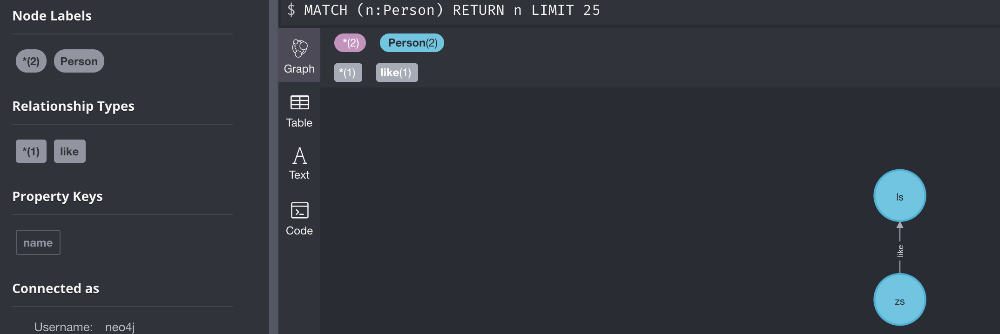
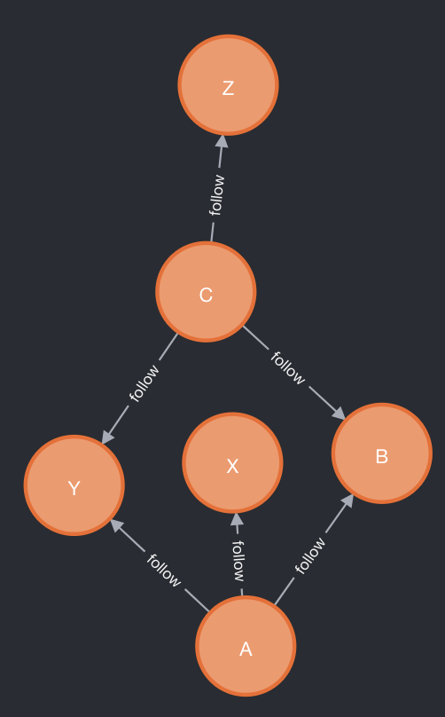
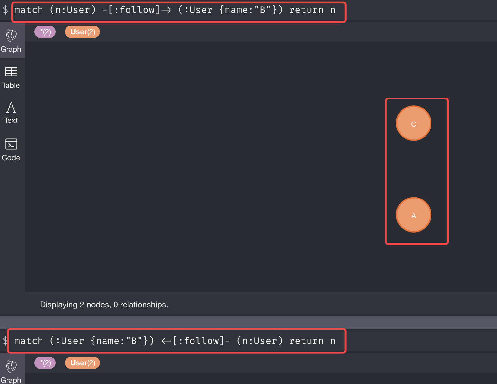
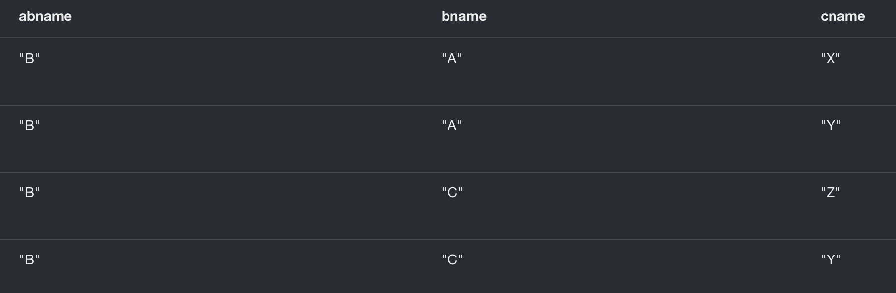

# 一、知识图谱

知识图谱：https://www.jiqizhixin.com/articles/2018-06-20-4

http://orientdb.com/docs/3.0.x/

https://www.jiqizhixin.com/articles/2018-06-20-4

https://github.com/husthuke/awesome-knowledge-graph

# 二、Neo4J

- [官方文档](https://neo4j.com/docs/cypher-manual/current/)

## 1、基本介绍

Neo4J是一个高性能的图数据库，其和普通的关系型数据库是不一样的，侧重于存储关系数据，比如针对各种明细之间错综复杂的关系，如果使用了mysql这种数据库存储，在查询所有人直接的关系的时候非常复杂，而使用Neo4J这种数据库，只需要一条命令即可

其是一个嵌入式的、基于磁盘的、具备完全的事务特性的持久化引擎，它将结构化数据存储在网络（从数学角度叫做图）上，而不是表中；

## 2、安装部署

neo4j支持在windows和linux中安装，以在linux上安装
- 从官网`https://neo4j.com`，下载文件：`[root@bigdata04 soft]# ll neo4j-community-3.5.21-unix.tar.gz `
- 解压缩文件：`[root@bigdata04 soft]# tar -zxvf neo4j-community-3.5.21-unix.tar.gz`
- 修改配置信息：
    ```
    [root@bigdata04 soft]# cd neo4j-community-3.5.21/conf
    [root@bigdata04 conf]# vi neo4j.conf
    ...
    dbms.connectors.default_listen_address=bigdata04  #  bigdata04表示当前主机名称
    dbms.connectors.default_advertised_address=bigdata04
    ...
    ```
- 启动：
    ```
    [root@bigdata04 ~]# cd /data/soft/neo4j-community-3.5.21
    [root@bigdata04 neo4j-community-3.5.21]# bin/neo4j start
    ```
- 访问界面：`http://bigdata04:7474`，用户名和密码都是：neo4j
- 停止：`[root@bigdata04 neo4j-community-3.5.21]# bin/neo4j stop`

## 3、快速入门

neo4j是一个图数据库，可以认为其存储的是图数据，图是由点（Vertex）、边（Edge）和属性（Property）组成的

neo4j的常见操作：
- 添加数据
- 查询数据
- 更新数据
- 建立索引
- 批量导入数据

### 3.1、添加数据

`create`：每次都创建新的点或边，比如创建一个点：
```
create (p1:Person {name:"zs"})
```
再创建一个点：
```
create (p2:Person {name:"ls"})
```
现在有两个点了，但这个两个点之间还没有关系，如果需要让这两者存在关系，则需要设置一个边，边也可以使用 create创建
```
create (p1:Person {name:"zs"}) -[:like]-> (p2:Person {name:"ls"})
```
上面命令执行完了，在界面就可以看到这个边了



> create每次都会创建新的节点或者关系

如果需要给已经存在的节点增加一个关系，可以使用merge命令，这个命令在创建节点之前都会先查询一下，如果存在，则不创建（merge命令就算是重复执行，也不会产生重复的结果），所以日常工作，建议使用merge
```
merge(p3:Person {name:"nick"})
merge(p4:Person {name:"tom"})
merge(p3) -[:like]->(p4)
执行结果：
Added 2 labels, created 2 nodes, set 2 properties, created 1 relationship, completed after 3 ms.
```
> 上面三个命令需要放在一个会话里面执行，否则merge里面无法识别p3和p4

除了merge外，针对已经存在的节点，如果只是需要创建关系，还可以通过match来实现。使用match可以查询之前已有的节点或者关系等信息，比如之前`nick like tom`，现在反过来
```
match(a:Person {name:"tom"}),(b:Person {name:"nick"})
merge(a) -[:like]-> (b)
执行结果：
Created 1 relationship, completed after 3 ms.
```

### 3.2、查询数据

前面提到match可以进行查询，需要注意的一点是match不能单独存在，比如前面在match后面跟了个merge，如果只是需要查询一些数据，可以使用 `match + return`，查看满足条件的数据并返回
```
match(p:Person {name:"tom"}) return p
```
上面是相对简单的数据查询，如果需要复杂的查询呢？初始化如下数据：
```
merge(a:User {name:"A"})
merge(b:User {name:"B"})
merge(c:User {name:"C"})
merge(x:User {name:"X"})
merge(y:User {name:"Y"})
merge(z:User {name:"Z"})
merge(a) -[:follow]-> (b)
merge(c) -[:follow]-> (b)
merge(a) -[:follow]-> (x)
merge(a) -[:follow]-> (y)
merge(c) -[:follow]-> (y)
merge(c) -[:follow]-> (z)
```
上面数据展示的图关系如下：



首先查询：某个主播的粉丝信息：
```
match (:User {name:"B"}) <-[:follow]- (n:User) return n
另外一种写法：
match (n:User) -[:follow]-> (:User {name:"B"}) return n
```
结果如下：



如果只是想返回某些粉丝的name，可以在后面跟上`.name`字段
```
match (n:User) -[:follow]-> (:User {name:"B"}) return n.name
// 执行结果如下
n.name
"A"
"C"
```
这里其实就是某个主播的二度关系：`我  -> 主播  -> 粉丝`，我 和 主播B 直接的粉丝关系属于二度关系

如果要实现三度关系，即当我关注某个主播的时候，要给我推荐这个主播的粉丝关注了哪些主播
```
match (a:User {name:"B"}) <-[:follow]- (b:User) -[:follow]-> (c:User) return a.name as abname,b.name as bname,c.name as cname
```
查询结果如下，从结果中可以看到，针对B粉丝，粉丝A和C都关注了XYZ这三个主播，其中A和C都关注了Y



如果需要做推荐的时候，是不是需要将关注最多的主播推荐，也就是Y，可以统计下cname中相同主播出现的次数，然后按照倒序排序，取一个topN即可。

match后面支持 count、order by、limit等命令
```
match (a:User {name:"B"}) <-[:follow]- (b:User) -[:follow]-> (c:User) return a.name as abname, c.name as cname, count(*) as sum order by sum desc limit 3
```
这相当于根据aname和cname进行分组，然后使用count统计每组的数据函数，这里的count(*) 和 count(cname)效果一样。

如果需要增加一些过滤条件，可以使用where，where放在return前面
```
match (a:User {name:"B"}) <-[:follow]- (b:User) -[:follow]-> (c:User) where c.name <> 'X' return a.name as abname, c.name as cname, count(*) as sum order by sum desc limit 3
```

### 3.3、更新数据

更新数据在neo4J中分为两种情况：
- 更新节点属性：使用`match + set`来实现
- 更新节点之间的关系（边），其实就是删除边，使用 `match + delete` 实现

修改节点属性
```
match (a:User {name:"X"}) set a.age=18
```
删除关系：
```
match (:User {name:"A"}) -[r:follow]->(:User {name:"X"}) delete r
```

### 3.4、建立索引

索引可以细分为两种：
- 普通索引：`create index on :User(name)`，指定某个节点的某个属性建立索引，是否需要建立索引依据在查询的时候是否需要在where根据这个属性进行过滤，如果需要则建立索引，如果不需要则不建立索引；
- 唯一约束：`create constraint on (u:User) assert u.id is unique`，唯一约束，类似mysql中唯一主键

如果某个字段的值是唯一的，并且也需要根据该字段进行过滤，那么对该字段可以建立唯一约束，因为唯一约束的查询性能比普通索引更快

### 3.5、批量导入数据

如果需要大批量数据导入，不能使用命令一条一条导入，性能太差，在neo4j中有两种方式：
- batch import：需要按照要求组装三个文件，导入性能比较快，但是比较麻烦
- load csv：只需要把数据组织到一个csv文件，导入性能没有batch import快，但是使用更方便

> 需要注意的是：在load csv中使用了merge或者match的时候，需要确认关键字段是否有索引，否则性能会很差

有文件follow.log，如下数据，fuid 表示关注着的uid，uid表示被关注者的uid，即主播
```
fuid	uid
1001	1000
1001	1004
1001	1005
1001	2001
1002	1000
1002	1004
1002	2001
1003	1000
1003	1004
1006	1000
1006	1005
2002	1004
2002	1005
2002	2004
2003	1000
2003	1005
2003	2004
```
将该文件上传到 NEO4J_HOME 的import目录下，使用neo4j的shell命令执行：
```bash
[root@bluefish neo4j-community-3.5.21]# bin/cypher-shell -a bolt://bluefish:7687 -u neo4j -p admin
Connected to Neo4j 3.5.21 at bolt://bluefish:7687 as user neo4j.
Type :help for a list of available commands or :exit to exit the shell.
Note that Cypher queries must end with a semicolon.
// 针对关键字段创建索引
neo4j> create constraint on (user:User) assert user.uid is unique;
0 rows available after 200 ms, consumed after another 0 ms
Added 1 constraints
```
批量导入数据：
```
neo4j> using periodic commit 1000 
        load csv with headers from 'file:///follower_demo.log' as line fieldterminator '\t'
        merge (viwer:User {uid: toString(line.fuid)})
        merge (anchor:User {uid: toString(line.uid)})
        merge (viwer) -[:follow]-> (anchor);
```
如果需要在web界面上执行，需要在最前面增加`:auto`命令
```
:auto using periodic commit 1000 
load csv with headers from 'file:///follower_demo.log' as line fieldterminator '\t'
merge (viwer:User {uid: toString(line.fuid)})
merge (anchor:User {uid: toString(line.uid)})
merge (viwer) -[:follow]-> (anchor);
```
- `periodic commit 1000`：表示每1000条提交一次，如果在数据量很大的情况下，内存无法同时加载很多数据，所以需要批量提交事务，减少任务失败的风险，并且可以提高导入的数据，可以设置合适的数量；
- `with headers`：是否使用列名，如果文件中有列名，可以加上这个参数，读取数据的时候会忽略第一行；
- `line fieldterminator '\t'`：指定文件中的字段分隔符

# 三、OrientDB
