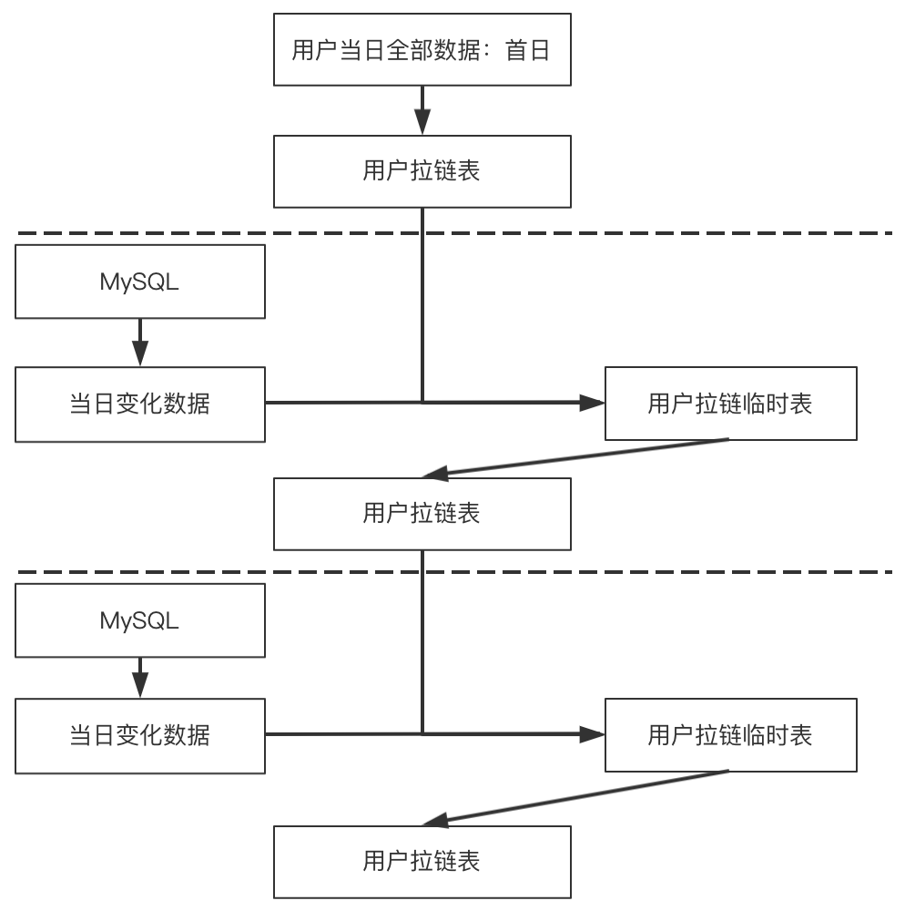

# 一、数仓分层

## 1、为什么要分层

首先数据仓库的分层：


数据仓库为什么要分层：
- 把复杂问题简单化：将复杂的任务分解成多层来完成，每一层只处理简单的任务，方便定位问题；
- 减少重复开发：规范数据分层，通过中间层数据，能够减少极大的重复计算，增加一次计算结果的复用性；
- 隔离原始数据：不论是数据的异常还是数据的敏感性，使真实数据与统计数据解耦；

## 2、数据集市与数据仓库

- 数据集市：是一种微型的数据仓库，更少的数据，一般是某个局部范围内的数据；
- 数据仓库：企业级，为整个企业提供决策手段

## 3、数仓命名规范

**表命名：**
- ODS层命名：`ods_tableName`
- DWD层命名：`dim_tableName/fact_tableName`
- DWS层命名：`dws_tableName`
- DWT层命名：`dwt_tableName`
- ADS层命名：`ads_tableName`
- 临时表命名：`xxx_tmp`
- 用户行为表，以log为后缀

**脚本命名：**
- 数据源_to_目标_db/log.sh
- 用户行为脚本以log为后缀，业务数据以db为后缀；

# 二、数仓理论

## 1、范式理论

范式可以立即为设计一张表的表结构，符合标准级别，即规范和要求

**优点：**降低数据的冗余性

**缺点：**获取数据时需要通过join拼接处最后的数据

目前主要范式：第一范式、第二范式、第三范式、巴斯-科德范式、第四范式、第五范式等

## 2、关系建模与维度建模

现阶段数据处理大致可以分为两类：联机事务处理（OLTP，On-line Transaction Processing）和联机分析处理（OLAP，On-line Analytical Processing）。OLTP是传统的关系型数据的主要应用，主要是基本的、日常的事务处理；OLAP是数据仓库的系统的主要应用，支持复杂的分析操作

### 2.1、关系建模


关系模型严格遵守第三范式，从上图中可以看出较为松散、零碎，物理表数量多，但数据冗余程度低。关系模型主要应用在OLTP系统中，为了保证数据的一致性以及避免冗余，大部分业务系统的表遵循三分是


维度模型如上图，主要应用在OLAP系统中，通常以某一个事实表作为中心进行表的组织，主要面向业务，特征可能是数据冗余。通常采用维度模型建模，把相关的表整理成两种：事实表和维度表

### 2.2、维度建模

在维度建模的基础上分为：星型模型、雪花模型、星座模型

#### 2.2.1、星型模型


星型模型是由事实表和多个维表组成；星型模型存取数据速度快，主要是针对各个维做了大量预处理，如按照维度进行预先的统计、分组合排序等，主要特点：

- 维表只和事实表关联，维表之间没有关联；
- 每个维表的主码为单列，且该主码放置在事实表中，作为两边连接的外码；
- 以事实表为核心，维表围绕核心呈星形分布；

#### 2.2.2、雪花模型


雪花模型是对星型模型的扩展，它将星型模型的维表进一步层次化，原来的各个维表可能被扩展为小的事实表，形成一些局部的层次区域；雪花模式通过更多的连接引入了更多的复杂性。随着存储变得越来越廉价，大多数情况，一般不采用`雪花模型`方法；雪花模型的有点是最大限度地减少数据存储量，以及把较小的维表联合在一起来改善查询性能。但是它增加了用户必须处理的表的数量，增加了某些查询的复杂性；

**雪花模型与星型模型主要区别：**在于维度的层级，标准的星型模型维度只有一层，而雪花模型可能会涉及多级

#### 2.2.3、星座模型


星座模型与前两种的区别是事实表的数量，星座模型是基于多个事实表。很多数据仓库都是有多个事实表的；星座模型与前两种模型并不冲突

#### 2.2.4、模型的选择

星座还是雪花，取决与性能优先还是灵活更优先，整体来看，倾向为维度更少的星型模型，尤其是hadoop体系，减少join就是减少shuffle；但是也不是绝对的

### 2.4、维度表与事实表

#### 2.3.1、维度表

维度表：一般是对事实的描述信息，每一张维表对应现实世界中的一个对象或者概念（可以认为是一个名词），例如用户、商品、日期、地区、类目等

维度表的特征：

- 维表的范围很宽，具有多个属性，列比较多；
- 跟事实表相比，行数相对较少；
- 内容相对固定

比如`昨天早上张三在京东花费200元购买了一个皮包`。那么以购买为主题进行分析，可从这段信息中提取三个维度：`时间维度(昨天早上)`，`地点维度(京东),` `商品维度(皮包)`。通常来说维度表信息比较固定，且数据量小

#### 2.3.2、事实表

事实表表示对分析主题的度量，表中的每一行数据代表一个业务事件（比如下单、退款、支付等）。事实这个术语表示的是业务事件的度量值（可统计的次数、个数、件数、金额等）

比如`昨天早上张三在京东花费200元购买了一个皮包`，200元就是事实信息。事实表包含了与各维度表相关联的外码，并通过JOIN方式与维度表关联。事实表的度量通常是数值类型，且记录数会不断增加，表规模迅速增长；

每个事实表的行包括：具有可加性的数值型的度量值、与维表相连接的外键、通常具有两个或两个以上的外键、外键之间表示维表之间的多对多的关系；

**事实表的特征：**

- 数据量非常的大；
- 内容相对的窄：列数较少（瘦高）
- 经常发生变化

**事实表分类：**

- 事务事实表：记录有关特定事件的事实（例如，销售事件，保存在原子的粒度，也称为原子事实表）一旦事务被提交，事实表数据被插入，数据不再进行更改；
- 周期快照事实表：记录给定时间点的事实（例如，月末的帐户详细信息、每月的销售额）
- 累积快照事实表：记录了给定时间点的汇总事实（例如，某产品的当月迄今总销售额），用于跟踪业务事实的变化，比如订单从下单开始、打包、运输、签收各个业务阶段的时间点数来跟踪订单生命周期

#### 2.3.3、拉链表

拉链表：记录每条信息的生命周期，一旦一条记录的生命周期结束，就重新开始一条新的记录，并把当前日期放入生效开始日期，如果当前信息至今有效，在生效结束日期填入一个极大值（如9999-99-99）

| 用户id | 姓名   | 手机号码    | 开始日期   | 结束日期   |
| ------ | ------ | ----------- | ---------- | ---------- |
| 1      | 张无忌 | 13111111111 | 2021-01-01 | 2021-01-02 |
| 1      | 张无忌 | 13222222222 | 2021-01-02 | 2021-01-03 |
| 1      | 张三丰 | 13333333333 | 2021-01-03 | 9999-99-99 |

- 开始日期：表示该条记录的生命周期开始时间，t_end_date 表示该条记录的生命周期结束时间；
- 结束日期（9999-99-99）：表示该条记录目前处于有效状态；
- 如果查询当前所有有效的记录，则 `select * from user where 结束日期 = '9999-99-99'`
- 通过`生效开始日期 <= 某个日期 且 生效结束日期 >= 某个日期`能够得到某个时间的数据全量切片，比如要查询2021-01-01的历史快照，则`select * from user where t_start_date <= ‘2021-01-01′ and end_date >= ‘2021-01-01’`；

**拉链表使用场景**：数据会发生变化，但是大部分数据都是不变的，即缓慢变化维；

比如用户信息会发生变化，但是每天变化的比例都不高，如果数据量达到一定规模，按照每日全量的方式保存效率很低，比如1亿用户*365天；

**拉链表形成过程：**
- （1）假设2021-01-01的用户全量表是初始的用户表：
    | user_id | user_name |
    | ------- | --------- |
    | 1       | 张三      |
    | 2       | 李四      |
    | 3       | 王五      |
- （2）初始的拉链表就等于最开始的2021-01-01的用户全量表
    | user_id | user_name | start_time     | end_time       |
    | ------- | --------- | -------------- | -------------- |
    | 1       | 张三      | **2021-01-01** | **9999-99-99** |
    | 2       | 李四      | **2021-01-01** | **9999-99-99** |
    | 3       | 王五      | **2021-01-01** | **9999-99-99** |
- （3）第二天1月2日用户全量表（用户2发生状态改变，用户4、5增加）
    | user_id | user_name |
    | ------- | --------- |
    | 1       | 张三      |
    | ***2*** | ***李小四*** |
    | 3       | 王五      |
    | **4**   | **赵六**  |
    | **5**   | **田七**  |
- （4）根据用户表的`创建时间和操作时间`得到`用户变化表`
    | user_id | user_name |
    | ------- | --------- |
    | ***2*** | ***李小四*** |
    | **4**   | **赵六**  |
    | **5**   | **田七**  |
- （5）用户变化表与之前的拉链表合并得到
    | user_id | user_name    | start_time       | end_time         |
    | ------- | ------------ | ---------------- | ---------------- |
    | 1       | 张三         | 2021-01-01       | 9999-99-99       |
    | ***2*** | ***李四***   | ***2021-01-01*** | ***2021-01-02*** |
    | ***2*** | ***李小四*** | ***2021-01-02*** | ***9999-99-99*** |
    | 3       | 王五         | 2021-01-01       | 9999-99-99       |
    | **4**   | **赵六**     | **2021-01-02**   | **9999-99-99**   |
    | **5**   | **前期**     | **2021-01-02**   | **9999-99-99**   |

**Hive拉链表制作流程：**

用户当日全部数据和mysql中每天变化的数据拼接在一起，形成一个新的临时拉链表数据，用户临时的拉链表覆盖就给的拉链表数据（可以解决Hive中表的数据不能更新的问题）



**拉链表开发**

（1）创建表格
```sql
-- 建表语句之用户维度拉链表
----------------------------------------------------------------
drop table if exists dwd_dim_user_info_his;
create external table dwd_dim_user_info_his(
    `id` string COMMENT '用户id',
    `name` string COMMENT '姓名',
    `birthday` string COMMENT '生日',
    `gender` string COMMENT '性别',
    `email` string COMMENT '邮箱',
    `user_level` string COMMENT '用户等级',
    `create_time` string COMMENT '创建时间',
    `operate_time` string COMMENT '操作时间',
    `start_date`  string COMMENT '生效开始日期',
    `end_date`  string COMMENT '生效结束日期'
) COMMENT '用户拉链表'
stored as parquet
location '/warehouse/gmall/dwd/dwd_dim_user_info_his/'
tblproperties ("parquet.compression"="lzo");
----------------------------------------------------------------
-- 建表语句之用户维度拉链临时表
----------------------------------------------------------------
drop table if exists dwd_dim_user_info_his_tmp;
create external table dwd_dim_user_info_his_tmp(
    `id` string COMMENT '用户id',
    `name` string COMMENT '姓名',
    `birthday` string COMMENT '生日',
    `gender` string COMMENT '性别',
    `email` string COMMENT '邮箱',
    `user_level` string COMMENT '用户等级',
    `create_time` string COMMENT '创建时间',
    `operate_time` string COMMENT '操作时间',
    `start_date`  string COMMENT '生效开始日期',
    `end_date`  string COMMENT '生效结束日期'
) COMMENT '用户拉链临时表'
stored as parquet
location '/warehouse/gmall/dwd/dwd_dim_user_info_his_tmp/'
tblproperties ("parquet.compression"="lzo");

```
（2）制作当日变动的数据（包括新增、修改）每日执行
- 如何获得每日变动表：
    - 最好表内有创建时间和变动时间（修改时间）；
    - 如果没有，可以利用第三方监控比如canal，监控mysql的实时变化记录（比较麻烦）
- 合并变动信息，再追加新增信息，插入到临时表中
```sql
-- 数据加载之初始化用户拉链表
----------------------------------------------------------------
insert overwrite table dwd_dim_user_info_his
select id, name, birthday, gender, email, user_level, create_time, operate_time, '2021-01-01', '9999-99-99' from ods_user_info oi
where oi.dt='2021-01-01';
----------------------------------------------------------------
-- 数据加载之用户拉链临时表
----------------------------------------------------------------
insert overwrite table dwd_dim_user_info_his_tmp
select * from
(
    selecti d, name, birthday, gender, email, user_level, create_time, operate_time, '2021-01-01' start_date, '9999-99-99' end_date
    from ods_user_info where dt='2021-01-01'
    union all
    select
        uh.id, uh.name, uh.birthday, uh.gender, uh.email, uh.user_level, uh.create_time, uh.operate_time, uh.start_date,
        if(ui.id is not null  and uh.end_date='9999-99-99', date_add(ui.dt,-1), uh.end_date) end_date
    from dwd_dim_user_info_his uh left join (select * from ods_user_info where dt='2021-01-01') ui on uh.id=ui.id
)his
order by his.id, start_date;
----------------------------------------------------------------
-- 数据加载之用户拉链表
----------------------------------------------------------------
insert overwrite table dwd_dim_user_info_his select * from dwd_dim_user_info_his_tmp;
```

### 2.4、数据仓库建模

#### 2.4.1、ODS层

比如针对HDFS层的数据处理：

- 保持数据原貌不做任何改动，起到备份数据的作用；
- 数据采用压缩，减少磁盘存储空间；
- 创建分区表，防止后续的全表扫描；

#### 2.4.2、DWD层

DWD层需要构建维度模型，一般采用星型模型，呈现的状态一般是星座模型；维度建模一般按照四个步骤：**选择业务过程 → 声明粒度 → 确认维度 → 确认事实**

**（1）选择业务过程**

在业务系统中，挑选感兴趣的业务线，比如下单业务、支付业务、退款业务等，一条业务线对应一张事实表；

**（2）声明粒度**

数据粒度是指数据仓库的数据中保存数据的细化程度或综合程度的级别；

声明粒度意味着精确定义事实表中的一行数据表示什么，应该进可能选择最小粒度，以此来满足各种需求；

典型的粒度：
- 订单的中的每个商品项作为下单事实表中的一行，粒度为每次；
- 每周的订单次数作为一行，粒度为每周；

**（3）确定维度**

维度的主要作用是描述业务的事实，主要表示的是`谁、何处、何时`等信息；

确定维度的原则：后续需求中是需要分析相关维度的指标；例如需要统计什么时间下的订单、哪个地区下的订单多、没哪个用户下的订单多。需要确定的维度就包括：时间维度、地区维度、用户维度等；

另外维度表需要根据维度建模中的星型模型原则进行维度退化，即将多张维度表合并为一张维度表；

**（4）确定事实**

事实指的是业务中的度量值（次数、个数、金额、件数）；在DWD层中，以业务过程为建模驱动，基于每个具体业务过程的特点，构建最细粒度的明细层事实表。事实表可以适当当做宽表处理

DWD层是以业务为驱动的，DWS层、DWT层、ADS层都是以需求为驱动的，跟维度建模已没有关系；

#### 2.4.3、DWS层

DWS宽表是站在不同维度的角度去看事实表的，比如按省份、用户、活动等

DWS层宽表包括：每日商品行为、每日会员行为等；

#### 2.4.4、DWT层

DWT层是统计各个主题对象的累积行为

- 需要建哪些表:和 DWS 层一样。以维度为基准，去关联对应多个事实表 

- 宽表里面的字段:我们站在维度表的角度去看事实表，重点关注事实表度量值的累积值、事实表行为的首次和末次时间

#### 2.4.5、ADS层

对各大主题指标分别进行分析

# 参考资料

- [数据仓库概述](https://www.cnblogs.com/muchen/p/5305658.html)
- [实时数仓](https://juejin.im/post/5d788ccfe51d45620346b948)
- [MySQL数据同步到数仓实践](https://tech.meituan.com/2018/12/06/binlog-dw.html)
- [数据模型设计](https://mp.weixin.qq.com/s/BbwDsvrcadD_xpY7Fqjm0Q)
- [Flink 的实时数仓建设实践](https://tech.meituan.com/2018/10/18/meishi-data-flink.html)
- [OLPD系统](https://www.cnblogs.com/importbigdata/p/11521403.html)
- [网易用户画像](https://www.infoq.cn/article/qy1oPJpeCFGmKPgtjOUb)
- [数仓建模](https://zhuanlan.zhihu.com/p/137454121)
- [ETL](https://zhuanlan.zhihu.com/p/137393710)
- [基于阿里云Dataworks建立数据中台](https://developer.aliyun.com/article/778172?spm=a2c6h.12873639.0.0.5445b743rdp1rz)