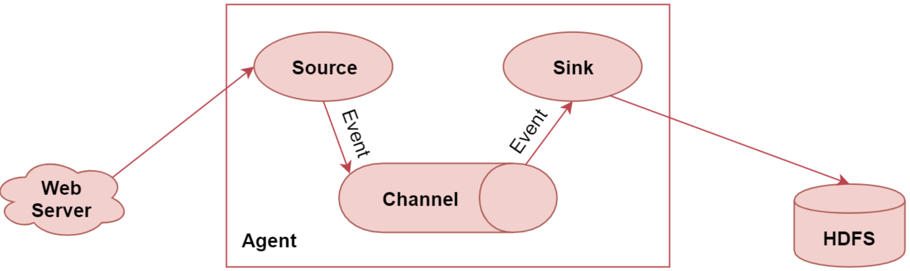
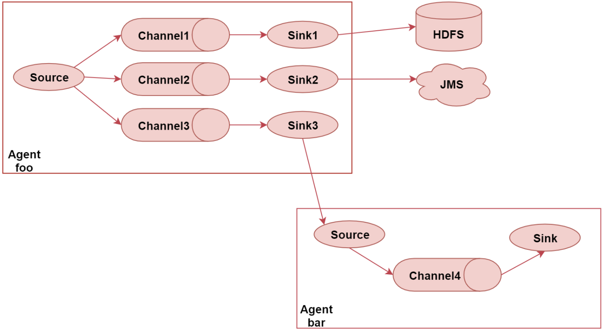
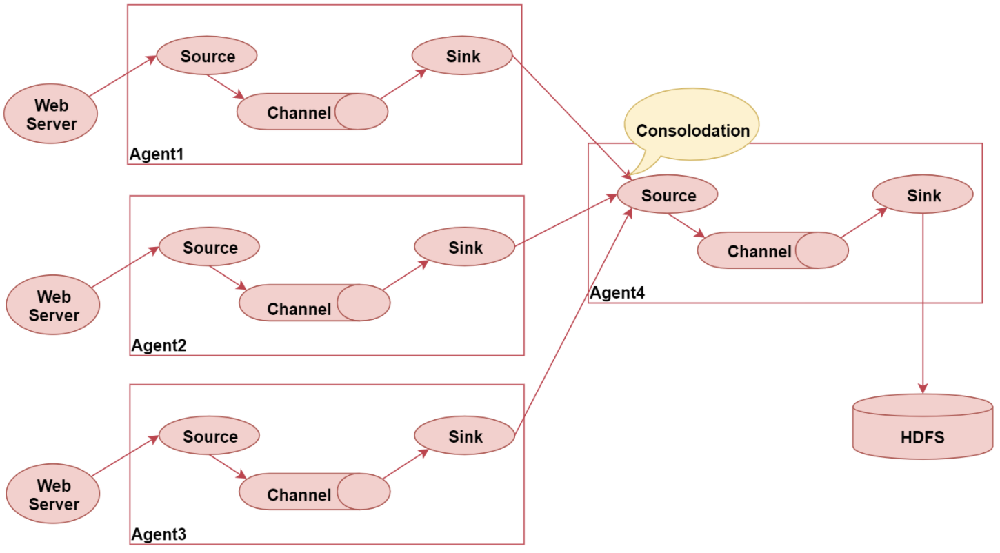
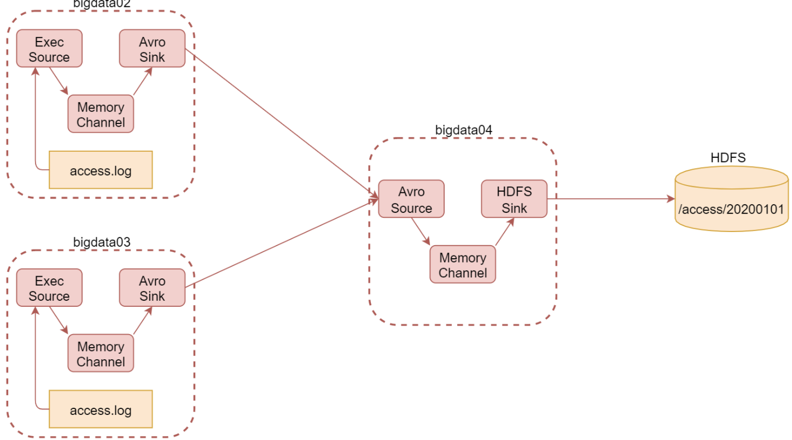

# 一、Flume

## 1、Flume概述

### 1.1、什么是Flume

Flume是一个高可用、高可靠、分布式的海量日志采集、聚合和传输的系统，能够有效的手机、聚合、移动大量的日志数据；

使用Flume采集数据大部分情况不需要编写代码，只需要在配置文件中配置相应的配置即可，下图为典型的Flume的应用场景



web server是web项目，其会产生日志数据，通过agent把日志数据采集到HDFS中；

### 1.2、Flume特性

- 有一个简单、灵活的基于流的数据结构，数据通过Source、Channle、Sink 三大组件进行流动；
- 具有负载均衡机制和故障转移机制；
- 有一个简单看扩展的数据模型，Source、Channle、Sink这几个组件可以灵活组合；

### 1.3、Flume三大核心组件

Flume有三大核心组㢟：
- Source：数据源
- Channel：临时存储数据的管道
- Sink：目的地

#### 1.3.1、Source

[数据源](http://flume.apache.org/releases/content/1.9.0/FlumeUserGuide.html#flume-sources)，通过source组件可以指定让Flume读取哪里的数据，然后将数据传递到后面的channel。Flume内置了很多种数据源，基于文件、基于目录、基于TCP/UDP端口、基于HTTP、Kafka，如果没有适合你的，也支持自定义source；

常用的source组件：
- Exec source：实现文件监控，可以实时的监控文件中新增的内容，类似于linux中的 tail -f 命令的效果；
- NetCat TCP/UDP Source：采集指定端口（tcp、udp）的数据，可以读取流经端口的每一行数据；
- Spolling Directory Source：采集文件夹中新增的文件；
- Kafka Source：从kafka消息队列中采集数据；

#### 1.3.2、Channel

[Channel](http://flume.apache.org/releases/content/1.9.0/FlumeUserGuide.html#flume-channels)，接受Source发出的数据，可以把channel理解为一个临时存储数据的管道；channel的类型有很多，内存、文件、内存+文件、jdbc等

- Memory Channel：使用内存作为数据的存储
    - 优点：效率高，不涉及到磁盘IO
    - 缺点：可能会丢失数据，如果flume的agent挂了，那么channel中的数据就丢失了；内存是有限的，会存在内存不够用的情况；
- File Channel：使用文件来作为数据的存储，是一个比较常用的channel；
    - 优点：数据不会丢失；
    - 缺点：效率相对内存来说会优点慢
- Spillable Memory Channel：使用内存和文件作为数据存储，即先把数据存到内存中，如果内存中数据达到阈值再Flush到文件中；
    - 优点：解决了内存不够用的问题；
    - 缺点：还是存在数据丢失的风险；

#### 1.3.3、Sink

[Sink](http://flume.apache.org/releases/content/1.9.0/FlumeUserGuide.html#flume-sinks)，从Channel中读取数据并存储到指定目的地，Sink的表现形式有很多种：打印到控制台、HDFS、Kafka

需要注意的一点是：Channel中的数据直到进入目的地才会被删除，当Sink写入目的地失败后，可以自动重写，不会造成数据丢失，其有一个事务保证

常用的Sink组件有：
- Logger Sink：将数据作为日志处理，可以选择打印到控制台或者写到文件中，主要是在测试的时候使用；
- HDFS Sink：将数据传输到HDFS中，这个比较常见，主要是针对离线场景；
- Kafka Sink：将数据发送到kafka消息队列中，主要针对实时计算场景，数据不落盘，实时传输，最后使用实时计算框架直接处理；

### 1.4、常见使用场景

#### 1.4.1、多agent连通



Flume中多个agent是可以连通的，只需要让前面的agent的sink组件把数据写到下一个agent的source组件即可

#### 1.4.2、Flume汇聚



将多个agent采集到的数据统一汇聚到一个agent，这种架构的弊端：
- 如果有很多个agent同时向agent4写入数据，那么agent4会出现性能瓶颈，导致数据处理过慢；
- 存在单点故障问题，如果agent4挂掉了，所有数据都断了；

可以通过flume的负载均衡和故障转移机制来解决问题；

## 2、Flume安装

[Flume环境安装](../辅助资料/环境配置/大数据环境.md#5Flume安装)

## 3、基本使用

### 3.1、入门案例

```conf
## example.conf: A single-node Flume configuration
## Name the components on this agent
a1.sources = r1
a1.sinks = k1
a1.channels = c1
## Describe/configure the source
a1.sources.r1.type = netcat
a1.sources.r1.bind = localhost
a1.sources.r1.port = 44444
## Describe the sink
a1.sinks.k1.type = logger
## Use a channel which buffers events in memory
a1.channels.c1.type = memory
a1.channels.c1.capacity = 1000
a1.channels.c1.transactionCapacity = 100
## Bind the source and sink to the channel
a1.sources.r1.channels = c1
a1.sinks.k1.channel = c1
```
上面是一个agent配置的例子，上首先定义了source、sink、channel的名字，然后分别配置了 source、sink、channel相关参数，最最后把三个组件连接起来，整体上配置Flume agent的流程：
- 给每个组件起名字；
- 配置每个组件的相关参数；
- 将各个组件连通

比如配置一个监听各个端口的数据，并将数据打印到控制台，在flume的conf目录下新增配置文件：example.conf
```conf
## a1 表示当前agent的名称，r1是source的名称，可以指定多个，还有空格分隔；k1表示sink的名称，也可以有多个；c1表示channel的名称，也可以有多个；
a1.sources = r1
a1.sinks = k1
a1.channels = c1
## Describe/configure the source
a1.sources.r1.type = netcat  #指定类型
a1.sources.r1.bind = localhost  ## 指定当前机器的ip，如果希望监听从任何ip发来的数据，可以指定为：0.0.0.0
a1.sources.r1.port = 44444 ## 指定端口
## Describe the sink
a1.sinks.k1.type = logger
## Use a channel which buffers events in memory
a1.channels.c1.type = memory  ## 指定channel类型是 memory
a1.channels.c1.capacity = 1000
a1.channels.c1.transactionCapacity = 100
## Bind the source and sink to the channel
a1.sources.r1.channels = c1
a1.sinks.k1.channel = c1
```
启动agent
```
bin/flume-ng agent --name a1 --conf conf --conf-file conf/example.conf -Dflume.root.logger=INFO,console
```
flume-ng命令后面跟agent，表示启动一个flume的agent代理
- `--name`：表示agent的名字，需要与配置文件中保持一致；
- `--conf`：表示flume配置文件的根目录
- `--conf-file`：指定agent对应的配置文件，包含source、channel、sink
- `-D`：动态添加一些参数，比如上面指定了flume的日志输出基本和输出位置；

除了上面的写法之外，还可以如下写：
```
bin/flume-ng agent -n $agent_name -c conf -f conf/flume-conf.properties.template

-n 表示  --name
-c 表示  --conf
-f 表示  --conf-file
```

### 3.2、采集文件内容到HDFS

需求：采集目录中已有的文件内容，存储到HDFS

分析：source是要基于目录的；channel可以使用file，保证不丢数据，sink可以使用hdfs

配置信息如下：file-to-hdfs.conf
```conf
## Name the components on this agent
a1.sources = r1
a1.sinks = k1
a1.channels = c1

## type = spooldir 表示监控一个目录；spoolDir 表示具体的目录地址
a1.sources.r1.type = spooldir
a1.sources.r1.spoolDir = /data/log/studentDir


## channel类型，使用的是file
a1.channels.c1.type = file
a1.channels.c1.checkpointDir = /data/soft/apache-flume-1.9.0-bin/data/studentDir/checkpoint  ## 存储检查点目录
a1.channels.c1.dataDirs = /data/soft/apache-flume-1.9.0-bin/data/studentDir/data  ## 存储数据的目录


## Describe the sink
a1.sinks.k1.type = hdfs   ## 指定sink的类型
a1.sinks.k1.hdfs.path = hdfs://192.168.182.100:9000/flume/studentDir   ## 指定hdfs上存储的目录
a1.sinks.k1.hdfs.filePrefix = stu-   ## 文件的前缀
a1.sinks.k1.hdfs.fileType = DataStream   ## 默认是sequenceFile，还支持DataStream 和 CompressedStream
a1.sinks.k1.hdfs.writeFormat = Text  ## 默认是writeable，text表示普通文本数据，如果需要支持hive或者impala可以使用这个
## 下面三个参数如果都有设置值的话，哪个条件先满足就按照哪个条件执行；实际工作中一般会根据时间或者大小来切分文件，时间一般设置为1小时，大小一般设置为128M
a1.sinks.k1.hdfs.rollInterval = 3600 ## 表示hdf多长时间切分一个文件，默认是30秒，因为采集是一直在进行的，如果设置为0表示不按时间切分文件
a1.sinks.k1.hdfs.rollSize = 134217728 ## 默认是1024，单位是字节，如果设置为0表示不按大小切分文件；
a1.sinks.k1.hdfs.rollCount = 0 ## 默认是10，表示每隔10条数据切分一个文件，如果设置为0表示不安数据条数切分文件

## Bind the source and sink to the channel
a1.sources.r1.channels = c1
a1.sinks.k1.channel = c1
```

### 3.3、采集日志文件上传到HDFS

假设有两台服务器A、B，需要将其产生的日志数据汇总到另外一台机器C上，大概结构：



两台应用服务器上分别按照下面配置创建配置文件，并启动
```conf
a2.sources = r1
a2.channels = c1
a2.sinks = k1

a2.sources.r1.type = exec
a2.sources.r1.command = tail -F /data/log/access/access.log

a2.channels.c1.type = memory
a2.channels.c1.capacity = 1000
a2.channels.c1.transactionCapacity = 100

a2.sinks.k1.type = avro
a2.sinks.k1.hostname = bluefish
a2.sinks.k1.port = 44445

a2.sources.r1.channels = c1
a2.sinks.k1.channel = c1
```
C服务器上配置如下：
```conf
a1.sources = r1
a1.channels = c1
a1.sinks = k1

a1.sources.r1.type = avro
a1.sources.r1.bind = 0.0.0.0
a1.sources.r1.port = 44445

a1.channels.c1.type = memory
a1.channels.c1.capacity = 1000
a1.channels.c1.transactionCapacity = 100

a1.sinks.k1.type = hdfs
a1.sinks.k1.hdfs.path = hdfs://bluefish:9000/flume/access/%Y%m%d
a1.sinks.k1.hdfs.filePrefix = access
a1.sinks.k1.hdfs.fileSuffix = log
a1.sinks.k1.hdfs.fileType = DataStream
a1.sinks.k1.hdfs.writeFormat = Text
a1.sinks.k1.hdfs.rollInterval = 3600
a1.sinks.k1.hdfs.rollSize = 134217728
a1.sinks.k1.hdfs.rollCount = 0
a1.sinks.k1.hdfs.useLocalTimeStamp = true

a1.sources.r1.channels = c1
a1.sinks.k1.channel = c1
```
先启动C服务器上的flume，然后再分别启动A、B服务器上的flume

## 4、高级组件

### 4.1、分类

Flume包含如下组件：
- Sourcer Interceptors：source可以指定一个或者多个拦截器按先后顺序依次对采集到的数据进行处理；
- Channel Selectors：source发往多个channel的策略设置，如果source后面接了多个channel，如何发往不同的channel由 Channel Selector来控制；
- Sink Processors：sink发送数据的策略设置，一个channel后面可以接多个sink，channel中的数据被哪个sink获取，由sink processors控制

### 4.2、Event

Event是Flume传输数据的基本单位，也是事务的基本单位，在文本文件中个，通常一行记录就是一个Event。Event中包含header 和 body：
- body：采集到的那一行记录的原始内容；
- header：类型为`Map<String, String>`，里面可以存储一些属性信息；可以再source中给每一条数据的header中增加 key-value，在channel和sink中使用header中的值

### 4.3、Sourcer Interceptors

#### 4.3.1、分类

系统内置了很多 Sourcer Interceptors，常见的有：Timestamp Interceptor、Host Interceptor、Search and Replace Interceptor、Static Interceptor、Regex Extractor Interceptor
- Timestamp Interceptor：向event中header里面添加 timestamp 时间戳信息；
- Host Interceptor：向Event的header中添加host属性，host的值为当前机器的主机名或者ip；
- Search and Replace Interceptor：根据指定的规则查询Event中body的数据，然后进行替换，这个拦截器会修改event中body的值，也就是会修改原始采集到的数据内容；
- Static Interceptor：向event中的header里面添加固定的key和value；
- Regex Extractor Interceptor：根据指定的规则从event中的body里面抽取数据，生成key和value，再把key和value添加到header中

#### 4.3.2、使用案例

原始数据：
```log
video_info
{"id":"14943445328940974601","uid":"840717325115457536","lat":"53.530598","lnt":"-2.5620373","hots":0,"title":"0","status":"1","topicId":"0","end_time":"1494344570","watch_num":0,"share_num":"1","replay_url":null,"replay_num":0,"start_time":"1494344544","timestamp":1494344571,"type":"video_info"}

user_info
{"uid":"861848974414839801","nickname":"mick","usign":"","sex":1,"birthday":"","face":"","big_face":"","email":"abc@qq.com","mobile":"","reg_type":"102","last_login_time":"1494344580","reg_time":"1494344580","last_update_time":"1494344580","status":"5","is_verified":"0","verified_info":"","is_seller":"0","level":1,"exp":0,"anchor_level":0,"anchor_exp":0,"os":"android","timestamp":1494344580,"type":"user_info"}

gift_record
{"send_id":"834688818270961664","good_id":"223","video_id":"14943443045138661356","gold":"10","timestamp":1494344574,"type":"gift_record"}
```
根据上述日志内容，需要将 video_info、user_info、gift_record 分别按照不同的类型采集到不同的目录
```conf
## agent的名称是a1
## 指定source组件、channel组件和Sink组件的名称
a1.sources = r1
a1.channels = c1
a1.sinks = k1

## 配置source组件
a1.sources.r1.type = exec
a1.sources.r1.command = tail -F /data/log/moreType.log

## 配置拦截器 [多个拦截器按照顺序依次执行]
a1.sources.r1.interceptors = i1 i2 i3 i4
a1.sources.r1.interceptors.i1.type = search_replace
a1.sources.r1.interceptors.i1.searchPattern = "type":"video_info"
a1.sources.r1.interceptors.i1.replaceString = "type":"videoInfo"

a1.sources.r1.interceptors.i2.type = search_replace
a1.sources.r1.interceptors.i2.searchPattern = "type":"user_info"
a1.sources.r1.interceptors.i2.replaceString = "type":"userInfo"

a1.sources.r1.interceptors.i3.type = search_replace
a1.sources.r1.interceptors.i3.searchPattern = "type":"gift_record"
a1.sources.r1.interceptors.i3.replaceString = "type":"giftRecord"

a1.sources.r1.interceptors.i4.type = regex_extractor
a1.sources.r1.interceptors.i4.regex = "type":"(\\w+)"
a1.sources.r1.interceptors.i4.serializers = s1
a1.sources.r1.interceptors.i4.serializers.s1.name = logType

## 配置channel组件
a1.channels.c1.type = file
a1.channels.c1.checkpointDir = /data/soft/apache-flume-1.9.0-bin/data/moreType/checkpoint
a1.channels.c1.dataDirs = /data/soft/apache-flume-1.9.0-bin/data/moreType/data

## 配置sink组件
a1.sinks.k1.type = hdfs
a1.sinks.k1.hdfs.path = hdfs://192.168.182.100:9000/moreType/%Y%m%d/%{logType}
a1.sinks.k1.hdfs.fileType = DataStream
a1.sinks.k1.hdfs.writeFormat = Text
a1.sinks.k1.hdfs.rollInterval = 3600
a1.sinks.k1.hdfs.rollSize = 134217728
a1.sinks.k1.hdfs.rollCount = 0
a1.sinks.k1.hdfs.useLocalTimeStamp = true

#增加文件前缀和后缀
a1.sinks.k1.hdfs.filePrefix = data
a1.sinks.k1.hdfs.fileSuffix = .log

## 把组件连接起来
a1.sources.r1.channels = c1
a1.sinks.k1.channel = c1
```

#### 4.3.3、总结

- Timestamp Interceptor、Host Interceptor、Static Interceptor、Regex Extractor Interceptor 是向event中的header里面添加key-value类型的数据，方便后面的channel和sink使用，对采集到的原始数据内容没有任何影响；
- Search and Replace Interceptor：会根据规则修改event中body里面的原始数据内容，对header没有任何影响，使用时需要特别注意；
- Search and Replace Interceptor、Regex Extractor Interceptor 日常工作使用较多

### 4.4、Channel Selectors

Channel Selectors 类型包括：Replicating Channel Selector 和 Multiplexing Channel Selector，其中 Replicating Channel Selector 是默认的channel选择器，它会将source采集过来的event发往所有channel

```conf
a1.sources = r1
a1.channels = c1 c2 c3
a1.sources.r1.selector.type = replicating
a1.sources.r1.channels = c1 c2 c3
a1.sources.r1.selector.optional = c3  ## 可选选型，可以不用配置
```
上述配置中，c3是可选的channel，对c3写入失败将被忽略，由于c1和c2未标记为可选，因此未能写入这些channel将导致事务失败。通俗的讲sourcer会将数据发往c1、c2、c3三个channel，可以保证c1、c2一定能够接受到所有的数据，但是c3无法保证；

#### 4.4.1、Multiplexing Channel Selector

其会根据Event中header里面的值将event发往不同的channel
```conf
a1.sources = r1
a1.channels = c1 c2 c3 c4
a1.sources.r1.selector.type = multiplexing
a1.sources.r1.selector.header = state
a1.sources.r1.selector.mapping.CZ = c1
a1.sources.r1.selector.mapping.US = c2 c3
a1.sources.r1.selector.default = c4
```
上面配置指定了4个channel：c1、c2、c3、c4，source采集到数据具体发往哪个channel，会根据event中header的里面的state属性的值，这个通过selector.header来控制：
- 如果state的属性值是CZ，则发送给c1；
- 如果state的属性值是US，则发送给c2、c3；
- 如果state属性值是其他值，则发送给c4

#### 4.4.2、案例：多channel之Replicating Channel Selector

将source采集到的数据重复发送给两个channel，每个channel接一个sink，将数据存储到不同的介质中

```conf
## agent的名称是a1
## 指定source组件、channel组件和Sink组件的名称
a1.sources = r1
a1.channels = c1 c2
a1.sinks = k1 k2

## 配置source组件
a1.sources.r1.type = netcat
a1.sources.r1.bind = 0.0.0.0
a1.sources.r1.port = 44444

## 配置channle选择器[默认就是replicating，所以可以省略]
a1.sources.r1.selector.type = replicating

## 配置channel组件
a1.channels.c1.type = memory
a1.channels.c1.capacity = 1000
a1.channels.c1.transactionCapacity = 100

a1.channels.c2.type = memory
a1.channels.c2.capacity = 1000
a1.channels.c2.transactionCapacity = 100

## 配置sink组件
a1.sinks.k1.type = logger

a1.sinks.k2.type = hdfs
a1.sinks.k2.hdfs.path = hdfs://192.168.182.100:9000/replicating
a1.sinks.k2.hdfs.fileType = DataStream
a1.sinks.k2.hdfs.writeFormat = Text
a1.sinks.k2.hdfs.rollInterval = 3600
a1.sinks.k2.hdfs.rollSize = 134217728
a1.sinks.k2.hdfs.rollCount = 0
a1.sinks.k2.hdfs.useLocalTimeStamp = true
a1.sinks.k2.hdfs.filePrefix = data
a1.sinks.k2.hdfs.fileSuffix = .log

## 把组件连接起来
a1.sources.r1.channels = c1 c2
a1.sinks.k1.channel = c1
a1.sinks.k2.channel = c2
```

#### 4.4.3、案例：多channel之Multiplexing Channel Selector

使用 Multiplexing Channel Selector，将source采集到的数据按照一定规则发送给两个channel，最终再把不同的数据存储到不同的介质中；
```conf
[root@bigdata04 conf]## vi tcp-to-multiplexingchannel.conf
## agent的名称是a1

## 指定source组件、channel组件和Sink组件的名称
a1.sources = r1
a1.channels = c1 c2
a1.sinks = k1 k2

## 配置source组件
a1.sources.r1.type = netcat
a1.sources.r1.bind = 0.0.0.0
a1.sources.r1.port = 44444

## 配置source拦截器
a1.sources.r1.interceptors = i1
a1.sources.r1.interceptors.i1.type = regex_extractor
a1.sources.r1.interceptors.i1.regex = "city":"(\\w+)"
a1.sources.r1.interceptors.i1.serializers = s1
a1.sources.r1.interceptors.i1.serializers.s1.name = city

## 配置channle选择器
a1.sources.r1.selector.type = multiplexing
a1.sources.r1.selector.header = city
a1.sources.r1.selector.mapping.bj = c1
a1.sources.r1.selector.default = c2

## 配置channel组件
a1.channels.c1.type = memory
a1.channels.c1.capacity = 1000
a1.channels.c1.transactionCapacity = 100

a1.channels.c2.type = memory
a1.channels.c2.capacity = 1000
a1.channels.c2.transactionCapacity = 100

## 配置sink组件
a1.sinks.k1.type = logger

a1.sinks.k2.type = hdfs
a1.sinks.k2.hdfs.path = hdfs://192.168.182.100:9000/multiplexing
a1.sinks.k2.hdfs.fileType = DataStream
a1.sinks.k2.hdfs.writeFormat = Text
a1.sinks.k2.hdfs.rollInterval = 3600
a1.sinks.k2.hdfs.rollSize = 134217728
a1.sinks.k2.hdfs.rollCount = 0
a1.sinks.k2.hdfs.useLocalTimeStamp = true
a1.sinks.k2.hdfs.filePrefix = data
a1.sinks.k2.hdfs.fileSuffix = .log

## 把组件连接起来
a1.sources.r1.channels = c1 c2
a1.sinks.k1.channel = c1
a1.sinks.k2.channel = c2
```

### 4.5、Sink Processors

Sinke Processors类型包含三种：Default Sink Processor、Load balancing Sink Processor 和 FailOver Sink Processor
- Default Sink Processor：默认的，不需要配置sink group，最普通的形式，一个channel后面跟一个sink的形式；
- Load balancing Sink Processor：是负载均衡处理器，一个channle 后面跟多个sink，这多个sink属于一个 sink group，根据指定的算法进行轮询或者随机发送，减轻单个sink的压力；
- Failover Sink Processor：故障转移处理器，一个channel后面跟多个sink，这多个sink属于一个 sink group，按照sink的优先级，默认让优先级高的sink来处理数据，如果sink出现了故障，则用优先级第的sink处理数据，可以保证数据不丢失；

对应配置
```conf
a1.sinkgroups = g1  ## 定义sink groups
a1.sinkgroups.g1.sinks = k1 k2 ## 定义多个sink，属于一个 sink group
a1.sinkgroups.g1.processor.type = load_balance ## 针对负载均衡的sink处理器
a1.sinkgroups.g1.processor.selector = random ## 内置支持两个：round_robin（轮询） 和 random（随机）
a1.sinkgroups.g1.processor.backoff = true ## 默认为false，这种为true，故障节点会加入黑名单，过一定时间才会再次发生数据，如果还失败，等待时间是指数级增长，一直达到最大的时间；如果不开启，故障的节点每次还会重试发生；
```

#### 4.5.1、负载均衡处理器案例

```conf
## agent的名称是a1
## 指定source组件、channel组件和Sink组件的名称
a1.sources = r1
a1.channels = c1
a1.sinks = k1

## 配置source组件
a1.sources.r1.type = avro
a1.sources.r1.bind = 0.0.0.0
a1.sources.r1.port = 41414

## 配置channel组件
a1.channels.c1.type = memory
a1.channels.c1.capacity = 1000
a1.channels.c1.transactionCapacity = 100

## 配置sink组件[为了区分两个sink组件生成的文件，修改filePrefix的值]
a1.sinks.k1.type = hdfs
a1.sinks.k1.hdfs.path = hdfs://192.168.182.100:9000/load_balance
a1.sinks.k1.hdfs.fileType = DataStream
a1.sinks.k1.hdfs.writeFormat = Text
a1.sinks.k1.hdfs.rollInterval = 3600
a1.sinks.k1.hdfs.rollSize = 134217728
a1.sinks.k1.hdfs.rollCount = 0
a1.sinks.k1.hdfs.useLocalTimeStamp = true
a1.sinks.k1.hdfs.filePrefix = data101
a1.sinks.k1.hdfs.fileSuffix = .log

## 把组件连接起来
a1.sources.r1.channels = c1
a1.sinks.k1.channel = c1
```

```conf
## agent的名称是a1
## 指定source组件、channel组件和Sink组件的名称
a1.sources = r1
a1.channels = c1
a1.sinks = k1 k2

## 配置source组件
a1.sources.r1.type = netcat
a1.sources.r1.bind = 0.0.0.0
a1.sources.r1.port = 44444

## 配置channel组件
a1.channels.c1.type = memory
a1.channels.c1.capacity = 1000
a1.channels.c1.transactionCapacity = 100

## 配置sink组件,[为了方便演示效果，把batch-size设置为1]
a1.sinks.k1.type=avro
a1.sinks.k1.hostname=192.168.182.101
a1.sinks.k1.port=41414
a1.sinks.k1.batch-size = 1

a1.sinks.k2.type=avro
a1.sinks.k2.hostname=192.168.182.102
a1.sinks.k2.port=41414
a1.sinks.k2.batch-size = 1

## 配置sink策略
a1.sinkgroups = g1
a1.sinkgroups.g1.sinks = k1 k2
a1.sinkgroups.g1.processor.type = load_balance
a1.sinkgroups.g1.processor.backoff = true
a1.sinkgroups.g1.processor.selector = round_robin

## 把组件连接起来
a1.sources.r1.channels = c1
a1.sinks.k1.channel = c1
a1.sinks.k2.channel = c1
```

#### 4.5.2、故障转移

```conf
[root@bigdata04 conf]## vi failover.conf
## agent的名称是a1
## 指定source组件、channel组件和Sink组件的名称
a1.sources = r1
a1.channels = c1
a1.sinks = k1 k2

## 配置source组件
a1.sources.r1.type = netcat
a1.sources.r1.bind = 0.0.0.0
a1.sources.r1.port = 44444
## 配置channel组件
a1.channels.c1.type = memory
a1.channels.c1.capacity = 1000
a1.channels.c1.transactionCapacity = 100

## 配置sink组件,[为了方便演示效果，把batch-size设置为1]
a1.sinks.k1.type = avro
a1.sinks.k1.hostname = 192.168.182.101
a1.sinks.k1.port = 41414
a1.sinks.k1.batch-size = 1

a1.sinks.k2.type = avro
a1.sinks.k2.hostname = 192.168.182.102
a1.sinks.k2.port = 41414
a1.sinks.k2.batch-size = 1

## 配置sink策略
a1.sinkgroups = g1
a1.sinkgroups.g1.sinks = k1 k2
a1.sinkgroups.g1.processor.type = failover
a1.sinkgroups.g1.processor.priority.k1 = 5
a1.sinkgroups.g1.processor.priority.k2 = 10
a1.sinkgroups.g1.processor.maxpenalty = 10000

## 把组件连接起来
a1.sources.r1.channels = c1
a1.sinks.k1.channel = c1
a1.sinks.k2.channel = c1
```

```conf
[root@bigdata02 conf]## vi failover-101.conf
## agent的名称是a1
## 指定source组件、channel组件和Sink组件的名称
a1.sources = r1
a1.channels = c1
a1.sinks = k1

## 配置source组件
a1.sources.r1.type = avro
a1.sources.r1.bind = 0.0.0.0
a1.sources.r1.port = 41414

## 配置channel组件
a1.channels.c1.type = memory
a1.channels.c1.capacity = 1000
a1.channels.c1.transactionCapacity = 100

## 配置sink组件[为了区分两个sink组件生成的文件，修改filePrefix的值]
a1.sinks.k1.type = hdfs
a1.sinks.k1.hdfs.path = hdfs://192.168.182.100:9000/failover
a1.sinks.k1.hdfs.fileType = DataStream
a1.sinks.k1.hdfs.writeFormat = Text
a1.sinks.k1.hdfs.rollInterval = 3600
a1.sinks.k1.hdfs.rollSize = 134217728
a1.sinks.k1.hdfs.rollCount = 0
a1.sinks.k1.hdfs.useLocalTimeStamp = true
a1.sinks.k1.hdfs.filePrefix = data101
a1.sinks.k1.hdfs.fileSuffix = .log

## 把组件连接起来
a1.sources.r1.channels = c1
a1.sinks.k1.channel = c1
```

## 5、自定义组件

- [开发文档](http://flume.apache.org/releases/content/1.9.0/FlumeDeveloperGuide.html)

### 5.1、自定义拦截器

自定义kafka-channel拦截器：
- 定义类实现 `org.apache.flume.interceptor.Interceptor`
- 重写4个方法：
    - 初始化
    - 单event处理
    - 多event处理
    - 关闭
- 在实现类中定义静态内部类实现 `org.apache.flume.interceptor.Interceptor.Builder`
    ```java
    public static class Builder implements  Interceptor.Builder{
        @Override
        public Interceptor build() {
            return new LogTypeInterceptor();
        }
        @Override
        public void configure(Context context) {
        }
    }
    ```
- 打包上传到`flume/lib`
- 在配置文件中配关联拦截器，全类名$builder：`com.blue.fish.flume.interceptor.LogETLInterceptor$Builder`

## 6、优化

- 调整 Flume 进程的内存大小，建议设置1G~2G，太小的话会导致频繁的GC；因为flume进程是基于java的；

    具体设置的大小需要根据agent读取的数据量的大小和速度有关系，需要具体情况具体分析，可以通过`jstat -gcutil <pid> 1000` 类判断gc

- 在一台服务器上启动多个agent的时候，建议修改配置区分日志文件。因为conf目录下的 log4j.properties 指定了日志文件的名称和位置，如果使用conf目录下的配置启动的agent产生的日志都会记录到同一个日志文件中，如果需要分析日志时，会很麻烦，因为所有日志都混在一起了，可以拷贝多个conf目录，然后修改拷贝后conf目录下的 log4j.properties 日志文件；在启动agent的时候分别通过-conf参数指定不同的conf目录；

- batchSize大小如何设置：Event 1K左右时，500-1000合适（默认为100）

## 7、Flume监控

## 6、Kafka

### Flume往kafka生产消息

Kafka-channel配置
```conf
#定义Agent必需的组件名称，同时指定本配置文件的Agent名称为a1
a1.sources=r1
a1.channels=c1 c2

#定义Source组件相关配置
#使用Taildir Source
a1.sources.r1.type = TAILDIR
#配置Taildir Source，保存断点位置文件的目录
a1.sources.r1.positionFile = /opt/module/flume/test/log_position.json
#配置监控目录组
a1.sources.r1.filegroups = f1
#配置目录组下的目录，可配置多个目录
a1.sources.r1.filegroups.f1 = /tmp/logs/app.+

#配置Source发送数据的目标Channel
a1.sources.r1.channels = c1 c2

#拦截器
#配置拦截器名称
a1.sources.r1.interceptors =  i1 i2
#配置拦截器名称，需要写明全类名
a1.sources.r1.interceptors.i1.type = com.blue.fish.flume.interceptor.LogETLInterceptor$Builder
a1.sources.r1.interceptors.i2.type = com.blue.fish.flume.interceptor.LogTypeInterceptor$Builder

#配置Channel选择器
#配置选择器类型
a1.sources.r1.selector.type = multiplexing
#配置选择器识别header中的key
a1.sources.r1.selector.header = topic
#配置不同的header信息，发往不同的Channel
a1.sources.r1.selector.mapping.topic_start = c1
a1.sources.r1.selector.mapping.topic_event = c2

## configure channel配置Channel
#配置Channel类型为Kafka Channel
a1.channels.c1.type = org.apache.flume.channel.kafka.KafkaChannel
#配置Kafka集群节点服务器列表
a1.channels.c1.kafka.bootstrap.servers = bluefish:9092
#配置该Channel发往Kafka的Topic，该Topic需要在Kafka中提前创建
a1.channels.c1.kafka.topic = topic_start
#配置不将header信息解析为event内容
a1.channels.c1.parseAsFlumeEvent = false
#配置该Kafka Channel所属的消费者组名，为实现multiplexing类型的Channel选择器，应将2个Kafka Channel配置相同的消费者组
a1.channels.c1.kafka.consumer.group.id = flume-consumer

#配置同上
a1.channels.c2.type = org.apache.flume.channel.kafka.KafkaChannel
a1.channels.c2.kafka.bootstrap.servers = bluefish:9092
a1.channels.c2.kafka.topic = topic_event
a1.channels.c2.parseAsFlumeEvent = false
a1.channels.c2.kafka.consumer.group.id = flume-consumer
```

自定义kafka-channel拦截器：
- 定义类实现 `org.apache.flume.interceptor.Interceptor`
- 重写4个方法：
    - 初始化
    - 单event处理
    - 多event处理
    - 关闭
- 在实现类中定义静态内部类实现 `org.apache.flume.interceptor.Interceptor.Builder`
    ```java
    public static class Builder implements  Interceptor.Builder{
        @Override
        public Interceptor build() {
            return new LogTypeInterceptor();
        }
        @Override
        public void configure(Context context) {
        }
    }
    ```
- 打包上传到`flume/lib`
- 在配置文件中配关联拦截器，全类名$builder：`com.blue.fish.flume.interceptor.LogETLInterceptor$Builder`

启动Flume：`nohup bin/flume-ng agent --name a1 --conf-file conf/file-flume-kafka.conf &`

--name 跟 file-flume-kafka.conf 配置的agent一样

### Flume从Kafka消费数据

flume从kafka消费数据并保存到 hdfs
```conf
### Flume Agent组件声明
a1.sources=r1 r2
a1.channels=c1 c2
a1.sinks=k1 k2

### Source1属性配置
#配置Source类型为Kafka Source
a1.sources.r1.type = org.apache.flume.source.kafka.KafkaSource
#配置Kafka Source每次从Kafka Topic中拉取的event个数
a1.sources.r1.batchSize = 5000
#配置拉取数据批次间隔为2000毫秒
a1.sources.r1.batchDurationMillis = 2000
#配置Kafka集群地址
a1.sources.r1.kafka.bootstrap.servers = localhost:9092
#配置Source 对接Kafka主题
a1.sources.r1.kafka.topics=topic_start

### source2属性配置，与Source1配置类似，只是消费主题不同
a1.sources.r2.type = org.apache.flume.source.kafka.KafkaSource
a1.sources.r2.batchSize = 5000
a1.sources.r2.batchDurationMillis = 2000
a1.sources.r2.kafka.bootstrap.servers = localhost:9092
a1.sources.r2.kafka.topics=topic_event

### Channel1属性配置
#配置Channel类型为File Channel
a1.channels.c1.type = file
#配置存储File Channel传输数据的断点信息目录
a1.channels.c1.checkpointDir = /opt/module/flume/checkpoint/behavior1
#配置File Channel传输数据的存储位置
a1.channels.c1.dataDirs = /opt/module/flume/data/behavior1/
#配置File Channel的最大存储容量
a1.channels.c1.maxFileSize = 2146435071
#配置File Channel最多存储event的个数
a1.channels.c1.capacity = 1000000
#配置Channel满时put事务的超时时间
a1.channels.c1.keep-alive = 6

### Channel2属性配置同Channel1，注意需要配置不同的目录路径
a1.channels.c2.type = file
a1.channels.c2.checkpointDir = /opt/module/flume/checkpoint/behavior2
a1.channels.c2.dataDirs = /opt/module/flume/data/behavior2/
a1.channels.c2.maxFileSize = 2146435071
a1.channels.c2.capacity = 1000000
a1.channels.c2.keep-alive = 6

### Sink1属性配置
#配置Sink1类型为HDFS Sink
a1.sinks.k1.type = hdfs
#配置发到HDFS的存储路径
a1.sinks.k1.hdfs.path = /origin_data/gmall/log/topic_start/%Y-%m-%d
#配置HDFS落盘文件的文件名前缀
a1.sinks.k1.hdfs.filePrefix = logstart-

##Sink2 属性配置同Sink1
a1.sinks.k2.type = hdfs
a1.sinks.k2.hdfs.path = /origin_data/gmall/log/topic_event/%Y-%m-%d
a1.sinks.k2.hdfs.filePrefix = logevent-

### 避免产生大量小文件的相关属性配置
a1.sinks.k1.hdfs.rollInterval = 10
a1.sinks.k1.hdfs.rollSize = 134217728
a1.sinks.k1.hdfs.rollCount = 0

a1.sinks.k2.hdfs.rollInterval = 10
a1.sinks.k2.hdfs.rollSize = 134217728
a1.sinks.k2.hdfs.rollCount = 0

### 控制输出文件是压缩文件
a1.sinks.k1.hdfs.fileType = CompressedStream
a1.sinks.k2.hdfs.fileType = CompressedStream

a1.sinks.k1.hdfs.codeC = lzop
a1.sinks.k2.hdfs.codeC = lzop

### 拼装
a1.sources.r1.channels = c1
a1.sinks.k1.channel= c1

a1.sources.r2.channels = c2
a1.sinks.k2.channel= c2
```

nohup bin/flume-ng agent --name a1 --conf-file conf/kafka-flume-hdfs.conf --name a1 -Dflume.root.logger=INFO,LOGFILE >/opt/module/flume/log.txt   2>&1 &

# 二、Sqoop

## 1、概述

Sqoop是一款开源的工具，主要用于在Hadoop(Hive)与传统的数据库(mysql、postgresql...)间进行数据的传递，可以将一个关系型数据库（例如 ： MySQL ,Oracle ,Postgres等）中的数据导进到Hadoop的HDFS中，也可以将HDFS的数据导进到关系型数据库中；

Sqoop2的最新版本是1.99.7。请注意，2与1不兼容，且特征不完整，它并不打算用于生产部署

## 2、基本原理

将导入或导出命令翻译成mapreduce程序来实现，在翻译出的mapreduce中主要是对inputformat和outputformat进行定制；

## 3、安装

- 下载并解压；
- 修改配置文件：sqoop-env.sh
- 配置相应的配置
    ```
    export HADOOP_COMMON_HOME=/opt/module/hadoop-2.7.2
    export HADOOP_MAPRED_HOME=/opt/module/hadoop-2.7.2
    export HIVE_HOME=/opt/module/hive
    export ZOOKEEPER_HOME=/opt/module/zookeeper-3.4.10
    export ZOOCFGDIR=/opt/module/zookeeper-3.4.10
    ```
- 拷贝mysql的驱动到lib目录下
- 测试sqoop连接数据库是否正常：`./sqoop list-databases --connect jdbc:mysql://localhost:3306/ --username root --password root`

## 4、导入数据

在Sqoop中，“导入”概念指：从非大数据集群（RDBMS）向大数据集群（HDFS，HIVE，HBASE）中传输数据，叫做：导入，即使用import关键字

### 4.1、mysql导入到hdfs

假设mysql中有如下数据：
```
$ mysql -uroot -proot
mysql> create database company;
mysql> create table company.staff(id int(4) primary key not null auto_increment, name varchar(255), sex varchar(255));
mysql> insert into company.staff(name, sex) values('Thomas', 'Male');
mysql> insert into company.staff(name, sex) values('Catalina', 'FeMale');
```

**全量导入：**
```sh
$ bin/sqoop import \
--connect jdbc:mysql://localhost:3306/company \
--username root \
--password root \
--table staff \
--target-dir /user/company \
--delete-target-dir \
--num-mappers 1 \
--fields-terminated-by "\t"
```

**查询导入**
```sh
$ bin/sqoop import \
--connect jdbc:mysql://localhost:3306/company \
--username root \
--password root \
--target-dir /user/company \
--delete-target-dir \
--num-mappers 1 \
--fields-terminated-by "\t" \
--query 'select name,sex from staff where id <=1 and $CONDITIONS;'
```
> 必须将 '$CONDITIONS' 放在 where子句中；如果query后使用的是双引号，则$CONDITIONS前必须加转移符，防止shell识别为自己的变量

**导入指定的列**
```sh
$ bin/sqoop import \
--connect jdbc:mysql://localhost:3306/company \
--username root \
--password root \
--target-dir /user/company \
--delete-target-dir \
--num-mappers 1 \
--fields-terminated-by "\t" \
--columns id,sex \
--table staff
```
> columns中如果涉及到多列，用逗号分隔，分隔时不要添加空格

**使用sqoop关键字筛选查询导入数据**
```sh
$ bin/sqoop import \
--connect jdbc:mysql://localhost:3306/company \
--username root \
--password root \
--target-dir /user/company \
--delete-target-dir \
--num-mappers 1 \
--fields-terminated-by "\t" \
--table staff \
--where "id=1"
```

### 4.2、mysql导入到Hive

```
$ bin/sqoop import \
--connect jdbc:mysql://localhost:3306/company \
--username root \
--password root \
--table staff \
--num-mappers 1 \
--hive-import \
--fields-terminated-by "\t" \
--hive-overwrite \
--hive-table staff_hive

$ bin/sqoop import \
--connect jdbc:mysql://172.18.0.12:3306/i_order \
--username root \
--password root \
--table t_order_commodity \
--num-mappers 1 \
--hive-import \
--fields-terminated-by "\t" \
--hive-overwrite \
--hive-database i_order \
--hive-table t_order_commodity
```
> 该过程分为两步，第一步将数据导入到HDFS，第二步将导入到HDFS的数据迁移到Hive仓库，第一步默认的临时目录是/user/atguigu/表名

## 5、导出数据

在Sqoop中，“导出”概念指：从大数据集群（HDFS，HIVE，HBASE）向非大数据集群（RDBMS）中传输数据，叫做：导出，即使用export关键字

### 5.1、Hive/HDFS导出到Mysql

```
$ bin/sqoop export \
--connect jdbc:mysql://localhost:3306/company \
--username root \
--password root \
--table staff \
--num-mappers 1 \
--export-dir /user/hive/warehouse/staff_hive \
--input-fields-terminated-by "\t"
```
> Mysql中如果表不存在，不会自动创建；导出的时候可以实现插入和更新功能，但是表中必须有个主键，对应的脚本如下

```
sqoop export \
--connect jdbc:mysql://192.168.182.1:3306/imooc?serverTimezone=UTC \
--username root \
--password admin \
--table user2 \
--export-dir /out2 \
--input-fields-terminated-by '\t' \
--update-key id \
--update-mode allowinsert
```
> update-key  指定更新的主键