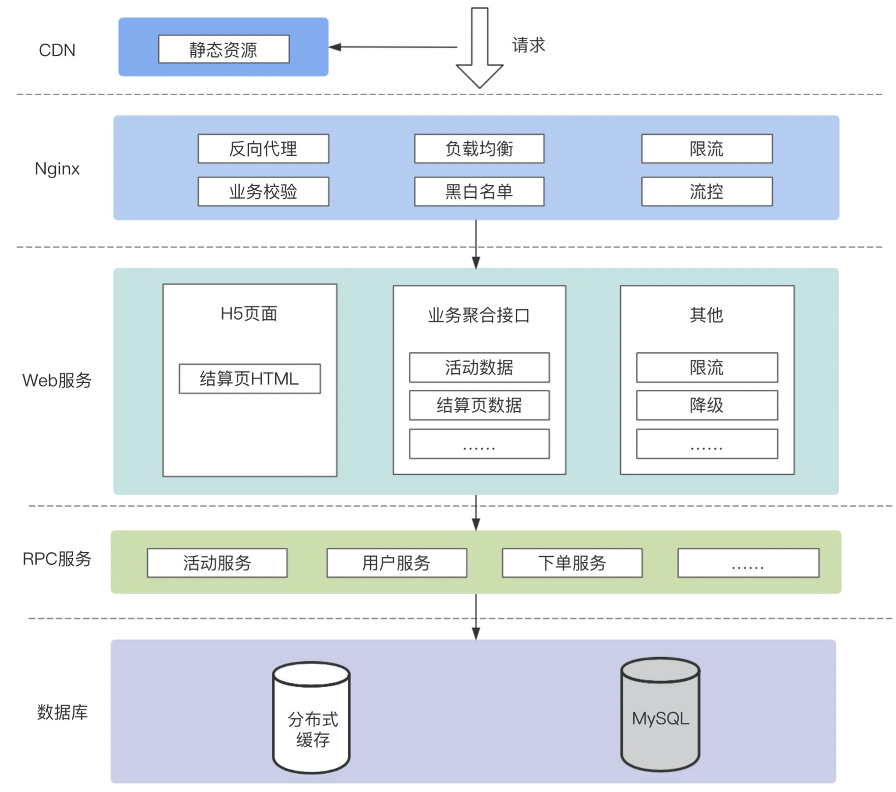

# 一、秒杀系统

- [秒杀](https://segmentfault.com/a/1190000020970562)
- [一个极简、高效的秒杀系统](https://blog.csdn.net/caiguoxiong0101/article/details/104866073)
- [有赞-延迟队列](https://tech.youzan.com/queuing_delay/)
- [实现延迟队列](https://mp.weixin.qq.com/s/eDMV25YqCPYjxQG-dvqSqQ)
- [SpringBoot与RabbitMQ实现延迟消息](https://juejin.im/entry/5aea9c58f265da0b851cb0c7)
- [MQ中实现延迟消息](https://www.cnblogs.com/hzmark/p/mq-delay-msg.html)
- [延时任务之Redis篇](https://mp.weixin.qq.com/s/dw1eCSh49vQDwPzvu5omCg)
- [分库分表最佳实践](https://mp.weixin.qq.com/s?__biz=MzU5ODUwNzY1Nw==&mid=2247484012&idx=1&sn=be574cb31f0c0a36034f4635294e55d0)


## 1、概述

### 1.1、术语

- 热点隔离：秒杀系统设计的第一个原则就是将这种热点数据隔离出来，不要让1%的请求影响到另外的99%，隔离出来后也更方便对这1%的请求做针对性优化；
- 业务隔离：把秒杀做成一种营销活动，卖家要参加秒杀这种营销活动需要单独报名，从技术上来说，卖家报名后对我们来说就是已知热点，当真正开始时我们可以提前做好预热；
- 系统隔离：系统隔离更多是运行时的隔离，可以通过分组部署的方式和另外99%分开。秒杀还申请了单独的域名，目的也是让请求落到不同的集群中；
- 数据隔离： 秒杀所调用的数据大部分都是热数据，比如会启用单独cache集群或MySQL数据库来放热点数据，目前也是不想0.01%的数据影响另外99.99%；

### 1.2、秒杀需要考虑的点

- 秒杀活动的业务特点；
- 秒杀系统的请求链路；
- 了解秒杀的系统瓶颈；

### 1.3、秒杀怎么玩

通常的业务场景：
- 平台商家会拿出稀缺商品，事先在秒杀的运营系统中设置好活动的开始、结束时间，以及投入的库存（简单的玩法，只要这几个主要元素即可）；
- 在活动开始之后，用户可以通过活动抢购入口（一个商品详情页，或是一个广告链接），进入到活动的结算页，然后点击下单，完成商品的抢购操作；

上面这个流程通用性很强，可以适配大部分平台，当然还有一些可以改进的点：
- 如果对流量有预期，可以加上预约功能，即在活动开始前，先开放一段时间的预约，让用户先去进行预约，然后才能获得参加抢购活动的资格；
- 如果面对的业务场景复杂些，你还可以联合风控，在参加活动时校验用户资质，踢掉黄牛以及有过不良行为的人，尽量将资源给到优质用户；
- 当然也可以搭配限购开展活动，控制个人维度下一段时间内的购买数，让抢购成功的快乐触达更多的人；

通用流程如下：


### 1.4、秒杀通用业务架构



## 2、秒杀的两个问题

- 并发读：并发读的核心优化理念是尽量减少用户到服务端来读取数据，或者读更少的数据；
- 并发写：要求在数据库层面独立出来一个库，做特殊处理；

还需要针对秒杀系统做一些保护，针对意料之外的情况设计兜底方案，以防止最坏的情况发生；

## 3、设计原则

秒杀系统的本质就是：一个满足大并发、高性能和高可用的分布式系统

架构原则总结为“4要1不要”

- 数据尽量要少
    - 首先是指用户请求的数据能少就少。因为这些数据在网络上传输需要时间，其次不管是请求数据还是返回数据都需要服务器做处理，而服务器在写网络时通常都要做压缩和字符编码；
    - 其实是还要求系统以来的数据能少就少，包括系统完成某些业务逻辑需要读取和保存的数据。而且数据库本身也容易成为一个瓶颈；

- 请求数要尽量少
    
    用户请求的页面返回后，浏览器渲染这个页面还要包含其他的额外请求，比如依赖的Css/JavaScript、图片，以及ajax请求等，这些额外的请求应该尽量少；

    减少请求数最常用的一个实践是合并css和JavaScript文件；这种方式在服务端仍然是单个文件各自存储，只是服务端会有一个组件解析这个URL，然后动态把这些文件合并在一起返回；

- 路径要尽量短

    “路径”，就是用户发出请求到返回数据这个过程中，需求经过的中间的节点数；通常这些节点可以表示为一个系统或者一个新的Socket连接。每经过一个节点，一般都会产生一个新的Socket连接；

    缩短请求路径不仅可以增加可用性，同样可以有效提升性能，并减少延时；要缩短访问路径有一种办法，就是多个相互强依赖的应用合并部署在一起，把远程过程调用变成JVM内部之间的方法调用；

- 依赖尽量少

    所谓依赖指的是要完成一次用户请求必须依赖的系统或者服务，这里的依赖指的是强依赖；

    要减少依赖，可以给系统进行分级，比如0级系统、1级系统、2级系统、3级系统，0级系统如果是最重要的系统，那么0级系统强依赖的系统也同样是最重要的系统；

- 不要有单点：应用无状态化

## 4、秒杀实现关键技术

### 4.1、动静分离

所谓动静分离其实是把用户请求的数据划分为`动态数据`和`静态数据`；简而言之，`动态数据`和`静态数据`的主要区别就是看页面中输出的数据是否和URL、浏览者、时间、地域相关，以及是否包含有cookie等私密数据；主要一点是数据中是否含有和访问者相关的个性化数据

- 静态数据缓存
    - 将静态数据缓存到离用户最近的地方；常见的有浏览器、CDN、服务端的cache中；
    - 静态化改造就是要直接缓存HTTP连接

- 全页面静态化：在服务端完成html、css甚至js的渲染成纯hmtl文件部署到CDN上；

    借助phantomjs实现，借助其模拟webkit，采用initView 和hasInit 方式防止多次初始化，编写对应轮询生成的内容方式，将全静态化页面生成后推送到CDN

    考虑将商品模型拆分更新的粒度：对于价格、库存实时性要求高的每次都到服务端拿最新的值；对于sku中其他的属性取CDN内容就行，如果这些实时性要求不高的属性变化了，上游系统发给我们属性变更的消息，我们拿到这个消息出发脚本重新执行一遍无头js，然后把生成的html文件再推倒CDN；

    全页面静态化技术如何保证及时下架：商品变动或下架后，由后端系统触发异步消息给某一个服务，这个服务负责调用爬虫重新生成最新的页面后推送给cdn服务，这些都是需要api对接的

### 4.2、热点数据

- 热点操作：大量的刷新页面、大量的添加购物车、双十一零点下单；这些操作可以抽象为读请求、写请求；读请求的优化空间大些，写请求的瓶颈在存储层；
- 热点数据：
    - 静态热点数据：能够提前预测的热点数据，根据大数据分析的历史成交记录、用户的购物记录等，还可以由卖家报名方式提前筛选出来
    - 动态热点数据：不能被提前预测的数据

处理热点数据的思路：一是优化、二是限制、三是隔离

- 优化：最有效的办法是缓存热点数据，如果热点数据做了动静分离，那么可以长期缓存数；
- 限制：保护机制，例如对被访问的商品做一致性hash，然后根据hash做分桶，每个分桶设置一个处理队列，可以把热点商品限制在一个请求队列中；
- 隔离：秒杀系统的第一原则就是将热点数据隔离出来；
     - 业务隔离：可以把秒杀做成营销活动，卖家要参加秒杀需要单独报名，可以做好提前预热；
     - 系统隔离：更多的是运行时隔离，可以通过分组部署的方式另外的分开；秒杀可以申请单独的域名，让请求落到不同的集群中；
     - 数据隔离：秒杀系统所用的数据大部分是热点数据，可以启用单独的cache或者mysql数据库来放热点数据；

- 基于时间分片削峰：增加秒杀答题，既可以防止秒杀器也可以把峰值的下单请求给拉长了，从以前的1s之内延长到2~10s左右，请求峰值基于时间分片了，这个时间的分片对服务端处理并发非常重要；
- 数据分层校验：所谓分层校验就是对大量的请求做成“漏斗”式设计，在不同层次尽可能把无效的请求过滤，“漏斗”的最末端才是有效的请求，要达到这个效果必须对数据做分层的校验，把大量静态不需要检验的数据放在离用户最近的地方；
- 实时热点发现：

### 4.3、流量削峰

可以Nginx前置用来做 Web 网关，承担部分业务逻辑校验，并且增加黑白名单、限流和流控的功能；

#### 4.3.1、为什么要削峰

服务器的处理资源是恒定的，出现峰值的情况下，很容易导致服务器崩溃。削峰的存在：
- 可以让服务端处理变的更加平稳；
- 节省服务器的资源成本

#### 4.3.2、排队

**如何排队**

使用消息队列来缓冲瞬时流量，把同步的直接调用转换成异步的间接推送。

除了消息队列外，还有一些其他的排队方式：
- 利用线程池加锁等待；
- 先进先出、先进后出等常用的内存排队算法；
- 把请求序列化到文件中，然后在顺序的读文件来恢复请求，类似mysql的binlog同步机制；

**如何泄洪**

#### 4.3.3、秒杀令牌

- 秒杀接口需要依靠令牌才能进入；
- 秒杀令牌由秒杀模块负责生产；
- 秒杀用户需要获得令牌才可以进入；

秒杀大闸：
- 依靠秒杀令牌的授权原理定制发牌逻辑；做到大闸功能

#### 4.3.4、答题

主要是为了增加购买的复杂度，从而达到两个目的：
- 防止部分买家使用秒杀器参加秒杀时作弊；
- 延缓请求，起到对请求流量进行削峰的作用。其主要是把峰值的下单请求拉长。

秒杀答题的设计思路：


整个秒杀答题逻辑主要分为三个部分：
- 题库生成模块
- 题库的推送模块
- 题库的图片生成模块

#### 4.3.5、分层过滤

分层过滤就是采用漏斗式设计来处理请求。分层过滤的核心思想是：在不同的层次尽可能地过滤无效请求，让“漏斗”最末端的才是有效的请求。

分层校验的基本原则：
- 将动态请求的数据缓存在web端，过滤到无效的数据读；
- 对读数据不做强一致性校验，减少因为一致性校验产生的瓶颈的问题；
- 对写数据进行基于时间的合理分片，过滤掉过期的失效请求；
- 对写数据做限流包含，将超出系统承载能力的请求过滤掉；
- 对写数据进行强一致性校验，只保留最后有效的数据

### 4.4、限流

- 限制并发：限制TPS、QPS

### 4.5、查询缓存优化

#### 4.5.1、多级缓存

## 5、优化系统

- 减少编码
- 减少序列化
- Java极致优化：使用原生的servlet处理请求，不要使用传统的MVC框架，可以绕过一堆复杂且用处不大的处理逻辑；直接输出流数据
- 并发读优化

## 6、交易性能优化

### 6.1、交易验证优化

- 用户风控策略优化：策略缓存模型化；
- 活动校验策略优化：引入活动发布流程，模型缓存化，紧急下线能力；

### 6.2、库存扣减优化

- 扣减库存缓存化
- 异步同步数据库
- 库存数据库最终一致性保证

## 7、减库存

减库存的压力：
- 不希望每次减存操作都写DB；
- 不希望每次读取库存都通过DB；

### 7.1、减库存的方式

- 下单减库存：即当买家下单后，在商品的总库存中减去买家购买数量；是最简单的方式，也是控制最精确的方式，这样的情况下一定不会超卖；但是存在用户下单未付款单的情况；
- 付款减库存：即卖家下单后，并不立即减库存，而是等到用户付款后才真正减库存，否则库存一直保留给其他买家；因为付款才减库存，如果并发比较高，有可能出现买家下单后付不了款的情况；
- 预扣库存：买家下单后，库存为其保留一定的时间（如 10 分钟），超过这个时间，库存会自动释放，释放后其他买家可以继续购买；买家付款前，会去校验该订单的库存是否有保留，如果没有保留则再次尝试预扣；如果库存不足，则不允许继续付款；

### 7.2、减库存可能存在的问题

- 如果采用下单减库存的方式，即用户下单后就去减库存，正常情况下，买家下单后付款的概率很高；有一种场景例外，如果有竞争对手恶意下单将卖家的商品全部下单，让这款的商品库存减为零，那这款商品就不能正常售卖了，因为恶意下的单是不会付款的；这是下单减库存的不足之处；
- 付款减库存可能存在超卖的情况：因为下单不会减库存，所以可能会出现下单成功数远远超过真正库存数的情况；会导致很多用户下单成功但是付不了款，买家的购物体验很差；
- 预扣库存：如果把有效的付款时间设置为10分钟，但是恶意买家完全可以10分钟后再次下单，又会减完库存；针对这种情况，解决办法还是结合安全和反作弊的措施来防止；
- 给经常下单不付款的买家进行识别打标（可以在被打标的买家下单时不减库存）

### 7.3、超卖问题

- 在数据表上设置乐观锁字段；
- 利用Redis防止超售；
- 通过数据库update语句计算库存，通过update行锁解决并发问题

### 7.4、库存流水

库存操作需要有相关的记录，即每次对库存操作都要有日志记录；

### 7.5、Redis实现扣减库存

将库存放到缓存，利用redis的incrby特性来扣减库存，解决了超扣和性能问题。但是一旦缓存丢失需要考虑恢复方案。比如抽奖系统扣奖品库存的时候，初始库存=总的库存数-已经发放的奖励数，但是如果是异步发奖，需要等到MQ消息消费完了才能重启redis初始化库存，否则也存在库存不一致的问题。

**具体实现：**
- 使用redis的lua脚本来实现扣减库存；
- 由于是分布式环境下所以还需要一个分布式锁来控制只能有一个服务去初始化库存；
- 需要提供一个回调函数，在初始化库存的时候去调用这个函数获取初始化库存；

代码参考：[StockService.java](https://github.com/chenlanqing/spring-boot-student/blob/master/spring-boot-student-stock-redis/src/main/java/com/xiaolyuh/service/StockService.java)

## 8、秒杀注意事项


## 9、使用Redis实现秒杀

https://blog.csdn.net/caiguoxiong0101/article/details/104866073

提前将秒杀商品缓存到读写分离Redis，并设置秒杀开始标记如下：
```
"goodsId_count": 100 //总数
"goodsId_start": 0   //开始标记
"goodsId_access": 0  //接受下单数
```
秒杀流程：
- 秒杀开始前，服务集群读取`goodsId_start`为0，直接返回未开始。
- 控制模块将`goodsId_start`改为1，标志秒杀开始。
- 服务集群缓存开始标记位并开始接受请求，并记录到Redis中`goodsId_access`，商品剩余数量为（`goodsId_count - goodsId_access`）。
- 当接受下单数达到`goodsId_count`后，继续拦截所有请求，商品剩余数量为0。

将每个秒杀商品在Redis中用一个hash结构表示：
```
"goodsId" : {
    "Total": 100
    "Booked": 0
}
```
扣量时，服务器通过请求Redis获取下单资格，通过以下lua脚本实现，由于Redis是单线程模型，lua可以保证多个命令的原子性
```lua
local n = tonumber(ARGV[1])
if not n  or n == 0 then
    return 0       
end                
local vals = redis.call("HMGET", KEYS[1], "Total", "Booked");
local total = tonumber(vals[1])
local blocked = tonumber(vals[2])
if not total or not blocked then
    return 0       
end                
if blocked + n <= total then
    redis.call("HINCRBY", KEYS[1], "Booked", n)                                   
    return n;   
end                
return 0
```
先使用SCRIPT LOAD将lua脚本提前缓存在Redis，然后调用EVALSHA调用脚本，比直接调用EVAL节省网络带宽，步骤如下：
- 缓存lua脚本至Redis：`SCRIPT LOAD "lua code"`，返回结果为：`"438dd755f3fe0d32771753eb57f075b18fed7716"`
- 调用该lua脚本：`EVALSHA 438dd755f3fe0d32771753eb57f075b18fed7716 1 goodsId 1 `

秒杀服务可通过判断Redis是否返回抢购个数n，即可知道此次请求是否扣量成功

1.消息队列组件依然可以使用Redis实现，在R2中用list数据结构表示
```
orderList {
    [0] = {订单内容} 
    [1] = {订单内容}
    [2] = {订单内容}
    ...
}
```
2.将订单内容写入Redis：
```
LPUSH orderList {订单内容}
```
3.异步下单模块从Redis中顺序获取订单信息，并将订单写入数据库
```
BRPOP orderList 0
```

## 10、秒杀改造

很多电商平台为了方便流量运营，改造了传统秒杀场景，通过先预约再抢购的方式预热商品，并根据预约量调整运营策略。而且在预约抢购的活动中，为了增加商品售卖量，会允许抢购前，预约资格超过实际的库存数量

- 可以通过分布式锁的方式来控制抢购资格的发放

# 二、延迟队列

- [延时消息设计](http://www.jiangxinlingdu.com/rocketmq/2019/05/17/delay.html)
- [6种延时队列实现方案](http://www.chengxy-nds.top/2020/05/13/6%E7%A7%8D%20%E5%BB%B6%E6%97%B6%E9%98%9F%E5%88%97%E7%9A%84%E5%AE%9E%E7%8E%B0%E6%96%B9%E6%A1%88%EF%BC%8C%E9%9D%A2%E8%AF%95%E7%A8%B3%E7%A8%B3%E7%9A%84/)
- [mykit-延时实现](https://github.com/sunshinelyz/mykit-delay)
- [延时队列方案](https://mp.weixin.qq.com/s/XVnHNQ2-_d5-VM5zPOUOMg)

## 1、业务描述

在一段时间之后，完成一个工作任务，比如：
- 滴滴打车订单完成后，如果用户一直不评价，48小时后会将自动评价为5星
- 天猫订单未支付时24小时后失效；
- 电商平台如何设置一个在买家下订单后的”第60秒“发短信通知卖家发货，您需要考虑的是像淘宝一样的大并发量的订单

## 2、定时任务

### 2.1、定时轮询任务

启动一个cron定时任务，每小时跑一次，将完成时间超过48小时的订单取出，置为5星，并把评价状态置为已评价

方案的不足：
- （1）轮询效率比较低
- （2）每次扫库，已经被执行过记录，仍然会被扫描（只是不会出现在结果集中），有重复计算的嫌疑
- （3）时效性不够好，如果每小时轮询一次，最差的情况下，时间误差会达到1小时
- （4）如果通过增加cron轮询频率来减少（3）中的时间误差，（1）中轮询低效和（2）中重复计算的问题会进一步凸显

### 2.2、注册定时任务

如果我们使用的是类似elasticJob的分布式任务调度中心，可以向分布式任务调度中心注册定时任务

## 3、DelayQueue延迟队列

这种方式也比较方便，而且几乎没有延迟，对内存占用也不大；

主要是通过实现Delayed接口。存放到DelayDeque的元素必须继承Delayed接口。Delayed接口使对象成为延迟对象，它使存放在DelayQueue类中的对象具有了激活日期

缺点也比较明显，因为订单是存放在内存的，一旦服务器挂了，就麻烦了

## 4、Redis实现延迟消息

- [用Redis实现延迟队列](https://mp.weixin.qq.com/s/zlXfhLHrx2a3oJ_JGAKWlg)

Redis实现延迟队列有两种方式：
- 监听过期key：使用Redis的订阅/发布功能，生产者在消息发送时需要到指定发送到哪个channel上，消费者订阅这个channel就能获取到消息；
- 使用有序集合

### 4.1、监听过期key

**keyspace notifications**

在Redis中，有很多默认的channel，只不过向这些channel发送消息的生产者不是我们写的代码，而是Redis本身。当消费者监听这些channel时，就可以感知到Redis中数据的变化，这个功能Redis官方称为keyspace notifications

这些默认的channel被分为两类：
- 以`__keyspace@<db>__:`为前缀，后面跟的是key的名称，表示监听跟这个key有关的事件。举个例子，现在有个消费者监听了`__keyspace@0__:sanyou`这个channel，sanyou就是Redis中的一个普通key，那么当sanyou这个key被删除或者发生了其它事件，那么消费者就会收到sanyou这个key删除或者其它事件的消息
- 以`__keyevent@<db>__:`为前缀，后面跟的是消息事件类型，表示监听某个事件同样举个例子，现在有个消费者监听了`__keyevent@0__:expired`这个channel，代表了监听key的过期事件。那么当某个Redis的key过期了（expired），那么消费者就能收到这个key过期的消息。如果把expired换成del，那么监听的就是删除事件。具体支持哪些事件，可从官网查。

> 上述db是指具体的数据库

**延迟队列实现原理**

当这个key过期之后，Redis会发布一个key过期的事件到`__keyevent@<db>__:expired`这个channel，只要我们的服务监听这个channel，那么就能知道过期的Key，从而就算实现了延迟队列功能

所以这种方式实现延迟队列就只需要两步：
- 发送延迟任务，key是延迟消息本身，过期时间就是延迟时间
- 监听`__keyevent@<db>__:expired`这个channel，处理延迟任务

**案例**

Spring已经实现了监听`__keyevent@*__:expired`这个channel这个功能，`__keyevent@*__:expired`中的*代表通配符的意思，监听所有的数据库

KeyExpirationEventMessageListener实现了对 __keyevent@*__:expiredchannel 的监听
当KeyExpirationEventMessageListener收到Redis发布的过期Key的消息的时候，会发布RedisKeyExpiredEvent事件，所以我们只需要监听RedisKeyExpiredEvent事件就可以拿到过期消息的Key，也就是延迟消息
```java
// KeyExpirationEventMessageListener.java
private static final Topic KEYEVENT_EXPIRED_TOPIC = new PatternTopic("__keyevent@*__:expired");
@Override
protected void doHandleMessage(Message message) {
    publishEvent(new RedisKeyExpiredEvent(message.getBody()));
}
```
新建配置类：
```java
@Configuration
public class RedisConfiguration {
    @Bean
    public RedisMessageListenerContainer redisMessageListenerContainer(RedisConnectionFactory connectionFactory){
        RedisMessageListenerContainer container = new RedisMessageListenerContainer();
        container.setConnectionFactory(connectionFactory);
        return container;
    }
    @Bean
    public KeyExpirationEventMessageListener redisKeyExpirationListener(RedisMessageListenerContainer redisMessageListenerContainer) {
        return new KeyExpirationEventMessageListener(redisMessageListenerContainer);
    }
}
// 对RedisKeyExpiredEvent事件的监听实现MyRedisKeyExpiredEventListener
@Component
public class MyRedisKeyExpiredEventListener implements ApplicationListener<RedisKeyExpiredEvent> {
    @Override
    public void onApplicationEvent(RedisKeyExpiredEvent event) {
        byte[] body = event.getSource();
        System.out.println("获取到延迟消息：" + new String(body));
    }
}
```

**存在问题**
- **可能不会及时收到消息**：key的过期事件发布时机并不是当这个key的过期时间到了之后就发布，而是这个key在Redis中被清理之后，也就是真正被删除之后才会发布；也就是说可能是的key已经过期了，由于key还没被清除，后台的定时清理的任务也没扫描到对应的key，那么就不会发布key过期的事件，自然而然也就监听不到了；
- **丢消息太频繁**：Redis实现的发布订阅模式，消息是没有持久化机制，当消息发布到某个channel之后，如果没有客户端订阅这个channel，那么这个消息就丢了，并不会像MQ一样进行持久化，等有消费者订阅的时候再给消费者消费；假设服务重启期间，某个生产者或者是Redis本身发布了一条消息到某个channel，由于服务重启，没有监听这个channel，那么这个消息自然就丢了；
- **消息消费只有广播模式**：Redis的发布订阅模式消息消费只有广播模式一种。所谓的广播模式就是多个消费者订阅同一个channel，那么每个消费者都能消费到发布到这个channel的所有消息；如果通过监听channel来获取延迟任务，那么一旦服务实例有多个的话，还得保证消息不能重复处理，额外地增加了代码开发量；
- **接收到所有key的某个事件**

### 4.2、sorted set方案

Sorted set是set的一个升级版本。它在set的基础上增加了一个顺序属性，这一属性在添加修改元素时候可以指定，每次指定后，zset会自动重新按新的值调整顺序，具有去重有序的功能

通过过`ZRANGEBYSCORE`命令，我们可以取得score在指定区间内的元素。将集合中的元素做为消息，score视为延迟的时间，这便是一个延迟队列的模型

主要有两种方式：
- 第一种是利用 zrangebyscore 查询符合条件的所有待处理任务，循环执行队列任务。
- 第二种实现方式是每次查询最早的一条消息，判断这条信息的执行时间是否小于等于此刻的时间，如果是则执行此任务，否则继续循环检测

**具体过程：**
- 生产者通过`ZADD`将消息发送到队列中；
- 消费者通过`ZRANGEBYSCORE`获取消息。如果时间未到，将得不到消息；当时间已到或已超时，都可以得到消息；
- 使用`ZRANGEBYSCORE`取得消息后，消息并没有从集合中删出。需要调用`ZREM`删除消息

**优点：**
- Redis zset支持高性能的 score 排序；
- Redis是在内存上进行操作的，速度非常快；
- Redis可以搭建集群，当消息很多时候，我们可以用集群来提高消息处理的速度，提高可用性；
- Redis具有持久化机制，当出现故障的时候，可以通过`AOF`和`RDB`方式来对数据进行恢复，保证了数据的可靠性

**缺点：**

消费者组合使用`ZRANGEBYSCORE`和`ZREM`的过程不是原子的，当有多个消费者时会存在竞争，可能使得一条消息被消费多次。此时需要使用Lua脚本保证消费操作的原子性

### 4.3、Redisson实现延迟队列

Redisson可以基于 sorted set 来实现延迟队列
```java
@Component
@Slf4j
public class RedissonDelayQueue {
    private RedissonClient redissonClient;
    private RDelayedQueue<String> delayQueue;
    private RBlockingQueue<String> blockingQueue;
    @PostConstruct
    public void init() {
        initDelayQueue();
        startDelayConsumer();
    }
    private void startDelayConsumer() {
        // 当延迟队列创建之后，会开启一个延迟任务的消费线程，这个线程会一直从RBlockingQueue中通过take方法阻塞获取延迟任务。
        new Thread(() -> {
            while (true) {
                try {
                    String task = blockingQueue.take();
                    log.info("接收到延迟任务:{}", task);
                } catch (Exception e) {
                    e.printStackTrace();
                }
            }
        }, "test-consumer").start();
    }
    private void initDelayQueue() {
        // 创建一个RedissonClient对象，之后通过RedissonClient对象获取到RDelayedQueue和RBlockingQueue对象，传入队列名字
        Config config = new Config();
        SingleServerConfig singleServer = config.useSingleServer();
        singleServer.setAddress("redis://localhost:6379");
        redissonClient = Redisson.create(config);

        blockingQueue = redissonClient.getBlockingQueue("test");
        delayQueue = redissonClient.getDelayedQueue(blockingQueue);
    }
    // 添加任务的时候是通过RDelayedQueue的offer方法添加的
    public void offerTask(String task, long seconds) {
        log.info("添加延迟任务:{} 延迟时间:{}s", task, seconds);
        delayQueue.offer(task, seconds, TimeUnit.SECONDS);
    }
}
```

## 5、消息队列

### 5.1、RabbitMQ

延迟任务通过消息的`TTL`和`Dead Letter Exchange`来实现。需要建立2个队列，一个用于发送消息，一个用于消息过期后的转发目标队列。延时相同的消息必须扔在同一个队列

- 在MQ中我们可以对Queue设置 x-expires 过期时间或者对 Message设置超时时间x-message-ttl
- 可以用RabbitMQ的插件`rabbitmq-delayed-message-exchange`插件来实现延时队列。达到可投递时间时并将其通过 x-delayed-type 类型标记的交换机类型投递至目标队列

### 5.2、RocketMQ

- 延迟消息：消息发送到Broker之后，要特定的时间才会被Consumer消费；
- 目前只支持固定精度的定时消息：RocketMQ 支持发送延迟消息，但不支持任意时间的延迟消息的设置，仅支持内置预设值的延迟时间间隔的延迟消息。预设值的延迟时间间隔为：1s、 5s、 10s、 30s、 1m、 2m、 3m、 4m、 5m、 6m、 7m、 8m、 9m、 10m、 20m、 30m、 1h、 2h
- MessageStoreConfig配置类、ScheduleMessageService 任务类；
- 在消息创建的时候，调用 setDelayTimeLevel(int level) 方法设置延迟时间。broker在接收到延迟消息的时候会把对应延迟级别的消息先存储到对应的延迟队列中，等延迟消息时间到达时，会把消息重新存储到对应的topic的queue里面

rocketmq在发送延时消息时，是先把消息按照延迟时间段发送到指定的队列中（把延时时间段相同的消息放到同一个队列中，保证了消息处理的顺序性，可以让同一个队列中消息延时时间是相同的，整个RocketMQ中延时消息时按照递增顺序排序，保证信息处理的先后顺序性）。之后，通过一个定时器来轮询处理这些队列里的信息，判断是否到期，对于到期的消息会发送到相应的处理队列中，进行处理；

### 5.3、Kafka实现延时队

Kafka基于时间轮自定义了一个用于实现延迟功能的定时器（SystemTimer），Kafka中的时间轮（TimingWheel）是一个存储定时任务的环形队列，可以进行相关的延时队列设置

### 5.4、Pulsar实现延迟队列

**基本使用：**

Pulsar 最早是在 2.4.0 引入了延迟消息投递的特性，在 Pulsar 中使用延迟消息，可以精确指定延迟投递的时间，有 deliverAfter 和 deliverAt 两种方式。其中 deliverAt 可以指定具体的时间戳；deliverAfter 可以指定在当前多长时间后执行。两种方式的本质是一样的，Client 会计算出时间戳送到 Broker：
```
producer.newMessage()
 .deliverAfter(long time, TimeUnit unit)
 .send();

producer.newMessage()
 .deliverAt(long timestamp)
 .send();
```

**实现原理：**

Pulsar 支持的是秒级精度的延迟消息投递，

Pulsar 实现延迟消息投递的方式比较简单，所有延迟投递的消息会被 Delayed Message Tracker 记录对应的 index。index 是由 timestamp | LedgerID | EntryID 三部分组成，其中 LedgerID | EntryID 用于定位该消息，timestamp 除了记录需要投递的时间，还用于 delayed index 优先级队列排序。

Delayed Message Tracker 在堆外内存维护着一个 delayed index 优先级队列，根据延迟时间进行堆排序，延迟时间最短的会放在头上，时间越长越靠后。consumer 在消费时，会先去 Delayed Message Tracker 检查，是否有到期需要投递的消息，如果有到期的消息，则从 Tracker 中拿出对应的 index，找到对应的消息进行消费；如果没有到期的消息，则直接消费正常的消息。

如果集群出现 Broker 宕机或者 topic 的 ownership 转移，Pulsar 会重建 delayed index 队列，来保证延迟投递的消息能够正常工作

## 6、HashWheel

hash wheel 按照任务的到期时间将任务放到一个刻度盘里，比如未来1秒的放到位置1，未来2秒的放到位置2，依次类推。每次刻度盘转一个刻度，转到该可读则将该刻度上所有任务执行，算法复杂度是O(1)

比如Netty，就有基于`时间轮算法`来实现延时队列。Netty在构建延时队列主要用`HashedWheelTimer`，`HashedWheelTimer`底层数据结构是使用`DelayedQueue`，采用时间轮的算法来实现；

## 7、需要解决的问题

- Server重启如何发现未投递消息？
- 正在加载某个时间段内的消息过程中又来了属于该时间段内消息如何处理，会不会重复加载？
- 加载一个时间段内的消息是不是需要占用太多的内存？

# 三、双十一场景业务

## 1、业务分析


## 2、常见解决方案

- 前端DNS解析、软硬负载均衡设施进行分流/限流
- 缓存的业务维度拆分
- 微服务流控：微服务熔断、降级、兜底；
- 微服务接口的幂等性保障
- 数据库分库分表策略：设计契合业务维度的负载均衡算法
- 冷热数据、读写分离
- 对有效业务数据的过滤和业务的解耦
- 顺序消息机制
- 分布式事务

# 四、购物车

## 1、Cookie

- 无须登录、无须查数据库、保存在浏览器端
- 优点：性能好、访问快、没有和数据库交互；
- 缺点1：换电脑购物车数据丢失；
- 缺点2：电脑被其他人登录，隐私安全问题；

## 2、Session

- 用户登录后，购物车数据放入用户会话中；
- 优点：初期性能好，访问快；
- 缺点1：session基于内存，用户量庞大时影响服务器性能；
- 缺点2：只能存在于当前会话，不适用集群与分布式系统；

## 3、数据库存储

- 用户登录后，购物车数据存入数据库；
- 优点：数据持久化，可在任何地点任何时间访问；
- 缺点：频繁读写数据库，造成数据库压力；

## 4、缓存

如Redis
- 优点1：数据持久化，可在任何地点任何时间访问；
- 优点2：频繁读写只基于缓存，不会造成数据库压力；
- 优点3：适用于集群与分布式系统，可扩展性强；

## 5、实现方案1：cookie + redis

实现思路：参考京东
- 用户未登录的情况下，用户添加到购物车，数据存到cookie中；
- 如果用户登录之后：
    - 如果Redis中当前用户不存在购物车数据
        - 如果cookie中没有任何数据，不做处理；
        - 如果cookie中有数据，将cookie中数据同步到redis中，同时添加购物车时，添加或删除数据都同步到redis中；
    - 如果Redis中当前用户存在购物车数据
        - 如果cookie中没有任何数据，直接将redis中的数据取出，同步到cookie中；
        - 如果cookie中数据，对比购物车数据：
            - （1）如果cookie中存在的sku在redis中也存在，则用cookie中的数据覆盖Redis中对应的sku的数据，主要是数量；并将cookie中的该sku数据删除掉；
            - （2）如果都不存在，则合并cookie和redis中的数据；
            - （3）上述步骤1、2完成之后，将完整的数据同步到redis和cookie中；
- 用户退出登录时，删除cookie数据；

## 6、实现方案2：判断用户是否登录

用户在添加商品到购物车时直接判断当前是否有登录，如果没有登录信息，则提示用户登录；

## 7、金额计算

```
1. 背景（这类分摊计算的逻辑还是蛮复杂的，虽然复杂，但这类业务还是蛮有意思的）
1.1 优惠类型可能包括：直减、满减、N元购、折扣、优惠限定SKU
1.2 支付方式优惠券，免息、分期百分比优惠、红包
1.3 合作分摊，包括优惠费用的承担方，各自出资占比，有了出资后运营才能配置优惠券
1.4 多种商品SKU组合购买 X 多种优惠组合支付 X 支付方式优惠(可选)
1.5 部分商品退货，根据优惠分摊金额扣除后，退款其余部分。PS：但有时候也有业务需求是退款时候，分摊调整，所推商品金额如果能覆盖优惠券，则退回优惠券和剩余金额。如：用户支付了80元，买了5件商品，用了100-20的满减优惠券，那么1件商品退款的时候，退款了10元+20元满减券。但也有时候是支持用户选择的，比如你同意退款15元还是退款10元+20元优惠券。具体要根据合规、风控、业务三方协调确定产品方案，有时候不同年度市场规则调整，可能也会随之处理分摊方式。

2. 设计
2.1 结构上使用模板模式，因为分摊是一套标准的流程，具体分摊由不同的优惠券策略进行处理。
2.2 在模板模式中抽象类可以继承数据支撑类和配置类，也可以结合策略模式、责任链模式等，便于组合使用。

3. 流程
3.1 接口中需要的核心参数包括：父单号、下单商品SKU列表、商品价格、实际支付、优惠券金额、优惠券信息。当然可能这些信息需要通过单号拆分后自己查询组合，这个时候模板模式的数据支撑类就发挥作用了。
3.2 模板模式的数据处理中，为商品列表提供分摊占比计算，A/(A+B+...N) 保持占比记录。
3.3 模板模式分摊方法中for循环优惠列表，在循环方法中调用抽象分摊方法。
3.4 在子类实现的抽象分摊方法中，调用优惠类型分摊计算策略方式。100-20 20元按照商品分摊比例，循环计算，并填充到抽象模板中的Map<String, List<分摊对象>>中，key 是优惠ID。由于计算会有余数，这部分分摊给最后一个商品。最终形成一组各个优惠分摊到每个商品SKU的分摊结果。

4. 数据
4.1 在数据库中要记录每一条的分摊记录，商品父单、子单、金额、实付、优惠类型、占比、分摊金额等，这些方便后续进行退款以及结算给商户使用。
4.2 同时要有一张总表来记录一个商品分摊后的完整信息，是哪个商品父单、使用的优惠组合，这个表有点和订单表类似，不过会填充一些分摊信息与4.1表1vn的结构。

5. 扩展
5.1 新提供的分摊优惠券了类型策略，采用数据库配置的方式处理，并在程序启动的时候，加载到分摊模板的Config中，这样就可以处理新增的分摊计算方式了。
5.2 不过可能有时候实际的业务订单要比分摊系统快，那么这个时候出现的订单，不能分摊则要做归档处理，写入归档表，后续开发了新的分摊策略和配置，再开启任务扫描处理分摊
```

# 五、数据存储与处理

- [MySQL分库分表](../数据库/MySQL/MySQL.md#十八数据库分库分表)
- [分库分库数据迁移问题](https://www.toutiao.com/article/6677459303055491597/?wid=1649158632698)
- [分库分表技术演进暨最佳实践](https://mp.weixin.qq.com/s/DahF7Epx6MG95ZbxrMka2Q)

互联网时代，每天产生海量的数据，比如：订单表、用户表、交易流水表等，MySQL单表可以存储10亿级数据，但是此时性能会比较差，那么既然一张表存放不下，那么想办法把数据放到读个地方，目前主流方案有三种：
- 分区
- 分库分表
- NoSQL/NewSql

## 1、为什么不是NoSQL/NewSql

首先，为什么不选择第三种方案NoSQL/NewSQL，主要是RDBMS有以下几个优点：
- RDBMS生态完善；
- RDBMS绝对稳定；
- RDBMS的事务特性；

目前绝大部分公司的核心数据都是：以RDBMS存储为主，NoSQL/NewSQL存储为辅！互联网公司又以MySQL为主，国企&银行等不差钱的企业以Oracle/DB2为主

## 2、为什么不是分区

**什么是分区表**：分区表是由多个相关的底层表实现，这些底层表也是由句柄对象表示，所以我们也可以直接访问各个分区，存储引擎管理分区的各个底层表和管理普通表一样（所有的底层表都必须使用相同的存储引擎），分区表的索引只是在各个底层表上各自加上一个相同的索引，从存储引擎的角度来看，底层表和一个普通表没有任何不同，存储引擎也无须知道这是一个普通表还是一个分区表的一部分；

它对用户屏蔽了sharding的细节，即使查询条件没有sharding column，它也能正常工作（只是这时候性能一般）。不过它的缺点很明显：很多的资源都受到单机的限制，例如连接数，网络吞吐等！虽然每个分区可以独立存储，但是分区表的总入口还是一个MySQL示例。从而导致它的并发能力非常一般，远远达不到互联网高并发的要求；无法使用外键，不支持全文索引，但是在互联网时代，一般是使用外键和全文索引的；

如果使用分区表，你的业务应该具备如下两个特点：
- 数据不是海量（分区数有限，存储能力就有限）；
- 并发能力要求不高；

## 3、为什么是分库分表

目前互联网行业处理海量数据的通用方法：分库分表

目前市面上分库分表中间件主要有：
- 阿里的TDDL，DRDS和cobar，
- 开源社区的sharding-jdbc（3.x已经更名为sharding-sphere）；
- MyCAT；
- 360的Atlas；
- 美团的zebra；

有这么多分库分表中间件，但是可以归纳为：
- CLIENT模式：TDDL、sharding-jdbc

  

- PROXY模式：sharding-jdbc、MyCAT、cobar

  

但是无论是Client模式还是Proxy模式，核心步骤都是一样的：SQL解析，重写，路由，执行，结果归并；

这两者的区别：
- 性能方面：Client方式性能更好。Client方式采用的是应用直连数据库的形式，一条SQL直达数据库；Proxy方式在性能方法会有一点损耗，因为中间多了一次路由操作；
- 内存使用：Client方式拿到数据库响应的内容后要在应用本地进行聚合操作，内存，cpu等都是占用当前应用的资源；Proxy方式也是会占用内存，但是它的内存不是当前应用的内存，而是Proxy这个应用的内存，Proxy应用是单独部署的；
- 架构复杂度：Client方式在架构方面比较简单，通常是依赖一个Jar包，不会出现单点故障问题；Proxy方式需要单独部署一个独立的服务，并且这个服务也要考虑高可用，整体的架构复杂度还是比较高的

> 规模不大时建议用Client方式的中间件，使用简单，也没什么维护成本。规模大了后建议用Proxy方式的中间件，更方便统一管控和维护

## 4、实践

分库分表最重要的一步也是最难的一步是：确认sharding column，sharding column选择的好坏将直接决定整个分库分表方案最终是否成功。而sharding column的选取跟业务强相关，选择sharding column的方法最主要分析你的API流量，优先考虑流量大的API，将流量比较大的API对应的SQL提取出来，将这些SQL共同的条件作为sharding column；

分库分表的几种主要处理思路：
- 只选取一个sharding column进行分库分表；
- 多个sharding column多个分库分表；
- sharding column 分库分表 + es；

### 4.1、订单表

订单表几个核心字段一般如下：`order_id, user_id, merchant_code, order_amount, order_item, remark` 等；

以阿里订单系统为例：它选择了三个column作为三个独立的sharding column，即：`order_id、user_id、merchant_code`。`user_id`和`merchant_code`就是买家ID和卖家ID，因为阿里的订单系统中买家和卖家的查询流量都比较大，并且查询对实时性要求都很高。而根据order_id进行分库分表，应该是根据order_id的查询也比较多。有一点需要注意：多个`sharding-column`的分库分表是`冗余全量`还是只`冗余关系索引表`，需要我们自己权衡；

- `冗余全量`的情况如下：每个sharding列对应的表的数据都是全量的，这样做的优点是不需要二次查询，性能更好，缺点是比较浪费存储空间；
- `冗余关系索引表`的情况如下：只有一个sharding column的分库分表的数据是全量的，其他分库分表只是与这个sharding column的关系表，这样做的优点是节省空间，缺点是除了第一个sharding column的查询，其他sharding column的查询都需要二次查询（绿色字段就是sharding column）

  

`冗余全量表` VS `冗余关系表`
- 速度对比：冗余全量表速度更快，冗余关系表需要二次查询，即使有引入缓存，还是多一次网络开销；
- 存储成本：冗余全量表需要几倍于冗余关系表的存储成本；
- 维护代价：冗余全量表维护代价更大，涉及到数据变更时，多张表都要进行修改；

### 4.2、用户表

用户表几个核心字段：`user_id, mobile_no, email, username, remark`

一般用户登录场景既可以通过mobile_no，又可以通过email，还可以通过username进行登录。但是一些用户相关的API，又都包含user_id，那么可能需要根据这4个column都进行分库分表，即4个列都是sharding-column；

## 5、HBase与ES的组合使用

### 5.1、方案思路

一般查询都是条件中有分区键的SQL执行。但是，总有一些查询条件是不包含分区键的，同时，我们也不可能为了这些请求量并不高的查询，无限制的冗余分库分表。那么这些条件中没有分区键的SQL怎么处理？以sharding-jdbc为例，有多少个分库分表，就要并发路由到多少个分库分表中执行，然后对结果进行合并。

一般是：分表 + ES的，分库分表的数据通过binlog数据同步到ES中；

Sharding + ES + HBase方案

但是`分库分表+es`的方案，随着数据量越来越来，虽然分库分表可以继续成倍扩容，但是这时候压力又落到了es这里。

一般订单等表列可能有上百列，但是真正需要索引的数据只有少部分字段，即只把可能参与条件检索的字段索引到es中，这样整个es集群压力减少到原来的`1/5（核心表50个字段，只有10个字段参与条件）`，而50个字段的全量数据保存到HBase中，这就是经典的`ES+HBase`组合方案，即`索引与数据存储隔离的方案`。将HBase的rowkey作为es的文档id

Hadoop体系下的HBase存储能力是海量的，而且根据它的rowkey查询性能非常高。它们之间的交互大概是这样的：先根据用户输入的条件去es查询获取符合过滤条件的rowkey值，然后用rowkey值去HBase查询，后面这一查询步骤的时间几乎可以忽略，因为这是HBase最擅长的场景，交互图如下所示：


有`sharding column`的查询走分库分表，一些模糊查询，或者多个不固定条件筛选则走ES，海量存储则交给HBase；

### 5.2、存在问题

使用HBase+ES的时候，核心要解决数据写入、数据查询这两个问题，即数据如何准确写入到两个系统，数据又如何从两个系统查询合并，目前常见的方案有三种：
- **应用双写双读**：应用需要同时与HBase、ElasticSearch独立交互，其优点是不需要引入额外依赖，应用可以根据自身需求，定制或简化写入分发和查询合并的逻辑，但缺点也比较多，包括开发成本高、维护复杂、写入Latency增大、可用性下降、一致性解决困难等；

- **数据自动复制，应用双读**：应用在写入链路只与HBase交互，在查询链路仍与两个系统交互，其优点是写入过程对应用保持透明，较容易保证最终一致性，ES系统异常后也不会影响写入，但缺点是需要额外开发维护一套数据同步服务，应用查询数据的复杂性仍然较高；

- **利用触发器，应用只读写HBase**：应用在读写链路只与HBase交互，利用HBase Coprocessor功能，在HBase表上挂载读写触发器，其中写触发器负责数据写入HBase的同时自动往ElasticSearch写入，读触发器负责解析Scan语句中的查询表达，自动根据存储在ElasticSearch的索引字段进行加速，并与HBase中查询到的整行数据进行合并后，返回给客户端。所以，总的来说，这套方案的优点是应用的读写逻辑比较简单，只需要和HBase交互，但其缺点是其开发非常复杂，需要对HBase及其Coprocessor功能有深入理解，开发足够健壮的读写触发器，并将复杂多条件查询和数据检索的需求嵌入到HBase的查询框架中。同时，一致性、可用性、写入Latency这几个问题也依然存在

Lindorm-云原生多模数据库

## 6、数据迁移

一般在数据迁移过程需要满足以下几个目标：
- 迁移应该是在线的迁移，也就是在迁移的同时还会有数据的写入；
- 数据应该保证完整性，也就是说在迁移之后需要保证新的库和旧的库的数据是一致的；
- 迁移的过程需要做到可以回滚，这样一旦迁移的过程中出现问题，可以立刻回滚到源库不会对系统的可用性造成影响；

### 6.1、双写方案

可以分为以下几个步骤：
- 将新的库配置为源库的从库用来同步数据；如果需要将数据同步到多库多表，那么可以使用一些第三方工具获取 Binlog 的增量日志（比如开源工具 Canal），在获取增量日志之后就可以按照分库分表的逻辑写入到新的库表中了；
- 同时需要改造业务代码，在数据写入的时候不仅要写入旧库也要写入新库。当然，基于性能的考虑，可以异步地写入新库，只要保证旧库写入成功即可。但是需要注意的是，需要将写入新库失败的数据记录在单独的日志中，这样方便后续对这些数据补写，保证新库和旧库的数据一致性；
- 然后可以开始校验数据了。由于数据库中数据量很大，做全量的数据校验不太现实。可以抽取部分数据，具体数据量依据总体数据量而定，只要保证这些数据是一致的就可以；
- 如果一切顺利，就可以将读流量切换到新库了。由于担心一次切换全量读流量可能会对系统产生未知的影响，所以这里最好采用灰度的方式来切换，比如开始切换 10% 的流量，如果没有问题再切换到 50% 的流量，最后再切换到 100%；
- 由于有双写的存在，所以在切换的过程中出现任何的问题都可以将读写流量随时切换到旧库去，保障系统的性能；
- 在观察了几天发现数据的迁移没有问题之后，就可以将数据库的双写改造成只写新库，数据的迁移也就完成了

## 7、数据统计

常见的场景如下：
- 给一个 userId ，判断用户登陆状态；
- 显示用户某个月的签到次数和首次签到时间；
- 两亿用户最近 7 天的签到情况，统计 7 天内连续签到的用户总数；

如何选择合适的数据集合，我们首先要了解常用的统计模式，并运用合理的数据类型来解决实际问题，通常情况下，四种统计类型：
- 二值状态统计；
- 聚合统计；
- 排序统计；
- 基数统计；

### 7.1、二值状态统计

是集合中的元素的值只有 0 和 1 两种，在签到打卡和用户是否登陆的场景中，只需记录签到(1)或 未签到(0)，已登录(1)或未登陆(0)

主要基于redis的bitmap来实现的

### 7.2、基数统计

基数统计：统计一个集合中不重复元素的个数，常见于计算独立用户数（UV）

- 实现基数统计最直接的方法，就是采用集合（Set）这种数据结构，当一个元素从未出现过时，便在集合中增加一个元素；如果出现过，那么集合仍保持不变；
- Redis 提供了 [HyperLogLog](../分布式架构/Redis与Memcached.md#27HyperLogLog) 数据结构就是用来解决种种场景的统计问题

### 7.3、排序统计

Redis 的 4 个集合类型中（List、Set、Hash、Sorted Set），List 和 Sorted Set 就是有序的。
- List：按照元素插入 List 的顺序排序，使用场景通常可以作为 消息队列、最新列表、排行榜；
- Sorted Set：根据元素的 score 权重排序，我们可以自己决定每个元素的权重值。使用场景（排行榜，比如按照播放量、点赞数）

关于List和Sorted set选择：
- 只有不需要分页（比如每次都只取列表的前 5 个元素）或者更新频率低（比如每天凌晨统计更新一次）的列表才适合用 List 类型实现。
- 对于需要分页并且会频繁更新的列表，需用使用有序集合 Sorted Set 类型实现

### 7.4、聚合统计

指的就是统计多个集合元素的聚合结果，比如说：
- 统计多个元素的共有数据（交集）：共同好友，使用set的SINTERSTORE
- 统计两个集合其中的一个独有元素（差集统计）：每日新增好友数，使用set 的 SDIFFSTORE
- 统计多个集合的所有元素（并集统计）：总共新增好友，使用set的SUNIONSTORE

Redis 的 Set 类型支持集合内的增删改查，底层使用了 Hash 数据结构，无论是 add、remove 都是 O(1) 时间复杂度。并且支持多个集合间的交集、并集、差集操作，利用这些集合操作，解决上边提到的统计问题；但是 Set 的差集、并集和交集的计算复杂度较高，在数据量较大的情况下，如果直接执行这些计算，会导致 Redis 实例阻塞

### 7.5、注意点

Set数据类型，使用`SUNIONSTORE、SDIFFSTORE、SINTERSTORE`做并集、差集、交集时，这3个命令都会在Redis中生成一个新key，而从库默认是readonly不可写的，所以这些命令只能在主库使用。想在从库上操作，可以使用`SUNION、SDIFF、SINTER`，这些命令可以计算出结果，但不会生成新key

在使用Redis做数据统计时需要注意的点：
- 如果是在集群模式使用多个key聚合计算的命令，一定要注意，因为这些key可能分布在不同的实例上，多个实例之间是无法做聚合运算的，这样操作可能会直接报错或者得到的结果是错误的！
- 当数据量非常大时，使用这些统计命令，因为复杂度较高，可能会有阻塞Redis的风险，建议把这些统计数据与在线业务数据拆分开，实例单独部署，防止在做统计操作时影响到在线业务；

## 8、大数据量导出

在实际业务中，比较常见是导出excel数据，小数据量导出都还好，但是超过10万、百万数据量导出时就需要注意了，可能引起OOM，一般可以导出csv格式来避免；

从技术上来将，要避免导出时OOM，需要注意一个问题：不能将全量数据一次性加载到内存之中；全量加载不可行，那如何实现数据的分批加载呢？事实上，Mysql本身支持Stream查询，可以通过Stream流获取数据，然后将数据逐条刷入到文件中，每次刷入文件后再从内存中移除这条数据，从而避免OOM

MyBatis实现逐条获取数据，必须要自定义ResultHandler，然后在mapper.xml文件中，对应的select语句中添加`fetchSize="-2147483648"`。
```xml
<select id="selectBy" fetchSize="-2147483648" >
...
</select>
```
最后将自定义的ResultHandler传给SqlSession来执行查询，并将返回的结果进行处理；

详细处理参考文章：[SpringBoot 实现 MySQL 百万级数据量导出并避免 OOM 的解决方案](https://mp.weixin.qq.com/s/QdUvVw8EExceLal5LosD6g)

# 六、社交业务

# 七、规则引擎

- [美团酒旅实时数据规则引擎应用实践](https://tech.meituan.com/2018/04/19/hb-rt-operation.html)
- [从0到1：构建强大且易用的规则引擎](https://tech.meituan.com/2017/06/09/maze-framework.html)
- [复杂风控场景下，如何打造一款高效的规则引擎](https://tech.meituan.com/2020/05/14/meituan-security-zeus.html)
- [多种规则引擎(处理复杂业务逻辑)](https://juejin.cn/post/6988432907891113992)
- [easy-rules](https://github.com/j-easy/easy-rules)
- [aviator开源规则引擎](https://github.com/killme2008/aviatorscript)
- [基于流程的流式规则引擎](https://github.com/jetlinks/rule-engine)
- [QLExpress](https://gitee.com/cuibo119/QLExpress)
- [稳定可编排的组件式规则引擎](https://liteflow.yomahub.com/)
- [基于 RETE 算法的规则引擎](https://houbb.github.io/2020/05/26/rule-engine-03-rete)

# 八、推荐系统

# 九、签到

- [签到功能实现-1](https://juejin.im/post/6881928046031568903)
- [签到功能实现-2](https://juejin.cn/post/6904138145923596295)

# 十、文件系统

## 1、文件预览

- [SpringBoot搭建文件预览系统](https://juejin.im/post/6883814001235460110)

# 十一、风控系统

- [全链路风控解决方案深度解读](https://zhuanlan.zhihu.com/p/84747637)
- [阿里风控大脑如何应用大数据来构建风控体系](https://blog.csdn.net/yunqiinsight/article/details/104751118)
- [风控杂谈](https://github.com/aalansehaiyang/risk-talk)

# 十二、结算业务

- [结算业务产品宝典](http://www.woshipm.com/operate/2465326.html)

# 十三、投放

- [运营配置平台](https://tech.meituan.com/2018/09/27/appkit.html)
- [闲鱼高效投放背后的秘密—鲲鹏](https://zhuanlan.zhihu.com/p/112650205)
- [闲鱼拉新投放系统如何设计](https://blog.csdn.net/weixin_38912070/article/details/93816577)

# 十四、多维度排序

以手机应用商店的热门榜单排序为例：首先按照APP的下载量倒序排序，如果下载量一样，则按照最后更新时间倒序排列

## 1、常规方案

需要产品做简单的妥协，即不能实时更新榜单。其实现方案是：

定时每隔1分钟（可以由产品确定时间间隔）通过SQL（`select * from tb_apps order by download_count desc, updated_time desc limit 300`）或者其他方式计算热门榜单，然后把TOP300用List结构保存到缓存中；

> 说明：真实用户很少会预览10页以后的数据，即使有这种用户，我们也可以忽略掉。所以只需要将总计10页，即10x30=300个APP信息用List结构保存即可。分页取数据时，通过lrange命令即可轻松实现

## 2、利用Sorted Set

可以使用Redis的SortedSet实现多维度排序；

SortedSet排序因子score，它是一个双精度64位的浮点型数字字符串。`+inf`和`-inf`都是有效值，能包括的整数范围是`-(2^53)` 到 `+(2^53)`，或者说是`-9007199254740992` 到 `9007199254740992`；

如何实现？构造一个特殊的score，以本案例为例，排序影响因子是下载量和更新时间，那么我们可以构造一个这样特殊的浮点类型的score：整数部分就是下载量，小数部分就是最后更新时间戳；

比如有5个app的下载量和最后更新时间分别如下（说明：更新时间只精确到秒）：
```
wechat-下载量：12000000，最后更新时间：1564022201；其score为：12000000.1564022201
qq-下载量：12000000，最后更新时间：1564022222；其score为：12000000.1564022222
tiktok-下载量：9808900，最后更新时间：1563552267；其score为：9808900.1563552267
taobao-下载量：11006600，最后更新时间：1564345601；其score为：11006600.1564345601
alipay-下载量：11006600，最后更新时间：1564345600；其score为：11006600.1564345600
```
接下来，我们通过如下命令将这5个APP用SortedSet数据类型保存到Redis中：
```
zadd TopApp 12000000.1564022201 wechat 12000000.1564022222 qq 9808900.1563552267 tiktok 11006600.1564345601 taobao 11006600.1564345600 alipay
```
保存后，我们看一下排序结果是否符合我们的预期：
```
127.0.0.1:6379> zrevrange TopApp 0 -1
1) "qq"
2) "wechat"
3) "taobao"
4) "alipay"
5) "tiktok"
```

## 3、扩展

如果有三维排序，四维排序呢？这里有一种实现参考，即自定义得分权重计算公式，这个公式包含所有影响排序的因子，例如：downloadCount*1000+updatedTime。这种实现无论排序维度多少都搞得定，但是需要注意的是，在具体实现时一定注意不要让score溢出；

可以使用[TairZset](https://github.com/alibaba/TairZset)，其内封装了多维度排序

## 4、实际案例

比如王者荣耀巅峰赛的排行榜，用户打完一局巅峰赛之后，如何快速生成用户的排名，一般王者巅峰赛都是排名前100，也就是Top-K问题，针对王者荣耀的用户数，不可能让全部用户参与排名，也就是可以设定一个阈值，比如1400分，那么只要进入到这个阈值内的都可以参与排名，这样就能大大减少参与排名的用户数，比如可以使用二叉堆来进行排序；

阈值的判定可以动态变化的，比如每个小时变一次等等。。。

# 十五、爬虫

- [一个无需写代码的爬虫平台](https://www.spiderflow.org/)

# 十六、点赞业务

- [Redis点赞业务实现](https://mp.weixin.qq.com/s/fDOmWWNKHBOWx6ITcsAZeQ)

点赞、取消点赞是高频次的操作，若每次都读写数据库，大量的操作会影响数据库性能，所以需要做缓存。

至于多久从 Redis 取一次数据存到数据库中，根据项目的实际情况定吧，暂时设了两个小时。项目需求需要查看都谁点赞了，所以要存储每个点赞的点赞人、被点赞人，不能简单的做计数。

主要分为如下部分：
- Redis 缓存设计及实现
- 数据库设计
- 数据库操作
- 开启定时任务持久化存储到数据库

## 1.1、存储格式

用 Redis 存储两种数据，一种是记录点赞人、被点赞人、点赞状态的数据，另一种是每个用户被点赞了多少次，做个简单的计数。

由于需要记录点赞人和被点赞人，还有点赞状态（点赞、取消点赞），还要固定时间间隔取出 Redis 中所有点赞数据，分析了下 Redis 数据格式中 Hash 最合适，因为 Hash 里的数据都是存在一个键里，可以通过这个键很方便的把所有的点赞数据都取出。这个键里面的数据还可以存成键值对的形式，方便存入点赞人、被点赞人和点赞状态；

- 设点赞人的 id 为 likedPostId，被点赞人的 id 为 likedUserId ，点赞时状态为 1，取消点赞状态为 0。将点赞人 id 和被点赞人 id 作为键，两个 id 中间用 `::` 隔开，点赞状态作为值。
- 如果用户点赞，存储的键为：`likedUserId::likedPostId`，对应的值为 1 。取消点赞，存储的键为：`likedUserId::likedPostId`，对应的值为 0 。取数据时把键用 `::` 切开就得到了两个id，也很方便；

# 十七、中台

- [中台实战100讲2.0最终版](https://mp.weixin.qq.com/s/oAQUvCDQZto3uKcgwcbv0Q)

# 十八、红包业务

## 1、支付宝红包瓜分

支付宝在红包瓜分的时候，如何能够快速、准确、及时的将红包拆分以及用户账户及时到账，主要有两点需要关注：
- 如何快速将红包金额拆分，比如是否是平均、是否有不同等级；
- 如何准确、及时的发放到用户的账号中：可以用户登录时领取；

## 2、微信红包算法

- [红包算法](../算法与数据结构/算法/算法题.md#3微信红包算法)


# 十九、支付

- [KillBill](https://github.com/killbill/killbill)
- [xxpay](https://gitee.com/jmdhappy/xxpay-master)
- [IJPay](https://gitee.com/javen205/IJPay)
- [pay-java-parent](https://gitee.com/egzosn/pay-java-parent)
- [fastpay](https://github.com/YunaiV/fastpay)
- [easyPay](https://gitee.com/yansongda/pay)
- [aaden-pay](https://gitee.com/aaden/aaden-pay)
- [payment](https://gitee.com/helei112g/payment)
- [Roncoo-Pay](https://gitee.com/roncoocom/roncoo-pay)

# 二十、权益

## 1、优惠券

- [搭建10万级 QPS 大流量、高并发优惠券系统](https://mp.weixin.qq.com/s/iZ9BX6cCCp_TB-SC3knuew)
- [电商项目中的优惠券系统设计](https://mp.weixin.qq.com/s/MqWgK0gOpwJYuviDeuzSdg)
- [优惠券叠加规则、优惠分摊介绍](https://www.woshipm.com/operate/4191246.html)

## 2、会员权益

- [会员权限-ZCube-京东技术](https://mp.weixin.qq.com/s/aAwbar4BuCZzrQaL-SeqMg)

# 二十一、工作流

- [基RuoYi-vue + flowable 6.7.2 的工作流管理](https://gitee.com/tony2y/RuoYi-flowable)
- [企业数智化](https://gitee.com/lwj/flow)
- [Flowable]()

## 1、Activiti

[Activiti](https://www.activiti.org/userguide/#eclipseDesignerInstallation)

# 二十二、钱包

- [大流量活动下钱包提现方案的设计与实现](https://mp.weixin.qq.com/s/wCbdElWL-1uEyMqXAKKZ_w)

# 二十三、权限设计

- [通用数据权限设计——列权限](https://www.jianshu.com/p/ef8d615ce659)
- [复杂业务场景下的权限设计](https://mp.weixin.qq.com/s/GnVFpREuoeIs6l0veI3PBg)

# 二十四、订单系统

- [订单拆单规则与流程详解](https://www.woshipm.com/pd/4441813.html)

## 1、关于订单状态

外部应用和订单服务共同管理状态，即对于订单状态管理，应用和服务各自承担一部分职责；

无论订单的状态变化是如何的复杂，总是可以定义一个订单有哪些基本的状态，包括这些基本状态之间是如何变化的，这些订单的基本状态，我们称之为“主状态”，它们由订单服务负责定义，包括这些主状态之间的转换规则，比如已完成的订单不能变为已取消的订单。主状态的数量是比较有限的，状态之间的变化关系也是比较明确的；

订单除了“主状态”，还有“子状态”，子状态有哪些具体的取值，不同的项目是不一样的，这个就开放给各个应用来定义，订单服务数据模型里有两个字段，其中的主状态由订单服务负责管理，包括主状态之间的变化规则；而子状态由上层应用来定义，管理子状态的变化规则，比如一个配送中的订单，它的子状态可以由“仓库已发货”，变为“快递员正在送货中”

# 二十五、推送


- [实现web实时消息推送的方案](https://juejin.cn/post/7122014462181113887)
- [SpringBoot-realtime-data](https://github.com/chengxy-nds/Springboot-Notebook/tree/master/springboot-realtime-data)
- [极光推送](https://www.jiguang.cn/engagelab)
- [百万级推送服务](https://mp.weixin.qq.com/s/1RasyHyDICVG4a46syR_FQ)
- [消息管理平台实现原理](https://juejin.im/post/6875113793438318605)
- [微信支付宝-第三方对接](https://github.com/zxhTom/three-party)
- [austin-推送平台](https://gitee.com/zhongfucheng/austin)
- [t-io-高性能网络编程框架](https://github.com/chenlanqing/t-io)
- [Java-WebSocket](https://github.com/TooTallNate/Java-WebSocket)

# 二十六、加密数据模糊查询

- [加密数据如何进行模糊查询](https://ningyu1.github.io/20201230/encrypted-data-fuzzy-query.html)

为了数据安全我们在开发过程中经常会对重要的数据进行加密存储，常见的有：密码、手机号、电话号码、详细地址、银行卡号、信用卡验证码等信息，这些信息对加解密的要求也不一样，比如说密码我们需要加密存储，一般使用的都是不可逆的慢hash算法，慢hash算法可以避免暴力破解（典型的用时间换安全性），在检索时我们既不需要解密也不需要模糊查找，直接使用密文完全匹配，但是手机号就不能这样做，因为手机号我们要查看原信息，并且对手机号还需要支持模糊查找;

## 1、不靠谱做法

- 将所有数据加载到内存中进行解密，解密后通过程序算法来模糊匹配：将所有数据加载到内存中进行解密，这个如果数据量小的话可以使用这个方式来做，这样做既简单又实惠，如果数据量大的话那就是灾难
- 将密文数据映射一份明文映射表，俗称tag表，然后模糊查询tag来关联密文数据：对数据加密肯定是有安全诉求才会这样做，增加一个明文的映射表就违背了安全诉求；

## 2、常规做法

- （1）在数据库实现加密算法函数，在模糊查询的时候使用`decode(key) like '%partial%`；
- （2）对密文数据进行分词组合，将分词组合的结果集分别进行加密，然后存储到扩展列，查询时通过`key like '%partial%'`；

**做法一、实现加密算法函数**

在数据库中实现与程序一致的加解密算法，修改模糊查询条件，使用数据库加解密函数先解密再模糊查找，这样做的优点是实现成本低，开发使用成本低，只需要将以往的模糊查找稍微修改一下就可以实现，但是缺点也很明显，这样做无法利用数据库的索引来优化查询，甚至有一些数据库可能无法保证与程序实现一致的加解密算法，但是对于常规的加解密算法都可以保证与应用程序一致。

如果对查询性能要求不是特别高、对数据安全性要求一般，可以使用常见的加解密算法比如说AES、DES之类的也是一个不错的选择；

如果公司有自己的算法实现，并且没有提供多端的算法实现，要么找个算法好的人去研究吃透补全多端实现，要么放弃使用这个办法。

**做法二、分词组合**

# 二十七、短链系统

- [如何设计短链系统](https://juejin.cn/post/7168090412370886686)

# 二十八、广告业务

- [穿山甲广告平台](https://www.csjplatform.com/)

# 二十九、问卷业务

- [如何设计问卷](https://www.woshipm.com/pd/5432666.html)

一般设计一套问卷系统，主要需要关注如下点：

设计一套支持用户输入、单选、多选以及分支跳转的问卷系统，主要可分为以下几个步骤：
- 确定问卷目的和内容：在设计问卷之前，需要明确问卷的目的和调查内容。比如，是针对某个特定行业或人群的问卷，还是通用性较强的问卷，问卷中需要包含哪些问题等。
- 确定问卷结构和题型：根据问卷的目的和内容，确定问卷的结构和题型。常见的题型有开放式问题、封闭式问题、单选题、多选题等，需要根据实际情况选择合适的题型。
- 设计问卷流程和分支跳转：根据问卷的结构和题型，设计问卷的流程和分支跳转。分支跳转可以根据用户的回答情况，自动跳转到下一个相关问题，避免重复或无关的问题，提高问卷的效率和质量。
- 搭建问卷系统：在确定好问卷的结构和流程后，需要使用问卷设计工具搭建问卷系统，并将问卷上线。常见的问卷设计工具有问卷星、腾讯问卷、SurveyMonkey等。
- 测试和发布问卷：在完成问卷设计和搭建之后，需要对问卷进行测试，并修正相关问题。然后将问卷发布给目标受众群体，并收集回答数据。

使用Java实现的大致步骤
- 定义问题类（Question）：定义一个问题类，包含问题内容，选项列表，是否必答等属性。
- 定义选项类（Option）：定义一个选项类，包含选项内容，得分等属性。
- 定义题型枚举类（Type）：定义一个题型枚举类，包括开放式问题、封闭式问题、单选题、多选题等。
- 定义问卷类（Questionnaire）：定义一个问卷类，包含问题列表，问卷得分等属性，以及相应的添加问题、计算得分等方法。
- 定义用户回答类（Answer）：定义一个用户回答类，包含问题 ID，选项 ID 等属性。
- 分支跳转：为了实现分支跳转功能，可以在问题类中增加一个跳转目标属性（target），表示该问题的回答选项所对应的下一个问题 ID。通过遍历问题列表和用户回答列表，即可根据当前问题 ID 和用户回答选项 ID 获取下一个问题 ID，从而实现分支跳转。
- 界面交互：可使用 Swing 或 JavaFX 等 GUI 框架实现问卷系统的界面交互，包括显示问题、选项和分支跳转等内容，以及采集用户回答信息，并计算问卷得分等功能。

# 三十、数据混淆与加密

- [id混淆算法](https://gist.github.com/megayu/50a6741875148613e38dd58a0a6a0972)

# 三十一、FIX协议

- [QuickFix-Java的FIX协议引擎](https://www.quickfixj.org/)