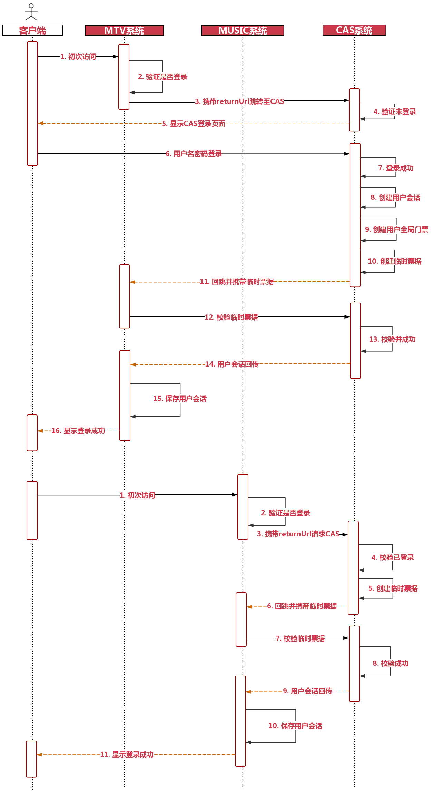
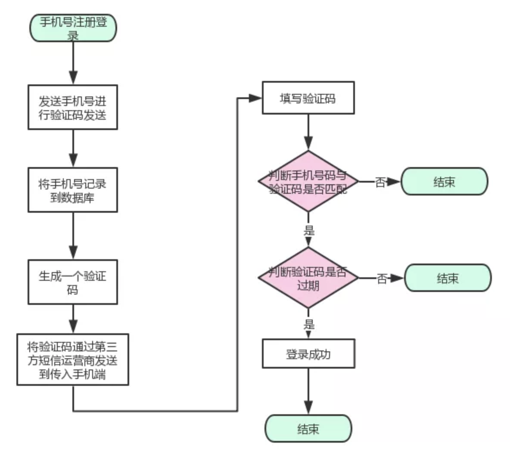
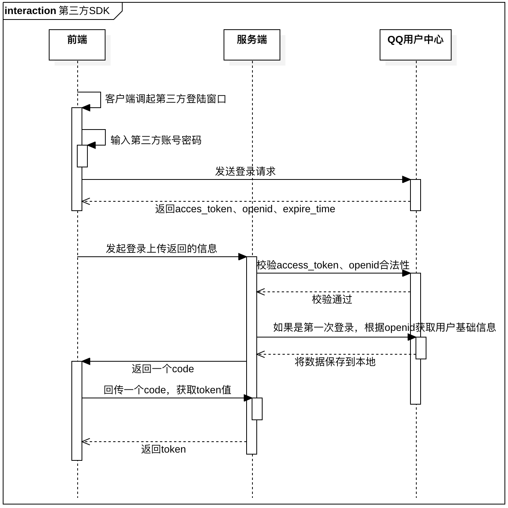

<!-- START doctoc generated TOC please keep comment here to allow auto update -->
<!-- DON'T EDIT THIS SECTION， INSTEAD RE-RUN doctoc TO UPDATE -->
**目录**

- [一.单系统登录限制：](#%E4%B8%80%E5%8D%95%E7%B3%BB%E7%BB%9F%E7%99%BB%E5%BD%95%E9%99%90%E5%88%B6)
- [二.多系统登录：](#%E4%BA%8C%E5%A4%9A%E7%B3%BB%E7%BB%9F%E7%99%BB%E5%BD%95)
- [三.单点登录：(Single Sign On：SSO)](#%E4%B8%89%E5%8D%95%E7%82%B9%E7%99%BB%E5%BD%95single-sign-onsso)

<!-- END doctoc generated TOC please keep comment here to allow auto update -->

# 一、单系统登录限制

## 1、http无状态协议

web应用采用browser/server架构，http作为通信协议，http是无状态协议，浏览器的每一次请求，服务器会独立处理，不与之前或之后的请求产生关联。既然http协议无状态，那就让服务器和浏览器共同维护一个状态吧!这就是会话机制

## 2、会话机制

- 浏览器第一次请求服务器，服务器创建一个会话，并将会话的id作为响应的一部分发送给浏览器，浏览器存储会话id，并在后续第二次和第三次请求中带上会话id，服务器取得请求中的会话id就知道是不是同一个用户了
- cookie是浏览器用来存储少量数据的一种机制，数据以"key/value"形式存储，浏览器发送http请求时自动附带cookie信息；

## 3、登录状态

浏览器第一次请求服务器需要输入用户名与密码验证身份，服务器拿到用户名密码去数据库比对，正确的话说明当前持有这个会话的用户是合法用户，应该将这个会话标记为“已授权”或者“已登录”等等之类的状态；如 Tomcat 第一次登录的时候设置登录状态，下一次登录的时候判断登录状态

# 二、多系统登录

单系统登录解决方案的核心是cookie，cookie携带会话id在浏览器与服务器之间维护会话状态，但cookie是有限制的，这个限制就是cookie的域(通常对应网站的域名)浏览器发送http请求时会自动携带与该域匹配的cookie而不是所有cookie；

为什么不将web应用群中所有子系统的域名统一在一个顶级域名下？共享cookie的方式存在众多局限
- 应用群域名得统一;
- 其次，应用群各系统使用的技术(至少是web服务器)要相同，不然cookie的key值(tomcat为JSESSIONID)不同，无法维持会话，共享cookie的方式是无法实现跨语言技术平台登录的
- cookie本身不安全

# 三、单点登录(Single Sign On：SSO)

[基于 Cookie 的 SSO 中间件](https://github.com/baomidou/kisso)

## 1、概述

是指在多系统应用群中登录一个系统，便可在其他所有系统中得到授权而无需再次登录，包括单点登录与单点注销两部分

## 2、登录

- sso需要一个独立的认证中心，只有认证中心能接受用户的用户名密码等安全信息，其他系统不提供登录入口，只接受认证中心的间接授权，间接授权通过令牌实现，sso认证中心验证用户的用户名密码没问题，创建授权令牌，在接下来的跳转过程中，授权令牌作为参数发送给各个子系统，子系统拿到令牌，即得到了授权，可以借此创建局部会话，局部会话登录方式与单系统的登录方式相同；
- 用户登录成功之后，会与sso认证中心及各个子系统建立会话，用户与sso认证中心建立的会话称为全局会话，用户与各个子系统建立的会话称为局部会话，局部会话建立之后，用户访问子系统受保护资源将不再通过sso认证中心.全局会话与局部会话有如下约束关系：
	- A、局部会话存在，全局会话一定存在;
	- B、全局会话存在，局部会话不一定存在;
	- C、全局会话销毁，局部会话必须销毁;

## 3、注销

单点登录自然也要单点注销，在一个子系统中注销，所有子系统的会话都将被销毁

## 4、相同顶级域名下单点登录

用户自始至终只在某一个网站下登录后，那么他所产生的会话，就共享给了其他的网站，实现了单点网站登录后，同时间接登录了其他的网站，那么这个其实就是单点登录，他们的会话是共享的，都是同一个用户会话

**Cookie + Redis 实现 SSO**

分布式会话后端是基于redis的，如此会话可以存在于后端的任意系统，都能获取到缓存中的用户数据信息，前端通过使用cookie，可以保证在同域名的一级二级下获取，那么这样一来，cookie中的信息userid和token是可以在发送请求的时候携带上的，这样从前端请求后端后是可以获取拿到的，这样一来，其实用户在某一端登录注册以后，其实cookie和redis中都会带有用户信息，只要用户不退出，那么就能在任意一个站点实现登录了；

其原理主要是cookie和网站的依赖关系，定义域名：`www.abc.com`和`*.abc.com`的cookie是可以共享的，可以被携带至后端；

二级域名自己的独立cookie是不能共享的，不能被其他二级域名获取，比如：`music.abc.com`的cookie是不能被`mtv.abc.com`共享，两者互不影响，要共享必须设置为`.abc.com`

## 5、CAS单点登录

比如`www.abc.com` 和 `www.test.com`两个域名下要实现会话共享，因为cookie不能跨域，每个站点各自请求到服务端，cookie无法同步；

### 5.1、什么是CAS

多个系统之间的登录会通过一个独立的登录系统去做验证，它就相当于是一个中介公司，整合了所有人，你要看房经过中介允许拿钥匙就行，实现了统一的登录。那么这个就称之为`CAS系统`，CAS全称为`Central Authentication Service`即中央认证服务，是一个单点登录的解决方案，可以用于不同顶级域名之间的单点登录。

**票据：**
- TGT：`Ticket Grangting Ticket` TGT 是 CAS 为用户签发的登录票据，拥有了 TGT，用户就可以证明自己在 CAS 成功登录过。TGT 封装了 Cookie 值以及此 Cookie 值对应的用户信息。当 HTTP 请求到来时，CAS 以此 Cookie 值（TGC）为 key 查询缓存中有无 TGT ，如果有的话，则相信用户已登录过。
- TGC：`Ticket Granting Cookie` CAS Server 生成TGT放入自己的 Session 中，而 TGC 就是这个 Session 的唯一标识（SessionId），以 Cookie 形式放到浏览器端，是 CAS Server 用来明确用户身份的凭证。
- ST：`Service Ticket`， ST 是 CAS 为用户签发的访问某一 service 的票据。用户访问 service 时，service 发现用户没有 ST，则要求用户去 CAS 获取 ST。用户向 CAS 发出获取 ST 的请求，CAS 发现用户有 TGT，则签发一个 ST，返回给用户。用户拿着 ST 去访问 service，service 拿 ST 去 CAS 验证，验证通过后，允许用户访问资源；

### 5.2、登录流程

CAS具体的时序图：

假如现在应用集群中又两个系统A、B。当客户首次登录A系统的时候，流程如下：
- 用户浏览器访问系统A需登录受限资源。
- 系统A发现该请求需要登录，将请求重定向到认证中心，进行登录。
- 认证中心呈现登录页面，用户登录，登录成功后，认证中心重定向请求到系统A，并附上认证通过令牌。
- 系统A与认证中心通信，验证令牌有效,证明用户已登录。
- 系统A将受限资源返给用户

已登录用户首次访问应用群中系统B时：
- 浏览器访问另一应用B需登录受限资源。
- 系统B发现该请求需要登录，将请求重定向到认证中心，进行登录。
- 认证中心发现已经登录，即重定向请求响应到系统B，附带上认证令牌。
- 系统B与认证中心通信，验证令牌有效,证明用户已登录。
- 系统B将受限资源返回给客户端；

### 5.3、登录状态判断

用户到认证中心登录后，用户和认证中心之间建立起了会话，我们把这个会话称为全局会话；当用户后续访问系统应用时，我们不可能每次应用请求都到认证中心去判定是否登录，这样效率非常低下；

我们可以在系统应用和用户浏览器之间建立起局部会话，局部会话保持了客户端与该系统应用的登录状态，局部会话依附于全局会话存在，全局会话消失，局部会话必须消失。用户访问应用时，首先判断局部会话是否存在，如存在，即认为是登录状态，无需再到认证中心去判断。如不存在，就重定向到认证中心判断全局会话是否存在，如存在，按上面提到的方式通知该应用，该应用与客户端就建立起它们之间局部会话，下次请求该应用，就不去认证中心验证了；

### 5.4、登出

用户在一个系统登出了，访问其它子系统，也应该是登出状态认证中心接到登出通知，即可结束全局会话，同时需要通知所有已建立局部会话的子系统，将它们的局部会话销毁。这样，用户访问其它应用时，都显示已登出状态。整个登出流程如下：
- 客户端向应用A发送登出Logout请求。
- 应用A取消本地会话，同时通知认证中心，用户已登出。
- 应用A返回客户端登出请求。
- 认证中心通知所有用户登录访问的应用，用户已登出

## 6、JWT（JSON Web Tokens）

# 四、扫码登录

[二维码登录原理](https://mp.weixin.qq.com/s/1A30nQNg4j4GwLG1n91DCw)

https://juejin.cn/post/6946440936310177799

## 1、本质

二维码登录本质上也是一种登录认证方式，既然是登录认证，要做的也就两件事情：
- 告诉系统我是谁
- 向系统证明我是谁

比如账号密码登录，账号就是告诉系统我是谁， 密码就是向系统证明我是谁; 比如手机验证码登录，手机号就是告诉系统我是谁，验证码就是向系统证明我是谁;

# 五、短信验证码登录

- 首先输入手机号，然后发送到服务端，服务端将手机号记录在我们数据库中，然后生成随机验证码，并将手机号和验证码绑定到一个redis里面，然后记录过期时间，这个过期时间一般是10分钟左右，这就是我们一般手机验证码的有效期。

- 手机接收到手机短信后，那么就在界面填写验证码发送服务端，服务端收到验证码后就会在redis里面查询到这个手机号对应的验证码，失败就返回错误码。

- 成功后就进行登录操作。

这里看起来没有明确的注册登录操作，其实在发送手机号码就可以认为是一个常规的注册，然后后面的验证码输入就是一个登陆操作。如果需要用户密码的话，后续使用密码补录功能即可；

# 六、第三方SDK登录

以QQ-SDK的登录逻辑：

## 1、实现思路

- 客户端自己调起登录的界面，进行输入用户名、密码，这里的是第三方的用户名，密码，登录成功后，会返回access_token openid expire_in,这过程会使用到oauth2.0，不过在sdk里面进行内置回调获取了，后面我们会说明我们自身实现的oauth2.0

- 客户端拿到access_token、openid、login_type（qq、wechat...）请求应用服务器，应用服务器拿到这些数据后就会根据对应的login_type去对应的用户中心进行access_token和openid进行校验。

**校验不通过则返回对应错误码**

- 校验通过后就会判断本地是否有这个login_type和openid是否存在，不存在则进行获取远程的用户名、头像等基础信息来作为本地基础数据，并且返回code值
- 如果已经存在，那就是进行登录操作，返回code值。
- 客户端拿到code值后进行token值的换取，这个完全遵照oauth2.0的协议来走的，后续每次请求必须带上token，token值在服务端的时间比较久，因为我们想要做的是那种永不下线的操作，所以每次请求我们都将token过期时间进行累加。

## 2、数据库设计

**用户基础表（users）**

字段 | 备注
----|-----
user_id|用户id
token|用户登录的token
expire_in |token过期时间
try_times | 登录次数

**用户验证关联表（user_auth_rel）**

字段 | 备注
----|-----
id | 自增id
user_id|用户id
auth_id | 验证表id
auth_type | 验证类型（local、third）

**本地用户表（user_local_auth）**

字段 | 备注
----|-----
auth_id| 认证id、自增id
user_name | 用户密码
password | 密码
mobile | 电话

**第三方用户表（user_third_auth）**

字段 | 备注
----|-----
auth_id | 用户id
openid|第三方用户唯一标识
login_type | 第三方平台标识
access_token| 第三方获取的access_token

整个设计理念就是将自建用户与第三方在存储上区分，这在架构演进上也是合乎情理的，开始用户体系大多自建，而后才是对外接入

# 七、邮箱注册

# 八、其他

## 1、关于用户注册与登录

前端将用户名、密码发送到服务器，服务器进行常规的判断，判断用户名、密码长度是否满足，用户名是否重复等条件，条件不通过直接返回对应错误码给到前端，这里密码字段，为了防止传输过程中被截胡，建议加密再上传，我们的传输密码默认都是会进行一个md5加密，然后记录到数据库再进行一层加密

# 参考资料

* [单点登录](http：//www.cnblogs.com/ywlaker/p/6113927.html)  
* [企业级SSO](https://www.apereo.org/projects/cas)
* [登录逻辑](https://www.uisdc.com/login-registration-process)