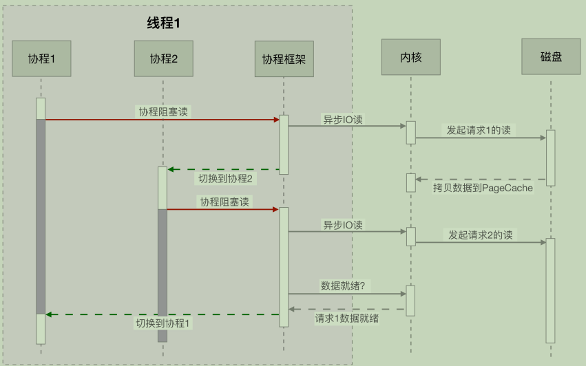

# 一、性能调优理论基础

所谓性能，就是使用有限的资源在有限的时间内完成工作
- 借助监控预防问题、发现问题；
- 借助工具定位问题；
- 定期复盘，防止同类问题再现；
- 定好规范，一定程度上规避问题；

主要点：
- 并行、异步化
- 存储优化

## 1、性能优化原则

- 首先，性能优化一定不能盲目，一定是问题导向的
- 其次，性能优化也遵循“八二原则”，即你可以用 20% 的精力解决 80% 的性能问题
- 再次，性能优化也要有数据支撑。在优化过程中，你要时刻了解你的优化让响应时间减少了多少，提升了多少的吞吐量。
- 最后，性能优化的过程是持续的

## 2、性能优化衡量指标

一般来说度量性能的指标是系统接口的响应时间

- `QPS`：Queries Per Second，每秒查询数，即是每秒能够响应的查询次数，注意这里的查询是指用户发出请求到服务器做出响应成功的次数，简单理解可以认为查询=请求request；qps=每秒钟request数量
- `TPS`：Transactions Per Second 的缩写，每秒处理的事务数；一个事务是指一个客户机向服务器发送请求然后服务器做出反应的过程。客户机在发送请求时开始计时，收到服务器响应后结束计时，以此来计算使用的时间和完成的事务个数。针对单接口而言，TPS可以认为是等价于QPS的，比如访问一个页面`index.html`，是一个TPS；而访问/index.html页面可能请求了3次服务器比如css、js、index接口，产生了3个QPS；
- `RT`：Response Time缩写，简单理解为系统从输入到输出的时间间隔，宽泛的来说，他代表从客户端发起请求到服务端接受到请求并响应所有数据的时间差。一般取平均响应时间；
- 并发数：系统能同时处理的请求/事务数量
- TP：top 百分位数
- `平均值`：平均值是把这段时间所有请求的响应时间数据相加，再除以总请求数。平均值可以在一定程度上反应这段时间的性能，但它敏感度比较差，如果这段时间有少量慢请求时，在平均值上并不能如实地反应。所以，平均值对于度量性能来说只能作为一个参考。
- `最大值`：就是这段时间内所有请求响应时间最长的值，但它的问题又在于过于敏感了
- `分位值`：分位值有很多种，比如 90 分位、95 分位、75 分位。以 90 分位为例，把这段时间请求的响应时间从小到大排序，假如一共有 100 个请求，那么排在第 90 位的响应时间就是 90 分位值。分位值排除了偶发极慢请求对于数据的影响，能够很好地反应这段时间的性能情况，分位值越大，对于慢请求的影响就越敏感。


`QPS = 并发数 / RT` 或者 `并发数 = QPS * RT`

关于流量评估的场景【28法则】，可以根据这个评估自己的系统QPS；按二八定律来看，如果每天 80% 的访问集中在 20% 的时间里，这 20% 时间就叫做峰值时间。
- 公式：( 总PV数 * 80% ) / ( 每天秒数 * 20% ) = 峰值时间每秒请求数(QPS)
- 机器：峰值时间每秒QPS / 单台机器的QPS = 需要的机器

如何估算QPS：
- 加入系统有1000万用户，那么每天来点击页面的占比20%，也就是200万用户访问。
- 假设平均每个用户点击50次，那么总用有1亿的PV
- 一天24个小时，平均活跃时间段算在5个小时内【24*20%】，那么5个小时预计有8000万点击，也就是平均每秒4500个请求。
- 4500是一个均值，按照电商类峰值的话，一般是3~4倍均值量，也就是5个小时每秒18000个请求【QPS=1.8万】

估算机器：
- 每天300w PV 的在单台机器上，这台机器需要多少QPS：( 3000000 * 0.8 ) / (86400 * 0.2 ) = 139 (QPS)
- 如果一台机器的QPS是58，需要几台机器来支持：139 / 58 = 3

### 2.1、吞吐量和响应速度

在交通非常繁忙的情况下，十字路口是典型的瓶颈点，当红绿灯放行时间非常长时，后面往往会排起长队。从我们开车开始排队，到车经过红绿灯，这个过程所花费的时间，就是`响应时间`。当然，我们可以适当地调低红绿灯的间隔时间，这样对于某些车辆来说，通过时间可能会短一些。但是，如果信号灯频繁切换，反而会导致单位时间内通过的车辆减少，换一个角度，我们也可以认为这个十字路口的车辆吞吐量减少了；

- 响应速度是串行执行的优化，通过优化执行步骤解决问题；
- 吞吐量是并行执行的优化，通过合理利用计算资源达到目标；

### 2.2、响应时间衡量

**平均响应时间**

它的本质是把所有的请求耗时加起来，然后除以请求的次数。举个最简单的例子，有 10 个请求，其中有 2 个 1ms、3 个 5ms、5 个 10ms，那么它的平均耗时就是`(2*1+3*5+5*10)/10=6.7ms`

**百分位数**

圈定一个时间范围，把每次请求的耗时加入一个列表中，然后按照从小到大的顺序将这些时间进行排序。这样，取出特定百分位的耗时，这个数字就是 TP 值。可以看到，TP 值(Top Percentile)和中位数、平均数等是类似的，都是一个统计学里的术语；

一般分为 TP50、TP90、TP95、TP99、TP99.9 等多个段，对高百分位的值要求越高，对系统响应能力的稳定性要求越高；

### 2.3、并发量

并发量是指系统同时能处理的请求数量，这个指标反映了系统的负载能力

### 2.4、秒开率

在移动互联网时代，尤其对于 App 中的页面，秒开是一种极佳的用户体验。如果能在 1 秒内加载完成页面，那用户可以获得流畅的体验，并且不会产生更多的焦虑感

### 2.5、正确性

## 3、理论方法

### 3.1、[利特尔法则](https://en.wikipedia.org/wiki/Little%27s_law)

为什么要进行性能优化？当平均响应时间、QPS、TP9X、系统水位变大我们必须关注性能优化了

### 3.2、木桶理论

定位性能问题

一只木桶若想要装最多的水，则需要每块木板都一样长而且没有破损才行。如果有一块木板不满足条件，那么这只桶就无法装最多的水。

能够装多少水，取决于最短的那块木板，而不是最长的那一块。

木桶效应在解释系统性能上，也非常适合。组成系统的组件，在速度上是良莠不齐的。系统的整体性能，就取决于系统中最慢的组件。

比如，在数据库应用中，制约性能最严重的是落盘的 I/O 问题，也就是说，硬盘是这个场景下的短板，我们首要的任务就是补齐这个短板

如何知道短板？火焰图

### 3.3、[阿姆达尔定律](https://en.wikipedia.org/wiki/Amdahl%27s_law)

解决性能问题；

有些场景可以通过增加资源解决，有些场景仅仅通过增加资源并不能解决性能问题，需要考虑优化串行本身来解决性能问题

### 3.4、基准测试、预热

基准测试(Benchmark)并不是简单的性能测试，是用来测试某个程序的最佳性能。

应用接口往往在刚启动后都有短暂的超时。在测试之前，我们需要对应用进行预热，消除 JIT 编译器等因素的影响。而在 Java 里就有一个组件，即 JMH，就可以消除这些差异

## 4、优化注意点

- 依据数字而不是猜想：进行性能优化时，我们一般会把分析后的结果排一个优先级（根据难度和影响程度），从大处着手，首先击破影响最大的点，然后将其他影响因素逐一击破

- 个体数据不足信：

    这是因为个体请求的小批量数据，可参考价值并不是非常大。响应时间可能因用户的数据而异，也可能取决于设备和网络条件。

    合理的做法，是从统计数据中找到一些规律，比如上面所提到的平均响应时间、TP 值等，甚至是响应时间分布的直方图，这些都能够帮我们评估性能质量

- 不要过早优化和过度优化：正确的做法是，项目开发和性能优化，应该作为两个独立的步骤进行，要做性能优化，要等到整个项目的架构和功能大体进入稳定状态时再进行

- 保持良好的编码习惯：保持好的编码规范，就可以非常方便地进行代码重构；使用合适的设计模式，合理的划分模块，就可以针对性能问题和结构问题进行聚焦、优化

## 5、性能优化技术手段

### 5.1、复用优化

- 重复代码抽取为公共的方法；
- 缓冲（Buffer），常见于对数据的暂存，然后批量传输或者写入。多使用顺序方式，用来缓解不同设备之间频繁地、缓慢地随机写，缓冲主要针对的是写操作。
- 缓存（Cache），常见于对已读取数据的复用，通过将它们缓存在相对高速的区域，缓存主要针对的是读操作；比如计算结果、数据缓存等；
- 池化操作，比如数据库连接池、线程池；

### 5.2、计算优化

**并行执行：**

并行执行有以下三种模式。
- 第一种模式是多机，采用负载均衡的方式，将流量或者大的计算拆分成多个部分，同时进行处理。比如，Hadoop 通过 MapReduce 的方式，把任务打散，多机同时进行计算。
- 第二种模式是采用多进程。比如 Nginx，采用 NIO 编程模型，Master 统一管理 Worker 进程，然后由 Worker 进程进行真正的请求代理，这也能很好地利用硬件的多个 CPU。
- 第三种模式是使用多线程，这也是 Java 程序员接触最多的。比如 Netty，采用 Reactor 编程模型，同样使用 NIO，但它是基于线程的。Boss 线程用来接收请求，然后调度给相应的 Worker 线程进行真正的业务计算；

**变同步为异步：**

**惰性加载：**使用设计模式来优化业务，提高体验，比如单例模式、代理模式

### 5.3、结果集优化

- 压缩：比如xml与json
- 批量
- 索引
- 复用

### 5.4、资源冲突优化

- 锁粒度
- 事务范围：隔离级别、传输机制、分布式事务
- 锁级别：悲观锁、乐观锁
- 锁类型：公平锁、非公平锁

### 5.5、算法优化

算法属于代码调优，代码调优涉及很多编码技巧，需要使用者对所使用语言的 API 也非常熟悉。有时候，对算法、数据结构的灵活使用，也是代码优化的一个重要内容。比如，常用的降低时间复杂度的方式，就有递归、二分、排序、动态规划等

### 5.6、高效实现

使用一些设计理念良好、性能优越的组件

### 5.7、JVM 优化

对JVM的性能优化，一定程度上能够提升程序的性能，但是如果使用不当的话，可能导致OOM等比较严重的问题；

## 6、资源瓶颈

哪些资源比较容易成为瓶颈呢？

### 6.1、CPU

- 通过 top 命令，来观测 CPU 的性能；
- 通过负载，评估 CPU 任务执行的排队情况；
- 通过 vmstat，看 CPU 的繁忙程度。

### 6.2、内存

逻辑地址可以映射到两个内存段上：物理内存和虚拟内存，那么整个系统可用的内存就是两者之和。比如你的物理内存是 4GB，分配了 8GB 的 SWAP 分区，那么应用可用的总内存就是 12GB
**top 命令**

```
top - 21:52:25 up 4 days, 27 min,  2 users,  load average: 0.08, 0.04, 0.05
Tasks: 103 total,   1 running, 102 sleeping,   0 stopped,   0 zombie
%Cpu(s):  0.1 us,  0.2 sy,  0.0 ni, 99.8 id,  0.0 wa,  0.0 hi,  0.0 si,  0.0 st
KiB Mem : 16266200 total, 10455748 free,  4614764 used,  1195688 buff/cache
KiB Swap:        0 total,        0 free,        0 used. 11375436 avail Mem 

  PID USER      PR  NI    VIRT    RES    SHR S  %CPU %MEM     TIME+ COMMAND                                          
17483 root      20   0  157320   5924   4568 S   0.3  0.0   0:00.05 sshd                                             
17571 root      20   0  162116   2220   1552 R   0.3  0.0   0:00.01 top                                              
    1 root      20   0   43548   3920   2564 S   0.0  0.0   0:35.73 systemd                                          
    2 root      20   0       0      0      0 S   0.0  0.0   0:00.06 kthreadd       
```
从 top 命令可以看到几列数据，解释如下：
- VIRT 这里是指虚拟内存，一般比较大，不用做过多关注；
- RES 我们平常关注的是这一列的数值，它代表了进程实际占用的内存，平常在做监控时，主要监控的也是这个数值；
- SHR 指的是共享内存，比如可以复用的一些 so 文件等

**CPU 缓存**

由于 CPU 和内存之间的速度差异非常大，解决方式就是加入高速缓存，但是针对缓存存在伪共享问题（False sharing）

**页大小太大：Huge page**

**预先加载：**

一些程序的默认行为也会对性能有所影响，比如 JVM 的 `-XX:+AlwaysPreTouch` 参数；默认情况下，JVM 虽然配置了 Xmx、Xms 等参数，指定堆的初始化大小和最大大小，但它的内存在真正用到时，才会分配；但如果加上 AlwaysPreTouch 这个参数，JVM 会在启动的时候，就把所有的内存预先分配。这样，启动时虽然慢了些，但运行时的性能会增加

### 6.3、IO

- iostat
- 零拷贝

### 6.4、工具

- nmon —— 获取系统性能数据

## 7、性能分析

### 7.1、缓冲区优化

- IO缓冲区
- 日志缓冲：Logback 性能也很高，其中一个原因就是异步日志，它在记录日志时，使用了一个缓冲队列，当缓冲的内容达到一定的阈值时，才会把缓冲区的内容写到文件里

缓冲区是可以提高性能的，但它通常会引入一个异步的问题，使得编程模型变复杂；

虽然缓冲区可以帮我们大大地提高应用程序的性能，但同时它也有不少问题，在我们设计时，要注意这些异常情况。

其中，比较严重就是缓冲区内容的丢失。即使你使用 addShutdownHook 做了优雅关闭，有些情形依旧难以防范避免，比如机器突然间断电，应用程序进程突然死亡等。这时，缓冲区内未处理完的信息便会丢失，尤其金融信息，电商订单信息的丢失都是比较严重的。

所以，内容写入缓冲区之前，需要先预写日志，故障后重启时，就会根据这些日志进行数据恢复。在数据库领域，文件缓冲的场景非常多，一般都是采用 WAL 日志（Write-Ahead Logging）解决。对数据完整性比较严格的系统，甚至会通过电池或者 UPS 来保证缓冲区的落地。如果预写日志不成功，一般不会给予客户端ACK，调用方会知晓这个状态。也就是返回给客户端OK的，预写就一定成功。服务只管自己不丢数据即可，至于客户端有没有做异常处理

### 7.2、缓存

一般分为进程内缓存、进程外缓存，在 Java 中，进程内缓存，就是我们常说的堆内缓存。Spring 的默认实现里，就包含 Ehcache、JCache、Caffeine、Guava Cache 等

**Guava 的 LoadingCache**

- [Cache](https://segmentfault.com/a/1190000011105644)

回收策略：
- 基于容量：就是说如果缓存满了，就会按照 LRU 算法来移除其他元素
- 基于时间：
  - 通过 expireAfterWrite 方法设置数据写入以后在某个时间失效；
  - 通过 expireAfterAccess 方法设置最早访问的元素，并优先将其删除；
- 基于 JVM 的垃圾回收：对象的引用有强、软、弱、虚等四个级别，通过 weakKeys 或者 weakValues 等函数即可设置相应的引用级别。当 JVM 垃圾回收的时候，会主动清理这些数据

问题：如果你同时设置了 weakKeys 和 weakValues函数，LC 会有什么反应？

答案：如果同时设置了这两个函数，它代表的意思是，当没有任何强引用，与 key 或者 value 有关系时，就删掉整个缓存项
```java
public static void main(String[] args) {
    LoadingCache<String, Object> cache = CacheBuilder.newBuilder()
            .weakValues()
            .build(new CacheLoader<String, Object>() {
                @Override
                public Object load(String key) throws Exception {
                    return slowMethod(key);
                }
            });
    Object value = new Object();
    cache.put("key1", value);
    value = new Object(); // 原对象不再有强引用
    System.gc(); // 显示调用GC，cache弱引用会被回收
    System.out.println(cache.getIfPresent("key1"));
}
private static String slowMethod(String key) throws Exception {
    Thread.sleep(1000);
    return key + ".result";
}
```
LC 可以通过 recordStats 函数，对缓存加载和命中率等情况进行监控。值得注意的是：LC 是基于数据条数而不是基于缓存物理大小的，所以如果你缓存的对象特别大，就会造成不可预料的内存占用

**缓存算法**

堆内缓存最常用的有 FIFO、LRU、LFU 这三种算法
- FIFO：这是一种先进先出的模式。如果缓存容量满了，将会移除最先加入的元素。这种缓存实现方式简单，但符合先进先出的队列模式场景的功能不多，应用场景较少；
- LRU：是最近最少使用的意思，当缓存容量达到上限，它会优先移除那些最久未被使用的数据，LRU是目前最常用的缓存算法
- LFU：LFU 是最近最不常用的意思。相对于 LRU 的时间维度，LFU 增加了访问次数的维度。如果缓存满的时候，将优先移除访问次数最少的元素；而当有多个访问次数相同的元素时，则优先移除最久未被使用的元素

### 7.3、池化技术

比如线程池、数据库连接池
- ThreadPoolExecutor
- JedisPool
- HikariCP：SpringBoot 中默认的数据库连接池

总体来说，当你遇到下面的场景，就可以考虑使用池化来增加系统性能：
- 对象的创建或者销毁，需要耗费较多的系统资源；
- 对象的创建或者销毁，耗时长，需要繁杂的操作和较长时间的等待；
- 对象创建后，通过一些状态重置，可被反复使用；

### 7.4、大对象

大对象为什么影响性能？
- 第一，大对象占用的资源多，垃圾回收器要花一部分精力去对它进行回收；
- 第二，大对象在不同的设备之间交换，会耗费网络流量，以及昂贵的 I/O；
- 第三，对大对象的解析和处理操作是耗时的，对象职责不聚焦，就会承担额外的性能开销

如何解决：
- 如果你创建了比较大的对象，并基于这个对象生成了一些其他的信息，这个时候，一定要记得去掉和这个大对象的引用关系，比如String的subString方法，在jdk1.6之前的版本会存在问题；
- 保持合适的对象粒度：比如，在缓存对象的时候，可以不采用string的形式，针对这种大粒度 json 信息，就可以采用打散的方式进行优化，使得每次更新和查询，都有聚焦的目标；采用 hash 结构；
- Bitmap 把对象变小：比如Java 的 Boolean 占用的是多少位，在 Java 虚拟机规范里，描述是：将 Boolean 类型映射成的是 1 和 0 两个数字，它占用的空间是和 int 相同的 32 位。即使有的虚拟机实现把 Boolean 映射到了 byte 类型上，它所占用的空间，对于大量的、有规律的 Boolean 值来说，也是太大了；
    BitSet 底层是使用 long 数组实现的，所以它的最小容量是 64。10 亿的 Boolean 值，只需要 128MB 的内存，下面既是一个占用了 256MB 的用户性别的判断逻辑，可以涵盖长度为 10 亿的 ID；
    ```java
    static BitSet missSet = new BitSet(010_000_000_000); 
    static BitSet sexSet = new BitSet(010_000_000_000); 
    String getSex(int userId) { 
       boolean notMiss = missSet.get(userId); 
       if (!notMiss) { 
           //lazy fetch 
           String lazySex = dao.getSex(userId); 
           missSet.set(userId, true); 
           sexSet.set(userId, "female".equals(lazySex)); 
       } 
       return sexSet.get(userId) ? "female" : "male"; 
    }
    ```

### 7.5、设计模式优化性能

- 如何找到动态代理慢逻辑的原因：使用 arthas 找到动态代理慢逻辑的具体原因；

## 8、代码优化

- 使用局部变量可避免在堆上分配：由于堆资源是多线程共享的，是垃圾回收器工作的主要区域，过多的对象会造成 GC 压力。可以通过局部变量的方式，将变量在栈上分配。这种方式变量会随着方法执行的完毕而销毁，能够减轻 GC 的压力；
- 减少变量的作用范围：注意变量的作用范围，尽量减少对象的创建；
- 访问静态变量直接使用类名：使用对象访问静态变量，这种方式多了一步寻址操作，需要先找到变量对应的类，再找到类对应的变量
- 字符串拼接使用 StringBuilder；
- 重写对象的 HashCode，不要简单地返回固定值；
- HashMap 等集合初始化的时候，指定初始值大小，避免扩容；
- 遍历 Map 的时候，使用 EntrySet 方法；
- 不要在多线程下使用同一个 Random：Random 类的 seed 会在并发访问的情况下发生竞争，造成性能降低，建议在多线程环境下使用 ThreadLocalRandom 类；在 Linux 上，通过加入 JVM 配置 `-Djava.security.egd=file:/dev/./urandom`，使用 urandom 随机生成器，在进行随机数获取时，速度会更快；
- 自增推荐使用 LongAddr；
- 不要使用异常控制程序流程：异常，是用来了解并解决程序中遇到的各种不正常的情况，它的实现方式比较昂贵，比平常的条件判断语句效率要低很多；这是因为异常在字节码层面，需要生成一个如下所示的异常表（Exception table），多了很多判断步骤；
- 不要在循环中使用 try catch；
- 不要捕捉 RuntimeException；
- 合理使用 PreparedStatement
- 日志打印的注意事项：可以在每次打印之前都使用 isDebugEnabled 方法判断一下日志级别；对于业务系统来说，日志对系统的性能影响非常大，不需要的日志，尽量不要打印，避免占用 I/O 资源；
- 减少事务的作用范围：如果的程序使用了事务，那一定要注意事务的作用范围，尽量以最快的速度完成事务操作。这是因为，事务的隔离性是使用锁实现的；
- 使用位移操作替代乘除法：但是需要注意位移操作的优先级非常低；
- 不要打印大集合或者使用大集合的 toString 方法；
- 程序中少用反射；
- 正则表达式可以预先编译，加快速度；

## 9、RPC网络通信优化

RPC 通信包括了建立通信、实现报文、传输协议以及传输数据编解码等操作

### 9.1、选择合适的通信协议

网络传输协议有 TCP、UDP 协议，这两个协议都是基于 Socket 编程接口之上，为某类应用场景而扩展出的传输协议
- 基于 TCP 协议实现的 Socket 通信是有连接的，而传输数据是要通过三次握手来实现数据传输的可靠性，且传输数据是没有边界的，采用的是字节流模式；
- 基于 UDP 协议实现的 Socket 通信，客户端不需要建立连接，只需要创建一个套接字发送数据报给服务端，这样就不能保证数据报一定会达到服务端，所以在传输数据方面，基于 UDP 协议实现的 Socket 通信具有不可靠性。UDP 发送的数据采用的是数据报模式，每个 UDP 的数据报都有一个长度，该长度将与数据一起发送到服务端

> 为了保证数据传输的可靠性，通常情况下我们会采用 TCP 协议。如果在局域网且对数据传输的可靠性没有要求的情况下，我们也可以考虑使用 UDP 协议，毕竟这种协议的效率要比 TCP 协议高

### 9.2、使用单一长连接

服务之间的通信，连接的消费端不会像客户端那么多，但消费端向服务端请求的数量却一样多，我们基于长连接实现，就可以省去大量的 TCP 建立和关闭连接的操作，从而减少系统的性能消耗，节省时间

### 9.3、优化 Socket 通信

一般使用 Java 的 Socket 编程实现一个 TCP 连接

比如使用Netty等成熟的框架来实现

### 9.4、量身定做报文格式

需要设计一套报文，用于描述具体的校验、操作、传输数据等内容。为了提高传输的效率，我们可以根据自己的业务和架构来考虑设计，尽量实现报体小、满足功能、易解析等特性

### 9.5、编码、解码

如果只是单纯的数据对象传输，我们可以选择性能相对较好的 Protobuf 序列化，有利于提高网络通信的性能

### 9.6、调整 Linux 的 TCP 参数设置选项

# 二、系统底层优化

- [如何排查CPU相关问题](../Java/实际场景/线上问题排查思路.md#3linux常用的性能分析工具)

<center>
    <br>
    <div style="color:orange; border-bottom: 1px solid #d9d9d9; display: inline-block; color: #999; padding: 2px;">
        图片来源：<a href='https://www.brendangregg.com/Perf/linux_perf_tools_full.png'>linux_perf_tools_full.png</a>
    </div>
</center>

## 1、CPU

### 1.1、基础知识

#### 平均负载

在Linux上执行 top 或 uptime命令：
```bash
02:34:03 up 2 days, 20:14,  1 user,  load average: 0.63, 0.83, 0.88
```
```
02:34:03              // 当前时间
up 2 days, 20:14      // 系统运行时间
1 user                // 正在登录用户数
```
最后三个数字呢，依次则是过去 1 分钟、5 分钟、15 分钟的平均负载（Load Average）

**平均负载**：是指单位时间内，系统处于`可运行状态`和`不可中断状态`的平均进程数，也就是`平均活跃进程数`，它和 CPU 使用率并没有直接关系
- 所谓`可运行状态的进程`，是指正在使用 CPU 或者正在等待 CPU 的进程，也就是我们常用 ps 命令看到的，处于 R 状态（Running 或 Runnable）的进程；
- ·则是正处于内核态关键流程中的进程，并且这些流程是不可打断的，比如最常见的是等待硬件设备的 I/O 响应，也就是在 ps 命令中看到的 D 状态（Uninterruptible Sleep，也称为 Disk Sleep）的进程；`不可中断状态`实际上是系统对进程和硬件设备的一种保护机制

可以简单理解为：**平均负载其实就是平均活跃进程数**

既然平均的是活跃进程数，那么最理想的，就是每个 CPU 上都刚好运行着一个进程，这样每个 CPU 都得到了充分利用。比如当平均负载为 2 时，意味着什么呢？
- 在只有 2 个 CPU 的系统上，意味着所有的 CPU 都刚好被完全占用。
- 在 4 个 CPU 的系统上，意味着 CPU 有 50% 的空闲。
- 而在只有 1 个 CPU 的系统中，则意味着有一半的进程竞争不到 CPU

**平均负载为多少时合理**

平均负载最理想的情况是等于 CPU 个数。所以在评判平均负载时，首先你要知道系统有几个 CPU：
```bash
grep 'model name' /proc/cpuinfo | wc -l
```
当平均负载比 CPU 个数还大的时候，系统已经出现了过载；平均负载有三个数值，到底该参考哪一个呢？
- 如果 1 分钟、5 分钟、15 分钟的三个值基本相同，或者相差不大，那就说明系统负载很平稳
- 但如果 1 分钟的值远小于 15 分钟的值，就说明系统最近 1 分钟的负载在减少，而过去 15 分钟内却有很大的负载；
- 反过来，如果 1 分钟的值远大于 15 分钟的值，就说明最近 1 分钟的负载在增加，这种增加有可能只是临时性的，也有可能还会持续增加下去，所以就需要持续观察。一旦 1 分钟的平均负载接近或超过了 CPU 的个数，就意味着系统正在发生过载的问题；

假设我们在一个单 CPU 系统上看到平均负载为 1.73，0.60，7.98，那么说明在过去 1 分钟内，系统有 73% 的超载，而在 15 分钟内，有 698% 的超载，从整体趋势来看，系统的负载在降低；

当平均负载高于 CPU 数量 70% 的时候，需要分析排查负载高的问题；最推荐的方法，还是把系统的平均负载监控起来，然后根据更多的历史数据，判断负载的变化趋势；

**平均负载与 CPU 使用率**

平均负载是指单位时间内，处于可运行状态和不可中断状态的进程数。所以，它不仅包括了正在使用 CPU 的进程，还包括等待 CPU 和等待 I/O 的进程。而 CPU 使用率，是单位时间内 CPU 繁忙情况的统计，跟平均负载并不一定完全对应。比如：
- CPU 密集型进程，使用大量 CPU 会导致平均负载升高，此时这两者是一致的；
- I/O 密集型进程，等待 I/O 也会导致平均负载升高，但 CPU 使用率不一定很高；
- 大量等待 CPU 的进程调度也会导致平均负载升高，此时的 CPU 使用率也会比较高。

#### CPU上下文切换

[CPU上下文切换](../计算机基础/计算机系统/Linux/Linux操作系统.md#7cpu上下文)

#### CPU使用率


#### CPU缓存

- [伪共享问题](../Java/Java基础/Java多线程-基础.md#151CPU缓存)

查看CPU缓存：
```
[root@bigdata cache]# cat /sys/devices/system/cpu/cpu0/cache/index0/size 
32K
[root@bigdata cache]# cat /sys/devices/system/cpu/cpu0/cache/index1/size 
32K
```
> CPU 都是多核心的，每个核心都有自己的一、二级缓存，但三级缓存却是一颗 CPU 上所有核心共享的；

CPU缓存的优化目标提升CPU缓存命中率，CPU 缓存有 2 个一级缓存（比如上面中的 index0 和 index1），这是因为，CPU 会区别对待指令与数据。比如，“1+1=2”这个运算，“+”就是指令，会放在一级指令缓存中，而“1”这个输入数字，则放在一级数据缓存中；
- 提升数据缓存命中率；
- 提升指令缓存命中率；
  
**提升数据缓存命中率**

比如现在要遍历二维数组：`int array[N][N];`，用 array[j][i]和 array[i][j]访问数组元素，哪一种性能更快？
```java
for(i = 0; i < N; i+=1) {
    for(j = 0; j < N; j+=1) {
        array[i][j] = 0;
    }
}
```
（C++层面上）前者 `array[j][i]`执行的时间是后者 `array[i][j]`的 8 倍之多；因为二维数组 array 所占用的内存是连续的，比如若长度 N 的值为 2，那么内存中从前至后各元素的顺序是：`array[0][0]，array[0][1]，array[1][0]，array[1][1]`，如果用 `array[i][j]`访问数组元素，则完全与上述内存中元素顺序一致，因此访问 `array[0][0]`时，缓存已经把紧随其后的 3 个元素也载入了，CPU 通过快速的缓存来读取后续 3 个元素就可以。如果用 `array[j][i]`来访问，访问的顺序就是：`array[0][0]，array[1][0]，array[0][1]，array[1][1]`，此时内存是跳跃访问的，如果 N 的数值很大，那么操作 `array[j][i]`时，是没有办法把 `array[j+1][i]`也读入缓存的；

> 因此遇到这种遍历访问数组的情况时，按照内存布局顺序访问将会带来很大的性能提升。

**提升指令缓存命中率**

比如有一个元素为 0 到 255 之间随机数字组成的数组：
```java
int array[N];
for (i = 0; i < TESTN; i++) array[i] = rand() % 256;
```
接下来要对它做两个操作：一是循环遍历数组，判断每个数字是否小于 128，如果小于则把元素的值置为 0；二是将数组排序。那么，先排序再遍历速度快，还是先遍历再排序速度快呢？

答案是：先排序的遍历时间只有后排序的三分之一，因为循环中有大量的 if 条件分支，而 CPU含有分支预测器；当代码中出现 if、switch 等语句时，意味着此时至少可以选择跳转到两段不同的指令去执行。如果分支预测器可以预测接下来要在哪段代码执行（比如 if 还是 else 中的指令），就可以提前把这些指令放在缓存中，CPU 执行时就会很快。当数组中的元素完全随机时，分支预测器无法有效工作，而当 array 数组有序时，分支预测器会动态地根据历史命中数据对未来进行预测，命中率就会非常高

**提升多核 CPU 下的缓存命中率**

若进程 A 在时间片 1 里使用 CPU 核心 1，自然也填满了核心 1 的一、二级缓存，当时间片 1 结束后，操作系统会让进程 A 让出 CPU，基于效率并兼顾公平的策略重新调度 CPU 核心 1，以防止某些进程饿死。如果此时 CPU 核心 1 繁忙，而 CPU 核心 2 空闲，则进程 A 很可能会被调度到 CPU 核心 2 上运行，这样，即使我们对代码优化得再好，也只能在一个时间片内高效地使用 CPU 一、二级缓存了，下一个时间片便面临着缓存效率的问题；操作系统提供了将进程或者线程绑定到某一颗 CPU 上运行的能力

问题：多线程并行访问不同的变量，这些变量在内存布局是相邻的（比如类中的多个变量），此时 CPU 缓存就会失效，为什么？其实这是一个伪共享问题

## 2、内存池

一个例子：在 Linux 系统中，用 Xmx 设置 JVM 的最大堆内存为 8GB，但在近百个并发线程下，观察到 Java 进程占用了 14GB 的内存。为什么会这样呢？

这是因为，绝大部分高级语言都是用 C 语言编写的，包括 Java，申请内存必须经过 C 库，而 C 库通过预分配更大的空间作为内存池，来加快后续申请内存的速度。这样，预分配的 6GB 的 C 库内存池就与 JVM 中预分配的 8G 内存池叠加在一起，造成了 Java 进程的内存占用超出了预期；

在业务代码与系统内核间，有两层内存池容易被忽略，尤其是其中的 C 库内存池；当代码申请内存时，首先会到达应用层内存池，如果应用层内存池有足够的可用内存，就会直接返回给业务代码，否则，它会向更底层的 C 库内存池申请内存。比如，如果你在 Apache、Nginx 等服务之上做模块开发，这些服务中就有独立的内存池。当然，Java 中也有内存池，当通过启动参数 Xmx 指定 JVM 的堆内存为 8GB 时，就设定了 JVM 堆内存池的大小，当 C 库内存池无法满足内存申请时，才会向操作系统内核申请分配内存；

Java有了应用层内存池，为什么会受到 C 库内存池的影响呢？这是因为，除了 JVM 负责管理的堆内存外，Java 还拥有一些堆外内存，由于它不使用 JVM 的垃圾回收机制，所以更稳定、持久，处理 IO 的速度也更快。这些堆外内存就会由 C 库内存池负责分配，这是 Java 受到 C 库内存池影响的原因；

Linux 系统的默认 C 库内存池 Ptmalloc2；每个子线程预分配的内存是 64MB（Ptmalloc2 中被称为 Thread Arena，32 位系统下为 1MB，64 位系统下为 64MB）。如果有 100 个线程，就将有 6GB 的内存都会被内存池占用。当然，并不是设置了 1000 个线程，就会预分配 60GB 的内存，子线程内存池最多只能到 8 倍的 CPU 核数，比如在 32 核的服务器上，最多只会有 256 个子线程内存池，但这也非常夸张了，16GB（64MB * 256 = 16GB）的内存将一直被 Ptmalloc2 占用。

Linux 下的 JVM 编译时默认使用了 Ptmalloc2 内存池，因此每个线程都预分配了 64MB 的内存，这造成含有上百个 Java 线程的 JVM 多使用了 6GB 的内存。在多数情况下，这些预分配出来的内存池，可以提升后续内存分配的性能；

**栈上分配与堆上分配**：对于静态语言，不使用 new 关键字分配的对象大都是在栈中的；否则，通过 new 或者 malloc 关键字分配的对象则是在堆中的；对于动态类型语言，无论是否使用 new 关键字，内存都是从堆中分配的；

由于每个线程都有独立的栈，所以分配内存时不需要加锁保护，而且栈上对象的尺寸在编译阶段就已经写入可执行文件了，执行效率更高；

在栈中分配内存也有缺点，它有功能上的限制：
- 一是：栈内存生命周期有限，它会随着函数调用结束后自动释放，在堆中分配的内存，并不随着分配时所在函数调用的结束而释放，它的生命周期足够使用；
- 二是：栈的容量有限，如 CentOS 7 中是 8MB 字节，如果你申请的内存超过限制会造成栈溢出错误（比如，递归函数调用很容易造成这种问题），而堆则没有容量限制

> 所以，当我们分配内存时，如果在满足功能的情况下，可以在栈中分配的话，就选择栈。

## 3、索引

索引有很多，哈希表、红黑树、B 树都可以在内存中使用，如果需要数据规模上亿后还能提供微秒级的访问速度，那么作为最快的索引，哈希表是第一选择

### 3.1、哈希

- [哈希冲突解决思路](../Java/源码分析/集合/集合类.md#1Hash-哈希散列)

为什么哈希表能做到 O(1) 时间复杂度呢？
- 哈希表基于数组实现，而数组可以根据下标随机访问任意元素。数组之所以可以随机访问，是因为它由连续内存承载，且每个数组元素的大小都相等；
- 哈希函数直接把查询关键字转换为数组下标，再通过数组的随机访问特性获取数据；

哈希函数的执行时间是常量，数组的随机访问也是常量，时间复杂度就是 O(1)。

在生产环境用哈希表管理如此多的数据，必然面临以下问题：
- 首先，面对上亿条数据，为了保证可靠性，需要做灾备恢复，可以结合快照+oplog 方式恢复数据，但内存中的哈希表如何快速地序列化为快照文件？
- 简单的使用标准库提供的哈希表处理如此规模的数据，会导致内存消耗过大，因为每多使用一个 8 字节的指针（或者叫引用）都会被放大亿万倍，此时该如何实现更节约内存的个性化哈希表？
- 哈希表频繁发生冲突时，速度会急剧降低，该通过哪些手段减少冲突概率？

## 4、零拷贝

- [关于零拷贝](../Java/Java基础/Java-IO.md#四零拷贝)

## 5、协程

- [什么是协程](../计算机基础/计算机系统/Linux/Linux操作系统.md#23协程)

解决高并发问题的技术一直在变化，从多进程、多线程，到异步化、协程，面对不同的场景，它们都在用各自不同的方式解决问题；那么协程解决了什么问题？如何使用？

协程是比线程更轻量的执行单元。进程和线程的调度是由操作系统负责的，而协程则是由执行单元相互协商进行调度的，所以它的切换发生在用户态。只有前一个协程主动地执行 yield 函数，让出 CPU 的使用权，下一个协程才能得到调度。

事实上，无论基于多进程还是多线程，都难以实现高并发，这由两个原因所致：
- 单个线程消耗的内存过多，比如，64 位的 Linux 为每个线程的栈分配了 8MB 的内存，还预分配了 64MB 的内存作为堆内存池；
- 切换请求是内核通过切换线程实现的，什么时候会切换线程呢？不只时间片用尽，当调用阻塞方法时，内核为了让 CPU 充分工作，也会切换到其他线程执行。一次上下文切换的成本在几十纳秒到几微秒间，当线程繁忙且数量众多时，这些切换会消耗绝大部分的CPU 运算能力；

三个特点：
- 占用的资源更少 ;
- 所有的切换和调度都发生在用户态。
- 它的调度是协商式的，而不是抢占式的。

**协程是如何实现高并发的**

协程与异步编程相似的地方在于，它们必须使用非阻塞的系统调用与内核交互，把切换请求的权力牢牢掌握在用户态的代码中。但不同的地方在于，协程把异步化中的两段函数，封装为一个阻塞的协程函数。这个函数执行时，会使调用它的协程无感知地放弃执行权，由协程框架切换到其他就绪的协程继续执行。当这个函数的结果满足后，协程框架再选择合适的时机，切换回它所在的协程继续执行。异步化是通过回调函数来完成请求切换的，业务逻辑与并发实现关联在一起，很容易出错。协程不需要什么“回调函数”，它允许用户调用“阻塞的”协程方法，用同步编程方式写业务逻辑



协程的切换是如何完成的：用户态的代码切换协程，与内核切换线程的原理是一样的；

每个协程都拥有自己的寄存器上下文和栈。协程调度切换时，将寄存器上下文和栈保存到其他地方，在切回来的时候，恢复先前保存的寄存器上下文和栈。

创建协程时，会从进程的堆中分配一段内存作为协程的栈。线程的栈有8MB，而协程栈的大小通常只有几十 KB。而且，C 库内存池也不会为协程预分配内存，它感知不到协程的存在；

由此可见，协程就是用户态的线程，然而，为了保证所有切换都在用户态进行，协程必须重新封装所有的阻塞系统调用，否则，一旦协程触发了线程切换，会导致这个线程进入休眠状态，进而其上的所有协程都得不到执行；

所以，协程的高性能，建立在切换必须由用户态代码完成之上，这要求协程生态是完整的，要尽量覆盖常见的组件

## 6、锁

如何选择合适的锁：
- 首先我们必须清楚加锁的成本究竟有多大；
- 其次我们要分析业务场景中访问共享资源的方式；
- 最后则要预估并发访问时发生锁冲突的概率；

最底层的两种锁就是：互斥锁和自旋锁；其他锁都是基于它们实现的。互斥锁的加锁成本更高，但它在加锁失败时会释放 CPU 给其他线程；自旋锁则刚好相反；
- 当你无法判断锁住的代码会执行多久时，应该首选互斥锁，互斥锁是一种独占锁；对于 99% 的线程级互斥锁而言，阻塞都是由操作系统内核实现的；当获取锁失败时，内核会将线程置为
休眠状态，等到锁被释放后，内核会在合适的时机唤醒线程，而这个线程成功拿到锁后才能继续执行；
- 如果你能确定被锁住的代码执行时间很短，就应该用自旋锁取代互斥锁；自旋锁比互斥锁快得多，因为它通过 CPU 提供的 CAS 函数（全称 Compare And Swap），在用户态代码中完成加锁与解锁操作

多线程竞争锁的时候，加锁失败的线程会“忙等待”，直到它拿到锁。什么叫“忙等待”呢？它并不意味着一直执行 CAS 函数，生产级的自旋锁在“忙等待”时，会与 CPU紧密配合 ，它通过 CPU 提供的 PAUSE 指令，减少循环等待时的耗电量；对于单核CPU，忙等待并没有意义，此时它会主动把线程休眠；

当取不到锁时，互斥锁用“线程切换”来面对，自旋锁则用“忙等待”来面对。这是两种最基本的处理方式，更高级别的锁都会选择其中一种来实现，比如读写锁就既可以基于互斥锁实现，也可以基于自旋锁实现

**读写锁**：如果你能够明确区分出读和写两种场景，可以选择读写锁；读写锁的优势在于，当写锁未被持有时，多个线程能够并发地持有读锁，这提高了共享资源的使用率
- 一旦写锁被持有后，不只读线程必须阻塞在获取读锁的环节，其他获取写锁的写线程也要被阻塞。写锁就像互斥锁和自旋锁一样，是一种独占锁；而读锁允许并发持有，则是一种共享锁。
- 读多写少的场景并发性能高；
- 读写锁既可以倾向于读线程，又可以倾向于写线程；前者称为读优先锁，后者称为写优先锁；
- 读优先锁更强调效率，它期待锁能被更多的线程持有，读优先锁并发性更好，但问题也很明显，如果读线程源源不断地获取读锁，写线程将永远获取不到写锁；
- 写优先锁可以保证写线程不会饿死，但如果新的写线程源源不断地到来，读线程也可能被饿死；
- 如何兼顾避免读、写锁饿死：用队列把请求锁的线程排队，按照先来后到的顺序加锁即可，当然读线程仍然可以并发，只不过不能插队到写线程之前。Java 中的 ReentrantReadWriteLock 读写锁，就支持这种排队的公平读写锁。

**乐观锁**

无论互斥锁、自旋锁还是读写锁，都属于悲观锁；乐观锁全程并没有加锁，所以它也叫无锁编程；

乐观锁虽然去除了锁操作，但是一旦发生冲突，重试的成本非常高。所以，只有在冲突概率非常低，且加锁成本较高时，才考虑使用乐观锁

# 三、系统网络优化

## 1、实现高效的一对多通信

[单播、广播与组播](../计算机基础/计算机网络/02_传输层.md#15单播广播多播)

# 四、应用层编解码优化

# 五、分布式系统优化

# 六、优化工具

- [perf 工具](https://www.brendangregg.com/perf.html)

## 1、[Arthas](../Java/实际场景/Arthas.md)

## 2、应用性能调优-监控工具

### 2.1、Skywalking

[参考](分布式架构/分布式.md#2skyWalking)

### 2.2、SpringBoot Actuator

### 2.3、Javamelody

### 2.4、Tomcat Manager

https://gitee.com/chenlanqing/platform

PSI Probe

## 3、JVM调优

## 4、数据库调优

## 5、架构调优

## 6、操作系统调优

## 7、性能调优技巧

- 池化技术
- 异步化
- 锁优化

## 8、火焰图

- [Flame Graphs](https://www.brendangregg.com/flamegraphs.html)
- [Flame Graphs-Github](https://github.com/brendangregg/FlameGraph)
- [async-profiler](https://github.com/async-profiler/async-profiler)
- [Arthas Flame Graphs](https://arthas.aliyun.com/doc/profiler.html)
- [使用火焰图分析Java](https://github.com/mz1999/blog/blob/master/docs/java-performance-analysis-with-flame-graphs.md)

### 8.1、概述

火焰图是采样堆栈跟踪的可视化效果，可以快速识别热代码路径；

火焰图如何帮助发现性能瓶颈？
- 纵轴：堆栈深度
- 横轴：字母顺序

横轴各自的宽度代表其在采样中出现频率，所以一个格子的宽度越大，说明它是瓶颈原因的可能性就越大：
- CPU Profile 表明该方法消耗CPU越多；
- Lock Profile 表名该方法锁阻塞越多

### 8.2、如何生成火焰图

详细参考地址：[Flame Graphs-Github](https://github.com/brendangregg/FlameGraph)

主要步骤有三个：

（1）采集堆栈
```bash
$ perf record -F 99 -a -g -- sleep 60
$ perf script > out.perf
// 指定pid
$ perf record -F 99 -p 181 -g -- sleep 60
$ perf script > out.perf
```
（2）折叠堆栈
```bash
For perf_events:
$ ./stackcollapse-perf.pl out.perf > out.folded
For DTrace:
$ ./stackcollapse.pl out.kern_stacks > out.kern_folded
```
（3）生成火焰图
```bash
$ ./flamegraph.pl out.kern_folded > kernel.svg
```

### 8.3、Java生成火焰图

[async-profiler](https://github.com/async-profiler/async-profiler) 是一款开源的Java性能分析工具，可以方便生成火焰图，原理是基于 HotSpot的API，以较小的性能开销收集运行中的堆栈信息、内存分配等信息进行分析；

常用用法：`asprof -d 时间 -e 火焰图类型 -f 文件名.html <pid>`
- `-d 时间`：时间是秒

查看事件等：
```bash
[root@BlueFish async-profiler]# bin/asprof list jps
Basic events:
  cpu
  alloc
  lock
  wall
  itimer
  ctimer
```
Async-profiler可以跟踪以下类型的事件：
- CPU周期；
- 硬件和软件性能计数器，如缓存未命中、分支未命中、页面错误、上下文切换等；
- Java堆中的分配；
- 满足的锁定尝试，包括Java对象监视器和可重入锁；
- 支持的平台Linux / x64 / x86 / ARM / AArch64macOS / x64注意：macOS分析仅限于用户空间代码。

生成的火焰图，绿色代表用户栈，黄色代表jvm，红色代表内核；横坐标代表cpu使用的时间；

主要看每个方法的横轴长度，占用横坐标越长的操作，其占用的 cpu 即最长，很直观的。

### 8.4、火焰图类型

- On-CPU：线程在CPU上运行的时间
- Off-CPU：阻塞时间（CPU时间之外），在I/O、锁、计数器、换页等事件阻塞的时间；
- Hot/Cold 火焰图：包含了 On-CPU 和 Off-CPU
- 内存火焰图：以全局视角来查看应用程序内存分配情况，直管的定位内存问题，从而减少根本原因分析的时间

红蓝差分火焰图：火焰图以全局视角来直观定位程序的性能瓶颈，接下来针对性修改调优，调整之后，还需要再制作一个新的火焰图，通过对比调优前和调优后的火焰图，所以才有了红色蓝色差分火焰图，优化后出现的标记红色，优化后减少的标记蓝色；

### 8.5、如何查看火焰图

每一列代表一个调用栈，每一个格子代表一个函数；

注意，x 轴不代表时间，而是所有的调用栈合并后，按字母顺序排序的，如果一个函数在x轴占据的宽度越宽，表示它被抽到的次数多，即执行的时间长；

y轴表示调用栈，每一层都是一个函数，调用栈越深，火焰就越高，顶部就是正在执行的函数，下方都是它的父函数；

x轴格子的宽度代表其在采样中出现频率，所以一个格子的宽度越大，说明它的瓶颈原因的可能性越大；


## 9、分析性能：JMH

- [Java 基准测试](../Java/Java基础/Java扩展.md#五Java基准测试-JMH)

# 七、各种性能问题

## 1、SecureRandom.getInstanceStrong

- [SecureRandom.getInstanceStrong()引发的线程阻塞问题](https://www.qetool.com/scripts/view/7862.html)

sonar扫描到使用Random随机函数不安全，推荐使用SecureRandom替换之, 当使用`SecureRandom.getInstanceStrong()`获取SecureRandom并调用next方式时，在Linux环境中产生较长时间的阻塞,，但在window系统下未重现；

运行如下代码：
```java
public static void main(String[] args) throws NoSuchAlgorithmException {
    SecureRandom random = SecureRandom.getInstanceStrong();
    for (int i = 0; i < 100; i++) {
        System.out.println("第【" + i + "】个随机数");
        random.nextInt(10000);
    }
}
```
在Linux环境下可以看到如下堆栈信息：
```
"main" #1 prio=5 os_prio=0 tid=0x00007f70c0009800 nid=0x7941 runnable [0x00007f70c98da000]
   java.lang.Thread.State: RUNNABLE
	at java.io.FileInputStream.readBytes(Native Method)
	at java.io.FileInputStream.read(FileInputStream.java:255)
	at sun.security.provider.NativePRNG$RandomIO.readFully(NativePRNG.java:424)
	at sun.security.provider.NativePRNG$RandomIO.ensureBufferValid(NativePRNG.java:526)
	at sun.security.provider.NativePRNG$RandomIO.implNextBytes(NativePRNG.java:545)
	- locked <0x000000076d47c568> (a java.lang.Object)
	at sun.security.provider.NativePRNG$RandomIO.access$400(NativePRNG.java:331)
	at sun.security.provider.NativePRNG$Blocking.engineNextBytes(NativePRNG.java:268)
	at java.security.SecureRandom.nextBytes(SecureRandom.java:468)
	at java.security.SecureRandom.next(SecureRandom.java:491)
	at java.util.Random.nextInt(Random.java:390)
	at TestRandom.main(TestRandom.java:17)
```
- 除非对随机数的随机性要求非常高，否则不推荐使用SecureRandom.getInstanceStrong()方式获取SecureRandom；因为可能会造成堵塞；
- 一般场景下推荐使用new SecureRandom()获取SecureRandom，linux下从/dev/urandom读取，虽然是伪随机的，但是大部分场景下都能满足要求；

**关于`/dev/random`的扩展**

由于/dev/random中的数据来自系统的扰动, 比如键盘输入, 鼠标点击, 等等, 当系统扰动很小时, 产生的随机数不够, 导致读取/dev/random的进程会阻塞等待. 可以做个小实验, 当阻塞时, 多点击鼠标, 键盘输入数据等操作, 会加速结束阻塞:

可以从通过这个命令`cat /proc/sys/kernel/random/entropy_avail`获取当前系统的熵, 值越大, `/dev/random`中随机数产生效率越高

**熵补偿：**可通过安装linux下的工具haveged, 进行系统熵补偿, 安装后, 启动haveged, 发现系统熵值从几十增加到一千多, 此时在运行前面阻塞的程序(运行结果如下), 发现不再阻塞, 获取100个随机数只要29毫秒, 效率大大提升.

## 2、switch 与 if 性能比较

- [if 与 switch 性能](https://mp.weixin.qq.com/s/JkqKg4ZdHBLP_u2COZ4oPw)
- [通过提前if判断帮助CPU分支预测的优化技巧](https://cn.dubbo.apache.org/zh/blog/2019/02/03/提前if判断帮助cpu分支预测/)

总结：
- switch对于CPU来说难以做分支预测
- 某些switch条件如果概率比较高，可以考虑单独提前if判断，充分利用CPU的分支预测机制


# 参考资料

- [The One Billion Row Challenge-极致的优化](https://github.com/chenlanqing/1brc)
- [十亿行文本处理，冠军只用了1.5s](https://mp.weixin.qq.com/s/oWmhQDHv8T0CFOlcsmfnFQ)
- [高性能开发技巧](https://xie.infoq.cn/article/a0d418bf29915ecad5d5eeab0)
- [分支预测-性能优化杀手锏](https://juejin.cn/post/7344710026852696098)
- [Brendan Gregg's Homepage 性能优化](https://brendangregg.com/)
- [性能优化策略](https://juejin.cn/post/7416529648417488948)
- [《BPF 之巅：洞悉Linux系统和应用性能》](https://book.douban.com/subject/35273652/)
- [《BPF 之巅：洞悉Linux系统和应用性能》读书笔记（四）火焰图](https://mp.weixin.qq.com/s?__biz=MzI0OTIzOTMzMA==&mid=2247485204&idx=1&sn=8ad3a3eb62a738e22568bbc275266546)
- [perf 工具](https://www.brendangregg.com/perf.html)
