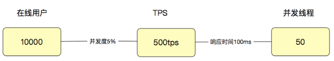
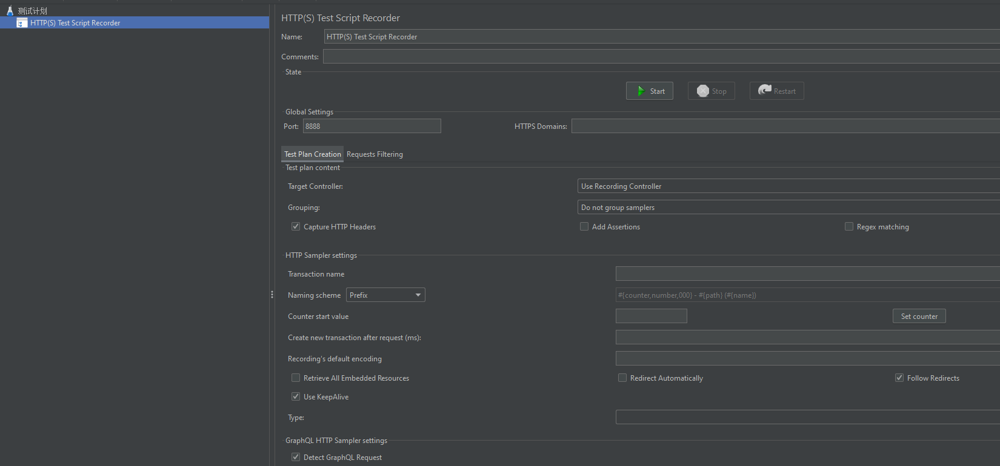
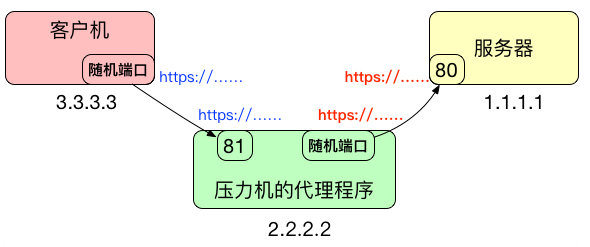

# 1、基础概念

性能测试针对系统的性能指标，建立性能测试模型，制定性能测试方案，制定监控策略，在场景条件之下执行性能场景，分析判断性能瓶颈并调优，最终得出性能结果来评估系统的性能指标是否满足既定值

不要混淆了：压力测试、容量测试、极限测试等，这三种测试其实目的是一样的；

## 1.1、需要有指标

对“有指标”这个定义来说，理论上合理的，并且应该有的指标是：时间指标、容量指标和资源利用率指标

## 1.2、需要有模型

模型是什么？它是真实场景的抽象，可以告诉性能测试人员，业务模型是什么样子。比如说，有 100 种业务，但不是每个业务都需要有并发量，可能只有 50 个业务有，那就要把这些有并发的业务统计出来，哪个业务并发多，哪个业务并发少，做压力时就要控制好这样的比例

## 1.3、要有方案

方案规定的内容中有几个关键点，分别是测试环境、测试数据、测试模型、性能指标、压力策略、准入准出和进度风险。基本上有这些内容就够了，这些内容具体的信息还需要精准

## 1.4、要有监控

要有分层、分段的能力，要有全局监控、定向监控的能力

## 1.5、要有预定的条件

这里的条件包括软硬件环境、测试数据、测试执行策略、压力补偿等内容

## 1.6、要有场景

对性能场景中的“场景”比较正宗的描述是：在既定的环境（包括动态扩展等策略）、既定的数据（包括场景执行中的数据变化）、既定的执行策略、既定的监控之下，执行性能脚本，同时观察系统各层级的性能状态参数变化，并实时判断分析场景是否符合预期；

性能场景也要有分类：
- 基准性能场景：这里要做的是单交易的容量，为混合容量做准备，即将每一个业务都压到最大TPS，从而为后续场景做数据对比；
- 容量性能场景：这一环节必然是最核心的性能执行部分。根据业务复杂度的不同，这部分的场景会设计出很多个；混合容量性能场景，即将所有业务根据比例添加到一个场景中，在数据、软硬件环境、监控等的配合下，分析瓶颈并调优的过程；
- 稳定性性能场景：稳定性测试必然是性能场景的一个分类。只是现在在实际的项目中，稳定性测试基本没和生产一致过。在稳定性测试中，显然最核心的元素是时间（业务模型已经在容量场景中确定了），而时间的设置应该来自于运维周期，而不是来自于老板、产品和架构等这些人的心理安全感。在长时间的运行下观察系统的性能表现；
- 异常性能场景：要做异常性能场景，前提就是要有压力。在压力流量之下，模拟异常；破坏性压力测试，异常场景：宕容器、宕虚拟机、宕缓存、宕队列、宕熔断等；

## 1.7、要有分析调优


## 1.8、要有结果报告

应该在报告中写上调优前后的 TPS、响应时间以及资源对比图
- 场景结果整理；
- 监控结果整理；
- 性能整体分析；
- 性能结论；
- 优化建议
- 运维建议

## 1.9、TPS与响应时间


在 TPS 增加的过程中，响应时间一开始会处在较低的状态，也就是在 A 点之前。接着响应时间开始有些增加，直到业务可以承受的时间点 B，这时 TPS 仍然有增长的空间。再接着增加压力，达到 C 点时，达到最大 TPS。我们再接着增加压力，响应时间接着增加，但 TPS 会有下降（请注意，这里并不是必然的，有些系统在队列上处理得很好，会保持稳定的 TPS，然后多出来的请求都被友好拒绝）。

最后，响应时间过长，达到了超市的程度

# 2、深入理解基础概念

性能场景的需求指标：**业务指标和技术指标**，技术指标不能脱离业务指标，所有的技术指标都是在有业务场景的前提下制定的，而技术指标和业务指标之间也要有详细的换算过程。这样一来，技术指标就不会是一块飞地。同时，在回答了技术指标是否满足的同时，也能回答是否可以满足业务指标；

[常用性能指标](./性能优化#2性能优化衡量指标)：
- `RT`, Response Time，响应时间，通常我们说的响应时间包括了 Request Time 和 Response Time；
- `HPS`, Hits Per Second，每秒点击数；
- `TPS`, Transactions Per Second，每秒事务数；
- `QPS`, Queries Per Second，在MySQL中每秒SQL数
- `RPS`, Requests Per Second, 每秒请求数
- `PV`, Page View，页面浏览量
- `UV`, Unique Visitor，独立访问这
- `IP`, 在性能中一般指独立的IP
- `Throughput`, 吞吐量
- `IOPS`, 一般是磁盘IO性能描述

## 2.1、易混淆指标概念

QPS 一开始是用来描述 MySQL 中 SQL 每秒执行数 Query Per Second，所有的 SQL 都被称为 Query；

RPS 指的是每秒请求数，但是这里的Request到底是什么层面的请求？HTTP？还是其他的？

HPS，这也是个在字面意思上容易理解的概念。只是 Hit 是什么？是和 HTTP Request 等价吗？HPS（Hits Per Second），每秒点击数。Hit 一般在性能测试中，都用来描述 HTTP Request

## 2.2、TPS

**TPS** 是性能领域中一个关键的性能指标概念，它用来描述**每秒事务数**；通常情况下，会根据场景的目的来定义 TPS 的粒度。
- 如果是接口层性能测试，T 可以直接定义为接口级；
- 如果业务级性能测试，T 可以直接定义为每个业务步骤和完整的业务流


如上图，如果要单独测试接口 1、2、3，那 T 就是接口级的；如果要从用户的角度来下一个订单，那 1、2、3 应该在一个 T 中，这就是业务级的了；

所以性能中 TPS 中 T 的定义取决于场景的目标和 T 的作用。一般我们都会这样来定事务：
- 接口级脚本：<br/>
    ——事务 start（接口 1）<br/>
    接口 1 脚本<br/>
    ——事务 end（接口 1）<br/>
    ——事务 start（接口 2）<br/>
    接口 2 脚本<br/>
    ——事务 end（接口 2）<br/>
    ——事务 start（接口 3）<br/>
    接口 3 脚本<br/>
    ——事务 end（接口 3）<br/>
- 业务级接口层脚本（就是用接口拼接出一个完整的业务流）：<br/>
    ——事务 start（业务 A）<br/>
    接口 1 脚本 - 接口 2（同步调用）<br/>
    接口 1 脚本 - 接口 3（异步调用）<br/>
    ——事务 end（业务 A）<br/>
- 用户级脚本<br/>
    ——事务 start（业务 A）<br/>
    点击 0 - 接口 1 脚本 - 接口 2（同步调用）<br/>
    点击 0 - 接口 1 脚本 - 接口 3（异步调用）<br/>
    ——事务 end（业务 A）<br/>

一般情况下，我们会按从上到下的顺序一一地来测试，这样路径清晰地执行是容易定位问题的

## 2.3、响应时间 RT


RT = T2-T1。计算方式非常直接简单，但是，响应时间的定位就复杂了，因为该时间包含了一连串的链路

对于响应时间来说，时间的拆分定位是性能瓶颈定位分析中非常重要的一节；

现在很多[链路追踪工具](../Java/分布式/分布式_.md#十分布式链路追踪)都能够清晰的记录在一个请求链路上，每个节点消耗的时间和请求的持续时间

**并发线程数与TPS**

并发线程数在没有模拟真实用户操作的情况下，和真实的用户操作差别非常远；

并发是需要具体的指标来承载的。你可以说，我的并发是 1000TPS，或者 1000RPS，或者 1000HPS


上面的一个框中有四个箭头，每个都代表着相同的事务；在途中，其实压力工具是 4 个并发线程，由于每个线程都可以在一秒内完成 4 个事务，所以总的 TPS 是 16；

那么用户数怎么来定义呢？因为用户有了业务含义，所以有些人认为一个系统如果有 1 万个用户在线，那就应该测试 1 万的并发线程，这种逻辑实在是不技术。通常，会对在线的用户做并发度的分析，在很多业务中，并发度都会低于 5%，甚至低于 1%。

拿 5% 来计算，就是 10000 用户 x5%=500(TPS)，注意哦，这里是 TPS，而不是并发线程数。如果这时响应时间是 100ms，那显然并发线程数是 500TPS/(1000ms/100ms)=50(并发线程)

通过这样简单的计算逻辑，就可以看出来用户数、线程数和 TPS 之间的关系了：



但是响应时间肯定不会一直都是 100ms 的嘛。所以通常情况下，上面的这个比例都不会固定，而是随着并发线程数的增加，会出现趋势上的关系。

**如何设计响应时间**
- 同行业的对比数据。
- 找到使用系统的样本用户（越多越好），对他们做统计，将结果拿出来，就是最有效的响应时间的制定标准。

## 2.4、业务模型

业务模型应该如何得到呢？这里有两种方式是比较合理的：
- 根据生产环境的统计信息做业务比例的统计，然后设定到压力工具中。有很多不能在线上直接做压力测试的系统，都通过这种方式获取业务模型。
- 直接在生产环境中做流量复制的方式或压力工具直接对生产环境发起压力的方式做压力测试。这种方式被很多人称为全链路压测。其实在生产中做压力测试的方式，最重要的工作不是技术，而是组织协调能力；

## 2.5、TPS与并发

“绝对并发”和“相对并发”：
- 绝对并发指的是同一时刻的并发数；
- 相对并发指的是一个时间段内发生的事情

那么如何来描述并发用户数呢？建议用 TPS 来承载“并发”这个概念。

在线用户数、并发用户数怎么计算：
- 假设一个用户进入系统之后，需要用 10k 内存来维护一个用户的信息，那么 10G 的内存就能 hold 住 1,048,576 个用户的数据，这就是最大在线用户数了。在实际的项目中，我们还会将超时放在一起来考虑；
- 但并发用户数不同，他们需要在系统中执行某个动作；

当统计生产环境中的在线用户数时，并发用户数也是要同时统计的。这里会涉及到一个概念：并发度。要想计算并发用户和在线用户数之间的关系，都需要有并发度。简单的计算逻辑：
- 如果有 10000 个在线用户数，同时并发度是 1%，那显然并发用户数就是 100。
- 如果每个线程的 20TPS，显然只需要 5 个线程就够了（请注意，这里说的线程指的是压力机的线程数）。
- 这时对 Server 来说，它处理的就是 100TPS，平均响应时间是 50ms。50ms 就是根据 1000ms/20TPS 得来的（请注意，这里说的平均响应时间会在一个区间内浮动，但只要 TPS 不变，这个平均响应时间就不会变）。
- 如果有两个 Server 线程来处理，那么一个线程就是 50TPS；。
通常说的“并发”这个词，依赖 TPS 来承载的时候，指的都是 Server 端的处理能力，并不是压力工具上的并发线程数

如果要有公式的话，这个计算公式将非常简单：
$$ {TPS} = \frac{1000ms}{响应时间（单位ms）} \times 压力机线程数 $$

对于压力工具来说，只要不报错，就关心 TPS 和响应时间就可以了，因为 TPS 反应出来的是和服务器对应的处理能力，至少压力线程数是多少，并不关键

# 3、性能测试工具

## 3.1、如何选择工具

如果选择合适自己的工具？所以用工具，一定要知道几点：
- 工具能做什么？
- 工具不能做什么？
- 我们用工具的目标是什么？
- 当工具达不到目标时，我们怎么办？

压测工具市场，现在肯定是首选学习 JMeter，其次是 LoadRunner。
- JMeter 的势头已经很明显了，并且功能在慢慢扩展。开源免费是巨大的优势。
- LoadRunner，不管它的市场现在有多凋零，它仍然是性能测试市场上，功能最为齐全的工具，没有之一

## 3.2、录制脚本

录制功能从原理上来说，分成两种：
- 本地录制：通过截取并解析与服务器的交互协议包，生成脚本文件。比如说 LoadRunner 调起 IE 的时候，不用修改 IE 的代理设置，就可以直接抓取 HTTP 包，并通过自己的解析器解析成脚本。
- 代理录制：通过代理服务器设置，转发客户端和服务器的交互协议包，生成脚本文件。JMeter 中的脚本录制功能就是这样做的。

代理录制逻辑：


- 在 IP 为 2.2.2.2 上的主机上，打开一个代理程序，开 81 端口，所有到 81 端口的都转发到 1.1.1.1 的 80 端口。
- 当 3.3.3.3 主机要访问 1.1.1.1 的的 80 端口，可以通过访问 2.2.2.2 的 81 端口进行转发。

### 3.2.1、JMeter 的录制功能

- [HTTP(S) Test Script Recorder](https://jmeter.apache.org/usermanual/jmeter_proxy_step_by_step.html)

（1）首先打开 JMeter，添加一个线程组，再添加一个 HTTP(S) Test Script Recorder。界面如下：



说明：
- Target Controller：这里指定录制出的脚本要放到哪里去。如果想把不同的脚本放到不同的线程组中去，在录制的时候就可以拆分开。
- Grouping：分组，这个分组功能很实用。但是如何分组就和具体的目标相关了；

（2）点击 start 按钮时，会提示创建一个根 CA 证书。这个证书生成在 bin 目录中，文件名是：`ApacheJMeterTemporaryRootCA.crt`，七天有效期。这个证书将被用来客户端转发 HTTPS 的请求。与此同时，还有另一个证书在同目录中生成，名字是 `proxyserver.jks`，这是 JMeter 自己生成的根证书


JMeter 是用代理的方式来录制的。如果服务端用了 SSL 证书，在代理时也要加 SSL 证书，那么代理录制的结构就会变成这样，SSL 证书就是用来处理上图中蓝色的这一部分



## 3.3、wrk

- [wrk](https://github.com/wg/wrk)

wrk是一款针对HTTP协议的基准测试工具，能够在单机多核CPU的条件下，使用系统自带的高性能I/O机制，如epoll、kqueue等，通过多线程和事件模式，对目标机器产生大量的负载。wrk支持Lua脚本；

如何安装：
```bash
# 下载wrk源码
git clone https://github.com/wg/wrk.git
# 进入到wrk目录，执行如下命令：
# 安装gcc
yum -y install gcc
make
ln -s /wrk/wrk /user/local/bin
```
常用参数：
```
-c, --connections: total number of HTTP connections to keep open with
                   each thread handling N = connections/threads

-d, --duration:    duration of the test, e.g. 2s, 2m, 2h

-t, --threads:     total number of threads to use

-s, --script:      LuaJIT script, see SCRIPTING

-H, --header:      HTTP header to add to request, e.g. "User-Agent: wrk"

    --latency:     print detailed latency statistics

    --timeout:     record a timeout if a response is not received within
                   this amount of time.
```

# 4、性能分析思路


# 参考资料
