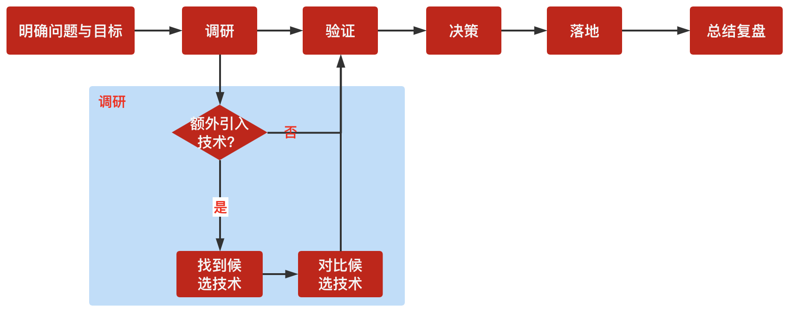

# 1、什么是技术选型

根据实际业务管理的需要，对硬件、软件及所要用到的技术进行规格的选择；

- 狭义上的技术选型：团队决定选用哪种技术去解决业务的问题，比如选择某个技术语言、某个技术框架去开发项目；
- 广义上的技术选型：泛指项目实施过程中的各种技术决策，比如制定了技术方案 A&B，选择其中一套；每个技术决策都是技术选型；

> 决定采纳某个技术之前，做好调研，并尝试小规模引入，积累经验，经过验证后再大规模采用；使用某个技术，甚至某个技术点的功能时，应经过一个较为严谨的测试；

考虑以下：可控性、稳定性、适应性、易用性

# 2、技术选型的误区

- 不尊重需求：只站在技术人的立场；
- 面向流行趋势编程：什么流行，就上什么；
- 面向简历编程；
- 过度考虑：过度考虑通用性、灵活性、扩展性；
- 把看到的当事实：不去验证

# 3、技术选型的步骤

## 3.1、明确问题与目标

- 当前遇到的问题是什么
- 技术选型的目标是什么：目标优先级

## 3.2、调研

- 是否需要采用额外的技术：一般来说如果能在现有技术的基础上想办法实现目标，就不要贸然去引入新的技术；

找到候选技术：
- 团队内部交流；
- 搜索引擎
- 日常积累：
    - 开源中国软件更新栏目：https://www.oschina.net/news/project
    - ThoughtWorks技术雷达： https://www.thoughtworks.com/cn/radar
    - http://www.spring4all.com

## 3.3、验证

- 选择1-3种能够满足需求的技术小规模验证；
- 小型快速的原型项目，快速验证；

## 3.4、决策

- 召集相关人员，组织评审会议，做出决策

# 4、全栈中大前端技术选型

- 前端框架：React、Vue、Solid、Svelte
- UI框架：Antd、Element、Material
- 后端框架：Nest、Koa、Express、Egg
- 其他：API规范、数据库、工程化工具、部署、测试等；

# 5、独立开发者技术栈

## 5.1、AI编码工具

- [Cursor](https://www.cursor.com/)：最佳AI编码IDE
- [Windsurf](https://windsurf.com/editor)：便宜且适合初学者的IDE
- [AI模型开发计划](https://www.codeguide.dev/)：AI模型开发计划
- [Replit](https://replit.com/)：最适合快速构建MVP和移动应用
- [Bolt](https://bolt.new/)：最适合AI编码微型SaaS应用
- [Lovable](https://lovable.dev/)：最适合编码着陆页
- [v0](https://v0.dev/)：最适合设计UI组件

## 5.2、前端与UI

- [NextJS](https://nextjs.org/)：安全且可扩展
- [TailwindCSS](https://tailwindcss.com/)：最佳CSS库
- [Shadcn](https://ui.shadcn.com/)：顶级UI组件库
- [Lucide icons](https://lucide.dev/icons/)：最佳图标库

## 5.3、后端

- [Supabase](https://supabase.com/)：SQL数据库和存储
- [Firebase](https://firebase.google.com/?hl=zh-cn)：数据库、认证和存储（非常适合移动应用）
- [Convex](https://www.convex.dev/)：TypeScript后端逻辑 + 实时查询

## 5.4、用户认证

- [Clerk Dev](https://clerk.com/)：免费认证和等待列表
- [Auth.js](https://authjs.dev/)：简单、开源的认证
- [Firebase Auth](https://firebase.google.com/docs/auth?hl=zh-cn)：快速、可靠的认证（谷歌出品）
- [Supabase Auth](https://supabase.com/docs/guides/auth)：简单的社交登录 + 魔法链接

## 5.5、域名

- [Cloudflare](https://www.cloudflare.com/)：域名、DNS、部署
- [Namecheap](https://www.namecheap.com/)：最便宜的域名选择
- [Vercel domains](https://vercel.com/docs/getting-started-with-vercel/buy-domain)：寻找域名的最佳UI

## 5.6、部署

- Cloudflare Pages → 边缘部署，快速且便宜
- Vercel → 最适合Next.js，无服务器，快速部署
- Render → 全栈，最适合后端重的应用

## 5.7、AI API技术栈

- penAI：最佳GPT模型（GPT4o & o3-mini）
- Claude：最佳编码模型（Sonnet 3.5/3.7）
- Gemini：最佳多模态（Flash 2.0）+ 最新PRO 2.5

## 5.8、支付与邮件

- Stripe → 最适合SaaS支付
- Resend → 为SaaS用户设置邮件
- Convertkit → 给等待列表和用户引导发送邮件

# 参考资料

- [Can I use-查看某项技术浏览器是否支持](https://caniuse.com/)