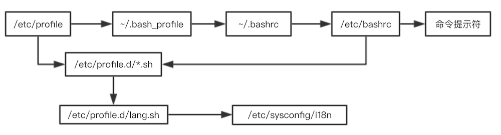

<!-- START doctoc generated TOC please keep comment here to allow auto update -->
<!-- DON'T EDIT THIS SECTION, INSTEAD RE-RUN doctoc TO UPDATE -->
**目录**

- [1、Bash基本功能](#1bash%E5%9F%BA%E6%9C%AC%E5%8A%9F%E8%83%BD)
  - [1.1、历史命令](#11%E5%8E%86%E5%8F%B2%E5%91%BD%E4%BB%A4)
  - [1.2、命令别名](#12%E5%91%BD%E4%BB%A4%E5%88%AB%E5%90%8D)
  - [1.3、bash常用快捷键](#13bash%E5%B8%B8%E7%94%A8%E5%BF%AB%E6%8D%B7%E9%94%AE)
  - [1.4、输入输出重定向](#14%E8%BE%93%E5%85%A5%E8%BE%93%E5%87%BA%E9%87%8D%E5%AE%9A%E5%90%91)
  - [1.5、多命令顺序执行](#15%E5%A4%9A%E5%91%BD%E4%BB%A4%E9%A1%BA%E5%BA%8F%E6%89%A7%E8%A1%8C)
  - [1.6、管道符](#16%E7%AE%A1%E9%81%93%E7%AC%A6)
  - [1.7、通配符](#17%E9%80%9A%E9%85%8D%E7%AC%A6)
  - [1.8、其他特殊符号](#18%E5%85%B6%E4%BB%96%E7%89%B9%E6%AE%8A%E7%AC%A6%E5%8F%B7)
- [2、bash变量](#2bash%E5%8F%98%E9%87%8F)
  - [2.1、规范](#21%E8%A7%84%E8%8C%83)
  - [2.2、变量分类](#22%E5%8F%98%E9%87%8F%E5%88%86%E7%B1%BB)
  - [2.3、本地变量](#23%E6%9C%AC%E5%9C%B0%E5%8F%98%E9%87%8F)
  - [2.4、环境变量](#24%E7%8E%AF%E5%A2%83%E5%8F%98%E9%87%8F)
  - [2.5、位置参数变量](#25%E4%BD%8D%E7%BD%AE%E5%8F%82%E6%95%B0%E5%8F%98%E9%87%8F)
  - [2.7、接受用户输入](#27%E6%8E%A5%E5%8F%97%E7%94%A8%E6%88%B7%E8%BE%93%E5%85%A5)
- [3、bash运算](#3bash%E8%BF%90%E7%AE%97)
  - [3.1、declare声明变量类型](#31declare%E5%A3%B0%E6%98%8E%E5%8F%98%E9%87%8F%E7%B1%BB%E5%9E%8B)
  - [3.2、数值运算](#32%E6%95%B0%E5%80%BC%E8%BF%90%E7%AE%97)
  - [3.3、变量替换](#33%E5%8F%98%E9%87%8F%E6%9B%BF%E6%8D%A2)
- [4、环境变量配置文件](#4%E7%8E%AF%E5%A2%83%E5%8F%98%E9%87%8F%E9%85%8D%E7%BD%AE%E6%96%87%E4%BB%B6)
  - [4.1、source命令](#41source%E5%91%BD%E4%BB%A4)
  - [4.2、环境配置文件](#42%E7%8E%AF%E5%A2%83%E9%85%8D%E7%BD%AE%E6%96%87%E4%BB%B6)
- [5、正则表达式](#5%E6%AD%A3%E5%88%99%E8%A1%A8%E8%BE%BE%E5%BC%8F)
  - [5.1、正则表达式与通配符](#51%E6%AD%A3%E5%88%99%E8%A1%A8%E8%BE%BE%E5%BC%8F%E4%B8%8E%E9%80%9A%E9%85%8D%E7%AC%A6)
  - [5.2、基础正则表达式](#52%E5%9F%BA%E7%A1%80%E6%AD%A3%E5%88%99%E8%A1%A8%E8%BE%BE%E5%BC%8F)
- [6、字符截取命令](#6%E5%AD%97%E7%AC%A6%E6%88%AA%E5%8F%96%E5%91%BD%E4%BB%A4)
  - [6.1、cut命令](#61cut%E5%91%BD%E4%BB%A4)
  - [6.2、printf命令](#62printf%E5%91%BD%E4%BB%A4)
  - [6.3、awk命令](#63awk%E5%91%BD%E4%BB%A4)
  - [6.4、sed命令](#64sed%E5%91%BD%E4%BB%A4)
  - [6.5、sort命令](#65sort%E5%91%BD%E4%BB%A4)
- [7、条件判断](#7%E6%9D%A1%E4%BB%B6%E5%88%A4%E6%96%AD)
  - [7.1、按照文件类型判断](#71%E6%8C%89%E7%85%A7%E6%96%87%E4%BB%B6%E7%B1%BB%E5%9E%8B%E5%88%A4%E6%96%AD)
  - [7.2、按照文件权限进行判断](#72%E6%8C%89%E7%85%A7%E6%96%87%E4%BB%B6%E6%9D%83%E9%99%90%E8%BF%9B%E8%A1%8C%E5%88%A4%E6%96%AD)
  - [7.3、两个文件直接进行比较](#73%E4%B8%A4%E4%B8%AA%E6%96%87%E4%BB%B6%E7%9B%B4%E6%8E%A5%E8%BF%9B%E8%A1%8C%E6%AF%94%E8%BE%83)
  - [7.4、两个整数之间的比较](#74%E4%B8%A4%E4%B8%AA%E6%95%B4%E6%95%B0%E4%B9%8B%E9%97%B4%E7%9A%84%E6%AF%94%E8%BE%83)
  - [7.5、字符串的判断](#75%E5%AD%97%E7%AC%A6%E4%B8%B2%E7%9A%84%E5%88%A4%E6%96%AD)
  - [7.6、多重条件判断](#76%E5%A4%9A%E9%87%8D%E6%9D%A1%E4%BB%B6%E5%88%A4%E6%96%AD)
- [8、流程控制](#8%E6%B5%81%E7%A8%8B%E6%8E%A7%E5%88%B6)
  - [8.1、if语句](#81if%E8%AF%AD%E5%8F%A5)
  - [8.2、case语句](#82case%E8%AF%AD%E5%8F%A5)
  - [8.3、for循环](#83for%E5%BE%AA%E7%8E%AF)
  - [8.4、while循环](#84while%E5%BE%AA%E7%8E%AF)
  - [8.5、util循环](#85util%E5%BE%AA%E7%8E%AF)

<!-- END doctoc generated TOC please keep comment here to allow auto update -->


## 1、Bash基本功能

### 1.1、历史命令

- history [选项] [历史命令保存文件]，选项：
	- -c：清空历史命令
	- -w：把缓存的历史命令写入历史命令保存文件中：~/.bash_history

历史命令默认会保存1000条,可以在环境 变量配置文件/etc/profile中进行修改

历史命令调用：
- 使用上、下箭头调用以前的历史命令 
- 使用“!n”重复执行第n条历史命令
- 使用“!!”重复执行上一条命令
- 使用“!字串”重复执行最后一条以该字 串开头的命令

### 1.2、命令别名

- 设定别名：alias 别名='原命令'
- 查询命令别名：alias
- 删除别名：unalias 别名

命令的执行时的顺序：
- 第一顺位执行用绝对路径或相对路径执行的命令；
- 第二顺位执行别名；
- 第三顺位执行Bash的内部命令；
- 第四顺位执行按照$PATH环境变量定义的目录查找顺序找到的第一个命令；

让别名永久生效：vi /root/.bashrc

### 1.3、bash常用快捷键

- ctrl+A：把光标移动到命令行开头。如果我们输入的命令过长，想要把光标移 动到命令行开头时使用。
- ctrl+E：把光标移动到命令行结尾。
- ctrl+C：强制终止当前的命令。
- ctrl+L：清屏，相当于clear命令。
- ctrl+U：删除或剪切光标之前的命令。我输入了一行很长的命令，不用使用退 格键一个一个字符的删除，使用这个快捷键会更加方便
- ctrl+K：删除或剪切光标之后的内容。
- ctrl+Y：粘贴ctrl+U或ctrl+K剪切的内容。
- ctrl+R：在历史命令中搜索，按下ctrl+R之后，就会出现搜索界面，只要输入 搜索内容，就会从历史命令中搜索。
- ctrl+D：退出当前终端。
- ctrl+Z：暂停，并放入后台。这个快捷键牵扯工作管理的内容，我们在系统管 理章节详细介绍。
- ctrl+S：暂停屏幕输出。
- ctrl+Q：恢复屏幕输出

### 1.4、输入输出重定向

#### 1.4.1、标准输入输出

设备|设备文件名|文件描述符|类型
---|---------|--------|----
键盘|/dev/stdin|0|标准输入
显示器|/dev/sdtout|1|标准输出
显示器|/dev/sdterr|2|标准错误输出

#### 1.4.2、输出重定向

- 标准输出重定向：
	- `命令 > 文件`：以覆盖的方式，把命令的 正确输出输出到指定的文 件或设备当中
	- `命令 >> 文件`：以追加的方式，把命令的 正确输出输出到指定的文 件或设备当中

- 标准错误输出重定向：
	- `错误命令 2> 文件`：以覆盖的方式，把命令的 错误输出输出到指定的文 件或设备当中
	- `错误命令 2>> 文件`：以追加的方式，把命令的 错误输出输出到指定的文 件或设备当中

- 正确输出和错误输 出同时保存
	- `命令 > 文件 2>&1`：以覆盖的方式，把正确输 出和错误输出都保存到同 一个文件当中。
	- `命令 >> 文件 2>&1`：以追加的方式，把正确输 出和错误输出都保存到同 一个文件当中。
	- `命令 &>文件`：以覆盖的方式，把正确输 出和错误输出都保存到同 一个文件当中。
	- `命令 &>>文件`：以追加的方式，把正确输 出和错误输出都保存到同 一个文件当中。
	- `命令>>文件1 2>>文件2`：把正确的输出追加到文件 1中，把错误的输出追加 到文件2中。

#### 1.4.3、输入重定向

wc [选项] [文件名]，选项：
- -c 统计字节数
- -w 统计单词数
- -l 统计行数

`命令<文件`：把文件作为命令的输入

### 1.5、多命令顺序执行

多命令执行|格式|作用
---|-----|----
;  | 命令1;命令2 |多个命令顺序执行，命令之间没有任何逻辑联系
&& | 命令1&&命令2 |逻辑与：当命令1正确执行，则命令2会执行；否则命令2不会执行；
\|\| | 命令1\|\|命令2 |逻辑或：当命令1执行不正确，则命令2才执行；否则命令2不会执行；

比如：
- ls ; date ; cd /user ; pwd
- dd if=输入文件 of=输出文件 bs=字节数 count=个数
	- if=输入文件：指定源文件或源设备
	- of=输出文件：指定目标文件或目标设备
	- bs=字节数：指定一次输入/输出多少字节，即把这些字节看做 一个数据块
	- count=个数 ：指定输入/输出多少个数据块

	`date ; dd if=/dev/zero of=/root/testfile bs=1k count=100000 ; date`

### 1.6、管道符

格式：`命令1 | 命令2`，表示命令1的正确输出作为命令2的操作对象

- grep [选项] "搜索内容" 文件名
	- -i: 忽略大小写
	- -n: 输出行号
	- -v: 反向查找
	- --color=auto 搜索出的关键字用颜色显示

### 1.7、通配符

通配符 | 作用
------| -----
？    | 匹配一个任意字符
*    | 匹配0个或任意多个任意字符，也就是可以匹配任何内容
[]   | 匹配中括号中任意一个字符。例如:[abc]代表一定匹配 一个字符，或者是a，或者是b，或者是c
[-]   | 匹配中括号中任意一个字符，-代表一个范围。例如:[a-z] 代表匹配一个小写字母
[^]  | 逻辑非，表示匹配不是中括号内的一个字符。例如:[^0- 9]代表匹配一个不是数字的字符

```bash
 [root@localhost ~]# cd /tmp/ 
 [root@localhost tmp]# rm -rf * 
 [root@localhost tmp]# touch abc 
 [root@localhost tmp]# touch abcd 
 [root@localhost tmp]# touch 012 
 [root@localhost tmp]# touch 0abc 
 [root@localhost tmp]# ls ?abc 
 [root@localhost tmp]# ls [0-9]* 
 [root@localhost tmp]# ls [^0-9]*
```

### 1.8、其他特殊符号

符号    |  作用
-------|------
'' | 单引号。在单引号中所有的特殊符号，如“$”和“`”(反引号)都 没有特殊含义。
"" | 双引号。在双引号中特殊符号都没有特殊含义，但是“$”、“`” 和“\”是例外，拥有“调用变量的值”、“引用命令”和“转义 符”的特殊含义
`` | 反引号。反引号括起来的内容是系统命令，在Bash中会先执行它。 和$()作用一样，不过推荐使用$()，因为反引号非常容易看错
$() | 和反引号作用一样，用来引用系统命令
\# | 在Shell脚本中，#开头的行代表注释
$ | 用于调用变量的值，如需要调用变量name的值时，需要用$name 的方式得到变量的值
\ | 转义符，跟在\之后的特殊符号将失去特殊含义，变为普通字符。 如\$将输出“$”符号，而不当做是变量引用

```bash
[root@localhost ~]# echo `ls`
[root@localhost ~]# echo $(date)
[root@localhost ~]# name=sc 
[root@localhost ~]# echo '$name' 
[root@localhost ~]# echo "$name" 
[root@localhost ~]# echo ‘$(date)' 
[root@localhost ~]# echo “$(date)"
```

## 2、bash变量

### 2.1、规范

- 变量名称可以由字母、数字和下划线组成 ，但是不能以数字开头。如果变量名是 “2name”则是错误的；
- 在Bash中，变量的默认类型都是字符串型 ，如果要进行数值运算，则必须指定变量类型为数值型；
- 变量用等号连接值，等号左右两侧不能有空格，如果有空格，需要使用单引号或双引号包括；
- 在变量的值中，可以使用“\”转义符；
- 如果需要增加变量的值，那么可以进行变量值的叠加。不过变量需要用双引号包含“$变量名”或用${变量名}包含；
- 如果是把命令的结果作为变量值赋予变量，则需要使用反引号或$()包含命令；
- 环境变量名建议大写，便于区分

### 2.2、变量分类

- 用户自定义变量
- 环境变量：这种变量中主要保存的是和系统操作环境相关的数据。
- 位置参数变量：这种变量主要是用来向脚本当中传递参数或数据的，变量名不能自定义，变量作用是固定的。
- 预定义变量：是Bash中已经定义好的变量，变量名不能自定义，变量作用也是固定的

### 2.3、本地变量

- 变量定义
	```
	[root@localhost ~]# name="shen chao"
	```
- 变量叠加
	```
	[root@localhost ~]# aa=123 
	[root@localhost ~]# aa="$aa"456 
	[root@localhost ~]# aa=${aa}789
	```
- 变量调用
	```
	][root@localhost ~]# echo $name
	```
- 变量查看
	```
	[root@localhost ~]# set
	```
- 变量删除
	```
	[root@localhost ~]# unset name
	```

### 2.4、环境变量

用户自定义变量只在当前的Shell中生效， 而环境变量会在当前Shell和这个Shell的所有子Shell当中生效。如果把环境变量写入相应的配置文件，那么这个环境变量就会在所有的Shell中生效；

**设置环境变量：**

- 申明变量：export 变量名=变量值
- 查询变量：env
- 删除变量：unset 变量名

**系统常见环境变量**

- PATH：系统查找命令的路径
- PATH变量叠加：`PATH="$PATH":/root/sh`
- PS1：定义系统提示符的变量
	```
	\d: 显示日期，格式为“星期 月 日” 
	\h: 显示简写主机名。如默认主机名“localhost” 
	\t: 显示24小时制时间，格式为“HH:MM:SS” 
	\T: 显示12小时制时间，格式为“HH:MM:SS” 
	\A: 显示24小时制时间，格式为“HH:MM” 
	\u: 显示当前用户名 
	\w: 显示当前所在目录的完整名称 
	\W: 显示当前所在目录的最后一个目录 
	\#: 执行的第几个命令
	\$: 提示符。如果是root用户会显示提示符为“#”，如果是普通用户 会显示提示符为“$”
	```

**环境变量分类**
- 对所有用户生效的环境变量：`/etc/profile`
- 对特定用户生效的环境变量：对应的家目录下的`~/.bashrc` 或者 `~/.bash_profile`；
- 临时有效的环境变量：使用export

### 2.5、位置参数变量

位置参数变量  |  作用
------------|------
$n  | n为数字，`$0`代表命令本身，`$1-$9`代表第一 到第九个参数，十以上的参数需要用大括号 包含，如`${10}`
$*	| 这个变量代表命令行中所有的参数，`$*`把所 有的参数看成一个整体
$@	| 这个变量也代表命令行中所有的参数，不过 $@把每个参数区分对待
$#	| 这个变量代表命令行中所有参数的个数

- 例子1：
	```bash
	#!/bin/bash
	num1=$1
	num2=$2
	sum=$(( $num1 + $num2)) #变量sum的和是num1加num2 
	echo $sum #打印变量sum的值
	```
- `$*`与`$@`的区别
	```bash
	#!/bin/bash
	for i in "$*";
	do
		#$*中的所有参数看成是一个整体，所以这个for循环只会循环一次 do
		echo "The parameters is: $i"
	done
	x=1
	for y in "$@";
	do
		#$@中的每个参数都看成是独立的，所以“$@”中有几个参数，就会循环几次 do
		echo "The parameter$x is: $y"
		x=$(( $x +1 ))
	done
	```

### 2.6、预定义变量

- `$?`：最后一次执行的命令的返回状态。如果这个变量的值为0，证明上一个命令正确执行；如果 这个变量的值为非0（具体是哪个数，由命令自己来决定），则证明上一个命令执行不正确了。
- `$$`：当前进程的进程号(PID)
- `$!`：后台运行的最后一个进程的进程号(PID)

退出状态码：以上一条指令的返回结果为准
- 0：命令执行成功
- 1：一般性未知错误

改变退出状态码的exit命令： `exit $exit_code`


### 2.7、接受用户输入

read [选项] [变量名]，选项：
- -p “提示信息”：在等待read输入时，输出提示信息
- -t 秒数：read命令会一直等待用户输入，使用 此选项可以指定等待时间
- -n 字符数：read命令只接受指定的字符数，就会 执行
- -s：隐藏输入的数据，适用于机密信息的输入

```bash
 #!/bin/bash
# Author: shenchao (E-mail: shenchao@lampbrother.net)
read -t 30 -p "Please input your name: " name #提示“请输入姓名”并等待30秒，把用户的输入保存入变量name中 
echo "Name is $name "

read -s -t 30 -p "Please enter your age: " age
#年龄是隐私，所以我们用“-s”选项隐藏输入 
echo -e "\n"
echo "Age is $age "

read -n 1 -t 30 -p "Please select your gender[M/F]: " gender
#使用“-n 1”选项只接收一个输入字符就会执行(都不用输入回车) 
echo -e "\n"
echo "Sex is $gender"
```

## 3、bash运算

### 3.1、declare声明变量类型

declare [+/-][选项] 变量名，选项：
- -：给变量设定类型属性
- +：取消变量的类型属性
- -i：将变量声明为整数型(integer) -x: 将变量声明为环境变量
- -p：显示指定变量的被声明的类型

### 3.2、数值运算

- 方式1：
	```sh
	[root@localhost ~]# aa=11 
	[root@localhost ~]# bb=22 
	#给变量aa和bb赋值
	[root@localhost ~]# declare -i cc=$aa+$bb
	```

- 方式2：expr或let数值运算工具
	```sh
	[root@localhost ~]# aa=11
	[root@localhost ~]# bb=22 
	#给变量aa和变量bb赋值 
	[root@localhost ~]# dd=$(expr $aa + $bb)
	#dd的值是aa和bb的和。注意“+”号左右两 侧必须有空格
	```
- 方式3：`$((运算式))` 或 `$[运算式]`
	```sh
	[root@localhost ~]# aa=11 
	[root@localhost ~]# bb=22 
	[root@localhost ~]# ff=$(( $aa+$bb )) 
	[root@localhost ~]# gg=$[ $aa+$bb ]
	```
运算符的优先级同正常的运算符优先级

### 3.3、变量替换

变量置换方式 | 变量y没有设置 | 变量y为空值 | 变量y设置值
-----------|-------------|-----------|-----------
x=${y-新值} | x=新值	| x为空	     |x=$y
x=${y:-新值} | x=新值	| x=新值	|x=$y
x=${y+新值} |x为空 	|	x=新值		| x=新值
x=${y:+新值}|x为空	| 	x为空		|x=新值
x=${y=新值}	|x=新值 y=新值 |x为空 y值不变|x=$y y值不变
x=${y:=新值} | x=新值 y=新值 | x=新值 y=新值 | x=$y y值不变
x=${y?新值} |新值输出到标准，错误输出(就是屏幕) | x为空| x=$y
x=${y:?新值}|新值输出到标准 错误输出 |新值输出到标准 错误输出 | x=$y

```sh
[root@localhost ~]# unset y
#删除变量y
[root@localhost ~]# x=${y-new} #进行测试
[root@localhost ~]# echo $x
new 
#因为变量y不存在，所以x=new
```

## 4、环境变量配置文件

### 4.1、source命令
```sh
[root@localhost ~]# source 配置文件 或
[root@localhost ~]# . 配置文件
```

### 4.2、环境配置文件

环境变量配置文件中主要是定义对系统的操作环境生效的系统默认环境变量，比如 PATH、HISTSIZE、PS1、HOSTNAME等默认环境变量
- /etc/profile
- /etc/profile.d/*.sh
- ~/.bash_profile
- ~/.bashrc
- /etc/bashrc

#### 4.2.1、/etc/profile

- USER变量
- LOGNAME变量
- MAIL变量
- PATH变量
- HOSTNAME变量
- HISTSIZE变量
- umask
- 调用/etc/profile.d/*.sh文件

#### 4.2.2、`~/.bash_profile`

- 调用了~/.bashrc文件。
- 在PATH变量后面加入了“:$HOME/bin” 这个目录

#### 4.2.3、`~/.bashrc的作用`
- 定义默认别名
- 调用/etc/bashrc

#### 4.2.4、/etc/bashrc的作用
- PS1变量
- umask
- PATH变量
- 调用/etc/profile.d/*.sh文件

***注意：***该配置文件在未登录的情况下使用的

#### 4.2.5、上述配置文件的执行顺序



## 5、正则表达式

### 5.1、正则表达式与通配符

- 正则表达式用来在文件中匹配符合条件的字符串，正则是包含匹配。grep、awk、sed等命令可以支持正则表达式；
- 通配符用来匹配符合条件的文件名，通配符是完全匹配。ls、find、cp这些命令不支持正则表达式，所以只能使用shell自己的通配符来进行匹配了；

### 5.2、基础正则表达式

元字符 | 作用
------| ------
`*`	| 前一个字符匹配0次或任意多次
`.`	|匹配除了换行符外任意一个字符
`^` | 匹配行首。例如:^hello会匹配以hello开头的行
`$`	|匹配行尾。例如:hello&会匹配以hello结尾的行
`[]`|匹配中括号中指定的任意一个字符，只匹配一个字符。 例如:[aoeiu] 匹配任意一个元音字母，[0-9] 匹配任意一位 数字， [a-z][0-9]匹配小写字和一位数字构成的两位字符
`[^]`|匹配除中括号的字符以外的任意一个字符。例如:[^0-9] 匹配 任意一位非数字字符，[^a-z] 表示任意一位非小写字母
`\` |转义符。用于取消讲特殊符号的含义取消
`\{n\}`|表示其前面的字符恰好出现n次。例如:[0-9]\{4\} 匹配4位数 字，[1][3-8][0-9]\{9\} 匹配手机号码
`\{n,\}`|表示其前面的字符出现不小于n次。例如: [0-9]\{2,\} 表示两 位及以上的数字
`\{n,m\}`|表示其前面的字符至少出现n次，最多出现m次。例如: [a- z]\{6,8\} 匹配6到8位的小写字母

## 6、字符截取命令

操作文件：student.txt
```
ID      Name    PHP     Linux   MySQL   Avg
1       Coco    80      78      88      88
2       Holiday 90      96      93      93
3       Jayden  95      95      100     97.5
```

### 6.1、cut命令

格式：`cut [选项] 文件名`，选项：
- `-f` 列号：提取第几列
- `-d` 分隔符：按照指定分隔符分割列

```bash
[root@bluefish shell]# cut -f 2 student.txt 
# 提取文件student.txt第2列
[root@bluefish shell]# cut -f 2,3 student.txt 
# 提取文件student.txt第2，3列
[root@bluefish shell]# cut -d ":" -f 1,3 /etc/passwd
# passwd文件按“:” 分割，提取第1，3列
```

cut命令的局限：只能按照制表位或者其他分割符处理，无法按照空格进行分割，如：
```bash
[root@localhost ~]# df -h | cut -d " " -f 1,3
# 无法对df的结果进行分割处理
```

### 6.2、printf命令

printf '输出类型输出格式' 输出内容；

- （1）输出类型：
	- `%ns`：输出字符串。n是数字指代输出几个字符；
	- `%ni`：输出整数。n是数字指代输出几个数字；
	- `%m.nf`：输出浮点数。m和n是数字，指代输出的整数 位数和小数位数。如%8.2f代表共输出8位数，其中2位是小数，6位是整数；

- （2）输出格式：
	- `\a`：输出警告声音
	- `\b`：输出退格键，也就是Backspace键
	- `\f`：清除屏幕
	- `\n`：换行
	- `\r`：回车，也就是Enter键
	- `\t`：水平输出退格键，也就是Tab键 \v: 垂直输出退格键，也就是Tab键

	```bash
	[root@localhost ~]# printf %s 1 2 3 4 5 6 
	[root@localhost ~]# printf %s %s %s 1 2 3 4 5 6
	[root@localhost ~]# printf '%s %s %s' 1 2 3 4 5 6 
	[root@localhost ~]# printf '%s %s %s\n' 1 2 3 4 5 6
	```

	```bash
	[root@bluefish shell]# printf '%s' $(cat student.txt)
	IDNamePHPLinuxMySQLAvg1Coco807888882Holiday909693933Jayden959510097.5

	[root@bluefish shell]# printf '%s\t %s\t %s\t %s\t %s\t %s\t \n' $(cat student.txt)
	ID       Name    PHP     Linux   MySQL   Avg     
	1        Coco    80      78      88      88      
	2        Hol     90      96      93      93      
	3        Jayden  95      95      100     97.5 
	```
 
 在`awk`命令的输出中支持`print`和`printf`命令：
 - `print`：print会在每个输出之后自动加入一换行符（Linux默认没有print命令）；
 - `printf`：printf是标准格式输出命令，并不会自动加入换行符，如果需要换行，需要手工加入换行符

### 6.3、awk命令

`awk ‘条件1{动作1} 条件2{动作2}...’ 文件名`

- 条件：一般使用关系表达式作为条件
- 动作：格式化输出，流程控制语句

	```bash
	[root@bluefish shell]# awk '{printf $2 "\t" $6 "\n"}' student.txt
	Name    Avg
	Coco    88
	Hol     93
	Jayden  97.5
	[root@bluefish shell]# df -h | awk '{print $1 "\t" $3}'
	Filesystem      Used
	/dev/mapper/VolGroup00-LogVol00 2.9G
	devtmpfs        0
	tmpfs   0
	tmpfs   17M
	tmpfs   0
	/dev/sda2       89M
	tmpfs   0
	```

- BEGIN：在输出结果一行输出数据，BEGIN后面的动作只执行一次，必须大写；相应的有END，在输出结果最后输出END后跟的动作

	```bash
	[root@bluefish shell]# awk 'BEGIN{printf "This is a transcript \n" } {printf $2 "\t" $6 "\n"}' student.txt
	This is a transcript 
	Name    Avg
	Coco    88
	Hol     93
	Jayden  97.5
	```

- FS内置变量

	```bash
	[root@bluefish shell]# cat /etc/passwd | grep "/bin/bash" | \
	> awk 'BEGIN {FS=":"} {printf $1 "\t" $3 "\n"}'
	root    0
	vagrant 1000
	tomcat  1001
	rabbitmq        996
	```

- 关系运算符

	```bash
	[root@bluefish shell]# cat student.txt | grep -v Name | awk '$6 >= 93 {printf $2 "\n" }'
	Hol
	Jayden
	```

### 6.4、sed命令

sed 是一种几乎包括在所有 UNIX 平台（包括 Linux的轻量级流编辑器。sed主要是用来将数据进行选取、替换、删除、新增的命令

`sed [选项] ‘[动作]’ 文件名`

- 选项：
	- `-n`：一般sed命令会把所有数据都输出到屏幕，如果加入此选择，则只会把经过sed命令处理的行输出到屏幕。
	- `-e`：允许对输入数据应用多条sed命令编辑
	- `-i`：用sed的修改结果直接修改读取数据的文件， 而不是由屏幕输出

- 动作：
	- `a \`：追加，在当前行后添加一行或多行。添加多行时，除最后一行外，每行末尾需要用“\”代表数据未完结。
	- `c \`：行替换，用c后面的字符串替换原数据行，替换多行时，除最后一行外，每行末尾需用“\”代表数据未完结。
	- `i \`：插入，在当期行前插入一行或多行。插入多行时，除最后一行外，每行末尾需要用“\”代表数据未完结。
	- `d`：删除，删除指定的行
	- `p`：打印，输出指定的行
	- `s`：字串替换，用一个字符串替换另外一个字符串。格式为“行范围s/旧字串/新字串/g”(和vim中的替换格式类似)

**行数据操作**

- `sed '2p' student.txt`： 查看文件的第二行
- `sed -n '2p' student.txt`
- `sed '2,4d' student.txt`：删除第二行到第四行的数据，但不修改文 件本身
- `sed '2a hello' student.txt`：在第二行后追加hello
- `sed '2i hello \ world' student.txt`：在第二行前插入两行数据
- `sed '2c No such person‘ student.txt`：数据替换

**字符串替换：`sed ‘s/旧字串/新字串/g’ 文件名`**

- `sed '3s/74/99/g' student.txt`：在第三行中，把74换成99
- `sed -i '3s/74/99/g' student.txt`：sed操作的数据直接写入文件
- `sed -e 's/Coco//g ; s/Jayden//g' student.txt`：同时把“Coco”和“Jayden”替换为空

### 6.5、sort命令

排序命令，`sort [选项] 文件名`，选项如下：
- -f：忽略大小写
- -n：以数值型进行排序，默认使用字符串型排序
- -r：反向排序
- -t：指定分隔符，默认是分隔符是制表符
- -k n[,m]：按照指定的字段范围排序。从第n字段开始， m字段结束（默认到行尾）

	```bash
	[root@localhost ~]# sort /etc/passwd
	#排序用户信息文件
	[root@localhost ~]# sort -r /etc/passwd
	#反向排序
	[root@localhost ~]# sort -t ":" -k 3,3 /etc/passwd
	#指定分隔符是“:”，用第三字段开头，第三字段结尾排序，就是只用第三字段排序，这里是按照字符顺序排序的
	[root@localhost ~]# sort -n -t ":" -k 3,3 /etc/passwd
	# 以数字进行排序
	```
	
## 7、条件判断

两种判断格式：

- test -e /root/install.log
- [ -e /root/install.log ]，括号两端必须有空格

### 7.1、按照文件类型判断

测试选项 | 作用
--------| -------
`-b 文件` | 判断该文件是否存在，并且是否为块设备文件（是否块设备文件为真）
`-c 文件` | 判断该文件是否存在，并且是否为字符设备文件(是字符设备 文件为真)
`-d 文件` | 判断该文件是否存在，并且是否为目录文件(是目录为真)
`-e 文件` | 判断该文件是否存在(存在为真)
`-f 文件` | 判断该文件是否存在，并且是否为普通文件(是普通文件为真）
`-L 文件` | 判断该文件是否存在，并且是否为符号链接文件(是符号链接 文件为真)
`-p 文件` | 判断该文件是否存在，并且是否为管道文件(是管道文件为真)
`-s 文件` | 判断该文件是否存在，并且是否为非空(非空为真)
`-S 文件` | 判断该文件是否存在，并且是否为套接字文件(是套接字文件为真)

```bash
[ -d /root ] && echo "yes" || echo "no"
# 第一个判断命令如果正确执行，则打印“yes”，否则打 印“no”
```

### 7.2、按照文件权限进行判断

测试选项 | 作用
--------| -------
`-r 文件` | 判断该文件是否存在，并且是否该文件拥有读权限(有读 权限为真)
`-w 文件` | 判断该文件是否存在，并且是否该文件拥有写权限(有写 权限为真)
`-x 文件` | 判断该文件是否存在，并且是否该文件拥有执行权限(有 执行权限为真)
`-u 文件`  | 判断该文件是否存在，并且是否该文件拥有SUID权限(有 SUID权限为真)
`-g 文件` | 判断该文件是否存在，并且是否该文件拥有SGID权限(有 SGID权限为真)
`-k 文件` | 判断该文件是否存在，并且是否该文件拥有SBit权限(有 SBit权限为真)

```bash
[root@bluefish shell]# [ -w /root/dev/shell/student.txt ] && echo yes || echo no
# 判断文件是否有写权限
```

### 7.3、两个文件直接进行比较

测试选项 | 作用
--------| -------
`文件1 -nt 文件2` | 判断文件1的修改时间是否比文件2的新(如果新则为真)
`文件1 -ot 文件2` | 判断文件1的修改时间是否比文件2的旧(如果旧则为真)
`文件1 -ef 文件2` | 判断文件1是否和文件2的Inode号一致，可以理解为两个文件是否为同一个文件。这个判断用于判断硬链接是很 好的方法

```bash
ln /root/student.txt /tmp/stu.txt
# 创建个硬链接吧
[ /root/student.txt -ef /tmp/stu.txt ] && echo "yes" || echo "no" yes
# 用test测试下
```

### 7.4、两个整数之间的比较

测试选项 | 作用
--------| -------
`整数1 -eq 整数 2` | 判断整数1是否和整数2相等(相等为真)
`整数1 -ne 整数 2` | 判断整数1是否和整数2不相等(不相等位置)
`整数1 -gt 整数 2` | 判断整数1是否大于整数2(大于为真)
`整数1 -lt 整数 2` | 判断整数1是否小于整数2(小于位置)
`整数1 -ge 整数 2` | 判断整数1是否大于等于整数2(大于等于为真)
`整数1 -le 整数 2` | 判断整数1是否小于等于整数2(小于等于为真)

```bash
[ 23 -ge 22 ] && echo "yes" || echo "no" yes
#判断23是否大于等于22，当然是了
[ 23 -le 22 ] && echo "yes" || echo "no" no #判断23是否小于等于22，当然不是了
```

### 7.5、字符串的判断

测试选项 | 作用
--------| -------
`-z 字符串` | 判断字符串是否为空(为空返回真)
`-n 字符串` | 判断字符串是否为非空(非空返回真)，如果后面的变量无法判断是否已经定义，需要对变量加上引号` -n "$var"`
`字串1 == 字串2` | 判断字符串1是否和字符串2相等(相等返回真)，用等号也可以
`字串1 != 字串2` | 判断字符串1是否和字符串2不相等(不相等返回真)
`字串1 < 字串2` | 小于，需要转义

```bash
name=bluefish
#给name变量赋值
[ -z "$name" ] && echo "yes" || echo "no" no
#判断name变量是否为空，因为不为空，所 以返回no
```

### 7.6、多重条件判断

测试选项 | 作用
--------| -------
`判断1 -a 判断2` | 逻辑与，判断1和判断2都成立，最终的结果才为真
`判断1 -o 判断2` | 逻辑或，判断1和判断2有一个成立，最终的结果就为 真
`! 判断` | 逻辑非，使原始的判断式取反

```bash
aa=11
[ -n "$aa" -a "$aa" -gt 23 ] && echo "yes" || echo "no"
no 
# 判断变量aa是否有值，同时判断变量aa的是否大于23
# 因为变量aa的值不大于23，所以虽然第一个判断值为真， 返回的结果也是假

aa=24
[ -n "$aa" -a "$aa" -gt 23 ] && echo "yes" || echo "no" yes
```

## 8、流程控制

### 8.1、if语句

#### 8.1.1、单分支if条件语句

- `if`语句使用fi结尾，和一般语言使用大括号结尾不同；
- `[ 条件判断式 ]`就是使用test命令判断，所 以中括号和条件判断式之间必须有空格；
- `then`后面跟符合条件之后执行的程序，可以放在`[]`之后，用 `;` 分割。也可以换行写入，就不需要 `;` 了

```bash
if [ 条件判断 ]; then
	程序
fi

# 或者
if [ 条件判断 ]
	then 
		程序
fi
```

例子:判断分区使用率

```bash
#!/bin/bash
# 统计根分区使用率

rate=$(df -h  | grep "/dev/sda2" | awk '{print $5}' | cut -d "%" -f1)
if [ $rate -ge 80 ]
	then
		echo "Warning /dev/sda2 is full"
fi
```

#### 8.1.2、双分支if条件语句

```bash
if [ 条件判断 ]
	then
		条件成立时，执行的程序
	else
		条件不成立时，执行的另衣蛾程序
fi
```

**例子1：备份mysql数据库**

```bash
#!/bin/bash
ntpdate asia.pool.ntp.org &>/dev/null
#同步系统时间
date=$(date +%y%m%d) #把当前系统时间按照“年月日”格式赋予变量date
size=$(du -sh /var/lib/mysql/mysql/help_topic.ibd) #统计mysql数据库的大小，并把大小赋予size变量

if [ -d /tmp/dbbak ]
	then
		echo "Date: $date" > /tmp/dbbak/dbinfo.txt
		echo "Data size: $size" >> /tmp/dbbak/dbinfo.txt
		cd /tmp/dbbak
		tar -zcf mysq-lib-$date.tar.gz /var/lib/mysql/mysql/help_topic.ibd &> /dev/null
		rm -rf /tmp/dbbak/dbinfo.txt
	else
		mkdir /tmp/dbbak
		echo "Date: $date" > /tmp/dbbak/dbinfo.txt
		echo "Data size: $size" >> /tmp/dbbak/dbinfo.txt
		cd /tmp/dbbak
		tar -zcf mysq-lib-$date.tar.gz /var/lib/mysql/mysql/help_topic.ibd &> /dev/null
		rm -rf /tmp/dbbak/dbinfo.txt
fi
```

 **例子2:判断apache是否启动**

```bash
port=$(nmap -sT 192.168.1.156 | grep tcp | grep http | awk '{print $2}')
#使用nmap命令扫描服务器，并截取apache服务的状态，赋予变量port 

if [ "$port" == "open" ]
	then
		echo “$(date) httpd is ok!” >> /tmp/autostart-acc.log
	else
		/etc/rc.d/init.d/httpd start &>/dev/null
		echo "$(date) restart httpd !!" >> /tmp/autostart-err.log 
fi
```

#### 8.1.3、多分支if条件语句
```
if [ 条件判断式1 ] 
	then
		当条件判断式1成立时，执行程序1 
elif [ 条件判断式2 ]
	then 当条件判断式2成立时，执行程序2
	# 省略更多条件...
else
	当所有条件都不成立时，最后执行此程序 
fi
```

例子
```bash
#!/bin/bash

read -p "please input a filename: " file

if [ -z "$file" ]
#判断file变量是否为空
	then
		echo "ERROR, please input a fileName!!"
		exit 1
elif [ ! -e "$file" ]
#判断file的值是否存在
	then
		echo "your input is not a file"
		exit 2
elif [ -f "$file" ]
#判断file的值是否为普通文件
	then
		echo "$file is a regulare file!"
elif [ -d "$file" ]
#判断file的值是否为目录文件
	then
		echo "$file is a directory"
else
        echo "$file is illeaga file"    

fi
```

### 8.2、case语句

`case`语句和`if...elif...else`语句一样都是多分支条件语句，不过和`if`多分支条件语句不同的是，`case`语句只能判断一种条件关 系，而`if`语句可以判断多种条件关系;
```bash
case $变量名 in 
	"值1")
		如果变量的值等于值1，则执行程序1
		;; 
	"值2")
		如果变量的值等于值2，则执行程序2
		;;
	...省略其他分支... 
	*)
   		如果变量的值都不是以上的值，则执行此程序
		;; 
esac
```

例子：

```bash
#!/bin/bash
echo 'Airline to Shanghai, please input "1"'
echo 'Airline to Guangzhou, please input "2"'
echo 'Airline to Beijing, please input "3"'
read -p "please input your choice: " -t 30 de

echo "Your input $de \n"

case $de in
	1)
		echo "Welcome to Shanghai!"
		;;
	2)
		echo "Welcome to Guangzhou"
		;;
	3)
		echo "Welcome to Beijing"
		;;
	*)
		echo "illegal input"
		;;
esac
```

### 8.3、for循环

- 语法1：

	```bash
	for 变量 in 值1值2值3... 
		do
			程序 
		done
	```

	例子：批量解压缩脚本

	```bash
	#!/bin/bash

	cd /lamp
	ls *.tar.gz > ls.log
	for i in $(cat ls.log)
		do
			tar -zxf $i &> /dev/null
		done
	```

- 语法2：
	```bash
	for (( 初始值; 循环控制条件; 变量变化))
		do
			程序
		done
	```
	例子
	```bash
	#!/bin/bash
	s=0
	for (( i=0; i<=100; i=i+1))
		do
			s=$(($s+$i))
		done
	echo "The sum of  1+2+3+...+100 is: $s"
	```

### 8.4、while循环

`while`循环是不定循环，也称作条件循环 。只要条件判断式成立，循环就会一直继 续，直到条件判断式不成立，循环才会停止。这就和`for`的固定循环不太一样了。

```bash
while [ 条件判断式 ]
	do
		程序
	done
```

```bash
#!/bin/bash
i=1
s=0

while [ i -le 100 ]
	do
		s=$(($s + $i))
		i=$(($i + 1))
	done
```

### 8.5、util循环

`until`循环，和`while`循环相反，`until`循环时 只要条件判断式不成立则进行循环，并执`行循环程序。一旦循环条件成立，则终止循环

```bash
until [ 条件判断式 ]
	do
		程序
	done
```

```bash
#!/bin/bash
i=1
s=0

until [ i -gt 100 ]
# 循环直到变量i的值大于100，就停止循环
	do
		s=$(($s + $i))
		i=$(($i + 1))
	done
```


