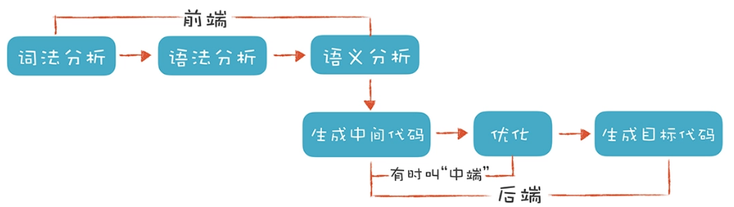

# 1、编译器前端过程

编译器前端指的是编译器对程序代码的分析和理解过程，它通常只跟语言的语法有关，跟目标机器无关。而与之对应的“后端（Back End）”则是生成目标代码的过程，跟目标机器有关；



编译器的**前端**技术分为**词法分析**、**语法分析**和**语义分析**三个部分。而它主要涉及自动机和形式语言方面的基础的计算理论;

## 1.1、词法分析

词法分析（Lexical Analysis），通常，编译器的第一项工作叫做词法分析；程序处理的叫做“词法记号”，英文叫 Token，就跟阅读文章一样，文章是由一个个的中文单词组成的；

如下代码：
```c
#include <stdio.h>
int main(int argc, char* argv[]){
    int age = 45;
    if (age >= 17+8+20) {
        printf("Hello old man!\\n");
    }
    else{
        printf("Hello young man!\\n");
    }
    return 0;
}
```
可以通过制定一些规则来区分每个不同的 Token：
- **识别 age 这样的标识符**：它以字母开头，后面可以是字母或数字，直到遇到第一个既不是字母又不是数字的字符时结束；
- **识别 >= 这样的操作符**： 当扫描到一个 `>` 字符的时候，就要注意，它可能是一个 `GT`（Greater Than，大于）操作符。但由于 `GE`（Greater Equal，大于等于）也是以 `>` 开头的，所以再往下再看一位，如果是 `=`，那么这个 Token 就是 `GE`，否则就是 `GT`；
- **识别 45 这样的数字字面量**：当扫描到一个数字字符的时候，就开始把它看做数字，直到遇到非数字的字符；

上述这些规则可以借助词法分析器来生成，比如Lex；这些生成工具是基于一些规则来工作的，这些规则用“正则文法”表达，符合正则文法的表达式称为“正则表达式”；生成工具可以读入正则表达式，生成一种叫“有限自动机”
的算法，来完成具体的词法分析工作；
- 正则文法是一种最普通、最常见的规则，写正则表达式的时候用的就是正则文法；
- 有限自动机是有限个状态的自动机器；

词法分析器也是一样，它分析整个程序的字符串，当遇到不同的字符时，会驱使它迁移到不同的状态。例如，词法分析程序在扫描 age 的时候，处于“标识符”状态，等它遇到一个 > 符号，就切换到“比较操作符”的状态。词法分析过程，就是这样一个个状态迁移的过程。

> 词法分析是把程序分割成一个个 Token 的过程，可以通过构造有限自动机来实现。

## 1.2、语法分析

语法分析（Syntactic Analysis, or Parsing），编译器下一个阶段的工作是语法分析。词法分析是识别一个个的单词，而语法分析就是在词法分析的基础上识别出程序的语法结构。这个结构是一个树状结构，是计算机容易理解和执行的；

程序有定义良好的语法结构，它的语法分析过程，就是构造这么一棵树。一个程序就是一棵树，这棵树叫做**抽象语法树（Abstract Syntax Tree，AST）**。树的每个节点（子树）是一个语法单元，这个单元的构成规则就叫“语法”。每个节点还可以有下级节点

在Mac上可以使用如下命令查看AST结构：
```bash
## -ast-dump 参数使它输出 AST，而不是做常规的编译
clang -cc1 -ast-dump hello.c
```
可以在[Javascript抽象语法树](https://resources.jointjs.com/demos/javascript-ast)更直观的看到；

形成 AST 以后有什么好处呢？就是计算机很容易去处理。比如，针对表达式形成的这棵树，从根节点遍历整棵树就可以获得表达式的值

**如何构造AST呢**？一种非常直观的构造思路是自上而下进行分析。首先构造根节点，代表整个程序，之后向下扫描 Token 串，构建它的子节点。当它看到一个 int 类型的 Token 时，知道这儿遇到了一个变量声明语句，于是建立一个“变量声明”节点；接着遇到 age，建立一个子节点，这是第一个变量；之后遇到 =，意味着这个变量有初始化值，那么建立一个初始化的子节点；最后，遇到“字面量”，其值是 45；这样，一棵子树就扫描完毕了。程序退回到根节点，开始构建根节点的第二个子节点。这样递归地扫描，直到构建起一棵完整的树；这个算法就是非常常用的递归下降算法（Recursive Descent Parsing）

当然也可以借助工具，[构造AST的工具](https://blog.csdn.net/gongwx/article/details/99645305)

> 语法分析是把程序的结构识别出来，并形成一棵便于由计算机处理的抽象语法树。可以用递归下降的算法来实现。

## 1.3、语义分析

语义分析（Semantic Analysis）是要让计算机理解我们的真实意图，把一些模棱两可的地方消除掉。

语义分析并没那么复杂，因为计算机语言的语义一般可以表达为一些规则，你只要检查是否符合这些规则就行了，**语义分析实际上就是根据语义规则进行分析判断**；

语义分析工作的某些成果，会作为属性标注在抽象语法树上，比如在 age 这个标识符节点和 45 这个字面量节点上，都会标识它的数据类型是 int 型的；做了这些属性标注以后，编译器在后面就可以依据这些信息生成目标代码了

> 语义分析是消除语义模糊，生成一些属性信息，让计算机能够依据这些信息生成目标代码。

# 参考资料

- [创建自己的编译器](https://citw.dev/tutorial/create-your-own-compiler)
- [简易编译器](https://github.com/jamiebuilds/the-super-tiny-compiler)
