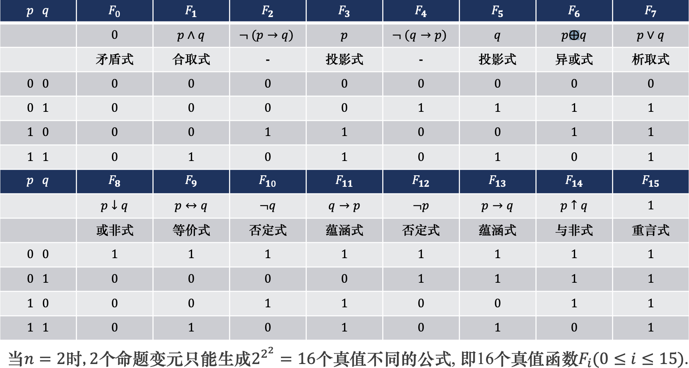

# 一、命题逻辑

数理逻辑研究的中心问题是推理, 即研究推理中前提和结论之间的形式关系, 而不涉及前提和结论的具体内容；

推理的基本单位是命题

## 1、命题及联结词

### 1.1、命题

如下句子中：
- 2是素数；-> 假命题
- 雪是黑色的；-> 假命题
- 明年10月1日是晴天；-> 陈述句，虽然不知道真值，因为其真值未知但不影响其确定性
- 这朵花多好看呀！--感叹句
- 明天下午有会吗？--疑问句
- 请关上门！ --祈使句

判断一个句子是否为命题，首先要看它是否为陈述句，然后再看真值是否唯一；当然真值是否唯一与是否知道它的真值是两回事；

*通过上述可以得到命题的定义*：**能判定真假**但**不能既真又假**的陈述句 (包括符号化的等式和不等式) 称作命题；

作为命题的陈述句所表达的判断只有两种结果: 真或假, 称为**命题的真值**；命题具有唯一的真值, 真或假, 这与我们是否知道它的真假(待定) 是两回事；
- 凡与事实相符的命题为真命题, 其真值为真;
- 否则称为假命题, 其真值为假；

> 悖论（自相矛盾）不能作为命题，比如`本命题是假的`，虽然其是陈述句，但是因为真假共存

**符号化：** 为了能用数学方法来研究命题之间的逻辑关系和推理, 需要将命题和真值符号化：
- 使用 $p,q,r,..., p_i,q_i,r_i$ 表示命题；
- 使用 $1$ (或 $T$ ) 表示"真"; 用 $\color{red}{0}$ (或 $F$ ) 表示"假"

**简单命题：**在数理逻辑中, 将不能再分解为更简单的命题称为**简单命题或原子命题**

下列命题都不是简单命题:
- (1) 10不是素数.
- (2) 2和3都是素数.
- (3) 2或4是素数.
- (4) 若数 $a$ 是4的倍数, 则它一定是2的倍数.
- (5) 数 $a$ 是偶数当且仅当它能被2整除

### 1.2、命题联结词

若干简单命题通过**命题联结词**联结而成的新命题称作是**复合命题**；联结词作用于命题时, 和数学运算符号相当, 所以又称逻辑运算符；

上面的例子中：
- (1) 10不是素数；使用了联结词“非”.
- (2) 2和3都是素数； 使用了联结词“和”.
- (3) 2或4是素数； 使用了联结词“或”.
- (4) 若数 $a$ 是4的倍数, 则它一定是2的倍数；使用了联结词“如果,则”；
- (5) 数 $a$ 是偶数当且仅当它能被2整除；使用了联结词“当且仅当“；

在数理逻辑中, 我们关心的是复合命题与构成复合命题的各原子命题之间的**真值关系**, 即抽象的逻辑关系, 并不关心各语句的具体语义；内容上毫无联系的两个命题也能组成具有确定真值的命题

#### 1.2.1、否定联结词 ${\neg}$

设 $p$ 为任一命题。复合命题为“非 $p$ ”（或“ $p$ 的否定”）称为 $p$ 的否定式，记作 ${\neg}p$。 ${\neg}$ 为否定联结词。 ${\neg}p$ 为真当且仅当 $p$ 为假；对应的中文“非”“不是”

${\neg}$ 是一个一元运算，它的意义是“否定”被否定命题的全部，而不是一部分； ${\neg}p$ 取值为真，当且仅当 $p$ 取值为假；

设 $p$ 表示“3是偶数”，则 ${\neg}p$ 表示“3不是偶数”，显然 $p$ 真值为0，  ${\neg}p$ 的真值为1

其对应的真值为：
$p$ | ${\neg}p$
--|----
$\color{red}{0}$ | $1$
$1$ | $\color{red}{0}$

#### 1.2.2、合取联结词 ${\wedge}$

设 $p,q$ 为两个命题，复合命题“ $p$ 并且 $q$ ”（或“ $p$ 和 $q$ ”）称作“ $p$ 与 $q$ ”的合取式，记作 $p{\wedge}q$ ， $\wedge$ 为合取联结词， $p$ 与 $q$ 的合取表达式的逻辑关系是 $p$ 与 $q$ 两个命题同时成立， $p{\wedge}q$ 为真当且仅当 $p$ 与 $q$ 同时为真；对应的中文“既....又...."、”不仅.....而且.....“、”虽然....但是.....“；

$p$ 2是素数, (真值为1) ，$q$ 3是素数 (真值为1)，那么 $p{\wedge}q$ : 2和3都是素数 (真值为1)；

对应的真值为：
$p$ | $p$ | $p{\wedge}q$
--|---- | ----
$\color{red}{0}$ | $\color{red}{0}$|$\color{red}{0}$
$\color{red}{0}$ | $1$ | $\color{red}{0}$
$1$ | $\color{red}{0}$ | $\color{red}{0}$
$1$ | $1$ | $1$

将下列命题符号化: $p$ 我变秃了, $q$ 我变强了
- (1) 我变秃了, 也变强了； *解*： $p{\wedge}q$
- (2) 我不仅变秃了, 而且还变强了； *解*： $p{\wedge}q$
- (3) 我虽然没变秃, 但是我也没变强； *解*： ${\neg}p{\wedge}{\neg}q$
- (4) 我不是没变强, 而是没变秃； *解*： ${\neg}({\neg}q){\wedge}{\neg}p$
- (5) 我和邻居老王都变秃了；*解*： $p{\wedge}q$
- (6) 我和邻居老王是秃头兄弟； *解*： 虽然有关键词“和”, 但不是复合命题, 只是简单命题；

#### 1.2.3、析取联结词 ${\vee}$

设 $p,q$ 为两个命题，复合命题“ $p$ 或 $q$ ”称作“ $p$ 与 $q$ ”的析取式，记作 $p{\vee}q$ ； $p{\vee}q$ 的逻辑关系为 $p$ 或 $q$ 至少有一个成立，因而 $p{\vee}q$ 为真当且仅当 $p,q$ 至少有一个真；

析取联结词的逻辑关系是明确的, 但自然语言中的“或”有时具有相容性, 有时又具有排斥性, 因而在使用联结词∨时要注意区分. 绝大多数时候自然语言中的“或”具有排斥性
- 相容或：`p：2是偶数`、`q：4是偶数`，这种情况下是相容或，也即其中一个命题成立，不影响其他命题成立与否，所有命题可以同时成立；
- 排斥或：`p：2是偶数`、`q：2是奇数`，这种情况下是排斥或，也即一个命题成立，则其他命题不成立

对应的真值为：
$p$ | $p$ | $p{\vee}q$
--|---- | ----
$\color{red}{0}$ | $\color{red}{0}$|$\color{red}{0}$
$\color{red}{0}$ | $1$ | $1$
$1$ | $\color{red}{0}$ | $1$
$1$ | $1$ | $1$

例子：
- (1) 今年总冠军是湖人或火箭；*解*：这个“或”是互斥的， $p$ 今年总冠军是湖人,  $q$ 今年总冠军是火箭, 由于总冠军只能有一个,  $p,q$ 身就是互斥的, 即 $p$ 和 $q$ 不会同时为真, 因而可以符号化为 $p{\vee}q$
- (2) 他学过德语或法语；*解*：这个“或”是相容的. $r$ 他学过德语, $s$ 他学过法语, 他也有可能同时学过德语和法语,与命题不冲突, 因而可以符号化为 $r{\vee}s$
- (3) 老王或老李中的一人去出差了；*解*：这个或是互斥的， $t$ 老王出差去了, $u$ 老李出差去了，但是 $t,u$  本身不互斥，然而命题表达的意思是互斥的，因此不能直接符号为 $t{\vee}u$ ，可以使用多个联结词符号化： $(t{\wedge}{\neg}u){\vee}({\neg}t{\wedge}u)$

#### 1.2.4、蕴涵联结词 $\rightarrow$

设 $p,q$ 为两个命题，复合命题“如果 $p$ ，则 $q$ ”称作“ $p$ 与 $q$ ”的蕴涵式，记作 $p{\rightarrow}q$ ， $p$ 为蕴涵式的前件， $q$ 为后件。对应中文”只要....就....“、”只有....才.....“

$p{\rightarrow}q$ 的逻辑关系是， $q$ 是 $p$ 的必要条件， $p$ 是 $q$ 的充分条件。 $p{\rightarrow}q$ 为假当且仅当 $p$ 为真且 $q$ 为假；

在数学和其他自然科学中，“如果 $p$ 则 $q$ “往往表示的是前件为真，后件为真的推理关系；但在数理逻辑中， 当 $p$ 假时， $p{\rightarrow}q$ 也为真；

对应的真值表：
$p$ | $p$ | $p{\rightarrow}q$
--|---- | ----
$\color{red}{0}$ | $\color{red}{0}$|$1$
$\color{red}{0}$ | $1$ | $1$
$1$ | $\color{red}{0}$ | $\color{red}{0}$
$1$ | $1$ | $1$

例子：我朋友跟我说: “如果我这赛季上了王者，下赛季我就带你飞”，试问: 在什么情况下, 我朋友才算失信 (命题真值为假) ？ 
解：我朋友的可能情况有四种: 
(1) 我朋友这赛季上了王者，下赛季带我飞了。 
(2) 我朋友这赛季没上王者，下赛季也没带我飞。 
(3) 我朋友这赛季上了王者，下赛季却没带我飞。 
(4) 我朋友这赛季没上王者，下赛季却带我飞了。 

- 显然，(1)(2)两种情况我朋友都没有失信 (真值为真).
- (4) 的情况与我朋友之前说的话也不冲突，当然也不算失信 (真值为真).
- 只有情况(3)，答应的事却没有做到，算失信了 (真值为假)。该情况正好对应定义中 “当前件 $p$ 为真, 后件 $q$ 假时, 命题 $p{\rightarrow}q$ 取值为假”；

有时候自然语言一句话中没有出现“若⋯则⋯”、 “如果⋯就⋯”之类的关键词；但是却表达了蕴涵联结词含义，例如“你行你上，不行别bb”，在自然语言里，“若 $p$ 则 $q$ ”中的 $p 和 q$ 往往有某种内在联系, 而数理逻辑里 $p 和 q$ 不一定有什么内在联系；

将下列命题符号化：
- (1) 若3 + 3 = 6, 则地球是运动的；
- (2) 若3 + 3 ≠ 6, 则地球是运动的；
- (3) 若3 + 3 = 6, 则地球是静止不动的；
- (4) 若3 + 3 ≠ 6, 则地球是静止不动的； 
这里 $p$ ：3 + 3 = 6， $q$ 地球是运动的，这里“ $p$ 与 $q$ ”显然没有任何内在联系，但仍可以组成蕴含式，分别为： $p{\rightarrow}q$ ， ${\neg}p{\rightarrow}q$ ， $p{\rightarrow}{\neg}q$ ， ${\neg}p{\rightarrow}{\neg}q$ ，真值分别为： $1, 1, 0, 1$

#### 1.2.5、等价联结词 $\leftrightarrow$

设 $p,q$ 为任意两个命题，复合命题“ $p$ 当且仅当 $q$ ”称作“ $p$ 与 $q$ ”的等价式，记作 $p{\leftrightarrow}q$ ；

$p{\leftrightarrow}q$ 的逻辑关系是 $p,q$ 互为充分必要条件， $p{\leftrightarrow}q$  为真当且仅当 $p$ 和 $q$ 真值相同；

对应的真值表：
$p$ | $p$ | $p{\leftrightarrow}q$
--|---- | ----
$\color{red}{0}$ | $\color{red}{0}$|$1$
$\color{red}{0}$ | $1$ | $\color{red}{0}$
$1$ | $\color{red}{0}$ | $\color{red}{0}$
$1$ | $1$ | $1$

将下列命题符号化, 并求其真值
- (1) $O_1,O_2$ 两个圆的面积相等当且仅当它们的半径相等；*解*： $p:O_1,O_2$ 两个圆的面积相等， $q:O_1,O_2$ 两个圆的半径相等，命题符号化为： $p{\leftrightarrow}q$ ， $p$ 与 $q$ 的真值相同（永远同时为真或同时为假），因而 $p{\leftrightarrow}q$ 真值为真；
- (2) $A,B$ 两角相等当且仅当它们是同位角；*解*： $p:A,B$ 两角相等， $p:A,B$ 两角是同位角，命题符号化为： $p{\leftrightarrow}q$ ， $p$ 与 $q$ 的真值可以不同，因此 $p{\leftrightarrow}q$ 的真值要由 $p$ 与 $q$ 的真值而定；

> 在数理逻辑中，我们只关心  $p$ 与 $q$ 各自的真值及其联结词

**总结**
- 联结词联结的是句子，而不是单个的词语
- 联结词是两个句子真值之间的联结，而非句子的具体含义的联结，两个句子之间可以无任何地内在联系
- 联结词与自然语言之间的对应并非一一对应，（就是说联结词和自然语言没有固定的搭配方式）

### 1.3、语句形式化

通常对一些推理问题的描述是用自然语言来表示的，所以我们首先需要把自然语句形式化为逻辑语言，即以符号表示逻辑公式，然后根据逻辑演算规律进行推理运算。

自然语句形式化的过程主要包括两个步骤：
- (1) 分析出各简单命题，将它们符号化；
- (2) 根据自然语句中的逻辑关系，使用恰当的命题联结词，把简单命题逐个联结起来，构成复合命题的符号化表示；

在命题形式化时，若命题包含有多个联结词时，**必须注意逻辑联结词 (运算符) 优先次序的规定**
- 优先级如下： $\boldsymbol{\color{red}{{\neg}、{\wedge}、{\vee}、{\rightarrow}、{\leftrightarrow}}}$，若有括号，先进行括号内的运算；
- 按优先级书写，命题中可以省略一些不必要的括号。为了确保命题的清晰性，提高可读性，应适当加上括号以避免混淆，括号中的运算为最优先级。
- 同级的联结词，按从左往右的次序运算。

比如：
- $p{\rightarrow}q{\wedge}r{\rightarrow}s$ 与 $(p{\rightarrow}(q{\wedge}r)){\rightarrow}s$ 表示相同的逻辑关系；

语句形式化要注意以下几点：
- 要善于确定简单命题, 不要把一个概念硬拆成几个概念；比如：`我和他是同学`，这是一个简单明天；然而`我和他都是同学`是一个复合命题
- 要善于识别自然语言中的联结词 (有时它们被省略)；比如：`狗急跳墙`，应理解为“ (若) 狗急 (了, 则) 跳墙”， $p:$  狗急了， $q:$ 狗跳墙，语句形式化为： $p{\rightarrow}q$
- 否定词的位置要放准确；比如：`如果你和他不都是傻子, 那么你们俩都不会去自讨没趣`，其中不都需要分开来处理，处理成两个否定， $p:$ 你是傻子， $q:$ 他是傻子， $r:$ 你自讨没趣， $s:$ 他自讨没趣 ，语句形式化为： ${\neg}(p{\wedge}q){\rightarrow}({\neg}r{\wedge}{\neg}s)$

例子：下午如果没课，我们就去看电影，否则就不去 
*解：* $p$ 下午有课， $q$ 我们去看电影，那么上面语句可以形式化为： $(p{\rightarrow}{\neg}q) {\wedge}({\neg}p{\rightarrow}q)$

## 2、命题公式与赋值

- 对于简单命题来说，它的真值是确定的，因而又称为**命题常项**或**命题常元**；
- **命题变项（命题变元）**：真值可以变化的简单陈述句。（注意：**命题变项**不是命题）；比如：`x+y > 10`，不是命题，由于x和y的不确定性, 使得该陈述句的真值不惟一；命题变元不能确定真值, 不是命题

在数理逻辑里, 我们所关心的仅仅是命题可以被赋予真或假的可能性, 以及规定了真值后, 怎样与其他命题发生联系的问题

### 2.1、命题公式

将命题常元和命题变元用`联结词和圆括号按一定逻辑关系联结起来`的符号串成为`合式公式`或`命题公式`, 简称公式；

命题公式的递归定义：
- (1) 单个的命题变元 (或常元) 是合式公式;
- (2) 若 $A$ 是合式公式, 则 $({\neg}A)$ 也是合式公式;
- (3) 若 $A,B$ 是合式公式, 则 $A{\wedge}B, A{\vee}B, A{\rightarrow}B, A{\leftrightarrow}B$ 也是合式公式；
- (4) 只有有限次地利用上述(1)-(3)形成的符号串才是合式公式

其中`(1)`是递归定义的基础； `(2), (3)`是递归定义的归纳 (构造形式)； `(4)` 是递归定义的极小性 (界限)；使用大写字母符号 $A,B$ 代表公式，在没有产生歧义的情况下，外层括号可以省去；

> 所有命题公式都是符号串，反之，**不是所有的符号串都是命题公式**；

以下符号串都是命题公式：
- $(p{\wedge}q){\leftarrow}({\neg}(q{\wedge})r)$
- $((r{\vee}q){\wedge}p){\leftrightarrow}(q{\wedge}p)$

以下符号串都 $\color{red}{不}$ 是命题公式：
- $p{\wedge}q{\wedge}r{\color{red}{)}}{\rightarrow}q$
- $(r{\rightarrow}p){\color{red}{{\vee}}}$
- $p{\wedge}{\color{red}{qr}}{\rightarrow}s$

### 2.2、公式层次

什么是公式层次：
- (1) 若 $A$ 是单个的命题变元或常元，则称 $A$ 为0层公式；
- (2) 称 $A$ 是 $n + 1 (n {\geq} 0)$ 层公式是指下列诸情况之一：
  - ① $A = {\neg}B, B$ 是 $n$ 层公式；
  - ② $A = B{\wedge}C$ ，其中 $B,C$ 分别为 $i$ 层和 $j$ 层公式， $n = max(i,j)$ ；
  - ③ $A = B{\vee}C$ ，其中 $B,C$ 的层次同②；
  - ④ $A = B{\rightarrow}C$ ，其中 $B,C$ 的层次同②；
  - ⑤ $A = B{\leftrightarrow}C$ ，其中 $B,C$ 的层次同②；

例如： $(({\neg}p{\rightarrow}q){\vee}r){\wedge}s$ 为4层公式， $((p{\wedge}{\neg}q{\wedge}r){\vee}s){\rightarrow}(p{\vee}q{\vee}r)$ 为5层公式

以 $(({\neg}p{\rightarrow}q){\vee}r){\wedge}s$ 为例：
- $p$ ; $p$ 为命题常元，所以其为 0层公式；那么对应的 ${\neg}p$ 为 $0 + 1$ 层公式，即 $1$ 层公式；
- $({\neg}p{\rightarrow}q)$ 其中 ${\neg}p$ 为 $1$ 层公式， $q$ 为命题常元即 $0$ 层公式，所以 $({\neg}p{\rightarrow}q)$ 为 $n = max(1,0) + 1$ 即 $2$ 层公式；
- $(({\neg}p{\rightarrow}q){\vee}r)$ 其中 $({\neg}p{\rightarrow}q)$ 为 $2$ 层公式， $r$ 为命题常元，即 $0$ 层公式，所以 $(({\neg}p{\rightarrow}q){\vee}r)$ 其中 $({\neg}p{\rightarrow}q)$ 为 $n = max(2,0) + 1$ 即 $3$ 层公式；
- $(({\neg}p{\rightarrow}q){\vee}r){\wedge}s$ 其中 $(({\neg}p{\rightarrow}q){\vee}r)$ 为 $3$ 层公式， $s$ 为命题常元，即 $0$ 层公式，所以 $(({\neg}p{\rightarrow}q){\vee}r){\wedge}s$ 为  $n = max(3,0) + 1$ 即 $4$ 层公式；

### 2.3、赋值

命题公式不是命题，其真值是不确定的。仅当将公式中的所有命题变元用确定的命题代入时，才得到一个命题。这个命题的真值，取决于代入变元的那些命题的真值；

设 $p_1,p_2,...,p_n$ 是出现在公式 $A$ 的全部命题变元，给 $p_1,p_2,...,p_n$ 各指定一个真值，称为对公式 $A$ 的一个 $\color{#568FB4}{赋值}$ 或 $\color{#568FB4}{解释}$；若指定的一组值使 $A$ 的值为 $1$ ，则称这组值为 $A$ 的 $\color{#568FB4}{成真赋值}$ ；若使 $A$ 的值为 $0$ ，则称这组值为 $A$ 的 $\color{#568FB4}{成假赋值}$

含 $n$ 个命题变元的命题公式的赋值形式有如下规定：
- (1) 设 $A$ 中含的命题变元为 $p_1,p_2,...,p_n$ ，赋值 $a_1a_2...,a_n(a_i 为0或1)$ 是指： $p_1 = a_1,p_2 = a_2,...,p_n = a_n$ ，则称 $\color{red}{按下标顺序赋值}$
- (2) 若出现在 $A$ 中含的命题变元为 $p,q,r,...$ ，赋值 $a_1a_2a_3...$ 是指 $p = a_1,q = a_2,r = a_3,...$ ，即 $\color{red}{按字典顺序赋值}$

比如：
- 在公式： $({\neg}p_1{\wedge}p_2{\wedge}p_3){\vee}(p_1{\wedge}{\neg}p_2{\wedge}p_3)$ 中，011（ $p_1 = 0, p_2 = 1, p_3 = 1$ ），101（ $p_1 = 1, p_2 = 0, p_3 = 1$ ） 都是成真赋值，其余都是成假赋值；
- 在公式： $(p{\vee}q){\rightarrow}r$ 中，011（ $p = 0, q = 1, r = 1$ ）为成真赋值，100（ $p = 1, q = 0, r = 0$ ）为成假赋值；

### 2.4、真值表

含有 $n(n {\geq} 1)$ 个命题变元的公共式有 $2^n$ 个赋值，将公式 $A$ 在所有赋值下取值列成表，称为 $A$ 的 $\color{#568FB4}{真值表}$

命题公式真值表的构造步骤如下：需要注意联结词的顺序
- (1) 找出公式中所含命题变元，列出所有可能的赋值 ( $2^n$ 个)；
- (2) 按 $\color{red}{从低到高}$ 的顺序写出公式 $A$ 的各层次列， $A$ 在最后一列；
- (3) 对应各赋值，计算公式各层次的值，直到最后计算出公式的值；

比如公式 ${\neg}(p{\rightarrow}q){\wedge}q{\wedge}r$ 的真值表 

p | q |r | $p{\rightarrow}q$| ${\neg}(p{\rightarrow}q)$ | ${\neg}(p{\rightarrow}q){\wedge}q$ |${\neg}(p{\rightarrow}q){\wedge}q{\wedge}r$
--|--|--|--|--|--|---
0 | 0 |0 |1 | 0| 0| 0
0 | 0 |1 |1 | 0|0 | 0
0 | 1 |0 |1 | 0|0 | 0
0 | 1 |1 |1 |0 |0 | 0
1 | 0 |0 |0 |1 |0 | 0
1 | 0 |1 |0 |1 |0 | 0
1 | 1 |0 |1 | 0|0 | 0
1 | 1 |1 |1 | 0|0 | 0

可以将命题分为3类：设 $A$ 为一命题公式
- (1) 若 $A$ 在它的各种赋值下取值均为真，则称 $A$ 为 $\color{#568FB4}{重(ch\acute{o}ng)言式}$ 或 $\color{#568FB4}{永真式}$
- (2) 若 $A$ 在它的各种赋值下取值均为假，则称 $A$ 为 $\color{#568FB4}{矛盾式}$ 或 $\color{#568FB4}{永假式}$
- (3) 若 $A$ 至少有一组成真赋值，即不是矛盾式, 则称 $A$ 为 $\color{#568FB4}{可满足式}$ 

这三个分类之间的关系：
- 重言式是可满足式, 但反之不真；
- 用真值表可以判断公式的类型：
  - 若最后一列全为1，则公式为重言式，同时也是可满足式.
  - 若最后一列全为0,，则公式为矛盾式；
  - 若最后一列既有1又有0，则公式为非重言式的可满足式；

## 3、等值演算

给定 $n$ 个命题变元, 由递归定义可形成的命题公式是无穷多的；但在这些无穷的公式中, 真值不同的命题公式却是有限的，那么, 由 $n$ 个命题变元组成的真值不同公式有多少个呢？即有多少个真值表呢？
- 一般地, 含有 $n$ 个命题变元的公式有 $2^n$ 组不同的赋值，对于每一组赋值，公式都有一个确定的真值；例 $n = 2$ 时，共有 $00, 01, 10, 11$ 四种赋值；
- 由于每个赋值有真、假两种可能，共有 $2^n$ 组不同的赋值，所以， $n$ 个命题变元只能生成 $2^{2^n}$ 个真值不同的公式；

**定义：** 每个这样的公式对应一个定义域为 $\{0,1\}^n$ ，值域为 $\{0,1\}$ 的函数称为一个 $\color{#568FB4}{n元真值函数}$

# 参考资料

- [厦门大学2022计算机必修课程-离散数学](https://jasonyanglu.github.io/teaching/离散数学_2022)
