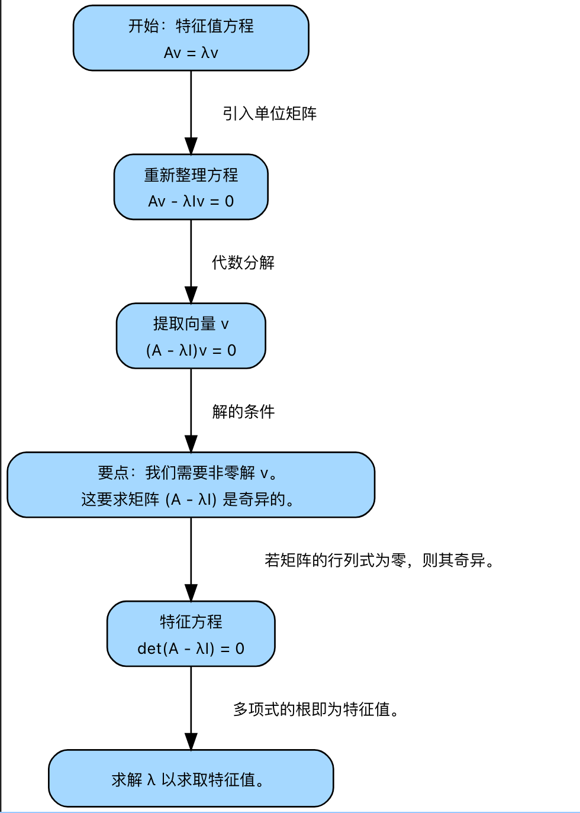

# 标量与向量

## 标量（scalar）

可以把标量看作一个普通的数字。它有大小，但没有方向。它是我们能处理的最简单的数据元素；

在机器学习中，标量随处可见。它们常用于表示特定的单一量：
- 特征值： 一个人的年龄（例如，34）。
- 超参数 (parameter) (hyperparameter)： 模型学习率（例如，0.01）。
- 测量值： 灰度图像中单个像素的亮度（例如，182）。
- 模型输出： 事件的预测概率（例如，0.85）。

数学上，标量通常写成小写斜体字母，例如 c、k 或 x

## 向量（vector）

### 概述

向量由标量组成，有大小有方向：
- 行向量：(2 5 8)
- 列向量

$$
\begin{pmatrix}
a \\
b \\
c
\end{pmatrix}
$$

### 向量运算

**向量转置：行向量 ↔ 列向量**

$$
x = \begin{pmatrix}
2 \\
5 \\
8
\end{pmatrix}
$$

$$
\mathbf{x}^T = \begin{pmatrix} 2 & 5 & 8\end{pmatrix}
$$

**向量相加：对应元素相加** 两个向量相加是一个逐元素操作。这表示只需将每个向量的对应分量相加，就能得到新向量的分量。

$$ \begin{pmatrix} 2 \\ 5 \\ 8 \end{pmatrix} + \begin{pmatrix} 1 \\ 3 \\ 7 \end{pmatrix} = \begin{pmatrix} 3 \\ 8 \\ 15\end{pmatrix} $$

**向量与标量相乘：标量与向量每个元素相乘**，标量乘法能够在不改变向量方向的情况下拉伸或收缩向量，这在许多机器学习 (machine learning)算法中非常常用。可以将其视为调整数据点特征的强度或大小，标量的符号决定了向量的方向是保持不变还是反转
- **拉伸**：如果标量的绝对值大于1（例如，$c=2$ 或 $c=-3$），向量会变长。
- **收缩**：如果标量的绝对值在0到1之间（例如，$c=0.5$ 或 $c=-0.2$），向量会变短。
- **方向反转**：如果标量是负数（例如，$c=-1$），向量的方向会完全反转。它指向与原始方向相反180度。

最常见的应用是在**梯度下降 (gradient descent)**

$$ 3 * \begin{pmatrix} 2 \\ 5 \\ 8 \end{pmatrix} = \begin{pmatrix} 6 \\ 15 \\ 24 \end{pmatrix} $$

**向量内积：又称向量点乘，两向量对应元素乘积之和，结果为标量**

$$
\mathbf{a} \cdot \mathbf{b} = \sum_{i=1}^{n} a_i b_i
$$

$$
\mathbf{x} \cdot \mathbf{y} = \begin{pmatrix} 2 \\ 5 \\ 8 \end{pmatrix} * \begin{pmatrix} 1 \\ 3 \\ 7 \end{pmatrix} = 2 + 15 + 56 = 73
$$

### 向量范数：度量长度

把一个向量映射成一个非负标量，用来衡量“大小 / 长度 / 强度”，范数接收一个向量作为输入，并返回一个表示其大小的单一非负数。

两种最常见的向量范数是L2范数和L1范数
1. L2范数：欧几里得距离，L2范数是大多数人直观上所认为的“距离”。它计算向量 (vector)从原点到其终点的直线长度
向量 $v$ 具有 $n$ 个分量时的L2范数公式为

$$
{\lVert}v{\rVert}_2 = \sqrt{v_1^2 + v_2^2 + \dots + v_n^2}
$$

${\lVert}\cdot{\rVert}$ 是范数的标准记法，下标2表示这是L2范数。由于它非常常见，下标常被省略，所以如果你看到 ${\lVert}v{\rVert}$ ，它通常指代L2范数

2. L1范数：曼哈顿距离，L1范数提供了一种不同的度量向量 (vector)长度的方式。它不是度量直接的“直线距离”，而是将每个分量的绝对值相加。它常被称为曼哈顿范数或出租车距离，向量 $v$ 的L1范数公式为

$$
{\lVert}v{\rVert}1 = |v_1| + |v_2| + \dots + |v_n| = \sum_{i=1}^{n} |v_i|
$$

用途：
- L2范数： 这是最常用于度量误差的范数。例如，在线性回归中，模型通常通过最小化误差向量 (vector)（预测值与实际值之间的差值）的L2范数来训练。这被称为最小化“平方误差和”。L2范数也用于一种称为岭回归的正则化 (regularization)方法，该方法会惩罚大的模型权重 (weight)，鼓励权重值小且分散的解。
- L1范数： L1范数也用于度量误差和进行正则化。一种称为Lasso回归的正则化方法使用L1范数来惩罚权重。L1范数有一个独特的性质：它倾向于产生稀疏解，这意味着它促使许多模型权重变为精确的零。这通过告知你哪些特征对预测没有影响，从而有效地执行特征选择。

### 正交向量

如果两个非零向量相互垂直，则称它们为正交。在线性代数中，检验正交性的方法简单直接：它们的点积为零 $v \cdot w = 0$  
如果计算两个向量的点积，结果为 0，就知道它们是正交的。从几何角度看，这意味着它们指向相互成直角的方向。可以将它们想象成首尾相接时形成一个完美的“L”形

这一关系是点积几何定义的直接结果： $v\cdot w = {\lVert}v{\rVert}{\lVert}w{\rVert}\cos(\theta)$ ，如果两个向量都具有非零长度 (${\lVert}v{\rVert} > 0 $ 和 ${\lVert}w{\rVert} > 0$) ，则它们的点积为零的唯一情况是 $\cos(\theta) = 0$ 当夹角 $\theta$ 为 90° 时，余弦函数为零，这证实了向量相互垂直；

## 代码

### 加法

```py
x = np.array([1, 2, 3])
y = np.array([[1], [2], [3]])
print(x + y)
# 输出结果
[[2 3 4]
 [3 4 5]
 [4 5 6]]
```

### 点积

```py
x = np.array([1, 2, 3])
y = np.array([[1], [2], [3]])
print(np.dot(x, y))
print(x @ y)
```
验证正交性：
```py
import numpy as np
# 定义两个正交向量
v = np.array([2, 3])
w = np.array([-3, 2])
# 计算点积
dot_product = np.dot(v, w)
print(f"向量 v: {v}")
print(f"向量 w: {w}")
print(f"v 和 w 的点积: {dot_product}")
```

### 范数

numpy 使用 `numpy.linalg.norm()` 函数提供了一种简单高效的方法来计算向量 (vector)范数。此函数默认计算L2范数，但可以使用 ord 参数 (parameter)指定其他范数
```py
import numpy as np

# 创建我们的示例向量
v = np.array([-5, 12])

# 计算L2范数（默认）
l2_norm = np.linalg.norm(v)

# 通过设置 ord=1 计算L1范数
l1_norm = np.linalg.norm(v, ord=1)

print(f"向量: {v}")
print(f"L2 范数 (欧几里得): {l2_norm}")
print(f"L1 范数 (曼哈顿): {l1_norm}")
```

### 找两个向量的夹角

找出两个向量之间的夹角 $\theta$ 使用从点积定义中导出的公式

$$
\cos(\theta) = {{v \cdot w} \over {{\lVert}v{\rVert}{\lVert}w{\rVert}}}
$$

意味着：

$$
\theta = \arccos({{v \cdot w} \over {{\lVert}v{\rVert}{\lVert}w{\rVert}}})
$$

```py
# 用户对 [科幻, 喜剧] 的评分
user_a = np.array([5, 1])
user_b = np.array([4, 1])
user_c = np.array([1, 5])
# 计算余弦相似度的函数
def cosine_similarity(v1, v2):
    dot_product = np.dot(v1, v2)
    norm_v1 = np.linalg.norm(v1)
    norm_v2 = np.linalg.norm(v2)
    return dot_product / (norm_v1 * norm_v2)
# 计算相似度
sim_ab = cosine_similarity(user_a, user_b)
sim_ac = cosine_similarity(user_a, user_c)
print(f"用户 A 与用户 B 之间的相似度: {sim_ab:.4f}")
print(f"用户 A 与用户 C 之间的相似度: {sim_ac:.4f}")
```

# 矩阵

- [矩阵 Markdown 写法](https://xujinzh.github.io/2020/11/24/markdown-matrix/index.html)

## 基本概念

一个 $m×n$ 的矩阵（matrix）是一个有m行n列元素的矩形阵列。用 $R^{m×n}$ 表示所有m×n实数矩阵的向量空间

$$
\left[
\begin{matrix}
    1 & 2 & 3 \\
    4 & 5 & 6
\end{matrix}
\right]
\in \mathbb{R}^{2 \times 3}
$$

## 矩阵运算

### 矩阵乘法

#### 矩阵与向量乘法

矩阵-向量 (vector)乘法是一种能根本上转换向量的运算，把矩阵看作一个函数或一台机器：你给它一个向量，它就会输出一个新的向量，这个向量可能有不同的长度并指向新的方向

要将矩阵 $A$ 乘以向量 (vector) $v$，有一个必要的兼容规则：矩阵的列数必须等于向量的元素数量;

如果你有一个 $m×n$ 矩阵（m 行，n 列）和一个 $n×1$ 向量（n 行，1 列），结果将是一个新的 $m×1$ 向量。结果向量中的每个元素都是通过取矩阵的一行与输入向量的点积来计算的

假设我们有一个 $2×3$ 矩阵 $A$ 和一个 $3×1$ 向量 $v$

$$
\left[ \begin{matrix} 3 & 1 & 4 \\ 0 & 2 & 5 \end{matrix} \right] \cdot \left[ \begin{matrix} 2 \\ 6 \\ 1 \end{matrix} \right] 
$$

为了找到新向量的第一个元素，我们取 $A$ 的第一行与向量 $v$ 的点积: $(3 \cdot 2) + (1 \cdot 6) + (4 \cdot 1) = 6 + 6 + 4 = 16$  
为了找到第二个元素，我们取 $A$ 的第二行与向量 $v$ 的点积: $(0 \cdot 2) + (2 \cdot 6) + (5 \cdot 1) = 0 + 12 + 5 = 17$  

因此，结果向量为： 

$$
A \cdot v = \left[ \begin{matrix} 16 \\ 17 \end{matrix} \right] 
$$

这种改变数据维度的能力是矩阵-向量乘法的直接结果；

结果向量 (vector)实际上是矩阵各列的线性组合，其中输入向量的元素充当权重 (weight)  
使用相同的矩阵 $A$ 和向量 $v$

$$
A = \left[ \begin{matrix} 3 & 1 & 4 \\ 0 & 2 & 5 \end{matrix} \right],  v = \left[ \begin{matrix} 2 \\ 6 \\ 1 \end{matrix} \right] 
$$

可以将乘法改写为：

$$
A \cdot v = 2 \cdot \left[ \begin{matrix} 3 \\ 0 \end{matrix} \right] + 6 \cdot \left[ \begin{matrix} 1 \\ 2 \end{matrix} \right] + 1 \cdot \left[ \begin{matrix} 4 \\ 5 \end{matrix} \right]
= \left[ \begin{matrix} 6 \\ 0 \end{matrix} \right] +  \left[ \begin{matrix} 6 \\ 12 \end{matrix} \right] + \left[ \begin{matrix} 4 \\ 5 \end{matrix} \right]
= \left[ \begin{matrix} 6+6+4 \\ 0+12+5 \end{matrix} \right]
= \left[ \begin{matrix} 16 \\ 17 \end{matrix} \right]
$$

理解矩阵-向量 (vector)乘法最直观的方式之一是将其视为几何变换。矩阵可以在空间中旋转、缩放或剪切向量

#### 矩阵与矩阵乘法

两个矩阵的乘法仅当矩阵 $A$ 的列数和矩阵 $B$ 的行数相等时才能定义（第一个矩阵的列数必须等于第二个矩阵的行数，称这些为“内维度”）。如 $A∈R^{m×n}$，$B∈R^{n×p}$，它们的乘积 $A*B∈R^{m×p}$ ，矩阵会继承第一个矩阵的行数和第二个矩阵的列

$$
[A*B]_{ij} = a_{i1}b_{1j} + a_{i2}b_{1j} + ... + a_{in}b_{nj} = \sum_{i=1}^{n} a_{ik} b_{kj}
$$

比如

$$
\left[ \begin{matrix} 1 & 2 & 3 \\ 4 & 5 & 6 \end{matrix} \right] \cdot \left[ \begin{matrix} 7 & 8 \\ 9 & 1 \\ 2 & 3 \end{matrix} \right] 
$$

首先，检查维度。 $A$ 是一个 $2 \times 3$ 矩阵，$B$ 是一个 $3 \times 2$ 矩阵。内维度匹配（3 和 3），所以运算有效。结果矩阵 $C$ 
的维度将是 $2 \times 2$ ， 现在我们来计算 $C$ 的每个元素：
1. 计算 $C_{11}$（第1行，第1列）： 取 $A$ 的第1行与 $B$ 的第1列的点积：

$$ C_{11} = (1*7) + (2*9) + (3*2) = 7 + 18 + 6 = 31 $$

2. 计算 $C_{12}$（第1行，第2列）： 取 $A$ 的第1行与 $B$ 的第2列的点积：

$$ C_{12} = (1*8) + (2*1) + (3*3) = 8 + 2 + 9 = 19 $$

3. 计算 $C_{21}$（第2行，第1列）： 取 $A$ 的第2行与 $B$ 的第1列的点积：

$$ C_{12} = (4*7) + (5*9) + (6*2) = 28 + 45 + 12 = 85 $$

3. 计算 $C_{22}$（第2行，第2列）： 取 $A$ 的第2行与 $B$ 的第2列的点积：

$$ C_{12} = (4*8) + (5*1) + (6*3) = 32 + 5 + 18 = 55 $$

综上，最终的矩阵为：

$$\left[ \begin{matrix} 31 & 19 \\ 85 & 55 \end{matrix} \right]$$

特别地，矩阵与单位矩阵相乘等于矩阵本身： $A*I=A(A∈R^{m×n},I∈R^{n×n})$ 或 $I*A=A(I∈R^{n×n},A∈R^{n×m})$

NumPy中的*运算符执行元素逐位相乘。对于此操作,数组的形状必须与广播兼容。由于A的形状是(2,3),而B的形状是(3,2),它们的维度不兼容,无法进行元素逐位相乘或广播,因此会引发ValueError，`@`运算符用于真正的矩阵乘法,它遵循不同的维度要求。

**矩阵乘法的性质**：矩阵乘法满足结合律、左分配律和右分配律。**不满足交换律即 $A*B≠B*A$**
- 结合律：若 $A∈R^{m×n},B∈R^{n×p},C∈R^{p×q}$，则 $(AB)C=A(BC)$
- 左分配律：若 $A∈R^{m×n},B∈R^{m×n},C∈R^{n×p}$，则 $(A+B)C=AC+BC$
- 右分配律：若 $A∈R^{m×n},B∈R^{n×p},C∈R^{n×p}$，则 $A(B+C)=AB+AC$

### 矩阵转置

矩阵 $A∈R^{m×n}$ 的转置是一个 $n×m$ 的矩阵，记为 $A^T$。其中的第 $i$ 个行向量是原矩阵的第 $i$ 个列向量；或者说，转置矩阵 $A^T$ 第 $i$ 行第 $j$ 列的元素是原矩阵 $A$ 第 $j$ 行第 $i$ 列的元素；它将矩阵沿其主对角线“翻转”。主对角线是从左上角延伸至右下角的一组元素。当你转置一个矩阵时，它的行变为列，列变为行

$$
[A^T]_{ij} = a_{ji}
$$
$$
A = 
\left[
\begin{matrix}
    1 & 2 \\
    3 & 5 \\
    4 & 8
\end{matrix}
\right]
\in \mathbb{R}^{3 \times 2}
$$
$$
A^T = 
\left[
\begin{matrix}
    1 & 3 & 4 \\
    2 & 5 & 8
\end{matrix}
\right]
\in \mathbb{R}^{2 \times 3}
$$

**矩阵转置的性质**
- 两次转置返回原矩阵： $({A^T})^T=A$
- 和的转置等于转置的和： $(A+B)^T=A^T+B^T$
- $(k*A)^T=k*A^T$
- 乘积的转置会颠倒顺序： $(AB)^T=B^T*A^T$

### 矩阵加减法

给定两个矩阵 $A$ 和 $B$ ，当矩阵 $A$ 的列数和矩阵 $B$ 的行数相等时，才能进行加法：

$$ A+ B = C$$

其中

$$C_{ij} = A_{ij} + B_{ij}$$

- 交换律：加法的顺序无关紧要， $A+B=B+A$
- 结合律：当相加三个或更多矩阵时，分组方式无关紧要， $(A+B)+C=A+(B+C)$

## 特殊矩阵

### 方阵

行数等于列数的矩阵，包括单位矩阵、对角矩阵和对称矩阵，都要求是方阵

$$
\left[
\begin{matrix}
    1 & 2 & 3 \\
    4 & 5 & 6 \\
    7 & 8 & 9
\end{matrix}
\right]
\in \mathbb{R}^{3 \times 3}
$$

### 对角矩阵

主对角线以外元素全为0的方阵：将一个矩阵乘以对角矩阵会产生缩放该矩阵行或列的效果

$$
\left[
\begin{matrix}
    1 & 0 & 0 \\
    0 & 5 & 0 \\
    0 & 0 & 9
\end{matrix}
\right]
$$

Numpy 创建对角矩阵
```py
import numpy as np

# 从值列表中创建一个对角矩阵
D = np.diag([7, -2, 5])
print(D)
```

### 单位矩阵

主对角线元素全为1的对角矩阵

$$
\left[
\begin{matrix}
    1 & 0 & 0 \\
    0 & 1 & 0 \\
    0 & 0 & 1
\end{matrix}
\right]
$$

Numpy 中创建单位矩阵
```py
# 创建一个 3x3 单位矩阵
I = np.eye(3)
I = np.identity(3)
print(I)
```
单位矩阵在矩阵运算中，其作用相当于数字 1。任何矩阵 $A$ 乘以单位矩阵 $I$ 时，结果就是它本身，即矩阵 $A (A⋅I) = A$

$$
A \cdot I = \left[ \begin{matrix} 2 & 3 \\ 4 & 5 \end{matrix} \right] \cdot \left[ \begin{matrix} 1 & 0 \\ 0 & 1 \end{matrix} \right] 
=  \left[ \begin{matrix} (2 \cdot 1) +  (3 \cdot 0) & (2 \cdot 0) +  (3 \cdot 1) \\ (4 \cdot 1) +  (5 \cdot 0) & (4 \cdot 0) +  (5 \cdot 1) \end{matrix} \right]
=  \left[ \begin{matrix} 2 & 3 \\ 4 & 5 \end{matrix} \right]
$$

### 对称矩阵

对称矩阵是一个方阵，它与其转置矩阵相同。换句话说，如果矩阵 $A$ 满足以下条件，它就是对称的

$$A = A^T$$

这表示第 $i$ 行第 $j$ 列的元素等于第 $j$ 行第 $i$ 列的元素。矩阵是其自身沿主对角线的镜像

$$
\left[
\begin{matrix}
    1 & 8 & -3 \\
    8 & 5 & 4 \\
    -3 & 4 & 9
\end{matrix}
\right]
$$

注意 $(1,2)$ 处的元素是 8，而 $(2,1)$ 处的元素也是 8。 $(1,3)$ 处的元素是 -3，而 $(3,1)$ 处的元素也是 -3

对称矩阵在机器学习 (machine learning)中经常出现。一个最常见的例子是协方差矩阵，它描述了数据集中不同特征之间的方差和协方差。由于特征 X 和特征 Y 之间的协方差与 Y 和 X 之间的协方差相同，因此生成的矩阵始终是对称的

## 代码

### 乘法

```py
# 定义我们例子中的矩阵 A 和 B
A = np.array([
    [1, 2, 3],
    [4, 5, 6]
])
B = np.array([
    [7, 8],
    [9, 1],
    [2, 3]
])
C = A * B # 这个是，逐元素乘，不是线性代数中的相乘，而是 Numpy 中的机制
# 使用 @ 运算符执行矩阵乘法
C = A @ B
# 等价于
C = np.dot(A, B)
```

### 转置

```py
# 创建一个 2x4 矩阵 (2 行, 4 列)
A = np.array([
    [10, 20, 30, 40],
    [50, 60, 70, 80]
])
print("A 的形状:", A.shape)
# 使用 .T 属性获取转置
A_transpose = A.T
print(A_transpose)
```

# 线性方程组

线性方程组是若干未知量之间关系的总和

可以将任何线性方程组重写为简洁而优美的 $Ax=b$ 形式

## 矩阵与线性方程组

- 系数： 它们是乘以变量的数字（如 2、3、4 和 -1）。
- 变量： 它们是我们希望求解的未知量（ $x_1, x_2$）。
- 常数： 它们是结果，或等号右侧的值（8 和 2）。

核心思路是将这些组件类型分别归入各自的结构：系数放入矩阵 $A$，变量放入向量 (vector) $v$，常数放入向量 $b$

## 单位矩阵与线程方程解

$5x=10$ 这样的简单代数方程的。你通过将方程两边乘以5的倒数，即 $\frac15$ 来分离出 $x$ 。这使得 $x$ 的系数变为1

$$
(\frac15 \cdot 5)x = \frac15 \cdot 10 \Rightarrow 1 \cdot x = 2
$$

单位矩阵 $I$ 在矩阵方程中扮演着数字“1”的角色。我们解决 $Ax=b$ 的目标是找到一种方法来分离向量 (vector) $x$。我们不能“除以”矩阵，但我们可以乘以一个称为 **逆矩阵** 的特殊矩阵，以达到类似的效果。这个过程会是这样的

$$
A^{-1}Ax = A^{-1}b
$$

其中 $A^{-1}A$ 得到单位矩阵 $I$

$$
Ix = A^{-1}b
$$

并且由于 $Ix = x$ ，我们得到解： 

$$
x = A^{-1}b
$$

## 逆矩阵

### 逆矩阵求解方程

方阵 $A$ 的逆矩阵表示为： $A^{-1}$ ，当你将一个矩阵与其逆矩阵相乘时，你会得到单位矩阵 $I$

$$
A^{-1}A = AA^{-1} = I
$$

如果我们可以找到矩阵 $A$ 的逆，我们只需将 $A^{-1}$ 乘以向量 $b$ 即可解该系统

### 矩阵的逆矩阵条件

有一个主要条件：并非所有矩阵都有逆矩阵。一个矩阵 $A$ 要拥有逆矩阵，它必须满足两个条件：
1. 矩阵必须是方阵：逆矩阵只对行数和列数相等的矩阵有定义（例如 2x2, 3x3）。这与以下观点一致：对于线性方程组的唯一解，通常需要与未知变量数量相等的方程数。
2. 矩阵必须是非奇异的：可以把奇异矩阵看作是会使数据“塌缩”的矩阵。例如，它可能将一个二维平面转换为一条单线。如果一个矩阵这样做，信息会丢失，并且无法逆转这种转换。一个非奇异的，或者说可逆的矩阵不会丢失信息。

### 如何判断矩阵可逆：行列式

行列式是一个从方阵元素计算得出的单一标量值；

二维空间中的单位正方形面积为 1。如果我们对其施加一个矩阵变换，并且得到的形状（通常是平行四边形）面积为 5，那么该变换矩阵的行列式就是 5。如果面积是 0.5，行列式就是 0.5。  
最需要注意的情况是行列式为零时:行列式为零表示变换将原始形状压缩成了没有面积的东西，比如一条线或一个点。这是一种会丢失维度的破坏性变换

**计算行列式**

对于一个简单的 2x2 矩阵，行列式的计算公式很直接。给定一个矩阵:

$$
A = \left[
\begin{matrix}
    a & b \\
    c & d
\end{matrix}
\right]
$$

行列式，通常写作 $det(A)$ 或 $|A|$，计算方式如下：

$$
行列式(A) = ad - bc
$$

行列式非零，表示矩阵可逆；***一个方阵可逆当且仅当其行列式非零***

这是线性代数中的一个基本性质。在尝试找到矩阵的逆矩阵或求解依赖于逆矩阵的方程组之前，可以先计算行列式。
- 如果 $det(A) ≠ 0$，则存在逆矩阵，且 $Ax=b$ 有唯一解。
- 如果 $det(A) = 0$，则逆矩阵不存在。方程组可能无解或有无数解，但不会有唯一解

## 奇异矩阵与非奇异矩阵

- 非奇异矩阵：行列式非零的方阵。非奇异矩阵可逆
- 奇异矩阵：行列式为零的方阵。奇异矩阵不可逆（也称为退化矩阵）

### 非奇异矩阵：获得唯一解的途径

具有逆矩阵的方阵被称为 **非奇异或可逆矩阵**。识别它的最直接方式是看它的行列式，如果矩阵 $A$ 是非奇异的，当其行列式不为零时

$$
det(A) \neq 0
$$

当我们系统 $Ax=b$ 中的矩阵 $A$ 是非奇异时，这表示向量 (vector) $v$ 存在一个单一的、唯一的解。这是理想情况；

从几何角度看，非奇异矩阵变换空间时不会损失任何维度，例如，一个二维非奇异矩阵可能将一个正方形旋转、拉伸或剪切成一个平行四边形，但它始终会保留为一个具有正面积的二维形状。这种变换可以完全逆转，这正是逆矩阵的作用

### 奇异矩阵：无唯一解的情况

不具有逆矩阵的方阵被称为 **奇异或不可逆矩阵**，如果矩阵 $A$ 是奇异的，当其行列式恰好为零时

$$
det(A) = 0
$$

如果 $Ax=b$ 中的矩阵 $A$ 是奇异的，我们使用逆矩阵的方法会立即失效，因为 $A^{-1}$ 不存在。这表明方程系统本身存在问题。这表示系统要么无解，要么有无数个解。它永远不会有一个唯一解;

从几何角度看，奇异矩阵将空间压缩到更低的维度。例如，一个二维奇异矩阵会将一个二维向量 (vector)平面塌缩到一条单线甚至一个单点上。这种操作是不可逆的。一旦你将一个二维形状压平为一条线，就没有信息能告知你如何将其“复原”回原始形状了

> 在线性回归等机器学习算法中，奇异矩阵常表示输入数据存在问题。如果两个特征存在冗余，就可能出现这种情况

### 区别总结

| 特征 | 非奇异矩阵 | 奇异矩阵 |
| :--- | :--- | :--- |
| 可逆性? | 是 | 否 |
| 行列式 | 不为零 ($det(A) \neq 0$) | 为零 ($det(A) = 0$) |
| $Ax = b$ 的解 | 一个唯一解 | 无解或无数个解 |
| 几何效应 | 保持维度 | 维度塌缩 |
| 线性独立性 | 列（和行）是独立的 | 列（和行）是相关的 |

### 代码

```py
# 一个非奇异矩阵
A_non_singular = np.array([
    [3, 1],
    [1, 2]
])
det_A = np.linalg.det(A_non_singular)
print(f"矩阵 A:\n{A_non_singular}")
print(f"A 的行列式: {det_A:.2f}")
```
如果是小数的问题，使用 `np.isclose()` 是一种更可靠的方法，用于数值计算中奇异性的检验

## 代码求解方程

```py
# 系数矩阵 (A)
A = np.array([
    [2, 3],
    [4, 1]
])
# 结果向量 (b)
b = np.array([8, 9])
```
可以使用 numpy.linalg.solve() 函数。此函数专门设计用于求解 $Ax = b$ 形式的方程。它以矩阵 A 和向量 b 作为参数 (parameter)，并返回解向量 x。
```py
# 求解 x
x = np.linalg.solve(A, b)
print("\nSolution vector x:\n", x)
#  [1.9 1.4]
```

**验证解**

如果我们的 x 是正确的，那么将其乘以原始矩阵 A 应该得到原始结果向量 (vector) b，计算 $Ax$ 并查看它是否等于 $b$
```py
# 通过计算 A @ x 来验证解
# @ 运算符执行矩阵乘法
verification = A @ x

print("Verification (A @ x):\n", verification)
print("\nOriginal vector b:\n", b)

# 检查验证结果是否接近 b
# 这对处理微小的浮点误差很有用
is_close = np.allclose(verification, b)
print("\nIs the solution correct?", is_close)
```

**逆矩阵法与 solve() 函数的比较**

通过求 A 的逆并计算 $x = A^{-1}b$ 的方式来求解 x
```py
# 找到 A 的逆
A_inv = np.linalg.inv(A)
# 使用逆计算 x
x_from_inverse = A_inv @ b
print("Solution from inverse:\n", x_from_inverse)
```
那么 `np.linalg.solve()` 为什么存在呢？对于大型矩阵，`np.linalg.solve()` 速度更快且数值更稳定，与计算逆矩阵然后再进行矩阵乘法相比。`solve()` 函数采用更高级的分解技术，它避免了直接求逆的一些难题。通常来说，你应该优先使用 `np.linalg.solve()` 而非 `np.linalg.inv()`

# 特征值与特征向量

## 矩阵-线性变换函数

将矩阵视为一种操作或变换，矩阵-向量 (vector)乘法，例如 $Ax = b$，可以理解为矩阵 $A$ 作用于向量 $x$，从而产生一个新向量 $b$。矩阵 
$A$ 作为一个函数，接收一个向量作为输入，并将其映射到一个新向量作为输出；

这种变换并非随机的。它是一种 线性 变换，它有两个重要性质：原点 $(0,0)$ 保持不变，并且网格线保持平行且等距。本质上，矩阵可以拉伸、收缩、旋转或剪切整个坐标空间，但它不会使其弯曲或扭曲

如何定义变换，在标准的二维平面中，基向量是沿 x 轴的单位向量 $\hat{i}$ 和沿 y 轴的单位向量 $\hat{j}$

$$
\hat{i} = \left[ \begin{matrix} 1 \\ 0 \end{matrix} \right],  \hat{j} = \left[ \begin{matrix} 0 \\ 1 \end{matrix} \right]
$$ 

任何 2x2 矩阵的列精确地告诉我们这些基向量在变换后的位置。对于矩阵 $A$

$$
A = \left[ \begin{matrix} a & b \\ c & d \end{matrix} \right]
$$

第一列 $\left[ \begin{matrix} a \\ c \end{matrix} \right]$ 是 $\hat{i}$ 的新位置，第二列 $\left[ \begin{matrix} b \\ d \end{matrix} \right]$ 是 $\hat{j}$ 的新位置

## 特征值与特征向量定义

当一个矩阵作用于一个向量 (vector)时，它通常会改变向量的方向。但对于大多数方阵，某些非零向量是特别的。这种变换只会拉伸或收缩它们，保持它们原来的方向不变。这些特殊向量被称为**特征向量**，而它们被缩放的因子则是它们对应的**特征值**，方程表示为

$$
Av = \lambda v
$$

这个方程说明，当矩阵 $A$ 作用于其特征向量 $v$ 时，结果等同于将 $v$ 乘以一个标量，即特征值 $\lambda$ 
- $A$ 是表示线性变换的方阵。
- $v$ 是特征向量，一个非零向量，其方向在变换中保持不变。
- $\lambda$ (希腊字母 lambda) 是特征值，一个标量，它表示特征向量 $v$ 被拉伸、收缩或翻转的倍数

本质上，特征向量定义了变换的“轴”。其他向量以复杂的方式旋转和缩放，而特征向量指向变换仅作为缩放操作的那些方向

### 特征值的解释

$\lambda$ 的值提供了关于变换如何作用于相应特征向量 (vector)的重要信息
- 如果 $\lambda > 1$ ，特征向量被拉伸。
- 如果 $0 < \lambda < 1$ ,特征向量被收缩
- 如果 $\lambda = 1$ ，特征向量在变换中保持不变。
- 如果 $\lambda < 0$ ，特征向量被翻转到相反方向，然后进行缩放。
- 如果 $\lambda = 0$，特征向量会坍缩到原点（零向量）

### 非零条件

值得注意的是，特征向量 (vector)必须是**非零向量**。为什么？如果我们允许 $v$ 为零向量，方程 $Av = \lambda v$ 将变为 $A0 = \lambda 0$，简化后为 $0=0$ 。这个方程对任何矩阵 $A$ 任何标量 $\lambda$ 都成立。它无法提供关于变换的有用信息，因此我们根据定义排除了零向量

### 示例说明

用数字来具体说明。考虑以下矩阵 $A$：

$$
A = \begin{pmatrix} 4 & -2 \\ 1 & 1 \end{pmatrix}
$$

现在，我们来测试向量 (vector) $v = \begin{pmatrix} 2 \\ 1 \end{pmatrix}$ 是否是 $A$ 的一个特征向量。我们通过应用变换（将 $A$ 乘以 $v$）并查看结果是否是 $v$ 的一个缩放版本来完成此操作。

首先，计算方程的左侧，$Av$：

$$
Av = \begin{pmatrix} 4 & -2 \\ 1 & 1 \end{pmatrix} \begin{pmatrix} 2 \\ 1 \end{pmatrix} = \begin{pmatrix} 4(2) + (-2)(1) \\ 1(2) + 1(1) \end{pmatrix} = \begin{pmatrix} 8 - 2 \\ 2 + 1 \end{pmatrix} = \begin{pmatrix} 6 \\ 3 \end{pmatrix}
$$

变换的结果是向量 $\begin{pmatrix} 6 \\ 3 \end{pmatrix}$。现在，我们检查这个结果是否是我们原始向量 $v = \begin{pmatrix} 2 \\ 1 \end{pmatrix}$ 的倍数。

是否存在一个标量 $\lambda$，使得 $\begin{pmatrix} 6 \\ 3 \end{pmatrix} = \lambda \begin{pmatrix} 2 \\ 1 \end{pmatrix}$？

是的，存在。我们可以看出：

$$
\begin{pmatrix} 6 \\ 3 \end{pmatrix} = 3 \begin{pmatrix} 2 \\ 1 \end{pmatrix}
$$

因为我们找到了这样一个标量，我们已经确认 $v = \begin{pmatrix} 2 \\ 1 \end{pmatrix}$ 是矩阵 $A$ 的一个特征向量。对应的特征值是 $\lambda = 3$。变换 $A$ 将这个特定向量拉伸了 3 倍，而没有改变其方向。

### 特征值 ($\lambda$) 的含义

特征值 $\lambda$ 是缩放因子。它的值准确地告诉我们特征向量 (vector)是如何被拉伸或收缩的。
- 如果 $|\lambda| > 1$，特征向量被拉伸。
- 如果 $|\lambda| < 1$，特征向量被收缩或压缩。
- 如果 $\lambda = 1$，特征向量不受变换影响而保持不变。它位于一条“稳定线”上。
- 如果 $\lambda = 0$，特征向量被压扁到原点。这意味着变换沿该特征向量的维度使空间坍缩。
- 如果 $\lambda$ 为负值，特征向量会翻转指向相反方向，并按其大小进行缩放。例如，特征值为 -2 意味着向量指向相反方向，且长度是原来的两倍。

### 总结

特征向量是变换的稳定方向，而特征值量化 (quantization)了沿这些稳定方向的拉伸或压缩程度

## 特征方程

对于一个特征向量 (vector) $v$，变换 $A$ 仅通过其对应的特征值 $\lambda$ 对其进行缩放。这种关系由方程 $Av=\lambda v$ 表述，虽然此方程完美描绘了特征值和特征向量的性质，但它并未直接指明如何针对给定矩阵 $A$ 来求取它们；

目标是求出使此方程对某个非零向量 $v$ 成立的 $\lambda$ 值（即特征值）。我们首先将所有项移至方程的一侧：

$$
Av - \lambda v = 0
$$

将任意向量 $v$ 乘以单位矩阵 $I$ 会使其保持不变，因此 $v=Iv$。可以将其代入我们的方程：

$$
Av - \lambda(Iv) = 0
$$

现在，两项都涉及矩阵与向量 $v$ 相乘，这使得我们能够将 $v$ 提取出来：

$$
(A - \lambda I)v = 0
$$

这个单一的方程提供了很多信息。它告诉我们，当我们将向量 $v$ 乘以矩阵 $(A - \lambda I)$ 时，结果是零向量

### 非平凡解

方程 $(A - \lambda I)v = 0$ 的一个显而易见的解是 平凡解，即 $v$ 是零向量 (vector)，然而，特征向量的定义要求它是一个非零向量

意味着需要寻找一个满足此方程的非零向量 $v$。形如 $Mx = 0$ 的线性方程组仅当矩阵 $M$ **奇异** 时才存在非零解 $x$。奇异矩阵是没有逆矩阵的矩阵。检查方阵是否奇异的一种便捷方法是计算其行列式。如果行列式为零，则该矩阵是奇异的。

将此应用于我们的情况，要使方程 $(A - \lambda I)v = 0$ 存在非零解 $v$，矩阵 $(A - \lambda I)$ 必须是奇异的。这直接引出了我们所需的条件：

$$
\det(A - \lambda I) = 0
$$

此方程被称为矩阵 $A$ 的**特征方程**。



## 代码

NumPy的线性代数模块`linalg`包含`eig()`函数，它接受一个方阵作为输入，并返回两个NumPy对象：
1. 一个包含特征值的一维数组。
2. 一个二维数组，其中每个列是与第一个数组中相同索引处的特征值对应的特征向量 (vector)。

```py
# 定义我们的方阵
A = np.array([[4, -2],
              [1,  1]])
# 计算特征值和特征向量
eigenvalues, eigenvectors = np.linalg.eig(A)

print(f"特征值：{eigenvalues}\n")
# [3. 2.]

print(f"特征向量（每列为一个特征向量）：\n {eigenvectors}")
#[[0.89442719 0.70710678]
# [0.4472136  0.70710678]]
```
从这个结果中，我们可以识别出我们的特征值-特征向量对：
- 第一个特征值是 $\lambda_1 = 3$，对应的特征向量是 $v_1 = \begin{pmatrix} 0.894 \\ 0.447 \end{pmatrix}$
- 第一个特征值是 $\lambda_2 = 2$，对应的特征向量是 $v_2 = \begin{pmatrix} 0.707 \\ 0.707 \end{pmatrix}$

NumPy返回的特征向量是单位向量，这表示它们的长度（L2范数）为1。这是数值计算库中的一种标准做法，因为特征向量的方向才是主要考量，而不是其大小

### 验证特征方程

```py
# 分离第一个特征值和特征向量
lambda1 = eigenvalues[0]
v1 = eigenvectors[:, 0] # 第一列
print("Lambda 1：", lambda1)
print("向量 1：", v1)

# 方程的左边：A @ v1
left_side = A @ v1
# 方程的右边：lambda1 * v1
right_side = lambda1 * v1

print("\nA @ v1 =", left_side)
print("lambda1 * v1 =", right_side)
```

# 连接机器学习

机器学习 (machine learning)的根本在于找出数据中的规律。但为了让计算机处理这些数据，数据必须转换为结构化的数值形式。这正是线性代数提供核心框架的地方

## 模型数据表示

考虑一个用于预测房价的简单数据集。对于每栋房子，可能会记录几个属性：其面积（平方英尺）、卧室数量和浴室数量。在机器学习 (machine learning)中，这些属性被称为**特征**。一栋房子，连同其所有**特征**，代表一个**观测值**或**样本**。

对于机器学习模型而言，一栋具体的房子，比如有1,500平方英尺、3间卧室和2间浴室，不是描述。它是一个空间中的点。可以将这栋房子表示为一个**特征向量**，它只是其数值特征的有序列表；

向量中的顺序很重要，必须确定一个一致的序列

### 数据矩阵

数据集很少只包含一个观测值。通常有数百、数千甚至数百万个观测值。将所有单个的特征向量堆叠在一起，就得到了一个数据矩阵，总是用一个大写字母表示，例如 $X$

在机器学习 (machine learning)中，按照惯例，数据矩阵中的每一行对应一个观测值（一栋房子），每一列对应一个特征（例如，面积）

比如：原始数据房子数据
| 序号 | 面积（平方英尺） | 卧室数 | 浴室数 |
|------|------------------|--------|--------|
| 1    | 1500             | 3      | 2      |
| 2    | 2100             | 4      | 3      |
| 3    | 1200             | 2      | 2      |

表示为数据矩阵为：
$$
X = 
\begin{bmatrix}
1500 & 3 & 2 \\
2100 & 4 & 3 \\
1200 & 2 & 2
\end{bmatrix}
$$
这个矩阵现在包含了我们整个特征数据集

如果矩阵 $X$ 的形状是 $m×n$，这意味着我们有 $m$ 个观测值和 $n$ 个特征

### 目标向量表示标签

在许多机器学习 (machine learning)任务中，称为监督学习 (supervised learning)，目标是预测一个特定的结果。对于房价数据集来说，这将是每栋房子的价格。这个结果被称为**标签**或**目标**。

将每个观测值的标签收集到一个向量中，通常命名为 $y$，### 文本内容。

如果我们三栋房子的价格是 300,000、450,000 和 250,000，我们的目标向量$y$ 将是：

$$
y = 
\begin{bmatrix}
300000 \\
450000 \\
250000
\end{bmatrix}
$$

$y$ 中的第一个条目对应 $X$ 中的第一行，第二个对应第二行，依此类推

## 线性回归的矩阵问题

直线方程为 $y = mx + b$。其中：

- $y$ 是我们想预测的值 (因变量)。
- $x$ 是我们的输入特征 (自变量)。
- $m$ 是直线的斜率，决定其倾斜程度。
- $b$ 是 $y$ 截距，即直线与垂直轴相交的点。

在机器学习 (machine learning)中，用不同的记号，可以将方程写作 $y = w_1x_1 + w_0$，其中 $w_1$ 是特征 $x_1$ 的权重 (weight)（斜率），$w_0$ 是偏置 (bias)项（截距）。目的是找到权重 ($w_1$ 和 $w_0$) 的合适值，使直线尽可能地拟合我们的数据。


### 构建矩阵方程

## PCA 降维

为了处理具有大量特征的数据并提升机器学习模型的效率，降维技术是不可或缺的。其目标是减少特征数量，同时尽可能保留数据集中主要的信息。主成分分析（PCA）是实现这一目的最常用且有效的方法之一；

本质上，PCA是一种将数据转换为一组新特征（称为主成分）的方法。这些新成分按照它们捕获原始数据方差的多少进行排序。第一个主成分（PC1）旨在捕获尽可能大的方差。第二个主成分（PC2）捕获次大的方差，其条件是它必须与第一个主成分正交（垂直）。所有成分都依此进行。

这个过程会提供一个排列好的成分列表。为了减少维度，你只需保留前几个捕获了大部分信息的成分，并丢弃其余的。

PCA通过分析数据集中特征之间的关系来运作。这种关系由一个称为协方差矩阵的矩阵表示。

这个协方差矩阵的特征向量指向数据中方差最大的方向。实际上，这些特征向量就是主成分。具有最大对应特征值的特征向量是第一个主成分，因为它指向数据中“散布”最大的方向。具有次大特征值的特征向量是第二个主成分，依此类推。

特征值本身说明了每个主成分捕获的方差量。较大的特征值表示其对应的特征向量（和主成分）很有意义

## 使用点积衡量相似度

余弦相似度

$$
\cos(\theta) = {{v \cdot w} \over {{\lVert}v{\rVert}{\lVert}w{\rVert}}}
$$

这个公式计算点积，然后除以两个向量 (vector)的范数（它们的长度）的乘积。这种除法是一种归一化 (normalization)形式。它确保了结果值总是在 -1 和 1 之间，无论向量分量有多大。它实际上是在问：“忽略大小，这些向量在多大程度上指向同一方向？”

看看 $\cos(\theta)$ 的值表示什么：
- 如果 $\cos(\theta) = 1$，则角度 $\theta$ 为 $0^\circ$。向量指向完全相同的方向。它们之间最相似。
- 如果 $\cos(\theta) = 0$，则角度 $\theta$ 为 $90^\circ$。向量是正交的（垂直）。它们之间没有方向相似性。
- 如果 $\cos(\theta) = -1$，则角度 $\theta$ 为 $180^\circ$。向量指向相反的方向。它们之间最不相似。


# 参考资料

- [线性代数原理与应用](https://sili-math.github.io/notes/LinearAlgebra.pdf)
- [线性代数应该这样学](https://linear.axler.net/LADR4eChinese.pdf)