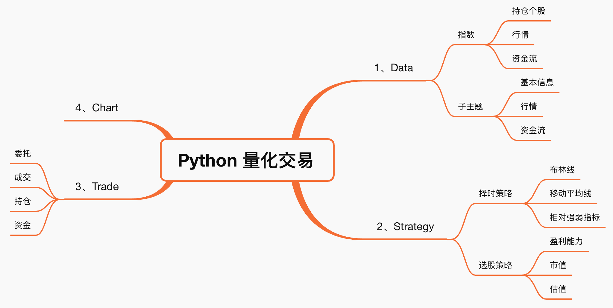

# 1、基础概念

量化投资是利用统计学、数学、信息技术、人工智能等方法取代人工作出决策，通过模型完成股票交易来构建投资组合。利用计算机技术和数学模型去实现投资策略的过程

量化投资的优势表现在以下三方面：
- 投资范围更广泛：借助计算机技术，信息搜集更具速度和广度，分析范围覆盖整个市场，促进获得更多投资机会。
- 程序化交易，避免主观因素：通过回测证实或证伪策略的有效性，程序化交易自动下单，克服人性弱点，避免人为情绪等主观因素的干扰。
- 数据处理快速响应，创造交易价值：采用计算机自动分析，响应速度迅速，拥有强大的数据处理和信息挖掘能力，支撑高频交易，并验证每个决策背后的模型有效性，更有可能创造有效的交易价值

# 2、量化交易流程

量化投资的一般流程包括以下几个步骤：
- 数据获取
- 数据清洗
- 策略设计：基于金融理论、历史数据或其他分析方法，构建量化投资策略的想法。
- 回测验证：使用历史数据对策略进行回测，检验策略的有效性和可行性，以及找到优化策略的方法。
- 策略优化
- 模拟盘验证：使用虚拟账户和资金进行模拟交易，检验策略在实际市场中的表现，调整和优化策略。
- 实盘交易：经过前面的验证和优化后，将策略投入实际交易中执行。

需要注意的是，量化投资的策略设计和实施过程需要严谨、科学、系统化的方法，同时也需要一定的技术和数学功底。成功的量化投资不仅仅依赖于策略的设计，也需要严格的风险控制和资金管理。

## 2.1、数据获取

主要内容：
- 行情数据
- 宏观数据：政策
- 财务数据：上市公司的报表
- 舆情数据：正负面的新闻

方式：
- 网站下载
- 客户端
- 三方 API
- 爬虫

## 2.2、数据清晰

- 垃圾数据清除
- 空值填充
- 格式转换
- 数据对齐

常用类库
- Numpy
- pandas

## 2.3、策略设计

- 信号捕捉：交易信号
- 交易
    - 建仓
    - 平仓

## 2.4、策略回测

- 回测参数设置
- 策略实例化
- 历史数据载入
- 回测执行
- 计算盈亏
- 计算统计指标
- 生成回测报告

# 3、量化交易策略分类

分类体系
- 交易产品
- 盈利模式
- 策略信号

## 3.1、交易产品策略

- 股票策略：股份公司为筹集资金而发行给各个股东作为持股凭证并借以取得股息和红利的一种有价证券，通过股价波动盈利
- 期权策略：期权合约差价，到期行权收益；买入一份低行权价认购期权，同时卖出一份高行权价认购期权
- CTA 策略，针对期货，关注价格趋势获取利差；价格走势存在反身性,随着市场上涨或下跌的趋势得到加强,而认知上的偏移又会反映在市场上
- FOF 策略：Found of Fund，基金中的基金，是一种专门投资于其他投资基金的基金；通过资产配置来分散风
险、平滑波动、改善组合收益风险比,从而优化投资者的持有体验。尤其是在震荡的市场背景下,FOF产品的优势尤其明显

## 3.2、盈利模式策略

- 单边多空策略：根据股票的涨和跌还盈利的，低价买进，待股价出现单边下跌的时卖出，赚取利差；通过单边买入或单边卖出实现盈利；
- 套利策略：在金融市场利用某些金融产品价格与收益率暂时不一致的机会获得收益的策略。追求无风险套利,即价格变动所产生的无风险收益；
- 对冲策略：
    - 对冲：指特意减低另一项投资风险的投资。同时进行两笔行情相关、方向相反、数量相当、盈亏相抵的交易；
    - 对冲策略：在期货股票市场和股票市场同时进行等量反向交易,以锁定既得利润(或成本),通过抵消两个市场的损益来规避股票市场的系统性风险；
    - 做多同时做空，市场向上，赚钱；市场向下，赚钱或少亏钱

## 3.2、策略信号策略

主要有：
- 多因子
- 交易模型
- 机器学习

什么是策略信号：交易信号，买入或卖出的一系列特征

**多因子策略：** 找到某些和收益率最相关的指标,并根据该指标，建一个股票组合，期望该组合在未来的一段时间跑赢或跑输指数，因子项：
- 资产负债率
- 资产回报率
- 每股净收益
- 净利润增长率
- 市盈率

> 跑赢指数，做多；跑输指数，做空

***交易模型：** 基于现代多学科众多理论，以及多种金融技术分析理论，具有普遍性，可盈利可量化可执行交易系统；

> 市场趋势符合交易模型即可盈利

**机器学习：**从大量数据中找到某种规律，包括但不局限于文本数据，图像数据等，找到可盈利，可量化，可执行的策略信号；

> 区别于传统金融量化策略，从更丰富的数据维度中识别策略信号


主要可用策略：
- 均值回归策略
- 动量效益策略
- 策略信号
- 二八轮动策略
- 海龟策略
- 机器学习策略

# 4、股票

## 4.1、基本概念

股票：股份公司为筹集资金而发行给各个股东作为持股凭证并借以取得股息和红利的一种有价证券

分红、送股配股、交易收益、本金少、易变现、避免货币贬值 

股票基本数据
- 技术面数据：是通过股票的历史价格和交易量等市场数据进行计算和分析得出的指标；技术面数据主要关注股票价格的变动和市场趋势，常用的技术指标包括移动平均线、相对强弱指标、MACD指标等
- 基本面数据：是通过分析公司的财务状况、业绩表现、竞争力等基本信息得出的评估，基本面分析的目标是评估公司的内在价值，并基于这些评估来判断股票的投资潜力。常用的基本面指标包括市盈率、市净率、股息率等。基本面数据通常需要通过公司公开的财务报告和公告来获取

## 4.2、股票行业分类

- 中正指数
- 申万指数

股票分类的作用：
- 持续盈利：最近二十年内持续盈利，食品饮料与医药生物行业
- 传统行业：前十年表现出色,后十年表现不佳,电气设备、采掘、有色金属、传统汽车、机械设备、钢铁
- 新兴行业：前十年不怎么样,最近十年表现出色,计算机、电子、新能源、家电
- 表现不佳：最近二十年内缺乏盈利表现,公用事业、纺织服装

## 4.3、股价影响因素

股价：股票的交易价格,与股票的价值是相对的概念。股票价值的真实含义是企业资产的价值。而股价的价值就等于每股收益乘以市盈率

影响股价的基本因素
- 经济因素：主要指经济周期因素，经济衰退，股价随之下跌；经济繁荣，股价也随之上涨
- 政治因素：处交的改善会使有关跨国公司股价上升；战争使各国政治经济不稳，股价下跌，但会使军工行业股价上升
- 行业因素：行业在国民经济中地位的变更，发展前景和发展潜力，新兴行业的冲击等都会影响相关股票的价格；
- 企业自身因素：企业的经营业绩水平、本身的资产信用、股息红利的设定、外来的发展前景等等都可以影响该企业股票价格变动
- 市场因素：主要指市场交易状况、其他金融投资产品的表现、交易因素、供求关系等因素；
- 心理因素：投资人在受到各个方面的影响后产生心理状态改变，往往导致情绪波动，判断失误，这是引起股价狂跌暴涨的重要因素；

## 4.4、股票交易

### 4.4.1、常识

交易时间：
- 周一至周五(法定节假日除外)上午9:30~11:30 下午13:00~15:00

竞价成交：价格优先,时间优先
- 上午：9:15~9:25 开盘集合竞价(成交量最大的价格)
- 上午：9:30~11:30，下午 13:00~14:57 连续竞价
- 下午：14:57~15:00 收盘集合竞价(成交量最大的价格)

**交易单位**
- 报价单位股，交易单位手，100股=1手
- 股价变动单位最小为0.01元

**庄家与散户**
- 庄家：能够影响金融证券市场行情的大户投资者
- 散户：股市中投入股市资金量较小的个人投资者

**换手率：**
- 某段时期内的成交量/发行总股数
- 表征该股票交易的活跃程度
- 10~50%非常活跃，低于1%非常不活跃

**PE**：市盈率,(每股市场价格)/(每股税后利润)
- PE越高，该企业越被高估；反之，该企业越被低估；正常范围是 10~50；

### 4.4.2、K 线

将各种股票每日、每周、每月开盘价、收盘价、最高价、最低价等涨跌变化状况，用图形方式表现出来，即蜡烛图
- K线需要结合交易量分析
- 看懂K线不代表能赚钱

Python 实现类库：
- matplotlib：Matplotlib是一个 Python的2D绘图库,它以各种硬拷贝格式和跨平台的交互式环境生成出版质量级别的图形
- mpl_finance：matplotlib finance：是python中可以用来画出蜡烛图、线图的分析工具,目前已经从matplotlib中独立出来

### 4.4.3、财务

- ROE：收益率，越高越高，每股收益
- 净利润：越高约好
- 成长性：越高越好，主营业务利润，营业利润增长率

财务报表：
- 资产负债表：财务状况，资产、负债、所有者利益
- 利润表：经营成果，收入、成本费用、利润；
- 现金流量表：现金流程，现金流入、现金流出；

### 4.4.4、选股

什么是选股：通过某种手段方式，提供给投资者判断个股的依据，帮助投资者选定个股的方法，选股是股票投资的第一步

选股方法：基本面选股，基本面是：通过分析一家上市公司在发展过程中所面临的外部因素以及其自身的因素，来预测其未来的发展前景，并以此来判断该上市公司的股票是否值得买入；
- 外部因素：经济增长、财政政策、利率变化
- 内部因素：经营状况、行业地位、财务状况

**基本面选股的核心方法：股票估值**。股票估值能帮助投资者发现现价价值被低估的股票，让他们低买高卖，从而获利。股票估值常用的指标：
- 每股收益：越高越好，代表公司的盈利水平
- 市盈率：同行业市盈率越低越好，14~30 倍正常，大于 30 倍属于高估，50 倍以上存在泡沫；
- 毛利率：越高越好，毛利率大于 50%很好
- 净资产收益率：代表公司盈利能力，ROE长期保持在20%以上就是白马股
- 资产负债率：适中为好，最好在10%~40%
    - 过高，容易暴雷
    - 过低，发展保守
- 净利润增速：代表公司未来成长能力，近3年平均增速在20%以上属于优质企业，大约50%属于成长股

### 4.4.5、择时

**什么是择时：** 买入股票和卖出股票的时机，择时的好坏，决定能够赚到多少钱

**择时方法：技术分析**，从K线形态、成交量、均线、布林带、MACD与KDJ等方面出发分析,它们是反映股价变化的指标

技术分析常用工具：
- K线形态：K线图蕴含大量信息，能显示股价的强弱、多空双方的力量对比，是技术分析最常见的工具；
- 成交量：在股市中，成交量不仅可以反映出买卖数量的变化，还可以通过成交量看出多空双方的力量变化
- 均线：将某一段时间的收盘价之和除以该周期所得到的一根平均线。常用的参数有5日、10日、20日、30日、60日等
- 布林带：布林带是一种常用的技术指标,它由三条轨道线组成，其中上下两条线分别可以看成是*价格的压力线和支撑线*，在两条线之间是一条*价格平均线*
- MACD：Moving Average Convergence/Divergence，意为异同移动平均线。它刻画的是股价变化的速度；
- KDJ：中文名叫随机指标。通过价格波动的真实波幅来反映价格走势的强弱和超买超卖现象，在价格尚未上升或下降之前发出买卖信号的一种技术分析指标，适用于 **短期行情走势** 分析

## 4.5、股价常用指标

- 极差：越高说明波动越明显，股价近期最高价的最大值和最小值的差值
- 成交量加权平均价格：英文名VWAP(Volume-Weighted Average Price，成交量加权平均价格)是一个非常重要的经济学量，代表着金融资产的"平均"价格
- 收益率：
    - 简单收益率，相邻两个价格之间的变化率；
    - 对数收益率，指所有价格取对数后两两之间的差值
- 波动率：越高说明波动越明显，波动率是对价格变动的一种衡量
- 年波动率：对数波动率的标准差除以其均值，再除以交易日倒数的平方根,通常交易日取250天
- 月波动率：对数收益率的标准差除以其均值，再乘以交易月的平方根，通常交易月取12月

均线
- 简单移动均线（SMA）：一般用于分析时间序列上的股价趋势，计算股价与等权重的指示函数的卷积
- 指数移动均线（EMA）：历史数据的权重以指数速度衰减，计算股价与权重衰减的指示函数的卷积

## 4.6、股票时间序列

- 时间序列：金融领域最重要的数据类型之一，股价、汇率为常见的时间序列数据，
- 趋势分析：主要分析时间序列在某一方向上持续运动，在量化交易领域,我们通过统计手段对投资品的收益率进行时间序列建模,以此来预测未来的收益率并产生交易信号
- 序列相关性：金融时间序列的一个最重要特征是序列相关性， 以投资品的收益率序列为例,我们会经常观察到一段时间内的收益率之间存在正相关或者负相关

# Python 量化交易

## 系统组成



量化交易系统功能模块


## 类库

- 数据处理与计算: NumPy, Pandas, SciPy
- 统计与机器学习: Statsmodels, Scikit-learn
- 数据可视化: Matplotlib, Plotly, mplfinance, Seaborn
- 技术分析: TA-Lib
- 专业回测框架: Backtrader, VectorBT, vn.py
- 综合性量化框架: QuantLib, QuantConnect
- AI量化平台: Qlib

## 量化交易平台

量化交易平台：可为量化交易研发人员提供所需的量化数据、策略框架、回测框架、交易接口等功能，极大提高量化交易初学者的研发效率


| 平台名称| 数据方面| 研究方面| 回测方面| 模拟交易方面| 实盘交易方面| 交流社区方面|
| ---| ---- | ---- | ---- | ---- | ---- | ----- |
| [聚宽（JoinQuant）](https://www.joinquant.com/study) | 提供2005年至今完整的股市Leve1数据、上市公司财务数据、完整的停复权信息。实时更新行情数据，盘后更新财务数据。此外还提供基金（包括ETF、LOF、分级A/B基金、货币基金）的行情和净值数据，金融期货数据、股票指数数据、行业板块数据、概念板块数据、宏观数据、行情数据等。 | 提供基于IPython Notebook的研究平台，支持Tick级数据，支持Python2、Python3。提供API（Application Programming Interface）。 | 支持股票、基金、期货等品种的回测，支持日、分钟、Tick级回测。 | 支持股票、股指期货、商品期货、ETF等品种的日、分钟、Tick级别的模拟交易。 | 和第一创业合作，支持股票、场内基金、期货的自动化实盘交易。   | “聚宽社区”，活跃度很高。     |
| [掘金（Myquant）](https://www.myquant.cn/) | 提供近10年日/分钟/Tick级别股票数据，及财务、分红送配、行业、板块等数据。还提供股指期货、商品期货的连续数据。 | 支持Python，Matlab，C，C++，C#语言。提供API。                | 支持股票、期货等品种回测及其混合回测，支持日、分钟、Tick级回测。 | 支持股票、商品期货、股指期货等品种的日、分钟级别的模拟交易。 | 需要客户申请和人工审核，具有实盘交易权限后可以手动交易。     | “掘金量化社区”，活跃度较高。 |
| [Bigquant](https://bigquant.com/) | 提供日/分钟级别的股票、期货、基金等数据的实时和历史数据，以及新闻、社交等新型数据。 | 支持Python，提供AI开发策略。提供API。                        | 支持股票、期货等品种的回测，支持日、分钟、Tick级回测。       | 支持日、分钟级别的股票、期货等品种的模拟交易。               | 可推送秒级交易信号，提供API接口对接交易终端，由用户手动交易。 | “Bigquant量化社区”，活跃度较高       |
| [米筐（Ricequant）](https://www.ricequant.com/welcome/) | 提供股票、ETF、期货（股指、国债、商品期货）、现货的基本信息。股票、ETF过去10多年以来每日市场数据，股票、ETF在2005年以来的分钟线数据。ETF过去20多年以来的市场数据和财务数据。期货从1999年以来的每日行情数据。期货2010年以来的分钟线数据。中国50 ETF、商品期权的日、分钟数据。舆情大数据。 | 提供基于IPython Notebook的研究平台，支持Python，Matlab，Excel。提供API。 | 支持股票、ETF、期货等品种的回测，支持日、分钟级回测。 | 支持日、分钟级别的股票、ETF、期货等品种的模拟交易。 | 提供期货的实盘交易。 | “米筐量化社区”，活跃度较高。 |
| [真格量化](https://quant.pobo.net.cn/login#/) | 主要是商品期货、期货期权、金融期货、股票期权等金融衍生品的数据。 | 支持使用Python进行策略研究。提供API。 | 主要提供期货、期权的日、分钟、Tick级别的回测。 | 使用第三方模拟交易平台，主要提供期货、期权的日级别的回测。 | 主要提供期货的实盘交易。 | “真格量化社区”，活跃度一般。 |

- 发明者量化平台：https://www.fmz.com/m/dashboard
- https://guorn.com/

# 量化策略

## 策略实现思路

量化交易策略流程，以双均线策略为例：
- 获取标的行情：获取目标投资标的（如股票、指数等）的历史价格数据。
- 计算技术指标-使用移动平均线作为技术指标：
    - 5日移动平均线
    - 10日移动平均线
- 生成交易信号-根据均线交叉情况生成买卖信号：
    - 金叉（短期均线上穿长期均线）→ 买入
    - 死叉（短期均线下穿长期均线）→ 卖出
- 计算收益-计算策略表现：单次收益率、累计收益率
- 寻找最优参数-优化策略参数：均线周期（如5日、10日是否最优）、不同投资标的的适用性
- 与市场基准比较-对比策略表现与主流市场指数：沪深300、上证指数、中证500
- 策略评估：综合评估策略效果，包括以下指标：收益率、夏普比率（Sharpe Ratio）、波动率、最大回撤、胜率（盈利交易占比）

## 如何验证策略

假设检验：收益 > 0 是否为大概率事件，先提出一个假设，通过多次实验，计算不同结果出现的频数和频率，来决定是否接受或者拒绝这个假设，从而验证这个现象是否随机(偶然)

# 获取股票数据

- 股票历史数据
- 财务数据
- 成分股：
    - 指数成分股
    - 行业成分股
    - 概念成分股

# 量化选股

利用数量化的方法选择股票组合，期望该股票组合能够获得超越基准收益率的投资行为

## 技术面选股

- 技术面选股：利用各种技术理论或技术指标来分析和预测股票的未来价格趋势
- 基本面选股：通过对一家上市公司在发展过程中面临的外部因素和自身因素进行分析，对其未来的发展前景进行预测，判断该上市公司的股票是否值得买进

注意事项：
- 分配多股,减少单股重仓的情况
- 全面研究个股基本面,增强个股判断逻辑和支撑
- 主动投资而非被动投资
- 只是提高胜率的工具之一

案例：**白马股选股**
- 筛选条件:
    - 1.总市值>50亿(市值较大的公司,流动性好,竞争力强)
    - 2.上市天数>750(抛开3年以内的次新)
    - 3.流通盘比例>95%(要全流通,避免解禁压力)
    - 4.销售毛利率>20%(毛利率要高)
    - 5.扣非净资产收益率>20%(ROE要高)
- 排名条件:
    - 1.总市值从大到小排列

## 财务因子

财务因子：评价企业的基本面情况，通常包括成长类因子，规模类因子，价值类因子以及质量类因子

- 成长类因子：在财务因子选股中，常用的方法是选用成长类因子进行选股。成长类因子包括营收因子与利润因子
    - 营收因子：营收因子包括营业收入同比增长率、营业收入环比增长率、营业总收入
    - 利润因子：利润因子包括净利润同比增长率、净利润环比增长率、营业利润率、销售净利润、销售毛利率
- 规模类因子：规模类因子反映公司规模情况，主要用于体现市值大小对投资收益的影响。规模类因子包括总市值，流通市值，总股本，流通股本
- 价值类因子：价值投资是一个久经考验的投资策略，惯例是购买那种相对低价的股票，转换成在基本面标准度量股息、账面价值、利润、现金
- 质量类因子：流或其他公司价值的方法。价值类因子包括市净率，市销率，以及市盈率质量类因子指与股票的财务质量、资本结构相关的因子。质量类因子包括净资产收益率,以及总资产净利率

### 营收因子

营收因子包括营业收入同比增长率、营业收入环比增长率、营业总收入

（1）营业收入同比增长率
- 计算公式：$(当期营业收入-上期营业收入)/上期营业收入*100\%$
- 上期营业收入一般指上一年度/季度/月度同期营业收入,此处指上一年度的同期营业收入

（2）营业收入环比增长率
- 计算公式： $(本期营业收入的值-上一期营业收入的值)/上一期营业收入的值*100\%$
- 环比增长率是针对上一期的，而同比增长率是相对于上一年度同一期的

（3）营业总收入
- 计算公式：主营业务收入 + 其他业务收入

### 利润因子

- 净利润同比增长率：净利润指企业的税后利润： $(当期净利润-上期净利润)/上期净利润绝对值*100\%$ ，上期净利润指上一年度的同期净利润
- 净利润环比增长率: $(本期净利润-上一期净利润)/上一期净利润*100\%$，环比增长率是针对上一期的,而同比增长率是相对于上一年度同一期的
- 营业利润率：指经营所得的营业利润占销售净额的百分比，或占投入资本额的百分比：$营业利润/全部业务收入*100\%$
- 销售净利润：指企业实现净利润与销售收入的对比关系，用以衡量企业在一定时期的销售收入获取的能力
$净利润/销售收入*100\%$
- 销售毛利润：毛利是销售净收入与产品成本的差
销售毛利率是毛利占销售净值的百分比: $(销售净收入-产品成本)/销售净收入$

### 规模类因子

规模类因子反映公司规模情况，主要用于体现市值大小对投资收益的影响
- 总市值：在某特定时间内股票总价值， $总股本数*股价$ ，总市值用来表示个股权重大小或大盘的规模大小
- 流通市值：在某特定时间内当时可交易流通股票总价值， $可交易的流通股股数*股价$ ，流通市值占总市值的比重(流通盘比例)越大，说明股票的市场价格越能反应出公司的真实价值
- 总股本：指公司已发行的普通股股份总数(包含A股、B股和H股的总股本)，单位万股
- 流通股本：指公司已发行的境内上市流通、以人民币兑换的股份总数，即A股市场的流通股本,单位万股

### 价值因子

即价值投资,是一种久经考验的投资策略。通过购买那种相对低价的股票，转换成在基本面标准度量股息账面价值、利润、现金流或其他公司价值的方法
- 市净率（PB）：每股市价/每股净资产，市净率可用于股票投资分析,一般来说市净率较低的股票，投资价值较高，相反，则投资价值较低。在判断投资价值时还要考虑当时的市场环境以及公司经营情况、赢利能力等因素
- 市销率（PS）：股价/每股销售额，在国内证券市场,运用这一指标来选股可以剔除那些市盈率很低但主营业务没有核心竞争力而主要是依靠非经营性损益而增加利润的股票(上市公司)。该项指标既有助于考察公司收益基础的稳定性和可靠性,又能有效把握其收益的质量水平
- (动态/静态)市盈率（PE）：
    - 动态市盈率是指还没有真正实现的下一年度的预测利润的市盈率：动态市盈率=股票现价/未来每股收益的预测值
    - 静态市盈率(即广泛意义上的市盈率)表示该公司需要累积多少年的盈利才能达到如今的市价水平：静态市盈率=股票现价/每股收益
    - 市盈率指标数值越小说明投资回收期越短,风险越小

### 质量因子

质量类因子指与股票的财务质量、资本结构相关的因子。影响质量因子的因素大致包括：公司的盈利能力、盈利稳定性、资本结构
成长性、会计质量、派息/摊薄、投资能力等
- 净资产收益率：$税后利润/所有者权益x100\%$ ，净资产收益率是企业税后利润除以净资产得到的百分比率，该指标反映股东权益的收益水平，用以衡量企业运用自有资本的效率指标值越高，说明投资带来的收益越高；
- 总资产净利率：$净利润/平均资产总额×100\%$
总资产净利率反映的是公司运用全部资产所获得利润的水平，即公司每占用1元的资产平均能获得多少元的利润。总资产净利率越高，表明公司投入产出水平越高，资产运营越有效，成本费用的控制水平越高

## 动量策略

动量策略是一种利用历史价格趋势来预测未来价格行为的量化交易策略。这种策略基于一个假设：股票或其他资产的未来价格趋势可能会延续其近期的表现。在实际应用中，动量策略通常会购买表现好的资产并卖出表现差的资产。

动量策略的核心是“追涨避跌”
- 正向策略：
    - 涨的还会涨、跌的还会跌
    - 买入涨最多的、卖出跌最多的
    - 利用市场对信息的反应不足
- 反向策略：涨太多了会跌、跌太多了会涨

确定交易对象: 股票池、考虑流动性(沪深300、创业板)  
流动性：成交活跃、买入卖出顺畅

### 动量策略实现步骤

1. 确定交易对象: 股票池、考虑流动性(沪深300、创业板)
- 流动性：成交活跃、买入卖出顺畅
- 基本面：行业、营收、盈利增速、现金流、负债
- 标的价格：1 手起买起卖
2. 选定业绩评价周期: 过去1~12个月
3. 计算形成期收益率: 过去N个月的收益率，交易信号
4. 对收益率进行排序: 最佳~赢家组合、最差~输家组合
5. 确定持仓/换仓周期: 1个月、可自定义测算
6. 连续或间隔一段时期，不断重复2一5行为
7. 计算动量/反向策略各持有期的回报率
8. 计算t/p统计值,判断是否存在动量效应


# 量化择时

量化择时：就是利用数量化的方法，通过对各种宏观微观指标的量化分析，试图找到影响大盘走势的关键信息，并且对未来走势进行预测。通俗来说，就是采用
量化的方式判断**买点** 和 **卖点**

常用的量化择时方法有趋势量化择时、市场情绪量化择时
- **有趋势量化择时**：基本思想来自于技术分析，技术分析认为趋势存在延续性，因此只要找到趋势方向，跟随操作即可。趋势择时的主要指标有 MA、MACD、DMA等
- **市场情绪量化择时**：利用投资者的热情程度来判断大势方向，当情绪热烈时，大盘可能会继续涨；当投资者情绪低迷，大盘可能继续下跌。常用方法：调查问卷、开户人数、搜索指数、报告评级、融资融券数据、舆情数据等

## 技术指标

技术指标的理论基础基于三项市场假设：市场行为涵盖一切信息；价格沿趋势移动；历史会重演；

技术指标是技术分析中使用最多的一种方法，通过考虑市场行为的多个方面建立一个数学模型，并给出完整的数学计算公式，从而得到一个体现证券市场的某个方面内在实质的数字，即所谓的技术指标值

技术指标分类：
- 趋向指标：技术趋向指标是识别和追踪有趋势的图形类指标，其特点是不试图捕顶和测底，如均线指标、MACD指标等趋向指标
- 反趋向指标：反趋向指标又称为振荡指标,是识别和追踪趋势运行的转折点的图形类指标，其特点是具有强烈的捕顶和捉底的意图，对市场转折点较敏感，如随机指标KDJ、强弱指标RSI等
- 压力支撑指标：压力支撑指标，又称通道指标，是通过顶部轨道线和底部轨道线，试图捕捉行情的顶部和底部的图形类指标，其特点是具有明显的压力线，也有明显的支撑线，如布林带BOLL指标、XS薛斯通道指标
- 量价指标：量价指标就是通过成交量变动来分析捕捉价格未来走势的图形类指标，其特点是分析成交量与价格涨跌的关系，如OBV能量潮指标、VOL成交量指标等

## 趋向指标

定义：趋向指标（DMI）又称动向指标，其基本原理是通过分析股价在上升及下降过程中的均衡，即供需关系手价格的变动由均衡到失衡的循环过程，从而提供对趋势判断的依据

在大多数指标中又以每一日的收盘价走势及升幅、跌幅的累计数来计算出不同的分析数据，其不足之处在于忽略了每一日的高价低价的波动幅度，而 DMI 指标则是把每日的高低波动的幅度因素计算在内，来分析预测未来的走势

### MACD

MACD：Moving Average Convergence/Divergence，意为平滑异同移动平均线。它刻画的是股价变化的速，一般用来研判股价变化的方向、强度和趋势；  
MACD其实就是两条指数移动平均线——`EMA(12)`和`EMA(26)`——的背离和交叉，`EMA(26)`可视为 MACD 的零轴，但是 MACD 呈现的消息噪声较均线少。

MACD 算法有如下指标：

| 指标     | 含义                  | 公式                              |
| ------ | ------------------- | ------------------------------- |
| 短期 EMA | 短期收盘价指数移动均线 (12 天)  | 前一日 $EMA (12)*11/13 + 今日收盘价*2/13$ |
| 长期 EMA | 长期收盘价指数移动均线 (26 天)  | 前一日 $EMA (26)*25/27 + 今日收盘价*2/27$ |
| DIF    | 短期 EMA 与长期 EMA 差值   | $EMA(12) - EMA(26)   $            |
| DEA    | DIF 线的 M 日指数移动均线    | 前一日 $DEA*8/10 + 今日 DEA*2/10$      |
| MACD   | DIF 线与 DEA 线的差 * 2 |  $(DIF - DEA) * 2$   |

实现 MACD 的主要函数：
- **ewm函数**：Pandas中指数加权移动窗口函数，采用ewm函数 + mean（）快捷计算MACD
- **bar函数**：Matplotlib柱状图函数，高效绘制MACD中的柱状图

关于金叉和死叉
- 快线 DIFF 上穿慢线 DEA，红柱出现的第一天，称为**金叉**，是买进持有的时机；
- 快线 DIFF 下穿慢线 DEA，绿柱出现的第一天，称为**死叉**，是卖出空仓的时机；

### EMV

EMV（Ease of Movement Value）即简易波动指标。股票中间价的相对波动幅度是以相对成交除以相对振幅作为衡量股票中间价波动百分比的基数。
- **EMV 增加** 代表成交量增加，这是价格上升阶段的正常信号。
- **EMV 下跌** 代表了缩量下降，这也是价格下跌阶段的正常信息
- 当 EMV 从底部到顶部穿过 0 轴时，买入；
- 当 EMV 从上到下穿过 0 轴时，卖出；

计算公式：以“日”为计算周期为例，EMV计算公式为：
- $A =（今日最高 + 今日最低）于2$
- $B =（前日最高 + 前日最低）+2$
- $C = 今日最高 - 今日最低$
- $EM = [(A - B) * C] / 今日成交额$
- EMV = N 日内 EM 累加和
- MAEMV：即EMV的 M 日简单移动平均。
- 常见的参数N为14，参数M为9 

### UOS

即终极波动指标。UOS指标是一种多方位功能的指标，除了趋势确认及超买超卖方面的作用之外，它的"突破"讯号不仅可以提供最适当的交易时机之外，更可以进一步加强指标的可靠度
it
计算公式：
- $TH = MAX(今日最高价, 昨日收盘价)$
- $TL = MIN(今日最低价, 昨日收盘价)
- ACC1 =(收盘价-TL)的N1日累和)/(TH-TL的N1日累和)
- ACC2 =(收盘价-TL)的N2日累和)/(TH-TL的N2日累和)
- ACC3 =(收盘价-TL)的N3日累和)/(TH-TL的N3日累和)
- $UOS = (ACC1 * N2 * N3 + ACC2 * N1 * N3 + ACC3 * N1 * N2)* 100/(N1 * N2 + N1 * N3 + N2 * N3)$
- MAUOS=UOS的M日指数平滑移动平均
- 参数N1=7, N2=14, N3=28, M=6

指标含义：
- UOS短线抄底: UOS上穿50
- UOS短线卖顶: UOS下穿65
- UOS中长期抄底: UOS上穿35
- UOS中长期卖顶: UOS下穿70

### GDX

即鬼道线，它反应的是中心线于收盘价的乖离，对趋势线做敬了平滑和修正处理，更精确的反应了股价运行规律

计算公式
- AA赋值:(2*收盘价+最高价+最低价)/4-收盘价的N日简单移动平均的绝对值/收盘价的N日简单移动平均
- 输出济安线(JAX):以AA为权重收盘价的动态移动平均
- 输出压力线(YLX):(1+M/100)*JAX
- 输出支撑线(ZCX):(1-M/100)*JAX

买入卖出信号：
- 当股价上升到压力线时,卖出
- 当股价下跌到支撑线时,买进

### JS

即加速线，通过当前股价与一段时间以前的股价相对比来测量股价涨跌的速度来确定其运行的快慢的指标

计算公式：
- JS指标包含四条曲线：分别是JS以及三条JS不同周期的简单移动平均线，一般情况下，分别取值5日、10日、20日的简单移动平均。具体的计算公式如下:
- JS = 100*(收盘价-N日前的收盘价)/(N*N日前的收盘价);
- MAJS1 = JS 的5日简单移动平均；
- MAJS2 = JS的10日简单移动平均；
- MAJS3 = JS的20日简单移动平均；
- 这里的N日,一般取值为5日。

买入卖出信号：
- 当JS线向下交叉JSMA线,卖出
- 当JS线向上交叉JSMA线,买进

### MA

即移动平均线指标,具有趋势特性。越长期的移动平均线，越能表现稳定的特性。移动平均线是一种趋势追踪工具，便于识别趋势已经终结或者反转，新的趋势是否正在形成。国内常用5日、10日、30日、60日、120日、250日线

移动平均线（Moving averages）表示的是金融资产在指定时间段内的平均价格，不同类型的移动平均线通常在数据点加权或给定重要性的方式上有所不同
- 简单移动平均线（SMA）是对过去特定天数内一组价格的算术平均值计算。
- 指数移动平均线（EMA）是加权平均，给予近期价格更大的重要性，使其对新信息更为敏感。

买入卖出：葛兰碧法则
- 买入信号：
    - 平均线从下降逐渐转为走平，而价格从下方突破平均线，为买进信号
    - 价格虽然跌破平均线，但是又立刻回升到平均线上，此时平均线仍然持续上升，仍为买进信号；
    - 价格趋势走在平均线上，价格下跌并未跌破平均线且立刻反转上升，也是买进信号
    - 价格突然暴跌，跌破平均线，且远离平均线，则有可能反弹单上升，也为买进时机
- 卖出信号：
    - 平均线从上升逐渐转为盘局或下跌，而价格向下跌破平均线，为卖出信号
    - 价格虽然向上突破平均线，但是又立刻回跌至平均线下，此时平均线仍然持续的下降，仍为卖出信号
    - 价格趋势走在平均线下，价格上升并未突破平均线且立刻反转下跌，也是卖出信号
    - 价格突然暴涨，突破平均线，且远离平均线，则有可能反弹回跌，也为卖出时机

### SMA

简单移动平均线（SMA）是通过对特定时期内一组数值的算术平均来计算的。将一组数字或股票价格相加，然后除以价格数量。计算证券简单移动平均线的公式如下：

$$ \begin{aligned} &SMA = \frac{ A_1 + A_2 + \cdots + A_n }{ n } \\ &\textbf{其中:} \\ &A = \text{第 } n \text{ 期的平均值} \\ &n = \text{时间周期的数量} \\ \end{aligned} $$

### EMA

指数移动平均线（Exponential Moving Average, EMA），也称为指数加权移动平均线（EWMA），它是一种移动平均线（MA），根据数据点的新旧程度分配不同的权重和重要性。EMA主要用于识别市场中的主导趋势，判定执行交易的支撑和阻力水平。

EMA（指数移动平均线）的计算公式为：

$$
EMA_{today} = \biggl( Price_{today} \times \frac{2}{N + 1} \biggr) + \biggl( EMA_{yesterday} \times \Bigl( 1 - \frac{2}{N + 1} \Bigr) \biggr)
$$
- N：周期（如 5、12、26 日）；常见金融组合：12/26 日 EMA 用于 MACD
- $(\alpha)$ ：平滑系数，常用 $(\alpha=\frac{2}{N+1})$。也有人用 $(\alpha)$ 直接指定（例如 0.1）。

**EMA 与 SMA 的对比（直观）**
* 响应性：EMA 对新数据更敏感（变化更快），SMA 更平滑但滞后更大。
* 权重分布：EMA︰最近权重大，历史权重呈指数衰减；SMA︰窗口内等权重，窗口外权重为 0。
* 适用场景：需要快速捕捉趋势或信号时用 EMA；需要平滑噪声时用 SMA。

**金融上的常见用途**
* 趋势识别：价格在 EMA 之上视为多头（上升趋势），反之空头。
* 交叉信号：短期 EMA 上穿长期 EMA（买入信号），反之卖出（例如 12/26 EMA）。
* 12日和26日的指数移动平均线（EMA）通常是被引用和分析的短期平均线。12日和26日EMA被用来创建移动平均收敛发散（MACD）和百分比价格振荡器（PPO）等指标。一般而言，50日和200日EMA被用作长期趋势的指标。当股票价格穿越200日移动平均线时，通常被视为价格反转的技术信号
* 注意：EMA 本身不会预测未来，只是历史加权平滑；需结合风险管理与其他信号。

**如何选择 N / α（实践建议）**
* 短期交易：N 取 5、10（响应快但噪声多）。
* 中期观察：N 取 20、50（平衡响应与平滑）。
* 长期趋势：N 取 100、200（平滑，滞后较大）。
* 若你需要非常快速响应，可以直接在 `alpha` 设定（如 α=0.2），这相比用固定 N 更直观地表达“响应度”。

### VMA

即变异平均线,指每个交易日股票的开盘价、收盘价、最高价和最低价除以4的平均值：
- 在股市中，当股价高于vma时，意味着股市较为强势；
- 当股价低vma于时,就意味着股市处于弱势；

买入卖出信号：
- 二条以上平均线向上交叉时，买进
- 二条以上平均线向下交叉时，卖出

## 反趋向指标

### RSI

即相对强弱指标，是期货市场和股票市场中最为著名的摆动指标。显示的是股价向上波动的幅度占总的波动幅度的百分比：
- 如果数值大，就表示市场处于强势状态；
- 如果数值小，则表示市场处于弱势

计算公式：
- NERSI =A/ (A+B)×100
    - A=N日内收盘涨幅之和
    - B=N日内收盘跌幅之和(取正值)

由上面算式可知RSI指标的技术含义，即以向上的力量与向T下的力量进行比较：
- 若向上的力量较大，则计算出来的指标上升；
- 若向下的力量较大，则指标下降； 由此测算出市场走势的强弱；

应用：
- RSI>80为超买，RSI<20为超卖
- RSI以50为中界线，大于50为多头行情，小于50为空头行情
- RSI在80以上形成M头或头肩顶形态时，为向下反转信号
- RSI在20以下形成W底或头肩底形态时，视为向上反转信号
- RSI向上突破其高点连线时，买进；RSI向下跌破其低点连线时卖出

### WR

威廉指标(简称W%R),它由拉瑞威廉首先发表。威廉指数主要用于研究股价的波动,通过分析股价波动变化中的峰与谷决定买卖时机，是用来分析市场短期行情走势的技术指指
标

计算公式：W&R=(N日内最高价-当日收盘价)/(N日内最高价-N日内最低价)

买入卖出
- 当威廉指数线高于80，市场处于超卖状态，行情即将见底，买进；
- 当威廉指数线低于20，市场处于超买状态，行情即将见顶，卖出；

### KDJ

随机指标(KDJ)在设计中充分考虑价格波动的随机振幅与中短期波动的测算，使其短期测市功能比移动平均线更加准确有效，在市场短期超买超卖的预测方面又比相对强弱指标敏感。
KDJ 指标（随机指标）是一种动量分析技术指标，主要用于判断股票或其他金融资产的价格趋势转折点和超买超卖状态。它由三条线组成：
- **K 线**：快速随机线
- **D 线**：慢速随机线  
- **J 线**：K 线与 D 线的差值

**1.计算未成熟随机值 (RSV)**
```
RSV = (当日收盘价 - N日内最低价) / (N日内最高价 - N日内最低价) × 100
```
**2.计算 K 值**
```
当日K值 = 2/3 × 前一日K值 + 1/3 × 当日RSV
```
**3.计算 D 值**
```
当日D值 = 2/3 × 前一日D值 + 1/3 × 当日K值
```
**4.计算 J 值**
```
J值 = 3 × 当日K值 - 2 × 当日D值
```
**参数说明**：通常 N=9（周期），初始 K、D 值设为 50

基本交易信号：
- 指标>80时，回档机率大；指标<20时，反弹机率大
- K在20左右向上交叉D时，视为买进信号
- K在80左右向下交叉D时，视为卖出信号
- J>100时，股价易反转下跌；J<0时，股价易反转上涨
- KDJ波动于50左右的任何信号，其作用不大

**Python 实现的函数：**
- **rolling函数**：Pandas中移动窗口函数，每个窗口都是指定的固定大小，快捷计算Ln与Hn
- **expanding函数**：Pandas中扩展窗口函数，只设置最小的观测值数量，不固定窗口大小，实现累计计算，即不断扩展，连用`expanding().max()`->创新高

## 压力支撑指标

### BOLL：布林带

布林带是由约翰·布林格（John Bollinger）在1980年代创制的。其利用统计原理，求出股价的标准差及其信赖区间，从而确定股价的波动范围及未来走势，利用波带显示股价的安全高低价位，因而也被称为布林带。其上下限范围不固定，随股价的滚动而变化；

可以把它想象成一条**动态的、自动调整的交易通道**。它由三条线组成：
- **中轨（MB）**：通常为**20期简单移动平均线（SMA）**。它代表了趋势的“基准线”。
- **上轨（UB）**：压力线，在中轨上方，通常是中轨加上两倍的标准差。
- **下轨（LB）**：支撑线，在中轨下方，通常是中轨减去两倍的标准差。

布林带的核心思想是：
* **价格倾向于在布林带通道内运行。**
* **通道的宽度（带宽）反映了市场的波动性。** 带宽越宽，市场波动越大；带宽越窄，市场波动越小（称为“收口”或“挤压”）。

**布林带的计算公式**：布林带的计算需要三个步骤，通常使用默认参数20（周期）和2（标准差倍数）。

假设计算的是日线图上的布林带：

1.**计算中轨（MB）**
- `中轨 = 20日简单移动平均线（SMA）`
- `SMA(20) = (第1天收盘价 + 第2天收盘价 + ... + 第20天收盘价) / 20`
```py
df['Middle Band'] = df['close'].rolling(window).mean()
```

2.**计算标准差（SD）**
- 标准差是统计学中衡量数据离散程度的指标。在这里，它衡量的是最近20个收盘价相对于中轨（20日SMA）的平均波动幅度。
- `标准差 = SQRT( SUM( (收盘价 - 20日SMA)^2 , 20 ) / 20 )`
```py
# 标准差
df['Std'] = df['close'].rolling(window).std()
```
> *注：实际计算中通常使用样本标准差（除以N-1），但布林格先生本人建议使用总体标准差（除以N），这在大多数交易软件中是默认设置。*

3.**计算上轨（UB）和下轨（LB）**
- `上轨 = 中轨 + (2 × 20期标准差)`
```py
df['Upper Band'] = df['Middle Band'] + (df['Std'] * 2)
```
- `下轨 = 中轨 - (2 × 20期标准差)`
```py
df['Lower Band'] = df['Middle Band'] - (df['Std'] * 2)
```

**参数调整：**
虽然20和2是标准参数，但交易者可以根据自己的交易风格和品种的波动性进行调整。
- **周期**：缩短周期（如10）会使布林带对价格更敏感；增加周期（如50）会使布林带更平滑，过滤掉更多噪音。
- **标准差倍数**：增加倍数（如2.5）会使通道更宽，能容纳更多的价格波动；减小倍数（如1.5）会使通道更窄，价格更容易触及上下轨。

**布林带的常见用法与解读**
- **判断超买超卖（需谨慎）**：
    - 当价格触及或突破**上轨**时，可能表示市场处于“超买”状态，有回调的可能。
    - 当价格触及或跌破**下轨**时，可能表示市场处于“超卖”状态，有反弹的可能。
    - **重要提示**：在强劲的趋势中，价格可以沿着上轨或下轨持续运行很久，单纯因为价格触碰到轨道就逆势交易是非常危险的。

- **识别趋势**：
    - **强劲上涨趋势**：价格持续在中轨上方运行，并不断测试上轨。
    - **强劲下跌趋势**：价格持续在中轨下方运行，并不断测试下轨。
    - **中轨的支撑/压力作用**：在上涨趋势中，中轨常成为回调的支撑位；在下跌趋势中，中轨常成为反弹的压力位。

- **捕捉“布林带收口”后的突破**（这是布林带最有效的策略之一）：
   - **收口（Squeeze）**：当布林带通道收窄时，代表市场波动性降至极低，处于“暴风雨前的宁静”。
   - **突破**：随后，当价格开始突破收口后的通道，特别是伴随着成交量的放大，通常意味着新趋势的启动。向上突破则做多，向下突破则做空。

- **结合其他指标使用**：
   - 布林带不应单独使用。最经典的组合是**布林带 + RSI（或MACD， KD）**。
   - **例如**：当价格触及下轨，**同时**RSI指标显示底背离或进入超卖区（如低于30），这时买入信号的可靠性会大大增加。

### MIKE 

麦克指标,其英文全称是"Mike Base"，是一种股价波动幅度大小而变动的压力支撑指标，设有初级、中级、强力三种不同级别的支撑和压力，用图标方式直接显示压力、支掌的位置；

计算步骤：？

如何使用：
- MIKE指标共有六条曲线，上方三条压力，下方三条支撑线
- 当股价脱离盘整，朝下跌的趋势前进时，股价下方三条"下限"为其支撑参考价
- 当股价脱离盘整，朝上涨的趋势前进时，股价上方三条上限"为其压力参考价
- 当股价往压力线方向涨升时，其下方支撑线不具参考价值
- 当股价往支撑线方向下跌时，其上方压力线不具参考价值

### XS

薛斯通道指标是判断股价运行区间及相应的压力、支撑的趋势性指标。属于短线指标之一。由美国薛斯所创。在薛斯通道中股价实|际上是被短期小通道包容着在长期道中上下运行，基本买卖策略是当短期小通道接近长期大通道时，预示着趋势的近期反转。

使用方法：
- 在上沿接近时趋势向下反转可捕捉短期卖点
- 在下沿接近时趋势向上反转可捕捉短期买点

## 量价指标

### OBV

能量潮指标是葛兰维于上世纪60年代提出的。OBV线系依据成交量的变化统计绘制而成。OBV线为股市短期波动的重要判断方法,但运用OBV线应配合股价趋势予以研判分析

计算公式：今日OBV= 昨日OBV + sgn×今天的成交量其中，sgn是符号函数，其数值由下式决定:
- sgn=+1，今日收盘价 >= 昨日收盘价
- sgn=-1，今日收盘价 < 昨日收盘价
- 这里的成交量指的是成交股票的手数，不是成交金额。sgn=+1时,其成交量计入多方的能量;sgn=-1时,其成交量计入空方的能量。
- 计算OBV时的初始值可自行确定，一般用第一日的成交量代替；

应用方法：
- 股价一顶比一顶高，而OBV一顶比一顶低，暗示头部即将开形成
- 股价一底比一底低，而OBV一底比一底高，暗示底部即将形成
- OBV突破其N字形波动的高点次数达5次时，为短线卖点
- OBV跌破其N字形波动的低点次数达5次时，为短线买点
- OBV不能单独使用，必须与股价曲线结合使用才能发挥作用

### VOL

即成交量指标，成交量是指个股或大盘的成交总手，在形态上用一根立式的柱子来表示。左面的坐标值与柱子的横向对应处，就是当日当时的成交总数。
- 如当天收盘价高于或等于当天的开盘价，成交柱呈红色；
- 反之，成交柱呈绿色

计算公式： $VOL = \frac{\sum n V_i}{N}$
- 其中， $ i=1,2,3,\dots,n;$
- N =选定的时间参数，如 10 或 30；
- Vi：i 日成交量

使用方法：
- 当前股价处在**盘整**的行情的时候，**成交量**突然增加的话，股价短时间内突破的可能性较高
- 当成交量出现了连续三条或者更多的成交量的时候，说明当前市场买卖频繁，股价下跌的可能性比较的小
- 股价在上涨了一定的时间后，成交量依然是大幅上涨，但是最后收尾的时候，趋势阴线或者是比较小的阳线收尾的时候，说明当前上涨的支撑力量已经衰退，股价走势会在短时间内发生反转

# 量化策略回测

## 量化策略回测流程

- 选择股票池和实现回测函数
- 设定回测时间段、初始金额及调仓频率
- 历史数据载入
- 处理订单：根据接下来时间的实际交易情况处理订单；
- 取消未完成订单
- 输出日志
- 生产回测报告

## MACD 策略

**实现思路：**
- 计算每日现金与 MACD
- 根据 MACD 识别金叉和死叉
- 根据买入卖出信号进行交易

## 量化回测风险指标

### 风险指标

风险指标即投资收益率的不确定性通常称之为风险，具体是指股票市场的一些未知的、不可预测的因素对股票股价造成不确定的影响，可能是正面影响收益率，也可能是负面的背离。风险指标是对风险的量化评价；

主要特点：风险指标有利于投资者对策略进行一个客观的评价。无论是回测还是模拟，所有风险指标都只会根据每天收盘后的收益计算，每天更新一次，并不考虑每天盘中的收益情况

### Alpha

Alpha 是投资者获得与市场波动无关的回报。阿尔法系数是基金/投资的绝对回报和按照 beta 系数计算的预期回报之间的差额。阿尔法收益与风险相关性很低；

算法：绝对收益或超额收益是基金/投资的实际收益减去无风险投资收益。例如投资者获得了 15%的回报，其基准获得了 10%的回报，那么 Alpha 部分就是 5%；

Alpha的计算公式基于资本资产定价模型（CAPM）：

$\alpha = R_p - [R_f +\beta × (R_m - R_f)]$

**其中：**
- $\alpha$：投资组合的阿尔法值
- R_p：投资组合的实际回报率
- R_f：无风险利率
- $\beta$：投资组合与市场基准的相关性系数
- R_m：市场基准的回报率

即：Alpha = 投资年后收益率 - [无风险回报率 + Beta * (基准年后收益率 - 无风险回报率)]

### Beta

Beta 表示投资的系统性风险，反映了策略对大盘变化的敏感性。例如一个策略的 Beta 为 1.5，则大盘涨 1%的时候，策略可能涨 1.5%，反之依然；如果一个策略的 Beta 为-1.5，则大盘涨 1%的时候，策略可能跌 1.5%，反之亦然；

计算公式：

$\beta = \frac{Cov(D_p, D_m)}{Var(D_m)}$

- $D_p$=策略每日收益
- $D_m$=基准每日收益
- $Cov(D_p, D_m)$ = 策略每日收益与基准每日收益的协方差
- $Var(D_m)$ = 基准每日收益的方差

### 夏普比率

夏普表示每承受以单位的总风险，会产生多少的超额报酬，可以同事对策略的收益与风险进行综合考虑；

夏普指数代表投资人每多承担一分风险，可以拿到较无风险报酬率（定存利率）高出几分报酬；
- 若为正值，代表投资承担报酬率波动风险有正的回馈；
- 若为负值，代表承受风险但报酬率反而不如银行利率，无参考意义；

计算公式：

夏普比率 = $\frac{R_p - R_f} {\sigma_p}$
- $R_p$ = 策略的年化收益率
- $R_f$ = 无风险利率（默认 0.03）
- $\sigma_p$ = 策略波动收益

### 索提诺比率

Sortino 表示每承担一单位的下行风险将获得多少超额回报；

与夏普比率有相似之处，但索提诺比率运用下行波动率而不是总标准差，以区别不利和有利的波动。这一比率越高，表面承担相应同单位下行风险时能获得更高的超额回报率。索提诺比率可以看做是夏普比率在衡量股票风险的一种修正方式；

索提诺比率 = $\frac{R_p - R_f} {\sigma_{pd}}$
- $R_p$ = 策略的年化收益率
- $R_f$ = 无风险利率（默认 0.03）
- $\sigma_{pd}$ = 策略收益下行波动率

### 信息比率

Information Ratio 用来衡量单位超额风险带来的超额收益；

信息比率越大，说明该策略单位跟踪误差所获得的超额收益越高，因此，信息比率较大的策略表现要犹豫信息比率较低的基准。合理的投资目标是在承担适度风险下，尽可能追求高信息比率；

信息比率 = $\frac{R_p - R_m} {\sigma_{t}}$
- $R_p$ = 策略的年化收益率
- $R_m$ = 基准的年华收益率
- $\sigma_{pd}$ = 策略与记住每日收益差值的年化标准差；

### 策略波动率

策略波动率是衡量股票或者衍生品价格波动范围的指标，也通常用来衡量风险。一般认为高波动率代表高风险，高风险对应高收益的可能

策略波动率 = ${\sigma_{p}} = \sqrt{\frac{250}{N-1} {\sum{(r_p - \bar{r_p})^2}}}$
- $r_p$ = 策略的年华收益率
- $\bar{r_p}$ = 策略每日收益率的平均值
- N 表示策略执行天数

### 基准波动率

Benchmark Volatility 用来测量基准的风险性，波动越大达标基准风险越高

${\sigma_{m}} = \sqrt{\frac{250}{-1} \sum_{i=1}^{N}(r_m - \bar{r_m})^2}$
- $r_m$ = 基准年华收益率
- $\bar{r_m}$ = 基准每日收益率的平均值
- m 表示策略执行天数

### 最大回撤

最大回撤率是指在选定周期内任一历史时点往后推，股价走到最低点的收益率回撤幅度的最大值（即在某一时段内股价从最高点开始回落到最低点的幅度）。最大回撤用来描述买入股票后可能出现最糟糕的情况。最大回撤是一个重要的风险指标

Max Drawdown = $Max(P_x - P_y) \div P_x$
- $P_x$ = 策略某日股票和现金的总价
- $P_x$ = 策略某日股票和现金的总价
- $Max(P_x - P_y)$ = 指价格差的最大值
- $y > x$

# 量化因子分析

## 概述

因子分析是股票投资的常用思路。指利用“因子”或特定“特征”使各种股票收益最大化的投资方法。这些因素包括波动性、动量、股票规模等；

原理：因子分析将多个实测变量转换少数几个综合指标（或称潜变量），它反映一种降维的思想。通过降维将相关性高的变量聚在一起，从而减少需要分析的变量的数量，而减少问题分析的复杂性。用来确定维度数量，对标体系的维度由主观来做判断；

## 因子类别以及流程

- 量化选股因子：多为财务指标，如营业利润率、销售净利率、营业收入、环比增长率等；
- 量化择时因子：多为技术指标，如均线、换手率、波动率等；

流程：因子构造 -> 因子选股 -> 构建股票池 -> 策略回测

## 常见基础因子

以聚宽量化平台为例
- 价量因子：是指利用 get_price() 函数可以获取到的价量信息，如open（开票价）、close（收盘价）、high（最高价）、low（最低价）、volume（成交量）、money（成交金额）等
- 财务数据因子：是指当日可以看到的最新单季财务指标，如 pe_retio（动态市盈率）、turnover_ratio（换手率）、pb_ratio（市净率）、market_cap（股票总市值）、circulating_market_cap（股票的流通市值）
- 行业因子：包含证监会行业分类、聚宽一、二级行业分类一级申万一、二、三级分类，如 A01（农业）、A02（林业）等；返回值是一个哑变量，若某股票属于某行业，则返回 1；否则返回 0；
- 概念因子：即概念板块代码，若 GN028（智能电网）等，返回值是一个哑变量，若某股票属于某哥概念，则返回 1；否则返回 0；
- 指数因子：即指数代码，如000001.XSHG（上证指数）等，返回值是一个哑变量，若某股票属于某指数的成分股，则返回 1；否则返回 0；
- 资金流因子：即 get_money_flow 函数查询的数据，可以使用的字段包括：change_pct(涨跌幅)、net_amount_main(主力净额)、net_pct_main(主力净占比)、net_amount_xl (超大单净额)、net_pct_xl (超大单净占比)、net_amiount_1(大单净额)、net_pct_1(大单净占比)、net_amount_m(中单净额)、net_pct_m((中单净占比)、net_amount_s(小单净额)和net_pct_s(小单净占比)

## 自定义因子

以聚宽量化平台为例

自定义因子类：
- 三个基本属性
    - name：因子名称，因子明明只能有字母、数字和下划线组成，并且地一个字符不能是数字，不能与 Python 关键字相同，也不能与基础因子冲突；
    - max_window：获取数据的最长时间窗口，返回日线数据；
    - dependencies：自定义因子依赖的基础因子名称，如 high、low、close 等
- 一个核心函数：calc()

流程：构造因子属性 -> 实现因子计算 -> 因子分析

### [因子计算](https://www.joinquant.com/help/api/help#factor:因子定义)

实现方式：实现 Factor 类内置的 calc 函数

### [单因子分析](https://www.joinquant.com/help/api/help#factor:因子分析)

```py
#载入函数库
from jqfactor import analyze_factor

#对因子进行分析
far = analyze_factor(factor, start_date, end_date, industry, universe, quantiles, periods, weight_method, use_real_price, skip_paused, max_loss, factor_dep_definitions)
```

### [因子分析结果](https://www.joinquant.com/help/api/help#factor:因子分析结果)

结果展示：create_full_tear_sheet

结果分析：
- 收益分析
- IC 分析
- 换手率分析

## 结果分析

- 收益分析：在收益分析中, 分位数的平均收益， 各分位数的累积收益， 以及分位数的多空组合收益三方面观察因子的表现。 第一分位数的因子值最小， 第五分位数的因子值最大。
    - 分位数收益： 表示持仓1、5、10天后，各分位数可以获得的平均收益。
    - 分位数的累积收益： 表示各分位数持仓收益的累计值。
    - 多空组合收益： 做多五分位（因子值最大）， 做空一分位（因子值最小）的投资组合的收益。
- IC 分析：information coefficient 的缩写，IC 代表了预测值和实现值之间的相关性， 通常用以评价预测能力。 取值在-1到1之间， 绝对值越大， 表示预测能力越好，IC 的计算， 一般有两种方法， normal IC 与 rank IC。 我们计算的是rank IC.
    - normal IC： 因子载荷与因子收益之间的相关系数
    - rank IC： 因子载荷的排序值与收益的排序值之间的相关系数
- 换手率分析：因子的换手率是在不同的时间周期下， 观察因子个分位中个股的进出情况，因子分位数换手率的价值体现在两个方面：
    - 因子稳定性的体现：换手率低的因子，因子值在时间序列层面的持续性更好
    - 衡量交易成本：在实际的交易过程中， 假设我们要维护投资组合的因子暴露恒定， 对于高换手率因子， 则需要进行更多的交易。 交易中的税费和滑点， 也会吞噬掉我们的部分利润。

## Alpha因子

## 基本面因子


# 量化开发面试

## 逻辑推理

## 概率统计

- 见面问题
- 飞机上找座位
- 扔硬币

## 算法编程

- 快乐数
- 最长回文子串
- T 秒后的青蛙位置

# 基金

如何筛选基金，从 3 个基本维度
- 3~5 年业绩（收益）
- 基金经理
- 风险指标：最大回撤、夏普、波动

# 课程

- [Datawhale量化开源课程](https://github.com/datawhalechina/whale-quant)
- [bigquant：量化知识库](https://bigquant.com/wiki/home)
- [Quant-Wiki 开源的中文量化百科](https://github.com/LLMQuant/quant-wiki)

# 数据与资讯

- [包含 300,000+个符号的数据库，涵盖股票、ETF、基金、指数、货币、加密货币和货币市场](https://github.com/JerBouma/FinanceDatabase)
- [The PyQuant Newsletter](https://www.pyquantnews.com/)

# 金融

- [Financial Machine Learning](https://papers.ssrn.com/sol3/papers.cfm?abstract_id=4501707)
- [利用最新的人工智能技术预测股市走势](https://github.com/borisbanushev/stockpredictionai)
- [论文：LLM AGENTS DO NOT REPLICATE HUMAN MARKET TRADERS: EVIDENCE FROM EXPERIMENTAL FINANCE](https://arxiv.org/pdf/2502.15800)
- [为分析师、量化分析师和人工智能代理打造的金融数据平台](https://github.com/OpenBB-finance/OpenBB)

# 参考资料

- [QuantAgent: 基于价格驱动的多智能体大语言模型高频交易系统](https://github.com/Y-Research-SBU/QuantAgent)
- [SquareQuant 是一个开源的 Python 定量金融库](https://github.com/SquareQuant/squarequant-package)
- [VNPY-量化交易平台](https://github.com/vnpy/vnpy)
- [基于Java的AI开源量化交易平台](https://gitee.com/dromara/northstar/)
- [Qlib 是一个以 AI 为导向的量化投资平台，旨在利用 AI 技术赋能量化研究，从探索想法到实施生产](https://github.com/microsoft/qlib)
- [一套用于量化金融的高质量工具](https://github.com/quarkfin/qf-lib)
- [nautilus_trader-开源交易平台、策略回测](https://github.com/nautechsystems/nautilus_trader)
- [Panda AI Agent-量化投资助手](https://www.pandaai.online/)
- [Qbot：AI智能量化投研平台](https://github.com/UFund-Me/Qbot)
- [量化交易策略](https://github.com/qmhedging/poboquant)
- [Awesome Quant GitHub 包含 Quants（定量金融）的精选库、包和资源列表](https://github.com/wilsonfreitas/awesome-quant)
- [150+ 量化金融 Python 程序，帮助您收集、作和分析股市数据](https://github.com/shashankvemuri/Finance)
- [算法交易机器学习代码](https://github.com/stefan-jansen/machine-learning-for-trading)
- [量化交易](https://github.com/je-suis-tm/quant-trading)
- [Tidy Finance with Python](https://www.tidy-finance.org/python/)
- [AutoHedge 利用群体智能和 AI 代理的力量，实现市场分析、风险管理和交易执行的自动化](https://github.com/The-Swarm-Corporation/AutoHedge)
- https://github.com/Y-Research-SBU/QuantAgent/
- https://github.com/AI4Finance-Foundation/FinRobot/
- [QuantMind 是一个智能的知识提取和检索量化金融框架](https://github.com/LLMQuant/quant-mind)