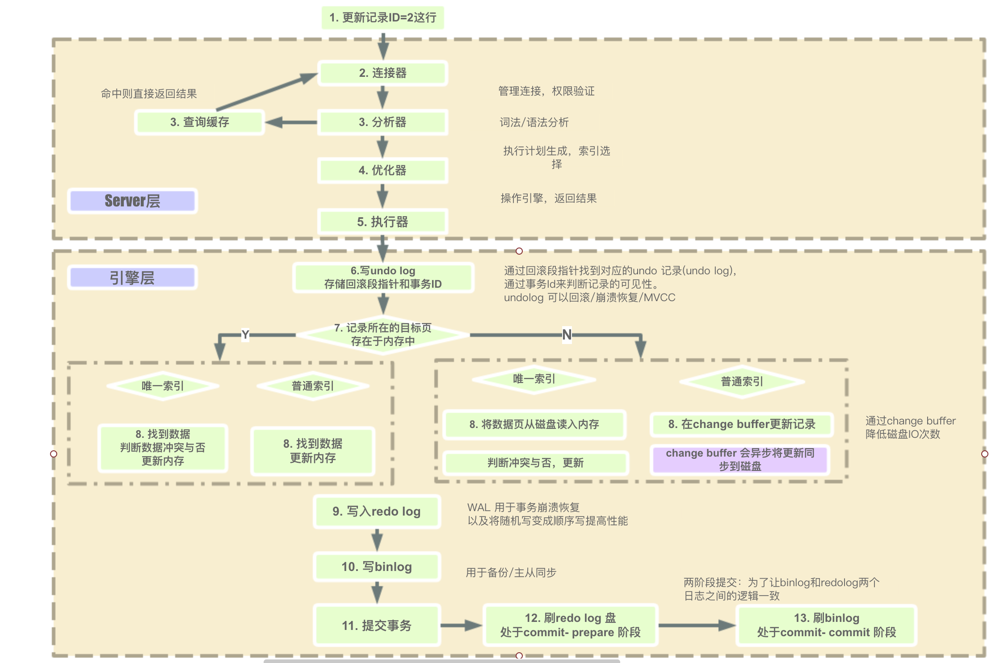

# 一、Mysql概述

基于C/S架构

## 1、MySQL服务器参数

* [MySQL Server配置](https://dev.mysql.com/doc/refman/5.6/en/server-system-variable-reference.html)

### 1.1、内存配置相关参数

- 确定可以使用的内存上限；
- 确定MySQL的每个连接使用的内存<br>
	sort_buffer_size ： 排序操作缓冲区<br>
	join_buffer_size ： 连接缓冲区大小<br>
	read_buffer_size ： 读缓冲区大小<br>
	read_rnd_buffer_size ： 索引缓冲区大小<br>
	上述参数是为每个线程分配的；
- 确定需要为操作系统保留多少内存

### 1.2、如何为缓存池分配内存

innodb_buffer_pool_size -> 修改该配置 <br>
总内存 - (每个线程所需要的内存 * 连接处数) - 系统保留内存

mysql内存参数：https://www.cnblogs.com/kissdb/p/4009614.html

### 1.3、I/O相关配置参数

- InnoDB I/O相关配置：
	- innodb_log_file_size：单个事务日志文件的大小
	- innodb_log_files_in_group：事务日志文件的数量
	- innodb_log_buffer_size：事务日志缓冲区
	- innodb_flush_log_at_trx_commit：log写入cache并刷新到缓存
	- innodb_flush_method：刷新方式
	- innodb_file_per_table：设置表空间
	- innodb_doublewrite：是否支持双写缓存

- MyISAM I/O配置：delay_key_write：

### 1.4、安全配置参数

- expire_logs_days：指定自动清理binlog的天数
- max_allowed_packet：控制mysql可以接收的包的大小
- skip_name_resolve：禁用DNS查找
- sysdate_is_now：确保sysdate()返回确定性日期
- read_only：进行非uper权限的用户写权限
- skip_slave_start：禁用slave自动恢复
- sql_mode：设置mysql所使用的sql模式

### 1.5、其他配置参数

- sync_binlog：控制mysql如何向磁盘刷新binlog
- tmp_table_size 和 max_heap_table_size：控制内存临时表大小
- max_connections：控制允许的最大连接数

## 2、MySQL版本

### 2.1、MySQL常见的发行版本

- MySQL官方版本-Oracle官方维护，包含社区版本和企业版本
- Percona MySQL：同官方版本完全兼容，性能优于mysql官方版本
- MariaDB

上述三个版本的主要区别：
- 服务器特性：都是开源，都支持分区表；Mysql是InnoDB引擎；其他是XtraDB引擎，两者是兼容的；
- 高可用特性：基于日志点复制；基于gtid复制；但是MariaDB的gtid同mysql不兼容；
- 安全特性：防火墙、审计、用户密码以及密码加密算法；

### 2.2、版本升级

- 升级之前需要考虑什么：
	- 升级对业务的好处：是否解决业务上某一方面的痛点、是否解决运维上某一个方面的痛点；
	- 升级对业务的影响：对原业务程序的支持是否有影响、对原业务程序的性能是否有影响；
	- 数据库升级的方案：评估受影响的业务系统、升级的详细步骤、升级后的数据库环境检查、升级后的业务检查；
	- 升级失败的回滚方案：升级失败回滚的步骤、回滚后的数据库环境检查、回滚后的业务检查；

- 升级的步骤
	- 对升级的数据库进行备份
	- 升级slave服务器版本；
	- 手动进行主从切换；
	- 升级Master服务器版本；
	- 升级完成后进行业务检查；

### 2.3、MySQL版本特性

- MySQL8.0特性
	- 所有元数据使用InnoDB引擎存储，无frm文件；
	- 系统表采用InnoDB存储并采用独立表空间；
	- 支持定义资源管理组（目前仅支持CPU资源）；
	- 支持不可见索引和降序索引，支持直方图优化；
	- 支持窗口函数；
	- 支持在线修改全局参数持久化；
	- 默认使用caching_sha2_password认证插件；
	- 新增支持定义角色（role）；
	- 新增密码历史记录功能，限制重复使用密码；
	- InnoDB DDL语句支持原子操作；
	- 支持在线修改UNDO表空间；
	- 新增管理试图用于建innodb表状态；
	- 新增innodb_dedicated_server配置项

## 3、MySQL与Oracle区别

- 自动增长的数据类型处理：
	- MYSQL有自动增长的数据类型，插入记录时不用操作此字段，会自动获得数据值；
	- ORACLE没有自动增长的数据类型，需要建立一个自动增长的序列号，插入记录时要把序列号的下一个值赋于此字段。`CREATE SEQUENCE 序列号的名称 (最好是表名+序列号标记) `	`INCREMENT BY 1 START WITH 1 MAXVALUE 99999 CYCLE NOCACHE;`其中最大的值按字段的长度来定, 如果定义的自动增长的序列号 NUMBER(6)，最大值为`999999`；INSERT 语句插入这个字段值为: `序列号的名称.NEXTVAL`；

- 分页的处理
	- MYSQL处理翻页的SQL语句比较简单，用 LIMIT 开始位置, 记录个数；
	- ORACLE处理翻页的SQL语句就比较繁琐了。每个结果集只有一个ROWNUM字段标明它的位置, 并且只能用`ROWNUM<100`, 不能用`ROWNUM>80`

- 单引号的处理：MYSQL里可以用双引号包起字符串，ORACLE里只可以用单引号包起字符串。在插入和修改字符串前必须做单引号的替换：把所有出现的一个单引号替换成两个单引号；

- 长字符串的处理：

- 日期的处理：MYSQL日期字段分DATE和TIME、时间戳等多种，ORACLE日期字段只有DATE，包含年月日时分秒信息，用当前数据库的系统时间为SYSDATE, 精确到秒，或者用字符串转换成日期型函数；

- 空字符的处理：MYSQL的非空字段也有空的内容，ORACLE里定义了非空字段就不容许有空的内容。按MySQL的NOT NULL来定义ORACLE表结构, 导数据的时候会产生错误。因此导数据时要对空字符进行判断，如果为NULL或空字符，需要把它改成一个空格的字符串；

- 字符串的模糊比较： MYSQL里用 `字段名 like '%字符串%'`，ORACLE里也可以用` 字段名 like '%字符串%'` 但这种方法不能使用索引, 速度不快，用字符串比较函数 `instr(字段名,'字符串')>0` 会得到更精确的查找结果；

## 4、MySQL日志

[MySQL日志分类、使用等](./MySQL_日志.md)

# 二、MySQL操作

## 1、连接命令行

```
mysql -hlocalhost -P3306 -uroot -p	--(-h：主机host， -P：端口，-u用户，-p：密码)； 
--select user()；查看当前用户
```
查看命令行帮助文档，进入到mysql控制台：`help create user;`，查看 create user 帮助

## 2、SQL操作

## 3、创建数据库

create database 数据库名 [数据库选项]

- 数据库名称规则：对于一些特点的组合，如纯数字、特殊符号等，包括MySQL的关键字，应该使用标识限定符来包裹，限定符使用反引号；
- 数据库选项：存在数据库文件的.opt文件中 <br>
	`default-character-set=utf8`<br>
	`default-collation=utf8_general_ci`<br>

## 4、数据库的查询

show databases

- 查看数据库(表)的创建语句：show create database db_name
- 数据库删除：drop database db_name；
- 修改数据库，修改数据库的属性：alter database db_name [修改指令] --一般就是修改数据库的属性修改数据库名：备份旧数据库的数据，创建数据库，将备份的数据移动到新数据库；alter database charset set utf8

## 5、表的定义

- 查看表show table [like pattern]，如：show table like 'exam_%'；模糊查询like通用适用于database
- 查看表的结构：show create table 表名 \G---是结构进行结构化；
- drop table if exists 表名/数据库名
- 表名的修改：rename table 旧表名 to 新表名；---支持同时修改多个表的操作；支持跨数据库表的重命名：rename table 当前数据库.表名 to 目标数据库.表名
- 修改列：alter table table_name add(增加)|drop(删除)|change(重命名列名)|modify(修改)<br>
	alter table 表名 add(列名 列的数据类型，...)；<br>
	alter table 表名 drop 列名；<br>
	alter table 表名 modify(列名 列的数据类型，...)；<br>
	alter table 表名 change 列名 新列名 数据类型；<br>
	alter table 表名 change character set utf8；---设置字符集

## 6、数据的操作（DML）

### 6.1、insert

### 6.2、update

### 6.3、delete

InnoDB 的数据是按页存储的，如果我们删掉了一个数据页上的所有记录，整个数据页就可以被复用了；如果我们用 delete 命令把整个表的数据删除呢？结果就是，所有的数据页都会被标记为可复用。但是磁盘上，文件不会变小；

delete 命令其实只是把记录的位置，或者数据页标记为了"可复用"，但磁盘文件的大小是不会变的。也就是说，通过 delete 命令是不能回收表空间的。这些可以复用，而没有被使用的空间，看起来就像是`空洞`；

经过大量增删改的表，都是可能是存在空洞的。所以，如果能够把这些空洞去掉，就能达到收缩表空间的目的。

#### 6.3.1、删除操作

- `delete from table_name [where]`
- `truncate table_name`
- `drop table table_name`

#### 6.3.2、delete、truncate、drop的区别

- delete和truncate操作只删除表中数据，而不删除表结构；
- delete删除时对于`auto_increment`类型的字段，值不会从1开始，truncate可以实现删除数据后，`auto_increment`类型的字段值从1开始；
- delete属于DML，这个操作会放到`rollback segment`中，事务提交之后才生效；
- truncate和drop属于DDL，操作立即生效，原数据不放到`rollback segment`中，不能回滚，操作不触发trigger；
- delete语句不影响表所占用的`extent`，高水线(high watermark)保持原位置不动；drop语句将表所占用的空间全部释放。truncate 语句缺省情况下见空间释放到 min extents个 extent，除非使用reuse storage; truncate会将高水线复位(回到最开始)；
- 执行速度：`drop> truncate > delete`；
- 使用建议：
	- drop：完全删除表；
	- truncate：想保留表而将所有数据删除。如果和事务无关；
	- delete：如果和事务有关，或者想触发；删除部分数据；可以返回被删除的记录数；

#### 6.3.3、Mysql高水位（数据空洞）

数据空洞：被标记为删除的记录，就是数据空洞。不仅浪费空间，还影响查询效率。MySQL底层是以数据页为单位来存储和读取数据的，每次向磁盘读一次数据就是读一个数据页，每访问一个数据页就对应一次IO操作，磁盘IO访问速度是很慢的。如果一个表上存在大量的数据空洞，原本只需要一个数据页就保存的数据，由于被很多空洞占用了空间。不得不增加其它数据页来保存数据，相应的MySQL在查询相同数据的时候，就不得不增加磁盘IO操作，从而影响查询速度。不仅删除会造成数据空洞，插入和更新同样会造成数据空洞。因此一个表在经过大量频繁的增删改后，难免会产生数据空洞，影响查询效率。在生产环境中直接表现为原本查询很快的表变的越来越慢。

产生原因：数据库中有些表使用delete删除了一些行后，发现空间并未释放；高水位线影响最显著的就是全表扫描的效率，因为当进行全表扫描时，会扫描高水位线以下的所有数据块；
- `delete`：不会释放文件高水位 
- `truncate`会释放，实际是把`.ibd`文件删掉了，再建一个。
- `delete + alter engine=innodb`会释放，相当于重建表。重建表的过程中，索引也会重建，这样表数据和索引数据都会更紧凑，不仅占用磁盘空间更小，查询效率也会有提升。在 MySQL 8.0.26 或 8.0.29 这些高版本的数据库，执行此命令时，加锁时间很短，基本不会阻塞增删改操作

解决方案：
- 执行 OPTIMIZE TABLE 表名：只对MyISAM, BDB和InnoDB表起作用，而且会锁表！
- 写一SQL，创建新表，删除旧表，新表重命名：生产环境中不停机情况下，数据比较难处理；
- 考虑用表分区，过期的表分区直接删除，不存在高水位问题；

## 7、校对规则

show variables like 'character_set_%';	查看当前数据库的校对规则

| Variable_name            | Value                                                   |
|--------------------------|---------------------------------------------------------|
| character_set_client     | utf8mb4                                                 |
| character_set_connection | utf8mb4                                                 |
| character_set_database   | utf8 （当前数据库的默认编码）                             |
| character_set_filesystem | binary                                                  |
| character_set_results    | utf8mb4                                                 |
| character_set_server     | utf8（服务器的编码）                                     |
| character_set_system     | utf8                                                    |
| character_sets_dir       | C:\Program Files\MySQL\MySQL Server 5.6\share\charsets\ |

设置变量：`set 变量=值`，变量可以是上述的变量

设置字符集：set name gbk

## 8、临时表

临时表建表语法`create temporary table` ，和普通的表不一样，和内存表也不一样：内存表数据保存到内存里，重启会丢失，临时表会写入到磁盘。

临时表只对自己的session中可见，session结束后自动删除表结构和表数据。

适用场景是分库分表，查询到的数据在临时表中做聚合。

临时表可以重名，实际的存储文件名有线程id，在内存中表的命名有table_ref_key，是由库名加表名加serverid+线程id组成。

bin log设置为row模式，临时表不会同步到备库中，设置为statement模式，会同步到备库中

**临时表重名问题：**

MySQL 要给这个 InnoDB 表创建一个 frm 文件保存表结构定义，还要有地方保存表数据。这个 frm 文件放在临时文件目录下，文件名的后缀是`.frm`，前缀是`#sql{进程 id}_{线程 id}_ 序列号`。可以使用 `select @@tmpdir` 命令，来显示实例的临时文件目录。而关于表中数据的存放方式，在不同的 MySQL 版本中有着不同的处理方式：
- 在 5.6 以及之前的版本里，MySQL 会在临时文件目录下创建一个相同前缀、以.ibd 为后缀的文件，用来存放数据文件；
- 而从 5.7 版本开始，MySQL 引入了一个临时文件表空间，专门用来存放临时文件的数据。因此，我们就不需要再创建 ibd 文件了；

临时表常见的使用场景：
- union
- group by

## 9、虚拟列

### 9.1、介绍

mysql 5.7 提供了一个新特性：虚拟列 Generated columns；MySQL的表生成列通常又叫做虚拟列或计算列。这个生成列的值是在列定义时包含了一个计算表达式计算得到的，有两种类型的生成列：
- Virtual（虚拟）：这个类型的列会在读取表记录时自动计算此列的结果并返回，并不会将这一列数据持久化到磁盘上
- Stored（存储）：这个类型的列会在表中插入一条数据时自动计算对应的值，并插入到这个列中，那么这个列会作为一个常规列存在表中。虚拟生成列有时候比存储生成列更有用，因为它不会占用存储空间；

MySQL 5.7中，不指定Generated Column的类型，默认是Virtual Column

### 9.2、主要特点

- 衍生列的定义可以修改，但virtual和stored之间不能相互转换，必要时需要删除重建
- 虚拟列字段只读，不支持 INSRET 和 UPDATE。
- 只能引用本表的非 generated column 字段，不可以引用其它表的字段。
- 使用的表达式和操作符必须是 Immutable 属性。
- 支持创建索引。
- 可以将已存在的普通列转化为stored类型的衍生列，但virtual类型不行；同样的，可以将stored类型的衍生列转化为普通列，但virtual类型的不行。
- MySQL可以在衍生列上面创建索引。对于stored类型的衍生列，跟普通列创建索引无区别。
- 对于virtual类型的衍生列，创建索引时，会将衍生列值物化到索引键里，即把衍生列的值计算出来，然后存放在索引里。如果衍生列上的索引起到了覆盖索引的作用，那么衍生列的值将直接从覆盖索引里读取，而不再依据衍生定义去计算。
- 针对virtual类型的衍生列索引，在insert和update操作时会消耗额外的写负载，因为更新衍生列索引时需要将衍生列值计算出来，并物化到索引里。但即使这样，virtual类型也比stored类型的衍生列好，有索引就避免了每次读取数据行时都需要进行一次衍生计算，同时stored类型衍生列实际存储数据，使得聚簇索引更大更占空间。
- virtual类型的衍生列索引使用 MVCC日志，避免在事务rollback或者purge操作时重新进行不必要的衍生计算；

### 9.3、语法

```
<type> [ GENERATED ALWAYS ] AS ( <expression> ) [ VIRTUAL|STORED ]  
[ UNIQUE [KEY] ] [ [PRIMARY] KEY ] [ NOT NULL ] [ COMMENT <text> ]
```
比如：
```sql
-- 创建表时指定索引列
CREATE TABLE `people` (
  `id` int NOT NULL,
  `name` varchar(20) DEFAULT NULL,
  `age` int NOT NULL,
  `info` varchar(255) DEFAULT NULL,
  `name_first` varchar(2) GENERATED ALWAYS AS (left(`name`,1)) VIRTUAL,
  KEY `idx_name_first` (`name_first`,`age`)
) ENGINE=InnoDB DEFAULT CHARSET=utf8
-- 添加虚拟列
ALTER TABLE `test` 
ADD COLUMN `update_time_format` date GENERATED ALWAYS AS (date_format(`updated_time`,'%Y-%m-%d')) Virtual NULL;
```

# 三、MySQL数据类型

## 1、数值型

### 1.1、整型

- tinyint：1个字节，-128~ 127(有符号)，0~255(无符号)；
- smallint：2个字节； -32468~32767
- mediumint：3个字节；
- int：4个字节；
- bigint：8位；
- bool型：0表示false，1表示true；tinyint(1)；MySQL保存boolean值时用1代表TRUE，0代表FALSE。boolean在MySQL里的类型为tinyint(1)。MySQL里有四个常量：true,false,TRUE,FALSE分别代表1,0,1,0。

*注意：是否有符号* 可在定义时，使用unsigned标识，没有符号；不写就默认有符号；

*定义显示宽度：* 规定数据的显示宽度：类型(M)--M表示最小显示宽度；需要使用前导0达到填充目的，称为zerofill；A：不影响数的范围；B：宽度大的不影响，不会截取；

### 1.2、小数类型：都支持控制数值的范围

`type(M, D)`：M表示的所有位数(不包括小数点和符号)，D表示允许的小数位数；整数位数只能是`(M-D)`位
- float：单精度，4个字节，默认有效位数为6位左右；				
- double：双精度，8个字节，默认有效数字16位左右；
- decimal：定点数，decimal(M，D)，M表示总位数，D表示小数位数(范围存在)，M默认是10，D默认是0；	

*浮点数支持科学计数法：0.23E3 == 0.23 * 10^3；*

*小数也支持zerofill和unsigned*

## 2、日期类型

- [官方文档：日期](https://dev.mysql.com/doc/refman/8.0/en/datetime.html)

### 2.1、datetime

年月日时分秒，显示格式：`YYYY-MM-DD HH:MM:SS`；8个字节，与时区无关
- 存储范围：`1000.1.1 00：00：00~9999.12.31 23：59：59`，
- 支持任意分隔符的日期，所表示的时间符合范围；但是如果出现歧义，所有不建议使用特殊分隔符；
- 支持两位年份，不建议使用<br>
	70~69		1970-2069<br>
	70~99		19**<br>
	0~69		20**<br>
- 与时区无关：也就是说插入到数据库是什么时间，你查询的时候不会随MySQL服务器的时区而变化；比如你插入的时候按照UTC时间插入到某个字段，你改成北京时间，该字段依然是你插入时的时间；

### 2.2、date

年月日，跟datetime差不多；3个字节，使用date类型可以利用日期时间函数进行日期之间的计算

### 2.3、timestamp

时间戳，存储时是整型，表示时是日期时间，格式`YYYY-MM-DD HH:MM:SS`，4个字节
- 存储范围：`1970.1.1 00:00:00~2038.1.19 03:14:07`
- 检索列时，+0可以检索到时间戳
- 支持0值：表示当前是没有规定的，如2013-04-0表示4月整个月；
- 依赖于所指定的时区；MySQL将TIMESTAMP值从当前时区转换为UTC进行存储，并从UTC返回到当前时区进行检索；也就是说该值会根据你MySQL服务器的时区变化而变化；
- 在行的数据修改时可以自动修改timestamp列的值

### 2.4、time

3个字节，范围：`-838:59:59 ~838:59:59`

表示一天中的时间或时间间隔，在表示时间间隔时可以使用天来表示，格式：`D HH:MM:SS`

### 2.5、year

1个字节，1901~2155

### 2.6、如何选择日期类型

- 不要使用字符类型来存储日期时间数据；
	* 日期时间类型通常比字符串占用的字符串存储空间小；
	* 日期类型在进行查找过滤时可以利用日期来进行对比；
	* 日期时间类型有着丰富的处理函数，可以方便对日期类型进行日期计算
- 使用int存储日期时间，使用SQL函数`unix_timestamp()`和`from_unixtime()`来进行转换；

### 2.7、datetime与timestamp

这两种类型中，datetime 不依赖时区，timestamp 随时区的变化而变化；

**查看时区**
```bash
mysql> show variables like '%time_zone%';
+------------------+--------+
| Variable_name    | Value  |
+------------------+--------+
| system_time_zone | CST    |
| time_zone        | +00:00 |
+------------------+--------+
# 设置时区的方式：下面这种方式重启会失效
mysql> set global time_zone='+08:00';
# 永久生效：修改 /etc/my.cnf.d/mysql-server.cnf，在[mysqld]下面添加如下配置：
default-time_zone = '+08:00'
```
以下为演示两种数据类型与时区的关系：
```sql
-- （1）查看时区，为UTC时间
mysql> show variables like '%time_zone%';
+------------------+--------+
| Variable_name    | Value  |
+------------------+--------+
| system_time_zone | CST    |
| time_zone        | +00:00 |
+------------------+--------+
2 rows in set (0.01 sec)
-- （2）创建表，包含 datetime 和 timestamp 两种数据类型，设置是默认值是mysql服务器时间
mysql> CREATE TABLE `sys_menu` (
    -> `id` INT NOT NULL AUTO_INCREMENT,
    -> `name` VARCHAR (255) NOT NULL,
    -> `create_time` datetime DEFAULT CURRENT_TIMESTAMP COMMENT '',
    -> `update_time` TIMESTAMP DEFAULT CURRENT_TIMESTAMP,
    -> PRIMARY KEY (`id`)
    -> ) ENGINE = INNODB DEFAULT CHARSET = utf8mb4;
Query OK, 0 rows affected (0.04 sec)
-- （3）插入数据
mysql> insert into sys_menu(name)value('admin');
Query OK, 1 row affected (0.01 sec)
-- （4）查询数据（当前北京时间为13:45）
mysql> select * from sys_menu;
+----+-------+---------------------+---------------------+
| id | name  | create_time         | update_time         |
+----+-------+---------------------+---------------------+
|  1 | admin | 2022-12-14 05:44:45 | 2022-12-14 05:44:45 |
+----+-------+---------------------+---------------------+
1 row in set (0.00 sec)
-- （5）修改时区为北京时间，即UTC+8，重启控制台，关于 time_zone 参数：https://dev.mysql.com/doc/refman/8.0/en/time-zone-support.html#time-zone-variables
mysql> set global time_zone='+8:00';
-- （6）使用新的session
mysql> show variables like '%time_zone%';
+------------------+--------+
| Variable_name    | Value  |
+------------------+--------+
| system_time_zone | CST    |
| time_zone        | +08:00 |
+------------------+--------+
mysql> select * from sys_menu;
+----+-------+---------------------+---------------------+
| id | name  | create_time         | update_time         |
+----+-------+---------------------+---------------------+
|  1 | admin | 2022-12-14 05:44:45 | 2022-12-14 13:44:45 |
+----+-------+---------------------+---------------------+
-- 可以看到上面 update_time 变为了 UTC+8的时间
```

### 2.8、字段类型改为时间

如果需要将表的某个字段：a varchar(30) 改为 timestamp 类型，需要注意，不要设置改字段为 null，否则其会将默认值设置为当前时间，且设置为根据时间戳更新：`ALTER TABLE tb_a modify column a timestamp(3) null default null COMMENT '时间';`

## 3、字符串类型

### 3.1、基本介绍

M表示允许的字符串长度
- `char(M)`，最大长度`255`个字节，固定长度，M严格限定字符长度；只能存储2000个字符；字符串存储在char类型的列中会删除末尾的空格
- `varchar(M)`，可变长，最大`65535`个字节，M表示允许的最大字符长度；自能存储4000个字符
- `text`：有多种类型，`2^16`个字节；
- 其他字符串类型 enum：枚举选项量；set：集合元素，如：create table s_1(gender enum('female'，'male'))；

	真实的varchar长度：总长度65535；<br>
	varchar的特点：当类型数据超过255个字符时，采用2个字节表示长度；<br>
	65533；整条记录需要一个额外的字节用于保存当前字段的null值，除非所有字段不为null，才可以省略该字节，无论一条记录有多个字段存在null，都使用统一的字节来表示，而不是每个字段一个字节；<br>
	列：`create table s_4(a varchar(65533))character set latin1-`--error<br>
		`create table s_4(a varchar(65533) not null)character set latin1`--right

- varchar长度选择问题：使用最小的符合需求的长度
- varchar适用场景
	- 字符串列的最大长度比平均长度大很多
	- 字符串列很少被更新
	- 使用了多字节字符集存储字符串
- TINYBLOB：0-255字节，不超过 255 个字符的二进制字符串
- TINYTEXT：0-255字节，短文本字符串
- BLOB：0-65535字节，二进制形式的长文本数据
- TEXT：0-65535字节，长文本数据
- MEDIUMBLOB：0-16777215字节，二进制形式的中等长度文本数据
- MEDIUMTEXT：0-16777215字节，中等长度文本数据
- LONGBLOB：0-4294967295字节，二进制形式的极大文本数据
- LONGTEXT：0-4294967295字节，极大文本数据

### 3.2、varchar

varchar与char的区别
- char是指：使用指定长度的固定长度表示字符串的一种字段类型；比如char（8），则数据库会使用固定的1个字节(八位）来存储数据，不足8位的字符串在其后补空字符；
- varchar(M)是一种比char更加灵活的数据类型，同样用于表示字符数据，但是varchar可以保存可变长度的字符串。其中M代表该数据类型所允许保存的字符串的最大长度，只要长度小于该最大值的字符串都可以被保存在该数据类型中。因此，对于那些难以估计确切长度的数据对象来说，使用varchar数据类型更加明智。MySQL4.1以前,varchar数据类型所支持的最大长度255,5.0以上版本支持65535字节长度,utf8编码下最多支持21843个字符(不为空)

- char：定长，效率高，一般用于固定长度的表单提交数据存储；例如：身份证号，手机号，电话，密码等；
- varchar：不定长，效率偏低

### 3.3、text类型

mysql中text是一个能够存储大量的数据的大对象，有四种类型：TINYTEXT, TEXT, MEDIUMTEXT,LONGTEXT，不同类型存储的值范围不同，如下所示：
- TINYTEXT：0-255字节，短文本字符串（2^8）
- TEXT：0-65535字节，长文本数据（2^16）
- MEDIUMTEXT：0-16777215字节，中等长度文本数据（2^24）
- LONGTEXT：0-4294967295字节，极大文本数据（2^32）

使用text可能的问题：导致binlog_cache频繁的flush，以及binlog过度切换，导致IOPS过高，影响了其他正常的DML操作

Text类型改造建议：
- 使用es存储：在MySQL中，一般log表会存储text类型保存request或response类的数据，用于接口调用失败时去手动排查问题，使用频繁的很低。可以考虑写入本地log file，通过filebeat抽取到es中，按天索引，根据数据保留策略进行清理。
- 使用对象存储：有些业务场景表用到TEXT，BLOB类型，存储的一些图片信息，比如商品的图片，更新频率比较低，可以考虑使用对象存储，例如阿里云的OSS，AWS的S3都可以，能够方便且高效的实现这类需求


## 4、列类型的选择

当一个列可以选择多种数据类型时，应该优先考虑数字类型，其次是日期或二进制类型，最后是字符类型
- 应该使用最精确的类型，占用的空间少
- 考虑应用程序语言的处理；
- 考虑移植兼容性；

## 5、列的属性

### 5.1、是否为空

规定一个字段的值是否可以为null，设置字段值不为空not null；**另：字段属性最好不用 null**
- 所有使用 NULL 值的情况，都可以通过一个有意义的值的表示，这样有利于代码的可读性和可维护性，并能从约束上增强业务数据的规范性。
- NULL 值到非 NULL 值的更新无法做到原地更新，容易发生索引分裂从而影响性能； 但 NULL列改为NOT NULL 来的性能提示很小，除非确定它带来了问题，否则不要把它当成优先的优化措施，最重要的是使用的列的类型的适当性
- NULL 值在 timestamp 类型下容易出问题，特别是没有启用参数 `explicit_defaults_for_timestamp`；
- `NOT IN`， `!= `等负向条件查询在有 NULL 值的情况下返回永远为空结果，查询容易出错：
	- `NOT IN` 子查询在有 NULL 值的情况下返回永远为空结果，查询容易出错；
	- 单列索引不存 NULL 值，复合索引不存全为null的值，如果列允许为null，可能会得到"不符合预期"的结果集，如果name允许为null，索引不存储null值，结果集中不会包含这些记录。所以，请使用 not NULL 约束以及默认值；
	- 如果在两个字段进行拼接：比如题号+分数，首先要各字段进行非 NULL 判断，否则只要任意一个字段为空都会造成拼接的结果为 null；
	- 如果有 `NULL column` 存在的情况下，`count(NULL column)`需要格外注意， NULL 值不会参与统计
	- 注意 NULL 字段的判断方式， column = NULL 将会得到错误的结果；
- `Null` 列需要更多的存储空间：需要一个额外字节作为判断是否为 NULL 的标志位；
- `NULL <> NULL` 的返回结果是 NULL，而不是 false。 
- `NULL = NULL` 的返回结果是 NULL，而不是 true。 
- `NULL <> 1` 的返回结果是 NULL，而不是 true。
- 在MySQL8之前的版本，如果某个列是允许为null，那么 `is not null` 是不会使用索引的，而 `is null` 则会使用索引；在Mysql8之后的版本都会使用索引；
- NULL对索引的影响：存储大量的NULL值，除了计算更复杂之外，数据扫描的代价也会更高一些；如果要查询的值正好介于两个page的临界位置，那么需要多读取一个page；因为辅助索引是非唯一的，即便是在等值查询时，也需要再读取下一条记录，以确认已获取所有符合条件的数据。还有，当利用辅助索引读取数据时，如果要读取整行数据，则需要回表。也就是说，除了扫描辅助索引数据页之外，还需要扫描聚集索引数据页

### 5.2、默认值属性：default value

只有在没有给字段设值的时才会使用默认值；常跟not null搭配

### 5.3、主键约束：primary key

可以唯一标识某条记录的字段或者是字段的集合；主键是跟业务逻辑无关的属性；
- 设置主键：`primary key( 列名) `
- 联合主键设置：`primary key(列名1，列名2，...);`

自动增长：auto_increment，为每条记录提供一个唯一标识：`列名 primary key auto_increment`

# 四、MySQL权限、配置

## 1、用户与用户权限

[账号管理](https://dev.mysql.com/doc/refman/8.0/en/account-management-statements.html)

### 1.1、创建、修改用户

**创建用户：**

创建账号一般格式：`create user 用户名@可访问控制列表' identified by '<password>' password <密码策略>`；

可访问控制列表可以包含如下格式：
- `%`：表示可以从所有外部主机访问；
- `192.168.1.%`：表示可以从192.168.1网段访问；
- `localhost`：DB服务器本地访问；

查询是否有某个用户：`select * from mysql.user where user='test'`

**修改用户密码：**

- 修改当前用户密码：`alter user user() identified by '<password>'`
- 使用root账号修改其他用户密码：`alter user <user@ip> identified by '<password>';`

### 1.2、常用用户权限

查看所有权限：show privileges；

**服务器管理权限：Admin**
- Create User：建立新的用户的权限；
- Grant Option：为其他用户授权的权限；
- Super：管理服务器的权限；

**DDL权限：**
- Create：新建数据库，表的权限；
- Alter：修改表结构的权限；
- Drop：删除数据库和表的权限；
- Index：建立和删除索引的权限

**DML权限：**
- Select：查询表中数据的权限；
- Insert：向表插入数据的权限；
- Update：更新表中数据的权限；
- Delete：删除表中数据的权限；
- Execute：执行存储过程的权限；

### 1.3、授权

遵循最小权限原则，使用grant命令对用户授权，格式：`grant <privileges> on database.table to user@ip;`
- privileges：即前面的用户权限；
- database.table：表示哪个数据库的哪张表；
- user@ip：创建的用户和访问的ip

使用revoke回收权限：`revoke <privileges> on database.table from user@ip;`

如果给用户与grant权限，使用 `with grant option`：`grant select on testdb.* to dba@localhost with grant option;`

### 1.4、保证数据库账号的安全

- 数据库用户管理流程规范；
	- 最小权限原则；
	- 密码强度策略；
	- 密码过期原则；
	- 现在历史密码重用原则；
- 密码管理策略

### 1.5、迁移数据库账号

思路：
数据库版本是否一致
- 是：备份mysql数据库，在目的实例恢复；
- 否：导出授权语句，在目的实例执行

导出用户建立及授权语句：`pt-show-grants u=root,p=123456,h=localhost`

### 1.6、关于用户其他常见SQL

- 查看当前登录用户：`SELECT CURRENT_USER();`

## 2、MySQL配置

比较配置文件，可以使用工具：pe-config-diff，格式：`pt-config-diff u=root,p=,h=localhost /etc/my.cnf`

在mysql控制台查看某个参数：`select @@<参数名称>`

### 2.1、SQL_MODE

主要配置mysql中处理sql的方式：`set [session/global/persit] sql_mode='';`

常用的 [SQL_MODE](https://dev.mysql.com/doc/refman/8.0/en/sql-mode.html) 值

### 2.2、mysql中关键性能参数

**服务器配置参数：**
- max_connections：设置mysql允许访问的最大连接数量；
- interactive_timeout：设置交互连接的timeout时间
- wait_timeout：设置非交互连接的timeout时间；
- max_allow_packet：控制mysql可以接收的数据包的大小；
- sync_binlog：表示每写多少缓冲会向磁盘同步一次binlog；
- sort_buffer_size：设置每个会话使用的排序缓存区的大小；
- join_buffer_size：设置每个会话所使用的连接缓冲的大小；
- read_buffer_size：指定了对一个myisam进行表扫描时锁分配的读缓存池的大小；
- read_rnd_buffer_size：设置控制索引缓冲区的大小；
- binlog_cache_size：设置每个会话用于缓存未提交的事务缓存大小；

**存储引擎参数：**
- innodb_flush_log_at_trx_commit：
	- 0：每秒进行一次重做日志的磁盘刷新操作；
	- 1：每次事务提交都会刷新事务日志到磁盘中；
	- 2：每次事务提交写入系统缓存每秒向磁盘刷新一次；
- innodb_buffer_pool_size：设置innodb缓冲池的大小，应为系统可用内存的75%；
- innodb_buffer_pool_instances：innodb缓冲池的实例个数，每个实例的大小为缓冲池大小/实例个数，一般为8个
- innodb_file_per_table：设置每个表独立使用一个表空间文件；从 MySQL 5.6.6 版本开始，它的默认值就是 ON 了
	- 这个参数设置为 OFF 表示的是，表的数据放在系统共享表空间，也就是跟数据字典放在一起；
	- 这个参数设置为 ON 表示的是，每个 InnoDB 表数据存储在一个以 .ibd 为后缀的文件中；

# 五、SQL 执行流程

- [MySQL执行顺序](https://mp.weixin.qq.com/s/eFmqxhlgvYOtTPDOFHHbUg)

## 1、一般SQL的写的顺序

```sql
SELECT
DISTINCT <select_list>
FROM <left_table> <join_type> JOIN <right_table>
ON <join_condition>
WHERE <where_condition>
GROUP BY <group_by_list>
HAVING <having_condition>
ORDER BY <order_by_condition>
LIMIT <limit_number>
```

## 2、数据执行的顺序：前面括号的数据表示执行顺序


```
(7)     SELECT
(8)     DISTINCT <select_list>
(1)     FROM <left_table>
(3)     <join_type> JOIN <right_table>
(2)     ON <join_condition>
(4)     WHERE <where_condition>
(5)     GROUP BY <group_by_list>
(6)     HAVING <having_condition>
(9)     ORDER BY <order_by_condition>
(10)    LIMIT <limit_number>
```
- FROM：对FROM子句中的前两个表执行笛卡尔积(Cartesian product)(交叉联接)， 生成虚拟表VT1
- ON：对VT1应用ON筛选器.只有那些使`<join_condition>`为真的行才被插入VT2.
- OUTER(JOIN)：如果指定了OUTER JOIN(相对于CROSS JOIN 或(INNER JOIN)，保留表(preserved table：左外部联接把左表标记为保留表， 右外部联接把右表标记为保留表， 完全外部联接把两个表都标记为保留表)中未找到匹配的行将作为外部行添加到 VT2，生成VT3.如果FROM子句包含两个以上的表， 则对上一个联接生成的结果表和下一个表重复执行步骤1到步骤3， 直到处理完所有的表为止
- WHERE：对VT3应用WHERE筛选器.只有使`<where_condition>`为true的行才被插入VT4.
- GROUP BY：按GROUP BY子句中的列列表对VT4中的行分组， 生成VT5.
- CUBE|ROLLUP：把超组(Suppergroups)插入VT5，生成VT6.
- HAVING：对VT6应用HAVING筛选器.只有使`<having_condition>`为true的组才会被插入VT7.
- SELECT：处理SELECT列表， 产生VT8.
- DISTINCT：将重复的行从VT8中移除， 产生VT9.
- ORDER BY：将VT9中的行按ORDER BY 子句中的列列表排序， 生成游标(VC10).
- TOP：从VC10的开始处选择指定数量或比例的行， 生成表VT11，并返回调用者；

*除非你确定要有序行，否则不要指定ORDER BY 子句*

## 3、MySQL查询执行路径

MySQL 客户端与服务器建立连接：
- 客户端通过 mysql 命令发起连接请求；
- 经过三次握手后与服务端建立 TCP 连接；
- 连接器接收到请求之后使用用户密码进行身份验证；
- 验证通过之后，获取用户的权限信息缓存起来，该连接后面都是基于该缓存中的权限执行 sql；

执行 SQL：


- 查询缓存：服务端接收到客户端的查询 sql 之后，先尝试从查询缓存中查询该 sql 是否已经有缓存的结果了，如果有则直接返回结果，如果没有则执行下一步；
- 语法解析：分析器拿到 sql 之后会尝试对 sql 语句进行词法分析和语法分析，校验语法的正确性，通过之后继续往下执行；
- 查询优化：优化器拿到分析器的 sql 之后，开始继续解析 sql，判断到需要走什么索引，根据实际情况重写 sql，最终生成执行计划；
- 执行器根据执行计划执行 sql，执行之前会先进行操作权限校验；
- 存储引擎：然后根据表存储引擎调用对饮接口进行查询数据，这里的扫描行数就是指的接口返回的记录数，执行器拿到返回记录之后进一步加工，如本例子：
- 执行器拿到 `select * from t_user where user_id=10000` 的所有记录，在依次判断后获取到匹配的记录

### 查询优化器

```
mysql> select sql_no_cache count(*) from film_actor;
+----------+
| count(*) |
+----------+
|     5462 |
+----------+
1 row in set, 1 warning (0.02 sec)

mysql> show status like 'last_query_cost';
+-----------------+-------------+
| Variable_name   | Value       |
+-----------------+-------------+
| Last_query_cost | 1104.399000 |
+-----------------+-------------+
1 row in set (0.04 sec)
```

## 4、MySQL更新流程

- [how-update-executes-in-mysql](https://gsmtoday.github.io/2019/02/08/how-update-executes-in-mysql/)

查询语句的那一套流程，更新语句也是同样会走一遍；
- 执行语句前要先连接数据库，这是连接器的工作。
- 在一个表上有更新的时候，跟这个表有关的查询缓存会失效，所以这条语句就会把表 T 上所有缓存结果都清空；
- 分析器会通过词法和语法解析知道这是一条更新语句。优化器决定要使用什么索引来更新。然后，执行器负责具体执行，找到对应的数据，然后更新；

与查询流程不一样的是，更新流程还涉及两个重要的日志模块：redo log（重做日志）和 binlog（归档日志）

假设更新语句：`mysql> update T set c=c+1 where ID=2;`这条语句在存储引擎内部update流程：
- 执行器先找引擎取 ID=2 这一行。ID 是主键，引擎直接用树搜索找到这一行。
	- 如果id=2这一行所在的数据页本来就在内存 中，就直接返回给执行器更新；
	- 如果记录不在内存，接下来会判断索引是否是唯一索引；
		- 如果不是唯一索引，InnoDB会将更新操作缓存在change buffer中；
		- 如果是唯一索引，就只能将数据页从磁盘读入到内存，返回给执行；
- 执行器拿到引擎给的行数据，把这个值加上 1，比如原来是 N，现在就是 N+1，得到新的一行数据，再调用引擎接口写入这行新数据；
- 引擎将这行新数据更新到内存中，同时将这个更新操作记录到 redo log 里面，此时 redo log 处于 prepare 状态。然后告知执行器执行完成了，随时可以提交事务；
- 执行器生成这个操作的 binlog，并把 binlog 写入磁盘；
- 执行器调用引擎的提交事务接口，引擎把刚刚写入的 redo log 改成提交（commit）状态，更新完成；



# 六、高级查询


## 1、连接

场景：假设两张表：emp， dept. emp表中的deptId为dept表中的主键。MySQL 不支持 full join

### 1.1、内连接

```sql
select * from emp inner join dept on emp.deptId=dept.id；
```
查询两张表中共有的数据。等同于：
```sql
select * from emp， dept where emp.deptId=dept.id
```

### 1.2、左外连接

```sql
select * from emp a left join dept b on a.deptId=b.id
```
查询emp独有的数据和查询emp与dept共有的数据

### 1.3、左连接
```sql
select * from emp a left join dept b on a.deptId=b.id where b.id is null；
```
查询emp独有的数据

### 1.4、右连接

```sql
select * from emp a right join dept b on a.deptId=b.id；
```
查询dept独有的数据和查询emp与dept共有的数据

### 1.5、右外连接

```sql
select * from emp a right join dept b on a.deptId=b.id where a.id is null；
```
查询dept独有的数据

### 1.6、全连接

```sql
select * from emp a left join dept b on a.deptId=b.id
union
select * from emp a right join dept b on a.deptId=b.id；
```
查询所有emp和dept独有和共有的数据

### 1.7、全连接（去除共有数据）

```sql
select * from emp a left join dept b on a.deptId=b.id where b.id is null
union
select * from emp a right join dept b on a.deptId=b.id where a.id is null；
```
去除两张表的共有数据，查询emp和dept分别独有的数据

### 1.8、union 和 union all：联合查询

- **1.8.1、union：**

用于合并两个或多个 SELECT 语句的结果集，并消去表中任何重复行，union 内部的 SELECT 语句必须拥有相同数量的列，列也必须拥有相似的数据类型，每条 SELECT 语句中的列的顺序必须相同

基本语法：
```sql
select column_name from table1
union
select column_name from table2
```

- **1.8.2、union all：**

用途同 union all， 但是不消除重复行.
```sql
SELECT column_name FROM table1
UNION ALL
SELECT column_name FROM table2
```

- **1.8.3、union 使用注意事项：**

如果子句中有 order by 或 limit， 需要用括号括起来，推荐放到所有子句之后，即对最终合并的结果来排序或筛选在子句中，order by 需要配合limit使用才有意义。如果不配合limit使用，会被语法分析器优化分析时去除
```sql
select * from emp a left join dept b on a.deptId=b.id order by id desc
union
select * from emp a right join dept b on a.deptId=b.id order by id desc
```
==> 报错：1221 - Incorrect usage of UNION and ORDER BY

如果确认数据库中不会有重复数据，推荐使用 union all，如果使用union，不管检索结果有没有重复，都会尝试进行合并，然后在输出最终结果前进行排序。如果已知检索结果没有重复记录，使用union all 代替union，这样会提高效率；

### 1.9、union执行流程

有如下SQL：
```sql
(select 1000 as f) union (select id from t1 order by id desc limit 2);
```
其执行计划如下：


从上面的执行计划可以看到：
- 第二行的 key=PRIMARY，说明第二个子句用到了索引 id。
- 第三行的 Extra 字段，表示在对子查询的结果集做 union 的时候，使用了临时表 (Using temporary)；

这个语句的执行流程是这样的：
- 创建一个内存临时表，这个临时表只有一个整型字段 f，并且 f 是主键字段。
- 执行第一个子查询，得到 1000 这个值，并存入临时表中。
- 执行第二个子查询：
	- 拿到第一行 id=1000，试图插入临时表中。但由于 1000 这个值已经存在于临时表了，违反了唯一性约束，所以插入失败，然后继续执行；
	- 取到第二行 id=999，插入临时表成功。
- 从临时表中按行取出数据，返回结果，并删除临时表，结果中包含两行数据分别是 1000 和 999；

这里的内存临时表起到了暂存数据的作用，而且计算过程还用上了临时表主键 id 的唯一性约束，实现了 union 的语义

如果把上面这个语句中的 union 改成 union all 的话，就没有了“去重”的语义。这样执行的时候，就依次执行子查询，得到的结果直接作为结果集的一部分，发给客户端。因此也就不需要临时表了：
```sql
(select 1000 as f) union (select id from t1 order by id desc limit 2);
```
执行计划如下：


可以看到，第二行的 Extra 字段显示的是 Using index，表示只使用了覆盖索引，没有用临时表了。

## 2、连接使用注意事项

- 关于 `A LEFT JOIN B ON 条件表达式` 的一点提醒：ON 条件（“A LEFT JOIN B ON 条件表达式”中的ON）用来决定如何从 B 表中检索数据行。如果 B 表中没有任何一行数据匹配 ON 的条件，将会额外生成一行所有列为 NULL 的数据

- 对于 `A LEFT JOIN B ON 条件表达式`中，如果on后面的条件有关于A表的过滤条件，其是不生效的；类似如下的SQL
	```sql
	select user.*, score.score from user left join score on user.id = score.userId and user.status = 1
	```
	使用user.status对user表进行过滤是不生效的，只能加在where语句中

## 3、group by...having

## 4、行转列与列转行

[行转列与列转行](https://www.cnblogs.com/xiaoxi/p/7151433.html)

### 4.1、行转列


将上述数据按照下列各式数据：


- **1、使用case...when....then 进行行转列**
	```sql
	SELECT user_name ,
		MAX(CASE course WHEN '数学' THEN score ELSE 0 END ) 数学,
		MAX(CASE course WHEN '语文' THEN score ELSE 0 END ) 语文,
		MAX(CASE course WHEN '英语' THEN score ELSE 0 END ) 英语
	FROM test_tb_grade
	GROUP BY user_name;
	```

- **2、使用IF() 进行行转列：**
	```sql
	SELECT userid,
	SUM(IF(`subject`='语文',score,0)) as '语文',
	SUM(IF(`subject`='数学',score,0)) as '数学',
	SUM(IF(`subject`='英语',score,0)) as '英语',
	SUM(IF(`subject`='政治',score,0)) as '政治' 
	FROM tb_score 
	GROUP BY userid
	```
	**注意点：**
	- SUM() 是为了能够使用GROUP BY根据userid进行分组，因为每一个userid对应的subject="语文"的记录只有一条，所以SUM() 的值就等于对应那一条记录的score的值。
	假如userid ='001' and subject='语文' 的记录有两条，则此时SUM() 的值将会是这两条记录的和，同理，使用Max()的值将会是这两条记录里面值最大的一个。但是正常情况下，一个user对应一个subject只有一个分数，因此可以使用SUM()、MAX()、MIN()、AVG()等聚合函数都可以达到行转列的效果。

	- `IF(subject='语文',score,0)` 作为条件，即对所有subject='语文'的记录的score字段进行SUM()、MAX()、MIN()、AVG()操作，如果score没有值则默认为0；

- **3、利用SUM(IF()) 生成列 + WITH ROLLUP 生成汇总行，并利用 IFNULL将汇总行标题显示为Total**
	```sql
	SELECT IFNULL(userid,'total') AS userid,
		SUM(IF(`subject`='语文',score,0)) AS 语文,
		SUM(IF(`subject`='数学',score,0)) AS 数学,
		SUM(IF(`subject`='英语',score,0)) AS 英语,
		SUM(IF(`subject`='政治',score,0)) AS 政治,
		SUM(IF(`subject`='total',score,0)) AS total
	FROM(
		SELECT userid,IFNULL(`subject`,'total') AS `subject`,SUM(score) AS score
		FROM tb_score
		GROUP BY userid,`subject`
		WITH ROLLUP
		HAVING userid IS NOT NULL
	)AS A 
	GROUP BY userid
	WITH ROLLUP;
	```

- **4、利用SUM(IF()) 生成列 + UNION 生成汇总行,并利用 IFNULL将汇总行标题显示为 Total**
	```sql
	SELECT userid,
	SUM(IF(`subject`='语文',score,0)) AS 语文,
	SUM(IF(`subject`='数学',score,0)) AS 数学,
	SUM(IF(`subject`='英语',score,0)) AS 英语,
	SUM(IF(`subject`='政治',score,0)) AS 政治,
	SUM(score) AS TOTAL 
	FROM tb_score
	GROUP BY userid
	UNION
	SELECT 'TOTAL',SUM(IF(`subject`='语文',score,0)) AS 语文,
	SUM(IF(`subject`='数学',score,0)) AS 数学,
	SUM(IF(`subject`='英语',score,0)) AS 英语,
	SUM(IF(`subject`='政治',score,0)) AS 政治,
	SUM(score) FROM tb_score
	```

- **5、利用SUM(IF()) 生成列，直接生成结果不再利用子查询**
	```sql
	SELECT IFNULL(userid,'TOTAL') AS userid,
	SUM(IF(`subject`='语文',score,0)) AS 语文,
	SUM(IF(`subject`='数学',score,0)) AS 数学,
	SUM(IF(`subject`='英语',score,0)) AS 英语,
	SUM(IF(`subject`='政治',score,0)) AS 政治,
	SUM(score) AS TOTAL 
	FROM tb_score
	GROUP BY userid WITH ROLLUP;
	```
- **6、动态，适用于列不确定情况**
	```sql
	SET @EE='';
	select @EE :=CONCAT(@EE,'sum(if(subject= \'',subject,'\',score,0)) as ',subject, ',') AS aa FROM (SELECT DISTINCT subject FROM tb_score) A ;
	
	SET @QQ = CONCAT('select ifnull(userid,\'TOTAL\')as userid,',@EE,' sum(score) as TOTAL from tb_score group by userid WITH ROLLUP');
	-- SELECT @QQ;
	
	PREPARE stmt FROM @QQ;
	EXECUTE stmt;
	DEALLOCATE PREPARE stmt;
	```
- **7、合并字段显示：利用group_concat()**
	```sql
	SELECT userid,GROUP_CONCAT(`subject`,":",score)AS 成绩 FROM tb_score
	GROUP BY userid
	```
	group_concat()函数可以很好的建属于同一分组的多个行转化为一个列

### 4.2、列转行


将上面的数据按照下列各式转换：


列转行SQL：
```sql
select user_name, '语文' COURSE, CN_SCORE as SCORE from test_tb_grade2
union select user_name, '数学' COURSE, MATH_SCORE as SCORE from test_tb_grade2
union select user_name, '英语' COURSE, EN_SCORE as SCORE from test_tb_grade2
order by user_name,COURSE;
```

## 5、查询缓存

缓存select语句的查询结果，但是需要在配置文件中开启缓存

配置query_cache_type：
- 0：不开启
- 1：开启，默认缓存所有，需要在SQL语句中增加select sql-no-cache提示来放弃缓存
- 2：开启，默认都不缓存，需要在SQL语句中增加select sql-cache来主动缓存（常用）

查询配置结果：`show variables like ‘query_cache_type’;`

在客户端设置缓存大小，通过配置项query_cache_size来设置：`show variables like 'query_cache_size';`

**缓存失效问题：** 当数据表改动时，基于该数据表的任何缓存都会被删除。（表层面的管理，不是记录层面的管理，因此失效率较高）

**注意：关于查询缓存的相关参数已经在MySQL8.0.3版本被移除了**

## 6、join原理

数据准备：这两个表都有一个主键索引 id 和一个索引 a，字段 b 上无索引。存储过程 idata() 往表 t2 里插入了 1000 行数据，在表 t1 里插入的是 100 行数据
```sql
CREATE TABLE `t2` (
  `id` int(11) NOT NULL,
  `a` int(11) DEFAULT NULL,
  `b` int(11) DEFAULT NULL,
  PRIMARY KEY (`id`),
  KEY `a` (`a`)
) ENGINE=InnoDB;
drop procedure idata;
delimiter ;;
create procedure idata()
begin
  declare i int;
  set i=1;
  while(i<=1000)do
    insert into t2 values(i, i, i);
    set i=i+1;
  end while;
end;;
delimiter ;
call idata();

create table t1 like t2;
insert into t1 (select * from t2 where id<=100)
```

### 6.1、Index Nested-Loop Join（NLJ）

```sql
select * from t1 straight_join t2 on (t1.a=t2.a); # 如果直接使用 join 语句，MySQL 优化器可能会选择表 t1 或 t2 作为驱动表
```
上面语句中 t1 是驱动表，t2 是被驱动表

该SQL的执行计划：


在这条语句里，被驱动表 t2 的字段 a 上有索引，join 过程用上了这个索引，因此这个语句的执行流程是这样的：
- 从表 t1 中读入一行数据 R；
- 从数据行 R 中，取出 a 字段到表 t2 里去查找；
- 取出表 t2 中满足条件的行，跟 R 组成一行，作为结果集的一部分；
- 重复执行步骤 1 到 3，直到表 t1 的末尾循环结束；

这个过程是先遍历表 t1，然后根据从表 t1 中取出的每行数据中的 a 值，去表 t2 中查找满足条件的记录。在形式上，这个过程就跟我们写程序时的嵌套查询类似，并且可以用上`被驱动表的索引`，所以我们称之为`Index Nested-Loop Join`，简称 NLJ；

在这个流程里：
- 对驱动表 t1 做了全表扫描，这个过程需要扫描 100 行；
- 而对于每一行 R，根据 a 字段去表 t2 查找，走的是树搜索过程。由于我们构造的数据都是一一对应的，因此每次的搜索过程都只扫描一行，也是总共扫描 100 行；
- 所以，整个执行流程，总扫描行数是 200；

假设被驱动表的行数是 M。每次在被驱动表查一行数据，要先搜索索引 a，再搜索主键索引。每次搜索一棵树近似复杂度是以 2 为底的 M 的对数，记为 log2M，所以在被驱动表上查一行的时间复杂度是 2*log2M。假设驱动表的行数是 N，执行过程就要扫描驱动表 N 行，然后对于每一行，到被驱动表上匹配一次。因此整个执行过程，近似复杂度是 $N + N*2*\lg M$

在这个 join 语句执行过程中，`驱动表是走全表扫描，而被驱动表是走树搜索`，

能否使用join：前提是`可以使用被驱动表的索引`。
- 使用 join 语句，性能比强行拆成多个单表执行 SQL 语句的性能要好；
- 如果使用 join 语句的话，需要让小表做驱动表；

### 6.2、Simple Nested-Loop Join

将上面的sql按照如下写法：
```sql
select * from t1 straight_join t2 on (t1.a=t2.b);
```
由于表 t2 的字段 b 上没有索引，因此再用图 2 的执行流程时，每次到 t2 去匹配的时候，就要做一次全表扫描；如果使用上面的算法，如果只看结果的话，这个算法是正确的，而且这个算法也有一个名字，叫做`Simple Nested-Loop Join`；

这个 SQL 请求就要扫描表 t2 多达 100 次，总共扫描 100*1000=10 万行。

MySQL 也没有使用这个 Simple Nested-Loop Join 算法，而是使用了另一个叫作`Block Nested-Loop Join`的算法，简称 BNL

### 6.3、Block Nested-Loop Join

如果使用这种算法，被驱动表上没有可用的索引，算法的流程是这样的：
- 把表 t1 的数据读入线程内存 `join_buffer` 中，由于我们这个语句中写的是 `select *`，因此是把整个表 t1 放入了内存；
- 扫描表 t2，把表 t2 中的每一行取出来，跟 join_buffer 中的数据做对比，满足 join 条件的，作为结果集的一部分返回；

对应的，这条SQL的执行计划：


可以看到，在这个过程中，对表 t1 和 t2 都做了一次全表扫描，因此总的扫描行数是 1100。由于 join_buffer 是以无序数组的方式组织的，因此对表 t2 中的每一行，都要做 100 次判断，总共需要在内存中做的判断次数是：100*1000=10 万次；如果使用 `Simple Nested-Loop Join` 算法进行查询，扫描行数也是 10 万行。因此，从时间复杂度上来说，这两个算法是一样的。但是，`Block Nested-Loop Join` 算法的这 10 万次判断是内存操作，速度上会快很多，性能也更好；

`join_buffer` 的大小是由参数 `join_buffer_size` 设定的，默认值是 256k。如果放不下表 t1 的所有数据话，策略很简单，就是分段放，上面SQL的执行过程就变成了如下：
- 扫描表 t1，顺序读取数据行放入 join_buffer 中，放完第 88 行 join_buffer 满了，继续第 2 步；
- 扫描表 t2，把 t2 中的每一行取出来，跟 join_buffer 中的数据做对比，满足 join 条件的，作为结果集的一部分返回；
- 清空 join_buffer；
- 继续扫描表 t1，顺序读取最后的 12 行数据放入 join_buffer 中，继续执行第 2 步；

> 针对join的优化，如果你的 join 语句很慢，就把 join_buffer_size 改大；

### 6.4、能不能使用join

- 如果可以使用 `Index Nested-Loop Join` 算法，也就是说可以用上被驱动表上的索引，其实是没问题的；
- 如果使用 `Block Nested-Loop Join` 算法，扫描行数就会过多。尤其是在大表上的 join 操作，这样可能要扫描被驱动表很多次，会占用大量的系统资源。所以这种 join 尽量不要用。

所以你在判断要不要使用 join 语句时，就是看 explain 结果里面，Extra 字段里面有没有出现`Block Nested Loop`字样；

如果要使用 join，应该选择大表做驱动表还是选择小表做驱动表？
- 如果是 `Index Nested-Loop Join` 算法，应该选择小表做驱动表；
- 如果是 `Block Nested-Loop Join` 算法：在 join_buffer_size 足够大的时候，是一样的；
- 在 join_buffer_size 不够大的时候（这种情况更常见），应该选择小表做驱动表。所以，这个问题的结论就是，总是应该使用小表做驱动表；

**关于`小表`**

（1）如果在语句的 where 条件加上 `t2.id<=50` 这个限定条件，再来看下这两条语句：
```sql
select * from t1 straight_join t2 on (t1.b=t2.b) where t2.id<=50;
select * from t2 straight_join t1 on (t1.b=t2.b) where t2.id<=50;
```
> 注意，为了让两条语句的被驱动表都用不上索引，所以 join 字段都使用了没有索引的字段 b;

如果是用第二个语句的话，join_buffer 只需要放入 t2 的前 50 行，显然是更好的。所以这里，“t2 的前 50 行”是那个相对小的表，也就是“小表”

（2）再看一个例子
```sql
select t1.b,t2.* from  t1  straight_join t2 on (t1.b=t2.b) where t2.id<=100;
select t1.b,t2.* from  t2  straight_join t1 on (t1.b=t2.b) where t2.id<=100;
```
这个例子里，表 t1 和 t2 都是只有 100 行参加 join。但是，这两条语句每次查询放入 join_buffer 中的数据是不一样的：
- 表 t1 只查字段 b，因此如果把 t1 放到 join_buffer 中，则 join_buffer 中只需要放入 b 的值；
- 表 t2 需要查所有的字段，因此如果把表 t2 放到 join_buffer 中的话，就需要放入三个字段 id、a 和 b。

这里，我们应该选择表 t1 作为驱动表。也就是说在这个例子里，“只需要一列参与 join 的表 t1”是那个相对小的表

> 总结：在决定哪个表做驱动表的时候，应该是两个表按照各自的条件过滤，过滤完成之后，计算参与 join 的各个字段的总数据量，数据量小的那个表，就是“小表”，应该作为驱动表

### 6.5、Multi-Range Read 优化

这个优化的主要目的是尽量使用顺序读盘，在innoDB的索引结构中，有一个回表概念，回表是指：InnoDB 在普通索引 a 上查到主键 id 的值后，再根据一个个主键 id 的值到主键索引上去查整行数据的过程，这里有一个问题：**回表过程是一行行地查数据，还是批量地查数据？**

比如执行如下SQL，主键索引是一棵 B+ 树，在这棵树上，每次只能根据一个主键 id 查到一行数据。因此，回表肯定是一行行搜索主键索引的
```sql
select * from t1 where a>=1 and a<=100;
```
如果随着 a 的值递增顺序查询的话，id 的值就变成随机的，那么就会出现随机访问，性能相对较差；虽然“按行查”这个机制不能改，但是调整查询的顺序，还是能够加速的；因为大多数的数据都是按照主键递增顺序插入得到的，所以可以认为，如果按照主键的递增顺序查询的话，对磁盘的读比较接近顺序读，能够提升读性能；

就是 MRR 优化的设计思路。此时，语句的执行流程变成了这样：
- 根据索引 a，定位到满足条件的记录，将 id 值放入 read_rnd_buffer 中；（read_rnd_buffer 的大小是由 read_rnd_buffer_size 参数控制的）
- 将 read_rnd_buffer 中的 id 进行递增排序；
- 排序后的 id 数组，依次到主键 id 索引中查记录，并作为结果返回；

如果步骤 1 中，read_rnd_buffer 放满了，就会先执行完步骤 2 和 3，然后清空 read_rnd_buffer。之后继续找索引 a 的下个记录，并继续循环；

> 如果你想要稳定地使用 MRR 优化的话，需要设置`set optimizer_switch="mrr_cost_based=off"`

执行计划就变成了如下：


总结：`MRR 能够提升性能的核心在于`，这条查询语句在索引 a 上做的是一个范围查询（也就是说，这是一个多值查询），可以得到足够多的主键 id。这样通过排序以后，再去主键索引查数据，才能体现出“顺序性”的优势；

### 6.6、Batched Key Access

MySQL在 5.6 版本后开始引入的 `Batched Key Access(BKA)` 算法了。这个 BKA 算法，其实就是对 NLJ 算法的优化；

NLJ 算法执行的逻辑是：从驱动表 t1，一行行地取出 a 的值，再到被驱动表 t2 去做 join。也就是说，对于表 t2 来说，每次都是匹配一个值。这时，MRR 的优势就用不上了；

复用 join_buffer 到 BKA 算法中；

如果要使用 BKA 优化算法的话，你需要在执行 SQL 语句之前，先设置：
```sql
set optimizer_switch='mrr=on,mrr_cost_based=off,batched_key_access=on';
```
BKA 算法的优化要依赖于 MRR。

### 6.7、BNL算法优化

BNL 算法对系统的影响主要包括三个方面：
- 可能会多次扫描被驱动表，占用磁盘 IO 资源；
- 判断 join 条件需要执行 M*N 次对比（M、N 分别是两张表的行数），如果是大表就会占用非常多的 CPU 资源；
- 可能会导致 Buffer Pool 的热数据被淘汰，影响内存命中率

执行语句之前，需要通过理论分析和查看 explain 结果的方式，确认是否要使用 BNL 算法。如果确认优化器会使用 BNL 算法，就需要做优化。优化的常见做法是，给被驱动表的 join 字段加上索引，把 BNL 算法转成 BKA 算法

BNL 算法转成 BKA 算法：
- 可以直接在被驱动表上建索引，这时就可以直接转成 BKA 算法了；
- 考虑使用临时表。使用临时表的大致思路是：把表 t2 中满足条件的数据放在临时表 tmp_t 中；为了让 join 使用 BKA 算法，给临时表 tmp_t 的字段 b 加上索引；让表 t1 和 tmp_t 做 join 操作

### 6.8、hash join

MySQL8之前的版本不支持hash join，可以自己在业务端实现，实现思路：
- select * from t1;取得表 t1 的全部 1000 行数据，在业务端存入一个 hash 结构，比如 C++ 里的 set、PHP 的数组这样的数据结构；
- select * from t2 where b>=1 and b<=2000; 获取表 t2 中满足条件的 2000 行数据。
- 把这 2000 行数据，一行一行地取到业务端，到 hash 结构的数据表中寻找匹配的数据。满足匹配的条件的这行数据，就作为结果集的一行；

Mysql 8.0.21 版本下，是有hash join的


### 6.9、多张表join逻辑

```sql
select * from t1 join t2 on(t1.a=t2.a) join t3 on (t2.b=t3.b) where t1.c>=X and t2.c>=Y and t3.c>=Z;
```
假设我们不考虑BKA，就按照一行行数据来判断的话，流程应该如下：
表是t1 ,t2 ,t3。 t1 straight_join t2 straight_join t3，这样的join顺序。
- 调用innodb接口，从t1中取一行数据，数据返回到server端。
- 调用innodb接口，从t2中取满足条件的数据，数据返回到server端。
- 调用innodb接口，从t3中取满足条件的数据，数据返回到server端。

上面三步之后，驱动表 t1的一条数据就处理完了，接下来重复上述过程；如果采用BKA进行优化,每多一个join，就多一个join_buffer

> 整体的思路就是：尽量让每一次参与 join 的驱动表的数据集，越小越好，因为这样我们的驱动表就会越小。

# 七、数据库结构设计

## 1、数据库结构设计的步骤

- 需求分析：全面了解产品设计的存储需求，存储需求，数据处理需求，数据的安全性与完整性
- 逻辑设计：设计数据的逻辑存储结构：数据实体之间的逻辑关系，解决数据冗余和数据维护异常
- 物理设计：根据所使用的数据库特点进行表结构设计；

## 2、数据库设计范式

数据库三范式

### 2.1、数据库设计第一范式

- 数据库表中的所有字段都只具有单一属性；
- 单一属性的列基本由基本数据类型所构成；
- 设计出来的表都是简单的二维表；

### 2.2、数据库设计第二范式

要求数据库表中只有一个业务主键，符合第二范式的表不能存在非主键列只对部分主键的依赖关系

### 2.3、数据库设计第三范式

指每一个业务主键既不部分依赖于也不传递依赖于业务主键，也就是在第二范式的基础上消除了非主属性对主键的传递依赖

## 3、反范式化设计

所谓的反范式化是为了性能和读取效率的考虑而适当的对数据库设计范式的要求进行违反，而允许存在的少量的数据冗余，即反范式化就是使用空间来换取时间

## 4、表设计原则

- 注释：字段和表的注释；
- 表数据量：
	- 单表 >= 800W，可考虑分库分表；
	- 如果没有分库分表的计划，可将数据归档到其他地方；
- 表字段原则：
	- 不保存大字段；
	- 单表字段不宜过多，不建议超过30个；
- 平衡冗余和范式设计

## 5、索引原则

- 索引个数：普通表不建议超过10个，写入频繁的表不建议超过5个；
- 单个索引包含的字段不建议超过5个；
- 组合索引：满足最左前缀原则，将区分度大的字段放在前面；
- 不要在索引列进行计算；
- join的字段创建索引，且拥有相同的类型和字符集，避免隐式转换；

# 八、MySQL系统库

- [information-schema-introduction](https://dev.mysql.com/doc/refman/8.0/en/information-schema-introduction.html)

## 1、information_schema

information_schema 数据库中保存了MySQL服务器所有数据库的信息。如数据库名，数据库的表，表栏的数据类型与访问权限等。简而言之，这台MySQL服务器上，到底有哪些数据库、各个数据库有哪些表，每张表的字段类型是什么，各个数据库要什么权限才能访问，等等信息都保存在 information_schema 对应的表里面；

information_schema 数据库中的数据是只读的，不能对其进行增删改操作，且其实际上都是视图，不是基表，数据库中没有文件与其关联

主要的表：
```
mysql> show tables;
+---------------------------------------+
| Tables_in_information_schema          |
+---------------------------------------+
| CHARACTER_SETS                        |
| COLLATIONS                            |
| COLLATION_CHARACTER_SET_APPLICABILITY |
| COLUMNS                               |
| COLUMN_PRIVILEGES                     |
| ENGINES                               |
| EVENTS                                |
| FILES                                 |
| GLOBAL_STATUS                         |
| GLOBAL_VARIABLES                      |
| KEY_COLUMN_USAGE                      |
| OPTIMIZER_TRACE                       |
| PARAMETERS                            |
| PARTITIONS                            |
| PLUGINS                               |
| PROCESSLIST                           |
| PROFILING                             |
| REFERENTIAL_CONSTRAINTS               |
| ROUTINES                              |
| SCHEMATA                              |
| SCHEMA_PRIVILEGES                     |
| SESSION_STATUS                        |
| SESSION_VARIABLES                     |
| STATISTICS                            |
| TABLES                                |
| TABLESPACES                           |
| TABLE_CONSTRAINTS                     |
| TABLE_PRIVILEGES                      |
| TRIGGERS                              |
| USER_PRIVILEGES                       |
| VIEWS                                 |
| INNODB_LOCKS                          |
| INNODB_TRX                            |
| INNODB_SYS_DATAFILES                  |
| INNODB_FT_CONFIG                      |
| INNODB_SYS_VIRTUAL                    |
| INNODB_CMP                            |
| INNODB_FT_BEING_DELETED               |
| INNODB_CMP_RESET                      |
| INNODB_CMP_PER_INDEX                  |
| INNODB_CMPMEM_RESET                   |
| INNODB_FT_DELETED                     |
| INNODB_BUFFER_PAGE_LRU                |
| INNODB_LOCK_WAITS                     |
| INNODB_TEMP_TABLE_INFO                |
| INNODB_SYS_INDEXES                    |
| INNODB_SYS_TABLES                     |
| INNODB_SYS_FIELDS                     |
| INNODB_CMP_PER_INDEX_RESET            |
| INNODB_BUFFER_PAGE                    |
| INNODB_FT_DEFAULT_STOPWORD            |
| INNODB_FT_INDEX_TABLE                 |
| INNODB_FT_INDEX_CACHE                 |
| INNODB_SYS_TABLESPACES                |
| INNODB_METRICS                        |
| INNODB_SYS_FOREIGN_COLS               |
| INNODB_CMPMEM                         |
| INNODB_BUFFER_POOL_STATS              |
| INNODB_SYS_COLUMNS                    |
| INNODB_SYS_FOREIGN                    |
| INNODB_SYS_TABLESTATS                 |
+---------------------------------------+
61 rows in set (0.00 sec)
```

### 1.1、数据库元信息：SCHEMATA

主要存储的是MySQL中所有数据库的元信息，比如数据库名称、编码等；

表结构：
```
+----------------------------+--------------+------+-----+---------+-------+
| Field                      | Type         | Null | Key | Default | Extra |
+----------------------------+--------------+------+-----+---------+-------+
| CATALOG_NAME               | varchar(512) | NO   |     |         |       |
| SCHEMA_NAME                | varchar(64)  | NO   |     |         |       |
| DEFAULT_CHARACTER_SET_NAME | varchar(32)  | NO   |     |         |       |
| DEFAULT_COLLATION_NAME     | varchar(32)  | NO   |     |         |       |
| SQL_PATH                   | varchar(512) | YES  |     | NULL    |       |
+----------------------------+--------------+------+-----+---------+-------+
```
主要数据
```
mysql> select * from schemata;
+--------------+--------------------+----------------------------+------------------------+----------+
| CATALOG_NAME | SCHEMA_NAME        | DEFAULT_CHARACTER_SET_NAME | DEFAULT_COLLATION_NAME | SQL_PATH |
+--------------+--------------------+----------------------------+------------------------+----------+
| def          | information_schema | utf8                       | utf8_general_ci        | NULL     |
| def          | imooc_ad_data      | utf8                       | utf8_general_ci        | NULL     |
| def          | mysql              | latin1                     | latin1_swedish_ci      | NULL     |
| def          | performance_schema | utf8                       | utf8_general_ci        | NULL     |
| def          | sakila             | latin1                     | latin1_swedish_ci      | NULL     |
| def          | sys                | utf8                       | utf8_general_ci        | NULL     |
| def          | test               | utf8mb4                    | utf8mb4_general_ci     | NULL     |
+--------------+--------------------+----------------------------+------------------------+----------+
```

### 1.2、表信息：TABLES

主要是存储的是MySQL所有数据库表的元数据信息，比如：存储引擎、表的行数，还有自增序列的值

表结构：
```
mysql> desc tables;
+-----------------+---------------------+------+-----+---------+-------+
| Field           | Type                | Null | Key | Default | Extra |
+-----------------+---------------------+------+-----+---------+-------+
| TABLE_CATALOG   | varchar(512)        | NO   |     |         |       |
| TABLE_SCHEMA    | varchar(64)         | NO   |     |         | 数据库名称 |
| TABLE_NAME      | varchar(64)         | NO   |     |         |表名    |
| TABLE_TYPE      | varchar(64)         | NO   |     |         |       |
| ENGINE          | varchar(64)         | YES  |     | NULL    |存储引擎 |
| VERSION         | bigint(21) unsigned | YES  |     | NULL    |       |
| ROW_FORMAT      | varchar(10)         | YES  |     | NULL    |       |
| TABLE_ROWS      | bigint(21) unsigned | YES  |     | NULL    |       |
| AVG_ROW_LENGTH  | bigint(21) unsigned | YES  |     | NULL    |       |
| DATA_LENGTH     | bigint(21) unsigned | YES  |     | NULL    |       |
| MAX_DATA_LENGTH | bigint(21) unsigned | YES  |     | NULL    |       |
| INDEX_LENGTH    | bigint(21) unsigned | YES  |     | NULL    |       |
| DATA_FREE       | bigint(21) unsigned | YES  |     | NULL    |       |
| AUTO_INCREMENT  | bigint(21) unsigned | YES  |     | NULL    |       |
| CREATE_TIME     | datetime            | YES  |     | NULL    |       |
| UPDATE_TIME     | datetime            | YES  |     | NULL    |       |
| CHECK_TIME      | datetime            | YES  |     | NULL    |       |
| TABLE_COLLATION | varchar(32)         | YES  |     | NULL    |       |
| CHECKSUM        | bigint(21) unsigned | YES  |     | NULL    |       |
| CREATE_OPTIONS  | varchar(255)        | YES  |     | NULL    |       |
| TABLE_COMMENT   | varchar(2048)       | NO   |     |         |       |
+-----------------+---------------------+------+-----+---------+-------+
```

### 1.3、列信息：COLUMNS

主要存储的是MySQL中所有表的列信息，主要是数据库名称、表名、列名称、列所处的位置、编码等信息，这个位置有在解析binlog时可以根据binlog去映射对应的列名称；

```
mysql> desc columns;
+--------------------------+---------------------+------+-----+---------+-------+
| Field                    | Type                | Null | Key | Default | Extra |
+--------------------------+---------------------+------+-----+---------+-------+
| TABLE_CATALOG            | varchar(512)        | NO   |     |         |       |
| TABLE_SCHEMA             | varchar(64)         | NO   |     |         |       |
| TABLE_NAME               | varchar(64)         | NO   |     |         |       |
| COLUMN_NAME              | varchar(64)         | NO   |     |         |       |
| ORDINAL_POSITION         | bigint(21) unsigned | NO   |     | 0       |       |
| COLUMN_DEFAULT           | longtext            | YES  |     | NULL    |       |
| IS_NULLABLE              | varchar(3)          | NO   |     |         |       |
| DATA_TYPE                | varchar(64)         | NO   |     |         |       |
| CHARACTER_MAXIMUM_LENGTH | bigint(21) unsigned | YES  |     | NULL    |       |
| CHARACTER_OCTET_LENGTH   | bigint(21) unsigned | YES  |     | NULL    |       |
| NUMERIC_PRECISION        | bigint(21) unsigned | YES  |     | NULL    |       |
| NUMERIC_SCALE            | bigint(21) unsigned | YES  |     | NULL    |       |
| DATETIME_PRECISION       | bigint(21) unsigned | YES  |     | NULL    |       |
| CHARACTER_SET_NAME       | varchar(32)         | YES  |     | NULL    |       |
| COLLATION_NAME           | varchar(32)         | YES  |     | NULL    |       |
| COLUMN_TYPE              | longtext            | NO   |     | NULL    |       |
| COLUMN_KEY               | varchar(3)          | NO   |     |         |       |
| EXTRA                    | varchar(30)         | NO   |     |         |       |
| PRIVILEGES               | varchar(80)         | NO   |     |         |       |
| COLUMN_COMMENT           | varchar(1024)       | NO   |     |         |       |
| GENERATION_EXPRESSION    | longtext            | NO   |     | NULL    |       |
+--------------------------+---------------------+------+-----+---------+-------+
```

比如查询test库中user表的列信息：
```
mysql> select table_schema,table_name, column_name,ordinal_position from columns where table_schema ='test' and table_name='user';
+--------------+------------+-------------+------------------+
| table_schema | table_name | column_name | ordinal_position |
+--------------+------------+-------------+------------------+
| test         | user       | id          |                1 |
| test         | user       | username    |                2 |
| test         | user       | password    |                3 |
+--------------+------------+-------------+------------------+
```

### 1.4、分区信息：PARTITIONS

主要是存储的表的分区信息，在该表中的每一行对应于一个分区表的单个分区或子分区
```
mysql> desc partitions;
+-------------------------------+---------------------+------+-----+---------+-------+
| Field                         | Type                | Null | Key | Default | Extra |
+-------------------------------+---------------------+------+-----+---------+-------+
| TABLE_CATALOG                 | varchar(512)        | NO   |     |         |       |
| TABLE_SCHEMA                  | varchar(64)         | NO   |     |         |       |
| TABLE_NAME                    | varchar(64)         | NO   |     |         |       |
| PARTITION_NAME                | varchar(64)         | YES  |     | NULL    |       |
| SUBPARTITION_NAME             | varchar(64)         | YES  |     | NULL    |       |
| PARTITION_ORDINAL_POSITION    | bigint(21) unsigned | YES  |     | NULL    |       |
| SUBPARTITION_ORDINAL_POSITION | bigint(21) unsigned | YES  |     | NULL    |       |
| PARTITION_METHOD              | varchar(18)         | YES  |     | NULL    |       |
| SUBPARTITION_METHOD           | varchar(12)         | YES  |     | NULL    |       |
| PARTITION_EXPRESSION          | longtext            | YES  |     | NULL    |       |
| SUBPARTITION_EXPRESSION       | longtext            | YES  |     | NULL    |       |
| PARTITION_DESCRIPTION         | longtext            | YES  |     | NULL    |       |
| TABLE_ROWS                    | bigint(21) unsigned | NO   |     | 0       |       |
| AVG_ROW_LENGTH                | bigint(21) unsigned | NO   |     | 0       |       |
| DATA_LENGTH                   | bigint(21) unsigned | NO   |     | 0       |       |
| MAX_DATA_LENGTH               | bigint(21) unsigned | YES  |     | NULL    |       |
| INDEX_LENGTH                  | bigint(21) unsigned | NO   |     | 0       |       |
| DATA_FREE                     | bigint(21) unsigned | NO   |     | 0       |       |
| CREATE_TIME                   | datetime            | YES  |     | NULL    |       |
| UPDATE_TIME                   | datetime            | YES  |     | NULL    |       |
| CHECK_TIME                    | datetime            | YES  |     | NULL    |       |
| CHECKSUM                      | bigint(21) unsigned | YES  |     | NULL    |       |
| PARTITION_COMMENT             | varchar(80)         | NO   |     |         |       |
| NODEGROUP                     | varchar(12)         | NO   |     |         |       |
| TABLESPACE_NAME               | varchar(64)         | YES  |     | NULL    |       |
+-------------------------------+---------------------+------+-----+---------+-------+
```

# 九、数据库编程

## 1、存储过程

最大的好处是不对票外暴露表结构

```sql
-- 批量插入数据到表中
delimiter ;;
create procedure idata()
begin
  declare i int;
  set i=1;
  while(i<=100000)do
    insert into t values(i, i, i);
    set i=i+1;
  end while;
end;;
delimiter ;
call idata();
```

## 2、函数

函数式特殊的存储过程

## 3、触发器

不需要手动调用，满足某个条件时会自动触发

## 4、为什么放弃数据库编程

- 在数据库集群场景里，因为存储过程、触发器和自定义函数都是在本地数据库执行，所以无法兼容集群场景；
- 数据库编程，如存储过程只是单机时代的产物，并不适合互联网时代

# 十、其他

## 1、关于时区

- [Timezone引起的MySQL服务器高负载](https://plantegg.github.io/2023/10/03/time_zone是怎么打爆你的MySQL的/)

### 1.1、数据库连接中时间问题

数据库连接时的基本参数：
```
jdbc:mysql://127.0.0.1:3306/test?useUnicode=true&characterEncoding=UTF-8&autoReconnect=true&useSSL=false&zeroDateTimeBehavior=convertToNull&serverTimeZone=UTC
```
serverTimeZone的作用就是指定web服务器和mysql服务器的会话期间的mysql服务器时区，一般配置 serverTimeZone 跟MySQL服务器时间保持一致即可；
- 如果MySQL服务器的时间为：UTC，则这里也需要指定 `serverTimeZone=UTC`；
- 如果MySQL服务器时间为：UTC+8，则这里可以指定为：`serverTimeZone=Asia/Shanghai`

### 1.2、时间零值异常

如果发现如下异常：`com.mysql.cj.exceptions.DataReadException: Zero date value prohibited`，使用MyBatis从MySQL表中查询DATETIME类型的列数据，如果列值是0000-00-00 00:00:00，程序将抛出异常Java.sql.SQLException。

异常 "com.mysql.cj.exceptions.DataReadException：当试图从MySQL数据库中读取一个已经被设置为 "零 "值的日期值时，会抛出 "零日期值被禁止 "的异常，这个日期值是'0000-00-00'。

在MySQL中，日期的 "零 "值不是一个有效的日期，因此，不能用于日期计算或操作。当试图从数据库中读取日期值时，MySQL会抛出这个异常，以表明日期值是无效的，不能被使用。

如何解决：
- 确保存储在数据库中的所有日期值都是有效的日期，并且没有'零'值；
- 将现有的'零'日期值更新为有效日期值；
- 修改你的应用程序代码来处理这个异常，并向用户显示一个有意义的错误信息
- 将零值日期设置为null：`jdbc:mysql://127.0.0.1/test?zeroDateTimeBehavior=convertToNull`
- 将零日期将被转换为0001-01-01 00:00:00.0，相当于一年：`jdbc:mysql://127.0.0.1/test?zeroDateTimeBehavior=round`

## 2、关于字符集

- [Case Sensitivity in String Searches](https://dev.mysql.com/doc/refman/8.0/en/case-sensitivity.html)
- [Character Sets, Collations, Unicode](https://dev.mysql.com/doc/refman/8.0/en/charset.html)

常用的是utf8字符集：
- utf8_bin：utf8_bin将字符串中的每一个字符用二进制数据存储，区分大小写。
- utf8_general_ci：utf8_genera_ci不区分大小写，ci为case insensitive的缩写，即大小写不敏感。

## 3、数据库选型

[数据存储选型](https://mp.weixin.qq.com/s/YpRQa9YguOqJygJbdRZ-nA)