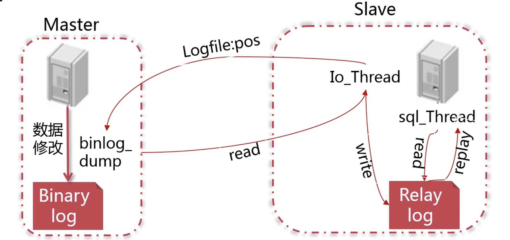

# 一、MySQL高可用

## 1、mysql复制功能

mysql复制功能提供分担读负载，基于主库的二进制日志，异步的。无法保证主库与从库的延迟。

mysql复制解决了什么问题
- 实现在不同服务器上的数据分布，利用二进制日志增量进行；不需要太多的带宽；但是使用基于行的复制在进行大批量的更改时会对带宽带来一定的压力，特别是跨IDC环境进行复制；应该分批进行复制
- 实现数据读取的负载均衡，需要其他组件配合完成
- 增强了数据安全性，利用备库的备份来减少主库负载，并不能用复制来代替备份
- 实现数据库高可用和故障切换；避免mysql的单点故障
- 实现数据库在线升级

## 2、mysql binlog

[BinaryLog](MySQL日志.md#二BinaryLog)

## 3、mysql数据库备份

mysqldump

xtrabackup

## 4、mysql主从复制

### 4.1、MySQL主从复制的实现原理

[主从配置](../../辅助资料/环境配置/Linux环境.md#二MySQL主从配置)

MySQL 的主从复制是一个异步的复制过程，数据库数据从一个 MySQL 数据库（我们称之为 Master）复制到另一个 MySQL 数据库（我们称之为 Slave）。

在 Master 与 Slave 之间实现整个主从复制的过程是由三个线程参与完成的。其中有两个线程（SQL 线程和 IO 线程）在 Slave 端，另外一个线程（IO 线程）在 Master 端；

**主从复制原理：**

MySQL主从复制涉及到三个线程，一个运行在主节点（log dump thread），其余两个(I/O thread, SQL thread)运行在从节点，如下图所示:


- 主节点 binary log dump 线程：当从节点连接主节点时，主节点会创建一个log dump 线程，用于发送bin-log的内容。在读取bin-log中的操作时，此线程会对主节点上的bin-log加锁，当读取完成，直到发送给从节点之前，锁会被释放；
- 从节点I/O线程：当从节点上执行`start slave`命令之后，从节点会创建一个I/O线程用来连接主节点，请求主库中更新的bin-log。I/O线程接收到主节点binlog dump 线程发来的更新之后，保存在本地relay-log中；

备库 B 跟主库 A 之间维持了一个长连接。主库 A 内部有一个线程，专门用于服务备库 B 的这个长连接

**异步复制：默认复制**

- Slave 服务器上执行`start slave`，开启主从复制开关；
- Slave 服务器上的 IO 线程会通过 Master 服务器上授权的有复制权限的用户请求连接 Master 服务器，并请求从指定 binlog 日志文件的指定位置之后发送 binlog 日志内容。（日志文件名和位置就是在配置主从复制任务时执行change master命令时指定的）；
- Master 服务器接收到来自 Slave 服务器的 IO 线程的请求后，Master 服务器上的 IO 线程根据 Slave 服务器的 IO 线程请求的信息，读取指定 binlog 日志文件指定位置之后的 binlog 日志信息，然后返回给 Slave 端的 IO 线程。返回的信息中除了 binlog 日志内容外，还有本次返回日志内容后在 Master 服务器端的新的 binlog 文件名以及在 binlog 中的下一个指定更新位置；
- 当 Slave 服务器的 IO 线程获取来自 Master 服务器上 IO 线程发送的日志内容及日志文件和位置点后，将 binlog 日志内容依次写入到 Slave 端自身的 relay log（即中继日志）文件（mysql-relay-bin.xxxxxx）的最末端，并将新的 binlog 文件名和位置记录到 master-info 文件中，以便下一次读取 Master 端新 binlog 日志时，能告诉 Master 服务器需要从新 binlog 日志的哪个文件哪个位置开始请求新的 binlog 日志内容；
- Slave 服务器端的 SQL 线程会实时检测本地 relay log 中新增加的日志内容，然后及时的把 relay log 文件中的内容解析成在 Master 端曾经执行的 SQL 语句的内容，并在自身 Slave 服务器上按语句的顺序执行应用这些 SQL 语句，应用完毕后清理应用过的日志。
- 经过了上面的过程，就可以确保在 Master 端和 Slave 端执行了同样的 SQL 语句。当复制状态正常的情况下，Master 端和 Slave 端的数据是完全一样的

这种模式存在的问题：节点不会主动push bin log到从节点，这样有可能导致failover的情况下，也许从节点没有即时地将最新的bin log同步到本地

**半同步复制**

可以解决MySQL主库宕机导致的数据丢失情况。

只需要接收到其中一台从节点的返回信息，就会commit；否则需要等待直到超时时间然后切换成异步模式再提交；这样做的目的可以使主从数据库的数据延迟缩小，可以提高数据安全性，确保了事务提交后，binlog至少传输到了一个从节点上，不能保证从节点将此事务更新到db中。性能上会有一定的降低，响应时间会变长；

半同步模式不是mysql内置的，从mysql 5.5开始集成，需要master 和slave 安装插件开启半同步模式

### 4.2、基于GTID复制与基于日志点的复制

#### 4.2.1、基于日志点的复制


#### 4.2.2、基于GTID的复制

GTID：Global Transaction ID，是MySQL5.6引入的功能，可以在集群全局范围标识事务，用于取代过去通过binlog文件偏移量定位复制位置的传统方式。

GTID由source_id加transaction_id构成

**原理：**
- 主节点更新数据时，会在事务前产生GTID，一起记录到binlog日志中。
- 从节点的I/O线程将变更的bin log，写入到本地的relay log中。
- SQL线程从relay log中获取GTID，然后对比本地binlog是否有记录（所以MySQL从节点必须要开启binary log）。
- 如果有记录，说明该GTID的事务已经执行，从节点会忽略。
- 如果没有记录，从节点就会从relay log中执行该GTID的事务，并记录到bin log。
- 在解析过程中会判断是否有主键，如果没有就用二级索引，如果有就用全部扫描

## 5、MMM与MHA架构

## 6、主备延迟

### 6.1、同步延迟

与数据同步有关的时间点主要包括以下三个：
- 主库 A 执行完成一个事务，写入 binlog，我们把这个时刻记为 T1;
- 之后传给备库 B，我们把备库 B 接收完这个 binlog 的时刻记为 T2
- 备库 B 执行完成这个事务，我们把这个时刻记为 T3。

所谓主备延迟，就是同一个事务，在备库执行完成的时间和主库执行完成的时间之间的差值，也就是 `T3-T1`，可以在备库上执行 `show slave status` 命令，它的返回结果里面会显示 `seconds_behind_master`，用于表示当前备库延迟了多少秒

### 6.2、主备延迟来源

主备延迟最直接的表现是，备库消费中转日志（relay log）的速度，比主库生产 binlog 的速度要慢
- 首先，有些部署条件下，备库所在机器的性能要比主库所在的机器性能差；更新过程中也会触发大量的读操作。所以，当备库主机上的多个备库都在争抢资源的时候，就可能会导致主备延迟了；
- 备库的压力大：可能在备库上做一些复杂的运算、查询等，针对这种，可以采取如下解决方式：
	- 一主多从：除了备库外，可以多接几个从库，让这些从库来分担读的压力；
	- 通过 binlog 输出到外部系统，比如 Hadoop 这类系统，让外部系统提供统计类查询的能力；
- 大事务：因为主库上必须等事务执行完成才会写入 binlog，再传给备库。所以，如果一个主库上的语句执行 10 分钟，那这个事务很可能就会导致从库延迟 10 分钟；日常在做一些大数据量的删除的时候，分批删除数据；还有一种大事务就是大表的DDL操作；
- 备库的并行复制能力：备库执行日志的速度持续低于主库生成日志的速度，那这个延迟就有可能成了小时级别。而且对于一个压力持续比较高的主库来说，备库很可能永远都追不上主库的节奏

### 6.3、

主从的延迟问题，很多诡异的读取不到数据的问题都可能会和它有关，如果遇到这类问题不妨先看看主从延迟的数据

一般我们会把从库落后的时间作为一个重点的数据库指标做监控和报警，正常的时间是在毫秒级别，一旦落后的时间达到了秒级别就需要告警了。

# 二、分区表

## 1、分区表

是指根据一定规则，将数据库中的一张表分解成多个更小的，容易管理的部分。从逻辑上看，只有一张表，但是底层却是由多个物理分区组成。

子分区：分区表中对每个分区再次分割，又成为复合分区

## 2、与分表的区别

- 分表：指的是通过一定规则，将一张表分解成多张不同的表
- 表与分区的区别在于：分区从逻辑上来讲只有一张表，而分表则是将一张表分解成多张表

## 3、表分区的优缺点

### 3.1、优点

- 分区表的数据可以分布在不同的物理设备上，从而高效地利用多个硬件设备；
- 和单个磁盘或者文件系统相比，可以存储更多数据；
- 优化查询。在where语句中包含分区条件时，可以只扫描一个或多个分区表来提高查询效率；涉及sum和count语句时，也可以在多个分区上并行处理，最后汇总结果。
- 分区表更容易维护。例如：想批量删除大量数据可以清除整个分区；
- 可以使用分区表来避免某些特殊的瓶颈。例如InnoDB的单个索引的互斥访问，ext3问价你系统的inode锁竞争等；
- 对于分区表，如果查询条件能够避免雷区，即不会有全表扫描查询，或者低效索引查询（这些条件在分库分表上性能也很差）。所有SQL的条件要么有分片键，要么有高效的索引，那么都性能提升是很明显的；

### 3.2、表分区的限制因素

- 一个表最多只能有1024个分区；对于没有使用NDB存储引擎的表来说，分区最大数限制为8192，这个数量包含了子分区数量
- MySQL5.1中，分区表达式必须是整数，或者返回整数的表达式。在MySQL5.5中提供了非整数表达式分区的支持；
- 如果分区字段中有主键或者唯一索引的列，那么多有主键列和唯一索引列都必须包含进来；即：分区字段要么不包含主键或者索引列，要么包含全部主键和索引列.
- 分区表中无法使用外键约束；
- 某些存储引擎不支持分区(MERGE、CSV、FEDERATED)；所有分区都必须使用相同的存储引擎
- MySQL 的分区适用于一个表的所有数据和索引，不能只对表数据分区而不对索引分区，也不能只对索引分区而不对表分区，也不能只对表的一部分数据分区；
- 不支持查询缓存：对于分区表来说，查询缓存是不支持的，涉及分区表的查询会自动关闭查询缓存，且不能开启

## 4、查看分区：判断 MySQL 是否支持表分区

```
mysql> show variables like '%partition%'；
+-------------------+-------+
| Variable_name     | Value |
+-------------------+-------+
| have_partitioning | YES   |
+-------------------+-------+
1 row in set (0.00 sec)
```

## 5、分区表的原理


## 6、MySQL 支持的分区类型

- RANGE分区：按照数据的区间范围分区；
- LIST分区：按照List中的值分区，与 RANGE的区别是，range分区的区间范围值是连续的；
- HASH分区
- KEY分区

说明：在MySQL5.1版本中，RANGE、LIST、HASH 分区要求分区键必须是 int 类型，或者通过表达式返回INT类型；但KEY分区的时候，可以使用其他类型的列（BLOB，TEXT类型除外）作为分区键；

## 7、RANGE分区

- 利用取值范围进行分区，区间要连续并且不能互相重叠.语法如下：
```sql
partition by range(exp)( --exp可以为列名或者表达式，比如to_date(created_date)
	partition p0 values less than(num)
)
-- 例子：
create table emp (
	id       int not null，
	store_id int not null
)
partition by range (store_id) (
	partition p0 values less than (10)，
	partition p1 values less than (20)
)；
```
上面的语句创建了emp表，并根据store_id字段进行分区，小于10的值存在分区p0中，大于等于10，小于20的值存在分区p1中;

注意：每个分区都是按顺序定义的，从最低到最高;

上面的语句，如果将less than(10) 和less than (20)的顺序颠倒过来，那么将报错，如下：

ERROR 1493 (HY000)： VALUES LESS THAN value must be strictly increasing for each partition

- RANGE分区存在问题:
	- range 范围覆盖问题：当插入的记录中对应的分区键的值不在分区定义的范围中的时候，插入语句会失败。上面的例子，如果我插入一条`store_id = 30`的记录会怎么样呢？我们上面分区的时候，最大值是20，如果插入一条超过20的记录，会报错：<br>
		mysql> insert into emp value(30，30)；<br>
		ERROR 1526 (HY000)： Table has no partition for value 30.<br>
		解决方案：
		- ①、预估分区键的值，及时新增分区.
		- ②、设置分区的时候，使用 values less than maxvalue 子句，MAXVALUE表示最大的可能的整数值.
		- ③、尽量选择能够全部覆盖的字段作为分区键，比如一年的十二个月等
	- Range分区中，分区键的值如果是NULL，将被作为一个最小值来处理

## 8、LIST分区

List分区是建立离散的值列表告诉数据库特定的值属于哪个分区，语法：

```sql
partition by list(exp)( --exp为列名或者表达式
	partition p0 values in (3，5)  --值为3和5的在p0分区
)
```
例子：
```sql
create table emp1 (
	id       int not null，
	store_id int not null
)
	partition by list (store_id) (
	partition p0 values in (3， 5)，
	partition p1 values in (2， 6， 7， 9)
	)
```
注意：如果插入的记录对应的分区键的值不在list分区指定的值中，将会插入失败，并且，list不能像range分区那样提供maxvalue.

## 9、Columns分区

MySQL5.5中引入的分区类型，解决了5.5版本之前range分区和list分区只支持整数分区的问题

Columns分区可以细分为 range columns分区和 list columns分区，他们都支持整数、日期时间、字符串三大数据类型；
- 与 RANGE分区 和 LIST分区区别：针对日期字段的分区就不需要再使用函数进行转换了，例如针对date字段进行分区不需要再使用`YEAR()`表达式进行转换；COLUMN分区支持多个字段作为分区键但是不支持表达式作为分区键；

- COLUMNS支持的类型：

	整形支持：tinyint，smallint，mediumint，int，bigint；不支持decimal和float<br>
	时间类型支持：date，datetime<br>
	字符类型支持：char，varchar，binary，varbinary；不支持text，blob<br>

- **9.1、RANGE COLUMNS分区：**

	- 日期字段分区：

	```sql
	create table members(
		id int，
		joined date not NULL
	)
		partition by range columns(joined)(
		partition a values less than('1980-01-01')，
		partition b values less than('1990-01-01')，
		partition c values less than('2000-01-01')，
		partition d values less than('2010-01-01')，
		partition e values less than MAXVALUE
		);
	```

	- 多个字段组合分区：
		注意：多字段的分区键比较是基于数组的比较：
		- ①、它先用插入的数据的第一个字段值和分区的第一个值进行比较，如果插入的第一个值小于分区的第一个值那么就不需要比较第二个值就属于该分区
		- ②、如果第一个值等于分区的第一个值，开始比较第二个值同样如果第二个值小于分区的第二个值那么就属于该分区；
	```sql
	CREATE TABLE rcx (
		a INT，
		b INT
		)
	PARTITION BY RANGE COLUMNS(a，b) (
		PARTITION p0 VALUES LESS THAN (5，10)，
		PARTITION p1 VALUES LESS THAN (10，20)，
		PARTITION p2 VALUES LESS THAN (15，30)，
		PARTITION p3 VALUES LESS THAN (MAXVALUE，MAXVALUE)
	);
	```

	*RANGE COLUMN的多列分区第一列的分区值一定是顺序增长的，不能出现交叉值，第二列的值随便，例如以下分区就会报错：*

	```sql
	PARTITION BY RANGE COLUMNS(a，b) (
			PARTITION p0 VALUES LESS THAN (5，10)，
			PARTITION p1 VALUES LESS THAN (10，20)，
			PARTITION p2 VALUES LESS THAN (8，30)， -- p2 中第一列比p1第一列的要小，所以报错
			PARTITION p3 VALUES LESS THAN (MAXVALUE，MAXVALUE)
	);
	```
- **9.2、LIST COLUMNS分区：**

- 非整型字段分区：
```sql
create table listvar (
	id    int      not null，
	hired datetime not null
)
	partition by list columns (hired)
	(
	partition a values in ('1990-01-01 10：00：00'， '1991-01-01 10：00：00')，
	partition b values in ('1992-01-01 10：00：00')，
	partition c values in ('1993-01-01 10：00：00')，
	partition d values in ('1994-01-01 10：00：00')
	)；
```
LIST COLUMNS分区对分整形字段进行分区就无需使用函数对字段处理成整形，所以对非整形字段进行分区建议选择COLUMNS分区

- 多字段分区：
```sql
create table listvardou (
	id    int      not null，
	hired datetime not null
)
	partition by list columns (id， hired)
	(
		partition a values in ( (1， '1990-01-01 10：00：00')， (1， '1991-01-01 10：00：00') )，
		partition b values in ( (2， '1992-01-01 10：00：00') )，
		partition c values in ( (3， '1993-01-01 10：00：00') )，
		partition d values in ( (4， '1994-01-01 10：00：00') )
	)；
```
## 10、HASH分区

- 主要用来分散热点读，确保数据在预先确定个数的分区中尽可能平均分布.
- MySQL支持两种Hash分区：常规Hash分区和线性Hash分区

	- 常规Hash分区-使用取模算法，语法如下：

		`partition by hash(store_id) partitions 4;`
		
		上面的语句，根据store_id对4取模，决定记录存储位置。比如store_id = 234的记录，MOD(234，4)=2，所以会被存储在第二个分区.

		常规Hash分区的优点和不足-优点：能够使数据尽可能的均匀分布；缺点：不适合分区经常变动的需求。如果需要增加两个分区变成6个分区，大部分数据都要重新计算分区。线性Hash分区可以解决。

	- 线性Hash分区-分区函数是一个线性的2的幂的运算法则，语法如下：

		`partition by LINER hash(store_id) partitions 4;`

		算法介绍：假设要保存记录的分区编号为N，num为一个非负整数，表示分割成的分区的数量，那么N可以通过以下步骤得到：

		- Step 1. 找到一个大于等于num的2的幂，这个值为V，V可以通过下面公式得到：<br>
			V = Power(2，Ceiling(Log(2，num)))<br>
			例如：刚才设置了4个分区，num=4，Log(2，4)=2，Ceiling(2)=2，power(2，2)=4，即V=4
		- Step 2. 设置N=F(column_list)&(V-1)<br>
			例如：刚才V=4，store_id=234对应的N值，N = 234&(4-1) =2<br>
		- Step 3. 当N>=num，设置V=Ceiling(V/2)，N=N&(V-1)<br>
			例如：store_id=234，N=2<4，所以N就取值2，即可.<br>
			假设上面算出来的N=5，那么V=Ceiling(2.5)=3，N=234&(3-1)=1，即在第一个分区.<br>

		线性Hash的优点和不足-优点：在分区维护(增加，删除，合并，拆分分区)时，MySQL能够处理得更加迅速；

		缺点：与常规Hash分区相比，线性Hash各个分区之间的数据分布不太均衡

## 11、KEY分区

类似Hash分区，Hash分区允许使用用户自定义的表达式，但Key分区不允许使用用户自定义的表达式。Hash仅支持整数分区，而Key分区支持除了Blob和text的其他类型的列作为分区键。

partition by key(exp) partitions 4； --exp是零个或多个字段名的列表

key分区的时候，exp可以为空，如果为空，则默认使用主键作为分区键，没有主键的时候，会选择非空惟一键作为分区键；

## 12、分区对于NULL值的处理

MySQ允许分区键值为NULL，分区键可能是一个字段或者一个用户定义的表达式。一般情况下，MySQL在分区的时候会把 NULL 值当作零值或者一个最小值进行处理。

***注意：***
- Range分区中：NULL 值被当作最小值来处理；
- List分区中：NULL 值必须出现在列表中，否则不被接受；
- Hash/Key分区中：NULL 值会被当作零值来处理；

## 13、分区管理

- **13.1、增加分区**
	- RANGE分区和LIST分区：`alter table table_name add partition (partition p0 values ...(exp))`，values后面的内容根据分区的类型不同而不同
	- Hash分区和Key分区：`alter table table_name add partition partitions 8`； -- 指的是新增8个分区

- **13.2、删除分区：**
	- RANGE分区和LIST分区：`alter table table_name drop partition p0`； --p0为要删除的分区名称，删除了分区，同时也将删除该分区中的所有数据。同时，如果删除了分区导致分区不能覆盖所有值，那么插入数据的时候会报错.
	- Hash分区和Key分区：`alter table table_name coalesce partition 2`； --将分区缩减到2个

- **13.3、移除分区：**

	`alter table members remove partitioning;`
	
	使用remove移除分区是仅仅移除分区的定义.并不会删除数据和 drop PARTITION 不一样，后者会连同数据一起删除

## 14、分区查询

- 查询某张表一共有多少个分区：
	```sql
	SELECT
		partition_name                   part,
		partition_expression             expr,
		partition_description            descr,
		FROM_DAYS(partition_description) lessthan_sendtime,
		table_rows
	FROM
		INFORMATION_SCHEMA.partitions
	WHERE
		TABLE_SCHEMA = SCHEMA ()
		AND TABLE_NAME = 'emp';
	```

- 查看执行计划，判断查询数据是否进行了分区过滤
	```
	mysql> explain partitions select * from emp where store_id=5；
	+----+-------------+-------+------------+------+---------------+------+---------+------+------+-------------+
	| id | select_type | table | partitions | type | possible_keys | key  | key_len | ref  | rows | Extra       |
	+----+-------------+-------+------------+------+---------------+------+---------+------+------+-------------+
	|  1 | SIMPLE      | emp   | p1         | ALL  | NULL          | NULL | NULL    | NULL |    2 | Using where |
	+----+-------------+-------+------------+------+---------------+------+---------+------+------+-------------+
	1 row in set
	```
	上面的结果：partitions：p1 表示数据在p1分区进行检索

https://mp.weixin.qq.com/s/K40FKzM5gUJIVQCvX6YtnQ

## 15、注意事项

- 结合业务场景选择分区键，避免跨分区查询
- 对分区表进行过滤的查询最好在WHERE从句中都包括分区键
- 对于具有主键或唯一索引的表，主键或唯一索引必须是分区键的一部分

如果你的业务满足如下的特点，可以大胆尝试使用分区表：
- 可预估生命周期内数据量在十亿量级，而不是百亿甚至千亿的海量数据；
- 不会有高并发的可能，即你的用户是有一定局限性的，而不会成为全民爆款；

# 三、数据库分库分表

- [海量数据存储](../../实际业务/业务系统.md#五海量数据存储与统计)

## 1、数据切分

基本思想是把一个数据库切成多个部分放到不同的数据库上，从而缓解单一数据库的性能问题
- 对应海量数据，如果是因为表多而数据多，适合使用垂直切分，即把关系紧密的表切分放在一个server上；
- 如果表不多，但是每张表的数据非常多，适合水平切分，即把表的数据根据某种规则切分到多个数据库上；

## 2、垂直切分

### 2.1、最大特点

规则简单，实施也更为方便，尤其适合各业务之间的耦合度非常低，相互影响很小，业务逻辑非常清晰的系统；这种系统中可以很容易做到将不同业务模块所使用的表分拆到不同的数据库中；

### 2.2、垂直切分常见有

- 垂直分库：根据业务耦合性，将关联度低的表存储在不同的数据库，做法与大系统拆分为多个小系统类似，按业务分类进行独立划分；比如服务拆分，划分不同的业务域，每个业务域有自己的数据库；
- 垂直分表：是基于数据库中的“列”进行的，某个表字段比较多，可以新建一张扩展表，将不经常用的字段或长度较大的字段拆分到扩展表中；在字段很多的情况下，通过大表拆小表

### 2.3、垂直切分优缺点

- 优点：
	- 解决业务系统层面的耦合，业务清晰
	- 与微服务的治理类似，也能对不同业务的数据进行分级管理、维护、监控、扩展等
	- 高并发场景下，垂直切分一定程度的提升IO、数据库连接数、单机硬件资源的瓶颈
- 缺点：
	- 部分表无法join，只能通过接口聚合方式解决，提升了开发的复杂度
	- 分布式事务处理复杂
	- 依然存在单表数据量过大的问题（需要水平切分）

## 3、水平切分

当一个应用难以再细粒度的垂直切分，或切分后数据量行数巨大，存在单库读写、存储性能瓶颈，这时候就需要进行水平切分了；

### 3.1、特点

- 相对垂直切分来说，稍微复杂点。因为需要将同一个表的不同数据拆分到不同的数据库中，对于应用程序来说，拆分规则本身就较根据表名来拆分更为复杂，后期的数据维护也会更为复杂一些
- 多数系统会将垂直切分和水平切分联合使用：先对系统做垂直切分，再针对每一小搓表的情况选择性地做水平切分，从而将整个数据库切分成一个分布式矩阵；

### 3.2、水平切分

水平切分分为库内分表和分库分表，是根据表内数据内在的逻辑关系，将同一个表按不同的条件分散到多个数据库或多个表中，每个表中只包含一部分数据，从而使得单个表的数据量变小，达到分布式的效果；

库内分表只解决了单一表数据量过大的问题，但没有将表分布到不同机器的库上，因此对于减轻MySQL数据库的压力来说，帮助不是很大，大家还是竞争同一个物理机的CPU、内存、网络IO，最好通过分库分表来解决

### 3.3、水平切分优点

- 不存在单库数据量过大、高并发的性能瓶颈，提升系统稳定性和负载能力
- 应用端改造较小，不需要拆分业务模块

### 3.4、缺点

- 跨分片的事务一致性难以保证
- 跨库的join关联查询性能较差
- 数据多次扩展难度和维护量极大

### 3.5、水平切分典型分片规则

- （1）根据数值范围：按照时间区间或ID区间来切分
	- 优点：
		- 单表大小可控
		- 天然便于水平扩展，后期如果想对整个分片集群扩容时，只需要添加节点即可，无需对其他分片的数据进行迁移
		- 使用分片字段进行范围查找时，连续分片可快速定位分片进行快速查询，有效避免跨分片查询的问题
	- 缺点：热点数据成为性能瓶颈。连续分片可能存在数据热点，例如按时间字段分片，有些分片存储最近时间段内的数据，可能会被频繁的读写，而有些分片存储的历史数据，则很少被查询
- （2）根据数值取模：一般采用hash取模mod的切分方式
	- 优点：
		数据分片相对比较均匀，不容易出现热点和并发访问的瓶颈；
	- 缺点：
		- 后期分片集群扩容时，需要迁移旧的数据（使用一致性hash算法能较好的避免这个问题）
		- 容易面临跨分片查询的复杂问题。比如上例中，如果频繁用到的查询条件中不带cusno时，将会导致无法定位数据库，从而需要同时向4个库发起查询，再在内存中合并数据，取最小集返回给应用，分库反而成为拖累

## 4、切分策略

- 是按先垂直切分再水平切分的步骤进行的.
- 垂直切分的思路就是分析表间的聚合关系，把关系紧密的表放在一起

## 5、数据切分带来的问题

### 5.1、数据库切分后事务问题

分布式事务和通过应用程序与数据库共同控制实现事务
- 分布式事务：
	- 优点：交由数据库管理，简单有效
	- 缺点：性能代价高，特别是shard越来越多时
- 由应用程序和数据库共同控制：
	- 原理：将一个跨多个数据库的分布式事务分拆成多个仅处于单个数据库上面的小事务，并通过应用程序来总控各个小事务；
	- 优点：性能上有优势
	- 缺点：需要应用程序在事务控制上做灵活设计。如果使用了spring的事务管理，改动起来会面临一定的困难

### 5.2、跨节点Join的问题：只要是进行切分，跨节点Join的问题是不可避免的

解决这一问题的普遍做法是分两次查询实现：在第一次查询的结果集中找出关联数据的id，根据这些id发起第二次请求得到关联数据；

另外解决这一问题的方法：
- （1）全局表：也可看做是"数据字典表"，就是系统中所有模块都可能依赖的一些表，为了避免跨库join查询，可以将这类表在每个数据库中都保存一份。这些数据通常很少会进行修改，所以也不担心一致性的问题；
- （2）字段冗余：典型的反范式设计，利用空间换时间，为了性能而避免join查询
- （3）数据组装：在系统层面，分两次查询，第一次查询的结果集中找出关联数据id，然后根据id发起第二次请求得到关联数据。最后将获得到的数据进行字段拼装；
- （4）ER分片：关系型数据库中，如果可以先确定表之间的关联关系，并将那些存在关联关系的表记录存放在同一个分片上，那么就能较好的避免跨分片join问题。在1:1或1:n的情况下，通常按照主表的ID主键切分

### 5.3、跨节点的 count，order by，group by 以及聚合函数问题

因为它们都需要基于全部数据集合进行计算.多数的代理都不会自动处理合并工作；解决方案：与解决跨节点join问题的类似，分别在各个节点上得到结果后在应用程序端进行合并；

分页需要按照指定字段进行排序，当排序字段就是分片字段时，通过分片规则就比较容易定位到指定的分片；当排序字段非分片字段时，就变得比较复杂了。需要先在不同的分片节点中将数据进行排序并返回，然后将不同分片返回的结果集进行汇总和再次排序，最终返回给用户；

在使用Max、Min、Sum、Count之类的函数进行计算的时候，也需要先在每个分片上执行相应的函数，然后将各个分片的结果集进行汇总和再次计算，最终将结果返回。

### 5.4、切分后主键问题

- 常见的主键生成策略：一旦数据库被切分到多个物理结点上，我们将不能再依赖数据库自身的主键生成机制，某个分区数据库自生成的ID无法保证在全局上是唯一的
	- UUID：使用UUID作主键是最简单的方案，但缺点非常明显：由于UUID非常的长，除占用大量存储空间外，最主要的问题是在索引上，在建立索引和基于索引进行查询时都存在性能问题
	- 结合数据库维护一个Sequence表，缺点同样明显：由于所有插入任何都需要访问该表，该表很容易成为系统性能瓶颈，同时它也存在单点问题

[分布式主键ID](https://github.com/chenlanqing/learningNote/blob/master/Java/Java%E6%9E%B6%E6%9E%84/%E5%88%86%E5%B8%83%E5%BC%8F.md#%E4%B8%83%E5%88%86%E5%B8%83%E5%BC%8Fid)
	
### 5.5、数据库迁移、扩容问题

## 6、什么时候考虑数据切分

- 能不切分尽量不要切分：不到万不得已不用轻易使用分库分表这个大招，避免"过度设计"和"过早优化"；
- 数据量过大，正常运维影响业务访问：
	- （1）对数据库备份，如果单表太大，备份时需要大量的磁盘IO和网络IO；
	- （2）对一个很大的表进行DDL修改时，MySQL会锁住全表，这个时间会很长，这段时间业务不能访问此表，影响很大。如果使用pt-online-schema-change，使用过程中会创建触发器和影子表，也需要很长的时间。在此操作过程中，都算为风险时间。将数据表拆分，总量减少，有助于降低这个风险；
	- （3）大表会经常访问与更新，就更有可能出现锁等待。将数据切分，用空间换时间，变相降低访问压力；
- 随着业务发展，需要对某些字段垂直拆分；
- 数据量快速增长
- 安全性和可用性 

## 7、分库分表中间件

为什么要分库分表：
- 大量请求阻塞：在高并发场景下，大量请求都需要操作数据库，导致连接数不够了，请求处于阻塞状态；
- SQL 操作变慢：如果数据库中存在一张上亿数据量的表，一条 SQL 没有命中索引会全表扫描，这个查询耗时会非常久；
- 存储出现问题：业务量剧增，单库数据量越来越大，给存储造成巨大压力；

- cobar：阿里 b2b 团队开发和开源的，属于 proxy 层方案，就是介于应用服务器和数据库服务器之间。应用程序通过 JDBC 驱动访问 cobar 集群，cobar 根据 SQL 和分库规则对 SQL 做分解，然后分发到 MySQL 集群不同的数据库实例上执行。早些年还可以用，但是最近几年都没更新了，基本没啥人用，差不多算是被抛弃的状态吧。而且不支持读写分离、存储过程、跨库 join 和分页等操作；

- [mycat](../数据库中间件.md#一Mycat)：基于 cobar 改造的，属于 proxy 层方案，支持的功能非常完善，而且目前应该是非常火的而且不断流行的数据库中间件。mycat 这种 proxy 层方案的缺点在于需要部署，自己运维一套中间件，运维成本高，但是好处在于对于各个项目是透明的；

- [sharding-jdbc](../数据库中间件.md#二ShardingSphere)：当当开源的，属于 client 层方案，支持分库分表、读写分离、分布式 id 生成、柔性事务（最大努力送达型事务、TCC 事务）

# 四、Mysql监控

- [open falcon](http://open-falcon.org/)

## 1、主要关注指标

- QPS：每秒钟处理完请求的次数
- TPS：每秒钟处理完的事务次数
- 响应时间：一次请求所需要的平均处理时间；
- 并发量：系统能同时处理的请求数；

## 2、压测工具

- mysqlslap
- sysbench：长时间高压力
- Jmeter

## 3、sysbench

### 3.1、安装

```
curl -s https://packagecloud.io/install/repositories/akopytov/sysbench/script.rpm.sh | sudo bash
yum -y install sysbench
```
注意：sysbench不能与mysql8安装在同一个虚拟机

### 3.2、sysbench基本语法

sysbench 

### 3.3、开始测试

准备测试数据

```shell
sysbench /usr/share/sysbench/tests/include/oltp_legacy/oltp.lua --mysql-host=192.168.99.202 --mysql-port=3306 --mysql-user=root --mysql-password=abc123456 --oltp-tables-count=10 --oltp-table-size=100000 prepare
```

执行测试

```shell
sysbench /usr/share/sysbench/tests/include/oltp_legacy/oltp.lua --mysql-host=192.168.99.202 --mysql-port=3306 --mysql-user=root --mysql-password=abc123456 --oltp-test-mode=complex --threads=10 --time=300 --report-interval=10 run >> /home/mysysbench.log
```

# 五、MySQL默认配置

## 1、数据目录

Linux操作系统下默认文件存储：`/var/lib/mysql`
```bash
.
├── auto.cnf
├── binlog.000001
├── binlog.000002
├── binlog.index
├── ca-key.pem
├── ca.pem
├── client-cert.pem
├── client-key.pem
├── #ib_16384_0.dblwr
├── #ib_16384_1.dblwr
├── ib_buffer_pool     # 保存缓冲池中页面的表空间ID和页面ID，用于重启恢复缓冲池 
├── ibdata1
├── ib_logfile0 # redo log 磁盘文件1 
├── ib_logfile1 # redo log 磁盘文件2，默认情况下，重做日志存在磁盘的这两个文件中，循环的方式写入重做日志 
├── ibtmp1 # 默认临时表空间文件，可通过innodb_temp_data_file_path属性指定文件位置 
├── #innodb_temp
│   ├── temp_1.ibt
│   ├── temp_2.ibt
│   └── temp_9.ibt
├── like_db
│   ├── user_info.ibd
│   └── user_like.ibd
├── logi_kafka_manager
│   ├── topic_statistics.ibd
│   ├── topic_throttled_metrics.ibd
│   └── work_order.ibd
├── mysql
│   ├── general_log_207.sdi
│   ├── general_log.CSM
│   ├── general_log.CSV
│   ├── slow_log_208.sdi
│   ├── slow_log.CSM
│   └── slow_log.CSV
├── mysql.ibd
├── mysql.sock
├── mysql.sock.lock
├── mysql_upgrade_info
├── mysqlx.sock
├── mysqlx.sock.lock
├── performance_schema # performance_schema数据库
├── sys  # sys数据库
│   └── sys_config.ibd
├── temp_db
│   └── for_sync.ibd
├── temp_db1
│   └── for_sync.ibd
├── test
│   ├── address.ibd
│   ├── article.ibd
│   ├── book.ibd
│   ├── category.ibd
│   ├── t1.ibd
│   ├── t2.ibd
│   ├── t.ibd
│   └── user.ibd
├── undo_001
└── undo_002
```

# 六、MySQL架构

## 1、基础结构


- server 服务层：
	- 连接层：对来自客户端的连接进行权限验证并将相关的连接信息维护到连接池中，以便于下次连接；
	- 提供NoSQL，SQL的API,SQL解析，SQL语句优化，SQL语句缓存等相关组件
- 存储引擎层：提供了一系列可插拔的存储引擎，我们可以通过存储引擎来进行数据的写入与读取，通过存储引擎，我们可以真正的与硬盘中的数据和日志进行交互，可以根据需求来选择合适的存储引擎进行使用
- 文件系统层：该层包含了具体的日志文件和数据文件以及MySQL相关的程序。

### 1.1、Server 服务层

MySQL Server 服务层（Service Layer）解析 SQL 语句、优化查询以及执行操作的，分别有三个关键组件完成：
- 解析器（Parser）
- 优化器（Optimizer）
- 执行器（Executor）

**（1）解析器（Parser）**：解析器是 SQL 查询执行的第一步，它的职责是将用户发送的 SQL 语句解析为数据库能够理解的内部结构。
- SQL 词法分析：解析器首先对 SQL 语句进行词法分析，将 SQL 语句分割成多个“单词”或“标记”，如表名、列名、关键字等。
- 语法分析：接着，解析器会根据 SQL 语法规则生成对应的解析树（Parse Tree），用来描述 SQL 语句的逻辑结构。这个过程检查 SQL 语句的语法是否正确。
- 语义分析：确认 SQL 语句中涉及的数据库对象是否存在（比如表名、字段名是否有效），并且检查权限。

解析完成后，生成一个中间表示结构，交由下一步进行处理

**（2）优化器（Optimizer）**：优化器负责选择最优的执行计划，使查询能够以最高效的方式运行。
- 逻辑优化：优化器会对 SQL 语句进行逻辑优化，比如 SQL 语句重写、消除冗余操作、合并重复条件、重新排列 WHERE 子句中的条件等。
- 物理优化：在物理优化阶段，优化器会选择最优的访问路径和执行顺序。例如，它会决定使用哪种索引（如果有多个索引可选），是否做全表扫描，如何连接多张表（选择嵌套循环、哈希连接或排序合并连接等）。
- 成本估算：优化器会基于数据库的统计信息（例如表的大小、索引的选择性等）来估算不同执行计划的成本，选择代价最低的执行方案。

经过优化后，优化器会生成一个查询执行计划，并交给执行器处理。

**（3）执行器（Executor）**：执行器的任务是按照优化器生成的执行计划，逐步执行查询，访问数据并返回结果。
- 权限检查：在执行之前，执行器会首先检查用户是否有权限执行相应的操作。如果没有权限，则返回错误信息。
- 执行执行计划：执行器根据生成的执行计划，依次调用存储引擎的接口来执行具体的操作。例如，如果是查询操作，执行器会调用存储引擎来读取相应的数据；如果是插入操作，执行器则会调用存储引擎来插入数据。
- 结果返回：执行器根据查询的结果，将数据以合适的格式返回给客户端。如果涉及多个步骤（如 JOIN 操作），执行器会协调各个步骤的执行，并组合最终的结果集。

三个核心组件之间的交互流程
- 解析器：SQL 语句转换为解析树。
- 优化器：生成最优的执行计划。
- 执行器：根据计划调用存储引擎执行操作并返回结果。


