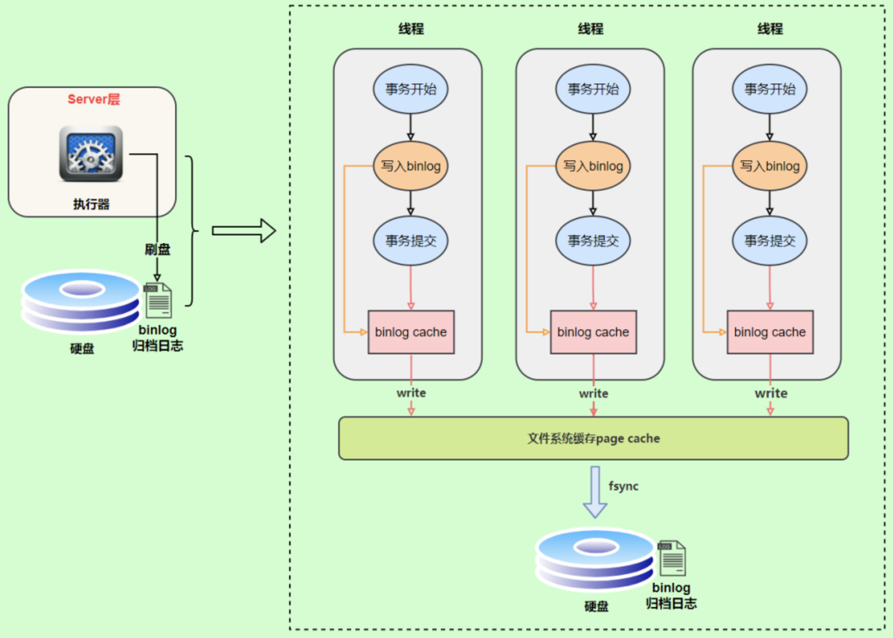

# 一、MySQL日志分类

- [MySQL三大日志(binlog、redo log和undo log)的作用](https://mp.weixin.qq.com/s/KUv-Mx-FRrfQpx09Xv5Itg)

MySQL 日志 主要包括错误日志、查询日志、慢查询日志、事务日志、二进制日志几大类。其中，比较重要的还要属：二进制日志 binlog（归档日志）、事务日志 redo log（重做日志）和 undo log（回滚日志）

## 1、redo log

redo log（重做日志）是InnoDB存储引擎独有的，它让MySQL拥有了崩溃恢复能力；比如 MySQL 实例挂了或宕机了，重启时，InnoDB存储引擎会使用redo log恢复数据，保证数据的持久性与完整性；

redo log 它是物理日志，记录内容是"在某个数据页上做了什么修改"，属于 InnoDB 存储引擎；

### 1.1、概述

- MySQL 中数据是以页为单位，你查询一条记录，会从硬盘把一页的数据加载出来，加载出来的数据叫数据页，会放入到 Buffer Pool 中；
- 后续的查询都是先从 Buffer Pool 中找，没有命中再去硬盘加载，减少硬盘 IO 开销，提升性能；
- 更新表数据的时候，也是如此，发现 Buffer Pool 里存在要更新的数据，就直接在 Buffer Pool 里更新；
- 然后会把“在某个数据页上做了什么修改”记录到重做日志缓存（redo log buffer）里，接着刷盘到 redo log 文件里；理想情况，事务一提交就会进行刷盘操作，但实际上，刷盘的时机是根据策略来进行的；

> 每条 redo 记录由`表空间号 + 数据页号 + 偏移量 + 修改数据长度 + 具体修改的数据`组成;

### 1.2、redo log 刷盘时机

InnoDB 存储引擎为 redo log 的刷盘策略提供了 `innodb_flush_log_at_trx_commit` 参数，它支持三种策略：
- `0` ：设置为 0 的时候，表示每次事务提交时不进行刷盘操作
- `1` ：设置为 1 的时候，表示每次事务提交时都将进行刷盘操作（默认值）
- `2` ：设置为 2 的时候，表示每次事务提交时都只把 redo log buffer 内容写入 page cache；

`innodb_flush_log_at_trx_commit` 参数默认为 1，也就是说当事务提交时会调用 fsync 对 redo log 进行刷盘；另外，InnoDB 存储引擎有一个后台线程，每隔1 秒，就会把 `redo log buffer` 中的内容写到文件系统缓存（page cache），然后调用 fsync 刷盘

也就是说，一个没有提交事务的 redo log 记录，也可能会刷盘？为什么？
- 因为在事务执行过程 redo log 记录是会写入redo log buffer 中，这些 redo log 记录会被后台线程刷盘；
- 除了后台线程每秒1次的轮询操作，还有一种情况，当 redo log buffer 占用的空间即将达到 innodb_log_buffer_size 一半的时候，后台线程会主动刷盘；

**innodb_flush_log_at_trx_commit=0 刷盘流程**

为0时，如果MySQL挂了或宕机可能会有1秒数据的丢失


**innodb_flush_log_at_trx_commit=1 刷盘流程**

为1时，只要事务提交成功，redo log记录就一定在硬盘里，不会有任何数据丢失。如果事务执行期间MySQL挂了或宕机，这部分日志丢了，但是事务并没有提交，所以日志丢了也不会有损失；


**innodb_flush_log_at_trx_commit=2 刷盘流程**

为2时， 只要事务提交成功，redo log buffer中的内容只写入文件系统缓存（page cache）。如果仅仅只是MySQL挂了不会有任何数据丢失，但是宕机可能会有1秒数据的丢失


为了避免发生数据丢失的问题，当前事务数据库系统（并非 MySQL 所独有）普遍都采用了` WAL（Write Ahead Log，预写日志）`策略：即当事务提交时，先写重做日志（redo log），再修改页（先修改缓冲池，再刷新到磁盘）；当由于发生宕机而导致数据丢失时，通过 redo log 来完成数据的恢复。这也是事务 ACID 中 D（Durability 持久性）的要求

### 1.3、日志文件组

硬盘上存储的 redo log 日志文件不只一个，而是以一个日志文件组的形式出现的，每个的redo日志文件大小都是一样的；比如可以配置为一组4个文件，每个文件的大小是 1GB，整个 redo log 日志文件组可以记录4G的内容；

它采用的是环形数组形式，从头开始写，写到末尾又回到头循环写；


在个日志文件组中还有两个重要的属性，分别是 `write pos`、`checkpoint`
- `write pos` 是当前记录的位置，一边写一边后移；
- `checkpoint` 是当前要擦除的位置，也是往后推移；

这两个属性关系：
- 每次刷盘 redo log 记录到日志文件组中，write pos 位置就会后移更新。
- 每次 MySQL 加载日志文件组恢复数据时，会清空加载过的 redo log 记录，并把 checkpoint 后移更新。
- write pos 和 checkpoint 之间的还空着的部分可以用来写入新的 redo log 记录；
- 如果 write pos 追上 checkpoint ，表示日志文件组满了，这时候不能再写入新的 redo log 记录，MySQL 得停下来，清空一些记录，把 checkpoint 推进一下；

### 1.4、总结

问题：只要每次把修改后的数据页直接刷盘不就好了，还有 redo log 什么事？

实际上，数据页大小是16KB，刷盘比较耗时，可能就修改了数据页里的几 Byte 数据，有必要把完整的数据页刷盘吗？

而且数据页刷盘是随机写，因为一个数据页对应的位置可能在硬盘文件的随机位置，所以性能是很差。

如果是写 redo log，一行记录可能就占几十 Byte，只包含表空间号、数据页号、磁盘文件偏移 量、更新值，再加上是顺序写，所以刷盘速度很快。

所以用 redo log 形式记录修改内容，性能会远远超过刷数据页的方式，这也让数据库的并发能力更强；

## 2、binlog

### 2.1、概述

binlog 是逻辑日志，记录内容是语句的原始逻辑，类似于`给 ID=2 这一行的 c 字段加 1`，属于MySQL Server 层；不管用什么存储引擎，只要发生了表数据更新，都会产生 binlog 日志

binlog作用：MySQL数据库的数据备份、主备、主主、主从都离不开binlog，需要依靠binlog来同步数据，保证数据一致性；binlog会记录所有涉及更新数据的逻辑操作，并且是顺序写

## 3、两阶段提交

### 3.1、redo log 和 binlog

- redo log（重做日志）让InnoDB存储引擎拥有了崩溃恢复能力。
- binlog（归档日志）保证了MySQL集群架构的数据一致性；
- binlog 是追加写入的，就是说 binlog 文件写到一定大小后会切换到下一个，并不会覆盖以前的日志；而 redo log 是循环写入的；

虽然它们都属于持久化的保证，但是则重点不同；在执行更新语句过程，会记录`redo log`与`binlog`两块日志，以基本的事务为单位，redo log在事务执行过程中可以不断写入，而binlog只有在提交事务时才写入，所以`redo log`与`binlog`的写入时机不一样；

### 3.2、redo log与binlog两份日志之间的逻辑不一致，会出现什么问题？

我们以update语句为例，假设id=2的记录，字段c值是0，把字段c值更新成1，SQL语句为update T set c=1 where id=2。

假设执行过程中写完`redo log`日志后，binlog日志写期间发生了异常，会出现什么情况呢？

由于binlog没写完就异常，这时候binlog里面没有对应的修改记录。因此，之后用binlog日志恢复数据时，就会少这一次更新，恢复出来的这一行c值是0，而原库因为`redo log`日志恢复，这一行c值是1，最终数据不一致；

为了解决两份日志之间的逻辑一致问题，InnoDB存储引擎使用两阶段提交方案；

### 3.2、两阶段提交

原理很简单，将redo log的写入拆成了两个步骤prepare和commit，这就是两阶段提交；


使用两阶段提交后，写入binlog时发生异常也不会有影响，因为MySQL根据redo log日志恢复数据时，发现redo log还处于prepare阶段，并且没有对应binlog日志，就会回滚该事务；

再看一个问题：redo log设置commit阶段发生异常，那会不会回滚事务呢？
- 并不会回滚事务，它会执行上图框住的逻辑，；虽然redo log是处于prepare阶段，但是能通过事务id找到对应的binlog日志，所以MySQL认为是完整的，就会提交事务恢复数据；

## 4、undo log

如果想要保证事务的原子性，就需要在异常发生时，对已经执行的操作进行回滚，在 MySQL 中，恢复机制是通过 回滚日志（undo log） 实现的，所有事务进行的修改都会先先记录到这个回滚日志中，然后再执行相关的操作。如果执行过程中遇到异常的话，我们直接利用 回滚日志 中的信息将数据回滚到修改之前的样子即可！并且，回滚日志会先于数据持久化到磁盘上。这样就保证了即使遇到数据库突然宕机等情况，当用户再次启动数据库的时候，数据库还能够通过查询回滚日志来回滚将之前未完成的事务。

另外，MVCC 的实现依赖于：`隐藏字段`、`Read View`、`undo log`。在内部实现中，InnoDB 通过数据行的 `DB_TRX_ID` 和 `Read View` 来判断数据的可见性，如不可见，则通过数据行的 `DB_ROLL_PTR` 找到 `undo log` 中的历史版本。每个事务读到的数据版本可能是不一样的，在同一个事务中，用户只能看到该事务创建 `Read View` 之前已经提交的修改和该事务本身做的修改

# 二、BinaryLog

## 1、binlog概述

binlog 用于记录数据库执行的写入性操作(不包括查询)信息，以二进制的形式保存在磁盘中。binlog 是 mysql的逻辑日志，并且由 Server 层进行记录，使用任何存储引擎的 mysql 数据库都会记录 binlog 日志；

binlog 是通过追加的方式进行写入的，可以通过max_binlog_size 参数设置每个 binlog文件的大小，当文件大小达到给定值之后，会生成新的文件来保存日志

主要用途：
- 复制：MySQL 的 Master-Slave 协议，让 Slave 可以通过监听 Binlog 实现数据复制，达到数据一致的目的；
- 数据恢复：通过 mysqlbinlog 工具恢复数据；
- 增量备份

`log_bin`：binlog日志是否打开，一般来说开启binlog日志大概会有1%的性能损耗，在`my.cnf`配置文件中

## 2、mysql二进制日志格式

查看二进制日志格式：`show variables like 'binlog_format';`

修改二进制日志格式：`set binlog_format=''`

- 基于段的格式：`binlog_format=STATEMENT`，mysql5.7之前默认的格式，每一条会修改数据的 SQL 都会记录在 Binlog 中：只需要记录执行语句的细节和上下文环境，避免了记录每一行的变化，在一些修改记录较多的情况下相比 ROW 类型能大大减少 Binlog 日志量，节约IO，提高性能；还可以用于实时的还原；同时主从版本可以不一样，从服务器版本可以比主服务器版本高
       - 优点：日志记录量相对较小，节约磁盘及网络IO
	- 缺点：必须记录上下文信息，保证语句在从服务器上的执行结果与主服务器上执行结果相同，但是非确定性函数还是无法正确复制，有可能mysql主从服务器数据不一致；比如执行一条`update T set update_time=now() where id=1`，同步数据时，会执行记录的SQL语句，但是有个问题，update_time=now()这里会获取当前系统时间，直接执行会导致与原库的数据不一致；
- 基于行的格式：`binlog_format=ROW`，mysql5.7之后的默认格式，可以避免主从服务器数据不一致情况，仅保存记录被修改细节，不记录SQL语句上下文相关信息；能非常清晰的记录下每行数据的修改细节，不需要记录上下文相关信息，因此不会发生某些特定情况下的 procedure、function、及 trigger 的调用触发无法被正确复制的问题，任何情况都可以被复制，且能加快从库重放日志的效率，保证从库数据的一致性；记录的内容不再是简单的SQL语句了，还包含操作的具体数据；但是这种格式，需要更大的容量来记录，比较占用空间，恢复与同步时会更消耗IO资源，影响执行速度；
- 混合模式：`binlog_format=MIXED`，上面两种方式混合使用；MySQL会判断这条SQL语句是否可能引起数据不一致，如果是，就用row格式，否则就用statement格式

## 3、管理binlog

- 查看binlog是否开启：`show variables like 'log_bin';`
- 查看binlog日志格式：`show variables like 'binlog_format';`
- `show master logs`：查看所有binlog的日志列表
- `show master status`：查看最后一个binlog日志的编号名称，及最后一个事件结束的位置
- `flush logs`：刷新binlog，此刻开始产生一个新编号的binlog日志文件
- `reset master`：清空所有的binlog日志

```properties
# 事件查询命令
# IN 'log_name' ：指定要查询的binlog文件名(不指定就是第一个binlog文件)
# FROM pos ：指定从哪个pos起始点开始查起(不指定就是从整个文件首个pos点开始算)
# LIMIT [offset,] ：偏移量(不指定就是0)
# row_count ：查询总条数(不指定就是所有行)
show binlog events [IN 'log_name'] [FROM pos] [LIMIT [offset,] row_count];

# 查看 binlog 内容
show binlog events;
# 查看具体一个binlog文件的内容 （in 后面为binlog的文件名）
show binlog events in 'master.000003';
# 设置binlog文件保存事件，过期删除，单位天
set global expire_log_days=3; 
# 删除当前的binlog文件
reset master; 
# 删除slave的中继日志
reset slave;
# 删除指定日期前的日志索引中binlog日志文件
purge master logs before '2019-03-09 14:00:00';

# 删除指定日志文件
purge master logs to 'master.000003';
```

## 4、查看binlog日志

- `mysqlbinlog --no-defaults -vv --base64-output=DECODE-ROWS <binlog文件>`
- `show binlog events;`：查看第一个 Binlog 日志
- `show binlog events in ‘binlog.000030’;`：查看指定的 Binlog 日志
- `show binlog events in ‘binlog.000030’ from 931;`：从指定的位置开始，查看指定的 Binlog 日志
- `show binlog events in ‘binlog.000030’ from 931 limit 2;`：从指定的位置开始，查看指定的 Binlog 日志，限制查询的条数
- `show binlog events in ‘binlog.000030’ from 931 limit 1, 2;`：从指定的位置开始，带有偏移，查看指定的 Binlog 日志，限制查询的条数

`show binlog events;`查看日志：
```
*************************** 82. row ***************************
   Log_name: mysql-bin.000001
        Pos: 10379
 Event_type: Table_map
  Server_id: 141
End_log_pos: 10446
       Info: table_id: 172 (test.user)
*************************** 83. row ***************************
   Log_name: mysql-bin.000001
        Pos: 10446
 Event_type: Write_rows
  Server_id: 141
End_log_pos: 10506
       Info: table_id: 172 flags: STMT_END_F
```
## 5、binlog写入机制

binlog的写入时机也非常简单，事务执行过程中，先把日志写到binlog cache，事务提交的时候，再把binlog cache写到binlog文件中；因为一个事务的binlog不能被拆开，无论这个事务多大，也要确保一次性写入，所以系统会给每个线程分配一个块内存作为binlog cache。可以通过`binlog_cache_size`参数控制单个线程 binlog cache 大小，如果存储内容超过了这个参数，就要暂存到磁盘（Swap）；

binlog日志刷盘流程如下：


- 上图的 write，是指把日志写入到文件系统的 page cache，并没有把数据持久化到磁盘，所以速度比较快
- 上图的 fsync，才是将数据持久化到磁盘的操作

write和fsync的时机，可以由参数`sync_binlog`控制，默认是0；对支持事务的引擎如InnoDB而言，必须要提交了事务才会记录binlog。binlog 什么时候刷新到磁盘跟参数 `sync_binlog` 相关：
- 如果设置为0，表示每次提交事务都只write，由系统自行判断什么时候执行fsync，即MySQL不控制binlog的刷新，由文件系统去控制它缓存的刷新；虽然性能得到提升，但是机器宕机，page cache里面的 binglog 会丢失；
- 设置为1，表示每次提交事务都会执行fsync，就如同binlog 日志刷盘流程一样；在系统故障时最多丢失一个事务的更新，但是会对性能有所影响
- 设置N(N>1)值，表示每次提交事务都write，但累积N个事务后才fsync；如果机器宕机，会丢失最近N个事务的binlog日志；

如果 `sync_binlog=0` 或 `sync_binlog`大于1，当发生数据库崩溃时，可能有一部分已提交但其binlog未被同步到磁盘的事务会被丢失，恢复程序将无法恢复这部分事务。

在MySQL 5.7.7之前，默认值 `sync_binlog` 是0，MySQL 5.7.7和更高版本使用默认值1，这是最安全的选择。一般情况下会设置为100或者0，牺牲一定的一致性来获取更好的性能；

当遇到以下3种情况时，MySQL会重新生成一个新的日志文件，文件序号递增：
- MySQL服务器停止或重启时
- 使用 `flush logs` 命令；
- 当 binlog 文件大小超过 `max_binlog_size` 变量的值时；

## 6、binlog的Event类型

二进制日志中存储的内容称之为事件，每一个数据库更新操作(Insert、Update、Delete，不包括Select)等都对应一个事件，MySQL Binlog Event 类型有很多种（MySQL 官方定义了 36 种），例如：XID、TABLE_MAP、QUERY 等等。常用的类型：

Event Type|	事件|	重要程度
----------| ----|--------
QUERY_EVENT	|与数据无关的操作， begin、drop table、truncate table 等 |	了解即可
XID_EVENT	| 标记事务提交 |	了解即可
TABLE_MAP_EVENT	| 记录下一个操作所对应的表信息，存储了数据库名和表名|	非常重要
WRITE_ROWS_EVENT|	插入数据，即 insert 操作|	非常重要
UPDATE_ROWS_EVENT|	更新数据，即 update 操作|	非常重要
DELETE_ROWS_EVENT|	删除数据，即 delete 操作|	非常重要

每个 Event 包含 header 和 data 两个部分；header 提供了 Event 的创建时间，哪个服务器等信息，data 部分提供的是针对该 Event 的具体信息，如具体数据的修改。对 Binlog 的解析，即为对 Event 的解析

## 7、mysqlbinlog 命令的使用

```bash
# mysqlbinlog 的执行格式
mysqlbinlog [options] log_file ...

# 查看bin-log二进制文件（shell方式）
mysqlbinlog -v --base64-output=decode-rows /var/lib/mysql/master.000003

# 查看bin-log二进制文件（带查询条件）
mysqlbinlog -v --base64-output=decode-rows /var/lib/mysql/master.000003 \
    --start-datetime="2019-03-01 00:00:00"  \
    --stop-datetime="2019-03-10 00:00:00"   \
    --start-position="5000"    \
    --stop-position="20000"
```

输出日志分析：
```bash
# at 21019
#190308 10:10:09 server id 1  end_log_pos 21094 CRC32 0x7a405abc     Query   thread_id=113   exec_time=0 error_code=0
SET TIMESTAMP=1552011009/*!*/;
BEGIN
/*!*/;
```
上面输出包括信息：
- position: 位于文件中的位置，即第一行的（# at 21019）,说明该事件记录从文件第21019个字节开始
- timestamp: 事件发生的时间戳，即第二行的（#190308 10:10:09）
- server id: 服务器标识（1）
- end_log_pos 表示下一个事件开始的位置（即当前事件的结束位置+1）
- thread_id: 执行该事件的线程id （thread_id=113）
- exec_time: 事件执行的花费时间
- error_code: 错误码，0意味着没有发生错误
- type:事件类型Query

## 8、binlog与redo log区别

|          | redo log                                                     | binlog                                                       |
| -------- | ------------------------------------------------------------ | ------------------------------------------------------------ |
| 文件大小 | redo log 大小是固定的    | binlog可以通过 max_binlog_size 设置每个binlog 文件的大小     |
| 实现方式 | redo log 是通过innoDB引擎层实现的，不是所有引擎都有的        | binlog是Server层实现的，所有引擎都可以使用binlog日志         |
| 记录方式 | redo log 采用循环写的方式记录，当写到结尾时，会回到开头循环写日志 | binlog通过追加的方式，当文件大小大于给到的值后，后续的日志会记录到新的文件上 |
| 适用场景 | redo log适用于崩溃恢复（crash-safe）                         | binlog适用于主从复制、数据恢复                               |

由 binlog 和 redo log 的区别可知：binlog 日志只用于归档，只依靠 binlog 是没有 crash-safe 能力的。

但只有 redo log 也不行，因为 redo log 是 InnoDB特有的，且日志上的记录落盘后会被覆盖掉。因此需要 binlog和 redo log二者同时记录，才能保证当数据库发生宕机重启时，数据不会丢失

# 三、Binlog 解析工具

## 1、MaxWell

- [MaxWell 监听binlog](https://github.com/zendesk/maxwell.git)
- [MaxWell使用](https://juejin.im/post/5c8616fc5188251bde6bd43a)

### 1.1、概述

Maxwell是一个能实时读取MySQL二进制日志binlog，并生成 JSON 格式的消息，作为生产者发送给 Kafka，Kinesis、RabbitMQ、Redis、Google Cloud Pub/Sub、文件或其它平台的应用程序

Maxwell主要提供了下列功能：
- 支持 SELECT * FROM table 的方式进行全量数据初始化
- 支持在主库发生failover后，自动恢复binlog位置(GTID)
- 可以对数据进行分区，解决数据倾斜问题，发送到kafka的数据支持database、table、column等级别的数据分区
- 工作方式是伪装为Slave，接收binlog events，然后根据schemas信息拼装，可以接受ddl、xid、row等各种event

MaxWell与Canal：
- canal 由Java开发，分为服务端和客户端，拥有众多的衍生应用，性能稳定，功能强大；canal 需要自己编写客户端来消费canal解析到的数据。
- maxwell相对于canal的优势是使用简单，它直接将数据变更输出为json字符串，不需要再编写客户端；


docker run -ti --rm zendesk/maxwell bin/maxwell --user='root' --password='123456' --host='10.206.0.6' --producer=stdout

docker run -it --rm zendesk/maxwell bin/maxwell --user='maxwell' --password='123456' --host='10.206.0.6' --producer=kafka --kafka.bootstrap.servers='119.45.13.206:9092' --kafka_topic=maxwell --log_level=debug

## 2、Canal

- [Canal源码](https://github.com/alibaba/canal.git)

### 2.1、基本介绍

 Canal 一个非常常用的使用场景：数据异构，一种更高级别的数据读写分离架构设计方法

- 定位：基于数据库增量日志解析，提供增量数据订阅&消费，目前主要支持了mysql。

- 原理：
    - canal模拟mysql slave的交互协议，伪装自己为mysql slave，向mysql master发送dump协议
    - mysql master收到dump请求，开始推送binary log给slave(也就是canal)
    - canal解析binary log对象(原始为byte流)

优点：
- 实时性好、分布式、ACK机制

缺点：
- 只支持增量同步、不支持全量同步；
- 支持数据源比较少；
- 一个instance只能有一个消费端消费；
- 单点压力大；

## 3、Databus

Databus是一种低延迟变化捕获系统，已成为LinkedIn数据处理管道不可或缺的一部分。Databus解决了可靠捕获，流动和处理主要数据更改的基本要求；Databus提供以下功能：
- 源与消费者之间的隔离
- 保证按顺序和至少一次交付具有高可用性
- 从更改流中的任意时间点开始消耗，包括整个数据的完全引导功能。
- 分区消费
- 源一致性保存

## 4、Debezium

## 5、DTS

数据传输服务（Data Transmission Service，简称DTS）是阿里云提供的一种支持 RDBMS（关系型数据库）、NoSQL、OLAP 等多种数据源之间数据交互的数据流服务

DTS提供了数据迁移、实时数据订阅及数据实时同步等多种数据传输能力，可实现不停服数据迁移、数据异地灾备、异地多活(单元化)、跨境数据同步、实时数据仓库、查询报表分流、缓存更新、异步消息通知等多种业务应用场景，助您构建高安全、可扩展、高可用的数据架构。

就是一个消息队列，会给你推送它包装过的sql对象，可以自己做个服务去解析这些sql对象

# 参考资料


- [MySQL BinaryLog](https://dev.mysql.com/doc/internals/en/binary-log-overview.html)
- [MySQL 的 Binlog 日志处理工具对比](https://mp.weixin.qq.com/s/EJVUY4qCqKFqMudLZ2y09g)