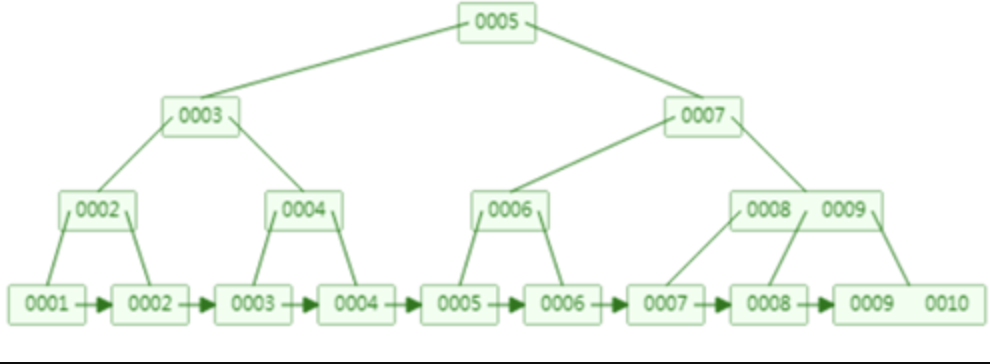
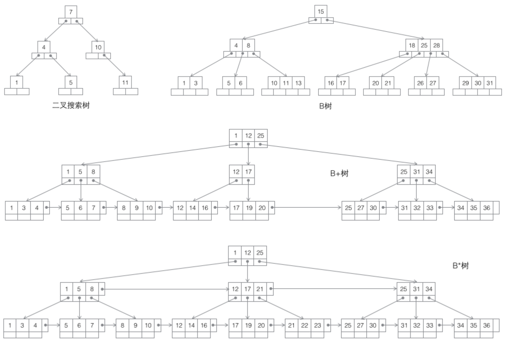
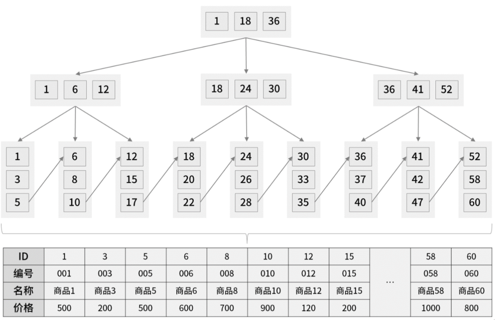

# 一、MySql索引

## 1、索引

帮助MySQL高效获取数据的数据结构，索引是数据结构
- 可以理解为：排好序的快速查找数据结构，主要影响 `where` 子句和 `order by` 子句
- 如何理解索引是数据结构：数据本身之外，数据库还维护着一个满足特定查找算法的数据结构，这些结构以某种方式指向数据，这样可以在这些数据的基础之上实现高级查找算法，这种数据结构就是索引。
- 索引的优点：
	- 减少磁盘（内存）扫描
	- 创建唯一性索引，保证数据表中每一行数据的唯一性；
	- 大大加快数据的检索速度，降低数据库的IO成本，这是创建索引的最主要的原因：随机IO -> 顺序IO
	- 加快数据库表之间的连接，特别是在实现数据的参考完整性方面有意义；
	- 在使用分组和排序字句进行数据检索时，同样可以显著减少系统的查询中分组和排序的时间；
- 索引的缺点：
	- 创建索引和维护索引要耗费时间，这种时间随着数据量的增加而增加；
	- 索引需要占用物理空间，除了数据表占用数据空间之外，每个表还需要占用一定的物理空间；
	- 索引虽然提高了查询速度，同时却降低了更新表的速度，对数据进行增删改的时候，除保存数据外，索引也需要维护，降低数据维护的速度；
	- 索引只是提高效率的一个因素，如果你的mysql有大量数据表，需要花时间建立索引；

## 2、索引分类

- 普通索引(它没有任何限制) ，如单值索引-一个索引只包含一个列；
- 唯一性索引(索引列的值必须唯一，但允许有空值) 
- 主键索引(一种特殊的唯一索引，不允许有空值。一般是在建表的时候同时创建主键索引) 
- 组合索引：最左匹配原则（即最左优先，在检索数据时从组合索引的最左边开始匹配）
- 聚集索引：按照每张表的主键构造一颗B+树，并且叶节点中存放着整张表的行记录数据，因此也让聚集索引的叶节点成为数据页；
- 非聚集索引(辅助索引)(页节点不存放一整行记录)

## 3、索引操作

- `create [unique] index` 索引名称 on 表名(列名，列名) unique 表示唯一索引
- `alter table <tablename> add [unique] index <indexName>(<column name>)`
- `drop index [indexName] on 表名`
- `show index from` 表名

关于索引重建，有表T
```sql
create table T(
	id int primary key, 
	k int not null, 
	name varchar(16),
	index (k)
)engine=InnoDB;
```
如果你要重建索引 k，你的两个 SQL 语句可以这么写，可以达到省空间的目的
```sql
alter table T drop index k;
alter table T add index(k);
```
但是，如果你要重建主键索引，不能按照如下方式处理：
```sql
alter table T drop primary key;
alter table T add primary key(id);
```
因为不论是删除主键还是创建主键，都会将整个表重建，这两个语句，你可以用这个语句代替：`alter table T engine=InnoDB`

## 4、索引的结构

- B-Tree 索引
- Hash索引
- 全文索引
- R-Tree索引

## 5、哪些情况需要创建索引

- 经常出现在关键字where、order by、group by、distinct 后面的字段；
- 不为 NULL 的字段 ：索引字段的数据应该尽量不为 NULL，因为对于数据为 NULL 的字段，数据库较难优化。如果字段频繁被查询，但又避免不了为 NULL，建议使用 0,1,true,false 这样语义较为清晰的短值或短字符作为替代
- 在 union 等集合操作的结果集上建立索引；
- 为经常用作查询选择的字段建立索引；
- 多表连接字段需要创建索引，且数据类型、字符集也要相同；
- 考虑使用索引覆盖，对数据很少被更新的表，如果用户经常只查询其中的几个字段，可以考虑在这几个字段上建立索引，从而将表的扫描改变为索引的扫描
- 主键自动为唯一索引；查询中与其他表关联的字段，外键关系建立索引；

## 6、哪些情况不需要创建索引

- 频繁更新的字段不适合创建索引
- where 条件中用不到的字段不需要创建索引；
- 表记录太少时，不适合创建索引
- 数据重复且分布平均的字段，如果一个字段的值只有 true 和false 且每个值的分布概率大约为50%，对该字段创建索引效率一般没有太大提高

## 7、索引失效

### 7.1、索引失效的情况

- 如果条件中有or，如果两边都字段都有索引，则索引可用，一旦有一边无索引可用就会导致整个SQL语句的全表扫描；但是如果可能使用索引没有全表扫描的性能更好，就会直接全表扫描；
- Like 查询是以 `%`开头，例如`SELECT * FROM mytable WHEREt Name like '%admin'`，会导致全文搜索
- 应尽量避免在 where 子句中使用`!=`或`<>`操作符
- in 和 not in 也要慎用，当使用in或者not in时扫描表的数据量过大时，会全表扫描；
- 如果第一个筛选条件是范围查询，MySQL 不再使用剩下的索引；
- 索引列不要在表达式或者函数中出现，这样会导致索引失效，如：`SELECT ...... WHERE id+1=5`；索引列不要作为函数的参数使用：对索引字段做函数操作，可能会破坏索引值的有序性，因此优化器就决定放弃走树搜索功能；MySQL 无法再使用索引快速定位功能，而只能使用全索引扫描；
- 隐式类型转换：即一个字段是varchar类型，且有索引，但是如果sql是：`select * from t where name=123`，这样索引也会失效；在 MySQL 中，字符串和数字做比较的话，是将字符串转换成数字；比如`select * from tradelog where tradeid=110717;`，对于优化器来说是：`select * from tradelog where CAST(tradid AS signed int) = 110717;`，也就是跟上面规则中索引字段不要出现在函数中；但是如果是`select * from tardelog where id='123'`，id 的类型是 int，如果执行这个语句，还是会走主键索引的；
- 在索引列的字段中不要出现NULL值，NULL值会使索引失效，可以用特殊的字符比如空字符串' '或者0来代替NULL值；
- 有索引还是走全表扫描了：针对查询的数据行占总数据量过多时会转化成全表查询；
- 隐式编码转换：如果两张表的编码不一致，比如表A示uft8，表B示utf8mb4，而utf8mb4是 utf8 的超集，所以会自动将 utf8 转成 utf8mb4：`CONVERT(a.id USING utf8mb4))`，从而触发了：索引列不能是函数的一部分，那么表A就不会走索引；在程序设计语言里面，做自动类型转换的时候，为了避免数据在转换过程中由于截断导致数据错误，也都是“按数据长度增加的方向”进行转换的；CONVERT() 函数，在这里的意思是把输入的字符串转成 utf8mb4 字符集；触发了前面说到的原则：对索引字段做函数操作，优化器会放弃走树搜索功能；
- mysql 估计使用全表扫描要比使用索引快，则不使用索引

### 7.2、解决索引失效问题

**`<>`操作**

`select * from accounts where age <> 18;`可以写成两条SQL：
```
select * from accounts where age > 18;
select * from accounts where age < 18;
```

**不可避免要使用表达式或者函数：**

可以在代码层面上进行优化，比如需要查询 2016 ~ 2018 所有年份 7月份的数据
- 使用函数的写法：`SELECT count(*) FROM tradelog WHERE month(t_modified)=7`；
- 不使用函数：`SELECT count(*) FROM tradelog WHERE  (t_modified >= '2016-7-1' AND t_modified<'2016-8-1') or (t_modified >= '2017-7-1' AND t_modified<'2017-8-1') or  (t_modified >= '2018-7-1' AND t_modified<'2018-8-1');`

### 7.3、索引失效的原理

**单值索引**

单值索引在B+树的结构里，一个节点只存一个键值对



**联合索引结构**

由数据库的a字段和b字段组成一个联合索引


联合索引也是一个B+树，和单值索引不同的是，联合索引的键值对不是1，而是大于1个

**a, b 排序分析**

a顺序：1，1，2，2，3，3

b顺序：1，2，1，4，1，2

可以发现a字段是有序排列，b字段是无序排列（因为B+树只能选一个字段来构建有序的树），并且在a相等的情况下，b字段是有序的；

**最佳左前缀原理**

`select * from testTable where a=1 and b=2`

首先a字段在B+树上是有序的，所以我们可以通过二分查找法来定位到a=1的位置。

其次在a确定的情况下，b是相对有序的，因为有序，所以同样可以通过二分查找法找到b=2的位置

再来看一个列子：`select * from testTable where b=2`

首先b有顺序的前提：在a确定的情况下，现在a不确定，所以不能确定顺序的，在一个无序的B+树上是无法用二分查找来定位到b字段的，因此是无法使用索引的；

**范围查询失效原理**

`select * from testTable where a>1 and b=2`

- 首先a字段在B+树上是有序的，所以可以用二分查找法定位到1，然后将所有大于1的数据取出来，a可以用到索引。
- b有序的前提是a是确定的值，那么现在a的值是取大于1的，可能有10个大于1的a，也可能有一百个a。
- 大于1的a那部分的B+树里，b字段是无序的，所以b不能在无序的B+树里用二分查找来查询，b用不到索引；

## 8、索引原则

### 8.1、索引建立原则

MySQL中，只有 InnoDB 的表是按照主键方式创建的索引组织表，而 MyISAM 还是按堆表方式组织的
- 使用区分度高的列作为索引：区分度的公式是 `count(distinct col)/count(*)`，表示字段不重复的比例，区分度越高，索引树的分叉也就越多，一次性找到的概率也就越高；如果是多列索引，使用区分度最高的列放到索引最前列；
- 表数据太少时，不需要创建索引；
- 尽量使用字段长度小的列作为索引
- 使用数据类型简单的列(int 型，固定长度)
- 尽量选用 NOT NULL 的列，在MySQL中，含有空值的列很难进行查询优化，因为它们使得索引、索引的统计信息以及比较运算更加复杂。你应该用0、一个特殊的值或者一个空串代替空值
- 尽量的扩展索引，不要新建索引。比如表中已经有a的索引，现在要加(a，b)的索引，那么只需要修改原来的索引即可.这样也可避免索引重复
- 选择合适的索引数据类型：
	- 越小的数据类型通常更好：越小的数据类型通常在磁盘、内存和CPU缓存中都需要更少的空间，处理起来更快
	- 简单的数据类型更好：整型数据比起字符，处理开销更小，因为字符串的比较更复杂
- 选择合适的标识符：
	- 整型：通常是作为标识符的最好选择，因为可以更快的处理，而且可以设置为 AUTO_INCREMENT
	- 字符串：尽量避免使用字符串作为标识符，它们消耗更好的空间，处理起来也较慢.而且，通常来说，字符串都是随机的，所以它们在索引中的位置也是随机的，这会导致页面分裂、随机访问磁盘，聚簇索引分裂(对于使用聚簇索引的存储引擎)
- 如果通过调整顺序，可以少维护一个索引，那么这个顺序往往是优先选择的；
- 最左前缀匹配原则，非常重要的原则，mysql会一直向右匹配直到遇到范围查询`(>、<、between、like)`就停止匹配，比如`a = 1 and b = 2 and c > 3 and d = 4` 如果建立`(a,b,c,d)`顺序的索引，`d`是用不到索引的，如果建立`(a,b,d,c)`的索引则都可以用到，`a,b,d`的顺序可以任意调整；
- `=`和`in`可以乱序，比如`a = 1 and b = 2 and c = 3` 建立`(a,b,c)`索引可以任意顺序，mysql的查询优化器会帮你优化成索引可以识别的形式；


### 8.2、索引高效使用原则

- 使用独立的列，即索引列不能是表达式的一部分，比如：`select actore_id from actor where actor_id + 1 = 5;`，这种情下，musql无法自动解析。始终将索引列单独放在比较符号的一侧；
- 使用前缀索引：对于很长的列来说，可以建立字段的部分前缀索引；
- 选择合适的索引列顺序，对于索引列的顺序，可以跑一下查询来确定在表中值的分布情况，并确定哪个列的选择性更高；

## 9、索引的结构以及实现

大部分数据库系统及文件系统都采用 B-Tree 或其变种 B+Tree 作为索引结构

### 9.1、索引的类型

索引是在存储引擎中实现的而不是在服务器层中实现的。所以，每种存储引擎的索引都不一定完全相同，并不是所有的存储引擎都支持所有的索引类型；

#### 9.1.1、B-Tree 索引

利用 B-Tree 索引进行全关键字、关键字范围和关键字前缀查询，保证按索引的最左边前缀来进行查询
- 匹配全值(Match the full value)：对索引中的所有列都指定具体的值。
- 匹配最左前缀(Match a leftmost prefix)：你可以利用索引查找last name为Allen的人，仅仅使用索引中的第1列。mysql会一直向右匹配直到遇到范围查询就停止匹配；MySQL会一直向右匹配直到遇到范围查询（>,<,between,like）等，比如： `a=1 and b =2 and c > 3 and d = 4`，如果建立`(a,b,c,d)`顺序的索引，d是用不到索引的；如果建立`(a,b,d,c)`的索引则是可以使用的，`a,b,d`的顺序可以任意调整，因为mysql的查询优化器会优化成索引可以识别的形式； 
- 匹配列前缀(Match a column prefix)：你可以利用索引查找last name以J开始的人，这仅仅使用索引中的第1列。
- 匹配值的范围查询(Match a range of values)：可以利用索引查找last name在Allen和Barrymore之间的人，仅仅使用索引中第1列。
- 匹配部分精确而其它部分进行范围匹配(Match one part exactly and match a range on another part)：可以利用索引查找last name为Allen，而first name以字母K开始的人。
- 仅对索引进行查询(Index-only queries)：如果查询的列都位于索引中，则不需要读取元组的值。

#### 9.1.2、Hash 索引：建立在哈希表的基础上，它只对使用了索引中的每一列的精确查找有用

在mysql中，只有memory存储引擎支持显式的哈希索引，是Memory表的默认索引类型
- Hash 索引只包含哈希值和行指针，而不存储字段值；
- Hash 索引仅仅能满足`=、IN和<=>`查询，不能使用范围查询。
- Hash 索引无法被用来避免数据的排序操作，因为不是按照索引值顺序存储的。
- Hash 索引不能利用部分索引键查询，Hash索引始终是使用索引列的全部内容来计算哈希值的。
- Hash 索引在任何时候都不能避免表扫描。
- Hash 索引遇到大量Hash值相等的情况后性能并不一定就会比B-Tree索引高，尤其是在Hash发生很多冲突的情况下；

 *等值查询。哈希索引具有绝对优势（前提是：没有大量重复键值，如果大量重复键值时，哈希索引的效率很低，因为存在所谓的哈希碰撞问题。）*

 InnoDB有一个特殊的功能是：自适应哈希索引，当InnoDB注意到某些索引被使用得非常频繁时，会在内存中基于B-Tree索引之上再创建一个Hash索引，提高查找效率；无法直接创建，可以通过参数`innodb_adaptive_hash_index` 查看开关情况；

 不适合做聚簇索引、用于辅助索引；

 使用场景：在mysql中一般不推荐使用，因为其hash索引都是存在内存中，InnoDB有对B+索引的优化，对于频繁查询的词会在内存中建立一个hashtable；对于key/value查询并发要求很高，用key-value内存数据库效果更好；

#### 9.1.3、空间索引(R-树)索引

MyISAM支持空间索引，主要用于GIS中空间数据的存储，但是MySQL的空间索引支持并不好，现在多使用PostgreSQL。

从5.7开始InnoDB支持空间索引；

#### 9.1.4、全文索引(Full-text)索引

- [全文检索（倒排索引、全文索引/全文检索）](https://blog.csdn.net/m0_46405589/article/details/113603721)

文本字段上的普通索引只能加快对出现在字段内容最前面的字符串(也就是字段内容开头的字符)进行检索操作

全文索引弊病：
- 中文字段创建全文索引，切词结果太多，占用大量存储空间；
- 更新字段内容，全文索引不会更新，必须定期手动维护；
- 在数据库集群中维护全文索引难度更大；

### 9.2、B-树(B树)



- 数据库索引为什么使用树结构存储？
	- 树的查询效率高；
	- 二叉查找树的查找速度和比较次数都是最小的，但不得不考虑的问题是：磁盘IO因为数据库索引是存储在磁盘上的，当数据量比较大的时候，索引大小就可能有几个G甚至更多。当利用索引查询的时候，不能把整个索引全部加在到内存中，能做的只有逐一加在每一个磁盘页，这里的磁盘页对应的索引数的节点。
	- 如果使用二叉查找树，磁盘的IO由树的高度决定，为了较少磁盘IO次数，需要把原来"瘦高"的树变成"矮胖"。

- B树是一种多路平衡查找树，它的每一个节点最多包含 k 个孩子，k 称为 B树的阶。k的大小取决于磁盘页的大小。一个m阶的B树具有以下特征：
	- 根节点至少有两个子女
	- 每个中间节点都包含 k-1个元素和k个孩子，其中m/2 <= k <= m；
	- 每个叶子节点都包含 k-1个元素，其中m/2 <= k <= m；
	- 所有叶子结点都位于同一层；
	- 每个节点中的元素从小到大排列，节点当中k-1元素正好是k个孩子包含的元素的值域划分。

- B树的查询：B 树的查询比较次数其实不比二叉搜索树少，尤其是当单一节点中的元素数量很多时。开始相比于磁盘IO的速度，内存中比较耗时几乎可以忽略。所以只要树的高度足够低，IO次数足够少，就可以提交查询速度。只要不超过磁盘页的大小即可；

- B树的插入：B 树自平衡
- B树的删除：
- B树主要应用于文件系统以及部分数据库索引，如非关系型数据库 MongoDB

### 9.3、B+树-基于B-Tree的一种变体

- [详解B+树](https://mp.weixin.qq.com/s/7JkLNt7Fhkx7d_ifv290iA)

InnoDB存储引擎中索引使用的B+树

#### 9.3.1、一个m阶的B+树具有如下几个特征

- 有k个子树的中间节点包含有k个元素(B树中是k-1个元素)每个元素不保存数据，只用来索引，所有数据都保存在叶子节点；
- 所有的叶子结点中包含了全部元素的信息，及指向含这些元素记录的指针，且叶子结点本身依元素的大小自小而大顺序链接；
- 所有的中间节点元素都同时存在于子节点，在子节点元素中是最大(或最小)元素；

在图片中，根节点元素8是子节点2，5，8的最大元素，也是叶子节点6，8的最大元素根节点的最大元素等同于整个B+树的最大元素，无论插入删除多少元素，始终保持最大元素在根节点中；

由于父节点的所有元素都出现在子节点，因此所有叶子节点包含了全量的元素信息，并且每一个叶子节点都带有指向下一个节点的指针，形成了一个有序链表。由于磁盘顺序读取的效率很高（不需要寻道时间，只需很少的旋转时间），因此对于具有局部性的程序来说，预读可以提高I/O效率

#### 9.3.2、卫星数据

B+树还有一个在索引外的特点，却是至关重要的特点，卫星数据的位置

所谓卫星数据：指的是索引元素所指向的数据记录，比如数据库中的某一行。在B-树种无论中间节点还是叶子节点都带有卫星数据。而B+树只有叶子节点有卫星数据，其余中间节点仅仅是索引，没有任何数据关联。
- 在数据库的聚集索引(Clustered Index)中，叶子节点直接包含卫星数据；
- 在非聚集索引(NonClustered Index)中，叶子节点带有指向卫星数据的指针；

#### 9.3.3、B+树的查询好处

- 单行范围：B+树会自顶向下查找节点，最终找到匹配到的叶子节点
	- ①、首先B+树的中间节点没有卫星数据，所以同样的大小的磁盘页可以容纳更多的节点元素。在数据量相同的情况下B+树结构比B-树更"矮胖"，因此查询时IO次数也更少
	- ②、其次，B+树查询必须最终查找到叶子节点，而B-树只要找到匹配元素即可，无论是叶子节点还是中间节点。因此B-树的查找性能不稳定(最好的情况时只查找根节点，最坏情况时查找到叶子节点)B+树的每一次查找都是稳定的
- 范围查询：B-树只能依靠繁琐的中序遍历。而B+树只需要在链表上遍历即可

IO次数取决于b+数的高度h，假设当前数据表的数据为N，每个磁盘块的数据项的数量是m，则有$h=log(m+1)N$，当数据量N一定的情况下，m越大，h越小；而m = 磁盘块的大小 / 数据项的大小，磁盘块的大小也就是一个数据页的大小，是固定的，如果数据项占的空间越小，数据项的数量越多，树的高度越低。这就是为什么每个数据项，即索引字段要尽量的小，比如int占4字节，要比bigint8字节少一半。这也是为什么b+树要求把真实的数据放到叶子节点而不是内层节点，一旦放到内层节点，磁盘块的数据项会大幅度下降，导致树增高。当数据项等于1时将会退化成线性表；

当b+树的数据项是复合的数据结构，比如(name,age,sex)的时候，b+数是按照从左到右的顺序来建立搜索树的，比如当(张三,20,F)这样的数据来检索的时候，b+树会优先比较name来确定下一步的所搜方向，如果name相同再依次比较age和sex，最后得到检索的数据；但当(20,F)这样的没有name的数据来的时候，b+树就不知道下一步该查哪个节点，因为建立搜索树的时候name就是第一个比较因子，必须要先根据name来搜索才能知道下一步去哪里查询。比如当(张三,F)这样的数据来检索时，b+树可以用name来指定搜索方向，但下一个字段age的缺失，所以只能把名字等于张三的数据都找到，然后再匹配性别是F的数据了， 这个是非常重要的性质，即索引的最左匹配特性

#### 9.3.4、B+Tree

**相对于B-树的优势：**
- 单一节点存储更多的元素，使得查询的IO次数更少，磁盘读写代价更低；
- 所有查询都要查找到叶子节点，查询性能稳定，查询效率更加稳定；
- B+Tree 叶子节点采用的是双链表连接，便于范围查询；非终结点并不是最终指向文件内容的结点，而只是叶子结点中关键字的索引
- 因为B树不管叶子节点还是非叶子节点，都会保存数据，这样导致在非叶子节点中能保存的指针数量变少（有些资料也称为扇出），指针少的情况下要保存大量数据，只能增加树的高度，导致IO操作变多，查询性能变低

大部分关系型数据库，比如Mysql都是用B+树作为索引的；

红黑树，是一种特化的平衡二叉树，MySQL 数据量很大的时候，索引的体积也会很大，内存放不下的而从磁盘读取，树的层次太高的话，读取磁盘的次数就多了

#### 9.3.5、B+树与哈希索引

- B+树是一个平衡的多叉树，从根节点到每个叶子节点的高度差值不超过1，而且同层级的节点间有指针相互链接，是有序的；
- 哈希索引就是采用一定的哈希算法，把键值换算成新的哈希值，检索时不需要类似B+树那样从根节点到叶子节点逐级查找，只需一次哈希算法即可,是无序的；
- 哈希虽然能够提供 O(1) 的单数据行操作性能，但是对于范围查询和排序却无法很好地支持，最终导致全表扫描；

#### 9.3.4、B-Tree怎么分裂的，什么时候分裂，为什么是平衡的

每次新建节点时，直接申请一个页的空间，这样就保证一个节点物理上也存储在一个页里，加之计算机存储分配都是按页对齐的，就实现了一个node只需一次I/O

如果随机插入数据，需要挪动部分数据过去，重新调整 B+树，这个过程称为页分裂，这个过程会影响性能

#### 9.3.5、存储引擎在B+Tree中存储方式

**InnoDB存储方式：**InnoDB磁盘管理的最小单位就是“页”，也就是说无论是叶子节点、非叶子节点和行数据，都是存放在页当中
- 主键索引：叶子节点存储主键及数据；
- 非主键索引：叶子节点存储索引和主键；


如上图，浅蓝色的块我们称之为一个磁盘块，可以看到每个磁盘块包含几个数据项（深蓝色所示）和指针（黄色所示），如磁盘块1包含数据项17和35，包含指针P1、P2、P3，P1表示小于17的磁盘块，P2表示在17和35之间的磁盘块，P3表示大于35的磁盘块。真实的数据存在于叶子节点即`3、5、9、10、13、15、28、29、36、60、75、79、90、99`。非叶子节点只不存储真实的数据，只存储指引搜索方向的数据项，如17、35并不真实存在于数据表中。

**b+树的查找过程：**如图所示，如果要查找数据项29，那么首先会把磁盘块1由磁盘加载到内存，此时发生一次IO，在内存中用二分查找确定29在17和35之间，锁定磁盘块1的P2指针，内存时间因为非常短（相比磁盘的IO）可以忽略不计，通过磁盘块1的P2指针的磁盘地址把磁盘块3由磁盘加载到内存，发生第二次IO，29在26和30之间，锁定磁盘块3的P2指针，通过指针加载磁盘块8到内存，发生第三次IO，同时内存中做二分查找找到29，结束查询，总计三次IO。真实的情况是，3层的b+树可以表示上百万的数据，如果上百万的数据查找只需要三次IO，性能提高将是巨大的，如果没有索引，每个数据项都要发生一次IO，那么总共需要百万次的IO，显然成本非常非常高

**MyISAM存储方式**
- 主键/非主键索引的叶子节点都是存储指向数据块的指针，也就是数据和索引是分开来存储的；非聚集索引；在索引检索的时候，首先按照 B+Tree 搜索算法搜索索引，如果指定的 Key 存在，则取出其 data 域的值，然后以 data 域的值为地址读取相应的数据记录。这被称为“非聚簇索引”；

### 9.4、稀疏索引与密集索引（聚簇索引）

- 密集索引文件中的每个搜索码值都对应一个索引值；
- 稀疏索引文件只为索引码的某些值建立索引项；

InnoDB-使用的是密集索引
- 若一个主键被定义，该主键则作为密集索引；
- 若没有主键被定义，该表的第一个唯一非空索引作为密集索引；
- 若不满足以上条件，innodb内部会生成一个隐藏主键（密集索引）
- 非主键索引存储相关键位和其对应的主键值，需要两次查找；

### 9.5、各引擎支持的索引

MyISAM，InnoDB，Memonry 三个常用MySQL引擎类型比较：

|索引 			|MyISAM 索引 |InnoDB 索引 |Memonry 索引|
|---------------|-----------|------------|----------------|
|B-tree索引 	|支持		 |支持		  |支持        |
|Hash索引   	|不支持		 |不支持	  |支持        |
|R-tree索引 	|支持		 |不支持	  |不支持      |
|Full-text索引 	|不支持		 |暂不支持	  |不支持      |

### 9.6、如何查看索引文件

https://github.com/gaopengcarl/innblock

## 10、聚簇索引与二级索引

* [聚簇索引](https://dev.mysql.com/doc/refman/8.0/en/innodb-index-types.html)

- 主键索引的叶子节点存的是整行数据。在 InnoDB 里，主键索引也被称为聚簇索引（clustered index）；
- 非主键索引的叶子节点内容是主键的值。在 InnoDB 里，非主键索引也被称为二级索引（secondary index）；

### 10.1、聚簇索引

mysql中每个表都有一个聚簇索引（clustered index ），除此之外的表上的每个非聚簇索引都是二级索引，又叫辅助索引（secondary indexes）

聚簇索引并不是一种单独的索引类型，而是一种数据存储方式。具体的细节依赖于其实现方式，但InnoDB的聚簇索引实际上在同一个结构中保存了B-Tree索引和数据行

由于聚簇索引是将数据跟索引结构放到一块，因此一个表仅有一个聚簇索引；

聚簇索引默认是主键，如果表中没有定义主键，InnoDB 会选择一个唯一的非空索引代替。如果没有这样的索引，InnoDB 会隐式定义一个主键来作为聚簇索引（这个字段长度为6个字节，类型为长整形）。InnoDB 只聚集在同一个页面中的记录。包含相邻健值的页面可能相距甚远。如果你已经设置了主键为聚簇索引，必须先删除主键，然后添加我们想要的聚簇索引，最后恢复设置主键即可；

聚簇索引性能最好而且具有唯一性，所以非常珍贵，必须慎重设置。一般要根据这个表最常用的SQL查询方式来进行选择，某个字段作为聚簇索引，或组合聚簇索引
- InnoDB使用的是聚簇索引，将主键组织到一棵B+树中，而行数据就储存在叶子节点上，若使用"where id = 14"这样的条件查找主键，则按照B+树的检索算法即可查找到对应的叶节点，之后获得行数据。即主键索引中叶子节点是整行的数据；
- 若对Name列进行条件搜索，则需要两个步骤：第一步在辅助索引B+树中检索Name，到达其叶子节点获取对应的主键。第二步使用主键在主索引B+树种再执行一次B+树检索操作，最终到达叶子节点即可获取整行数据。（重点在于通过其他键需要建立辅助索引）
- MyISM使用的是非聚簇索引，非聚簇索引的两棵B+树看上去没什么不同；

### 10.2、聚簇索引的优势

- 由于行数据和叶子节点存储在一起，同一页中会有多条行数据，访问同一数据页不同行记录时，已经把页加载到了Buffer中，再次访问的时候，会在内存中完成访问，不必访问磁盘。这样主键和行数据是一起被载入内存的，找到叶子节点就可以立刻将行数据返回了，如果按照主键Id来组织数据，获得数据更快
- 辅助索引使用主键作为"指针"而不是使用地址值作为指针的好处是，减少了当出现行移动或者数据页分裂时辅助索引的维护工作，使用主键值当作指针会让辅助索引占用更多的空间，换来的好处是InnoDB在移动行时无须更新辅助索引中的这个"指针"。也就是说行的位置（实现中通过16K的Page来定位）会随着数据库里数据的修改而发生变化（前面的B+树节点分裂以及Page的分裂），使用聚簇索引就可以保证不管这个主键B+树的节点如何变化，辅助索引树都不受影响
- 聚簇索引适合用在排序的场合，非聚簇索引不适合；
- 取出一定范围数据的时候，使用用聚簇索引；
- 二级索引需要两次索引查找，而不是一次才能取到数据，因为存储引擎第一次需要通过二级索引找到索引的叶子节点，从而找到数据的主键，然后在聚簇索引中用主键再次查找索引，再找到数据；主要是二级索引保存的是行指针，指向的是行主键
- 聚集索引一个表只能有一个，而非聚集索引一个表可以存在多个；
- 聚集索引存储记录是物理上连续存在，而非聚集索引是逻辑上的连续，物理存储并不连续；

### 10.3、聚簇索引的劣势

- 维护索引很昂贵，特别是插入新行或者主键被更新导至要分页(page split)的时候；当行的主键值要求必须将这一行插入到某个已满的页中，存储引擎会将该也分裂成两个页来容纳该行，产生页分裂操作，页分裂操作会导致表占用更多的磁盘空间；除了性能外，页分裂操作还影响数据页的利用率。原本放在一个页的数据，现在分到两个页中，整体空间利用率降低大约 50%；如果删除了许多数据使得页比较空闲，还需要进行页合并。页分裂和合并，都会有 IO 代价，并且可能在操作过程中产生死锁
- 插入速度严重依赖于插入顺序；而且更新聚簇索引的代价很高，因为会强制InnoDB将每个被更新的行移动到新的位置；
- 表因为使用UUId（随机ID）作为主键，使数据存储稀疏，这就会出现聚簇索引有可能有比全表扫面更慢；
- 如果主键比较大的话，那辅助索引将会变的更大，因为辅助索引的叶子存储的是主键值；过长的主键值，会导致非叶子节点占用占用更多的物理空间；

### 10.4、为什么要使用自增ID作为主键

聚簇索引的数据的物理存放顺序与索引顺序是一致的，即：只要索引是相邻的，那么对应的数据一定也是相邻地存放在磁盘上的。如果主键不是自增id，那么可以想象，它会干些什么，不断地调整数据的物理地址、分页，当然也有其他一些措施来减少这些操作，但却无法彻底避免。但如果是自增的，那就简单了，它只需要一页一页地写，索引结构相对紧凑，磁盘碎片少，效率也高；

使用自增主键的插入数据模式，每次插入一条新纪录时，都是追加操作，都不涉及到挪动其他记录，也不会触发叶子节点的分裂，页数据页不会发生分裂；

主键长度越小，普通索引的叶子节点就越小，普通索引占用的空间也就越小

### 10.5、B+树索引查询过程

有表结构：
```sql
CREATE TABLE `product`  (
  `id` int(11) NOT NULL,
  `product_no` varchar(20)  DEFAULT NULL,
  `name` varchar(255) DEFAULT NULL,
  `price` decimal(10, 2) DEFAULT NULL,
  PRIMARY KEY (`id`) USING BTREE
) CHARACTER SET = utf8 COLLATE = utf8_general_ci ROW_FORMAT = Dynamic;
```
往该表中新增如下数据：
```sql
-- 主键id从1~60，总共添加60条数据
insert into `product`(1, '001','p_01',500),(2,'002','p_02', 500)...(60,'060','p_60',800);
```
**（1）通过主键索引查询过**
```sql
select * from product where id = 15
```
当我们使用主键索引查询商品 15 的时候，那么按照 B+Tree 索引原理，是如何找到对应数据的呢？我们可以通过数据手动构建一个 B+Tree，它的每个节点包含 3 个子节点（B+Tree 每个节点允许有 M 个子节点，且 M>2），根节点中的数据值 `1、18、36` 分别是子节点`（1, 6, 12）`，`（18, 24, 30）`和`（36, 41, 52）`中的最小值

每一层父节点的数据值都会出现在下层子节点的数据值中，因此在叶子节点中，包括了所有的数据值信息，并且每一个叶子节点都指向下一个叶子节点，形成一个链表。如图所示：



根据上面SQL，那么B+Tree 的查询流程是：会自顶向下逐层进行查找：
- 将 15 与根节点的数据 (1，18，36) 比较，15 在 1 和 18 之间，所以根据 B+Tree的搜索逻辑，找到第二层的数据块 (1，6，12)；
- 在第二层的数据块 (1，6，12) 中进行查找，因为 15 大于 12，所以找到第三层的数据块 (12，15，17)；
- 在叶子节点的数据块 (12，15，17) 中进行查找，然后我们找到了数据值 15；
- 最终根据数据值 15 找到叶子节点中存储的数据。

> 整个过程一共进行了 3 次 I/O 操作，所以 B+Tree 相比于 B 树和二叉树来说，最大的优势在于查询效率

**（2）通过非主键（辅助索引）查询过程**

如果你用商品编码查询商品（即使用辅助索引进行查询），会先检索辅助索引中的 B+Tree 的 商品编码，找到对应的叶子节点，获取主键值，然后再通过主键索引中的 B+Tree 树查询到对应的叶子节点，然后获取整行数据。这个过程叫回表


### 10.5、何时使用聚簇索引与非聚簇索引

动作 | 使用聚簇索引 | 使用非聚簇索引
----|-------------|-----------
列经常被分组排序|是|是
返回某范围内的数据|是|否
一个或极少不同值|否|否
小数目的不同值|是|否
大数目的不同值|否|是
频繁更新的列|否|是
外键列|是|是
主键列|是|是
频繁修改索引列|否|是

- 聚簇索引：索引和数据存储在一块（ 都存储在同一个B*tree 中）
- 非聚簇索引：索引数据和存储数据是分离的
- 二级索引：存储的是记录的主键，而不是数据存储的地址。唯一索引、普通索引、前缀索引等都是二级索引（辅助索引）

所有非聚簇索引即二级索引访问需要两次索引查找，因为在二级索引中保存的行指针。二级索引的叶子节点保存的不是指向行的物理位置的指针，而是行的主键值，这意味着通过二级索引查找行，在存储引擎需要找到二级索引的叶子节点获得对应的主键值，然后根据这个值再去聚簇索引中查找对应的行。即回表；

InnoDB在二级索引上使用共享锁，但访问主键索引需要排它锁，这消除了覆盖索引的可能性

## 11、其他索引

表结构如下
```sql
mysql> create table T(
	id int primary key, 
	k int not null, 
	name varchar(16),
	index (k)
)engine=InnoDB;

-- 初始化数据
insert into T values(100,1, 'aa'),(200,2,'bb'),(300,3,'cc'),(500,5,'ee'),(600,6,'ff'),(700,7,'gg');
```

### 11.1、主键索引和普通索引区别

- 如果语句是`select * from T where ID=500`，即主键查询方式，则只需要搜索到ID这颗B+数索引；
- 如果语句是`select * from T where k = 5`，即普通索引查询方式，则需要先搜索k索引树，然后得到ID的值，再到ID索引树搜索一次。这个过程称为回表；

### 11.2、覆盖索引

执行语句`select ID from T where k between 3 and 5`，此时该SQL只需要查ID值，而ID的值已经在k索引树上了，因此可以提供查询结果，不需要回表。也就是说，在这个查询里面，索引 k 已经覆盖了需要查询的字段的值，称为覆盖索引；

**由于覆盖索引可以减少树的搜索次数，显著提升查询性能，所以使用覆盖索引是一个常用的性能优化手段**

覆盖索引带来的好处：
- 索引条目通常远小于数据行大小，所以如果只需要读取索引，那么Mysql就会极大地减少数据访问量；
- 因为索引是按照顺序存储的（单个页内），所以对于IO密集型的范围查询会比随机从磁盘读取每一行数据的IO要少的多；
- 由于InnoDB的聚簇索引，覆盖索引对InnoDB表特别有用，InnoDB的二级索引在叶子节点中保存了行的主键值，所以如果二级主键能够覆盖查询，则可以避免对主键索引的二次查询（回表）；

覆盖索引需要存储索引列的值，覆盖索引只能是使用B+Tree

### 11.3、索引合并

索引合并：当查询中单张表可以使用多个索引时，同时扫描多个索引并将扫描结果进行合并，其实索引合并策略有时候也是一种优化的结果；

- 对多个索引做相交操作时（通常是多个and条件）：查询SELECT * FROM TB1 WHERE c1="xxx" AND c2=""xxx"时，如果c1和c2列上分别有索引，可以按照c1和c2条件进行查询，再将查询结果取交集（intersect）操作，得到最终结果；
- 对多个索引做联合操作时（通常是多个or条件）：查询SELECT * FROM TB1 WHERE c1="xxx" OR c2=""xxx"时，如果c1和c2列上分别有索引，可以按照c1和c2条件进行查询，再将查询结果合并（union）操作，得到最终结果；
- 对AND和OR组合语句求结果；

索引合并访问方法具有几种算法，这些算法显示在EXPLAIN输出的Extra字段中：
- Using intersect(...)
- Using union(...)
- Using sort_union(...)

索引合并不适用于全文索引。

如果查询语句包含一个带有严重AND/OR嵌套的复杂的WHERE子句而MySQL没有选择最佳计划，那么可以尝试使用以下的标志符转换：
`(x AND y) OR z => (x OR z) AND (y OR z) (x OR y) AND z => (x AND z) OR (y AND z)`

如果SQL存在多个条件，多个单列索引，会使用索引合并，如果出现索引合并，说明索引不够合理，需要检查下表的结构，是不是最优的；也可以通过参数 optimizer_switch 来关闭索引合并功能，也可以使用ingore index提示让优化器忽略掉某些索引；

### 11.4、前缀索引

长字符串字段如何创建索引？可以使用前缀索引，定义好长度，就可以做到既节省空间，又不用增加太多的查询成本，比如：
```sql
-- 创建的索引里，每个记录都是只取前6个字节
alter table SUser add index index2(email(6));
```
- 列类型为char，varchar，binary，varbinary可以创建前缀索引；
- 前缀限制是以字节为单位的，但是在create table、alter table、create index语句中索引指定的前缀长度的值为：非二进制类型的（cahr varchar，text）的字符串数据量、二进制类型的（binary，varbinary，blob）的字节数量。当用多字节字符串集为非二进制字符串列创建前缀索引长度时，需要考虑这一点；
- 是否支持前缀索引和前缀的长度跟存储引擎有关系。例如，innodb引擎表前缀索引支持767字节长度，如果开启`innodb_large_prefix`参数，支持3072字节长度。myisam存储引擎表，前缀长度为1000字节。NDB引擎不支持前缀索引；
- 使用前缀索引就用不上覆盖索引对查询性能的优化了；如果选择使用前缀索引，需要考虑的一个因素；

**如何确定应该使用多长的前缀：**

在数据增长不是很快的表，可以通过以下方式来计算出合适的前缀索引的选择长度值：`SELECT COUNT(DISTINCT index_column)/COUNT(*) FROM table_name;`

在建立索引时，关注的是区分度，区分度越高越好。因为区分度越高，意味着重复的键值越少，可以通过下列语句算出该列上有多少个不同的值：
```sql
select count(distinct email) as L from SUser;
```
然后依次选取不同长度的前缀来看这个值，比如：
```sql
mysql> select 
  count(distinct left(email,4)）as L4,
  count(distinct left(email,5)）as L5,
  count(distinct left(email,6)）as L6,
  count(distinct left(email,7)）as L7,
from SUser;
```
如果碰到类似某个市或者某个县的居民身份信息，可以创建索引的方式是，但是都不支持范围查询
- 倒序存储：存储身份信息的时候把它倒过来存储：
	```sql
	mysql> select field_list from t where id_card = reverse('input_id_card_string');
	```
	由于身份证号后6位没有地址码这样的重复逻辑，最后6位可以提供足够的区分度；
- 使用hash字段：可以再表上再创建一个整数字段，来保存身份证的校验码，同时在这个字段上创建索引
	```sql
	mysql> alter table t add id_card_crc int unsigned, add index(id_card_crc);
	```

**但是使用前缀所以无法做Group By 和Order By，也无法使用前缀索引做覆盖扫描；**

### 11.5、后缀索引

有时候后缀索引也有用途（例如找某个域名的所有电子遇见地址），mysql原生并不支持反向索引，但是可以把字符串反转后存储，并基于此建立前缀索引或者说是使用额外的字段来存储反转的字符串。可以通过触发器来维护这种索引；

### 11.6、重复索引、冗余索引

**重复索引**：是指在相同的列上按照相同的顺序创建的索引，如：
```sql
create table tem(
	id int not null primary key,
	name varchar(255),
	unique(id),
	index(id)
)
```
上述示例中，对id创建了重复索引；

**冗余索引：**如果已经存在索引`index(a,b)`，又创建了 `index(a)`，那么 `index(a)`就是`index(a,b)`的冗余索引；但是要注意如下情况：
```sql
explain select * from salaries where from_date = '1986-06-26' order by emp_no;
```
- `index(from_date)`: type=ref    extra=null，使用了索引
- `index(from_date)` 某种意义上来说就相当于`index(from_date, emp_no)`
- `index(from_date, to_date)`: `type=ref    extra=Using filesort，order by`子句无法使用索引
- `index(from_date, to_date)`某种意义上来说就相当于`index(from_date, to_date, emp_no)`

### 11.7、联合索引的技巧

- 覆盖索引：如果查询条件使用的是普通索引（或是联合索引的最左原则字段），查询结果是联合索引的字段或是主键，不用回表操作，直接返回结果，减少IO磁盘读写读取正行数据
- 最左前缀：联合索引的最左 N 个字段，也可以是字符串索引的最左 M 个字符
- 联合索引：根据创建联合索引的顺序，以最左原则进行where检索，比如（age，name）以age=1 或 age= 1 and name=‘张三’可以使用索引，单以name=‘张三’ 不会使用索引，考虑到存储空间的问题，还请根据业务需求，将查找频繁的数据进行靠左创建索引；如果name 字段是比 age 字段大的 ，那我就建议你创建一个（name,age) 的联合索引和一个 (age) 的单字段索引
- 索引下推：可以在索引遍历过程中，对索引中包含的字段先做判断，直接过滤掉不满足条件的记录，减少回表次数；比如`like 'hello%’and age >10` 检索，MySQL5.6版本之前，会对匹配的数据进行回表查询。5.6版本后，会先过滤掉`age<10`的数据，再进行回表查询，减少回表率，提升检索速度；索引条件下推优化可以减少存储引擎查询基础表的次数，也可以减少MySQL服务器从存储引擎接收数据的次数

### 11.8、普通索引与唯一索引

- 普通索引和唯一索引在读性能上，相差无几，由于普通索引还需要多做一些检索和判断操作，性能稍差，但可忽略，因为大概率这些操作是在内存中的数据页上进行操作的；
- 普通索引和唯一索引在写性能上，也相差无几，由于唯一索引需要做唯一性校验，性能稍差，不过由于不能利用change buffer来优化性能，相比而言普通索引的写性能稍差，普通索引可以借助change buffer来优化性能，写性能更好；
- 如果程序逻辑可以保证字段值的正确性，建议使用普通索引，尤其是写多的场景更是如此，否则对于需要使用唯一索引来保证唯一性的只能用唯一索引了；
- change buffer本质上就是一块内存区域并且在buffer pool中开辟出来的，可动态调控大小，修改数据时如果数据在内存中，则直接修改，如果不在，在保证数据一致性的前提下可以先将对数据的修改缓存在change buffer中，这样就能减少读盘的次数，以提高修改数据的效率啦！由于这样的特性，change buffer只能对普通索引适用，唯一索引/主键索引都不适用，因为她们需要唯一性的判断，需要将数据及时拿到内存中；
	- change buffer针对的操作包括：增加、修改、删除
	- change buffer针对写多及写后延迟读的优化更佳
	- change buffer也会落盘持久化也使用了WAL记日志
	- change buffer中记录的是数据操作的历史记录

将 change buffer 中的操作应用到原数据页，得到最新结果的过程称为 merge。除了访问这个数据页会触发 merge 外，系统有后台线程会定期 merge。在数据库正常关闭（shutdown）的过程中，也会执行 merge 操作。如果change buffer快满了也会触发merge操作

在突然断电的时候，change buffer会丢失，但是数据不会丢失，因为change buffer对表的操作都记录在了redo log，redo log是crash safe的

# 二、数据库优化

- [优化用数据库](https://github.com/datacharmer/test_db)
- [MySQL查询优化](https://tech.meituan.com/2014/06/30/mysql-index.html)

## 1、数据库优化的目的

- 避免页面访问出错：数据库连接超时、慢查询造成页面无法加载、阻塞造成数据无法提交
- 增加数据库稳定性
- 优化用户体验

## 2、影响 mysql 性能的因素

硬件 > 系统设置 > 数据库参数配置 > 数据库表结构 > SQL及索引； 成本往右越低，效果往右越好

- MySQL 查询优化器：MySQL有专门的优化 select 语句的优化器模块，通过计算分析系统中收集到的统计信息，为客户端请求的query提供其认为的最优执行计划.
- MySQL 场景瓶颈：
	- CPU：CPU在饱和一般发生在数据装入内存或从磁盘上读取数据的时候；
	- IO：磁盘I/O瓶颈发生在装入数据远远大于内存的容量
	- 服务器硬件性能瓶颈：top，free，iostat 和 vmstat 查看系统的性能状态

### 2.1、一条SQL语句执行得很慢的原因

- 针对偶尔很慢的情况：
	- 数据库在刷新脏页：当我们要往数据库插入一条数据、或者要更新一条数据的时候，我们知道数据库会在内存中把对应字段的数据更新了，但是更新之后，这些更新的字段并不会马上同步持久化到磁盘中去，而是把这些更新的记录写入到 redo log 日记中去，等到空闲的时候，在通过 redo log 里的日记把最新的数据同步到磁盘中去； redo log 写满了需要同步到磁盘
	- 等待锁：在执行的过程中在等待锁，可以通过 show processlist 来查看当前的状态；执行的时候，遇到锁，如表锁、行锁
- 一直很慢的情况：
	- 没有用到索引；
	- 数据库选择了错误的索引；

## 3、数据库查询优化

- 服务器硬件对性能的优化：
	- CPU：(目前不支持多CPU对同一sql进行处理)
		- 64位的CPU一定要工作在64位的系统上；
		- 对于并发比较高的场景CPU的数量(核数)比频率重要；
		- 对于CPU密集型场景和复杂SQL则频率越高越好；
	- 内存：
		- 选择主板所能使用的最高频率内存；
		- 内存的大小对性能很重要，所以尽可能大；
	- I/O子系统：
		PCIe > SSD > Raid10 >  磁盘 > SAN(网络存储)
- MySQL层面上优化
	- 设计数据库时：数据库表、字段的设计，存储引擎
	- 利用好MySQL自身提供的功能，如索引等
	- 横向扩展：MySQL集群、负载均衡、读写分离
	- SQL语句的优化（收效甚微）
- 应用层面上
	- 切分查询：比如业务上有一个复杂的查询，可能涉及到几张表，那么在应用层面上可以将查询拆分为单表查询；

## 4、慢查询日志

### 4.1、慢查询日志参数

参数 |	作用 |	默认值
-----|------| ------
log_output|	日志输出到哪儿，默认FILE，表示文件；设置成TABLE，则将日志记录到mysql.slow_log中。也可设置多种格式，比如 FILE,TABLE|	FILE
long_query_time	|执行时间超过这么久才记录到慢查询日志，单位秒，可使用小数表示小于秒的时间	|10
log_queries_not_using_indexes	|是否要将未使用索引的SQL记录到慢查询日志中，此配置会无视long_query_time的的配置。生产环境建议关闭；开发环境建议开启。	|OFF
log_throttle_queries_not_using_indexes|	和log_queries_not_using_indexes配合使用，如果log_queries_not_using_indexes打开，则该参数将限制每分钟写入的、未使用索引的SQL数量。	|0
min_examined_row_limit|	扫描行数至少达到这么多才记录到慢查询日志|	0
log_slow_admin_statements	|是否要记录管理语句，默认关闭。管理语句包括ALTER TABLE, ANALYZE TABLE, CHECK TABLE, CREATE INDEX, DROP INDEX, OPTIMIZE TABLE, and REPAIR TABLE。	|OFF
slow_query_log_file	|指定慢查询日志文件路径	|/var路径
log_slow_slave_statements	|该参数在从库上设置，决定是否记录在复制过程中超过long_query_time的SQL。如果binlog格式是row，则该参数无效|	OFF
log_slow_extra|	当log_output=FILE时，是否要记录额外信息（MySQL 8.0.14开始提供），对log_output=TABLE的结果无影响。	|OFF

**使用方式:**
- 修改配置文件my.cnf，在[mysqld]段落中加入如上参数即可
	```
	[mysqld]
	# ...
	log_output = 'FILE,TABLE';
	slow_query_log = ON
	long_query_time = 0.001
	```
	配置完，重启mysql服务器
- 通过全局变量设置：这种方式无需重启即可生效，但一旦重启，配置又会丢失。
	```sql
	set global log_output = 'FILE,TABLE';-- 输出到文件并存储到mysql.slow_log表中
	set global slow_query_log = 'ON';
	set global slow_query_log_file='/home/mysql/sql_log/mysql_slow_log'; -- 慢查询日志存储的硬盘位置
	set global log_queries_not_using_indexes=on; -- 是否将未使用索引的sql记录到慢查询日志中
	set global long_query_time =0.001;-- 将超过多少秒的sql记录到慢查询日志中，需要重新连接数据库服务器，切换session
	```
	设置之后，就会将慢查询日志同时记录到文件以及mysql.slow_log表中

### 4.2、分析慢查询

#### 4.2.2、慢查询表

当log_output = TABLE时，可直接用如下语句分析：`select * from mysql.slow_log`

#### 4.2.2、慢查询日志

- （1）慢查询日志是 MySQL提供的一种日志记录，用来记录在mysql中响应时间超过阀值的语句，具体指运行的时间超过 long_query_time 值的sql则会被记录到慢查询日志中。long_query_time 默认值为 10，意思是指运行时间超过10秒的sql

- （2）如何设置：
	- 默认情况下，MySQL数据库没有开启慢查询日志，需要手动设置该参数。当然，如果不是在调优的情况下，一般不建议开启该参数.因为其对性能会带来一定影响.
	- 查看是否开启：
		```
		show variables like '%slow_query_log%'
		mysql> show variables like 'slow_query_log%'；
		+---------------------+-----------------------------------------------------------------+
		| Variable_name       | Value                                                           |
		+---------------------+-----------------------------------------------------------------+
		| slow_query_log      | OFF                                                             |
		| slow_query_log_file | C：\ProgramData\MySQL\MySQL Server 5.5\Data\BlueFish-PC-slow.log |
		+---------------------+-----------------------------------------------------------------+
		```
		slow_query_log OFF 表示关闭

		slow_query_log_file ==> 表示慢查询日志文件位置

	- 开启慢查询日志：

		```set global slow_query_log=1```，只对当前数据库有效。如果 mysql 重启后会失效，如果需要永久生效，需要修改配置文件，在相应的配置文件中增加或修改如下配置：
		```
		slow_query_log=1
		slow_query_log_file=/var/lib/mysql/mysql-slow.log
		```
		然后重启mysql服务器。

		如果没有指定慢查询日志文件的存放路径，系统默认会给一个缺省路径 host_name-slow.log

	- 什么样的sql会被认为是慢查询sql的：主要有参数 long_query_time 来控制，默认情况下是 10s；查看参数 long_query_time 的设置：
		```
		mysql> show variables like '%long_query_time%'；
		+-----------------+-----------+
		| Variable_name   | Value     |
		+-----------------+-----------+
		| long_query_time | 10.000000 |
		+-----------------+-----------+
		```
		在mysql源码里是判断大于 long_query_time，而非大于等于的；

	- 设置慢sql查询：
		```
		set global long_query_time=3
		```
		一般在一个会话中设置之后查看不出来，需要重新连接或者重新打开一个会话或者使用 global 来查看：
		```
		mysql> set global long_query_time=3；
		mysql> show variables like '%long_query_time%'；
		+-----------------+-----------+
		| Variable_name   | Value     |
		+-----------------+-----------+
		| long_query_time | 10.000000 |
		+-----------------+-----------+
		mysql> show global variables like '%long_query_time%'；
		+-----------------+----------+
		| Variable_name   | Value    |
		+-----------------+----------+
		| long_query_time | 3.000000 |
		+-----------------+----------+
		```
	- 在配置文件中配置上述慢查询日志开关：
		```
		slow_query_log=1
		slow_query_log_file=/var/lib/mysql/mysql-slow.log
		long_query_time=3
		log_output=FILE
		```
- （3）慢查询日志分析工具：mysqldumpslow-mysql提供的日志分析工具
	- 查看帮助信息：`mysqldumpslow --help`
		```sql
		➜ mysqldumpslow --help
		Usage: mysqldumpslow [ OPTS... ] [ LOGS... ]
		
		Parse and summarize the MySQL slow query log. Options are
		
		--verbose    verbose
		--debug      debug
		--help       write this text to standard output
		
		-v           展示更详细的信息
		-d           debug
		-s ORDER     以哪种方式排序，默认at
						al: 平均锁定时间
						ar: 平均返回记录数
						at: 平均查询时间
						c: 访问计数
						l: 锁定时间
						r: 返回记录
						t: 查询时间
		-r           将-s的排序倒序
		-t NUM       top n的意思，展示最前面的几条
		-a           不去将数字展示成N，将字符串展示成'S'
		-n NUM       abstract numbers with at least n digits within names
		-g PATTERN   后边可以写一个正则，只有符合正则的行会展示
		-h HOSTNAME  慢查询日志以 主机名-slow.log的格式命名，-h可指定读取指定主机名的慢查询日志，默认情况下是*，读取所有的慢查询日志
		-i NAME      MySQL Server的实例名称（如果使用了mysql.server startup脚本的话）
		-l           不将锁定时间从总时间中减去
		
		# 得到返回记录集最多的10条SQL
		mysqldumpslow -s r -t 10 /var/lib/mysql/8945073c23e0-slow.log
		
		# 得到按照查询时间排序，并且带有left join的10条SQL
		mysqldumpslow -s t -t 10 -g “left join” /var/lib/mysql/8945073c23e0-slow.log
		```
	- 常用参考：
		- 得到返回记录集最多的10个sql：```mysqldumpslow -s r -t 10 /var/lib/mysql/mysql-slow.log```
		- 得到访问次数最多的10个SQL：```mysqldumpslow -s c -t 10 /var/lib/mysql/mysql-slow.log```
		- 得到按照时间排序的前10条里面含有左连接的查询语句：```mysqldumpslow -s t -t 10 -g "left join" /var/lib/mysql/mysql-slow.log```
		- 建议在使用这些命令时集合 | 或者 more 使用，否则可能出现爆屏现象：```mysqldumpslow -s r -t 10 /var/lib/mysql/mysql-slow.log | more```

- （4）慢查询日志内容
	```
	# Time: 2020-06-06T09:18:09.015669Z
	# User@Host: root[root] @ localhost []  Id:   626
	# Query_time: 0.000231  Lock_time: 0.000103 Rows_sent: 3  Rows_examined: 3
	SET timestamp=1591435089;
	select * from customer_login_log;
	```
	- SQL开始执行的时间戳
		```
		# SET timestamp=1460268587;
		```
	- 执行SQL的主机信息：
		```
		# User@Host： root[root] @ localhost [127.0.0.1]
		```
	- SQL的执行详细信息：
		```
		# Query_time： 0.002000  Lock_time： 0.001000 Rows_sent： 2  Rows_examined： 2
		```
	- SQL的详细内容

### 4.2.3、pt-query-digest

如何发现 SQL 存在问题：
- 查询次数多且每次查询占用时间长的SQL，通常为pt-query-digest分析的前几个查询
- IO大的SQL；注意pt-query-digest分析中的rows examine
- 未命中索引的SQL：注意pt-query-digest分钟中的rows examine和rows send 的对比

## 5、SQL执行计划

使用 explain 查询SQL的执行计划：`explain select * from customer；`
```sql
{EXPLAIN | DESCRIBE | DESC}
    tbl_name [col_name | wild]

{EXPLAIN | DESCRIBE | DESC}
    [explain_type]
    {explainable_stmt | FOR CONNECTION connection_id}

{EXPLAIN | DESCRIBE | DESC} ANALYZE select_statement
explain_type: {
    FORMAT = format_name
}
format_name: {
    TRADITIONAL
  | JSON
  | TREE
}
explainable_stmt: {
    SELECT statement
  | TABLE statement
  | DELETE statement
  | INSERT statement
  | REPLACE statement
  | UPDATE statement
}
```

id -> 表的读取顺序

select_type -> 数据读取操作的操作类型
```
+----+-------------+----------------------------+------------+------+---------------+------+---------+------+-------+----------+-------------+
| id | select_type | table                      | partitions | type | possible_keys | key  | key_len | ref  | rows  | filtered | Extra       |
+----+-------------+----------------------------+------------+------+---------------+------+---------+------+-------+----------+-------------+
|  1 | SIMPLE      | log					    | NULL       | ALL  | NULL          | NULL | NULL    | NULL | 10000 |    10.00 | Using where |
+----+-------------+----------------------------+------------+------+---------------+------+---------+------+-------+----------+-------------+

```

查看优化后的SQL：`explain extended sql`语句，然后`show warnings`查看。`explain extended`会输出sql的执行计划，查询记录的方式(全表扫描、全索引扫描、索引范围扫描等)、是否用上索引；`show warnings`会看到优化器重写后的sql

### 5.1、id：select的查询序列号

包含一组数字，表示在查询中执行 select 子句或者操作表的顺序
- id相同，执行顺序由上而下
	```sql
	mysql> explain select film.* from film left join film_actor fa on film.film_id = fa.film_id
		left join actor on fa.actor_id=actor.actor_id where first_name = 'sandra';
	+----+-------------+-------+--------+------------------------+---------+---------+-----------------------+------+--------------------------+
	| id | select_type | table | type   | possible_keys          | key     | key_len | ref                   | rows | Extra                    |
	+----+-------------+-------–+--------+------------------------+---------+---------+-----------------------+------+--------------------------+
	|  1 | SIMPLE      | actor | ALL    | PRIMARY                | NULL    | NULL    | NULL                  |  200 | Using where              |
	|  1 | SIMPLE      | fa    | ref    | PRIMARY，idx_fk_film_id | PRIMARY | 2       | sakila.actor.actor_id |   13 | Using where； Using index |
	|  1 | SIMPLE      | film  | eq_ref | PRIMARY                | PRIMARY | 2       | sakila.fa.film_id     |    1 |                          |
	+----+-------------+-------+--------+------------------------+---------+---------+-----------------------+------+--------------------------+
	```

- id不同，如果是子查询，id的序号会递增，id值越大优先级越高，越先被执行
	```sql
	mysql> explain select title，release_year，length from film where film_id in(
				select film_id from film_actor WHERE actor_id in (
					select actor_id from actor where first_name='sandra'
				)
			);
	+----+--------------------+------------+-----------------+----------------+----------------+---------+------+------+--------------------------+
	| id | select_type        | table      | type            | possible_keys  | key            | key_len | ref  | rows | Extra                    |
	+----+--------------------+------------+-----------------+----------------+----------------+---------+------+------+--------------------------+
	|  1 | PRIMARY            | film       | ALL             | NULL           | NULL           | NULL    | NULL | 1128 | Using where              |
	|  2 | DEPENDENT SUBQUERY | film_actor | index_subquery  | idx_fk_film_id | idx_fk_film_id | 2       | func |    2 | Using index； Using where |
	|  3 | DEPENDENT SUBQUERY | actor      | unique_subquery | PRIMARY        | PRIMARY        | 2       | func |    1 | Using where              |
	+----+--------------------+------------+-----------------+----------------+----------------+---------+------+------+--------------------------+
	```

- id相同与不同，同时存在，DERIVED-衍生，如下中 table 为 `<derived2>`表示是根据id为2衍生的表格
	```sql
	mysql> explain select title，	release_year，	length from film left join (
			select film_id from film_actor where actor_id in (
					select actor_id from actor where first_name = 'sandra'
				)
			)s on film.film_id = s.film_id；
	+----+--------------------+------------+-----------------+---------------+----------------+---------+------+------+--------------------------+
	| id | select_type        | table      | type            | possible_keys | key            | key_len | ref  | rows | Extra                    |
	+----+--------------------+------------+-----------------+---------------+----------------+---------+------+------+--------------------------+
	|  1 | PRIMARY            | film       | ALL             | NULL          | NULL           | NULL    | NULL | 1128 |                          |
	|  1 | PRIMARY            | <derived2> | ALL             | NULL          | NULL           | NULL    | NULL |   56 |                          |
	|  2 | DERIVED            | film_actor | index           | NULL          | idx_fk_film_id | 2       | NULL | 5143 | Using where； Using index |
	|  3 | DEPENDENT SUBQUERY | actor      | unique_subquery | PRIMARY       | PRIMARY        | 2       | func |    1 | Using where              |
	+----+--------------------+------------+-----------------+---------------+----------------+---------+------+------+--------------------------+
	```

### 5.2、select_type：查询类型

主要用于区别普通查询，联合查询，子查询等复杂查询，主要有以下值
- SIMPLE：简单的select查询，查询中不包含子查询或者union
- PRIMARY：查询中若包含任何复杂的子查询，最外层的查询则被标记为 primary
- SUBQUERY：在 select 或者 where 列表中包含了子查询，子查询中的第一个 SELECT
- DERIVED：在 from 列表中包含的子查询被标记为 DERIVED，MySQL 会递归执行这些子查询，把结果放在临时表中
- UNION：若第二个 select 出现在 union 之后，则被标记为union；若 union 包含在 from 子句的子查询中， 外层 select 将被标记为 DERIVED
- UNION RESULT：从 union 中获取结果的 select
- DEPENDENT UNION：-UNION中的第二个或后面的查询，依赖了外面的查询
- DEPENDENT SUBQUERY：子查询中的第一个 SELECT，依赖了外面的查询
- DEPENDENT DERIVED：派生表，依赖了其他的表
- MATERIALIZED：物化子查询
- UNCACHEABLE SUBQUERY：子查询，结果无法缓存，必须针对外部查询的每一行重新评估
- UNCACHEABLE UNION：UNION属于UNCACHEABLE SUBQUERY的第二个或后面的查询

### 5.3、type：显示查询使用了何种类型

主要有：all、index、range、ref、eq_ref、const、system，从最好到最差依次为：`system > const > eq_ref > ref > range > index > all`
- `system`：表只有一行记录(等于系统表)，这时const类型的特例，平时不会出现，基本上日常优化可以忽略；
- `const`：表示通过索引一次就找到了，const 用于比较 primary key 和 unique 索引，因为只匹配一行数据，所以很快。如将主键置于 where 列表中，MySQL能将该查询转换为一个常量；
- `eq_ref`：唯一性索引扫描，对于每个索引键，表中只有一条记录，常见于主键或唯一性扫描。当连接使用的是完整的索引并且是 PRIMARY KEY 或 UNIQUE NOT NULL INDEX 时使用它
- `ref`：非唯一性索引扫描，返回匹配某个单独值的所有行。本质上也是一种索引访问，返回的是某个单独值匹配的所有行，但是其可能会找到多个符合条件的行。当连接使用的是前缀索引或连接条件不是 PRIMARY KEY 或 UNIQUE INDEX 时则使用它；
- `fulltext`：全文索引；
- `ref_or_null`：该类型类似于ref，但是MySQL会额外搜索哪些行包含了NULL。这种类型常见于解析子查询：`SELECT * FROM ref_table WHERE key_column=expr OR key_column IS NULL;`
- `index_merge`：使用了索引合并优化方法，表示一个查询里面用到了多个索引；
- `unique_subquery`：该类型和eq_ref类似，但是使用了IN查询，且子查询是主键或者唯一索引。例如：`value IN (SELECT primary_key FROM single_table WHERE some_expr)`；
- `index_subquery`：和`unique_subquery`类似，只是子查询使用的是非唯一索引：`value IN (SELECT key_column FROM single_table WHERE some_expr)`
- `range`：只检索给定范围的行，使用一个索引来选择行。key列显示使用了哪个索引。一般是在 where 语句中使用了 `between、<、>、in` 等的查询.这种范围扫描索引比全表扫描要好，因为其只需要开始于索引的某一点，而结束于另一点，不需要扫描全部索引。
- `index`：Full index scan， index 和 all 区别为 index 类型只遍历索引树，这通常比all快.因为索引文件通常比数据文件小.(即两者虽然都是读全表，但是index 是从索引中读取，而all是从硬盘读取)，有两种场景会触发：
	- 如果索引是查询的覆盖索引，并且索引查询的数据就可以满足查询中所需的所有数据，则只扫描索引树。此时，explain的Extra 列的结果是Using index。index通常比ALL快，因为索引的大小通常小于表数据。
	- 按索引的顺序来查找数据行，执行了全表扫描。此时，explain的Extra列的结果不会出现Uses index。
- `all`：遍历全表以匹配到相应的行

**一般来说，type在查询中能保证到range级别，最好能达到 ref**

### 5.4、possible_keys、key、key_len

- possible_keys：显示可能应用在这张表上的索引，一个或者多个。查询涉及到的字段上若存在索引，则将该索引列出，但不一定被查询实际使用。
- key：实际使用的索引。如果为 NULL，则没有使用索引；查询中如果使用了覆盖索引，则该索引和查询的 select 字段重叠；message 表中字段 conversation_id 有加上索引
	```sql
	mysql> EXPLAIN select * FROM message；
	+----+-------------+---------+------+---------------+------+---------+------+------+-------+
	| id | select_type | table   | type | possible_keys | key  | key_len | ref  | rows | Extra |
	+----+-------------+---------+------+---------------+------+---------+------+------+-------+
	|  1 | SIMPLE      | message | ALL  | NULL          | NULL | NULL    | NULL |    1 |       |
	+----+-------------+---------+------+---------------+------+---------+------+------+-------+
	1 row in set
	
	mysql> EXPLAIN select conversation_id FROM message；
	+----+-------------+---------+-------+---------------+--------------------+---------+------+------+-------------+
	| id | select_type | table   | type  | possible_keys | key                | key_len | ref  | rows | Extra       |
	+----+-------------+---------+-------+---------------+--------------------+---------+------+------+-------------+
	|  1 | SIMPLE      | message | index | NULL          | conversation_index | 137     | NULL |    1 | Using index |
	+----+-------------+---------+-------+---------------+--------------------+---------+------+------+-------------+
	1 row in set
	```
- key_len：表示索引中使用的字节数，可通过查询该列计算查询中使用的索引长度。在不损失精度的情况下，长度越短越好，key_len显示的值为该索引最大的可能长度，并非实际使用的长度。即 key_len 是根据表定义计算而得，不是通过表内检索出的。key_len 的计算规则和三个因素有关：数据类型、字符编码、是否为 NULL，如果是 null 的话需要判断是否为 null 的标识长度，所以索引字段最好不要为 null，因为 null 会使索引，索引统计和值更加复杂，并且需要额外一个字节的存储空间；key_len计算规则参考[key_len计算](https://www.cnblogs.com/gomysql/p/4004244.html)

	key_len的长度计算公式：
	```
	varchr(10)变长字段且允许NULL    =  10 * ( character set：utf8=3,gbk=2,latin1=1)+1(NULL)+2(变长字段)
	varchr(10)变长字段且不允许NULL =  10 *( character set：utf8=3,gbk=2,latin1=1)+2(变长字段)
	
	char(10)固定字段且允许NULL        =  10 * ( character set：utf8=3,gbk=2,latin1=1)+1(NULL)
	char(10)固定字段且不允许NULL        =  10 * ( character set：utf8=3,gbk=2,latin1=1)	
	```

### 5.5、ref：显示索引的哪一列被使用了

如果可能的话是一个常数。哪些列或常量被用于查找索引列上的值。如果ref是一个函数，则使用的值是函数的结果
```sql
mysql> EXPLAIN SELECT n.*  FROM news n， `user` u WHERE n.user_id=u.id AND n.title=''；
+----+-------------+-------+--------+---------------+---------+---------+-------------------+------+--------------------------+
| id | select_type | table | type   | possible_keys | key     | key_len | ref               | rows | Extra                    |
+----+-------------+-------+--------+---------------+---------+---------+-------------------+------+--------------------------+
|  1 | SIMPLE      | n     | ALL    | NULL          | NULL    | NULL    | NULL              |    2 | Using where              |
|  1 | SIMPLE      | u     | eq_ref | PRIMARY       | PRIMARY | 4       | toutiao.n.user_id |    1 | Using where； Using index |
+----+-------------+-------+--------+---------------+---------+---------+-------------------+------+--------------------------+
toutiao.n.user_id
```
toutiao：表示数据库名称， n：表示对应的表格， user_id：n表对应的字段

### 5.6、rows：根据表统计信息及索引选用的情况

大致估算出找到所需记录所需要读取的行数，即有多少条记录被优化器所查询；数值越小越好

这个指标是核心指标，绝大部分rows小的语句执行一定很快。所以优化语句基本上都是在优化rows。


### 5.7、filtered：表示符合查询条件的数据百分比

最大100。用rows × filtered可获得和下一张表连接的行数。例如rows = 1000，filtered = 50%，则和下一张表连接的行数是500。

**注意：**
- 在MySQL 5.7之前，想要显示此字段需使用explain extended命令；
- MySQL.5.7及更高版本，explain默认就会展示filtered

### 5.8、Extra：包含不适合在其他列显示但非常重要的额外信息

- using filesort：说明 mysql中会对数据使用一个外部的索引排序，而不是按照表内的索引顺序进行读取。MySQL中无法利用索引完成的排序称为"文件排序"
	```sql
	mysql> EXPLAIN SELECT * FROM message ORDER BY created_date；
	+----+-------------+---------+------+---------------+------+---------+------+------+----------------+
	| id | select_type | table   | type | possible_keys | key  | key_len | ref  | rows | Extra          |
	+----+-------------+---------+------+---------------+------+---------+------+------+----------------+
	|  1 | SIMPLE      | message | ALL  | NULL          | NULL | NULL    | NULL |    1 | Using filesort |
	+----+-------------+---------+------+---------------+------+---------+------+------+----------------+
	```
- using temporary：使用了临时表保存中间结果，MySQL在对查询结果排序时使用了临时表。常见于排序 order by 和分组查询 group by 中
	```sql
	mysql> EXPLAIN SELECT * FROM message GROUP BY created_date；
	+----+-------------+---------+------+---------------+------+---------+------+------+---------------------------------+
	| id | select_type | table   | type | possible_keys | key  | key_len | ref  | rows | Extra                           |
	+----+-------------+---------+------+---------------+------+---------+------+------+---------------------------------+
	|  1 | SIMPLE      | message | ALL  | NULL          | NULL | NULL    | NULL |    1 | Using temporary； Using filesort |
	+----+-------------+---------+------+---------------+------+---------+------+------+---------------------------------+
	```
- using index：表示相应的查询操作中使用了覆盖索引，避免访问表的数据行。如果同时出现 using where，说明索引是用来执行索引键值的查找；如果没有同时出现 using where，说明索引是用来读取数据而非执行查找动作；
	- 覆盖索引：select 的数据列只用从索引中就能够取得，不必读取数据行，MySQL 可以利用索引返回 select 列表中的字段，而不必根据索引再次读取数据文件，换句话说查询列要被所建的索引覆盖。如果使用覆盖索引，要注意 select 列表只读取所需要的列，不要使用 select *，因为如果将所有字段一起做成索引会导致索引文件过大，查询性能下降。

- using where：使用 where 子句

- using join buffer：使用了连接缓存
	```sql
	mysql> explain select * from category inner join book on category.card=book.card inner join phone on category.card=phone.card；
	+----+-------------+----------+------+---------------+------+---------+------+------+--------------------------------+
	| id | select_type | table    | type | possible_keys | key  | key_len | ref  | rows | Extra                          |
	+----+-------------+----------+------+---------------+------+---------+------+------+--------------------------------+
	|  1 | SIMPLE      | category | ALL  | NULL          | NULL | NULL    | NULL |   20 |                                |
	|  1 | SIMPLE      | book     | ALL  | NULL          | NULL | NULL    | NULL |   20 | Using where； Using join buffer |
	|  1 | SIMPLE      | phone    | ALL  | NULL          | NULL | NULL    | NULL |   20 | Using where； Using join buffer |
	+----+-------------+----------+------+---------------+------+---------+------+------+--------------------------------+
	```
- impossible where：where子句的值总是false，不能用来获取任何数据
- select table optimized away：在没有 group by 子句的情况下，基于索引优化 mix/max 操作或者对于 MyISAM 存储引擎优化 count(*)操作，不必等到执行阶段在进行计算，查询执行计划生成的阶段即可完成优化
- distinct：优化 distinct 操作，在找第一匹配的元祖后即停止找同样值的操作。

Extra的其他信息查看[官方文档](https://dev.mysql.com/doc/refman/8.0/en/explain-output.html#explain-extra-information)

比如出现了 using index、using temporary、using filesort，三个都出现就是使用了覆盖索引，但是覆盖索引的顺序扫描不能满足需求，只能排序，而排序过程用到了临时表

### 5.9、其他

- table：表示当前这一行正在访问哪张表，如果SQL定义了别名，则展示表的别名

- partitions：当前查询匹配记录的分区。对于未分区的表，返回null

### 5.10、explain 扩展

EXPLAIN可产生额外的扩展信息，可通过在EXPLAIN语句后紧跟一条`SHOW WARNING`语句查看扩展信息
- 在MySQL 8.0.12及更高版本，扩展信息可用于SELECT、DELETE、INSERT、REPLACE、UPDATE语句；在MySQL 8.0.12之前，扩展信息仅适用于SELECT语句；
- 在MySQL 5.6及更低版本，需使用EXPLAIN EXTENDED xxx语句；而从MySQL 5.7开始，无需添加EXTENDED关键词。

假设有一张表student，表结果如下：
```sql
CREATE TABLE `student` (
  `id` bigint(21) NOT NULL AUTO_INCREMENT,
  `name` varchar(255) DEFAULT NULL,
  `age` int(10) DEFAULT NULL,
  PRIMARY KEY (`id`),
  KEY `idx_name_age` (`name`,`age`) USING BTREE
) ENGINE=InnoDB AUTO_INCREMENT=7 DEFAULT CHARSET=utf8;
```

```sql
# 在命令行界面操作：
explain extended select * from student where age = 11 and name = 'aa';
# 再执行
show warnings;
# 最终执行结果：
/* select#1 */ select `test`.`student`.`id` AS `id`,`test`.`student`.`name` AS `name`,`test`.`student`.`age` AS `age` from `test`.`student` where ((`test`.`student`.`name` = 'aa') and (`test`.`student`.`age` = 11))
```
由于SHOW WARNING的结果并不一定是一个有效SQL，也不一定能够执行（因为里面包含了很多特殊标记）。

详细标记值查看[官方文档](https://dev.mysql.com/doc/refman/5.7/en/explain-extended.html)

Mysql有一个最左匹配原则，那么如果索引建的是`name,age`，那我以`age,name`这样的顺序去查询能否使用到索引呢？实际上是可以的，就是因为Mysql查询优化器可以自动对SQL的执行顺序等进行优化，以选取代价最低的方式进行查询（注意是代价最低，不是时间最短）；

### 5.11、估算查询性能

[estimating-performance.html](https://dev.mysql.com/doc/refman/8.0/en/estimating-performance.html)

多数情况下，你可以通过计算磁盘的搜索次数来估算查询性能。对于比较小的表，通常可以在一次磁盘搜索中找到行（因为索引可能已经被缓存了），而对于更大的表，你可以使用B-tree索引进行估算：你需要进行多少次查找才能找到行：`log(row_count) / log(index_block_length / 3 * 2 / (index_length + data_pointer_length)) + 1`

在MySQL中，index_block_length通常是1024字节，数据指针一般是4字节。比方说，有一个500,000的表，key是3字节，那么根据计算公式 `log(500,000)/log(1024/3*2/(3+4)) + 1 = 4` 次搜索。

该索引将需要500,000 * 7 * 3/2 = 5.2MB的存储空间（假设典型的索引缓存的填充率是2/3），因此你可以在内存中存放更多索引，可能只要一到两个调用就可以找到想要的行了。

但是，对于写操作，你需要四个搜索请求来查找在何处放置新的索引值，然后通常需要2次搜索来更新索引并写入行。

前面的讨论并不意味着你的应用性能会因为log N而缓慢下降。只要内容被OS或MySQL服务器缓存，随着表的变大，只会稍微变慢。在数据量变得太大而无法缓存后，将会变慢很多，直到你的应用程序受到磁盘搜索约束（按照log N增长）。为了避免这种情况，可以根据数据的增长而增加key的。对于MyISAM表，key的缓存大小由名为key_buffer_size的系统变量控制

### 5.12、MySQL如何选择索引

MySQL 在查询数据之前，会先对可能的方案做执行计划，然后依据成本决定走哪个执行计划，这里的成本，包括 IO 成本和 CPU 成本：
- IO 成本：是从磁盘把数据加载到内存的成本。默认情况下，读取数据页的 IO 成本常数是 1（也就是读取 1 个页成本是 1）。
- CPU 成本：是检测数据是否满足条件和排序等 CPU 操作的成本。默认情况下，检测记录的成本是 0.2；

关于如何选择索引结论：
- MySQL 选择索引，并不是按照 WHERE 条件中列的顺序进行的；
- 即便列有索引，甚至有多个可能的索引方案，MySQL 也可能不走索引；

**强制使用某个索引：**
`EXPLAIN SELECT * FROM person FORCE INDEX(name_score) WHERE NAME >'name84059' AND create_time>'2020-01-24 05:00:00' `

## 6、SQL性能分析

### 6.1、Show Profile

SHOW PROFILE是MySQL的一个性能分析命令，可以跟踪SQL各种资源消耗；使用格式如下：
```
SHOW PROFILE [type [, type] ... ]
    [FOR QUERY n]
    [LIMIT row_count [OFFSET offset]]

type: {
    ALL                     显示所有信息
  | BLOCK IO                显示阻塞的输入输出次数
  | CONTEXT SWITCHES		显示自愿及非自愿的上下文切换次数
  | CPU						显示用户与系统CPU使用时间
  | IPC						显示消息发送与接收的次数
  | MEMORY					显示内存相关的开销，目前未实现此功能
  | PAGE FAULTS				显示页错误相关开销信息
  | SOURCE					列出相应操作对应的函数名及其在源码中的位置(行)
  | SWAPS					显示swap交换次数
}
```
默认情况下，SHOW PROFILE只展示Status和Duration两列，如果想展示更多信息，可指定type

- 查看是否支持和关闭状态：
	```
	mysql> show variables like '%profil%'；
	+------------------------+-------+
	| Variable_name          | Value |
	+------------------------+-------+
	| have_profiling         | YES   |
	| profiling              | OFF   |
	| profiling_history_size | 15    |
	+------------------------+-------+
	```
- 开启profiling：使用SHOW PROFILES命令，可为最近发送的SQL语句做一个概要的性能分析。展示的条目数目由profiling_history_size会话变量控制，该变量的默认值为15。最大值为100。将值设置为0具有禁用分析的实际效果
	```
	mysql> set profiling=on； ## 开启方式
	mysql> show variables like '%profiling%'；
	+------------------------+-------+
	| Variable_name          | Value |
	+------------------------+-------+
	| have_profiling         | YES   |
	| profiling              | ON    |
	| profiling_history_size | 15    |
	+------------------------+-------+
	```
- （3）运行相关的sql，可以通过show profiles 查出所有的历史查询子句：
	```
	mysql> show profiles；
	+----------+------------+-----------------------------------------------+
	| Query_ID | Duration   | Query                                         |
	+----------+------------+-----------------------------------------------+
	|        1 |   0.002309 | show variables like 'profiling'               |
	|        2 |   0.000889 | select * from dept                            |
	|        3 | 0.07644575 | select * from book                            |
	|        4 |   1.520539 | select * from emp group by id%10 limit 150000 |
	|        5 | 1.57117675 | select * from emp group by id%20 order by 5   |
	|        6 |  0.0002625 | show profiling                                |
	+----------+------------+-----------------------------------------------+
	```
- （4）sql诊断：可以通过 show profile相关参数来查看cpu和io情况
	```
	mysql> show profile cpu，block io for query 5；
	+----------------------+----------+----------+------------+--------------+---------------+
	| Status               | Duration | CPU_user | CPU_system | Block_ops_in | Block_ops_out |
	+----------------------+----------+----------+------------+--------------+---------------+
	| starting             | 0.000112 | 0        | 0          | NULL         | NULL          |
	| checking permissions | 1.6E-5   | 0        | 0          | NULL         | NULL          |
	| Opening tables       | 4.6E-5   | 0        | 0          | NULL         | NULL          |
	| System lock          | 1.9E-5   | 0        | 0          | NULL         | NULL          |
	| init                 | 4.9E-5   | 0        | 0          | NULL         | NULL          |
	| optimizing           | 9E-6     | 0        | 0          | NULL         | NULL          |
	| statistics           | 4.5E-5   | 0        | 0          | NULL         | NULL          |
	| preparing            | 2E-5     | 0        | 0          | NULL         | NULL          |
	| Creating tmp table   | 0.000508 | 0        | 0          | NULL         | NULL          |
	| executing            | 8E-6     | 0        | 0          | NULL         | NULL          |
	| Copying to tmp table | 1.569976 | 1.57561  | 0          | NULL         | NULL          |
	| Sorting result       | 4.8E-5   | 0        | 0          | NULL         | NULL          |
	| Sending data         | 6.1E-5   | 0        | 0          | NULL         | NULL          |
	| end                  | 5E-6     | 0        | 0          | NULL         | NULL          |
	| removing tmp table   | 1.3E-5   | 0        | 0          | NULL         | NULL          |
	| end                  | 6E-6     | 0        | 0          | NULL         | NULL          |
	| query end            | 6E-6     | 0        | 0          | NULL         | NULL          |
	| closing tables       | 1.2E-5   | 0        | 0          | NULL         | NULL          |
	| freeing items        | 0.000216 | 0        | 0          | NULL         | NULL          |
	| logging slow query   | 3E-6     | 0        | 0          | NULL         | NULL          |
	| cleaning up          | 3E-6     | 0        | 0          | NULL         | NULL          |
	+----------------------+----------+----------+------------+--------------+---------------+
	```
	相关参数：
	- all：显示所有开销信息
	- block io：显示块IO相关开销
	- context switches：上下文切换相关开销
	- cpu：显示cpu相关开销信息
	- ipc：显示发送和接收相关开销信息
	- memory：显示内存相关开销信息
	- page faults：显示页面错误相关开销信息
	- source：显示和source_function，source_file，source_line 相关的开销信息
	- swaps：显示交换次数相关开销信息

- （5）开发中需要注意的点：
	- converting HEAP to MyISAM：查询结果太大，内存都不够用了往磁盘上搬；
	- creating tmp table：创建临时表(拷贝数据到临时表，用完再删除临时表)；
	- Copying to temp table on disk：把内存中临时表复制到磁盘-很危险
	- locked

**注意：**MySQL官方文档声明SHOW PROFILE已被废弃，并建议使用Performance Schema作为替代品；

### 6.2、INFORMATION_SCHEMA.PROFILING

`INFORMATION_SCHEMA.PROFILING`用来做性能分析。它的内容对应`SHOW PROFILE`和`SHOW PROFILES` 语句产生的信息。除非设置了 set profiling = 1; ，否则该表不会有任何数据。该表包括以下字段：
```
QUERY_ID：语句的唯一标识
SEQ：一个序号，展示具有相同QUERY_ID值的行的显示顺序
STATE：分析状态
DURATION：在这个状态下持续了多久（秒）
CPU_USER，CPU_SYSTEM：用户和系统CPU使用情况（秒）
CONTEXT_VOLUNTARY，CONTEXT_INVOLUNTARY：发生了多少自愿和非自愿的上下文转换
BLOCK_OPS_IN，BLOCK_OPS_OUT：块输入和输出操作的数量
MESSAGES_SENT，MESSAGES_RECEIVED：发送和接收的消息数
PAGE_FAULTS_MAJOR，PAGE_FAULTS_MINOR：主要和次要的页错误信息
SWAPS：发生了多少SWAP
SOURCE_FUNCTION，SOURCE_FILE，SOURCE_LINE：当前状态是在源码的哪里执行的
```
`SHOW PROFILE`本质上使用的也是`INFORMATION_SCHEMA.PROFILING`表；`INFORMATION_SCHEMA.PROFILING`表已被废弃，在未来可能会被删除。未来将可使用Performance Schema替代；

下面两个SQL是等价的：
```
SHOW PROFILE FOR QUERY 2;

SELECT STATE, FORMAT(DURATION, 6) AS DURATION FROM INFORMATION_SCHEMA.PROFILING WHERE QUERY_ID = 2 ORDER BY SEQ;
```

### 6.3、PERFORMANCE_SCHEMA

`PERFORMANCE_SCHEMA`是MySQL建议的性能分析方式，未来`SHOW PROFILE、INFORMATION_SCHEMA.PROFILING`都会废弃。`PERFORMANCE_SCHEMA`在MySQL 5.6引入，因此，在MySQL 5.6及更高版本才能使用。可使用`SHOW VARIABLES LIKE 'performance_schema'`; 查看启用情况，MySQL 5.7开始默认启用；

PERFORMANCE_SCHEMA去实现SHOW PROFILE类似的效果：
- 查看是否开启性能监控，默认是开启的
	```
	mysql> SELECT * FROM performance_schema.setup_actors;
	+------+------+------+---------+---------+
	| HOST | USER | ROLE | ENABLED | HISTORY |
	+------+------+------+---------+---------+
	| %    | %    | %    | YES     | YES     |
	+------+------+------+---------+---------+
	```

- 也可以只监控指定用户，执行的SQL：
	```sql
	mysql> UPDATE performance_schema.setup_actors SET ENABLED = 'NO', HISTORY = 'NO' WHERE HOST = '%' AND USER = '%';
	
	mysql> INSERT INTO performance_schema.setup_actors (HOST,USER,ROLE,ENABLED,HISTORY) VALUES('localhost','test_user','%','YES','YES');
	```
	这样，就只会监控localhost机器上test_user用户发送过来的SQL。其他主机、其他用户发过来的SQL统统不监控
- 执行如下SQL语句，开启相关监控项：
	```sql
	mysql> UPDATE performance_schema.setup_instruments SET ENABLED = 'YES', TIMED = 'YES' WHERE NAME LIKE '%statement/%';
	
	mysql> UPDATE performance_schema.setup_instruments SET ENABLED = 'YES', TIMED = 'YES' WHERE NAME LIKE '%stage/%';
	
	mysql> UPDATE performance_schema.setup_consumers SET ENABLED = 'YES' WHERE NAME LIKE '%events_statements_%';
	
	mysql> UPDATE performance_schema.setup_consumers SET ENABLED = 'YES' WHERE NAME LIKE '%events_stages_%';
	```
- 使用开启监控的用户，执行SQL语句，比如：
	```sql
	mysql> SELECT * FROM employees.employees WHERE emp_no = 10001;
	+--------+------------+------------+-----------+--------+------------+
	| emp_no | birth_date | first_name | last_name | gender | hire_date |
	+--------+------------+------------+-----------+--------+------------+
	|  10001 | 1953-09-02 | Georgi     | Facello   | M      | 1986-06-26 |
	+--------+------------+------------+-----------+--------+------------+	
	```
- 执行如下SQL，获得语句的EVENT_ID，类似 SHOW PROFILES
	```sql
	mysql> SELECT EVENT_ID, TRUNCATE(TIMER_WAIT/1000000000000,6) as Duration, SQL_TEXT FROM performance_schema.events_statements_history_long WHERE SQL_TEXT like '%10001%';
	+----------+----------+--------------------------------------------------------+
	| event_id | duration | sql_text                                               |
	+----------+----------+--------------------------------------------------------+
	|       31 | 0.028310 | SELECT * FROM employees.employees WHERE emp_no = 10001 |
	+----------+----------+--------------------------------------------------------+
	```
- 执行如下SQL语句做性能分析，这样就可以知道这条语句各种阶段的信息了：
	```sql
	mysql> SELECT event_name AS Stage, TRUNCATE(TIMER_WAIT/1000000000000,6) AS Duration FROM performance_schema.events_stages_history_long WHERE NESTING_EVENT_ID=31;
	+--------------------------------+----------+
	| Stage                          | Duration |
	+--------------------------------+----------+
	| stage/sql/starting             | 0.000080 |
	| stage/sql/checking permissions | 0.000005 |
	| stage/sql/Opening tables       | 0.027759 |
	| stage/sql/init                 | 0.000052 |
	| stage/sql/System lock          | 0.000009 |
	| stage/sql/optimizing           | 0.000006 |
	| stage/sql/statistics           | 0.000082 |
	| stage/sql/preparing            | 0.000008 |
	| stage/sql/executing            | 0.000000 |
	| stage/sql/Sending data         | 0.000017 |
	| stage/sql/end                  | 0.000001 |
	| stage/sql/query end            | 0.000004 |
	| stage/sql/closing tables       | 0.000006 |
	| stage/sql/freeing items        | 0.000272 |
	| stage/sql/cleaning up          | 0.000001 |
	+--------------------------------+----------+
	```

### 6.4、OPTIMIZER_TRACE

OPTIMIZER_TRACE是MySQL 5.6引入的一项跟踪功能，它可以跟踪优化器做出的各种决策（比如访问表的方法、各种开销计算、各种转换等），并将跟踪结果记录到 INFORMATION_SCHEMA.OPTIMIZER_TRACE 表中。此功能默认关闭，开启后，可分析如下语句：`SELECT、INSERT、REPLACE、UPDATE、DELETE、EXPLAIN、SET、DECLARE、CASE、IF、RETURN、CALL`

详细参考：[OPTIMIZER_TRACE](OPTIMIZER_TRACE.md)

## 7、索引优化

表相关操作SQL参加文件：[数据库脚本.sql](数据库脚本.md#2数据库索引优化参考脚本)

### 7.1、单表优化

查询 category_id 为1 且 comments > 1 的情况下，views 最多的 article_id

基本sql：`select id from article where category_id=1 and comments > 1 order by views desc limit 1;`

（1）通过查看执行计划查看，可以知道其为全表扫描且是 using filesort的；
```sql
mysql> explain select id from article where category_id=1 and comments > 1 order by views desc limit 1\G
*************************** 1. row ***************************
           id: 1
  select_type: SIMPLE
        table: article
   partitions: NULL
         type: ALL
possible_keys: NULL
          key: NULL
      key_len: NULL
          ref: NULL
         rows: 3
     filtered: 33.33
        Extra: Using where; Using filesort
```
（2）创建索引，索引字段为：`category_id,comments,views`
```sql
create index idx_article_ccv on article(category_id, comments, views);
```
再次查看执行计划，可以发现，使用了索引且type也为ref了，但是 依然使用了 using filesort
```sql
mysql> explain select id,author_id from article where category_id=1 and comments > 1 order by views desc limit 1\G
*************************** 1. row ***************************
           id: 1
  select_type: SIMPLE
        table: article
   partitions: NULL
         type: range
possible_keys: idx_article_ccv
          key: idx_article_ccv
      key_len: 8
          ref: NULL
         rows: 1
     filtered: 100.00
        Extra: Using index condition; Using filesort
1 row in set, 1 warning (0.00 sec)
```
（3）继续优化，删除索引，重新创建索引，索引字段为 `category_id和views`
```sql
drop index idx_article_ccv on article;
create index idx_article_cv on article(category_id, views);
```
再次查看执行计划，这时已经达到最优了
```sql
mysql> explain select id,author_id from article where category_id=1 and comments > 1 order by views desc limit 1\G
*************************** 1. row ***************************
           id: 1
  select_type: SIMPLE
        table: article
   partitions: NULL
         type: ref
possible_keys: idx_article_cv
          key: idx_article_cv
      key_len: 4
          ref: const
         rows: 2
     filtered: 33.33
        Extra: Using where; Backward index scan
```
在上述第一次优化时，type 变成了 range，可以接收。但是extra里仍然存在 using filesort。我们已经建立了索引，为什么没有作用呢？

因为按照 Btree索引的工作原理，先排序 category_id， 如果遇到相同的 category_id 则再排序 comments，如果遇到相同的 comments 则再排序 views，当 comments 字段在联合索引里处于中间位置时，因为 comments >1 条件是一个范围，MySQL无法利用索引再对后面的 views 部分进行检索，即 range类型查询字段后面的索引无效；

### 7.2、两表优化

左连接查询优化：
- 没有任何索引除主键外：
	```sql
	mysql> EXPLAIN SELECT * FROM `category` c LEFT JOIN  book b on c.card=b.card;
	+----+-------------+-------+------+---------------+------+---------+------+------+-------+
	| id | select_type | table | type | possible_keys | key  | key_len | ref  | rows | Extra |
	+----+-------------+-------+------+---------------+------+---------+------+------+-------+
	|  1 | SIMPLE      | c     | ALL  | NULL          | NULL | NULL    | NULL |   20 |       |
	|  1 | SIMPLE      | b     | ALL  | NULL          | NULL | NULL    | NULL |   20 |       |
	+----+-------------+-------+------+---------------+------+---------+------+------+-------+
	```
- 给book 表 card 字段创建索引：
	```sql
	alter table book add index idx_book_card(card)；
	mysql> EXPLAIN SELECT * FROM `category` c LEFT JOIN  book b on c.card=b.card；
	+----+-------------+-------+------+---------------+---------------+---------+-------------+------+-------------+
	| id | select_type | table | type | possible_keys | key           | key_len | ref         | rows | Extra       |
	+----+-------------+-------+------+---------------+---------------+---------+-------------+------+-------------+
	|  1 | SIMPLE      | c     | ALL  | NULL          | NULL          | NULL    | NULL        |   20 |             |
	|  1 | SIMPLE      | b     | ref  | idx_book_card | idx_book_card | 4       | demo.c.card |    1 | Using index |
	+----+-------------+-------+------+---------------+---------------+---------+-------------+------+-------------+
	```
	上述中 category 表仍然查全表，而 book 表是根据索引来查询的.

- 去除book表的索引，给 category 表 card 字段加上索引
	```sql
	drop index idx_book_card on book；
	alter table category add index idx_cat_card(card)；
	mysql> EXPLAIN SELECT * FROM `category` c LEFT JOIN  book b on c.card=b.card；
	+----+-------------+-------+-------+---------------+--------------+---------+------+------+-------------+
	| id | select_type | table | type  | possible_keys | key          | key_len | ref  | rows | Extra       |
	+----+-------------+-------+-------+---------------+--------------+---------+------+------+-------------+
	|  1 | SIMPLE      | c     | index | NULL          | idx_cat_card | 4       | NULL |   20 | Using index |
	|  1 | SIMPLE      | b     | ALL   | NULL          | NULL         | NULL    | NULL |   20 |             |
	+----+-------------+-------+-------+---------------+--------------+---------+------+------+-------------+
	```
	可以看到上面 category 表使用了索引，但是rows 仍然是20行.

- 从上述步骤中可以看出：left join 条件用于确定如何从右表中搜索行，左边一定都有：

	一般左右连接查询一般都是索引创建在相反的方向上：如果是左连接，则相关字段索引建立在右边表上；如果是右连接，则相关字段索引建立在左边表上；

### 7.3、三表查询

- 没有创建索引：
	```sql
	mysql> explain select * from category left join book on category.card=book.card left join phone on category.card=phone.card；
	+----+-------------+----------+------+---------------+------+---------+------+------+-------+
	| id | select_type | table    | type | possible_keys | key  | key_len | ref  | rows | Extra |
	+----+-------------+----------+------+---------------+------+---------+------+------+-------+
	|  1 | SIMPLE      | category | ALL  | NULL          | NULL | NULL    | NULL |   20 |       |
	|  1 | SIMPLE      | book     | ALL  | NULL          | NULL | NULL    | NULL |   20 |       |
	|  1 | SIMPLE      | phone    | ALL  | NULL          | NULL | NULL    | NULL |   20 |       |
	+----+-------------+----------+------+---------------+------+---------+------+------+-------+
	```

- book 和 phone 表创建索引后：
	```sql
	create index idx_b_card on book(card)；
	create index idx_p_card on phone
	mysql> explain select * from category left join book on category.card=book.card left join phone on category.card=phone.card；
	+----+-------------+----------+------+---------------+------------+---------+--------------------+------+-------------+
	| id | select_type | table    | type | possible_keys | key        | key_len | ref                | rows | Extra       |
	+----+-------------+----------+------+---------------+------------+---------+--------------------+------+-------------+
	|  1 | SIMPLE      | category | ALL  | NULL          | NULL       | NULL    | NULL               |   20 |             |
	|  1 | SIMPLE      | book     | ref  | idx_b_card    | idx_b_card | 4       | demo.category.card |    1 | Using index |
	|  1 | SIMPLE      | phone    | ref  | idx_p_card    | idx_p_card | 4       | demo.category.card |    1 | Using index |
	+----+-------------+----------+------+---------------+------------+---------+--------------------+------+-------------+
	```

- join语句的优化：
	- 尽可能的减少 join 语句中的 nested Looop 的循环总次数，永远用小结果驱动大的结果集
	- 优先优化 nestedLooop 的内层循环；
	- 保证 join 语句中被驱动表上的 join 条件字段已经被索引，且该字段在两张表上的类型都是一致的；
	- 当无法保证被驱动表的join条件字段被索引且内存资源充足的情况下，不要太吝惜 joinBuffer 的设置；
	- join表的数量尽量不超过三张表；

### 7.4、索引失效

- （1）全值匹配，最佳左前缀法则：如果索引了多列，要遵守最左前缀法则，指的是查询从索引的最左前列开始并且不跳过索引中的列；

	有表 staffs ，其有id，name，age，pos，add_time 五个字段，给对应字段创建索引，如下：
	```sql
	alter table staffs add index idx_staffs_nap(name, age, pos);
	explain select * from staffs where name='Jayden';
	explain select * from staffs where name='Jayden' and age=35;
	explain select * from staffs where name='Jayden' and age=35 and pos='dev';
	```
	上述三条执行计划中，都有用到了索引，再看下面一条sql的执行计划，其并没有用到索引：
	```sql
	mysql> explain select * from staffs where age=35 and pos='dev'；
	+----+-------------+--------+------+---------------+------+---------+------+------+-------------+
	| id | select_type | table  | type | possible_keys | key  | key_len | ref  | rows | Extra       |
	+----+-------------+--------+------+---------------+------+---------+------+------+-------------+
	|  1 | SIMPLE      | staffs | ALL  | NULL          | NULL | NULL    | NULL |    3 | Using where |
	+----+-------------+--------+------+---------------+------+---------+------+------+-------------+
	```
	因为按照最佳左前缀法则，name 字段是创建的索引最左前列， 而该sql是从age开始查询的。再看如下sql的执行计划：
	```sql
	mysql> explain select * from staffs where name='Jayden' and pos='dev'；
	+----+-------------+--------+------+----------------+----------------+---------+-------+------+-------------+
	| id | select_type | table  | type | possible_keys  | key            | key_len | ref   | rows | Extra       |
	+----+-------------+--------+------+----------------+----------------+---------+-------+------+-------------+
	|  1 | SIMPLE      | staffs | ref  | idx_staffs_nap | idx_staffs_nap | 767     | const |    1 | Using where |
	+----+-------------+--------+------+----------------+----------------+---------+-------+------+-------------+
	```
	上述sql中只用到了部分索引，而不是全值匹配

- （2）不再索引列上做任何操作(计算，函数，自动或者手动类型转换)，会导致索引失效而转向全表扫描字符串不加引号会引起数据库内部隐式的类型转换.
- （3）如果第一个筛选条件是范围查询，MySQL 不再使用剩下的索引；
- （4）尽量使用覆盖索引(只访问索引的查询-索引列和查询列一致)，减少使用 `select *`；
- （5）使用不等于(!=， <>)或者 or 会导致索引失效.同样 is null 和 is not null 也无法使用索引；
- （6）like 以通配符开头`('%aa'，'%aa%')`mysql索引失效，变成全表扫描；

	但是 'aa%' 仍然可以使用索引，因为其可以通过 aa 进行相应的检索，而 % 开头其无法确定是一个还是多个有表 t_user，该表中有id，name，age，email四个字段，给 name 和age 字段创建联合索引。
	```sql
	create index idx_user_nameAge on t_user(name， age)；
	mysql> explain select * from t_user where name like '%aa%'；
	+----+-------------+--------+------+---------------+------+---------+------+------+-------------+
	| id | select_type | table  | type | possible_keys | key  | key_len | ref  | rows | Extra       |
	+----+-------------+--------+------+---------------+------+---------+------+------+-------------+
	|  1 | SIMPLE      | t_user | ALL  | NULL          | NULL | NULL    | NULL |    5 | Using where |
	+----+-------------+--------+------+---------------+------+---------+------+------+-------------+
	mysql> explain select * from t_user where name like '%aa'；
	+----+-------------+--------+------+---------------+------+---------+------+------+-------------+
	| id | select_type | table  | type | possible_keys | key  | key_len | ref  | rows | Extra       |
	+----+-------------+--------+------+---------------+------+---------+------+------+-------------+
	|  1 | SIMPLE      | t_user | ALL  | NULL          | NULL | NULL    | NULL |    5 | Using where |
	+----+-------------+--------+------+---------------+------+---------+------+------+-------------+
	mysql> explain select * from t_user where name like 'aa%'；
	+----+-------------+--------+-------+------------------+------------------+---------+------+------+-------------+
	| id | select_type | table  | type  | possible_keys    | key              | key_len | ref  | rows | Extra       |
	+----+-------------+--------+-------+------------------+------------------+---------+------+------+-------------+
	|  1 | SIMPLE      | t_user | range | idx_uset_nameAge | idx_uset_nameAge | 195     | NULL |    1 | Using where |
	+----+-------------+--------+-------+------------------+------------------+---------+------+------+-------------+
	```
	通过对比可以看出，'字符串%'这种方式的 like 仍然使用索引；*问题：*如何解决在 '%aa%'情况下索引不被使用的情况？

	使用覆盖索引，即查询列在索引列里，避免使用 `select *` 或者 `不再索引中的字段`
	```sql
	mysql> explain select id， name， age from t_user where name like '%aa%'；
	+----+-------------+--------+-------+---------------+------------------+---------+------+------+--------------------------+
	| id | select_type | table  | type  | possible_keys | key              | key_len | ref  | rows | Extra                    |
	+----+-------------+--------+-------+---------------+------------------+---------+------+------+--------------------------+
	|  1 | SIMPLE      | t_user | index | NULL          | idx_uset_nameAge | 200     | NULL |    5 | Using where； Using index |
	+----+-------------+--------+-------+---------------+------------------+---------+------+------+--------------------------+
	mysql> explain select id， name， age， email from t_user where name like '%aa%'；
	+----+-------------+--------+------+---------------+------+---------+------+------+-------------+
	| id | select_type | table  | type | possible_keys | key  | key_len | ref  | rows | Extra       |
	+----+-------------+--------+------+---------------+------+---------+------+------+-------------+
	|  1 | SIMPLE      | t_user | ALL  | NULL          | NULL | NULL    | NULL |    5 | Using where |
	+----+-------------+--------+------+---------------+------+---------+------+------+-------------+
	```

### 7.5、联合主键索引

有如下表，字段 `a,b` 是联合主键
```
CREATE TABLE `t` (
  `a` int(11) NOT NULL,
  `b` int(11) NOT NULL,
  `c` int(11) NOT NULL,
  `d` int(11) NOT NULL,
  PRIMARY KEY (`a`,`b`),
  KEY `c` (`c`),
  KEY `ca` (`c`,`a`),
  KEY `cb` (`c`,`b`)
) ENGINE=InnoDB;
```
针对如下sql，上述索引创建是否合理
```
select * from t where c=N order by a limit 1;
select * from t where c=N order by b limit 1;
```
- 主键 a，b 的聚簇索引组织顺序相当于 order by a,b ，也就是先按 a 排序，再按 b 排序，c 无序；
- 索引 ca 的组织是先按 c 排序，再按 a 排序，同时记录主键；
- 索引 cb 的组织是先按 c 排序，在按 b 排序，同时记录主键；
- c索引和ca索引一样：InnoDB会把主键字段放到索引定义字段后面；所以，当主键是(a,b)的时候，定义为c的索引，实际上是（c,a,b)；定义为(c,a)的索引，实际上也是(c,a,b)

针对上述：结论是 ca 可以去掉，cb 需要保留

### 7.6、使用虚拟列优化

在Mysql5.7版本中，有虚拟列 Generated columns相关功能，可以使用虚拟列来做相应的优化；

## 8、查询优化

### 8.1、如何进行优化

- 开启慢查询日志，设置慢查询的阙值，比如超过多少秒的日志打印出来，观察线上环境的慢sql情况
- 通过explain 和 慢sql进行相应的分析；
- show profile 查询sql在 MySQL 服务器里面执行的细节和生命周期情况；
- SQL数据库服务器参数的优化(由运维或者DBA完成)

### 8.2、exists和in

小表驱动大表：即小的数据集驱动大的数据集
- `select * from A where id in(select id from B)`：当B表的数据集小于A表的数据集时，in 优于 exists。in 是在内存中遍历比较，只执行一次，把B表中的所有id字段缓存起来，之后检查A表的id是否与B表中的id相等，如果id相等则将A表的记录加入到结果集中，直到遍历完A表的所有记录。如：A表有10000条记录，B表有1000000条记录，那么最多有可能遍历10000*1000000次，效率很差；

- `select * from A where exists(select 1 from B where B.id=A.id)` 当A表的数据集小于B表的数据集时， exists 优于 in。需要查询数据库，所以当B的数据量比较大时，exists效率优于in。当B表比A表数据大时适合使用exists()，因为它没有那么多遍历操作，只需要再执行一次查询就行。如：A表有10000条记录，B表有1000000条记录，那么exists()会执行10000次去判断A表中的id是否与B表中的id相等

- exists：`select ... from table where exists(subquery)`

	该语法可以理解为：将主查询的数据放到子查询中做条件验证，根据验证结果来决定主查询的数据结果是否保留；exists 返回的结果是一个 boolean 值 true 或者 false ，而不是某个结果集。因为它不关心返回的具体数据是什么，只是外层查询需要拿这个布尔值做判断

	注意：
	- exists(subquery)只返回 true 和 false，因此子查询中 `select *` 可以是 `select 1`或者其他官方说法是实际执行时会忽略 select 清单.
	- exists 子查询的实际执行过程可能经过了优化；
	- exists 子查询往往也可以用条件表达式，其他子查询或者join来替代；

- `not in` 和 `not exists`
	```sql
	select * from t1 where name not in (select name from t2);
	或者用
	select * from t1 where not exists (select name from t2 where t1.name=t2.name);
	```
	上面的结果是一样的，但是还是有不同点：在使用 `not in` 的时候，需要保证子查询的匹配字段是非空的。如此表 t2 中的 name 需要有非空限制。如若不然，就会导致 `not in` 返回的整个结果集为空；

	`not exists` 与 `exists`：用 exists 时，若子查询查到了数据，则返回真。用 not exists 时，若子查询没有查到数据，则返回真，可以将上述语句改为：
	```sql
	-- 子查询中 name 可以修改为其他任意的字段，如此处改为 1 。
	select * from t1 where not exists (select 1 from t2 where t1.name=t2.name);
	```

### 8.3、order by

排序分析：


- （1）order by 子句尽量使用 index 方式来排序，避免使用 fileSort 方式排序。mysql 支持两种方式的排序：filesort(效率低)，index(可以扫描索引本身完成排序，效率高)。order by 满足两种情况下，会使用 index 方式排序：
	- order by 语句使用索引最左前列；
	- 使用 where 子句与 order by 子句条件组合满足索引最左前列

	*尽可能在索引上完成排序操作，遵照索引建的最左前列*

	当mysql优化器发现全表扫描开销更低时，会直接使用全表扫描：`select * from employees order by first_name, last_name;`

- （2）如果不在索引列上排序，fileSort有两种排序算法：双路排序和单路排序

	- 双路排序：MySQL4.1之前是使用双路排序，字面意思是两次扫描磁盘，最终取得数据。读取行指针和order by 列，对他们进行排序，然后扫描已经排序好的列表，按照列表中的值重新从列表中读取对应的数据输出。取一批数据时，要对磁盘进行两次扫描，IO本身是很耗时的.

	- 单路排序：从磁盘中读取查询需要的所有列，按照order by列在buffer 中进行排序，然后扫描排序后的列表进行输出。它的效率更块一些。避免了二次读取数据，并且把随机I/O变成了顺序IO，但它使用更多的空间；
		- 单路排序的问题：在 sort_buffer 中，单路方法比双路方法要占用更多的空间，因为单路是把所有字段取出，所以有可能取出的数据超出了 sort_buffer的容量，导致了每次只能去sort_buffer容量大小的数据，进行排序(创建临时文件，多路合并)排序完再取 sort_buffer的容量大小，再排，从而多次IO；
		- 针对单路排序：
			- 增大 `sort_buffer_size` 参数的设置；
			- 增大 `max_length_for_sort_data` 参数的设置；是 MySQL 中专门控制用于排序的行数据的长度的一个参数。它的意思是，如果单行的长度超过这个值，MySQL 就认为单行太大，要换一个算法
- （3）提高 order by 速度：
	- order by 时 `select *` 是一个大忌，只查询需要的字段，主要产生的影响：
		- 当查询的字段大小总和小于 `max_length_for_sort_data` 而且排序字段不是 text|blob 类型时，会用改进后的算法，单路排序
		- 两种算法的数据都可能超出 `sort_buffer`的容量，超出之后会创建临时文件进行多路合并，导致多次I/O使用单路排序算法风险更大；
	- 尝试提高 `sort_buffer`的容量大小。根据系统能力来进行提高，因为这个参数是针对每个进程的.
	- 尝试提高 `max_length_for_sort_data` 的大小：会增加改进算法的效率.但是如果设置的太高，数据总容量超出 sort_buffer_size的概率就增大。明显症状是高磁盘IO和低的处理器使用率；

- （4）总结：为排序使用索引，MySQL能为排序与查询使用相同的索引 

	假设表有`(id, a, b, c)`四个字段，其中 id 为主键，另外三个字段为组合索引：`index a_b_c(a,b,c)`
	- order by 能使用索引最左前缀
		```sql
		order by a
		order by a,b
		order by a,b,c
		order by a desc, b desc, c desc
		```
	- 如果 where 子句使用索引的最左前缀为常量，order by 能使用索引：
		```sql
		where a= const order by b,c
		where a= const and b = const order by c
		where a= const and b > const order by b,c 
		```
	- 不能使用索引进行排序：
		```sql
		order by a asc, b desc, c desc --排序不一致 升降序不一致
		where g = const order by b,c -- 丢失a 索引
		where a = const order by c -- 丢失 b 索引
		where a = const order by a,d -- d 不是索引的一部分
		where a in (...) order by b,c -- 对于排序来说， 多个相等的条件也是范围查询
		where a > 1 order by b  -- 无法利用索引避免排序【使用key_part1范围查询，使用key_part2排序】
		order by a, id -- 不能使用索引，因为排序字段存在于多个索引中；
		```
		
### 8.4、group-by

**1、松散索引扫描（Loose Index Scan）**

无需扫描满足条件的所有索引键即可返回结果

explain 的extra 展示`Using index for group-by`，说明使用了松散索引扫描
分析SQL：`select emp_no, min(salary) from salaries group by emp_no`，有组合索引 [emp_no, salary] 
```sql
/*
 * 分析这条SQL如何执行：
 * 
 * [10001,50000]
 * [10001,51000]
 * ...
 * [10002,30000]
 * [10002,32000]
 * ...
 * 正常秩序逻辑
 * 1. 先扫描emp_no = 10001的数据，并计算出最小的salary是多少，[10001,50000]
 * 2. 扫描emp_no = 10002，并计算出最小的salary是多少，[10002,30000]
 * 3. 遍历出每个员工的最小薪资，并返回
 * ===
 * 改进：（松散索引扫描）
 * 1. 先扫描emp_no = 10001的数据，取出第一条 => 就是这个员工工资最小的数据
 * 2. 直接跳过所有的emp_no = 10001的数据，继续扫描emp_no = 10002的数据，取第一条
 * 3. 以此类推
 */
```
*使用松散索引扫描的条件：*
- 查询作用在单张表上；
- group by 指定的所有字段要符合最左前缀原则，且没有其他字段；比如有索引 `index(c1,c2,c3)`
	- 如果 `group by c1,c2` 则可以使用松散索引扫描；
	- 如果 `group by c2,c3` 或者 `group by c1,c2,c4` 则不能使用；
- 如果存在聚合函数，只支持 min()/max()，并且如果使用了 min()和max()，则必须作用在同一个字段；聚合函数作用的字段必须在索引中，并且要紧跟 group by 所指定的字段；比如有索引 `index(c1,c2,c3)`，`select c1,c2 min(c3), max(c3) from t1 group by c1,c2`，则可以使用松散索引扫描；
- 如果查询中存在`group by` 指定的列意外的其他部分，则必须以常理的形式出现：
	- `select c1,c3 from t1 grouo by c1,c2`：不能使用松散索引扫描
	- `select c1,c3 from t1 where c3= 3 group by c1,c2`：可以使用松散索引扫描
- 索引必须索引整个字段的值，不能是前缀索引；

*能够使用松散索引扫描的SQL：*
```sql
-- 假设有 index(c1,c2,c3) 作用在表 t1(c1,c2,c3,c4)，下面这些SQL都能使用松散索引扫描
select c1, c2 from t1 group by c1,c2;
select distinct c1, c2 from t1;
select c1, min(c2) from t1 group by c1;
select c1, c2 from t1 where c1 < const group by c1, c2;
select max(c3), min(c3), c1, c2 from t1 where c2 > const group by c1, c2;
select c2 from t1 where c1 < const group by c1, c2;
select c1, c2 from t1 where c3 = const group by c1,c2;
```

*不能使用松散索引扫描的SQL：*
```sql
-- 假设有 index(c1,c2,c3) 作用在表 t1(c1,c2,c3,c4)，下面这些SQL不能使用松散索引扫描
-- 聚合函数不是 min()/max()
select c1, sum(c2) from t1 group by c1;

-- 不符合最左前缀原则
select c1, c2 from t1 group by c2, c3;
-- 查询了c3字段，但是c3字段上没有等值查询
select c1, c3 from t1 group by c1, c2;
```

*特定聚合函数用法能够使用松散索引扫描的条件：*
- `avg(distinct)`、`sum(distinct)`、`count(distinct)`，其中 `avg(distinct)`、`sum(distinct)` 可以接受单个参数，`count(distinct)` 可以接受多个参数；
- 查询中必须不存在group by 或 distinct 语句；
- 满足签名所有使用松散索引扫描的条件；
```sql
-- 假设有 index(c1,c2,c3) 作用在表 t1(c1,c2,c3,c4)，下面这些SQL能使用松散索引扫描
select count(distinct c1), sum(distinct c1) from t1;
select count(distinct c1, c2), count(distinct c2, c1) from t1;
```

**2、紧凑索引扫描（Tight Index Scan）**

需要扫描满足条件的所有索引建才能返回结果；如果无法使用松散索引扫描，会尝试使用紧凑索引扫描；性能相对差点
```sql
explain select emp_no, sum(salary) from salaries group by emp_no;
```

**3、临时表（Temporary Table）**

紧凑索引扫描如果也没办法使用的话，mysql会读取需要的数据，并创建一张临时表，然后使用临时表实现group by 操作；
```sql
explain select id%10 as m, count(*) as c from t1 group by m;
```
其执行计划：


在extra中可以看到：
- Using index，表示这个语句使用了覆盖索引，选择了索引 a，不需要回表；
- Using temporary，表示使用了临时表；
- Using filesort，表示需要排序；

这个语句的执行流程是这样的：
- 创建内存临时表，表里有两个字段 m 和 c，主键是 m；
- 扫描表 t1 的索引 a，依次取出叶子节点上的 id 值，计算 id%10 的结果，记为 x；
	- 如果临时表中没有主键为 x 的行，就插入一个记录 (x,1)；
	- 如果表中有主键为 x 的行，就将 x 这一行的 c 值加 1；
- 遍历完成后，再根据字段 m 做排序，得到结果集返回给客户端；

如果你的需求并不需要对结果进行排序，那你可以在 SQL 语句末尾增加 order by null，也就是改成：
```sql
select id%10 as m, count(*) as c from t1 group by m order by null;
```
这样就跳过了最后排序的阶段，直接从临时表中取数据返回，可以查看执行计划，其少了一个 use filesort；

内存临时表的大小是有限制的，参数 tmp_table_size 就是控制这个内存大小的，默认是 16M

**4、group by 的优化**

实质是先排序后进行分组，遵照索引建的最佳左前缀；当无法使用索引列时，增大 `max_length_for_sort_data` 和 `sort_buffer_size` 参数的设置；where 高于 having，能写在 where 中的限定条件不要去使用 having 限定了
```sql
explain select actor.first_name,actor.last_name, count(*) from film_actor inner join actor USING(actor_id)
group by film_actor.actor_id;
+----+-------------+------------+------+---------------+---------+---------+-----------------------+------+---------------------------------+
| id | select_type | table      | type | possible_keys | key     | key_len | ref                   | rows | Extra                           |
+----+-------------+------------+------+---------------+---------+---------+-----------------------+------+---------------------------------+
|  1 | SIMPLE      | actor      | ALL  | PRIMARY       | NULL    | NULL    | NULL                  |  200 | Using temporary； Using filesort |
|  1 | SIMPLE      | film_actor | ref  | PRIMARY       | PRIMARY | 2       | sakila.actor.actor_id |   13 | Using index                     |
+----+-------------+------------+------+---------------+---------+---------+-----------------------+------+---------------------------------+
```
优化后：
```sql
explain select actor.first_name, actor.last_name, c.cnt from actor inner join 
(select actor_id, count(*) cnt from film_actor group by actor_id) as c using(actor_id);
+----+-------------+------------+--------+---------------+---------+---------+------------+------+-------------+
| id | select_type | table      | type   | possible_keys | key     | key_len | ref        | rows | Extra       |
+----+-------------+------------+--------+---------------+---------+---------+------------+------+-------------+
|  1 | PRIMARY     | <derived2> | ALL    | NULL          | NULL    | NULL    | NULL       |  200 |             |
|  1 | PRIMARY     | actor      | eq_ref | PRIMARY       | PRIMARY | 2       | c.actor_id |    1 |             |
|  2 | DERIVED     | film_actor | index  | NULL          | PRIMARY | 4       | NULL       | 4354 | Using index |
+----+-------------+------------+--------+---------------+---------+---------+------------+------+-------------+
```
比如某些查询需要根据索引字段来生成的数据，比如：
```sql
select id%10 as m, count(*) as c from t1 group by m order by null;
# 使用generated column 机制，用来实现列数据的关联更新
alter table t1 add column z int generated always as(id % 100), add index(z);
```

总体优化思路：
- 如果对 group by 语句的结果没有排序要求，要在语句后面加 order by null；
- 尽量让 group by 过程用上表的索引，确认方法是 explain 结果里没有 Using temporary 和 Using filesort；
- 如果 group by 需要统计的数据量不大，尽量只使用内存临时表；也可以通过适当调大 tmp_table_size 参数，来避免用到磁盘临时表；
- 如果数据量实在太大，使用 SQL_BIG_RESULT 这个提示，来告诉优化器直接使用排序算法得到 group by 的结果。

### 8.5、distinct 

disintct 优化同 group by 优化思路类似；

## 9、count和max优化

### 9.1、max 优化

```sql
explain select max(payment_date) from payment；
+----+-------------+---------+------+---------------+------+---------+------+-------+-------+
| id | select_type | table   | type | possible_keys | key  | key_len | ref  | rows  | Extra |
+----+-------------+---------+------+---------------+------+---------+------+-------+-------+
|  1 | SIMPLE      | payment | ALL  | NULL          | NULL | NULL    | NULL | 15123 |       |
+----+-------------+---------+------+---------------+------+---------+------+-------+-------+
```
创建索引后：create index ix_paymentdate on payment(payment_date)；
```sql
explain select max(payment_date) from payment；
+----+-------------+-------+------+---------------+------+---------+------+------+------------------------------+
| id | select_type | table | type | possible_keys | key  | key_len | ref  | rows | Extra                        |
+----+-------------+-------+------+---------------+------+---------+------+------+------------------------------+
|  1 | SIMPLE      | NULL  | NULL | NULL          | NULL | NULL    | NULL | NULL | Select tables optimized away |
+----+-------------+-------+------+---------------+------+---------+------+------+------------------------------+
```
总结：一般索引的字段都是按顺序排列的，索引对于max和min之类的可以使用索引来优化；

### 9.2、count的优化

在一条SQL语句中，同时查出2006年和2007年发行的电影数量：
- 错误一：无法分开计算2006和2007年的电影数量：`select count(release_year='2006' or release_year='2007') from film;`
- 错误二：release_year不可能同时为2006、2007，逻辑存在错误：`select count(*) from film where release_year='2006' and release_year='2007';`
- 优化SQL：`select count(release_year='2006' or null) as '2006年',count(release_year='2007' or null) as '2007年' from film;`

*count 是不计算 null 的；*

**优化方式：**
- 创建一个更小的非主键索引；
- 把数据库引擎换成 MyISAM-实际项目用的很少，一般不会修改数据库引擎；
- 汇总表，结果比较准确，但是增加了维护成本；
- 使用 sql_calc_found_rows，一般用法：
	```sql
	-- 在做完本条查询之后，自动的执行count
	select sql_calc_found_rows * from salaries limit 0, 10;
	select found_rows() as salary_count;
	```
	mysql8.0.17之后会被废除；需要在mysql终端中执行；
- 使用缓存：存放到缓存；性能比较高，结果比较准确，误差比较少；
- information_schema.tables，`select * from information_schema.tables where table_schema = '' and table_name = ''`，不操作原表，但是其返回的是个估算值；
- `show table status where Name = 'salaries';` 估算值
- `explain select * from salaries;` 估算值；

### 9.3、count

**1、简介：**

- COUNT(expr)，返回SELECT语句检索的行中expr的值不为NULL的数量。结果是一个BIGINT值；
- 如果查询结果没有命中任何记录，则返回0；
- `COUNT(*) `的统计结果中，会包含值为`NULL`的行数；

**2、除了`COUNT(id)`和`COUNT(*)`以外，还可以使用`COUNT(常量)`（如COUNT(1)）来统计行数，那么这三条SQL语句有什么区别呢？**

- `COUNT(expr)`用于做行数统计，统计的是expr不为NULL的行数，那么`COUNT(列名)`、 `COUNT(常量)` 和 `COUNT(*)`这三种语法中，expr分别是`列名`、 `常量` 和 `*`；
- 那么`列名`、 `常量` 和 `*`这三个条件中，`常量` 是一个固定值，肯定不为NULL。`*`可以理解为查询整行，所以肯定也不为NULL，那么就只有`列名`的查询结果有可能是NULL了；
- `COUNT(常量)` 和 `COUNT(*)`表示的是直接查询符合条件的数据库表的行数。而`COUNT(列名)`表示的是查询符合条件的列的值不为NULL的行数；
- 除了查询得到结果集有区别之外，`COUNT(*)`相比`COUNT(常量)` 和 `COUNT(列名)`来讲，`COUNT(*)`是SQL92定义的标准统计行数的语法，因为他是标准语法，所以MySQL数据库对他进行过很多优化；

**3、COUNT(*)的优化：**

需要区分不同的存储引擎
- 因为MyISAM的锁是表级锁，同一张表上面的操作需要串行进行，所以，MyISAM做了一个简单的优化，那就是它可以把表的总行数单独记录下来，如果从一张表中使用`COUNT(*)`进行查询的时候，可以直接返回这个记录下来的数值就可以了，当然，前提是不能有where条件；MyISAM之所以可以把表中的总行数记录下来供COUNT(*)查询使用，那是因为MyISAM数据库是表级锁，不会有并发的数据库行数修改，所以查询得到的行数是准确的；
- InnoDB针对`COUNT(*)`的优化：MySQL会优先选择最小的非聚簇索引来扫表

优化的前提都是查询语句中不包含WHERE以及GROUP BY条件

**4、COUNT(*)和COUNT(1)：**

官方文档的描述：`InnoDB handles SELECT COUNT(*) and SELECT COUNT(1) operations in the same way. There is no performance difference`

所以说对于`COUNT(1)`和`COUNT(*)`，MySQL的优化是完全一样的，根本不存在谁比谁快！建议用`count(*)`，因为这个是SQL92定义的标准统计行数的语法；

对于MyISAM引擎，如果`count(*)`没有where条件(形如 `select count(*) from 表名`)，查询会非常的快；

对于MySQL 8.0.13，InnoDB引擎，如果`count(*)`没有where条件(形如 `select count(*) from 表名`)，查询也会被优化，性能有所提升

**5、COUNT(字段)：**

进行全表扫描，然后判断指定字段的值是不是为NULL，不为NULL则累加；相比`COUNT(*)`，`COUNT(字段)`多了一个步骤就是判断所查询的字段是否为NULL，所以他的性能要比`COUNT(*)`慢；并且会使用该字段上面的索引（如果字段有索引的话）

**6、count与索引**
- 当没有非主键索引时，会使用主键索引；
- 如果存在非主键索引的话，会使用非主键索引；
- 如果存在多个非主键索引，会使用一个最小的非主键索引；主要是因为在innodb存储引擎中，一个page页，非主键索引存储的数据更多；

## 10、limit 优化

- limit 常用于分页处理，时常会伴随 order by 从句使用，因此大多时候会使用 Filesorts 这样会造成大量的IO问题
	```sql
	explain select film_id，description from film order by title limit 50，5；
	+----+-------------+-------+------+---------------+------+---------+------+------+----------------+
	| id | select_type | table | type | possible_keys | key  | key_len | ref  | rows | Extra          |
	+----+-------------+-------+------+---------------+------+---------+------+------+----------------+
	|  1 | SIMPLE      | film  | ALL  | NULL          | NULL | NULL    | NULL |  883 | Using filesort |
	+----+-------------+-------+------+---------------+------+---------+------+------+----------------+
	```
- 优化：
	- 优化步骤1：使用索引的列或主键进行 order by 操作
		```sql
		explain select film_id，description from film order by film_id limit 50，5；
		+----+-------------+-------+-------+---------------+---------+---------+------+------+-------+
		| id | select_type | table | type  | possible_keys | key     | key_len | ref  | rows | Extra |
		+----+-------------+-------+-------+---------------+---------+---------+------+------+-------+
		|  1 | SIMPLE      | film  | index | NULL          | PRIMARY | 2       | NULL |   55 |       |
		+----+-------------+-------+-------+---------------+---------+---------+------+------+-------+
		```
	- 优化步骤2：记录上次返回的主键，在下次查询时使用主键过滤
		```sql
		explain select film_id，description from film where film_id>55 and film_id<=60 order by film_id limit 1，5；
		+----+-------------+-------+-------+---------------+---------+---------+------+------+-------------+
		| id | select_type | table | type  | possible_keys | key     | key_len | ref  | rows | Extra       |
		+----+-------------+-------+-------+---------------+---------+---------+------+------+-------------+
		|  1 | SIMPLE      | film  | range | PRIMARY       | PRIMARY | 2       | NULL |    5 | Using where |
		+----+-------------+-------+-------+---------------+---------+---------+------+------+-------------+
		```
		注意：这里的主键必须是有序的且中间没有缺失
	- 优化方式3：使用覆盖索引 + join的方式
		```sql
		mysql> explain select * from employees e inner join ( select emp_no from employees limit 300000, 10) t on e.emp_no = t.emp_no;
		+----+-------------+------------+------------+--------+---------------+---------+---------+----------+--------+----------+-------------+
		| id | select_type | table      | partitions | type   | possible_keys | key     | key_len | ref      | rows   | filtered | Extra       |
		+----+-------------+------------+------------+--------+---------------+---------+---------+----------+--------+----------+-------------+
		|  1 | PRIMARY     | <derived2> | NULL       | ALL    | NULL          | NULL    | NULL    | NULL     | 299512 |   100.00 | NULL        |
		|  1 | PRIMARY     | e          | NULL       | eq_ref | PRIMARY       | PRIMARY | 4       | t.emp_no |      1 |   100.00 | NULL        |
		|  2 | DERIVED     | employees  | NULL       | index  | NULL          | PRIMARY | 4       | NULL     | 299512 |   100.00 | Using index |
		```
	- 优化方式4：范围查询 + limit语句，`select * from employees where emp_no > 10010 limit 10;`  这里关键点是需要获得上一次分页查询的最大的ID，这里是根据id排序的数据；

		如果是根据其他字段排序，比如一般使用的创建时间（createTime）排序，因为 createTime不是唯一的，所以不能确定上一次最后一条记录对应的创建时间，哪些是下一页的，哪些是上一页的；这时候，增加一个请求参数`lastEndCount`：表示上一次查询最后一条记录对应的创建时间，有多少条是这同一时间的，这个根据上一次的数据统计；


	- 优化方式5：如果获得起始主键 + 结束主键，使用范围查询
	
	- 优化方式6：限制分页的数量

在很多情况下我们已知数据仅存在一条，此时我们应该告知数据库只用查一条，否则将会转化为全表扫描，这时候可以使用：`limit 1`；

## 11、索引优化

索引过多会影响查询效率，因为在查询是需要去查找索引

### 11.1、如何选择合适的列建立索引

- 在 where 从句，group by，order by，on 从句出现的列；
- 索引字段越小越好
- 离散度大的列放到联合索引的前面；

	```select * from payment where staff_id = 2 and customer_id=584;```	是 index(staff_id，customer_id)好？还是index(customer_id，staff_id)好？

	由于customer_id的离散度更大，所以应该使用index(customer_id，staff_id)，唯一值越多，说明其离散度就越大：```select count(distinct customer_id)， count(distinct staff_id) from payment;```

### 11.2、重复及冗余索引

- 重复索引是指相同的列以相同的顺序建立的同类型的索引，如下表所示 primary key 和 id 列上的索引就是重复索引
	```sql
	create table test{
		id int not null primary key，
		name varchar(10) not null，
		unique(id)
	}engine=innodb;
	```

- 冗余索引：是指多个索引的前缀列相同，或是在联合索引中包含了主键的索引，下面的例子中的key(name，id)就是一个冗余索引
	```sql
	create table test{
		id int not null primary key，
		name varchar(10) not null，
		key(name，id)
	}engine=innodb;
	```
- 查找重复或冗余索引：

	- 使用sql查询，切换到imformation_schema数据库：不包含主键等
		```sql
		SELECT
			a.table_schema AS 'database'，
			a.table_name AS 'tableName'，
			a.index_name AS 'index_one'，
			b.index_name AS 'index_two'，
			a.column_name AS 'repeat_column'
		FROM
			STATISTICS a
		JOIN STATISTICS b ON a.table_schema = b.table_schema
		AND a.table_name = b.table_name
		AND a.seq_in_index = b.seq_in_index
		AND a.column_name = b.column_name
		WHERE
			a.seq_in_index = 1
		AND a.index_name <> b.index_name;
		```
	- 使用工具： pt-duplicate-key-checker 检查重复索引：
		```
		pt-duplicate-key-checker \
		-uroot\
		-p  ''\
		-h 127.0.0.1
		```

### 11.3、索引维护：业务变更或表变更需要对索引进行调整或将不使用的索引删除

MySQL 目前没有记录索引的使用情况，但是在 PerconMySQL 和 MariaDB 中可以通过 index_statistics 表来查看那些索引未使用；
在 MySQL中目前只能通过慢查询日志配置pt-index-usage 工具来进行索引使用情况的分析
```
	pt-index-usage \
		-uroot -p '' \
		mysql-slow.log 
```

## 12、表的优化

### 12.1、选择合适的数据类型

- （1）如何选择合适的数据类型：
	- 使用可以存下数据的最小的数据类型；
	- 使用简单的数据类型，int 要比 varchar 类型 在mysql处理上更简单；
	- 尽可能的使用 not null 定义字段
	- 尽量少使用 text 类型，非用不可时最好考虑分表
	- 涉及到金额的存储，尽可能转为分来存储；decimal不会损失精度，存储空间会随数据的增大而增大；double占用固定空间，较大数的存储会损失精度；

- （2）使用 int 类存储日期和时间，利用 from_unixtime()，unix_timestamp()两个函数来进行转换from_unixtime() 将 int 类型的时间戳转换为日期格式
	```select from_unixtime(timestr) from test	unix_timestamp()``` 将正常的日期时间转换为 int 类型
	```insert into test(timestr) values (unix_timestamp('2014-06-01 13：12：00'))```

- （3）使用 bigint 来存储 ip地址，利用 inet_aton()，inet_ntoa()两个函数来进行转换；
	```
	inet_aton()：将正常的ip地址转换为 bigint 类型：INSERT INTO ip_add(name， ip) VALUE('ss'， inet_aton('192.168.139.129'))
	inet_ntoa()：将 bigint 类型的数据转换为正常的ip地址
		SELECT name， inet_ntoa(ip) ip FROM ip_add
	```

### 12.2、表的范式化和反范式化

- 范式化：是指数据库的设计范式，目前一般指第三设计范式，也就是要求数据表中不存在非关键字段对任意候选
	关键字段的传递函数依赖则符合第三范式
	- 第一范式(1NF)：字段值具有原子性，不能再分(所有关系型数据库系统都满足第一范式)；例如：姓名字段，其中姓和名是一个整体，如果区分姓和名那么必须设立两个独立字段；
	- 第二范式(2NF)：一个表必须有主键，即每行数据都能被唯一的区分；备注：必须先满足第一范式；
	- 第三范式(3NF)：一个表中不能包涵其他相关表中非关键字段的信息，即数据表不能有沉余字段；备注：必须先满足第二范式；消除对主键的传递依赖，传递依赖：B字段依赖于A，C字段又依赖于B

- 反范式化：指为了查询效率的考虑把原来符合第三范式的表适当的增加冗余，以达到优化查询的目的，反范式化是一种以空间换取时间的操作

### 12.3、垂直拆分

所谓垂直拆分，就是把原来一个有很多列的表拆分成多个表，这个可以解决表的宽度问题，通常垂直拆分按照如下原则进行：
- 把不常有的字段单独存放到一个表中；
- 把大字段独立存放到一个表中；
- 把经常一起使用的字段放到一起；

### 12.4、水平拆分

是为了解决单表的数据量过大的问题，水平拆分的表每一个表的结构都是完全一致的，面临的问题：
- 跨分区表进行数据查询
- 统计及后台报表操作

## 13、系统的优化

### 13.1、操作系统配置优化

数据库是基于操作系统，大多数MySQL都是安装在 Linux 服务器上，所以对于操作系统的一些参数配置也会影响到MySQL的性能，下面是一些常用的配置项：
- 网络方面的配置，要修改 /etc/sysctl.conf 文件
	```
	#增加tcp支持的队列数
	net.ipv4.tcp_max_syn_backlog=65535
	#减少断开连接时，资源回收：
	net.ipv4.tcp_max_tw_buckets=8000
	net.ipv4.tcp_twreuse=1
	net.ipv4.tcp_tw_recycle=1
	net.ipv4.tcp_fin_timeout=10
	```

- 打开文件数的限制：

	可以使用 ulimit -a 查看目录的限制，可以修改/etc/security/limits.conf文件，增加以下内容修改打开文件数量的限制：
	```
	soft nofile 65535
	hard nofile 65535
	```
	除此之外，最好在 mysql 服务器上关闭iptables，selinux等防火墙软件

### 13.2、MySQL配置优化

MySQL可以通过启动时指定配置参数和使用配置文件两种方法进行配置，在大多数情况下配置文件位于 /etc/my.cnf 或者是 /etc/mysql/my.cnf 下，在windows系统配置文件可以是位于 C://windows/my.ini文件，MySQL查找配置文件的顺序可以通过以下方法获得：$/usr/sbin/mysqld --verbose --help | grep -A 1 'Default options'注意：如果存在多个位置存在配置文件，后面的会覆盖前面的

### 13.3、第三方配置优化

## 14、MySQL数据库诊断命令

[Show Statement](https://dev.mysql.com/doc/refman/8.0/en/show.html)

### 14.1、SHOW PROCESSLIST

SHOW [FULL] PROCESSLIST用于查看当前正在运行的线程。如果执行此命令的用户拥有 PROCESS 权限，则可看到所有线程；否则只能看到自己的线程（即与当前登录用户关联的线程）。如果不使用FULL关键字，只在Info字段中展示前100个字符；

当遇到“too many connections”错误信息时，想要了解发生了什么，SHOW PROCESSLIST就非常有用。MySQL保留了一个额外的连接，用于让拥有 CONNECTION_ADMIN （或已废弃的 SUPER ）权限的账户使用，从而确保管理员始终能够连接并检查系统。可使用 KILL 语句杀死线程

## 15、数据库调优工具：Percona Toolkit

### 15.1、安装

该工具不支持Windows

**基于Deban的Linux**
```bash
# 配置镜像，加速下载
# 备份源配置文件
mv /etc/apt/sources.list /etc/apt/sources.list.bak

# 使用中科大源
echo 'deb http://mirrors.ustc.edu.cn/debian/ buster main
deb-src http://mirrors.ustc.edu.cn/debian/ buster main
deb http://mirrors.ustc.edu.cn/debian-security buster/updates main
deb-src http://mirrors.ustc.edu.cn/debian-security buster/updates main
deb http://mirrors.ustc.edu.cn/debian/ buster-updates main
deb-src http://mirrors.ustc.edu.cn/debian/ buster-updates main' > /etc/apt/sources.list

# 更新
apt-get update

# 下载安装包
wget https://repo.percona.com/apt/percona-release_latest.generic_all.deb

sudo dpkg -i percona-release_latest.generic_all.deb

sudo apt-get install percona-toolkit
```

**基于RPM的Linux**
```
sudo yum install https://repo.percona.com/yum/percona-release-latest.noarch.rpm
sudo yum install percona-toolkit
```

### 15.2、pt-query-digest

- [官方资料](https://www.percona.com/doc/percona-toolkit/3.0/pt-query-digest.html)

**作用：**

分析日志（包括binlog、General log、slowlog）、processlist以及tcpdump中的查询

**语法**

`pt-query-digest [OPTIONS] [FILES] [DSN]`

**常用OPTIONS**
```sql
--create-review-table			当使用--review参数把分析结果输出到表中时，如果没有表就自动创建
--create-history-table		当使用--history参数把分析结果输出到表中时，如果没有表就自动创建
--filter	输出符合条件的内容
--limit     限制输出的百分比或数量。可指定百分比或数字，例如90%表示按响应时间从小到大排序，输出90%的结果；20表示输出最慢的20条
--host  	指定MySQL地址，也可用-h指定
--port		指定MySQL端口
--user  	指定MySQL用户名，也可用-u指定
--password  指定MySQL密码，也可用-p指定
--history 	将分析结果保存到表中，分析结果比较详细，下次再使用--history时，如果存在相同的语句，且查询所在的时间区间和历史表中的不同，可通过查询同一CHECKSUM来比较某类型查询的历史变化
--review 	将分析结果保存到表中，从而方便未来review。这个分析只是对查询条件进行参数化，一个类型的查询一条记录，比较简单。当下次使用--review时，如果存在相同的语句分析，就不会记录到数据表中
--output 	指定将结果输出输出到哪里，值可以是report(标准分析报告)、slowlog(Mysql slow log)、json、json-anon，一般使用report，以便于阅读
--since 	指定分析的起始时间，值为字符串，可以是指定的某个”yyyy-mm-dd [hh:mm:ss]”格式的时间点，也可以是简单的一个时间值：s(秒)、h(小时)、m(分钟)、d(天)，如12h就表示从12小时前开始统计
--until 	指定分析的截止时间，配合--since可以分析一段时间内的慢查询
```

**常用DSN**   DSN使用key=value的形式配置；多个DSN使用,分隔
```
A    指定字符集
D    指定连接的数据库
P    连接数据库端口
S    连接Socket file
h    连接数据库主机名
p    连接数据库的密码
t    使用--review或--history时把数据存储到哪张表里
u    连接数据库用户名
```

**使用示例**
```bash
# 展示slow.log中最慢的查询的报表
pt-query-digest slow.log

# 分析最近12小时内的查询
pt-query-digest --since=12h slow.log

# 分析指定范围内的查询
pt-query-digest slow.log --since '2020-06-20 00:00:00' --until '2020-06-25 00:00:00'

# 把slow.log中查询保存到query_history表
pt-query-digest --user=root --password=root --review h=localhost,D=test,t=query_history --create-review-table slow.log

# 连上localhost，并读取processlist，输出到slowlog
pt-query-digest --processlist h=localhost --user=root --password=root123 --interval=0.01 --output slowlog

# 利用tcpdump获取MySQL协议数据，然后产生最慢查询的报表
# tcpdump使用说明：https://blog.csdn.net/chinaltx/article/details/87469933
tcpdump -s 65535 -x -nn -q -tttt -i any -c 1000 port 3306 > mysql.tcp.txt
pt-query-digest --type tcpdump mysql.tcp.txt

# 分析binlog
mysqlbinlog mysql-bin.000093 > mysql-bin000093.sql
pt-query-digest  --type=binlog mysql-bin000093.sql

# 分析general log
pt-query-digest  --type=genlog  localhost.log
```

比如pt-query-digest slow.log执行结果：
```bash
[root@localhost mysql]# pt-query-digest localhost-slow.log 

# 150ms user time, 80ms system time, 26.05M rss, 220.49M vsz
# Current date: Sat Sep 12 11:23:45 2020
# Hostname: localhost.localdomain
# Files: localhost-slow.log
# Overall: 3 total, 3 unique, 0.05 QPS, 0.03x concurrency ________________
# Time range: 2020-09-12T03:22:42 to 2020-09-12T03:23:40
# Attribute          total     min     max     avg     95%  stddev  median
# ============     ======= ======= ======= ======= ======= ======= =======
# Exec time             1s   314ms   846ms   498ms   816ms   236ms   323ms
# Lock time          318us    74us   160us   106us   159us    39us    80us
# Rows sent        174.00k       1 174.00k  58.00k 165.97k  78.24k    0.99
# Rows examine       1.02M 174.00k 522.00k 348.67k 509.78k 140.40k 345.04k
# Query size            80      19      31   26.67   30.19    5.19   28.75

# Profile
# Rank Query ID                           Response time Calls R/Call V/M  
# ==== ================================== ============= ===== ====== =====
#    1 0x08BB20ABD48C5A93D6290634B13AA52E  0.8459 56.6%     1 0.8459  0.00 SELECT items
#    2 0x2C249A3BCA1D6369859A740C2E3F594D  0.3350 22.4%     1 0.3350  0.00 SELECT items_img
#    3 0x3FC4A228A3C17A851EDE597DCE9D7CD6  0.3144 21.0%     1 0.3144  0.00 SELECT items_spec

具体执行的sql
# Query 1: 0 QPS, 0x concurrency, ID 0x08BB20ABD48C5A93D6290634B13AA52E at byte 0
# This item is included in the report because it matches --limit.
# Scores: V/M = 0.00
# Time range: all events occurred at 2020-09-12T03:22:42
# Attribute    pct   total     min     max     avg     95%  stddev  median
# ============ === ======= ======= ======= ======= ======= ======= =======
# Count         33       1
# Exec time     56   846ms   846ms   846ms   846ms   846ms       0   846ms
# Lock time     50   160us   160us   160us   160us   160us       0   160us
# Rows sent     99 174.00k 174.00k 174.00k 174.00k 174.00k       0 174.00k
# Rows examine  16 174.00k 174.00k 174.00k 174.00k 174.00k       0 174.00k
# Query size    23      19      19      19      19      19       0      19
# String:
# Databases    mall
# Hosts        192.168.89.1
# Users        root
# Query_time distribution
#   1us
#  10us
# 100us
#   1ms
#  10ms
# 100ms  ################################################################
#    1s
#  10s+
# Tables
#    SHOW TABLE STATUS FROM `mall` LIKE 'items'\G
#    SHOW CREATE TABLE `mall`.`items`\G
# EXPLAIN /*!50100 PARTITIONS*/
select * from items\G
```

### 15.3、pt-index-usage

- [官方文档](https://www.percona.com/doc/percona-toolkit/3.0/pt-index-usage.html)

通过日志文件分析查询，并分析查询如何使用索引

其原理：
- 清点数据库中所有的表与索引，并将库中现有的索引和日志中的查询所使用的索引进行比较；
- 对日志中的每个查询运行EXPLAIN（这一步使用单独的数据库连接清点表并执行EXPLAIN）；
- 对于无用的索引，展示删除的语句；

**语法**：`pt-index-usage [OPTIONS] [FILES]`

**常用options**
```
--drop				打印建议删除的索引，取值primary、unique、non-unique、all。默认值non-unique，只会打印未使用的二级索引
--databases			只分析指定数据库的索引，多个库用,分隔
--tables			只分析指定表的索引，多张表用,分隔
--progress			打印执行进度
--host  			指定MySQL地址，也可用-h指定
--port				指定MySQL端口
--user  			指定MySQL用户名，也可用-u指定
--password  		指定MySQL密码，也可用-p指定
```

**常用DSN**
```
A    指定字符集
D    指定连接的数据库
h    连接数据库主机名
p    连接数据库的密码
P    连接数据库端口
S    连接Socket file
u    连接数据库用户名
```

**使用示例：**
```bash
# 读取slow.log，并连上localhost，去分析有哪些索引是可以删除的
pt-index-usage slow.log --user=root --password=root123 --host=localhost --port=
# 读取slow.log，并连上localhost，只分析employees库中，有有哪些索引是可以删除的
pt-index-usage slow.log --user=root --password=root123 --host=localhost --databases=employees
```

**注意点：**
- 此工具使用MySQL资源比较多，因此，在使用此工具时候：
	- 如果有条件，尽量不要直接在生产环境执行，而应在有相同表结构的数据库环境执行；
	- 如果必须在生产环境执行，请避开高峰期，比如在凌晨低谷期执行
- 此工具分析大文件比较慢，使用时需注意这点，并做一定处理（比如把遗留的超大的慢查询日志先删除，而可以新建一个慢查询日志，并运行一段时间后用pt-index-usage分析）
- 由于pt-index-usage只会扫描慢查询，而非所有的查询，所以有可能某个索引在慢查询日志中未使用，但其实还是被使用了的（只是使用这个索引的SQL并非慢查询）。因此：
	- 正式删除之前，应当先review下，确保可以删除该索引后再操作，避免发生问题
	- 对于MySQL 8.0及更高版本，善用“ 不可见索引 ”，进一步降低风险。

pt-duplicate-key-checker ：可以帮助我们找到重复的索引或外键，使用方式基本类似

### 15.4、pt-variable-advisor

- [官方文档](https://www.percona.com/doc/percona-toolkit/3.0/pt-variable-advisor.html)

分析MySQL变量，并对可能出现的问题提出建议

**原理：**执行 SHOW VARIABLES ，并分析哪些变量的值设置不合理，给出建议

**语法：**`pt-variable-advisor [OPTIONS] [DSN]`

**常用OPTIONS**
```
--source-of-variable			指定变量来源，可选mysql/none或者文件
--user  									指定MySQL用户名，也可用-u指定
--password  							指定MySQL密码，也可用-p指定
```

**常用DSN**
```
A    指定字符集
D    指定连接的数据库
h    连接数据库主机名
p    连接数据库的密码
P    连接数据库端口
S    连接Socket file
u    连接数据库用户名
```

**使用示例：**
```bash
# 连接上localhost:3306，并分析变量
pt-variable-advisor localhost --user=root --password=123456
pt-variable-advisor P=3306,u=root,p=root123 localhost:3306

# 先将show global variables生成文件，然后用pt-variable-advisor分析文件
mysql -uroot -proot123 -e'show global variables' > /root/vars.txt
pt-variable-advisor --source-of-variables /root/vars.txt
```

### 15.5、pt-online-schema-change

在线修改表结构，无需锁表地ALTER表结构；但是MySQL从5.6开始，已支持[online DDL](https://dev.mysql.com/doc/refman/8.0/en/innodb-online-ddl-operations.html)功能，这两者之间的对比：https://blog.csdn.net/cuanzhutang8944/article/details/100491865

**原理：**
- 创建一张一模一样的表，表名一般是_new后缀
- 在新表上执行更改字段操作
- 在原表上加三个触发器，分别对应于DELETE/UPDATE/INSERT操作，并将原表中要执行的语句也在新表中执行
- 将原表的数据拷贝到新表中
- 使用原子的`RENAME TABLE`操作同时重命名原始表和新表，完成此操作后，删除原始表。

**语法：**`pt-online-schema-change [OPTIONS] DSN`
```
--dry-run											创建并修改新表的结构，但不会创建触发器、拷贝旧表数据也不会替换旧表
--execute											如果指定该选项，则会修改表结构，否则只会做一些安全检查
--charset											指定编码
--alter												修改表结构的语句（其实就是你alter table语句，去掉alter table后剩下的部分），多条语句使用,分隔。该选项有一些限制，详见 https://www.percona.com/doc/percona-toolkit/3.0/pt-online-schema-change.html#cmdoption-pt-online-schema-change-alter
--no-version-check						是否检查版本
--alter-foreign-keys-method		处理带有外键约束的表，以保证它们可以引用到正确的表。取值：auto（自动选择最佳策略）、rebuild_constraints（适用于删除和重新添加引用新表的外键约束）、drop_swap（禁用外键检查，然后在重命名新表之前将其删除）、none（无）
```

**使用示例：**
```bash
# 为employees库的employees表添加字段my_test_column
pt-online-schema-change -uroot -proot123 --alter='add column my_test_column int' --alter-foreign-keys-method=rebuild_constraints --execute D=employees,t=employees --charset=utf8mb4

# 修改字段
pt-online-schema-change -uroot -proot123 --alter='modify column my_test_column bigint(25)' --alter-foreign-keys-method=rebuild_constraints --execute D=employees,t=employees --charset=utf8mb4

# 添加索引
pt-online-schema-change -uroot -proot123 --alter='add key indx_my_test_column(my_test_column)' --alter-foreign-keys-method=rebuild_constraints --execute D=employees,t=employees

# 删除索引
pt-online-schema-change -uroot -proot123 --alter='drop key indx_my_test_column' --alter-foreign-keys-method=rebuild_constraints --execute D=employees,t=employees

# 删除字段
pt-online-schema-change -uroot -proot123 --alter='drop column my_test_column int' --alter-foreign-keys-method=rebuild_constraints --execute D=employees,t=employees
```

**注意点：**
```
尽管用pt-online-schema-change 在线修改表结构不会锁表，但是对性能还是有一定的影响的。这是因为在执行过程中会做全表扫描，所以大表应在业务低峰期执行该操作；
对于主从复制架构，考虑到主从的一致性，应在主库上执行pt-online-schema-change操作
```

### 15.6、其他官方文档

<ul>
	<li><a href="https://www.percona.com/doc/percona-toolkit/3.0/pt-align.html">pt-align</a>：对齐其他工具的输出</li>
	<li><a href="https://www.percona.com/doc/percona-toolkit/3.0/pt-archiver.html">pt-archiver</a>：将数据归档到其他表或文件</li>
	<li><a href="https://www.percona.com/doc/percona-toolkit/3.0/pt-config-diff.html">pt-config-diff</a> ：比较配置文件和变量</li>
	<li><a href="https://www.percona.com/doc/percona-toolkit/3.0/pt-deadlock-logger.html">pt-deadlock-logger</a>：记录MySQL死锁</li>
	<li><a href="https://www.percona.com/doc/percona-toolkit/3.0/pt-diskstats.html">pt-diskstats</a>：交互式IO监控工具</li>
	<li><a href="https://www.percona.com/doc/percona-toolkit/3.0/pt-duplicate-key-checker.html">pt-duplicate-key-checker</a>：找到重复的索引或外键</li>
	<li><a href="https://www.percona.com/doc/percona-toolkit/3.0/pt-fifo-split.html">pt-fifo-split</a>：模拟分割文件并输出</li>
	<li><a href="https://www.percona.com/doc/percona-toolkit/3.0/pt-find.html">pt-find</a>：查找表，并执行命令</li>
	<li><a href="https://www.percona.com/doc/percona-toolkit/3.0/pt-fingerprint.html">pt-fingerprint</a>：将查询转换成fingerprint</li>
	<li><a href="https://www.percona.com/doc/percona-toolkit/3.0/pt-fk-error-logger.html">pt-fk-error-logger</a>：记录外键错误信息</li>
	<li><a href="https://www.percona.com/doc/percona-toolkit/3.0/pt-heartbeat.html">pt-heartbeat</a>：监控MySQL复制延迟</li>
	<li><a href="https://www.percona.com/doc/percona-toolkit/3.0/pt-index-usage.html">pt-index-usage</a>：通过日志分析查询，并分析查询如何使用索引</li>
	<li><a href="https://www.percona.com/doc/percona-toolkit/3.0/pt-ioprofile.html">pt-ioprofile</a>：监控进程IO并打印IO活动表</li>
	<li><a href="https://www.percona.com/doc/percona-toolkit/3.0/pt-kill.html">pt-kill</a>：kill掉符合条件查询</li>
	<li><a href="https://www.percona.com/doc/percona-toolkit/3.0/pt-mext.html">pt-mext</a>：并行查询SHOW GLOBAL STATUS的样本信息</li>
	<li><a href="https://www.percona.com/doc/percona-toolkit/3.0/pt-mongodb-query-digest.html">pt-mongodb-query-digest</a>：通过汇总来自MongoDB查询分析器（query profiler）的查询来报告查询使用情况统计信息</li>
	<li><a href="https://www.percona.com/doc/percona-toolkit/3.0/pt-mongodb-summary.html">pt-mongodb-summary</a>：收集有关MongoDB集群的信息，它从多个来源收集信息从而提供集群的概要信息</li>
	<li><a href="https://www.percona.com/doc/percona-toolkit/3.0/pt-mysql-summary.html">pt-mysql-summary</a> ：展示MySQL相关的概要信息</li>
	<li><a href="https://www.percona.com/doc/percona-toolkit/3.0/pt-online-schema-change.html">pt-online-schema-change</a>：在线修改表结构。无需锁表地ALTER表结构</li>
	<li><a href="https://www.percona.com/doc/percona-toolkit/3.0/pt-pg-summary.html">pt-pg-summary</a>：收集有关PostgreSQL集群的信息</li>
	<li><a href="https://www.percona.com/doc/percona-toolkit/3.0/pt-pmp.html">pt-pmp</a>：针对指定程序，聚合GDB的stack traces</li>
	<li><a href="https://www.percona.com/doc/percona-toolkit/3.0/pt-query-digest.html">pt-query-digest</a>：从日志、processlist以及tcpdump中分析MySQL查询</li>
	<li><a href="https://www.percona.com/doc/percona-toolkit/3.0/pt-secure-collect.html">pt-secure-collect</a>：收集、清理、打包、加密数据</li>
	<li><a href="https://www.percona.com/doc/percona-toolkit/3.0/pt-show-grants.html">pt-show-grants</a>：规范化打印MySQL授权</li>
	<li><a href="https://www.percona.com/doc/percona-toolkit/3.0/pt-sift.html">pt-sift</a>：浏览由pt-stalk创建的文件</li>
	<li><a href="https://www.percona.com/doc/percona-toolkit/3.0/pt-slave-delay.html">pt-slave-delay</a>：使MySQL从属服务器滞后于其Master</li>
	<li><a href="https://www.percona.com/doc/percona-toolkit/3.0/pt-slave-find.html">pt-slave-find</a>：查找和打印MySQL slave的复制层级树</li>
	<li><a href="https://www.percona.com/doc/percona-toolkit/3.0/pt-slave-restart.html">pt-slave-restart</a>：监控MySQL slave，并在发生错误后重启</li>
	<li><a href="https://www.percona.com/doc/percona-toolkit/3.0/pt-stalk.html">pt-stalk</a>：发生问题时收集有关MySQL的诊断数据</li>
	<li><a href="https://www.percona.com/doc/percona-toolkit/3.0/pt-summary.html">pt-summary</a>：展示系统概要信息</li>
	<li><a href="https://www.percona.com/doc/percona-toolkit/3.0/pt-table-checksum.html">pt-table-checksum</a>：验证MySQL主从复制的一致性</li>
	<li><a href="https://www.percona.com/doc/percona-toolkit/3.0/pt-table-sync.html">pt-table-sync</a>：高效同步表数据</li>
	<li><a href="https://www.percona.com/doc/percona-toolkit/3.0/pt-table-usage.html">pt-table-usage</a>：分析查询是如何使用表的</li>
	<li><a href="https://www.percona.com/doc/percona-toolkit/3.0/pt-upgrade.html">pt-upgrade</a>：验证不同服务器上的查询结果是否相同</li>
	<li><a href="https://www.percona.com/doc/percona-toolkit/3.0/pt-variable-advisor.html">pt-variable-advisor</a>：分析MySQL变量，并对可能出现的问题提出建议</li>
	<li><a href="https://www.percona.com/doc/percona-toolkit/3.0/pt-visual-explain.html">pt-visual-explain</a>：将explain的结果格式化成树形展示</li>
</ul>

## 16、慢查询优化步骤

- 0.先运行看看是否真的很慢，注意设置SQL_NO_CACHE
- 1.where条件单表查，锁定最小返回记录表。这句话的意思是把查询语句的where都应用到表中返回的记录数最小的表开始查起，单表每个字段分别查询，看哪个字段的区分度最高
- 2.explain查看执行计划，是否与1预期一致（从锁定记录较少的表开始查询）
- 3.order by limit 形式的sql语句让排序的表优先查
- 4.了解业务方使用场景
- 5.加索引时参照建索引的几大原则
- 6.观察结果，不符合预期继续从0分析

## 17、批量插入大量数据

- 创建表格：
	```sql
	-- 新建数据库
	create database bigdata;
	use bigdata;
	-- 1.dept 表格：
	CREATE TABLE `dept` (
		`id` int(10) unsigned NOT NULL AUTO_INCREMENT,
		`deptno` mediumint(8) unsigned NOT NULL DEFAULT '0',
		`dname` varchar(20) NOT NULL DEFAULT '',
		`loc` varchar(13) NOT NULL DEFAULT '',
		PRIMARY KEY (`id`)
	) ENGINE=InnoDB DEFAULT CHARSET=utf8;
	-- 2.emp 表格
	CREATE TABLE `emp` (
		`id` int(10) unsigned NOT NULL AUTO_INCREMENT,
		`empno` mediumint(8) unsigned NOT NULL DEFAULT '0' COMMENT '编号',
		`ename` varchar(20) NOT NULL DEFAULT '' COMMENT '名字',
		`job` varchar(9) NOT NULL DEFAULT '' COMMENT '工作',
		`mgr` mediumint(8) unsigned NOT NULL DEFAULT '0' COMMENT '上级编号',
		`hirdate` date NOT NULL COMMENT '入职时间',
		`sal` decimal(7,2) NOT NULL COMMENT '薪水',
		`comm` decimal(7,2) NOT NULL COMMENT '红利',
		`deptno` mediumint(8) unsigned NOT NULL DEFAULT '0' COMMENT '部门编号',
		PRIMARY KEY (`id`)
	) ENGINE=InnoDB DEFAULT CHARSET=utf8;
	```
- 设置参数：log_bin_trust_function_creators

	创建函数如果报错：This function has none of DETERMINISTIC....由于开启过慢查询日志，因为我们开启了 bin-log，必须为function指定一个参数
	```
	show variables like '%log_bin_trust_function_creators%'；
	set global log_bin_trust_function_creators=1；
	```
	同样，该配置在mysql服务重启后将失效，也可以将其配置在配置文件中

- 创建函数，确保每条数据不一样：
	- 随机产生字符串：
		```sql
		-- 入参为随机字符串的长度
		CREATE FUNCTION rand_string(n INT)
			RETURNS VARCHAR(255)
			BEGIN
			DECLARE chars_str VARCHAR(100) DEFAULT 'abcdefghijklmnopqrstuvwxyzABCDEFGHIJKLMNOPQRSTUVWXYZ';
			DECLARE return_str VARCHAR(255) DEFAULT '';
			DECLARE i INT DEFAULT 0;
			WHILE i < n DO
				SET return_str = CONCAT(return_str, substring(chars_str, floor(1 + rand() * 52), 1));
				SET i = i + 1;
			END WHILE;
			RETURN return_str;
			END
		```
	- 随机产生部门编号：
		```sql
			CREATE FUNCTION rand_num()
				RETURNS INT(5)
				BEGIN
						DECLARE i INT DEFAULT 0;
						SET i = FLOOR(100 + rand() * 10);
						RETURN i;
				END;
		```
	- 要删除函数：

		drop function function_name

- .创建存储过程：

	- 往emp表插入数据的存储过程

		```sql
		CREATE PROCEDURE insert_emp(IN start INT(10), IN max_num INT(10))
			BEGIN
			DECLARE i INT DEFAULT 0;
			# set autocommit =0 即关闭自动提交,否则会造成多次提交
			SET AUTOCOMMIT = 0;
			REPEAT
				SET i = i + 1;
				INSERT INTO emp (empno, ename, job, mgr, hirdate, sal, comm, deptno) 
				VALUES ((start + i),rand_string(6), 'salesman', 0001,curdate(), 2000, 400, rand_num()
				);
			UNTIL i = max_num END REPEAT;
			COMMIT;
			END;
		```
		(2).往dept表插入数据的存储过程
		```sql
			CREATE PROCEDURE insert_dept(IN start INT(10), IN max_num INT(10))
				BEGIN
						DECLARE i INT DEFAULT 0;
						SET AUTOCOMMIT = 0;
						REPEAT
								SET i = i + 1;
								INSERT INTO dept (deptno, dname, loc) VALUES ((start + i), rand_string(10), rand_string(8));
						UNTIL i = max_num END REPEAT;
						COMMIT;
				END;
		```
- 执行存储过程：
	```
	call insert_dept(10,100);
	call insert_emp(100000,500000);
	```

# 参考资料

* [MySQL索引原理](https://www.cnblogs.com/bypp/p/7755307.html)
* [MySQL索引分析](https://mp.weixin.qq.com/s/CgMUV_rEQYtIRfwW12OBmA)
* [MySQL大表优化方案](https://segmentfault.com/a/1190000006158186)
* [MySQL索引背后的数据结构及算法原理](http://blog.codinglabs.org/articles/theory-of-mysql-index.html)
* [SQL调优](http://www.cnblogs.com/Qian123/p/5666569.html)
* [SQL优化](https://mp.weixin.qq.com/s/hU2EkRW_PC3pRZ4vF4VvOw)