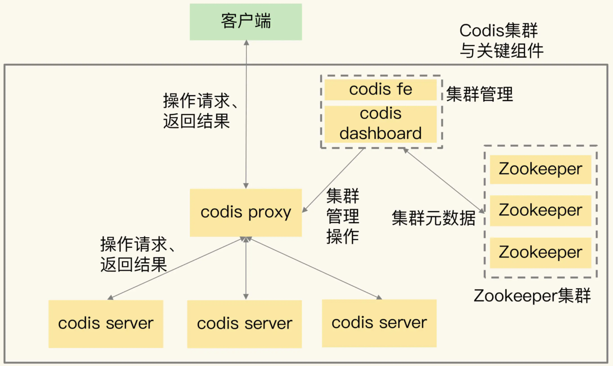
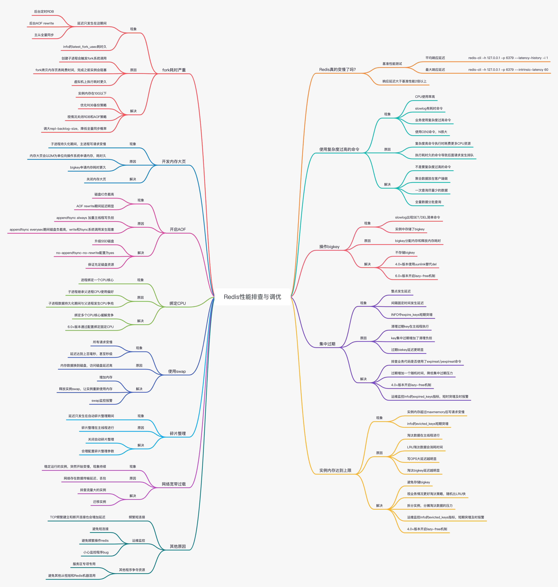

# 一、Redis高可用架构

高可用、高性能：
- 数据尽量少丢失；（AOF 和 RDB 保证）
- 服务尽量少中断；

## 1、Redis 的复制

- 主要是主从复制，主节点数据更新后根据配置和策略，自动同步到从节点的 master/slaver机制，Master 以写为主，Slave 以读为主；
- 如果采用了主从架构，那么建议必须开启master的持久化，保证在master宕机的情况下，恢复时数据不被清空。
- 不建议用`slave node`作为`master node`的数据热备，因为那样的话，如果你关掉master的持久化，可能在master宕机重启的时候数据是空的，然后可能一经过复制，salve node数据也丢了

## 2、主从复制

读写分离、容灾恢复

`redis replication -> 主从架构 -> 读写分离 -> 水平扩容支撑读高并发`

***缺点***：由于所有的写操作都是先在Master上操作，然后同步更新到Slave上，所以从Master同步到Slave机器有一定的延迟，当系统很繁忙的时候，延迟问题会更加严重，slave 机器数量的增加也会使这个问题更加严重；

**为什么要采用读写分离的方式呢？**

不管是主库还是从库，如果都能接收客户端的写操作，那么，一个直接的问题就是：如果客户端对同一个数据（例如 k1）前后修改了三次，每一次的修改请求都发送到不同的实例上，在不同的实例上执行，那么，这个数据在这三个实例上的副本就不一致了（分别是 v1、v2 和 v3）。在读取这个数据的时候，就可能读取到旧的值。如果非要保持这个数据在多个实例上一致，就要涉及到加锁、实例间协商是否完成修改等一系列操作，但这会带来巨额的开销，当然是不太能接受的。而主从库模式一旦采用了读写分离，所有数据的修改只会在主库上进行，不用协调多个实例。主库有了最新的数据后，会同步给从库，这样，主从库的数据就是一致的

## 3、主从的配置

可以通过 replicaof（Redis 5.0 之前使用 slaveof）命令形成主库和从库的关系，主要有3种实现方式：
- 配置文件：在从服务器的配置文件中加入 `replicaof <masterip> <masterport>`
- 启动命令：redis-server 启动命令后面加入 `--replicaof <masterip> <masterport>`：`src/redis-server --replicaof 192.168.89.135 6379`
- 客户端命令：启动多个 Redis 实例后，直接通过客户端执行命令：`replicaof <masterip> <masterport>`，则该 Redis 实例成为从节点

[Redis主从配置](../../../辅助资料/环境配置/Linux环境.md#3Redis主从配置)

## 4、常用的主从模式

### 4.1、一主二仆：即配置一台主库，两台从库

**4.1.1、主从显示的信息**

- 未配置主从时，显示如下：
```
127.0.0.1：6379> info replication
# Replication
role：master
connected_slaves：0
master_repl_offset：0
repl_backlog_active：0
repl_backlog_size：1048576
repl_backlog_first_byte_offset：0
repl_backlog_histlen：0
```

- 配置主库后，主库显示如：
```
127.0.0.1：6380> info replication
# Replication
role：master 														==> 当前库的角色
connected_slaves：1
slave0：ip=127.0.0.1，port=6379，state=online，offset=15，lag=0			==> 从库的信息
master_repl_offset：15
repl_backlog_active：1
repl_backlog_size：1048576
repl_backlog_first_byte_offset：2
repl_backlog_histlen：14
```

- 配置从库后，从库显示如：
```
127.0.0.1：6379> info replication
# Replication
role：slave 															==> 当前库的角色
master_host：127.0.0.1
master_port：6380
master_link_status：up
master_last_io_seconds_ago：6
master_sync_in_progress：0
slave_repl_offset：1
slave_priority：100
slave_read_only：1
connected_slaves：0
master_repl_offset：0
repl_backlog_active：0
repl_backlog_size：1048576
repl_backlog_first_byte_offset：0
repl_backlog_histlen：0
```

**4.1.2、一主二仆问题：**

- 切入点问题：slave1、slave2是从头开始复制还是从切入点开始复制？ 比如从k4进来，那之前的123是否也可以复制每次连接都都是全量复制数据
- 从机是否可以写？set可否？从库不能写，主库写，从库读
- 主机shutdown后情况如何？从机是上位还是原地待命？主机shutdown之后，从库原地待命，等到主机响应，"master_link_status：up"这个会变成："master_link_status：down"
- 主机又回来了后，主机新增记录，从机还能否顺利复制？从库还是能顺利复制的.
- 其中一台从机down后情况如何？依照原有它能跟上大部队吗？从库宕机之后，与主库断开连接，如果从库在重启后，需要重新连接主库，除非有在redis.conf的配置

### 4.2、薪火相传

通过“主 - 从 - 从”模式将主库生成 RDB 和传输 RDB 的压力，以级联的方式分散到从库上。

简单来说，在部署主从集群的时候，可以手动选择一个从库（比如选择内存资源配置较高的从库），用于级联其他的从库。然后，可以再选择一些从库（例如三分之一的从库），在这些从库上执行如下命令，让它们和刚才所选的从库，建立起主从关系；

这样一来，这些从库就会知道，在进行同步时，不用再和主库进行交互了，只要和级联的从库进行写操作同步就行了，这就可以减轻主库上的压力

### 4.3、反客为主

slaveof no one

使当前数据库停止与其他数据库的同步，转成主数据库

## 5、复制的流程

- [Redis主从复制过程](https://juejin.cn/post/6973928120332058654)

### 5.1、复制的原理

- slave启动成功连接到master后会发送一个`psync`命令，redis 2.8开始，slave node会周期性地确认自己每次复制的数据量；

	- 如果这是`slave node`重新连接`master node`，那么`master node`仅仅会复制给`slave`部分缺少的数据; 否则如果是`slave node`第一次连接`master node`，那么会触发一次`full resynchronization`；
	
	- 开始`full resynchronization`的时候，`master`会启动一个后台线程，开始生成一份RDB快照文件，同时还会将从客户端收到的所有写命令缓存在内存中。RDB文件生成完毕之后，master会将这个RDB发送给slave，slave会先写入本地磁盘，然后再从本地磁盘加载到内存中。然后master会将内存中缓存的写命令发送给slave，slave也会同步这些数据；
	
	- `slave node`如果跟`master node`有网络故障，断开了连接，会自动重连。`master`如果发现有多个`slave node`都来重新连接，仅仅会启动一个`rdb save`操作，用一份数据服务所有slave node；

- 主从复制的断点续传：从redis 2.8开始，就支持主从复制的断点续传，如果主从复制过程中，网络连接断掉了，那么可以接着上次复制的地方，继续复制下去，而不是从头开始复制一份。`master node`会在内存中常见一个`backlog`，master和slave都会保存一个`replica offset`还有一个`master id`，offset就是保存在backlog中的。如果master和slave网络连接断掉了，slave会让master从上次的`replica offset`开始继续复制；但是如果没有找到对应的offset，那么就会执行一次`resynchronization`；

- 过期key：slave不会过期key，只会等待master过期key。如果master过期了一个key，或者通过LRU淘汰了一个key，那么会模拟一条del命令发送给slave。

### 5.2、复制的完整流程

- （1）`slave node`启动，仅仅保存`master node`的信息，包括`master node`的host和ip，但是复制流程没开始；`master host`和`ip`是从`redis.conf`里面的`slaveof`获取；
- （2）`slave node`内部有个定时任务，每秒检查是否有新的`master node`要连接和复制，如果发现，就跟`master node`建立socket网络连接
- （3）`slave node`发送`ping`命令给`master node`
- （4）口令认证，如果`master`设置了`requirepass`，那么salve node必须发送masterauth的口令过去进行认证
- （5）`master node`第一次执行全量复制，将所有数据发给slave node
- （6）`master node`后续持续将写命令，异步复制给slave node

### 5.3、数据同步相关的核心机制

指的就是第一次slave连接msater的时候，执行的全量复制
- （1）`master和slave都会维护一个offset`：master会在自身不断累加offset，slave也会在自身不断累加offset；slave每秒都会上报自己的offset给master，同时master也会保存每个slave的offset；是master和slave都要知道各自的数据的offset，才能知道互相之间的数据不一致的情况；

- （2）`backlog`：master node有一个backlog，默认是1MB大小；master node给slave node复制数据时，也会将数据在backlog中同步写一份；backlog主要是用来做全量复制中断候的增量复制的

- （3）`master run id`：info server，可以看到master run id；如果根据host+ip定位master node，是不靠谱的，如果master node重启或者数据出现了变化，那么slave node应该根据不同的run id区分，run id不同就做全量复制；如果需要不更改run id重启redis，可以使用`redis-cli debug reload`命令

- （4）`psync`：从节点使用psync从master node进行复制，`psync runid offset`；master node会根据自身的情况返回响应信息，可能是`FULLRESYNC runid offset`触发全量复制，可能是`CONTINUE`触发增量复制；

**replication buffer**：一个在 master 端上创建的缓冲区，存放的数据是下面三个时间内所有的 master 数据写操作：
- master 执行 bgsave 产生 RDB 的期间的写操作；
- master 发送 rdb 到 slave 网络传输期间的写操作；
- slave load rdb 文件把数据恢复到内存的期间的写操作；

Redis 和客户端通信也好，和从库通信也好，Redis 都分配一个内存 buffer 进行数据交互，客户端就是一个 client，从库也是一个 client，我们每个 client 连上 Redis 后，Redis 都会分配一个专有 client buffer，所有数据交互都是通过这个 buffer 进行的。

Master 先把数据写到这个 buffer 中，然后再通过网络发送出去，这样就完成了数据交互

replication buffer 太小会引发的问题：replication buffer 由 client-output-buffer-limit slave 设置，当这个值太小会导致主从复制连接断开。
- 当 master-slave 复制连接断开，master 会释放连接相关的数据。replication buffer 中的数据也就丢失了，此时主从之间重新开始复制过程。
- 主从复制连接断开，导致主从上出现重新执行 bgsave 和 rdb 重传操作无限循环

这种情况可能引起全量复制 -> replication buffer 溢出导致连接中断 -> 重连 -> 全量复制 -> replication buffer 缓冲区溢出导致连接中断……的循环

配置replication buffer为512M
```
默认是：client-output-buffer-limit replica 256mb 64mb 60
config set client-output-buffer-limit "slave 536870912 536870912 0"
```

### 5.4、全量复制

全量复制的过程：
- （1）master执行bgsave，在本地生成一份rdb快照文件
- （2）master node将rdb快照文件发送给salve node，如果rdb复制时间超过60秒（repl-timeout），那么slave node就会认为复制失败，可以适当调节大这个参数
- （3）对于千兆网卡的机器，一般每秒传输100MB，6G文件，很可能超过60s
- （4）master node在生成rdb时，会将所有新的写命令缓存在内存中，在salve node保存了rdb之后，再将新的写命令复制给salve node
- （5）`client-output-buffer-limit slave 256MB 64MB 60`，如果在复制期间，内存缓冲区持续消耗超过64MB，或者一次性超过256MB，那么停止复制，复制失败
- （6）slave node接收到rdb之后，清空自己的旧数据，然后重新加载rdb到自己的内存中，同时基于旧的数据版本对外提供服务
- （7）如果slave node开启了AOF，那么会立即执行`BGREWRITEAOF`，重写AOF

rdb生成、rdb通过网络拷贝、slave旧数据的清理、slave aof rewrite，很耗费时间

### 5.5、增量复制

主从库间网络断了怎么办？<br/>
在 Redis 2.8 之前，如果主从库在命令传播时出现了网络闪断，那么，从库就会和主库重新进行一次全量复制，开销非常大。<br/>
从 Redis 2.8 开始，网络断了之后，主从库会采用增量复制的方式继续同步，增量复制只会把主从库网络断连期间主库收到的命令，同步给从库
- （1）当主从库断连后，主库会把断连期间收到的写操作命令，写入 replication buffer，同时也会把这些操作命令也写入 repl_backlog_buffer 这个缓冲区；repl_backlog_buffer 是一个环形缓冲区，主库会记录自己写到的位置，从库则会记录自己已经读到的位置；
- （2）刚开始的时候，主库和从库的写读位置在一起，这算是它们的起始位置。随着主库不断接收新的写操作，它在缓冲区中的写位置会逐步偏离起始位置，通常用偏移量来衡量这个偏移距离的大小，对主库来说，对应的偏移量就是 master_repl_offset。主库接收的新写操作越多，这个值就会越大。同样，从库在复制完写操作命令后，它在缓冲区中的读位置也开始逐步偏移刚才的起始位置，此时，从库已复制的偏移量 slave_repl_offset 也在不断增加。正常情况下，这两个偏移量基本相等；
- （3）主从库的连接恢复之后，从库首先会给主库发送 psync 命令，并把自己当前的 slave_repl_offset 发给主库，主库会判断自己的 master_repl_offset 和 slave_repl_offset 之间的差距；在网络断连阶段，主库可能会收到新的写操作命令，所以，一般来说，master_repl_offset 会大于 slave_repl_offset。此时，主库只用把 master_repl_offset 和 slave_repl_offset 之间的命令操作同步给从库就行。

**注意：** 因为 repl_backlog_buffer 是一个环形缓冲区，所以在缓冲区写满后，主库会继续写入，此时，就会覆盖掉之前写入的操作。如果从库的读取速度比较慢，就有可能导致从库还未读取的操作被主库新写的操作覆盖了，这会导致主从库间的数据不一致；
可以调整 repl_backlog_size 这个参数。这个参数和所需的缓冲空间大小有关。缓冲空间的计算公式是：`缓冲空间大小 = 主库写入命令速度 * 操作大小 - 主从库间网络传输命令速度 * 操作大小`。在实际应用中，考虑到可能存在一些突发的请求压力，我们通常需要把这个缓冲空间扩大一倍，即 repl_backlog_size = 缓冲空间大小 * 2，这也就是 repl_backlog_size 的最终值

### 5.6、heartbeat

主从节点互相都会发送heartbeat信息；master默认每隔10秒发送一次heartbeat，salve node每隔1秒发送一个heartbeat

- 主从都有心跳检测机制，各自模拟成对方的客户端进行通信，通过 client list 命令查看复制相关客户端信息，主节点的连接状态为 flags = M，从节点的连接状态是 flags = S。
- 主节点默认每隔 10 秒对从节点发送 ping 命令，可修改配置 repl-ping-slave-period 控制发送频率。
- 从节点在主线程每隔一秒发送 `replconf ack{offset}` 命令，给主节点上报自身当前的复制偏移量。
- 主节点收到 replconf 信息后，判断从节点超时时间，如果超过 repl-timeout 60 秒，则判断节点下线。

### 5.7、异步复制	

主节点不但负责数据读写，还负责把写命令同步给从节点，写命令的发送过程是异步完成，也就是说主节点处理完写命令后立即返回客户端，并不等待从节点复制完成

### 5.8、无磁盘化复制

通常来讲，一个完全重新同步需要在磁盘上创建一个RDB文件，然后加载这个文件以便为从服务器发送数据。

如果使用比较低速的磁盘，这种操作会给主服务器带来较大的压力。Redis从2.8.18版本开始尝试支持无磁盘的复制。使用这种设置时，子进程直接将RDB通过网络发送给从服务器，不使用磁盘作为中间存储。

该功能是通过配置文件配置的，主要涉及到以下两个参数：
- `repl-diskless-sync`：无磁盘同步 默认为 no（关闭状态）
- `repl-diskless-sync-delay`：等待一定时长再开始复制，因为要等更多 slave 重新连接过来

## 6、哨兵模式-sentinel

- [哨兵模式](http://www.redis.cn/topics/sentinel.html)
- [哨兵模式-EN](https://redis.io/topics/sentinel)

主从复制架构面临一个严峻问题，主库挂了，无法执行`写操作`，无法自动选择一个 Slave 切换为 Master，也就是无法故障自动切换；

### 6.1、什么是哨兵模式

在 Redis 主从集群中，哨兵机制是实现主从库自动切换的关键机制，它有效地解决了主从复制模式下故障转移的这三个问题

由一个或多个`Sentinel`实例组成的，`Sentinel` 系统可以监视任意多个主服务器，以及这些主服务器属下的所有从服务器，并在被监视的主服务器进入下线状态时，自动将下线主服务器下的某个从服务器升级为新的主服务器；主要功能：
- （1）主从监控：负责监控`redis master`和`slave`进程是否正常工作；
- （2）消息通知：如果某个redis实例有故障，那么哨兵负责发送消息作为报警通知给管理员；
- （3）故障转移：如果`master node`挂掉了，会自动转移到`slave node`上；
- （4）配置中心：如果故障转移发生了，通知client客户端新的master地址；

哨兵主要负责的就是三个任务：监控、选主（选择主库）和通知
- 监控：是指哨兵进程在运行时，周期性地给所有的主从库发送 PING 命令，检测它们是否仍然在线运行。如果从库没有在规定时间内响应哨兵的 PING 命令，哨兵就会把它标记为“下线状态”；同样，如果主库也没有在规定时间内响应哨兵的 PING 命令，哨兵就会判定主库下线，然后开始自动切换主库的流程;
- 选主：主库挂了以后，哨兵就需要从很多个从库里，按照一定的规则选择一个从库实例，把它作为新的主库。这一步完成后，现在的集群里就有了新主库；
- 通知：在执行通知任务时，哨兵会把新主库的连接信息发给其他从库，让它们执行 replicaof 命令，和新主库建立连接，并进行数据复制。同时，哨兵会把新主库的连接信息通知给客户端，让它们把请求操作发到新主库上；

从本质上说，哨兵就是一个运行在特定模式下的 Redis 实例，只不过它并不服务请求操作，只是完成监控、选主和通知的任务。所以，每个哨兵实例也提供 pub/sub 机制，客户端可以从哨兵订阅消息。哨兵提供的消息订阅频道有很多，不同频道包含了主从库切换过程中的不同关键事件

### 6.2、使用步骤

- 在相应的目录下新建：`sentinel.conf`文件，名字绝不能错；
- 配置：
	```bash
	port 26379
	pidfile "/usr/local/redis/sentinel/redis-sentinel.pid"
	dir "/usr/local/redis/sentinel"
	daemonize yes
	protected-mode no
	logfile "/usr/local/redis/sentinel/redis-sentinel.log"
	```
- 在 `sentinel.conf` 增加如下配置：
	```bash
	# 配置哨兵 mymaster 表示给master数据库定义了一个名字，后面的是master的ip和端口，1表示至少需要一个Sentinel进程同意才能将master判断为失效，如果不满足这个条件，则自动故障转移（failover）不会执行
	sentinel monitor mymaster 127.0.0.1 6379 1
	# 密码
	sentinel auth-pass <master-name> <password>
	# master被sentinel认定为失效的间隔时间
	sentinel down-after-milliseconds mymaster 30000
	# 剩余的slaves重新和新的master做同步的并行个数
	sentinel parallel-syncs mymaster 1
	# 主备切换的超时时间，哨兵要去做故障转移，这个时候哨兵也是一个进程，如果他没有去执行，超过这个时间后，会由其他的哨兵来处理
	sentinel failover-timeout mymaster 180000
	```
	`sentinel monitor 被监控数据库名字(自己起名字) 127.0.0.1 6379 1`，最后一个数字1，表示主机挂掉后salve投票看让谁接替成为主机，得票数多少后成为主机；
- 启动哨兵：`redis-sentinel sentinel.conf`
- 原有的master挂了，投票新选，重新主从继续开工，`info replication`查查看

### 6.3、哨兵核心点

- 哨兵至少需要3个实例，来保证自己的健壮性；
- `哨兵 + redis主从`的部署架构，是不会保证数据零丢失的，只能保证redis集群的高可用性；

#### 6.3.1、为什么redis哨兵至少需要3个实例

**为什么redis哨兵集群只有2个节点无法正常工作？**
```
+----+         +----+
| M1 |---------| R1 |
| S1 |         | S2 |
+----+         +----+
```
如果哨兵集群仅仅部署了个2个哨兵实例，`quorum=1`；如果master宕机，s1和s2中只要有1个哨兵认为master宕机就可以还行切换，同时s1和s2中会选举出一个哨兵来执行故障转移；

同时这个时候，需要`majority`，也就是大多数哨兵都是运行的，2个哨兵的`majority`就是2（2的majority=2，3的majority=2，5的majority=3，4的majority=2），2个哨兵都运行着，就可以允许执行故障转移；

但是如果整个M1和S1运行的机器宕机了，那么哨兵只有1个了，此时就没有`majority`来允许执行故障转移，虽然另外一台机器还有一个R1，但是故障转移不会执行

**经典的3节点哨兵集群**
```
       +----+
       | M1 |
       | S1 |
       +----+
          |
+----+    |    +----+
| R2 |----+----| R3 |
| S2 |         | S3 |
+----+         +----+
```
Configuration: `quorum = 2，majority`

如果M1所在机器宕机了，那么三个哨兵还剩下2个，S2和S3可以一致认为master宕机，然后选举出一个来执行故障转移；同时3个哨兵的`majority`是2，所以还剩下的2个哨兵运行着，就可以允许执行故障转移；

#### 6.3.2、节点通信

`Sentinel` 节点连接一个 `Redis` 实例的时候，会创建 `cmd` 和 `pub/sub` 两个 **连接**。`Sentinel` 通过 `cmd` 连接给 `Redis` 发送命令，通过 `pub/sub` 连接到 `Redis` 实例上的其他 `Sentinel` 实例

`Sentinel` 与 `Redis` **主节点** 和 **从节点** 交互的命令，主要包括：

| 命令      | 作 用                                                        |
| --------- | ------------------------------------------------------------ |
| PING      | `Sentinel` 向 `Redis` 节点发送 `PING` 命令，检查节点的状态   |
| INFO      | `Sentinel` 向 `Redis` 节点发送 `INFO` 命令，获取它的 **从节点信息** |
| PUBLISH   | `Sentinel` 向其监控的 `Redis` 节点 `__sentinel__:hello` 这个 `channel` 发布 **自己的信息** 及 **主节点** 相关的配置 |
| SUBSCRIBE | `Sentinel` 通过订阅 `Redis` **主节点** 和 **从节点** 的 `__sentinel__:hello` 这个 `channnel`，获取正在监控相同服务的其他 `Sentinel` 节点 |

`Sentinel` 与 `Sentinel` 交互的命令，主要包括：

| 命令                            | 作 用                                                        |
| ------------------------------- | ------------------------------------------------------------ |
| PING                            | `Sentinel` 向其他 `Sentinel` 节点发送 `PING` 命令，检查节点的状态 |
| SENTINEL:is-master-down-by-addr | 和其他 `Sentinel` 协商 **主节点** 的状态，如果 **主节点** 处于 `SDOWN` 状态，则投票自动选出新的 **主节点** |

### 6.4、数据丢失及解决方案

#### 6.4.1、两种数据丢失情况

主备切换的过程，可能会导致数据丢失
- 异步复制导致的数据丢失：因为`master -> slave`的复制是异步的，所以可能有部分数据还没复制到slave，master就宕机了，此时这些部分数据就丢失了；

- 脑裂导致的数据丢失：某个master所在机器突然脱离了正常的网络，跟其他slave机器不能连接，但是实际上master还运行着。此时哨兵可能就会认为master宕机了，然后开启选举，将其他slave切换成了master这个时候，集群里就会有两个master，也就是所谓的脑裂；

	此时虽然某个slave被切换成了master，但是可能client还没来得及切换到新的master，还继续写向旧master的数据可能也丢失了。因此旧master再次恢复的时候，会被作为一个slave挂到新的master上去，自己的数据会清空，重新从新的master复制数据；

#### 6.4.2、解决方案

`redis.confg`存在两个配置：
```conf
min-slaves-to-write 1  # 要求至少有1个slave，数据复制和同步的延迟不能超过10秒
min-slaves-max-lag 10  # 如果说一旦所有的slave，数据复制和同步的延迟都超过了10秒钟，那么这个时候，master就不会再接收任何请求了
```
上面两个配置可以减少异步复制和脑裂导致的数据丢失
- 减少异步复制的数据丢失：有了`min-slaves-max-lag`这个配置，就可以确保说，一旦slave复制数据和ack延时太长，就认为可能master宕机后损失的数据太多了，那么就拒绝写请求，这样可以把master宕机时由于部分数据未同步到slave导致的数据丢失降低的可控范围内；

- 减少脑裂的数据丢失：如果一个master出现了脑裂，跟其他slave丢了连接，那么上面两个配置可以确保说，如果不能继续给指定数量的slave发送数据，而且slave超过10秒没有给自己ack消息，那么就直接拒绝客户端的写请求；

	这样脑裂后的旧master就不会接受client的新数据，也就避免了数据丢失，上面的配置就确保了，如果跟任何一个slave丢了连接，在10秒后发现没有slave给自己ack，那么就拒绝新的写请求，因此在脑裂场景下，最多就丢失10秒的数据；

### 6.5、哨兵失败状态转换机制

`sdown`和`odown`转换机制：`sdown`和`odown`两种失败状态
- `sdown`是主观下线，就一个哨兵如果自己觉得一个master下线了，那么就是主观下线；
- `odown`是客观下线，如果quorum数量的哨兵都觉得一个master宕机了，那么就是客观下线；减少误判的概率，也能避免误判带来的无谓的主从库切换

`sdown`达成的条件很简单，如果一个哨兵ping一个master，超过了`is-master-down-after-milliseconds`指定的毫秒数之后，就主观认为master下线，主观下线并不会里面发生选主，还会有一个哨兵集群的决策过程；

`sdown`到`odown`转换的条件很简单，如果一个哨兵在指定时间内，收到了quorum指定数量的其他哨兵也认为那个master是sdown了，那么就认为是odown了，客观认为master宕机；

**master在宕机之后，如果恢复之后存在不同步问题：**

有可能是从节点配置了master auth，这是用于同步master的数据，但是主节点一开始是master是不受影响的，当master转变为slave后，由于他没有设置masterauth，所以他不能从新的master同步数据，随之导致`info replication`的时候，同步状态为down，所以只需要修改redis.conf中的masterauth统一即可；

一般master数据无法同步给slave的方案检查为如下：
- 网络通信问题，要保证互相ping通，内网互通。
- 关闭防火墙，对应的端口开发（虚拟机中建议永久关闭防火墙，云服务器的话需要保证内网互通）。
- 统一所有的密码，不要漏了某个节点没有设置；

### 6.6、哨兵集群的自动发现机制

哨兵互相之间的发现，是通过redis的`pub/sub`系统实现的，每个哨兵都会往`__sentinel__:hello`这个channel里发送一个消息，这时候所有其他哨兵都可以消费到这个消息，并感知到其他的哨兵的存在；

每隔两秒钟，每个哨兵都会往自己监控的某个`master+slaves`对应的`__sentinel__:hello channel`里发送一个消息，内容是自己的`host、ip`和`runid`还有对这个master的监控配置

每个哨兵也会去监听自己监控的每个`master+slaves`对应的`__sentinel__:hello channel`，然后去感知到同样在监听这个`master+slaves`的其他哨兵的存在

每个哨兵还会跟其他哨兵交换对master的监控配置，互相进行监控配置的同步；

**哨兵如何跟slave联系的**
- 利用 master 来实现，哨兵向 master 发送 INFO 命令， master 是知道所有的 salve。所以 master 接收到命令后，便将 slave 列表告诉哨兵；
- 哨兵根据 master 响应的 slave 名单信息与每一个 salve 建立连接，并且根据这个连接持续监控哨兵；
- 

### 6.7、slave配置的自动纠正

哨兵会负责自动纠正slave的一些配置，比如slave如果要成为潜在的master候选人，哨兵会确保slave在复制现有master的数据; 如果slave连接到了一个错误的master上，比如故障转移之后，那么哨兵会确保它们连接到正确的master上；

### 6.8、slave->master选举过程

如果一个master被认为odown了，而且`majority`哨兵都允许了主备切换，那么某个哨兵就会执行主备切换操作，此时首先要选举一个slave来，会考虑slave的一些信息
- （1）跟master断开连接的时长
- （2）slave优先级
- （3）复制offset
- （4）run id

如果一个slave跟master断开连接已经超过了`down-after-milliseconds`的10倍，外加master宕机的时长，那么slave就被认为不适合选举为master：`(down-after-milliseconds * 10) + milliseconds_since_master_is_in_SDOWN_state`

接下来会对slave进行排序：
- （1）按照slave优先级进行排序，`slave-priority`越低，优先级就越高；
- （2）如果`slave-priority`相同，那么看`replica offset`，哪个slave复制了越多的数据，offset越靠后，优先级就越高；
- （3）如果上面两个条件都相同，那么选择一个`run id`比较小的那个slave；

> 首先，哨兵会按照在线状态、网络状态，筛选过滤掉一部分不符合要求的从库，然后，依次按照优先级、复制进度、ID 号大小再对剩余的从库进行打分，只要有得分最高的从库出现，就把它选为新主库

### 6.9、quorum和majority

每次一个哨兵要做主备切换，首先需要quorum数量的哨兵认为odown（客观宕机），然后选举出一个哨兵来做切换，这个哨兵还得得到majority数量哨兵的授权，才能正式执行切换；

如果`quorum < majority`，比如5个哨兵，majority就是3，quorum设置为2，那么就3个哨兵授权就可以执行切换

但是如果`quorum >= majority`，那么必须quorum数量的哨兵都授权，比如5个哨兵，quorum是5，那么必须5个哨兵都同意授权，才能执行切换；

### 6.10、configuration epoch

哨兵会对一套redis master+slave进行监控，有相应的监控的配置

执行切换的那个哨兵，会从要切换到的新master（salve->master）那里得到一个`configuration epoch`，这就是一个version号，每次切换的version号都必须是唯一的

如果第一个选举出的哨兵切换失败了，那么其他哨兵，会等待`failover-timeout`时间，然后接替继续执行切换，此时会重新获取一个新的`configuration epoch`，作为新的version号

### 6.11、configuraiton传播

哨兵完成切换之后，会在自己本地更新生成最新的master配置，然后同步给其他的哨兵，就是通过之前说的pub/sub消息机制

这里之前的version号就很重要了，因为各种消息都是通过一个channel去发布和监听的，所以一个哨兵完成一次新的切换之后，新的master配置是跟着新的version号的

其他的哨兵都是根据版本号的大小来更新自己的master配置的

### 6.12、哨兵配置实战

```conf
# 哨兵sentinel实例运行的端口，默认26379  
port 26379
# 哨兵sentinel的工作目录
dir ./

# 哨兵sentinel监控的redis主节点的 
## ip：主机ip地址
## port：哨兵端口号
## master-name：可以自己命名的主节点名字（只能由字母A-z、数字0-9 、这三个字符".-_"组成。）
## quorum：当这些quorum个数sentinel哨兵认为master主节点失联 那么这时 客观上认为主节点失联了  
# sentinel monitor <master-name> <ip> <redis-port> <quorum>  
sentinel monitor mymaster 127.0.0.1 6379 2

# 当在Redis实例中开启了requirepass <foobared>，所有连接Redis实例的客户端都要提供密码。
# sentinel auth-pass <master-name> <password>  
sentinel auth-pass mymaster 123456  

# 指定主节点应答哨兵sentinel的最大时间间隔，超过这个时间，哨兵主观上认为主节点下线，默认30秒  
# sentinel down-after-milliseconds <master-name> <milliseconds>
sentinel down-after-milliseconds mymaster 30000  

# 指定了在发生failover主备切换时，最多可以有多少个slave同时对新的master进行同步。这个数字越小，完成failover所需的时间就越长；反之，但是如果这个数字越大，就意味着越多的slave因为replication而不可用。可以通过将这个值设为1，来保证每次只有一个slave，处于不能处理命令请求的状态。
# sentinel parallel-syncs <master-name> <numslaves>
sentinel parallel-syncs mymaster 1  

# 故障转移的超时时间failover-timeout，默认三分钟，可以用在以下这些方面：
## 1. 同一个sentinel对同一个master两次failover之间的间隔时间。  
## 2. 当一个slave从一个错误的master那里同步数据时开始，直到slave被纠正为从正确的master那里同步数据时结束。  
## 3. 当想要取消一个正在进行的failover时所需要的时间。
## 4.当进行failover时，配置所有slaves指向新的master所需的最大时间。不过，即使过了这个超时，slaves依然会被正确配置为指向master，但是就不按parallel-syncs所配置的规则来同步数据了
# sentinel failover-timeout <master-name> <milliseconds>  
sentinel failover-timeout mymaster 180000

# 当sentinel有任何警告级别的事件发生时（比如说redis实例的主观失效和客观失效等等），将会去调用这个脚本。一个脚本的最大执行时间为60s，如果超过这个时间，脚本将会被一个SIGKILL信号终止，之后重新执行。
# 对于脚本的运行结果有以下规则：  
## 1. 若脚本执行后返回1，那么该脚本稍后将会被再次执行，重复次数目前默认为10。
## 2. 若脚本执行后返回2，或者比2更高的一个返回值，脚本将不会重复执行。  
## 3. 如果脚本在执行过程中由于收到系统中断信号被终止了，则同返回值为1时的行为相同。
# sentinel notification-script <master-name> <script-path>  
sentinel notification-script mymaster /var/redis/notify.sh

# 这个脚本应该是通用的，能被多次调用，不是针对性的。
# sentinel client-reconfig-script <master-name> <script-path>
sentinel client-reconfig-script mymaster /var/redis/reconfig.sh
```

## 7、Redis Cluster

- [Redis集群](http://www.redis.cn/topics/cluster-tutorial.html)

核心思路：通过消息的交互（Gossip）实现去中心化(指的是集群自身的实现，不是指数据)，通过Hash槽分配，实现集群线性可拓展；

哨兵模式归根节点还是主从模式，在主从模式下我们可以通过增加slave节点来扩展读并发能力，但是没办法扩展写能力和存储能力，存储能力只能是master节点能够承载的上限。所以为了扩展写能力和存储能力，我们就需要引入集群模式；

你就可以理解为n个主从架构组合在一起对外服务。Redis Cluster要求至少需要3个master才能组成一个集群，同时每个master至少需要有一个slave节点；

Redis Cluster集群节点最小配置6个节点以上（3主3从），其中主节点提供读写操作，从节点作为备用节点，不提供请求，只作为故障转移使用

### 7.1、Redis集群

是一个提供在多个Redis间节点间共享数据的程序集；Redis集群并不支持处理多个keys的命令，因为这需要在不同的节点间移动数据，从而达不到像Redis那样的性能，在高负载的情况下可能会导致不可预料的错误，另外Redis集群不支持数据库选择，默认在 0 数据库；

Redis 集群通过分区来提供一定程度的可用性，在实际环境中当某个节点宕机或者不可达的情况下继续处理命令。Redis 集群的优势：
- 自动分割数据到不同的节点上。
- 整个集群的部分节点失败或者不可达的情况下能够继续处理命令，集群节点挂掉会自动故障转移；
- 节点与节点之间通过二进制协议进行通信；
- 客户端直连：客户端与 Redis 节点直连，不需要中间 Proxy 层，客户端不需要连接集群所有节点，连接集群中任何一个可用节点即可；

redis cluster（多master + 读写分离 + 高可用）

主要运用于：海量数据+高并发+高可用的场景

### 7.2、分片算法与槽（Slot）

Redis集群没有使用hash算法和一致性hash的算法，使用的是hash槽（hash slot）算法

redis cluster有固定的`16384个hash slot`，对每个key计算`CRC16`值，然后对16384取模，可以获取key对应的hash slot；redis cluster中每个master都会持有部分slot。hash slot让node的增加和移除很简单，增加一个master，就将其他master的hash slot移动部分过去，减少一个master，就将它的hash slot移动到其他master上去；移动hash slot的成本是非常低的

Slots属性是一个二进制位数组（bit array），这个数组的长度为`16384/8=2048个字节`，共包含16384个二进制位。Master节点用bit来标识对于某个槽自己是否拥有。

**（1）所以Redis集群的最大节点个数是：16384个，因为其slot槽只有16384个**

**（2）为什么RedisCluster会设计成16384个槽呢？**

- 如果槽位为`65536`，发送心跳信息的消息头达`8k`，发送的心跳包过于庞大：在消息头中，最占空间的是 `myslots[CLUSTER_SLOTS/8]`。当槽位为65536时，这块的大小是: `65536÷8÷1024=8kb因为每秒钟`，redis节点需要发送一定数量的ping消息作为心跳包，如果槽位为65536，这个ping消息的消息头太大了，浪费带宽；
- redis的集群主节点数量基本不可能超过1000个：集群节点越多，心跳包的消息体内携带的数据越多。如果节点过1000个，也会导致网络拥堵；
- 槽位越小，节点少的情况下，压缩率高：Redis主节点的配置信息中，`它所负责的哈希槽是通过一张bitmap的形式来保存的`，在传输过程中，会对bitmap进行压缩，但是如果bitmap的填充率`slots / N很高的话(N表示节点数)`，bitmap的压缩率就很低。如果节点数很少，而哈希槽数量很多的话，bitmap的压缩率就很低；

**（3）Redis Cluster 请求路由方式**

客户端直连 Redis 服务，进行读写操作时，Key 对应的 Slot 可能并不在当前直连的节点上，经过“重定向”才能转发到正确的节点；

如下所示，直接连接`192.168.89.135:6379`进行 Set 操作，当 Key 对应的 Slot 不在当前节点时（如 key-test)，客户端会报错并返回正确节点的 IP 和端口。Set 成功则返回 OK
```
[root@kafka1 redis-5.0.10]# src/redis-cli -h 192.168.89.135 -p 6379
192.168.89.135:6379> set key-test value-test
(error) MOVED 11804 192.168.89.137:6378
192.168.89.135:6379> 
```
以集群模式登录`192.168.89.135:6379`客户端（注意命令的差别：-c 表示集群模式)，则可以清楚的看到“重定向”的信息，并且客户端也发生了切换：“6379” -> “6378”
```
[root@kafka1 redis-5.0.10]# src/redis-cli -c -h 192.168.89.135 -p 6379
192.168.89.135:6379> set key-test value-test
-> Redirected to slot [11804] located at 192.168.89.137:6378
OK
```
和普通的查询路由相比，Redis Cluster 借助客户端实现的请求路由是一种混合形式的查询路由，它并非从一个 Redis 节点到另外一个 Redis，而是借助客户端转发到正确的节点；

实际应用中，可以在客户端缓存 Slot 与 Redis 节点的映射关系，当接收到 MOVED 响应时修改缓存中的映射关系。如此，基于保存的映射关系，请求时会直接发送到正确的节点上，从而减少一次交互，提升效率；

**（4）Hash Tag**

Hash Tag 是指加在键值对 key 中的一对花括号{}。这对括号会把 key 的一部分括起来，客户端在计算 key 的 CRC16 值时，只对 Hash Tag 花括号中的 key 内容进行计算。如果没用 Hash Tag 的话，客户端计算整个 key 的 CRC16 的值；

举个例子，假设 key 是 `user:profile:3231`，我们把其中的 3231 作为 Hash Tag，此时，key 就变成了 `user:profile:{3231}`。当客户端计算这个 key 的 CRC16 值时，就只会计算 3231 的 CRC16 值。否则，客户端会计算整个“`user:profile:3231`”的 CRC16 值；

使用 Hash Tag 的好处是，如果不同 key 的 Hash Tag 内容都是一样的，那么，这些 key 对应的数据会被映射到同一个 Slot 中，同时会被分配到同一个实例上；

那么，Hash Tag 一般用在什么场景呢？其实，它主要是用在 Redis Cluster中，支持事务操作和范围查询。因为 Redis Cluster 本身并不支持跨实例的事务操作和范围查询，当业务应用有这些需求时，就只能先把这些数据读取到业务层进行事务处理，或者是逐个查询每个实例，得到范围查询的结果

这种做法特别适合不同业务中同一个id对应不同key的情况。例如在redis中我们分别存储了玩家的等级和经验：level:{userid}和exp:{userid}，使用这种做法就可以让属于一个玩家的不同key都进入到同一个slot，方便在脚本中原子地操作。

当然，使用这种做法可能会导致key的存储不平衡，最极端的例子就是hashtag内的key是同一个，那就会导致所有的数据都进入同一个slot

如果你用的redis版本足够新（>7.0)，那么可以尝试如下的lua脚本
```lua
#!lua flags=allow-cross-slot-keys
return redis.call('GET', ARGV[1]) + redis.call('GET', ARGV[2])
```
请注意，这里的lua flags只是使得我们可以跨slot访问key。如果没有这么赋值，一般会出现报错Lua script attempted to access a non local key in a cluster node。但是依旧不允许传入不在同一个节点的keys

因此我们这里使用的是ARGV而非KEYS。


### 7.3、Redis集群通信机制

#### 7.3.1、基础通信原理

redis cluster 节点间采取 `gossip` 协议进行通信，跟集中式（集中式是将集群元数据（节点信息、故障等等）几种存储在某个节点上）不同，不是将集群元数据（节点信息，故障，等等）集中存储在某个节点上，而是互相之间不断通信，保持整个集群所有节点的数据是完整的；

10000端口：每个节点都有一个专门用于节点间通信的端口，就是自己提供服务的`端口号+10000，比如7001`，那么用于节点间通信的就是`17001`端口；每个节点每隔一段时间都会往另外几个节点发送`ping`消息，同时其他节点点接收到`ping`之后返回`pong`

#### 7.3.2、gossip协议

所有节点都持有一份元数据，不同的节点如果出现了元数据的变更，就不断将元数据发送给其它的节点，让其它节点也进行元数据的变更

gossip协议包含多种消息，包括`ping、pong、meet、fail`，等等
- meet：某个节点发送meet给新加入的节点，让新节点加入集群中，然后新节点就会开始与其他节点进行通信；`redis-trib.rb add-node` 其实内部就是发送了一个gossip meet消息，给新加入的节点，通知那个节点去加入我们的集群
- ping：每个节点都会频繁给其他节点发送ping，其中包含自己的状态还有自己维护的集群元数据，互相通过ping交换元数据；
- pong：返回ping和meet，包含自己的状态和其他信息，也可以用于信息广播和更新；
- fail：某个节点判断另一个节点fail之后，就发送fail给其他节点，通知其他节点，指定的节点宕机了；

Gossip 不要求节点知道所有其它节点，因此又具有去中心化的特点，节点之间完全对等，不需要任何的中心节点。实际上 Gossip 可以用于众多能接受“最终一致性”的领域：失败检测、路由同步、Pub/Sub、动态负载均衡。

但 Gossip 的缺点也很明显，冗余通信会对网路带宽、CUP 资源造成很大的负载，而这些负载又受限于通信频率，该频率又影响着算法收敛的速度

#### 7.3.3、ping消息深入

每个节点每秒会执行10次ping，每次会选择5个最久没有通信的其他节点；如果发现某个节点通信延时达到了`cluster_node_timeout / 2`，那么立即发送ping，避免数据交换延时过长，落后的时间太长了；

每次 ping，会带上自己节点的信息，还有就是带上 1/10 其它节点的信息，发送出去，进行交换。至少包含 3 个其它节点的信息，最多包含 `总节点数减 2 个其它节点`的信息；

### 7.4、集群容错

#### 7.4.1、请求重定向

由于每个节点只负责部分slot，以及slot可能从一个节点迁移到另一节点，造成客户端有可能会向错误的节点发起请求。因此需要有一种机制来对其进行发现和修正，这就是请求重定向；哈希槽与实例之间的映射关系由于新增实例或者负载均衡重新分配导致改变了，客户端将请求发送到实例上，这个实例没有相应的数据，该 Redis 实例会告诉客户端将请求发送到其他的实例上

有两种不同的重定向场景：
- MOVED错误：请求的key对应的槽不在该节点上，节点将查看自身内部所保存的哈希槽到节点ID的映射记录，节点回复一个MOVED错误；需要客户端进行再次重试；同时，客户端还会更新本地缓存，将该 slot 与 Redis 实例对应关系更新正确
- ASK错误：请求的key对应的槽目前的状态属于`MIGRATING状`态，并且当前节点找不到这个key了，节点回复ASK错误。ASK会把对应槽的IMPORTING节点返回给你，告诉你去IMPORTING的节点尝试找找。客户端进行重试首先发送ASKING命令，节点将为客户端设置一个一次性的标志（flag），使得客户端可以执行一次针对IMPORTING状态的槽的命令请求，然后再发送真正的命令请求

#### 7.4.2、集群失效检测 

集群不可用情况：
- 集群任意 master 挂掉，并且当前 master 没有 slave，集群不可用；比如有 A，B，C 三个节点的集群，在没有复制模型的情况下，如果节点 B 失败了，那么整个集群就会以为缺少 5501-11000 这个范围的槽而不可用；
- 集群超过半数以上 master 挂掉，无论是否有 slave，集群不可用；

当某个Master或者Slave不能被大多数Nodes可达时，用于故障迁移并将合适Slave提升为Master。当Slave提升未能成功，集群不能正常工作。即集群不能处理Client的命令的请求，当Client发出命令请求时，集群节点都将返回错误内容的respone

#### 7.4.3、节点失效检测 

节点定时向其他节点发送ping命令，它会随机选择存储的其他集群节点的其中三个进行信息“广播”；当节点收到其他节点广播的信息，它会记录被其他节点标记为失效的节点。举个例子，如果节点被某个节点标记为PFAIL，集群中大部份其他主节点也认为该节点进入了失效状态，那么该节点的状态会被标志为FAIL。当节点被标志为FAIL，这个节点已失效的信息会被广播至整个集群，所有集群中的节点都会将失效的节点标志为FAIL；

### 7.5、集群扩展

如果集群新增一个节点，在给该节点分配槽时，这些槽所属的源节点和该节点会进行一次 key 的迁移，并且迁移过程中不阻塞集群服务。如果移除一个节点，同理，我们需要将待移除的节点的 key 迁移到另一个节点上

**那集群是如何做到 key 迁移不阻塞集群服务的呢？**

key 迁移过程中，涉及到 `CLUSTER SETSLOT slot8 MIGRATING node` 命令和 `CLUSTER SETSLOT slot8 IMPORTING node` 命令，前者用于将给定节点 node 中的槽 slot8 迁移出节点，而后者用于将给定槽 slot8 导入到节点 node ：
- 如果一个槽被设置为 `MIGRATING` 状态时，原本持有该槽的节点会继续接受关于这个槽的命令请求，但只有当键存在于该节点时，节点才会处理这个请求。如果命令所使用的键不存在于该节点，那么节点将向客户端返回一个 ASK 转向（redirection）错误，告知客户端，要将命令请求发送到槽的迁移目标节点；
- 如果一个槽被设置为 `IMPORTING` 状态时，节点仅在接收到 ASKING 命令之后，才会接受关于这个槽的命令请求。如果客户端向节点发送该槽的数据请求，命令为非 ASKING 时，那么节点会使用 MOVED 转向错误将命令请求转向至真正负责处理这个槽的节点

**移动 key 的操作是原子性的，也就是一个 key 如果从 A 移动到 B，那么移动时，都不会出现 key 在 A 和 B 中同时出现**

### 7.6、脑裂

- [Redis脑裂问题](https://www.xhyonline.com/?p=1171)

所谓的脑裂，就是指在主从集群中，同时有两个主节点，它们都能接收写请求。而脑裂最直接的影响，就是客户端不知道应该往哪个主节点写入数据，结果就是不同的客户端会往不同的主节点上写入数据。而且，严重的话，脑裂会进一步导致数据丢失；

**为什么会发生脑裂？**

在主从集群中发生数据丢失，最常见的原因就是主库的数据还没有同步到从库，结果主库发生了故障，等从库升级为主库后，未同步的数据就丢失了；

脑裂为什么会发生数据丢失：主从切换后，从库一旦升级为新主库，哨兵就会让原主库执行 slave of 命令，和新主库重新进行全量同步。而在全量同步执行的最后阶段，原主库需要清空本地的数据，加载新主库发送的 RDB 文件，这样一来，原主库在主从切换期间保存的新写数据就丢失了

Redis 已经提供了两个配置项来限制主库的请求处理，分别是 `min-slaves-to-write` 和 `min-slaves-max-lag`。
- `min-slaves-to-write`：这个配置项设置了主库能进行数据同步的最少从库数量；
- `min-slaves-max-lag`：这个配置项设置了主从库间进行数据复制时，从库给主库发送 ACK 消息的最大延迟（以秒为单位）。

穿插使用 CAP 理论来分析一下课程的内容：
- redis 集群允许脑裂存在，其实是一种可用性高的特征，但不保证数据一致
- redis 通过设置两个参数，一定程度上其实是在降低可用性，以提供数据一致性。
- 为什么愿意降低可用性？因为那部分的数据会因为主从切换而丢失，所以宁愿不可用。

Redis本身不支持强一致性，因为保证强一致性的代价太大，从CAP角度看，就是放弃C，选择AP。

min-slaves-to-write 和 min-slaves-max-lag的设置，是为了避免主从数据不一致程度加重。两个参数起作用时，相当于对主库做降级，放弃了A，选择C和P。

### 7.7、数据倾斜问题

#### 7.7.1、什么是数据倾斜

前面提到在Redis-cluster中，数据会按照一定的分布规则分散到不同的实例上保存。比如，在使用 Redis Cluster时，数据都会先按照 CRC 算法的计算值对 Slot（逻辑槽）取模，同时，所有的 Slot 又会由运维管理员分配到不同的实例上。这样，数据就被保存到相应的实例上了；

虽然这种方法实现起来比较简单，但是很容易导致一个问题：数据倾斜

数据倾斜有两类：
- 数据量倾斜：在某些情况下，实例上的数据分布不均衡，某个实例上的数据特别多；
- 数据访问倾斜：虽然每个集群实例上的数据量相差不大，但是某个实例上的数据是热点数据，被访问得非常频繁；

如果发生了数据倾斜，那么保存了大量数据，或者是保存了热点数据的实例的处理压力就会增大，速度变慢，甚至还可能会引起这个实例的内存资源耗尽，从而崩溃

#### 7.7.2、数据量倾斜的成因和应对方法

数据量倾斜是怎么产生的呢？这主要有三个原因，分别是某个实例上保存了 bigkey、Slot 分配不均衡以及 Hash Tag：

**（1）bigkey 导致倾斜**：

某个实例上正好保存了 bigkey。bigkey 的 value 值很大（String 类型），或者是 bigkey 保存了大量集合元素（集合类型），会导致这个实例的数据量增加，内存资源消耗也相应增加；

为了避免 bigkey 造成的数据倾斜，一个根本的应对方法是，我们在业务层生成数据时，要尽量避免把过多的数据保存在同一个键值对中；

如果 bigkey 正好是集合类型，我们还有一个方法，就是把 bigkey 拆分成很多个小的集合类型数据，分散保存在不同的实例上；

**（2）Slot 分配不均衡导致倾斜**：

如果集群运维人员没有均衡地分配 Slot，就会有大量的数据被分配到同一个 Slot 中，而同一个 Slot 只会在一个实例上分布，这就会导致，大量数据被集中到一个实例上，造成数据倾斜；

可以通过运维规范，在分配之前，我们就要避免把过多的 Slot 分配到同一个实例。如果是已经分配好 Slot 的集群，我们可以先查看 Slot 和实例的具体分配关系，从而判断是否有过多的 Slot 集中到了同一个实例。如果有的话，就将部分 Slot 迁移到其它实例，从而避免数据倾斜；

在集群上查看 Slot 分配情况的方式：用 CLUSTER SLOTS 命令；

在 Redis Cluster 中，我们可以使用 3 个命令完成 Slot 迁移：
- `CLUSTER SETSLOT`：使用不同的选项进行三种设置，分别是设置 Slot 要迁入的目标实例，Slot 要迁出的源实例，以及 Slot 所属的实例；
- `CLUSTER GETKEYSINSLOT`：获取某个 Slot 中一定数量的 key；
- `MIGRATE`：把一个 key 从源实例实际迁移到目标实例

**（3）Hash Tag 导致倾斜**

Hash Tag 是指加在键值对 key 中的一对花括号`{}`。这对括号会把 key 的一部分括起来，客户端在计算 key 的 CRC16 值时，只对 Hash Tag 花括号中的 key 内容进行计算。如果没用 Hash Tag 的话，客户端计算整个 key 的 CRC16 的值；

使用 Hash Tag 的好处是，如果不同 key 的 Hash Tag 内容都是一样的，那么，这些 key 对应的数据会被映射到同一个 Slot 中，同时会被分配到同一个实例上；

但是，使用 Hash Tag 的潜在问题，就是大量的数据可能被集中到一个实例上，导致数据倾斜，集群中的负载不均衡。那么，该怎么应对这种问题呢？我们就需要在范围查询、事务执行的需求和数据倾斜带来的访问压力之间，进行取舍了；

#### 7.7.3、数据访问倾斜的成因和应对方法

发生数据访问倾斜的根本原因，就是实例上存在热点数据（比如新闻应用中的热点新闻内容、电商促销活动中的热门商品信息，等等）；

一旦热点数据被存在了某个实例中，那么，这个实例的请求访问量就会远高于其它实例，面临巨大的访问压力；

通常来说，热点数据以服务读操作为主，在这种情况下，我们可以采用热点数据多副本的方法来应对；

这个方法的具体做法是，我们把热点数据复制多份，在每一个数据副本的 key 中增加一个随机前缀，让它和其它副本数据不会被映射到同一个 Slot 中。这样一来，热点数据既有多个副本可以同时服务请求，同时，这些副本数据的 key 又不一样，会被映射到不同的 Slot 中。在给这些 Slot 分配实例时，我们也要注意把它们分配到不同的实例上，那么，热点数据的访问压力就被分散到不同的实例上了。

这里，有个地方需要注意下，热点数据多副本方法只能针对只读的热点数据。如果热点数据是有读有写的话，就不适合采用多副本方法了，因为要保证多副本间的数据一致性，会带来额外的开销；

在有数据访问倾斜时，如果热点数据突然过期了，而 Redis 中的数据是缓存，数据的最终值保存在后端数据库，此时会发生什么问题？此时会发生缓存击穿，热点请求会直接打到后端数据库上，数据库的压力剧增，可能会压垮数据库

### 7.8、只支持db0

在 Redis Cluster 模式下，只支持 db0，即 Redis Cluster 不支持多数据库；

原因：
- 数据分片（Sharding）机制：Redis Cluster 将数据分布在多个节点上，通过哈希槽（hash slot）机制进行分片。在 Redis Cluster 模式下，键会被哈希到不同的槽位中，然后再根据槽位将数据存储到不同的节点。如果支持多个数据库，会导致数据分片和路由的逻辑更加复杂。
- 简化管理和路由：为了简化数据路由和管理，Redis Cluster 在设计时选择了只使用 db0，并取消了多数据库的支持。所有的键都存储在单一数据库中，避免了由于多个数据库带来的复杂性

### 7.9、总结

集群的处理流程：
- 检查 key 所在 Slot 是否属于当前节点？
- 若不属于，则响应 MOVED 错误重定向客户端；
- 若属于且 Key 存在，则直接操作，返回结果给客户端
- 若 Key 不存在，检查该 Slot 是否迁出中？(clusterState.migrating_slots_to)
- 若 Slot 迁出中，返回 ASK 错误重定向客户端到迁移的目的服务器上；
- 若 Slot 未迁出，检查 Slot 是否导入中？(clusterState.importing_slots_from)；
- 若 Slot 导入中且请求有 ASKING 标记，则直接操作；
- 否则响应 MOVED 错误重定向客户端；

## 8、Redis Cluster 与 主从复制

- 如果你的数据量很少，主要是承载高并发高性能的场景，比如你的缓存一般就几个G，单机足够了；
- replication，一个mater，多个slave，要几个slave跟你的要求的读吞吐量有关系，然后自己搭建一个sentinal集群，去保证redis主从架构的高可用性，就可以了；
- redis cluster，主要是针对海量数据+高并发+高可用的场景，海量数据，如果你的数据量很大，那么建议就用redis cluster；

## 9、Codis

Codis 是一个分布式 Redis 解决方案, 对于上层的应用来说, 连接到 Codis Proxy 和连接原生的 Redis Server 没有显著区别 (不支持的命令列表), 上层应用可以像使用单机的 Redis 一样使用, Codis 底层会处理请求的转发, 不停机的数据迁移等工作, 所有后边的一切事情, 对于前面的客户端来说是透明的, 可以简单的认为后边连接的是一个内存无限大的 Redis 服务；

### 9.1、Codis 的整体架构和基本流程

Codis 集群中包含了 4 类关键组件：
- codis server：这是进行了二次开发的 Redis 实例，其中增加了额外的数据结构，支持数据迁移操作，主要负责处理具体的数据读写请求；
- codis proxy：接收客户端请求，并把请求转发给 codis server；
- Zookeeper 集群：保存集群元数据，例如数据位置信息和 codis proxy 信息；
- codis dashboard 和 codis fe：共同组成了集群管理工具。其中，codis dashboard 负责执行集群管理工作，包括增删 codis server、codis proxy 和进行数据迁移。而 codis fe 负责提供 dashboard 的 Web 操作界面，便于我们直接在 Web 界面上进行集群管理；



## 10、如何保证 Redis 的可靠性

（1）**按业务线部署实例**

提升可靠性的第一步，就是「资源隔离」。最好按不同的业务线来部署 Redis 实例，这样当其中一个实例发生故障时，不会影响到其它业务。这种资源隔离的方案，实施成本是最低的，但成效却是非常大的

（2）**部署主从集群**

部署「多副本」实例，即主从集群，这样当主库宕机后，依旧有从库可以使用，避免了数据丢失的风险，也降低了服务不可用的时间；在部署主从集群时，你还需要注意，主从库需要分布在不同机器上，避免交叉部署；通常情况下，Redis 的主库会承担所有的读写流量，所以我们一定要优先保证主库的稳定性，即使从库机器异常，也不要对主库造成影响

（3）**合理配置主从复制参数**
- 设置合理的 repl-backlog 参数：过小的 repl-backlog 在写流量比较大的场景下，主从复制中断会引发全量复制数据的风险
- 设置合理的 slave client-output-buffer-limit：当从库复制发生问题时，过小的 buffer 会导致从库缓冲区溢出，从而导致复制中断

（4）**部署哨兵集群，实现故障自动切换**

只部署了主从节点，但故障发生时是无法自动切换的，所以，你还需要部署哨兵集群，实现故障的「自动切换」。而且，多个哨兵节点需要分布在不同机器上，实例为奇数个，防止哨兵选举失败，影响切换时间。


# 二、Redis内存与性能

- [Redis-内存优化](https://redis.io/docs/latest/operate/oss_and_stack/management/optimization/memory-optimization/)

## 1、内存与内存碎片

### 1.1、查看内存统计

在redis-cli客户端中通过命令 [info memory](https://redis.io/docs/latest/commands/info/) 可以查看内存使用情况
```
127.0.0.1:6379> info memory
# Memory
used_memory:902686
used_memory_human:881.53K
used_memory_rss:2437120
used_memory_rss_human:2.32M
used_memory_peak:902686
used_memory_peak_human:881.53K
used_memory_peak_perc:100.01%
used_memory_overhead:902148
used_memory_startup:852518
used_memory_dataset:538
used_memory_dataset_perc:1.07%
total_system_memory:1027514368
total_system_memory_human:979.91M
used_memory_lua:37888
used_memory_lua_human:37.00K
maxmemory:0
maxmemory_human:0B
maxmemory_policy:noeviction
mem_fragmentation_ratio:2.70
mem_allocator:libc
active_defrag_running:0
lazyfree_pending_objects:0
```

### 1.2、内存碎片

内存碎片可以从两个角度来理解：
- **外部碎片**：这是指由于内存分配和释放模式造成的可用内存空间的不连续性。频繁修改 Redis 中的数据也会产生内存碎片；在 Redis 中，如果大量的小对象被分配和释放，但它们的分配和释放顺序不一致，就可能导致许多小的、不可用的内存区域散落在更大的、可使用的内存区域之间。这使得 Redis 在尝试分配大块内存时遇到困难，因为没有足够的连续内存空间；
- **内部碎片**：是指分配给对象的内存块大于对象实际需要的大小。在 Redis 中，内内存分配器一般是按固定大小来分配内存，而不是完全按照应用程序申请的内存空间大小给程序分配，Redis 可以使用 libc、jemalloc、tcmalloc 多种内存分配器来分配内存，默认使用 jemalloc；如果 Redis 使用了一个最小分配单元为 16 字节的内存分配器，那么即使一个对象只需要 1 字节，它也会占用 16 字节的空间，从而产生内部碎片

**如何查看内存碎片信息：**

使用 info memory 命令即可查看 Redis 内存相关的信息
```
INFO memory
# Memory
used_memory:1073741736
used_memory_human:1024.00M
used_memory_rss:1997159792
used_memory_rss_human:1.86G
…
mem_fragmentation_ratio:1.86
```
- `used_memory`：Redis分配器分配的内存总量（单位是字节），包括使用的虚拟内存（即swap）；`used_memory_human`只是显示更友好；
- `used_memory_rss`：Redis进程占据操作系统的内存（单位是字节），与top及ps命令看到的值是一致的；除了分配器分配的内存之外，`used_memory_rss`还包括进程运行本身需要的内存、内存碎片等，但是不包括虚拟内存；

	`used_memory`和`used_memory_rss`，前者是从Redis角度得到的量，后者是从操作系统角度得到的量。二者之所以有所不同，一方面是因为内存碎片和Redis进程运行需要占用内存，使得前者可能比后者小，另一方面虚拟内存的存在，使得前者可能比后者大；

	由于在实际应用中，Redis的数据量会比较大，此时进程运行占用的内存与Redis数据量和内存碎片相比，都会小得多；因此`used_memory_rss`和`used_memory`的比例，便成了衡量Redis内存碎片率的参数；这个参数就是`mem_fragmentation_ratio`；

- `mem_fragmentation_ratio`：内存碎片比率，该值是`used_memory_rss / used_memory`的比值；

	`mem_fragmentation_ratio`一般大于1，且该值越大，内存碎片比例越大。`mem_fragmentation_ratio< 1`，说明Redis使用了虚拟内存，由于虚拟内存的媒介是磁盘，比内存速度要慢很多，当这种情况出现时，应该及时排查，如果内存不足应该及时处理，如增加Redis节点、增加Redis服务器的内存、优化应用等。

	一般来说，`mem_fragmentation_ratio`在1.03左右是比较健康的状态（对于jemalloc来说）；合理的范围是： mem_fragmentation_ratio 大于 1 但小于 1.5
	
	mem_fragmentation_ratio 大于 1.5 。这表明内存碎片率已经超过了 50%

- `mem_allocator:Redis`使用的内存分配器，在编译时指定；可以是 `libc 、jemalloc或者tcmalloc`，默认是 [jemalloc](https://github.com/jemalloc/jemalloc)；

**何清理内存碎片**

当 Redis 发生内存碎片后，一个“简单粗暴”的方法就是重启 Redis 实例，但是这不是最好的方法：
- 重启 Redis 会带来两个后果：如果 Redis 中的数据没有持久化，那么，数据就会丢失；
- 即使 Redis 数据持久化了，还需要通过 AOF 或 RDB 进行恢复，恢复时长取决于 AOF 或 RDB 的大小，如果只有一个 Redis 实例，恢复阶段无法提供服务

从 4.0-RC3 版本以后，只要使用的内存分配器是 jemalloc，可以开启内存碎片自动清理的功能，自动清理的原理很简单：就是内存不连续的时候，自动将分散的数据挪动到一起，这样剩余的空间就会形成连续空间；

碎片清理是有代价的，操作系统需要把多份数据拷贝到新位置，把原有空间释放出来，这会带来时间开销。因为 Redis 是单线程，在数据拷贝时，Redis 只能等着，这就导致 Redis 无法及时处理请求，性能就会降低。而且，有的时候，数据拷贝还需要注意顺序

如何解决这个问题？Redis 专门为自动内存碎片清理功机制设置的参数了。可以通过设置参数，来控制碎片清理的开始和结束时机，以及占用的 CPU 比例，从而减少碎片清理对 Redis 本身请求处理的性能影响：

首先，Redis 需要启用自动内存碎片清理，可以把 activedefrag 配置项设置为 yes
```conf
config set activedefrag yes #命令只是启用了自动清理功能
```
具体什么时候清理需要通过下面两个参数控制：
```conf
# 内存碎片占用空间达到 500mb 的时候开始清理
config set active-defrag-ignore-bytes 500mb
# 表示内存碎片空间占操作系统分配给 Redis 的总空间比例达到 10% 时，开始清理。
config set active-defrag-threshold-lower 10
```
通过 Redis 自动内存碎片清理机制可能会对 Redis 的性能产生影响，可以通过下面两个参数来减少对 Redis 性能的影响：
```conf
# 表示自动清理过程所用 CPU 时间的比例不低于 25%，保证清理能正常开展；
config set active-defrag-cycle-min 25
# 表示自动清理过程所用 CPU 时间的比例不高于 75%，一旦超过，就停止清理，从而避免在清理时，大量的内存拷贝阻塞 Redis，导致响应延迟升高
config set active-defrag-cycle-max 75
```

### 1.3、如何节省内存

**（1）控制 key 的长度**

在开发业务时，你需要提前预估整个 Redis 中写入 key 的数量，如果 key 数量达到了百万级别，那么，过长的 key 名也会占用过多的内存空间。
所以，需要保证 key 在简单、清晰的前提下，尽可能把 key 定义得短一些；

**（2）避免存储 bigkey**

除了控制 key 的长度之外，你同样需要关注 value 的大小，如果大量存储 bigkey，也会导致 Redis 内存增长过快。除此之外，客户端在读写 bigkey 时，还有产生性能问题
- String：大小控制在 10KB 以下；
- List/Hash/Set/ZSet：元素数量控制在 1 万以下

**（3）选择合适的数据类型**

String、Set 在存储 int 数据时，会采用整数编码存储。Hash、ZSet 在元素数量比较少时（可配置）
- String、Set：尽可能存储 int 类型数据
- Hash、ZSet：存储的元素数量控制在转换阈值之下，以压缩列表存储，节约内存

**（4）把 Redis 当作缓存使用**

Redis 数据存储在内存中，这也意味着其资源是有限的。你在使用 Redis 时，要把它当做缓存来使用，而不是数据库。所以，应用写入到  Redis 中的数据，尽可能地都设置「过期时间」

采用这种方案，可以让 Redis 中只保留经常访问的「热数据」，内存利用率也会比较高

**（5）实例设置 maxmemory + 淘汰策略**

对于这种场景，你需要提前预估业务数据量，然后给这个实例设置 maxmemory 控制实例的内存上限，这样可以避免 Redis 的内存持续膨胀。
配置了 maxmemory，此时你还要设置数据淘汰策略，而淘汰策略如何选择，你需要结合你的业务特点来决定：
- volatile-lru / allkeys-lru：优先保留最近访问过的数据
- volatile-lfu / allkeys-lfu：优先保留访问次数最频繁的数据（4.0+版本支持）
- volatile-ttl ：优先淘汰即将过期的数据
- volatile-random / allkeys-random：随机淘汰数据

**（6）数据压缩后写入 Redis**

如果还想进一步优化 Redis 内存，还可以在业务应用中先将数据压缩，再写入到 Redis 中（例如采用 snappy、gzip 等压缩算法）。当然，压缩存储的数据，客户端在读取时还需要解压缩，在这期间会消耗更多 CPU 资源，你需要根据实际情况进行权衡；

## 2、高性能IO模型

### 2.1、Redis单线程

**单线程**指的是：Redis 的网络 IO 和键值对读写是由一个线程来完成的，这也是 Redis 对外提供键值存储服务的主要流程；但 Redis 的其他功能，比如持久化、异步删除、集群数据同步等，其实是由额外的线程执行的
- 在Redis 6.0前，网络请求的解析和数据读写都是由主线程来完成的，这也是我们称之为单线程的原因。
- 从Redis 6.0开始，网络请求的解析是由其他线程完成，然后把解析后的请求交由主线程进行实际的内存读写。

**为什么采用单线程**：
- Redis是基于内存的操作，CPU不是Redis的瓶颈，Redis的瓶颈最有可能是机器内存的大小或者网络带宽。既然单线程容易实现，而且CPU不会成为瓶颈，那就顺理成章地采用单线程的方案了；
- 采用单线程，避免了不必要的上下文切换和竞争条件，也不存在多进程或者多线程导致的切换而消耗 CPU；
- 不存在共享的数据结构，当有多个线程要修改这个共享资源时，为了保证共享资源的正确性，就需要有额外的机制进行保证，而这个额外的机制，就会带来额外的开销，即多线程编程模式面临的共享资源的并发访问控制问题；
- 采用多线程开发一般会引入同步原语来保护共享资源的并发访问，这也会降低系统代码的易调试性和可维护性

**Redis单线程的优劣势：**
- 优势：
	- 代码更清晰，处理逻辑更简单
	- 不用去考虑各种锁的问题，不存在加锁释放锁操作，没有因为可能出现死锁而导致的性能消耗；
	- 不存在多进程或者多线程导致的切换而消耗CPU；
	- 单线程天然支持原子操作；
- 劣势：
	- 无法发挥多核CPU性能，不过可以通过在单机开多个Redis实例来完善；
	- 如果删除的键过大（比如Set类型中有上百万个对象），会导致服务端阻塞好几秒；
	- QPS难再提高；

**单线程 Redis 为什么那么快**
- Redis 的大部分操作在内存上完成，再加上它采用了高效的数据结构，例如哈希表和跳表；
- Redis 采用了多路复用机制，使其在网络 IO 操作中能并发处理大量的客户端请求，实现高吞吐率

### 2.4、Redis线程模型

Redis 采用 I/O 多路复用技术，并发处理连接。采用了 epoll + 自己实现的简单的事件框架
- Redis 基于 Reactor 模式来设计开发了自己的一套高效的事件处理模型 （Netty 的线程模型也基于 Reactor 模式，Reactor 模式不愧是高性能 IO 的基石），这套事件处理模型对应的是 Redis 中的文件事件处理器（file event handler）。由于文件事件处理器（file event handler）是单线程方式运行的，所以我们一般都说 Redis 是单线程模型；
- 它采用 IO 多路复用机制同时监听多个 socket，根据 socket 上的事件来选择对应的事件处理器进行处理；
- 在 Redis 只运行单线程的情况下，该机制允许内核中，同时存在多个监听套接字和已连接套接字。内核会一直监听这些套接字上的连接请求或数据请求。一旦有请求到达，就会交给 Redis 线程处理，这就实现了一个 Redis 线程处理多个 IO 流的效果

**文件事件：**
- Redis 基于 Reactor 模式开发了自己的网络事件处理器：这个处理器被称为文件事件处理器（file event handler）。文件事件处理器使用 I/O 多路复用（multiplexing）程序来同时监听多个套接字，并根据套接字目前执行的任务来为套接字关联不同的事件处理器。
- 当被监听的套接字准备好执行连接应答（accept）、读取（read）、写入（write）、关 闭（close）等操作时，与操作相对应的文件事件就会产生，这时文件事件处理器就会调用套接字之前关联好的事件处理器来处理这些事件。
- 虽然文件事件处理器以单线程方式运行，但通过使用 I/O 多路复用程序来监听多个套接字，文件事件处理器既实现了高性能的网络通信模型，又可以很好地与 Redis 服务器中其他同样以单线程方式运行的模块进行对接，这保持了 Redis 内部单线程设计的简单性；

文件事件处理器的结构包含 4 个部分:
- 多个 socket；
- IO 多路复用程序；
- 文件事件分派器；
- 事件处理器(连接应答处理器、命令请求处理器、命令回复处理器)；


Redis请求流程：
- 客户端 socket01 向 redis 的 server socket 请求建立连接，此时 server socket 会产生一个 AE_READABLE 事件，IO 多路复用程序监听到 server socket 产生的事件后，将该事件压入队列中。文件事件分派器从队列中获取该事件，交给连接应答处理器。连接应答处理器会创建一个能与客户端通信的 socket01，并将该 socket01 的 AE_READABLE 事件与命令请求处理器关联。

- 假设此时客户端发送了一个 set key value 请求，此时 redis 中的 socket01 会产生 AE_READABLE 事件，IO 多路复用程序将事件压入队列，此时事件分派器从队列中获取到该事件，由于前面 socket01 的 AE_READABLE 事件已经与命令请求处理器关联，因此事件分派器将事件交给命令请求处理器来处理。命令请求处理器读取 socket01 的 key value 并在自己内存中完成 key value 的设置。操作完成后，它会将 socket01 的 AE_WRITABLE 事件与命令回复处理器关联。

- 如果此时客户端准备好接收返回结果了，那么 redis 中的 socket01 会产生一个 AE_WRITABLE 事件，同样压入队列中，事件分派器找到相关联的命令回复处理器，由命令回复处理器对 socket01 输入本次操作的一个结果，比如 ok，之后解除 socket01 的 AE_WRITABLE 事件与命令回复处理器的关联

Redis 还会 fork 一个子进程，来进行重负荷任务的处理。Redis fork 子进程主要有 3 种场景。
- 收到 bgrewriteaof 命令时，Redis 调用 fork，构建一个子进程，子进程往临时 AOF文件中，写入重建数据库状态的所有命令，当写入完毕，子进程则通知父进程，父进程把新增的写操作也追加到临时 AOF 文件，然后将临时文件替换老的 AOF 文件，并重命名。
- 收到 bgsave 命令时，Redis 构建子进程，子进程将内存中的所有数据通过快照做一次持久化落地，写入到 RDB 中。
- 当需要进行全量复制时，master 也会启动一个子进程，子进程将数据库快照保存到 RDB 文件，在写完 RDB 快照文件后，master 就会把 RDB 发给 slave，同时将后续新的写指令都同步给 slave

### 2.3、高性能

* [Redis基准测试](https://redis.io/topics/benchmarks)

- redis是基于内存的，内存的读写速度非常快；避免磁盘IO
- 数据结构简单；
- redis是单线程的，省去了很多上下文切换线程的时间；redis执行客户端命令的请求从:  获取 (socket 读)→解析→执行→内容返回 (socket 写) 等等都是由一个线程处理，所有操作是一个个挨着串行执行的 (主线程)，这就是称redis是单线程的原因
- redis使用多路复用技术，可以处理并发的连接。非阻塞IO 内部实现采用epoll，采用了epoll+自己实现的简单的事件框架。epoll中的读、写、关闭、连接都转化成了事件，然后利用epoll的多路复用特性，绝不在IO上浪费一点时间；I/O 多路复用技术的使用让 Redis 不需要额外创建多余的线程来监听客户端的大量连接，降低了资源的消耗

## 3、Redis6的多线程

### 3.1、引入多线程的背景

从Redis自身角度来说，因为读写网络的read/write系统调用占用了Redis执行期间大部分CPU时间，瓶颈主要在于网络的 IO 消耗, 优化主要有两个方向:
- 提高网络 IO 性能，典型的实现比如使用 DPDK 来替代内核网络栈的方式；
- 使用多线程充分利用多核，典型的实现比如 Memcached；
- Redis6.0 引入了多线程，但是 Redis 的多线程只是在网络数据的读写和协议解析这类耗时操作上使用了，执行命令仍然是单线程顺序执行

Redis的性能瓶颈并不在CPU上，而是在内存和网络上。因此6.0发布的多线程并未将事件处理改成多线程，而是在I/O上，此外，如果把事件处理改成多线程，不但会导致锁竞争，而且会有频繁的上下文切换，即使用分段锁来减少竞争，对Redis内核也会有较大改动，性能也不一定有明显提升；

协议栈优化的这种方式跟 Redis 关系不大，支持多线程是一种最有效最便捷的操作方式。所以总结起来，redis支持多线程主要就是两个原因：
- 可以充分利用服务器 CPU 资源，目前主线程只能利用一个核；
- 多线程任务可以分摊 Redis 同步 IO 读写负荷；

### 3.2、多线程配置

Redis6.0 的多线程默认是禁用的，只使用主线程。如需开启需要修改 redis 配置文件 redis.conf ：
```conf
io-threads-do-reads yes
```
开启多线程后，还需要设置线程数，否则是不生效的。同样需要修改 redis 配置文件 redis.conf :
```conf
io-threads 4 # 官网建议4核的机器建议设置为2或3个线程，8核的建议设置为6个线程；
```
关于线程数的设置，官方有一个建议：4 核的机器建议设置为 2 或 3 个线程，8核的建议设置为 6 个线程，线程数一定要小于机器核数

## 4、如何发挥Redis高性能

**（1）避免存储 bigkey**

由于 Redis 处理请求是单线程的，当你的应用在写入一个 bigkey 时，更多时间将消耗在「内存分配」上，这时操作延迟就会增加。同样地，删除一个 bigkey 在「释放内存」时，也会发生耗时。而且，当你在读取这个 bigkey 时，也会在「网络数据传输」上花费更多时间，此时后面待执行的请求就会发生排队，Redis 性能下降

**（2）开启 lazy-free 机制**

如果你无法避免存储 bigkey，那么我建议你开启 Redis 的 lazy-free 机制。（4.0+版本支持）

当开启这个机制后，Redis 在删除一个 bigkey 时，释放内存的耗时操作，将会放到后台线程中去执行，这样可以在最大程度上，避免对主线程的影响

**（3）不使用复杂度过高的命令**

因为执行复杂度过高的命令，会消耗更多的 CPU 资源，主线程中的其它请求只能等待，这时也会发生排队延迟。所以，你需要避免执行例如 SORT、SINTER、SINTERSTORE、ZUNIONSTORE、ZINTERSTORE 等聚合类命令。对于这种聚合类操作，建议你把它放到客户端来执行，不要让 Redis 承担太多的计算工作；

**（4）执行 O(N) 命令时，关注 N 的大小**

当在执行 O(N) 命令时，同样需要注意 N 的大小。如果一次性查询过多的数据，也会在网络传输过程中耗时过长，操作延迟变大。所以，对于容器类型（List/Hash/Set/ZSet），在元素数量未知的情况下，一定不要无脑执行 `LRANGE key 0 -1 / HGETALL / SMEMBERS / ZRANGE key 0 -1`；
在查询数据时，要遵循以下原则：
- 先查询数据元素的数量（LLEN/HLEN/SCARD/ZCARD）
- 元素数量较少，可一次性查询全量数据
- 元素数量非常多，分批查询数据（LRANGE/HASCAN/SSCAN/ZSCAN）

**（5）关注 DEL 时间复杂度**

当删除的是一个 String 类型 key 时，时间复杂度确实是 O(1)。但当要删除的 key 是 List/Hash/Set/ZSet 类型，它的复杂度其实为 $O(N)$ ，N 代表元素个数。也就是说，删除一个 key，其元素数量越多，执行 DEL 也就越慢！*原因在于*，删除大量元素时，需要依次回收每个元素的内存，元素越多，花费的时间也就越久！而且，这个过程默认是在主线程中执行的，这势必会阻塞主线程，产生性能问题；

那删除这种元素比较多的 key，如何处理呢？分批删除：
- List类型：执行多次 LPOP/RPOP，直到所有元素都删除完成
- Hash/Set/ZSet类型：先执行 HSCAN/SSCAN/SCAN 查询元素，再执行 HDEL/SREM/ZREM 依次删除每个元素；

**（6）批量命令代替单个命令**

当需要一次性操作多个 key 时，你应该使用批量命令来处理。批量操作相比于多次单个操作的优势在于，可以显著减少客户端、服务端的来回网络 IO 次数：
- String / Hash 使用 MGET/MSET 替代 GET/SET，HMGET/HMSET 替代 HGET/HSET
- 其它数据类型使用 Pipeline，打包一次性发送多个命令到服务端执行

**（7）避免集中过期 key**

Redis 清理过期 key 是采用定时 + 懒惰的方式来做的，而且这个过程都是在主线程中执行。如果业务存在大量 key 集中过期的情况，那么 Redis 在清理过期 key 时，也会有阻塞主线程的风险。想要避免这种情况发生，可以在设置过期时间时，增加一个随机时间，把这些 key 的过期时间打散，从而降低集中过期对主线程的影响

**（8）使用长连接操作 Redis，合理配置连接池**

应该使用长连接操作 Redis，避免短连接。当使用短连接操作 Redis 时，每次都需要经过 TCP 三次握手、四次挥手，这个过程也会增加操作耗时。同时，客户端应该使用连接池的方式访问 Redis，并设置合理的参数，长时间不操作 Redis 时，需及时释放连接资源；

**（9）只使用 db0**
- 在一个连接上操作多个 db 数据时，每次都需要先执行 SELECT，这会给 Redis 带来额外的压力
- 使用多个 db 的目的是，按不同业务线存储数据，那为何不拆分多个实例存储呢？拆分多个实例部署，多个业务线不会互相影响，还能提高 Redis 的访问性能
- Redis Cluster 只支持 db0，如果后期想要迁移到 Redis Cluster，迁移成本高

**（10）使用读写分离 + 分片集群**
- 如果业务读请求量很大，那么可以采用部署多个从库的方式，实现读写分离，让 Redis 的从库分担读压力，进而提升性能；
- 如果业务写请求量很大，单个 Redis 实例已无法支撑这么大的写流量，那么此时需要使用分片集群，分担写压力；

**（11）不开启 AOF 或 AOF 配置为每秒刷盘**

如果对于丢失数据不敏感的业务，建议不开启 AOF，避免 AOF 写磁盘拖慢 Redis 的性能。如果确实需要开启 AOF，那么建议配置为 `appendfsync everysec`，把数据持久化的刷盘操作，放到后台线程中去执行，尽量降低 Redis 写磁盘对性能的影响。

**（12）使用物理机部署 Redis**

Redis 在做数据持久化时，采用创建子进程的方式进行。而创建子进程会调用操作系统的 fork 系统调用，这个系统调用的执行耗时，与系统环境有关。虚拟机环境执行 fork 的耗时，要比物理机慢得多，所以 Redis 应该尽可能部署在物理机上；

**（13）关闭操作系统内存大页机制**

Linux 操作系统提供了内存大页机制，其特点在于，每次应用程序向操作系统申请内存时，申请单位由之前的 4KB 变为了 2MB；会导致什么问题呢？

当 Redis 在做数据持久化时，会先 fork 一个子进程，此时主进程和子进程共享相同的内存地址空间。当主进程需要修改现有数据时，会采用写时复制（Copy On Write）的方式进行操作，在这个过程中，需要重新申请内存。如果申请内存单位变为了 2MB，那么势必会增加内存申请的耗时，如果此时主进程有大量写操作，需要修改原有的数据，那么在此期间，操作延迟就会变大；所以，为了避免出现这种问题，你需要在操作系统上关闭内存大页机制

# 三、Redis性能优化

- [Redis真的变慢了吗？](https://mp.weixin.qq.com/s/nNEuYw0NlYGhuKKKKoWfcQ)

## 1、Redis为什么变慢

需要对 Redis 进行基准性能测试

为了避免业务服务器到 Redis 服务器之间的网络延迟，你需要直接在 Redis 服务器上测试实例的响应延迟情况。执行以下命令，就可以测试出这个实例 60 秒内的最大响应延迟：
```
./redis-cli --intrinsic-latency 120
Max latency so far: 17 microseconds.
Max latency so far: 44 microseconds.
Max latency so far: 94 microseconds.
Max latency so far: 110 microseconds.
Max latency so far: 119 microseconds.

36481658 total runs (avg latency: 3.2893 microseconds / 3289.32 nanoseconds per run).
Worst run took 36x longer than the average latency.
```
从输出结果可以看到，这 60 秒内的最大响应延迟为 119 微秒（0.119毫秒）。你还可以使用以下命令，查看一段时间内 Redis 的最小、最大、平均访问延迟
```
$ redis-cli -h 127.0.0.1 -p 6379 --latency-history -i 1
min: 0, max: 1, avg: 0.13 (100 samples) -- 1.01 seconds range
min: 0, max: 1, avg: 0.12 (99 samples) -- 1.01 seconds range
min: 0, max: 1, avg: 0.13 (99 samples) -- 1.01 seconds range
min: 0, max: 1, avg: 0.10 (99 samples) -- 1.01 seconds range
min: 0, max: 1, avg: 0.13 (98 samples) -- 1.00 seconds range
min: 0, max: 1, avg: 0.08 (99 samples) -- 1.01 seconds range
```
如果你观察到的 Redis 运行时延迟是其基线性能的 2 倍及以上，就可以认定 Redis 变慢了。

## 2、如何优化

当我们发现了 Redis 比较慢之后，问题该如何解决呢？

### 2.1、监控工具和日志分析

- 使用 Redis 内置命令：如 INFO, DEBUG OBJECT <key>, SLOWLOG 等命令可以帮助诊断性能问题。
- 监控工具：使用第三方监控工具如 Redis Commander, RedisInsight 或者 Grafana + Redis Exporter 等工具来监控 Redis 的运行状态。

### 2.2、分析 Redis 配置

- 检查配置文件：确认配置文件（redis.conf）中的设置是否合理，例如内存限制、持久化策略等。
- 调整参数：根据实际情况调整如 maxmemory、maxmemory-policy、appendonly、aof-rewrite-incremental-fsync 等配置选项。

### 2.3、数据结构和键空间分析

- 键空间统计：使用 KEYS * （不推荐频繁使用，因为它可能影响性能）或 SCAN 命令来获取键空间信息。
- 对象编码：使用 OBJECT ENCODING <key> 查看键的底层编码方式，了解数据结构是否适合当前的工作负载。
- 大键检测：查找是否存在大键，因为大键可能导致内存浪费和性能问题。

### 2.4、性能瓶颈定位

- CPU 使用率：检查 Redis 进程的 CPU 使用率，判断是否存在计算密集型操作。
- 内存使用：分析 Redis 的内存使用情况，确认是否有异常的内存增长。
- 网络延迟：检查客户端与 Redis 服务器之间的网络延迟。
- 磁盘 I/O：如果启用了持久化，检查磁盘 I/O 是否成为瓶颈。

### 2.5、客户端分析

- 客户端行为：检查客户端请求模式，是否频繁执行高成本命令。
- 并发连接数：确认客户端并发连接数是否过高。
- 命令执行时间：使用 MONITOR 命令观察命令执行时间和频率。
- 客户端库：检查使用的客户端库是否高效，是否有性能问题。
- 中间件：如果有使用任何中间件，确认它们没有引入额外的延迟。

### 2.6、操作系统和硬件

- 操作系统调优：确认操作系统配置是否合理，例如交换分区大小、文件系统类型等。
- 硬件资源：检查 CPU、内存和磁盘等硬件资源是否充足。

### 2.7、网络问题

- 网络拓扑：确认网络拓扑是否导致延迟或带宽问题。
- 防火墙和安全组：确认防火墙规则或安全组设置是否影响了 Redis 的正常通信。

### 2.8、应用程序层面

- 缓存策略：评估应用程序的缓存策略是否合理，是否有过多的重加载或不必要的缓存更新。
- 业务逻辑：审查应用程序的业务逻辑是否可以优化以减少对 Redis 的访问需求。


# 四、数据淘汰

## 1、Redis数据淘汰策略

可以设置内存最大使用量，当内存使用量超过时施行淘汰策略，具体有 6 种淘汰策略：

| 策略 | 描述 |
| -- | -- |
| volatile-lru | 从已设置过期时间的数据集中挑选最近最少使用的数据淘汰 |
| volatile-ttl | 从已设置过期时间的数据集中挑选将要过期的数据淘汰 |
| volatile-random | 从已设置过期时间的数据集中任意选择数据淘汰 |
| allkeys-lru | 从所有数据集中挑选最近最少使用的数据淘汰 |
| allkeys-random | 从所有数据集中任意选择数据进行淘汰 |
| noeviction | 禁止淘汰数据（默认策略） |

4.0 版本后增加以下两种：
- `volatile-lfu（least frequently used）`：从已设置过期时间的数据集（server.db[i].expires）中挑选最不经常使用的数据淘汰
- `allkeys-lfu（least frequently used）`：当内存不足以容纳新写入数据时，在键空间中，移除最不经常使用的 key

设置淘汰策略，在配置文件中添加配置：`maxmemory-policy noeviction`

如果使用 Redis 来缓存数据时，要保证所有数据都是热点数据，可以将内存最大使用量设置为热点数据占用的内存量，然后启用 allkeys-lru 淘汰策略，将最近最少使用的数据淘汰。作为内存数据库，出于对性能和内存消耗的考虑，Redis 的淘汰算法(LRU、TTL)实际实现上并非针对所有 key，而是抽样一小部分 key 从中选出被淘汰 key。抽样数量可通过 `maxmemory-samples（默认是5个）` 配置。

比较推荐的是两种lru策略，根据自己的业务需求：
- 如果你使用Redis只是作为缓存，不作为DB持久化，那推荐选择allkeys-lru；
- 如果你使用Redis同时用于缓存和数据持久化，那推荐选择`volatile-lru`

比如问题：MySQL 里有 2000w 数据，Redis 中只存 20w 的数据，如何保证 Redis 中的数据都是热点数据？可以通过Redis数据淘汰策略

## 2、Redis数据过期

### 2.1、Redis数据过期策略

- 定期删除：redis 会将每个设置了过期时间的 key 放入到一个独立的字典中，以后会定期遍历这个字典来删除到期的 key；Redis 默认会每秒进行十次过期扫描（100ms一次），过期扫描不会遍历过期字典中所有的 key，而是采用了一种简单的贪心策略
	- 从过期字典中随机 20 个 key；
	- 删除这 20 个 key 中已经过期的 key；
	- 如果过期的 key 比率超过 1/4，那就重复步骤 1；

	定期删除对应的配置：
	```
	hz 10
	```

- 惰性删除：是在客户端访问这个 key 的时候，redis 对 key 的过期时间进行检查，如果过期了就立即删除，不会给你返回任何东西。

**定期删除是集中处理，惰性删除是零散处理**。

***为什么要采用定期删除+惰性删除2种策略呢？***
- 如果过期就删除。假设redis里放了10万个key，都设置了过期时间，你每隔几百毫秒，就检查10万个key，那redis基本上就死了，cpu负载会很高的，消耗在你的检查过期key上了；
- 定期删除可能会导致很多过期key到了时间并没有被删除掉，那么惰性删除就派上用场了；在你获取某个key的时候，redis会检查一下 ，这个key如果设置了过期时间那么是否过期了？如果过期了此时就会删除，不会给你返回任何东西；并不是key到时间就被删除掉，而是你查询这个key的时候，redis再懒惰的检查一下；
- 仅仅通过给 key 设置过期时间还是有问题的。因为还是可能存在定期删除和惰性删除漏掉了很多过期 key 的情况。这样就导致大量过期 key 堆积在内存里，然后就 Out of memory 了，可以通过Redis 内存淘汰机制。

### 2.2、Redis如何判断数据过期的

Redis 通过一个叫做过期字典（可以看作是 hash 表）来保存数据过期的时间。过期字典的键指向 Redis 数据库中的某个 key(键)，过期字典的值是一个 long 类型的整数，这个整数保存了 key 所指向的数据库键的过期时间（毫秒精度的 UNIX 时间戳）

过期字典是存储在 redisDb 这个结构里的：
```c++
typedef struct redisDb {
    dict *dict;                 // 数据库键空间,保存着数据库中所有键值对
    dict *expires;              // 过期字典,保存着键的过期时间
    dict *blocking_keys;        /* Keys with clients waiting for data (BLPOP)*/
    dict *ready_keys;           /* Blocked keys that received a PUSH */
    dict *watched_keys;         /* WATCHED keys for MULTI/EXEC CAS */
    int id;                     /* Database ID */
    long long avg_ttl;          /* Average TTL, just for stats */
    unsigned long expires_cursor; /* Cursor of the active expire cycle. */
    list *defrag_later;         /* List of key names to attempt to defrag one by one, gradually. */
} redisDb;
```

## 3、Redis变慢的原因

- [Redis变慢](http://kaito-kidd.com/2021/01/23/redis-slow-latency-analysis/)



## 4、Lazy-Free

redis 4.0新加了4个参数，用来控制这种lazy free的行为
- `lazyfree-lazy-eviction`：是否异步驱逐key，当内存达到上限，分配失败后；
- `lazyfree-lazy-expire`：是否异步进行key过期事件的处理；
- `lazyfree-lazy-server-del`：del命令是否异步执行删除操作，类似unlink；
- `replica-lazy-flush`：replica client做全同步的时候，是否异步flush本地db；
