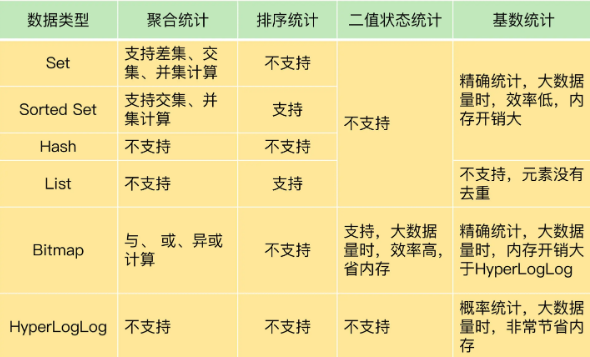
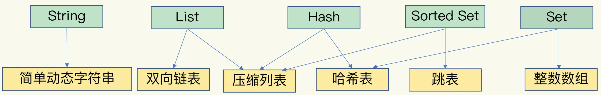
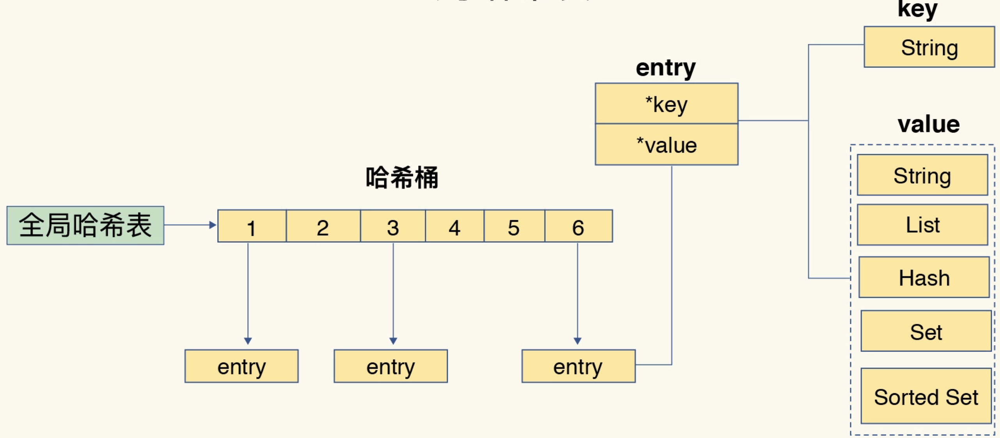
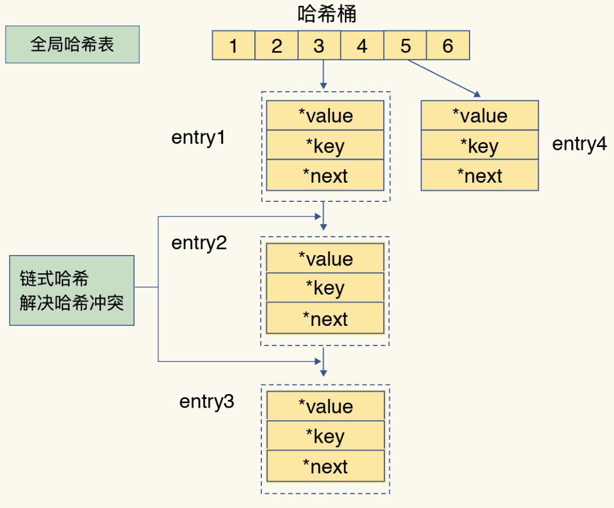
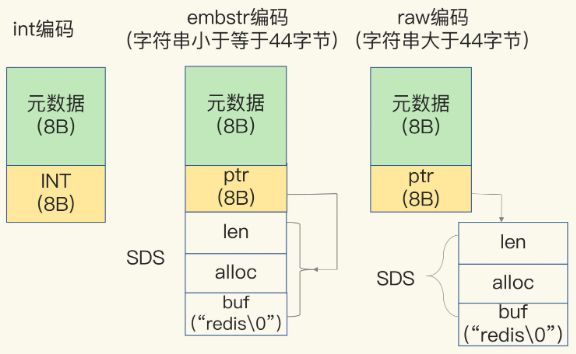

# 一、Redis 基本知识

## 1、Redis

是一个开源，先进的key-value存储，并用于构建高性能，可扩展的Web应用程序的完美解决方案数据结构服务器，支持不同类型的值，高级键值（key-value）缓存 （cache）和存储 （store）系统为了高性能采用内存（in-memory）数据集（dataset）

redis为了达到最快的读写速度，将数据都读到内存中，并通过异步的方式将数据写入磁盘。如果不将数据放在内存中，磁盘IO速度会严重影响redis的性能

Redis是基于CAP的

### 1.1、特点

- Redis 数据库完全在内存中，使用磁盘仅用于数据持久化；
- 相比许多键值数据存储，Redis 拥有一套较为丰富的数据类型；
- Redis 可以将数据复制到任意数量的从服务器；

### 1.2、优点

- 异常快速：Redis的速度非常快，每秒能执行约11万集合，每秒约81000+条记录
- 支持丰富的数据类型：Redis 支持最大多数开发人员已经知道像列表，集合，有序集合，散列数据类型
- 操作都是原子性：所有 Redis 操作是原子的，这保证了如果两个客户端同时访问的 Redis 服务器将获得更新后的值；
- 多功能实用工具：Redis 是一个多实用的工具，可以在多个用例如缓存，消息，队列使用(Redis 原生支持发布/订阅)，任何短暂的数据，应用程序，如Web应用程序会话，网页命中计数等

### 1.3、启动

redis-server redis.conf
```
运行：redis-cli
	127.0.0.1：6379> 127.0.0.1是本机的IP地址，6379为Redis服务器运行的端口
redis 127.0.0.1：6379> ping
PONG > 表示成功地安装Redis在您的机器上
```

停止redis：`src/redis-cli shutdown`，或者可以如此：`src/redis-cli -h 192.168.89.135 -p 6378 shutdown`

### 1.4、使用场景

[Redis使用场景一览](https://juejin.cn/post/6989108481018036232)
- 缓存：将热点数据放到内存中
- 消息队列：List类型是双向链表，很适合用于消息队列；
- 计数器：Redis支持计数器频繁的读写操作
- 好友关系：使用 Set 类型的交集操作很容易就可以知道两个用户的共同好友
- 分布式锁：
- 分布式全局唯一ID：
- 点赞排行

## 2、Redis配置文件

redis.conf常用配置介绍
- `daemonize no`：Redis 默认不是以守护进程的方式运行，可以通过该配置项修改，使用yes启用守护进程
- `pidfile /var/run/redis.pid`：当Redis以守护进程方式运行时，Redis默认会把pid写入`/var/run/redis.pid`文件，可以通过pidfile指定
- `port 6379`：指定Redis监听端口，默认端口为6379，作者在自己的一篇博文中解释了为什么选用6379作为默认端口，因为6379在手机按键上MERZ对应的号码，而MERZ取自意大利歌女Alessia Merz的名字
- `bind 127.0.0.1`：绑定的主机地址
- `timeout 300`：当客户端闲置多长时间后关闭连接，如果指定为0，表示关闭该功能
- `loglevel verbose`：指定日志记录级别，Redis总共支持四个级别：debug、verbose、notice、warning，默认为verbose
- `logfile stdout`：日志记录方式，默认为标准输出，如果配置Redis为守护进程方式运行，而这里又配置为日志记录方式为标准输出，则日志将会发送给/dev/null
- `databases 16`：设置数据库的数量，默认数据库为0，可以使用`SELECT <dbid>`命令在连接上指定数据库id
- `save <seconds> <changes>`	
	指定在多长时间内，有多少次更新操作，就将数据同步到数据文件，可以多个条件配合；Redis默认配置文件中提供了三个条件：<br>
	`save 900 1`<br>
	`save 300 10`<br>
	`save 60 10000`<br>
	分别表示900秒（15分钟）内有1个更改，300秒（5分钟）内有10个更改以及60秒内有10000个更改。
- `rdbcompression yes`：指定存储至本地数据库时是否压缩数据，默认为yes，Redis采用LZF压缩，如果为了节省CPU时间，可以关闭该选项，但会导致数据库文件变的巨大
- `dbfilename dump.rdb`：指定本地数据库文件名，默认值为dump.rdb
- `dir ./`：指定本地数据库存放目录
- `slaveof <masterip> <masterport>`：设置当本机为slav服务时，设置master服务的IP地址及端口，在Redis启动时，它会自动从master进行数据同步
- `masterauth <master-password>`：当master服务设置了密码保护时，slav服务连接master的密码
- `requirepass foobared`：设置Redis连接密码，如果配置了连接密码，客户端在连接Redis时需要通过`AUTH <password>`命令提供密码，默认关闭
- `maxclients 128`：设置同一时间最大客户端连接数，默认无限制，Redis可以同时打开的客户端连接数为Redis进程可以打开的最大文件描述符数，如果设置 maxclients 0，表示不作限制。当客户端连接数到达限制时，Redis会关闭新的连接并向客户端返回max number of clients reached错误信息
- `maxmemory <bytes>`：指定Redis最大内存限制，Redis在启动时会把数据加载到内存中，达到最大内存后，Redis会先尝试清除已到期或即将到期的Key，当此方法处理 后，仍然到达最大内存设置，将无法再进行写入操作，但仍然可以进行读取操作。Redis新的vm机制，会把Key存放内存，Value会存放在swap区
	```
	(1)volatile-lru：使用LRU算法移除key，只对设置了过期时间的键
	(2)allkeys-lru：使用LRU算法移除key
	(3)volatile-random：在过期集合中移除随机的key，只对设置了过期时间的键
	(4)allkeys-random：移除随机的key
	(5)volatile-ttl：移除那些TTL值最小的key，即那些最近要过期的key
	(6)noeviction：不进行移除。针对写操作，只是返回错误信息
	```
- `appendonly no`：指定是否在每次更新操作后进行日志记录，Redis在默认情况下是异步的把数据写入磁盘，如果不开启，可能会在断电时导致一段时间内的数据丢失。因为 redis本身同步数据文件是按上面save条件来同步的，所以有的数据会在一段时间内只存在于内存中。默认为no，开启AOF持久化
- `appendfilename appendonly.aof`：指定更新日志文件名，默认为`appendonly.aof`
- `appendfsync everysec`：指定更新日志条件，共有3个可选值：
	- `no`：表示等操作系统进行数据缓存同步到磁盘（快）
	- `always`：表示每次更新操作后手动调用fsync()将数据写到磁盘（慢，安全）
	- `everysec`：表示每秒同步一次（折衷，默认值）
- `vm-enabled no`：指定是否启用虚拟内存机制，默认值为no，简单的介绍一下，VM机制将数据分页存放，由Redis将访问量较少的页即冷数据swap到磁盘上，访问多的页面由磁盘自动换出到内存中（在后面的文章我会仔细分析Redis的VM机制）
- `vm-swap-file /tmp/redis.swap`：虚拟内存文件路径，默认值为`/tmp/redis.swap`，不可多个Redis实例共享
- `vm-max-memory 0`：将所有大于vm-max-memory的数据存入虚拟内存，无论vm-max-memory设置多小，所有索引数据都是内存存储的（Redis的索引数据 就是keys），也就是说，当vm-max-memory设置为0的时候，其实是所有value都存在于磁盘。默认值为0
- `vm-page-size 32`：Redis swap文件分成了很多的page，一个对象可以保存在多个page上面，但一个page上不能被多个对象共享，vm-page-size是要根据存储的 数据大小来设定的，作者建议如果存储很多小对象，page大小最好设置为32或者64bytes；如果存储很大大对象，则可以使用更大的page，如果不 确定，就使用默认值
- `vm-pages 134217728`：设置swap文件中的page数量，由于页表（一种表示页面空闲或使用的bitmap）是在放在内存中的，，在磁盘上每8个pages将消耗1byte的内存。
- `vm-max-threads 4`：设置访问swap文件的线程数，最好不要超过机器的核数，如果设置为0，那么所有对swap文件的操作都是串行的，可能会造成比较长时间的延迟。默认值为4
- `glueoutputbuf yes`：设置在向客户端应答时，是否把较小的包合并为一个包发送，默认为开启
- `hash-max-zipmap-entries 64、hash-max-zipmap-value 512`：指定在超过一定的数量或者最大的元素超过某一临界值时，采用一种特殊的哈希算法
- `activerehashing yes`：指定是否激活重置哈希，默认为开启（后面在介绍Redis的哈希算法时具体介绍）
- `include /path/to/local.conf`：指定包含其它的配置文件，可以在同一主机上多个Redis实例之间使用同一份配置文件，而同时各个实例又拥有自己的特定配置文件

## 3、关于键值

- [Keyspace](https://redis.io/docs/latest/develop/use/keyspace/)

Redis的键值是二进制安全的，可以用任何二进制序列作为key值

Redis keys命令使用语法如下所示
```
127.0.0.1：6379> COMMAND KEY_NAME
```
关于key的几条规则
- 太长的键值不是个好主意，例如1024字节的键值就不是个好主意，不仅因为消耗内存，而且在数据中查找这类键值的计算成本很高。如果有一个非常大的值需要验证其存在性，直接存储大值作为键是非常低效的。相比之下，可以将大值进行哈希运算（如使用 SHA1），得到一个固定长度的哈希值作为键。这种方法不仅减少了内存占用，也减少了网络传输时的带宽消耗，因为键变得更小且具有固定长度；
- 太短的键值通常也不是好主意，如果你要用"u:1000:pwd"来代替"user:1000:password"，这没有什么问题，但后者更易阅读，并且由此增加的空间消耗相对于key object和value object本身来说很小。
- 最好坚持一种模式，例如："object-type:id:field"就是个不错的注意，像这样"user:1000:password"，或者"comment:1234:reply.to" 或者 "comment:1234:reply-to"
- 键值最大值为 512MB

关于键值的字节长度计算：
- ASCII 字符：每个 ASCII 字符占用 1 个字节。常见的英文字母、数字、标点符号等都属于 ASCII 字符。例如，键 "user:1000:followers" 由 19 个 ASCII 字符组成，因此占用 19 个字节。
- 非 ASCII 字符：如果键包含非 ASCII 字符（如中文、特殊符号等），这些字符通常是以 UTF-8 编码存储的，可能会占用 2 到 4 个字节，具体取决于字符的编码方式。例如，键 "用户:1000:关注者" 中的每个中文字符通常占 3 个字节。此键共包含 7 个字符，其中 4 个中文字符各占 3 个字节，数字和标点占 1 个字节，因此总大小为 $4 × 3 + 5 × 1 = 17$ 个字节
```java
String key = "用户:1000:关注者";
int size = key.getBytes("UTF-8").length;
System.out.println("Key size in bytes: " + size);
```

**为什么过大的键值会对内存有影响？**

在 Redis 中，键和值都是以对象的形式存储的，具体是使用一种称为 redisObject 的结构来表示。redisObject 包含了以下内容：
- 对象类型：标识键或值的类型（例如字符串、列表、哈希等）。
- 编码类型：Redis 支持多种编码方式来存储相同类型的数据（例如字符串可以用 raw 或 embstr 编码）。
- 实际数据：键或值的实际数据存储在这个对象中。

每个键都是一个字符串（SDS：Simple Dynamic String）。字符串的长度越大，Redis 需要更多的内存来存储这个键。

*元数据开销*：Redis 在存储每个键时，除了存储键本身的数据，还会有额外的元数据开销。每个键值对（entry）都需要额外的内存来存储以下信息：
- 哈希表指针：Redis 使用哈希表（hash table）存储键值对。每个哈希表条目都包含指向键和值对象的指针。这些指针会占用额外的内存。
- 内存分配对齐：Redis 内部使用 jemalloc 作为默认的内存分配器。jemalloc 会根据数据大小对内存进行分配，通常分配的内存块比实际存储的数据稍大，因此会有一定的内存浪费。

# 二、数据类型

## 1、String

### 1.1、概述

- Redis String是二进制安全的，这意味着他们有一个已知的长度没有任何特殊字符终止，所以你可以存储任何东西，`512M`为上限，如一张图片等；
- 使用场景：
	- ①、使用 `INC`R 命令族（INCR，DECR，INCRBY），将字符串作为原子计数器
	- ②、使用 `APPEND` 命令追加字符串
	- ③、使用 `GETRANGE` 和 `SETRANGE` 命令，使字符串作为随机访问向量（vectors）
	- ④、编码大量数据到很小的空间，或者使用 `GETBIT` 和 `SETBIT` 命令，创建一个基于 Redis 的布隆 (Bloom) 过滤器
- String 类型并不是适用于所有场合的，它有一个明显的短板，就是它保存数据时所消耗的内存空间较多。

### 1.2、常用命令

- `get/set/del`：查询/设置/删除
- `set rekey data`：设置已经存在的key，会覆盖
- `setnx rekey data`：设置已经存在的key，不会覆盖，如果键值已经存在，则执行失败：`SET mykey newval nx`
- `set key value ex time`：设置带过期时间的数据
- `expire key`：设置过期时间
- `ttl`：查看剩余时间，-1永不过期，-2过期
- `append key`：合并字符串
- `strlen key`：字符串长度
- `incr key`：累加1
- `decr key`：类减1
- `incrby key num`：累加给定数值
- `decrby key num`：累减给定数值
- `getrange key start end`：截取数据，end=-1 代表到最后
- `setrange key start newdata`：从start位置开始替换数据
- `mset`：连续设值
- `mget`：连续取值
- `msetnx`：连续设置，如果存在则不设置
- `select index`：切换数据库，总共默认16个
- `flushdb`：删除当前下边db中的数据（不建议使用）
- `flushall`：删除所有db中的数据（不建议使用）

例子：
```
127.0.0.1：6379> set name "coco"
OK
127.0.0.1：6379> get name
"coco"
```

### 1.3、适用场景

- **缓存**： 经典使用场景，把常用信息，字符串，图片或者视频等信息放到redis中，redis作为缓存层，mysql做持久化层，降低mysql的读写压力。
- **计数器**：redis是单线程模型，一个命令执行完才会执行下一个，同时数据可以一步落地到其他的数据源。
- **session**：常见方案spring session + redis实现session共享，

Redis 中的普通 string 采用 raw encoding 即原始编码方式，该编码方式会动态扩容，并通过提前预分配冗余空间，来减少内存频繁分配的开销。在字符串长度小于 1MB 时，按所需长度的 2 倍来分配，超过 1MB，则按照每次额外增加 1MB 的容量来预分配

## 2、Hash

- Redis 的哈希是键值对的集合。Redis 的哈希值是字符串字段和字符串值之间的映射，因此它们被用来表示对象
- 例子
```
127.0.0.1：6379> hmset user:1000 username bluefish password 123 port 8080
OK
127.0.0.1：6379> hgetall user：1
1) "username"
2) "coco"
3) "password"
4) "coco"
5) "points"
6) "200"
```
- 使用场景：由于哈希主要用来表示对象，对象能存储很多元素，能直观，相比string更节省空间，的维护缓存信息，如用户信息，视频信息、购物车信息等；
- 散列表（是说散列表里面存储的数少）使用的内存非常小，所以应该尽可能的将数据模型抽象到一个散列表里面；
- 每个哈希可以存储多达 `2^32-1` 个字段值对 (field-value pair)(多于 40 亿个)；
- 需要注意，Redis提供了接口(hgetall)可以直接取到全部的属性数据，但是如果内部Map的成员很多，那么涉及到遍历整个内部Map的操作，由于Redis单线程模型的缘故，这个遍历操作可能会比较耗时，而另其它客户端的请求完全不响应，这点需要格外注意；


**常用命令：**
- `hset key property value`：`hset user name test` 创建一个user对象，这个对象中包含name属性，name值为test
- `hget user name`：获得用户对象中name的值
- `hmset`：设置对象中的多个键值对
	- `hset user age 18 phone 139123123`
	- `hmsetnx`：设置对象中的多个键值对，存在则不添加
	- `hset user age 18 phone 139123123`
- `hmget`：获得对象中的多个属性, `hmget user age phone`
- `hgetall user`：获得整个对象的内容
	```
	127.0.0.1:6379> hgetall user
	1) "name"
	2) "test"
	3) "age"
	4) "18"
	5) "sex"
	6) "gender"
	7) "phone"
	8) "18955555555"
	```
- `hincrby user age 2`：累加属性
- `hincrbyfloat user age 2.2`：累加属性
- `hlen user`：有多少个属性
- `hexists user field`：判断某个属性是否存在
- `hkeys user`：获得所有属性
- `hvals user`：获得所有值
- `hdel user field`：删除对象的属性，可以删除多个或者一个

## 3、List

- Redis 的列表是简单的字符串列表，是`按照插入顺序排序`的字符串列表，您可以添加元素到 Redis 的列表的头部或尾部，表的最大长度为 `2^32 - 1` 元素（4294967295，每个列表中可容纳超过四十亿的元素）
- 例子：
```
127.0.0.1：6379> lpush tutorial redis
(integer) 1
127.0.0.1：6379> lpush tutorial mongodb
(integer) 2
127.0.0.1：6379> lpush tutorial rabitmq
(integer) 3
127.0.0.1：6379> lrange tutorial 0 10
1) "rabitmq"
2) "mongodb"
3) "redis"
```
- `LPUSH` 命令插入一个新元素到列表头部，而 `RPUSH` 命令插入一个新元素到列表的尾部，当这两个命令操作在一个不存在的键时，将会创建一个新的列表
- 从时间复杂度的角度来看，Redis 列表主要特性就是`支持时间常数的插入和靠近头尾部元素的删除`，即使是需要插入上百万的条目访问列表两端的元素是非常快的，但如果你试着访问一个非常大的列表的中间元素仍然是十分慢的；
- 使用场景：
	- ①、为社交网络时间轴 (timeline) 建模，使用 `LPUSH` 命令往用户时间轴插入元素，使用 LRANGE 命令获得最近事项；
	- ②、使用 `LPUSH` 和 LTRIM 命令创建一个不会超出给定数量元素的列表，只存储最近的 N 个元素；
	- ③、列表可以用作消息传递原语，例如，众所周知的用于创建后台任务的 Ruby 库 Resque；
	- ④、你可以用列表做更多的事情，这种数据类型支持很多的命令，包括阻塞命令，如 BLPOP

**常用命令：**
- `lpush userList 1 2 3 4 5`：构建一个list，从左边开始存入数据
- `rpush userList 1 2 3 4 5`：构建一个list，从右边开始存入数据
- `lrange list start end`：获得数据
- `lpop`：从左侧开始拿出一个数据
- `rpop`：从右侧开始拿出一个数据
- `llen list`：list长度
- `lindex list index`：获取list下标的值
- `lset list index value`：把某个下标的值替换
- `linsert list before/after value`：插入一个新的值
- `lrem list num value`：删除几个相同数据
- `ltrim list start end`：截取值，替换原来的list

## 4、Set

- Redis 的集合是字符串的无序集合。在Redis您可以添加，删除和测试文件是否存在，在成员 O(1)的时间复杂度；Set是一个特殊的value为空的Hash
- 一个集合最多可以包含 2^32-1个元素（4294967295，每个集合超过40亿个元素）
```
127.0.0.1：6379> sadd tutoriallist redis
(integer) 1
127.0.0.1：6379> sadd tutoriallist mongodb
(integer) 1
127.0.0.1：6379> sadd tutoriallist rabitmq
(integer) 1
127.0.0.1：6379> sadd tutoriallist rabitmq
(integer) 0
127.0.0.1：6379> smembers tutoriallist
1) "rabitmq"
2) "mongodb"
3) "redis"
```
- 使用场景：
	- ①、你可以使用 Redis 集合追踪唯一性的事情，访问某篇博客文章的所有唯一 IP
	- ②、用户标签、点赞、收藏、踩等等；
	- ③、你可以使用 `SPOP` 或 `SRANDMEMBER` 命令来从集合中随机抽取元素；
	- 集合类型有非常节省内存空间的底层实现结构
- `sdiff set1 set2`：存在于set1中但是不存在set2中的数据，差集；
- `SINTERSTORE` 将结果保存到 destination 集合，而不是简单地返回结果集
- `sinter set1 set2`：两个set的交集；
- `sunion set1 set2`：两个集合的并集；

## 5、Sorted Set

- Redis 的有序集合类似于 Redis 的集合，字符串不重复的集合；不同的是，一个有序集合的每个成员用分数，以便采取有序set命令，从最小的到最大的成员分数有关
- 使用有序集合，你可以非常快地(O(log(N)))完成添加，删除和更新元素的操作由于元素是有序的而无需事后排序，你可以通过分数或者排名 (位置) 很快地来获取一个范围内的元素；
- 使用场景：
	- ①、获取排行：例如多人在线游戏排行榜，每次提交一个新的分数，你就使用 ZADD 命令更新
	- ②、有序集合常用来索引存储在 Redis 内的数据
	- ③、有序集合或许是最高级的 Redis 数据类型

**常用命令：**
- `zadd zset 10 value1 20 value2 30 value3`：设置member和对应的分数
- `zrange zset 0 -1`：查看所有zset中的内容；
- `zrange zset 0 -1 withscores`：带有分数
- `zrank zset value`：获得对应的下标
- `zscore zset value`：获得对应的分数
- `zcard zset`：统计个数
- `zcount zset` 分数1 分数2：统计个数
- `zrangebyscore zset` 分数1 分数2：查询分数之间的member(包含分数1 分数2)
- `zrangebyscore zset (分数1 (分数2`：查询分数之间的member（不包含分数1 和 分数2）
- `zrangebyscore zset 分数1 分数2 limit start end`：查询分数之间的member(包含分数1 分数2)，获得的结果集再次根据下标区间做查询
- `zrem zset value`：删除member

总结：
- 默认升序排列，即通过命令`ZRANGE`实现；如果要按照降序排列，需要通过命令`ZREVRANGE`实现；
- 当score即得分一样时，按照字典顺序对member进行排序，字典排序用的是二进制，它比较的是字符串的字节数组，所以实际上是比较ASCII码；

Sorted Set默认情况下只能根据一个因子score进行排序。如此一来，局限性就很大，举个栗子：热门排行榜需要按照下载量&最近更新时间排序，即类似数据库中的ORDER BY download_count, update_time DESC。那这样的需求如果用Redis的Sorted Set实现呢？事实上很简单，思路就是将涉及排序的多个维度的列通过一定的方式转换成一个特殊的列，即result = function(x, y, z)，即x，y，z是三个排序因子，例如下载量、时间等，通过自定义函数function()计算得到result，将result作为Sorted Set中的score的值，就能实现任意维度的排序需求了；

## 6、位图-bitmap

- [Redis位图操作](https://juejin.im/post/6844903561839525902)

通过一个bit位来表示某个元素对应的值或者状态，其中的key就是对应元素本身；本身不是一种数据结构，实际上它就是字符串（key 对应的 value 就是上图中最后的一串二进制），但是它可以对字符串的位进行操作；可以把 Bitmaps 想象成一个以 位 为单位的数组，数组的每个单元只能存储 0 和 1，数组的下标在Bitmaps中叫做偏移量

其提供了SETBIT、GETBIT、BITCOUNT、BITTOP四个命令用于操作二进制位数组

### 6.1、SETBIT

语法：`SETBIT key offset value`

说明：
- 对 key 所储存的字符串值，设置或清除指定偏移量上的`位(bit)`；
- 位的设置或清除取决于 value 参数，可以是 0 也可以是 1；
- 当 key 不存在时，自动生成一个新的字符串值；
- 字符串会进行伸展(grown)以确保它可以将 value 保存在指定的偏移量上。当字符串值进行伸展时，空白位置以 0 填充；
- offset 参数必须大于或等于 0 ，小于`2^32 (bit 映射被限制在 512 MB 之内)`

返回值：字符串值指定偏移量上原来储存的位(bit)

示例：
```bash
127.0.0.1:6379> SETBIT testBit 125 1
(integer) 0
127.0.0.1:6379> SETBIT testBit 125 0
(integer) 1
127.0.0.1:6379> SETBIT testBit 125 1
(integer) 0
```

### 6.2、GETBIT

语法：`GETBIT key offset`

说明：
- 对 key 所储存的字符串值，获取指定偏移量上的`位(bit)`。
- 当 offset 比字符串值的长度大，或者 key 不存在时，返回 0；

返回值：字符串值指定偏移量上的位(bit)

示例：
```
127.0.0.1:6379> SETBIT testBit 125 1
(integer) 1
127.0.0.1:6379> GETBIT testBit 125
(integer) 1
127.0.0.1:6379> GETBIT testBit 126
(integer) 0
```

### 6.3、获取Bitmaps 指定范围值为 1 的位个数

语法：`BITCOUNT key start`

说明：
- 计算给定字符串中，被设置为 1 的比特位的数量；
- 一般情况下，给定的整个字符串都会被进行计数，通过指定额外的 start 或 end 参数；注意这里的 start、end 表示的是`字节偏移量`
- start 和 end 参数的设置和 GETRANGE 命令类似，都可以使用负数值： 比如 -1 表示最后一个字节， -2表示倒数第二个字节，以此类推；
- 不存在的 key 被当成是空字符串来处理，因此对一个不存在的 key 进行 BITCOUNT 操作，结果为 0；

返回值：被设置为 1 的位的数量

示例：
```
127.0.0.1:6379> SETBIT testBit 125 1
(integer) 1
127.0.0.1:6379> GETBIT testBit 125
(integer) 1
127.0.0.1:6379> BITCOUNT testBit
(integer) 1
127.0.0.1:6379> SETBIT testBit 126 1
(integer) 0
127.0.0.1:6379> BITCOUNT testBit
(integer) 2
127.0.0.1:6379> SETBIT testBit 127 1
(integer) 0
127.0.0.1:6379> BITCOUNT testBit
(integer) 3
127.0.0.1:6379> BITCOUNT testBit 10 125
(integer) 3
```

**注意：** setbit 和 getbit 使用的是位偏移量，而bitcount 使用的字节偏移量，释疑查看[bitcount start end Count is not correct #860](https://github.com/redis/redis/issues/860)
```
"setbit test1 10 1" means 00000000 00100000, so it is set in byte offset 1
"setbit test1 20 1" means 00000000 00100000 00001000, so it is set in byte offset 2
"setbit test1 30 1" means 00000000 00100000 00001000 00000010, so it is set in byte offset 3

"setbit test1 10 1" means setting 11th bit to 1( index is from 0 )
11th bit is in 2nd byte.
21th bit is in 3nd byte.
31th bit is in 4nd byte.

"bitcount start 1 end 10000" count from 2nd byte to 10001th byte. so it should return 3
"bitcount start 2 end 10000" count from 3nd byte to 10001th byte. so it should return 2
"bitcount start 3 end 10000" count from 2nd byte to 10001th byte. so it should return 1
```

### 6.4、多个 Bitmaps 运算

语法：`BITOP operation destkey key [key ...]`

说明：
- 对一个或多个保存二进制位的字符串 key 进行位元操作，并将结果保存到 destkey 上；
- operation 可以是 AND 、 OR 、 NOT 、 XOR 这四种操作中的任意一种：
	- `BITOP AND destkey key [key ...]` ，对一个或多个 key 求逻辑并，并将结果保存到 destkey 。
	- `BITOP OR destkey key [key ...]` ，对一个或多个 key 求逻辑或，并将结果保存到 destkey 。
	- `BITOP XOR destkey key [key ...]` ，对一个或多个 key 求逻辑异或，并将结果保存到 destkey。
	- `BITOP NOT destkey key` ，对给定 key 求逻辑非，并将结果保存到 destkey 。
- 除了 NOT 操作之外，其他操作都可以接受一个或多个 key 作为输入

处理不同长度的字符串：
- 当 BITOP 处理不同长度的字符串时，较短的那个字符串所缺少的部分会被看作 0 。
- 空的 key 也被看作是包含 0 的字符串序列；

返回值：保存到 destkey 的字符串的长度，和输入 key 中最长的字符串长度相等。

示例：
```sql
127.0.0.1:6379> SETBIT bits-1 0 1
(integer) 0
127.0.0.1:6379> SETBIT bits-1 3 1
(integer) 0
## bit-1    1001
127.0.0.1:6379> SETBIT bits-2 0 1
(integer) 0
127.0.0.1:6379> SETBIT bits-2 1 1
(integer) 0
127.0.0.1:6379> SETBIT bits-2 3 1
(integer) 0
## bit-2    1101

## bit-1 和 bit-2 做逻辑并运算
127.0.0.1:6379> BITOP AND and-result bits-1 bits-2
(integer) 1
127.0.0.1:6379> GETBIT and-result 0
(integer) 1
127.0.0.1:6379> GETBIT and-result 1
(integer) 0
127.0.0.1:6379> GETBIT and-result 2
(integer) 0
127.0.0.1:6379> GETBIT and-result 3
(integer) 1
# and-result   1001

## bit-1 和 bit-2 做逻辑或操作
127.0.0.1:6379> BITOP OR or-result bits-1 bits-2
(integer) 1
127.0.0.1:6379> GETBIT or-result 0
(integer) 1
127.0.0.1:6379> GETBIT or-result 1
(integer) 1
127.0.0.1:6379> GETBIT or-result 2
(integer) 0
127.0.0.1:6379> GETBIT or-result 3
(integer) 1
# or-result   1101

# not运算，只能有一个 key
127.0.0.1:6379> BITOP NOT not-result bits-1 bits-2
(error) ERR BITOP NOT must be called with a single source key.
127.0.0.1:6379> BITOP NOT not-result bits-1
(integer) 1
127.0.0.1:6379> GETBIT not-result 0
(integer) 0
127.0.0.1:6379> GETBIT not-result 1
(integer) 1
127.0.0.1:6379> GETBIT not-result 2
(integer) 1
127.0.0.1:6379> GETBIT not-result 3
(integer) 0
# not-result   0110

# 异或运算
127.0.0.1:6379> BITOP XOR xor-result bits-1 bits-2
(integer) 1
127.0.0.1:6379> GETBIT xor-result 0
(integer) 0
127.0.0.1:6379> GETBIT xor-result 1
(integer) 1
127.0.0.1:6379> GETBIT xor-result 2
(integer) 0
127.0.0.1:6379> GETBIT xor-result 3
(integer) 0
# xor-result   0100
```

注意：BITOP 的复杂度为 O(N) ，当处理大型矩阵(matrix)或者进行大数据量的统计时，最好将任务指派到附属节点(slave)进行，避免阻塞主节点；

### 6.5、计算Bitmaps中第一个值为 bit 的偏移量

**BITPOS**

语法：`BITPOS key bit [start][end]`

说明：
- 返回字符串里面第一个被设置为 1 或者 0 的bit位；
- 返回一个位置，把字符串当做一个从左到右的字节数组；
- 默认情况下整个字符串都会被检索一次，只有在指定 start 和 end 参数(指定start和end位是可行的)，该范围被解释为一个字节的范围，而不是一系列的位。所以start=0 并且 end=2是指前三个字节范围内查找；
- 不存在的key将会被当做空字符串来处理

返回值：
- 命令返回字符串里面第一个被设置为 1 或者 0 的 bit 位
- 如果我们在空字符串或者 0 字节的字符串里面查找 bit 为1的内容，那么结果将返回-1；
- 如果你用指定 start 和 end 范围进行查找指定值时，如果该范围内没有对应值，结果将返回 -1；

示例：
```
127.0.0.1:6379> SETBIT bits 3 1
(integer) 0
127.0.0.1:6379> BITPOS bits 1
(integer) 3
127.0.0.1:6379> BITPOS bits 0
(integer) 0
```

**BITFIELD**

语法：`BITFIELD key [GET type offset][SET type offset value][INCRBY type offset increment][OVERFLOW WRAP|SAT|FAIL]`

说明：
- BITFIELD 命令可以在一次调用中同时对多个位范围进行操作：它接受一系列待执行的操作作为参数， 并返回一个数组作为回复， 数组中的每个元素就是对应操作的执行结果

### 6.7、存储空间计算

比如有10亿的数据，那么它需要的字节数组：`1000000000÷8÷1024÷1024≈119.21MB`

也就是存储10亿的数据只需要119MB左右的内存空间，这对于现在16G、32G集群版的redis，完全没有问题。

需要注意的是，如果你的数据量不大，那就不要把起始偏移量搞的很大，这样也是占空间的，比如我们只需要存储几百条数据，但是其中的偏移量却很大，这就会造成了很大的内存空间浪费

### 6.8、使用场景

**用户签到**：每天的日期字符串作为一个key，用户Id作为offset，统计每天用户的签到情况，总的用户签到数

**统计活跃用户数**：用户日活、月活、留存率等均可以用redis位数组来存储，还是以每天的日期作为key，用户活跃了就写入offset为用户id的位值1

**用户是否在线以及总在线人数统计**：同样是使用一个位数组，用户的id映射偏移量，在线标识为1，下线标识为0。即可实现用户上下线查询和总在线人数的统计

**APP内用户的全局消息提示小红点**：现在大多数的APP里都有站内信的功能，当有消息的时候，则提示一个小红点，代表用户有新的消息

### 6.9、注意事项

Redis BitMap 的底层数据结构实际上是 String 类型，Redis 对于 String 类型有最大值限制不得超过 512M，即 `2^32 次方 byte`；

所以如果 offset 偏移量超过了 `2^32` 次方，会报错`ERR bit offset is not an integer or out of range`

## 7、HyperLogLog

- [hyperloglog结构的实现原理](https://www.zhihu.com/question/53416615)
- [HyperLogLog维基百科](https://en.wikipedia.org/wiki/HyperLogLog)

Redis 的 hyperLogLog 是用来做基数统计的数据类型，当输入巨大数量的元素做统计时，只需要很小的内存即可完成。HyperLogLog 不保存元数据，只记录待统计元素的估算数量，这个估算数量是一个带有 0.81% 标准差的近似值，在大多数业务场景，对海量数据，不足 1% 的误差是可以接受的

每个 HyperLogLog 最多只需要花费 12KB 内存就可以计算 2 的 64 次方个元素的基数；Redis 对 HyperLogLog 的存储进行了优化，在计数比较小的时候，存储空间采用系数矩阵，占用空间很小。只有在计数很大，稀疏矩阵占用的空间超过了阈值才会转变成稠密矩阵，占用 12KB 空间；

主要操作命令：
```bash
# 将访问页面的每个用户 ID 添加到 HyperLogLog 中
PFADD page1:uv userId1 userId2 userId3
# 利用 PFCOUNT 获取 「page1」页面的 UV值
PFCOUNT page1:uv
```
PFMERGE 使用场景：
- HyperLogLog 除了上面的 PFADD 和 PFCOIUNT 外，还提供了 PFMERGE ，将多个 HyperLogLog  合并在一起形成一个新的 HyperLogLog 值，基本语法：`PFMERGE destkey sourcekey [sourcekey ...]`
- 主要使用是在需要对页面UV需要合并统计时，也就是同样的用户访问这两个页面则只算做一次
```
PFADD page1 user1 user2 user3
PFADD page2 user1 user2 user4
PFMERGE page page1 page2
PFCOUNT page // 返回值 = 4
```

## 8、GEO地理类型

- [GEO](https://juejin.cn/post/6982466335670272036)

主要是基于位置信息服务（Location-Based Service，LBS）的应用，一般使用场景是附近的人，其核心思想如下：
- 以 “我” 为中心，搜索附近的 Ta；
- 以 “我” 当前的地理位置为准，计算出别人和 “我” 之间的距离；
- 按 “我” 与别人距离的远近排序，筛选出离我最近的用户；

GEO常用命令：

`GEOADD 命令`：用于把一组经纬度信息和相对应的一个 ID 记录到 GEO 类型集合中；
```bash
# 假设车辆 ID 是 33，经纬度位置是（116.034579，39.030452），可以用一个 GEO 集合保存所有车辆的经纬度，集合 key 是 cars:locations
GEOADD cars:locations 116.034579 39.030452 33
```
`GEORADIUS 命令`：会根据输入的经纬度位置，查找以这个经纬度为中心的一定范围内的其他元素。当然，我们可以自己定义这个范围
```bash
# Redis 会根据输入的用户的经纬度信息（116.054579，39.030452 ），查找以这个经纬度为中心的 5 公里内的车辆信息，并返回给 LBS 应用。可以修改“5”这个参数，来返回更大或更小范围内的车辆信息
GEORADIUS cars:locations 116.054579 39.030452 5 km ASC COUNT 10
```

GEO 类型的底层数据结构用 Sorted Set 来实现的；

为了能高效地对经纬度进行比较，Redis 采用了业界广泛使用的 GeoHash 编码方法，这个方法的基本原理就是“二分区间，区间编码”，当要对一组经纬度进行 GeoHash 编码时，我们要先对经度和纬度分别编码，然后再把经纬度各自的编码组合成一个最终编码。

## 9、数据类型总结

Redis在互联网公司一般有以下应用：
- String：缓存、限流、计数器、分布式锁、分布式Session
- Hash：存储用户信息、用户主页访问量、组合查询
- List：微博关注人时间轴列表、简单队列
- Set：赞、踩、标签、好友关系
- Zset：排行榜



## 10、自定义数据类型

Redis 的基本对象结构 RedisObject，因为 Redis 键值对中的每一个值都是用 RedisObject 保存的。RedisObject 包括元数据和指针。其中，元数据的一个功能就是用来区分不同的数据类型，指针用来指向具体的数据类型的值

### 10.1、Redis 的基本对象结构

RedisObject 的内部组成包括了 type、encoding、lru 和 refcount 4 个元数据，以及 1 个`*ptr指针`。
- `type`：表示值的类型，涵盖了五大基本类型；
- `encoding`：是值的编码方式，用来表示 Redis 中实现各个基本类型的底层数据结构，例如 SDS、压缩列表、哈希表、跳表等；
- `lru`：记录了这个对象最后一次被访问的时间，用于淘汰过期的键值对；
- `refcount`：记录了对象的引用计数；
- `*ptr`：是指向数据的指针。

RedisObject 结构借助`*ptr`指针，就可以指向不同的数据类型，例如，`*ptr`指向一个 SDS 或一个跳表，就表示键值对中的值是 String 类型或 Sorted Set 类型。所以，在定义了新的数据类型后，也只要在 RedisObject 中设置好新类型的 type 和 encoding，再用`*ptr`指向新类型的实现，就行了

### 10.2、自定义数据类型实现步骤

- （1）新数据类型定义好它的底层结构、type 和 encoding 属性值
- （2）再实现新数据类型的创建、释放函数和基本命令。

# 三、Redis底层数据结构

- [Redis数据结构](https://pdai.tech/md/db/nosql-redis/db-redis-x-redis-ds.html)
- [Redis高级数据结构](https://mp.weixin.qq.com/s/GLqZf-0sLQ7nnJ8Xb9oVZQ)
- [Redis数据结构](https://mp.weixin.qq.com/s/69xl2yU4B97aQIn1k_Lwqw)
- [Redis数据结构-SkipList](https://juejin.im/post/57fa935b0e3dd90057c50fbc)
- [Redis内存数据结构](https://mp.weixin.qq.com/s/DpNzFRUMwtz0-YY0gdQGgA)
- [Redis基本数据类型与底层原理](https://mp.weixin.qq.com/s/ipP35Zho9STAgu_lFT79rQ)

底层数据结构一共有 6 种，分别是简单动态字符串、双向链表、压缩列表、哈希表、跳表和整数数组；



## 1、键和值的组织结构

Redis 整体就是一个全局哈希表来保存所有的键值对，哈希表，本质就是一个数组，每个元素被叫做哈希桶，不管什么数据类型，每个桶里面的 entry 保存着实际具体值的指针；而哈希表的时间复杂度是 O(1)，只需要计算每个键的哈希值，便知道对应的哈希桶位置，定位桶里面的 entry 找到对应数据；



Redis 使用对象（redisObject）来表示数据库中的键值，当我们在 Redis 中创建一个键值对时，至少创建两个对象，一个对象是用做键值对的键对象，另一个是键值对的值对象。也就是每个 entry 保存着 「键值对」的 redisObject 对象，通过 redisObject 的指针找到对应数据。

为了实现从键到值的快速访问，Redis 使用了一个哈希表来保存所有键值对；Redis 使用对象（redisObject）来表示数据库中的键值，当我们在 Redis 中创建一个键值对时，至少创建两个对象，一个对象是用做键值对的键对象，另一个是键值对的值对象。也就是每个 entry 保存着 「键值对」的 redisObject 对象，通过 redisObject 的指针找到对应数据

哈希的查找过程主要依赖于哈希计算，和数据量的多少并没有直接关系。也就是说，不管哈希表里有 10 万个键还是 100 万个键，只需要一次计算就能找到相应的键，但是这里存在一个风险点：那就是哈希表的冲突问题和 rehash 可能带来的操作阻塞。

### 1.1、为什么哈希表操作变慢

Hash变慢可能就是：
- 哈希表的冲突问题
- rehash 可能带来的操作阻塞；

**hash冲突如何解决**

**哈希冲突**是指，两个 key 的哈希值和哈希桶计算对应关系时，正好落在了同一个哈希桶中

Redis 通过链式哈希解决冲突：同一个哈希桶中的多个元素用一个链表来保存，它们之间依次用指针连接。



如果哈希表里写入的数据越来越多，哈希冲突可能也会越来越多，这就会导致某些哈希冲突链过长，进而导致这个链上的元素查找耗时长，效率降低，所以，Redis 会对哈希表做 rehash 操作。rehash 也就是增加现有的哈希桶数量，让逐渐增多的 entry 元素能在更多的桶之间分散保存，减少单个桶中的元素数量，从而减少单个桶中的冲突

为了使 rehash 操作更高效，Redis 默认使用了两个全局哈希表：哈希表 1 和哈希表 2。一开始，当你刚插入数据时，默认使用哈希表 1，此时的哈希表 2 并没有被分配空间。随着数据逐步增多，Redis 开始执行 rehash，这个过程分为三步：
- 给`hash表-2`分配更大的空间；
- 将`hash表-1`的数据重新映射拷贝到`hash表-2`中；
- 释放`hash表-1`的空间。 

值得注意的是，将 `hash表-1` 的数据重新映射到 `hash表-2` 的过程中并不是一次性的，这样会造成 Redis 阻塞，无法提供服务。 而是采用了**渐进式 rehash**，每次处理客户端请求的时候，先从`hash表-1` 中第一个索引开始，将这个位置的 所有数据拷贝到`hash表-2` 中，就这样将 rehash 分散到多次请求过程中，避免耗时阻塞；在 rehash 被触发后，即使没有收到新请求，Redis 也会定时执行一次 rehash 操作，而且，每次执行时长不会超过 1ms，以免对其他任务造成影响

**rehash触发条件：**<br/>
满足下面任一条件都会触发哈希表扩容（装载因子的计算方式是，哈希表中所有 entry 的个数除以哈希表的哈希桶个数）
- 装载因子≥1，同时，哈希表被允许进行 rehash；
- 装载因子≥5。

如果装载因子等于 1，同时假设，所有键值对是平均分布在哈希表的各个桶中的，那么，此时，哈希表可以不用链式哈希，因为一个哈希桶正好保存了一个键值对；但是，如果此时再有新的数据写入，哈希表就要使用链式哈希了，这会对查询性能产生影响。在进行 RDB 生成和 AOF 重写时，哈希表的 rehash 是被禁止的，这是为了避免对 RDB 和 AOF 重写造成影响。如果此时，Redis 没有在生成 RDB 和重写 AOF，那么，就可以进行 rehash;

装载因子大于等于 5 时，就表明当前保存的数据量已经远远大于哈希桶的个数，哈希桶里会有大量的链式哈希存在，性能会受到严重影响，此时，就立马开始做 rehash;

> 如果装载因子小于 1，或者装载因子大于 1 但是小于 5，同时哈希表暂时不被允许进行 rehash（例如，实例正在生成 RDB 或者重写 AOF），此时，哈希表是不会进行 rehash 操作的。

## 2、字符串处理-SDS

Redis自己构建了一种名叫`Simple dynamic string(SDS)`的数据结构，它是一种二进制安全的，在大多数的情况下redis中的字符串都用SDS来存储
```c
struct sdshdr{
	//记录buf数组中已使用字节的数量
	//等于 SDS 保存字符串的长度
	int len;
	//记录 buf 数组中未使用字节的数量
	int free;
	//字节数组，用于保存字符串
	char buf[];
}
```
其优点：
- 时间复杂度为O(1)；
- 开发者不用担心字符串变更造成的内存溢出问题。
- 常数时间复杂度获取字符串长度len字段。
- 空间预分配free字段，会默认留够一定的空间防止多次重分配内存

Redis中的Bitsmap就是采用该数据结构来存储的

## 3、双向链表

Redis的链表在双向链表上扩展了头、尾节点、元素数等属性
```c
typedef  struct listNode{
	//前置节点
	struct listNode *prev;
	//后置节点
	struct listNode *next;
	//节点的值
	void *value;  
}
typedef struct list{
	//表头节点
	listNode *head;
	//表尾节点
	listNode *tail;
	//链表所包含的节点数量
	unsigned long len;
	//节点值复制函数
	void (*free) (void *ptr);
	//节点值释放函数
	void (*free) (void *ptr);
	//节点值对比函数
	int (*match) (void *ptr,void *key);
}list;
```
Redis的链表有这几个特点：
- 可以直接获得头、尾节点。
- 常数时间复杂度得到链表长度。
- 是双向链表

## 4、哈希表

Redis的Hash，就是在数组+链表的基础上，进行了一些rehash优化等

- Reids的Hash采用链地址法来处理冲突，然后它没有使用红黑树优化。
- 哈希表节点采用单链表结构。
- rehash优化；

## 5、跳表

### 5.1、特性

为了实现sorted set这种对外的数据结构，Redis里面使用skiplist。跳跃表在redis中用在有序集合键、集群节点内部数据结构

时间复杂度： $O(logN)$

### 5.2、实现

分为几个概念：
- 层（level）：层，也就是level[]字段，层的数量越多，访问节点速度越快。(因为它相当于是索引，层数越多，它索引就越细，就能很快找到索引值)
- 前进指针(forward)：层中有一个forward字段，用于从表头向表尾方向访问；
- 跨度(span)：用于记录两个节点之间的距离
- 后退指针(backward)：用于从表尾向表头方向访问。

### 5.3、跳表与平衡树

- 从内存占用上来说，skiplist比平衡树更灵活一些。一般来说，平衡树每个节点包含2个指针（分别指向左右子树），而skiplist每个节点包含的指针数目平均为1/(1-p)，具体取决于参数p的大小。如果像Redis里的实现一样，取p=1/4，那么平均每个节点包含1.33个指针，比平衡树更有优势；
- 对范围查找的支持：在做范围查找的时候，平衡树比skiplist操作要复杂；只需要在找到小值之后，对第1层链表进行若干步的遍历就可以实现
- 更容易实现：平衡树的插入和删除操作可能引发子树的调整，逻辑复杂，而skiplist的插入和删除只需要修改相邻节点的指针，操作简单又快速；
- 从算法实现难度上来比较，skiplist比平衡树要简单得多

## 6、整数数组

顺序读写，通过数组下标访问

为什么用数组：
- 内存利用率，数组和压缩列表都是非常紧凑的数据结构，它比链表占用的内存要更少。Redis是内存数据库，大量数据存到内存中，此时需要做尽可能的优化，提高内存的利用率。
- 数组对CPU高速缓存支持更友好，所以Redis在设计时，集合数据元素较少情况下，默认采用内存紧凑排列的方式存储，同时利用CPU高速缓存不会降低访问速度。当数据元素超过设定阈值后，避免查询时间复杂度太高，转为哈希和跳表数据结构存储，保证查询效率。

## 7、压缩列表(ziplist)

- [Redis Ziplist Best Practices](https://redis.io/glossary/redis-ziplist/)

ziplist是redis为了`节约内存`而开发的顺序型数据结构。压缩列表实际上类似于一个数组，数组中的每一个元素都对应保存一个数据。和数组不同的是，压缩列表在表头有三个字段 zlbytes、zltail 和 zllen，分别表示列表长度、列表尾的偏移量和列表中的 entry 个数；压缩列表在表尾还有一个 zlend，表示列表结束；

在压缩列表中，如果我们要查找定位第一个元素和最后一个元素，可以通过表头三个字段的长度直接定位，复杂度是 O(1)。而查找其他元素时，就没有这么高效了，只能逐个查找，此时的复杂度就是 $O(N)$ 了。

一个普通的双向链表，链表中每一项都占用独立的一块内存，各项之间用地址指针（或引用）连接起来。这种方式会带来大量的内存碎片，而且地址指针也会占用额外的内存。
压缩列表之所以能节省内存，就在于它是用一系列连续的 entry 保存数据。每个 entry 的元数据包括下面几部分。
- `prev_len`，表示前一个 entry 的长度。prev_len 有两种取值情况：1 字节或 5 字节。取值 1 字节时，表示上一个 entry 的长度小于 254 字节。虽然 1 字节的值能表示的数值范围是 0 到 255，但是压缩列表中 zlend 的取值默认是 255，因此，就默认用 255 表示整个压缩列表的结束，其他表示长度的地方就不能再用 255 这个值了。所以，当上一个 entry 长度小于 254 字节时，prev_len 取值为 1 字节，否则，就取值为 5 字节；
- `len`：表示自身长度，4 字节；
- `encoding`：表示编码方式，1 字节；
- `content`：保存实际数据；

这些 entry 会挨个儿放置在内存中，不需要再用额外的指针进行连接，这样就可以节省指针所占用的空间

**使用场景：** 它被用在列表键和哈希键中。一般用于小数据存储；List，Hash，Sorted Set三种对外结构，在特殊情况下的内部编码都是 `ziplist`，这样做的最大好处就是节省了 dictEntry 的开销;

以Hash为例，我们首先看一下什么条件下它的内部编码是ziplist：Hash 类型设置了用压缩列表保存数据时的两个阈值，一旦超过了阈值，Hash 类型就会用哈希表来保存数据了
- `hash-max-ziplist-entries`（默认512个）：表示用压缩列表保存时哈希集合中的最大元素个数。
- `hash-max-ziplist-value`（默认64个字节）：表示用压缩列表保存时哈希集合中单个元素的最大长度。

如果往 Hash 集合中写入的元素个数超过了 `hash-max-ziplist-entries`，或者写入的单个元素大小超过了 `hash-max-ziplist-value`，Redis 就会自动把 Hash 类型的实现结构由压缩列表转为哈希表。一旦从压缩列表转为了哈希表，Hash 类型就会一直用哈希表进行保存，而不会再转回压缩列表了。在节省内存空间方面，哈希表就没有压缩列表那么高效了。

如果是sorted set的话，同样需要满足两个条件：
- 元素个数小于 `zset-max-ziplist-entries` 配置，默认128；
- 所有值都小于 `zset-max-ziplist-value` 配置，默认64。

## 8、快速列表(quicklist)

一个由ziplist组成的双向链表。但是一个quicklist可以有多个quicklist节点，它很像B树的存储方式。是在redis3.2版本中新加的数据结构，用在列表的底层实现

# 四、深入理解

## 1、Redis-String

对于 String 类型来说，找到哈希桶就能直接增删改查了，所以，哈希表的 O(1) 操作复杂度也就是它的复杂度了

String 类型并不是适用于所有场合的，它有一个明显的短板，就是它保存数据时所消耗的内存空间较多

### 1.1、为什么String类型内存开销大

有这么个需求：快速地记录图片 ID 和图片在存储系统中保存时的 ID（可以直接叫作图片存储对象 ID）。同时，还要能够根据图片 ID 快速查找到图片存储对象 ID。因为图片数量巨大，所以就用 10 位数来表示图片 ID 和图片存储对象 ID，例如，图片 ID 为 1101000051，它在存储系统中对应的 ID 号是 3301000051，

如果保存了 1 亿张图片的信息，大约需要用约 6.4GB 的内存，一个图片 ID 和图片存储对象 ID 的记录平均用了 64 字节；但问题是，一组图片 ID 及其存储对象 ID 的记录，实际只需要 16 字节就可以了；图片 ID 和图片存储对象 ID 都是 10 位数，可以用两个 8 字节的 Long 类型表示这两个 ID。因为 8 字节的 Long 类型最大可以表示 2 的 64 次方的数值，所以肯定可以表示 10 位数。但是，**为什么 String 类型却用了 64 字节呢？**

因为除了记录实际数据，String 类型还需要额外的内存空间记录**数据长度**、**空间使用**等信息，这些信息也叫作 **元数据**。当实际保存的数据较小时，元数据的空间开销就显得比较大了，有点“喧宾夺主”的意思。

**String 类型具体是怎么保存数据的呢？**

当保存 64 位有符号整数时，String 类型会把它保存为一个 8 字节的 Long 类型整数，这种保存方式通常也叫作 **int 编码方式**。但是，当保存的数据中包含字符时，String 类型就会用`简单动态字符串（Simple Dynamic String，SDS）`结构体来保存：
- `buf`：字节数组，保存实际数据。为了表示字节数组的结束，Redis 会自动在数组最后加一个“\0”，这就会额外占用 1 个字节的开销。
- `len`：占 4 个字节，表示 buf 的已用长度。
- `alloc`：也占个 4 字节，表示 buf 的实际分配长度，一般大于 len。

可以看到，在 SDS 中，buf 保存实际数据，而 len 和 alloc 本身其实是 SDS 结构体的额外开销；另外，对于 String 类型来说，除了 SDS 的额外开销，还有一个来自于 RedisObject 结构体的开销。

一个 RedisObject 包含了 8 字节的元数据和一个 8 字节指针，这个指针再进一步指向具体数据类型的实际数据所在，例如指向 String 类型的 SDS 结构所在的内存地址；

为了节省内存空间，Redis 还对 Long 类型整数和 SDS 的内存布局做了专门的设计：
- 一方面，当保存的是 Long 类型整数时，RedisObject 中的指针就直接赋值为整数数据了，这样就不用额外的指针再指向整数了，节省了指针的空间开销。
- 另一方面，当保存的是字符串数据，并且字符串小于等于 44 字节时，RedisObject 中的元数据、指针和 SDS 是一块连续的内存区域，这样就可以避免内存碎片。这种布局方式也被称为 **embstr 编码方式**。当然，当字符串大于 44 字节时，SDS 的数据量就开始变多了，Redis 就不再把 SDS 和 RedisObject 布局在一起了，而是会给 SDS 分配独立的空间，并用指针指向 SDS 结构。这种布局方式被称为 **raw 编码模式**。



那上面的数据：因为 10 位数的图片 ID 和图片存储对象 ID 是 Long 类型整数，所以可以直接用 int 编码的 RedisObject 保存。每个 int 编码的 RedisObject 元数据部分占 8 字节，指针部分被直接赋值为 8 字节的整数了。此时，每个 ID 会使用 16 字节，加起来一共是 32 字节。但是，另外的 32 字节去哪儿了呢？

Redis 会使用一个全局哈希表保存所有键值对，哈希表的每一项是一个 dictEntry 的结构体，用来指向一个键值对。dictEntry 结构中有三个 8 字节的指针，分别指向 key、value 以及下一个 dictEntry，三个指针共 24 字节；

为什么占了32字节呢？Redis的内存分配库 jemalloc 在分配内存时，会根据申请的字节数 N，找一个比 N 大，但是最接近 N 的 2 的幂次数作为分配的空间，这样可以减少频繁分配的次数。举个例子。如果你申请 6 字节空间，jemalloc 实际会分配 8 字节空间；如果你申请 24 字节空间，jemalloc 则会分配 32 字节。所以，在刚刚说的场景里，dictEntry 结构就占用了 32 字节；


## 2、Redis列表

在 Redis3.2 之前，List 底层采用了 ZipList 和 LinkedList 实现的，在 3.2 之后，List 底层采用了 QuickList。

Redis3.2 之前，初始化的 List 使用的 ZipList，List 满足以下两个条件时则一直使用 ZipList 作为底层实现，当以下两个条件任一一个不满足时，则会被转换成 LinkedList。
- List 中存储的每个元素的长度小于 64byte
- 元素个数小于 512；

在 Redis3.2 版本之后，Redis 集合采用了 QuickList 作为 List 的底层实现，QuickList 其实就是结合了 ZipList 和 LinkedList 的优点设计出来的。
- 每个 listNode 存储一个指向 ZipList 的指针，ZipList 用来真正存储元素的数据。
- ZipList 中存储的元素数据总大小超过 8kb（默认大小，通过 list-max-ziplist-size 参数可以进行配置）的时候，就会重新创建出来一个 ListNode 和 ZipList，然后将其通过指针关联起来；

**为什么使用链表实现列表？**
- 对于数据库系统来说，快速插入一个元素到一个很长的列表非常重要
- Redis 列表能在常数时间内获得常数长度
- 访问拥有大量数据的集合数据结构，使用另外称为 `有序集合` 的数据结果

**列表相关命令**
- LPUSH 命令从左边(头部)添加一个元素到列表，RPUSH 命令从右边(尾部)添加一个元素的列表；这两个命令都是可变参数命令，一个命令调用中自由的添加多个元素到列表
- LRANGE 命令从列表中提取一个范围内的元素，LRANGE 命令使用两个索引下标，分别是返回的范围的开始和结束元素；两个索引坐标可以是负数，表示从后往前数，所以： -1 表示最后一个元素，-2 表示倒数第二个元素；
- 弹出元素：指的是从列表中检索元素，并同时将其从列表中清除的操作从左边或者右边弹出元素，类似于你可以从列表的两端添加元素<br>
	LPOP：命令从左边(头部)弹出一个元素到列表<br>
	RPOP：命令从右边(尾部)弹出一个元素的列表；<br>
	如果列表已经没有元素了，Redis 返回一个 NULL 值来表明列表中没有元素了

**通用场景：具有代表性的场景：**
- 记住社交网络中用户最近提交的更新
- 使用生产者消费者模式来进程间通信，生产者添加项(item)到列表，消费者(通常是 worker)消费项并执行任务
- 因地制宜地使用 List 类型。例如，既然它的 POP/PUSH 效率很高，那么就将它主要用于 FIFO 队列场景，而不是作为一个可以随机读写的集合

**上限列表(Capped Lists)：**
- Redis 允许使用列表作为一个上限集合，使用 LTRIM 命令仅仅只记住最新的 N 项，丢弃掉所有老的项
- LTRIM 命令类似于 LRANGE，但是不同于展示指定范围的元素，而是将其作为列表新值存储，所有范围外的元素都被删了；
```
127.0.0.1：6379> rpush mlist 1 2 3 4 5
(integer) 5
127.0.0.1：6379> ltrim mlist 0 2
OK
127.0.0.1：6379> lrange mlist 0 -1
1) "1"
2) "2"
3) "3"
```
LTRIM 和 LPUSH 组合使用实现一个添加操作和一个修剪操作一起，实现新增一个元素抛弃超出元素

**列表的阻塞操作(blocking)**

列表有一个特别的特性使得其适合实现队列，通常作为进程间通信系统的积木：阻塞操作
- 案例：假设你想往一个进程的列表中添加项，用另一个进程来处理这些项，这就是通常的生产者消费者模式，可以使用如下方式：
	- ①、生产者调用 LPUSH 添加项到列表中；
	- ②、消费者调用 RPOP 从列表提取/处理项；有时候列表是空的，没有需要处理的，RPOP 就返回 NULL，所以消费者被强制等待一段时间并重试 RPOP 命令。这称为轮询(polling)
- 上述方式不适用的情况：
	- ①、强制 Redis 和客户端处理无用的命令 (当列表为空时的所有请求都没有执行实际的工作，只会返回 NULL).
	- ②、由于工作者受到一个 NULL 后会等待一段时间，这会延迟对项的处理。
- 针对上述情况，Redis 实现了 BRPOP 和 BLPOP 两个命令，它们是当列表为空时 RPOP 和 LPOP 的会阻塞版本：仅当一个新元素被添加到列表时，或者到达了用户的指定超时时间，才返回给调用者：
	```
	127.0.0.1：6379> brpop tasks 5 // 等待 tasks 列表中的元素，如果 5 秒后还没有可用元素就返回
	1) "tasks"
	2) "do_something"
	```
	注意：你可以使用 0 作为超时让其一直等待元素，你也可以指定多个列表而不仅仅只是一个，同时等待多个列表，当第一个列表收到元素后就能得到通知。
- 关于 BRPOP 的一些注意事项：
	- ①、客户端按顺序服务：第一个被阻塞等待列表的客户端，将第一个收到其他客户端添加的元素，等等
	- ②、与 RPOP 的返回值不同：返回的是一个数组，其中包括键的名字，因为 BRPOP 和 BLPOP 可以阻塞等待多个列表的元素
	- ③、如果超时时间到达，返回 NULL
- 更多列表和阻塞选项：使用 RPOLPUSH 构建更安全的队列和旋转队列。BRPOPLPUSH 命令是其阻塞变种命令
- 自动创建和删除键
	- 当列表为空时 Redis 将删除该键，当向一个不存在的列表键(如使用 LPUSH)添加一个元素时，将创建一个空的列表；
	- 基本规则：
		- ①、当我们向聚合(aggregate)数据类型添加一个元素，如果目标键不存在，添加元素前将创建一个空的聚合数据类型。
		- ②、当我们从聚合数据类型删除一个元素，如果值为空，则键也会被销毁。
		- ③、调用一个像 LLEN 的只读命令(返回列表的长度)，或者一个写命令从空键删除元素，总是产生和操作一个持有空聚合类型值的键一样的结果

## 3、Redis哈希

- [Redis-哈希实现源码](https://juejin.cn/post/7166443219671547934)

**底层结构**

使用hashtable 和 ziplist 来实现的，ziplist与hashtable转换机制，当一个哈希对象可以满足以下两个条件中的任意一个，哈希对象会选择使用ziplist来进行存储：
- 哈希对象中的所有键值对总长度(包括键和值)小于64字节（这个阈值可以通过参数`hash-max-ziplist-value` 来进行控制）。
- 哈希对象中的键值对数量小于512个（这个阈值可以通过参数`hash-max-ziplist-entries` 来进行控制）。

一旦不满足这两个条件中的任意一个，哈希对象就会选择使用hashtable来存储；

**HMSET命令为哈希设置多个字段，HGET 检索一个单独的字段.HMGET 类似于 HGET，但是返回值的数组**
```
127.0.0.1：6379>hmget user：1000 username birthyear no-such-field
1) "antirez"
2) "1977"
3) (nil)
```
**HINCRBY：针对单个字段进行操作**
```
127.0.0.1：6379> hget user：1 birthday
"1989"
127.0.0.1：6379> hincrby user：1 birthday 10
(integer) 1999
```

**小的哈希 (少量元素，不太大的值) 在内存中以一种特殊的方式编码以高效利用内存**
 
## 4、Redis集合Sets

**底层数据结构**

Set 集合采用了整数集合和字典两种方式来实现的，当满足如下两个条件的时候，采用整数集合实现；一旦有一个条件不满足时则采用字典来实现。
- Set 集合中的所有元素都为整数
- Set 集合中的元素个数不大于 512（默认 512，可以通过修改 set-max-intset-entries 配置调整集合大小）

因为集合不储存相同的元素， 所以用户在使用 SADD 命令向集合里面添加元素的时候， SADD 命令会自动忽略已存在的元素， 只将不存在于集合的新元素添加到集合里面

**SADD命令添加元素到集合**
- `SADD myset 1 2 3`： 添加三个元素到myset中，复杂度$O(N)$，其中 N 为用户给定的元素数量
- `SMEMBERS myset`：返回 sets 中所有元素

**SREM：从集合中移除元素**
- 通过使用 SREM 命令， 用户可以从集合里面移除一个或多个已存在的元素：`SREM set element [element ...]`，这个命令会返回被移除的元素数量作为返回值；
- 如果用户给定的元素并不存在于集合当中， 那么 SREM 命令将忽略不存在的元素， 只移除那些确实存在的元素；
- 复杂度$O(N)$，其中 N 为用户给定的元素数量

**SMEMBERS 命令获取集合的所有元素**

**SISMEMBER 命令判断集合中是否存在某个元素，如果存在则返回 1，否则返回 0**

`SISMEMBER myset 3`

**集合适用于表达对象间关系**

例如，我们可以很容易的实现标签。对这个问题的最简单建模，就是有一个为每个需要标记的对象的集合。集合中保存着与对象相关的标记的 ID。

假设，我们想标记新闻。如果我们的 ID 为 1000 的新闻，被标签 1、2、5和77 标记，我们可以有一个这篇新闻被关联标记 ID 的集合：`SADD news:1000:tags 1 2 5 77`

**SINTER 命令实现对不同的集合执行交集**

`SINTER tag:1:news tag:2:news tag:10:news tag:27:news` 也可以执行并集，差集，随机抽取元素操作等等

**SPOP 命令随机删除一个元素，如扑克牌游戏**

**SUNIONSTORE 命令对多个集合执行交集，然后把结果存储在另一个集合中，对单个集合求交集就是其自身即拷贝**

**集合的基数(集合的势)**

对应的 Redis 命令：SCARD；当你只需要获得随机元素而不需要从集合中删除，SRANDMEMBER 命令则适合你完成任务。它具有返回重复的和非重复的元素的能力

## 5、Redis有序集合

**实现原理：**

zset的两种实现方式
- `ziplist（压缩列表）`：满足以下两个条件的时候
	- 元素数量少于128的时候
	- 每个元素的长度小于64字节
- `skiplist（填表）`：不满足上述两个条件就会使用跳表，具体来说是组合了map和skiplist
    - map用来存储member到score的映射，这样就可以在O(1)时间内找到member对应的分数
  	- skiplist按从小到大的顺序存储分数
  	- skiplist每个元素的值都是`[score,value]`对

**有序集合类似于集合和哈希的混合体的一种数据类型；有序集合由唯一的，不重复的字符串元素组成，在某种意义上，有序集合也就是集合**
- 集合中的每个元素是无序的，但有序集合中的每个元素都关联了一个浮点值，称为分数（score，这就是为什么该类型也类似于哈希，因为每一个元素都映射到一个值）；
- 有序集合中的元素是按序存储的，不是请求时才排序的，顺序是依赖于表示有序集合的数据结构，按如下规则排序：
	- ①、如果 A 和 B 是拥有不同分数的元素，`A.score > B.score`，则 A > B
	- ②、如果 A 和 B 是有相同的分数的元素，如果按字典顺序 A 大于 B，则` A > B`，A 和 B 不能相同，因为排序集合只能有唯一元素

**ZADD 命令添加一个或多个元素到有序集合，也可以是可变参数的**

`ZADD key score member`

注意：有序集合是通过双端(dual-ported)数据结构实现的，包括跳跃表(skiplist)和哈希表(Hashtable)，每次添加元素时 Redis 执行 O(log(N)) 的操作，请求有序元素时，Redis 根本不需要做什么工作；

**ZRANGE 命令正序获取有序集合的元素**

ZREVRANGE 命令按相反的顺序获取有序集合的元素；也可以同时返回分数，使用 WITHSCORES 参数：ZRANGE hackers 0 -1 WITHSCORES

**范围操作：可以在范围上操作(Page 43)**

使用 ZRANGEBYSCORE 命令

## 6、集合操作复杂度

四句口诀：
- 单元素操作是基础；
- 范围操作非常耗时；
- 统计操作通常高效；
- 例外情况只有几个。

**第一，单元素操作，是指每一种集合类型对单个数据实现的增删改查操作**。例如，Hash 类型的 HGET、HSET 和 HDEL，Set 类型的 SADD、SREM、SRANDMEMBER 等。这些操作的复杂度由集合采用的数据结构决定，例如，HGET、HSET 和 HDEL 是对哈希表做操作，所以它们的复杂度都是 O(1)；Set 类型用哈希表作为底层数据结构时，它的 SADD、SREM、SRANDMEMBER 复杂度也是 O(1)

需要注意的是集合类型支持同时对多个元素进行增删改查，例如 Hash 类型的 HMGET 和 HMSET，Set 类型的 SADD 也支持同时增加多个元素。此时，这些操作的复杂度，就是由单个元素操作复杂度和元素个数决定的。例如，HMSET 增加 M 个元素时，复杂度就从 O(1) 变成 O(M) 了

**第二，范围操作，是指集合类型中的遍历操作，可以返回集合中的所有数据**。比如 Hash 类型的 HGETALL 和 Set 类型的 SMEMBERS，或者返回一个范围内的部分数据，比如 List 类型的 LRANGE 和 ZSet 类型的 ZRANGE。这类操作的复杂度一般是 O(N)，比较耗时，应该尽量避免。

不过，Redis 从 2.8 版本开始提供了 SCAN 系列操作（包括 HSCAN，SSCAN 和 ZSCAN），这类操作实现了渐进式遍历，每次只返回有限数量的数据。这样一来，相比于 HGETALL、SMEMBERS 这类操作来说，就避免了一次性返回所有元素而导致的 Redis 阻塞；

**第三，统计操作，是指集合类型对集合中所有元素个数的记录**，例如 LLEN 和 SCARD。这类操作复杂度只有 O(1)，这是因为当集合类型采用压缩列表、双向链表、整数数组这些数据结构时，这些结构中专门记录了元素的个数统计，因此可以高效地完成相关操作

**第四，例外情况，是指某些数据结构的特殊记录**，例如压缩列表和双向链表都会记录表头和表尾的偏移量。这样一来，对于 List 类型的 LPOP、RPOP、LPUSH、RPUSH 这四个操作来说，它们是在列表的头尾增删元素，这就可以通过偏移量直接定位，所以它们的复杂度也只有 O(1)，可以实现快速操作。

# 五、更多命令

## 1、EXISTS和TYPE

- 有一些命令并不定义在特定的类型上，但是对键空间的交互很有用，因此他们能作用在任意键上
- `EXISTS 命令返回 1(存在) 或 0(不存在)`，来表示键在数据库是否存在；DEL 命令删除键极其关联的值，无论值是什么，删除成功返回 1，失败返回 0
```
127.0.0.1：6379> EXISTS name
(integer) 1
127.0.0.1：6379> DEL name
(integer) 1
127.0.0.1：6379> EXISTS name
(integer) 0
127.0.0.1：6379> DEL user：1
(integer) 1
127.0.0.1：6379> EXISTS user：1
(integer) 0
127.0.0.1：6379> DEL name
(integer) 0
```
- TYPE 命令返回某个键的值的类型
```
127.0.0.1：6379> set name chenlanqing
OK
127.0.0.1：6379> type name
string
127.0.0.1：6379> del name
(integer) 1
127.0.0.1：6379> type name
none
```

## 2、Redis过期命令

- Redis 过期：给键设置超时，也就是一个有限的生存时间，当生存时间到了，键就会自动被销毁，就像用户调用 DEL 命令一样。
- 特点：
	- ①、过期时间可以设置为秒或者毫秒精度；
	- ②、过期时间分辨率总是 1 毫秒；
	- ③、过期信息被复制和持久化到磁盘，当 Redis 停止时时间仍然在计算（也就是说 Redis 保存了过期时间）
- 使用：可以为一个已经设置过期时间的键设置不同的过期时间，就像 PERSIST 命令可以删除过期时间使键永远存在也可以直接设置过期时间：`set name coco ex 10 `
```
127.0.0.1：6379> set name coco
OK		
127.0.0.1：6379> expire name 5
(integer) 1
127.0.0.1：6379> get name
"coco"
127.0.0.1：6379> get name (5s后)
(nil)
```
- EXPIRE 命令设置过期时间，单位：秒；PEXPIRE 命令设置过期时间，单位：毫秒
- TTL 命令检查键的生存剩余时间，单位是：秒； PTTL 命令检查键的生存剩余时间，单位是：毫秒

	ttl key
	pttl key

# 六、集合统计

常见的场景如下：
- 给一个 userId ，判断用户登陆状态；
- 显示用户某个月的签到次数和首次签到时间；
- 两亿用户最近 7 天的签到情况，统计 7 天内连续签到的用户总数；

如何选择合适的数据集合，我们首先要了解常用的统计模式，并运用合理的数据类型来解决实际问题，通常情况下，四种统计类型：
- 二值状态统计；
- 聚合统计；
- 排序统计；
- 基数统计；

## 1、聚合统计

指的就是统计多个集合元素的聚合结果，比如说：
- 统计多个元素的共有数据（交集）：共同好友，使用set的SINTERSTORE
- 统计两个集合其中的一个独有元素（差集统计）：每日新增好友数，使用set 的 SDIFFSTORE
- 统计多个集合的所有元素（并集统计）：总共新增好友，使用set的SUNIONSTORE

Redis 的 Set 类型支持集合内的增删改查，底层使用了 Hash 数据结构，无论是 add、remove 都是 O(1) 时间复杂度。并且支持多个集合间的交集、并集、差集操作，利用这些集合操作，解决上边提到的统计问题；但是 Set 的差集、并集和交集的计算复杂度较高，在数据量较大的情况下，如果直接执行这些计算，会导致 Redis 实例阻塞；可以从主从集群中选择一个从库，让它专门负责聚合计算，或者是把数据读取到客户端，在客户端来完成聚合统计，这样就可以规避阻塞主库实例和其他从库实例的风险了

案例：统计手机 App 每天的新增用户数和第二天的留存用户数<br/>
方案：可以用一个集合记录所有登录过 App 的用户 ID，同时，用另一个集合记录每一天登录过 App 的用户 ID。然后，再对这两个集合做聚合统计
- （1）记录所有登录过 App 的用户 ID 还是比较简单的，可以直接使用 Set 类型，把 key 设置为 user:id，表示记录的是用户 ID，value 就是一个 Set 集合，里面是所有登录过 App 的用户 ID，可以把这个 Set 叫作累计用户 Set；
- （2）把每一天登录的用户 ID，记录到一个新集合中，把这个集合叫作每日用户 Set，它有两个特点：
	- key 是 user:id 以及当天日期，例如 user:id:20200803；
	- value 是 Set 集合，记录当天登录的用户 ID

在统计每天的新增用户时，只用计算每日用户 Set 和累计用户 Set 的差集就行

## 2、排序统计

Redis 的 4 个集合类型中（List、Set、Hash、Sorted Set），List 和 Sorted Set 就是有序的。
- List：按照元素插入 List 的顺序排序，使用场景通常可以作为 消息队列、最新列表、排行榜；
- Sorted Set：根据元素的 score 权重排序，我们可以自己决定每个元素的权重值。使用场景（排行榜，比如按照播放量、点赞数）

关于List和Sorted set选择：
- 只有不需要分页（比如每次都只取列表的前 5 个元素）或者更新频率低（比如每天凌晨统计更新一次）的列表才适合用 List 类型实现。（ist 是通过元素在 List 中的位置来排序的，当有一个新元素插入时，原先的元素在 List 中的位置都后移了一位，比如说原来在第 1 位的元素现在排在了第 2 位。所以，对比新元素插入前后，List 相同位置上的元素就会发生变化，用 LRANGE 读取时，就会读到旧元素）
- 对于需要分页并且会频繁更新的列表，需用使用有序集合 Sorted Set 类型实现

## 3、二值状态统计

是集合中的元素的值只有 0 和 1 两种；在签到打卡和用户是否登陆的场景中，只需记录签到(1)或 未签到(0)，已登录(1)或未登陆(0)

主要基于redis的bitmap来实现的

所以，如果只需要统计数据的二值状态，例如商品有没有、用户在不在等，就可以使用 Bitmap，因为它只用一个 bit 位就能表示 0 或 1。在记录海量数据时，Bitmap 能够有效地节省内存空间。

## 4、基数统计

基数统计：统计一个集合中不重复元素的个数，常见于计算独立用户数（UV），UV 的统计有个独特的地方，就是需要去重，一个用户一天内的多次访问只能算作一次
- 实现基数统计最直接的方法，就是采用集合（Set）这种数据结构，当一个元素从未出现过时，便在集合中增加一个元素；如果出现过，那么集合仍保持不变；
- Redis 提供了 [HyperLogLog](../数据库/NoSQL/Redis/Redis_数据类型.md#7hyperloglog) 数据结构就是用来解决种种场景的统计问题，它的最大优势就在于，当集合元素数量非常多时，它计算基数所需的空间总是固定的，而且还很小。在 Redis 中，每个 HyperLogLog 只需要花费 12 KB 内存，就可以计算接近 $2^{64}$ 个元素的基数。你看，和元素越多就越耗费内存的 Set 和 Hash 类型相比，HyperLogLog 就非常节省空间

## 5、注意点

Set数据类型，使用`SUNIONSTORE、SDIFFSTORE、SINTERSTORE`做并集、差集、交集时，这3个命令都会在Redis中生成一个新key，而从库默认是readonly不可写的，所以这些命令只能在主库使用。想在从库上操作，可以使用`SUNION、SDIFF、SINTER`，这些命令可以计算出结果，但不会生成新key

在使用Redis做数据统计时需要注意的点：
- 如果是在集群模式使用多个key聚合计算的命令，一定要注意，因为这些key可能分布在不同的实例上，多个实例之间是无法做聚合运算的，这样操作可能会直接报错或者得到的结果是错误的！
- 当数据量非常大时，使用这些统计命令，因为复杂度较高，可能会有阻塞Redis的风险，建议把这些统计数据与在线业务数据拆分开，实例单独部署，防止在做统计操作时影响到在线业务；

# 参考资料

- [Redis设计与实现](https://huangz.works/redisbook1e/)