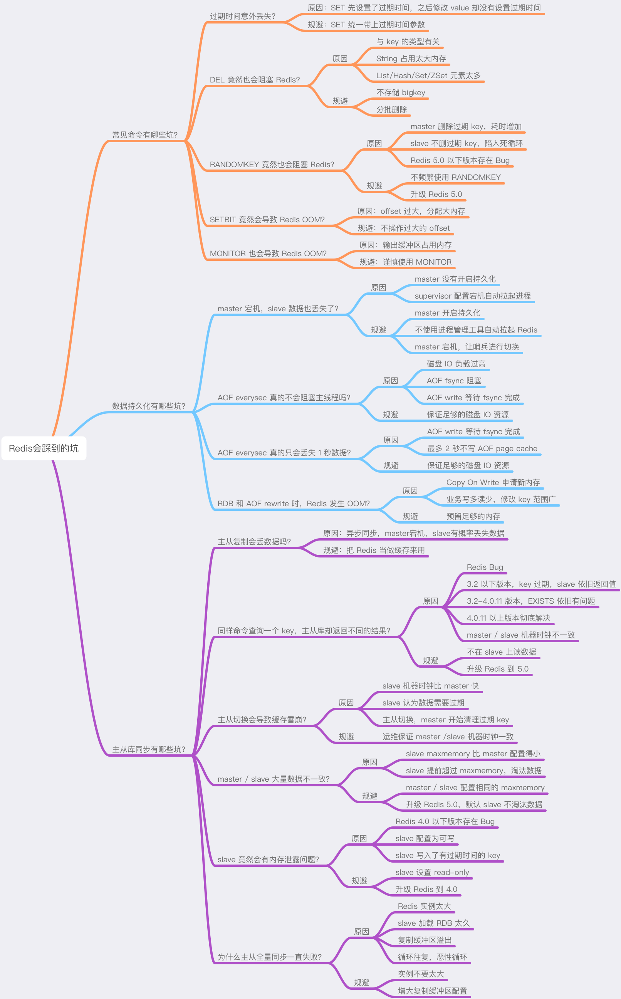

 		
# 一、Redis 事务

## 1、事务

可以一次执行多个命令，本质是一组命令的集合，一个事务中的所有命令都会序列化，按顺序地串行执行而不会被其他命令插入，不允许加塞。所以可以任务事务是部分支持事务的。

Redis事务没有像MySQL等关系型数据库事务隔离概念，Redis 是不支持 roll back 的，因而不满足原子性的（而且不满足持久性）

事务执行流程：
- 开始事务（Multi）
- 命令入队；
- 执行事务（Exec）、撤销事务（Discard）

事务实现的主要命令：
- `Multi`：事务开始的命令，执行该命令后，后面执行的redis操作都会按照顺序放入队列中，等待exec命令后才会被执行；
- `Discard`：放弃执行队列中的命令，并且将当前状态从事务状态变为非事务状态；
- `Exec`：执行事务中的commands队列，恢复连接状态。如果`WATCH`在之前被调用，只有监测中的Keys没有被修改，命令才会被执行，否则停止执行；
- `Watch key`：将给出的Keys标记为监测态，作为事务执行的条件；该命令只能在`multi`命令执行之前执行；如果被监视的key被其他客户端修改，exec会放弃执行命令队列中的命令；
- `UNWATCH`：清除事务中Keys的监测态，如果调用了`EXEC or DISCARD`，则没有必要再手动调用UNWATCH；

## 2、如何使用

### 2.1、case1-正常执行

```
127.0.0.1：6379[1]> MULTI ==> 标记一个事务块的开始
OK
127.0.0.1：6379[1]> set balance 80
QUEUED    ==> 入队成功
127.0.0.1：6379[1]> set debt 20
QUEUED
127.0.0.1：6379[1]> EXEC 	==> 执行所有事务块内的命令
```

### 2.2、放弃事务

```
127.0.0.1：6379[1]> MULTI
OK
127.0.0.1：6379[1]> set balance 80
QUEUED
127.0.0.1：6379[1]> set debt 20
QUEUED
127.0.0.1：6379[1]> DISCARD  ==> 取消事务，放弃执行事务块内的所有命令
```

### 2.3、全体连坐：命令存在语法错误

如果中间有一个命令发生错误，都不执行。这种情况下就是在`命令中发生了(error)`。类似于Java的非运行异常，需要在编译阶段捕获的异常信息，如 IOException；比如存在语法错误的命令
```
127.0.0.1：6379[1]> MULTI
OK
127.0.0.1：6379[1]> set k1 v1
QUEUED
127.0.0.1：6379[1]> set k2 v2
QUEUED
127.0.0.1：6379[1]> set 3
(error) ERR wrong number of arguments for 'set' command
127.0.0.1：6379[1]> set k4 4
QUEUED
127.0.0.1：6379[1]> EXEC
(error) EXECABORT Transaction discarded because of previous errors.
```

### 2.4、冤头债主：即正确的命令执行，错误的抛出

类似于Java的运行时异常，在运行阶段抛出来的，如：int i = 10 / 0；比如使用不同类型的操作命令操作不同数据类型会出现运行时错误，这种情况Redis在不执行命令的情况下，是无法发现的；
```
127.0.0.1：6379[1]> MULTI
OK
127.0.0.1：6379[1]> INCR k1
QUEUED
127.0.0.1：6379[1]> INCR k2
QUEUED
127.0.0.1：6379[1]> INCRBY k3 5
QUEUED
127.0.0.1：6379[1]> exec
1) (error) ERR value is not an integer or out of range ==> 错误命令抛出响应的错误信息
2) (integer) 23
3) (integer) 38
127.0.0.1：6379[1]> 
```

### 2.5、watch 监控

- 乐观锁与悲观锁/CAS

	- 乐观锁：每次操作数据都认为别人不会修改，所以不会加锁，但是每次更新的时候会判断在此期间有没有人去更新该数据，可以使用版本号的机制.乐观锁适用于多读的应用类型，这样可以提高吞吐量。乐观锁策略： 提交的版本号必须大于记录当前版本才能更新.
	- 悲观锁：每次操作数据的时候都认为别人会修改数据，所以每次都会加锁，这样其他的只能阻塞。传统的关系型数据库用到了很多悲观锁的机制：如行锁、表锁、读锁、写锁等.

- 使用watch监控某个key或者多个key时，如果在事务还没提交时，有外部对这些key进行了写操作，那么整个事务队列不会执行。即 exec 命令执行的事务将被放弃，同时返回 null multi-bulk 应答通知调用者事务执行失败

- unwatch：取消watch命令对所有key的监视

### 2.6、三阶段：总的来说事务可以概括为3个阶段

- （1）开启事务：以 multi 开始一个事务；
- （2）入队：将多个命令进入到事务的队列，接到这些命令并不会立即执行，而是放到等到执行的事务队列里.
- （3）执行：有exec触发事务执行

### 2.7、事务的三个特性

- 单独的隔离操作：事务中的所有命令都会序列化、按顺序地执行。事务在执行的过程中，不会被其他客户端发送来的命令请求所打断；
- 没有隔离级别的概念：队列中的命令没有提交之前都不会实际的被执行，因为事务提交前任何指令都不会被实际执行，也就不存在"事务内的查询要看到事务里的更新，在事务外查询不能看到"这个让人万分头痛的问题
- 不保证原子性：redis同一个事务中如果有一条命令执行失败，其后的命令仍然会被执行，没有回滚；

# 二、Redis安全

Redis安全防范

## 1、禁止一些高危命令

高危命令
```bash
KEYS        # 虽然该命令的模糊匹配功能很强大，但只适用于小数据量，当数据量很大时会导致Redis锁住及CPU飙升，建议禁用或重命名 
FLUSHDB     # 删除Redis中当前所在数据库中的所有记录，并且此命令不会执行失败
FLUSHALL    # 删除Redis中所有数据库的记录，并且此命令不会失败
CONFIG      # 客户端可修改Redis配置
EVAL
```
修改 redis.conf 文件，禁用远程修改 DB 文件地址，禁止一些高危的命令，在配置文件redis.conf中找到SECURITY区域，添加如下命令
```
rename-command FLUSHALL ""
rename-command CONFIG ""
rename-command EVAL ""
```

## 2、以低权限运行 Redis 服务

为 Redis 服务创建单独的用户和家目录，并且配置禁止登陆
```
groupadd -r redis && useradd -r -g redis redis
```
限制 Redis 配置文件的目录访问权限

## 3、为 Redis 添加密码验证

修改 redis.conf 文件，添加：`requirepass mypassword`；（注意redis不要用-a参数，明文输入密码，连接后使用auth认证）

## 4、禁止外网访问 Redis

修改 redis.conf 文件，添加或修改，使得 Redis 服务只在当前主机可用
```
bind 127.0.0.1
```
在redis3.2之后，redis增加了protected-mode，在这个模式下，非绑定IP或者没有配置密码访问时都会报错

## 5、修改默认端口

修改配置文件redis.conf文件
```
port 6379
```
默认端口是6379，可以改变成其他端口（不要冲突就好）

## 6、保证 authorized_keys 文件的安全

为了保证安全，您应该阻止其他用户添加新的公钥。

将 `authorized_keys` 的权限设置为对拥有者只读，其他用户没有任何权限：

`chmod 400 ~/.ssh/authorized_keys`

为保证 authorized_keys 的权限不会被改掉，您还需要设置该文件的 immutable 位权限:

`chattr +i ~/.ssh/authorized_keys`

然而，用户还可以重命名 `~/.ssh`，然后新建新的 `~/.ssh` 目录和 authorized_keys 文件。要避免这种情况，需要设置 ~./ssh 的 immutable 权限：

`chattr +i ~/.ssh`

# 三、Redis管道pipeline

## 1、单条命令的执行步骤

- 客户端把命令发送到服务器，然后阻塞客户端，等待着从socket读取服务器的返回结果；
- 服务器处理命令并将结果返回给客户端；

`每个命令的执行时间` =` 客户端发送时间+服务器处理和返回时间` + `一个网络来回的时间`；其中一个网络来回的时间是不固定的，它的决定因素有很多

## 2、Redis管道技术

管道的基本含义是，客户端可以向服务器发送多个请求，而不必等待回复，并最终在一个步骤中读取回复；

redis本身是基于request/response模式，每一个命令都需要等待上一个命令响应后进行处理，中间需要经过RTT（Round Time Trip，往返延时，表示发送端从发送数据开始，到发送端收到来自接收端的确认，所需要的时间。），并且需要频繁调用系统IO

客户端可以一次发送多条命令，不用逐条等待命令的返回值，而是到最后一起读取返回结果，这样只需要一次网络开销，速度就会得到明显的提升；

在Redis中，如果客户端使用管道发送了多条命令，那么服务器就会将多条命令放入一个队列中，这一操作会消耗一定的内存，所以管道中命令的数量并不是越大越好（太大容易撑爆内存），而是应该有一个合理的值；

对于管道的大部分应用场景而言，使用Redis脚本（Redis2.6及以后的版本）会使服务器端有更好的表现。使用脚本最大的好处就是可以以最小的延迟读写数据
- 使用管道技术可以显著提升Redis处理命令的速度，其原理就是将多条命令打包，只需要一次网络开销，在服务器端和客户端各一次read()和write()系统调用，以此来节约时间。
- 管道中的命令数量要适当，并不是越多越好。
- Redis2.6版本以后，脚本在大部分场景中的表现要优于管道

## 3、pipeline 用法

### 3.1、jedis客户端

```java
Pipeline pipelined = jedis.pipelined();
String key = "key";
for (int i = 0; i < 10; i++) {
	pipelined.set(key + ":" + i, String.valueOf((i + 1)));
}
pipelined.close();
```

### 3.2、Lettuce客户端

```java
RedisURI uri = RedisURI.create(RedisConstant.redis_host, RedisConstant.port);
RedisClient client = RedisClient.create(uri);
StatefulRedisConnection<String, String> connect = client.connect();
RedisAsyncCommands<String, String> commands = connect.async();
// disable auto-flushing
commands.setAutoFlushCommands(false);
List<RedisFuture<?>> futures = Lists.newArrayList();
for (int i = 0; i < 10; i++) {
	futures.add(commands.set("key-" + i, "value-" + i));
}
// write all commands to the transport layer
commands.flushCommands();
// synchronization example: Wait until all futures complete
LettuceFutures.awaitAll(5, TimeUnit.SECONDS, futures.toArray(new RedisFuture[futures.size()]));
connect.close();
```

## 3、mget与pipeline

- mget和mset命令也是为了减少网络连接和传输时间所设置的，其本质和pipeline的应用区别不大，但是在特定场景下只能用pipeline实现，例如：
	```
	get a
	set b ‘1’
	incr b
	```
	pipeline适合执行这种连续，且无相关性的命令；

- pipeline应用场景：多个命令需要被及时提交，且这些命令的响应结果没有相互依赖；但是需要注意以下几点：
	- 不要和常规命令client共用一个链接，因为pipeline是独占连接的，如果管道内命令太多，可能会造成请求超时；
	- 可发送命令数量受到客户端缓冲区大小限制，如超过限制，则flush到redis
	- redis server存在query buffer限制，默认是1GB，如果超过这个值，客户端会被强制断掉；
	- redis server存在output buffer限制，受到maxmemory配置限制；
	- 要实现pipeline，同时需要服务器端和客户端的支持
	- redis cluster不建议使用pipeline，容易产生max redirect错误
	- twem proxy可以支持pipeline

	局限性：当某个命令的执行需要依赖前一个命令的返回结果时，无法使用pipeline。

# 四、Redis与Java

## 1、Jedis

Redis的Java实现的客户端，其API提供了比较全面的Redis命令的支持，Jedis简单使用阻塞的I/O和redis交互

## 2、Redission

Redission通过Netty支持非阻塞I/O

## 3、Lettuce

### 3.1、介绍

Lettuce是一个高性能基于Java编写的Redis驱动框架，底层集成了Project Reactor提供天然的反应式编程，通信框架集成了Netty使用了非阻塞IO，5.x版本之后融合了JDK1.8的异步编程特性，在保证高性能的同时提供了十分丰富易用的API，5.1版本的新特性如下：
- 支持Redis的新增命令ZPOPMIN, ZPOPMAX, BZPOPMIN, BZPOPMAX。
- 支持通过Brave模块跟踪Redis命令执行。
- 支持Redis Streams。
- 支持异步的主从连接。
- 支持异步连接池。
- 新增命令最多执行一次模式（禁止自动重连）。
- 全局命令超时设置（对异步和反应式命令也有效）

**Redis的版本至少需要2.6**

- [Lettuce介绍](https://mp.weixin.qq.com/s/1O9qT3rPDHGlNV9D-64bow)
- [Lettuce使用](https://juejin.im/post/5d8eb73ff265da5ba5329c66#heading-21)

### 3.2、

# 五、Redis监控与运维

## 1、Redis监控指标

监控时最好重点关注以下指标：
- 客户端相关：当前连接数、总连接数、输入缓冲大小、OPS
- CPU相关：主进程 CPU 使用率、子进程 CPU 使用率
- 内存相关：当前内存、峰值内存、内存碎片率
- 网络相关：输入、输出网络流量
- 持久化相关：最后一次 RDB 时间、RDB fork 耗时、最后一次 AOF rewrite 时间、AOF rewrite 耗时
- key 相关：过期 key 数量、淘汰 key 数量、key 命中率
- 复制相关：主从节点复制偏移量、主库复制缓冲区

涉及相关配置主要从一下几个方面考虑：
- 性能指标：Performance
- 内存指标: Memory
- 基本活动指标：Basic activity
- 持久性指标: Persistence
- 错误指标：Error

### 1.1、性能指标：Performance

- `latency`：Redis响应一个请求的时间
- `instantaneous_ops_per_sec`：平均每秒处理请求总数
- `hi rate(calculated)`：缓存命中率（计算出来的）

### 1.2、内存指标: Memory

- `used_memory`：已使用内存
- `mem_fragmentation_ratio`：内存碎片率
- `evicted_keys`：由于最大内存限制被移除的key的数量
- `blocked_clients`：由于BLPOP,BRPOP,or BRPOPLPUSH而备阻塞的客户端

### 1.3、基本活动指标：Basic activity

- `connected_clients`：客户端连接数
- `conected_laves`：slave数量
- `master_last_io_seconds_ago`：最近一次主从交互之后的秒数
- `keyspace`：数据库中的key值总数；

### 1.4、持久性指标: Persistence

- `rdb_last_save_time`：最后一次持久化保存磁盘的时间戳；
- `rdb_changes_sice_last_save`：自最后一次持久化以来数据库的更改数；

### 1.5、错误指标：Error

- `rejected_connections`：由于达到maxclient限制而被拒绝的连接数
- `keyspace_misses`：key值查找失败(没有命中)次数
- `master_link_down_since_seconds`：主从断开的持续时间（以秒为单位)

### 1.6、其他指标

- expired_keys， 自 Redis 实例启动以来，已经过期并被删除的键的总数。通过监控 expired_keys，你可以了解系统中过期键的频率。如果该值过高，可能表示有大量的键被设置了较短的过期时间，或 Redis 中存储了过多的短生命周期数据
- latest_fork_usec：表示 Redis 最近一次执行 fork() 操作所花费的时间，单位是微秒（usec）。fork() 是操作系统中用于创建子进程的系统调用，Redis 在执行某些操作时（如生成 RDB 快照或执行 AOF 重写）会使用 fork() 创建一个子进程来处理这些任务；如果该值过大，可能意味着 Redis 占用了过多的内存，导致 fork() 操作时间延长，进而影响 Redis 的响应时间

## 2、监控方式

- redis-benchmark
- redis-stat
- redis-faina
- redislive
- redis-cli
- monitor
- showlog
```
slowlog-log-slower-than 1000 # 设置慢查询的时间下线，单位：微秒
slowlog-max-len 100 # 设置慢查询命令对应的日志显示长度，单位：命令数
```

### 2.1、redis-benchmark

redis性能测试命令：`./redis-benchmark -c 100 -n 5000`，100个连接，5000次请求对应的性能；

### 2.2、redis-cli

info（可以一次性获取所有的信息，也可以按块获取信息），命令使用：
```
./redis-cli info 按块获取信息 | grep 需要过滤的参数
./redis-cli info stats | grep ops
```
交互式：
```
 #./redis-cli 
> info server
```

**内存监控：**
```bash
[root@CombCloud-2020110836 src]# ./redis-cli info | grep used | grep human       
used_memory_human:2.99M  # 内存分配器从操作系统分配的内存总量
used_memory_rss_human:8.04M  #操作系统看到的内存占用，top命令看到的内存
used_memory_peak_human:7.77M # redis内存消耗的峰值
used_memory_lua_human:37.00K   # lua脚本引擎占用的内存大小
```
...

## 3、日常运维

主要注意如下几个方面：

（1）**禁止使用 KEYS/FLUSHALL/FLUSHDB 命令**；

（2）**扫描线上实例时，设置休眠时间**

不管是使用 SCAN 扫描线上实例，还是对实例做 bigkey 统计分析，建议在扫描时一定记得设置休眠时间，防止在扫描过程中，实例 OPS 过高对 Redis 产生性能抖动；

（3）**慎用 MONITOR 命令**

但如果 Redis OPS 比较高，在执行 MONITOR 会导致 Redis 输出缓冲区的内存持续增长，这会严重消耗 Redis 的内存资源，甚至会导致实例内存超过 maxmemory，引发数据淘汰；

（4）**从库必须设置为 slave-read-only**

从库必须设置为 slave-read-only 状态，避免从库写入数据，导致主从数据不一致。除此之外，从库如果是非 read-only 状态，如果你使用的是 4.0 以下的 Redis，它存在这样的 Bug：从库写入了有过期时间的数据，不会做定时清理和释放内存。

（5）**合理配置 timeout 和 tcp-keepalive 参数**

如果因为网络原因，导致你的大量客户端连接与 Redis 意外中断，恰好你的 Redis 配置的 maxclients 参数比较小，此时有可能导致客户端无法与服务端建立新的连接（服务端认为超过了 maxclients）

造成这个问题原因在于，客户端与服务端每建立一个连接，Redis 都会给这个客户端分配了一个 client fd。当客户端与服务端网络发生问题时，服务端并不会立即释放这个 client fd；

什么时候释放呢？Redis 内部有一个定时任务，会定时检测所有 client 的空闲时间是否超过配置的 timeout 值。如果 Redis 没有开启 tcp-keepalive 的话，服务端直到配置的 timeout 时间后，才会清理释放这个 client fd。在没有清理之前，如果还有大量新连接进来，就有可能导致 Redis 服务端内部持有的 client fd 超过了 maxclients，这时新连接就会被拒绝，优化建议：
- 不要配置过高的 timeout：让服务端尽快把无效的 client fd 清理掉
- Redis 开启 tcp-keepalive：这样服务端会定时给客户端发送 TCP 心跳包，检测连接连通性，当网络异常时，可以尽快清理僵尸 client fd

（6）**调整 maxmemory 时，注意主从库的调整顺序**

Redis 5.0 以下版本存在这样一个问题：从库内存如果超过了 maxmemory，也会触发数据淘汰。某些场景下，从库是可能优先主库达到 maxmemory 的（例如在从库执行 MONITOR 命令，输出缓冲区占用大量内存），那么此时从库开始淘汰数据，主从库就会产生不一致。要想避免此问题，在调整 maxmemory 时，一定要注意主从库的修改顺序：
- 调大 maxmemory：先修改从库，再修改主库
- 调小 maxmemory：先修改主库，再修改从库

直到 Redis 5.0，Redis 才增加了一个配置 replica-ignore-maxmemory，默认从库超过 maxmemory 不会淘汰数据，才解决了此问题。

# 六、Redis6.0

Redis6.0主要特性如下：
- 多线程处理网络 IO；
- 客户端缓存；
- 细粒度权限控制（ACL）；
- RESP3 协议的使用；
- 用于复制的 RDB 文件不在有用，将立刻被删除；
- RDB 文件加载速度更快；

# 七、Redis模块

## 1、RedisJSON

RedisJSON是一个Redis模块，实现了ECMA-404 JSON数据交换标准作为本地数据类型。它允许存储，更新和获取JSON值从Redis键(文档)

# 八、Redis踩坑

- [使用Redis的坑](http://kaito-kidd.com/2021/03/14/redis-trap/)



## 1、命令的坑

### 1.1、过期时间意外丢失

SET 除了可以设置 key-value 之外，还可以设置 key 的过期时间，就像下面这样：
```
127.0.0.1:6379> SET testkey val1 EX 60
OK
127.0.0.1:6379> TTL testkey
(integer) 59
```
此时如果你想修改 key 的值，但只是单纯地使用 SET 命令，而没有加上「过期时间」的参数，那这个 key 的过期时间将会被「擦除」
```
127.0.0.1:6379> SET testkey val2
OK
127.0.0.1:6379> TTL testkey  // key永远不过期了！
(integer) -1
```
导致这个问题的原因在于：SET 命令如果不设置过期时间，那么 Redis 会自动「擦除」这个 key 的过期时间；

所以，你在使用 SET 命令时，如果刚开始就设置了过期时间，那么之后修改这个 key，也务必要加上过期时间的参数，避免过期时间丢失问题

### 1.2、DEL会阻塞 Redis

删除一个 key 的耗时（时间复杂度），与这个 key 的类型有关：
- key 是 String 类型，DEL 时间复杂度是 O(1)；
- key 是 List/Hash/Set/ZSet 类型，DEL 时间复杂度是 O(M)，M 为元素数量

也就是说，如果你要删除的是一个非 String 类型的 key，这个 key 的元素越多，那么在执行 DEL 时耗时就越久。因为删除这种 key 时，Redis 需要依次释放每个元素的内存，元素越多，这个过程就会越耗时，而这么长的操作耗时，势必会阻塞整个 Redis 实例，影响 Redis 的性能；

当你在删除 List/Hash/Set/ZSet 类型的 key 时，一定要格外注意，不能无脑执行 DEL，而是应该用以下方式删除：
- 查询元素数量：执行 LLEN/HLEN/SCARD/ZCARD 命令；
- 判断元素数量：如果元素数量较少，可直接执行 DEL 删除，否则分批删除；
- 分批删除：执行 LRANGE/HSCAN/SSCAN/ZSCAN + LPOP/RPOP/HDEL/SREM/ZREM 删除

另外对于 String 类型来说，最好也不要存储过大的数据，否则在删除它时，也会有性能问题，因为 Redis 释放这么大的内存给操作系统，也是需要时间的，所以操作耗时也会变长

### 1.3、RANDOMKEY 阻塞 Redis

如果你想随机查看 Redis 中的一个 key，通常会使用 RANDOMKEY 这个命令，这个命令会从 Redis 中「随机」取出一个 key，基本国策：
- master上 RANDOMKEY 在随机拿出一个 key 后，首先会先检查这个 key 是否已过期；
- 如果该 key 已经过期，那么 Redis 会删除它，这个过程就是懒惰清理，但清理完了还不能结束，Redis 还要找出一个「不过期」的 key，返回给客户端；
- Redis 则会继续随机拿出一个 key，然后再判断是它否过期，直到找出一个未过期的 key 返回给客户端

但这里就有一个问题了：如果此时 Redis 中，有大量 key 已经过期，但还未来得及被清理掉，那这个循环就会持续很久才能结束，而且，这个耗时都花费在了清理过期 key + 寻找不过期 key 上。导致的结果就是，RANDOMKEY 执行耗时变长，影响 Redis 性能；

上述是在master上执行 RANDOMKEY，如果在 slave 上执行 RANDOMEKY，那么问题会更严重，主要原因就在于，slave 自己是不会清理过期 key
还是同样的场景：Redis 中存在大量已过期，但还未被清理的 key，那在 slave 上执行 RANDOMKEY 时，就会发生以下问题：
- slave 随机取出一个 key，判断是否已过期
- key 已过期，但 slave 不会删除它，而是继续随机寻找不过期的 key
- 由于大量 key 都已过期，那 slave 就会寻找不到符合条件的 key，此时就会陷入「死循环」！

这其实是 Redis 的一个 Bug，这个 Bug 一直持续到 5.0 才被修复；修复的解决方案是，在 slave 上执行 RANDOMKEY 时，会先判断整个实例所有 key 是否都设置了过期时间，如果是，为了避免长时间找不到符合条件的 key，slave 最多只会在哈希表中寻找 100 次，无论是否能找到，都会退出循环；

### 1.4、SETBIT导致Redis OOM

在使用 Redis 的 String 类型时，可以把它当做 bitmap 来用，可以把一个 String 类型的 key，拆分成一个个 bit 来操作，就像下面这样：
```
127.0.0.1:6379> SETBIT testkey 10 1
(integer) 1
127.0.0.1:6379> GETBIT testkey 10
(integer) 1
```
操作的每一个 bit 位叫做 offset，但是，这里需要注意的一个点是：如果这个 key 不存在，或者 key 的内存使用很小，此时你要操作的 offset 非常大，那么 Redis 就需要分配「更大的内存空间」，这个操作耗时就会变长，影响性能；所以，当你在使用 SETBIT 时，也一定要注意 offset 的大小，操作过大的 offset 也会引发 Redis 卡顿。

这种类型的 key，也是典型的 bigkey，除了分配内存影响性能之外，在删除它时，耗时同样也会变长

### 1.5、monitor 命令导致OOM

当你在执行 MONITOR 命令时，Redis 会把每一条命令写到客户端的「输出缓冲区」中，然后客户端从这个缓冲区读取服务端返回的结果；但是，如果你的 Redis QPS 很高，这将会导致这个输出缓冲区内存持续增长，占用 Redis 大量的内存资源，如果恰好你的机器的内存资源不足，那 Redis 实例就会面临被 OOM 的风险

## 2、数据持久化的坑


# 九、Redis工具

## 1、连接工具

- [Redis GUI Client](https://github.com/tiny-craft/tiny-rdm)
- [Redis工具-AnotherRedisDesktopManager](https://github.com/qishibo/AnotherRedisDesktopManager)

https://www.npmjs.com/package/redis-dump

# 参考资料

- [Redis官方资料-命令](https://redis.io/commands)
- [Redis集群规范](https://redis.io/topics/cluster-spec)
- [Redis官方命令参考手册](https://redis.io/commands/)
- [Redis内存模型](https://www.cnblogs.com/kismetv/p/8654978.html)
- [Redis架构](https://mp.weixin.qq.com/s/Fx9_aCp7DwfVXhtUU9dU0Q)
- [解析Redis RDB文件、分析内存](https://github.com/sripathikrishnan/redis-rdb-tools)


