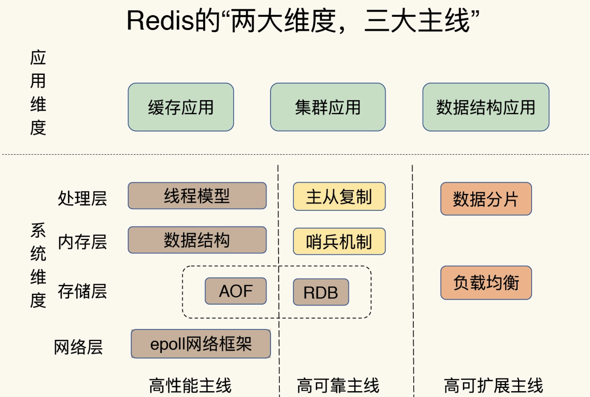
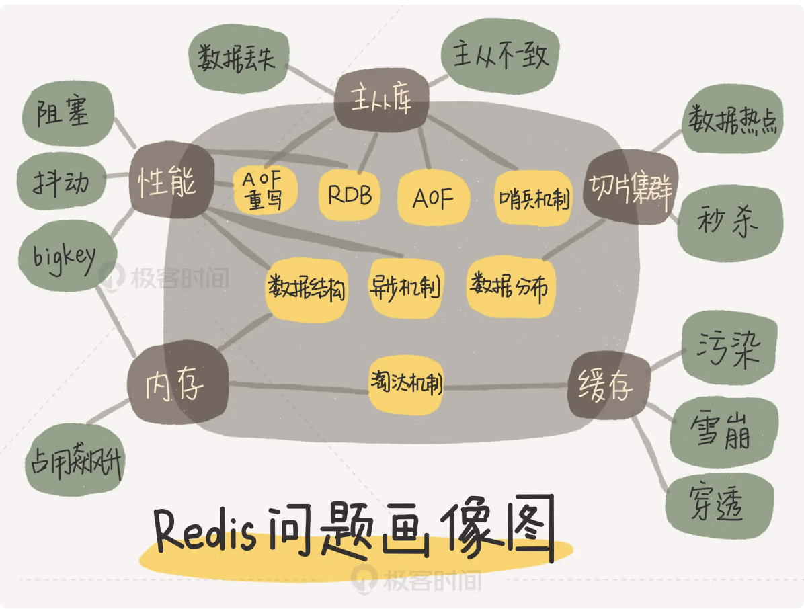

# Redis全景图

简单概括为：“两大维度，三大主线”

“两大维度”就是指系统维度和应用维度，“三大主线”也就是指高性能、高可靠和高可扩展（可以简称为“三高”）。

（1）首先，从系统维度上说，需要了解 Redis 的各项关键技术的设计原理，这些能够为判断和推理问题打下坚实的基础，而且，还能从中掌握一些优雅的系统设计规范，例如 run-to-complete 模型、epoll 网络模型；可以从三大主线来看：
- **高性能主线**，包括线程模型、数据结构、持久化、网络框架；
- **高可靠主线**，包括主从复制、哨兵机制；
- **高可扩展主线**，包括数据分片、负载均衡。

（2）其次，在应用维度上，按照两种方式学习: “应用场景驱动”和“典型案例驱动”，一个是“面”的梳理，一个是“点”的掌握
- 缓存和集群是 Redis 的两大广泛的应用场景。在这些场景中，本身就具有一条显式的技术链。比如说，提到缓存场景，肯定会想到缓存机制、缓存替换、缓存异常等一连串的问题

Redis的问题画像：

无论你遇见什么问题，都可以拿出来这张图，这样就能快速地按照问题来查找对应的 Redis 主线模块了，然后再进一步定位到相应的技术点上。

https://blog.huangz.me/diary/2014/how-to-read-redis-source-code.html

# 设计键值数据库

- [如何设计键值数据库](../../../软件工程/软件设计/设计案例.md#九键值数据库设计)

# 参考资料

- [Redis高性能原因源码分析](https://heapdump.cn/article/3798624)
- [Redis7源码分析](https://github.com/CN-annotation-team/redis7.0-chinese-annotated)
- [读懂Redis源码](http://kaito-kidd.com/2021/09/23/read-redis-source-code/)
- [Redis源码配置](https://dqyuan.top/2019/11/07/redis-read-1.html)