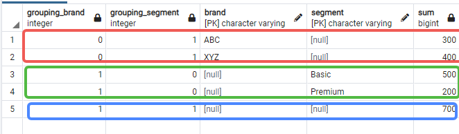

# 一、基本介绍

PostgreSQL 是一种先进的企业级开源关系型数据库系统。PostgreSQL 支持 SQL（关系型）和 JSON（非关系型）查询。

PostgreSQL 是许多网络应用程序以及移动和分析应用程序的主要数据库。

## 1、特点

- 用户自定义类型
- 表继承
- 先进的锁定机制
- 外键参照完整性
- 视图、规则、子查询
- 嵌套事务（保存点）
- 多版本并发控制（MVCC）
- 异步复制

适用场景：
- 用于Gis + 地图场景
- 普通事务数据库；


## 2、安装

### 2.1、windows安装

直接下载安装包，一步一步安装即可

### 2.2、Linux安装

### 2.3、Docker安装

- [Install postgresql with docker](https://www.baeldung.com/ops/postgresql-docker-setup)

```bash
$ docker pull postgres
$ docker run -itd -e POSTGRES_USER=root -e POSTGRES_PASSWORD=root -p 5432:5432 --name postgresql postgres
# pgAdmin
$ docker pull dpage/pgadmin4:latest
$ docker run --name pgadmin -p 5051:80 -e "PGADMIN_DEFAULT_EMAIL=743633145@qq.com" -e "PGADMIN_DEFAULT_PASSWORD=root" -d dpage/pgadmin4
```

### 2.4、Mac安装

### 2.5、连接PG

**适用psql**

psql 是 PostgreSQL 提供的交互式终端程序。它允许与 PostgreSQL 数据库服务器交互，如执行 SQL 语句和管理数据库对象。

其次，输入服务器、数据库、端口、用户名和密码等所有信息。如果按回车键，程序将使用方括号[]中指定的默认值，并将光标移到新行。例如，localhost 是默认的数据库服务器。在为用户 postgres 输入密码的步骤中，需要输入在安装 PostgreSQL 时选择的用户 postgres 的密码。

**适用pgAdmin**

连接数据库的第二种方法是使用 pgAdmin 应用程序。pgAdmin 应用程序允许你通过直观的用户界面与 PostgreSQL 数据库服务器交互。通过ip+端口的形式访问；

## 3、如何加载数据

`pg_restore -U postgres -d dvdrental <file>`
- `-U postgres`：指定登录 PostgreSQL 数据库服务器的 postgres 用户。
- `-d dvdrental`：指定要加载的目标数据库。

也可以通过pgAdmin加载数据

## 4、常见操作

进入交互界面：`psql`

切换数据库：`postgres=# \c dvdrental`

退出交互界面：`postgres=# \q`

## 5、对比其他数据库

PostgreSQL 相比 MySQL 的主要优势（业界公认）：
- 事务性 DDL：PostgreSQL 支持事务性 DDL（Data Definition Language），可以在事务中执行表结构变更，并支持回滚和保存点。MySQL 不支持，DDL 自动提交，一旦出错无法回退，风险高。
- 自定义类型和域（Domain）：PostgreSQL 允许创建自定义类型（如枚举）、带验证规则的域（Domain），增强数据一致性和安全性。MySQL 的 ENUM 功能有限，缺乏类似 Domain 的机制。
- 原生数组类型：PostgreSQL 支持数组字段，可直接进行查询、索引和操作，简化多对多关系模型。MySQL 不支持原生数组，需额外建表处理列表数据。
- 空间数据支持（GIS）：PostgreSQL 配合 PostGIS 插件提供完整的地理空间功能，包括高效的空间索引、距离计算、KNN 搜索等。MySQL 虽有空间支持，但在深度和性能上远不如 PostgreSQL + PostGIS。
- 向量数据支持（AI/ML）：PostgreSQL 提供 pgvector 扩展，支持向量存储和相似性搜索，适合嵌入 AI 应用。MySQL 最近加入 VECTOR 类型，但生态和性能仍落后于 PostgreSQL。
- CTE（公共表表达式）：PostgreSQL 从 2009 年起就支持 CTE，且功能更完整，包括递归查询和性能控制提示（如 `MATERIALIZED`）。MySQL 到 2018 年才引入基本 CTE 支持，功能相对简单。
- 行级安全策略（RLS）：PostgreSQL 原生支持 RLS，可在数据库层面实现细粒度的数据访问控制，适用于多租户、权限隔离等场景。MySQL 缺乏内置 RLS，需依赖应用程序或视图实现，容易出错。
- 部分索引（Partial Index）：PostgreSQL 支持 WHERE 条件的索引，只索引特定数据子集，提高效率。MySQL 必须索引整列，无法按条件优化索引大小和性能。
- 开源许可与社区开放性：PostgreSQL 使用 BSD 类似许可，自由度极高，适合嵌入、修改、商业化。社区公开透明，设计讨论、代码提交均公开可见。MySQL 使用 GPL + 商业双重许可，限制较多，Bug 跟踪不透明，社区参与受限。

Postgres 不只是一个关系型数据库，它支持：
- 队列系统（通过 `LISTEN/NOTIFY` 和事务机制）
- 键值存储（通过 `JSONB` 类型）
- 全文搜索（内置全文检索功能）
- 实时通知（无需 WebSocket 服务器或 Redis Pub/Sub）

使用 Redis、RabbitMQ、Elasticsearch 等工具虽然在特定高并发或大数据场景下有优势，但对大多数中小型项目来说，它们带来了不必要的复杂性和成本。这些工具需要额外的运维、监控、扩展和安全配置，而这些开销在使用单一 Postgres 时都可以避免。

# 二、基础知识

> 请注意，SQL 关键字不区分大小写。这意味着 SELECT 等同于 select 或 Select。按照惯例，将使用大写的所有 SQL 关键字，以便查询更容易阅读。分号不是 SQL 语句的一部分。它是 PostgreSQL 结束 SQL 语句的信号。分号也用于分隔两条 SQL 语句。

## 1、select

基本语法：
```sql
SELECT select_list FROM table_name;
```
可以在 select_list 中使用表达式，比如字符串拼接：
```sql
SELECT  first_name || ' ' || last_name, email FROM customer;
```
其中`||` 是连接运算符；

当然也可以是下面的示例：
```sql
SELECT 5 * 3;
```

## 2、列别名

别名的语法如下：
```sql
SELECT column_name AS alias_name FROM table_name;
SELECT column_name alias_name FROM table_name;
SELECT expression AS alias_name FROM table_name;
-- 如果列别名包含一个或多个空格，则需要用双引号将其包围起来，如下所示
SELECT first_name || ' ' || last_name "full name" FROM customer;
```

## 3、order by

```sql
SELECT select_list FROM table_name
ORDER BY
	sort_expression1 [ASC | DESC],
        ...
	sort_expressionN [ASC | DESC]; -- 默认排序是：ASC
```
执行顺序：`FROM, SELECT, ORDER BY`

函数 LENGTH() 接受一个字符串，并返回该字符串的长度，以下语句选择姓名及其长度。它按姓名长度对行排序：
```sql
SELECT first_name, LENGTH(first_name) len FROM customer ORDER BY len DESC;
```

**order by 和 NULL**

在数据库领域，`NULL` 是一个标记，表示数据缺失或记录时数据未知。对包含 `NULL` 的记录进行排序时，可以使用 `ORDER BY` 子句的 `NULLS FIRST` 或 `NULLS LAST` 选项指定 `NULL` 与其他非空值的排序顺序。
```sql
ORDER BY sort_expresssion [ASC | DESC] [NULLS FIRST | NULLS LAST]
```
`NULLS FIRST` 选项将 `NULL` 置于其他非空值之前，`NULL LAST` 选项将 `NULL` 置于其他非空值之后。
- 如果使用 `ASC` 选项，`ORDER BY` 子句默认使用 `NULLS LAST` 选项；
- 如果使用 `DESC` 选项，`ORDER BY` 子句默认使用 `NULLS FIRST` 选项；

## 4、distinct

DISTINCT 子句在 SELECT 语句中用于删除结果集中的重复行。DISTINCT 子句为每组重复行保留一条记录。DISTINCT 子句可应用于 SELECT 语句选择列表中的一列或多列：
```sql
SELECT DISTINCT column1, column2 FROM table_name; -- 需要多个字段值，需要将两列的值组合起来确定唯一性
SELECT DISTINCT ON (column1) column_alias, column2 FROM table_name ORDER BY column1, column2; -- 对 column1 去重，并对每组重复的结果集保留第一行。
```
SELECT 语句返回记录的顺序未指定，因此重复数据中每组的 "第一 "行也未指定。好的做法是始终使用 ORDER BY 子句和 DISTINCT ON(表达式)，以使结果集可预测。

> 请注意，DISTINCT ON 表达式必须与 ORDER BY 子句中最左边的表达式相匹配。

## 5、where

```sql
SELECT select_list FROM table_name WHERE condition ORDER BY sort_expression
```
条件必须为 "true"、"false "或 "未知"。它可以是一个布尔表达式，也可以是使用 AND 和 OR 运算符的布尔表达式组合

执行顺序：`FROM, WHERE, SELECT, ORDER BY`；

除了 SELECT 语句，您还可以在 UPDATE 和 DELETE 语句中使用 WHERE 子句指定要更新或删除的记录；

操作符，大部分同MySQL，其中：`NOT`-否定其他运算符的结果，所有操作符：
`= 、 > 、 < 、 >= 、 <= 、 <> or != 、 AND 、 OR 、 IN 、 BETWEEN.AND. 、 LIKE 、 IS NULL 、 NOT`

## 6、limit

```sql
SELECT select_list FROM table_name WHERE condition ORDER BY sort_expression LIMIT row_count
```
语句返回查询生成的 `row_count` 行数。如果 `row_count` 为零，查询将返回空结果集。如果 `row_count` 为 NULL，查询将返回相同的结果集，因为它没有 LIMIT 子句。

如果想在返回 `row_count` 行数之前跳过若干行，可以使用放在 LIMIT 子句之后的 OFFSET 子句，语句如下
```sql
SELECT select_list FROM table_name LIMIT row_count OFFSET row_to_skip;
```
语句首先会跳过 `row_too_skip` 行，然后才会返回查询生成的 `row_count` 行。如果 `row_too_skip` 为零，语句就会像没有 `OFFSET` 子句一样工作；由于表可能会以未指定的顺序存储行，因此在使用 LIMIT 子句时，应始终使用 ORDER BY 子句来控制行的顺序。如果不使用 ORDER BY 子句，可能会得到不指定记录顺序的结果集

## 7、fetch

要限制查询返回的行数，通常要使用 `LIMIT` 子句。许多关系数据库管理系统（如 MySQL、H2 和 HSQLDB）都广泛使用 `LIMIT` 子句。但是，`LIMIT` 子句并不是 SQL 标准的；

为了与 SQL 标准保持一致，PostgreSQL 支持 `FETCH` 子句来检索查询返回的记录数。请注意，`FETCH` 子句是在 `SQL:2008` 中引入的：
```sql
OFFSET start { ROW | ROWS } FETCH { FIRST | NEXT } [ row_count ] { ROW | ROWS } ONLY
```
- `ROW` 是 `ROWS` 的同义词，`FIRST` 是 `NEXT` 的同义词。因此可以互换使用
- `start` 是一个整数，必须为零或正数。如果没有指定 `OFFSET` 子句，默认值为零。如果起始行数大于结果集中的行数，则不会返回任何行；
- `row_count` 为 1 或更大。如果没有明确指定，默认情况下 `row_count` 值为 1。

由于未指定表中存储行的顺序，因此应始终使用带有 ORDER BY 子句的 FETCH 子句，以使返回结果集中行的顺序一致；

> 请注意，在 SQL:2008 中，`OFFSET` 子句必须出现在 `FETCH` 子句之前。但在 PostgreSQL 中，`OFFSET` 和 `FETCH` 子句可以以任何顺序出现；

**FETCH vs. LIMIT**

FETCH 子句在功能上等同于 LIMIT 子句。如果计划使应用程序与其他数据库系统兼容，则应使用 FETCH 子句，因为它遵循标准 SQL。

示例：
```sql
-- 下面的查询使用 FETCH 子句选择按片名升序排序的第一部影片，以下两个SQL是等价的
SELECT * FROM  film ORDER BY title FETCH FIRST ROW ONLY;
SELECT * FROM  film ORDER BY title FETCH FIRST 1 ROW ONLY;

-- 下面的查询使用FETCH子句来选择按标题排序的前五部电影:
SELECT * FROM  film ORDER BY title FETCH FIRST 5 ROW ONLY;

-- 以下语句按片名排序，返回前五部影片之后的后五部影片
SELECT * FROM  film ORDER BY title OFFSET 5 ROWS FETCH FIRST 5 ROW ONLY;
```

## 8、in

在 WHERE 子句中使用 IN 操作符来检查某个值是否与值列表中的任何值相匹配：
```sql
value IN (value1,value2,...)
```
值列表可以是数字、字符串等文字值列表，也可以是 SELECT 语句的结果，如下所示：`value IN (SELECT column_name FROM table_name);`

**NOT IN**

选择其值与列表中的值不匹配的行

## 9、between

可以使用 BETWEEN 操作符将一个值与一系列值进行匹配。下面是 BETWEEN 操作符的语法说明：
```sql
value BETWEEN low AND high;
```
如果值大于或等于低值，小于或等于高值，表达式返回 true，否则返回 false。
等价于：
```sql
value >= low and value <= high
```
如果要检查某个值是否超出某个范围，可以将 NOT 运算符与 BETWEEN 运算符组合使用，如下所示：
```sql
value NOT BETWEEN low AND high;
-- 等价于
value < low OR value > high
```

## 10、like

将字面值与通配符结合起来构建模式，然后使用 LIKE 或 NOT LIKE 操作符查找匹配项。PostgreSQL 提供了两种通配符：
- 百分号 (`%`) 匹配零个或多个字符的任何序列。
- 下划线符号 (`_`) 匹配任何单个字符。

```sql
value LIKE pattern
value NOT LIKE pattern
```
如果模式不包含任何通配符，LIKE 运算符的行为与等号 ( =) 运算符类似。
```sql
SELECT
	'foo' LIKE 'foo', -- true
	'foo' LIKE 'f%', -- true
	'foo' LIKE '_o_', -- true
	'bar' LIKE 'b_'; -- false
```
PostgreSQL 支持 `ILIKE` 操作符，其工作原理与 `LIKE` 操作符类似。此外，`ILIKE` 运算符不区分大小写的匹配值，比如：
```sql
SELECT first_name, last_name FROM customer WHERE first_name ILIKE 'BAR%';
```
`BAR%`匹配任何以 `BAR`、`Bar`、`BaR` 等开头的字符串。如果使用 LIKE 操作符，查询将不会返回任何行

如下所示，PostgreSQL 还提供了一些类似于 `LIKE`、`NOT LIKE`、`ILIKE` 和 `NOT ILIKE` 操作符的操作符：

操作符 | 等价
------|-----
`~~` | LIKE
`~~*` | ILIKE
`!~~` |	NOT LIKE
`!~~*` |	NOT ILIKE

## 11、is null

在数据库世界中，NULL 表示缺少信息或不适用。NULL 不是一个值，因此不能与任何其他值（如数字或字符串）进行比较。将 NULL 与某个值进行比较的结果总是 NULL，即未知结果。此外，NULL 不等于 NULL，因此下面的表达式返回 NULL：
```sql
NULL = NULL
```
要检查一个值是否为 NULL，可以使用 `IS NULL` 操作符来代替：`value IS NULL`；如果值为 NULL，表达式返回 true；如果不是 NULL，表达式返回 false。

**IS NOT NULL**

检查值为非空，则使用 `is not null`：`value IS NOT NULL`

## 12、关联表：Joins

- 内连接
- 左连接
- 右连接
- 自连接
- 全外连接

## 13、交叉连接：cross join

通过 CROSS JOIN 子句，可以生成两个或多个表中记录的笛卡尔积。与 `LEFT JOIN` 或 `INNER JOIN` 等其他连接子句不同，`CROSS JOIN` 子句没有连接谓词。

假设要对两个表 T1 和 T2 进行交叉连接。如果 T1 有 n 行，T2 有 m 行，那么结果集将有 nxm 行。例如，T1 有 1,000 行，T2 有 1,000 行，则结果集将有 1,000 x 1,000 = 1,000,000 行。
```sql
SELECT select_list FROM T1 CROSS JOIN T2;
-- 等价于
SELECT select_list FROM T1, T2;
-- 也可以使用 inner join 模拟
SELECT * FROM T1 INNER JOIN T2 ON true;
```

## 14、自然连接：natural join

自然连接是根据连接表中相同的列名创建隐式连接的连接。
```sql
SELECT select_list FROM T1
NATURAL [INNER, LEFT, RIGHT] JOIN T2;
```
自然连接可以是内连接、左连接或右连接。如果没有明确指定连接，例如内连接、左连接、右连接，**PostgreSQL 默认使用内连接**。

## 15、group by

GROUP BY 子句将 SELECT 语句返回的记录分成若干组。对于每个组，可以使用聚合函数，例如使用 SUM() 计算项的总和，或使用 COUNT() 获得组中项的数量。
```sql
SELECT 
   column_1, 
   column_2,
   ...,
   aggregate_function(column_3)
FROM 
   table_name
GROUP BY 
   column_1,
   column_2,
   ...;
```
可以将 SELECT 语句的其他子句与 GROUP BY 子句一起使用。

PostgreSQL 在 **FROM 和 WHERE 子句之后** `GROUP BY`  **HAVING SELECT、DISTINCT、ORDER BY 和 LIMIT 子句之前**执行  子句。

## 16、Having

HAVING 子句指定了组或汇总的搜索条件。HAVING 子句通常与 GROUP BY 子句一起使用，用于根据指定条件筛选组或汇总表：
```sql
SELECT column1, aggregate_function (column2)
FROM table_name
GROUP BY
	column1
HAVING
	condition;
```
HAVING 在 group by 语句之后执行，在select语句之前执行；由于 HAVING 子句先于 SELECT 子句求值，因此不能在 HAVING 子句中使用列别名。因为在执行 HAVING 子句时，SELECT 子句中指定的列别名不可用。

**HAVING vs. WHERE**
- 通过 WHERE 子句，可以根据指定条件过滤记录。而 HAVING 子句则可以根据指定条件过滤记录组。
- 换句话说，WHERE 子句适用于记录，而 HAVING 子句适用于记录组

## 17、union

UNION 运算符将两个或多个 SELECT 语句的结果集合并为一个结果集：
```sql
SELECT select_list_1 FROM table_expresssion_1
UNION
SELECT select_list_2 FROM table_expression_2
```
要使用 UNION 操作符合并两个查询的结果集，查询必须符合以下规则：
- 两个查询的选择列表中列的数量和顺序必须相同。
- 数据类型必须兼容。

UNION 操作符会删除合并数据集中的所有重复行。如果要保留重复行，可以使用 `UNION ALL` 来代替。

**UNION 集合 ORDER BY**

UNION 运算符可以将第一个查询结果集中的记录放在第二个查询结果集中的记录之前、之后或之间。要对最终结果集中的记录进行排序，可以在第二个查询中使用 ORDER BY 子句。
```sql
SELECT * FROM top_rated_films
UNION ALL
SELECT * FROM most_popular_films
ORDER BY title;
```
如果将 ORDER BY 子句放在每个查询的末尾，合并后的结果集将不会按照预期进行排序。因为当 UNION 操作符组合每个查询的排序结果集时，并不保证最终结果集中记录的顺序。

## 18、intersect

与 UNION 和 EXCEPT 操作符一样，PostgreSQL INTERSECT 操作符将两个或多个 SELECT 语句的结果集合并为一个结果集。INTERSECT 操作符会返回两个结果集的交集；
```sql
SELECT select_list FROM A
INTERSECT
SELECT select_list FROM B;
```
要使用 INTERSECT 操作符，SELECT 语句中出现的列必须遵循以下规则：
- 列的数量及其在 SELECT 语句中的顺序必须相同。
- 列的数据类型必须兼容。

如果要对 INTERSECT 操作符返回的结果集进行排序，可以将 ORDER BY 放在查询列表的最后一个查询处，如下所示：
```sql
SELECT select_list FROM A
INTERSECT
SELECT select_list FROM B
ORDER BY sort_expression;
```

## 19、except

与 UNION 和 INTERSECT 操作符一样，EXCEPT 操作符通过比较两个或多个查询的结果集来返回记录。

EXCEPT 操作符返回第一个（左侧）查询中不在第二个（右侧）查询输出中的不同记录，即只保留 A 中的数据跟B中不同的数据；
```sql
SELECT select_list FROM A
EXCEPT 
SELECT select_list FROM B;
```
涉及 "except "的查询需要遵循这些规则：
- 在两个查询中，列的数量及其顺序必须相同。
- 各列的数据类型必须兼容。

## 20、group sets

分组集是使用 GROUP BY 子句进行分组的列集，分组集由放在括号内的逗号分隔列列表表示：`(column1, column2, ...)`

假设想通过单个查询获得所有分组集。为此，可以使用 UNION ALL 将上述所有查询组合起来：
```sql
SELECT  brand, segment,  SUM (quantity) FROM sales GROUP BY brand,segment
UNION ALL
SELECT brand, NULL, SUM (quantity) FROM sales GROUP BY brand
UNION ALL
SELECT NULL, segment, SUM (quantity) FROM sales GROUP BY segment
UNION ALL
SELECT  NULL, NULL, SUM (quantity) FROM sales;
```
上面的写法比较麻烦，且它存在性能问题，因为 PostgreSQL 必须为每次查询分别扫描销售表。

可以使用分组集，分组集允许您在同一查询中定义多个分组集，基本语法如下：
```sql
SELECT c1,  c2,  aggregate_function(c3)
FROM table_name
GROUP BY GROUPING SETS (
        (c1, c2),
        (c1),
        (c2),
        ()
);
```
要将此语法应用到上述示例中，可以使用 GROUPING SETS 子句代替 UNION ALL 子句，如下所示：
```sql
SELECT  brand,  segment, SUM (quantity)
FROM  sales
GROUP BY GROUPING SETS (
        (brand, segment),
        (brand),
        (segment),
        ()
    );
```
这种查询更简短、更易读。此外，PostgreSQL 会优化扫描销售表的次数，不会多次扫描。

**GROUPING函数**

GROUPING() 函数接受一个参数，该参数可以是列名或表达式；列名或表达式必须与 GROUP BY 子句中指定的列名或表达式匹配。如果参数是当前分组集的成员，GROUPING() 函数返回位 0，否则返回位 1
```sql
SELECT
	GROUPING(brand) grouping_brand,
	GROUPING(segment) grouping_segment,
	brand, segment, SUM (quantity)
FROM sales
GROUP BY
	GROUPING SETS (
		(brand),
		(segment),
		()
	)
ORDER BY brand, segment;
```


如截图所示，
- 当 grouping_brand 中的值为 0 时，sum 栏会显示该品牌的小计。
- 当 grouping_segment 中的值为 0 时，求和列会显示细分市场的小计。

可以在 HAVING 子句中使用 GROUPING() 函数查找每个品牌的小计，如下所示：
```sql
SELECT
	GROUPING(brand) grouping_brand,
	GROUPING(segment) grouping_segment,
	brand, segment, SUM (quantity)
FROM sales
GROUP BY
	GROUPING SETS (
		(brand),
		(segment),
		()
	)
HAVING GROUPING(brand) = 0	
ORDER BY brand, segment;
```

## 21、CUBE

CUBE 是 GROUP BY 子句的一个子句。使用 CUBE 可以生成多个分组集。
```sql
SELECT  c1, c2, c3, aggregate (c4)
FROM table_name
GROUP BY CUBE (c1, c2, c3);
```
- 首先，在 SELECT 语句的 GROUP BY 子句中指定 CUBE 子句。
- 其次，在选择列表中指定要分析的列（维度或维度列）和聚合函数表达式。
- 第三，在 GROUP BY 子句中，在 CUBE 子句的括号内指定维度列。

查询根据 CUBE 中指定的维度列生成所有可能的分组集。CUBE 子条款是定义多个分组集的简便方法，因此以下方法与之等效：
```sql
CUBE(c1,c2,c3) 

GROUPING SETS (
    (c1,c2,c3), 
    (c1,c2),
    (c1,c3),
    (c2,c3),
    (c1),
    (c2),
    (c3), 
    ()
 ) 
```
一般来说，如果 CUBE 中指定的列数为 n，那么就会有 $2^n$ 种组合。

PostgreSQL 允许您执行部分 CUBE，以减少计算的聚合数。语法如下:
```sql
SELECT c1, c2, c3, aggregate (c4)
FROM table_name
GROUP BY c1, CUBE (c1, c2);
```

## 22、roll up

PostgreSQL ROLLUP 是 GROUP BY 子句的一个子句，它为定义多个分组集提供了一种速记方法。分组集是一组用于分组的列。

与 CUBE 子句不同的是，ROLLUP 不会根据指定列生成所有可能的分组集。它只是生成这些的子集；

ROLLUP 假定输入列之间存在层次结构，并根据层次结构生成所有合理的分组集。这就是 ROLLUP 经常用于生成报表小计和总计的原因。

`ROLLUP(c1,c2,c3)` 只生成四个分组集，假设层次结构为 `c1 > c2 > c3`，如下所示：
```sql
(c1, c2, c3)
(c1, c2)
(c1)
()
```
ROLLUP 的一个常用用法是按年、月和日期计算数据汇总，考虑到`年 > 月 > 日期`的层次结构

基本语法：
```sql
SELECT c1, c2,  c3,  aggregate(c4)
FROM table_name
GROUP BY ROLLUP (c1, c2, c3);
```
也可以进行部分滚动，以减少生成小计的数量：
```sql
SELECT c1,  c2,  c3, aggregate(c4)
FROM able_name
GROUP BY c1,  ROLLUP (c2, c3);
```

比如如下例子：
```sql
SELECT
    EXTRACT (YEAR FROM rental_date) y,
    EXTRACT (MONTH FROM rental_date) M,
    EXTRACT (DAY FROM rental_date) d,
    COUNT (rental_id)
FROM rental
GROUP BY ROLLUP (
        EXTRACT (YEAR FROM rental_date),
        EXTRACT (MONTH FROM rental_date),
        EXTRACT (DAY FROM rental_date)
    );
```

## 23、any操作符

PostgreSQL ANY 运算符比较一个值和子查询返回的一组值。ANY 操作符的语法：
```sql
expresion operator ANY(subquery)
```
- 子查询必须准确返回一列。
- `ANY` 操作符前面必须有以下比较操作符之一 `=、<=、>、<、> 和 <>`
- 如果子查询的任何值符合条件，ANY 运算符返回 true，否则返回 false

> 请注意，SOME 是 ANY 的同义词，这意味着可以在任何 SQL 语句中用 SOME 代替 ANY。

请注意，如果子查询不返回任何记录，则整个查询将返回空结果集。

**ANY 和 IN**
- `= ANY` 相当于 `IN` 运算符。
- `<> ANY` 相当于  `NOT IN`

一般用法：有时候需要检查一个列表中是否至少有一个满足指定条件的值，比如：
- 检查一个列表中是否包含了一个指定的值的元素。
- 检查一个列表中是否有一个大于或者小于一个指定值的元素。
- 检查一个班级的考试成绩是否有满分。

比如：
- `value = ANY (array)`：只要数组中有一个等于 value 的值，该表达式返回 true, 否则返回 false。
- `value > ANY (array)`：只要数组中有一个小于 value 的值，该表达式返回 true, 否则返回 false。
- `value < ANY (array)`：只要数组中有一个大于 value 的值，该表达式返回 true, 否则返回 false。
- `value <> ANY (array)`：只要数组中有一个不等于 value 的值，该表达式返回 true, 否则返回 false

## 24、all 操作符

PostgreSQL ALL 操作符允许您通过比较一个值和子查询返回的值列表来查询数据，跟子查询的所有值进行比较
```sql
comparison_operator ALL (subquery)
```
- ALL 运算符前必须有比较运算符，如等于 (=)、不等于 (!=) 、大于 (>)、大于或等于 (>=)、小于 (<) 和小于或等于 (<=)。
- ALL 操作符后必须有一个子查询，该子查询也必须用括号括起来。

假设子查询会返回一些记录，那么 ALL 操作符的工作原理如下：
- `column_name > ALL（子查询）`：如果值大于子查询返回的最大值，则表达式的值为 true。
- `column_name >= ALL（子查询）`：如果值大于或等于子查询返回的最大值，则表达式的值为 true。
- `column_name < ALL (子查询) `：如果值小于子查询返回的最小值，则表达式的值为 true。
- `column_name <= ALL (子查询) `：如果值小于或等于子查询返回的最小值，则表达式的值为 true。
- `column_name = ALL (子查询) `：如果值等于子查询返回的任何值，表达式的值为 true。
- `column_name != ALL (子查询)` ：如果值不等于子查询返回的任何值，则表达式的值为 true。

如果子查询不返回任何行，则 ALL 运算符的计算结果始终为真；

## 25、exists

EXISTS 操作符是一个布尔操作符，用于测试子查询中是否存在记录：
```sql
EXISTS (subquery)
```
- 如果子查询至少返回一条记录，则 EXISTS 的结果为 true。如果子查询没有返回记录，则 EXISTS 的结果为假。
- EXISTS 操作符的结果取决于是否有子查询返回的记录，而不是记录内容。因此，出现在子查询 SELECT 子句中的列并不重要。
- 如果子查询返回 NULL，则 EXISTS 的结果为真。  
- NOT EXISTS 则是 EXISTS 的否定操作

## 26、CTE-常用表表达式

常用表表达式（Common Table Expression）是一个临时结果集，可以在另一条 SQL 语句（包括 SELECT、INSERT、UPDATE 或 DELETE）中引用它。

通用表表达式是临时的，因为它们只在查询执行期间存在，如下语法：
```sql
WITH cte_name (column_list) AS (
    CTE_query_definition 
)
statement;
```
- 首先，指定 CTE 的名称，然后是一个可选的列列表。
- 其次，在 WITH 子句的正文中指定一个返回结果集的查询。如果未在 CTE 名称后明确指定列列表，`CTE_query_definition` 的选择列表将成为 CTE 的列列表。
- 第三，在语句中像使用表或视图一样使用 CTE，语句可以是 SELECT、INSERT、UPDATE 或 DELETE；

示例：
```sql
WITH cte_film AS (
    SELECT film_id,  title,
        (CASE 
            WHEN length < 30 THEN 'Short'
            WHEN length < 90 THEN 'Medium'
            ELSE 'Long'
        END) length FROM film
)
SELECT  film_id, title, length FROM  cte_film WHERE length = 'Long' ORDER BY title; 
```
CTE 的优势：
- 提高复杂查询的可读性。使用 CTE 可以更有条理、更易读地组织复杂查询。
- 创建递归查询的能力。递归查询是可以引用自身的查询。当你想查询组织结构图或物料清单等分层数据时，递归查询就派上用场了。
- 与窗口函数结合使用。可以将 CTE 与窗口函数结合使用，创建初始结果集，然后使用另一条选择语句进一步处理该结果集。

## 27、递归查询

PostgreSQL 提供了 WITH 语句，允许您构建用于查询的辅助语句。

递归查询是指引用递归 CTE 的查询。递归查询在很多情况下都很有用，如查询组织结构、物料清单等分层数据。
```sql
WITH RECURSIVE cte_name AS(
    CTE_query_definition -- non-recursive term
    UNION [ALL]
    CTE_query definion  -- recursive term
) SELECT * FROM cte_name;
```
递归 CTE 包含三个元素：
- 非递归项：非递归项是 CTE 查询定义，构成 CTE 结构的基本结果集。
- 递归项：递归项是使用 UNION 或 UNION ALL 操作符与非递归项连接的一个或多个 CTE 查询定义。递归项引用 CTE 名称本身。
- 终止检查：当上一次迭代没有返回记录时，递归停止。

PostgreSQL 按以下顺序执行递归 CTE：
- （1）执行非递归项，创建基本结果集 (R0)；
- （2）以 Ri 作为输入执行递归项，返回结果集 Ri+1 作为输出；
- （3）重复步骤 2，直到返回空集。(终止检查）；
- （4）返回结果集 R0、R1、...... Rn 的 UNION 或 UNION ALL 的最终结果集；

# 三、DML

## 1、insert

基础语法：
```sql
INSERT INTO table_name(column1, column2, …)
VALUES (value1, value2, …);
```
列和值列表中的列和值的顺序必须相同；
```sql
INSERT oid count
```
OID 是对象标识符。PostgreSQL 内部使用 OID 作为系统表的主键。通常，INSERT 语句返回的 OID 值为 0。count 是 INSERT 语句成功插入的记录数。

INSERT 语句还有一个可选的 RETURNING 子句，用于返回插入行的信息；如果要返回插入的整行，可以在 RETURNING 关键字后使用星号 `(*)`
```sql
INSERT INTO table_name(column1, column2, …)
VALUES (value1, value2, …)
RETURNING *;
```
如果只想返回插入行的部分信息，可以在 RETURNING 子句后指定一列或多列。比如返回id
```sql
INSERT INTO table_name(column1, column2, …)
VALUES (value1, value2, …)
RETURNING id;
```
要重命名返回值，可使用 AS 关键字，后面跟输出名称。例如：
```sql
INSERT INTO table_name(column1, column2, …)
VALUES (value1, value2, …)
RETURNING output_expression AS output_name;
```
如果在 INSERT 语句中省略了必填列，PostgreSQL 会出错。如果省略了可选列，PostgreSQL 将使用该列的默认值插入

如果要插入包含单引号（'）的字符串，如 O'Reilly Media，则必须使用额外的单引号（'）来转义。例如：
```sql
INSERT INTO links (url, name) VALUES('http://www.oreilly.com','O''Reilly Media');
```

**插入日期数据**

要在 DATE 类型的列中插入日期值，需要使用格式为 "YYYY-MM-DD "的日期。
```sql
INSERT INTO links (url, name, last_update) VALUES('https://www.google.com','Google','2013-06-01');
```

**插入多行**
```sql
INSERT INTO table_name (column_list)
VALUES
    (value_list_1),
    (value_list_2),
    ...
    (value_list_n);
```
要插入多条记录并返回已插入的记录，需要添加 RETURNING 子句，如下所示：
```sql
INSERT INTO table_name (column_list)
VALUES
    (value_list_1),
    (value_list_2),
    ...
    (value_list_n)
RETURNING * | output_expression;
```

## 2、update

```sql
UPDATE table_name
SET column1 = value1,  column2 = value2, ...
WHERE condition;
```
WHERE 子句是可选的。如果省略 WHERE 子句，UPDATE 语句将更新表中的所有记录，返回：
```sql
UPDATE count
```
count 是更新的行数，包括值未发生变化的行数。

UPDATE 语句有一个可选的 RETURNING 子句，用于返回更新的记录：
```sql
UPDATE table_name
SET column1 = value1,
    column2 = value2,
    ...
WHERE condition
RETURNING * | output_expression AS output_name;
```

**UPDATE JOIN 语法**

有时，需要根据另一个表中的值更新一个表中的数据。在这种情况下，可以使用 PostgreSQL UPDATE 连接语法，如下所示：
```sql
UPDATE t1 SET t1.c1 = new_value
FROM t2 WHERE t1.c2 = t2.c2;
```
上述语句的含义：对于表 t1 的每一条记录，UPDATE 语句都会检查表 t2 的每一条记录。如果表 t1 的 c2 列中的值等于表 t2 的 c2 列中的值，则 UPDATE 语句将表 t1 的 c1 列中的值更新为新值 (new_value)

要在 UPDATE 语句中连接到另一个表，需要在 FROM 子句中指定连接的表，并在 WHERE 子句中提供连接条件。FROM 子句必须紧跟在 SET 子句之后。

## 3、delete

```sql
DELETE FROM table_name WHERE condition;
```
DELETE 语句返回删除的记录数。如果 DELETE 语句没有删除任何记录，则返回 0。

要将删除的记录返回给客户端，可以使用 RETURNING 子句，具体如下：
```sql
DELETE FROM table_name WHERE condition RETURNING (select_list | *)
```
使用星号 (`*`) 可以返回表_名称中已删除记录的所有列。要返回特定列，可在 RETURNING 关键字后指定它们

**delete join**

PostgreSQL 不支持 `DELETE JOIN` 语句。不过，它支持 DELETE 语句中的 USING 子句，提供与 DELETE JOIN 类似的功能：
```sql
DELETE FROM table_name1 USING table_expression WHERE condition RETURNING returning_columns;
```
- 首先，在 USING 关键字后指定表表达式。它可以是一个或多个表。
- 然后，使用出现在 WHERE 子句 USING 子句中的表中列进行连接。

例如，下面的语句使用带有 USING 子句的 DELETE 语句从 t1 中删除与 t2 具有相同 id 的数据：
```sql
DELETE FROM t1 USING t2 WHERE t1.id = t2.id
```
当然也可以使用 子查询来处理；

## 4、upsert

在关系数据库中，术语 upsert 被称为合并。其原理是，当你在表中插入一条新记录时，如果该记录已经存在，PostgreSQL 就会更新它，否则就会插入新记录。称这种操作为 upsert（更新或插入的组合）。、
```sql
INSERT INTO table_name(column_list) 
VALUES(value_list)
ON CONFLICT target action;
```
`target`可以是如下的任何一种：
- (column_name) - 列名。
- ON CONSTRAINT constraint_name - 约束名称可以是 UNIQUE 约束的名称。
- WHERE predicate - 带有谓词的 WHERE 子句。

`action`可以是以下操作之一：
- DO NOTHING - 表示如果表中已经存在记录，则什么也不做。
- DO UPDATE SET column_1 = value_1, ... WHERE condition - 更新表中的某些字段。

> 请注意，ON CONFLICT 子句只有 PostgreSQL 9.5 版本才可用。如果您使用的是较早的版本，则需要使用变通方法来获得 upsert 功能；

# 四、事务操作

开始事务：
- BEGIN TRANSACTION;
- BEGIN WORK;
- BEGIN;

提交事务：
- COMMIT WORK;
- COMMIT TRANSACTION;
- COMMIT;

回滚事务：
- ROLLBACK WORK;
- ROLLBACK TRANSACTION;
- ROLLBACK;

# 五、数据类型

主要数据类型：布尔、字符、数字、时间、数组、json、uuid 和特殊类型。

## 1、布尔

布尔数据类型可保存三种可能值之一：true、false 或 null。使用布尔或 bool 关键字可声明布尔数据类型的列。

在布尔列中插入数据时，PostgreSQL 会将其转换为布尔值
- 1、yes、y、t、true 值被转换为 true
- 0、no、false、f 值转换为 false。

当从布尔列中选择数据时，PostgreSQL 会将值转换回来，例如将 t 转换为 true，将 f 转换为 false，将空格转换为 null。

## 2、字符类型

三种字符类型：`CHAR(n)`、`VARCHAR(n)` 和 `TEXT`
- `CHAR(n)`：是填充了空格的固定长度字符。如果插入的字符串短于列的长度，PostgreSQL 将填充空格。如果插入的字符串长于列的长度，PostgreSQL 会出错。
- `VARCHAR(n)`：是长度可变的字符串。使用 `VARCHAR(n)`，您最多可以存储 n 个字符。当存储的字符串短于列的长度时，PostgreSQL 不会填充空格。
- `TEXT` 是长度可变的字符串。理论上，文本数据是长度不受限制的字符串。

## 3、数字

两种数据类型：整数和浮点数

### 3.1、整型

三种类型的整型：
- `小整数 ( SMALLINT)` 是 2 字节有符号整数，范围为 -32,768 至 32,767。
- `整数（INT）`是一个 4 字节整数，范围为-2,147,483,648 到 2,147,483,647。
- 除了 PostgreSQL 会自动生成并向 SERIAL 列填充值之外，Serial 与 integer 相同。这类似于 MySQL 中的 AUTO_INCREMENT 列或 SQLite 中的 AUTOINCREMENT 列。

### 3.2、浮点数

浮点数主要有三种类型：
- `float(n)` 是精度至少为 n，最大为 8 字节的浮点数。
- `real` 或 `float8` 是 4 字节的浮点数。
- `numeric` 或 `numeric(p,s)`是小数点后有 p 位数和 s 位数的实数。`numeric(p,s)` 是精确数字。

## 4、时间类型

时间数据类型允许您存储日期和/或时间数据。PostgreSQL 有五种主要的时间数据类型：
- `DATE` 仅存储日期。
- `TIME` 存储一天中的时间值。
- `TIMESTAMP` 同时存储日期和时间值。
- `TIMESTAMPTZ` 是一种可感知时区的时间戳数据类型。它是带有时区的时间戳的缩写。
- `INTERVAL` 存储时间段。

`TIMESTAMPTZ` 是 PostgreSQL 对 SQL 标准时间数据类型的扩展。

## 5、数组

在 PostgreSQL 中，可以在数组列中存储字符串数组、整数数组等。数组在某些情况下非常有用，例如存储一周的天数和一年的月份。

## 6、JSON

PostgreSQL 提供两种 JSON 数据类型：JSON 和 JSONB 用于存储 JSON 数据。

JSON 数据类型存储的是纯 JSON 数据，每次处理都需要重新解析；而 JSONB 数据类型存储的是二进制格式的 JSON 数据，处理速度更快，但插入较慢。此外，JSONB 支持索引，这也是一个优势。

## 7、UUID

UUID 数据类型允许存储 RFC 4122 定义的通用唯一标识符。UUID 值比 SERIAL 值具有更好的唯一性，可用于隐藏暴露给公众的敏感数据，如 URL 中的 id 值。

## 8、特殊数据类型

除了原始数据类型，PostgreSQL 还提供了几种与几何和网络相关的特殊数据类型。
- box - 一个矩形框。
- line - 一组点。
- point- 一对几何数。
- lseg- 线段。
- polygon- 一个封闭的几何体。
- inet- 一个 IP4 地址。
- macaddr- 一个 MAC 地址。

# 六、DDL

## 1、如何创建表

### 1.1、create

```sql
CREATE TABLE [IF NOT EXISTS] table_name (
   column1 datatype(length) column_contraint,
   column2 datatype(length) column_contraint,
   column3 datatype(length) column_contraint,
   table_constraints
);
```

**PostgreSQL 包含以下列约束：**
- `NOT NULL` ： 确保列中的值不能为 NULL。
- `UNIQUE` ： 确保列中的值在同一表中的行中唯一。
- `PRIMARY KEY` ： 主键列唯一标识表中的行。一个表只能有一个主键。主键约束允许你定义表的主键。
- `CHECK` ： CHECK 约束确保数据必须满足布尔表达式。
- `FOREIGN KEY（异或键）` ： 确保表中的一列或一组列的值存在于另一个表的一列或一组列中。与主键不同，一个表可以有多个外键。

示例：
```sql
CREATE TABLE accounts (
	user_id serial PRIMARY KEY,
	username VARCHAR ( 50 ) UNIQUE NOT NULL,
	password VARCHAR ( 50 ) NOT NULL,
	email VARCHAR ( 255 ) UNIQUE NOT NULL,
	created_on TIMESTAMP NOT NULL,
        last_login TIMESTAMP 
);
```
增加外键约束：
```sql
CREATE TABLE account_roles (
  user_id INT NOT NULL,
  role_id INT NOT NULL,
  grant_date TIMESTAMP,
  PRIMARY KEY (user_id, role_id),
  FOREIGN KEY (role_id)
      REFERENCES roles (role_id),
  FOREIGN KEY (user_id)
      REFERENCES accounts (user_id)
);
```

### 1.2、SELECT INTO

PostgreSQL `SELECT INTO` 语句创建一个新表，并将查询返回的数据插入该表。新表的列名与查询结果集的列名相同。与普通 SELECT 语句不同，SELECT INTO 语句不会向客户端返回结果。
```sql
SELECT
    select_list
INTO [ TEMPORARY | TEMP | UNLOGGED ] [ TABLE ] new_table_name
FROM table_name
WHERE search_condition;
```
- 要使用从结果集导出的结构和数据创建一个新表，需要在 INTO 关键字后指定新表的名称。
- TEMP 或 TEMPORARY 关键字是可选的，它允许你创建一个临时表。
- UNLOGGED 关键字（如果可用）将使新表成为未记录表。
- 通过 WHERE 子句，可以指定要插入到新表中的原始表记录。除了 WHERE 子句，还可以在 SELECT INTO 语句的 SELECT 语句中使用其他子句，如 INNER JOIN、LEFT JOIN、GROUP BY 和 HAVING。

请注意，在 PL/pgSQL 中不能使用 SELECT INTO 语句，因为它对 INTO 子句的解释不同。在这种情况下，可以使用 `CREATE TABLE AS` 语句，它比 SELECT INTO 语句提供了更多的功能。

示例：
```sql
SELECT film_id, title,  length 
INTO TEMP TABLE short_film
FROM  film
WHERE length < 60
ORDER BY  title;
```

### 1.3、CREATE TABLE AS

CREATE TABLE AS 语句创建一个新表，并将查询返回的数据填入其中。下面显示了 CREATE TABLE AS 语句的语法：
```sql
CREATE [TEMPORARY  | TEMP | UNLOGGED ] TABLE new_table_name
AS query;
```
- 首先，在 CREATE TABLE 子句后指定新表的名称；
- 其次，在 AS 关键字后提供一个查询，其结果集将添加到新表中；

新表的列将具有与 SELECT 子句输出列相关联的名称和数据类型。

如果希望表列具有不同的名称，可以在新表名称后指定新表列：
```sql
CREATE TABLE new_table_name ( column_name_list) AS query;
```
如果要避免报错：
```sql
CREATE TABLE IF NOT EXISTS new_table_name AS query;
```

示例：
```sql
CREATE TABLE IF NOT EXISTS film_rating (rating, film_count) 
AS 
SELECT rating, COUNT (film_id)
FROM film
GROUP BY rating;
```

## 2、自增列

在 PostgreSQL 中，序列是一种特殊的数据库对象，可生成整数序列。序列通常用作表中的主键列。
```sql
CREATE TABLE table_name(
    id SERIAL
);
```
通过为 id 列分配 SERIAL 伪类型，PostgreSQL 执行了以下操作：
- 首先，创建一个序列对象，并将序列生成的下一个值设置为列的默认值。
- 第二，为 id 列添加 NOT NULL 约束，因为序列总是生成整数，而整数是非空值。
- 第三，将序列的所有者分配给 id 列；这样，当 id 列或表被删除时，序列对象也会被删除

PostgreSQL 提供了三种串行伪类型 SMALLSERIAL、SERIAL 和 BIGSERIAL，它们具有以下特点：
- `SMALLSERIAL`：2字节，范围：`1 ~ 32,767`
- `SERIAL`：4字节，范围：`1 ~ 2,147,483,647`
- `BIGSERIAL`：8字节，范围：`1 ~ 9,223,372,036,854,775,807`

示例：
```sql
CREATE TABLE fruits(
   id SERIAL PRIMARY KEY,
   name VARCHAR NOT NULL
);
-- 插入数据
INSERT INTO fruits(name)  VALUES('Orange');
INSERT INTO fruits(id,name) VALUES(DEFAULT,'Apple');
```
序列生成器操作不是事务安全的。这意味着，如果两个并发数据库连接试图从序列中获取下一个值，每个客户端将获得不同的值。如果其中一个客户回滚事务，该客户的序列号将不会被使用，从而在序列中产生一个丢失的值

## 3、Sequence

根据定义，序列是整数的有序列表。序列中数字的顺序很重要。例如，{1,2,3,4,5} 和 {5,4,3,2,1} 是完全不同的序列。

PostgreSQL 中的序列是一个用户定义的模式绑定对象，可根据指定规格生成整数序列。

要在 PostgreSQL 中创建序列，需要使用 CREATE SEQUENCE 语句：
```sql
CREATE SEQUENCE [ IF NOT EXISTS ] sequence_name
    [ AS { SMALLINT | INT | BIGINT } ]
    [ INCREMENT [ BY ] increment ]
    [ MINVALUE minvalue | NO MINVALUE ] 
    [ MAXVALUE maxvalue | NO MAXVALUE ]
    [ START [ WITH ] start ] 
    [ CACHE cache ] 
    [ [ NO ] CYCLE ]
    [ OWNED BY { table_name.column_name | NONE } ]
```
- 在 CREATE SEQUENCE 子句后指定序列的名称。只有当序列不存在时，IF NOT EXISTS 才会有条件地创建新序列。序列名称必须有别于同一模式中的任何其他序列、表、索引、视图或外来表。
- `AS { SMALLINT | INT | BIGINT }`：指定序列的数据类型。有效数据类型为 SMALLINT、INT 和 BIGINT。如果跳过，默认数据类型为 BIGINT。序列的数据类型决定序列的最小值和最大值。
- `INCREMENT [ BY ] increment`：增量指定将哪个值添加到当前序列值中以创建新值。正数将形成一个升序，而负数将形成一个降序。
- `MINVALUE minvalue | NO MINVALUE`、`MAXVALUE maxvalue | NO MAXVALUE`：定义序列的最小值和最大值。如果使用 NO MINVALUE 和 NO MAXVALUE，序列将使用默认值。
    - 对于递增序列，默认最大值为序列数据类型的最大值，默认最小值为 1。
    - 对于降序序列，默认最大值为-1，默认最小值为序列数据类型的最小值。
- `START [ WITH ] start`：START 子句指定序列的起始值。升序的默认起始值为 minvalue，降序的默认起始值为 maxvalue。
- `CACHE cache`：CACHE 决定了有多少序列号被预先分配并存储在内存中，以加快访问速度。每次只能生成一个值。默认情况下，序列每次生成一个值，即没有缓存。
- `[ NO ] CYCLE`：CYCLE 允许您在达到限值时重新开始计算。下一个数字将是升序的最小值和降序的最大值。如果使用 "无循环"，当达到限值时，尝试获取下一数值将导致错误。如果没有明确指定 CYCLE 或 NO CYCLE，则 `NO CYCLE` 为默认值。
- `OWNED BY { table_name.column_name | NONE }`：OWNED BY 子句允许您将表列与序列关联起来，这样当您删除列或表时，PostgreSQL 就会自动删除相关的序列。
    请注意，当您为表的列使用 SERIAL 伪类型时，PostgreSQL 会在幕后自动创建与列相关联的序列。

示例：
```sql
CREATE SEQUENCE mysequence INCREMENT 5 START 100;
SELECT nextval('mysequence'); -- 100
SELECT nextval('mysequence'); -- 105
```
关联到表字段：
```sql
CREATE TABLE order_details(
    order_id SERIAL,
    item_id INT NOT NULL,
    item_text VARCHAR NOT NULL,
    price DEC(10,2) NOT NULL,
    PRIMARY KEY(order_id, item_id)
);

CREATE SEQUENCE order_item_id
START 10
INCREMENT 10
MINVALUE 10
OWNED BY order_details.item_id;
```

**列出数据库中包含的Sequence**
```sql
SELECT relname sequence_name
FROM  pg_class 
WHERE relkind = 'S';
```

**删除序列**
- 如果序列与表列相关联，一旦表列被移除或表被删除，序列就会自动删除。
- 可以使用 DROP SEQUENCE 语句手动删除序列：
    ```sql
    DROP SEQUENCE [ IF EXISTS ] sequence_name [, ...]  [ CASCADE | RESTRICT ];
    ```
    如果要递归删除依赖于序列的对象和依赖于依赖对象的对象，则使用 CASCADE 选项。

## 4、Identity Column

Identity Column，标识列，第 10 版引入了一个新约束 `GENERATED AS IDENTITY`，可自动为列分配唯一编号。`GENERATED AS IDENTITY` 约束是符合 SQL 标准的老式 SERIAL 列的变体
```sql
column_name type GENERATED { ALWAYS | BY DEFAULT } AS IDENTITY[ ( sequence_option ) ]
```
- `type` 可以是 `SMALLINT`、`INT` 或 `BIGINT`。
- `GENERATED ALWAYS` 表示：PostgreSQL 始终为标识列生成一个值。如果尝试在 `GENERATED ALWAYS AS IDENTITY` 列中插入（或更新）值，PostgreSQL 将出错。
- `GENERATED BY DEFAULT` 也指示 PostgreSQL 为身份列生成一个值。但是，如果为插入或更新提供了一个值，PostgreSQL 将使用该值插入标识列，而不是使用系统生成的值。

PostgreSQL 允许一个表有多个标识列。与 SERIAL 约束一样，GENERATED AS IDENTITY 约束也在内部使用 SEQUENCE 对象。

```sql
CREATE TABLE color (
    color_id INT GENERATED ALWAYS AS IDENTITY,
    color_name VARCHAR NOT NULL
);
INSERT INTO color(color_name) VALUES ('Red');
-- 指定id，会报错：
INSERT INTO color (color_id, color_name) VALUES (2, 'Green');
-- 报错信息
[Err] ERROR:  cannot insert into column "color_id"
DETAIL:  Column "color_id" is an identity column defined as GENERATED ALWAYS.
HINT:  Use OVERRIDING SYSTEM VALUE to override.
```
要修复错误，可以使用 `OVERRIDING SYSTEM VALUE` 子句，如下所示：
```sql
INSERT INTO color (color_id, color_name) OVERRIDING SYSTEM VALUE VALUES(2, 'Green');
```
可以使用 Sequence：
```sql
CREATE TABLE color (
    color_id INT GENERATED BY DEFAULT AS IDENTITY 
    (START WITH 10 INCREMENT BY 10),
    color_name VARCHAR NOT NULL
); 
```

**给表添加标识列：**
```sql
ALTER TABLE table_name ALTER COLUMN column_name ADD GENERATED { ALWAYS | BY DEFAULT } AS IDENTITY { ( sequence_option ) }
```
比如：
```sql
ALTER TABLE shape ALTER COLUMN shape_id ADD GENERATED ALWAYS AS IDENTITY;
```
请注意，shape_id 必须具有 `NOT NULL` 约束，这样才能将其更改为标识列。否则会出现如下错误：
```sql
ERROR:  column "shape_id" of relation "shape" must be declared NOT NULL before identity can be added
SQL state: 55000
```

**更改标识列：**
```sql
ALTER TABLE table_name ALTER COLUMN column_name 
{ SET GENERATED { ALWAYS| BY DEFAULT } |  SET sequence_option | RESTART [ [ WITH ] restart ] }
```
比如：
```sql
ALTER TABLE shape ALTER COLUMN shape_id SET GENERATED BY DEFAULT;
```

**移除`GENERATED AS IDENTITY`约束**
```sql
ALTER TABLE table_name  ALTER COLUMN column_name DROP IDENTITY [ IF EXISTS ] 
```

## 5、修改表结构

```sql
ALTER TABLE table_name action;
```
有如下操作：
- 添加列： 
    ```sql
    ALTER TABLE table_name ADD COLUMN column_name datatype column_constraint;
    ```
- 删除列：
    ```sql
    ALTER TABLE table_name  DROP COLUMN column_name;
    ```
- 更改列的数据类型：
    ```sql
    ALTER TABLE table_name ALTER COLUMN column_name [SET DATA] TYPE new_data_type;
    ```
- 重命名列：
    ```sql
    ALTER TABLE table_name  RENAME COLUMN column_name  TO new_column_name;
    ```
- 为列设置默认值：
    ```sql
    ALTER TABLE table_name ALTER COLUMN column_name [SET DEFAULT value | DROP DEFAULT];
    ```
- 为列添加约束：
    - 添加或删除非空约束：
        ```sql
        ALTER TABLE table_name ALTER COLUMN column_name [SET NOT NULL| DROP NOT NULL];
        ```
    - 添加check约束，只接收固定的值
        ```sql
        ALTER TABLE table_name ADD CHECK expression;
        ```
    - 通常语法：
        ```sql
        ALTER TABLE table_name ADD CONSTRAINT constraint_name constraint_definition;
        ```
- 重命名表格：
    ```sql
    ALTER TABLE table_name RENAME TO new_table_name;
    ```

示例：下列语句标识 links 表只接收 `'_self', '_blank', '_parent', '_top'` 任意值
```sql
ALTER TABLE links ADD CHECK (target IN ('_self', '_blank', '_parent', '_top'));
```

### 5.1、rename table

```sql
ALTER TABLE table_name RENAME TO new_table_name;
ALTER TABLE IF EXISTS table_name RENAME TO new_table_name;
```
要重命名多个表，必须执行多条 ALTER TABLE RENAME TO 语句。使用一条 ALTER TABLE 语句无法重命名多个表

将表重命名为新表时，PostgreSQL 会自动更新其依赖对象，如外键约束、视图和索引。

### 5.2、添加列

```sql
ALTER TABLE table_name ADD COLUMN new_column_name data_type constraint;
```
向表中添加新列时，PostgreSQL 会将其追加到表的末尾。PostgreSQL 没有指定新列在表中位置的选项；

向表中添加多个列：
```sql
ALTER TABLE table_name
ADD COLUMN column_name1 data_type constraint,
ADD COLUMN column_name2 data_type constraint,
...
ADD COLUMN column_namen data_type constraint;
```

**在已有数据的表中添加带有 NOT NULL 约束的列：**

假设要在 customer表中添加 contact_name 列：
```sql
INSERT INTO  customers (customer_name) VALUES ('Apple'), ('Samsung'),  ('Sony');
-- 表 customer 已经有三条数据，
ALTER TABLE customers ADD COLUMN contact_name VARCHAR NOT NULL;
-- ERROR:  column "contact_name" contains null values
```
这是因为 contact_name 列有 NOT NULL 约束。当 PostgreSQL 添加列时，这个新列接收 NULL，这违反了 NOT NULL 约束。

如何解决这个问题：
- 添加一个可以为空的列：`contact_name`；
- 给 contact_name 添加值；
- 最后设置为 NOT NULL；

# 参考资料

- [PostgreSQL官方文档](https://www.postgresql.org/docs/current/tutorial.html)
- [Postgresql Tutorial](https://www.postgresqltutorial.com/)
- [PostgreSQL作为搜索引擎](https://xata.io/blog/postgres-full-text-search-engine)
- [Postgresql资料](https://www.sjkjc.com/postgresql/any/)
- [从 Mysql切换 PostgreSQL 改造及踩坑记录](https://juejin.cn/post/7356108146632163339)
