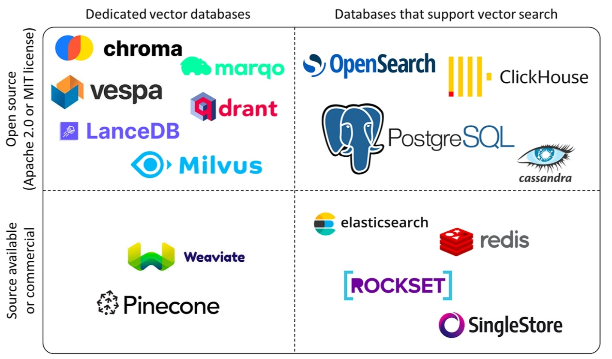

# 一、向量数据库

- [什么是向量](../AI/大模型.md#二向量-embedding)

## 1、什么是向量数据库

向量数据库是一种特殊的数据库，它具备数据存储和读取的基础能力，同时也有一个特殊的查询操作，即向量检索；

向量检索是通过向量的匹配来找到最相似的数据，而不仅仅是简单地查出一行数据；

向量数据库的核心思想是：将文本转换成向量，然后将向量存储在数据库中，当用户输入问题时，将问题转换成向量，然后在数据库中搜索最相似的向量和上下文，最后将文本返回给用户

## 2、相似性搜索

## 3、相似度算法

有三种常见的向量相似度算法：欧几里德距离、余弦相似度和点积相似度。

### 3.1、欧几里得距离（Euclidean Distance）

欧几里得距离是指两个向量之间的距离，它的计算公式为：

$$
d(\mathbf{A}, \mathbf{B}) = \sqrt{\sum_{i=1}^{n} (\mathbf{A}_i - \mathbf{B}_i)^2}
$$

其中，A 和 B 分别表示两个向量，n 表示向量的维度。

欧几里得距离算法的优点是可以反映向量的绝对距离，适用于需要考虑向量长度的相似性计算。例如推荐系统中，需要根据用户的历史行为来推荐相似的商品，这时就需要考虑用户的历史行为的数量，而不仅仅是用户的历史行为的相似度。

### 3.2、余弦相似度（Cosine Similarity）

余弦相似度是指两个向量之间的夹角余弦值，它的计算公式为：

$$
\cos(\theta) = \frac{\mathbf{A} \cdot \mathbf{B}}{\|\mathbf{A}\| \|\mathbf{B}\|}
$$

其中，A 和 B 分别表示两个向量，`⋅` 表示向量的点积，`∣A∣` 和 `∣B∣` 分别表示两个向量的模长。

余弦相似度对向量的长度不敏感，只关注向量的方向，因此适用于高维向量的相似性计算。例如语义搜索和文档分类。

### 3.3、点积相似度 (Dot product Similarity)

向量的点积相似度是指两个向量之间的点积值，它的计算公式为：

$$
\mathbf{A} \cdot \mathbf{B} = \sum_{i=1}^{n} A_i B_i
$$

其中，A 和 B 分别表示两个向量，n 表示向量的维度。

点积相似度算法的优点在于它简单易懂，计算速度快，并且兼顾了向量的长度和方向。它适用于许多实际场景，例如图像识别、语义搜索和文档分类等。但点积相似度算法对向量的长度敏感，因此在计算高维向量的相似性时可能会出现问题。

## 4、向量数据库选型

- 分布式部署
- 访问控制和备份
- API & SDK

## 主流的向量数据库



以下是几款主要开源高性能向量数据库的简要比较，基于 2025 年的最新基准测试和用户反馈：
* Milvus：在查询每秒（QPS）方面表现最佳，适合大规模向量相似性搜索，支持多种索引类型。
* Qdrant：以可扩展性和性能优化著称，适合大规模场景。
* Weaviate：提供良好的开发体验，性能均衡，适合需要同时处理向量和结构化数据的应用。
* Chroma：易于使用，适合原型设计和中小型应用。
* pgvector 和 pgvecto-rs：利用 PostgreSQL 的成熟性，适合已有 PostgreSQL 基础设施的用户。
* Opensearch 和 Elasticsearch：适合需要全文搜索和向量混合搜索的场景。
* Tidb_vector 和 Couchbase：适合需要分布式架构和多模型支持的应用。
* Myscale：适合分析型工作负载，支持向量搜索。

适用场景与建议
* 如果项目需要处理十亿级别的向量数据，Milvus 和 Qdrant 是首选。
* 对于需要 AI 原生功能和开发友好性的场景，Weaviate 和 Chroma 是一个不错的选择。
* 在可扩展性和分布式环境中有需求时，Opensearch、Tidb_vector 和 Elasticsearch 表现优异。
* 如果已有 PostgreSQL 基础设施，考虑使用 pgvector 或 pgvecto-rs，但注意在大规模场景下的性能限制。
* 对于 NoSQL 数据库和多模型支持，Couchbase 是一个轻量级选项。
* 新兴的 Myscale 适合高吞吐量分析型工作负载，特别适合 AI 开发者的快速原型设计

## 企业向量数据库要求

- 可扩展性：当数据量增加时，是否能通过增加节点来扩展系统的容量和计算能力
- 吞吐量：当请求量和数据量增加时，系统能否在短时间内处理更多的请求(QPS)
- 稳定性：当系统故障时，数据是否丢失，是否能备份和恢复，是否有监控和日志


# 二、Chroma

- [官方文档](https://www.trychroma.com/)

## 1、安装部署

```
pip install chromadb
```
服务端部署
```
chroma run --path ./data

Usage: chroma run [OPTIONS]                                                                                                                        
 Run a chroma server                                                                                                                                
╭─ Options ────────────────────────────────────────────────────────────────────────────────╮
│ --path            TEXT     The path to the file or directory. [default: ./chroma_data]   │
│ --host            TEXT     The host to listen to. Default: localhost [default: localhost]│
│ --log-path        TEXT     The path to the log file. [default: chroma.log]               │
│ --port            INTEGER  The port to run the server on. [default: 8000]                │
│ --help                     Show this message and exit.                                   │
╰──────────────────────────────────────────────────────────────────────────────────────────╯
```
客户端使用
```python
import chromadb
chroma_client = chromadb.HttpClient(host='localhost', port=8000)
# 直接使用
import chromadb
client = chromadb.Client()
client = chromadb.PersistentClient(path="./data")
```

# 三、Milvus

- [Milvus-官方文档](https://milvus.io/zh)

## 1、安装部署

- [官方安装文档](https://milvus.io/docs/zh/install-overview.md)

```bash
# 方式一
curl -sfL https://raw.githubusercontent.com/milvus-io/milvus/master/scripts/standalone_embed.sh -o standalone_embed.sh

bash standalone_embed.sh start
bash standalone_embed.sh stop
bash standalone_embed.sh delete

# 方式二
# 通过docker-compose
mkdir milvus_compose
cd milvus_compose
wget https://github.com/milvus-io/milvus/releases/download/v2.2.8/milvus-standalone-docker-compose.yml -O docker-compose.yml
 
sudo systemctl daemon-reload
sudo systemctl restart docker

# 启动服务
docker-compose up -d


# 安装 python接口库
pip install pymilvus
```

# 参考资料

- [什么是向量数据库](https://www.pinecone.io/learn/vector-database/)
- [向量数据库选型](https://zhuanlan.zhihu.com/p/27399676042)
- [向量数据库-原理和选型](https://guangzhengli.com/blog/zh/vector-database)